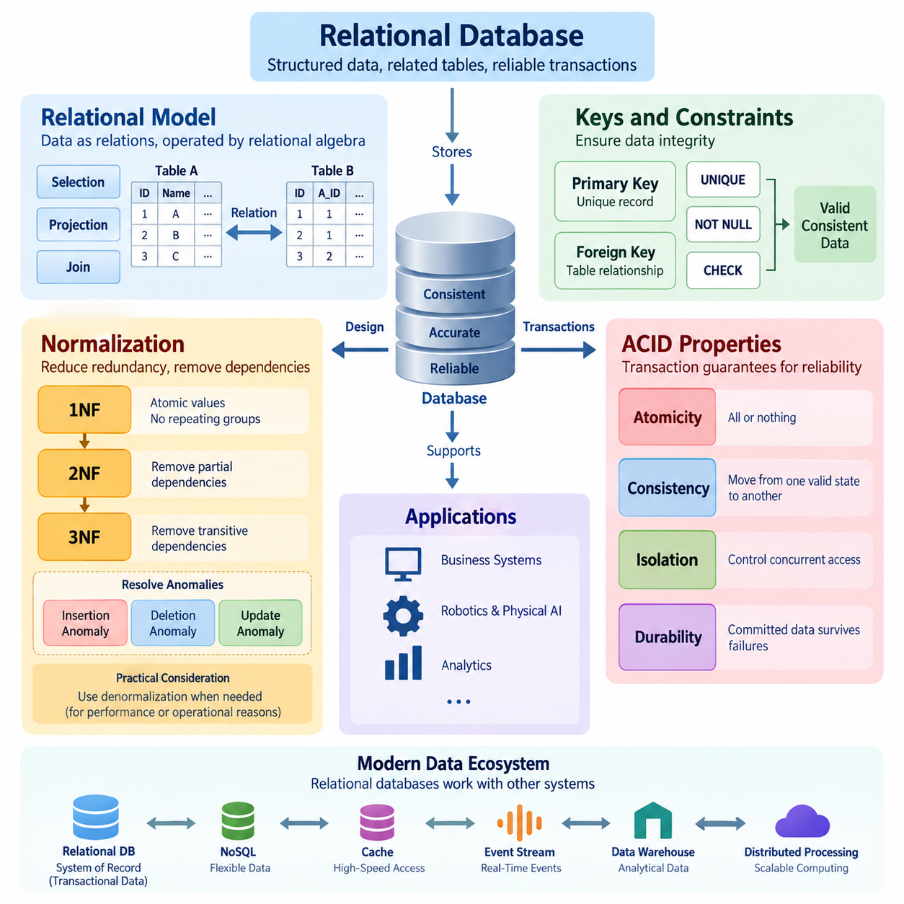
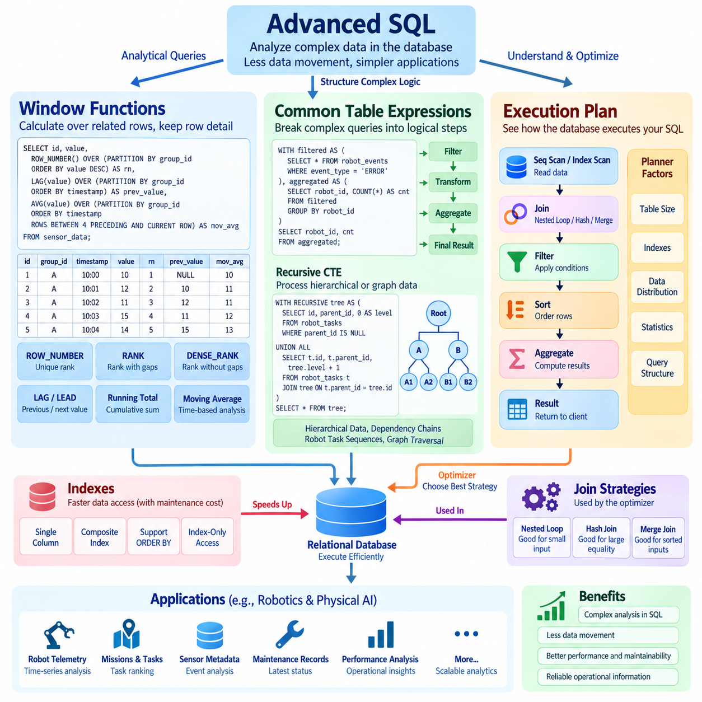
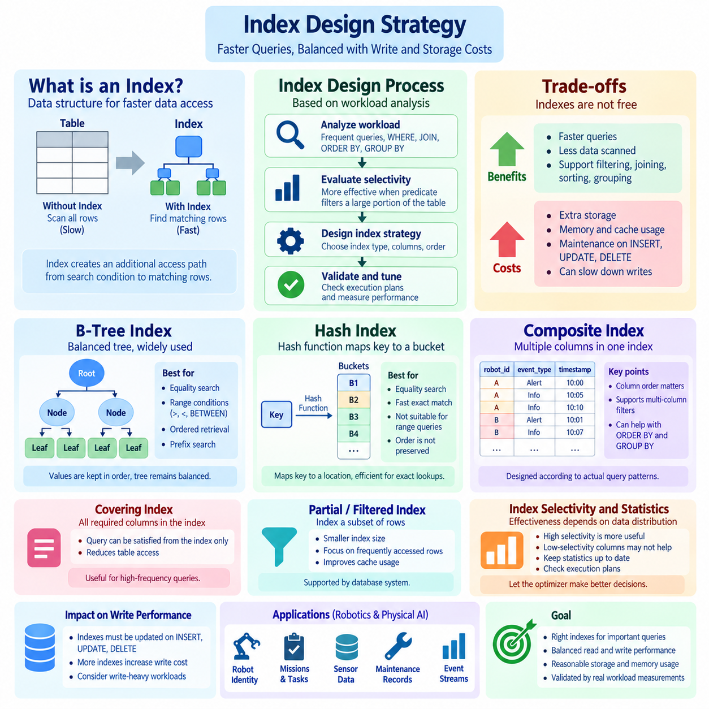
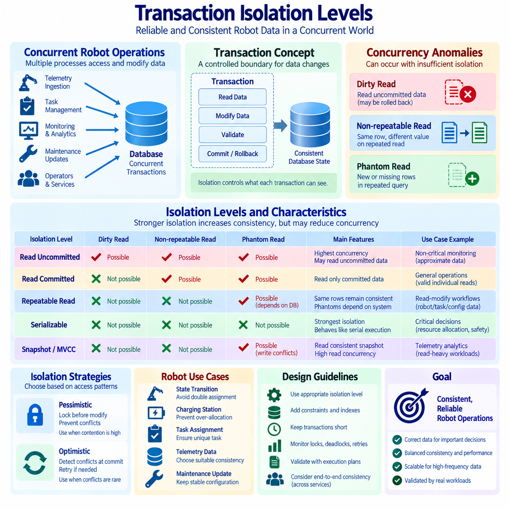
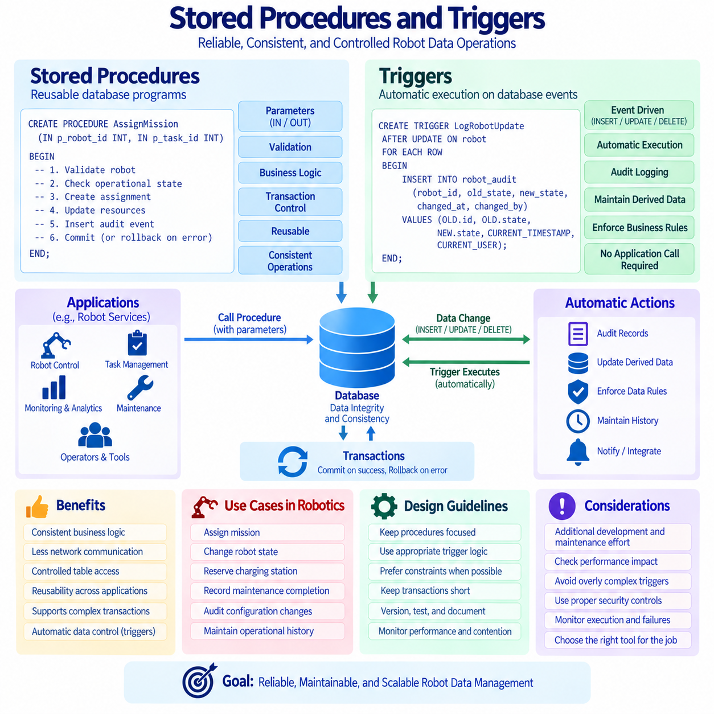
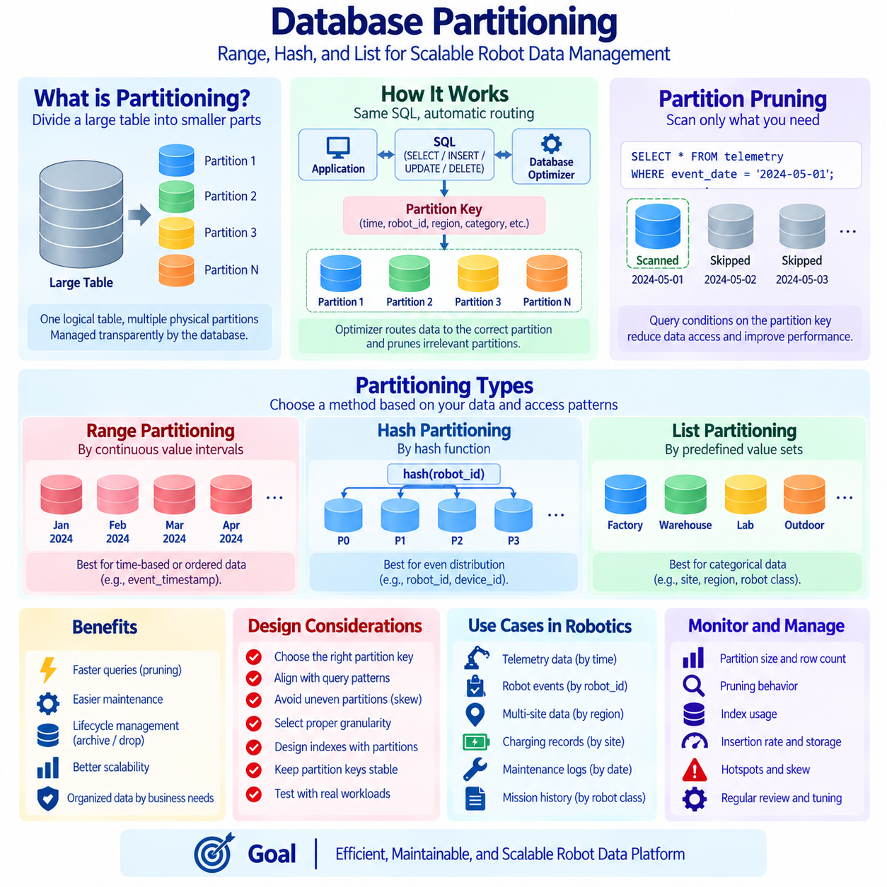
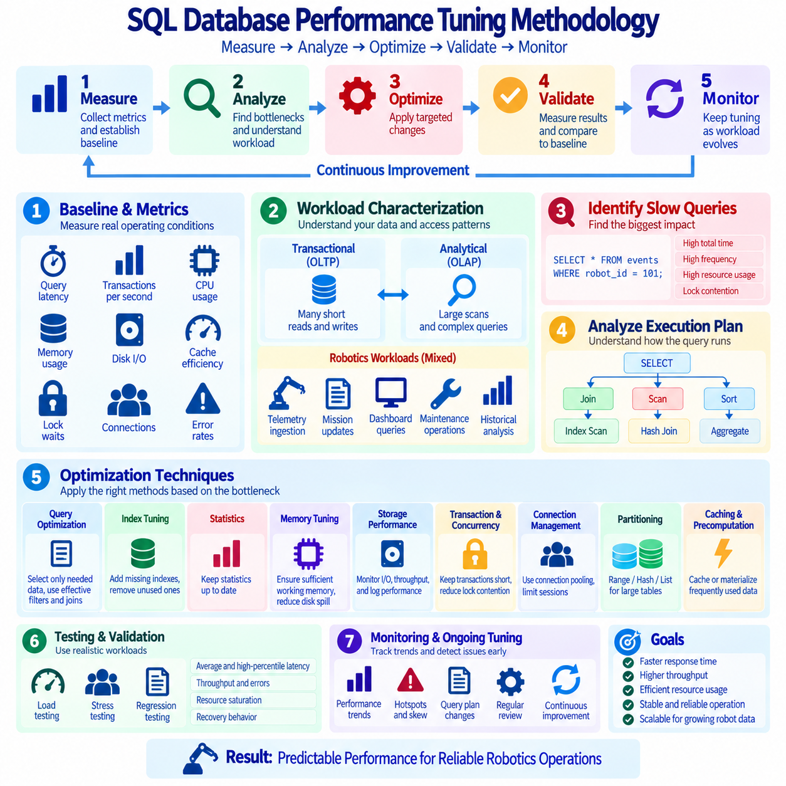
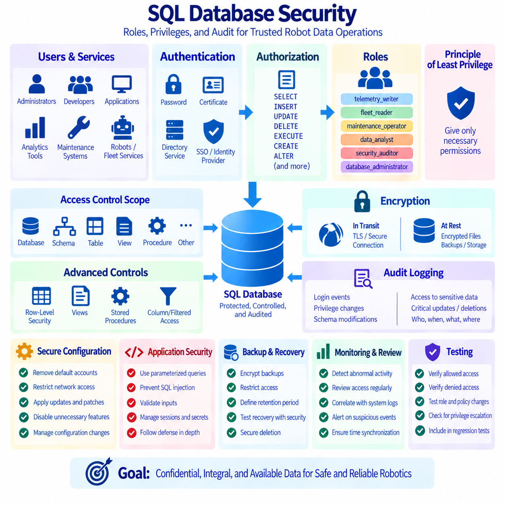
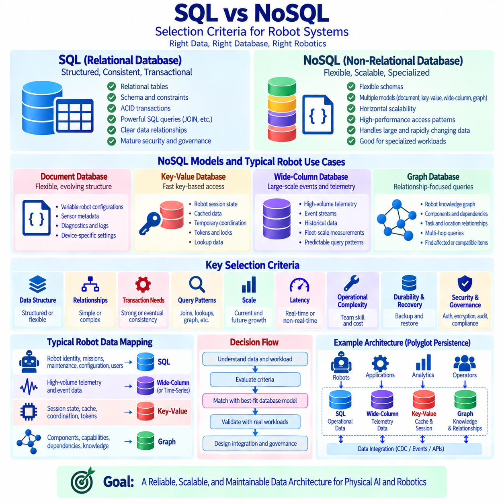
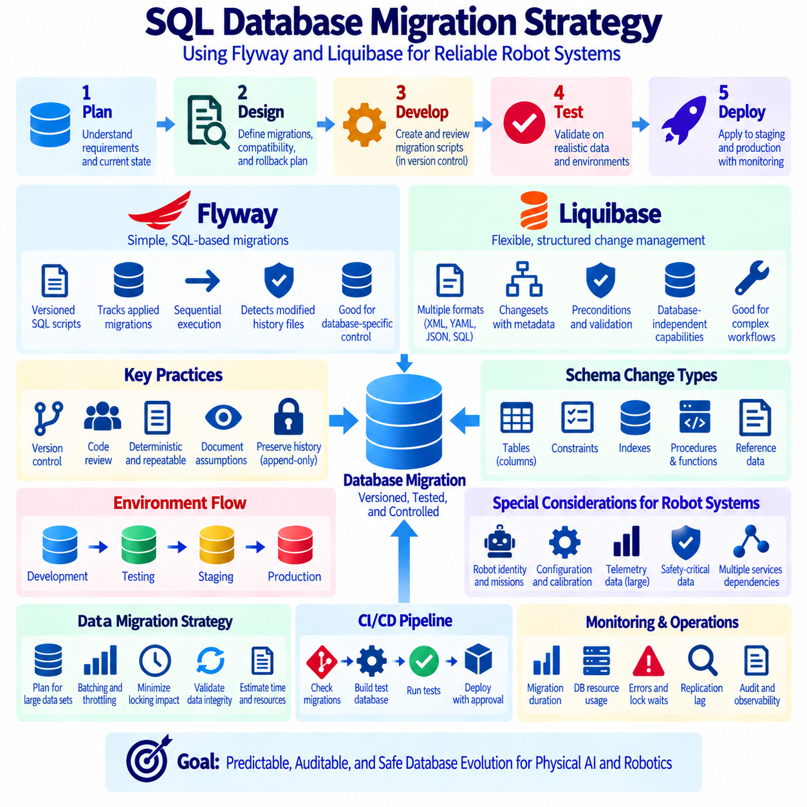

**Volume 08 Robot Database and Storage**


# 01. SQL Databases

##  

## 01.01 Relational DB Theory: Normalization / ACID

{width="7.268055555555556in" height="7.268055555555556in"}

A relational database organizes information into structured tables composed of rows and columns, while relationships between tables are represented through keys. The theoretical foundation comes from the relational model, in which data is treated as relations and operations are defined through concepts such as selection, projection, and joining. A primary key uniquely identifies each record, while foreign keys establish logical relationships between tables. This structure allows applications to retrieve and manipulate complex information while maintaining consistency and reducing unnecessary duplication.

A central principle of relational database design is data integrity. Integrity means that stored information remains accurate, valid, and logically consistent as records are inserted, updated, and deleted. Primary key constraints prevent duplicate or unidentified records, while foreign key constraints prevent relationships from pointing to nonexistent entities. Additional constraints such as UNIQUE, NOT NULL, and CHECK can express business rules directly within the database. By enforcing these rules at the data layer, a relational database can protect information even when multiple applications or users access the same data.

Normalization is a systematic method for organizing relational data so that unnecessary redundancy and undesirable dependencies are reduced. Without normalization, the same fact may be stored repeatedly in many records, creating inconsistencies when one copy is changed but another is not. Normalization analyzes functional dependencies between attributes and decomposes large tables into smaller, logically related relations. The goal is not simply to create as many tables as possible, but to represent each important fact in an appropriate place while preserving the ability to reconstruct meaningful information through relationships.

The first normal form, or 1NF, requires each attribute to contain atomic values and each record to represent a distinct logical occurrence. Repeating groups and lists stored inside a single field are therefore separated into appropriate rows or related tables. Second normal form, or 2NF, builds on 1NF and removes partial dependencies in tables with composite keys, ensuring that non-key attributes depend on the complete key rather than only part of it. Third normal form, or 3NF, further removes transitive dependencies so that non-key attributes depend directly on the key. These principles improve maintainability and reduce update anomalies.

Normalization addresses several common anomalies that appear in poorly designed schemas. An insertion anomaly occurs when a new fact cannot be recorded without also supplying unrelated information. A deletion anomaly occurs when removing one record unintentionally removes the only stored representation of another important fact. An update anomaly occurs when the same fact appears in multiple rows and changes must be applied consistently to every copy. Proper decomposition reduces these risks by separating independent facts into related tables. However, normalization must remain practical because excessive decomposition can increase query complexity and require additional joins.

Functional dependency provides an important theoretical basis for normalization. If the value of one attribute or a group of attributes uniquely determines another attribute, a dependency exists between them. For example, a customer identifier may determine a customer\'s name and contact information, while a product identifier may determine a product\'s description and price. Understanding these dependencies helps designers identify candidate keys, determine whether attributes are stored at the correct level, and detect structural problems in a schema. Database normalization therefore connects logical modeling with precise rules about how facts depend on one another.

Although normalization improves logical integrity, production systems sometimes introduce controlled denormalization for performance or operational reasons. A frequently accessed value may be duplicated to reduce expensive joins, or summary information may be materialized to accelerate analytical queries. Such duplication should be deliberate and governed by clear consistency mechanisms. Denormalization is therefore not a replacement for sound relational modeling. A practical design usually begins with a normalized representation and introduces selective redundancy only when measured workload characteristics demonstrate a meaningful performance or operational benefit.

ACID properties describe the transaction guarantees that make relational databases reliable for concurrent and failure-prone workloads. Atomicity means that a transaction is treated as an indivisible unit: either all required changes are committed or the transaction is rolled back. Consistency means that a successful transaction moves the database from one valid state to another while respecting defined constraints and rules. Isolation controls how concurrent transactions interact so that intermediate states do not create incorrect results. Durability means that once a transaction has been committed, its effects survive system failures according to the database\'s durability guarantees.

Atomicity is particularly important when a logical operation requires multiple physical changes. Consider a transfer between two accounts: subtracting money from one account and adding it to another must be treated as one transaction. If the first operation succeeds but the second fails, the database must be able to roll back the partial change. Transaction logs, recovery mechanisms, and commit protocols support this behavior. Atomicity therefore prevents partially completed business operations from becoming permanent database states and provides a foundation for reliable application behavior.

Consistency operates at the intersection of database rules and application transactions. Constraints such as primary keys, foreign keys, uniqueness requirements, and validation conditions define states that the database considers valid. A transaction must preserve those conditions when it commits. Consistency does not mean that every database automatically understands every business rule; application-level requirements may also need explicit validation. The important principle is that transaction processing should not leave persistent data in a state that violates the integrity guarantees defined for the system.

Isolation becomes essential when many users or processes access the same database simultaneously. Without appropriate isolation, transactions can observe or interfere with changes made by other transactions, potentially producing phenomena such as dirty reads, non-repeatable reads, or phantom reads. Relational database systems provide different isolation levels that balance correctness, concurrency, and performance. Stronger isolation can reduce certain concurrency anomalies but may increase locking, waiting, or resource consumption. Database designers therefore select an isolation strategy according to the consistency requirements and workload characteristics of each application.

Durability ensures that committed information remains available after events such as process crashes, operating-system failures, or hardware interruptions. Relational database systems commonly use transaction logs, write-ahead logging, checkpoints, recovery procedures, and persistent storage mechanisms to support this guarantee. Durability does not mean that data can never be lost under every possible failure scenario; its practical strength depends on the storage architecture, replication strategy, backup policy, and recovery configuration. A complete reliability design therefore combines transaction durability with backup, replication, monitoring, and disaster-recovery mechanisms.

Relational theory, normalization, and ACID transactions address different but interconnected layers of database reliability. Relational modeling defines how facts and relationships should be represented, normalization reduces structural redundancy and dependency problems, and constraints protect the validity of stored information. ACID transactions then provide controlled state transitions when multiple operations must occur together under concurrent access. Together, these principles form a foundation for transactional data systems in which correctness is treated as an architectural property rather than something left entirely to application code.

In modern systems, relational databases remain important even when architectures also incorporate NoSQL stores, caches, event streams, data warehouses, and distributed processing platforms. Transactional relational databases often serve as the authoritative source for highly structured operational information, while other systems handle specialized workloads. Understanding normalization and ACID principles makes it easier to determine where transactional guarantees are necessary and where different storage models may be appropriate. For Physical AI and robotics systems, this distinction is particularly useful because configuration, identity, calibration metadata, task state, equipment records, and operational events may require different combinations of consistency, scalability, and access patterns.

관계형 데이터베이스(Relational Database)는 행(row)과 열(column)로 구성된 구조화된 테이블(table)을 사용하여 정보를 구성하며, 테이블 간의 관계는 키(key)를 통해 표현됩니다. 이러한 이론적 기반은 관계형 모델(Relational Model)에 있으며, 데이터는 관계(relation)로 취급되고 선택(selection), 투영(projection), 조인(join)과 같은 개념을 통해 연산됩니다. 기본 키(Primary Key)는 각 레코드(record)를 고유하게 식별하고, 외래 키(Foreign Key)는 테이블 사이의 논리적 관계를 설정합니다. 이러한 구조를 통해 애플리케이션은 복잡한 정보를 검색하고 조작하면서도 불필요한 데이터 중복을 줄이고 데이터 일관성을 유지할 수 있습니다.

관계형 데이터베이스 설계에서 핵심적인 원칙 중 하나는 데이터 무결성(Data Integrity)입니다. 무결성이란 레코드가 삽입(insert), 수정(update), 삭제(delete)되는 과정에서도 저장된 정보가 정확하고 유효하며 논리적으로 일관된 상태를 유지하는 것을 의미합니다. 기본 키 제약조건(Primary Key Constraint)은 중복되거나 식별할 수 없는 레코드의 생성을 방지하며, 외래 키 제약조건(Foreign Key Constraint)은 존재하지 않는 엔터티(entity)를 참조하는 관계를 방지합니다. 또한 UNIQUE, NOT NULL, CHECK와 같은 추가 제약조건(Constraint)을 사용하면 비즈니스 규칙(Business Rule)을 데이터베이스 내부에 직접 표현할 수 있습니다. 이러한 규칙을 데이터 계층(Data Layer)에서 강제하면 여러 애플리케이션이나 사용자가 동시에 동일한 데이터를 접근하더라도 정보를 보호할 수 있습니다.

정규화(Normalization)는 불필요한 데이터 중복과 바람직하지 않은 종속성(dependency)을 줄이기 위해 관계형 데이터를 체계적으로 구성하는 방법입니다. 정규화되지 않은 구조에서는 동일한 사실이 여러 레코드에 반복적으로 저장될 수 있으며, 이 경우 한 사본은 변경되었지만 다른 사본은 변경되지 않는 데이터 불일치가 발생할 수 있습니다. 정규화는 속성(attribute) 사이의 함수적 종속성(Functional Dependency)을 분석하고, 하나의 큰 테이블을 논리적으로 연관된 여러 개의 작은 관계(relation)로 분해합니다. 정규화의 목적은 단순히 테이블의 개수를 늘리는 것이 아니라, 각각의 중요한 사실을 적절한 위치에 표현하면서 관계를 통해 의미 있는 정보를 다시 구성할 수 있도록 하는 것입니다.

제1정규형(First Normal Form, 1NF)은 각각의 속성이 원자값(atomic value)을 가져야 하며 각 레코드가 하나의 독립적인 논리적 발생을 나타내야 한다는 원칙입니다. 따라서 하나의 필드(field)에 반복되는 그룹이나 목록을 저장하는 대신 이를 적절한 행이나 관련 테이블로 분리합니다. 제2정규형(Second Normal Form, 2NF)은 1NF를 기반으로 하며, 복합 키(composite key)를 사용하는 테이블에서 부분 함수적 종속(partial dependency)을 제거합니다. 즉, 일반 속성(non-key attribute)이 복합 키의 일부가 아니라 전체 키에 종속되도록 합니다. 제3정규형(Third Normal Form, 3NF)은 한 단계 더 나아가 이행적 종속(transitive dependency)을 제거하여 일반 속성이 키에 직접 종속되도록 합니다. 이러한 원칙은 스키마(schema)의 유지보수성을 향상시키고 갱신 이상(update anomaly)의 발생을 줄입니다.

정규화는 잘못 설계된 스키마에서 발생할 수 있는 여러 가지 이상 현상(anomaly)을 해결하는 데 사용됩니다. 삽입 이상(Insertion Anomaly)은 관련 없는 추가 정보를 함께 입력하지 않으면 새로운 사실을 기록할 수 없는 상황을 의미합니다. 삭제 이상(Deletion Anomaly)은 하나의 레코드를 삭제하는 과정에서 다른 중요한 사실을 나타내는 유일한 데이터까지 의도하지 않게 삭제되는 상황입니다. 갱신 이상(Update Anomaly)은 동일한 사실이 여러 행에 반복되어 저장되어 있을 때 변경 사항을 모든 복사본에 일관되게 적용해야 하는 문제입니다. 적절한 테이블 분해(decomposition)는 독립적인 사실을 서로 관련된 테이블로 분리함으로써 이러한 위험을 줄입니다. 그러나 지나친 정규화는 쿼리(query)를 복잡하게 만들고 더 많은 조인(join)을 요구할 수 있으므로 실용적인 균형이 필요합니다.

함수적 종속성(Functional Dependency)은 정규화의 중요한 이론적 기반을 제공합니다. 하나의 속성 또는 여러 속성의 조합이 다른 속성의 값을 고유하게 결정한다면 두 속성 사이에 종속성이 존재한다고 볼 수 있습니다. 예를 들어 고객 식별자(customer identifier)는 고객의 이름과 연락처 정보를 결정할 수 있으며, 제품 식별자(product identifier)는 제품의 설명과 가격을 결정할 수 있습니다. 이러한 종속성을 이해하면 후보 키(candidate key)를 식별하고, 속성이 올바른 데이터 수준에 저장되어 있는지 판단하며, 스키마의 구조적 문제를 발견할 수 있습니다. 따라서 데이터베이스 정규화는 논리적 데이터 모델링(logical data modeling)과 사실들이 서로 어떻게 종속되는지를 정의하는 정확한 규칙을 연결합니다.

정규화는 논리적 무결성을 향상시키지만, 실제 운영 시스템에서는 성능이나 운영상의 이유로 통제된 비정규화(Denormalization)를 적용하기도 합니다. 자주 조회되는 값을 중복 저장하여 비용이 높은 조인을 줄이거나, 분석 쿼리의 속도를 높이기 위해 요약 정보를 미리 생성하여 저장할 수 있습니다. 이러한 데이터 중복은 의도적으로 수행되어야 하며 명확한 일관성 관리 메커니즘(consistency mechanism)에 의해 통제되어야 합니다. 따라서 비정규화는 건전한 관계형 모델링을 대체하는 방법이 아닙니다. 일반적으로 정규화된 구조에서 설계를 시작한 다음, 실제 워크로드(workload)의 특성을 측정하여 성능이나 운영 측면에서 의미 있는 이점이 확인되는 경우에만 선택적으로 중복성을 추가하는 방식이 적절합니다.

ACID 속성(ACID Properties)은 관계형 데이터베이스가 동시 접근과 장애가 발생할 수 있는 환경에서도 안정적으로 동작하도록 만드는 트랜잭션(transaction) 보장 원칙입니다. 원자성(Atomicity)은 하나의 트랜잭션이 분할할 수 없는 하나의 작업 단위로 처리되어야 한다는 의미이며, 필요한 변경 사항이 모두 커밋(commit)되거나 전체 트랜잭션이 롤백(rollback)되어야 합니다. 일관성(Consistency)은 성공적으로 완료된 트랜잭션이 데이터베이스를 하나의 유효한 상태에서 다른 유효한 상태로 이동시키면서 정의된 제약조건과 규칙을 준수하도록 하는 특성입니다. 격리성(Isolation)은 동시에 실행되는 트랜잭션이 서로 어떻게 상호작용하는지를 제어하여 중간 상태가 잘못된 결과를 발생시키지 않도록 합니다. 지속성(Durability)은 트랜잭션이 커밋된 이후 그 결과가 시스템 장애가 발생하더라도 데이터베이스에 유지되도록 하는 특성입니다.

원자성(Atomicity)은 하나의 논리적 작업이 여러 개의 실제 데이터 변경 작업을 필요로 할 때 특히 중요합니다. 예를 들어 계좌 간 송금(transaction)은 한 계좌에서 금액을 차감하고 다른 계좌에 동일한 금액을 추가하는 작업을 하나의 트랜잭션으로 처리해야 합니다. 첫 번째 작업은 성공했지만 두 번째 작업이 실패한다면 데이터베이스는 첫 번째 변경 사항을 롤백(rollback)할 수 있어야 합니다. 트랜잭션 로그(transaction log), 복구 메커니즘(recovery mechanism), 커밋 프로토콜(commit protocol) 등이 이러한 동작을 지원합니다. 따라서 원자성은 부분적으로만 완료된 비즈니스 작업이 영구적인 데이터베이스 상태로 남는 것을 방지하고 안정적인 애플리케이션 동작의 기반을 제공합니다.

일관성(Consistency)은 데이터베이스 규칙과 애플리케이션 트랜잭션이 만나는 지점에서 중요한 역할을 합니다. 기본 키, 외래 키, 고유성 요구사항, 검증 조건과 같은 제약조건은 데이터베이스가 유효하다고 판단하는 상태를 정의합니다. 트랜잭션은 커밋될 때 이러한 조건을 유지해야 합니다. 여기서 일관성이란 모든 데이터베이스가 모든 비즈니스 규칙을 자동으로 이해한다는 의미는 아닙니다. 애플리케이션 수준의 요구사항은 별도의 명시적인 검증을 필요로 할 수 있습니다. 중요한 원칙은 트랜잭션 처리가 시스템에 정의된 무결성 보장을 위반하는 상태를 영구적으로 남기지 않아야 한다는 것입니다.

격리성(Isolation)은 여러 사용자나 프로세스가 동시에 동일한 데이터베이스에 접근할 때 필수적입니다. 적절한 격리가 없다면 하나의 트랜잭션이 다른 트랜잭션이 수행 중인 변경 사항을 관찰하거나 서로 간섭할 수 있으며, 그 결과 더티 리드(Dirty Read), 반복 불가능 읽기(Non-repeatable Read), 팬텀 리드(Phantom Read)와 같은 동시성 문제가 발생할 수 있습니다. 관계형 데이터베이스 시스템은 정확성(correctness), 동시성(concurrency), 성능(performance)의 균형을 조정할 수 있도록 다양한 격리 수준(Isolation Level)을 제공합니다. 더 강한 격리 수준은 특정 동시성 이상을 줄일 수 있지만 잠금(locking), 대기(waiting), 리소스 사용량(resource consumption)을 증가시킬 수 있습니다. 따라서 데이터베이스 설계자는 애플리케이션의 일관성 요구사항과 워크로드 특성에 따라 적절한 격리 전략을 선택해야 합니다.

지속성(Durability)은 프로세스 충돌(process crash), 운영체제 장애(operating-system failure), 하드웨어 중단(hardware interruption)과 같은 사건이 발생한 이후에도 커밋된 정보가 유지되도록 합니다. 관계형 데이터베이스 시스템은 일반적으로 트랜잭션 로그(transaction log), WAL(Write-Ahead Logging), 체크포인트(checkpoint), 복구 절차(recovery procedure), 영구 저장장치(persistent storage) 등의 메커니즘을 사용하여 이러한 보장을 지원합니다. 지속성이 모든 종류의 장애에서 데이터 손실이 절대로 발생하지 않는다는 의미는 아닙니다. 실제 지속성의 수준은 저장장치 아키텍처, 복제 전략(replication strategy), 백업 정책(backup policy), 복구 구성(recovery configuration)에 따라 달라집니다. 따라서 완전한 안정성 설계는 트랜잭션 지속성과 함께 백업, 복제, 모니터링, 재해복구(disaster recovery) 체계를 함께 구성해야 합니다.

관계형 이론(Relational Theory), 정규화(Normalization), ACID 트랜잭션(ACID Transaction)은 서로 다른 계층에서 데이터베이스의 신뢰성을 다루지만 서로 밀접하게 연결되어 있습니다. 관계형 모델링(Relational Modeling)은 사실과 관계를 어떻게 표현해야 하는지를 정의하고, 정규화는 구조적인 중복과 종속성 문제를 줄이며, 제약조건(Constraint)은 저장된 데이터의 유효성을 보호합니다. ACID 트랜잭션은 동시에 여러 사용자가 접근하는 환경에서 여러 작업이 하나의 논리적 단위로 처리되어야 할 때 데이터 상태의 변경을 통제합니다. 이러한 원칙은 정확성(correctness)을 애플리케이션 코드에만 맡기지 않고 데이터 시스템의 아키텍처 자체에 포함시키는 트랜잭션 데이터 시스템의 기반을 형성합니다.

현대 시스템에서는 관계형 데이터베이스가 NoSQL 저장소(NoSQL Store), 캐시(Cache), 이벤트 스트림(Event Stream), 데이터 웨어하우스(Data Warehouse), 분산 처리 플랫폼(Distributed Processing Platform)과 함께 사용되는 경우가 많습니다. 트랜잭션 관계형 데이터베이스(Transactional Relational Database)는 고도로 구조화된 운영 데이터를 위한 신뢰할 수 있는 원천 시스템(System of Record) 역할을 수행하는 반면, 다른 시스템은 특정 목적에 최적화된 워크로드를 처리할 수 있습니다. 정규화와 ACID 원칙을 이해하면 어떤 데이터에 트랜잭션 보장이 필요한지, 그리고 어떤 데이터에는 다른 저장 모델이 적합한지를 판단하기가 쉬워집니다. 특히 Physical AI와 로봇 시스템에서는 구성 정보(configuration), 개체 식별(identity), 센서 및 장비 보정 정보(calibration metadata), 작업 상태(task state), 장비 기록(equipment records), 운영 이벤트(operational events) 등이 서로 다른 일관성, 확장성, 접근 패턴(access pattern)을 요구할 수 있기 때문에 이러한 구분이 더욱 중요합니다.

##  

## 01.02 Advanced SQL: Window Functions, CTE, Execution Plan [w/Code]

{width="7.268055555555556in" height="7.268055555555556in"}

Advanced SQL extends the basic capabilities of relational databases by allowing complex analytical logic to be expressed directly within queries. Instead of retrieving raw records and performing all calculations in application code, SQL can perform ranking, aggregation, comparison, filtering, recursive traversal, and multi-stage transformations close to the data. This approach can reduce data movement and simplify application logic. However, advanced SQL also requires an understanding of how query structure, intermediate results, indexes, joins, and execution strategies affect both correctness and performance.

Window functions are one of the most important features for analytical SQL. Unlike traditional aggregate functions, which normally reduce multiple rows into a single result row, window functions calculate values across a defined set of related rows while preserving the original row structure. A window is specified using the OVER clause and can contain PARTITION BY and ORDER BY expressions. This allows a query to calculate rankings, running totals, moving averages, sequential differences, and other contextual metrics without collapsing individual records.

Ranking functions illustrate the practical value of window functions. Functions such as ROW_NUMBER, RANK, and DENSE_RANK assign positions to rows according to an ordering rule, but they behave differently when multiple rows have equal values. ROW_NUMBER assigns a unique sequential number, while RANK can leave gaps after ties and DENSE_RANK does not. Choosing the correct function depends on the intended business meaning. In robotics or operational data, these functions can be used to identify the highest-performing tasks, prioritize events, compare robot performance, or select the most recent record for each device.

Window functions can also perform calculations across time or sequence. LAG and LEAD access values from previous or subsequent rows within an ordered window, making them useful for calculating changes between observations. A sensor dataset, for example, may contain timestamped measurements for each robot, and LAG can compare the current measurement with the previous observation without requiring a self-join. Running totals and moving averages can similarly be expressed using aggregate functions combined with an appropriate window frame. This makes temporal and sequential analysis considerably more concise.

Common Table Expressions, or CTEs, provide a structured way to divide a complicated SQL statement into logical stages. A CTE is introduced with the WITH clause and can be referenced by the query that follows it. Instead of constructing one extremely long nested query, developers can separate filtering, joining, aggregation, and transformation into named intermediate steps. This can improve readability, testing, and maintenance. A CTE does not automatically guarantee better performance, because the database optimizer may inline or materialize it depending on the database system and execution strategy.

Recursive CTEs extend this concept to hierarchical and graph-like data. A recursive CTE contains an initial query, called the anchor member, followed by a recursive member that repeatedly derives additional rows from previously generated results. This structure is useful for organizational hierarchies, dependency chains, filesystem-like structures, robot task sequences, and graph traversal. Recursive queries must be designed carefully because an incorrect termination condition can generate excessive intermediate results or continue until a database-specific recursion limit is reached. The logical clarity of recursion should therefore be balanced with workload size and execution cost.

Advanced SQL often combines CTEs and window functions to construct multi-stage analytical pipelines. A query may first identify a relevant subset of records, then calculate metrics within each group, rank the results, and finally select the desired rows. For example, a system may partition robot telemetry by robot identifier, order observations by timestamp, calculate previous-state differences, aggregate abnormal events, and rank robots by operational impact. This approach allows complex analysis to remain within the database while preserving a logical sequence that can be inspected and validated.

The execution plan explains how a database intends to execute a SQL statement. Although SQL describes what result is required rather than explicitly specifying every physical operation, the database optimizer chooses an execution strategy involving operations such as sequential scans, index scans, joins, sorting, aggregation, filtering, and data access. An execution plan therefore provides a bridge between logical SQL and physical database behavior. Understanding the plan is essential when a query that appears simple becomes unexpectedly slow as the volume of data increases.

Join strategy is often a major factor in query performance. Relational database systems may use nested-loop joins, hash joins, merge joins, or other strategies depending on table size, available indexes, ordering, estimated cardinality, and optimizer statistics. A nested-loop join can be efficient when one input is small and the other can be accessed efficiently through an index, while hash joins can be effective for larger equality-based joins. Merge joins can be useful when both inputs are already appropriately ordered. The important principle is that the optimal strategy depends on the actual data distribution and workload rather than on a universally preferred join type.

Indexes can substantially improve query performance, but they also introduce storage and maintenance costs. An index can allow a database to locate relevant rows without scanning an entire table, particularly when filtering or joining on selective columns. Composite indexes can support queries involving multiple columns, but their effectiveness depends on column order and query predicates. Indexes may also help ORDER BY operations or support index-only access in some situations. Excessive indexing, however, can slow INSERT, UPDATE, and DELETE operations because index structures must also be maintained.

Execution plans should be interpreted together with actual workload measurements rather than treated as theoretical diagrams. Estimated row counts, actual row counts, execution time, memory consumption, sorting operations, and disk access can reveal where a query spends its resources. A significant difference between estimated and actual cardinality may indicate outdated or insufficient statistics, unusual data distribution, or a query pattern that is difficult for the optimizer to estimate accurately. Query optimization should therefore follow a measurement-driven process: identify the expensive operation, understand its cause, test a targeted change, and compare the resulting execution behavior.

Advanced SQL is particularly valuable when analytical processing must remain close to operational data. In Physical AI and robotics environments, relational databases may store robot identities, missions, task states, sensor metadata, calibration information, maintenance records, and event histories. Window functions can analyze temporal behavior, CTEs can organize multi-stage transformations, and execution plans can help maintain acceptable performance as operational records grow. Used together, these techniques provide a powerful foundation for transforming structured robot data into reliable operational information without unnecessarily transferring large datasets to external application layers.

고급 SQL(Advanced SQL)은 복잡한 분석 로직을 쿼리(query) 내부에서 직접 표현할 수 있도록 관계형 데이터베이스(Relational Database)의 기본 기능을 확장합니다. 원시 레코드를 조회한 후 모든 계산을 애플리케이션 코드에서 수행하는 대신, SQL은 데이터에 가까운 위치에서 순위 계산, 집계, 비교, 필터링, 재귀적 탐색, 다단계 변환 등을 수행할 수 있습니다. 이러한 방식은 데이터 이동을 줄이고 애플리케이션 로직을 단순화할 수 있습니다. 그러나 고급 SQL을 효과적으로 사용하려면 쿼리 구조, 중간 결과, 인덱스(index), 조인(join), 실행 전략(execution strategy)이 정확성과 성능에 어떤 영향을 미치는지 이해해야 합니다.

윈도우 함수(Window Function)는 분석용 SQL에서 가장 중요한 기능 중 하나입니다. 여러 행을 일반적으로 하나의 결과 행으로 축소하는 기존 집계 함수(aggregate function)와 달리, 윈도우 함수는 원래의 행 구조를 유지하면서 관련된 행들의 집합을 기준으로 값을 계산합니다. 윈도우는 OVER 절(OVER clause)을 사용하여 정의하며, PARTITION BY와 ORDER BY 표현식을 포함할 수 있습니다. 이를 통해 개별 레코드를 하나로 합치지 않고 순위, 누적 합계, 이동 평균, 순차적 차이 및 기타 문맥 기반 지표를 계산할 수 있습니다.

순위 함수(Ranking Function)는 윈도우 함수의 실용적인 가치를 잘 보여줍니다. ROW_NUMBER, RANK, DENSE_RANK와 같은 함수는 정렬 규칙에 따라 행에 순위를 부여하지만, 동일한 값이 여러 개 존재하는 경우 서로 다르게 동작합니다. ROW_NUMBER는 각각의 행에 고유한 순차 번호를 부여하는 반면, RANK는 동점(tie) 이후에 순위의 공백이 발생할 수 있으며, DENSE_RANK는 이러한 공백을 만들지 않습니다. 어떤 함수를 선택할지는 해당 순위가 표현하려는 비즈니스 의미에 따라 결정해야 합니다. 로보틱스 또는 운영 데이터에서는 이러한 함수를 사용하여 가장 높은 성능을 보이는 작업을 식별하거나, 이벤트의 우선순위를 정하거나, 로봇 성능을 비교하거나, 각 장치의 가장 최근 레코드를 선택할 수 있습니다.

윈도우 함수는 시간이나 순서를 기준으로 한 계산도 수행할 수 있습니다. LAG와 LEAD는 정렬된 윈도우 내에서 이전 또는 다음 행의 값을 가져오므로 관측값 사이의 변화를 계산하는 데 유용합니다. 예를 들어 센서 데이터셋(sensor dataset)에 각 로봇의 타임스탬프(timestamp)가 포함된 측정값이 저장되어 있다면, LAG를 사용하여 셀프 조인(self-join)을 수행하지 않고 현재 측정값과 이전 관측값을 비교할 수 있습니다. 누적 합계(running total)와 이동 평균(moving average) 역시 적절한 윈도우 프레임(window frame)과 집계 함수를 결합하여 표현할 수 있습니다. 따라서 시간 기반 및 순차적 분석을 훨씬 간결하게 수행할 수 있습니다.

공통 테이블 표현식(Common Table Expression, CTE)은 복잡한 SQL 문을 논리적인 단계로 나누어 구성할 수 있는 방법을 제공합니다. CTE는 WITH 절(WITH clause)을 사용하여 정의되며 이후의 쿼리에서 참조할 수 있습니다. 하나의 지나치게 긴 중첩 쿼리를 작성하는 대신 필터링, 조인, 집계, 변환과 같은 작업을 이름이 지정된 중간 단계로 분리할 수 있습니다. 이를 통해 가독성, 테스트 가능성, 유지보수성을 향상시킬 수 있습니다. 그러나 CTE를 사용한다고 해서 항상 성능이 향상되는 것은 아닙니다. 데이터베이스 시스템과 실행 전략에 따라 옵티마이저(optimizer)가 CTE를 인라인(inline) 처리하거나 물리적으로 저장(materialize)할 수 있기 때문입니다.

재귀 CTE(Recursive CTE)는 이러한 개념을 계층적 데이터와 그래프 형태의 데이터까지 확장합니다. 재귀 CTE는 앵커 멤버(anchor member)라고 하는 초기 쿼리와, 이전 단계에서 생성된 결과를 기반으로 추가 행을 반복적으로 생성하는 재귀 멤버(recursive member)로 구성됩니다. 이러한 구조는 조직 계층, 의존성 체인(dependency chain), 파일시스템과 유사한 구조, 로봇 작업 순서, 그래프 탐색(graph traversal) 등에 유용합니다. 재귀 쿼리는 종료 조건(termination condition)이 잘못 설정될 경우 지나치게 많은 중간 결과를 생성하거나 데이터베이스 시스템에서 정의한 재귀 한계까지 계속 실행될 수 있으므로 신중하게 설계해야 합니다. 따라서 재귀의 논리적 명확성과 실제 워크로드 크기 및 실행 비용 사이의 균형이 필요합니다.

고급 SQL은 CTE와 윈도우 함수를 결합하여 다단계 분석 파이프라인(analytical pipeline)을 구성할 수 있습니다. 하나의 쿼리에서 먼저 필요한 레코드의 부분집합을 선택하고, 각 그룹 내에서 지표를 계산한 다음 결과의 순위를 지정하고, 마지막으로 원하는 행을 선택할 수 있습니다. 예를 들어 시스템은 로봇 식별자(robot identifier)별로 텔레메트리(telemetry)를 분할하고, 타임스탬프를 기준으로 관측값을 정렬한 후 이전 상태와의 차이를 계산하고, 비정상 이벤트를 집계하며, 운영 영향도에 따라 로봇의 순위를 지정할 수 있습니다. 이러한 방식은 복잡한 분석을 데이터베이스 내부에서 수행하면서도 검증 가능한 논리적 처리 순서를 유지할 수 있게 합니다.

실행 계획(Execution Plan)은 데이터베이스가 SQL 문을 실제로 어떻게 실행하려고 하는지를 설명합니다. SQL은 필요한 결과가 무엇인지를 표현하며 모든 물리적 작업을 직접 지정하지 않지만, 데이터베이스 옵티마이저(Database Optimizer)는 순차 스캔(sequential scan), 인덱스 스캔(index scan), 조인(join), 정렬(sort), 집계(aggregation), 필터링(filtering), 데이터 접근(data access)과 같은 작업을 조합하여 실행 전략을 선택합니다. 따라서 실행 계획은 논리적인 SQL과 실제 데이터베이스 동작 사이를 연결하는 역할을 합니다. 데이터의 양이 증가하면서 단순해 보이는 쿼리가 예상보다 느려지는 상황에서는 실행 계획을 이해하는 것이 특히 중요합니다.

조인 전략(Join Strategy)은 쿼리 성능을 결정하는 주요 요소인 경우가 많습니다. 관계형 데이터베이스 시스템은 테이블의 크기, 사용 가능한 인덱스, 정렬 상태, 예상 카디널리티(cardinality), 옵티마이저 통계(statistics) 등을 고려하여 중첩 루프 조인(nested-loop join), 해시 조인(hash join), 병합 조인(merge join) 또는 다른 전략을 선택할 수 있습니다. 중첩 루프 조인은 하나의 입력이 작고 다른 입력에 인덱스를 통해 효율적으로 접근할 수 있을 때 효과적일 수 있으며, 해시 조인은 대규모 동등 조건(equality-based) 조인에 효과적인 경우가 많습니다. 병합 조인은 두 입력이 적절한 순서로 이미 정렬되어 있을 때 유용할 수 있습니다. 중요한 원칙은 특정 조인 방식이 항상 최적이라는 것이 아니라 실제 데이터 분포와 워크로드에 따라 최적의 전략이 달라진다는 것입니다.

인덱스(Index)는 쿼리 성능을 크게 향상시킬 수 있지만 저장 공간과 유지보수 비용도 발생시킵니다. 인덱스를 사용하면 특히 선택도가 높은(selective) 조건으로 데이터를 필터링하거나 조인할 때 전체 테이블을 스캔하지 않고 필요한 행을 찾을 수 있습니다. 복합 인덱스(Composite Index)는 여러 컬럼을 사용하는 쿼리를 지원할 수 있지만, 그 효과는 컬럼의 순서와 쿼리 조건에 따라 달라집니다. 일부 상황에서는 인덱스가 ORDER BY 연산을 지원하거나 인덱스 전용 접근(index-only access)을 가능하게 할 수도 있습니다. 그러나 인덱스를 지나치게 많이 생성하면 INSERT, UPDATE, DELETE 작업마다 인덱스 구조도 함께 유지해야 하므로 쓰기 성능이 저하될 수 있습니다.

실행 계획은 이론적인 구조로만 해석하지 말고 실제 워크로드 측정 결과와 함께 분석해야 합니다. 예상 행 수(estimated row count), 실제 행 수(actual row count), 실행 시간(execution time), 메모리 사용량(memory consumption), 정렬 작업(sort operation), 디스크 접근(disk access) 등을 확인하면 쿼리가 어떤 부분에서 리소스를 소비하는지 파악할 수 있습니다. 예상 카디널리티와 실제 카디널리티 사이에 큰 차이가 있다면 오래되었거나 충분하지 않은 통계, 특이한 데이터 분포, 또는 옵티마이저가 정확하게 추정하기 어려운 쿼리 패턴이 원인일 수 있습니다. 따라서 쿼리 최적화(Query Optimization)는 측정 기반 프로세스로 수행하는 것이 적절합니다. 즉, 비용이 큰 작업을 식별하고 원인을 이해한 다음, 특정 변경을 적용하고 실행 결과를 비교하는 방식입니다.

고급 SQL은 분석 처리를 운영 데이터에 가까운 위치에서 수행해야 할 때 특히 유용합니다. Physical AI와 로봇 환경에서는 관계형 데이터베이스에 로봇 식별 정보(robot identity), 임무(mission), 작업 상태(task state), 센서 메타데이터(sensor metadata), 보정 정보(calibration information), 유지보수 기록(maintenance record), 이벤트 이력(event history) 등이 저장될 수 있습니다. 윈도우 함수는 시간적 행동을 분석하고, CTE는 다단계 변환을 구성하며, 실행 계획은 운영 데이터가 증가하더라도 적절한 성능을 유지하는 데 도움을 줄 수 있습니다. 이러한 기술을 함께 활용하면 대규모 데이터를 외부 애플리케이션 계층으로 불필요하게 이동시키지 않으면서 구조화된 로봇 데이터를 신뢰할 수 있는 운영 정보로 변환할 수 있습니다.

##  

## 01.03 Index Design Strategy: BTree, Hash, Composite [w/Code]

{width="7.268055555555556in" height="7.268055555555556in"}

An index is a data structure that helps a relational database locate rows more efficiently without scanning every record in a table. Conceptually, an index creates an additional access path from a search condition to the physical or logical locations of matching rows. This can dramatically reduce the amount of data that must be examined, especially when a table contains millions or billions of records. However, an index is not free. It requires storage, consumes memory and cache capacity, and must be maintained whenever indexed data is inserted, updated, or deleted. Effective index design therefore requires balancing read performance against write and storage costs.

Index design should begin with workload analysis rather than with the assumption that every frequently accessed column needs an index. The important questions are which queries are executed frequently, which columns appear in WHERE conditions, which columns are used for JOIN operations, and which columns participate in ORDER BY or GROUP BY operations. Selectivity is also important because an index is generally more useful when a predicate eliminates a large proportion of the table. A column containing only a few distinct values may provide limited benefit for many queries, while a highly selective identifier can make an index extremely effective. Actual execution plans and workload measurements should guide final decisions.

The B-Tree, or balanced tree, is one of the most widely used index structures in relational database systems. A B-Tree organizes indexed values in a hierarchy of nodes so that searches can navigate from the root toward the relevant leaf entries. The tree remains approximately balanced as values are inserted and removed, keeping lookup depth relatively small even as the index grows. B-Tree indexes are particularly suitable for equality comparisons as well as range conditions such as greater-than, less-than, and BETWEEN. They can also support ordered retrieval efficiently because neighboring values are maintained in an ordered structure.

B-Tree indexes are especially valuable when a query needs both filtering and ordering. If an index matches the required column order, the database may be able to retrieve rows in the desired sequence without performing a separate large sort operation. This can reduce CPU usage, memory consumption, and temporary storage requirements. B-Trees can also support prefix-based searches in many database systems when the search condition is compatible with the index ordering. However, the usefulness of an index depends on the query predicate, data distribution, and optimizer decisions. Creating an index with the correct structure does not guarantee that the optimizer will always choose it.

Hash indexes use a different principle. Instead of maintaining values in sorted order, a hash function maps an indexed key to a location or bucket where matching entries can be found. This makes hash-based access naturally suited to equality searches such as finding a record where an identifier exactly matches a specified value. Because hash structures do not preserve the ordering of indexed values, they are generally unsuitable for range queries and operations that require ordered traversal. Their practical behavior also depends strongly on the database implementation, collision handling, memory architecture, and workload characteristics.

The distinction between B-Tree and Hash indexes should therefore be understood in terms of access patterns rather than simple claims about which structure is faster. A query that repeatedly searches for an exact identifier may benefit from hash-oriented access, while a workload that performs both equality and range searches can be better served by a B-Tree. B-Trees also provide a natural foundation for ordered retrieval and many forms of prefix access. In production systems, the database engine\'s supported index types and optimizer behavior must be considered because implementation details differ between database platforms.

Composite indexes contain multiple columns within a single index structure and are essential for workloads that frequently filter or sort using combinations of attributes. For example, a robotics event table might contain robot_id, event_type, and timestamp. A composite index on robot_id and timestamp can efficiently support queries that retrieve the events of one robot within a particular time interval. The order of columns in a composite index matters because the database generally benefits most from the leading columns of the index. Therefore, index column order should be designed according to actual query patterns rather than simply following the order in which columns appear in the table.

The leading-column principle is particularly important when designing composite indexes. Suppose an index is defined on customer_id, status, and created_at. Queries that filter by customer_id can potentially use the index efficiently, and queries that filter by customer_id and status can often use an even larger portion of the index. However, a query that filters only by status may receive little or no benefit from that index because status is not the leading column. This does not mean that every possible column order should receive its own index. Multiple overlapping indexes increase storage and write costs, so designers should identify a small set of index structures that efficiently support the most important query patterns.

Composite indexes can also support ORDER BY and GROUP BY operations when their column order is compatible with the required result ordering. For example, an index beginning with robot_id followed by timestamp can support queries that retrieve records for each robot in chronological order. This can reduce the need for expensive sorting operations and may allow the database to stop scanning once a required subset has been obtained. Nevertheless, the optimizer evaluates the complete query, including filters, estimated cardinality, table size, and available alternatives. Index design should therefore consider filtering, joining, ordering, and grouping together rather than optimizing only one SQL clause.

Covering indexes provide another important optimization strategy. An index is considered covering for a query when it contains all the columns required to satisfy that query, either for filtering, joining, or returning the requested values. In such a situation, the database may be able to obtain the result directly from the index without accessing the underlying table for every matching row. This can significantly reduce random data access for suitable workloads. However, adding many output columns to an index increases its size and maintenance cost. Covering indexes are therefore most appropriate for carefully selected high-frequency queries where the performance benefit justifies the additional storage and update overhead.

Partial or filtered indexing can reduce index size when only a subset of records is frequently accessed, depending on the capabilities of the database system. For example, an operational table may contain millions of historical events but only a small number of records representing active or unresolved events. An index focused on that subset can be substantially smaller than an index covering the entire table. This can improve cache utilization and reduce maintenance overhead. The exact syntax and behavior vary across database systems, so the strategy should be designed according to the capabilities of the selected database engine and validated with actual execution plans.

Index selectivity and data distribution must be evaluated carefully. An index on a column with highly repetitive values may not provide enough filtering power to justify an index scan, particularly when a large percentage of the table matches the condition. In contrast, an index on a unique or nearly unique identifier can reduce the candidate set dramatically. The optimizer estimates these characteristics using statistics and other metadata. If statistics are outdated or inaccurate, the optimizer may select an inefficient access path. Regular statistics maintenance and execution-plan analysis are therefore important parts of long-term index management.

Indexes also affect write performance because every modification to indexed columns may require changes to one or more index structures. INSERT operations may add new index entries, while UPDATE operations can require existing entries to be removed and recreated when indexed values change. DELETE operations must remove corresponding entries. A table with many indexes can therefore become significantly more expensive to modify than a table with only a few carefully selected indexes. This trade-off is especially important for high-frequency telemetry or event ingestion systems, where data may arrive continuously and write throughput can be as important as query latency.

Index design should also account for physical storage and memory behavior. Large indexes consume disk space and can occupy substantial portions of the database cache. When frequently accessed index pages remain in memory, queries may execute much faster than when the same pages must repeatedly be read from storage. Conversely, excessive indexes can compete with table data and other working sets for limited memory. Index size, page organization, storage characteristics, and cache behavior therefore influence real-world performance. A theoretically efficient index may provide little benefit if its working set is too large for the available infrastructure.

The effectiveness of an index should ultimately be validated through execution plans and measured workload performance. A useful process begins by identifying a slow or high-value query, examining its execution plan, and determining whether the database is scanning excessive data, performing an expensive sort, or selecting an inefficient join strategy. A candidate index can then be introduced and the same workload measured again. The comparison should consider execution time, logical reads, physical reads, CPU consumption, memory usage, and write overhead where relevant. Index tuning should be treated as an iterative engineering process rather than a one-time schema decision.

For Physical AI and robotics systems, index strategy becomes increasingly important as operational datasets grow. Robot identities, missions, task states, sensor measurements, calibration records, maintenance histories, and event streams can produce large volumes of structured data. An index on robot_id and timestamp may support rapid retrieval of a robot\'s recent telemetry, while another index on task status and updated_at may support operational monitoring. Unique indexes can protect identity constraints, and carefully designed composite indexes can accelerate queries combining robot, task, state, and time conditions. The appropriate design should follow actual access patterns rather than assuming that every sensor or metadata field requires its own index.

A mature index strategy therefore treats indexes as workload-specific infrastructure rather than as automatic performance improvements. B-Tree indexes provide flexible support for equality, range, ordering, and many composite access patterns, while Hash indexes can be appropriate for specific equality-oriented workloads where supported effectively by the database engine. Composite indexes extend these capabilities by aligning multiple query conditions within one access path, but their column order must reflect real usage. The final objective is not to maximize the number of indexes, but to create a controlled set of access paths that improves important queries while keeping storage, memory, maintenance, and write costs within acceptable operational limits.

인덱스(Index)는 관계형 데이터베이스(Relational Database)가 테이블의 모든 레코드를 검색하지 않고도 행(row)을 보다 효율적으로 찾을 수 있도록 지원하는 데이터 구조(Data Structure)입니다. 개념적으로 인덱스는 검색 조건에서 일치하는 행의 물리적 또는 논리적 위치로 연결되는 추가적인 접근 경로(access path)를 생성합니다. 테이블에 수백만 또는 수십억 개의 레코드가 포함되어 있는 경우 특히 검사해야 하는 데이터의 양을 크게 줄일 수 있습니다. 그러나 인덱스는 무료가 아닙니다. 저장 공간을 필요로 하고 메모리와 캐시 용량을 사용하며, 인덱싱된 데이터가 삽입(insert), 수정(update), 삭제(delete)될 때마다 유지관리되어야 합니다. 따라서 효과적인 인덱스 설계는 읽기 성능과 쓰기 및 저장 비용 사이의 균형을 고려해야 합니다.

인덱스 설계는 자주 접근되는 모든 컬럼(column)에 인덱스가 필요하다고 가정하기보다 워크로드(workload) 분석에서 시작해야 합니다. 중요한 질문은 어떤 쿼리(query)가 자주 실행되는지, 어떤 컬럼이 WHERE 조건에 사용되는지, 어떤 컬럼이 JOIN 연산에 사용되는지, 그리고 어떤 컬럼이 ORDER BY 또는 GROUP BY 연산에 사용되는지입니다. 선택도(selectivity) 역시 중요합니다. 일반적으로 인덱스는 조건에 의해 테이블의 상당 부분을 제거할 수 있을 때 더 유용합니다. 고유한 값이 몇 개밖에 없는 컬럼은 많은 쿼리에서 제한적인 이점만 제공할 수 있는 반면, 선택도가 높은 식별자(identifier)는 인덱스를 매우 효과적으로 만들 수 있습니다. 최종적인 인덱스 결정은 실제 실행 계획(execution plan)과 워크로드 측정을 통해 검증해야 합니다.

B-Tree(Balanced Tree)는 관계형 데이터베이스 시스템에서 가장 널리 사용되는 인덱스 구조(index structure) 중 하나입니다. B-Tree는 인덱싱된 값을 계층적인 노드(node) 구조로 구성하여 루트(root)에서 관련 리프(leaf) 엔트리까지 탐색할 수 있도록 합니다. 값이 삽입되고 삭제되는 과정에서도 트리는 대체로 균형을 유지하므로 인덱스의 크기가 증가하더라도 검색 깊이가 상대적으로 작게 유지됩니다. B-Tree 인덱스는 동등 비교(equality comparison)뿐만 아니라 greater-than, less-than, BETWEEN과 같은 범위 조건(range condition)에도 적합합니다. 또한 인접한 값이 정렬된 구조로 유지되기 때문에 정렬된 데이터를 효율적으로 가져오는 데에도 사용할 수 있습니다.

B-Tree 인덱스는 필터링과 정렬을 함께 수행해야 하는 쿼리에서 특히 유용합니다. 인덱스가 필요한 컬럼 순서와 일치한다면 데이터베이스는 별도의 대규모 정렬 작업을 수행하지 않고 원하는 순서로 행을 가져올 수 있습니다. 이를 통해 CPU 사용량, 메모리 소비량, 임시 저장 공간 요구량을 줄일 수 있습니다. 또한 많은 데이터베이스 시스템에서 검색 조건이 인덱스 정렬 순서와 호환되는 경우 B-Tree는 접두사 기반 검색(prefix-based search)을 지원할 수 있습니다. 그러나 인덱스의 유용성은 쿼리 조건, 데이터 분포(data distribution), 옵티마이저(optimizer)의 판단에 따라 달라집니다. 올바른 구조로 인덱스를 생성했다고 해서 옵티마이저가 항상 해당 인덱스를 선택하는 것은 아닙니다.

Hash 인덱스(Hash Index)는 B-Tree와 다른 원리를 사용합니다. 값의 정렬 순서를 유지하는 대신 해시 함수(hash function)를 사용하여 인덱싱된 키를 특정 위치 또는 버킷(bucket)에 매핑하고, 일치하는 엔트리를 해당 위치에서 찾습니다. 따라서 Hash 기반 접근 방식은 지정된 식별자와 정확하게 일치하는 레코드를 찾는 것과 같은 동등 조건 검색(equality search)에 자연스럽게 적합합니다. Hash 구조는 인덱싱된 값의 정렬 순서를 유지하지 않기 때문에 일반적으로 범위 쿼리(range query)나 정렬된 순차 탐색(ordered traversal)이 필요한 연산에는 적합하지 않습니다. 실제 성능은 데이터베이스 구현 방식, 충돌 처리(collision handling), 메모리 구조, 워크로드 특성에 따라서도 크게 달라집니다.

따라서 B-Tree와 Hash 인덱스의 차이는 단순히 어느 구조가 더 빠른지를 기준으로 이해하기보다 데이터 접근 패턴(access pattern)의 관점에서 이해해야 합니다. 특정 식별자를 반복적으로 정확하게 검색하는 쿼리는 Hash 기반 접근 방식의 이점을 얻을 수 있는 반면, 동등 검색과 범위 검색을 모두 수행하는 워크로드는 B-Tree가 더 적합할 수 있습니다. B-Tree는 정렬된 데이터 접근과 다양한 형태의 접두사 검색을 자연스럽게 지원한다는 장점도 있습니다. 실제 운영 시스템에서는 사용하는 데이터베이스 엔진(database engine)이 지원하는 인덱스 유형과 옵티마이저의 동작을 함께 고려해야 합니다. 데이터베이스 플랫폼에 따라 구체적인 구현 방식이 다르기 때문입니다.

복합 인덱스(Composite Index)는 하나의 인덱스 구조 안에 여러 개의 컬럼을 포함하며, 여러 속성의 조합을 사용하여 데이터를 자주 필터링하거나 정렬하는 워크로드에 필수적입니다. 예를 들어 로봇 이벤트 테이블(robotics event table)에 robot_id, event_type, timestamp가 포함되어 있다고 가정할 수 있습니다. robot_id와 timestamp를 사용하는 복합 인덱스는 특정 로봇의 특정 시간 구간에 해당하는 이벤트를 효율적으로 조회하는 데 사용할 수 있습니다. 복합 인덱스에서는 컬럼의 순서가 중요합니다. 일반적으로 데이터베이스는 인덱스의 선행 컬럼(leading column)을 가장 효과적으로 활용하기 때문입니다. 따라서 인덱스의 컬럼 순서는 단순히 테이블에서 컬럼이 나타나는 순서가 아니라 실제 쿼리 패턴을 기준으로 설계해야 합니다.

복합 인덱스를 설계할 때는 선행 컬럼 원칙(Leading-Column Principle)을 특히 중요하게 고려해야 합니다. 예를 들어 customer_id, status, created_at 순서로 인덱스가 정의되어 있다고 가정하면, customer_id로 필터링하는 쿼리는 해당 인덱스를 효율적으로 사용할 수 있으며, customer_id와 status를 함께 조건으로 사용하는 쿼리는 인덱스의 더 많은 부분을 활용할 수 있습니다. 그러나 status만을 조건으로 사용하는 쿼리는 status가 선행 컬럼이 아니기 때문에 해당 인덱스로부터 제한적인 이점만 얻거나 전혀 얻지 못할 수 있습니다. 그렇다고 가능한 모든 컬럼 순서마다 별도의 인덱스를 생성해야 하는 것은 아닙니다. 서로 중복되는 인덱스가 많아지면 저장 공간과 쓰기 비용이 증가하므로, 가장 중요한 쿼리 패턴을 효율적으로 지원할 수 있는 소수의 인덱스 구조를 식별해야 합니다.

복합 인덱스는 컬럼 순서가 필요한 결과의 정렬 순서와 호환되는 경우 ORDER BY와 GROUP BY 연산도 지원할 수 있습니다. 예를 들어 robot_id 다음에 timestamp가 오는 인덱스는 각 로봇의 데이터를 시간 순서대로 조회하는 쿼리를 지원할 수 있습니다. 이를 통해 비용이 높은 정렬 작업을 줄일 수 있으며, 필요한 데이터의 일부만 가져오는 경우 데이터베이스가 필요한 범위까지 스캔한 후 탐색을 중단할 수도 있습니다. 그러나 옵티마이저는 필터 조건, 예상 카디널리티(cardinality), 테이블 크기, 사용 가능한 다른 접근 방법 등을 포함한 전체 쿼리를 종합적으로 평가합니다. 따라서 인덱스 설계는 하나의 SQL 절만 최적화하기보다 필터링, 조인, 정렬, 그룹화를 함께 고려해야 합니다.

커버링 인덱스(Covering Index)는 또 다른 중요한 최적화 전략입니다. 하나의 쿼리를 수행하는 데 필요한 모든 컬럼이 인덱스 안에 포함되어 있다면 해당 인덱스는 그 쿼리를 커버한다고 볼 수 있습니다. 여기에는 필터링, 조인, 결과 반환에 필요한 컬럼이 포함될 수 있습니다. 이러한 경우 데이터베이스는 일치하는 각 행에 대해 원본 테이블에 접근하지 않고 인덱스 자체에서 필요한 결과를 가져올 수 있습니다. 적절한 워크로드에서는 이를 통해 랜덤 데이터 접근(random data access)을 크게 줄일 수 있습니다. 그러나 인덱스에 반환용 컬럼을 지나치게 많이 추가하면 인덱스 크기와 유지보수 비용이 증가합니다. 따라서 커버링 인덱스는 추가적인 저장 공간과 갱신 비용을 감수할 만큼 성능상 이점이 명확한 고빈도 쿼리에 선택적으로 적용하는 것이 적절합니다.

부분 인덱스(Partial Index) 또는 필터링 인덱스(Filtered Index)는 데이터베이스 시스템이 지원하는 경우 자주 접근하는 레코드의 일부에 대해서만 인덱스를 생성하여 인덱스 크기를 줄일 수 있습니다. 예를 들어 운영 테이블에 수백만 개의 과거 이벤트가 저장되어 있지만 실제로는 활성 상태이거나 아직 해결되지 않은 이벤트만 자주 조회된다고 가정할 수 있습니다. 이 경우 해당 부분집합에 집중하는 인덱스는 전체 테이블을 대상으로 하는 인덱스보다 훨씬 작게 만들 수 있습니다. 이를 통해 캐시 활용도를 향상시키고 유지보수 오버헤드를 줄일 수 있습니다. 구체적인 문법과 동작 방식은 데이터베이스 시스템마다 다르므로 선택한 데이터베이스 엔진의 기능에 맞추어 설계하고 실제 실행 계획으로 검증해야 합니다.

인덱스의 선택도와 데이터 분포는 신중하게 평가해야 합니다. 값이 매우 반복되는 컬럼에 인덱스를 생성하면 해당 조건과 일치하는 행의 비율이 높을 경우 충분한 필터링 효과를 제공하지 못할 수 있습니다. 특히 테이블의 상당 부분이 조건에 일치한다면 옵티마이저는 인덱스 스캔보다 전체 테이블 스캔을 선택하는 것이 더 효율적이라고 판단할 수 있습니다. 반대로 고유하거나 거의 고유한 식별자에 인덱스를 생성하면 후보 행의 수를 크게 줄일 수 있습니다. 옵티마이저는 통계(statistics)와 기타 메타데이터를 사용하여 이러한 특성을 추정합니다. 통계가 오래되었거나 부정확하면 옵티마이저가 비효율적인 접근 경로(access path)를 선택할 수 있습니다. 따라서 정기적인 통계 관리와 실행 계획 분석은 장기적인 인덱스 관리의 중요한 부분입니다.

인덱스는 쓰기 성능에도 영향을 미칩니다. 인덱싱된 컬럼의 데이터가 변경될 때 하나 이상의 인덱스 구조도 함께 변경해야 하기 때문입니다. INSERT 작업에서는 새로운 인덱스 엔트리가 추가될 수 있고, UPDATE 작업에서는 인덱싱된 값이 변경될 경우 기존 엔트리를 삭제한 뒤 새로운 엔트리를 생성해야 할 수 있습니다. DELETE 작업에서도 관련된 인덱스 엔트리를 제거해야 합니다. 따라서 테이블에 많은 인덱스를 생성하면 소수의 신중하게 선택된 인덱스만 가진 테이블보다 데이터 변경 비용이 상당히 증가할 수 있습니다. 이러한 트레이드오프(trade-off)는 데이터가 지속적으로 유입되는 고빈도 텔레메트리(telemetry) 또는 이벤트 수집 시스템에서 특히 중요합니다. 이러한 시스템에서는 쿼리 지연시간(query latency)뿐만 아니라 쓰기 처리량(write throughput)도 중요하기 때문입니다.

인덱스 설계에서는 물리적 저장 공간과 메모리 동작도 고려해야 합니다. 대규모 인덱스는 디스크 공간을 소비하며 데이터베이스 캐시의 상당 부분을 차지할 수 있습니다. 자주 사용되는 인덱스 페이지가 메모리에 유지되면 쿼리가 저장장치에서 반복적으로 데이터를 읽는 것보다 훨씬 빠르게 실행될 수 있습니다. 반대로 인덱스가 지나치게 많으면 테이블 데이터와 다른 작업 집합(working set)이 제한된 메모리를 놓고 경쟁하게 됩니다. 따라서 인덱스 크기, 페이지 구성, 저장장치 특성, 캐시 동작은 실제 시스템 성능에 영향을 미칩니다. 이론적으로 효율적인 인덱스라도 실제 인프라에서 필요한 작업 집합을 메모리에 유지할 수 없다면 성능상 이점이 제한될 수 있습니다.

인덱스의 효과는 최종적으로 실행 계획과 실제 워크로드 성능을 통해 검증해야 합니다. 일반적인 과정은 먼저 느리거나 중요도가 높은 쿼리를 식별하고 실행 계획을 분석한 다음, 데이터베이스가 지나치게 많은 데이터를 스캔하는지, 비용이 높은 정렬을 수행하는지, 또는 비효율적인 조인 전략을 선택하는지를 확인하는 것입니다. 이후 후보 인덱스를 추가하고 동일한 워크로드를 다시 측정합니다. 비교 과정에서는 실행 시간(execution time), 논리적 읽기(logical reads), 물리적 읽기(physical reads), CPU 사용량, 메모리 사용량, 그리고 필요한 경우 쓰기 오버헤드(write overhead)까지 고려해야 합니다. 따라서 인덱스 튜닝(Index Tuning)은 한 번 결정하고 끝내는 스키마 설계가 아니라 반복적인 엔지니어링 과정으로 다루어야 합니다.

Physical AI와 로봇 시스템에서는 운영 데이터셋이 증가할수록 인덱스 전략의 중요성이 더욱 커집니다. 로봇 식별 정보(robot identity), 임무(mission), 작업 상태(task state), 센서 측정값(sensor measurement), 보정 기록(calibration record), 유지보수 이력(maintenance history), 이벤트 스트림(event stream) 등은 대규모의 구조화된 데이터를 생성할 수 있습니다. robot_id와 timestamp를 사용하는 인덱스는 특정 로봇의 최근 텔레메트리를 빠르게 조회하는 데 활용할 수 있으며, task status와 updated_at을 사용하는 또 다른 인덱스는 운영 모니터링을 지원할 수 있습니다. 고유 인덱스(Unique Index)는 식별 정보의 무결성 제약조건을 보호할 수 있으며, 적절하게 설계된 복합 인덱스는 로봇, 작업, 상태, 시간 조건을 조합하는 쿼리를 가속할 수 있습니다. 적절한 설계는 모든 센서 또는 메타데이터 컬럼에 인덱스가 필요하다고 가정하기보다 실제 접근 패턴을 따라야 합니다.

성숙한 인덱스 전략은 인덱스를 자동적인 성능 향상 수단이 아니라 워크로드에 특화된 인프라로 취급합니다. B-Tree 인덱스는 동등 조건, 범위 검색, 정렬 및 다양한 복합 접근 패턴을 유연하게 지원하며, Hash 인덱스는 데이터베이스 엔진에서 효과적으로 지원되는 경우 특정 동등 조건 중심의 워크로드에 적합할 수 있습니다. 복합 인덱스는 여러 쿼리 조건을 하나의 접근 경로에 결합함으로써 이러한 기능을 확장하지만, 컬럼 순서는 실제 사용 패턴을 반영해야 합니다. 최종적인 목표는 인덱스의 개수를 최대화하는 것이 아니라 중요한 쿼리의 성능을 향상시키면서 저장 공간, 메모리, 유지보수, 쓰기 비용을 허용 가능한 운영 수준으로 유지할 수 있는 통제된 접근 경로 집합을 구축하는 것입니다.

##  

## 01.04 Transaction Isolation Levels and Robot Data Consistency [w/Code]

{width="7.268055555555556in" height="7.268055555555556in"}

Transaction isolation defines how concurrent transactions interact when they read and modify shared data in a relational database. In a robotics system, multiple processes may simultaneously record telemetry, update robot states, create tasks, acknowledge events, and modify maintenance information. Without appropriate isolation, one transaction may observe another transaction\'s incomplete or changing results. Isolation therefore provides a controlled boundary between concurrent operations, helping the database maintain predictable behavior while allowing multiple robots, services, and operators to work at the same time.

Concurrency is necessary in modern robot data systems because information arrives continuously from many sources. A fleet management service may update mission status while robot controllers write telemetry and monitoring services read operational conditions. At the same time, maintenance software may modify equipment state or configuration metadata. These operations can target related records simultaneously. Transaction isolation determines which changes are visible to each transaction and when those changes become observable. The objective is not always maximum isolation, but an appropriate balance between data correctness, concurrency, latency, and system throughput.

Several anomalies can occur when concurrent transactions are insufficiently isolated. A dirty read occurs when one transaction reads data written by another transaction before that transaction commits. If the writer subsequently rolls back, the reader has observed information that never became permanent. A non-repeatable read occurs when the same row is read twice within one transaction and produces different values because another transaction committed an update between the reads. A phantom read occurs when repeating a range query returns additional or missing rows because another transaction inserted, deleted, or changed records within the queried range.

The weakest commonly discussed isolation level is Read Uncommitted. Under this model, a transaction may observe changes that another transaction has not yet committed, allowing dirty reads. The advantage is high concurrency with relatively little waiting or locking overhead, but the resulting data may not represent a stable database state. This level is therefore generally unsuitable for critical robot state decisions where an observed value could influence motion, task assignment, safety-related logic, or resource allocation. It may have limited usefulness for non-critical monitoring scenarios where approximate or transient information is acceptable.

Read Committed prevents a transaction from reading uncommitted changes. A query therefore observes only data that has already been committed at the time the relevant read occurs. However, two separate reads within the same transaction may still return different values if another transaction commits an update between those reads. This level is widely used because it provides a practical balance between consistency and concurrency. For many operational robot systems, it can be appropriate when individual reads must be valid but a transaction does not require a completely stable view of the database throughout its entire execution.

Repeatable Read provides stronger guarantees by ensuring that rows read by a transaction remain consistently visible during that transaction according to the database system\'s implementation. This reduces the possibility of non-repeatable reads, which is useful when a workflow reads the same robot, task, or configuration record multiple times before committing an update. However, the exact behavior concerning phantom rows differs between database systems and implementation models. Designers should therefore consult the selected database engine\'s transaction semantics rather than assuming that the isolation-level name guarantees identical behavior everywhere.

Serializable is generally the strongest standard isolation level. It aims to produce results equivalent to transactions being executed one after another in a serial order, even though the database may execute them concurrently. This can prevent a broad class of concurrency anomalies and is valuable when correctness depends on mutually exclusive decisions. For example, allocating a limited robot resource, assigning a unique task slot, or modifying inventory-like equipment state may require strong protection against competing transactions. The trade-off is potentially lower concurrency, increased waiting, locking, retries, or transaction aborts.

Some modern database systems also provide snapshot-based isolation mechanisms. Instead of forcing readers to wait for writers, a transaction can read a consistent version of data maintained through mechanisms such as multi-version concurrency control. Under MVCC, different transactions may see different committed versions of a row according to their snapshot boundaries. This can substantially improve read concurrency because readers and writers can often proceed with less direct blocking. However, snapshot-based mechanisms do not eliminate all concurrency problems automatically. Write conflicts, serialization failures, and application-level consistency requirements still need to be addressed.

The choice of isolation level should therefore be based on the semantics of the robot operation rather than applied uniformly to every query. A telemetry dashboard that displays recent sensor values may tolerate a relatively relaxed consistency requirement, while a task allocator deciding which robot receives a unique mission may require much stronger protection. Similarly, historical analytics may prioritize throughput, whereas a transaction that changes calibration metadata may require a stable and carefully validated state. Treating every operation as equally sensitive can unnecessarily reduce system performance, while treating every operation as weakly consistent can create correctness problems.

Robot state transitions provide a useful example of why isolation matters. Suppose a robot is currently marked as AVAILABLE, and two independent task schedulers simultaneously attempt to assign new missions to it. If both transactions read AVAILABLE before either transaction commits its update, both schedulers may believe they have successfully acquired the same resource. Without an appropriate concurrency-control mechanism, the database may contain a logically conflicting assignment even though every individual SQL statement appears valid. Stronger isolation, appropriate locking, unique constraints, or atomic conditional updates can prevent or detect this type of race condition.

A similar problem can occur with inventory, charging stations, docking resources, or limited computational capacity. Multiple robots may simultaneously request the same charging station, while a scheduling service updates station availability. A transaction that reads the current availability and then performs a separate update must protect the relationship between those operations. Otherwise, another transaction may change the state between the read and the write. Reliable designs often combine transaction isolation with explicit constraints and atomic update conditions so that correctness does not depend solely on application timing.

Isolation also interacts with transaction duration. A long-running transaction can retain locks, snapshots, or other resources for an extended period, increasing contention with other operations. In a high-frequency robot telemetry system, keeping a transaction open while processing a large amount of external data can unnecessarily delay unrelated operations. A better approach is generally to keep critical transactions short and focused on the minimum set of database operations required to establish a consistent state. Data processing that does not require transactional protection can often be performed outside the critical transaction boundary.

Consistency must also be distinguished from correctness at the application level. A database can guarantee that a transaction satisfies its declared constraints while the overall business operation is still logically incorrect. For example, two robot assignments may each satisfy a foreign-key constraint while violating the higher-level rule that a robot can have only one active mission. Such rules should be represented through appropriate database constraints, unique conditions, transactional logic, or carefully designed application workflows. Transaction isolation is therefore one component of a broader consistency architecture rather than a substitute for data modeling and business-rule enforcement.

Robot telemetry introduces another important consideration because sensor data is naturally sequential and time-dependent. Multiple ingestion processes may write observations for the same robot while analytical services query recent measurements. The system must determine whether readers require a stable snapshot, the latest committed value, or simply a rapidly available operational approximation. Timestamp ordering, event identifiers, sequence numbers, and transaction metadata can complement isolation controls by making the temporal relationship between observations explicit. This is particularly important when reconstructing robot behavior or correlating sensor events with task and control decisions.

Distributed robot systems can make consistency management more complex because data may be replicated across multiple services or storage systems. A relational database transaction normally provides atomicity and isolation within its defined transactional boundary, but it does not automatically make an external message broker, cache, object store, or separate database participate in the same transaction. Systems that combine operational databases with event streams may therefore require patterns such as transactional outbox processing, idempotent consumers, version checks, or reconciliation mechanisms. These patterns extend consistency management beyond the boundaries of a single database transaction.

Optimistic and pessimistic concurrency control provide two broad approaches to managing conflicting updates. Pessimistic approaches assume that conflicts are sufficiently likely to justify protecting data before modification, often through locks or equivalent mechanisms. Optimistic approaches allow transactions to proceed and detect conflicts when changes are committed, sometimes requiring a failed transaction to retry. For robot fleets, the appropriate choice depends on contention patterns. A highly contested resource may benefit from early protection, while a large telemetry dataset with relatively independent updates may be better suited to optimistic approaches with efficient conflict detection.

Observability is essential when transaction isolation affects production performance. Database monitoring should track transaction duration, lock waits, deadlocks, serialization failures, retry rates, query latency, and throughput. If stronger isolation causes excessive contention, the solution should not immediately be to weaken consistency. Engineers should first identify which transactions conflict, why they remain active, and whether the protected data scope can be reduced. Shortening transactions, improving indexes, changing access order, separating workloads, or redesigning a contention point may improve both consistency and performance.

For Physical AI and robotics systems, transaction isolation should ultimately be treated as part of the operational data architecture. Robot identity, task assignment, mission state, telemetry, maintenance status, configuration, and resource allocation have different consistency requirements. A practical architecture can therefore use different transactional strategies according to the consequences of inconsistency. Read-heavy telemetry analysis may favor concurrency and throughput, while resource allocation and critical state transitions may require stronger guarantees. The key principle is to align isolation with the meaning and risk of each operation rather than selecting one global level for every workload.

A robust robot data system combines transaction isolation with constraints, indexes, timestamps, versioning, retry mechanisms, and carefully defined transaction boundaries. Isolation determines what concurrent transactions can observe, constraints define which database states are valid, and application logic defines how operational rules are enforced. When these mechanisms are designed together, the system can support high-frequency robot activity without sacrificing essential consistency. The result is a database architecture in which concurrent operations remain predictable, conflicts are detected or prevented, and robot decisions are based on data whose consistency properties are explicitly understood.

트랜잭션 격리(Transaction Isolation)는 관계형 데이터베이스(Relational Database)에서 동시에 실행되는 트랜잭션(transaction)이 공유 데이터를 읽고 수정할 때 서로 어떻게 상호작용하는지를 정의합니다. 로봇 시스템에서는 여러 프로세스가 동시에 텔레메트리(telemetry)를 기록하고, 로봇 상태를 업데이트하며, 작업을 생성하고, 이벤트를 확인하고, 유지보수 정보를 수정할 수 있습니다. 적절한 격리가 없다면 하나의 트랜잭션이 다른 트랜잭션의 완료되지 않았거나 계속 변경되고 있는 결과를 관찰할 수 있습니다. 따라서 격리성(Isolation)은 동시 작업 사이에 통제된 경계를 제공하여 여러 로봇, 서비스, 운영자가 동시에 작업하더라도 데이터베이스가 예측 가능한 동작을 유지하도록 지원합니다.

현대적인 로봇 데이터 시스템에서는 다양한 출처에서 정보가 지속적으로 유입되기 때문에 동시성(Concurrency)이 필수적입니다. 예를 들어 Fleet Management Service는 임무 상태(mission status)를 업데이트하는 동시에 로봇 컨트롤러(robot controller)는 텔레메트리를 기록하고 모니터링 서비스는 운영 상태를 읽을 수 있습니다. 동시에 유지보수 소프트웨어는 장비 상태나 구성 메타데이터(configuration metadata)를 수정할 수도 있습니다. 이러한 작업은 서로 관련된 레코드를 동시에 대상으로 할 수 있습니다. 트랜잭션 격리는 각 트랜잭션에서 어떤 변경 사항을 볼 수 있으며 그 변경 사항이 언제 관찰 가능해지는지를 결정합니다. 목표는 항상 최대 수준의 격리를 적용하는 것이 아니라 데이터 정확성, 동시성, 지연시간(latency), 시스템 처리량(throughput) 사이에서 적절한 균형을 찾는 것입니다.

동시 트랜잭션이 충분히 격리되지 않으면 여러 가지 이상 현상(anomaly)이 발생할 수 있습니다. 더티 리드(Dirty Read)는 한 트랜잭션이 다른 트랜잭션이 아직 커밋(commit)하지 않은 데이터를 읽는 경우 발생합니다. 이후 데이터를 기록한 트랜잭션이 롤백(rollback)되면, 읽은 트랜잭션은 실제로 영구 저장되지 않은 정보를 관찰한 것이 됩니다. 반복 불가능 읽기(Non-repeatable Read)는 하나의 트랜잭션에서 동일한 행을 두 번 읽었는데, 두 읽기 사이에 다른 트랜잭션이 업데이트를 커밋하여 서로 다른 값을 얻게 되는 현상입니다. 팬텀 리드(Phantom Read)는 동일한 범위 쿼리(range query)를 반복했을 때 다른 트랜잭션이 해당 범위에 레코드를 삽입, 삭제 또는 변경하여 이전에는 없던 행이 나타나거나 기존 행이 사라지는 현상입니다.

일반적으로 논의되는 가장 약한 격리 수준은 Read Uncommitted입니다. 이 모델에서는 트랜잭션이 다른 트랜잭션이 아직 커밋하지 않은 변경 사항을 관찰할 수 있으므로 더티 리드가 발생할 수 있습니다. 장점은 대기나 잠금(locking) 오버헤드가 상대적으로 적어 높은 동시성을 확보할 수 있다는 것이지만, 결과 데이터가 안정적인 데이터베이스 상태를 나타낸다는 보장은 약합니다. 따라서 관찰된 값이 로봇의 이동, 작업 할당, 안전 관련 로직(safety-related logic), 리소스 할당(resource allocation)에 영향을 미칠 수 있는 중요 로봇 상태 결정에는 일반적으로 적합하지 않습니다. 반면 근사치 또는 일시적인 정보가 허용되는 비중요 모니터링 시나리오에서는 제한적으로 활용될 수 있습니다.

Read Committed는 트랜잭션이 커밋되지 않은 변경 사항을 읽는 것을 방지합니다. 따라서 쿼리는 해당 읽기가 수행되는 시점에 이미 커밋된 데이터만 관찰합니다. 그러나 하나의 트랜잭션에서 수행되는 두 번의 개별 읽기 사이에 다른 트랜잭션이 업데이트를 커밋하면 서로 다른 값이 반환될 수 있습니다. 이 격리 수준은 일관성과 동시성 사이에서 실용적인 균형을 제공하기 때문에 널리 사용됩니다. 많은 운영 로봇 시스템에서는 각각의 읽기 결과가 유효해야 하지만 하나의 트랜잭션 전체에서 완전히 동일한 데이터 뷰(view)를 유지할 필요는 없는 경우 Read Committed가 적절할 수 있습니다.

Repeatable Read는 하나의 트랜잭션에서 읽은 행이 해당 트랜잭션이 실행되는 동안 데이터베이스 시스템의 구현 방식에 따라 일관되게 보이도록 더 강한 보장을 제공합니다. 이는 하나의 워크플로우(workflow)에서 동일한 로봇, 작업 또는 구성 레코드를 여러 번 읽은 후 업데이트해야 하는 경우 유용합니다. 다만 팬텀 행(phantom row)에 관한 정확한 동작은 데이터베이스 시스템과 구현 모델에 따라 달라질 수 있습니다. 따라서 설계자는 격리 수준의 이름만 보고 모든 시스템에서 동일한 동작이 보장된다고 가정하기보다 선택한 데이터베이스 엔진의 실제 트랜잭션 의미론(transaction semantics)을 확인해야 합니다.

Serializable은 일반적으로 표준 격리 수준 가운데 가장 강한 수준입니다. 데이터베이스가 실제로는 트랜잭션을 동시에 실행하더라도 결과적으로 트랜잭션이 하나씩 순차적으로 실행된 것과 동일한 결과를 얻는 것을 목표로 합니다. 이를 통해 광범위한 동시성 이상 현상을 방지할 수 있으며, 상호 배타적인 의사결정(mutually exclusive decision)의 정확성이 중요한 경우 유용합니다. 예를 들어 제한된 로봇 리소스를 할당하거나, 고유한 작업 슬롯을 배정하거나, 장비 상태를 재고와 유사한 방식으로 변경하는 경우 경쟁 트랜잭션으로부터 강력한 보호가 필요할 수 있습니다. 반면 강한 격리는 동시성 저하, 대기 증가, 잠금, 재시도(retry), 트랜잭션 중단 등의 비용을 발생시킬 수 있습니다.

일부 최신 데이터베이스 시스템은 스냅샷 기반 격리(snapshot-based isolation) 메커니즘도 제공합니다. 이러한 방식에서는 읽기 작업이 쓰기 작업을 기다리도록 강제하는 대신, 다중 버전 동시성 제어(Multi-Version Concurrency Control, MVCC)와 같은 메커니즘을 사용하여 데이터의 일관된 버전을 유지하고 트랜잭션이 해당 버전을 읽을 수 있도록 합니다. MVCC에서는 각 트랜잭션이 스냅샷 경계(snapshot boundary)에 따라 서로 다른 커밋된 데이터 버전을 볼 수 있습니다. 이는 읽기 작업과 쓰기 작업이 직접적으로 서로를 차단하는 상황을 줄여 읽기 동시성을 크게 향상시킬 수 있습니다. 그러나 스냅샷 기반 메커니즘이 모든 동시성 문제를 자동으로 해결하는 것은 아닙니다. 쓰기 충돌(write conflict), 직렬화 실패(serialization failure), 애플리케이션 수준의 일관성 요구사항은 여전히 별도로 처리해야 합니다.

따라서 격리 수준의 선택은 모든 쿼리에 동일하게 적용하기보다 로봇 작업의 의미론(semantics)을 기준으로 결정해야 합니다. 최근 센서 값을 표시하는 텔레메트리 대시보드(telemetry dashboard)는 비교적 완화된 일관성 요구사항을 허용할 수 있지만, 특정 로봇에 고유한 임무를 할당할지를 결정하는 작업 할당기(task allocator)는 훨씬 강력한 보호가 필요할 수 있습니다. 마찬가지로 과거 데이터 분석은 처리량을 우선할 수 있는 반면, 보정 메타데이터(calibration metadata)를 변경하는 트랜잭션은 안정적이고 신중하게 검증된 상태가 필요할 수 있습니다. 모든 작업을 동일하게 민감한 것으로 취급하면 시스템 성능이 불필요하게 낮아질 수 있고, 반대로 모든 작업에 약한 일관성만 적용하면 정확성 문제가 발생할 수 있습니다.

로봇 상태 전이(robot state transition)는 격리가 중요한 이유를 잘 보여주는 사례입니다. 현재 로봇이 AVAILABLE 상태라고 가정하고 두 개의 독립적인 작업 스케줄러(task scheduler)가 동시에 새로운 임무를 할당하려고 할 수 있습니다. 두 트랜잭션이 어느 한쪽의 업데이트가 커밋되기 전에 AVAILABLE 상태를 읽는다면, 두 스케줄러 모두 자신이 해당 리소스를 성공적으로 확보했다고 판단할 수 있습니다. 적절한 동시성 제어(concurrency control)가 없다면 각각의 SQL 문은 개별적으로 유효하더라도 데이터베이스에는 논리적으로 충돌하는 작업 할당이 저장될 수 있습니다. 더 강한 격리 수준, 적절한 잠금, UNIQUE 제약조건, 또는 원자적 조건부 업데이트(atomic conditional update)를 사용하면 이러한 경쟁 조건(race condition)을 방지하거나 감지할 수 있습니다.

재고(inventory), 충전 스테이션(charging station), 도킹 리소스(docking resource), 제한된 계산 자원(computational capacity)에서도 유사한 문제가 발생할 수 있습니다. 여러 로봇이 동일한 충전 스테이션을 동시에 요청하는 동안 스케줄링 서비스가 해당 스테이션의 사용 가능 상태를 변경할 수 있습니다. 현재 사용 가능 여부를 읽은 후 별도의 UPDATE 작업을 수행하는 트랜잭션은 두 작업 사이의 관계를 보호해야 합니다. 그렇지 않으면 다른 트랜잭션이 읽기와 쓰기 사이에서 상태를 변경할 수 있습니다. 안정적인 설계에서는 트랜잭션 격리와 명시적인 제약조건, 원자적 UPDATE 조건을 함께 사용하여 정확성이 애플리케이션의 실행 타이밍에만 의존하지 않도록 하는 것이 일반적입니다.

격리 수준은 트랜잭션의 실행 시간(transaction duration)과도 밀접하게 관련됩니다. 장시간 실행되는 트랜잭션은 잠금, 스냅샷 또는 기타 리소스를 오랫동안 유지할 수 있으며, 이로 인해 다른 작업과의 경합(contention)이 증가할 수 있습니다. 고빈도 로봇 텔레메트리 시스템에서 대량의 외부 데이터를 처리하는 동안 트랜잭션을 계속 열어두면 관련 없는 다른 작업까지 불필요하게 지연될 수 있습니다. 따라서 일반적으로 중요한 트랜잭션은 짧게 유지하고 일관된 상태를 확립하는 데 필요한 최소한의 데이터베이스 작업에 집중하는 것이 바람직합니다. 트랜잭션 보호가 필요하지 않은 데이터 처리는 핵심 트랜잭션 경계(transaction boundary) 외부에서 수행할 수 있습니다.

일관성(Consistency)은 애플리케이션 수준의 정확성(correctness)과 구분해서 이해해야 합니다. 데이터베이스는 트랜잭션이 선언된 제약조건을 만족하도록 보장할 수 있지만 전체 비즈니스 작업이 논리적으로 올바르다는 것을 자동으로 보장하는 것은 아닙니다. 예를 들어 두 개의 로봇 할당이 각각 외래 키 제약조건(foreign-key constraint)을 만족하더라도 하나의 로봇은 하나의 활성 임무만 가질 수 있다는 상위 수준의 규칙을 위반할 수 있습니다. 이러한 규칙은 적절한 데이터베이스 제약조건, UNIQUE 조건, 트랜잭션 로직, 또는 신중하게 설계된 애플리케이션 워크플로우를 통해 표현해야 합니다. 따라서 트랜잭션 격리는 데이터 모델링과 비즈니스 규칙 적용을 대신하는 것이 아니라 보다 넓은 일관성 아키텍처(consistency architecture)의 한 구성 요소입니다.

로봇 텔레메트리는 센서 데이터가 본질적으로 순차적이고 시간에 의존하기 때문에 또 다른 중요한 고려사항을 제공합니다. 여러 데이터 수집 프로세스(ingestion process)가 동일한 로봇에 대한 관측값을 기록하는 동시에 분석 서비스는 최근 측정값을 조회할 수 있습니다. 이때 시스템은 읽기 작업이 일관된 스냅샷을 필요로 하는지, 가장 최근의 커밋된 값을 필요로 하는지, 또는 신속하게 제공되는 운영상의 근사값만 필요한지를 결정해야 합니다. 타임스탬프 순서(timestamp ordering), 이벤트 식별자(event identifier), 시퀀스 번호(sequence number), 트랜잭션 메타데이터(transaction metadata)는 관측값 사이의 시간적 관계를 명시적으로 표현함으로써 격리 제어를 보완할 수 있습니다. 이는 로봇의 행동을 재구성하거나 센서 이벤트를 작업 및 제어 의사결정과 연계할 때 특히 중요합니다.

분산 로봇 시스템에서는 여러 서비스나 저장 시스템에 데이터가 복제될 수 있기 때문에 일관성 관리가 더욱 복잡해질 수 있습니다. 관계형 데이터베이스 트랜잭션은 일반적으로 정의된 트랜잭션 경계 내부에서 원자성과 격리성을 제공하지만, 외부 메시지 브로커(message broker), 캐시(cache), 객체 저장소(object store), 별도의 데이터베이스가 동일한 트랜잭션에 자동으로 참여하도록 만들어 주지는 않습니다. 따라서 운영 데이터베이스와 이벤트 스트림(event stream)을 결합하는 시스템에서는 Transactional Outbox, 멱등적 소비자(idempotent consumer), 버전 검사(version check), 조정 메커니즘(reconciliation mechanism)과 같은 패턴이 필요할 수 있습니다. 이러한 패턴은 단일 데이터베이스 트랜잭션의 경계를 넘어 일관성 관리를 확장합니다.

낙관적 동시성 제어(Optimistic Concurrency Control)와 비관적 동시성 제어(Pessimistic Concurrency Control)는 충돌하는 업데이트를 관리하는 두 가지 대표적인 접근 방식입니다. 비관적 방식은 충돌 가능성이 충분히 높다고 가정하여 수정하기 전에 데이터를 보호하는 방식으로, 일반적으로 잠금 또는 이에 준하는 메커니즘을 사용합니다. 낙관적 방식은 트랜잭션이 먼저 진행되도록 허용한 다음 커밋 과정에서 충돌을 감지하며, 충돌이 발생한 트랜잭션은 재시도가 필요할 수 있습니다. 로봇 플릿(fleet)에서는 적절한 접근 방식이 충돌 패턴에 따라 달라집니다. 경쟁이 매우 심한 리소스는 사전 보호 방식이 유리할 수 있는 반면, 서로 독립적인 업데이트가 많은 대규모 텔레메트리 데이터셋은 효율적인 충돌 감지를 사용하는 낙관적 방식에 더 적합할 수 있습니다.

트랜잭션 격리가 운영 성능에 영향을 미치는 경우 관측 가능성(Observability)은 필수적입니다. 데이터베이스 모니터링에서는 트랜잭션 실행 시간, 잠금 대기(lock wait), 데드락(deadlock), 직렬화 실패(serialization failure), 재시도율(retry rate), 쿼리 지연시간, 처리량 등을 추적해야 합니다. 강한 격리 수준으로 인해 경합이 과도하게 증가하더라도 즉시 일관성 수준을 낮추는 것이 해결책은 아닙니다. 먼저 어떤 트랜잭션이 서로 충돌하는지, 왜 해당 트랜잭션이 오래 실행되는지, 보호해야 하는 데이터 범위를 줄일 수 있는지를 확인해야 합니다. 트랜잭션 단축, 인덱스 개선, 접근 순서 변경, 워크로드 분리, 경합 지점 재설계 등을 통해 일관성과 성능을 동시에 개선할 수 있습니다.

Physical AI와 로봇 시스템에서 트랜잭션 격리는 궁극적으로 운영 데이터 아키텍처(Operational Data Architecture)의 일부로 취급해야 합니다. 로봇 식별 정보(robot identity), 작업 할당(task assignment), 임무 상태(mission state), 텔레메트리(telemetry), 유지보수 상태(maintenance status), 구성(configuration), 리소스 할당(resource allocation)은 서로 다른 일관성 요구사항을 가집니다. 따라서 실용적인 아키텍처에서는 일관성 위반이 초래할 결과에 따라 서로 다른 트랜잭션 전략을 적용할 수 있습니다. 읽기 중심의 텔레메트리 분석은 동시성과 처리량을 우선할 수 있지만, 리소스 할당과 중요한 상태 전이는 더 강력한 보장이 필요할 수 있습니다. 핵심 원칙은 모든 워크로드에 하나의 전역 격리 수준을 적용하는 것이 아니라 각 작업의 의미와 위험 수준에 맞추어 격리 수준을 결정하는 것입니다.

견고한 로봇 데이터 시스템은 트랜잭션 격리를 제약조건(constraint), 인덱스(index), 타임스탬프(timestamp), 버전 관리(versioning), 재시도 메커니즘(retry mechanism), 신중하게 정의된 트랜잭션 경계와 함께 사용합니다. 격리성은 동시 트랜잭션이 무엇을 관찰할 수 있는지를 결정하고, 제약조건은 어떤 데이터베이스 상태가 유효한지를 정의하며, 애플리케이션 로직은 운영 규칙이 어떻게 적용되는지를 정의합니다. 이러한 메커니즘을 함께 설계하면 높은 빈도의 로봇 활동을 지원하면서도 필수적인 데이터 일관성을 유지할 수 있습니다. 그 결과 동시 작업이 예측 가능한 방식으로 처리되고, 충돌은 방지되거나 감지되며, 로봇의 의사결정은 그 일관성 특성이 명확하게 정의된 데이터를 기반으로 수행되는 데이터베이스 아키텍처를 구축할 수 있습니다.

##  

## 01.05 Stored Procedures and Triggers Usage [w/Code]

{width="7.268055555555556in" height="7.268055555555556in"}

Stored procedures are database-side programs that encapsulate SQL statements and procedural logic into a reusable unit. Instead of sending many individual SQL statements from an application, a procedure can perform validation, data retrieval, updates, calculations, and transaction control within the database. This can reduce network communication and centralize frequently used operations. Stored procedures are particularly useful when multiple applications must execute the same business operation consistently, because the core database logic can be maintained in one controlled location rather than duplicated across application code.

A stored procedure can accept input parameters, produce output values, and execute conditional or iterative logic depending on the database platform. For example, a robot management system could provide a procedure that registers a new mission, validates the target robot, checks its operational state, creates the assignment, and records an audit event within one transactional workflow. Encapsulating these operations makes the intended sequence explicit and can reduce the possibility that different application services implement slightly different versions of the same database operation.

Stored procedures can also provide a useful transaction boundary for operations that require multiple related changes. A procedure may update a robot state, create a task record, modify resource availability, and insert an operational event before committing the complete transaction. If a validation failure or database error occurs, the transaction can be rolled back according to the procedure\'s transaction logic. This approach can strengthen consistency for tightly coupled operations, although transaction boundaries should remain reasonably short to avoid excessive locking, contention, or resource consumption.

Another advantage of stored procedures is controlled access to underlying tables. Applications can sometimes be granted permission to execute a procedure without receiving direct permission to modify every table involved in the operation. This can create a more controlled database interface and reduce the number of paths through which sensitive data can be changed. However, stored procedures should not be treated as a complete security architecture. Authentication, authorization, auditing, input validation, encryption, and application-level security controls remain necessary, especially when database operations are exposed to multiple services or external users.

Stored procedures also introduce maintenance considerations. Database-side code becomes part of the software system and therefore requires version control, testing, deployment procedures, documentation, and monitoring. A procedure that contains complex business logic can become difficult to understand if it grows into a large monolithic program. Database developers should therefore keep procedures focused on operations that benefit from database locality, transactional consistency, controlled access, or reuse. Logic that is better suited to application services, machine-learning pipelines, or external orchestration should not automatically be moved into the database.

Triggers provide a different mechanism because they execute automatically when specified database events occur. A trigger can respond to events such as INSERT, UPDATE, or DELETE and execute additional database logic without requiring the application to call it explicitly. This makes triggers useful for enforcing certain low-level data rules, maintaining audit records, updating derived metadata, or recording changes. The automatic nature of triggers is powerful, but it also means that database behavior can occur implicitly. Developers must therefore understand when triggers execute and what additional work they introduce.

An audit trigger is a common practical example. When a robot configuration record is updated, a trigger can automatically record the previous value, new value, timestamp, user or service identity, and affected record in an audit table. This provides a history of important changes without requiring every application service to remember to create its own audit record. The approach can be valuable for configuration management, maintenance history, and operational accountability. However, audit design should consider storage growth, retention policies, sensitive information, and the performance impact of recording large numbers of changes.

Triggers can also enforce certain data integrity rules that are difficult to guarantee through a single constraint. For example, a trigger might detect a particular state transition and create a related event record or update a controlled summary value. Nevertheless, many integrity requirements are better expressed using primary keys, foreign keys, UNIQUE constraints, CHECK constraints, or transactional application logic when those mechanisms are sufficient. Using triggers for rules that could be expressed more transparently through standard constraints can make the schema harder to understand and troubleshoot.

The implicit execution of triggers creates an important operational risk. An application may issue a simple UPDATE statement while the database performs several additional operations through triggers. When performance problems occur, developers who are unaware of these side effects may incorrectly attribute the cost to the original SQL statement. Trigger chains can also become difficult to reason about when one trigger modifies data that activates another trigger. Excessive trigger complexity can therefore create hidden dependencies, unexpected execution paths, and difficult debugging scenarios.

Stored procedures and triggers should also be evaluated differently from ordinary SQL queries. Their performance depends on the underlying statements they execute, the indexes available to those statements, transaction duration, locking behavior, data volume, and the database optimizer. A procedure may appear efficient during development but become expensive when called thousands of times per second. Similarly, a trigger attached to a frequently updated telemetry table can multiply the amount of database work performed for every incoming record. Performance testing should therefore use realistic data volumes and representative workloads.

For robot and Physical AI systems, stored procedures are particularly useful for operations that represent explicit business or operational commands. Examples include assigning a mission, changing a robot lifecycle state, reserving a charging station, registering maintenance completion, approving a configuration change, or closing an operational incident. Such procedures can provide consistent transactional workflows while keeping application services from repeatedly implementing the same sequence of database operations. The procedure interface can also act as a stable contract between operational applications and the underlying relational schema.

Triggers are more appropriate when an action should occur automatically as a consequence of a database change and should not depend on whether every application remembers to perform it. Audit logging, controlled history creation, certain derived metadata updates, and selected integrity-related actions are possible examples. For high-frequency sensor or telemetry ingestion, however, triggers should be used cautiously because even a small amount of additional processing can become significant at scale. In such workloads, asynchronous event processing or dedicated streaming mechanisms may be more appropriate when immediate transactional execution is not required.

A balanced architecture therefore uses stored procedures and triggers selectively rather than treating them as replacements for application services. Stored procedures are explicit interfaces that applications intentionally invoke, while triggers are implicit mechanisms activated by database events. Procedures are often suitable for well-defined transactional commands, whereas triggers are useful for automatic side effects that must remain closely coupled to a data change. Both should have clear ownership, documented behavior, controlled deployment, and appropriate testing. Their use should be justified by consistency, locality, security, auditability, or operational requirements rather than by the assumption that database-side code is always faster.

In a mature robot data architecture, stored procedures and triggers become part of a broader governance model for database behavior. Procedures should have defined inputs, outputs, transaction semantics, error handling, and authorization requirements. Triggers should have clearly documented activation conditions, side effects, dependencies, and performance implications. Monitoring should identify execution frequency, failures, latency, lock contention, and abnormal growth in audit or history tables. When these mechanisms are designed deliberately, they can provide reliable transactional interfaces and automatic data controls without turning the database into an opaque collection of hidden business logic.

스토어드 프로시저(Stored Procedure)는 SQL 문과 절차적 로직(procedural logic)을 재사용 가능한 하나의 단위로 캡슐화하는 데이터베이스 측 프로그램(database-side program)입니다. 애플리케이션에서 여러 개의 개별 SQL 문을 전송하는 대신, 프로시저는 데이터베이스 내부에서 검증, 데이터 조회, 수정, 계산, 트랜잭션 제어 등을 수행할 수 있습니다. 이를 통해 네트워크 통신을 줄이고 자주 사용되는 작업을 중앙에서 관리할 수 있습니다. 특히 여러 애플리케이션이 동일한 비즈니스 작업을 일관되게 수행해야 하는 경우 스토어드 프로시저는 유용합니다. 핵심 데이터베이스 로직을 여러 애플리케이션 코드에 중복해서 구현하지 않고 하나의 통제된 위치에서 관리할 수 있기 때문입니다.

스토어드 프로시저는 데이터베이스 플랫폼에 따라 입력 파라미터(input parameter)를 전달받고, 출력 값(output value)을 반환하며, 조건문이나 반복문과 같은 절차적 로직을 실행할 수 있습니다. 예를 들어 로봇 관리 시스템에서는 새로운 임무를 등록하고, 대상 로봇을 검증하며, 로봇의 운영 상태를 확인하고, 작업 할당을 생성한 다음, 하나의 트랜잭션 워크플로우(transactional workflow) 안에서 감사 이벤트(audit event)를 기록하는 프로시저를 만들 수 있습니다. 이러한 작업을 캡슐화하면 의도된 처리 순서를 명확하게 표현할 수 있으며, 서로 다른 애플리케이션 서비스가 동일한 데이터베이스 작업을 서로 조금씩 다르게 구현하는 문제를 줄일 수 있습니다.

스토어드 프로시저는 여러 관련 데이터 변경이 필요한 작업에서 유용한 트랜잭션 경계(transaction boundary)를 제공할 수도 있습니다. 하나의 프로시저가 로봇 상태를 업데이트하고, 작업 레코드를 생성하며, 리소스 사용 가능 상태를 변경하고, 운영 이벤트를 기록한 후 전체 작업을 커밋하도록 구성할 수 있습니다. 검증 오류나 데이터베이스 오류가 발생하면 프로시저의 트랜잭션 로직에 따라 전체 트랜잭션을 롤백(rollback)할 수 있습니다. 이러한 방식은 밀접하게 연결된 작업의 데이터 일관성을 강화할 수 있지만, 과도한 잠금(locking), 경합(contention), 리소스 소비를 방지하기 위해 트랜잭션 경계를 적절히 짧게 유지해야 합니다.

스토어드 프로시저의 또 다른 장점은 기본 테이블(underlying table)에 대한 접근을 통제할 수 있다는 것입니다. 애플리케이션에 프로시저 실행 권한만 부여하고 해당 프로시저가 사용하는 모든 테이블에 직접 데이터를 수정할 권한은 부여하지 않을 수 있습니다. 이를 통해 데이터베이스에 대한 보다 통제된 인터페이스를 만들고 민감한 데이터가 변경될 수 있는 경로를 줄일 수 있습니다. 그러나 스토어드 프로시저만으로 완전한 보안 아키텍처(security architecture)가 구축되는 것은 아닙니다. 특히 여러 서비스나 외부 사용자가 데이터베이스 작업에 접근하는 환경에서는 인증(authentication), 권한 부여(authorization), 감사(auditing), 입력 검증(input validation), 암호화(encryption), 애플리케이션 수준의 보안 제어가 여전히 필요합니다.

스토어드 프로시저는 유지보수 측면에서도 고려할 사항이 있습니다. 데이터베이스 내부의 코드는 소프트웨어 시스템의 일부가 되므로 버전 관리(version control), 테스트(testing), 배포 절차(deployment procedure), 문서화(documentation), 모니터링(monitoring)이 필요합니다. 복잡한 비즈니스 로직을 하나의 대규모 모놀리식 프로시저(monolithic procedure)에 계속 추가하면 이해하고 관리하기 어려워질 수 있습니다. 따라서 데이터베이스 접근성, 트랜잭션 일관성, 접근 통제, 재사용성 등의 이점을 얻을 수 있는 작업에 프로시저를 집중하는 것이 좋습니다. 애플리케이션 서비스, 머신러닝 파이프라인(machine-learning pipeline), 외부 오케스트레이션(external orchestration)에 더 적합한 로직까지 자동으로 데이터베이스 내부로 이동시킬 필요는 없습니다.

트리거(Trigger)는 지정된 데이터베이스 이벤트가 발생할 때 자동으로 실행되는 다른 형태의 메커니즘입니다. 트리거는 INSERT, UPDATE, DELETE와 같은 이벤트에 반응하여 추가적인 데이터베이스 로직을 실행할 수 있으며, 애플리케이션이 명시적으로 호출하지 않아도 동작합니다. 이러한 특성 때문에 트리거는 특정 수준의 데이터 규칙을 강제하거나, 감사 기록(audit record)을 유지하거나, 파생 메타데이터(derived metadata)를 업데이트하거나, 변경 사항을 기록하는 데 유용합니다. 그러나 트리거는 자동으로 실행되기 때문에 데이터베이스에서 어떤 동작이 언제 발생하는지를 애플리케이션 코드에서 명시적으로 확인하기 어려울 수 있습니다. 따라서 개발자는 트리거가 언제 실행되고 어떤 추가 작업을 수행하는지 명확하게 이해해야 합니다.

감사 트리거(Audit Trigger)는 대표적인 실용 사례입니다. 로봇 구성 레코드(robot configuration record)가 업데이트될 때 트리거가 자동으로 이전 값, 새로운 값, 타임스탬프(timestamp), 사용자 또는 서비스 식별자, 영향을 받은 레코드 등을 감사 테이블(audit table)에 기록할 수 있습니다. 이를 통해 모든 애플리케이션 서비스가 각각 별도의 감사 기록을 생성해야 하는 부담 없이 중요한 변경 이력을 유지할 수 있습니다. 이러한 방식은 구성 관리(configuration management), 유지보수 이력(maintenance history), 운영 책임성(operational accountability)에 유용할 수 있습니다. 그러나 감사 시스템을 설계할 때는 저장 데이터 증가, 보존 정책(retention policy), 민감한 정보, 대량의 변경 기록이 발생시키는 성능 영향을 함께 고려해야 합니다.

트리거는 하나의 제약조건(constraint)만으로 보장하기 어려운 특정 데이터 무결성 규칙(data integrity rule)을 적용하는 데에도 사용할 수 있습니다. 예를 들어 특정 상태 전이(state transition)를 감지한 후 관련 이벤트 레코드를 생성하거나 통제된 요약 값을 업데이트하도록 트리거를 구성할 수 있습니다. 그러나 많은 무결성 요구사항은 기본 키(primary key), 외래 키(foreign key), UNIQUE 제약조건, CHECK 제약조건 또는 이러한 메커니즘으로 충분한 경우의 트랜잭션 기반 애플리케이션 로직을 사용하는 것이 더 적절합니다. 표준 제약조건으로 더 명확하게 표현할 수 있는 규칙까지 트리거로 구현하면 스키마(schema)의 구조를 이해하고 문제를 진단하기가 어려워질 수 있습니다.

트리거의 암묵적 실행(implicit execution)은 중요한 운영상의 위험을 만듭니다. 애플리케이션이 단순한 UPDATE 문 하나를 실행하더라도 데이터베이스에서는 트리거에 의해 여러 추가 작업이 수행될 수 있습니다. 성능 문제가 발생했을 때 트리거의 존재와 부가 작업을 모르는 개발자는 비용의 원인을 원래 SQL 문 자체로 잘못 판단할 수 있습니다. 또한 하나의 트리거가 다른 데이터를 변경하고 그 변경이 또 다른 트리거를 활성화하는 구조에서는 트리거 체인(trigger chain)을 이해하기가 어려워질 수 있습니다. 따라서 지나치게 복잡한 트리거 구조는 숨겨진 의존성(hidden dependency), 예측하기 어려운 실행 경로, 어려운 디버깅 문제를 만들 수 있습니다.

스토어드 프로시저와 트리거는 일반적인 SQL 쿼리와는 다른 방식으로 평가해야 합니다. 이들의 성능은 내부에서 실행되는 SQL 문, 사용 가능한 인덱스(index), 트랜잭션 실행 시간, 잠금 동작, 데이터 양, 데이터베이스 옵티마이저(database optimizer)에 따라 달라집니다. 개발 단계에서는 효율적으로 보이던 프로시저도 초당 수천 번 호출되면 상당한 비용을 발생시킬 수 있습니다. 마찬가지로 고빈도 텔레메트리 테이블(telemetry table)에 트리거가 연결되어 있다면 입력되는 각 레코드마다 추가 작업이 발생하여 전체 데이터베이스 작업량이 크게 증가할 수 있습니다. 따라서 성능 테스트는 현실적인 데이터 규모와 실제 운영을 대표하는 워크로드를 사용하여 수행해야 합니다.

로봇 및 Physical AI 시스템에서는 명확한 운영 명령이나 비즈니스 작업을 나타내는 작업에 스토어드 프로시저를 특히 유용하게 사용할 수 있습니다. 예를 들어 임무 할당(mission assignment), 로봇 생명주기 상태(robot lifecycle state) 변경, 충전 스테이션 예약(charging station reservation), 유지보수 완료 등록(maintenance completion registration), 구성 변경 승인(configuration change approval), 운영 장애 종료(operational incident closure) 등이 있습니다. 이러한 프로시저는 일관된 트랜잭션 워크플로우를 제공하면서 애플리케이션 서비스가 동일한 데이터베이스 작업 순서를 반복해서 구현하지 않도록 할 수 있습니다. 또한 프로시저의 인터페이스는 운영 애플리케이션과 기본 관계형 스키마(relational schema) 사이의 안정적인 계약(contract) 역할을 수행할 수 있습니다.

트리거는 애플리케이션이 모든 경우에 해당 작업을 직접 호출하도록 요구하지 않고 데이터베이스 변경의 결과로 특정 작업이 자동으로 발생해야 할 때 더 적합합니다. 감사 로깅(audit logging), 변경 이력(history) 생성, 특정 파생 메타데이터 업데이트, 일부 무결성 관련 작업 등이 가능한 사례입니다. 그러나 고빈도 센서 또는 텔레메트리 데이터 수집에서는 트리거를 신중하게 사용해야 합니다. 작은 추가 처리라도 대규모 환경에서는 상당한 비용으로 증가할 수 있기 때문입니다. 즉각적인 트랜잭션 실행이 필요하지 않은 경우에는 비동기 이벤트 처리(asynchronous event processing) 또는 전용 스트리밍 메커니즘(streaming mechanism)이 더 적합할 수 있습니다.

균형 잡힌 아키텍처에서는 스토어드 프로시저와 트리거를 애플리케이션 서비스를 대체하는 수단으로 사용하지 않고 선택적으로 활용합니다. 스토어드 프로시저는 애플리케이션이 의도적으로 호출하는 명시적 인터페이스(explicit interface)이며, 트리거는 데이터베이스 이벤트에 의해 자동으로 활성화되는 암묵적 메커니즘(implicit mechanism)입니다. 프로시저는 잘 정의된 트랜잭션 명령(transactional command)에 적합한 경우가 많으며, 트리거는 데이터 변경과 밀접하게 결합되어야 하는 자동 부가 작업(side effect)에 유용합니다. 두 메커니즘 모두 명확한 소유권(ownership), 문서화된 동작, 통제된 배포, 적절한 테스트가 필요합니다. 데이터베이스 측 코드가 항상 더 빠르다는 가정이 아니라 일관성, 데이터 접근성, 보안, 감사 가능성(auditability), 운영상의 요구사항을 기준으로 사용 여부를 결정해야 합니다.

성숙한 로봇 데이터 아키텍처에서 스토어드 프로시저와 트리거는 데이터베이스 동작에 대한 보다 넓은 거버넌스 모델(governance model)의 일부가 됩니다. 프로시저는 입력, 출력, 트랜잭션 의미론(transaction semantics), 오류 처리(error handling), 권한 요구사항(authorization requirements)을 명확하게 정의해야 합니다. 트리거는 활성화 조건, 부가 작업, 의존성, 성능 영향을 명확하게 문서화해야 합니다. 모니터링을 통해 실행 빈도, 실패, 지연시간(latency), 잠금 경합(lock contention), 감사 및 이력 테이블의 비정상적인 증가를 확인해야 합니다. 이러한 메커니즘을 의도적으로 설계한다면 데이터베이스를 숨겨진 비즈니스 로직의 불투명한 집합으로 만들지 않으면서도 안정적인 트랜잭션 인터페이스와 자동화된 데이터 제어 기능을 제공할 수 있습니다.

##  

## 01.06 Database Partitioning: Range, Hash, List [w/Code]

{width="7.268055555555556in" height="7.268055555555556in"}

Database partitioning divides a logically large table or index into smaller physical segments while preserving a unified view for applications and SQL queries. Instead of storing every record in one monolithic structure, the database places rows into partitions according to a defined partition key and routing rule. Partitioning can improve manageability, maintenance, and query efficiency for very large datasets. It is especially valuable when data naturally separates by time, device, region, category, or another predictable dimension, although partitioning does not automatically make every query faster.

A partitioned table normally remains one logical object from the application\'s perspective. Applications can issue ordinary SELECT, INSERT, UPDATE, and DELETE statements while the database determines which physical partition should contain or provide the relevant rows. The partition key is therefore a critical design decision because it determines how data is distributed. A good partitioning strategy aligns the partition key with dominant access patterns, retention requirements, and maintenance operations. A poorly selected key can produce uneven partitions, excessive scanning, or unnecessary movement of records between partitions.

Partition pruning is one of the primary performance benefits of partitioning. When a query contains conditions that correspond to the partition key, the database optimizer may eliminate irrelevant partitions before executing the main data access operations. For example, if telemetry is partitioned by date and a query requests only one day of measurements, the database may scan only the partition containing that date rather than the entire historical dataset. Effective pruning can substantially reduce disk access and processing work, but its success depends on query predicates, database capabilities, statistics, and the exact partition definition.

Range partitioning distributes records according to continuous value intervals. Time is one of the most common range-partitioning keys because operational data frequently grows chronologically. A robot telemetry table could be divided into daily, weekly, or monthly partitions based on event_timestamp. Older partitions can then be archived or removed independently, while recent partitions remain actively queried and updated. Range partitioning is also suitable for numeric intervals, sequence ranges, or other naturally ordered values. The chosen partition interval should reflect data volume, query windows, and operational maintenance requirements.

The size of a range partition requires careful planning. If partitions cover excessively long periods, each partition may become too large and reduce the benefit of pruning and independent maintenance. If the interval is too short, the system may create thousands of small partitions, increasing metadata and planning overhead. A high-frequency robot fleet may generate enough telemetry to justify daily partitions, whereas lower-volume maintenance records may work efficiently with monthly or yearly partitions. Partition granularity should therefore be determined from actual ingestion rates, retention periods, query behavior, and database-specific limits.

Hash partitioning distributes rows by applying a hash function to the partition key and mapping the result across a predefined number of partitions. Unlike range partitioning, the objective is usually not to preserve natural ordering but to spread records relatively evenly. This can be useful when the workload accesses data primarily by an identifier such as robot_id, device_id, or tenant_id and there is no strong chronological partitioning requirement. Balanced distribution can prevent one physical partition from receiving a disproportionate share of the data, although real behavior still depends on key distribution and implementation.

Hash partitioning can support workloads where many robots continuously generate records and the system needs to distribute storage or processing pressure across partitions. If robot_id is hashed across several partitions, records from different robots can be distributed more evenly than they might be with a poorly chosen categorical scheme. However, hash partitioning is less intuitive for range-oriented operations. A query covering all robots during a specific time interval may still need to access many or all hash partitions unless additional partitioning or indexing strategies support the time condition.

List partitioning assigns rows to partitions according to explicitly defined sets of values. This approach is useful when data contains a manageable number of meaningful categories that should be physically separated. A robotics platform might partition records by site, operational zone, robot class, data source, or organization. For example, factory, warehouse, laboratory, and outdoor operations could be placed into different partitions when those categories have distinct access or retention patterns. List partitioning provides clear semantic control, but new or unexpected values require appropriate routing rules or a default partition where supported.

List partitioning should be used carefully when category distribution is highly uneven. If one site produces most of the records while other sites generate relatively little data, a single partition can become much larger and busier than the others. This creates a hotspot and can reduce the operational benefits of partitioning. Designers should therefore examine both the semantic meaning of categories and their expected data volumes. In some systems, a list partition can be combined with another partitioning method to provide more balanced distribution within a large category.

Multi-level or subpartitioning combines more than one partitioning dimension. A large robot telemetry table, for example, could first be range-partitioned by month and then hash-partitioned by robot_id within each monthly partition. This structure supports time-based retention and pruning while also distributing records among several subpartitions. Another architecture could partition first by site and then by date. Multi-level partitioning can provide substantial flexibility, but it also increases schema complexity, operational procedures, monitoring requirements, and the number of physical database objects that administrators must manage.

Partitioning can simplify data lifecycle management because partitions can often be managed as units. Historical partitions may be detached, archived, compressed, moved to different storage, or removed according to retention policies without processing individual rows one by one. For telemetry systems that continuously accumulate large volumes of time-series data, dropping an expired partition can be considerably more efficient than issuing a massive DELETE operation. The exact capabilities vary by database engine, so lifecycle procedures should be designed around supported partition operations and tested before being used on production-scale datasets.

Indexes and partitioning must be designed together. Individual partitions may have local indexes, while some database platforms also support index structures spanning multiple partitions. The appropriate strategy depends on query patterns, uniqueness requirements, maintenance operations, and database implementation. A partition key alone does not replace indexes on frequently searched attributes. For example, a telemetry table partitioned by month may still require an index on robot_id and timestamp inside relevant partitions. Query performance depends on both eliminating unnecessary partitions and efficiently locating rows within the selected partitions.

Partitioning also affects data modification operations. INSERT statements must route new records to the correct partition, while UPDATE operations that change a partition key may require a row to move from one partition to another. This can make updates to partition keys more expensive and operationally complex. Partition keys should therefore preferably represent stable attributes such as event time, immutable identifiers, or durable categories. Frequent changes to the partition key can undermine the simplicity and performance benefits that the partitioning strategy was intended to provide.

Partitioning should not be confused with database sharding. Partitioning commonly divides data within a database system while maintaining centralized database semantics, whereas sharding generally distributes data across multiple database instances or nodes. The concepts can overlap in distributed database implementations, but they address different architectural scales. Partitioning primarily organizes large tables for efficient access and management, while sharding is often used to scale storage and workload beyond the practical capacity of a single database instance. Understanding this distinction is important when planning long-term growth.

Operational monitoring is necessary because a partitioning strategy that works initially may become inefficient as the workload evolves. Administrators should observe partition sizes, row counts, query pruning behavior, index usage, insertion rates, storage consumption, planning time, and hotspots. Rapid growth in one partition can indicate skewed data distribution, while queries that repeatedly scan all partitions may indicate poor alignment between query predicates and the partition key. Partition design should therefore be periodically reviewed using actual workload measurements rather than assumed to remain optimal indefinitely.

For Physical AI and robotics systems, partitioning provides a practical mechanism for organizing continuously growing operational data. Sensor measurements can be range-partitioned by timestamp, robot events can be distributed using robot identifiers, and records from different factories or operational environments can be separated through list partitioning. A combined strategy can support both historical retention and active fleet analysis. The correct design depends on whether the dominant requirement is time-based retrieval, balanced robot distribution, semantic separation, lifecycle management, or a combination of these objectives.

A mature partitioning architecture aligns physical data organization with query behavior and operational policy. Range partitioning is effective for ordered intervals and time-based lifecycle management, Hash partitioning supports relatively balanced distribution based on keys, and List partitioning provides explicit control over meaningful categories. These approaches can also be combined when the scale justifies additional complexity. The goal is not simply to create smaller tables, but to reduce unnecessary data access, simplify large-scale maintenance, control data growth, and preserve predictable performance as robot datasets expand over time.

데이터베이스 파티셔닝(Database Partitioning)은 애플리케이션과 SQL 쿼리에서는 하나의 통합된 논리적 구조를 유지하면서, 논리적으로 큰 테이블이나 인덱스를 더 작은 물리적 세그먼트(segment)로 분할하는 방법입니다. 모든 레코드를 하나의 거대한 구조에 저장하는 대신, 데이터베이스는 정의된 파티션 키(Partition Key)와 라우팅 규칙(routing rule)에 따라 행(row)을 각각의 파티션에 배치합니다. 파티셔닝은 매우 큰 데이터셋의 관리성, 유지보수성, 쿼리 효율성을 향상시킬 수 있습니다. 특히 데이터가 시간, 장치, 지역, 범주 또는 기타 예측 가능한 기준에 따라 자연스럽게 구분되는 경우 유용하지만, 파티셔닝을 적용한다고 해서 모든 쿼리가 자동으로 빨라지는 것은 아닙니다.

파티션 테이블(Partitioned Table)은 일반적으로 애플리케이션의 관점에서는 하나의 논리적 객체로 유지됩니다. 애플리케이션은 일반적인 SELECT, INSERT, UPDATE, DELETE 문을 실행할 수 있으며, 데이터베이스는 관련 행이 어느 물리적 파티션에 저장되거나 어느 파티션에서 조회되어야 하는지를 결정합니다. 따라서 파티션 키는 데이터가 어떻게 분산되는지를 결정하는 매우 중요한 설계 요소입니다. 좋은 파티셔닝 전략은 파티션 키를 주요 데이터 접근 패턴(access pattern), 데이터 보존 요구사항(retention requirement), 유지보수 작업과 일치시킵니다. 반대로 부적절한 키를 선택하면 파티션 크기가 불균형해지고, 지나치게 많은 데이터를 스캔하거나, 파티션 사이에서 불필요한 레코드 이동이 발생할 수 있습니다.

파티션 프루닝(Partition Pruning)은 파티셔닝을 통해 얻을 수 있는 대표적인 성능상의 이점입니다. 쿼리에 파티션 키와 대응되는 조건이 포함되어 있으면 데이터베이스 옵티마이저(Database Optimizer)는 주요 데이터 접근 작업을 실행하기 전에 관련 없는 파티션을 제외할 수 있습니다. 예를 들어 텔레메트리(telemetry) 데이터를 날짜별로 파티셔닝하고 쿼리가 특정 하루의 측정값만 요청한다면, 전체 과거 데이터셋을 검색하는 대신 해당 날짜가 포함된 파티션만 스캔할 수 있습니다. 효과적인 파티션 프루닝은 디스크 접근과 처리 작업을 크게 줄일 수 있지만, 실제 효과는 쿼리 조건, 데이터베이스 기능, 통계(statistics), 구체적인 파티션 정의에 따라 달라집니다.

범위 파티셔닝(Range Partitioning)은 연속적인 값의 구간에 따라 레코드를 분산합니다. 운영 데이터는 시간 순서에 따라 지속적으로 증가하는 경우가 많기 때문에 시간(time)은 가장 일반적인 범위 파티셔닝 키 중 하나입니다. 예를 들어 로봇 텔레메트리 테이블을 event_timestamp를 기준으로 일별, 주별 또는 월별 파티션으로 분할할 수 있습니다. 이후 오래된 파티션은 독립적으로 아카이브하거나 제거하고 최근 파티션은 계속 활발하게 조회하고 업데이트할 수 있습니다. 범위 파티셔닝은 숫자 구간, 시퀀스 범위(sequence range), 기타 자연스럽게 정렬되는 값에도 적합합니다. 파티션 구간은 데이터 규모, 쿼리 범위, 운영 유지보수 요구사항을 고려하여 결정해야 합니다.

범위 파티션의 크기는 신중하게 계획해야 합니다. 파티션이 지나치게 긴 기간을 포함하면 각각의 파티션이 너무 커져 파티션 프루닝과 독립적인 유지보수의 장점이 감소할 수 있습니다. 반대로 파티션 구간을 지나치게 짧게 설정하면 수천 개의 작은 파티션이 생성되어 메타데이터(metadata)와 쿼리 계획 수립(planning)의 오버헤드가 증가할 수 있습니다. 고빈도 로봇 플릿(robot fleet)은 대량의 텔레메트리를 생성하므로 일별 파티션이 적합할 수 있지만, 데이터량이 적은 유지보수 기록은 월별 또는 연도별 파티션으로도 충분할 수 있습니다. 따라서 파티션 세분화 수준(partition granularity)은 실제 데이터 수집 속도, 보존 기간, 쿼리 동작, 데이터베이스별 제한을 기준으로 결정해야 합니다.

해시 파티셔닝(Hash Partitioning)은 파티션 키에 해시 함수(hash function)를 적용하고 그 결과를 미리 정의된 여러 파티션에 매핑하여 행을 분산합니다. 범위 파티셔닝과 달리 자연적인 데이터 정렬 순서를 유지하는 것이 주요 목적이 아니라 레코드를 비교적 균등하게 분산하는 것이 일반적인 목표입니다. 워크로드가 robot_id, device_id, tenant_id와 같은 식별자를 중심으로 데이터에 접근하고 강한 시간 기반 파티셔닝 요구사항이 없는 경우 유용할 수 있습니다. 균형 잡힌 분산은 특정 물리적 파티션에 데이터가 과도하게 집중되는 것을 방지할 수 있지만, 실제 분산 결과는 키 값의 분포와 데이터베이스 구현 방식에 따라 달라질 수 있습니다.

해시 파티셔닝은 많은 로봇이 지속적으로 레코드를 생성하고 시스템이 저장장치 또는 처리 부하를 여러 파티션에 분산해야 하는 워크로드에 적용할 수 있습니다. robot_id를 여러 파티션에 해시 방식으로 분산하면 잘못 설계된 범주 기반 구조보다 서로 다른 로봇의 레코드를 더욱 균등하게 배치할 수 있습니다. 그러나 해시 파티셔닝은 범위 중심의 작업에는 상대적으로 직관적이지 않습니다. 특정 시간 구간에 모든 로봇의 데이터를 조회하는 쿼리는 시간 조건을 지원하는 추가적인 파티셔닝 또는 인덱싱 전략이 없다면 여러 개 또는 모든 해시 파티션에 접근해야 할 수 있습니다.

리스트 파티셔닝(List Partitioning)은 명시적으로 정의된 값의 집합에 따라 행을 특정 파티션에 할당합니다. 이 방식은 물리적으로 분리할 필요가 있는 의미 있는 범주가 관리 가능한 수로 존재하는 경우 유용합니다. 로봇 플랫폼에서는 사이트(site), 운영 구역(operational zone), 로봇 클래스(robot class), 데이터 출처(data source), 조직(organization) 등을 기준으로 레코드를 파티셔닝할 수 있습니다. 예를 들어 공장(factory), 창고(warehouse), 연구실(laboratory), 실외 운영(outdoor operation)이 서로 다른 데이터 접근 또는 보존 패턴을 가진다면 각각 별도의 파티션에 배치할 수 있습니다. 리스트 파티셔닝은 의미론적으로 명확한 제어가 가능하지만 새로운 값이나 예상하지 못한 값이 등장하는 경우 적절한 라우팅 규칙이나 데이터베이스가 지원하는 기본 파티션(default partition)이 필요합니다.

리스트 파티셔닝은 범주별 데이터 분포가 매우 불균형한 경우 신중하게 사용해야 합니다. 예를 들어 하나의 사이트가 대부분의 레코드를 생성하고 다른 사이트에서는 상대적으로 적은 데이터만 생성한다면 특정 파티션 하나가 다른 파티션보다 훨씬 크고 사용량도 높아질 수 있습니다. 이러한 현상은 핫스팟(hotspot)을 생성하고 파티셔닝을 통해 얻으려던 운영상의 장점을 감소시킬 수 있습니다. 따라서 설계자는 범주의 의미뿐만 아니라 예상되는 데이터 규모도 함께 분석해야 합니다. 일부 시스템에서는 대규모 범주 내부의 데이터를 보다 균형 있게 분산하기 위해 리스트 파티셔닝을 다른 파티셔닝 방식과 결합할 수 있습니다.

다단계 파티셔닝(Multi-Level Partitioning) 또는 서브파티셔닝(Subpartitioning)은 두 개 이상의 파티셔닝 기준을 결합하는 방식입니다. 예를 들어 대규모 로봇 텔레메트리 테이블을 먼저 월별로 범위 파티셔닝한 다음, 각 월별 파티션 내부를 robot_id 기준으로 해시 파티셔닝할 수 있습니다. 이러한 구조는 시간 기반 데이터 보존과 파티션 프루닝을 지원하면서 레코드를 여러 서브파티션에 분산할 수 있습니다. 또 다른 아키텍처에서는 먼저 사이트별로 분할한 후 날짜별로 다시 분할할 수도 있습니다. 다단계 파티셔닝은 높은 유연성을 제공하지만 스키마 복잡성, 운영 절차, 모니터링 요구사항, 관리해야 하는 물리적 데이터베이스 객체의 수를 증가시킵니다.

파티셔닝은 파티션을 하나의 관리 단위로 처리할 수 있기 때문에 데이터 생명주기 관리(Data Lifecycle Management)를 단순화할 수 있습니다. 과거 파티션을 보존 정책에 따라 분리(detach), 아카이브(archive), 압축(compress), 다른 저장장치로 이동하거나 제거할 수 있으며, 이 과정에서 개별 행을 하나씩 처리할 필요가 없는 경우가 많습니다. 대량의 시계열 데이터를 지속적으로 축적하는 텔레메트리 시스템에서는 만료된 파티션 자체를 제거하는 것이 대규모 DELETE 작업을 실행하는 것보다 훨씬 효율적일 수 있습니다. 구체적으로 지원되는 기능은 데이터베이스 엔진마다 다르므로 실제 운영 규모에서 사용하기 전에 지원되는 파티션 작업을 기준으로 생명주기 관리 절차를 설계하고 테스트해야 합니다.

인덱스(Index)와 파티셔닝은 함께 설계해야 합니다. 개별 파티션에 로컬 인덱스(local index)를 생성할 수 있으며, 일부 데이터베이스 플랫폼은 여러 파티션에 걸쳐 동작하는 인덱스 구조도 지원합니다. 적절한 전략은 쿼리 패턴, 고유성 요구사항(uniqueness requirement), 유지보수 작업, 데이터베이스 구현 방식에 따라 달라집니다. 파티션 키만으로 자주 검색되는 속성에 필요한 인덱스를 대체할 수 있는 것은 아닙니다. 예를 들어 월별로 파티셔닝된 텔레메트리 테이블에서도 관련 파티션 내부에 robot_id와 timestamp를 기반으로 하는 인덱스가 필요할 수 있습니다. 쿼리 성능은 불필요한 파티션을 제거하는 것과 선택된 파티션 내부에서 필요한 행을 효율적으로 찾는 것 모두에 영향을 받습니다.

파티셔닝은 데이터 변경 작업에도 영향을 미칩니다. INSERT 문은 새로운 레코드를 올바른 파티션으로 라우팅해야 하며, 파티션 키를 변경하는 UPDATE 작업은 하나의 행을 기존 파티션에서 다른 파티션으로 이동시켜야 할 수 있습니다. 이러한 작업은 파티션 키의 변경을 더욱 비싸고 운영적으로 복잡하게 만들 수 있습니다. 따라서 파티션 키는 이벤트 시간(event time), 변경되지 않는 식별자(immutable identifier), 지속적으로 유지되는 범주(durable category)와 같이 안정적인 속성을 사용하는 것이 바람직합니다. 파티션 키가 자주 변경되면 파티셔닝 전략이 제공하려던 단순성과 성능상의 이점이 감소할 수 있습니다.

파티셔닝은 데이터베이스 샤딩(Database Sharding)과 구분해서 이해해야 합니다. 파티셔닝은 일반적으로 하나의 데이터베이스 시스템 내부에서 중앙화된 데이터베이스 의미론을 유지하면서 데이터를 분할하는 방식인 반면, 샤딩은 일반적으로 데이터를 여러 데이터베이스 인스턴스(instance) 또는 노드(node)에 분산합니다. 분산 데이터베이스 구현에서는 두 개념이 일부 중첩될 수 있지만 서로 다른 아키텍처 규모의 문제를 다룹니다. 파티셔닝은 주로 대규모 테이블을 효율적으로 접근하고 관리하기 위해 구성하는 반면, 샤딩은 단일 데이터베이스 인스턴스의 현실적인 저장 용량이나 처리 능력을 넘어 시스템을 확장하기 위해 사용되는 경우가 많습니다. 장기적인 시스템 확장을 계획할 때 이러한 차이를 이해하는 것이 중요합니다.

초기에 효과적이었던 파티셔닝 전략도 워크로드가 변화하면 비효율적으로 바뀔 수 있으므로 운영 모니터링(Operational Monitoring)이 필요합니다. 관리자는 파티션 크기, 행 수, 쿼리의 파티션 프루닝 동작, 인덱스 사용량, 데이터 삽입 속도, 저장 공간 소비량, 쿼리 계획 시간(planning time), 핫스팟 등을 관찰해야 합니다. 특정 파티션만 빠르게 증가한다면 데이터 분포가 편향(skew)되어 있음을 의미할 수 있으며, 쿼리가 반복적으로 모든 파티션을 스캔한다면 쿼리 조건과 파티션 키가 제대로 정렬되지 않았음을 나타낼 수 있습니다. 따라서 파티션 설계가 계속 최적의 상태를 유지할 것이라고 가정하기보다 실제 워크로드 측정을 통해 주기적으로 검토해야 합니다.

Physical AI와 로봇 시스템에서 파티셔닝은 지속적으로 증가하는 운영 데이터를 체계적으로 구성할 수 있는 실용적인 방법을 제공합니다. 센서 측정값(sensor measurement)은 타임스탬프를 기준으로 범위 파티셔닝할 수 있고, 로봇 이벤트(robot event)는 로봇 식별자를 사용하여 분산할 수 있으며, 서로 다른 공장이나 운영 환경에서 발생한 레코드는 리스트 파티셔닝을 통해 분리할 수 있습니다. 여러 전략을 결합하면 장기간의 데이터 보존과 현재 운용 중인 로봇 플릿 분석을 동시에 지원할 수 있습니다. 적절한 설계는 주요 요구사항이 시간 기반 검색인지, 로봇별 균형 분산인지, 의미 기반 데이터 분리인지, 데이터 생명주기 관리인지 또는 이러한 목표들의 조합인지에 따라 결정됩니다.

성숙한 파티셔닝 아키텍처는 물리적인 데이터 구성 방식을 쿼리 동작 및 운영 정책과 일치시킵니다. 범위 파티셔닝은 정렬된 구간과 시간 기반 생명주기 관리에 효과적이며, 해시 파티셔닝은 키를 기준으로 데이터를 비교적 균형 있게 분산하는 데 적합하고, 리스트 파티셔닝은 의미 있는 범주에 대해 명시적인 제어를 제공합니다. 시스템 규모가 추가적인 복잡성을 정당화한다면 이러한 방식을 서로 결합할 수도 있습니다. 최종 목표는 단순히 테이블을 더 작은 단위로 나누는 것이 아니라 불필요한 데이터 접근을 줄이고, 대규모 유지보수를 단순화하며, 데이터 증가를 통제하고, 로봇 데이터셋이 지속적으로 확장되더라도 예측 가능한 성능을 유지하는 것입니다.

##  

## 01.07 SQL Database Performance Tuning Methodology

{width="7.268055555555556in" height="7.268055555555556in"}

SQL database performance tuning is a systematic engineering process for improving response time, throughput, resource efficiency, and operational stability. Effective tuning does not begin by randomly adding indexes or rewriting every query. It begins by measuring the workload, identifying the actual bottleneck, forming a hypothesis, applying a controlled change, and measuring again. This evidence-driven cycle prevents unnecessary optimization and helps engineers distinguish database problems from limitations in applications, networks, storage systems, or infrastructure.

A performance baseline establishes the reference point for tuning. Important measurements include query latency, transactions per second, CPU utilization, memory consumption, disk input/output, cache efficiency, lock waits, connection counts, and error rates. Measurements should represent realistic operating conditions rather than isolated laboratory queries. In robot systems, the baseline may include normal telemetry ingestion, mission updates, dashboard queries, maintenance operations, and analytical workloads. Without a baseline, it is difficult to determine whether a tuning change actually improved the system.

Workload characterization is the next important step because different workloads create different database pressures. Online transaction processing workloads typically contain many short reads and writes, while analytical workloads may scan large datasets and perform complex aggregation. Robot platforms often combine both patterns: high-frequency sensor metadata and state updates coexist with historical analysis and operational reporting. Engineers should identify query frequency, concurrency, read-to-write ratio, data growth rate, peak periods, and service-level requirements before selecting optimization techniques.

Slow-query analysis helps locate SQL statements that consume disproportionate resources. A query can be problematic because it runs very slowly once, because it executes millions of times, or because it creates contention with other transactions. Database monitoring and query statistics can reveal total execution time, average latency, execution frequency, rows processed, logical reads, physical reads, and temporary storage usage. Tuning should prioritize queries according to their total operational impact rather than focusing only on the single query with the longest individual execution time.

Execution plans provide the primary connection between SQL syntax and physical database behavior. The optimizer may choose sequential scans, index scans, nested-loop joins, hash joins, merge joins, sorting, aggregation, or parallel operations to produce the requested result. Engineers should examine estimated and actual row counts, access paths, join order, expensive operators, sorting behavior, and memory usage. Large differences between estimated and actual cardinality can indicate inaccurate statistics, skewed data, or predicates that are difficult for the optimizer to estimate.

Query optimization should first eliminate unnecessary work. Applications should retrieve only the columns and rows they actually require instead of repeatedly requesting complete tables or using broad SELECT \* patterns when only a small subset is needed. Filters should be applied effectively, joins should reflect correct relationships, and repeated calculations should be reviewed. Complex nested queries can sometimes be simplified or reorganized using appropriate joins, CTEs, or precomputed structures. The objective is not to make SQL shorter, but to reduce the amount of data the database must process.

Index tuning is one of the most powerful performance techniques, but it should follow workload analysis. Indexes can accelerate filtering, joins, ordering, grouping, and selective lookups, while composite or covering indexes can support important multi-column access patterns. However, every additional index consumes storage and increases the cost of INSERT, UPDATE, and DELETE operations. Engineers should identify missing indexes, redundant indexes, rarely used indexes, and overlapping structures. Index effectiveness should always be confirmed through execution plans and measured workload results.

Database statistics are essential because the optimizer relies on them to estimate how many rows different operations will process. If statistics are outdated or do not adequately represent the data distribution, the optimizer may choose an inefficient join order or access path. Rapidly changing tables, highly skewed values, and unusual correlations between columns can make estimation more difficult. Statistics maintenance should therefore be treated as part of performance management, particularly for operational databases whose data volume and distribution change continuously.

Memory tuning affects caching, sorting, hashing, connection management, and other database operations. When frequently accessed data and index pages remain in memory, storage access can be reduced significantly. Insufficient working memory may cause sorts or hash operations to spill to disk, increasing latency. Excessive memory allocation can also be harmful if concurrent queries collectively exceed available resources. Memory configuration should therefore be evaluated at both the individual-query and system-wide levels rather than maximizing every memory-related parameter independently.

Storage performance remains important even when substantial memory is available. Databases generate random reads, sequential scans, transaction log writes, checkpoints, temporary files, and background maintenance traffic. Engineers should monitor input/output latency, throughput, queue depth, storage utilization, and transaction-log behavior. Slow storage can make an otherwise well-designed query appear inefficient. Conversely, replacing storage hardware cannot compensate indefinitely for queries that repeatedly scan unnecessary data. SQL optimization and infrastructure tuning should therefore be treated as complementary activities.

Transaction and concurrency tuning focuses on the interaction between simultaneous database operations. Long-running transactions can hold locks or snapshots for extended periods and increase contention. Deadlocks, lock waits, serialization failures, and excessive retries may indicate that transactions access shared resources inefficiently. Keeping transactions short, using consistent access order, selecting appropriate isolation levels, and ensuring efficient indexes can reduce contention. Strong consistency requirements should not be weakened automatically when performance problems appear; the underlying conflict pattern should first be understood.

Connection management can become a performance issue when applications create excessive database sessions. Establishing connections consumes resources, while thousands of idle or rapidly created connections can place unnecessary pressure on the database server. Connection pooling allows applications to reuse established sessions and limit concurrent database activity to a manageable level. Pool size should be coordinated with database capacity, query latency, application concurrency, and infrastructure characteristics. More connections do not necessarily produce more throughput when CPU, storage, or locking resources are already saturated.

Partitioning can improve performance and manageability for very large tables when query conditions align with the partition key. Time-based telemetry, historical events, and audit records are common candidates because partition pruning can eliminate irrelevant data before detailed processing begins. Partitioning also supports lifecycle operations such as archiving or removing old data. However, poorly chosen partition keys or excessive numbers of partitions can increase planning overhead and complexity. Partitioning should therefore address demonstrated scale or maintenance problems rather than being applied automatically.

Caching and precomputation can reduce repeated database work for information that does not need to be recalculated for every request. Frequently requested reference data, summaries, or analytical results may be stored in application caches, materialized views, or precomputed tables where appropriate. These techniques exchange freshness and maintenance complexity for reduced query cost. Engineers must define how cached data is invalidated or refreshed and determine how much staleness is acceptable. Caching should complement efficient database design rather than hide fundamentally inefficient queries.

Physical AI and robotics platforms require performance tuning across mixed operational workloads. High-frequency telemetry ingestion may emphasize write throughput, while fleet dashboards require low-latency reads and historical analysis may perform large scans. Mission assignment and robot-state transitions may additionally require strong transactional consistency. Separating workload characteristics, selecting appropriate indexes and partitions, controlling transaction duration, and monitoring resource contention allow these different requirements to coexist without assuming that one optimization strategy fits every type of robot data.

Performance testing should reproduce realistic concurrency and data volume before changes are introduced into production. A query that performs well with ten thousand rows may behave differently with hundreds of millions of records, and a system that responds quickly for one user may degrade under hundreds of simultaneous requests. Load testing, stress testing, and regression testing can expose scalability limits and unintended side effects. Tests should evaluate not only average latency but also high-percentile latency, throughput, errors, resource saturation, and recovery behavior.

A mature tuning process is continuous because database workloads evolve as applications, robot fleets, and datasets grow. Monitoring should establish trends for latency, throughput, CPU, memory, storage, locks, query plans, table growth, and index usage. Significant changes should trigger investigation before users experience severe degradation. Performance tuning therefore becomes an operational feedback loop: observe the system, identify the dominant constraint, optimize the relevant layer, validate the result, document the change, and continue monitoring under real workloads.

The central principle of SQL performance tuning is measurement before modification. Query rewriting, indexing, statistics maintenance, memory configuration, partitioning, transaction design, caching, and infrastructure improvements are tools rather than isolated solutions. Each should address a verified bottleneck and be evaluated against measurable objectives. In a scalable robot data platform, this methodology creates predictable performance as telemetry, missions, events, and operational history expand, while preserving the consistency and reliability required for Physical AI systems.

SQL 데이터베이스 성능 튜닝(SQL Database Performance Tuning)은 응답 시간(response time), 처리량(throughput), 리소스 효율성(resource efficiency), 운영 안정성(operational stability)을 개선하기 위한 체계적인 엔지니어링 과정입니다. 효과적인 튜닝은 무작위로 인덱스를 추가하거나 모든 쿼리를 다시 작성하는 것에서 시작하지 않습니다. 먼저 워크로드(workload)를 측정하고 실제 병목 지점(bottleneck)을 식별한 다음 가설을 수립하고, 통제된 변경을 적용한 후 다시 측정하는 과정으로 진행합니다. 이러한 증거 기반 순환 과정(evidence-driven cycle)은 불필요한 최적화를 방지하고 데이터베이스 문제와 애플리케이션, 네트워크, 저장장치 또는 인프라의 한계를 구분하는 데 도움을 줍니다.

성능 기준선(Performance Baseline)은 튜닝을 위한 기준점을 설정합니다. 주요 측정 항목에는 쿼리 지연시간(query latency), 초당 트랜잭션(transactions per second), CPU 사용률, 메모리 소비량, 디스크 입출력(disk input/output), 캐시 효율성(cache efficiency), 잠금 대기(lock wait), 연결 수(connection count), 오류율(error rate) 등이 포함됩니다. 측정은 격리된 실험실 쿼리가 아니라 현실적인 운영 조건을 반영해야 합니다. 로봇 시스템에서는 정상적인 텔레메트리 수집, 임무 업데이트, 대시보드 쿼리, 유지보수 작업, 분석 워크로드 등이 기준선에 포함될 수 있습니다. 기준선이 없으면 튜닝 변경이 실제로 시스템을 개선했는지 판단하기 어렵습니다.

워크로드 특성화(Workload Characterization)는 서로 다른 워크로드가 서로 다른 데이터베이스 부하를 발생시키기 때문에 중요한 다음 단계입니다. 온라인 트랜잭션 처리(Online Transaction Processing) 워크로드는 일반적으로 많은 수의 짧은 읽기 및 쓰기 작업으로 구성되지만, 분석 워크로드(analytical workload)는 대규모 데이터셋을 스캔하고 복잡한 집계를 수행할 수 있습니다. 로봇 플랫폼에서는 고빈도 센서 메타데이터와 상태 업데이트가 과거 데이터 분석 및 운영 보고와 함께 존재하는 경우가 많습니다. 따라서 최적화 기법을 선택하기 전에 쿼리 빈도, 동시성(concurrency), 읽기 대 쓰기 비율, 데이터 증가율, 최대 부하 시간, 서비스 수준 요구사항(service-level requirement)을 파악해야 합니다.

느린 쿼리 분석(Slow-Query Analysis)은 과도한 리소스를 소비하는 SQL 문을 찾는 데 도움을 줍니다. 하나의 쿼리는 한 번 실행될 때 매우 느리기 때문에 문제가 될 수도 있고, 수백만 번 반복 실행되거나 다른 트랜잭션과 경합(contention)을 발생시키기 때문에 문제가 될 수도 있습니다. 데이터베이스 모니터링과 쿼리 통계를 통해 총 실행 시간, 평균 지연시간, 실행 빈도, 처리된 행 수, 논리적 읽기(logical read), 물리적 읽기(physical read), 임시 저장장치 사용량 등을 확인할 수 있습니다. 튜닝은 단일 실행 시간이 가장 긴 쿼리에만 집중하기보다 전체 운영 환경에 미치는 영향을 기준으로 우선순위를 정해야 합니다.

실행 계획(Execution Plan)은 SQL 구문과 실제 데이터베이스의 물리적 동작을 연결하는 핵심 정보를 제공합니다. 옵티마이저(optimizer)는 요청된 결과를 생성하기 위해 순차 스캔(sequential scan), 인덱스 스캔(index scan), 중첩 루프 조인(nested-loop join), 해시 조인(hash join), 병합 조인(merge join), 정렬(sorting), 집계(aggregation), 병렬 연산(parallel operation) 등을 선택할 수 있습니다. 엔지니어는 예상 행 수와 실제 행 수, 데이터 접근 경로(access path), 조인 순서, 비용이 높은 연산자(operator), 정렬 동작, 메모리 사용량을 분석해야 합니다. 예상 카디널리티(estimated cardinality)와 실제 값의 차이가 크다면 부정확한 통계, 편향된 데이터(skewed data), 옵티마이저가 추정하기 어려운 조건식이 원인일 수 있습니다.

쿼리 최적화(Query Optimization)는 먼저 불필요한 작업을 제거하는 것에서 시작해야 합니다. 애플리케이션은 필요한 데이터가 일부에 불과한 경우 전체 테이블이나 광범위한 SELECT \* 패턴을 반복적으로 요청하지 않고 실제로 필요한 열(column)과 행(row)만 조회해야 합니다. 필터는 효과적으로 적용되어야 하고, 조인은 올바른 관계를 반영해야 하며, 반복되는 계산도 검토해야 합니다. 복잡하게 중첩된 쿼리는 적절한 조인, 공통 테이블 표현식(Common Table Expression, CTE), 사전 계산 구조(precomputed structure)를 사용하여 단순화하거나 재구성할 수 있습니다. 목표는 SQL 문 자체를 짧게 만드는 것이 아니라 데이터베이스가 처리해야 하는 데이터의 양을 줄이는 것입니다.

인덱스 튜닝(Index Tuning)은 가장 강력한 성능 최적화 기법 중 하나이지만 워크로드 분석 이후에 수행해야 합니다. 인덱스는 필터링, 조인, 정렬, 그룹화, 선택적 조회(selective lookup)를 가속할 수 있으며, 복합 인덱스(composite index) 또는 커버링 인덱스(covering index)는 중요한 다중 열 접근 패턴을 지원할 수 있습니다. 그러나 추가되는 모든 인덱스는 저장 공간을 사용하며 INSERT, UPDATE, DELETE 작업의 비용을 증가시킵니다. 엔지니어는 누락된 인덱스, 중복 인덱스, 거의 사용되지 않는 인덱스, 서로 겹치는 인덱스 구조를 확인해야 합니다. 인덱스의 효과는 반드시 실행 계획과 실제 워크로드 측정 결과를 통해 검증해야 합니다.

데이터베이스 통계(Database Statistics)는 옵티마이저가 각 작업에서 처리될 행 수를 추정하는 데 사용되므로 매우 중요합니다. 통계가 오래되었거나 실제 데이터 분포를 제대로 반영하지 못하면 옵티마이저가 비효율적인 조인 순서나 데이터 접근 경로를 선택할 수 있습니다. 빠르게 변화하는 테이블, 값이 심하게 편향된 데이터, 열 사이에 비정상적인 상관관계가 존재하는 데이터에서는 정확한 추정이 더욱 어려워질 수 있습니다. 따라서 통계 유지관리(statistics maintenance)는 성능 관리의 일부로 다루어야 하며, 특히 데이터 규모와 분포가 지속적으로 변하는 운영 데이터베이스에서는 더욱 중요합니다.

메모리 튜닝(Memory Tuning)은 캐싱(caching), 정렬, 해싱(hashing), 연결 관리(connection management), 기타 데이터베이스 작업에 영향을 미칩니다. 자주 접근하는 데이터와 인덱스 페이지가 메모리에 유지되면 저장장치 접근을 크게 줄일 수 있습니다. 작업 메모리(working memory)가 부족하면 정렬 또는 해시 작업이 디스크로 넘쳐나는 디스크 스필(disk spill)이 발생하여 지연시간이 증가할 수 있습니다. 반대로 동시 실행되는 여러 쿼리가 사용 가능한 리소스를 초과한다면 과도한 메모리 할당도 문제가 될 수 있습니다. 따라서 모든 메모리 관련 설정값을 개별적으로 최대화하기보다 개별 쿼리와 전체 시스템 수준을 함께 고려하여 메모리 구성을 평가해야 합니다.

충분한 메모리가 확보되어 있더라도 저장장치 성능(Storage Performance)은 여전히 중요합니다. 데이터베이스는 임의 읽기(random read), 순차 스캔, 트랜잭션 로그 쓰기(transaction log write), 체크포인트(checkpoint), 임시 파일, 백그라운드 유지보수 트래픽 등을 발생시킵니다. 엔지니어는 입출력 지연시간(I/O latency), 처리량, 큐 깊이(queue depth), 저장장치 사용률, 트랜잭션 로그 동작을 모니터링해야 합니다. 느린 저장장치는 잘 설계된 쿼리도 비효율적으로 보이게 만들 수 있습니다. 반대로 저장장치 하드웨어를 교체하는 것만으로 불필요한 데이터를 반복적으로 스캔하는 비효율적인 쿼리를 지속적으로 보완할 수는 없습니다. 따라서 SQL 최적화와 인프라 튜닝은 상호 보완적인 활동으로 다루어야 합니다.

트랜잭션 및 동시성 튜닝(Transaction and Concurrency Tuning)은 동시에 실행되는 데이터베이스 작업 간의 상호작용에 초점을 맞춥니다. 장시간 실행되는 트랜잭션은 잠금(lock)이나 스냅샷(snapshot)을 오랫동안 유지하여 경합을 증가시킬 수 있습니다. 교착상태(deadlock), 잠금 대기, 직렬화 실패(serialization failure), 과도한 재시도는 여러 트랜잭션이 공유 리소스에 비효율적으로 접근하고 있음을 나타낼 수 있습니다. 트랜잭션을 짧게 유지하고, 일관된 접근 순서를 사용하며, 적절한 격리 수준(isolation level)을 선택하고, 효율적인 인덱스를 구성하면 경합을 줄일 수 있습니다. 성능 문제가 발생했다고 해서 강한 일관성(strong consistency) 요구사항을 자동으로 약화해서는 안 되며 먼저 충돌이 발생하는 근본적인 패턴을 파악해야 합니다.

연결 관리(Connection Management)는 애플리케이션이 지나치게 많은 데이터베이스 세션을 생성할 경우 성능 문제가 될 수 있습니다. 연결을 설정하는 과정 자체가 리소스를 소비하며, 수천 개의 유휴 연결이나 빠르게 반복 생성되는 연결은 데이터베이스 서버에 불필요한 부담을 줄 수 있습니다. 연결 풀링(Connection Pooling)을 사용하면 애플리케이션이 이미 생성된 세션을 재사용하고 동시 데이터베이스 작업량을 관리 가능한 수준으로 제한할 수 있습니다. 연결 풀의 크기는 데이터베이스 처리 능력, 쿼리 지연시간, 애플리케이션 동시성, 인프라 특성을 고려하여 설정해야 합니다. CPU, 저장장치 또는 잠금 리소스가 이미 포화된 상황에서는 연결 수를 늘린다고 해서 반드시 처리량이 증가하는 것은 아닙니다.

파티셔닝(Partitioning)은 쿼리 조건이 파티션 키(partition key)와 적절하게 일치할 경우 매우 큰 테이블의 성능과 관리성을 향상시킬 수 있습니다. 시간 기반 텔레메트리, 과거 이벤트, 감사 기록(audit record)은 파티션 프루닝(partition pruning)을 통해 세부 처리를 시작하기 전에 관련 없는 데이터를 제외할 수 있기 때문에 대표적인 적용 대상입니다. 파티셔닝은 오래된 데이터를 아카이브하거나 제거하는 생명주기 작업(lifecycle operation)도 지원합니다. 그러나 잘못 선택된 파티션 키나 지나치게 많은 파티션은 쿼리 계획 오버헤드와 시스템 복잡성을 증가시킬 수 있습니다. 따라서 파티셔닝은 자동으로 적용하기보다 실제로 확인된 규모 확장 또는 유지보수 문제를 해결하기 위해 사용해야 합니다.

캐싱(Caching)과 사전 계산(Precomputation)은 모든 요청에서 다시 계산할 필요가 없는 정보에 대해 반복적인 데이터베이스 작업을 줄일 수 있습니다. 자주 요청되는 참조 데이터(reference data), 요약 정보, 분석 결과는 필요에 따라 애플리케이션 캐시(application cache), 구체화된 뷰(materialized view), 사전 계산 테이블(precomputed table)에 저장할 수 있습니다. 이러한 기법은 데이터의 최신성(freshness)과 유지보수 복잡성을 일부 희생하는 대신 쿼리 비용을 줄이는 방식입니다. 엔지니어는 캐시된 데이터를 언제 무효화하거나 갱신할지 정의하고 어느 정도의 데이터 지연(staleness)을 허용할 수 있는지 결정해야 합니다. 캐싱은 근본적으로 비효율적인 쿼리를 숨기는 수단이 아니라 효율적인 데이터베이스 설계를 보완하는 방법으로 사용해야 합니다.

Physical AI와 로봇 플랫폼은 서로 다른 특성을 가진 운영 워크로드가 혼합되어 있으므로 성능 튜닝도 이를 반영해야 합니다. 고빈도 텔레메트리 수집은 쓰기 처리량(write throughput)이 중요할 수 있고, 플릿 대시보드(fleet dashboard)는 낮은 읽기 지연시간을 요구하며, 과거 데이터 분석은 대규모 스캔을 수행할 수 있습니다. 또한 임무 할당과 로봇 상태 전이는 강한 트랜잭션 일관성을 요구할 수 있습니다. 워크로드 특성을 구분하고 적절한 인덱스와 파티션을 선택하며, 트랜잭션 실행 시간을 통제하고, 리소스 경합을 모니터링하면 하나의 최적화 전략을 모든 로봇 데이터에 적용하지 않고도 서로 다른 요구사항을 함께 지원할 수 있습니다.

성능 테스트(Performance Testing)는 변경 사항을 운영 환경에 적용하기 전에 현실적인 동시성과 데이터 규모를 재현해야 합니다. 1만 개의 행에서는 빠르게 실행되는 쿼리도 수억 개의 레코드에서는 다르게 동작할 수 있으며, 한 명의 사용자에게 빠르게 응답하는 시스템도 수백 개의 동시 요청에서는 성능이 크게 저하될 수 있습니다. 부하 테스트(load testing), 스트레스 테스트(stress testing), 회귀 테스트(regression testing)는 확장성 한계와 의도하지 않은 부작용을 발견하는 데 도움을 줍니다. 테스트에서는 평균 지연시간뿐만 아니라 상위 백분위 지연시간(high-percentile latency), 처리량, 오류, 리소스 포화(resource saturation), 복구 동작도 함께 평가해야 합니다.

성숙한 튜닝 프로세스는 애플리케이션, 로봇 플릿, 데이터셋이 증가하면서 데이터베이스 워크로드도 지속적으로 변화하기 때문에 연속적인 과정이 되어야 합니다. 모니터링은 지연시간, 처리량, CPU, 메모리, 저장장치, 잠금, 쿼리 실행 계획, 테이블 증가량, 인덱스 사용량의 추세를 파악할 수 있어야 합니다. 중요한 변화가 발견되면 사용자가 심각한 성능 저하를 경험하기 전에 원인을 조사해야 합니다. 따라서 성능 튜닝은 시스템 관찰, 주요 제약조건 식별, 관련 계층 최적화, 결과 검증, 변경사항 문서화, 실제 워크로드 환경에서의 지속적인 모니터링으로 이어지는 운영 피드백 루프(operational feedback loop)가 됩니다.

SQL 성능 튜닝의 핵심 원칙은 변경보다 측정이 먼저 이루어져야 한다는 것입니다. 쿼리 재작성(query rewriting), 인덱싱(indexing), 통계 유지관리, 메모리 구성, 파티셔닝, 트랜잭션 설계, 캐싱, 인프라 개선은 각각 독립적인 해결책이 아니라 문제를 해결하기 위한 도구입니다. 각각의 방법은 검증된 병목 지점을 해결해야 하며 측정 가능한 목표를 기준으로 효과를 평가해야 합니다. 확장 가능한 로봇 데이터 플랫폼에서는 이러한 방법론을 통해 텔레메트리, 임무, 이벤트, 운영 이력이 지속적으로 증가하더라도 예측 가능한 성능을 유지하면서 Physical AI 시스템에 필요한 데이터 일관성과 신뢰성을 보존할 수 있습니다.

##  

## 01.08 SQL Database Security: Roles, Privileges, Audit [w/Code]

{width="7.268055555555556in" height="7.268055555555556in"}

SQL database security protects data confidentiality, integrity, and availability while ensuring that legitimate users and services can perform required operations. Security should not depend on a single password or network boundary. A mature design combines authentication, authorization, roles, privileges, encryption, auditing, secure configuration, and operational monitoring. For robotics and Physical AI systems, these controls protect configuration, mission, maintenance, identity, calibration, and operational records that may directly influence physical behavior.

Authentication establishes who or what is attempting to connect to the database. Human administrators, application services, analytics tools, maintenance systems, and automated robot-management components should use identifiable credentials rather than sharing one universal account. Depending on the platform, authentication may use passwords, certificates, operating-system identities, directory services, or external identity providers. Credentials should be protected, rotated when appropriate, and stored using secure secret-management mechanisms instead of being embedded directly in source code or configuration files.

Authorization determines what an authenticated identity is permitted to do. SQL databases commonly control access through privileges such as SELECT, INSERT, UPDATE, DELETE, EXECUTE, CREATE, ALTER, and administrative permissions. These privileges may apply at database, schema, table, view, sequence, procedure, or other object levels. Authorization should reflect actual operational responsibilities. A monitoring service that only reads robot status does not normally require permission to modify mission assignments, while a maintenance application may need access to specific maintenance tables without receiving unrestricted administrative authority.

The principle of least privilege requires every user, service, and process to receive only the permissions necessary for its intended function. Excessive privileges increase the impact of programming mistakes, compromised credentials, malicious activity, and configuration errors. A telemetry ingestion service may require INSERT access to measurement tables but not DELETE access to historical data. An analytics service may require SELECT privileges without modification rights. Applying least privilege reduces the number of operations that can damage or expose critical data when one component fails or is compromised.

Roles provide a manageable way to organize permissions. Instead of granting dozens of privileges independently to every account, administrators can define roles representing operational responsibilities and assign users or services to those roles. Examples might include telemetry_writer, fleet_reader, maintenance_operator, data_analyst, security_auditor, and database_administrator. When responsibilities change, modifying role membership or the privileges associated with a role is generally safer and easier to audit than maintaining many unrelated grants for individual accounts.

Role design should reflect separation of duties, especially for sensitive administrative operations. A person who develops database changes does not necessarily need unrestricted authority to approve and deploy those changes in production. Similarly, security auditors may need access to logs and configuration information without permission to modify operational records. Separating development, operation, security, and audit responsibilities reduces the possibility that one identity can perform an entire high-risk process without independent oversight. The exact separation should match organizational scale and risk.

Privileges should be granted at the narrowest practical scope. If an application needs to read only selected columns or filtered records, a database view can sometimes expose the required data without providing direct access to the underlying table. Stored procedures can also provide controlled interfaces for specific transactional operations while restricting direct modification of base tables. These techniques help create stable security boundaries, although they should be combined with appropriate database permissions and application-level authorization rather than treated as substitutes for a complete access-control architecture.

Row-level security can provide finer-grained control when different users or services share the same tables but should access different subsets of rows. For example, a multi-site robotics platform may allow an operator from Factory A to access only robots and missions belonging to Factory A. The database can evaluate security policies when queries are executed and automatically restrict visible or modifiable rows. Row-level security can be powerful, but policies must be carefully tested because complex rules may affect query behavior, administration, troubleshooting, and performance.

Data encryption protects information from unauthorized disclosure at different stages. Encryption in transit protects database traffic between clients and servers, commonly through TLS or equivalent secure communication. Encryption at rest protects stored database files, backups, snapshots, or storage volumes if underlying media is exposed. Particularly sensitive fields may require additional application-level or column-level protection. Encryption does not replace authorization because an authenticated database process may still access decrypted information according to its privileges, but it provides an important additional defensive layer.

Audit logging records security-relevant and operationally important database activities. Useful audit events may include authentication successes and failures, privilege changes, role membership changes, schema modifications, administrative commands, access to sensitive data, and critical updates or deletions. For robot systems, changes to safety parameters, calibration records, mission configurations, or control-related metadata may deserve explicit auditing. Audit records should identify what occurred, when it occurred, which identity performed the action, and which database object or record was affected.

Audit design must balance visibility, storage, privacy, and performance. Recording every statement and every row change in a high-frequency telemetry database may create enormous log volumes and increase system overhead. Organizations should therefore classify events according to risk and compliance requirements and determine which activities require detailed auditing. Retention periods, access controls, log integrity, timestamp accuracy, and archival procedures should also be defined. Audit logs themselves contain sensitive operational information and must be protected from unauthorized modification or deletion.

Database auditing is most useful when logs are reviewed rather than merely stored. Monitoring systems can analyze repeated authentication failures, unexpected administrative activity, unusual data access, sudden privilege changes, or large destructive operations. Alerts can then direct operators to events requiring investigation. Correlating database audit records with application, operating-system, network, and identity logs provides stronger context for incident analysis. Accurate time synchronization is important because events from multiple systems must be placed on a consistent timeline during troubleshooting or security investigations.

Secure database configuration reduces unnecessary attack surfaces. Unused accounts, default credentials, obsolete extensions, unnecessary network exposure, and overly broad administrative interfaces should be removed or restricted. Database servers should accept connections only from authorized systems through controlled network paths where practical. Software updates and security patches should be managed through a tested maintenance process. Configuration changes should be versioned or documented so that administrators can identify deviations from approved security settings and restore known configurations when required.

Application security is closely connected to database security. Parameterized queries or prepared statements should be used to separate SQL structure from untrusted input and reduce SQL injection risk. Input validation, output handling, session management, API authorization, and secret protection remain application responsibilities even when strong database permissions are configured. An application account with broad privileges can still cause significant damage if the application is vulnerable. Database access should therefore be treated as one layer within a broader defense-in-depth architecture.

Backup and recovery security is sometimes overlooked because backups are not part of the active database service. However, a backup may contain the same sensitive robot, customer, configuration, and operational data as the production system. Backup files should therefore have controlled access, appropriate encryption, defined retention periods, and secure deletion procedures. Recovery processes should be tested so that security controls are restored together with the data. A technically successful recovery that exposes restored data through incorrect permissions can create a serious security incident.

Physical AI systems require particularly clear boundaries between observation and control. A service that reads telemetry for visualization should not automatically receive privileges to alter robot state, mission assignments, safety configuration, or calibration data. Control-related changes may require stronger authentication, narrowly scoped roles, transactional procedures, and detailed auditing. By separating read-only analytics, operational control, maintenance, and administration, the database can help prevent an error or compromised service in one functional area from directly affecting physical robot behavior.

Security governance should include periodic access reviews. Accounts may remain active after employees change responsibilities, services may retain privileges that are no longer required, and temporary permissions can become permanent if they are not reviewed. Administrators should examine active identities, role memberships, direct privilege grants, privileged accounts, authentication methods, and inactive credentials. Automated reports can assist this process, but ownership decisions still require organizational context. Removing unnecessary access is often as important as correctly granting new permissions.

Security testing should verify both intended access and intended denial. It is not enough to confirm that an application can read or update required data; tests should also demonstrate that it cannot access prohibited schemas, tables, rows, or administrative functions. Changes to roles, views, stored procedures, row-level policies, and application identities should be included in regression testing. Production-like testing can reveal accidental privilege escalation, missing grants, policy conflicts, and performance effects before a security configuration reaches operational systems.

A mature SQL security architecture treats identity, roles, privileges, encryption, audit, monitoring, secure configuration, and recovery as interconnected controls. Authentication establishes identity, authorization limits actions, roles simplify permission management, least privilege reduces exposure, and auditing creates accountability. Encryption and secure infrastructure protect data beyond logical access control. For robotics and Physical AI, the objective is to ensure that every important database action is performed by an identifiable entity, through an authorized path, with sufficient evidence for detection, investigation, and recovery.

SQL 데이터베이스 보안(SQL Database Security)은 합법적인 사용자와 서비스가 필요한 작업을 수행할 수 있도록 보장하면서 데이터의 기밀성(confidentiality), 무결성(integrity), 가용성(availability)을 보호합니다. 보안은 하나의 비밀번호나 네트워크 경계(network boundary)에만 의존해서는 안 됩니다. 성숙한 설계는 인증(authentication), 권한 부여(authorization), 역할(role), 권한(privilege), 암호화(encryption), 감사(auditing), 보안 구성(secure configuration), 운영 모니터링(operational monitoring)을 결합합니다. 로봇 및 Physical AI 시스템에서 이러한 통제는 물리적 동작에 직접 영향을 줄 수 있는 구성, 임무, 유지보수, 식별 정보, 캘리브레이션(calibration), 운영 기록을 보호합니다.

인증(Authentication)은 데이터베이스에 연결하려는 주체가 누구인지 또는 무엇인지를 확인합니다. 사람인 관리자, 애플리케이션 서비스, 분석 도구, 유지보수 시스템, 자동화된 로봇 관리 컴포넌트는 하나의 공용 계정을 공유하기보다 각각 식별 가능한 자격 증명(credential)을 사용해야 합니다. 플랫폼에 따라 인증에는 비밀번호, 인증서(certificate), 운영체제 식별 정보, 디렉터리 서비스(directory service), 외부 아이덴티티 공급자(identity provider) 등이 사용될 수 있습니다. 자격 증명은 안전하게 보호하고 필요에 따라 교체(rotation)해야 하며, 소스 코드나 구성 파일에 직접 삽입하는 대신 안전한 시크릿 관리(secret management) 메커니즘을 사용하여 저장해야 합니다.

권한 부여(Authorization)는 인증된 주체가 어떤 작업을 수행할 수 있는지를 결정합니다. SQL 데이터베이스는 일반적으로 SELECT, INSERT, UPDATE, DELETE, EXECUTE, CREATE, ALTER 및 관리자 권한(administrative permission)과 같은 권한을 통해 접근을 제어합니다. 이러한 권한은 데이터베이스, 스키마(schema), 테이블, 뷰(view), 시퀀스(sequence), 프로시저(procedure) 또는 기타 객체 수준에서 적용될 수 있습니다. 권한 부여는 실제 운영 책임을 반영해야 합니다. 로봇 상태만 읽는 모니터링 서비스에는 일반적으로 임무 할당을 변경할 권한이 필요하지 않으며, 유지보수 애플리케이션에는 특정 유지보수 테이블에 대한 접근이 필요하더라도 제한 없는 관리자 권한까지 부여할 필요는 없습니다.

최소 권한 원칙(Principle of Least Privilege)은 모든 사용자, 서비스, 프로세스에 의도된 기능을 수행하는 데 필요한 최소한의 권한만 부여하도록 요구합니다. 과도한 권한은 프로그래밍 오류, 자격 증명 탈취, 악의적인 활동, 구성 오류가 발생했을 때 피해 범위를 증가시킵니다. 텔레메트리 수집 서비스는 측정 테이블에 대한 INSERT 권한이 필요할 수 있지만 과거 데이터를 삭제할 DELETE 권한은 필요하지 않을 수 있습니다. 분석 서비스에는 수정 권한 없이 SELECT 권한만 필요할 수 있습니다. 최소 권한을 적용하면 하나의 컴포넌트가 실패하거나 침해되더라도 중요한 데이터를 손상시키거나 노출할 수 있는 작업의 범위를 줄일 수 있습니다.

역할(Role)은 권한을 체계적으로 관리할 수 있는 방법을 제공합니다. 모든 계정에 수십 개의 권한을 개별적으로 부여하는 대신 관리자는 운영 책임을 나타내는 역할을 정의하고 사용자 또는 서비스를 해당 역할에 할당할 수 있습니다. 예를 들어 telemetry_writer, fleet_reader, maintenance_operator, data_analyst, security_auditor, database_administrator와 같은 역할을 정의할 수 있습니다. 책임이 변경되었을 때 개별 계정에 흩어져 있는 많은 권한 부여(grant)를 각각 관리하는 것보다 역할 구성원(role membership)이나 역할에 연결된 권한을 변경하는 것이 일반적으로 더 안전하고 감사하기도 쉽습니다.

역할 설계(Role Design)는 특히 민감한 관리 작업에서 직무 분리(Separation of Duties)를 반영해야 합니다. 데이터베이스 변경 사항을 개발하는 사람이 반드시 해당 변경 사항을 승인하고 운영 환경에 배포할 수 있는 제한 없는 권한까지 가질 필요는 없습니다. 마찬가지로 보안 감사자(security auditor)는 로그와 구성 정보에 접근해야 할 수 있지만 운영 레코드를 수정할 권한까지 필요하지는 않습니다. 개발, 운영, 보안, 감사 책임을 분리하면 하나의 주체가 독립적인 감독 없이 전체 고위험 프로세스를 수행할 가능성을 줄일 수 있습니다. 구체적인 분리 수준은 조직의 규모와 위험 수준에 맞게 결정해야 합니다.

권한(Privilege)은 현실적으로 가능한 가장 좁은 범위에서 부여해야 합니다. 애플리케이션이 선택된 열(column)이나 필터링된 레코드만 읽어야 한다면 데이터베이스 뷰(Database View)를 통해 기본 테이블(underlying table)에 직접 접근시키지 않고 필요한 데이터만 제공할 수 있습니다. 스토어드 프로시저(Stored Procedure)를 사용하여 기본 테이블에 대한 직접 수정은 제한하면서 특정 트랜잭션 작업을 수행하는 통제된 인터페이스를 제공할 수도 있습니다. 이러한 방법은 안정적인 보안 경계(security boundary)를 구축하는 데 도움을 주지만, 완전한 접근 통제 아키텍처를 대신하는 것이 아니라 적절한 데이터베이스 권한과 애플리케이션 수준의 권한 부여와 함께 사용해야 합니다.

행 수준 보안(Row-Level Security)은 서로 다른 사용자나 서비스가 동일한 테이블을 공유하지만 서로 다른 행의 부분집합에만 접근해야 하는 경우 더욱 세밀한 통제를 제공합니다. 예를 들어 여러 사이트를 관리하는 로봇 플랫폼에서 Factory A의 운영자는 Factory A에 속한 로봇과 임무에만 접근하도록 제한할 수 있습니다. 데이터베이스는 쿼리가 실행될 때 보안 정책(security policy)을 평가하여 조회하거나 수정할 수 있는 행을 자동으로 제한할 수 있습니다. 행 수준 보안은 강력한 기능이지만 복잡한 정책은 쿼리 동작, 관리, 문제 해결, 성능에 영향을 미칠 수 있으므로 충분한 테스트가 필요합니다.

데이터 암호화(Data Encryption)는 여러 단계에서 정보가 승인되지 않은 주체에게 노출되는 것을 방지합니다. 전송 중 암호화(encryption in transit)는 일반적으로 TLS 또는 이에 상응하는 안전한 통신 방식을 사용하여 클라이언트와 서버 사이의 데이터베이스 트래픽을 보호합니다. 저장 데이터 암호화(encryption at rest)는 기본 저장 매체가 노출되었을 때 데이터베이스 파일, 백업, 스냅샷(snapshot), 저장 볼륨(storage volume)을 보호합니다. 특히 민감한 필드는 추가적인 애플리케이션 수준 또는 열 수준 보호가 필요할 수 있습니다. 암호화는 인증된 데이터베이스 프로세스가 자신의 권한에 따라 복호화된 데이터에 접근할 수 있으므로 권한 부여를 대체하지는 않지만 중요한 추가 방어 계층(defensive layer)을 제공합니다.

감사 로깅(Audit Logging)은 보안 및 운영 측면에서 중요한 데이터베이스 활동을 기록합니다. 유용한 감사 이벤트에는 인증 성공과 실패, 권한 변경, 역할 구성원 변경, 스키마 수정, 관리자 명령, 민감한 데이터 접근, 중요한 업데이트 또는 삭제 등이 포함될 수 있습니다. 로봇 시스템에서는 안전 파라미터(safety parameter), 캘리브레이션 기록, 임무 구성, 제어 관련 메타데이터의 변경을 명시적으로 감사할 필요가 있습니다. 감사 기록은 어떤 일이 발생했는지, 언제 발생했는지, 어떤 주체가 작업을 수행했는지, 어떤 데이터베이스 객체 또는 레코드가 영향을 받았는지를 식별할 수 있어야 합니다.

감사 설계(Audit Design)는 가시성(visibility), 저장 공간, 개인정보 보호(privacy), 성능 사이의 균형을 고려해야 합니다. 고빈도 텔레메트리 데이터베이스에서 모든 SQL 문과 모든 행의 변경을 기록하면 막대한 로그 데이터가 생성되고 시스템 오버헤드가 증가할 수 있습니다. 따라서 조직은 위험과 규정 준수 요구사항(compliance requirement)에 따라 이벤트를 분류하고 어떤 활동에 상세한 감사가 필요한지 결정해야 합니다. 보존 기간(retention period), 접근 통제, 로그 무결성(log integrity), 타임스탬프 정확성, 아카이브 절차도 정의해야 합니다. 감사 로그 자체에도 민감한 운영 정보가 포함될 수 있으므로 승인되지 않은 수정이나 삭제로부터 보호해야 합니다.

데이터베이스 감사(Database Auditing)는 로그를 단순히 저장하는 것보다 실제로 검토할 때 더 큰 가치를 제공합니다. 모니터링 시스템은 반복되는 인증 실패, 예상하지 못한 관리자 활동, 비정상적인 데이터 접근, 갑작스러운 권한 변경, 대규모 파괴적 작업 등을 분석할 수 있습니다. 이후 경고(alert)를 통해 운영자가 조사가 필요한 이벤트를 확인하도록 할 수 있습니다. 데이터베이스 감사 기록을 애플리케이션, 운영체제, 네트워크, 아이덴티티 로그와 연계하면 보안 사고 분석(incident analysis)에 더욱 강력한 맥락을 제공할 수 있습니다. 여러 시스템에서 발생한 이벤트를 문제 해결이나 보안 조사 과정에서 일관된 시간 순서로 배치해야 하므로 정확한 시간 동기화(time synchronization)도 중요합니다.

안전한 데이터베이스 구성(Secure Database Configuration)은 불필요한 공격 표면(attack surface)을 줄입니다. 사용하지 않는 계정, 기본 자격 증명(default credential), 오래된 확장 기능(extension), 불필요한 네트워크 노출, 지나치게 광범위한 관리 인터페이스는 제거하거나 제한해야 합니다. 가능한 경우 데이터베이스 서버는 통제된 네트워크 경로를 통해 승인된 시스템의 연결만 허용해야 합니다. 소프트웨어 업데이트와 보안 패치는 검증된 유지보수 절차를 통해 관리해야 합니다. 또한 구성 변경은 버전 관리(versioning)하거나 문서화하여 관리자가 승인된 보안 설정과의 차이를 식별하고 필요한 경우 검증된 구성으로 복원할 수 있어야 합니다.

애플리케이션 보안(Application Security)은 데이터베이스 보안과 밀접하게 연결되어 있습니다. 파라미터화된 쿼리(parameterized query) 또는 준비된 문장(prepared statement)을 사용하여 SQL 구조와 신뢰할 수 없는 입력(untrusted input)을 분리하고 SQL 인젝션(SQL Injection) 위험을 줄여야 합니다. 강력한 데이터베이스 권한이 구성되어 있더라도 입력 검증(input validation), 출력 처리(output handling), 세션 관리(session management), API 권한 부여, 시크릿 보호는 여전히 애플리케이션의 책임입니다. 광범위한 권한을 가진 애플리케이션 계정은 애플리케이션 자체에 취약점이 존재할 경우 상당한 피해를 발생시킬 수 있습니다. 따라서 데이터베이스 접근은 더 넓은 심층 방어(Defense in Depth) 아키텍처의 하나의 계층으로 다루어야 합니다.

백업 및 복구 보안(Backup and Recovery Security)은 백업이 활성 데이터베이스 서비스의 일부가 아니라는 이유로 간과되는 경우가 있습니다. 그러나 백업에는 운영 시스템과 동일한 민감한 로봇 데이터, 고객 데이터, 구성 정보, 운영 데이터가 포함될 수 있습니다. 따라서 백업 파일에도 통제된 접근, 적절한 암호화, 정의된 보존 기간, 안전한 삭제 절차를 적용해야 합니다. 복구 과정에서는 데이터뿐만 아니라 보안 통제도 함께 복원되는지 테스트해야 합니다. 기술적으로 데이터 복구에 성공했더라도 잘못된 권한 설정으로 복원된 데이터가 노출된다면 심각한 보안 사고가 발생할 수 있습니다.

Physical AI 시스템에서는 관찰(observation)과 제어(control) 사이의 경계를 특히 명확하게 설정해야 합니다. 시각화를 위해 텔레메트리를 읽는 서비스가 로봇 상태, 임무 할당, 안전 구성, 캘리브레이션 데이터를 변경할 수 있는 권한까지 자동으로 가져서는 안 됩니다. 제어와 관련된 변경에는 더욱 강력한 인증, 좁은 범위의 역할, 트랜잭션 프로시저(transactional procedure), 상세한 감사가 필요할 수 있습니다. 읽기 전용 분석(read-only analytics), 운영 제어, 유지보수, 관리 기능을 분리하면 하나의 기능 영역에서 발생한 오류나 침해된 서비스가 로봇의 물리적 동작에 직접적인 영향을 미칠 가능성을 줄일 수 있습니다.

보안 거버넌스(Security Governance)에는 정기적인 접근 권한 검토(access review)가 포함되어야 합니다. 직원의 책임이 변경된 이후에도 계정이 활성 상태로 남아 있을 수 있고, 서비스가 더 이상 필요하지 않은 권한을 계속 보유할 수 있으며, 임시로 부여한 권한이 검토되지 않으면 영구적인 권한이 될 수 있습니다. 관리자는 활성 아이덴티티(active identity), 역할 구성원, 직접 권한 부여(direct privilege grant), 특권 계정(privileged account), 인증 방식, 비활성 자격 증명을 검토해야 합니다. 자동화된 보고서는 이러한 과정을 지원할 수 있지만 권한 소유에 대한 최종 판단에는 조직의 운영 맥락이 필요합니다. 불필요한 접근 권한을 제거하는 것은 새로운 권한을 올바르게 부여하는 것만큼 중요합니다.

보안 테스트(Security Testing)는 허용되어야 하는 접근뿐만 아니라 거부되어야 하는 접근도 검증해야 합니다. 애플리케이션이 필요한 데이터를 읽거나 업데이트할 수 있다는 사실만 확인해서는 충분하지 않으며, 접근이 금지된 스키마, 테이블, 행 또는 관리자 기능에는 접근할 수 없다는 것도 테스트해야 합니다. 역할, 뷰, 스토어드 프로시저, 행 수준 보안 정책, 애플리케이션 아이덴티티의 변경 사항도 회귀 테스트(regression testing)에 포함해야 합니다. 운영 환경과 유사한 테스트를 통해 보안 구성이 실제 시스템에 적용되기 전에 의도하지 않은 권한 상승(privilege escalation), 누락된 권한, 정책 충돌, 성능 영향을 발견할 수 있습니다.

성숙한 SQL 보안 아키텍처(SQL Security Architecture)는 아이덴티티, 역할, 권한, 암호화, 감사, 모니터링, 보안 구성, 복구를 서로 연결된 통제 수단으로 다룹니다. 인증은 주체의 신원을 확인하고, 권한 부여는 수행 가능한 작업을 제한하며, 역할은 권한 관리를 단순화하고, 최소 권한 원칙은 위험 노출 범위를 줄이며, 감사는 책임 추적성(accountability)을 제공합니다. 암호화와 안전한 인프라는 논리적 접근 통제(logical access control)를 넘어 데이터를 보호합니다. 로봇 및 Physical AI 환경에서 최종 목표는 모든 중요한 데이터베이스 작업이 식별 가능한 주체에 의해 승인된 경로를 통해 수행되고, 탐지(detection), 조사(investigation), 복구(recovery)에 필요한 충분한 증거를 남기도록 하는 것입니다.

##  

## 01.09 SQL vs NoSQL Selection Criteria: Robot System

{width="7.268055555555556in" height="7.268055555555556in"}

Selecting between SQL and NoSQL for a robot system is an architectural decision based on data structure, consistency requirements, query patterns, scale, latency, and operational complexity. Neither technology is universally superior. SQL databases are strong when relationships, transactions, constraints, and structured queries are central, while NoSQL systems provide alternative models for flexible schemas, large-scale distribution, specialized access patterns, or rapidly changing data. A practical architecture chooses the database according to the responsibility of each dataset rather than forcing every robot workload into one technology.

SQL databases organize information primarily through relational tables with defined columns, keys, constraints, and relationships. This model is well suited to robot identities, mission definitions, equipment records, maintenance history, user accounts, permissions, configuration metadata, and other structured information. Primary keys, foreign keys, UNIQUE constraints, CHECK constraints, and transactions allow the database to enforce important rules. When a robot, mission, charging station, operator, and maintenance record have meaningful relationships, relational modeling can provide a clear and auditable representation of those dependencies.

Transactional consistency is one of the strongest reasons to select SQL. Operations such as assigning one robot to a mission, reserving a charging station, changing an equipment state, or approving a configuration may require several related records to change atomically. ACID transactions allow these changes to commit together or roll back together when an error occurs. This behavior is especially valuable when partially completed updates could create contradictory operational states. Strong transactional semantics reduce the amount of consistency logic that application developers must recreate across multiple services.

SQL is also appropriate when the system requires flexible analytical queries across known relationships. JOIN, GROUP BY, window functions, CTEs, aggregation, and subqueries allow developers and analysts to investigate operational information without designing a dedicated access path for every future question. Fleet operations may need to combine robot metadata, missions, maintenance events, failures, and site information in changing ways. A relational schema can support these cross-domain queries effectively when the data model and indexes are designed around realistic workloads.

NoSQL is a broad category rather than a single database model. Document, key-value, wide-column, and graph databases solve different classes of problems and should not be evaluated as one identical technology. A document database stores flexible hierarchical records, a key-value store emphasizes rapid access by key, a wide-column database can support large distributed datasets with predefined access patterns, and a graph database represents highly connected entities and relationships. The selection process should therefore compare a specific NoSQL model with the actual robot data requirement rather than simply asking whether SQL or NoSQL is faster.

Document databases can be useful when records contain variable or evolving structures. Robot models may produce different sensor configurations, capability descriptions, diagnostics, perception metadata, or device-specific settings that do not fit comfortably into one rigid table structure. A document can keep related nested information together and allow fields to evolve as hardware generations change. However, schema flexibility does not eliminate the need for data governance. Applications still require validation, versioning, compatibility rules, indexing strategies, and clear ownership of document structures.

Key-value databases are appropriate when the dominant operation is retrieving a value through a known key with very low latency. Robot session state, temporary coordination data, cached configuration, short-lived tokens, distributed locks, or frequently requested lookup results may fit this model. The simplicity of key-based access can provide excellent performance, but complex relational queries are usually not the purpose of the system. If applications repeatedly need to search values by many attributes or combine several related entities, another database model may provide a more natural solution.

Wide-column databases are designed for workloads where very large datasets must be distributed across multiple machines while supporting predictable query patterns. High-volume event streams, telemetry summaries, historical sensor metadata, or fleet-scale operational measurements can be candidates when data volume exceeds the convenient operating range of a centralized relational design. Their data models are often shaped around the queries that must be served. This can produce high scalability, but it may require denormalization and additional application logic compared with relational databases that support general-purpose joins.

Graph databases become useful when relationships themselves are a primary part of the query. A robot knowledge graph may connect robots, components, sensors, capabilities, tasks, locations, failures, maintenance actions, dependencies, and semantic concepts. Queries such as finding dependency paths, compatible capabilities, affected components, or multi-hop relationships can be easier to express in a graph model than through many relational joins. Graph technology should be selected because graph traversal is an important workload, not merely because the system contains relationships, since relational databases also model relationships effectively.

Consistency requirements must be evaluated explicitly when considering distributed NoSQL systems. Some systems prioritize strong consistency, while others allow configurable or eventual consistency to improve availability, latency, or geographic distribution. Eventual consistency may be acceptable for cached dashboard information or replicated analytical data, but it may be inappropriate for safety-related configuration, resource reservation, or mission ownership. Database selection should therefore start from the business meaning of stale or conflicting data rather than from a general assumption that stronger or weaker consistency is always better.

Scalability is another important criterion, but the expected scale should be quantified. A relational database can support substantial workloads through efficient schema design, indexing, partitioning, caching, replication, and capable hardware. Introducing a distributed NoSQL platform for a dataset that does not require distributed scale can increase operational complexity without producing meaningful benefits. Conversely, a fleet producing extremely large event or telemetry volumes may justify distributed storage. Engineers should estimate data growth, ingestion rate, query concurrency, retention period, and geographic requirements before choosing a scaling model.

Query patterns should influence the database model more strongly than data format alone. JSON data does not automatically require a document database, and structured records do not automatically require SQL. Engineers should identify how information is inserted, retrieved, updated, aggregated, joined, traversed, and deleted. A workload dominated by relational joins and ad hoc analysis favors different technology from one dominated by key lookup or graph traversal. The best model minimizes unnecessary transformations while supporting the most important operations predictably and efficiently.

Latency requirements must also be considered in context. A real-time robot control loop should generally not depend on a remote general-purpose database for millisecond-level actuator decisions. Databases are more appropriate for persistent state, coordination, configuration, history, analytics, and management information. Low-latency caches or local data stores may support edge components while authoritative information remains elsewhere. Database selection should therefore consider where the database sits in the robot control architecture rather than treating database response time as equivalent to deterministic real-time control.

Operational complexity can outweigh theoretical scalability advantages. Every additional database technology introduces deployment procedures, backup strategies, monitoring, security configuration, upgrades, failure recovery, expertise requirements, and integration work. A polyglot architecture using several database types can be powerful when each system has a clear responsibility, but unnecessary technology diversity creates maintenance burden. Teams should select a new database model when its advantages materially improve an important workload and justify the additional lifecycle cost.

Data durability and recovery requirements should be evaluated for both SQL and NoSQL systems. Robot mission history, maintenance evidence, calibration records, security audits, and configuration changes may require reliable persistence and tested recovery procedures. Replication alone is not equivalent to backup because corrupted or accidentally deleted data can propagate to replicas. Engineers should examine backup support, point-in-time recovery, replication behavior, failure modes, consistency during recovery, and restoration testing rather than assuming that a distributed system automatically provides stronger durability.

Security and governance are equally important selection criteria. The chosen platform should support required authentication, authorization, encryption, auditing, data retention, and access-review practices. Mature relational platforms often provide extensive security controls, while NoSQL products vary significantly in their capabilities and operational models. Flexible schemas can accelerate development but may complicate governance if data structures evolve without control. Security requirements should be evaluated before adoption because adding missing governance mechanisms after a system contains sensitive operational data can be expensive.

Robot architectures frequently benefit from polyglot persistence, where different database technologies serve different data responsibilities. A relational database may store robot identities, missions, maintenance, configuration, and authorization data; a time-series or wide-column system may retain high-volume telemetry; a key-value store may provide caching and transient coordination; and a graph database may represent knowledge and dependencies. Integration should define which system is authoritative for each dataset and how changes move between systems so that multiple databases do not create ambiguous sources of truth.

Data movement between SQL and NoSQL systems requires explicit consistency boundaries. Change data capture, event streams, transactional outbox patterns, idempotent consumers, version identifiers, and reconciliation processes can help propagate information reliably. For example, mission data may be committed first in an authoritative SQL database and then published to analytical or operational stores. Downstream copies may temporarily lag without compromising the authoritative state. Clearly distinguishing systems of record from derived views reduces confusion when several technologies contain overlapping information.

A practical selection process evaluates each dataset against structure, relationships, transaction requirements, consistency, query patterns, scale, latency, retention, security, recovery, and team capability. SQL is often the default choice for strongly related transactional operational data, while specific NoSQL models become attractive when their specialized access or scaling characteristics solve a demonstrated problem. The decision should be validated with representative workloads and realistic data volumes instead of relying on technology trends or simplified SQL-versus-NoSQL comparisons.

For Physical AI, the final objective is not to choose one database family as the winner but to create a reliable data architecture around robot behavior and operational risk. Safety-sensitive state, mission ownership, configuration, and governance records may demand strong transactional controls, while massive telemetry, caches, semantic relationships, and rapidly evolving metadata may benefit from specialized stores. Assigning each workload to a database model that matches its semantics allows robot systems to scale while preserving consistency, observability, maintainability, and clear data ownership.

로봇 시스템에서 SQL과 NoSQL을 선택하는 것은 데이터 구조(data structure), 일관성 요구사항(consistency requirement), 쿼리 패턴(query pattern), 확장성(scale), 지연시간(latency), 운영 복잡성(operational complexity)을 기반으로 하는 아키텍처 의사결정입니다. 어느 한 기술이 모든 상황에서 항상 우수한 것은 아닙니다. SQL 데이터베이스는 관계, 트랜잭션, 제약조건, 구조화된 쿼리가 중요한 경우 강점을 가지며, NoSQL 시스템은 유연한 스키마(flexible schema), 대규모 분산, 특화된 접근 패턴, 빠르게 변화하는 데이터에 적합한 대안적인 모델을 제공합니다. 실용적인 아키텍처는 모든 로봇 워크로드를 하나의 기술에 강제로 맞추기보다 각 데이터셋의 역할에 따라 데이터베이스를 선택합니다.

SQL 데이터베이스는 주로 정의된 열(column), 키(key), 제약조건(constraint), 관계(relationship)를 갖는 관계형 테이블(relational table)을 통해 정보를 구성합니다. 이러한 모델은 로봇 식별 정보, 임무 정의, 장비 기록, 유지보수 이력, 사용자 계정, 권한, 구성 메타데이터(configuration metadata)와 같은 구조화된 정보에 적합합니다. 기본 키(primary key), 외래 키(foreign key), UNIQUE 제약조건, CHECK 제약조건, 트랜잭션을 통해 데이터베이스가 중요한 규칙을 직접 강제할 수 있습니다. 로봇, 임무, 충전 스테이션, 운영자, 유지보수 기록 사이에 의미 있는 관계가 존재한다면 관계형 모델링(relational modeling)은 이러한 의존성을 명확하고 감사 가능한 형태로 표현할 수 있습니다.

트랜잭션 일관성(Transactional Consistency)은 SQL을 선택하는 가장 강력한 이유 중 하나입니다. 하나의 로봇을 임무에 할당하거나, 충전 스테이션을 예약하거나, 장비 상태를 변경하거나, 구성 변경을 승인하는 작업은 여러 관련 레코드가 원자적으로 변경되어야 할 수 있습니다. ACID 트랜잭션은 이러한 변경을 함께 커밋(commit)하거나 오류가 발생하면 함께 롤백(rollback)할 수 있도록 합니다. 이러한 동작은 부분적으로 완료된 업데이트가 서로 모순되는 운영 상태를 만들 수 있는 경우 특히 중요합니다. 강력한 트랜잭션 의미론(transactional semantics)은 애플리케이션 개발자가 여러 서비스에 걸쳐 일관성 로직을 별도로 다시 구현해야 하는 부담을 줄여줍니다.

SQL은 알려진 관계를 기반으로 유연한 분석 쿼리가 필요한 경우에도 적합합니다. JOIN, GROUP BY, 윈도우 함수(window function), 공통 테이블 표현식(Common Table Expression, CTE), 집계(aggregation), 서브쿼리(subquery)를 활용하면 개발자와 분석가가 미래의 모든 질문에 대해 전용 접근 경로를 미리 설계하지 않고도 운영 정보를 분석할 수 있습니다. 플릿 운영(fleet operation)에서는 로봇 메타데이터, 임무, 유지보수 이벤트, 장애, 사이트 정보를 다양한 방식으로 결합해야 할 수 있습니다. 관계형 스키마는 데이터 모델과 인덱스가 실제 워크로드에 맞게 설계되어 있다면 이러한 도메인 간 쿼리(cross-domain query)를 효과적으로 지원할 수 있습니다.

NoSQL은 하나의 데이터베이스 모델이 아니라 광범위한 데이터베이스 범주입니다. 문서형(document), 키-값(key-value), 와이드 컬럼(wide-column), 그래프(graph) 데이터베이스는 서로 다른 문제를 해결하며 하나의 동일한 기술처럼 평가해서는 안 됩니다. 문서형 데이터베이스는 유연한 계층 구조의 레코드를 저장하고, 키-값 저장소는 키를 통한 빠른 접근을 강조하며, 와이드 컬럼 데이터베이스는 사전에 정의된 접근 패턴을 기반으로 대규모 분산 데이터셋을 지원할 수 있습니다. 그래프 데이터베이스는 서로 강하게 연결된 엔터티(entity)와 관계를 표현합니다. 따라서 선택 과정에서는 단순히 SQL과 NoSQL 중 어느 것이 더 빠른지를 묻기보다 특정 NoSQL 모델과 실제 로봇 데이터 요구사항을 비교해야 합니다.

문서형 데이터베이스(Document Database)는 레코드의 구조가 다양하거나 지속적으로 변화하는 경우 유용할 수 있습니다. 로봇 모델마다 서로 다른 센서 구성, 기능 설명(capability description), 진단 정보(diagnostics), 인지 메타데이터(perception metadata), 장치별 설정을 생성할 수 있으며 이러한 정보는 하나의 고정된 테이블 구조에 자연스럽게 맞지 않을 수 있습니다. 문서는 관련된 중첩 정보(nested information)를 함께 유지하고 하드웨어 세대가 변화함에 따라 필드를 유연하게 확장할 수 있습니다. 그러나 스키마 유연성(schema flexibility)이 데이터 거버넌스(data governance)의 필요성을 제거하는 것은 아닙니다. 애플리케이션에는 여전히 검증(validation), 버전 관리(versioning), 호환성 규칙, 인덱싱 전략, 문서 구조에 대한 명확한 소유권이 필요합니다.

키-값 데이터베이스(Key-Value Database)는 알려진 키를 이용하여 매우 낮은 지연시간으로 값을 조회하는 것이 주요 작업인 경우 적합합니다. 로봇 세션 상태(robot session state), 임시 조정 데이터, 캐시된 구성(cached configuration), 단기 토큰, 분산 잠금(distributed lock), 자주 요청되는 조회 결과 등이 이러한 모델에 적합할 수 있습니다. 단순한 키 기반 접근은 매우 높은 성능을 제공할 수 있지만 복잡한 관계형 쿼리를 수행하는 것이 주요 목적은 아닙니다. 애플리케이션이 여러 속성을 기준으로 값을 반복적으로 검색하거나 여러 관련 엔터티를 결합해야 한다면 다른 데이터베이스 모델이 더욱 자연스러운 해결책을 제공할 수 있습니다.

와이드 컬럼 데이터베이스(Wide-Column Database)는 매우 큰 데이터셋을 여러 시스템에 분산하면서 예측 가능한 쿼리 패턴을 지원해야 하는 워크로드를 위해 설계됩니다. 대규모 이벤트 스트림(event stream), 텔레메트리 요약, 과거 센서 메타데이터, 플릿 규모의 운영 측정 데이터는 데이터 규모가 중앙화된 관계형 설계의 편리한 운영 범위를 넘어서는 경우 적용 대상이 될 수 있습니다. 이러한 데이터 모델은 일반적으로 제공해야 하는 쿼리를 중심으로 설계됩니다. 높은 확장성을 제공할 수 있지만 범용 조인(general-purpose join)을 지원하는 관계형 데이터베이스와 비교하면 비정규화(denormalization)와 추가적인 애플리케이션 로직이 필요할 수 있습니다.

그래프 데이터베이스(Graph Database)는 관계 자체가 쿼리의 핵심 요소인 경우 유용합니다. 로봇 지식 그래프(robot knowledge graph)는 로봇, 컴포넌트, 센서, 기능(capability), 작업, 위치, 장애, 유지보수 작업, 의존성, 의미론적 개념을 서로 연결할 수 있습니다. 의존성 경로(dependency path), 호환 가능한 기능, 영향을 받는 컴포넌트, 다중 홉 관계(multi-hop relationship)를 찾는 쿼리는 많은 관계형 조인을 사용하는 것보다 그래프 모델에서 더 자연스럽게 표현할 수 있습니다. 그러나 관계형 데이터베이스 역시 관계를 효과적으로 모델링할 수 있으므로 단순히 시스템에 관계가 존재한다는 이유가 아니라 그래프 탐색(graph traversal)이 중요한 워크로드일 때 그래프 기술을 선택해야 합니다.

분산 NoSQL 시스템을 고려할 때는 일관성 요구사항(Consistency Requirement)을 명시적으로 평가해야 합니다. 일부 시스템은 강한 일관성(strong consistency)을 우선하지만 다른 시스템은 가용성, 지연시간, 지리적 분산을 개선하기 위해 설정 가능한 일관성 또는 최종적 일관성(eventual consistency)을 허용합니다. 최종적 일관성은 캐시된 대시보드 정보나 복제된 분석 데이터에는 허용될 수 있지만 안전 관련 구성, 리소스 예약, 임무 소유권에는 적절하지 않을 수 있습니다. 따라서 데이터베이스 선택은 강하거나 약한 일관성이 항상 더 좋다는 일반적인 가정보다 오래되거나 충돌하는 데이터가 실제 운영에서 어떤 의미를 갖는지부터 평가해야 합니다.

확장성(Scalability) 역시 중요한 기준이지만 예상되는 규모를 정량적으로 평가해야 합니다. 관계형 데이터베이스도 효율적인 스키마 설계, 인덱싱, 파티셔닝(partitioning), 캐싱(caching), 복제(replication), 적절한 하드웨어를 통해 상당한 규모의 워크로드를 처리할 수 있습니다. 분산 확장이 필요하지 않은 데이터셋에 분산 NoSQL 플랫폼을 도입하면 실질적인 이점 없이 운영 복잡성만 증가할 수 있습니다. 반대로 매우 큰 규모의 이벤트나 텔레메트리를 생성하는 로봇 플릿은 분산 저장장치를 필요로 할 수 있습니다. 따라서 엔지니어는 확장 모델을 선택하기 전에 데이터 증가량, 수집 속도, 쿼리 동시성, 보존 기간, 지리적 요구사항을 추정해야 합니다.

쿼리 패턴(Query Pattern)은 데이터 형식 자체보다 데이터베이스 모델 선택에 더 큰 영향을 미쳐야 합니다. JSON 데이터라고 해서 반드시 문서형 데이터베이스가 필요한 것은 아니며, 구조화된 레코드라고 해서 반드시 SQL이 필요한 것도 아닙니다. 엔지니어는 정보가 어떻게 삽입되고, 조회되고, 업데이트되고, 집계되고, 조인되고, 탐색되고, 삭제되는지를 파악해야 합니다. 관계형 조인과 임시 분석(ad hoc analysis)이 중심인 워크로드는 키 조회나 그래프 탐색 중심의 워크로드와 다른 기술에 적합합니다. 가장 적절한 모델은 불필요한 데이터 변환을 최소화하면서 가장 중요한 작업을 예측 가능하고 효율적으로 지원하는 모델입니다.

지연시간 요구사항(Latency Requirement)도 시스템의 맥락 안에서 평가해야 합니다. 실시간 로봇 제어 루프(real-time robot control loop)는 일반적으로 밀리초 수준의 액추에이터 결정을 위해 원격 범용 데이터베이스에 의존해서는 안 됩니다. 데이터베이스는 영속 상태(persistent state), 조정(coordination), 구성, 이력, 분석, 관리 정보에 더 적합합니다. 저지연 캐시(low-latency cache) 또는 로컬 데이터 저장소(local data store)는 엣지 컴포넌트(edge component)를 지원하고 권위 있는 정보(authoritative information)는 다른 시스템에 유지할 수 있습니다. 따라서 데이터베이스 응답 시간을 결정론적 실시간 제어(deterministic real-time control)와 동일하게 취급하기보다 로봇 제어 아키텍처에서 데이터베이스가 어느 위치에 존재하는지를 고려해야 합니다.

운영 복잡성(Operational Complexity)은 이론적인 확장성의 장점보다 더 큰 비용을 만들 수 있습니다. 새로운 데이터베이스 기술을 추가할 때마다 배포 절차, 백업 전략, 모니터링, 보안 구성, 업그레이드, 장애 복구, 전문 기술, 시스템 통합 작업이 추가됩니다. 여러 데이터베이스 유형을 사용하는 폴리글랏 아키텍처(polyglot architecture)는 각 시스템의 책임이 명확할 경우 강력할 수 있지만 불필요한 기술 다양성은 유지보수 부담을 증가시킵니다. 새로운 데이터베이스 모델은 중요한 워크로드를 실질적으로 개선하고 추가적인 생명주기 비용(lifecycle cost)을 정당화할 수 있을 때 선택해야 합니다.

데이터 내구성(Data Durability)과 복구 요구사항은 SQL과 NoSQL 시스템 모두에서 평가해야 합니다. 로봇 임무 이력, 유지보수 증거, 캘리브레이션 기록, 보안 감사, 구성 변경에는 신뢰할 수 있는 영속성과 검증된 복구 절차가 필요할 수 있습니다. 복제만으로는 백업을 대체할 수 없습니다. 손상되거나 실수로 삭제된 데이터가 복제본에도 전파될 수 있기 때문입니다. 따라서 엔지니어는 분산 시스템이 자동으로 더 높은 내구성을 제공한다고 가정하기보다 백업 지원, 특정 시점 복구(point-in-time recovery), 복제 동작, 장애 모드(failure mode), 복구 중 일관성, 복원 테스트(restoration testing)를 검토해야 합니다.

보안(Security)과 거버넌스(Governance)도 동일하게 중요한 선택 기준입니다. 선택한 플랫폼은 필요한 인증, 권한 부여, 암호화, 감사, 데이터 보존, 접근 권한 검토 기능을 지원해야 합니다. 성숙한 관계형 플랫폼은 일반적으로 광범위한 보안 통제 기능을 제공하지만 NoSQL 제품은 보안 기능과 운영 모델이 제품별로 크게 다를 수 있습니다. 유연한 스키마는 개발 속도를 높일 수 있지만 데이터 구조가 통제 없이 변화하면 거버넌스를 어렵게 만들 수 있습니다. 민감한 운영 데이터가 시스템에 저장된 이후 부족한 거버넌스 기능을 추가하는 것은 비용이 많이 들 수 있으므로 도입 전에 보안 요구사항을 평가해야 합니다.

로봇 아키텍처는 서로 다른 데이터 책임에 서로 다른 데이터베이스 기술을 사용하는 폴리글랏 퍼시스턴스(Polyglot Persistence)를 통해 이점을 얻는 경우가 많습니다. 관계형 데이터베이스는 로봇 식별 정보, 임무, 유지보수, 구성, 권한 데이터를 저장하고, 시계열 또는 와이드 컬럼 시스템은 대규모 텔레메트리를 보관하며, 키-값 저장소는 캐싱과 임시 조정을 제공하고, 그래프 데이터베이스는 지식과 의존성을 표현할 수 있습니다. 통합 아키텍처에서는 각 데이터셋에 대해 어떤 시스템이 권위 있는 시스템(authoritative system)인지, 그리고 시스템 사이에서 변경 사항이 어떻게 전달되는지를 정의하여 여러 데이터베이스가 모호한 진실의 원천(source of truth)을 만들지 않도록 해야 합니다.

SQL과 NoSQL 시스템 사이의 데이터 이동에는 명확한 일관성 경계(consistency boundary)가 필요합니다. 변경 데이터 캡처(Change Data Capture, CDC), 이벤트 스트림, 트랜잭셔널 아웃박스 패턴(transactional outbox pattern), 멱등 소비자(idempotent consumer), 버전 식별자(version identifier), 조정 프로세스(reconciliation process)를 활용하면 정보를 신뢰성 있게 전달할 수 있습니다. 예를 들어 임무 데이터는 먼저 권위 있는 SQL 데이터베이스에 커밋된 후 분석 또는 운영 저장소로 전달할 수 있습니다. 하위 시스템의 복사본은 권위 있는 상태를 손상시키지 않으면서 일시적으로 지연될 수 있습니다. 기록 시스템(System of Record)과 파생 뷰(derived view)를 명확하게 구분하면 여러 기술에 중복된 정보가 존재할 때 발생하는 혼란을 줄일 수 있습니다.

실용적인 선택 과정은 각 데이터셋을 구조, 관계, 트랜잭션 요구사항, 일관성, 쿼리 패턴, 규모, 지연시간, 보존 기간, 보안, 복구, 팀 역량(team capability)을 기준으로 평가합니다. SQL은 강한 관계를 갖는 트랜잭션 중심의 운영 데이터에 기본 선택이 되는 경우가 많으며, 특정 NoSQL 모델은 특화된 접근 방식이나 확장 특성이 실제로 확인된 문제를 해결할 때 매력적인 선택이 됩니다. 기술 유행이나 단순화된 SQL 대 NoSQL 비교에 의존하기보다 대표적인 워크로드와 현실적인 데이터 규모를 사용하여 의사결정을 검증해야 합니다.

Physical AI에서 최종 목표는 하나의 데이터베이스 계열을 승자로 선택하는 것이 아니라 로봇 동작과 운영 위험을 중심으로 신뢰할 수 있는 데이터 아키텍처를 구축하는 것입니다. 안전에 민감한 상태, 임무 소유권, 구성, 거버넌스 기록에는 강력한 트랜잭션 통제가 필요할 수 있으며, 대규모 텔레메트리, 캐시, 의미론적 관계, 빠르게 변화하는 메타데이터에는 특화된 저장소가 유리할 수 있습니다. 각 워크로드의 의미론(semantics)에 적합한 데이터베이스 모델을 배치하면 로봇 시스템은 데이터 일관성, 관측 가능성(observability), 유지보수성(maintainability), 명확한 데이터 소유권을 유지하면서 확장할 수 있습니다.

##  

## 01.10 SQL Database Migration Strategy: Flyway / Liquibase [w/Code]

{width="7.268055555555556in" height="7.268055555555556in"}

SQL database migration is the controlled process of changing database schemas, reference data, constraints, indexes, procedures, and related objects as an application evolves. Manual production changes become increasingly risky because environments can drift and administrators may apply modifications differently. A migration strategy treats database structure as versioned software. Every approved change is represented by a reproducible migration, stored in version control, tested before deployment, and applied consistently across development, testing, staging, and production environments.

Schema versioning establishes a historical sequence of database changes. Instead of maintaining only the latest CREATE TABLE definitions, teams preserve migrations that describe how the database moved from one version to another. A migration might create a table, add a column, introduce an index, modify a constraint, or populate required reference data. This history allows engineers to understand when structural changes occurred and align application releases with the database state expected by each software version.

A reliable migration should be deterministic and repeatable in its intended context. Applying the same ordered migration set to equivalent starting databases should produce equivalent schemas. Migration scripts should therefore avoid unnecessary dependence on manual actions, local machine settings, or undocumented assumptions. Each change should have a clear purpose and ownership. Database-specific behavior, required extensions, character encoding, time-zone assumptions, and privileges should be documented when they can affect migration results across environments.

Flyway provides a migration approach centered strongly on ordered migration files, commonly written as SQL scripts. Versioned migrations use naming conventions that identify sequence and description, while Flyway records executed migrations in a schema history table. During deployment, it compares available migrations with recorded history and applies migrations that have not yet been executed. This model is straightforward for teams that prefer explicit SQL and want database changes to remain close to the native syntax and capabilities of their chosen database engine.

Flyway checks migration history to detect unexpected changes to previously applied migration files. Once a versioned migration has been executed in shared or production environments, editing that file can create inconsistency between databases that applied the original version and databases that receive the modified version. A safer practice is generally to preserve the historical migration and create a new migration that corrects or extends it. This append-only mindset makes the evolution of the schema easier to trace and reduces ambiguity about the state of deployed environments.

Liquibase also manages database changes through version-controlled change definitions but provides several representation formats, including XML, YAML, JSON, and SQL. Changes are organized into changesets that contain identifiers, authorship information, and database modifications. Liquibase records executed changesets in tracking tables and determines which changes remain to be applied. Its abstraction features can be useful when organizations want structured change descriptions, database-independent capabilities, or additional metadata around complex migration workflows.

Liquibase supports concepts such as preconditions that can verify expected database conditions before a changeset executes. A migration can check whether a table, column, database type, or other condition satisfies the assumptions required by the change. This can prevent a migration from proceeding against an unexpected state. Preconditions should not become a substitute for controlled environments, but they provide useful safeguards when deployment conditions vary or when a migration requires explicit verification before potentially disruptive operations are performed.

Choosing between Flyway and Liquibase depends more on team workflow and migration requirements than on a universal feature ranking. Flyway is often attractive when teams want a simple, SQL-oriented, sequential migration model with direct control over database-specific syntax. Liquibase can be attractive when structured changesets, multiple definition formats, preconditions, or broader change-management abstractions are useful. Both tools can support disciplined migration practices when scripts are reviewed, tested, versioned, and integrated correctly into the software delivery process.

Migration files should be stored in the same version-control discipline as application code. A database change associated with a software feature should be reviewable alongside the code that depends on it. Pull requests or equivalent review processes can examine SQL correctness, locking risks, compatibility, indexing effects, rollback considerations, and data transformation requirements. This approach turns schema evolution into a visible engineering activity rather than an undocumented administrative action performed directly on production systems.

Backward and forward compatibility are critical when application instances and database migrations cannot be updated at exactly the same moment. A deployment may temporarily run old and new application versions against the same database. Additive changes, such as introducing a nullable column or a new table, are generally easier to deploy safely than immediately renaming or deleting an object used by existing code. Migration planning should therefore consider the deployment sequence of both application and database components rather than treating them as independent releases.

The expand-and-contract pattern is useful for potentially incompatible schema changes. During the expand phase, the database introduces new structures while retaining old ones so both application versions can operate. Applications are then updated to use the new structure, and required data is migrated or synchronized. After the old structure is no longer used, the contract phase removes obsolete columns, tables, or interfaces. Although this approach requires additional steps, it reduces downtime and deployment risk for systems that require continuous operation.

Data migrations require different planning from purely structural changes because transforming millions or billions of rows can consume substantial CPU, storage bandwidth, transaction-log capacity, and lock resources. A migration that adds a column may complete quickly, while populating that column for an entire telemetry history can take hours. Large transformations may need batching, throttling, checkpoints, background processing, or separate operational jobs. Engineers should estimate data volume and execution behavior before treating a data migration as a normal short schema change.

Indexes and constraints can also make migrations operationally expensive. Building a large index may consume CPU, memory, temporary storage, and I/O, while adding a constraint may require existing rows to be validated. Some database engines provide online or concurrent operations that reduce blocking, but capabilities and tradeoffs differ. Migration designers should understand how each DDL operation behaves on the target platform, particularly for tables receiving continuous robot telemetry or operational transactions that cannot tolerate extended blocking.

Rollback strategy should be defined according to the nature of each migration. Some changes can be reversed with a simple down migration, while destructive operations such as dropping data cannot necessarily be restored by reversing SQL. In many production systems, correcting a failed migration with a new forward migration can be safer than attempting an automatic rollback. Backups, snapshots, point-in-time recovery, and tested restoration procedures remain necessary because migration tooling does not itself guarantee recovery from every logical or operational failure.

Migration testing should begin on disposable databases and progress toward production-like environments. Automated pipelines can create a database from an earlier version, execute the complete migration sequence, start the application, and run integration tests. Teams should also test upgrades from realistic recent production states rather than only building an empty database from the beginning. Large tables and realistic data distributions are particularly important when evaluating migration duration, locking behavior, index creation, constraint validation, and storage requirements.

Continuous integration and continuous delivery pipelines can automate migration validation and controlled execution. A pipeline may verify migration naming, detect modified historical files, build test databases, execute migrations, run application tests, and package approved artifacts. Production execution should still include appropriate authorization, observability, and failure handling. Automation improves consistency, but an automated destructive migration is still destructive. Deployment gates should reflect the operational risk of the database changes being introduced.

Robot and Physical AI platforms require special attention because database migrations may affect continuously operating services. Changes to robot identity, mission state, configuration, calibration, maintenance, safety metadata, or telemetry schemas can influence multiple applications simultaneously. Migrations should identify dependent services and interfaces before deployment. Safety-sensitive or control-related data requires particularly conservative compatibility planning so that schema evolution cannot leave active software interpreting operational state incorrectly.

Observability should continue throughout the migration process. Teams should monitor migration duration, database CPU, memory, I/O, lock waits, replication lag, transaction-log growth, errors, application latency, and connection behavior. A technically successful DDL statement can still create unacceptable service degradation. Defined thresholds and stop conditions help operators determine when to pause or alter a deployment. Migration records should also identify which version ran, when it ran, who or what initiated it, and whether validation completed successfully.

A mature migration strategy separates schema evolution from uncontrolled manual administration. Flyway or Liquibase provides the mechanism for tracking and executing changes, while engineering discipline provides review, compatibility planning, testing, recovery, monitoring, and governance. The objective is not merely to automate ALTER TABLE commands. It is to make database evolution predictable, auditable, reproducible, and aligned with application releases so that growing Physical AI and robot systems can change their data structures without sacrificing operational reliability.

SQL 데이터베이스 마이그레이션(SQL Database Migration)은 애플리케이션이 발전함에 따라 데이터베이스 스키마(schema), 참조 데이터(reference data), 제약조건(constraint), 인덱스(index), 프로시저(procedure), 관련 객체를 통제된 방식으로 변경하는 과정입니다. 운영 환경에서 수동으로 변경하면 환경 간 차이(environment drift)가 발생하거나 관리자가 서로 다른 방식으로 수정할 수 있어 위험이 증가합니다. 마이그레이션 전략은 데이터베이스 구조를 버전이 관리되는 소프트웨어(versioned software)로 취급합니다. 승인된 모든 변경 사항은 재현 가능한 마이그레이션으로 표현하고 버전 관리(version control)에 저장하며, 배포 전에 테스트한 후 개발, 테스트, 스테이징(staging), 운영 환경에 일관되게 적용합니다.

스키마 버전 관리(Schema Versioning)는 데이터베이스 변경의 역사적인 순서를 구성합니다. 최신 CREATE TABLE 정의만 유지하는 대신 데이터베이스가 하나의 버전에서 다음 버전으로 어떻게 변경되었는지를 설명하는 마이그레이션을 보존합니다. 마이그레이션은 테이블 생성, 열(column) 추가, 인덱스 도입, 제약조건 수정 또는 필요한 참조 데이터 입력 등을 수행할 수 있습니다. 이러한 이력을 통해 엔지니어는 구조적 변경이 언제 발생했는지 파악하고 애플리케이션 릴리스(application release)를 각 소프트웨어 버전이 요구하는 데이터베이스 상태와 일치시킬 수 있습니다.

신뢰할 수 있는 마이그레이션은 의도된 실행 환경에서 결정론적(deterministic)이고 재현 가능해야 합니다. 동일한 시작 상태의 데이터베이스에 동일한 순서의 마이그레이션 집합을 적용하면 동일한 스키마가 생성되어야 합니다. 따라서 마이그레이션 스크립트는 불필요한 수동 작업, 로컬 시스템 설정, 문서화되지 않은 가정에 의존하지 않아야 합니다. 각 변경에는 명확한 목적과 소유권(ownership)이 있어야 합니다. 데이터베이스별 동작, 필요한 확장 기능(extension), 문자 인코딩(character encoding), 시간대(time zone) 가정, 권한 등이 환경별 마이그레이션 결과에 영향을 줄 수 있다면 이를 문서화해야 합니다.

Flyway는 일반적으로 SQL 스크립트로 작성되는 순차적 마이그레이션 파일(ordered migration file)을 중심으로 하는 마이그레이션 방식을 제공합니다. 버전 기반 마이그레이션(versioned migration)은 실행 순서와 설명을 식별하는 명명 규칙(naming convention)을 사용하며, Flyway는 실행된 마이그레이션을 스키마 이력 테이블(schema history table)에 기록합니다. 배포 시 사용 가능한 마이그레이션과 기록된 이력을 비교하고 아직 실행되지 않은 마이그레이션을 적용합니다. 이 모델은 명시적인 SQL을 선호하고 데이터베이스 변경 사항을 선택한 데이터베이스 엔진의 기본 구문과 기능에 가깝게 유지하려는 팀에 직관적인 방법을 제공합니다.

Flyway는 마이그레이션 이력을 확인하여 이미 적용된 마이그레이션 파일에 예상하지 못한 변경이 발생했는지를 감지합니다. 버전 기반 마이그레이션이 공유 환경이나 운영 환경에서 이미 실행된 이후 해당 파일을 수정하면 원래 버전을 적용한 데이터베이스와 수정된 버전을 적용하는 데이터베이스 사이에 불일치가 발생할 수 있습니다. 일반적으로 더 안전한 방법은 기존 마이그레이션 이력을 그대로 보존하고 이를 수정하거나 확장하는 새로운 마이그레이션을 추가하는 것입니다. 이러한 추가 전용 방식(append-only approach)은 스키마의 발전 과정을 쉽게 추적할 수 있도록 하고 이미 배포된 환경의 상태에 대한 모호성을 줄여줍니다.

Liquibase 역시 버전 관리되는 변경 정의(version-controlled change definition)를 통해 데이터베이스 변경을 관리하지만 XML, YAML, JSON, SQL을 포함한 여러 표현 형식을 제공합니다. 변경 사항은 식별자(identifier), 작성자 정보(authorship information), 데이터베이스 변경 내용을 포함하는 변경 집합(changeset)으로 구성됩니다. Liquibase는 실행된 변경 집합을 추적 테이블(tracking table)에 기록하고 아직 적용되지 않은 변경 사항을 결정합니다. 이러한 추상화 기능은 구조화된 변경 정의, 데이터베이스 독립적인 기능(database-independent capability), 복잡한 마이그레이션 워크플로우를 위한 추가 메타데이터가 필요한 조직에서 유용할 수 있습니다.

Liquibase는 변경 집합을 실행하기 전에 예상된 데이터베이스 조건을 검증할 수 있는 사전 조건(precondition)과 같은 개념을 지원합니다. 마이그레이션은 테이블이나 열의 존재 여부, 데이터베이스 유형, 기타 조건이 해당 변경에 필요한 가정을 충족하는지 확인할 수 있습니다. 이를 통해 예상하지 못한 상태의 데이터베이스에서 마이그레이션이 계속 실행되는 것을 방지할 수 있습니다. 사전 조건은 통제된 환경을 대신하는 수단이 되어서는 안 되지만 배포 조건이 달라질 수 있거나 잠재적으로 영향이 큰 작업을 수행하기 전에 명시적인 검증이 필요한 경우 유용한 보호 장치(safeguard)를 제공합니다.

Flyway와 Liquibase 중 어느 것을 선택할지는 보편적인 기능 순위보다 팀의 워크플로우와 마이그레이션 요구사항에 따라 결정됩니다. Flyway는 데이터베이스별 SQL 구문을 직접 제어하면서 단순하고 SQL 중심적이며 순차적인 마이그레이션 모델을 원하는 팀에 적합한 경우가 많습니다. Liquibase는 구조화된 변경 집합, 다양한 정의 형식, 사전 조건 또는 보다 광범위한 변경 관리 추상화(change-management abstraction)가 필요한 경우 유용할 수 있습니다. 두 도구 모두 스크립트 검토, 테스트, 버전 관리, 소프트웨어 배포 프로세스와의 적절한 통합이 이루어진다면 체계적인 마이그레이션 방식을 지원할 수 있습니다.

마이그레이션 파일(Migration File)은 애플리케이션 코드와 동일한 버전 관리 규칙에 따라 저장해야 합니다. 특정 소프트웨어 기능과 관련된 데이터베이스 변경은 해당 기능에 의존하는 코드와 함께 검토할 수 있어야 합니다. 풀 리퀘스트(Pull Request) 또는 이에 상응하는 검토 프로세스에서는 SQL의 정확성, 잠금 위험(locking risk), 호환성(compatibility), 인덱싱 영향, 롤백 고려사항, 데이터 변환 요구사항을 검토할 수 있습니다. 이러한 접근 방식은 스키마 발전(schema evolution)을 운영 시스템에서 직접 수행되는 문서화되지 않은 관리 작업이 아니라 가시적인 엔지니어링 활동으로 전환합니다.

애플리케이션 인스턴스와 데이터베이스 마이그레이션을 정확히 같은 순간에 업데이트할 수 없는 환경에서는 이전 버전 및 이후 버전과의 호환성(Backward and Forward Compatibility)이 매우 중요합니다. 배포 과정에서 일정 시간 동안 이전 애플리케이션과 새로운 애플리케이션이 동일한 데이터베이스에 동시에 접근할 수 있습니다. NULL을 허용하는 새로운 열이나 새로운 테이블을 추가하는 것과 같은 추가형 변경(additive change)은 기존 코드에서 사용 중인 객체를 즉시 이름 변경하거나 삭제하는 것보다 일반적으로 안전하게 배포하기 쉽습니다. 따라서 마이그레이션 계획에서는 애플리케이션과 데이터베이스를 독립적인 릴리스로 취급하기보다 두 컴포넌트의 배포 순서를 함께 고려해야 합니다.

확장 후 축소 패턴(Expand-and-Contract Pattern)은 호환성을 깨뜨릴 가능성이 있는 스키마 변경에 유용합니다. 확장 단계(expand phase)에서는 이전 애플리케이션과 새로운 애플리케이션이 모두 동작할 수 있도록 기존 구조를 유지하면서 새로운 구조를 데이터베이스에 추가합니다. 이후 애플리케이션을 새로운 구조를 사용하도록 업데이트하고 필요한 데이터를 마이그레이션하거나 동기화합니다. 기존 구조가 더 이상 사용되지 않으면 축소 단계(contract phase)에서 오래된 열, 테이블 또는 인터페이스를 제거합니다. 이러한 방식은 추가적인 단계를 필요로 하지만 지속적인 운영이 필요한 시스템에서 다운타임(downtime)과 배포 위험을 줄일 수 있습니다.

데이터 마이그레이션(Data Migration)은 수백만 또는 수십억 개의 행을 변환할 경우 상당한 CPU, 저장장치 대역폭(storage bandwidth), 트랜잭션 로그 용량(transaction-log capacity), 잠금 리소스를 사용할 수 있으므로 순수한 구조 변경과는 다른 계획이 필요합니다. 열 하나를 추가하는 마이그레이션은 빠르게 완료될 수 있지만 전체 텔레메트리 이력에 해당 열의 값을 채우는 작업은 수 시간이 걸릴 수 있습니다. 대규모 변환에서는 배치 처리(batch processing), 처리량 제한(throttling), 체크포인트(checkpoint), 백그라운드 처리(background processing), 별도의 운영 작업이 필요할 수 있습니다. 엔지니어는 데이터 마이그레이션을 일반적인 짧은 스키마 변경으로 취급하기 전에 데이터 규모와 실행 동작을 추정해야 합니다.

인덱스(Index)와 제약조건(Constraint)도 마이그레이션의 운영 비용을 크게 증가시킬 수 있습니다. 대규모 인덱스를 생성하면 CPU, 메모리, 임시 저장 공간, 입출력 자원을 소비할 수 있으며 새로운 제약조건을 추가하면 기존 행에 대한 검증이 필요할 수 있습니다. 일부 데이터베이스 엔진은 블로킹(blocking)을 줄일 수 있는 온라인 또는 동시 작업(online or concurrent operation)을 제공하지만 지원 기능과 트레이드오프(trade-off)는 엔진마다 다릅니다. 마이그레이션 설계자는 대상 플랫폼에서 각 DDL 작업이 어떻게 동작하는지 이해해야 하며, 특히 로봇 텔레메트리나 운영 트랜잭션이 지속적으로 입력되어 장시간 블로킹을 허용할 수 없는 테이블에서는 더욱 중요합니다.

롤백 전략(Rollback Strategy)은 각 마이그레이션의 특성에 따라 정의해야 합니다. 일부 변경은 단순한 다운 마이그레이션(down migration)으로 되돌릴 수 있지만 데이터를 삭제하는 것과 같은 파괴적 작업(destructive operation)은 SQL을 역으로 실행한다고 해서 원래 상태로 복원할 수 있는 것은 아닙니다. 많은 운영 시스템에서는 실패한 마이그레이션을 자동으로 롤백하려 하기보다 새로운 포워드 마이그레이션(forward migration)을 통해 수정하는 것이 더 안전할 수 있습니다. 마이그레이션 도구 자체가 모든 논리적 또는 운영 장애로부터의 복구를 보장하지 않으므로 백업, 스냅샷(snapshot), 특정 시점 복구(point-in-time recovery), 검증된 복원 절차가 여전히 필요합니다.

마이그레이션 테스트(Migration Testing)는 일회성 데이터베이스(disposable database)에서 시작하여 운영 환경과 유사한 환경으로 단계적으로 확대해야 합니다. 자동화된 파이프라인은 이전 버전에서 데이터베이스를 생성하고 전체 마이그레이션 순서를 실행한 다음 애플리케이션을 시작하여 통합 테스트(integration test)를 수행할 수 있습니다. 또한 처음부터 빈 데이터베이스를 생성하는 경우만 테스트할 것이 아니라 최근 운영 상태와 유사한 데이터베이스에서 업그레이드하는 과정도 검증해야 합니다. 대규모 테이블과 현실적인 데이터 분포는 마이그레이션 실행 시간, 잠금 동작, 인덱스 생성, 제약조건 검증, 저장 공간 요구사항을 평가할 때 특히 중요합니다.

지속적 통합(Continuous Integration, CI) 및 지속적 전달(Continuous Delivery, CD) 파이프라인은 마이그레이션 검증과 통제된 실행을 자동화할 수 있습니다. 파이프라인에서는 마이그레이션 명명 규칙을 검증하고, 기존 이력 파일의 변경을 감지하고, 테스트 데이터베이스를 생성하고, 마이그레이션을 실행하고, 애플리케이션 테스트를 수행하며, 승인된 아티팩트(artifact)를 패키징할 수 있습니다. 운영 환경에서의 실행에는 여전히 적절한 권한 부여, 관측 가능성(observability), 장애 처리(failure handling)가 필요합니다. 자동화는 일관성을 높이지만 파괴적인 마이그레이션이 자동화되었다고 해서 위험성이 사라지는 것은 아닙니다. 따라서 배포 게이트(deployment gate)는 적용되는 데이터베이스 변경의 운영 위험을 반영해야 합니다.

로봇 및 Physical AI 플랫폼은 데이터베이스 마이그레이션이 지속적으로 운영되는 서비스에 영향을 미칠 수 있기 때문에 특별한 주의가 필요합니다. 로봇 식별 정보, 임무 상태, 구성, 캘리브레이션, 유지보수, 안전 메타데이터(safety metadata), 텔레메트리 스키마의 변경은 여러 애플리케이션에 동시에 영향을 줄 수 있습니다. 따라서 마이그레이션을 배포하기 전에 의존 관계가 있는 서비스와 인터페이스를 식별해야 합니다. 안전에 민감하거나 제어와 관련된 데이터는 스키마 발전 과정에서 운영 중인 소프트웨어가 상태 정보를 잘못 해석하지 않도록 특히 보수적인 호환성 계획이 필요합니다.

마이그레이션 과정 전체에서 관측 가능성(Observability)을 유지해야 합니다. 팀은 마이그레이션 실행 시간, 데이터베이스 CPU, 메모리, 입출력, 잠금 대기(lock wait), 복제 지연(replication lag), 트랜잭션 로그 증가량, 오류, 애플리케이션 지연시간, 연결 동작을 모니터링해야 합니다. 기술적으로 DDL 문이 성공적으로 실행되더라도 서비스 성능이 허용할 수 없는 수준으로 저하될 수 있습니다. 사전에 정의된 임계값(threshold)과 중단 조건(stop condition)은 운영자가 언제 배포를 중단하거나 변경해야 하는지 판단하는 데 도움을 줍니다. 또한 마이그레이션 기록에는 어떤 버전이 언제 실행되었는지, 누가 또는 어떤 시스템이 실행했는지, 검증이 성공적으로 완료되었는지를 기록해야 합니다.

성숙한 마이그레이션 전략(Migration Strategy)은 스키마 발전을 통제되지 않은 수동 관리 작업과 분리합니다. Flyway 또는 Liquibase는 변경 사항을 추적하고 실행하는 메커니즘을 제공하며, 엔지니어링 규율(engineering discipline)은 검토, 호환성 계획, 테스트, 복구, 모니터링, 거버넌스를 제공합니다. 목표는 단순히 ALTER TABLE 명령을 자동화하는 것이 아닙니다. 데이터베이스의 발전을 예측 가능하고, 감사 가능하며, 재현 가능하게 만들고 애플리케이션 릴리스와 일치시킴으로써 성장하는 Physical AI 및 로봇 시스템이 운영 신뢰성(operational reliability)을 희생하지 않으면서 데이터 구조를 지속적으로 변경할 수 있도록 하는 것입니다.
