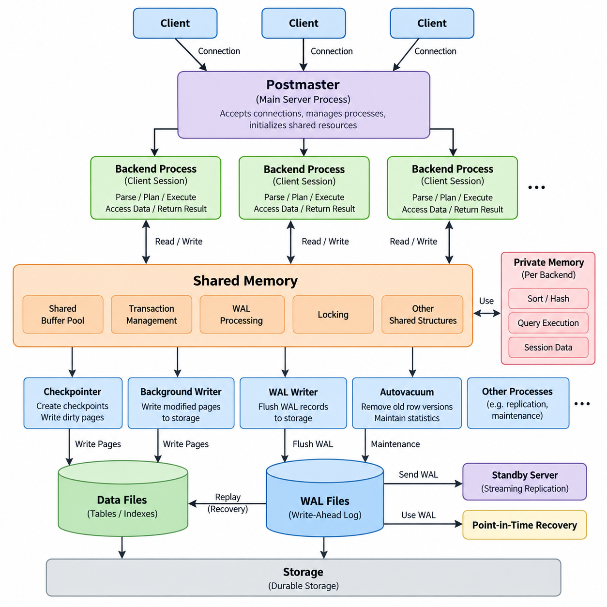
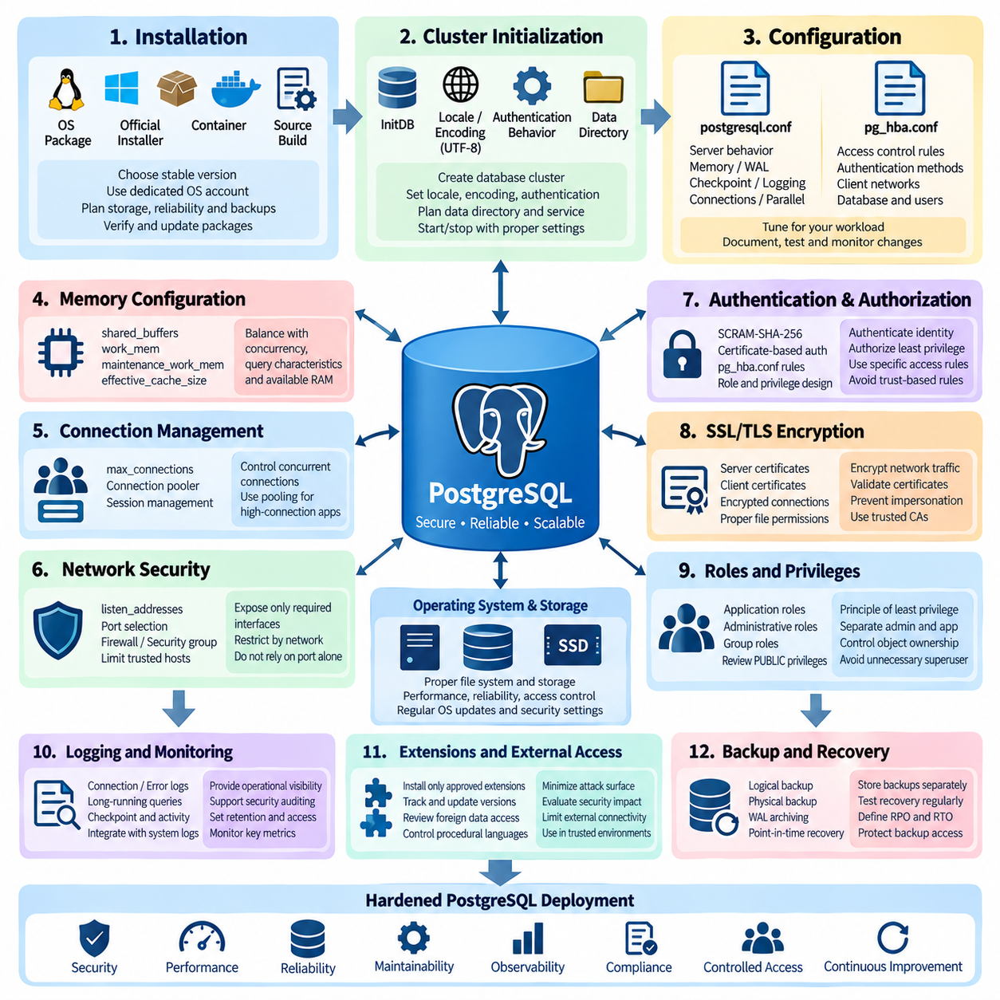
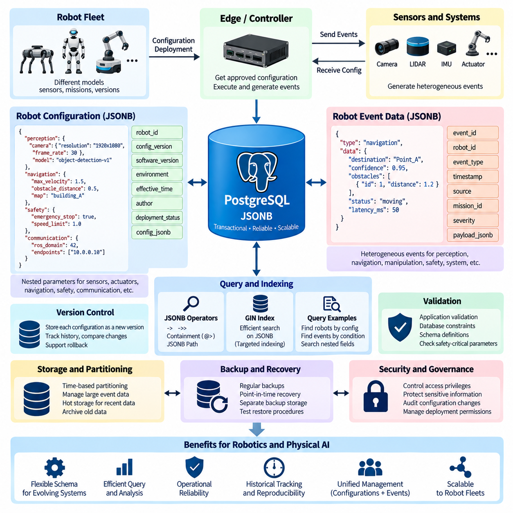
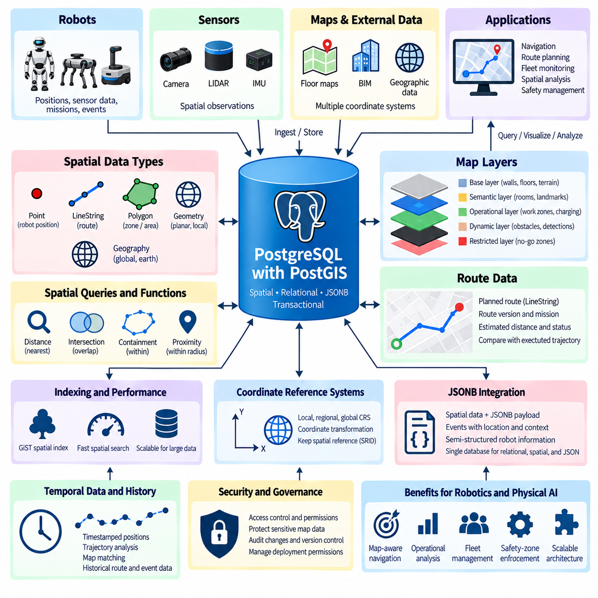
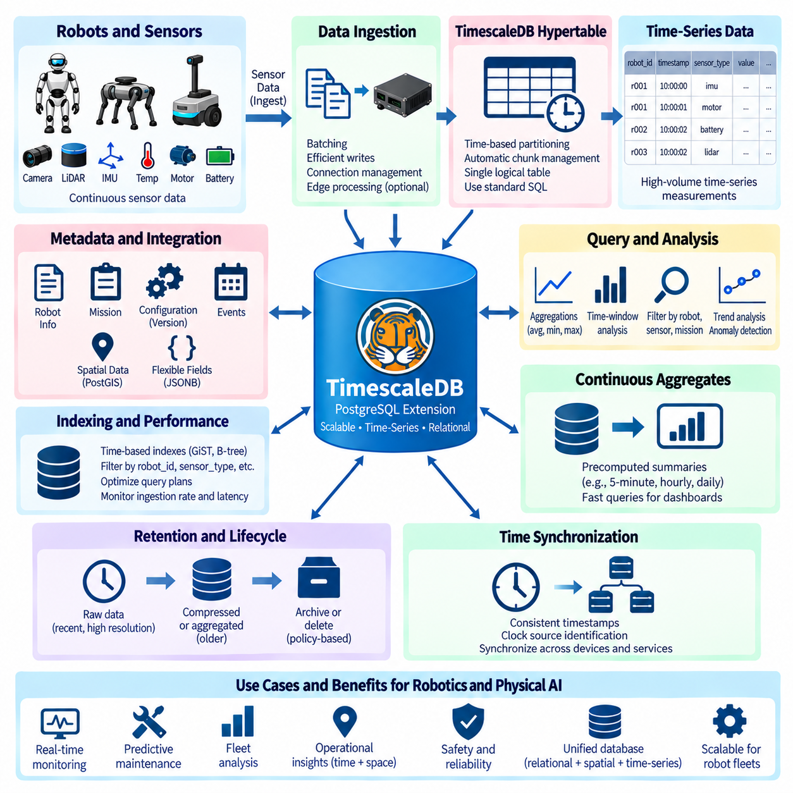
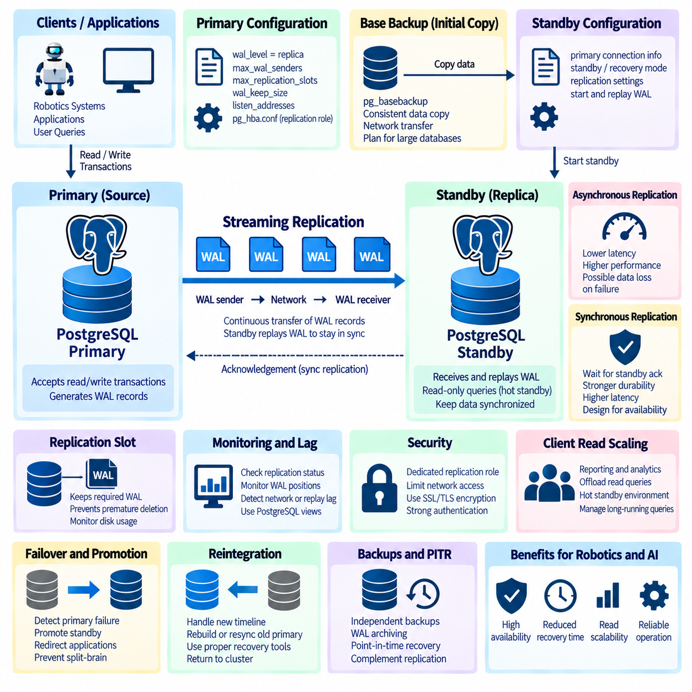
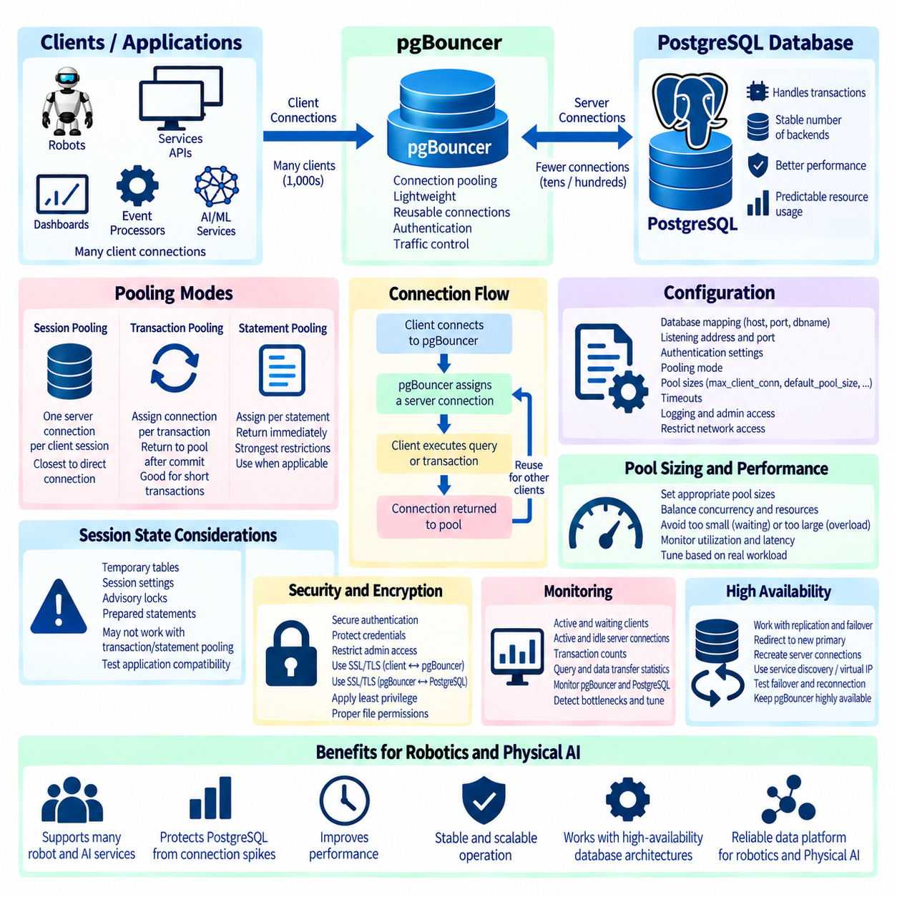
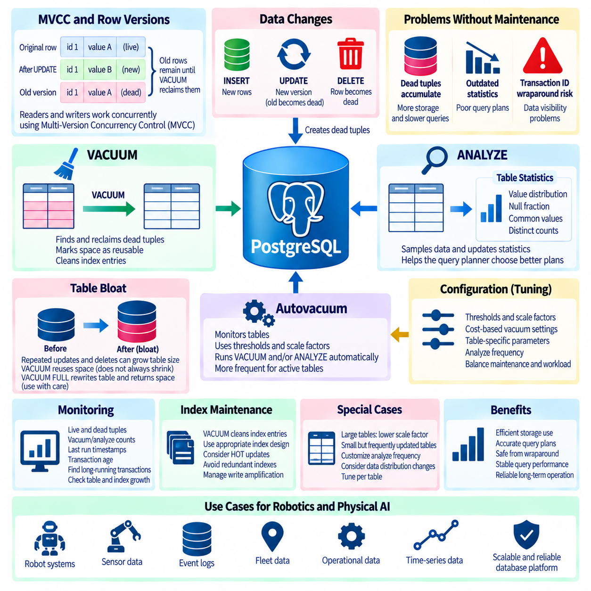
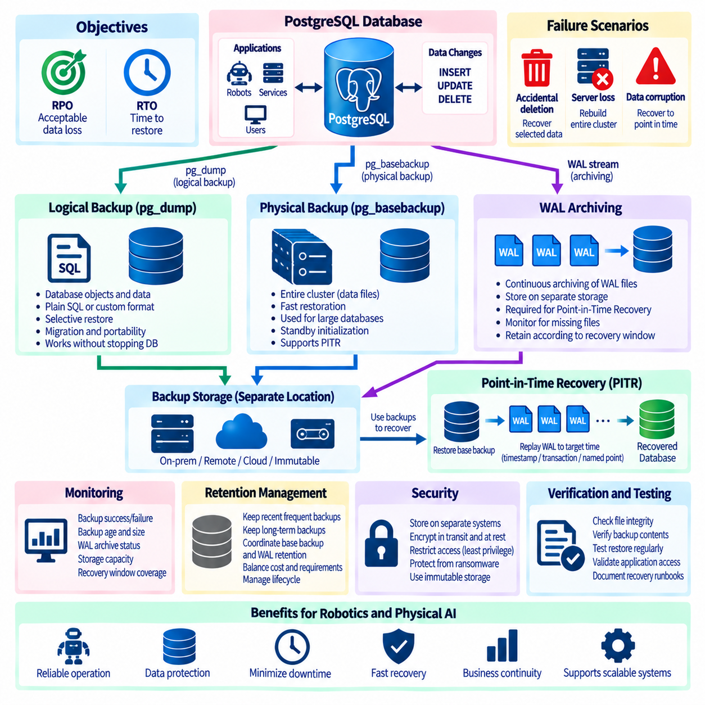
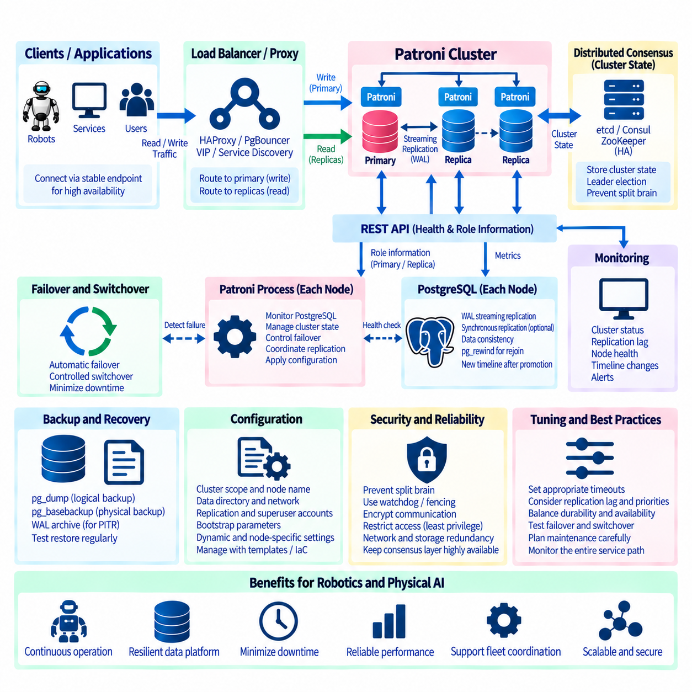

**Volume 08 Robot Database and Storage**


# 02. PostgreSQL

##  

## 02.01 PostgreSQL Architecture: Process Model / WAL

{width="7.268055555555556in" height="7.268055555555556in"}

PostgreSQL is a client-server relational database management system designed around a multi-process architecture. Unlike a database engine that performs most work inside a single process, PostgreSQL creates a dedicated server process for each client connection while maintaining several background processes for shared database operations. The PostgreSQL server is started by the postmaster or main server process, which manages connections, initializes shared resources, and supervises the lifecycle of backend and background processes. This architecture provides process isolation, operational reliability, and a clear separation between client requests and system-level database management.

When a client connects to PostgreSQL, the server accepts the connection and creates a dedicated backend process for that client session. The backend process parses SQL statements, performs semantic analysis, generates or selects an execution plan, accesses shared buffers and storage, and returns results to the client. Each backend maintains session-specific information such as transaction state, temporary objects, prepared statements, and configuration parameters. Because client sessions are separated at the operating-system process level, a failure in one backend does not normally terminate all other client sessions or the entire database server.

PostgreSQL also relies on several background processes to coordinate database-wide activities. The checkpointer periodically creates checkpoints that establish a known recovery position in the database\'s write-ahead log. The background writer gradually writes modified data pages from shared buffers to storage, reducing the amount of work required during checkpoints. The WAL writer transfers WAL records from memory to persistent storage, while the autovacuum launcher schedules maintenance workers that remove obsolete row versions and maintain table statistics. These processes allow foreground client sessions to focus primarily on query execution rather than performing every maintenance operation themselves.

Shared memory is a critical component of the PostgreSQL architecture because multiple server processes must cooperate while remaining separate operating-system processes. The shared buffer pool caches database pages in memory so that frequently accessed data does not always require physical storage access. PostgreSQL also maintains shared structures for transaction management, WAL processing, locking, and other coordination mechanisms. Each backend additionally has private memory areas used for tasks such as sorting, hashing, query execution, and session-specific operations. Consequently, PostgreSQL performance depends on both shared memory configuration and the amount of private memory consumed by concurrent queries.

The process model is closely connected to PostgreSQL\'s transaction architecture. A transaction represents a logical unit of work that PostgreSQL must execute according to transactional consistency rules. When a transaction modifies data, PostgreSQL does not simply overwrite the previous row immediately. Instead, it creates a new row version and records transaction visibility information. This multi-version concurrency control, or MVCC, allows readers and writers to operate concurrently with reduced blocking. Each transaction observes a consistent database snapshot according to PostgreSQL\'s isolation rules, while obsolete row versions are eventually reclaimed through vacuum processing.

Write-Ahead Logging, commonly called WAL, is one of the most important mechanisms in PostgreSQL. The central rule is that changes to database pages must be recorded in the WAL before the corresponding modified pages are considered safely persistent. When a transaction changes data, PostgreSQL generates WAL records describing the required physical or logical changes. These records are initially held in shared memory and are eventually flushed to the WAL files on durable storage. The transaction can be considered committed only after the required WAL information has been durably written according to the configured synchronous commit behavior.

WAL separates logical transaction durability from the immediate writing of database data pages. A modified data page in the shared buffer does not necessarily have to be written to its table file at the exact moment a transaction commits. Instead, PostgreSQL can first make the corresponding WAL records durable and write the actual data pages later. During normal operation, this reduces random storage writes and allows PostgreSQL to combine or reorder data-page writes more efficiently. The WAL therefore acts as a durable record of database changes and provides the foundation for crash recovery, checkpoint processing, replication, and point-in-time recovery.

A checkpoint establishes a recovery boundary within the WAL stream. During checkpoint processing, PostgreSQL ensures that modified data pages associated with transactions before the checkpoint are written to durable storage and records checkpoint information in the WAL. After a system crash, PostgreSQL can start recovery from an appropriate checkpoint and replay subsequent WAL records to reconstruct changes that had been committed but whose data pages had not yet reached their final storage locations. This process is called WAL replay and allows PostgreSQL to restore database consistency without requiring every transaction to synchronously write all modified data pages.

The interaction among backend processes, shared buffers, WAL, and storage can therefore be viewed as a continuous data path. A client sends a SQL request to its backend process, the backend executes the required operations and modifies pages in shared memory, and PostgreSQL generates WAL records describing those changes. The WAL writer and commit process ensure that required WAL information reaches durable storage according to the transaction\'s durability requirements. The background writer and checkpoint process subsequently manage the persistence of modified data pages. This separation enables PostgreSQL to combine transactional correctness with efficient storage management.

WAL also provides the foundation for PostgreSQL replication technologies. A primary PostgreSQL server generates WAL as database changes occur, and standby servers can receive and replay those WAL records to reproduce the database state. Streaming replication can continuously transmit WAL from the primary toward one or more replicas, allowing replicas to maintain a relatively current copy of the primary database. Because replication is based on WAL rather than on independently copying every modified table page, PostgreSQL can efficiently propagate database changes while maintaining the same underlying recovery mechanism used after a local system failure.

For large-scale systems, understanding the relationship between PostgreSQL\'s process model and WAL is essential for capacity planning and operational management. Increasing the number of concurrent connections can increase the number of backend processes and therefore increase memory and operating-system overhead. Connection pooling is often used to control this pressure. At the same time, transaction volume, WAL generation rate, checkpoint frequency, storage latency, and replication traffic must be considered together. A database that has sufficient CPU capacity can still experience performance degradation if WAL storage, checkpoint I/O, memory pressure, or connection concurrency becomes a bottleneck.

From an operational perspective, PostgreSQL architecture is therefore not simply a collection of independent components. The backend process model controls how client work is executed, shared memory enables coordination and caching, MVCC controls transaction visibility, WAL protects durability and supports recovery, and background processes continuously maintain the database environment. These mechanisms form an integrated execution and persistence model. Understanding this relationship provides the foundation for diagnosing PostgreSQL performance problems, designing reliable database infrastructure, configuring replication, planning storage systems, and determining how database behavior changes as workload concurrency and transaction volume increase.

PostgreSQL은 다중 프로세스 아키텍처(multi-process architecture)를 기반으로 설계된 클라이언트-서버 관계형 데이터베이스 관리 시스템(relational database management system)이다. 대부분의 작업을 하나의 프로세스 내부에서 수행하는 데이터베이스 엔진과 달리, PostgreSQL은 각 클라이언트 연결(client connection)에 대해 전용 서버 프로세스(server process)를 생성하고 공유 데이터베이스 작업을 수행하기 위한 여러 백그라운드 프로세스(background process)를 유지한다. PostgreSQL 서버는 포스트마스터(postmaster) 또는 메인 서버 프로세스(main server process)에 의해 시작되며, 연결 관리, 공유 자원 초기화, 백엔드 및 백그라운드 프로세스의 생명주기 관리 등을 담당한다. 이러한 구조는 프로세스 격리(process isolation), 운영 신뢰성(operational reliability), 클라이언트 요청과 시스템 수준 데이터베이스 관리 사이의 명확한 분리를 제공한다.

클라이언트가 PostgreSQL에 연결되면 서버는 해당 연결을 수락하고 해당 클라이언트 세션(client session)을 위한 전용 백엔드 프로세스(backend process)를 생성한다. 백엔드 프로세스는 SQL 문을 파싱(parsing)하고, 의미 분석(semantic analysis)을 수행하며, 실행 계획(execution plan)을 생성하거나 선택하고, 공유 버퍼(shared buffer)와 저장장치(storage)에 접근한 후 결과를 클라이언트에 반환한다. 각각의 백엔드는 트랜잭션 상태(transaction state), 임시 객체(temporary object), 준비된 문(prepared statement), 설정 매개변수(configuration parameter)와 같은 세션별 정보를 유지한다. 클라이언트 세션이 운영체제 수준의 프로세스로 분리되어 있기 때문에 하나의 백엔드에서 발생한 장애가 일반적으로 다른 클라이언트 세션이나 전체 데이터베이스 서버를 종료시키지는 않는다.

PostgreSQL은 또한 데이터베이스 전체의 작업을 조정하기 위해 여러 백그라운드 프로세스(background process)에 의존한다. 체크포인터(checkpointer)는 주기적으로 체크포인트(checkpoint)를 생성하여 데이터베이스의 복구 위치(recovery position)를 WAL(Write-Ahead Log) 내에 설정한다. 백그라운드 라이터(background writer)는 공유 버퍼(shared buffer)에 있는 변경된 데이터 페이지(data page)를 저장장치로 점진적으로 기록하여 체크포인트가 수행해야 하는 작업량을 줄인다. WAL 라이터(WAL writer)는 메모리에 있는 WAL 레코드(WAL record)를 저장장치의 WAL 파일로 전달하며, 오토배큠 런처(autovacuum launcher)는 유지보수 작업자를 예약하여 오래된 행 버전(row version)을 제거하고 테이블 통계(table statistics)를 유지한다. 이러한 프로세스는 클라이언트 세션이 모든 유지보수 작업까지 직접 수행하지 않고 주로 쿼리 실행(query execution)에 집중할 수 있도록 한다.

공유 메모리(shared memory)는 PostgreSQL 아키텍처에서 중요한 구성 요소이다. 여러 서버 프로세스가 서로 다른 운영체제 프로세스로 실행되면서도 서로 협력해야 하기 때문이다. 공유 버퍼 풀(shared buffer pool)은 데이터베이스 페이지(database page)를 메모리에 캐시하여 자주 접근되는 데이터가 항상 물리적 저장장치에 접근하지 않아도 되도록 한다. PostgreSQL은 또한 트랜잭션 관리(transaction management), WAL 처리(WAL processing), 잠금(locking) 및 기타 조정 작업을 위한 공유 구조(shared structure)를 유지한다. 각 백엔드는 정렬(sorting), 해시(hash), 쿼리 실행(query execution), 세션별 작업 등에 사용되는 전용 메모리 영역(private memory area)도 추가로 사용한다. 따라서 PostgreSQL의 성능은 공유 메모리 설정(shared memory configuration)뿐만 아니라 동시에 실행되는 쿼리가 사용하는 전용 메모리의 양에도 영향을 받는다.

프로세스 모델(process model)은 PostgreSQL의 트랜잭션 아키텍처(transaction architecture)와 밀접하게 연결되어 있다. 트랜잭션(transaction)은 PostgreSQL이 트랜잭션 일관성 규칙(transaction consistency rule)에 따라 실행해야 하는 논리적 작업 단위(logical unit of work)를 의미한다. 트랜잭션이 데이터를 변경할 때 PostgreSQL은 기존 행을 단순히 덮어쓰는 것이 아니다. 대신 새로운 행 버전(new row version)을 생성하고 트랜잭션 가시성 정보(transaction visibility information)를 기록한다. 이러한 다중 버전 동시성 제어(MVCC, Multi-Version Concurrency Control)를 통해 읽기 작업과 쓰기 작업이 서로를 최소한으로 차단하면서 동시에 수행될 수 있다. 각 트랜잭션은 PostgreSQL의 격리 수준(isolation level)에 따라 일관된 데이터베이스 스냅샷(database snapshot)을 관찰하며, 더 이상 필요하지 않은 오래된 행 버전은 이후 VACUUM 처리(vacuum processing)를 통해 회수된다.

WAL(Write-Ahead Logging)은 PostgreSQL에서 가장 중요한 메커니즘 중 하나이다. 기본 원칙은 데이터베이스 페이지(database page)의 변경 사항이 해당 변경된 페이지가 안전하게 영속화되었다고 간주되기 전에 먼저 WAL에 기록되어야 한다는 것이다. 트랜잭션이 데이터를 변경하면 PostgreSQL은 필요한 물리적 또는 논리적 변경을 설명하는 WAL 레코드(WAL record)를 생성한다. 이러한 레코드는 처음에는 공유 메모리(shared memory)에 보관되며 이후 저장장치의 WAL 파일에 기록된다. 트랜잭션은 구성된 동기 커밋 동작(synchronous commit behavior)에 따라 필요한 WAL 정보가 영속적인 저장장치에 안전하게 기록된 후에 커밋된 것으로 간주될 수 있다.

WAL은 논리적인 트랜잭션 내구성(transaction durability)과 실제 데이터 페이지의 즉각적인 기록을 분리한다. 공유 버퍼(shared buffer)에 변경된 데이터 페이지가 존재하더라도 트랜잭션이 커밋되는 순간 해당 페이지를 테이블 파일(table file)에 반드시 기록할 필요는 없다. 대신 PostgreSQL은 먼저 해당 WAL 레코드를 내구성 있게 저장한 다음 실제 데이터 페이지는 이후에 기록할 수 있다. 정상적인 운영 환경에서는 이러한 방식이 랜덤 저장장치 쓰기(random storage write)를 줄이고 PostgreSQL이 데이터 페이지 기록을 보다 효율적으로 결합하거나 재배치할 수 있도록 한다. 따라서 WAL은 데이터베이스 변경 사항에 대한 영속적인 기록 역할을 하며 장애 복구(crash recovery), 체크포인트 처리(checkpoint processing), 복제(replication), 특정 시점 복구(PITR, Point-in-Time Recovery)의 기반을 제공한다.

체크포인트(checkpoint)는 WAL 스트림(WAL stream) 내부에서 복구 경계(recovery boundary)를 설정한다. 체크포인트가 수행되는 동안 PostgreSQL은 해당 체크포인트 이전의 트랜잭션과 관련된 변경 데이터 페이지가 영속적인 저장장치에 기록되도록 보장하고, 체크포인트 정보를 WAL에 기록한다. 시스템 장애가 발생한 이후 PostgreSQL은 적절한 체크포인트에서 복구(recovery)를 시작하고 이후의 WAL 레코드를 재생(replay)하여 커밋되었지만 아직 최종 데이터 저장 위치에 기록되지 않은 변경 사항을 재구성할 수 있다. 이러한 과정을 WAL 재생(WAL replay)이라고 한다. 이를 통해 PostgreSQL은 모든 트랜잭션이 변경된 데이터 페이지를 동기적으로 기록하도록 요구하지 않고도 데이터베이스의 일관성을 복구할 수 있다.

백엔드 프로세스(backend process), 공유 버퍼(shared buffer), WAL, 저장장치(storage)의 상호작용은 하나의 지속적인 데이터 경로(data path)로 이해할 수 있다. 클라이언트가 백엔드 프로세스로 SQL 요청을 전송하면 백엔드는 필요한 작업을 수행하고 공유 메모리에 있는 페이지를 변경하며 이러한 변경을 설명하는 WAL 레코드를 생성한다. WAL 라이터와 커밋 처리(commit processing)는 트랜잭션의 내구성 요구사항에 따라 필요한 WAL 정보가 영속적인 저장장치에 기록되도록 보장한다. 이후 백그라운드 라이터와 체크포인트 프로세스는 변경된 데이터 페이지가 저장장치에 기록되는 과정을 관리한다. 이러한 분리를 통해 PostgreSQL은 트랜잭션 정확성(transaction correctness)과 효율적인 저장장치 관리(storage management)를 동시에 달성할 수 있다.

WAL은 PostgreSQL 복제 기술(replication technology)의 기반이기도 하다. 기본 PostgreSQL 서버(primary PostgreSQL server)는 데이터베이스 변경이 발생할 때 WAL을 생성하며, 대기 서버(standby server)는 이러한 WAL 레코드를 수신하고 재생하여 데이터베이스 상태를 동일하게 재현할 수 있다. 스트리밍 복제(streaming replication)을 사용하면 기본 서버에서 하나 이상의 복제 서버로 WAL을 지속적으로 전송할 수 있으며, 이를 통해 복제 서버는 기본 서버의 최신 상태에 가까운 데이터베이스 사본을 유지할 수 있다. 복제가 변경된 모든 테이블 페이지를 독립적으로 복사하는 것이 아니라 WAL을 기반으로 수행되기 때문에 PostgreSQL은 로컬 시스템 장애 이후 사용하는 것과 동일한 기본 복구 메커니즘을 활용하면서 데이터베이스 변경 사항을 효율적으로 전달할 수 있다.

대규모 시스템에서는 PostgreSQL의 프로세스 모델과 WAL 사이의 관계를 이해하는 것이 용량 계획(capacity planning)과 운영 관리(operational management)에 매우 중요하다. 동시 연결(concurrent connection)의 수가 증가하면 백엔드 프로세스의 수도 증가할 수 있으며, 이에 따라 메모리와 운영체제 자원에 대한 부담도 커진다. 연결 풀링(connection pooling)은 이러한 부담을 제어하기 위해 자주 사용된다. 동시에 트랜잭션 처리량(transaction throughput), WAL 생성률(WAL generation rate), 체크포인트 빈도(checkpoint frequency), 저장장치 지연시간(storage latency), 복제 트래픽(replication traffic)을 함께 고려해야 한다. CPU 용량이 충분한 데이터베이스라도 WAL 저장장치, 체크포인트 I/O, 메모리 압박(memory pressure), 연결 동시성(connection concurrency) 등이 병목이 되면 성능이 저하될 수 있다.

운영 관점에서 PostgreSQL 아키텍처는 서로 독립적인 구성 요소의 단순한 집합으로 이해해서는 안 된다. 백엔드 프로세스 모델은 클라이언트 작업이 실행되는 방식을 결정하고, 공유 메모리는 조정과 캐싱(caching)을 지원하며, MVCC는 트랜잭션 가시성(transaction visibility)을 관리하고, WAL은 내구성과 복구를 보장하며, 백그라운드 프로세스는 데이터베이스 환경을 지속적으로 유지관리한다. 이러한 메커니즘은 하나의 통합된 실행 및 영속화 모델(execution and persistence model)을 구성한다. 이러한 관계를 이해하면 PostgreSQL 성능 문제를 진단하고, 안정적인 데이터베이스 인프라(database infrastructure)를 설계하며, 복제를 구성하고, 저장장치 시스템을 계획하고, 작업 동시성과 트랜잭션 처리량이 증가함에 따라 데이터베이스 동작이 어떻게 변화하는지를 판단하는 데 필요한 기반을 확보할 수 있다.

##  

## 02.02 PostgreSQL Install, Config, Security Hardening [w/Code]

{width="7.268055555555556in" height="7.268055555555556in"}

PostgreSQL installation begins with selecting an appropriate version, operating system package, storage layout, and deployment model for the intended workload. PostgreSQL can be installed through native operating-system packages, official installers, containers, or source compilation. For production environments, a supported stable release should be selected and the installation source should be controlled so that packages can be verified and updated consistently. The database server should run under a dedicated operating-system account rather than a privileged user, and database files should be placed on storage with appropriate performance, reliability, backup, and access-control characteristics.

After installation, PostgreSQL creates a database cluster that contains the system catalogs, configuration files, transaction metadata, and database storage managed by a particular server instance. The cluster should be initialized with deliberate choices for locale, encoding, authentication behavior, and data directory placement. UTF-8 is commonly appropriate for modern applications because it provides broad support for multilingual data. The operating-system service configuration should also be reviewed so that PostgreSQL starts and stops predictably, uses the intended cluster, and does not expose an unnecessary number of listening interfaces or network endpoints.

PostgreSQL configuration is primarily controlled through parameters in postgresql.conf and access rules in pg_hba.conf. The configuration file controls server behavior such as listening addresses, port selection, memory allocation, WAL behavior, checkpoint management, logging, parallel execution, and connection limits. Changes should be made according to the workload rather than copied blindly from generic tuning guides. A parameter that improves performance for a large analytical workload may be inappropriate for a transactional system with many concurrent connections. Configuration changes should therefore be documented, tested, and monitored after deployment.

Memory configuration requires particular attention because PostgreSQL uses both shared memory and memory allocated by individual backend processes. Parameters such as shared_buffers, work_mem, maintenance_work_mem, and effective_cache_size influence different aspects of database operation. Increasing work_mem, for example, can improve sorting and hashing operations but may multiply memory consumption when many operations execute concurrently. Similarly, increasing shared_buffers consumes memory that must be balanced against operating-system cache requirements. Safe configuration therefore requires considering concurrency, query characteristics, available RAM, and workload variability rather than optimizing individual parameters in isolation.

Connection management is another important part of PostgreSQL configuration. The max_connections parameter determines how many client connections the server can accept, but increasing this value can significantly increase memory and process-management overhead. High-connection applications should often use a connection pooler so that a controlled number of database sessions can serve a larger number of application requests. Connection pooling also reduces the cost of repeatedly establishing sessions and helps protect the database from sudden connection spikes. The appropriate configuration depends on application behavior, transaction duration, query complexity, and available server resources.

Network exposure should be minimized from the beginning. PostgreSQL does not need to listen on every network interface simply because remote access is technically possible. The listen_addresses parameter should expose only the interfaces required by the deployment, and network-level controls such as firewalls or security groups should restrict access to trusted application servers, administration hosts, or replication nodes. The default PostgreSQL port should not be treated as a security boundary by itself. Security comes from controlling which systems can connect and how those connections are authenticated and authorized.

Authentication and authorization should be designed separately. Authentication determines whether a client is allowed to establish an identity, while authorization determines what that identity is permitted to do after connection. PostgreSQL supports several authentication mechanisms through pg_hba.conf, including password-based methods and certificate-based approaches. Modern deployments should prefer secure password authentication such as SCRAM-SHA-256 rather than legacy password mechanisms. Access rules should be as specific as practical, limiting database, user, source network, and authentication method rather than relying on broad trust-based rules.

Database roles should follow the principle of least privilege. Applications should normally use dedicated roles with only the permissions required for their assigned functions instead of connecting with superuser accounts. Administrative roles should be separated from application roles, and ownership of critical database objects should be controlled carefully. Where appropriate, privileges can be granted through group roles so that permission management remains consistent as users and applications change. PUBLIC privileges should also be reviewed because permissions granted to PUBLIC may unintentionally provide access to every database role.

Sensitive database operations require additional restrictions. PostgreSQL superusers have extensive authority and can bypass many ordinary permission controls, so superuser credentials should be used only for administration and protected carefully. Application code should never require unrestricted superuser access merely to perform normal transactions. Functions, extensions, foreign data access, file-related capabilities, and administrative interfaces should be evaluated according to the trust level of the environment. Security hardening should focus not only on external attackers but also on limiting the impact of compromised application credentials or incorrectly configured database roles.

Transport security is essential when PostgreSQL connections cross untrusted or shared networks. SSL/TLS can encrypt database traffic and can also provide certificate-based client authentication when required. Server certificates, private keys, certificate authorities, and permissions on those files must be managed securely. The server should be configured to require encrypted connections for clients that communicate across networks where traffic could otherwise be intercepted. Certificate validation should be implemented correctly on clients rather than treating encryption alone as sufficient protection against impersonation or man-in-the-middle attacks.

Logging provides both operational visibility and security evidence. PostgreSQL can record connection events, disconnections, errors, long-running queries, checkpoints, and other activities through its logging configuration. The appropriate level of logging depends on the operational environment because excessive logging can create storage and performance overhead. Security-sensitive environments should establish retention and access policies for database logs and protect them from unauthorized modification. Logs should be correlated with operating-system, application, network, and identity-management events when investigating incidents or unusual database activity.

Security hardening also requires disciplined management of extensions and external functionality. PostgreSQL extensions can provide valuable capabilities, but every extension expands the database\'s functional surface and may introduce additional privileges, dependencies, or maintenance requirements. Only approved extensions should be installed in production environments, and their versions should be tracked and updated through controlled procedures. External connections, procedural languages, foreign data wrappers, and other features that can interact with systems outside the database should receive additional scrutiny because their security implications extend beyond ordinary SQL access.

Backups and recovery are fundamental parts of database security because confidentiality and integrity are not sufficient if data cannot be restored after corruption, accidental deletion, ransomware, or infrastructure failure. PostgreSQL supports logical backups, physical backups, WAL archiving, and point-in-time recovery. Backup storage should be separated from the primary database environment, protected with appropriate access controls, and tested through actual restoration procedures. A backup that has never been successfully restored should not be treated as a proven recovery mechanism. Recovery objectives should therefore be defined in terms of acceptable data loss and restoration time.

Operational hardening continues after installation and initial configuration. PostgreSQL should be kept on supported versions, security updates should be evaluated and applied through a controlled maintenance process, and configuration changes should be tracked. Database roles, privileges, extensions, authentication rules, network exposure, certificates, backups, and logs should be periodically reviewed. Monitoring should cover resource utilization, connection counts, transaction activity, WAL generation, replication status, storage capacity, query latency, and database errors. This ongoing process turns security hardening from a one-time installation activity into a continuous operational practice.

A properly hardened PostgreSQL deployment therefore combines secure installation, controlled network exposure, strong authentication, least-privilege authorization, encrypted communication, deliberate resource configuration, protected logging, controlled extensions, reliable backups, and continuous maintenance. Performance and security should not be treated as completely separate concerns because excessive connections, uncontrolled memory allocation, inefficient logging, or poorly designed backup procedures can affect both availability and security. The objective is to create a database environment in which application workloads can operate efficiently while administrative access, data exposure, recovery capabilities, and operational changes remain controlled and auditable.

PostgreSQL 설치(PostgreSQL installation)는 의도한 작업 부하(workload)에 적합한 버전(version), 운영체제 패키지(operating-system package), 저장장치 구성(storage layout), 배포 모델(deployment model)을 선택하는 것에서 시작한다. PostgreSQL은 운영체제의 기본 패키지(native operating-system package), 공식 설치 프로그램(official installer), 컨테이너(container), 소스 코드 컴파일(source compilation) 등 다양한 방식으로 설치할 수 있다. 운영 환경에서는 지원되는 안정 버전(supported stable release)을 선택하고 패키지를 일관되게 검증하고 업데이트할 수 있도록 설치 소스를 통제해야 한다. 데이터베이스 서버는 권한이 높은 사용자(privileged user)가 아니라 전용 운영체제 계정(dedicated operating-system account)으로 실행해야 하며, 데이터베이스 파일은 성능, 신뢰성, 백업 및 접근 제어(access control)를 적절하게 지원하는 저장장치에 배치해야 한다.

설치가 완료되면 PostgreSQL은 특정 서버 인스턴스(server instance)가 관리하는 시스템 카탈로그(system catalog), 구성 파일(configuration file), 트랜잭션 메타데이터(transaction metadata), 데이터베이스 저장 영역(database storage)을 포함하는 데이터베이스 클러스터(database cluster)를 생성한다. 클러스터는 로케일(locale), 인코딩(encoding), 인증 동작(authentication behavior), 데이터 디렉터리 위치(data directory placement)를 신중하게 결정하여 초기화해야 한다. UTF-8은 다양한 언어의 데이터를 폭넓게 지원하기 때문에 현대적인 애플리케이션에서 일반적으로 적합하다. 운영체제 서비스 구성(operating-system service configuration) 역시 검토하여 PostgreSQL이 의도한 클러스터를 사용하고 예측 가능한 방식으로 시작 및 종료되며, 불필요한 네트워크 인터페이스나 엔드포인트를 노출하지 않도록 해야 한다.

PostgreSQL 구성(configuration)은 주로 postgresql.conf의 매개변수(parameter)와 pg_hba.conf의 접근 규칙(access rule)에 의해 제어된다. 구성 파일은 수신 주소(listening address), 포트 선택(port selection), 메모리 할당(memory allocation), WAL 동작(WAL behavior), 체크포인트 관리(checkpoint management), 로깅(logging), 병렬 실행(parallel execution), 연결 제한(connection limit) 등 서버의 동작을 제어한다. 구성 변경은 일반적인 튜닝 가이드(tuning guide)를 그대로 복사하기보다 실제 작업 부하에 맞춰 수행해야 한다. 대규모 분석 작업(analytical workload)의 성능을 향상시키는 매개변수가 많은 동시 연결을 사용하는 트랜잭션 시스템에는 적합하지 않을 수 있다. 따라서 구성 변경은 문서화하고 테스트하며 배포 이후의 동작을 모니터링해야 한다.

메모리 구성(memory configuration)은 PostgreSQL이 공유 메모리(shared memory)와 개별 백엔드 프로세스(backend process)가 사용하는 전용 메모리를 모두 사용하기 때문에 특별한 주의가 필요하다. shared_buffers, work_mem, maintenance_work_mem, effective_cache_size와 같은 매개변수는 데이터베이스 동작의 서로 다른 부분에 영향을 준다. 예를 들어 work_mem을 증가시키면 정렬(sorting)과 해시(hash) 작업의 성능을 향상시킬 수 있지만, 동시에 여러 작업이 실행될 경우 메모리 사용량이 크게 증가할 수 있다. 마찬가지로 shared_buffers를 증가시키면 메모리 사용량이 늘어나므로 운영체제 캐시(operating-system cache)에 필요한 메모리와 균형을 맞춰야 한다. 따라서 안전한 구성은 개별 매개변수를 독립적으로 최적화하기보다 동시성(concurrency), 쿼리 특성(query characteristics), 사용 가능한 RAM, 작업 부하의 변동성을 함께 고려해야 한다.

연결 관리(connection management) 역시 PostgreSQL 구성의 중요한 부분이다. max_connections 매개변수는 서버가 수용할 수 있는 클라이언트 연결 수를 결정하지만, 이 값을 증가시키면 메모리와 프로세스 관리에 대한 부담이 크게 증가할 수 있다. 연결 수가 많은 애플리케이션에서는 일반적으로 연결 풀러(connection pooler)를 사용하여 제한된 수의 데이터베이스 세션으로 더 많은 애플리케이션 요청을 처리하는 방법이 효과적이다. 연결 풀링(connection pooling)은 세션을 반복적으로 생성하는 비용을 줄이고 갑작스러운 연결 증가로부터 데이터베이스를 보호하는 데에도 도움이 된다. 적절한 구성은 애플리케이션의 동작, 트랜잭션 지속 시간(transaction duration), 쿼리 복잡도(query complexity), 서버에서 사용할 수 있는 자원에 따라 결정해야 한다.

네트워크 노출(network exposure)은 처음부터 최소화해야 한다. PostgreSQL이 원격 접근을 기술적으로 지원한다고 해서 모든 네트워크 인터페이스에서 수신 대기할 필요는 없다. listen_addresses 매개변수는 실제 배포 환경에서 필요한 인터페이스만 노출하도록 설정해야 하며, 방화벽(firewall)이나 보안 그룹(security group)과 같은 네트워크 수준의 제어를 사용하여 신뢰할 수 있는 애플리케이션 서버, 관리 호스트 또는 복제 노드(replication node)에서만 접근하도록 제한해야 한다. PostgreSQL의 기본 포트(default PostgreSQL port) 자체를 보안 경계(security boundary)로 간주해서는 안 된다. 실제 보안은 어떤 시스템이 연결할 수 있는지와 연결된 시스템이 어떻게 인증되고 권한을 부여받는지를 통제하는 데서 나온다.

인증(authentication)과 권한 부여(authorization)는 서로 별도로 설계해야 한다. 인증은 클라이언트가 자신의 신원을 가지고 연결할 수 있는지를 결정하는 반면, 권한 부여는 해당 신원이 연결된 이후 어떤 작업을 수행할 수 있는지를 결정한다. PostgreSQL은 pg_hba.conf를 통해 비밀번호 기반 방식(password-based method)과 인증서 기반 방식(certificate-based approach)을 포함한 여러 인증 메커니즘(authentication mechanism)을 지원한다. 현대적인 환경에서는 기존의 레거시 비밀번호 방식(legacy password mechanism)보다 SCRAM-SHA-256과 같은 안전한 비밀번호 인증(secure password authentication)을 우선하는 것이 바람직하다. 접근 규칙은 가능한 한 구체적으로 설정하여 데이터베이스, 사용자, 출발지 네트워크 및 인증 방식을 제한해야 하며, 광범위한 trust 기반 규칙에 의존해서는 안 된다.

데이터베이스 역할(database role)은 최소 권한 원칙(principle of least privilege)에 따라 설계해야 한다. 애플리케이션은 일반적으로 슈퍼유저 계정(superuser account)이 아니라 해당 기능에 필요한 권한만 가진 전용 역할(dedicated role)을 사용해야 한다. 관리 역할(administrative role)은 애플리케이션 역할(application role)과 분리하고 중요한 데이터베이스 객체(database object)의 소유권(ownership)도 신중하게 관리해야 한다. 필요한 경우 그룹 역할(group role)을 통해 권한을 부여하면 사용자와 애플리케이션의 변경에 따라 권한을 일관되게 관리할 수 있다. 또한 PUBLIC에 부여된 권한도 검토해야 한다. PUBLIC에 부여된 권한은 모든 데이터베이스 역할(database role)에 적용될 수 있기 때문에 의도하지 않은 접근 권한을 제공할 수 있다.

민감한 데이터베이스 작업(sensitive database operation)에는 추가적인 제한이 필요하다. PostgreSQL 슈퍼유저(superuser)는 광범위한 권한을 가지고 있으며 일반적인 권한 제어(permission control)를 우회할 수 있으므로 슈퍼유저 자격 증명(superuser credential)은 관리 목적에만 사용하고 철저하게 보호해야 한다. 애플리케이션 코드는 일반적인 트랜잭션을 수행하기 위해 무제한 슈퍼유저 권한을 필요로 해서는 안 된다. 함수(function), 확장(extension), 외부 데이터 접근(foreign data access), 파일 관련 기능(file-related capability), 관리 인터페이스(administrative interface)는 환경의 신뢰 수준(trust level)에 따라 평가해야 한다. 보안 강화(security hardening)는 외부 공격자뿐만 아니라 애플리케이션 자격 증명이 침해되거나 데이터베이스 역할이 잘못 구성되었을 때 발생할 수 있는 피해의 범위를 제한하는 데에도 초점을 맞춰야 한다.

PostgreSQL 연결이 신뢰할 수 없거나 공유된 네트워크를 통과하는 경우 전송 계층 보안(SSL/TLS, Transport Layer Security)이 필수적이다. SSL/TLS는 데이터베이스 트래픽을 암호화할 수 있으며 필요한 경우 인증서 기반 클라이언트 인증(certificate-based client authentication)도 제공할 수 있다. 서버 인증서(server certificate), 개인 키(private key), 인증 기관(certificate authority), 인증서 관련 파일의 권한은 안전하게 관리해야 한다. 네트워크를 통해 통신하는 클라이언트의 경우 트래픽이 가로채질 가능성이 있는 환경에서는 서버가 암호화된 연결을 요구하도록 구성해야 한다. 클라이언트에서도 인증서 검증(certificate validation)을 올바르게 수행해야 하며, 단순히 암호화가 적용되었다는 이유만으로 위장(impersonation)이나 중간자 공격(man-in-the-middle attack)에 대한 보호가 충분하다고 간주해서는 안 된다.

로깅(logging)은 운영 가시성(operational visibility)과 보안 증거(security evidence)를 제공한다. PostgreSQL은 로깅 구성을 통해 연결 이벤트(connection event), 연결 종료(disconnection), 오류(error), 장시간 실행 쿼리(long-running query), 체크포인트(checkpoint) 및 기타 활동을 기록할 수 있다. 적절한 로깅 수준(logging level)은 운영 환경에 따라 결정해야 한다. 과도한 로깅은 저장공간과 성능에 부담을 줄 수 있기 때문이다. 보안이 중요한 환경에서는 데이터베이스 로그에 대한 보존 정책(retention policy)과 접근 정책(access policy)을 수립하고 무단 변경으로부터 로그를 보호해야 한다. 보안 사고나 비정상적인 데이터베이스 활동을 조사할 때는 운영체제, 애플리케이션, 네트워크 및 ID 관리(identity management) 이벤트와 데이터베이스 로그를 상호 연계할 수 있도록 구성하는 것이 좋다.

보안 강화는 확장 기능(extension)과 외부 기능(external functionality)을 체계적으로 관리하는 것도 포함한다. PostgreSQL 확장(extension)은 유용한 기능을 제공할 수 있지만, 각 확장은 데이터베이스의 기능적 공격 표면(functional surface)을 넓히고 추가적인 권한, 종속성(dependency) 또는 유지관리 요구사항을 발생시킬 수 있다. 운영 환경에는 승인된 확장만 설치해야 하며 해당 버전을 추적하고 통제된 절차에 따라 업데이트해야 한다. 외부 연결(external connection), 프로시저 언어(procedural language), 외부 데이터 래퍼(foreign data wrapper), 데이터베이스 외부 시스템과 상호작용할 수 있는 기타 기능은 추가적인 검토가 필요하다. 이러한 기능은 일반적인 SQL 접근을 넘어 데이터베이스 외부 시스템에도 보안 영향을 미칠 수 있기 때문이다.

백업(backup)과 복구(recovery)는 데이터베이스 보안의 핵심 요소이다. 데이터의 기밀성(confidentiality)과 무결성(integrity)이 충분히 보호되더라도 데이터 손상, 실수에 의한 삭제, 랜섬웨어(ransomware), 인프라 장애(infrastructure failure) 이후 데이터를 복구할 수 없다면 데이터베이스의 실질적인 보호 수준은 충분하지 않다. PostgreSQL은 논리적 백업(logical backup), 물리적 백업(physical backup), WAL 아카이빙(WAL archiving), 특정 시점 복구(PITR, Point-in-Time Recovery)를 지원한다. 백업 저장소는 기본 데이터베이스 환경과 분리하고 적절한 접근 제어를 적용하며 실제 복구 절차를 통해 정기적으로 검증해야 한다. 한 번도 성공적으로 복구해 본 적이 없는 백업은 검증된 복구 수단으로 간주해서는 안 된다. 따라서 복구 목표(recovery objective)는 허용 가능한 데이터 손실량과 복구 시간(restore time)을 기준으로 정의해야 한다.

운영 보안 강화(operational hardening)는 설치와 초기 구성 이후에도 계속되어야 한다. PostgreSQL은 지원되는 버전을 유지해야 하며 보안 업데이트(security update)는 통제된 유지보수 절차를 통해 검토하고 적용해야 한다. 구성 변경은 추적하고 관리해야 한다. 데이터베이스 역할, 권한, 확장 기능, 인증 규칙, 네트워크 노출, 인증서, 백업 및 로그는 정기적으로 검토해야 한다. 모니터링에서는 자원 사용량(resource utilization), 연결 수(connection count), 트랜잭션 활동(transaction activity), WAL 생성량(WAL generation), 복제 상태(replication status), 저장공간 용량(storage capacity), 쿼리 지연시간(query latency), 데이터베이스 오류(database error)를 지속적으로 확인해야 한다. 이러한 지속적인 관리 과정은 보안 강화를 일회성 설치 작업이 아니라 지속적인 운영 활동으로 전환한다.

적절하게 보안이 강화된 PostgreSQL 배포 환경은 안전한 설치(secure installation), 통제된 네트워크 노출(controlled network exposure), 강력한 인증(strong authentication), 최소 권한 기반의 권한 부여(least-privilege authorization), 암호화된 통신(encrypted communication), 계획적인 자원 구성(deliberate resource configuration), 보호된 로깅(protected logging), 통제된 확장 기능(controlled extensions), 신뢰할 수 있는 백업(reliable backups), 지속적인 유지관리(continuous maintenance)를 결합한다. 성능(performance)과 보안(security)은 완전히 분리된 관심사로 취급해서는 안 된다. 과도한 연결, 통제되지 않은 메모리 할당, 비효율적인 로깅 또는 제대로 설계되지 않은 백업 절차는 가용성(availability)과 보안 모두에 영향을 줄 수 있기 때문이다. 궁극적인 목표는 애플리케이션 작업 부하가 효율적으로 실행되는 동시에 관리 접근, 데이터 노출, 복구 능력 및 운영 변경 사항이 통제되고 감사 가능(auditable)한 데이터베이스 환경을 구축하는 것이다.

##  

## 02.03 JSONB Type: Robot Config / Event Data [w/Code]

{width="7.268055555555556in" height="7.268055555555556in"}

PostgreSQL JSONB is a binary JSON data type designed to store semi-structured information while retaining PostgreSQL\'s transactional, indexing, and query capabilities. For robotics systems, JSONB is particularly useful because robot configurations and event records often contain fields that vary between robot models, sensors, missions, and software versions. Instead of creating a rigid relational column for every possible attribute, a stable relational structure can be combined with flexible JSONB fields. This approach allows PostgreSQL to manage structured operational data while preserving the variability required by Physical AI and robotic applications.

Robot configuration data commonly contains nested parameters such as sensor settings, actuator limits, navigation parameters, perception models, safety thresholds, network endpoints, and software versions. These values may differ considerably between robot platforms. A JSONB document can represent such configuration as a hierarchical object while keeping related parameters together. PostgreSQL can store the complete configuration in a JSONB column while maintaining important identifiers such as robot_id, configuration_version, environment, and effective_time as conventional relational columns. This hybrid design provides both flexible configuration management and efficient relational filtering.

A typical robot configuration can contain objects for perception, navigation, manipulation, communication, and safety. For example, a perception section may contain camera resolution, frame rate, exposure settings, and detection thresholds, while navigation may contain maximum velocity, obstacle distance, localization parameters, and map references. Safety parameters may define emergency-stop behavior, operating boundaries, and permitted speed limits. JSONB is well suited to this structure because nested objects and arrays can be stored without requiring a separate table for every configuration category. The resulting document can closely represent the logical structure used by robot software.

Robot configurations should be treated as versioned data rather than mutable application settings. A configuration record can include robot identity, configuration version, software version, creation timestamp, author, deployment status, and the JSONB configuration itself. When a configuration changes, creating a new version is generally safer than silently overwriting the previous document. This enables operators to determine which parameters were active at a particular time and supports rollback when a new configuration causes unexpected behavior. Configuration history can therefore become an important part of robot reliability, reproducibility, and operational auditability.

JSONB is also useful for robot event data because robotic systems continuously generate heterogeneous events. A navigation event may contain a destination, localization confidence, obstacle information, and route status, while a perception event may contain detected objects, confidence values, camera identifiers, and processing latency. A safety event may contain a trigger condition, sensor source, severity, and response action. These event types do not necessarily share the same attributes, making a flexible JSONB payload practical. Stable metadata such as event_id, robot_id, event_type, timestamp, and source can remain relational columns while event-specific details are stored in JSONB.

Time is especially important for robot event data. Events should normally include precise timestamps and, when necessary, information about the clock source or synchronization state. PostgreSQL timestamp columns can provide efficient temporal filtering and ordering, while JSONB can contain event-specific temporal information such as sequence numbers, sensor timestamps, processing duration, or mission-relative time. In distributed Physical AI systems, timestamps should be designed carefully because events may originate from multiple robots, edge computers, sensors, and services. Consistent time semantics make it possible to reconstruct operational sequences and correlate events across systems.

The combination of relational columns and JSONB creates a useful separation between stable identity and variable payload. Columns such as robot_id, event_type, timestamp, mission_id, and severity are frequently queried and can be indexed using conventional PostgreSQL indexes. The JSONB payload contains attributes whose structure may evolve as robot capabilities change. This prevents the relational schema from becoming excessively wide while preserving the ability to query nested information. The design is particularly useful when the system must support multiple robot generations or sensor configurations without redesigning the entire database schema for every hardware revision.

PostgreSQL provides operators and functions for querying JSONB content directly. Operators such as -\> and -\>\> can access nested values, while containment operators can identify documents containing specified structures or values. JSONB paths can also be used for more complex searches across nested documents. For example, a system can search for robots whose configuration specifies a particular camera mode or identify events whose payload indicates a specific safety condition. These capabilities allow application developers to query semi-structured robotic information using SQL rather than maintaining a separate document database solely for flexible fields.

Indexing strategy becomes important when JSONB data grows significantly. A generalized inverted index, or GIN index, can support efficient searches over JSONB structures and containment conditions. However, indexing every JSONB field indiscriminately can increase storage consumption and write overhead. Frequently queried attributes should be identified through actual workload analysis, and targeted expression indexes can be considered when a specific nested value is queried repeatedly. For high-volume robot event streams, indexes should therefore be designed around the application\'s most important access patterns rather than simply indexing the entire payload.

JSONB should not be used as a replacement for every relational table. Data that has a stable structure, strong relationships, frequent joins, strict constraints, or important referential integrity requirements is often better represented using conventional relational columns and tables. JSONB is most valuable where the structure is variable, evolving, or naturally hierarchical. A robot database may therefore use relational tables for robots, missions, deployments, users, and timestamps while using JSONB for configuration parameters and event-specific payloads. This hybrid model preserves relational integrity while providing schema flexibility where it provides genuine value.

Validation is another important consideration for robot configuration data. JSONB itself does not automatically guarantee that every document follows the configuration rules expected by the robot software. A robust system should therefore validate configuration documents before deployment. Application-level validation, database constraints for critical fields, schema definitions, or controlled configuration-generation tools can be used together. Safety-critical parameters should receive stronger validation than optional metadata. A configuration should not reach a physical robot merely because it is syntactically valid JSONB; it should also satisfy the semantic and operational requirements of the target robot platform.

Configuration deployment should be separated from configuration storage. PostgreSQL can act as the authoritative configuration repository, while an edge computer or robot controller retrieves an approved configuration and applies it locally. The database can record deployment status, target robot, software compatibility, activation time, and rollback information. This separation makes it possible to distinguish between a configuration that exists in the repository and one that has actually been deployed. For Physical AI systems, this distinction is important because the database may contain multiple candidate configurations while only one configuration is active on a specific robot.

Robot event data can similarly be used as an operational history rather than simply a collection of application logs. Events can describe mission transitions, sensor anomalies, perception results, navigation decisions, actuator states, safety triggers, and system failures. When event metadata is stored consistently, PostgreSQL can support temporal analysis across missions and robots. JSONB provides the flexibility required for event-specific information, while relational identifiers allow events to be associated with robots, missions, deployments, and operators. This creates a structured operational record that can support debugging, performance analysis, incident investigation, and model improvement.

For high-volume event ingestion, database design must consider write throughput, index overhead, partitioning, and retention. Robot fleets may generate large numbers of events from cameras, lidar, navigation systems, controllers, and edge services. Time-based partitioning can separate historical event data into manageable segments and make retention operations more predictable. Frequently accessed recent events can remain in fast storage while older data can be moved to lower-cost archival storage. JSONB remains useful within each partition, but the overall architecture should distinguish between operational event storage, analytical datasets, and long-term archives.

Security and governance are also important when JSONB contains configuration or operational information. Configuration documents may contain network addresses, credentials references, device identifiers, calibration parameters, or information about operational environments. Sensitive values should not be stored in plaintext merely because JSONB makes it convenient. Access privileges should distinguish between users who can inspect configurations, users who can modify them, and services that can deploy them. Audit records should capture significant configuration changes and deployment actions. This ensures that flexible data storage does not weaken control over robot behavior or operational information.

A well-designed PostgreSQL JSONB architecture for robotics therefore combines relational structure, flexible documents, version control, validation, indexing, temporal management, security, and deployment governance. Robot identity, timestamps, mission relationships, and lifecycle metadata remain stable relational information, while configuration parameters and event-specific payloads are represented as JSONB. This approach allows the database schema to evolve with new robot platforms and Physical AI capabilities without sacrificing transactional consistency or queryability. When combined with disciplined validation and lifecycle management, JSONB becomes a practical foundation for storing evolving robot configuration and event data in a unified PostgreSQL environment.

PostgreSQL JSONB(JSONB)는 반정형 정보(semi-structured information)를 저장하면서 PostgreSQL의 트랜잭션(transaction), 인덱싱(indexing), 쿼리(query) 기능을 그대로 활용할 수 있도록 설계된 바이너리 JSON 데이터 타입(binary JSON data type)이다. 로봇 시스템에서는 로봇 구성(robot configuration)과 이벤트 기록(event record)이 로봇 모델, 센서, 임무, 소프트웨어 버전에 따라 서로 다른 필드를 갖는 경우가 많기 때문에 JSONB가 특히 유용하다. 모든 가능한 속성에 대해 고정된 관계형 컬럼(relational column)을 만드는 대신 안정적인 관계형 구조와 유연한 JSONB 필드를 결합할 수 있다. 이러한 방식은 PostgreSQL이 구조화된 운영 데이터를 관리하면서 Physical AI 및 로봇 애플리케이션에 필요한 데이터의 다양성도 보존할 수 있도록 한다.

로봇 구성 데이터(robot configuration data)는 일반적으로 센서 설정(sensor setting), 액추에이터 제한값(actuator limit), 내비게이션 매개변수(navigation parameter), 인식 모델(perception model), 안전 임계값(safety threshold), 네트워크 엔드포인트(network endpoint), 소프트웨어 버전(software version)과 같은 중첩된 매개변수(nested parameter)를 포함한다. 이러한 값은 로봇 플랫폼에 따라 상당히 달라질 수 있다. JSONB 문서는 이러한 구성을 계층적 객체(hierarchical object)로 표현하면서 관련 매개변수를 하나의 구조 안에 함께 유지할 수 있다. PostgreSQL은 전체 구성을 JSONB 컬럼에 저장하는 동시에 robot_id, configuration_version, environment, effective_time과 같은 중요한 식별자를 일반적인 관계형 컬럼으로 유지할 수 있다. 이러한 하이브리드 설계(hybrid design)는 유연한 구성 관리와 효율적인 관계형 필터링(relational filtering)을 동시에 제공한다.

일반적인 로봇 구성(robot configuration)은 인식(perception), 내비게이션(navigation), 조작(manipulation), 통신(communication), 안전(safety)을 위한 객체를 포함할 수 있다. 예를 들어 인식 영역에는 카메라 해상도(camera resolution), 프레임 속도(frame rate), 노출 설정(exposure setting), 탐지 임계값(detection threshold)이 포함될 수 있으며, 내비게이션 영역에는 최대 속도(maximum velocity), 장애물 거리(obstacle distance), 위치 추정 매개변수(localization parameter), 지도 참조(map reference)가 포함될 수 있다. 안전 매개변수에는 비상 정지 동작(emergency-stop behavior), 운영 경계(operating boundary), 허용 속도 제한(permitted speed limit) 등이 정의될 수 있다. JSONB는 이러한 구조에 적합한데, 각 구성 범주마다 별도의 테이블을 만들지 않고도 중첩 객체(nested object)와 배열(array)을 저장할 수 있기 때문이다. 결과적으로 저장된 문서는 로봇 소프트웨어가 사용하는 논리적 구조를 자연스럽게 표현할 수 있다.

로봇 구성은 변경 가능한 애플리케이션 설정(mutable application setting)이 아니라 버전이 관리되는 데이터(versioned data)로 취급해야 한다. 구성 레코드(configuration record)에는 로봇 식별자(robot identity), 구성 버전(configuration version), 소프트웨어 버전, 생성 시간(creation timestamp), 작성자(author), 배포 상태(deployment status), 그리고 JSONB 구성 자체가 포함될 수 있다. 구성이 변경될 때 이전 문서를 조용히 덮어쓰기보다는 새로운 버전을 생성하는 것이 일반적으로 더 안전하다. 이를 통해 특정 시점에 어떤 매개변수가 활성화되어 있었는지를 확인할 수 있으며, 새로운 구성으로 인해 예상하지 못한 동작이 발생했을 때 이전 버전으로 되돌릴 수 있다. 따라서 구성 이력(configuration history)은 로봇의 신뢰성(reliability), 재현성(reproducibility), 운영 감사 가능성(operational auditability)의 중요한 요소가 될 수 있다.

JSONB는 로봇 이벤트 데이터(robot event data)에도 유용하다. 로봇 시스템은 지속적으로 서로 다른 형태의 이벤트(heterogeneous event)를 생성하기 때문이다. 내비게이션 이벤트(navigation event)는 목적지(destination), 위치 추정 신뢰도(localization confidence), 장애물 정보(obstacle information), 경로 상태(route status)를 포함할 수 있고, 인식 이벤트(perception event)는 탐지된 객체(detected object), 신뢰도 값(confidence value), 카메라 식별자(camera identifier), 처리 지연시간(processing latency)을 포함할 수 있다. 안전 이벤트(safety event)는 발생 조건(trigger condition), 센서 소스(sensor source), 심각도(severity), 대응 조치(response action)를 포함할 수 있다. 이러한 이벤트 유형은 동일한 속성을 반드시 공유하지 않으므로 유연한 JSONB 페이로드(JSONB payload)가 실용적이다. event_id, robot_id, event_type, timestamp, source와 같은 안정적인 메타데이터(stable metadata)는 관계형 컬럼으로 유지하고 이벤트별 세부 정보는 JSONB에 저장할 수 있다.

시간(time)은 로봇 이벤트 데이터에서 특히 중요하다. 이벤트에는 일반적으로 정확한 타임스탬프(precise timestamp)가 포함되어야 하며 필요한 경우 클록 소스(clock source) 또는 시간 동기화 상태(time synchronization state)에 대한 정보도 포함해야 한다. PostgreSQL의 timestamp 컬럼은 효율적인 시간 기반 필터링(temporal filtering)과 정렬(temporal ordering)을 제공할 수 있으며, JSONB에는 시퀀스 번호(sequence number), 센서 타임스탬프(sensor timestamp), 처리 시간(processing duration), 임무 기준 시간(mission-relative time)과 같은 이벤트별 시간 정보를 포함할 수 있다. 분산 Physical AI 시스템에서는 여러 로봇, 엣지 컴퓨터(edge computer), 센서 및 서비스에서 이벤트가 발생할 수 있으므로 타임스탬프 설계를 신중하게 수행해야 한다. 일관된 시간 의미론(consistent time semantics)은 시스템 간 이벤트를 연계하고 운영 순서를 재구성할 수 있도록 한다.

관계형 컬럼과 JSONB를 결합하면 안정적인 식별 정보(stable identity)와 가변적인 페이로드(variable payload)를 효과적으로 분리할 수 있다. robot_id, event_type, timestamp, mission_id, severity와 같은 컬럼은 자주 조회되므로 일반적인 PostgreSQL 인덱스(conventional PostgreSQL index)를 사용하여 효율적으로 검색할 수 있다. JSONB 페이로드에는 로봇 기능이 변경됨에 따라 구조가 변화할 수 있는 속성을 저장한다. 이를 통해 관계형 스키마(relational schema)가 지나치게 많은 컬럼으로 확장되는 것을 방지하면서도 중첩된 정보를 조회할 수 있다. 이러한 설계는 새로운 하드웨어 버전이 추가될 때마다 전체 데이터베이스 스키마를 다시 설계하지 않고 여러 세대의 로봇이나 센서 구성을 지원해야 하는 환경에 특히 유용하다.

PostgreSQL은 JSONB 콘텐츠를 직접 조회할 수 있는 다양한 연산자(operator)와 함수를 제공한다. -\> 및 -\>\>와 같은 연산자를 사용하면 중첩된 값을 조회할 수 있으며, 포함 연산자(containment operator)를 사용하면 특정 구조나 값을 포함하는 문서를 검색할 수 있다. JSONB 경로(JSONB path)를 사용하면 중첩된 문서에서 보다 복잡한 검색도 수행할 수 있다. 예를 들어 특정 카메라 모드를 지정한 로봇을 검색하거나 이벤트 페이로드에 특정 안전 조건이 표시된 이벤트를 찾을 수 있다. 이러한 기능을 통해 애플리케이션 개발자는 유연한 필드를 위해 별도의 문서 데이터베이스(document database)를 운영하지 않고도 SQL을 사용하여 반정형 로봇 정보를 조회할 수 있다.

JSONB 데이터가 크게 증가하면 인덱싱 전략(indexing strategy)이 중요해진다. GIN(Generalized Inverted Index)은 JSONB 구조와 포함 조건(containment condition)에 대한 효율적인 검색을 지원할 수 있다. 그러나 모든 JSONB 필드에 무조건 인덱스를 생성하면 저장공간 사용량과 쓰기 오버헤드(write overhead)가 증가할 수 있다. 자주 조회되는 속성은 실제 작업 부하 분석(workload analysis)을 통해 식별해야 하며, 특정 중첩 값을 반복적으로 조회하는 경우 대상 표현식 인덱스(targeted expression index)를 고려할 수 있다. 대규모 로봇 이벤트 스트림에서는 전체 페이로드에 단순히 인덱스를 생성하기보다는 애플리케이션의 중요한 접근 패턴(access pattern)을 기준으로 인덱스를 설계해야 한다.

JSONB는 모든 관계형 테이블을 대체하는 용도로 사용해서는 안 된다. 안정적인 구조(stable structure), 강한 관계(strong relationship), 빈번한 조인(frequent join), 엄격한 제약 조건(strict constraint), 중요한 참조 무결성(referential integrity)이 필요한 데이터는 일반적인 관계형 컬럼과 테이블로 표현하는 것이 더 적합한 경우가 많다. JSONB는 구조가 가변적이거나 진화하거나 자연스럽게 계층적인 경우에 가장 큰 가치를 제공한다. 따라서 로봇 데이터베이스에서는 로봇(robot), 임무(mission), 배포(deployment), 사용자(user), 타임스탬프(timestamp)와 같은 데이터는 관계형 테이블로 관리하고, 구성 매개변수(configuration parameter)와 이벤트별 페이로드(event-specific payload)는 JSONB로 관리할 수 있다. 이러한 하이브리드 모델은 관계형 무결성을 유지하면서 실제로 필요한 영역에서는 스키마 유연성(schema flexibility)을 제공한다.

검증(validation)은 로봇 구성 데이터에서 또 다른 중요한 고려사항이다. JSONB 자체는 모든 문서가 로봇 소프트웨어가 요구하는 구성 규칙(configuration rule)을 따르는 것을 자동으로 보장하지 않는다. 따라서 견고한 시스템은 구성이 배포되기 전에 구성 문서를 검증해야 한다. 애플리케이션 수준 검증(application-level validation), 핵심 필드에 대한 데이터베이스 제약 조건(database constraint), 스키마 정의(schema definition), 통제된 구성 생성 도구(controlled configuration-generation tool)를 함께 사용할 수 있다. 안전에 중요한 매개변수(safety-critical parameter)는 선택적인 메타데이터보다 더 강력한 검증을 받아야 한다. 구성이 JSONB 문법에 맞는다는 이유만으로 실제 로봇에 전달해서는 안 되며, 대상 로봇 플랫폼의 의미적 요구사항(semantic requirement)과 운영 요구사항(operational requirement)도 만족해야 한다.

구성 배포(configuration deployment)는 구성 저장(configuration storage)과 분리해야 한다. PostgreSQL은 신뢰할 수 있는 구성 저장소(authoritative configuration repository) 역할을 수행하고, 엣지 컴퓨터 또는 로봇 컨트롤러(robot controller)는 승인된 구성을 가져와 로컬에서 적용할 수 있다. 데이터베이스에는 배포 상태(deployment status), 대상 로봇(target robot), 소프트웨어 호환성(software compatibility), 활성화 시간(activation time), 롤백 정보(rollback information)를 기록할 수 있다. 이러한 분리를 통해 저장소에 존재하는 구성과 실제로 배포된 구성을 명확하게 구분할 수 있다. Physical AI 시스템에서는 데이터베이스에 여러 후보 구성이 존재하더라도 특정 로봇에서 실제로 활성화된 구성은 하나일 수 있기 때문에 이러한 구분이 중요하다.

로봇 이벤트 데이터는 단순한 애플리케이션 로그(application log)의 집합이 아니라 운영 이력(operational history)으로 활용할 수도 있다. 이벤트는 임무 전환(mission transition), 센서 이상(sensor anomaly), 인식 결과(perception result), 내비게이션 결정(navigation decision), 액추에이터 상태(actuator state), 안전 트리거(safety trigger), 시스템 장애(system failure) 등을 설명할 수 있다. 이벤트 메타데이터를 일관되게 저장하면 PostgreSQL을 이용하여 여러 임무와 로봇에 걸친 시간 기반 분석(temporal analysis)을 수행할 수 있다. JSONB는 이벤트별 정보에 필요한 유연성을 제공하고, 관계형 식별자는 이벤트를 로봇, 임무, 배포 및 운영자와 연결할 수 있도록 한다. 이를 통해 디버깅(debugging), 성능 분석(performance analysis), 사고 조사(incident investigation), 모델 개선(model improvement)을 지원할 수 있는 구조화된 운영 기록(structured operational record)을 만들 수 있다.

대규모 이벤트 수집(high-volume event ingestion)을 위해서는 쓰기 처리량(write throughput), 인덱스 오버헤드(index overhead), 파티셔닝(partitioning), 보존 정책(retention)을 고려해야 한다. 로봇 플릿(robot fleet)은 카메라, LiDAR, 내비게이션 시스템, 컨트롤러, 엣지 서비스에서 매우 많은 이벤트를 생성할 수 있다. 시간 기반 파티셔닝(time-based partitioning)을 사용하면 과거 이벤트 데이터를 관리하기 쉬운 세그먼트(segment)로 분리하고 보존 작업을 보다 예측 가능하게 수행할 수 있다. 자주 접근하는 최신 이벤트는 고속 저장장치에 유지하고 오래된 데이터는 비용이 낮은 아카이브 저장장치로 이동할 수 있다. 각 파티션 내부에서도 JSONB는 유용하지만, 전체 아키텍처에서는 운영 이벤트 저장소(operational event storage), 분석 데이터셋(analytical dataset), 장기 아카이브(long-term archive)를 서로 구분해야 한다.

JSONB에 구성 정보나 운영 정보가 포함되는 경우 보안(security)과 데이터 거버넌스(data governance) 역시 중요하다. 구성 문서에는 네트워크 주소(network address), 자격 증명 참조(credential reference), 장치 식별자(device identifier), 보정 매개변수(calibration parameter), 운영 환경 정보(operational environment information)가 포함될 수 있다. JSONB에 저장하기 편리하다는 이유만으로 민감한 값을 평문(plaintext)으로 저장해서는 안 된다. 접근 권한(access privilege)은 구성을 조회할 수 있는 사용자, 수정할 수 있는 사용자, 실제 배포할 수 있는 서비스를 구분해야 한다. 감사 기록(audit record)은 중요한 구성 변경과 배포 작업을 기록해야 한다. 이를 통해 유연한 데이터 저장 방식이 로봇 동작이나 운영 정보에 대한 통제를 약화시키지 않도록 할 수 있다.

로봇을 위한 잘 설계된 PostgreSQL JSONB 아키텍처는 관계형 구조(relational structure), 유연한 문서(flexible document), 버전 관리(version control), 검증(validation), 인덱싱(indexing), 시간 관리(temporal management), 보안(security), 배포 거버넌스(deployment governance)를 결합한다. 로봇 식별자, 타임스탬프, 임무 관계, 생명주기 메타데이터(lifecycle metadata)는 안정적인 관계형 정보로 유지하고, 구성 매개변수와 이벤트별 페이로드는 JSONB로 표현한다. 이러한 접근 방식은 트랜잭션 일관성(transaction consistency)과 쿼리 가능성(queryability)을 유지하면서 새로운 로봇 플랫폼과 Physical AI 기능의 발전에 따라 데이터베이스 스키마를 유연하게 확장할 수 있도록 한다. 체계적인 검증과 생명주기 관리(lifecycle management)를 결합하면 JSONB는 진화하는 로봇 구성 및 이벤트 데이터를 통합된 PostgreSQL 환경에 저장하기 위한 실용적인 기반이 될 수 있다.

##  

## 02.04 PostGIS Extension: Robot Map, Route, Spatial Query [w/Code]

{width="7.268055555555556in" height="7.268055555555556in"}

PostGIS is a PostgreSQL extension that adds geospatial data types, spatial indexes, coordinate reference systems, and spatial analysis functions to the relational database. For robotics, this allows PostgreSQL to store and query maps, robot positions, routes, obstacles, zones, landmarks, and other spatial information within the same transactional environment as ordinary operational data. Instead of maintaining a separate spatial database, a robot platform can combine relational metadata, JSONB configuration data, and geographic information in PostgreSQL. This unified architecture is useful for Physical AI systems where spatial state must be correlated with missions, events, sensor observations, and robot identity.

PostGIS provides spatial data types such as geometry and geography for representing points, lines, polygons, and more complex spatial structures. A robot position can be represented as a Point, while a planned route can be represented as a LineString and an operational area or restricted zone can be represented as a Polygon. Geometry is generally used when precise coordinate-system control and planar calculations are important, whereas geography is useful for geographic coordinates on the earth\'s surface and distance calculations over larger areas. The appropriate type should be selected according to whether the robotic environment is local, regional, or global.

For an indoor robot, a spatial database can represent the environment using a local coordinate reference system rather than latitude and longitude. A warehouse map, factory floor, hospital corridor, or laboratory can therefore be modeled using metric coordinates such as x and y positions. Robot locations, charging stations, work areas, safety zones, shelves, and navigation waypoints can all use the same coordinate system. This is particularly useful because navigation algorithms normally operate in metric space. The database can store the spatial reference identifier together with each dataset so that coordinates remain interpretable and transformations can be performed when information from different coordinate systems must be combined.

Robot map data can be divided into several logical layers. A base layer may describe walls, floors, corridors, roads, or terrain, while semantic layers can represent rooms, restricted areas, charging stations, work zones, delivery points, and landmarks. Dynamic layers can represent temporary obstacles, detected objects, congestion areas, or changing operational boundaries. PostGIS allows these layers to be stored as spatial objects while relational attributes describe their identity, type, status, source, and validity period. This creates a database representation that connects geometric structure with the semantic information required by robotic applications.

Route data can also be stored directly in PostGIS. A planned route may contain a LineString representing the sequence of spatial coordinates that a robot should follow. Additional relational attributes can identify the robot, mission, route version, planner, creation time, estimated distance, and operational status. Alternative routes can be stored without overwriting previous plans, allowing the system to compare planning results and maintain route history. When a route is actually executed, the planned geometry can be compared with the observed robot trajectory to determine deviations, delays, or unexpected movements. This creates a direct connection between planning, execution, and operational analysis.

Spatial queries are one of the primary advantages of PostGIS for robotics. Instead of retrieving every object and calculating distances in application code, the database can perform spatial filtering directly. A system can identify obstacles within a defined radius of a robot, determine which operational zone contains a robot position, find the nearest charging station, or determine whether a planned route intersects a restricted area. Functions such as distance calculations, intersection tests, containment operations, and nearest-neighbor searches allow spatial reasoning to become part of normal SQL-based data processing.

Spatial indexing is essential when the number of geographic objects becomes large. PostGIS commonly uses GiST-based indexes for geometry and geography data, allowing spatial searches to avoid scanning every object in a table. For example, a query searching for obstacles near a robot can first use the spatial index to identify candidate objects and then perform the precise geometric calculation on those candidates. This becomes increasingly important for robot fleets because thousands or millions of spatial observations may be accumulated over time. Proper indexing allows spatial queries to remain practical as the dataset grows.

A robot navigation system can combine spatial queries with ordinary relational conditions. For example, the database can search for charging stations within a certain distance of a robot while also requiring that the station is currently operational and compatible with the robot model. Similarly, a route query can identify paths that intersect a restricted zone while filtering the result by mission status or route version. This combination is valuable because real robotic decisions rarely depend on geometry alone. Spatial relationships must usually be evaluated together with time, robot identity, operational state, permissions, mission context, and other metadata.

PostGIS can also support map matching and trajectory analysis. A robot continuously generates position observations that can be stored as points associated with timestamps, robot identifiers, and mission identifiers. These observations can later be assembled into trajectories or compared with planned routes. Spatial operations can determine whether the robot remained inside an allowed corridor, entered a prohibited region, or deviated significantly from the planned path. Historical trajectories can also be analyzed to identify frequently used paths, recurring navigation problems, congestion patterns, or locations where robots repeatedly require intervention.

Coordinate transformations become important when data originates from different sensors, maps, or external geographic systems. A camera, LiDAR system, robot localization system, building information model, and geographic map may use different coordinate reference systems. PostGIS supports spatial reference identifiers and coordinate transformation functions that allow compatible datasets to be transformed into a common reference system. The transformation process should be explicitly managed rather than assuming that coordinates from different sources are directly comparable. Incorrect coordinate-system handling can produce spatial errors that may appear to be navigation or sensor problems.

Spatial data can also be connected with robot events and JSONB payloads. A navigation event may contain a robot position as a PostGIS point while JSONB stores additional planner information, sensor context, or decision metadata. A safety event can identify the spatial zone in which an event occurred while its JSONB payload records the triggering condition and response. This combination allows PostgreSQL to answer questions that require both spatial and semi-structured reasoning. For example, the system can identify all safety events that occurred within a particular restricted zone and then inspect the JSONB payload to determine the associated sensor or operational condition.

For fleet-scale robotics, spatial data management should also consider temporal behavior and data volume. Static map features such as walls and charging stations may change infrequently, while robot positions and detected obstacles can be generated continuously. These different data classes should not necessarily share identical retention and indexing policies. Historical trajectory data may be partitioned by time or mission, while relatively static map layers can remain in smaller, stable tables. Recent operational data can be optimized for fast queries, whereas older trajectories and observations can be moved to analytical or archival storage.

Security and data governance are important when spatial information represents real facilities or operational environments. Maps may reveal building layouts, restricted areas, infrastructure locations, or sensitive operational zones. Database permissions should therefore distinguish between users who can view spatial data, users who can modify maps, and services authorized to publish navigation information to robots. Changes to critical map layers and restricted zones should be auditable and version controlled. Spatial data should also be protected according to the sensitivity of the physical environment it represents rather than being treated as ordinary application data.

A practical PostGIS architecture for robotics therefore combines PostgreSQL transactions, PostGIS spatial objects, spatial indexes, relational metadata, JSONB payloads, temporal information, and controlled access. Robot positions, maps, routes, zones, obstacles, landmarks, and trajectories can remain connected to robot identities, missions, events, and configuration versions in one database environment. This enables applications to perform spatial queries close to the source data while maintaining transactional consistency and operational traceability. The resulting architecture provides a foundation for map-aware navigation, route planning, fleet monitoring, spatial event analysis, safety-zone enforcement, and Physical AI systems that must continuously reason about robots and their physical environment.

PostGIS는 관계형 데이터베이스에 공간 데이터 타입(spatial data type), 공간 인덱스(spatial index), 좌표 참조 시스템(coordinate reference system), 공간 분석 함수(spatial analysis function)를 추가하는 PostgreSQL 확장 기능(extension)이다. 로봇 분야에서는 이를 통해 일반적인 운영 데이터와 동일한 트랜잭션 환경(transactional environment)에서 지도(map), 로봇 위치(robot position), 경로(route), 장애물(obstacle), 영역(zone), 랜드마크(landmark) 및 기타 공간 정보를 저장하고 조회할 수 있다. 별도의 공간 데이터베이스(spatial database)를 유지하는 대신 로봇 플랫폼은 관계형 메타데이터(relational metadata), JSONB 구성 데이터(JSONB configuration data), 지리 공간 정보(geographic information)를 PostgreSQL에서 함께 관리할 수 있다. 이러한 통합 아키텍처(unified architecture)는 공간 상태(spatial state)를 임무(mission), 이벤트(event), 센서 관측(sensor observation), 로봇 식별 정보(robot identity)와 연결해야 하는 Physical AI 시스템에 유용하다.

PostGIS는 점(point), 선(line), 다각형(polygon), 그리고 보다 복잡한 공간 구조(complex spatial structure)를 표현하기 위한 geometry와 geography와 같은 공간 데이터 타입을 제공한다. 로봇의 위치는 Point로 표현할 수 있고, 계획된 경로(planned route)는 LineString으로 표현할 수 있으며, 운영 영역(operational area)이나 제한 구역(restricted zone)은 Polygon으로 표현할 수 있다. geometry는 정밀한 좌표계 제어와 평면 계산(planar calculation)이 중요한 경우 일반적으로 사용되며, geography는 지구 표면상의 지리 좌표와 보다 넓은 영역에서의 거리 계산(distance calculation)에 유용하다. 적절한 데이터 타입은 로봇 환경이 로컬(local), 지역(regional), 글로벌(global) 중 어느 범위에 해당하는지에 따라 선택해야 한다.

실내 로봇(indoor robot)의 경우 공간 데이터베이스는 위도와 경도(latitude and longitude) 대신 로컬 좌표 참조 시스템(local coordinate reference system)을 사용하여 환경을 표현할 수 있다. 창고 지도(warehouse map), 공장 바닥(factory floor), 병원 복도(hospital corridor), 연구실(laboratory)은 x와 y 같은 미터 단위 좌표(metric coordinate)로 모델링할 수 있다. 로봇 위치, 충전 스테이션(charging station), 작업 영역(work area), 안전 구역(safety zone), 선반(shelf), 내비게이션 웨이포인트(navigation waypoint)를 모두 동일한 좌표계(coordinate system)로 사용할 수 있다. 이는 내비게이션 알고리즘이 일반적으로 미터 단위의 공간에서 작동하기 때문에 특히 유용하다. 데이터베이스에는 각 데이터셋과 함께 공간 참조 식별자(spatial reference identifier)를 저장하여 좌표의 의미를 유지하고 서로 다른 좌표계의 정보를 결합해야 할 때 좌표 변환(coordinate transformation)을 수행할 수 있다.

로봇 지도 데이터(robot map data)는 여러 논리적 계층(logical layer)으로 나눌 수 있다. 기본 계층(base layer)은 벽(wall), 바닥(floor), 복도(corridor), 도로(road), 지형(terrain) 등을 표현할 수 있으며, 의미 계층(semantic layer)은 방(room), 제한 구역, 충전 스테이션, 작업 영역, 배송 지점(delivery point), 랜드마크 등을 표현할 수 있다. 동적 계층(dynamic layer)은 임시 장애물(temporary obstacle), 탐지된 객체(detected object), 혼잡 영역(congestion area), 변화하는 운영 경계(operational boundary) 등을 표현할 수 있다. PostGIS는 이러한 계층을 공간 객체(spatial object)로 저장하고, 관계형 속성(relational attribute)을 통해 식별자, 유형, 상태, 출처, 유효 기간(validity period)을 설명할 수 있도록 한다. 이를 통해 로봇 애플리케이션에 필요한 의미 정보와 기하학적 구조(geometric structure)를 연결하는 데이터베이스 표현을 만들 수 있다.

경로 데이터(route data)도 PostGIS에 직접 저장할 수 있다. 계획된 경로는 로봇이 따라가야 하는 공간 좌표의 순서를 나타내는 LineString으로 표현할 수 있다. 추가적인 관계형 속성은 로봇, 임무, 경로 버전(route version), 경로 계획기(planner), 생성 시간, 예상 거리(estimated distance), 운영 상태(operational status)를 식별할 수 있다. 대체 경로(alternative route)는 이전 계획을 덮어쓰지 않고 저장할 수 있으므로 서로 다른 계획 결과를 비교하고 경로 이력을 유지할 수 있다. 실제로 경로가 실행되면 계획된 기하정보(planned geometry)를 실제 로봇 궤적(observed robot trajectory)과 비교하여 편차(deviation), 지연(delay), 예상하지 못한 움직임(unexpected movement)을 확인할 수 있다. 이를 통해 경로 계획(planning), 실행(execution), 운영 분석(operational analysis)을 직접 연결할 수 있다.

공간 쿼리(spatial query)는 로봇을 위한 PostGIS의 주요 장점 중 하나이다. 모든 객체를 애플리케이션 코드로 가져온 후 거리를 계산하는 대신 데이터베이스가 직접 공간 필터링(spatial filtering)을 수행할 수 있다. 시스템은 로봇으로부터 일정 반경 내에 있는 장애물을 식별하고, 로봇이 포함된 운영 영역을 확인하며, 가장 가까운 충전 스테이션을 찾거나, 계획된 경로가 제한 구역과 교차하는지를 판단할 수 있다. 거리 계산(distance calculation), 교차(intersection), 포함(containment), 최근접 이웃 검색(nearest-neighbor search)과 같은 기능을 통해 공간적 추론(spatial reasoning)을 일반적인 SQL 기반 데이터 처리의 일부로 만들 수 있다.

공간 인덱싱(spatial indexing)은 공간 객체의 수가 증가할 때 필수적이다. PostGIS는 일반적으로 geometry와 geography 데이터에 GiST 기반 인덱스(GiST-based index)를 사용하여 테이블의 모든 객체를 검색하지 않고도 공간 검색을 수행할 수 있도록 한다. 예를 들어 로봇 주변의 장애물을 검색하는 쿼리는 먼저 공간 인덱스를 사용하여 후보 객체를 찾은 다음 해당 후보에 대해 정밀한 기하학적 계산(precise geometric calculation)을 수행할 수 있다. 이는 로봇 플릿(robot fleet)에서 특히 중요하다. 시간이 지나면서 수천 또는 수백만 개의 공간 관측 데이터(spatial observation)가 축적될 수 있기 때문이다. 적절한 인덱싱을 적용하면 데이터셋의 규모가 증가하더라도 공간 쿼리를 실용적인 수준으로 유지할 수 있다.

로봇 내비게이션 시스템(robot navigation system)은 공간 쿼리와 일반적인 관계형 조건(relational condition)을 결합할 수 있다. 예를 들어 데이터베이스는 로봇에서 일정 거리 이내에 있으면서 현재 운영 가능한 상태이고 해당 로봇 모델과 호환되는 충전 스테이션을 검색할 수 있다. 마찬가지로 경로 쿼리는 제한 구역과 교차하는 경로를 식별하면서 임무 상태(mission status)나 경로 버전으로 결과를 추가 필터링할 수 있다. 이러한 결합이 중요한 이유는 실제 로봇의 의사결정이 기하학적 정보만으로 결정되는 경우가 거의 없기 때문이다. 공간적 관계는 일반적으로 시간(time), 로봇 식별 정보, 운영 상태, 권한(permission), 임무 맥락(mission context) 및 기타 메타데이터와 함께 평가되어야 한다.

PostGIS는 지도 매칭(map matching)과 궤적 분석(trajectory analysis)도 지원할 수 있다. 로봇은 지속적으로 위치 관측값(position observation)을 생성하며, 이를 타임스탬프, 로봇 식별자, 임무 식별자와 함께 점(point) 데이터로 저장할 수 있다. 이러한 관측값은 이후 궤적(trajectory)으로 구성하거나 계획된 경로와 비교할 수 있다. 공간 연산(spatial operation)을 통해 로봇이 허용된 이동 통로(allowed corridor) 안에 계속 있었는지, 금지 구역(prohibited region)에 진입했는지, 계획된 경로에서 크게 이탈했는지를 판단할 수 있다. 과거 궤적(historical trajectory)을 분석하면 자주 사용되는 경로, 반복적인 내비게이션 문제, 혼잡 패턴(congestion pattern), 로봇의 개입이 반복적으로 필요한 위치를 식별할 수도 있다.

데이터가 서로 다른 센서, 지도 또는 외부 지리 시스템에서 생성되는 경우 좌표 변환(coordinate transformation)이 중요해진다. 카메라, LiDAR 시스템, 로봇 위치 추정 시스템(robot localization system), 건물 정보 모델(BIM, Building Information Model), 지리 지도는 서로 다른 좌표 참조 시스템을 사용할 수 있다. PostGIS는 공간 참조 식별자(spatial reference identifier)와 좌표 변환 함수를 지원하여 호환되는 데이터셋을 공통 참조 시스템(common reference system)으로 변환할 수 있도록 한다. 변환 과정은 서로 다른 출처의 좌표를 직접 비교할 수 있다고 가정하기보다 명시적으로 관리해야 한다. 잘못된 좌표계 처리는 내비게이션 문제나 센서 문제처럼 보이는 공간적 오류(spatial error)를 발생시킬 수 있다.

공간 데이터는 로봇 이벤트 및 JSONB 페이로드(JSONB payload)와도 연결할 수 있다. 내비게이션 이벤트(navigation event)는 PostGIS Point로 로봇 위치를 포함하고, JSONB에는 추가적인 경로 계획기 정보(planner information), 센서 맥락(sensor context), 의사결정 메타데이터(decision metadata)를 저장할 수 있다. 안전 이벤트(safety event)는 이벤트가 발생한 공간 영역(spatial zone)을 식별하고 JSONB 페이로드에는 발생 조건(trigger condition)과 대응 조치(response)를 기록할 수 있다. 이러한 결합을 통해 PostgreSQL은 공간 정보와 반정형 정보(semi-structured information)를 동시에 필요로 하는 질의에 대응할 수 있다. 예를 들어 특정 제한 구역 내에서 발생한 모든 안전 이벤트를 식별한 다음 JSONB 페이로드를 분석하여 관련 센서나 운영 조건을 확인할 수 있다.

대규모 로봇 플릿(fleet)을 위한 공간 데이터 관리에서는 시간적 동작(temporal behavior)과 데이터 규모(data volume)도 고려해야 한다. 벽이나 충전 스테이션과 같은 정적 지도 객체(static map feature)는 변경 빈도가 낮지만, 로봇 위치와 탐지된 장애물은 지속적으로 생성될 수 있다. 이러한 서로 다른 데이터 유형은 동일한 보존 정책(retention policy)과 인덱싱 정책(indexing policy)을 반드시 사용할 필요가 없다. 과거 궤적 데이터는 시간이나 임무별로 파티셔닝(partitioning)할 수 있으며 상대적으로 정적인 지도 계층은 더 작고 안정적인 테이블에 유지할 수 있다. 최신 운영 데이터는 빠른 쿼리에 최적화하고 오래된 궤적 및 관측 데이터는 분석 또는 아카이브 저장소로 이동할 수 있다.

공간 정보가 실제 시설이나 운영 환경을 표현하는 경우 보안(security)과 데이터 거버넌스(data governance)도 중요하다. 지도에는 건물 배치(building layout), 제한 구역, 인프라 위치(infrastructure location), 민감한 운영 영역(sensitive operational zone)이 포함될 수 있다. 따라서 데이터베이스 권한(database permission)은 공간 데이터를 조회할 수 있는 사용자, 지도를 수정할 수 있는 사용자, 로봇에 내비게이션 정보를 전달할 수 있는 권한을 가진 서비스를 구분해야 한다. 중요한 지도 계층과 제한 구역에 대한 변경은 감사(audit)가 가능하고 버전 관리(version control)되어야 한다. 또한 공간 데이터는 일반적인 애플리케이션 데이터로 취급하기보다 해당 데이터가 표현하는 물리적 환경의 민감도(sensitivity)에 따라 보호해야 한다.

로봇을 위한 실용적인 PostGIS 아키텍처(practical PostGIS architecture)는 PostgreSQL 트랜잭션(PostgreSQL transaction), PostGIS 공간 객체, 공간 인덱스, 관계형 메타데이터, JSONB 페이로드, 시간 정보(temporal information), 통제된 접근(controlled access)을 결합한다. 로봇 위치, 지도, 경로, 영역, 장애물, 랜드마크, 궤적을 로봇 식별자, 임무, 이벤트, 구성 버전과 하나의 데이터베이스 환경에서 연결하여 관리할 수 있다. 이를 통해 애플리케이션은 트랜잭션 일관성(transactional consistency)과 운영 추적성(operational traceability)을 유지하면서 데이터가 존재하는 위치에 가까운 곳에서 공간 쿼리를 수행할 수 있다. 결과적으로 이러한 아키텍처는 지도 기반 내비게이션(map-aware navigation), 경로 계획(route planning), 플릿 모니터링(fleet monitoring), 공간 이벤트 분석(spatial event analysis), 안전 구역 강제 적용(safety-zone enforcement), 로봇과 물리적 환경을 지속적으로 추론해야 하는 Physical AI 시스템을 위한 기반을 제공한다.

##  

## 02.05 TimescaleDB Extension: Sensor Time Series Integration [w/Code]

{width="7.268055555555556in" height="7.268055555555556in"}

TimescaleDB is a PostgreSQL extension designed to manage time-series data while preserving PostgreSQL\'s relational database capabilities. For robotics, it is useful because sensors continuously generate timestamped observations such as temperature, vibration, motor current, battery voltage, IMU measurements, LiDAR statistics, localization states, and system health metrics. Instead of placing these measurements in a completely separate time-series database, a robotics platform can use PostgreSQL as a unified data environment and add TimescaleDB capabilities for high-volume temporal workloads. This approach allows sensor measurements to remain connected to robots, missions, configurations, events, and operational metadata.

A central concept in TimescaleDB is the hypertable, which provides a time-series abstraction over PostgreSQL tables. A hypertable automatically organizes incoming records into smaller time-based chunks while presenting them to applications as a single logical table. For example, a robot sensor table may contain robot_id, timestamp, sensor_type, measurement_value, and additional metadata. As measurements accumulate, TimescaleDB manages the underlying chunks according to the configured partitioning strategy. Applications can continue using ordinary SQL without needing to manually manage individual physical partitions for every time interval.

Time is the primary dimension in most robotic sensor workloads, but a second dimension such as robot_id can also be important. A fleet may contain hundreds or thousands of robots producing measurements simultaneously, so queries often need to filter by both time range and robot identity. TimescaleDB can organize time-series workloads around these access patterns while PostgreSQL indexes can support additional filtering. The database design should reflect how applications actually retrieve data, such as recent measurements for one robot, historical measurements for a fleet, or sensor behavior during a particular mission.

Robotic sensor data normally contains more than a single numeric value. An IMU record may contain acceleration and angular velocity across multiple axes, while a battery measurement may include voltage, current, temperature, state of charge, and diagnostic status. Some sensor outputs are highly structured, while others evolve as firmware and hardware versions change. A relational schema can store frequently queried measurements in explicit columns, while JSONB can hold variable metadata or device-specific fields. This combination allows TimescaleDB to manage the time-series portion while PostgreSQL provides flexible relational and semi-structured data management.

High-frequency sensor ingestion requires careful consideration of write throughput and transaction overhead. A robot may generate hundreds or thousands of measurements per second across multiple sensors, and a fleet can multiply this volume substantially. Data ingestion should therefore use efficient batching, appropriate transaction sizes, and connection management rather than creating an independent database transaction for every sensor sample. Application-side buffering or edge aggregation can also reduce database pressure when raw measurements do not all require immediate persistence. The appropriate ingestion strategy depends on sampling frequency, latency requirements, network reliability, and the importance of retaining every observation.

TimescaleDB becomes particularly valuable when sensor data must be analyzed across different time windows. SQL queries can calculate averages, minimum and maximum values, rates of change, standard deviations, and other statistical measures over recent or historical intervals. A robotics platform can therefore determine whether motor temperature is increasing during a mission, whether battery voltage is declining abnormally, or whether vibration levels have changed after a mechanical modification. Time-based analysis can be combined with robot identity, mission information, operating mode, and configuration version to transform raw measurements into operational knowledge.

Continuous aggregates provide a mechanism for maintaining precomputed summaries of time-series data. Instead of repeatedly scanning millions of raw sensor records to calculate hourly or daily statistics, a system can maintain summarized views over selected time intervals. For example, a fleet-management system can maintain five-minute summaries of CPU utilization, battery state, motor temperature, or communication latency. Applications can then query these summaries efficiently while retaining access to the original high-resolution measurements when detailed investigation is required. This creates a practical separation between high-resolution operational data and frequently accessed analytical summaries.

Retention and lifecycle management are especially important for robotic sensor data because continuous collection can rapidly consume storage. Not every measurement needs to remain at full resolution indefinitely. Recent data may be retained at high resolution for operational monitoring, while older measurements can be aggregated, compressed, archived, or deleted according to defined policies. For example, raw vibration data might be retained for a limited period, while daily statistical summaries remain available for a much longer period. Retention policies should be aligned with safety, maintenance, research, regulatory, and model-training requirements rather than being determined only by available storage capacity.

Sensor time-series data can also be connected directly with robot events and spatial information stored in PostgreSQL. A motor-temperature anomaly can be associated with a mission event, robot configuration version, geographic position, and maintenance record. Similarly, a navigation problem can be investigated by correlating localization uncertainty, IMU measurements, wheel velocities, battery state, and system events within the same time interval. When combined with PostGIS and JSONB, TimescaleDB enables a database architecture in which temporal, spatial, relational, and semi-structured information can be queried together rather than reconstructed from disconnected systems.

Time synchronization is a critical requirement for meaningful multi-sensor analysis. Measurements generated by cameras, IMUs, LiDAR systems, motor controllers, edge computers, and external services may originate from different clocks. If timestamps are inconsistent, events can appear to occur in the wrong order and correlations between sensors can become unreliable. A robust architecture should therefore define timestamp semantics clearly, identify the clock source when necessary, and maintain appropriate synchronization across devices. For distributed robotic systems, accurate time provides the foundation for reconstructing what happened, when it happened, and which sensor observations corresponded to the same physical event.

Performance also depends on appropriate indexing and query design. Queries should normally restrict the time range as early as possible because time is the dominant dimension of most sensor workloads. Additional indexes can support frequently used filters such as robot_id, sensor_type, mission_id, or operating mode, but excessive indexing increases storage consumption and write overhead. The goal is not to index every possible attribute but to optimize the access patterns that are important to operational applications. Query plans, ingestion rates, storage utilization, and latency should be monitored as the dataset grows and workload characteristics change.

For Physical AI systems, TimescaleDB can become part of a broader data architecture rather than simply a replacement for a traditional database. PostgreSQL can maintain robot identities, missions, configurations, events, spatial information, and transactional records, while TimescaleDB manages high-volume temporal measurements within the same environment. PostGIS can provide spatial relationships, JSONB can represent evolving sensor metadata, and conventional PostgreSQL tables can enforce relational integrity. This integrated model allows applications to investigate a robot\'s physical state over time while simultaneously considering where the robot was operating, which configuration was active, and what events occurred during the same period.

A practical TimescaleDB-based robotics architecture therefore combines efficient time-series ingestion, hypertable-based organization, temporal indexing, continuous aggregation, retention management, timestamp discipline, and integration with PostgreSQL capabilities. The resulting system can support real-time monitoring, historical diagnostics, predictive maintenance, fleet analysis, sensor-quality evaluation, and Physical AI model development. The key architectural principle is to preserve the complete context surrounding a measurement rather than treating sensor values as isolated numbers. When time-series observations remain connected to robot identity, mission state, spatial position, configuration, and events, PostgreSQL with TimescaleDB becomes a unified foundation for understanding the evolving physical state of robotic systems.

TimescaleDB는 PostgreSQL의 관계형 데이터베이스 기능(relational database capability)을 유지하면서 시계열 데이터(time-series data)를 관리하도록 설계된 PostgreSQL 확장 기능(PostgreSQL extension)이다. 로봇 분야에서는 온도(temperature), 진동(vibration), 모터 전류(motor current), 배터리 전압(battery voltage), IMU 측정값(IMU measurement), LiDAR 통계(LiDAR statistics), 위치 추정 상태(localization state), 시스템 상태 지표(system health metric)와 같이 센서가 지속적으로 생성하는 타임스탬프 기반 관측값(timestamped observation)을 관리하는 데 유용하다. 이러한 측정값을 완전히 별도의 시계열 데이터베이스(time-series database)에 저장하는 대신 로봇 플랫폼은 PostgreSQL을 통합 데이터 환경(unified data environment)으로 사용하고 고용량 시간 데이터 작업(high-volume temporal workload)에 TimescaleDB 기능을 추가할 수 있다. 이를 통해 센서 측정값을 로봇, 임무, 구성, 이벤트 및 운영 메타데이터와 연결된 상태로 유지할 수 있다.

TimescaleDB의 핵심 개념 중 하나는 하이퍼테이블(hypertable)이다. 하이퍼테이블은 PostgreSQL 테이블 위에 시계열 데이터 추상화(time-series abstraction)를 제공하며, 입력되는 레코드를 더 작은 시간 기반 청크(time-based chunk)로 자동 구성하면서 애플리케이션에는 하나의 논리적 테이블(logical table)처럼 제공한다. 예를 들어 로봇 센서 테이블에는 robot_id, timestamp, sensor_type, measurement_value 및 추가 메타데이터를 포함할 수 있다. 측정값이 축적되면 TimescaleDB는 구성된 파티셔닝 전략(partitioning strategy)에 따라 내부 청크를 관리한다. 애플리케이션은 각각의 시간 구간에 대한 물리적 파티션을 직접 관리하지 않고도 일반적인 SQL을 계속 사용할 수 있다.

시간(time)은 대부분의 로봇 센서 작업 부하에서 기본 차원(primary dimension)이지만 robot_id와 같은 두 번째 차원도 중요할 수 있다. 하나의 플릿에는 동시에 측정값을 생성하는 수백 또는 수천 대의 로봇이 존재할 수 있기 때문에 쿼리는 시간 범위와 로봇 식별자를 함께 필터링해야 하는 경우가 많다. TimescaleDB는 이러한 접근 패턴(access pattern)을 중심으로 시계열 작업 부하를 구성할 수 있으며 PostgreSQL 인덱스는 추가적인 필터링을 지원할 수 있다. 데이터베이스 설계는 특정 로봇의 최근 측정값, 전체 플릿의 과거 측정값, 특정 임무 동안의 센서 동작 등 애플리케이션이 실제로 데이터를 조회하는 방식을 반영해야 한다.

로봇 센서 데이터는 일반적으로 하나의 숫자 값보다 더 많은 정보를 포함한다. IMU 레코드는 여러 축에 대한 가속도(acceleration)와 각속도(angular velocity)를 포함할 수 있으며, 배터리 측정값은 전압, 전류, 온도, 충전 상태(state of charge), 진단 상태(diagnostic status)를 포함할 수 있다. 일부 센서 출력은 매우 구조화되어 있는 반면, 다른 출력은 펌웨어와 하드웨어 버전이 변경됨에 따라 진화할 수 있다. 관계형 스키마(relational schema)는 자주 조회되는 측정값을 명시적인 컬럼으로 저장하고 JSONB는 가변적인 메타데이터나 장치별 필드(device-specific field)를 저장할 수 있다. 이러한 결합을 통해 TimescaleDB는 시계열 부분을 관리하고 PostgreSQL은 유연한 관계형 및 반정형 데이터(semi-structured data) 관리를 제공할 수 있다.

고주파 센서 수집(high-frequency sensor ingestion)에서는 쓰기 처리량(write throughput)과 트랜잭션 오버헤드(transaction overhead)를 신중하게 고려해야 한다. 하나의 로봇은 여러 센서에서 초당 수백 또는 수천 개의 측정값을 생성할 수 있으며, 로봇 플릿에서는 이 양이 크게 증가할 수 있다. 따라서 모든 센서 샘플마다 독립적인 데이터베이스 트랜잭션을 생성하기보다는 효율적인 배치 처리(batching), 적절한 트랜잭션 크기, 연결 관리(connection management)를 사용하는 것이 좋다. 원시 측정값(raw measurement)이 모두 즉시 영속화될 필요가 없는 경우에는 애플리케이션 측 버퍼링(application-side buffering)이나 엣지 집계(edge aggregation)를 통해 데이터베이스 부담을 줄일 수도 있다. 적절한 수집 전략은 샘플링 주파수(sampling frequency), 지연시간 요구사항(latency requirement), 네트워크 신뢰성(network reliability), 모든 관측값을 보존해야 하는 중요성에 따라 결정해야 한다.

TimescaleDB는 센서 데이터를 서로 다른 시간 구간(time window)에 걸쳐 분석해야 할 때 특히 유용하다. SQL 쿼리를 사용하여 최근 또는 과거 구간에 대한 평균(average), 최소값(minimum), 최대값(maximum), 변화율(rate of change), 표준편차(standard deviation) 및 기타 통계값(statistical measure)을 계산할 수 있다. 따라서 로봇 시스템은 임무 수행 중 모터 온도가 상승하고 있는지, 배터리 전압이 비정상적으로 감소하고 있는지, 기계적인 변경 이후 진동 수준이 변화했는지 등을 판단할 수 있다. 시간 기반 분석은 로봇 식별자, 임무 정보, 운용 모드(operating mode), 구성 버전과 결합하여 원시 측정값을 운영 지식(operational knowledge)으로 전환할 수 있다.

연속 집계(continuous aggregate)는 시계열 데이터의 사전 계산된 요약값(precomputed summary)을 유지하기 위한 메커니즘을 제공한다. 수백만 개의 원시 센서 레코드를 반복적으로 검색하여 시간별 또는 일별 통계값을 계산하는 대신 특정 시간 구간에 대한 요약 뷰(summary view)를 유지할 수 있다. 예를 들어 플릿 관리 시스템(fleet management system)은 CPU 사용률, 배터리 상태, 모터 온도 또는 통신 지연시간에 대한 5분 단위 요약값을 유지할 수 있다. 애플리케이션은 이러한 요약값을 효율적으로 조회하면서 상세한 조사가 필요할 때 원래의 고해상도 측정값에도 접근할 수 있다. 이를 통해 고해상도 운영 데이터와 빈번하게 조회되는 분석 요약 데이터 사이를 실용적으로 분리할 수 있다.

로봇 센서 데이터는 지속적인 수집으로 인해 저장공간을 빠르게 소모할 수 있으므로 보존(retention)과 생명주기 관리(lifecycle management)가 특히 중요하다. 모든 측정값을 영구적으로 최대 해상도로 유지할 필요는 없다. 최신 데이터는 운영 모니터링을 위해 고해상도로 유지하는 반면 오래된 측정값은 정의된 정책에 따라 집계(aggregate), 압축(compress), 아카이브(archive) 또는 삭제(delete)할 수 있다. 예를 들어 원시 진동 데이터는 제한된 기간 동안 보존하고 일별 통계 요약값은 훨씬 장기간 유지할 수 있다. 보존 정책은 단순히 사용 가능한 저장공간에 따라 결정하기보다 안전(safety), 유지보수(maintenance), 연구(research), 규제(regulatory), 모델 학습(model training) 요구사항과 연계해야 한다.

센서 시계열 데이터(sensor time-series data)는 PostgreSQL에 저장된 로봇 이벤트 및 공간 정보(spatial information)와 직접 연결할 수도 있다. 모터 온도 이상(motor-temperature anomaly)은 임무 이벤트, 로봇 구성 버전, 지리적 위치(geographic position), 유지보수 기록(maintenance record)과 연결할 수 있다. 마찬가지로 내비게이션 문제는 동일한 시간 구간에서 위치 추정 불확실성(localization uncertainty), IMU 측정값, 휠 속도(wheel velocity), 배터리 상태, 시스템 이벤트를 서로 연계하여 조사할 수 있다. PostGIS와 JSONB를 함께 사용하면 TimescaleDB는 시간 정보, 공간 정보, 관계형 정보, 반정형 정보를 서로 분리된 시스템에서 재구성하지 않고 함께 조회할 수 있는 데이터베이스 아키텍처를 제공한다.

시간 동기화(time synchronization)는 여러 센서에 대한 의미 있는 분석을 수행하기 위한 핵심 요구사항이다. 카메라, IMU, LiDAR 시스템, 모터 컨트롤러, 엣지 컴퓨터, 외부 서비스에서 생성되는 측정값은 서로 다른 클록(clock)에서 생성될 수 있다. 타임스탬프가 일관되지 않으면 이벤트의 발생 순서가 잘못 나타날 수 있으며 센서 간 상관관계(correlation)도 신뢰하기 어려워진다. 따라서 견고한 아키텍처에서는 타임스탬프의 의미(timestamp semantics)를 명확하게 정의하고 필요한 경우 클록 소스를 식별하며 장치 간 적절한 시간 동기화를 유지해야 한다. 분산 로봇 시스템에서 정확한 시간은 무엇이 발생했는지, 언제 발생했는지, 어떤 센서 관측값이 동일한 물리적 사건에 해당하는지를 재구성하는 기반이 된다.

성능은 적절한 인덱싱(indexing)과 쿼리 설계(query design)에 의해서도 결정된다. 대부분의 센서 작업 부하에서 시간은 가장 중요한 차원이므로 쿼리는 가능한 한 이른 단계에서 시간 범위를 제한해야 한다. robot_id, sensor_type, mission_id, operating_mode와 같은 자주 사용되는 필터를 지원하기 위해 추가 인덱스를 사용할 수 있지만, 과도한 인덱싱은 저장공간 사용량과 쓰기 오버헤드를 증가시킨다. 따라서 가능한 모든 속성에 인덱스를 생성하기보다는 운영 애플리케이션에서 중요한 접근 패턴을 최적화하는 것이 목표가 되어야 한다. 데이터셋이 증가하고 작업 부하의 특성이 변화함에 따라 쿼리 실행 계획(query plan), 데이터 수집률(ingestion rate), 저장공간 사용량, 지연시간(latency)을 지속적으로 모니터링해야 한다.

Physical AI 시스템에서 TimescaleDB는 단순히 기존 데이터베이스를 대체하는 기술이 아니라 더 넓은 데이터 아키텍처의 일부가 될 수 있다. PostgreSQL은 로봇 식별자, 임무, 구성, 이벤트, 공간 정보, 트랜잭션 기록을 관리하고 TimescaleDB는 동일한 환경에서 고용량 시간 측정값을 관리할 수 있다. PostGIS는 공간 관계(spatial relationship)를 제공하고 JSONB는 변화하는 센서 메타데이터를 표현하며 기존 PostgreSQL 테이블은 관계형 무결성(relational integrity)을 보장할 수 있다. 이러한 통합 모델을 통해 애플리케이션은 특정 시점에서 로봇이 어디에서 작동했는지, 어떤 구성이 활성화되어 있었는지, 같은 기간에 어떤 이벤트가 발생했는지를 동시에 고려하면서 시간에 따른 로봇의 물리적 상태를 조사할 수 있다.

실용적인 TimescaleDB 기반 로봇 아키텍처는 효율적인 시계열 수집(efficient time-series ingestion), 하이퍼테이블 기반 구성(hypertable-based organization), 시간 기반 인덱싱(temporal indexing), 연속 집계, 보존 관리(retention management), 정확한 타임스탬프 관리(timestamp discipline), PostgreSQL 기능과의 통합을 결합한다. 이러한 시스템은 실시간 모니터링(real-time monitoring), 과거 진단(historical diagnostics), 예측 유지보수(predictive maintenance), 플릿 분석(fleet analysis), 센서 품질 평가(sensor-quality evaluation), Physical AI 모델 개발(model development)을 지원할 수 있다. 핵심 아키텍처 원칙은 센서 측정값을 고립된 숫자로 취급하지 않고 해당 측정값을 둘러싼 전체 맥락을 함께 보존하는 것이다. 시간에 따른 센서 관측값이 로봇 식별자, 임무 상태, 공간 위치, 구성 및 이벤트와 연결된 상태로 유지되면 PostgreSQL과 TimescaleDB는 로봇 시스템의 변화하는 물리적 상태를 이해하기 위한 통합 기반(unified foundation)이 될 수 있다.

##  

## 02.06 PostgreSQL Streaming Replication Setup [w/Code]

{width="7.268055555555556in" height="7.268055555555556in"}

PostgreSQL streaming replication is a physical replication mechanism that continuously transfers Write-Ahead Log, or WAL, records from a primary server to one or more standby servers. The standby replays these records against a physical copy of the database cluster, allowing it to maintain a state close to the primary. Because replication operates from WAL changes rather than application-level SQL statements, the mechanism integrates directly with PostgreSQL durability and crash-recovery architecture. It is commonly used to improve availability, create read replicas, support disaster recovery, and reduce the recovery time required after a primary-server failure.

A streaming replication environment begins with a primary PostgreSQL server that accepts normal read and write transactions. As transactions modify database pages, PostgreSQL generates WAL records describing those changes. A WAL sender process on the primary transmits WAL data to a WAL receiver process running on the standby. The standby writes the received WAL to local storage and replays it against its database files. This continuous pipeline allows committed changes on the primary to propagate toward the standby without repeatedly copying complete database files.

Before replication is configured, the primary and standby environments should be prepared consistently. Compatible PostgreSQL major versions, suitable operating-system resources, sufficient storage capacity, reliable networking, and synchronized system clocks are important operational requirements. The standby should normally have enough CPU, memory, and storage performance to replay WAL at approximately the rate at which the primary generates it. If WAL generation consistently exceeds replay capacity, replication lag can grow even when the network itself is functioning correctly.

The primary server must be configured to generate and retain the WAL information required for replication. Parameters related to WAL level, WAL sender processes, replication slots, and WAL retention determine how the primary supports standby servers. The server must also listen on an appropriate network interface, and pg_hba.conf must permit the designated replication role to connect from approved standby addresses. Network access should remain narrowly restricted rather than exposing replication services broadly. Configuration choices should account for the expected number of replicas and the volume of WAL generated by the workload.

A dedicated replication role should normally be created instead of using a general application account or unrestricted superuser. The role requires the permissions needed to establish a replication connection but should not receive unrelated privileges. Strong authentication, preferably using modern PostgreSQL authentication mechanisms or appropriately managed certificates, should protect the replication channel. Where replication traffic crosses an untrusted or shared network, SSL/TLS should be used to protect WAL data and credentials from interception or manipulation.

The standby server requires an initial physical copy of the primary database cluster before continuous WAL streaming can begin. PostgreSQL\'s pg_basebackup utility is commonly used to create this base backup directly from the primary while maintaining the consistency required for replication. The resulting data directory contains the physical database files from which the standby can start. Base backup operations should be planned carefully for large databases because they consume network bandwidth, storage I/O, and capacity on both systems.

Modern PostgreSQL versions use standby configuration information to indicate that a server should operate in recovery mode and connect to the primary. Connection information identifies the primary host, port, replication identity, and other required parameters. Once started, the standby enters recovery, connects to the primary, receives WAL records, and continuously replays them. The startup process should be verified through PostgreSQL logs and replication monitoring views rather than assuming that the presence of a standby configuration automatically means replication is healthy.

Replication can operate asynchronously or synchronously. In asynchronous replication, the primary can confirm a transaction commit without waiting for the standby to acknowledge that WAL has reached a specified stage. This generally provides lower transaction latency but creates the possibility that recently committed transactions could be lost if the primary fails before their WAL reaches the standby. The amount of potential loss depends on workload behavior, network conditions, replication lag, and the timing of the failure.

Synchronous replication changes the durability relationship between the primary and standby. The primary can be configured to wait for acknowledgement from one or more synchronous standbys before confirming selected transaction commits. This can reduce the risk of losing committed transactions during primary failure, but it also places replication network latency and standby responsiveness on the transaction path. If the required synchronous standby becomes unavailable, transaction commits may wait according to the configured policy. Synchronous replication should therefore be designed according to explicit durability and availability requirements.

Replication slots can help ensure that WAL required by a standby is not removed from the primary before the standby receives it. A physical replication slot tracks the WAL position needed by its consumer, which can improve resilience when a standby is temporarily disconnected. However, a replication slot can also cause WAL files to accumulate if the associated standby remains unavailable for a long period. Storage utilization must therefore be monitored carefully. Replication slots improve WAL retention control but do not eliminate the need for operational monitoring and capacity management.

Replication lag is a key health indicator. Lag can occur during WAL transmission, local WAL writing, or replay on the standby. Administrators should therefore distinguish between network-related delay and replay-related delay rather than treating lag as a single metric. Heavy write workloads, slow standby storage, long-running queries, resource contention, or network problems can all contribute to delayed replication. PostgreSQL monitoring views expose information about sender and receiver state, WAL positions, replay progress, and replication connections that can be incorporated into operational monitoring systems.

A standby can also serve read-only queries, creating a hot standby environment. This allows reporting, monitoring, analytical queries, or selected application reads to be moved away from the primary. However, a standby is not an independent writable database because its physical state is derived from WAL replay. Long-running read queries can also interact with recovery because the standby must continue applying changes generated by the primary. Read workloads should therefore be managed carefully so that analytical activity does not create unacceptable conflicts or replication delay.

High availability requires more than streaming WAL to another server. A complete design must define how primary failure is detected, how a standby is selected, how promotion occurs, and how applications reconnect to the new primary. PostgreSQL provides mechanisms for promoting a standby, but automatic failover coordination is typically handled through additional cluster-management components or operational procedures. The system must prevent two servers from simultaneously accepting conflicting writes, a condition commonly associated with split-brain behavior.

After a standby is promoted, the former primary cannot simply resume its previous role without considering the new database timeline. The promoted server begins a new timeline, and any server that rejoins must be synchronized with the current authoritative database state. Depending on the situation, the old primary may be rebuilt from a new base backup or synchronized using appropriate PostgreSQL recovery tools. Failover procedures should therefore include both promotion and reintegration rather than focusing only on the moment when the standby becomes writable.

Backups and streaming replication solve different problems and should not be treated as substitutes for one another. Replication can quickly reproduce accidental deletion, incorrect updates, or application corruption because valid database changes are transmitted to the standby. Backups, WAL archiving, and point-in-time recovery provide the historical recovery capability required to return to an earlier database state. A resilient PostgreSQL architecture commonly combines streaming replication for availability with independent backups and archived WAL for disaster recovery and historical restoration.

A robust PostgreSQL streaming replication architecture therefore combines WAL generation, secure replication connections, consistent base backups, standby replay, lag monitoring, appropriate WAL retention, tested promotion procedures, and independent recovery mechanisms. The design should explicitly balance transaction latency, acceptable data-loss risk, recovery time, infrastructure cost, and operational complexity. When these elements are tested as a complete system rather than configured independently, streaming replication becomes a reliable foundation for highly available PostgreSQL services supporting robotics, Physical AI, and other continuously operating data platforms.

PostgreSQL 스트리밍 복제(streaming replication)는 기본 서버(primary server)에서 하나 이상의 대기 서버(standby server)로 선행 기록 로그(WAL, Write-Ahead Log) 레코드를 지속적으로 전송하는 물리적 복제 메커니즘(physical replication mechanism)이다. 대기 서버는 데이터베이스 클러스터의 물리적 복사본에 이러한 레코드를 재생(replay)하여 기본 서버와 가까운 상태를 유지한다. 복제가 애플리케이션 수준의 SQL 문이 아니라 WAL 변경 사항을 기반으로 동작하기 때문에 PostgreSQL의 내구성(durability) 및 장애 복구(crash recovery) 아키텍처와 직접 통합된다. 일반적으로 가용성(availability) 향상, 읽기 복제본(read replica) 구성, 재해 복구(disaster recovery) 지원, 기본 서버 장애 이후 필요한 복구 시간 단축을 위해 사용된다.

스트리밍 복제 환경은 일반적인 읽기 및 쓰기 트랜잭션을 처리하는 기본 PostgreSQL 서버(primary PostgreSQL server)에서 시작한다. 트랜잭션이 데이터베이스 페이지를 변경하면 PostgreSQL은 해당 변경 내용을 설명하는 WAL 레코드를 생성한다. 기본 서버의 WAL 송신 프로세스(WAL sender process)는 대기 서버에서 실행되는 WAL 수신 프로세스(WAL receiver process)로 WAL 데이터를 전송한다. 대기 서버는 수신한 WAL을 로컬 저장장치에 기록하고 데이터베이스 파일에 재생한다. 이러한 지속적인 파이프라인을 통해 전체 데이터베이스 파일을 반복적으로 복사하지 않고도 기본 서버에서 커밋된 변경 사항을 대기 서버로 전달할 수 있다.

복제를 구성하기 전에 기본 서버와 대기 서버의 환경을 일관성 있게 준비해야 한다. 호환되는 PostgreSQL 메이저 버전(major version), 적절한 운영체제 자원, 충분한 저장공간, 안정적인 네트워크, 동기화된 시스템 클록(system clock)은 중요한 운영 요구사항이다. 대기 서버는 일반적으로 기본 서버가 WAL을 생성하는 속도와 비슷한 수준으로 WAL을 재생할 수 있는 충분한 CPU, 메모리, 저장장치 성능을 갖추어야 한다. WAL 생성 속도가 재생 용량(replay capacity)을 지속적으로 초과하면 네트워크 자체가 정상적으로 작동하더라도 복제 지연(replication lag)이 증가할 수 있다.

기본 서버는 복제에 필요한 WAL 정보를 생성하고 보존하도록 구성해야 한다. WAL 수준(WAL level), WAL 송신 프로세스, 복제 슬롯(replication slot), WAL 보존(WAL retention)과 관련된 매개변수는 기본 서버가 대기 서버를 지원하는 방식을 결정한다. 또한 서버는 적절한 네트워크 인터페이스에서 연결을 수신해야 하며, pg_hba.conf는 지정된 복제 역할(replication role)이 승인된 대기 서버 주소에서 연결할 수 있도록 설정해야 한다. 복제 서비스를 광범위하게 노출하기보다는 네트워크 접근을 필요한 범위로 제한해야 한다. 구성은 예상되는 복제 서버의 수와 작업 부하에서 생성되는 WAL의 양을 함께 고려해야 한다.

일반적인 애플리케이션 계정이나 제한 없는 슈퍼유저(superuser)를 사용하는 대신 전용 복제 역할(dedicated replication role)을 생성하는 것이 바람직하다. 이 역할에는 복제 연결(replication connection)을 설정하는 데 필요한 권한만 부여하고 관련 없는 권한은 제공하지 않아야 한다. 복제 채널(replication channel)은 최신 PostgreSQL 인증 메커니즘이나 적절하게 관리되는 인증서(certificate)를 사용한 강력한 인증으로 보호해야 한다. 복제 트래픽이 신뢰할 수 없거나 공유된 네트워크를 통과하는 경우 SSL/TLS를 사용하여 WAL 데이터와 자격 증명(credential)이 가로채기나 변조로부터 보호되도록 해야 한다.

대기 서버에서 지속적인 WAL 스트리밍을 시작하려면 먼저 기본 데이터베이스 클러스터의 초기 물리적 복사본(initial physical copy)이 필요하다. PostgreSQL의 pg_basebackup 유틸리티는 복제에 필요한 일관성을 유지하면서 기본 서버로부터 직접 기본 백업(base backup)을 생성하는 데 일반적으로 사용된다. 생성된 데이터 디렉터리(data directory)는 대기 서버가 시작할 수 있는 물리적 데이터베이스 파일을 포함한다. 대규모 데이터베이스에서는 기본 백업 작업이 네트워크 대역폭(network bandwidth), 저장장치 I/O, 양쪽 시스템의 저장공간을 사용하므로 신중하게 계획해야 한다.

최신 PostgreSQL 버전에서는 서버가 복구 모드(recovery mode)로 작동하고 기본 서버에 연결하도록 지정하는 대기 서버 구성 정보(standby configuration information)를 사용한다. 연결 정보에는 기본 서버 호스트, 포트, 복제 ID(replication identity), 기타 필요한 매개변수가 포함된다. 대기 서버가 시작되면 복구 상태로 진입하고 기본 서버에 연결하여 WAL 레코드를 수신한 뒤 지속적으로 재생한다. 대기 서버 구성 파일이 존재한다는 이유만으로 복제가 정상이라고 가정해서는 안 되며, PostgreSQL 로그와 복제 모니터링 뷰(replication monitoring view)를 통해 시작 과정과 복제 상태를 검증해야 한다.

복제는 비동기 방식(asynchronous replication) 또는 동기 방식(synchronous replication)으로 동작할 수 있다. 비동기 복제에서는 대기 서버가 WAL이 특정 단계에 도달했다는 사실을 확인할 때까지 기다리지 않고 기본 서버가 트랜잭션 커밋을 확인할 수 있다. 일반적으로 트랜잭션 지연시간(transaction latency)을 줄일 수 있지만, 기본 서버에 장애가 발생하기 전에 최근 커밋된 트랜잭션의 WAL이 대기 서버에 도달하지 못하면 해당 트랜잭션이 손실될 가능성이 있다. 잠재적인 데이터 손실량은 작업 부하, 네트워크 상태, 복제 지연, 장애 발생 시점에 따라 달라진다.

동기 복제(synchronous replication)는 기본 서버와 대기 서버 사이의 내구성 관계(durability relationship)를 변경한다. 기본 서버는 선택된 트랜잭션의 커밋을 확인하기 전에 하나 이상의 동기 대기 서버(synchronous standby)로부터 확인 응답(acknowledgement)을 기다리도록 구성할 수 있다. 이를 통해 기본 서버 장애 시 이미 커밋된 트랜잭션이 손실될 위험을 줄일 수 있지만, 복제 네트워크 지연시간과 대기 서버의 응답성이 트랜잭션 처리 경로(transaction path)에 직접 영향을 주게 된다. 필요한 동기 대기 서버를 사용할 수 없게 되면 구성된 정책에 따라 트랜잭션 커밋이 대기할 수 있다. 따라서 동기 복제는 명확하게 정의된 내구성 및 가용성 요구사항에 따라 설계해야 한다.

복제 슬롯(replication slot)은 대기 서버에 필요한 WAL이 해당 서버로 전달되기 전에 기본 서버에서 제거되는 것을 방지하는 데 도움이 된다. 물리적 복제 슬롯(physical replication slot)은 해당 슬롯을 사용하는 시스템이 필요로 하는 WAL 위치를 추적하므로 대기 서버가 일시적으로 연결되지 않았을 때 복원력을 높일 수 있다. 그러나 연결된 대기 서버가 장시간 사용할 수 없는 상태로 유지되면 복제 슬롯 때문에 WAL 파일이 계속 누적될 수 있다. 따라서 저장공간 사용량을 신중하게 모니터링해야 한다. 복제 슬롯은 WAL 보존을 효과적으로 제어할 수 있지만 운영 모니터링과 용량 관리(capacity management)의 필요성을 제거하지는 않는다.

복제 지연(replication lag)은 복제 시스템의 핵심 상태 지표(health indicator)이다. 지연은 WAL 전송, 로컬 WAL 기록, 대기 서버의 WAL 재생 과정에서 발생할 수 있다. 따라서 관리자는 복제 지연을 하나의 지표로만 판단하기보다 네트워크 관련 지연과 재생 관련 지연을 구분해야 한다. 높은 쓰기 작업 부하, 느린 대기 서버 저장장치, 장시간 실행되는 쿼리(long-running query), 자원 경합(resource contention), 네트워크 문제 등이 모두 복제 지연의 원인이 될 수 있다. PostgreSQL의 모니터링 뷰는 송신 및 수신 상태, WAL 위치, 재생 진행 상태, 복제 연결 등에 대한 정보를 제공하며 이를 운영 모니터링 시스템에 통합할 수 있다.

대기 서버는 읽기 전용 쿼리(read-only query)를 처리하여 핫 스탠바이 환경(hot standby environment)을 구성할 수도 있다. 이를 통해 보고(reporting), 모니터링, 분석 쿼리(analytical query), 선택적인 애플리케이션 읽기 작업을 기본 서버에서 분리할 수 있다. 그러나 대기 서버의 물리적 상태는 WAL 재생에 의해 결정되므로 독립적으로 쓰기가 가능한 데이터베이스는 아니다. 또한 장시간 실행되는 읽기 쿼리는 대기 서버가 기본 서버에서 생성된 변경 사항을 계속 적용해야 하기 때문에 복구 과정과 상호작용할 수 있다. 따라서 분석 작업으로 인해 허용할 수 없는 충돌이나 복제 지연이 발생하지 않도록 읽기 작업 부하를 신중하게 관리해야 한다.

고가용성(high availability)은 단순히 WAL을 다른 서버로 스트리밍하는 것만으로 완성되지 않는다. 완전한 설계에서는 기본 서버 장애를 어떻게 탐지하는지, 어떤 대기 서버를 선택하는지, 승격(promotion)을 어떻게 수행하는지, 애플리케이션이 새로운 기본 서버에 어떻게 다시 연결하는지를 정의해야 한다. PostgreSQL은 대기 서버를 승격하기 위한 메커니즘을 제공하지만 자동 장애조치(automatic failover)의 조정은 일반적으로 추가적인 클러스터 관리 구성요소(cluster-management component)나 운영 절차를 통해 수행된다. 시스템은 두 서버가 동시에 서로 충돌하는 쓰기 작업을 허용하지 않도록 해야 하며, 이러한 상태는 일반적으로 스플릿 브레인(split-brain) 문제와 관련된다.

대기 서버가 승격된 이후에는 이전 기본 서버(former primary)가 새로운 데이터베이스 타임라인(database timeline)을 고려하지 않고 기존 역할로 단순히 복귀할 수 없다. 승격된 서버는 새로운 타임라인을 시작하며 다시 클러스터에 참여하는 서버는 현재 권한 있는 데이터베이스 상태(authoritative database state)와 동기화되어야 한다. 상황에 따라 이전 기본 서버는 새로운 기본 백업을 이용하여 다시 구축하거나 적절한 PostgreSQL 복구 도구를 사용하여 동기화할 수 있다. 따라서 장애조치 절차(failover procedure)는 대기 서버가 쓰기 가능한 서버로 전환되는 순간만 다루는 것이 아니라 승격과 이후의 재통합(reintegration)을 함께 포함해야 한다.

백업(backup)과 스트리밍 복제는 서로 다른 문제를 해결하며 서로를 대체하는 기술로 취급해서는 안 된다. 복제는 실수에 의한 데이터 삭제, 잘못된 업데이트, 애플리케이션에 의한 데이터 손상을 빠르게 대기 서버로 전달할 수 있다. 이러한 변경도 데이터베이스 관점에서는 정상적인 변경이기 때문이다. 백업, WAL 아카이빙(WAL archiving), 특정 시점 복구(PITR, Point-in-Time Recovery)는 데이터베이스를 과거 상태로 되돌리는 데 필요한 역사적 복구 기능(historical recovery capability)을 제공한다. 따라서 복원력이 높은 PostgreSQL 아키텍처는 일반적으로 가용성을 위한 스트리밍 복제와 재해 복구 및 과거 상태 복원을 위한 독립적인 백업 및 WAL 아카이브를 함께 사용한다.

견고한 PostgreSQL 스트리밍 복제 아키텍처는 WAL 생성(WAL generation), 안전한 복제 연결, 일관된 기본 백업, 대기 서버 재생(standby replay), 복제 지연 모니터링, 적절한 WAL 보존, 검증된 승격 절차, 독립적인 복구 메커니즘을 결합한다. 설계에서는 트랜잭션 지연시간, 허용 가능한 데이터 손실 위험(acceptable data-loss risk), 복구 시간(recovery time), 인프라 비용(infrastructure cost), 운영 복잡성(operational complexity) 사이의 균형을 명확하게 고려해야 한다. 이러한 요소를 개별적으로 구성하는 데 그치지 않고 하나의 완전한 시스템으로 테스트하면 스트리밍 복제는 로보틱스(robotics), Physical AI 및 기타 지속적으로 운영되는 데이터 플랫폼을 지원하는 고가용성 PostgreSQL 서비스를 위한 신뢰성 높은 기반이 될 수 있다.

##  

## 02.07 pgBouncer Connection Pooling Configuration [w/Code]

{width="7.268055555555556in" height="7.268055555555556in"}

pgBouncer is a lightweight connection pooler designed to manage client connections to PostgreSQL more efficiently. PostgreSQL normally creates a dedicated backend process for each database connection, so a large number of simultaneous application connections can increase memory consumption, process-management overhead, and context switching. pgBouncer sits between clients and PostgreSQL and maintains a controlled pool of reusable server connections. Applications connect to pgBouncer rather than directly to the database, allowing many logical client sessions to share a smaller number of PostgreSQL backend connections.

The basic architecture separates client connections from server connections. A client establishes a session with pgBouncer, and pgBouncer assigns an available PostgreSQL connection according to the configured pooling mode. When the connection is no longer required for the current unit of work, it can be returned to the pool and reused by another client. This reduces repeated connection establishment and authentication overhead while protecting PostgreSQL from sudden connection spikes. The database can therefore operate with a more predictable number of backend processes even when application concurrency changes significantly.

pgBouncer supports session, transaction, and statement pooling modes. Session pooling assigns a PostgreSQL server connection to a client for the entire client session and provides behavior closest to a direct PostgreSQL connection. Transaction pooling assigns a server connection only for the duration of a transaction and returns it to the pool after the transaction completes. Statement pooling releases the connection after individual statements and imposes the strongest restrictions. Pooling mode should be selected according to application behavior rather than simply choosing the mode that produces the smallest connection count.

Transaction pooling is frequently attractive for web services, APIs, robot fleet services, and other workloads containing many short transactions. A client can remain connected to pgBouncer while different transactions are executed through different PostgreSQL backend connections. This enables a relatively small server pool to support a much larger number of logical clients. However, applications must not assume that session-level database state will remain attached to the same PostgreSQL backend between transactions. Compatibility with transaction pooling should therefore be evaluated before deployment.

Session-level features require particular attention when transaction pooling is used. Temporary tables, session-specific settings, advisory locks, prepared statements, and other features can depend on the lifetime or state of a PostgreSQL backend session. An application designed for persistent direct connections may therefore behave differently when its transactions are distributed across pooled server connections. Connection pooling should not be treated as completely transparent. Application behavior, database drivers, frameworks, and session-state assumptions should be tested under the intended pooling mode.

The pgBouncer configuration defines how client traffic maps to PostgreSQL databases and how connection pools are sized. Database entries identify target PostgreSQL servers, ports, database names, and optional connection parameters. General settings define listening addresses, listening ports, authentication behavior, pooling mode, connection limits, timeouts, logging, and administrative access. The configuration should expose only the interfaces required by applications and should use network controls to prevent unauthorized systems from reaching the pooling service.

Pool sizing is one of the most important configuration decisions. Parameters such as max_client_conn, default_pool_size, min_pool_size, and reserve_pool_size influence the relationship between logical clients and physical PostgreSQL connections. Increasing the client limit does not mean that PostgreSQL should receive the same number of server connections. The objective is to determine a server connection count that provides sufficient concurrency without overwhelming database CPU, memory, storage, or lock-management resources. Pool size should therefore be based on measured workload behavior rather than an arbitrary ratio.

A pool that is too small can create waiting queues and increase application latency, while a pool that is too large can remove the protection that pgBouncer is intended to provide. The optimal size depends on transaction duration, query complexity, CPU capacity, storage latency, lock contention, and the number of database instances or application services sharing the server. Monitoring should focus on both utilization and waiting behavior. A fully utilized pool is not automatically a problem if waiting remains low, while a large pool with high database contention may indicate excessive concurrency.

Timeout configuration helps prevent unhealthy connections from occupying pool capacity indefinitely. pgBouncer provides controls for client inactivity, server connection lifetime, idle server connections, connection attempts, query execution, and waiting clients. Appropriate values depend on the application and network environment. Timeouts should protect the service from abandoned or stalled sessions without terminating legitimate long-running operations unexpectedly. They should also be coordinated with application-driver, load-balancer, network, and PostgreSQL timeout settings to avoid conflicting behavior.

Authentication should be configured so that pgBouncer does not become a weaker security boundary than PostgreSQL itself. Client identities can be validated using supported authentication mechanisms and credential sources, while connections from pgBouncer to PostgreSQL should use appropriately protected credentials. Authentication files, configuration files, and administrative interfaces require restrictive operating-system permissions. In environments using centralized identity or dynamically managed database users, the authentication architecture should be designed carefully so that credential updates remain consistent and auditable.

Transport encryption should be considered separately for the client-to-pgBouncer connection and the pgBouncer-to-PostgreSQL connection. Depending on the deployment topology, SSL/TLS may be required on one or both segments. For example, pgBouncer located on the same trusted host as PostgreSQL has different network exposure from a pooler operating on a separate application gateway. Certificate verification and key management should follow the sensitivity of the environment. Pooling improves connection efficiency but does not replace network segmentation, authentication, encryption, or least-privilege database roles.

Monitoring pgBouncer is essential for understanding whether pooling actually improves the system. Administrative statistics can show active clients, waiting clients, active server connections, idle server connections, transaction counts, data transfer, and timing information. These metrics should be evaluated together with PostgreSQL statistics such as backend count, CPU utilization, query latency, lock waits, transaction rates, and storage activity. Observing only pgBouncer can hide a database bottleneck, while observing only PostgreSQL can hide application-side connection pressure.

Connection pooling becomes especially valuable in distributed robotics and Physical AI architectures. Robot services, fleet managers, dashboards, APIs, event processors, model services, and monitoring components may independently open database connections. Without pooling, a large deployment can create thousands of mostly idle connections even when the number of actively executing transactions is modest. pgBouncer can consolidate this connection demand and provide a stable interface between many edge or application services and a smaller number of PostgreSQL backend processes.

High-availability architectures require pgBouncer to be coordinated with PostgreSQL replication and failover mechanisms. A pooler connected to a failed primary must be redirected toward the newly promoted primary, and existing server connections may need to be recreated. pgBouncer itself does not determine which PostgreSQL node should become primary. Service discovery, virtual addresses, proxies, cluster managers, or operational automation can provide that function. Failover testing should verify not only database promotion but also application reconnection through the connection-pooling layer.

A resilient pgBouncer deployment therefore combines appropriate pooling mode, controlled pool size, coordinated timeouts, secure authentication, encrypted communication where required, continuous monitoring, and integration with PostgreSQL high availability. The objective is not simply to maximize the number of clients that can connect, but to regulate concurrency so PostgreSQL operates within a stable resource envelope. When application session behavior and database capacity are understood together, pgBouncer provides an effective connection-management layer for scalable PostgreSQL systems supporting robotics, Physical AI, sensor platforms, and other highly concurrent services.

pgBouncer는 PostgreSQL에 대한 클라이언트 연결(client connection)을 보다 효율적으로 관리하도록 설계된 경량 연결 풀러(lightweight connection pooler)이다. PostgreSQL은 일반적으로 각 데이터베이스 연결마다 전용 백엔드 프로세스(backend process)를 생성하므로 동시에 많은 애플리케이션 연결이 발생하면 메모리 사용량(memory consumption), 프로세스 관리 오버헤드(process-management overhead), 컨텍스트 스위칭(context switching)이 증가할 수 있다. pgBouncer는 클라이언트와 PostgreSQL 사이에 위치하여 제한된 수의 재사용 가능한 서버 연결(server connection)을 관리한다. 애플리케이션은 데이터베이스에 직접 연결하는 대신 pgBouncer에 연결하며, 이를 통해 많은 논리적 클라이언트 세션(logical client session)이 더 적은 수의 PostgreSQL 백엔드 연결을 공유할 수 있다.

기본 아키텍처는 클라이언트 연결(client connection)과 서버 연결(server connection)을 서로 분리한다. 클라이언트가 pgBouncer와 세션을 설정하면 pgBouncer는 구성된 풀링 모드(pooling mode)에 따라 사용 가능한 PostgreSQL 연결을 할당한다. 현재 작업 단위에 더 이상 연결이 필요하지 않으면 해당 연결은 풀(pool)로 반환되어 다른 클라이언트가 다시 사용할 수 있다. 이를 통해 반복적인 연결 생성 및 인증(authentication) 오버헤드를 줄이는 동시에 갑작스러운 연결 증가(connection spike)로부터 PostgreSQL을 보호할 수 있다. 따라서 애플리케이션 동시성(application concurrency)이 크게 변하더라도 데이터베이스는 보다 예측 가능한 수의 백엔드 프로세스로 운영될 수 있다.

pgBouncer는 세션 풀링(session pooling), 트랜잭션 풀링(transaction pooling), 문장 풀링(statement pooling) 모드를 지원한다. 세션 풀링은 전체 클라이언트 세션 동안 하나의 PostgreSQL 서버 연결을 클라이언트에 할당하며 직접 PostgreSQL에 연결하는 방식과 가장 유사한 동작을 제공한다. 트랜잭션 풀링은 트랜잭션이 실행되는 동안에만 서버 연결을 할당하고 트랜잭션이 완료되면 해당 연결을 풀로 반환한다. 문장 풀링은 개별 SQL 문(statement)이 완료될 때 연결을 반환하며 가장 강한 제약을 적용한다. 풀링 모드는 단순히 가장 적은 연결 수를 만드는 방식을 선택하기보다 애플리케이션의 동작 방식에 따라 결정해야 한다.

트랜잭션 풀링(transaction pooling)은 많은 짧은 트랜잭션을 처리하는 웹 서비스(web service), API, 로봇 플릿 서비스(robot fleet service) 및 기타 작업 부하에서 특히 유용하다. 클라이언트는 pgBouncer에 계속 연결된 상태를 유지하면서 서로 다른 트랜잭션을 각각 다른 PostgreSQL 백엔드 연결을 통해 실행할 수 있다. 이를 통해 상대적으로 적은 수의 서버 연결 풀(server connection pool)로 훨씬 많은 논리적 클라이언트를 지원할 수 있다. 그러나 애플리케이션은 트랜잭션 사이에 세션 수준의 데이터베이스 상태(session-level database state)가 동일한 PostgreSQL 백엔드에 계속 유지된다고 가정해서는 안 된다. 따라서 배포 전에 트랜잭션 풀링과의 호환성을 평가해야 한다.

트랜잭션 풀링을 사용하는 경우 세션 수준 기능(session-level feature)에 특별한 주의가 필요하다. 임시 테이블(temporary table), 세션별 설정(session-specific setting), 자문 잠금(advisory lock), 준비된 문(prepared statement) 및 기타 기능은 PostgreSQL 백엔드 세션의 수명이나 상태에 의존할 수 있다. 따라서 지속적인 직접 연결을 전제로 설계된 애플리케이션은 트랜잭션이 서로 다른 풀링 서버 연결에 분산될 때 다른 방식으로 동작할 수 있다. 연결 풀링(connection pooling)을 완전히 투명한 기능으로 간주해서는 안 된다. 애플리케이션 동작, 데이터베이스 드라이버(database driver), 프레임워크(framework), 세션 상태에 대한 가정을 실제 사용할 풀링 모드에서 테스트해야 한다.

pgBouncer 구성(configuration)은 클라이언트 트래픽이 PostgreSQL 데이터베이스로 연결되는 방식과 연결 풀의 크기를 정의한다. 데이터베이스 항목(database entry)은 대상 PostgreSQL 서버, 포트, 데이터베이스 이름, 선택적인 연결 매개변수를 지정한다. 일반 설정은 수신 주소(listening address), 수신 포트(listening port), 인증 동작(authentication behavior), 풀링 모드, 연결 제한(connection limit), 타임아웃(timeout), 로깅(logging), 관리 접근(administrative access)을 정의한다. 구성에서는 애플리케이션에 필요한 인터페이스만 노출해야 하며 네트워크 제어(network control)를 사용하여 승인되지 않은 시스템이 풀링 서비스에 접근하지 못하도록 해야 한다.

풀 크기 조정(pool sizing)은 가장 중요한 구성 결정 중 하나이다. max_client_conn, default_pool_size, min_pool_size, reserve_pool_size와 같은 매개변수는 논리적 클라이언트와 물리적 PostgreSQL 연결 사이의 관계에 영향을 준다. 클라이언트 연결 제한을 증가시킨다고 해서 PostgreSQL에 동일한 수의 서버 연결을 제공해야 하는 것은 아니다. 목표는 데이터베이스의 CPU, 메모리, 저장장치, 잠금 관리 자원(lock-management resource)에 과도한 부담을 주지 않으면서 충분한 동시성을 제공하는 서버 연결 수를 결정하는 것이다. 따라서 풀 크기는 임의의 비율이 아니라 실제로 측정된 작업 부하 동작을 기반으로 결정해야 한다.

풀이 지나치게 작으면 대기 큐(waiting queue)가 발생하여 애플리케이션 지연시간(application latency)이 증가할 수 있으며, 풀이 지나치게 크면 pgBouncer가 제공해야 하는 데이터베이스 보호 기능이 약화될 수 있다. 최적의 크기는 트랜잭션 지속 시간(transaction duration), 쿼리 복잡도(query complexity), CPU 용량, 저장장치 지연시간(storage latency), 잠금 경합(lock contention), 데이터베이스 서버를 공유하는 데이터베이스 인스턴스 또는 애플리케이션 서비스의 수에 따라 달라진다. 모니터링에서는 풀 사용률뿐만 아니라 연결 대기 동작도 함께 확인해야 한다. 풀이 완전히 사용되고 있더라도 대기 시간이 낮다면 반드시 문제가 되는 것은 아니며, 반대로 큰 풀에서 데이터베이스 경합이 심하다면 과도한 동시성을 의미할 수 있다.

타임아웃 구성(timeout configuration)은 비정상적인 연결이 풀 용량을 무기한 점유하는 것을 방지하는 데 도움이 된다. pgBouncer는 클라이언트 비활성 상태(client inactivity), 서버 연결 수명(server connection lifetime), 유휴 서버 연결(idle server connection), 연결 시도(connection attempt), 쿼리 실행(query execution), 대기 중인 클라이언트(waiting client) 등을 제어하기 위한 설정을 제공한다. 적절한 값은 애플리케이션과 네트워크 환경에 따라 달라진다. 타임아웃은 정상적인 장시간 작업을 예상치 못하게 종료하지 않으면서 방치되거나 정지된 세션으로부터 서비스를 보호해야 한다. 또한 애플리케이션 드라이버, 로드 밸런서(load balancer), 네트워크, PostgreSQL의 타임아웃 설정과 조정하여 서로 충돌하는 동작을 방지해야 한다.

인증(authentication)은 pgBouncer가 PostgreSQL 자체보다 약한 보안 경계(security boundary)가 되지 않도록 구성해야 한다. 클라이언트 신원(client identity)은 지원되는 인증 메커니즘(authentication mechanism)과 자격 증명 소스(credential source)를 사용하여 검증할 수 있으며, pgBouncer에서 PostgreSQL로 연결할 때에도 적절하게 보호된 자격 증명을 사용해야 한다. 인증 파일(authentication file), 구성 파일, 관리 인터페이스(administrative interface)에는 제한적인 운영체제 권한을 적용해야 한다. 중앙 집중식 ID 관리(centralized identity)나 동적으로 관리되는 데이터베이스 사용자를 사용하는 환경에서는 자격 증명 업데이트가 일관되고 감사 가능(auditable)하도록 인증 아키텍처를 신중하게 설계해야 한다.

전송 암호화(transport encryption)는 클라이언트와 pgBouncer 사이의 연결 및 pgBouncer와 PostgreSQL 사이의 연결에 대해 각각 별도로 고려해야 한다. 배포 토폴로지(deployment topology)에 따라 한 구간 또는 두 구간 모두에서 SSL/TLS가 필요할 수 있다. 예를 들어 PostgreSQL과 동일한 신뢰할 수 있는 호스트에서 실행되는 pgBouncer와 별도의 애플리케이션 게이트웨이(application gateway)에서 실행되는 풀러는 서로 다른 네트워크 노출 수준을 가진다. 인증서 검증(certificate verification)과 키 관리(key management)는 운영 환경의 민감도에 맞춰 적용해야 한다. 연결 풀링은 연결 효율성을 높여주지만 네트워크 분할(network segmentation), 인증, 암호화, 최소 권한 데이터베이스 역할(least-privilege database role)을 대체하지는 않는다.

pgBouncer 모니터링(monitoring)은 연결 풀링이 실제로 시스템을 개선하고 있는지를 파악하기 위해 필수적이다. 관리 통계(administrative statistics)를 통해 활성 클라이언트(active client), 대기 클라이언트(waiting client), 활성 서버 연결(active server connection), 유휴 서버 연결(idle server connection), 트랜잭션 수(transaction count), 데이터 전송량(data transfer), 처리 시간 정보를 확인할 수 있다. 이러한 지표는 PostgreSQL의 백엔드 수(backend count), CPU 사용률, 쿼리 지연시간, 잠금 대기(lock wait), 트랜잭션 처리율(transaction rate), 저장장치 활동과 함께 평가해야 한다. pgBouncer만 관찰하면 데이터베이스 병목을 놓칠 수 있고 PostgreSQL만 관찰하면 애플리케이션 측 연결 압력(application-side connection pressure)을 발견하지 못할 수 있다.

연결 풀링은 분산 로보틱스(distributed robotics)와 Physical AI 아키텍처에서 특히 유용하다. 로봇 서비스(robot service), 플릿 관리자(fleet manager), 대시보드(dashboard), API, 이벤트 처리기(event processor), 모델 서비스(model service), 모니터링 구성요소가 각각 독립적으로 데이터베이스 연결을 생성할 수 있다. 풀링이 없다면 대규모 배포 환경에서 실제로 실행 중인 트랜잭션 수는 많지 않더라도 대부분 유휴 상태인 수천 개의 연결이 생성될 수 있다. pgBouncer는 이러한 연결 요구를 통합하여 다수의 엣지 또는 애플리케이션 서비스와 상대적으로 적은 수의 PostgreSQL 백엔드 프로세스 사이에 안정적인 인터페이스를 제공할 수 있다.

고가용성 아키텍처(high-availability architecture)에서는 pgBouncer를 PostgreSQL 복제(replication) 및 장애조치(failover) 메커니즘과 함께 조정해야 한다. 장애가 발생한 기본 서버(primary)에 연결된 풀러는 새롭게 승격된 기본 서버로 연결되어야 하며 기존 서버 연결을 다시 생성해야 할 수도 있다. pgBouncer 자체는 어떤 PostgreSQL 노드가 기본 서버가 되어야 하는지를 결정하지 않는다. 서비스 디스커버리(service discovery), 가상 주소(virtual address), 프록시(proxy), 클러스터 관리자(cluster manager), 운영 자동화(operational automation)가 이러한 기능을 제공할 수 있다. 장애조치 테스트에서는 데이터베이스 승격뿐만 아니라 연결 풀링 계층을 통한 애플리케이션 재연결도 검증해야 한다.

복원력 있는 pgBouncer 배포(resilient pgBouncer deployment)는 적절한 풀링 모드, 통제된 풀 크기, 조정된 타임아웃, 안전한 인증, 필요한 경우 암호화된 통신, 지속적인 모니터링, PostgreSQL 고가용성과의 통합을 결합한다. 목표는 단순히 연결 가능한 클라이언트 수를 최대화하는 것이 아니라 PostgreSQL이 안정적인 자원 범위(resource envelope) 내에서 동작하도록 동시성(concurrency)을 제어하는 것이다. 애플리케이션 세션 동작과 데이터베이스 용량을 함께 이해하면 pgBouncer는 로보틱스, Physical AI, 센서 플랫폼(sensor platform), 기타 높은 동시성을 요구하는 서비스를 지원하는 확장 가능한 PostgreSQL 시스템을 위한 효과적인 연결 관리 계층(connection-management layer)을 제공할 수 있다.

##  

## 02.08 PostgreSQL VACUUM, ANALYZE, autovacuum Optimization

{width="7.268055555555556in" height="7.268055555555556in"}

PostgreSQL uses Multi-Version Concurrency Control, or MVCC, to allow readers and writers to operate concurrently without unnecessarily blocking one another. When a row is updated or deleted, PostgreSQL normally does not immediately overwrite or physically remove the old row version. Instead, obsolete row versions remain in the table until they can safely be reclaimed. VACUUM, ANALYZE, and autovacuum are therefore fundamental maintenance mechanisms that preserve storage efficiency, transaction-ID safety, and predictable query performance in continuously operating PostgreSQL systems.

Under MVCC, an UPDATE usually creates a new tuple version while the previous version eventually becomes a dead tuple. DELETE operations also leave obsolete tuples behind until no active transaction can require them. These dead tuples consume table and index space and can increase the amount of data that queries must process. VACUUM identifies row versions that are no longer visible to any relevant transaction and marks their storage space as reusable. Normal VACUUM generally reuses space inside the table rather than immediately returning that space to the operating system.

VACUUM is also essential for protecting PostgreSQL against transaction ID wraparound. PostgreSQL uses transaction identifiers to determine row visibility, but these identifiers exist within a finite numeric space. If sufficiently old transaction information is not frozen, transaction IDs can eventually wrap around and create serious visibility problems. VACUUM freezes old tuple information before this becomes dangerous. This means vacuuming is not merely a performance optimization; it is part of the database\'s fundamental correctness and long-term operational safety mechanisms.

ANALYZE serves a different but complementary purpose. PostgreSQL\'s query planner estimates the cost of alternative execution plans using statistical information about table contents. ANALYZE samples table data and updates statistics such as value distributions, null fractions, common values, and approximate distinct-value counts. When these statistics accurately reflect current data, the planner can make better choices between sequential scans, index scans, joins, and other execution strategies. Outdated statistics can cause inefficient query plans even when tables and indexes themselves are correctly designed.

VACUUM and ANALYZE are frequently used together because data modification affects both physical storage and planner statistics. A table receiving many inserts, updates, and deletes may accumulate dead tuples while its data distribution also changes. Running VACUUM ANALYZE can reclaim reusable tuple space and refresh planner statistics within the same maintenance operation. However, production systems should not depend only on occasional manual execution. PostgreSQL provides autovacuum to perform these maintenance activities automatically according to table activity and configured thresholds.

Autovacuum continuously observes database tables and determines when vacuuming or analyzing should be initiated. Its decisions are based on configuration parameters that combine fixed thresholds with scale factors related to table size. As the number of changed or dead tuples crosses the configured trigger level, PostgreSQL schedules an autovacuum worker for the table. This adaptive approach allows active tables to receive maintenance more frequently than relatively static tables. Nevertheless, default settings may not be optimal for every workload, especially for very large or extremely write-intensive tables.

Large tables illustrate why scale-factor tuning can be important. If a table contains hundreds of millions of rows, a percentage-based threshold can require millions of changed tuples before maintenance begins. That delay may allow substantial dead-tuple accumulation, index inefficiency, or inaccurate planner statistics. For heavily updated large tables, lower table-specific autovacuum scale factors may trigger maintenance earlier. PostgreSQL allows storage parameters to be configured for individual tables, enabling maintenance behavior to reflect the characteristics of each workload instead of applying one global policy to every table.

Conversely, very small but frequently modified tables may require different settings. Configuration tables, robot-state tables, task queues, device registries, or current-status tables can experience repeated updates even though their total row count remains small. These tables may benefit from lower thresholds or more frequent analysis because their contents can change significantly in a short period. Autovacuum optimization should therefore consider modification frequency, table size, query importance, and acceptable maintenance overhead rather than treating database size as the only relevant factor.

Autovacuum workers consume CPU, memory, and storage I/O while scanning tables and cleaning obsolete tuples. If maintenance is too aggressive, it can compete with application queries and ingestion workloads. If it is too conservative, dead tuples and outdated statistics can accumulate faster than they are processed. PostgreSQL provides cost-based vacuum controls that can limit or regulate maintenance activity. Effective tuning seeks a sustainable maintenance rate that keeps up with database change while avoiding disruptive bursts of I/O or CPU consumption during critical operational periods.

Monitoring dead tuples is important for determining whether autovacuum is keeping pace with workload activity. PostgreSQL statistics views expose estimates of live tuples, dead tuples, modification counts, vacuum operations, analyze operations, and timestamps associated with maintenance. These values should be observed over time rather than interpreted from a single snapshot. A steadily increasing number of dead tuples can indicate that vacuuming is too infrequent, maintenance workers lack sufficient capacity, long-running transactions prevent cleanup, or write activity exceeds the maintenance system\'s ability to reclaim space.

Long-running transactions are particularly important because VACUUM cannot remove tuple versions that might still be visible to an older transaction snapshot. A transaction that remains open for an extended period can therefore prevent cleanup across heavily modified tables, even if autovacuum runs normally. Idle transactions left open by application bugs can create similar problems. Operational monitoring should track transaction age, idle-in-transaction sessions, replication-related retention, and other conditions that hold back cleanup. Vacuum tuning alone cannot solve dead-tuple accumulation when old snapshots remain active.

Table bloat occurs when physical table size grows significantly beyond the amount of currently useful data. Repeated updates and deletes can contribute to bloat when reusable space is not efficiently reused or maintenance is delayed. Ordinary VACUUM makes dead-tuple space available for future rows but usually does not shrink the physical table file. VACUUM FULL can rewrite a table and return unused space to the operating system, but it requires stronger locking and additional temporary disk capacity. It should therefore be treated as a deliberate maintenance operation rather than routine autovacuum behavior.

Indexes require maintenance consideration as well because updates and deletes can leave obsolete index entries associated with dead tuples. VACUUM participates in cleaning these entries, while appropriate index design and PostgreSQL features such as HOT updates can reduce unnecessary index modifications under suitable conditions. Excessive or redundant indexes increase write amplification because each data modification may require additional index work. Autovacuum optimization should therefore be considered together with schema design, fill factor, update patterns, and index strategy rather than as an isolated configuration exercise.

ANALYZE frequency can also be customized for tables whose data distributions change rapidly. A robot-event table, sensor metadata table, fleet-status table, or mission queue may receive new categories and changing values that influence query selectivity. If planner statistics lag behind these changes, PostgreSQL may choose inappropriate execution plans. Increasing statistics targets for important columns can provide more detailed information to the planner, although collecting and storing additional statistics has a cost. Tuning should focus on columns that materially influence filtering, joins, and query planning.

In robotics and Physical AI platforms, maintenance requirements can vary considerably across database components. Static robot definitions may change rarely, while configuration histories, event tables, mission states, spatial records, and sensor-related metadata can experience continuous modification. Timescale-oriented measurements may use different retention and partitioning strategies from ordinary transactional tables. PostgreSQL maintenance policies should reflect these differences so that high-frequency operational data receives sufficient cleanup without spending unnecessary resources on mostly static information.

A robust optimization process therefore begins with observation rather than arbitrary parameter changes. Administrators should monitor dead tuples, transaction age, table growth, autovacuum frequency, analyze activity, query plans, storage latency, CPU consumption, and maintenance duration. Table-specific settings can then be adjusted for workloads that clearly require different behavior. Changes should be evaluated over representative operating periods because an apparently successful short test may not reveal gradual bloat, wraparound risk, or maintenance backlog that develops during sustained production activity.

Effective PostgreSQL maintenance combines MVCC awareness, regular vacuuming, accurate planner statistics, responsive autovacuum settings, transaction monitoring, controlled resource usage, and workload-specific tuning. VACUUM preserves reusable storage and transaction visibility safety, ANALYZE provides the statistics required for efficient planning, and autovacuum automates both processes across continuously changing databases. When monitored and tuned as an integrated subsystem, these mechanisms help PostgreSQL maintain stable latency, efficient storage utilization, reliable query execution, and long-term operational health for robotics, Physical AI, and other data-intensive platforms.

PostgreSQL은 다중 버전 동시성 제어(MVCC, Multi-Version Concurrency Control)를 사용하여 읽기 작업과 쓰기 작업이 불필요하게 서로를 차단하지 않고 동시에 수행될 수 있도록 한다. 행(row)이 업데이트되거나 삭제될 때 PostgreSQL은 일반적으로 기존 행 버전(row version)을 즉시 덮어쓰거나 물리적으로 제거하지 않는다. 대신 더 이상 사용되지 않는 행 버전은 안전하게 회수될 수 있을 때까지 테이블에 남아 있다. 따라서 VACUUM, ANALYZE, 자동 VACUUM(autovacuum)은 지속적으로 운영되는 PostgreSQL 시스템에서 저장공간 효율성(storage efficiency), 트랜잭션 ID 안전성(transaction-ID safety), 예측 가능한 쿼리 성능(query performance)을 유지하기 위한 핵심 유지관리 메커니즘(maintenance mechanism)이다.

MVCC 환경에서 UPDATE는 일반적으로 새로운 튜플 버전(tuple version)을 생성하고 기존 버전은 이후 데드 튜플(dead tuple)이 된다. DELETE 작업 역시 활성 트랜잭션(active transaction)에서 더 이상 필요하지 않을 때까지 오래된 튜플을 남겨둔다. 이러한 데드 튜플은 테이블과 인덱스 공간을 사용하며 쿼리가 처리해야 하는 데이터의 양을 증가시킬 수 있다. VACUUM은 관련 트랜잭션에서 더 이상 보이지 않는 행 버전을 식별하고 해당 저장공간을 재사용 가능한 상태로 표시한다. 일반적인 VACUUM은 공간을 운영체제에 즉시 반환하기보다 테이블 내부에서 다시 사용할 수 있도록 만든다.

VACUUM은 PostgreSQL을 트랜잭션 ID 랩어라운드(transaction ID wraparound)로부터 보호하는 데에도 필수적이다. PostgreSQL은 행의 가시성(row visibility)을 결정하기 위해 트랜잭션 식별자(transaction identifier)를 사용하지만 이러한 식별자는 유한한 숫자 공간을 가진다. 충분히 오래된 트랜잭션 정보가 동결(freeze)되지 않으면 트랜잭션 ID가 결국 순환하여 심각한 가시성 문제를 일으킬 수 있다. VACUUM은 이러한 문제가 위험한 수준에 도달하기 전에 오래된 튜플 정보를 동결한다. 따라서 VACUUM은 단순한 성능 최적화가 아니라 데이터베이스의 기본적인 정확성(correctness)과 장기적인 운영 안전성을 유지하기 위한 핵심 메커니즘이다.

ANALYZE는 VACUUM과는 다르지만 상호 보완적인 역할을 수행한다. PostgreSQL의 쿼리 플래너(query planner)는 테이블 내용에 대한 통계 정보(statistical information)를 사용하여 다양한 실행 계획(execution plan)의 비용을 추정한다. ANALYZE는 테이블 데이터를 샘플링하고 값 분포(value distribution), NULL 비율(null fraction), 자주 등장하는 값(common value), 대략적인 고유 값 개수(approximate distinct-value count)와 같은 통계를 갱신한다. 이러한 통계가 현재 데이터를 정확하게 반영하면 플래너는 순차 스캔(sequential scan), 인덱스 스캔(index scan), 조인(join) 및 기타 실행 전략 중에서 더 적절한 방식을 선택할 수 있다. 통계가 오래되면 테이블과 인덱스가 올바르게 설계되어 있어도 비효율적인 쿼리 계획이 선택될 수 있다.

VACUUM과 ANALYZE는 데이터 변경이 물리적 저장공간과 플래너 통계 모두에 영향을 미치기 때문에 함께 사용되는 경우가 많다. 많은 삽입(insert), 업데이트(update), 삭제(delete)가 발생하는 테이블에서는 데드 튜플이 누적되는 동시에 데이터 분포도 변경될 수 있다. VACUUM ANALYZE를 실행하면 하나의 유지관리 작업에서 재사용 가능한 튜플 공간을 확보하고 플래너 통계를 갱신할 수 있다. 그러나 운영 시스템에서는 간헐적인 수동 실행에만 의존해서는 안 된다. PostgreSQL은 테이블 활동과 구성된 임계값(threshold)에 따라 이러한 유지관리 작업을 자동으로 수행하기 위해 자동 VACUUM(autovacuum)을 제공한다.

자동 VACUUM(autovacuum)은 데이터베이스 테이블을 지속적으로 관찰하고 VACUUM 또는 ANALYZE가 언제 시작되어야 하는지를 결정한다. 이러한 결정은 고정 임계값(fixed threshold)과 테이블 크기에 따른 스케일 팩터(scale factor)를 결합한 구성 매개변수를 기반으로 한다. 변경되거나 데드 상태가 된 튜플의 수가 설정된 실행 기준(trigger level)을 초과하면 PostgreSQL은 해당 테이블에 대해 자동 VACUUM 작업자(autovacuum worker)를 예약한다. 이러한 적응형 접근 방식(adaptive approach)을 통해 활동이 많은 테이블은 상대적으로 정적인 테이블보다 더 자주 유지관리될 수 있다. 그러나 기본 설정(default setting)이 모든 작업 부하에 최적인 것은 아니며, 특히 매우 크거나 쓰기 작업이 매우 빈번한 테이블에서는 별도의 조정이 필요할 수 있다.

대규모 테이블은 스케일 팩터 조정(scale-factor tuning)이 중요한 이유를 잘 보여준다. 테이블에 수억 개의 행이 존재하는 경우 백분율 기반 임계값(percentage-based threshold)을 사용하면 유지관리가 시작되기 전에 수백만 개의 튜플이 변경되어야 할 수 있다. 이러한 지연은 상당한 데드 튜플 누적, 인덱스 효율 저하(index inefficiency), 부정확한 플래너 통계를 발생시킬 수 있다. 업데이트가 빈번한 대규모 테이블에서는 테이블별 자동 VACUUM 스케일 팩터(table-specific autovacuum scale factor)를 낮추어 유지관리 작업을 더 일찍 시작하도록 할 수 있다. PostgreSQL은 개별 테이블에 저장 매개변수(storage parameter)를 설정할 수 있으므로 모든 테이블에 하나의 전역 정책(global policy)을 적용하는 대신 각각의 작업 부하 특성에 맞는 유지관리 동작을 구성할 수 있다.

반대로 크기는 매우 작지만 자주 변경되는 테이블에는 다른 설정이 필요할 수 있다. 구성 테이블(configuration table), 로봇 상태 테이블(robot-state table), 작업 큐(task queue), 장치 레지스트리(device registry), 현재 상태 테이블(current-status table)은 전체 행 수가 적더라도 반복적인 업데이트가 발생할 수 있다. 이러한 테이블은 짧은 시간 동안 내용이 크게 변할 수 있기 때문에 더 낮은 임계값이나 더 빈번한 분석(ANALYZE)의 이점을 얻을 수 있다. 따라서 자동 VACUUM 최적화는 데이터베이스 크기만 고려하는 것이 아니라 변경 빈도(modification frequency), 테이블 크기, 쿼리 중요도(query importance), 허용 가능한 유지관리 오버헤드(maintenance overhead)를 함께 고려해야 한다.

자동 VACUUM 작업자는 테이블을 스캔하고 오래된 튜플을 정리하는 동안 CPU, 메모리, 저장장치 I/O를 사용한다. 유지관리가 지나치게 공격적으로 수행되면 애플리케이션 쿼리 및 데이터 수집 작업 부하(ingestion workload)와 자원을 두고 경쟁할 수 있다. 반대로 지나치게 보수적으로 수행되면 데드 튜플과 오래된 통계가 처리 속도보다 빠르게 누적될 수 있다. PostgreSQL은 유지관리 활동을 제한하거나 조절할 수 있는 비용 기반 VACUUM 제어(cost-based vacuum control)를 제공한다. 효과적인 튜닝의 목표는 데이터베이스 변경 속도를 따라갈 수 있으면서도 중요한 운영 시간에 갑작스러운 I/O 또는 CPU 부하를 발생시키지 않는 지속 가능한 유지관리 속도(sustainable maintenance rate)를 확보하는 것이다.

데드 튜플 모니터링(dead tuple monitoring)은 자동 VACUUM이 작업 부하를 충분히 처리하고 있는지 판단하는 데 중요하다. PostgreSQL 통계 뷰(statistics view)는 라이브 튜플(live tuple), 데드 튜플, 변경 횟수(modification count), VACUUM 작업, ANALYZE 작업, 유지관리 관련 타임스탬프에 대한 추정값을 제공한다. 이러한 값은 단일 시점의 스냅샷(snapshot)만으로 판단하기보다 시간에 따른 변화로 관찰해야 한다. 데드 튜플 수가 지속적으로 증가한다면 VACUUM 실행 빈도가 부족하거나, 유지관리 작업자의 처리 용량이 충분하지 않거나, 장시간 실행되는 트랜잭션이 정리를 방해하거나, 쓰기 활동이 유지관리 시스템의 공간 회수 능력을 초과하고 있음을 의미할 수 있다.

장시간 실행되는 트랜잭션(long-running transaction)은 VACUUM이 오래된 트랜잭션 스냅샷(transaction snapshot)에서 여전히 보일 가능성이 있는 튜플 버전을 제거할 수 없기 때문에 특히 중요하다. 오랜 시간 열린 상태로 유지되는 트랜잭션은 자동 VACUUM이 정상적으로 실행되더라도 변경이 많은 테이블에서 정리를 방해할 수 있다. 애플리케이션 오류로 인해 열린 상태로 남아 있는 유휴 트랜잭션(idle-in-transaction)도 유사한 문제를 일으킬 수 있다. 운영 모니터링에서는 트랜잭션 수명(transaction age), 트랜잭션 상태의 유휴 세션(idle-in-transaction session), 복제 관련 보존(replication-related retention), 정리 작업을 지연시키는 기타 조건을 추적해야 한다. 오래된 스냅샷이 계속 활성 상태로 유지된다면 VACUUM 설정만 조정해서는 데드 튜플 누적 문제를 해결할 수 없다.

테이블 블로트(table bloat)는 물리적 테이블 크기가 현재 실제로 필요한 데이터 양보다 크게 증가한 상태를 의미한다. 반복적인 업데이트와 삭제가 발생하면서 재사용 가능한 공간이 효율적으로 사용되지 않거나 유지관리가 지연되면 블로트가 발생할 수 있다. 일반적인 VACUUM은 데드 튜플 공간을 이후 새로운 행이 사용할 수 있도록 만들지만 일반적으로 물리적 테이블 파일의 크기를 줄이지는 않는다. VACUUM FULL은 테이블을 다시 작성하여 사용되지 않는 공간을 운영체제에 반환할 수 있지만 더 강한 잠금(stronger locking)과 추가적인 임시 디스크 공간(temporary disk capacity)을 필요로 한다. 따라서 VACUUM FULL은 일상적인 자동 VACUUM 동작이 아니라 계획적으로 수행하는 유지관리 작업으로 취급해야 한다.

인덱스(index) 역시 업데이트와 삭제로 인해 데드 튜플과 연결된 오래된 인덱스 항목(obsolete index entry)이 남을 수 있기 때문에 유지관리 관점에서 고려해야 한다. VACUUM은 이러한 항목을 정리하는 과정에 참여하며, 적절한 인덱스 설계와 HOT 업데이트(HOT update) 같은 PostgreSQL 기능은 조건이 적절할 경우 불필요한 인덱스 변경을 줄일 수 있다. 지나치게 많거나 중복된 인덱스(redundant index)는 데이터가 변경될 때마다 추가적인 인덱스 작업을 발생시켜 쓰기 증폭(write amplification)을 증가시킨다. 따라서 자동 VACUUM 최적화는 독립적인 구성 작업으로 다루기보다 스키마 설계(schema design), 채움 비율(fill factor), 업데이트 패턴(update pattern), 인덱스 전략(index strategy)과 함께 고려해야 한다.

ANALYZE 실행 빈도도 데이터 분포가 빠르게 변화하는 테이블에 맞게 조정할 수 있다. 로봇 이벤트 테이블(robot-event table), 센서 메타데이터 테이블(sensor metadata table), 플릿 상태 테이블(fleet-status table), 임무 큐(mission queue)는 새로운 범주와 변화하는 값을 지속적으로 수신할 수 있으며, 이러한 변화는 쿼리 선택도(query selectivity)에 영향을 준다. 플래너 통계가 이러한 변화를 충분히 빠르게 반영하지 못하면 PostgreSQL이 적절하지 않은 실행 계획을 선택할 수 있다. 중요한 컬럼의 통계 대상(statistics target)을 증가시키면 플래너에 보다 상세한 정보를 제공할 수 있지만 추가 통계를 수집하고 저장하는 데 비용이 발생한다. 따라서 필터링, 조인, 쿼리 계획에 실질적인 영향을 주는 컬럼을 중심으로 튜닝해야 한다.

로보틱스(robotics) 및 Physical AI 플랫폼에서는 데이터베이스 구성요소에 따라 유지관리 요구사항이 크게 달라질 수 있다. 정적인 로봇 정의(static robot definition)는 거의 변경되지 않을 수 있지만 구성 이력(configuration history), 이벤트 테이블, 임무 상태(mission state), 공간 레코드(spatial record), 센서 관련 메타데이터는 지속적으로 변경될 수 있다. 시계열 중심 측정값(time-series measurement)은 일반적인 트랜잭션 테이블과 서로 다른 보존 및 파티셔닝 전략(retention and partitioning strategy)을 사용할 수도 있다. PostgreSQL 유지관리 정책은 이러한 차이를 반영하여 대부분 정적인 정보에 불필요한 자원을 사용하지 않으면서 고빈도 운영 데이터가 충분히 정리되도록 해야 한다.

견고한 최적화 과정은 임의적인 매개변수 변경이 아니라 관찰(observation)에서 시작해야 한다. 관리자는 데드 튜플, 트랜잭션 수명, 테이블 증가(table growth), 자동 VACUUM 실행 빈도, ANALYZE 활동, 쿼리 계획, 저장장치 지연시간, CPU 사용량, 유지관리 수행 시간(maintenance duration)을 모니터링해야 한다. 명확하게 다른 동작이 필요한 작업 부하에는 테이블별 설정(table-specific setting)을 적용할 수 있다. 변경 사항은 대표적인 운영 기간에 걸쳐 평가해야 한다. 짧은 테스트에서 성공적으로 보이는 설정이라도 지속적인 운영 중에 점진적으로 발생하는 블로트, 랩어라운드 위험(wraparound risk), 유지관리 작업 적체(maintenance backlog)를 발견하지 못할 수 있기 때문이다.

효과적인 PostgreSQL 유지관리(maintenance)는 MVCC에 대한 이해, 정기적인 VACUUM, 정확한 플래너 통계, 작업 부하에 적절하게 반응하는 자동 VACUUM 설정, 트랜잭션 모니터링, 통제된 자원 사용, 작업 부하별 튜닝(workload-specific tuning)을 결합한다. VACUUM은 재사용 가능한 저장공간과 트랜잭션 가시성 안전성(transaction visibility safety)을 유지하고, ANALYZE는 효율적인 쿼리 계획에 필요한 통계를 제공하며, 자동 VACUUM은 지속적으로 변화하는 데이터베이스 전체에서 두 작업을 자동화한다. 이러한 메커니즘을 하나의 통합된 하위 시스템(integrated subsystem)으로 모니터링하고 조정하면 PostgreSQL은 로보틱스, Physical AI 및 기타 데이터 집약적 플랫폼에서 안정적인 지연시간(stable latency), 효율적인 저장공간 활용, 신뢰성 있는 쿼리 실행, 장기적인 운영 건전성(long-term operational health)을 유지할 수 있다.

##  

## 02.09 PostgreSQL Backup Strategy: pg.dump, pg.basebackup, PITR [w/Code]

{width="7.268055555555556in" height="7.268055555555556in"}

A PostgreSQL backup strategy should be designed around recovery requirements rather than around a single backup command. Different failures require different recovery mechanisms: accidental deletion may require restoration of selected objects, complete server loss may require rebuilding an entire cluster, and data corruption may require recovery to a point before the incident. PostgreSQL therefore provides complementary logical and physical backup methods. A resilient architecture combines pg_dump, pg_basebackup, WAL archiving, and Point-in-Time Recovery according to required Recovery Point Objective and Recovery Time Objective.

Recovery Point Objective, or RPO, defines how much recent data an organization can tolerate losing, while Recovery Time Objective, or RTO, defines how quickly service should be restored. These targets determine backup frequency, WAL retention, storage architecture, and restoration procedures. A system accepting several hours of data loss can use a simpler strategy than a mission-critical robot fleet platform requiring recovery within minutes. Backup design should therefore begin by classifying databases and workloads according to business and operational consequences rather than applying identical policies everywhere.

pg_dump creates a logical backup of a PostgreSQL database by extracting database objects and their data into a portable representation. It can produce plain SQL scripts or archive formats that work with pg_restore. Logical backups are useful when administrators need database-level portability, selective restoration, migration between compatible PostgreSQL environments, or recovery of individual schemas and tables. Because pg_dump reads database objects logically instead of copying raw database files, the resulting backup is independent of the physical storage layout of the source cluster.

A major advantage of pg_dump is restoration flexibility. Custom and directory archive formats allow pg_restore to inspect backup contents and selectively restore schemas, tables, functions, or other database objects. Restoration can also be parallelized in suitable situations to reduce recovery time. However, pg_dump is not intended to reproduce an entire PostgreSQL cluster exactly as it existed at the storage level. Cluster-wide objects such as roles and some global definitions require separate handling, commonly through pg_dumpall options or configuration-management procedures.

Logical backups have important performance characteristics. pg_dump creates a transactionally consistent view without requiring the database to stop accepting normal activity, but reading and exporting a large database can consume CPU, storage bandwidth, and I/O capacity. Restoration may take substantially longer because tables, indexes, constraints, and other structures must be recreated logically. For multi-terabyte operational databases, relying exclusively on pg_dump can therefore produce an unacceptable RTO even if the backup itself completes successfully.

pg_basebackup serves a different purpose by creating a physical base backup of an entire PostgreSQL cluster. It copies the files required to reconstruct a working PostgreSQL instance and integrates naturally with streaming replication and WAL-based recovery. Physical backups are particularly useful for large databases, standby initialization, disaster recovery, and PITR. Unlike pg_dump, pg_basebackup operates at the cluster level rather than selecting individual tables, so it provides faster reconstruction of the physical database environment but less object-level restoration flexibility.

A physical base backup alone does not provide arbitrary point-in-time recovery. PostgreSQL continuously records database changes in the Write-Ahead Log, or WAL. By preserving completed WAL segments in an archive separate from the primary database, administrators can replay changes that occurred after a base backup was created. The combination of a valid base backup and an uninterrupted WAL archive forms the foundation of PITR. WAL archiving must therefore be treated as a continuous data-protection pipeline rather than an optional supplement to periodic backups.

Point-in-Time Recovery allows PostgreSQL to restore a base backup and replay WAL records until a specified recovery target. The target can correspond to a timestamp, transaction, named recovery point, or another supported boundary. This capability is particularly valuable after accidental data modification, application errors, or corruption discovered after the event occurred. Instead of restoring only the latest backup and losing everything created afterward, administrators can reconstruct the database state immediately before the damaging operation when the required WAL history is available.

PITR depends on continuity. A missing WAL segment between the selected base backup and recovery target can prevent recovery from progressing beyond that gap. Archive storage should therefore be monitored for failed transfers, insufficient capacity, permission problems, and unexpected deletion. WAL files should normally be stored independently from the primary database so that failure of the main server does not destroy both production data and recovery history. Retention policies must preserve every WAL segment required by the oldest base backup that remains eligible for recovery.

Backup storage should follow failure-domain separation principles. Keeping backups on the same disk or server as the production database provides little protection against hardware failure, ransomware, administrative mistakes, or site-level incidents. Backup copies should be stored on independent systems, and important environments may use geographically separate or immutable storage. Encryption should protect sensitive backup data both in transit and at rest. Access to backup repositories should also follow least privilege because a database backup can contain nearly all information available in the production system.

Backup retention must balance recovery flexibility, storage cost, regulatory requirements, and operational complexity. Organizations may retain frequent recent backups for rapid recovery while preserving less frequent historical backups for longer periods. WAL retention should be coordinated with base-backup retention so that advertised recovery windows are actually achievable. Deleting a base backup without considering dependent WAL or deleting required WAL while retaining the base backup can create misleading recovery coverage. Backup lifecycle management should therefore understand dependencies between recovery components.

Verification is as important as backup creation. A successful command or uploaded archive does not prove that the database can actually be recovered. Backup systems should verify file integrity, expected sizes, checksums where applicable, archive continuity, and availability of required configuration information. More importantly, organizations should periodically restore backups into isolated environments and validate database startup, schema consistency, representative queries, application connectivity, and critical records. A backup that has never been restored is an unverified recovery assumption.

Recovery procedures should be documented and automated where practical. During an incident, administrators must know which base backup to select, which WAL archive to use, how recovery targets are specified, where configuration and credentials are obtained, and how the recovered instance is validated before serving applications. Manual improvisation increases RTO and the probability of secondary errors. Recovery runbooks should therefore include both technical restoration steps and operational decisions such as traffic isolation, validation gates, service reopening, and preservation of evidence from the failed environment.

Replication should not be confused with backup. Streaming replication can maintain a nearly current standby and provide rapid service restoration after primary-server failure, but logical mistakes or destructive transactions can be replicated immediately to the standby. Replication also may not preserve historical states required to recover from delayed discovery of corruption. High availability and backup solve related but different problems. A robust PostgreSQL architecture commonly combines replication for availability with independent logical or physical backups and WAL archives for recoverability.

Robotics and Physical AI systems often contain databases with different recovery priorities. Robot configuration, mission history, event metadata, fleet state, spatial information, user permissions, and model deployment records may require strong protection, while high-volume raw sensor data may be retained in specialized object or time-series storage. Backup policy should classify these datasets separately. Critical PostgreSQL metadata may require short RPO and RTO targets, whereas reproducible or externally archived data can use less aggressive database backup schedules.

An integrated strategy can use regular pg_dump archives for selective logical recovery, scheduled pg_basebackup operations for full-cluster reconstruction, and continuous WAL archiving for PITR between base backups. Streaming replicas can complement these mechanisms by reducing downtime during infrastructure failures. Monitoring should track backup age, duration, size, WAL archival success, storage capacity, restore-test results, and recovery-window coverage. Alerts should identify not only failed backup jobs but also conditions that silently make future recovery impossible.

The effectiveness of a PostgreSQL backup architecture is ultimately measured by successful recovery, not by the number of backup files created. pg_dump provides portable and selective logical protection, pg_basebackup supplies efficient physical cluster copies, and WAL archiving enables precise Point-in-Time Recovery. When these mechanisms are aligned with RPO, RTO, independent storage, security controls, retention policies, continuous monitoring, and tested restoration procedures, PostgreSQL can provide reliable recovery for robotics, Physical AI, and other continuously operating data platforms.

PostgreSQL 백업 전략(backup strategy)은 하나의 백업 명령을 중심으로 설계하기보다 복구 요구사항(recovery requirement)을 중심으로 설계해야 한다. 장애 유형에 따라 필요한 복구 메커니즘이 다르다. 실수로 데이터를 삭제한 경우에는 특정 객체의 복원이 필요할 수 있고, 서버 전체가 손실된 경우에는 전체 클러스터를 다시 구축해야 하며, 데이터 손상이 발생한 경우에는 사고 이전 시점으로 복구해야 할 수 있다. 따라서 PostgreSQL은 상호 보완적인 논리적 백업(logical backup)과 물리적 백업(physical backup) 방식을 제공한다. 복원력 있는 아키텍처는 요구되는 복구 시점 목표(RPO, Recovery Point Objective)와 복구 시간 목표(RTO, Recovery Time Objective)에 따라 pg_dump, pg_basebackup, WAL 아카이빙(WAL archiving), 시점 복구(PITR, Point-in-Time Recovery)를 결합한다.

복구 시점 목표(RPO)는 조직이 허용할 수 있는 최근 데이터 손실량을 정의하고, 복구 시간 목표(RTO)는 서비스를 얼마나 빠르게 복원해야 하는지를 정의한다. 이러한 목표는 백업 빈도(backup frequency), WAL 보존(WAL retention), 저장소 아키텍처(storage architecture), 복원 절차(restoration procedure)를 결정한다. 몇 시간의 데이터 손실을 허용할 수 있는 시스템은 수분 이내의 복구가 필요한 미션 크리티컬 로봇 플릿 플랫폼(mission-critical robot fleet platform)보다 단순한 전략을 사용할 수 있다. 따라서 백업 설계는 모든 시스템에 동일한 정책을 적용하기보다 업무 및 운영상의 영향을 기준으로 데이터베이스와 작업 부하(workload)를 분류하는 것에서 시작해야 한다.

pg_dump는 PostgreSQL 데이터베이스의 객체와 데이터를 이식 가능한 형태(portable representation)로 추출하여 논리적 백업(logical backup)을 생성한다. 일반 SQL 스크립트(plain SQL script) 또는 pg_restore와 함께 사용할 수 있는 아카이브 형식(archive format)을 생성할 수 있다. 논리적 백업은 데이터베이스 수준의 이식성(database-level portability), 선택적 복원(selective restoration), 호환 가능한 PostgreSQL 환경 간 마이그레이션(migration), 개별 스키마(schema)와 테이블 복구가 필요한 경우에 유용하다. pg_dump는 원시 데이터베이스 파일을 복사하는 대신 데이터베이스 객체를 논리적으로 읽기 때문에 생성된 백업은 원본 클러스터의 물리적 저장소 배치와 독립적이다.

pg_dump의 주요 장점은 복원의 유연성(restoration flexibility)이다. 사용자 정의 형식(custom format)과 디렉터리 아카이브 형식(directory archive format)을 사용하면 pg_restore가 백업 내용을 확인하고 스키마, 테이블, 함수(function), 기타 데이터베이스 객체를 선택적으로 복원할 수 있다. 적절한 환경에서는 복원 작업을 병렬화(parallelization)하여 복구 시간을 줄일 수도 있다. 그러나 pg_dump는 PostgreSQL 클러스터 전체를 저장장치 수준에서 기존 상태와 정확하게 동일하게 복제하기 위한 도구는 아니다. 역할(role)과 일부 전역 정의(global definition) 같은 클러스터 전체 객체는 일반적으로 pg_dumpall 옵션 또는 구성 관리(configuration management) 절차를 통해 별도로 처리해야 한다.

논리적 백업에는 중요한 성능 특성(performance characteristic)이 존재한다. pg_dump는 데이터베이스가 정상적인 작업을 계속 처리하는 동안에도 트랜잭션적으로 일관된 뷰(transactionally consistent view)를 생성할 수 있지만 대규모 데이터베이스를 읽고 내보내는 과정에서 CPU, 저장장치 대역폭(storage bandwidth), I/O 용량을 사용할 수 있다. 또한 테이블, 인덱스, 제약조건(constraint), 기타 구조를 논리적으로 다시 생성해야 하므로 복원에는 훨씬 긴 시간이 필요할 수 있다. 따라서 수 테라바이트 규모의 운영 데이터베이스에서 pg_dump에만 의존하면 백업 자체는 성공하더라도 허용할 수 없는 복구 시간 목표(RTO)가 발생할 수 있다.

pg_basebackup은 PostgreSQL 클러스터 전체의 물리적 기본 백업(physical base backup)을 생성한다는 점에서 다른 목적을 가진다. 정상적으로 동작하는 PostgreSQL 인스턴스를 재구성하는 데 필요한 파일을 복사하며 스트리밍 복제(streaming replication) 및 WAL 기반 복구(WAL-based recovery)와 자연스럽게 통합된다. 물리적 백업은 특히 대규모 데이터베이스, 대기 서버 초기화(standby initialization), 재해 복구(disaster recovery), PITR에 유용하다. pg_dump와 달리 pg_basebackup은 개별 테이블을 선택하는 대신 클러스터 수준에서 동작하므로 물리적 데이터베이스 환경을 더 빠르게 재구성할 수 있지만 객체 수준 복원의 유연성은 낮다.

물리적 기본 백업만으로는 임의 시점 복구(arbitrary point-in-time recovery)를 제공할 수 없다. PostgreSQL은 데이터베이스 변경 사항을 쓰기 전 로그(WAL, Write-Ahead Log)에 지속적으로 기록한다. 완료된 WAL 세그먼트(WAL segment)를 기본 데이터베이스와 분리된 아카이브에 보존하면 관리자는 기본 백업이 생성된 이후에 발생한 변경 사항을 재생(replay)할 수 있다. 유효한 기본 백업(base backup)과 중단 없이 유지된 WAL 아카이브의 조합은 PITR의 기반을 형성한다. 따라서 WAL 아카이빙은 주기적인 백업을 보완하는 선택적 기능이 아니라 지속적으로 동작하는 데이터 보호 파이프라인(data-protection pipeline)으로 관리해야 한다.

시점 복구(PITR)는 PostgreSQL이 기본 백업을 복원한 후 지정된 복구 대상(recovery target)까지 WAL 레코드를 재생할 수 있도록 한다. 복구 대상은 타임스탬프(timestamp), 트랜잭션(transaction), 명명된 복구 지점(named recovery point), 기타 지원되는 경계에 해당할 수 있다. 이러한 기능은 실수로 데이터를 변경했거나 애플리케이션 오류가 발생했거나 사고 발생 이후 데이터 손상을 발견한 경우 특히 유용하다. 필요한 WAL 이력이 존재한다면 단순히 가장 최근 백업만 복원하여 그 이후 데이터를 모두 잃는 대신 손상을 발생시킨 작업 직전의 데이터베이스 상태를 재구성할 수 있다.

PITR에서는 연속성(continuity)이 매우 중요하다. 선택한 기본 백업과 복구 목표 사이에 필요한 WAL 세그먼트가 하나라도 누락되면 해당 지점 이후로 복구를 진행하지 못할 수 있다. 따라서 아카이브 저장소(archive storage)는 전송 실패, 용량 부족, 권한 문제(permission problem), 예상하지 못한 삭제를 지속적으로 모니터링해야 한다. 기본 서버의 장애가 운영 데이터와 복구 이력을 동시에 파괴하지 않도록 WAL 파일은 일반적으로 기본 데이터베이스와 독립적인 위치에 저장해야 한다. 보존 정책(retention policy)은 복구 대상으로 유지되는 가장 오래된 기본 백업에서 요구하는 모든 WAL 세그먼트를 보존해야 한다.

백업 저장소(backup storage)는 장애 영역 분리(failure-domain separation) 원칙을 따라야 한다. 운영 데이터베이스와 동일한 디스크나 서버에 백업을 저장하면 하드웨어 장애, 랜섬웨어(ransomware), 관리자의 실수, 사이트 수준 장애(site-level incident)에 대한 보호 효과가 거의 없다. 백업 사본은 독립적인 시스템에 저장해야 하며 중요한 환경에서는 지리적으로 분리된 저장소(geographically separate storage) 또는 변경 불가능한 저장소(immutable storage)를 사용할 수 있다. 암호화(encryption)는 전송 중(in transit)과 저장 상태(at rest) 모두에서 민감한 백업 데이터를 보호해야 한다. 데이터베이스 백업에는 운영 시스템의 거의 모든 정보가 포함될 수 있으므로 백업 저장소에 대한 접근 역시 최소 권한(least privilege) 원칙을 따라야 한다.

백업 보존(backup retention)은 복구 유연성, 저장 비용(storage cost), 규제 요구사항(regulatory requirement), 운영 복잡성 사이에서 균형을 유지해야 한다. 조직은 빠른 복구를 위해 최근 백업을 높은 빈도로 유지하면서 장기 보존을 위해 상대적으로 낮은 빈도의 과거 백업을 보관할 수 있다. 실제로 약속된 복구 기간(recovery window)을 사용할 수 있도록 WAL 보존 정책은 기본 백업 보존 정책과 함께 조정해야 한다. 관련 WAL을 고려하지 않고 기본 백업을 삭제하거나 기본 백업을 유지하면서 필요한 WAL을 삭제하면 실제로는 사용할 수 없는 복구 범위를 제공하는 것처럼 보일 수 있다. 따라서 백업 수명주기 관리(backup lifecycle management)는 복구 구성요소 사이의 의존성을 이해해야 한다.

검증(verification)은 백업 생성만큼 중요하다. 백업 명령이 성공했거나 아카이브 업로드가 완료되었다는 사실만으로 데이터베이스를 실제로 복구할 수 있다는 것이 증명되는 것은 아니다. 백업 시스템은 파일 무결성(file integrity), 예상 크기, 적용 가능한 체크섬(checksum), 아카이브 연속성(archive continuity), 필요한 구성 정보의 가용성을 확인해야 한다. 더욱 중요한 것은 조직이 정기적으로 격리된 환경(isolated environment)에 백업을 복원하고 데이터베이스 시작, 스키마 일관성(schema consistency), 대표 쿼리, 애플리케이션 연결, 핵심 레코드를 검증하는 것이다. 실제 복원 테스트가 수행되지 않은 백업은 검증되지 않은 복구 가정(unverified recovery assumption)에 불과하다.

복구 절차(recovery procedure)는 문서화하고 가능한 경우 자동화해야 한다. 장애가 발생하면 관리자는 어떤 기본 백업을 선택해야 하는지, 어떤 WAL 아카이브를 사용해야 하는지, 복구 목표를 어떻게 지정하는지, 구성과 자격 증명(credentials)을 어디에서 가져오는지, 애플리케이션에 서비스를 제공하기 전에 복구된 인스턴스를 어떻게 검증하는지를 알고 있어야 한다. 수동적인 즉흥 대응은 RTO를 증가시키고 추가적인 오류가 발생할 가능성을 높인다. 따라서 복구 런북(recovery runbook)에는 기술적인 복원 단계뿐만 아니라 트래픽 격리(traffic isolation), 검증 게이트(validation gate), 서비스 재개, 장애 환경의 증거 보존과 같은 운영상의 의사결정도 포함해야 한다.

복제(replication)를 백업과 혼동해서는 안 된다. 스트리밍 복제(streaming replication)는 거의 최신 상태의 대기 서버(standby)를 유지하고 기본 서버 장애 이후 빠르게 서비스를 복원할 수 있지만 논리적 오류나 파괴적인 트랜잭션 역시 즉시 대기 서버로 복제될 수 있다. 또한 복제는 늦게 발견된 데이터 손상으로부터 복구하는 데 필요한 과거 상태를 보존하지 못할 수 있다. 고가용성(high availability)과 백업은 서로 관련되어 있지만 서로 다른 문제를 해결한다. 견고한 PostgreSQL 아키텍처는 일반적으로 가용성을 위한 복제와 복구 가능성(recoverability)을 위한 독립적인 논리적 또는 물리적 백업 및 WAL 아카이브를 함께 사용한다.

로보틱스(robotics) 및 Physical AI 시스템에는 서로 다른 복구 우선순위를 가진 데이터베이스가 존재할 수 있다. 로봇 구성(robot configuration), 임무 이력(mission history), 이벤트 메타데이터(event metadata), 플릿 상태(fleet state), 공간 정보(spatial information), 사용자 권한(user permission), 모델 배포 기록(model deployment record)은 강력한 보호가 필요할 수 있지만 대용량 원시 센서 데이터(raw sensor data)는 전문 객체 저장소(object storage)나 시계열 저장소(time-series storage)에 보관될 수 있다. 백업 정책은 이러한 데이터셋을 서로 구분하여 분류해야 한다. 핵심 PostgreSQL 메타데이터에는 짧은 RPO와 RTO가 필요할 수 있지만 재생성 가능하거나 외부에 아카이빙된 데이터에는 상대적으로 완화된 데이터베이스 백업 일정을 적용할 수 있다.

통합 백업 전략(integrated backup strategy)은 선택적인 논리적 복구를 위해 정기적인 pg_dump 아카이브를 사용하고, 전체 클러스터 재구성을 위해 예약된 pg_basebackup 작업을 수행하며, 기본 백업 사이의 PITR을 위해 지속적인 WAL 아카이빙을 사용할 수 있다. 스트리밍 복제본(streaming replica)은 인프라 장애 시 다운타임을 줄여 이러한 메커니즘을 보완할 수 있다. 모니터링에서는 백업 경과 시간(backup age), 수행 시간, 크기, WAL 아카이빙 성공 여부, 저장 용량, 복원 테스트 결과, 복구 기간 범위(recovery-window coverage)를 추적해야 한다. 경고(alert)는 실패한 백업 작업뿐만 아니라 향후 복구를 불가능하게 만들 수 있는 잠재적인 상태도 탐지해야 한다.

PostgreSQL 백업 아키텍처의 효과는 궁극적으로 생성된 백업 파일의 개수가 아니라 성공적인 복구(successful recovery)를 통해 평가해야 한다. pg_dump는 이식 가능하고 선택적인 논리적 보호(logical protection)를 제공하고, pg_basebackup은 효율적인 물리적 클러스터 사본을 제공하며, WAL 아카이빙은 정밀한 시점 복구(PITR)를 가능하게 한다. 이러한 메커니즘을 RPO, RTO, 독립 저장소(independent storage), 보안 제어(security control), 보존 정책, 지속적인 모니터링, 검증된 복원 절차와 연계하면 PostgreSQL은 로보틱스, Physical AI 및 기타 지속적으로 운영되는 데이터 플랫폼을 위한 신뢰성 높은 복구 체계를 제공할 수 있다.

##  

## 02.10 PostgreSQL HA: Patroni Cluster Configuration [w/Code]

{width="7.268055555555556in" height="7.268055555555556in"}

PostgreSQL high availability is designed to keep database services accessible when a server, process, network path, or infrastructure component fails. Native streaming replication provides the mechanism for maintaining standby copies, but replication alone does not coordinate leader election, promotion, or application redirection. Patroni adds an orchestration layer around PostgreSQL and automates many of these decisions. A Patroni cluster therefore combines PostgreSQL replication, distributed consensus, health monitoring, controlled failover, and service-routing mechanisms into an integrated high-availability architecture.

A typical Patroni deployment contains one PostgreSQL primary and one or more replicas, with Patroni running alongside PostgreSQL on every database node. Each Patroni instance continuously observes the local PostgreSQL process and communicates cluster state through a distributed configuration store or supported consensus mechanism. The current leader holds a time-limited leadership lock, while replicas monitor that state and continue receiving WAL through PostgreSQL streaming replication. This arrangement separates database replication from cluster coordination while allowing both mechanisms to operate as one HA system.

Distributed consensus is fundamental because cluster members need a shared source of truth about leadership. Depending on the Patroni architecture and supported deployment model, systems such as etcd, Consul, ZooKeeper, or other supported coordination approaches can provide this function. Patroni stores or exchanges cluster state through the coordination layer so that nodes do not independently promote themselves during ordinary failures. The consensus infrastructure must itself be highly available because unreliable coordination can prevent safe automated failover even when PostgreSQL replicas remain healthy.

Patroni configuration describes the identity and behavior of each cluster member. Common settings define the cluster scope, node name, REST API address, PostgreSQL data directory, listening addresses, replication credentials, superuser credentials, and bootstrap parameters. Cluster-wide dynamic settings can control PostgreSQL parameters and failover behavior, while node-specific configuration defines local network and filesystem details. Configuration should be managed consistently through templates, automation, or infrastructure-as-code so that differences between nodes are intentional and auditable.

Cluster initialization begins with one node bootstrapping the PostgreSQL cluster and publishing the initial state to the coordination layer. Additional nodes can then create replicas from the leader using configured replica-creation methods, commonly based on a physical base backup. After initialization, PostgreSQL streaming replication transfers WAL records from the primary to replicas. Patroni monitors replication state and node health but relies on PostgreSQL itself to maintain the physical database copies. Backup and replica creation procedures should therefore be designed consistently with the wider PostgreSQL recovery architecture.

The Patroni REST API provides health and role information that can be consumed by load balancers, proxies, monitoring systems, and operational automation. External components can determine whether a node is the current primary, a healthy replica, or unsuitable for traffic. This is important because Patroni manages database roles but applications still require a stable method of reaching the correct server. HAProxy, PgBouncer, virtual IP mechanisms, service discovery, Kubernetes services, or similar routing layers can be used to direct write traffic toward the leader and optional read traffic toward appropriate replicas.

Automatic failover begins when Patroni determines that the current leader can no longer safely provide service and the leadership lock expires or becomes unavailable according to cluster rules. Eligible replicas evaluate the shared cluster state, and an appropriate replica can acquire leadership and promote its PostgreSQL instance. Promotion changes the replica into a writable primary and creates a new database timeline. Routing infrastructure must then direct application connections toward the new leader. The entire sequence should minimize downtime while avoiding simultaneous writable primaries.

Replica selection during failover should consider data freshness and operational policy rather than simply choosing any reachable node. A replica with excessive replication lag may contain less recent data and can increase data loss when promoted. Patroni provides controls that can restrict promotion according to replication state, node tags, priorities, or other cluster conditions. Administrators should establish acceptable failover lag based on the required Recovery Point Objective. The most highly available configuration is not necessarily the safest if it promotes a severely outdated replica.

Synchronous replication can reduce the possibility of losing committed transactions during primary failure by requiring confirmation from one or more replicas before acknowledging selected commits. Patroni can coordinate PostgreSQL synchronous replication settings and, depending on configuration, enforce stronger consistency behavior. This improves durability but can reduce write availability when synchronous replicas become unreachable. The architecture must therefore balance transaction durability, latency, and availability according to application requirements rather than enabling synchronous operation without understanding its failure behavior.

Split-brain prevention is one of the most important responsibilities of an HA design. Split brain occurs when multiple database nodes believe they are primary and accept independent writes, creating divergent histories. Patroni uses the distributed leadership mechanism to coordinate promotion, but infrastructure and operational procedures must also prevent isolated former leaders from continuing to serve application traffic. Reliable routing, appropriate watchdog or fencing strategies where required, controlled network design, and careful failure testing help reduce the possibility that two writable database paths remain active simultaneously.

A failed former primary does not automatically become a valid replica after another node has been promoted. Once a new timeline exists, the returning node may require rewind or complete reinitialization before safely joining the cluster. PostgreSQL\'s pg_rewind can often synchronize a diverged former primary with the new leader when the required WAL history and configuration conditions are available. Otherwise, Patroni can rebuild the node from a fresh base backup. Reintegration procedures should be automated and tested because recovery from failover is part of normal HA lifecycle management.

Timeout parameters strongly influence Patroni failover behavior. Settings related to leadership time-to-live, loop intervals, retry behavior, and PostgreSQL operation timeouts determine how quickly the cluster detects problems and how aggressively it reacts. Extremely short values can cause unnecessary failovers during temporary network delays or storage stalls, while excessively long values increase service interruption during genuine failures. Timeout tuning should reflect network stability, storage characteristics, application tolerance, and the behavior of the distributed consensus system.

Monitoring should combine Patroni state, PostgreSQL replication metrics, operating-system health, and routing-layer information. Administrators should observe leader identity, replica availability, replication lag, WAL generation and replay, timeline changes, connection counts, transaction rates, disk capacity, CPU load, network conditions, and failover history. Alerts should distinguish a failed database process from coordination-layer failure or routing failure. High availability depends on the complete service path, so monitoring only whether PostgreSQL is running does not demonstrate that applications can successfully reach a writable database.

Planned maintenance should use controlled switchover rather than waiting for an unplanned failover. A switchover intentionally transfers leadership from a healthy primary to a selected replica, allowing administrators to perform operating-system updates, hardware maintenance, PostgreSQL upgrades, or infrastructure changes with reduced interruption. Before switching roles, replica health and replication lag should be verified. Controlled switchovers are also valuable operational exercises because they demonstrate whether routing, connection pooling, monitoring, and application reconnection behave correctly when leadership changes.

Patroni high availability does not replace backups or Point-in-Time Recovery. Replication rapidly copies both valid changes and destructive mistakes to replicas, while a Patroni failover primarily protects service availability after node failure. Independent pg_dump archives, physical base backups, WAL archives, and tested PITR procedures remain necessary for recovering historical states or rebuilding the environment after broader failures. HA, backup, and disaster recovery should therefore be treated as coordinated but distinct layers of PostgreSQL resilience.

In robotics and Physical AI systems, a Patroni cluster can provide a resilient database foundation for robot configuration, fleet coordination, mission state, event metadata, spatial information, user authorization, and operational services. Edge and application components can connect through a stable proxy or pooling layer rather than tracking individual database nodes. When PostgreSQL replication, Patroni coordination, distributed consensus, secure routing, monitoring, backups, and tested failover procedures are engineered together, the platform can continue operating through database-node failures while preserving controlled leadership and reliable data services.

PostgreSQL 고가용성(High Availability)은 서버, 프로세스, 네트워크 경로 또는 인프라 구성요소에 장애가 발생하더라도 데이터베이스 서비스를 계속 사용할 수 있도록 설계된다. 기본 스트리밍 복제(streaming replication)는 대기 서버(standby)의 복사본을 유지하는 메커니즘을 제공하지만 복제만으로는 리더 선출(leader election), 승격(promotion), 애플리케이션 연결 전환(application redirection)을 조정할 수 없다. Patroni는 PostgreSQL을 둘러싼 오케스트레이션 계층(orchestration layer)을 추가하여 이러한 의사결정의 상당 부분을 자동화한다. 따라서 Patroni 클러스터는 PostgreSQL 복제, 분산 합의(distributed consensus), 상태 모니터링(health monitoring), 제어된 장애조치(controlled failover), 서비스 라우팅(service routing)을 하나의 통합된 고가용성 아키텍처로 결합한다.

일반적인 Patroni 배포(deployment)는 하나의 PostgreSQL 기본 서버(primary)와 하나 이상의 복제 서버(replica)로 구성되며 모든 데이터베이스 노드에서 PostgreSQL과 함께 Patroni가 실행된다. 각 Patroni 인스턴스(instance)는 로컬 PostgreSQL 프로세스를 지속적으로 관찰하고 분산 구성 저장소(distributed configuration store) 또는 지원되는 합의 메커니즘(consensus mechanism)을 통해 클러스터 상태를 공유한다. 현재 리더는 시간 제한이 있는 리더십 잠금(leadership lock)을 유지하고 복제 서버는 해당 상태를 모니터링하면서 PostgreSQL 스트리밍 복제를 통해 WAL을 계속 수신한다. 이러한 구조는 데이터베이스 복제와 클러스터 조정을 분리하면서도 두 메커니즘이 하나의 고가용성 시스템으로 동작하도록 한다.

분산 합의(distributed consensus)는 클러스터 구성원들이 리더십에 대한 공통된 단일 기준(shared source of truth)을 필요로 하기 때문에 매우 중요하다. Patroni 아키텍처와 지원되는 배포 모델에 따라 etcd, Consul, ZooKeeper 또는 기타 지원되는 조정 방식(coordination approach)이 이러한 기능을 제공할 수 있다. Patroni는 조정 계층(coordination layer)을 통해 클러스터 상태를 저장하거나 교환하여 일반적인 장애 상황에서 각 노드가 독립적으로 자신을 기본 서버로 승격하지 못하도록 한다. 합의 인프라(consensus infrastructure)가 불안정하면 PostgreSQL 복제 서버가 정상적으로 동작하더라도 안전한 자동 장애조치가 수행되지 못할 수 있으므로 조정 시스템 자체도 높은 가용성을 확보해야 한다.

Patroni 구성(configuration)은 각 클러스터 구성원의 식별 정보와 동작 방식을 정의한다. 일반적인 설정에는 클러스터 범위(scope), 노드 이름(node name), REST API 주소, PostgreSQL 데이터 디렉터리(data directory), 수신 주소(listening address), 복제 자격 증명(replication credential), 슈퍼유저 자격 증명(superuser credential), 부트스트랩 매개변수(bootstrap parameter)가 포함된다. 클러스터 전체의 동적 설정(dynamic setting)은 PostgreSQL 매개변수와 장애조치 동작을 제어할 수 있으며 노드별 구성(node-specific configuration)은 로컬 네트워크와 파일시스템 정보를 정의한다. 노드 간 차이가 의도적이고 감사 가능(auditable)하도록 템플릿, 자동화 또는 코드형 인프라(Infrastructure as Code)를 통해 구성을 일관되게 관리해야 한다.

클러스터 초기화(cluster initialization)는 하나의 노드가 PostgreSQL 클러스터를 부트스트랩(bootstrap)하고 초기 상태를 조정 계층에 게시하는 과정에서 시작된다. 이후 추가 노드는 설정된 복제본 생성 방식(replica-creation method)을 사용하여 리더로부터 복제 서버를 생성할 수 있으며 일반적으로 물리적 기본 백업(physical base backup)을 활용한다. 초기화 이후에는 PostgreSQL 스트리밍 복제가 기본 서버에서 복제 서버로 WAL 레코드를 전송한다. Patroni는 복제 상태와 노드 상태를 모니터링하지만 물리적 데이터베이스 복사본을 유지하는 기능 자체는 PostgreSQL에 의존한다. 따라서 백업 및 복제 서버 생성 절차는 전체 PostgreSQL 복구 아키텍처와 일관되게 설계해야 한다.

Patroni REST API는 로드 밸런서(load balancer), 프록시(proxy), 모니터링 시스템, 운영 자동화(operational automation)가 사용할 수 있는 상태 및 역할 정보를 제공한다. 외부 구성요소는 특정 노드가 현재 기본 서버인지, 정상적인 복제 서버인지, 또는 트래픽 처리에 적합하지 않은지를 판단할 수 있다. Patroni가 데이터베이스 역할을 관리하더라도 애플리케이션에는 올바른 서버에 안정적으로 접근할 수 있는 방법이 필요하기 때문에 이러한 기능은 중요하다. HAProxy, PgBouncer, 가상 IP(virtual IP), 서비스 디스커버리(service discovery), Kubernetes 서비스 또는 유사한 라우팅 계층을 사용하여 쓰기 트래픽(write traffic)을 리더로 전달하고 필요한 경우 읽기 트래픽(read traffic)을 적절한 복제 서버로 분산할 수 있다.

자동 장애조치(automatic failover)는 Patroni가 현재 리더가 더 이상 안전하게 서비스를 제공할 수 없다고 판단하고 클러스터 규칙에 따라 리더십 잠금이 만료되거나 사용할 수 없게 되었을 때 시작된다. 승격 가능한 복제 서버(eligible replica)는 공유된 클러스터 상태를 평가하며 적절한 복제 서버가 리더십을 획득하여 자신의 PostgreSQL 인스턴스를 승격할 수 있다. 승격 과정에서 해당 복제 서버는 쓰기 가능한 기본 서버(writable primary)로 전환되고 새로운 데이터베이스 타임라인(database timeline)이 생성된다. 이후 라우팅 인프라는 애플리케이션 연결을 새로운 리더로 전달해야 한다. 전체 과정은 동시에 여러 개의 쓰기 가능한 기본 서버가 생성되는 것을 방지하면서 다운타임을 최소화해야 한다.

장애조치 과정의 복제 서버 선택(replica selection)은 단순히 접근 가능한 노드를 선택하는 것이 아니라 데이터 최신성(data freshness)과 운영 정책을 고려해야 한다. 복제 지연(replication lag)이 지나치게 큰 서버를 승격하면 최신 데이터가 부족하여 장애조치 과정에서 데이터 손실이 증가할 수 있다. Patroni는 복제 상태, 노드 태그(node tag), 우선순위(priority), 기타 클러스터 조건을 기준으로 승격을 제한할 수 있는 제어 기능을 제공한다. 관리자는 요구되는 복구 시점 목표(RPO, Recovery Point Objective)를 기준으로 허용 가능한 장애조치 복제 지연을 설정해야 한다. 심하게 뒤처진 복제 서버까지 무조건 승격하도록 구성하는 것이 반드시 가장 안전한 고가용성 구성은 아니다.

동기식 복제(synchronous replication)는 선택된 커밋(commit)을 승인하기 전에 하나 이상의 복제 서버로부터 확인을 요구함으로써 기본 서버 장애 시 커밋된 트랜잭션의 손실 가능성을 줄일 수 있다. Patroni는 PostgreSQL의 동기식 복제 설정을 조정할 수 있으며 구성 방식에 따라 더 강력한 일관성(consistency) 동작을 적용할 수 있다. 이러한 방식은 내구성(durability)을 향상시키지만 동기식 복제 서버에 접근할 수 없는 경우 쓰기 가용성(write availability)을 낮출 수 있다. 따라서 아키텍처는 동기식 동작을 무조건 활성화하기보다 애플리케이션 요구사항에 따라 트랜잭션 내구성, 지연시간(latency), 가용성 사이의 균형을 고려해야 한다.

스플릿 브레인 방지(split-brain prevention)는 고가용성 설계에서 가장 중요한 책임 중 하나이다. 스플릿 브레인(split brain)은 여러 데이터베이스 노드가 자신을 기본 서버라고 판단하고 각각 독립적인 쓰기 작업을 허용하여 서로 다른 데이터 이력(divergent history)을 생성하는 상태이다. Patroni는 분산 리더십 메커니즘(distributed leadership mechanism)을 사용하여 승격을 조정하지만 인프라와 운영 절차 역시 격리된 기존 리더가 계속해서 애플리케이션 트래픽을 처리하지 못하도록 해야 한다. 신뢰할 수 있는 라우팅, 필요한 경우 적절한 감시 장치(watchdog) 또는 펜싱(fencing) 전략, 제어된 네트워크 설계, 신중한 장애 테스트를 통해 두 개의 쓰기 가능한 데이터베이스 경로가 동시에 활성화되는 가능성을 줄일 수 있다.

장애가 발생했던 기존 기본 서버(former primary)는 다른 노드가 승격된 이후 자동으로 유효한 복제 서버가 되는 것은 아니다. 새로운 타임라인이 생성된 이후 복귀한 노드는 클러스터에 안전하게 다시 참여하기 전에 되감기(rewind) 또는 전체 재초기화(reinitialization)가 필요할 수 있다. PostgreSQL의 pg_rewind는 필요한 WAL 이력과 구성 조건이 충족되는 경우 분기된 기존 기본 서버(diverged former primary)를 새로운 리더와 다시 동기화할 수 있다. 그렇지 않으면 Patroni가 새로운 기본 백업(base backup)을 사용하여 노드를 다시 구축할 수 있다. 장애조치 이후의 복구 역시 일반적인 고가용성 수명주기 관리(HA lifecycle management)의 일부이므로 재통합 절차(reintegration procedure)는 자동화하고 테스트해야 한다.

타임아웃 매개변수(timeout parameter)는 Patroni의 장애조치 동작에 큰 영향을 미친다. 리더십 유효 시간(time-to-live), 루프 간격(loop interval), 재시도 동작(retry behavior), PostgreSQL 작업 타임아웃과 관련된 설정은 클러스터가 문제를 얼마나 빠르게 감지하고 얼마나 적극적으로 대응할지를 결정한다. 지나치게 짧은 값은 일시적인 네트워크 지연이나 저장장치 정지(storage stall)에도 불필요한 장애조치를 발생시킬 수 있으며 지나치게 긴 값은 실제 장애 발생 시 서비스 중단 시간을 증가시킨다. 타임아웃 튜닝은 네트워크 안정성, 저장장치 특성, 애플리케이션의 장애 허용 범위, 분산 합의 시스템의 동작을 반영해야 한다.

모니터링(monitoring)은 Patroni 상태, PostgreSQL 복제 지표(replication metric), 운영체제 상태, 라우팅 계층 정보를 함께 확인해야 한다. 관리자는 리더 식별 정보, 복제 서버 가용성, 복제 지연, WAL 생성 및 재생, 타임라인 변경, 연결 수, 트랜잭션 처리율(transaction rate), 디스크 용량, CPU 부하, 네트워크 상태, 장애조치 이력을 관찰해야 한다. 경고(alert)는 데이터베이스 프로세스 장애와 조정 계층 장애 또는 라우팅 장애를 구분할 수 있어야 한다. 고가용성은 전체 서비스 경로에 의존하므로 PostgreSQL 프로세스가 실행 중인지 여부만 모니터링해서는 애플리케이션이 실제로 쓰기 가능한 데이터베이스에 접근할 수 있는지를 보장할 수 없다.

계획된 유지관리(planned maintenance)에서는 예상하지 못한 장애조치를 기다리는 대신 제어된 전환(switchover)을 사용해야 한다. 전환은 정상적인 기본 서버에서 선택된 복제 서버로 의도적으로 리더십을 이전하여 운영체제 업데이트, 하드웨어 유지관리, PostgreSQL 업그레이드, 인프라 변경을 상대적으로 짧은 중단 시간으로 수행할 수 있도록 한다. 역할을 전환하기 전에 복제 서버의 상태와 복제 지연을 확인해야 한다. 제어된 전환은 리더십이 변경될 때 라우팅, 연결 풀링(connection pooling), 모니터링, 애플리케이션 재연결이 올바르게 동작하는지를 검증할 수 있기 때문에 중요한 운영 훈련이기도 하다.

Patroni 고가용성은 백업(backup)이나 시점 복구(PITR, Point-in-Time Recovery)를 대체하지 않는다. 복제는 정상적인 변경 사항뿐만 아니라 파괴적인 실수도 빠르게 복제 서버로 전달하며 Patroni 장애조치는 주로 노드 장애 이후의 서비스 가용성을 보호한다. 과거 상태를 복구하거나 더 광범위한 장애 이후 환경을 재구축하려면 독립적인 pg_dump 아카이브, 물리적 기본 백업, WAL 아카이브, 검증된 PITR 절차가 여전히 필요하다. 따라서 고가용성(HA), 백업, 재해 복구(disaster recovery)는 서로 연계되어 있지만 각각 구별되는 PostgreSQL 복원력(resilience) 계층으로 관리해야 한다.

로보틱스(robotics) 및 Physical AI 시스템에서 Patroni 클러스터는 로봇 구성(robot configuration), 플릿 조정(fleet coordination), 임무 상태(mission state), 이벤트 메타데이터(event metadata), 공간 정보(spatial information), 사용자 인증 및 권한(user authorization), 운영 서비스에 복원력 있는 데이터베이스 기반을 제공할 수 있다. 엣지(edge) 및 애플리케이션 구성요소는 개별 데이터베이스 노드를 직접 추적하는 대신 안정적인 프록시 또는 풀링 계층(pooling layer)을 통해 연결할 수 있다. PostgreSQL 복제, Patroni 조정, 분산 합의, 안전한 라우팅, 모니터링, 백업, 검증된 장애조치 절차를 통합적으로 설계하면 플랫폼은 데이터베이스 노드 장애 상황에서도 제어된 리더십(controlled leadership)과 신뢰성 높은 데이터 서비스를 유지하면서 지속적으로 운영될 수 있다.
