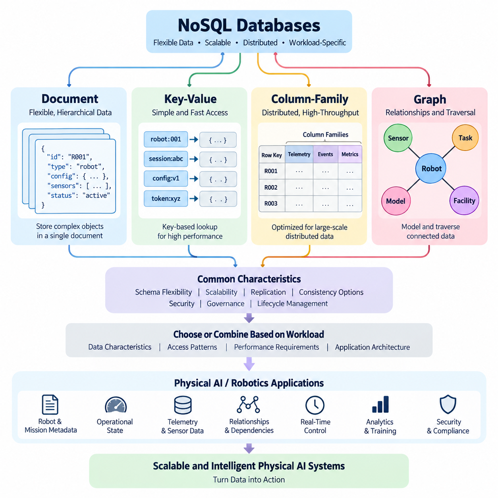
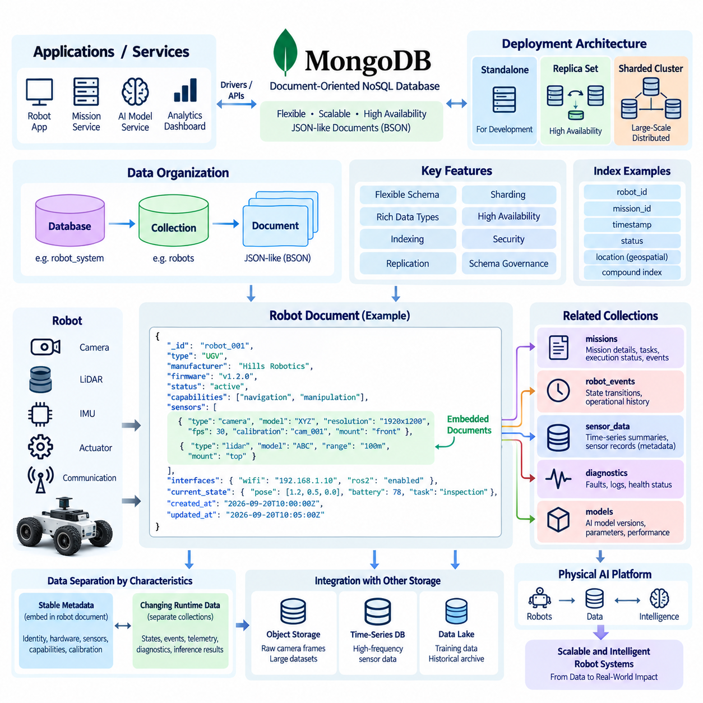
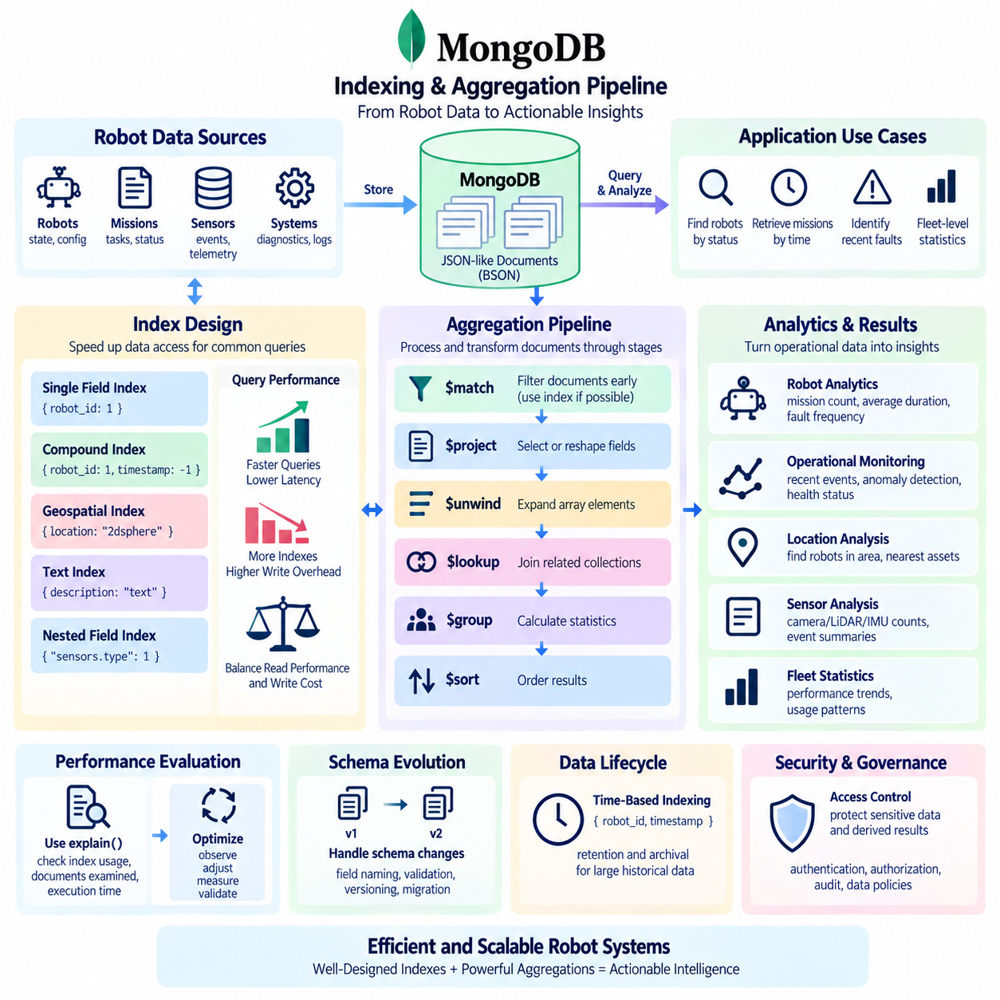
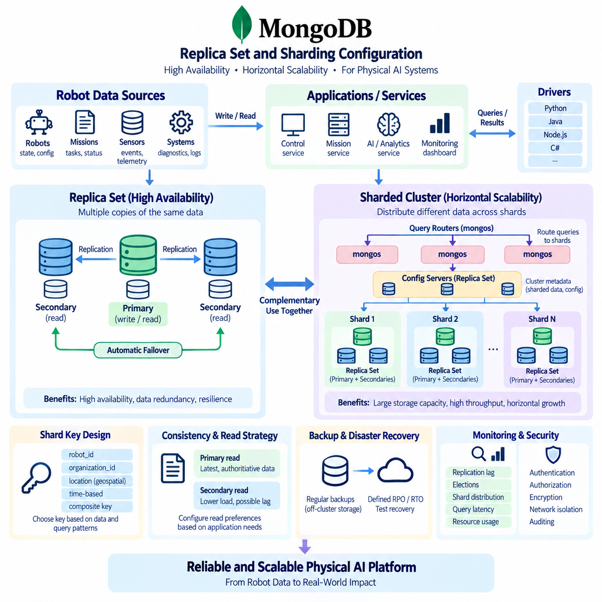
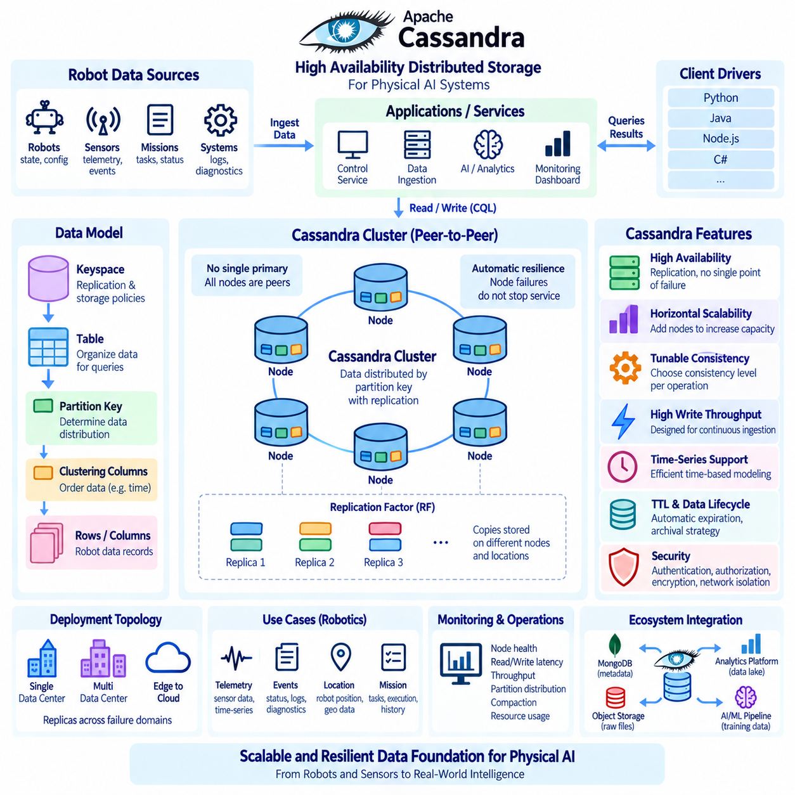
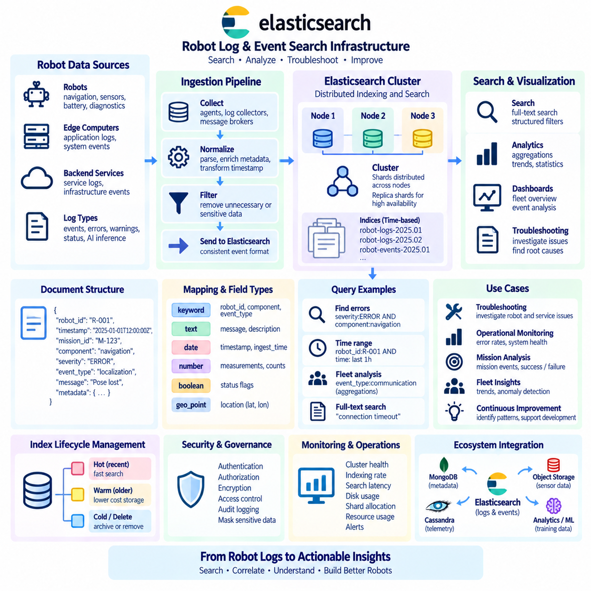
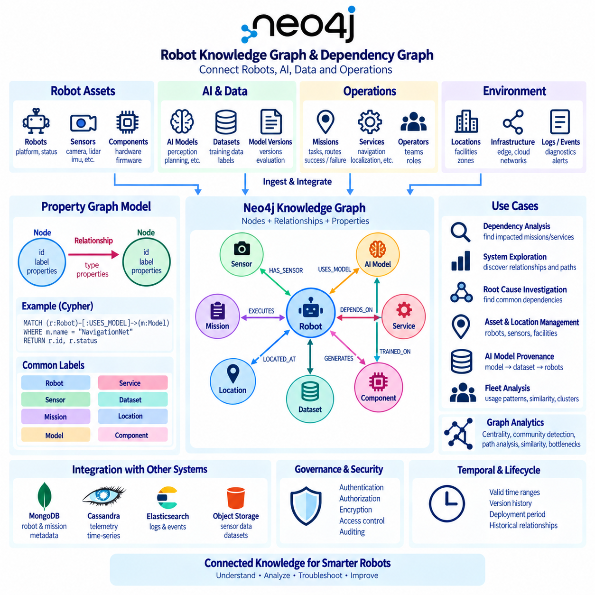
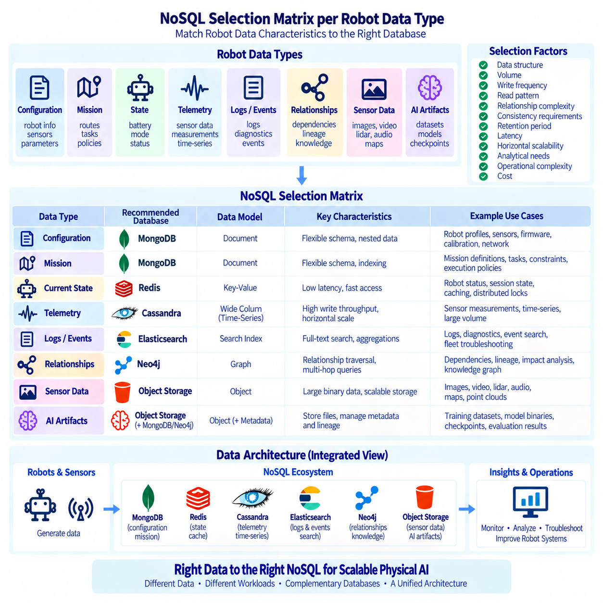
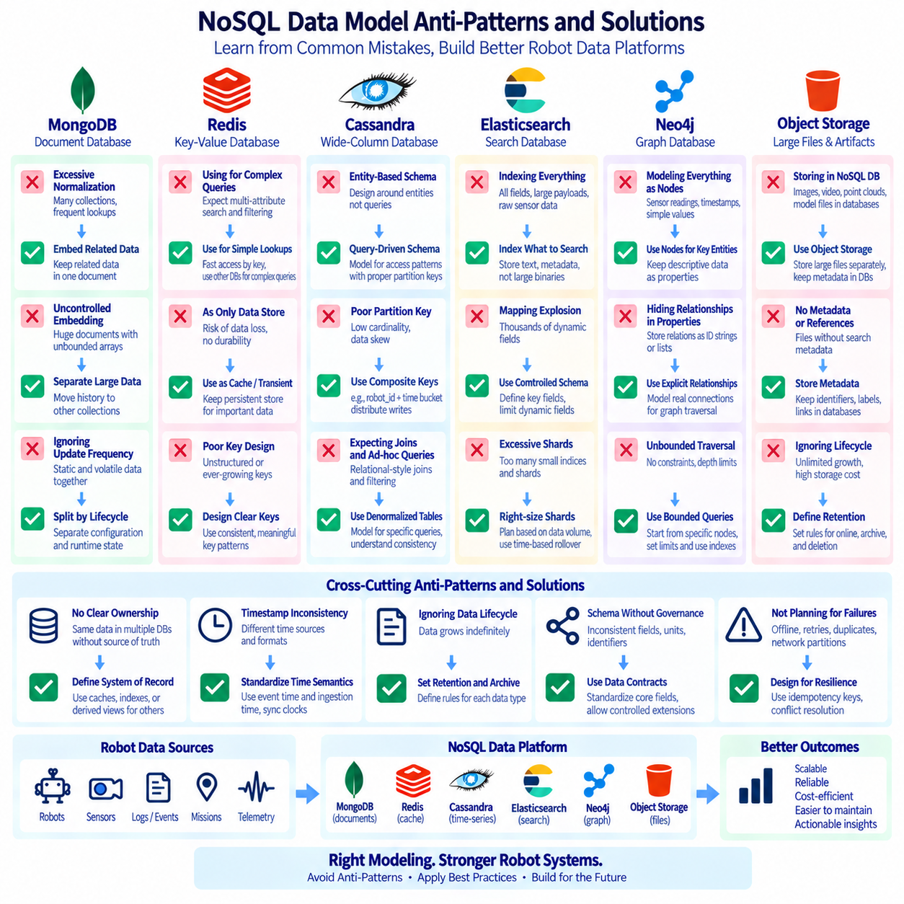
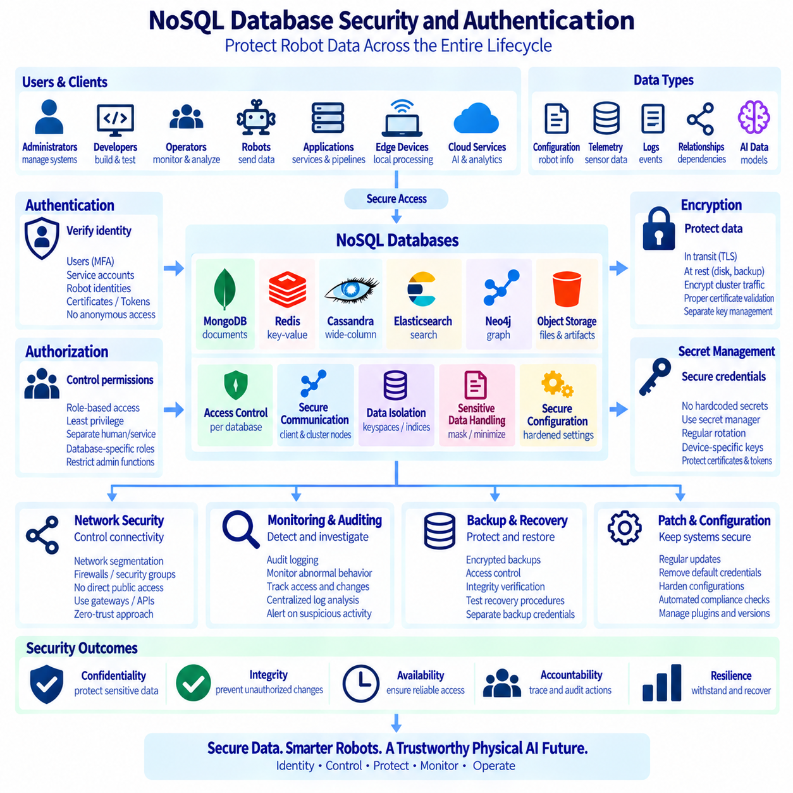

**Volume 08 Robot Database and Storage**


# 03. NoSQL Databases

##  

## 03.01 NoSQL Type Classification: Document, KV, Column, Graph

{width="7.268055555555556in" height="7.268055555555556in"}

NoSQL databases are designed to manage data models that do not fit naturally into the fixed rows and columns of a traditional relational database. Rather than requiring every record to conform to a predefined schema, NoSQL systems generally emphasize flexible data structures, horizontal scalability, distributed operation, and workload-specific optimization. The term NoSQL does not mean that these databases cannot use query languages or structured data; instead, it commonly refers to approaches that move beyond the relational model to support large-scale, rapidly changing, or highly connected datasets.

Document databases organize information as self-contained documents, commonly represented using JSON-like structures. A document can contain nested objects, arrays, and different attributes from other documents, allowing applications to evolve their data model without repeatedly changing a centralized schema. This model is particularly suitable when application objects naturally correspond to stored records. For example, a robot mission document could contain mission metadata, sensor configurations, execution parameters, status information, and nested event records within a single logical unit.

Key-value databases use one of the simplest NoSQL models: each item is identified by a unique key and associated with a value. The database primarily focuses on retrieving or updating the value efficiently when the key is known. Because the model has very little structural overhead, key-value systems are widely used for caching, session management, configuration storage, distributed state, and high-throughput lookup operations. In a Physical AI environment, a robot identifier could serve as a key while the associated value stores its latest operational state, configuration, or temporary control information.

Column-family databases organize data around column families rather than conventional relational rows. Although the terminology can be confusing because relational databases also contain columns, the underlying storage and access model is substantially different. Column-family systems are designed for distributed workloads in which enormous datasets must be partitioned across many machines. They are particularly useful when applications repeatedly access related groups of attributes across very large datasets, such as telemetry records, event histories, machine observations, or large-scale analytical workloads generated by many robots.

Graph databases represent information through nodes, relationships, and properties. Instead of treating relationships as secondary connections that must be reconstructed through joins, the relationship itself becomes a first-class element of the data model. This makes graph databases appropriate for problems in which connectivity and traversal are central to the application. Examples include robot-to-sensor relationships, dependency networks, facility layouts, knowledge graphs, task dependencies, asset relationships, and multi-agent interaction structures.

The four major NoSQL categories therefore differ primarily in how they represent and retrieve information. Document databases emphasize flexible hierarchical records, key-value databases emphasize extremely efficient key-based access, column-family databases emphasize distributed storage and scalable access to large collections of related attributes, and graph databases emphasize relationships and traversal. These distinctions are not merely implementation details; they influence application architecture, query patterns, indexing strategies, consistency requirements, and the way developers design data around operational workloads.

Document databases are often a natural choice when the application frequently reads or writes an entire logical object. A document can preserve the relationship between closely related fields without requiring multiple tables and joins. This can simplify application development and reduce the number of database operations required to reconstruct an object. However, excessive document nesting or duplication can make updates difficult when the same information appears in many documents. Good document design therefore requires understanding access patterns rather than simply copying application objects directly into the database.

Key-value databases are particularly effective when predictable, low-latency access is more important than complex querying. Applications typically know the key before requesting the associated value, allowing the database to optimize the lookup path. This characteristic makes the model useful for robot session states, temporary inference results, authentication tokens, cache entries, and rapidly changing control metadata. Its simplicity is also a limitation: when applications need sophisticated filtering, relationships, or ad hoc queries across many attributes, a pure key-value model may require additional indexing or another data system.

Column-family databases become valuable when data volume and distributed throughput dominate the architectural requirements. A system can partition data across multiple machines and distribute storage and processing while maintaining an access model optimized for specific query patterns. This makes the approach useful for large-scale telemetry, historical sensor observations, event streams, and time-oriented operational records. However, column-family databases generally require careful planning of partition keys and query patterns because their performance depends heavily on how data is distributed and retrieved across the cluster.

Graph databases provide a different optimization target by making relationships explicit. In a relational design, discovering all connected entities may require multiple joins, while a graph model can traverse relationships directly. This is useful for applications where the question itself is relationship-oriented, such as identifying which sensors contribute to a perception pipeline, which robots depend on a particular edge service, or which components are connected through a physical or logical infrastructure. Graph modeling is especially powerful when relationships change frequently or when multi-hop exploration is a fundamental part of the workload.

The choice among these NoSQL types should therefore begin with the application\'s access patterns rather than with database popularity. If the application primarily stores flexible business or operational objects, a document model may be appropriate. If it requires extremely fast access through known identifiers, a key-value model may be more suitable. If it must process very large distributed datasets with predictable high-volume access patterns, a column-family architecture may be useful. If the dominant requirement is relationship traversal and network analysis, a graph database may provide a more natural representation.

NoSQL systems also differ in how they approach consistency, availability, partition tolerance, replication, and transactions. Some systems provide strong consistency for particular operations, while others prioritize availability and scalability across distributed environments. Modern NoSQL databases increasingly provide more sophisticated transaction and consistency capabilities than their early implementations, so it is inaccurate to assume that every NoSQL database follows the same consistency model. The architectural decision should instead examine the guarantees provided by the specific database and the consequences of those guarantees for the application.

Schema flexibility is another important characteristic of NoSQL databases, but flexibility should not be confused with the absence of structure. A production system still needs clearly defined data contracts, validation rules, versioning policies, naming conventions, retention rules, and ownership responsibilities. Without these controls, a flexible schema can gradually become inconsistent and difficult to maintain. For long-lived Physical AI systems, schema evolution should therefore be managed deliberately so that changes in robot firmware, sensor configurations, perception models, and operational metadata do not make historical data unusable.

NoSQL databases can also be combined rather than selected as mutually exclusive alternatives. A Physical AI platform may use a document database for robot and mission metadata, a key-value database for fast operational state, a column-family database for high-volume telemetry, and a graph database for relationships among robots, sensors, models, facilities, and tasks. This polyglot persistence approach can align each workload with a storage model optimized for its dominant access pattern. However, it also increases operational complexity, requiring consistent identity management, monitoring, backup policies, security controls, and data integration mechanisms.

In robotics and Physical AI, this classification becomes particularly important because data arrives at different speeds and serves different purposes. High-frequency sensor streams may require distributed time-oriented storage, while robot configuration is better represented as a structured document. Temporary inference state may require extremely fast key-based access, while relationships among robots, devices, tasks, and models may benefit from graph representation. Treating all of these workloads as one homogeneous database problem can create unnecessary compromises in performance, scalability, and maintainability.

A practical NoSQL architecture should therefore begin by separating data according to its semantic role and operational behavior. Data that changes rapidly, data that must remain historically traceable, data that requires relationship traversal, and data that must be retrieved with extremely low latency may require different storage strategies. The resulting architecture should then define clear interfaces between these systems rather than allowing every application component to access every database directly. This separation supports controlled evolution and makes it easier to replace or scale individual storage components.

Another consideration is the lifecycle of data. Robot systems continuously generate observations, events, configurations, model outputs, diagnostics, and operational histories. Some information is needed only for seconds or minutes, while other information may need to remain available for years for training, validation, compliance, or system analysis. NoSQL databases can support different lifecycle strategies through partitioning, replication, expiration policies, archival processes, and tiered storage. These mechanisms should be designed together with the data governance model rather than treated as database administration tasks alone.

Security and governance must also be incorporated into NoSQL architecture from the beginning. Flexible schemas can make it easier for sensitive or operationally important fields to appear unexpectedly in stored documents or event records. Access controls, encryption, authentication, audit logging, retention policies, and data classification should therefore apply at both the database and application layers. In distributed robotic environments, the architecture should additionally consider which data may remain on edge systems, which data may move to an on-premises platform, and which information may be transferred to centralized or cloud infrastructure.

Ultimately, the classification of NoSQL databases provides a framework for matching data characteristics with storage behavior. Document, key-value, column-family, and graph databases each represent different assumptions about how information is structured and accessed. The objective is not to identify one universal replacement for relational databases, but to select or combine models according to workload requirements. For Physical AI systems, this means designing storage around robot state, sensor data, operational events, knowledge relationships, and lifecycle requirements so that the data architecture can scale together with the intelligence and physical complexity of the system.

NoSQL 데이터베이스(NoSQL databases)는 전통적인 관계형 데이터베이스(relational database)의 고정된 행과 열 구조에 자연스럽게 맞지 않는 데이터를 관리하기 위해 설계되었습니다. 각 레코드가 사전에 정의된 스키마(schema)를 반드시 따르도록 요구하기보다는, NoSQL 시스템은 일반적으로 유연한 데이터 구조(data structure), 수평적 확장성(horizontal scalability), 분산 운영(distributed operation), 그리고 워크로드별 최적화(workload-specific optimization)를 강조합니다. NoSQL이라는 용어는 이러한 데이터베이스가 쿼리 언어나 구조화된 데이터를 사용할 수 없다는 의미가 아니라, 대규모·급변 데이터 또는 고도로 연결된 데이터를 지원하기 위해 관계형 모델(relational model)을 넘어서는 접근 방식을 일반적으로 의미합니다.

문서형 데이터베이스(Document databases)는 일반적으로 JSON과 유사한 구조로 표현되는 독립적인 문서(document)에 정보를 구성합니다. 하나의 문서는 중첩 객체(nested objects), 배열(arrays), 그리고 서로 다른 속성(attributes)을 포함할 수 있으므로, 중앙 집중식 스키마를 반복적으로 변경하지 않고도 애플리케이션의 데이터 모델을 발전시킬 수 있습니다. 이러한 모델은 애플리케이션 객체(application object)가 저장되는 레코드와 자연스럽게 대응하는 경우에 특히 적합합니다. 예를 들어 로봇 임무 문서(robot mission document)는 임무 메타데이터(mission metadata), 센서 구성(sensor configuration), 실행 파라미터(execution parameters), 상태 정보(status information), 그리고 중첩된 이벤트 기록(event records)을 하나의 논리적 단위로 포함할 수 있습니다.

키-값 데이터베이스(Key-value databases)는 가장 단순한 NoSQL 모델 중 하나로, 각 항목(item)을 고유한 키(unique key)로 식별하고 그 키에 값을 연결합니다. 데이터베이스는 주로 키를 알고 있는 상태에서 값을 효율적으로 검색하거나 갱신하는 데 초점을 둡니다. 구조적 오버헤드(structural overhead)가 매우 적기 때문에 키-값 시스템은 캐싱(caching), 세션 관리(session management), 구성 정보 저장(configuration storage), 분산 상태(distributed state), 고처리량 조회(high-throughput lookup) 등에 널리 사용됩니다. Physical AI 환경에서는 로봇 식별자(robot identifier)를 키로 사용하고, 연결된 값에 최신 운용 상태(operational state), 구성(configuration), 또는 임시 제어 정보(temporary control information)를 저장할 수 있습니다.

컬럼 패밀리 데이터베이스(Column-family databases)는 기존의 관계형 행(relational row)이 아니라 컬럼 패밀리(column family)를 중심으로 데이터를 구성합니다. 관계형 데이터베이스 역시 컬럼을 포함하기 때문에 용어가 혼동될 수 있지만, 기본적인 저장 및 접근 모델(storage and access model)은 상당히 다릅니다. 컬럼 패밀리 시스템은 방대한 데이터셋을 여러 머신에 분산해야 하는 분산 워크로드(distributed workload)를 위해 설계되었습니다. 이러한 시스템은 많은 로봇에서 생성되는 텔레메트리 기록(telemetry records), 이벤트 이력(event histories), 기계 관측 데이터(machine observations), 대규모 분석 워크로드(large-scale analytical workloads)와 같이 매우 큰 데이터셋에서 서로 관련된 속성 그룹을 반복적으로 접근하는 경우에 특히 유용합니다.

그래프 데이터베이스(Graph databases)는 노드(nodes), 관계(relationships), 속성(properties)을 통해 정보를 표현합니다. 관계형 데이터베이스에서는 관계가 조인을 통해 다시 구성해야 하는 부차적인 연결로 취급되는 경우가 많지만, 그래프 데이터베이스에서는 관계 자체가 데이터 모델의 1급 요소(first-class element)가 됩니다. 따라서 그래프 데이터베이스는 연결성과 탐색(traversal)이 애플리케이션의 핵심인 문제에 적합합니다. 예로는 로봇과 센서의 관계(robot-to-sensor relationships), 의존성 네트워크(dependency networks), 시설 레이아웃(facility layouts), 지식 그래프(knowledge graphs), 작업 의존성(task dependencies), 자산 관계(asset relationships), 다중 에이전트 상호작용(multi-agent interaction) 구조 등이 있습니다.

따라서 네 가지 주요 NoSQL 범주는 정보를 표현하고 검색하는 방식에서 주로 차이가 있습니다. 문서형 데이터베이스는 유연한 계층적 레코드(flexible hierarchical records)를 강조하고, 키-값 데이터베이스는 매우 효율적인 키 기반 접근(key-based access)을 강조하며, 컬럼 패밀리 데이터베이스는 대규모 관련 속성 집합에 대한 분산 저장(distributed storage)과 확장 가능한 접근(scalable access)을 강조하고, 그래프 데이터베이스는 관계와 탐색(relationships and traversal)을 강조합니다. 이러한 차이는 단순한 구현 세부사항이 아니라 애플리케이션 아키텍처(application architecture), 쿼리 패턴(query patterns), 인덱싱 전략(indexing strategies), 일관성 요구사항(consistency requirements), 그리고 워크로드를 중심으로 데이터를 설계하는 방식에 영향을 미칩니다.

문서형 데이터베이스는 애플리케이션이 하나의 논리적 객체(logical object)를 전체적으로 자주 읽거나 기록하는 경우 자연스러운 선택이 될 수 있습니다. 하나의 문서 안에서 밀접하게 관련된 필드 간의 관계를 유지할 수 있으므로, 여러 테이블과 조인을 사용하지 않고도 객체를 표현할 수 있습니다. 이는 애플리케이션 개발을 단순화하고 객체를 재구성하는 데 필요한 데이터베이스 연산 횟수를 줄일 수 있습니다. 그러나 과도한 문서 중첩(document nesting)이나 데이터 중복(duplication)은 동일한 정보가 여러 문서에 저장될 경우 갱신을 어렵게 만들 수 있습니다. 따라서 좋은 문서 설계(document design)는 단순히 애플리케이션 객체를 데이터베이스에 그대로 복사하는 것이 아니라 실제 접근 패턴(access patterns)을 이해하는 것에서 시작해야 합니다.

키-값 데이터베이스는 복잡한 쿼리보다 예측 가능한 저지연 접근(low-latency access)이 중요한 경우 특히 효과적입니다. 애플리케이션은 일반적으로 값을 요청하기 전에 키를 알고 있기 때문에 데이터베이스는 조회 경로를 효율적으로 최적화할 수 있습니다. 이러한 특성은 로봇 세션 상태(robot session state), 임시 추론 결과(temporary inference results), 인증 토큰(authentication tokens), 캐시 항목(cache entries), 빠르게 변경되는 제어 메타데이터(control metadata) 등에 유용합니다. 단순성은 동시에 한계이기도 합니다. 여러 속성을 기준으로 복잡한 필터링이나 관계 탐색, 임의 쿼리(ad hoc query)가 필요한 경우 순수한 키-값 모델만으로는 충분하지 않을 수 있으며 추가적인 인덱싱이나 다른 데이터 시스템이 필요할 수 있습니다.

컬럼 패밀리 데이터베이스는 데이터 규모와 분산 처리량(distributed throughput)이 핵심적인 아키텍처 요구사항이 되는 경우 유용합니다. 시스템은 데이터를 여러 머신에 분할(partition)하고 저장 및 처리를 분산시키면서 특정 쿼리 패턴(query patterns)에 최적화된 접근 모델을 유지할 수 있습니다. 따라서 대규모 텔레메트리(large-scale telemetry), 과거 센서 관측 데이터(historical sensor observations), 이벤트 스트림(event streams), 대규모 운영 기록(operational records) 등에 적합합니다. 그러나 컬럼 패밀리 데이터베이스는 파티션 키(partition key)와 쿼리 패턴을 신중하게 설계해야 합니다. 클러스터 전체에서 데이터가 어떻게 분산되고 검색되는지가 성능에 큰 영향을 미치기 때문입니다.

그래프 데이터베이스는 관계를 명시적으로 표현함으로써 다른 종류의 최적화 목표를 제공합니다. 관계형 설계에서는 연결된 모든 엔터티(entities)를 찾기 위해 여러 조인이 필요할 수 있지만, 그래프 모델에서는 관계를 직접 탐색할 수 있습니다. 이는 어떤 센서가 특정 인지 파이프라인(perception pipeline)에 기여하는지, 어떤 로봇이 특정 엣지 서비스(edge service)에 의존하는지, 또는 어떤 구성요소가 물리적·논리적 인프라를 통해 연결되어 있는지를 파악하는 것과 같은 관계 중심 질문에 유용합니다. 특히 관계가 자주 변경되거나 다단계 탐색(multi-hop exploration)이 핵심적인 작업인 경우 그래프 모델링(graph modeling)의 장점이 더욱 커집니다.

따라서 NoSQL 유형을 선택할 때는 데이터베이스의 인기도보다 애플리케이션의 접근 패턴(access patterns)에서 시작해야 합니다. 애플리케이션이 주로 유연한 비즈니스 또는 운영 객체(operational objects)를 저장한다면 문서 모델(document model)이 적합할 수 있습니다. 알려진 식별자를 통해 매우 빠른 접근이 필요하다면 키-값 모델(key-value model)이 적합할 수 있습니다. 매우 큰 분산 데이터셋에 대해 예측 가능한 고처리량 접근이 필요하다면 컬럼 패밀리 아키텍처(column-family architecture)가 유용할 수 있습니다. 관계 탐색과 네트워크 분석이 주요 요구사항이라면 그래프 데이터베이스(graph database)가 보다 자연스러운 표현을 제공할 수 있습니다.

NoSQL 시스템은 일관성(consistency), 가용성(availability), 파티션 내성(partition tolerance), 복제(replication), 트랜잭션(transactions)을 다루는 방식에서도 차이가 있습니다. 일부 시스템은 특정 연산에 대해 강한 일관성(strong consistency)을 제공하는 반면, 다른 시스템은 분산 환경에서 가용성과 확장성을 우선시합니다. 현대의 NoSQL 데이터베이스는 초기 구현보다 훨씬 정교한 트랜잭션 및 일관성 기능을 제공하는 경우가 많으므로 모든 NoSQL 데이터베이스가 동일한 일관성 모델(consistency model)을 따른다고 가정해서는 안 됩니다. 대신 특정 데이터베이스가 제공하는 보장 수준과 그 보장이 애플리케이션에 미치는 영향을 검토해야 합니다.

스키마 유연성(schema flexibility)은 NoSQL 데이터베이스의 중요한 특징이지만, 유연성이 구조의 부재(absence of structure)를 의미하는 것은 아닙니다. 실제 운영 시스템에서는 명확하게 정의된 데이터 계약(data contracts), 검증 규칙(validation rules), 버전 관리 정책(versioning policies), 명명 규칙(naming conventions), 보존 규칙(retention rules), 책임 주체(ownership)가 여전히 필요합니다. 이러한 통제가 없다면 유연한 스키마는 점차 불일치하고 관리하기 어려운 형태로 변할 수 있습니다. 장기간 운영되는 Physical AI 시스템에서는 로봇 펌웨어(robot firmware), 센서 구성(sensor configurations), 인지 모델(perception models), 운영 메타데이터(operational metadata)의 변화가 과거 데이터를 사용할 수 없게 만들지 않도록 스키마 진화(schema evolution)를 체계적으로 관리해야 합니다.

NoSQL 데이터베이스는 서로 배타적인 선택지가 아니라 서로 결합하여 사용할 수도 있습니다. Physical AI 플랫폼은 로봇 및 임무 메타데이터(robot and mission metadata)에 문서형 데이터베이스를 사용하고, 빠른 운영 상태(operational state)에 키-값 데이터베이스를 사용하며, 대용량 텔레메트리(high-volume telemetry)에 컬럼 패밀리 데이터베이스를 사용하고, 로봇·장치·모델·시설·작업 간 관계에는 그래프 데이터베이스를 사용할 수 있습니다. 이러한 다중 데이터 저장(polyglot persistence) 접근 방식은 각 워크로드를 지배적인 접근 패턴에 최적화된 저장 모델에 연결할 수 있습니다. 그러나 동시에 운영 복잡성이 증가하므로 일관된 식별자 관리(identity management), 모니터링(monitoring), 백업 정책(backup policies), 보안 통제(security controls), 데이터 통합 메커니즘(data integration mechanisms)이 필요합니다.

로봇공학(robotics)과 Physical AI에서는 데이터가 서로 다른 속도로 생성되고 서로 다른 목적을 수행하기 때문에 이러한 분류가 특히 중요합니다. 고주파 센서 스트림(high-frequency sensor streams)은 분산된 시간 기반 저장소(distributed time-oriented storage)를 필요로 할 수 있는 반면, 로봇 구성(robot configuration)은 구조화된 문서(structured document)로 표현하는 것이 적합할 수 있습니다. 임시 추론 상태(temporary inference state)는 매우 빠른 키 기반 접근이 필요할 수 있고, 로봇·센서·작업·모델 간 관계는 그래프 표현(graph representation)의 이점을 얻을 수 있습니다. 이러한 모든 워크로드를 하나의 동질적인 데이터베이스 문제로 취급하면 성능, 확장성, 유지보수성에서 불필요한 절충이 발생할 수 있습니다.

실용적인 NoSQL 아키텍처는 데이터의 의미적 역할(semantic role)과 운영 특성(operational behavior)에 따라 데이터를 분리하는 것에서 시작해야 합니다. 빠르게 변경되는 데이터, 과거 이력을 추적해야 하는 데이터, 관계 탐색이 필요한 데이터, 극히 낮은 지연시간으로 검색해야 하는 데이터는 서로 다른 저장 전략(storage strategies)을 필요로 할 수 있습니다. 이후 이러한 시스템 간에 명확한 인터페이스(interface)를 정의해야 하며, 모든 애플리케이션 구성요소가 모든 데이터베이스에 직접 접근하도록 만들어서는 안 됩니다. 이러한 분리는 시스템의 통제된 진화(controlled evolution)를 지원하고 개별 저장 구성요소를 교체하거나 확장하기 쉽게 만듭니다.

또 다른 중요한 고려사항은 데이터의 생명주기(data lifecycle)입니다. 로봇 시스템은 관측 데이터(observations), 이벤트(events), 구성 정보(configurations), 모델 출력(model outputs), 진단 정보(diagnostics), 운영 이력(operational histories)을 지속적으로 생성합니다. 일부 정보는 몇 초 또는 몇 분 동안만 필요하지만, 다른 정보는 학습(training), 검증(validation), 규정 준수(compliance), 시스템 분석(system analysis)을 위해 수년 동안 보존해야 할 수 있습니다. NoSQL 데이터베이스는 파티셔닝(partitioning), 복제(replication), 만료 정책(expiration policies), 아카이빙(archiving), 계층형 저장(tiered storage) 등을 통해 서로 다른 데이터 생명주기 전략을 지원할 수 있습니다. 이러한 기능은 단순한 데이터베이스 관리 작업으로 취급하기보다는 데이터 거버넌스(data governance) 모델과 함께 설계해야 합니다.

보안(security)과 거버넌스(governance) 역시 NoSQL 아키텍처에 처음부터 포함되어야 합니다. 유연한 스키마는 민감하거나 운영상 중요한 필드가 예상하지 못한 형태로 저장된 문서나 이벤트 기록에 나타나는 것을 쉽게 만들 수 있습니다. 따라서 접근 제어(access control), 암호화(encryption), 인증(authentication), 감사 로깅(audit logging), 보존 정책(retention policies), 데이터 분류(data classification)는 데이터베이스 계층과 애플리케이션 계층 모두에 적용되어야 합니다. 분산 로봇 환경에서는 어떤 데이터가 엣지 시스템(edge systems)에 남아야 하는지, 어떤 데이터가 온프레미스 플랫폼(on-premises platform)으로 이동해야 하는지, 어떤 정보가 중앙 또는 클라우드 인프라(cloud infrastructure)로 전송될 수 있는지도 함께 고려해야 합니다.

궁극적으로 NoSQL 데이터베이스의 분류는 데이터의 특성과 저장 동작(storage behavior)을 연결하기 위한 프레임워크를 제공합니다. 문서형(document), 키-값(key-value), 컬럼 패밀리(column-family), 그래프(graph) 데이터베이스는 각각 정보가 어떻게 구조화되고 접근되는지에 대해 서로 다른 가정을 가지고 있습니다. 목표는 관계형 데이터베이스를 대체할 하나의 보편적인 데이터베이스를 찾는 것이 아니라, 워크로드 요구사항에 따라 적절한 모델을 선택하거나 결합하는 것입니다. Physical AI 시스템에서는 로봇 상태(robot state), 센서 데이터(sensor data), 운영 이벤트(operational events), 지식 관계(knowledge relationships), 데이터 생명주기 요구사항(data lifecycle requirements)을 중심으로 저장소를 설계함으로써 데이터 아키텍처(data architecture)가 지능과 물리적 복잡성의 증가에 맞춰 확장될 수 있도록 해야 합니다.

##  

## 03.02 MongoDB Architecture and Robot Document Modeling [w/Code]

{width="7.268055555555556in" height="7.268055555555556in"}

MongoDB is a document-oriented NoSQL database designed to store and process data as flexible, JSON-like documents rather than fixed relational rows. Internally, MongoDB uses BSON (Binary JSON) to represent documents, providing support for nested objects, arrays, timestamps, numeric types, and binary data. This model allows application data to remain close to its natural structure while supporting schema evolution. For robotics and Physical AI systems, this flexibility is useful because robot configurations, sensor descriptions, mission parameters, and operational states can change as hardware and software evolve.

A MongoDB architecture typically consists of applications or services communicating with database servers through drivers and APIs. A MongoDB deployment may operate as a standalone server for development, a replica set for high availability, or a sharded cluster for large-scale distributed workloads. Applications interact with collections containing related documents rather than directly managing physical storage structures. This separation allows developers to focus on logical data models while MongoDB manages indexing, storage, replication, and distributed database operations.

The basic organizational hierarchy is straightforward: a MongoDB deployment contains databases, databases contain collections, and collections contain documents. A collection is conceptually similar to a table but does not require every document to have exactly the same fields. Documents contain field-value pairs and may include embedded objects or arrays. This structure is particularly appropriate for robot data because one robot may have a different sensor configuration, software version, or capability set from another robot while still belonging to the same logical collection.

A robot document can represent a complete logical identity and operational description of a robot. Typical fields may include a robot identifier, platform type, manufacturer information, firmware version, capabilities, sensor configuration, communication interfaces, current status, and timestamps. Related information that is normally accessed together can be embedded within the same document. This approach reduces the need to reconstruct a robot object through multiple joins and allows an application to retrieve a meaningful operational representation through a single document query.

Embedded documents are especially useful when the relationship between data elements is strong and the embedded information is normally accessed together with its parent object. For example, a robot document can contain an array of cameras, LiDAR sensors, IMUs, and actuators, with each element containing its own configuration parameters. A camera entry could describe its model, resolution, frame rate, calibration reference, and mounting position. This design creates a self-contained representation of the robot configuration while preserving the hierarchical relationship between the robot and its components.

However, embedding everything into one document is not always appropriate. MongoDB document design should be based on access patterns, update frequency, document growth, and relationship characteristics. Information that changes independently, grows without a predictable upper bound, or is shared by many entities may be better represented as a separate collection. For example, a robot\'s current configuration may be embedded, while millions of historical sensor events should normally be stored separately. This distinction prevents individual robot documents from becoming excessively large and difficult to update.

Robot operational data can therefore be divided into relatively stable metadata and continuously changing runtime information. Stable metadata may include robot identity, hardware specifications, installed sensors, capabilities, and calibration references. Runtime information may include current pose, battery state, active task, connectivity status, fault conditions, and recent inference results. MongoDB can store these structures in separate but related collections when their update frequencies differ significantly. This separation supports efficient access while preserving a consistent logical relationship through identifiers and references.

MongoDB indexes are essential when robot collections become large or queries become frequent. An index can support searches by robot identifier, mission identifier, timestamp, status, location, or other commonly queried fields. Compound indexes can support queries involving multiple fields, while specialized indexes can be considered for geospatial or text-oriented workloads. Index design should follow actual query patterns because unnecessary indexes consume storage and can increase write overhead. In a Physical AI platform, indexes should therefore be selected according to operational queries rather than added indiscriminately.

MongoDB also supports replication through replica sets, allowing multiple database nodes to maintain copies of data and providing mechanisms for high availability. A primary node normally accepts writes while secondary nodes replicate the data. If the primary becomes unavailable, the replica set can elect another suitable member. This architecture is valuable for robotic systems where operational metadata and mission information may need to remain accessible despite infrastructure failures. Replication should nevertheless be designed together with recovery objectives, network conditions, and consistency requirements.

For larger deployments, MongoDB sharding can distribute data across multiple servers. Sharding becomes relevant when a single server cannot efficiently provide the required storage capacity, throughput, or scalability. A shard key determines how documents are distributed across the cluster, making its selection an important architectural decision. In robot fleets, candidate dimensions might include robot identifiers, geographic regions, organizations, or time-related partitioning strategies, depending on the dominant access pattern. A poorly selected shard key can create uneven distribution and reduce the benefits of horizontal scaling.

A practical robot document model should also support temporal information without confusing current state with historical evidence. The current robot state may be updated frequently, while historical states, telemetry summaries, mission events, and diagnostic records should generally remain immutable or append-oriented. MongoDB can support both patterns, but they should be modeled differently. For example, a robot document can contain the latest operational state, while a separate event collection stores timestamped state transitions. This distinction makes it easier to reconstruct operational history without constantly expanding the main robot document.

In Physical AI systems, MongoDB can serve as an operational data layer connecting robots, missions, sensors, models, and services. A mission document may reference a robot, task definition, model version, environment, execution status, and important events. A robot document can maintain its capabilities and configuration, while separate collections can retain mission histories, inference records, diagnostics, and selected sensor summaries. This structure creates a practical boundary between rapidly changing operational information and larger datasets that may be better managed by specialized storage systems.

MongoDB should not necessarily become the storage system for every type of robot data. High-frequency raw camera frames, LiDAR streams, large training datasets, and long-term time-series telemetry can quickly exceed the practical scope of an operational document database. These datasets may be stored in object storage, time-series systems, data lakes, or other specialized platforms, while MongoDB stores their metadata, identifiers, locations, processing states, and relationships. This architecture allows MongoDB to act as an operational coordination layer without forcing one database to handle every workload.

Schema governance remains important even though MongoDB permits flexible document structures. Production systems should define required fields, data types, naming conventions, validation rules, versioning mechanisms, and migration procedures. A robot document created by one software version should remain understandable to later versions of the system. Schema version fields can help applications interpret historical documents correctly. Controlled schema evolution is particularly important in robotics because hardware revisions, firmware updates, new sensors, and AI model changes can occur throughout the operational lifetime of a robot.

Security should also be incorporated into MongoDB architecture from the beginning. Authentication and authorization should restrict which applications, services, and users can access particular databases or collections. Encryption, network isolation, audit logging, backup protection, and credential management should be considered according to the operational environment. In a Physical AI architecture, edge robots may generate data locally while selected information is synchronized with an on-premises MongoDB cluster. The synchronization boundary should therefore be explicitly defined so that operational data remains controlled while required information becomes available to higher-level services.

The resulting MongoDB architecture can be understood as a document-centered operational model in which each robot is represented through structured yet adaptable information. Robot identity, configuration, capabilities, current state, missions, events, and relationships can be organized according to how applications actually use them. Embedding supports closely related information, references support independently managed entities, indexes support operational queries, replication supports availability, and sharding supports horizontal growth. Together, these mechanisms allow MongoDB to provide a flexible data foundation for robot fleets and Physical AI applications while remaining interoperable with specialized systems for large-scale sensor, training, and historical data.

MongoDB는 고정된 관계형 행(relational rows)이 아니라 유연한 JSON 유사 문서(JSON-like documents) 형태로 데이터를 저장하고 처리하도록 설계된 문서 지향 NoSQL 데이터베이스(document-oriented NoSQL database)입니다. MongoDB는 내부적으로 BSON(Binary JSON)을 사용하여 문서를 표현하며, 중첩 객체(nested objects), 배열(arrays), 타임스탬프(timestamps), 숫자형 데이터(numeric types), 바이너리 데이터(binary data) 등을 지원합니다. 이러한 모델을 통해 애플리케이션 데이터는 자연스러운 구조를 유지하면서 스키마 진화(schema evolution)를 지원할 수 있습니다. 로봇공학(robotics)과 Physical AI 시스템에서는 하드웨어와 소프트웨어가 발전함에 따라 로봇 구성(robot configuration), 센서 설명(sensor descriptions), 임무 파라미터(mission parameters), 운영 상태(operational states)가 변경될 수 있기 때문에 이러한 유연성이 특히 유용합니다.

MongoDB 아키텍처(MongoDB architecture)는 일반적으로 드라이버(driver)와 API를 통해 데이터베이스 서버와 통신하는 애플리케이션 또는 서비스로 구성됩니다. MongoDB 배포 환경(MongoDB deployment)은 개발 단계에서는 독립형 서버(standalone server)로 운영할 수 있고, 고가용성(high availability)을 위해 레플리카 세트(replica set)로 운영하거나, 대규모 분산 워크로드(distributed workloads)를 위해 샤딩 클러스터(sharded cluster)로 운영할 수 있습니다. 애플리케이션은 물리적인 저장 구조를 직접 관리하기보다는 관련 문서를 포함하는 컬렉션(collection)과 상호작용합니다. 이러한 분리를 통해 개발자는 논리적 데이터 모델(logical data model)에 집중할 수 있으며, MongoDB는 인덱싱(indexing), 저장(storage), 복제(replication), 분산 데이터베이스 작업(distributed database operations)을 관리할 수 있습니다.

기본적인 조직 구조는 비교적 단순합니다. MongoDB 배포 환경에는 데이터베이스(database)가 있고, 데이터베이스에는 컬렉션(collection)이 있으며, 컬렉션에는 문서(document)가 포함됩니다. 컬렉션은 개념적으로 테이블(table)과 유사하지만 모든 문서가 정확히 동일한 필드를 가져야 할 필요는 없습니다. 문서는 필드-값 쌍(field-value pairs)으로 구성되며 중첩 객체(nested objects)나 배열(arrays)을 포함할 수 있습니다. 이러한 구조는 로봇 데이터에 특히 적합합니다. 동일한 논리적 컬렉션에 속한 로봇이라도 서로 다른 센서 구성(sensor configuration), 소프트웨어 버전(software version), 능력(capability)을 가질 수 있기 때문입니다.

로봇 문서(robot document)는 하나의 로봇에 대한 완전한 논리적 식별 정보와 운영 정보를 표현할 수 있습니다. 일반적인 필드에는 로봇 식별자(robot identifier), 플랫폼 유형(platform type), 제조업체 정보(manufacturer information), 펌웨어 버전(firmware version), 능력(capabilities), 센서 구성(sensor configuration), 통신 인터페이스(communication interfaces), 현재 상태(current status), 타임스탬프(timestamps) 등이 포함될 수 있습니다. 일반적으로 함께 접근되는 관련 정보를 동일한 문서에 내장(embedding)할 수도 있습니다. 이러한 방식은 여러 조인을 사용하여 로봇 객체를 다시 구성해야 하는 필요성을 줄이며, 애플리케이션이 단일 문서 쿼리(single document query)를 통해 의미 있는 운영 정보를 가져올 수 있도록 합니다.

임베디드 문서(embedded documents)는 데이터 요소 사이의 관계가 강하고 해당 정보가 일반적으로 상위 객체(parent object)와 함께 접근되는 경우 특히 유용합니다. 예를 들어 로봇 문서에는 카메라(camera), LiDAR 센서, IMU, 액추에이터(actuator)의 배열을 포함할 수 있으며, 각 요소에는 자체 구성 파라미터(configuration parameters)를 포함할 수 있습니다. 카메라 항목(camera entry)은 모델(model), 해상도(resolution), 프레임 속도(frame rate), 보정 참조(calibration reference), 장착 위치(mounting position) 등을 설명할 수 있습니다. 이러한 설계는 로봇 구성에 대한 자기 완결형 표현(self-contained representation)을 만들면서 로봇과 구성요소 사이의 계층적 관계(hierarchical relationship)를 유지합니다.

그러나 모든 정보를 하나의 문서에 내장하는 것이 항상 적절한 것은 아닙니다. MongoDB 문서 설계(document design)는 접근 패턴(access patterns), 업데이트 빈도(update frequency), 문서 증가(document growth), 관계 특성(relationship characteristics)을 기반으로 해야 합니다. 독립적으로 변경되거나, 예측할 수 없는 크기로 계속 증가하거나, 여러 엔터티가 공유하는 정보는 별도의 컬렉션으로 표현하는 것이 더 적절할 수 있습니다. 예를 들어 로봇의 현재 구성(current configuration)은 내장할 수 있지만, 수백만 건의 과거 센서 이벤트(historical sensor events)는 일반적으로 별도로 저장하는 것이 적절합니다. 이러한 구분은 개별 로봇 문서가 지나치게 커지거나 업데이트하기 어려워지는 것을 방지합니다.

따라서 로봇 운영 데이터(robot operational data)는 비교적 안정적인 메타데이터(stable metadata)와 지속적으로 변경되는 런타임 정보(runtime information)로 구분할 수 있습니다. 안정적인 메타데이터에는 로봇 식별 정보(robot identity), 하드웨어 사양(hardware specifications), 설치된 센서(installed sensors), 능력(capabilities), 보정 참조(calibration references) 등이 포함될 수 있습니다. 런타임 정보에는 현재 위치와 자세(current pose), 배터리 상태(battery state), 활성 작업(active task), 연결 상태(connectivity status), 오류 상태(fault conditions), 최근 추론 결과(recent inference results) 등이 포함될 수 있습니다. MongoDB는 이러한 구조를 업데이트 빈도가 크게 다른 경우 서로 관련된 별도의 컬렉션에 저장할 수 있도록 지원합니다. 이러한 분리는 효율적인 접근을 지원하면서도 식별자(identifier)와 참조(reference)를 통해 일관된 논리적 관계를 유지할 수 있도록 합니다.

MongoDB 인덱스(indexes)는 로봇 컬렉션의 규모가 커지거나 쿼리가 빈번해질 때 필수적입니다. 인덱스는 로봇 식별자(robot identifier), 임무 식별자(mission identifier), 타임스탬프(timestamp), 상태(status), 위치(location) 또는 자주 조회되는 기타 필드를 기준으로 검색을 지원할 수 있습니다. 복합 인덱스(compound indexes)는 여러 필드를 포함하는 쿼리를 지원할 수 있으며, 지리공간(geospatial) 또는 텍스트 기반 워크로드(text-oriented workloads)를 위해 특수 인덱스(specialized indexes)를 사용할 수도 있습니다. 인덱스 설계는 실제 쿼리 패턴을 따라야 합니다. 불필요한 인덱스는 저장 공간을 사용하고 쓰기 작업(write overhead)을 증가시킬 수 있기 때문입니다. 따라서 Physical AI 플랫폼에서는 인덱스를 무분별하게 추가하기보다 실제 운영 쿼리(operational queries)에 따라 선택해야 합니다.

MongoDB는 레플리카 세트(replica sets)를 통한 복제(replication)도 지원하며, 이를 통해 여러 데이터베이스 노드(database nodes)가 데이터 사본을 유지하고 고가용성을 위한 메커니즘을 제공할 수 있습니다. 일반적으로 프라이머리 노드(primary node)가 쓰기 작업을 처리하고 세컨더리 노드(secondary nodes)가 데이터를 복제합니다. 프라이머리가 사용할 수 없게 되면 레플리카 세트는 적절한 다른 구성원을 선출할 수 있습니다. 이러한 구조는 인프라 장애(infrastructure failure)가 발생하더라도 운영 메타데이터와 임무 정보에 계속 접근해야 하는 로봇 시스템에 유용합니다. 그러나 복제는 복구 목표(recovery objectives), 네트워크 조건(network conditions), 일관성 요구사항(consistency requirements)과 함께 설계해야 합니다.

대규모 배포 환경에서는 MongoDB 샤딩(sharding)을 사용하여 여러 서버에 데이터를 분산할 수 있습니다. 샤딩은 단일 서버가 필요한 저장 용량(storage capacity), 처리량(throughput), 확장성(scalability)을 효율적으로 제공할 수 없을 때 중요해집니다. 샤드 키(shard key)는 클러스터에서 문서가 어떻게 분산되는지를 결정하므로 그 선택이 중요한 아키텍처 결정이 됩니다. 로봇 플릿(robot fleet)에서는 주요 접근 패턴에 따라 로봇 식별자, 지리적 영역(geographic regions), 조직(organizations), 시간 기반 파티셔닝 전략(time-related partitioning strategies) 등이 후보가 될 수 있습니다. 잘못 선택된 샤드 키는 데이터 분포를 불균형하게 만들고 수평 확장(horizontal scaling)의 장점을 감소시킬 수 있습니다.

실용적인 로봇 문서 모델(robot document model)은 시간 정보(temporal information)를 지원하면서 현재 상태(current state)와 과거의 증거(historical evidence)를 혼동하지 않도록 해야 합니다. 현재 로봇 상태는 자주 업데이트될 수 있지만, 과거 상태(historical states), 텔레메트리 요약(telemetry summaries), 임무 이벤트(mission events), 진단 기록(diagnostic records)은 일반적으로 변경 불가능(immutable)하거나 추가 중심(append-oriented) 방식으로 유지하는 것이 적절합니다. MongoDB는 두 가지 패턴을 모두 지원할 수 있지만 서로 다른 방식으로 모델링해야 합니다. 예를 들어 로봇 문서에는 최신 운영 상태를 저장하고, 별도의 이벤트 컬렉션에는 타임스탬프가 포함된 상태 전환(state transitions)을 저장할 수 있습니다. 이러한 구분은 기본 로봇 문서를 지속적으로 확장하지 않고도 운영 이력을 재구성할 수 있도록 합니다.

Physical AI 시스템에서 MongoDB는 로봇, 임무, 센서, 모델, 서비스를 연결하는 운영 데이터 계층(operational data layer)으로 사용할 수 있습니다. 임무 문서(mission document)는 로봇, 작업 정의(task definition), 모델 버전(model version), 환경(environment), 실행 상태(execution status), 주요 이벤트(important events)를 참조할 수 있습니다. 로봇 문서는 능력과 구성을 관리하고, 별도의 컬렉션은 임무 이력(mission histories), 추론 기록(inference records), 진단 정보(diagnostics), 선택된 센서 요약(sensor summaries)을 보존할 수 있습니다. 이러한 구조는 빠르게 변경되는 운영 정보와 다른 특수 저장 시스템에서 관리하는 것이 적합한 대규모 데이터셋 사이에 실용적인 경계를 만듭니다.

MongoDB가 모든 유형의 로봇 데이터를 저장하는 시스템이 될 필요는 없습니다. 고주파 원시 카메라 프레임(high-frequency raw camera frames), LiDAR 스트림(LiDAR streams), 대규모 학습 데이터셋(large training datasets), 장기간의 시계열 텔레메트리(long-term time-series telemetry)는 운영용 문서 데이터베이스의 실질적인 범위를 빠르게 초과할 수 있습니다. 이러한 데이터셋은 객체 저장소(object storage), 시계열 시스템(time-series systems), 데이터 레이크(data lakes) 또는 기타 특수 플랫폼(specialized platforms)에 저장하고, MongoDB에는 해당 데이터의 메타데이터(metadata), 식별자(identifiers), 위치(locations), 처리 상태(processing states), 관계(relationships)를 저장할 수 있습니다. 이러한 아키텍처를 통해 MongoDB는 운영 조정 계층(operational coordination layer)으로 기능하면서 하나의 데이터베이스에 모든 워크로드를 처리하도록 강제하지 않을 수 있습니다.

MongoDB가 유연한 문서 구조를 허용하더라도 스키마 거버넌스(schema governance)는 여전히 중요합니다. 운영 시스템에서는 필수 필드(required fields), 데이터 유형(data types), 명명 규칙(naming conventions), 검증 규칙(validation rules), 버전 관리 메커니즘(versioning mechanisms), 마이그레이션 절차(migration procedures)를 정의해야 합니다. 특정 소프트웨어 버전에서 생성된 로봇 문서는 이후 버전의 시스템에서도 이해할 수 있어야 합니다. 스키마 버전 필드(schema version fields)를 사용하면 애플리케이션이 과거 문서를 올바르게 해석하는 데 도움이 될 수 있습니다. 로봇공학에서는 로봇의 운영 수명 동안 하드웨어 개정(hardware revisions), 펌웨어 업데이트(firmware updates), 새로운 센서, AI 모델 변경 등이 발생할 수 있으므로 통제된 스키마 진화(controlled schema evolution)가 특히 중요합니다.

보안(security) 역시 MongoDB 아키텍처에 처음부터 포함되어야 합니다. 인증(authentication)과 권한 부여(authorization)는 어떤 애플리케이션, 서비스, 사용자가 특정 데이터베이스 또는 컬렉션에 접근할 수 있는지를 제한해야 합니다. 암호화(encryption), 네트워크 격리(network isolation), 감사 로깅(audit logging), 백업 보호(backup protection), 자격 증명 관리(credential management)는 운영 환경에 따라 고려해야 합니다. Physical AI 아키텍처에서는 엣지 로봇(edge robots)이 로컬에서 데이터를 생성하고 선택된 정보만 온프레미스 MongoDB 클러스터(on-premises MongoDB cluster)와 동기화할 수 있습니다. 따라서 동기화 경계(synchronization boundary)를 명확하게 정의하여 운영 데이터를 통제하면서도 필요한 정보가 상위 서비스(higher-level services)에서 활용될 수 있도록 해야 합니다.

결과적으로 MongoDB 아키텍처는 각 로봇을 구조화되면서도 유연하게 변화할 수 있는 정보의 중심으로 표현하는 문서 중심 운영 모델(document-centered operational model)로 이해할 수 있습니다. 로봇 식별 정보(robot identity), 구성(configuration), 능력(capabilities), 현재 상태(current state), 임무(missions), 이벤트(events), 관계(relationships)는 실제 애플리케이션의 사용 방식에 따라 구성할 수 있습니다. 임베딩(embedding)은 밀접하게 관련된 정보를 지원하고, 참조(references)는 독립적으로 관리되는 엔터티를 지원하며, 인덱스(indexes)는 운영 쿼리를 지원하고, 복제(replication)는 가용성을 지원하며, 샤딩(sharding)은 수평적 확장을 지원합니다. 이러한 기능을 결합하면 MongoDB는 로봇 플릿과 Physical AI 애플리케이션을 위한 유연한 데이터 기반(data foundation)을 제공하면서도 대규모 센서 데이터, 학습 데이터, 과거 데이터에는 특수 시스템을 함께 사용할 수 있는 상호운용성(interoperability)을 유지할 수 있습니다.

##  

## 03.03 MongoDB Index and Aggregation Pipeline Design [w/Code]

{width="7.268055555555556in" height="7.268055555555556in"}

MongoDB indexing and aggregation pipeline design are essential for transforming a document database from a simple storage layer into an efficient operational data platform. In a robot or Physical AI system, applications may need to locate robots by status, retrieve missions by time, identify recent faults, summarize sensor events, or calculate fleet-level statistics. Indexes accelerate selective data access, while aggregation pipelines transform and summarize documents. Their design should therefore begin with actual application queries and operational workloads rather than with database structures alone.

An index provides MongoDB with an optimized access path for finding documents that satisfy common query conditions. Without an appropriate index, MongoDB may need to examine many or all documents in a collection, which becomes increasingly expensive as the robot fleet and historical records grow. A simple index on \`robot_id\`, for example, can efficiently locate a specific robot document. Indexes can also be created on fields such as \`status\`, \`mission_id\`, \`timestamp\`, \`location\`, or other attributes that appear frequently in operational queries.

Compound indexes are useful when queries commonly filter or sort using multiple fields. For example, a query that retrieves recent events for a particular robot may frequently use both \`robot_id\` and \`timestamp\`. A compound index such as \`{robot_id: 1, timestamp: -1}\` can support this access pattern efficiently. The order of fields in a compound index matters because MongoDB uses the index according to its defined field sequence. Index design should therefore reflect real query patterns rather than simply creating separate indexes for every field that appears in the database.

Index selection also requires balancing read performance against write overhead. Every additional index consumes storage and must be updated when documents are inserted, modified, or deleted. Excessive indexing can therefore increase write latency and resource consumption. In a robotics environment where operational state changes frequently, unnecessary indexes may become particularly costly. A practical strategy is to identify high-frequency and performance-sensitive queries first, measure their execution behavior, and then create indexes that directly support those workloads.

MongoDB also provides specialized indexing mechanisms for particular data types and access patterns. Geospatial indexes can support location-based queries, allowing applications to find robots or assets within a geographic area or near a specified position. Text-oriented indexes can support searches over appropriate textual fields, while indexes on nested fields can support queries inside embedded documents. These capabilities are valuable when robot information contains spatial configuration, mission descriptions, diagnostic information, or other structured attributes that require selective retrieval.

Aggregation pipelines provide a mechanism for processing documents through a sequence of transformation stages. Each stage receives documents from the previous stage, performs an operation, and passes the resulting documents to the next stage. Common stages include \`\$match\` for filtering, \`\$project\` for selecting or reshaping fields, \`\$group\` for aggregation, \`\$sort\` for ordering, \`\$unwind\` for expanding arrays, and \`\$lookup\` for combining information from related collections. This pipeline model allows complex analytical operations to be expressed as a controlled sequence of transformations.

A typical robot analytics pipeline may begin with \`\$match\` to restrict processing to a specific robot fleet, time interval, or operational state. A subsequent \`\$project\` stage can retain only the fields required for analysis, reducing unnecessary data movement. \`\$group\` can then calculate metrics such as the number of missions, average execution duration, fault frequency, or sensor-event counts. Finally, \`\$sort\` can arrange the results according to operational importance or time. This sequence separates filtering, transformation, calculation, and presentation into understandable processing stages.

The position of \`\$match\` within an aggregation pipeline is particularly important. Filtering documents as early as possible can reduce the amount of data that subsequent stages need to process. When an appropriate index supports the initial filtering conditions, MongoDB may also use that index to avoid scanning the entire collection. For example, a pipeline analyzing only recent events for one robot should ideally begin with conditions on \`robot_id\` and \`timestamp\`. This approach can substantially reduce processing requirements when the underlying collection contains a large historical dataset.

Aggregation design should also consider the difference between operational queries and analytical workloads. Operational queries typically require a small number of documents with low latency, such as retrieving the current state of a robot. Analytical queries may process thousands or millions of documents to calculate fleet-level statistics. MongoDB aggregation can support many such workloads, but very large analytical datasets may eventually be better handled by dedicated analytical platforms, data warehouses, data lakes, or specialized time-series systems. MongoDB should therefore be positioned according to the actual workload rather than being forced to perform every type of analysis.

The \`\$lookup\` stage can combine documents from different collections and is useful when information is intentionally modeled separately. For example, a mission document may reference a robot through \`robot_id\`, while another collection stores robot metadata. A pipeline can use \`\$lookup\` to combine these datasets when producing an operational report. However, frequent and complex cross-collection operations may indicate that the data model or access pattern should be reconsidered. MongoDB encourages thoughtful document modeling, so embedding frequently accessed related data can sometimes be more efficient than repeatedly reconstructing relationships through aggregation.

Array processing is particularly relevant to robot documents because sensors, capabilities, tasks, and events are often represented as arrays. The \`\$unwind\` stage can transform each array element into an individual pipeline document, allowing the application to analyze sensors or events separately. For example, a robot document containing multiple sensors can be unwound to calculate the number of cameras, LiDAR devices, or IMUs across a fleet. After processing, \`\$group\` can recombine information into fleet-level statistics. This pattern provides a flexible way to analyze hierarchical robot configuration data.

Aggregation pipelines can also support operational monitoring and anomaly analysis. A pipeline can filter recent diagnostic events, group them by robot or fault type, calculate occurrence frequencies, and sort the results to identify recurring problems. Similar processing can summarize model inference outcomes, mission completion rates, battery behavior, or communication failures. These results can be stored, returned to dashboards, or passed to higher-level services. In a Physical AI architecture, such pipelines can therefore form an important bridge between raw operational records and actionable system intelligence.

Time-based indexing and aggregation are especially important for robotics because many operational events are naturally associated with timestamps. A compound index combining an entity identifier and time can support queries such as recent events for a specific robot. Aggregation pipelines can then group events by hour, day, mission, robot, or operational phase. This allows the system to calculate trends without requiring every historical record to remain in the active operational view. Retention and archival policies should also be considered so that increasingly large historical collections do not degrade routine operational performance.

Pipeline performance should be evaluated using actual execution statistics rather than assumptions. MongoDB provides tools such as \`explain()\` that can reveal whether a query uses an index, how many documents are examined, and how many results are returned. These measurements help identify collection scans, inefficient index usage, excessive sorting, and other bottlenecks. Performance optimization should therefore follow a cycle of query observation, index or pipeline adjustment, measurement, and validation. This approach is particularly important in Physical AI systems where workload characteristics may change as the number of robots and sensors increases.

Index and aggregation design should also account for schema evolution. Robot documents may gain new sensor types, model metadata, operational states, or mission attributes over time. Queries and pipelines should therefore be designed so that reasonable schema changes do not immediately break operational services. Explicit field naming, validation rules, schema versioning, and controlled migration procedures can make aggregation logic more maintainable. When different generations of robots produce slightly different document structures, pipelines may need to normalize those structures before performing fleet-level analysis.

Security and governance are also relevant to indexing and aggregation. Indexes can expose the existence of sensitive fields through operational behavior, while aggregation pipelines may combine information from multiple collections into outputs that have broader visibility than the original records. Access control should therefore be applied according to the sensitivity of both source data and derived results. In a Physical AI environment, operational location, mission information, diagnostics, and system configuration may require different access policies. Aggregation should be treated not only as a performance mechanism but also as a controlled data transformation process.

A well-designed MongoDB system ultimately connects document modeling, indexing, and aggregation into a single workload-oriented architecture. Document structures should reflect how robot information is naturally accessed, indexes should accelerate the most important query patterns, and aggregation pipelines should transform operational records into useful summaries and insights. The goal is not to maximize the number of indexes or create increasingly complex pipelines, but to establish predictable and measurable data access. For Physical AI systems, this enables robot fleets, missions, sensor metadata, diagnostics, and operational events to become efficiently searchable and analytically useful without sacrificing scalability or maintainability.

MongoDB 인덱싱(indexing)과 집계 파이프라인(aggregation pipeline) 설계는 문서 데이터베이스(document database)를 단순한 저장 계층(storage layer)에서 효율적인 운영 데이터 플랫폼(operational data platform)으로 발전시키는 데 필수적입니다. 로봇 또는 Physical AI 시스템에서는 상태에 따라 로봇을 검색하거나, 시간에 따라 임무를 조회하거나, 최근 장애를 식별하거나, 로봇 플릿(fleet) 전체의 통계를 계산해야 하는 경우가 많습니다. 인덱스(indexes)는 선택적인 데이터 접근(selective data access)을 가속하고, 집계 파이프라인은 문서를 변환하고 요약합니다. 따라서 이러한 설계는 데이터베이스 구조 자체보다 실제 애플리케이션 쿼리와 운영 워크로드(operational workloads)에서 시작해야 합니다.

인덱스(index)는 자주 사용되는 조건을 만족하는 문서를 찾기 위한 최적화된 접근 경로(optimized access path)를 MongoDB에 제공합니다. 적절한 인덱스가 없다면 MongoDB는 많은 수의 문서 또는 컬렉션의 거의 모든 문서를 검사해야 할 수 있으며, 로봇 플릿과 과거 기록의 규모가 증가할수록 이러한 비용은 커집니다. 예를 들어 \`robot_id\`에 대한 단순 인덱스를 사용하면 특정 로봇 문서를 효율적으로 찾을 수 있습니다. 또한 \`status\`, \`mission_id\`, \`timestamp\`, \`location\` 또는 운영 쿼리에서 자주 사용되는 다른 속성에도 인덱스를 생성할 수 있습니다.

복합 인덱스(compound index)는 여러 필드를 기준으로 필터링하거나 정렬하는 쿼리가 빈번할 때 유용합니다. 예를 들어 특정 로봇의 최근 이벤트를 조회하는 쿼리가 \`robot_id\`와 \`timestamp\`를 함께 사용하는 경우가 많다면 \`{robot_id: 1, timestamp: -1}\`과 같은 복합 인덱스를 사용하여 이러한 접근 패턴을 효율적으로 지원할 수 있습니다. 복합 인덱스에서 필드의 순서는 중요합니다. MongoDB는 정의된 필드 순서에 따라 인덱스를 사용하기 때문입니다. 따라서 인덱스 설계는 데이터베이스에 존재하는 모든 필드에 개별 인덱스를 만드는 것이 아니라 실제 쿼리 패턴을 반영해야 합니다.

인덱스 선택에서는 읽기 성능(read performance)과 쓰기 오버헤드(write overhead) 사이의 균형도 고려해야 합니다. 추가되는 모든 인덱스는 저장 공간을 사용하며, 문서가 삽입(insert), 수정(update), 삭제(delete)될 때 함께 갱신되어야 합니다. 따라서 과도한 인덱싱은 쓰기 지연시간(write latency)과 시스템 자원 소비(resource consumption)를 증가시킬 수 있습니다. 운영 상태가 빈번하게 변경되는 로봇 환경에서는 불필요한 인덱스가 특히 높은 비용을 초래할 수 있습니다. 실용적인 전략은 먼저 사용 빈도가 높고 성능에 민감한 쿼리를 식별하고, 실행 동작을 측정한 다음 해당 워크로드를 직접 지원하는 인덱스를 생성하는 것입니다.

MongoDB는 특정 데이터 유형과 접근 패턴을 위해 특수 인덱싱 메커니즘(specialized indexing mechanisms)도 제공합니다. 지리공간 인덱스(geospatial index)는 위치 기반 쿼리를 지원하여 애플리케이션이 특정 영역 내에 있거나 지정된 위치 근처에 있는 로봇 또는 자산을 찾을 수 있도록 합니다. 텍스트 기반 인덱스(text-oriented index)는 적절한 텍스트 필드에 대한 검색을 지원할 수 있으며, 중첩 필드(nested fields)에 대한 인덱스는 임베디드 문서 내부의 데이터를 검색하는 데 사용할 수 있습니다. 이러한 기능은 공간적 구성(spatial configuration), 임무 설명(mission descriptions), 진단 정보(diagnostic information) 또는 선택적인 검색이 필요한 기타 구조화된 속성을 포함하는 로봇 데이터에 유용합니다.

집계 파이프라인(aggregation pipeline)은 일련의 변환 단계(transformation stages)를 거쳐 문서를 처리하는 메커니즘을 제공합니다. 각 단계는 이전 단계에서 전달받은 문서를 입력으로 받아 특정 작업을 수행한 후 결과를 다음 단계로 전달합니다. 대표적인 단계에는 필터링을 위한 \`\$match\`, 필드 선택 및 구조 변경을 위한 \`\$project\`, 집계를 위한 \`\$group\`, 정렬을 위한 \`\$sort\`, 배열 확장을 위한 \`\$unwind\`, 관련 컬렉션과의 결합을 위한 \`\$lookup\` 등이 있습니다. 이러한 파이프라인 모델을 사용하면 복잡한 분석 작업을 통제된 변환 단계의 순서로 표현할 수 있습니다.

일반적인 로봇 분석 파이프라인(robot analytics pipeline)은 먼저 \`\$match\`를 사용하여 특정 로봇 플릿, 시간 구간, 또는 운영 상태로 처리 범위를 제한할 수 있습니다. 이후 \`\$project\` 단계에서는 분석에 필요한 필드만 남겨 불필요한 데이터 이동을 줄일 수 있습니다. \`\$group\` 단계에서는 임무 수, 평균 실행 시간, 장애 발생 빈도, 센서 이벤트 수와 같은 지표를 계산할 수 있습니다. 마지막으로 \`\$sort\`를 사용하여 운영상 중요도나 시간 순서에 따라 결과를 정렬할 수 있습니다. 이러한 순서는 필터링, 변환, 계산, 표현을 서로 이해하기 쉬운 처리 단계로 분리합니다.

집계 파이프라인에서 \`\$match\`의 위치는 특히 중요합니다. 가능한 한 이른 단계에서 문서를 필터링하면 이후 단계에서 처리해야 하는 데이터의 양을 줄일 수 있습니다. 초기 필터링 조건을 적절한 인덱스가 지원하는 경우 MongoDB는 해당 인덱스를 사용하여 전체 컬렉션 스캔(collection scan)을 피할 수도 있습니다. 예를 들어 특정 로봇의 최근 이벤트만 분석하는 파이프라인이라면 \`robot_id\`와 \`timestamp\`를 기준으로 시작하는 것이 바람직합니다. 이러한 접근은 기본 컬렉션에 대규모 과거 데이터가 존재할 때 처리 요구량을 크게 줄일 수 있습니다.

집계 설계에서는 운영 쿼리(operational queries)와 분석 워크로드(analytical workloads)의 차이도 고려해야 합니다. 운영 쿼리는 일반적으로 현재 로봇 상태를 조회하는 것처럼 적은 수의 문서를 낮은 지연시간으로 가져오는 것이 목적입니다. 반면 분석 쿼리는 로봇 플릿 전체의 통계를 계산하기 위해 수천 또는 수백만 개의 문서를 처리할 수 있습니다. MongoDB 집계는 이러한 많은 워크로드를 지원할 수 있지만, 매우 큰 분석 데이터셋은 결국 전용 분석 플랫폼(analytical platform), 데이터 웨어하우스(data warehouse), 데이터 레이크(data lake), 또는 특수 시계열 시스템(specialized time-series system)이 더 적합할 수 있습니다. 따라서 MongoDB가 모든 유형의 분석을 수행하도록 강제하기보다 실제 워크로드에 따라 역할을 정의해야 합니다.

\`\$lookup\` 단계는 서로 다른 컬렉션의 문서를 결합할 수 있으며, 의도적으로 데이터를 분리하여 모델링한 경우 유용합니다. 예를 들어 임무 문서(mission document)는 \`robot_id\`를 통해 로봇을 참조하고, 다른 컬렉션에는 로봇 메타데이터(robot metadata)가 저장될 수 있습니다. 파이프라인은 \`\$lookup\`을 사용하여 운영 보고서(operational report)를 생성할 때 이러한 데이터셋을 결합할 수 있습니다. 그러나 빈번하고 복잡한 컬렉션 간 연산(cross-collection operation)이 필요하다면 데이터 모델이나 접근 패턴을 다시 검토해야 할 수도 있습니다. MongoDB는 신중한 문서 모델링(document modeling)을 권장하므로 자주 함께 접근하는 관련 데이터를 임베딩(embedding)하는 것이 반복적인 관계 재구성보다 효율적일 수 있습니다.

배열 처리(array processing)는 센서, 능력, 작업, 이벤트가 배열 형태로 표현되는 경우가 많은 로봇 문서에서 특히 중요합니다. \`\$unwind\` 단계는 배열의 각 요소를 개별 파이프라인 문서로 변환하여 센서나 이벤트를 각각 분석할 수 있도록 합니다. 예를 들어 여러 센서를 포함하는 로봇 문서를 \`\$unwind\`하여 로봇 플릿 전체의 카메라, LiDAR 장치 또는 IMU 개수를 계산할 수 있습니다. 처리 이후에는 \`\$group\`을 사용하여 정보를 다시 플릿 수준의 통계로 결합할 수 있습니다. 이러한 패턴은 계층적인 로봇 구성 데이터(hierarchical robot configuration data)를 유연하게 분석하는 방법을 제공합니다.

집계 파이프라인은 운영 모니터링(operational monitoring)과 이상 분석(anomaly analysis)도 지원할 수 있습니다. 파이프라인은 최근 진단 이벤트를 필터링하고, 로봇 또는 장애 유형별로 그룹화하고, 발생 빈도를 계산한 다음, 반복적으로 발생하는 문제를 식별하기 위해 결과를 정렬할 수 있습니다. 유사한 처리를 통해 AI 모델 추론 결과, 임무 완료율, 배터리 동작, 통신 장애 등을 요약할 수 있습니다. 이러한 결과는 저장하거나 대시보드(dashboard)에 전달하거나 상위 서비스(higher-level services)로 전달할 수 있습니다. 따라서 Physical AI 아키텍처에서 이러한 파이프라인은 원시 운영 기록(raw operational records)과 실행 가능한 시스템 지능(actionable system intelligence)을 연결하는 중요한 역할을 수행할 수 있습니다.

로봇공학에서는 많은 운영 이벤트가 본질적으로 타임스탬프와 연결되기 때문에 시간 기반 인덱싱(time-based indexing)과 집계가 특히 중요합니다. 엔터티 식별자(entity identifier)와 시간을 결합한 복합 인덱스는 특정 로봇의 최근 이벤트와 같은 쿼리를 지원할 수 있습니다. 이후 집계 파이프라인은 이벤트를 시간, 일, 임무, 로봇 또는 운영 단계별로 그룹화할 수 있습니다. 이를 통해 모든 과거 기록을 활성 운영 화면(active operational view)에 계속 유지하지 않고도 추세(trend)를 계산할 수 있습니다. 또한 점점 커지는 과거 데이터 컬렉션이 일상적인 운영 성능을 저하시키지 않도록 보존 및 아카이빙 정책(retention and archival policies)도 함께 고려해야 합니다.

파이프라인 성능은 가정이 아니라 실제 실행 통계(actual execution statistics)를 사용하여 평가해야 합니다. MongoDB는 \`explain()\`과 같은 도구를 제공하며, 이를 통해 쿼리가 인덱스를 사용하는지, 몇 개의 문서를 검사하는지, 몇 개의 결과를 반환하는지 등을 확인할 수 있습니다. 이러한 측정은 컬렉션 스캔(collection scan), 비효율적인 인덱스 사용, 과도한 정렬(excessive sorting) 및 기타 병목 현상을 식별하는 데 도움이 됩니다. 따라서 성능 최적화(performance optimization)는 쿼리 관찰, 인덱스 또는 파이프라인 조정, 측정, 검증의 순환 과정으로 수행해야 합니다. 이는 로봇과 센서의 수가 증가하면서 워크로드 특성이 변화할 수 있는 Physical AI 시스템에서 특히 중요합니다.

인덱스와 집계 설계는 스키마 진화(schema evolution)도 고려해야 합니다. 로봇 문서는 시간이 지나면서 새로운 센서 유형, 모델 메타데이터, 운영 상태, 임무 속성을 추가할 수 있습니다. 따라서 쿼리와 파이프라인은 합리적인 스키마 변경이 발생하더라도 운영 서비스를 즉시 중단시키지 않도록 설계해야 합니다. 명시적인 필드 이름(explicit field naming), 검증 규칙(validation rules), 스키마 버전 관리(schema versioning), 통제된 마이그레이션 절차(controlled migration procedures)는 집계 로직(aggregation logic)의 유지보수성을 높일 수 있습니다. 서로 다른 세대의 로봇이 약간씩 다른 문서 구조를 생성하는 경우에는 플릿 수준 분석을 수행하기 전에 이러한 구조를 정규화(normalize)하는 파이프라인이 필요할 수 있습니다.

보안과 거버넌스(security and governance) 역시 인덱싱과 집계와 관련된 중요한 요소입니다. 인덱스는 운영 동작을 통해 민감한 필드가 존재한다는 사실을 간접적으로 드러낼 수 있으며, 집계 파이프라인은 여러 컬렉션의 정보를 결합하여 원본 기록보다 더 넓은 범위의 접근 권한을 가진 결과를 생성할 수 있습니다. 따라서 접근 제어(access control)는 원본 데이터와 파생 결과(derived results)의 민감도에 따라 적용되어야 합니다. Physical AI 환경에서는 운영 위치, 임무 정보, 진단 정보, 시스템 구성 정보가 서로 다른 접근 정책(access policies)을 필요로 할 수 있습니다. 집계는 단순한 성능 향상 메커니즘일 뿐만 아니라 통제된 데이터 변환(controlled data transformation) 과정으로도 취급해야 합니다.

잘 설계된 MongoDB 시스템은 궁극적으로 문서 모델링(document modeling), 인덱싱(indexing), 집계(aggregation)를 하나의 워크로드 중심 아키텍처(workload-oriented architecture)로 연결합니다. 문서 구조는 로봇 정보가 실제로 어떻게 접근되는지를 반영해야 하고, 인덱스는 가장 중요한 쿼리 패턴을 가속해야 하며, 집계 파이프라인은 운영 기록을 유용한 요약과 인사이트(insights)로 변환해야 합니다. 목표는 인덱스의 수를 최대화하거나 점점 복잡한 파이프라인을 만드는 것이 아니라, 예측 가능하고 측정 가능한 데이터 접근(data access)을 확립하는 것입니다. Physical AI 시스템에서는 이를 통해 로봇 플릿, 임무, 센서 메타데이터, 진단 정보, 운영 이벤트를 효율적으로 검색하고 분석할 수 있으며, 동시에 확장성과 유지보수성을 확보할 수 있습니다.

##  

## 03.04 MongoDB ReplicaSet and Sharding Configuration [w/Code]

{width="7.268055555555556in" height="7.268055555555556in"}

MongoDB Replica Set and sharding configurations provide two complementary mechanisms for building highly available and horizontally scalable database infrastructure. A replica set maintains multiple copies of the same data across different MongoDB nodes, primarily addressing availability and resilience. Sharding distributes different portions of a dataset across multiple shards, primarily addressing storage capacity and throughput at scale. In a Physical AI platform, these mechanisms can support reliable robot metadata, mission information, operational events, and fleet-scale workloads while reducing the impact of individual infrastructure failures.

A MongoDB replica set normally consists of multiple members that maintain synchronized copies of the same dataset. One member acts as the primary and normally receives write operations, while secondary members replicate changes from the primary. If the primary becomes unavailable, an eligible secondary can participate in an election and become the new primary. This automatic failover mechanism allows applications to continue operating with limited interruption. The exact number and configuration of members should be selected according to availability objectives, failure domains, network conditions, and operational requirements.

Replica sets are particularly valuable when robot systems must continue operating despite infrastructure failures. A Physical AI control platform may store robot identities, configurations, mission assignments, model versions, and operational states in MongoDB. If one database server fails, another replica can provide continued access to the replicated dataset. However, replication is not a substitute for backup. Replica members generally contain copies of the same logical data, so accidental deletion, corruption, or an incorrect application update can potentially propagate across members. Independent backup and recovery procedures therefore remain essential.

Network topology has an important influence on replica set reliability. MongoDB members should ideally be distributed across appropriate failure domains so that a single machine, rack, power source, or network failure does not eliminate the ability to maintain an operational majority. In an on-premises robotics environment, this may involve separating database nodes across physical servers or infrastructure zones. The design should also consider network latency because replication depends on communication among members. Excessive latency or unstable connectivity can affect replication behavior and application performance.

Replica set elections are based on the ability of members to communicate and establish an appropriate voting majority. A deployment therefore needs enough suitable voting members to tolerate the expected failure scenario. Configuration should avoid creating a topology in which a common infrastructure failure simultaneously removes too many voting members. For critical Physical AI services, the database architecture should be evaluated against realistic failure scenarios such as server loss, network segmentation, power interruption, storage failure, and maintenance activities rather than assuming that every failure will affect only one component.

Read operations can also be distributed in carefully designed MongoDB deployments. Applications may be configured to read from secondary members under appropriate read preferences, potentially reducing load on the primary. However, secondary reads can expose applications to replication lag, meaning that a recently written value may not immediately be visible on every secondary. For robot control and safety-sensitive operational decisions, the application should therefore distinguish between data that requires the latest authoritative state and data that can tolerate slightly delayed information.

Sharding addresses a different problem from replication. Instead of keeping complete copies of the same dataset on every shard, sharding distributes portions of a large collection across multiple shards. A sharded MongoDB cluster normally includes shard servers, configuration servers, and \`mongos\` query routers. Applications communicate through the routing layer, while MongoDB uses metadata about data distribution to direct operations to the appropriate shard or shards. This architecture allows storage and processing capacity to grow by adding additional infrastructure.

The shard key is one of the most important decisions in a sharded MongoDB architecture. MongoDB uses the shard key to determine how documents are distributed across the cluster. A good shard key should support balanced distribution while also aligning with important query patterns. For a robot fleet, possible attributes might include \`robot_id\`, organization identifiers, geographic regions, or carefully designed combinations of fields. The correct choice depends on how data is generated and queried. A poorly selected key can create hotspots where one shard receives a disproportionate amount of traffic.

High-cardinality fields can often provide more distribution opportunities than fields with only a few possible values. For example, a \`status\` field containing values such as \`active\`, \`idle\`, and \`error\` would generally provide limited distribution because many documents share the same values. A unique or highly varied identifier may provide more opportunities for distributing documents. However, high cardinality alone does not guarantee a good shard key. The key must also be evaluated against write patterns, query targeting, data growth, and the physical distribution of workload.

Robot data can exhibit strong temporal and spatial access patterns that influence sharding decisions. Telemetry or event records may arrive continuously from many robots, while applications may frequently request data for one robot during a specific time interval. A shard key combining an entity identifier with a time-related component may sometimes align better with these workloads than a single field. However, monotonically increasing keys can create write concentration under certain configurations. Sharding should therefore be validated using representative workload measurements rather than theoretical assumptions.

A major advantage of a properly designed sharded cluster is horizontal scalability. As the number of robots, missions, events, and operational records increases, additional shards can provide more storage and processing capacity. This can be important for Physical AI platforms that evolve from a small laboratory fleet to many robots operating simultaneously. Scaling should nevertheless be planned before capacity becomes critical because shard-key selection, data migration, monitoring, and operational procedures become more complex as the cluster grows.

Replica sets and sharding are not mutually exclusive architectures. In production MongoDB deployments, each shard can itself be implemented as a replica set. This creates two layers of resilience: sharding distributes the workload across multiple shards, while replication provides redundancy within each shard. Configuration servers can also use replication to protect cluster metadata. The resulting architecture can provide both horizontal scalability and high availability, but it requires careful capacity planning because additional replicas increase infrastructure, storage, network, and operational requirements.

The application layer should also be designed to understand the distributed nature of the database. MongoDB drivers can communicate with the deployment and provide mechanisms for handling topology changes, connection failures, and retryable operations. Applications should use appropriate connection settings, timeouts, retry behavior, and error handling rather than assuming that the database endpoint will always remain unchanged. In a robotics platform, services responsible for mission management, fleet monitoring, diagnostics, and AI orchestration should be tested against database failover and temporary connectivity loss.

Data consistency requirements should influence how replica sets and sharding are configured. Some robot information, such as historical telemetry summaries or analytical results, may tolerate eventual visibility across replicas. Other information, such as active mission ownership or authoritative robot state, may require stronger consistency guarantees. MongoDB provides configurable mechanisms for controlling read and write behavior, but these settings involve trade-offs among consistency, latency, availability, and throughput. The correct configuration should therefore be determined by the semantics of each workload.

Backup and disaster recovery must be designed independently from replication and sharding. A resilient database should have defined recovery point objectives and recovery time objectives, along with tested procedures for restoring data. Backups should be stored separately from the active database infrastructure so that a failure affecting the production cluster does not automatically destroy the recovery copies. For Physical AI systems, recovery planning should also consider the relationship between MongoDB metadata and external datasets such as raw sensor data, object storage, model artifacts, and historical archives.

Monitoring is essential once MongoDB operates as a distributed system. Administrators should observe replication lag, election events, connection counts, query latency, disk usage, memory consumption, cache behavior, shard distribution, chunk or data migration activity, and error rates. Monitoring should focus not only on whether individual servers are running but also on whether the overall data service is maintaining its expected performance and availability. Early detection of uneven shard utilization or growing replication lag can prevent operational problems from becoming fleet-level failures.

Security must apply consistently across replica sets and sharded clusters. Authentication, authorization, encryption in transit, encryption at rest where required, network segmentation, certificate management, auditing, and controlled administrative access should be incorporated into the deployment architecture. Database nodes should not be exposed unnecessarily to robot networks or general application networks. In an on-premises Physical AI environment, network boundaries can separate edge systems, application services, database infrastructure, and management interfaces while allowing only explicitly required communication paths.

A practical deployment strategy should therefore begin with the workload rather than immediately selecting a complex cluster topology. A small development environment may use a single MongoDB instance, while a production service requiring high availability may use a replica set. A large fleet with substantial data growth may eventually require sharding, with each shard protected through replication. The transition between these stages should be based on measurable capacity requirements, failure tolerance, query behavior, and operational maturity rather than adopting distributed infrastructure solely because it appears more sophisticated.

Ultimately, MongoDB Replica Sets and sharding solve different but complementary architectural problems. Replica sets provide data redundancy, automated failover, and improved resilience against infrastructure failures, while sharding distributes large datasets and workloads across multiple database resources. When combined carefully, they can provide a scalable foundation for Physical AI systems in which robot fleets, missions, operational events, diagnostics, and metadata continuously increase in volume. The central design principle is to match topology, shard keys, replication policies, and recovery mechanisms to real workload and reliability requirements so that the database remains predictable as the robotic system grows.

MongoDB 레플리카 세트(Replica Set)와 샤딩(Sharding) 구성은 고가용성(high availability)과 수평적 확장성(horizontal scalability)을 갖춘 데이터베이스 인프라를 구축하기 위한 서로 보완적인 두 가지 메커니즘입니다. 레플리카 세트는 서로 다른 MongoDB 노드에 동일한 데이터의 여러 복사본을 유지하여 주로 가용성과 복원력(resilience)을 제공합니다. 샤딩은 데이터셋의 서로 다른 부분을 여러 샤드(shard)에 분산하여 주로 저장 용량과 대규모 처리량(throughput)을 해결합니다. Physical AI 플랫폼에서는 이러한 메커니즘을 활용하여 로봇 메타데이터, 임무 정보, 운영 이벤트, 대규모 플릿(fleet) 워크로드를 안정적으로 처리하고 개별 인프라 장애의 영향을 줄일 수 있습니다.

MongoDB 레플리카 세트는 일반적으로 동일한 데이터셋의 동기화된 복사본을 유지하는 여러 구성원(member)으로 구성됩니다. 하나의 구성원은 프라이머리(primary)로 동작하며 일반적으로 쓰기 작업(write operation)을 처리하고, 세컨더리(secondary) 구성원은 프라이머리에서 변경 내용을 복제합니다. 프라이머리를 사용할 수 없게 되면 적격한 세컨더리가 선거(election)에 참여하여 새로운 프라이머리가 될 수 있습니다. 이러한 자동 장애 조치(automatic failover) 메커니즘은 애플리케이션이 제한된 중단만으로 계속 작동할 수 있도록 합니다. 구성원 수와 구성은 가용성 목표(availability objectives), 장애 도메인(failure domains), 네트워크 조건(network conditions), 운영 요구사항(operational requirements)에 따라 결정해야 합니다.

레플리카 세트는 로봇 시스템이 인프라 장애에도 계속 작동해야 하는 경우 특히 중요합니다. Physical AI 제어 플랫폼은 MongoDB에 로봇 식별 정보, 구성 정보, 임무 할당, 모델 버전, 운영 상태 등을 저장할 수 있습니다. 하나의 데이터베이스 서버에 장애가 발생하더라도 다른 레플리카가 복제된 데이터셋에 대한 지속적인 접근을 제공할 수 있습니다. 그러나 복제(replication)는 백업(backup)의 대체 수단이 아닙니다. 레플리카 구성원은 일반적으로 동일한 논리적 데이터의 복사본을 보유하므로 실수로 인한 삭제, 데이터 손상, 잘못된 애플리케이션 업데이트가 모든 구성원에 전파될 수 있습니다. 따라서 독립적인 백업 및 복구 절차(backup and recovery procedures)는 여전히 필수적입니다.

네트워크 토폴로지(network topology)는 레플리카 세트의 신뢰성(reliability)에 중요한 영향을 미칩니다. 레플리카 구성원은 하나의 머신, 랙, 전원 공급원, 네트워크 장애가 발생하더라도 운영에 필요한 다수 구성원(majority)을 유지할 수 있도록 적절한 장애 도메인에 분산하는 것이 이상적입니다. 온프레미스 로봇 환경(on-premises robotics environment)에서는 데이터베이스 노드를 서로 다른 물리적 서버 또는 인프라 영역에 분리할 수 있습니다. 또한 복제는 구성원 간 통신에 의존하므로 네트워크 지연시간(network latency)도 고려해야 합니다. 과도한 지연이나 불안정한 연결은 복제 동작과 애플리케이션 성능에 영향을 줄 수 있습니다.

레플리카 세트의 선거(election)는 구성원들이 통신하고 적절한 투표 다수(voting majority)를 구성할 수 있는지를 기반으로 이루어집니다. 따라서 배포 환경은 예상되는 장애 상황을 감당할 수 있는 충분하고 적절한 투표 구성원(voting members)을 가져야 합니다. 공통 인프라 장애가 여러 투표 구성원을 동시에 제거할 수 있는 토폴로지는 피해야 합니다. 중요한 Physical AI 서비스에서는 서버 손실, 네트워크 분리(network segmentation), 전원 중단, 저장장치 장애, 유지보수 작업과 같은 현실적인 장애 시나리오를 기준으로 데이터베이스 아키텍처를 평가해야 하며, 모든 장애가 단 하나의 구성요소에만 영향을 미친다고 가정해서는 안 됩니다.

읽기 작업(read operations) 역시 신중하게 설계된 MongoDB 배포 환경에서 분산할 수 있습니다. 애플리케이션은 적절한 읽기 선호도(read preference)를 설정하여 세컨더리 구성원에서 데이터를 읽도록 구성할 수 있으며, 이를 통해 프라이머리의 부하를 줄일 수 있습니다. 그러나 세컨더리 읽기에서는 복제 지연(replication lag)이 발생할 수 있습니다. 즉, 최근에 기록된 값이 모든 세컨더리에서 즉시 보이지 않을 수 있습니다. 따라서 로봇 제어나 안전과 관련된 운영 결정에서는 최신의 권위 있는 상태(authoritative state)가 필요한 데이터와 약간의 지연을 허용할 수 있는 데이터를 애플리케이션 수준에서 구분해야 합니다.

샤딩(sharding)은 복제와는 다른 문제를 해결합니다. 모든 샤드에 동일한 데이터셋의 완전한 복사본을 유지하는 대신, 샤딩은 대규모 컬렉션의 서로 다른 부분을 여러 샤드에 분산합니다. 샤딩된 MongoDB 클러스터(sharded MongoDB cluster)는 일반적으로 샤드 서버(shard servers), 구성 서버(configuration servers), \`mongos\` 쿼리 라우터(query routers)로 구성됩니다. 애플리케이션은 라우팅 계층(routing layer)을 통해 통신하고, MongoDB는 데이터 분포에 대한 메타데이터를 사용하여 작업을 적절한 샤드 또는 여러 샤드로 전달합니다. 이러한 구조를 통해 인프라를 추가함으로써 저장 용량과 처리 능력을 확장할 수 있습니다.

샤드 키(shard key)는 샤딩된 MongoDB 아키텍처에서 가장 중요한 결정 중 하나입니다. MongoDB는 샤드 키를 사용하여 문서가 클러스터에 어떻게 분산되는지를 결정합니다. 좋은 샤드 키는 데이터가 균형 있게 분산되도록 하면서 중요한 쿼리 패턴(query patterns)과도 일치해야 합니다. 로봇 플릿에서는 \`robot_id\`, 조직 식별자(organization identifier), 지리적 영역(geographic region), 또는 신중하게 설계된 필드 조합 등이 후보가 될 수 있습니다. 적절한 선택은 데이터가 어떻게 생성되고 조회되는지에 따라 달라집니다. 잘못 선택된 키는 특정 샤드에 과도한 트래픽이 집중되는 핫스팟(hotspot)을 만들 수 있습니다.

높은 카디널리티(high cardinality)를 가진 필드는 가능한 데이터 분산 기회를 더 많이 제공할 수 있습니다. 예를 들어 \`active\`, \`idle\`, \`error\`와 같이 몇 개의 값만 가질 수 있는 \`status\` 필드는 많은 문서가 동일한 값을 가지므로 분산 능력이 제한적입니다. 반면 고유하거나 매우 다양한 식별자는 문서를 분산할 수 있는 더 많은 기회를 제공할 수 있습니다. 그러나 높은 카디널리티만으로 좋은 샤드 키가 보장되는 것은 아닙니다. 쓰기 패턴(write patterns), 쿼리 대상 지정(query targeting), 데이터 증가(data growth), 워크로드의 물리적 분포도 함께 평가해야 합니다.

로봇 데이터는 강한 시간적 및 공간적 접근 패턴(temporal and spatial access patterns)을 보일 수 있으며, 이는 샤딩 결정에 영향을 미칩니다. 텔레메트리 또는 이벤트 기록은 여러 로봇으로부터 지속적으로 들어오는 반면, 애플리케이션은 특정 로봇의 특정 시간 구간에 대한 데이터를 자주 요청할 수 있습니다. 이러한 워크로드에서는 단일 필드보다 엔터티 식별자(entity identifier)와 시간 관련 요소를 결합한 샤드 키가 더 적합할 수 있습니다. 그러나 단조 증가형 키(monotonically increasing key)는 특정 구성에서 쓰기 집중(write concentration)을 유발할 수 있습니다. 따라서 샤딩은 이론적인 가정보다는 대표적인 워크로드 측정을 통해 검증해야 합니다.

적절하게 설계된 샤딩 클러스터의 주요 장점은 수평적 확장성(horizontal scalability)입니다. 로봇, 임무, 이벤트, 운영 기록의 수가 증가함에 따라 추가적인 샤드를 사용하여 저장 및 처리 용량을 확장할 수 있습니다. 이는 소규모 실험실 플릿에서 동시에 많은 로봇이 운영되는 환경으로 발전하는 Physical AI 플랫폼에서 중요할 수 있습니다. 그러나 클러스터 규모가 커질수록 샤드 키 선택, 데이터 마이그레이션(data migration), 모니터링(monitoring), 운영 절차가 더욱 복잡해지므로 용량이 한계에 도달하기 전에 확장 계획을 수립해야 합니다.

레플리카 세트와 샤딩은 서로 배타적인 아키텍처가 아닙니다. 실제 운영 MongoDB 배포 환경에서는 각 샤드를 자체적인 레플리카 세트로 구성할 수 있습니다. 이렇게 하면 두 가지 수준의 복원력을 확보할 수 있습니다. 샤딩은 여러 샤드에 워크로드를 분산하고, 복제는 각 샤드 내부에 데이터 중복성을 제공합니다. 구성 서버 역시 클러스터 메타데이터를 보호하기 위해 복제 방식으로 구성할 수 있습니다. 이러한 아키텍처는 수평적 확장성과 고가용성을 동시에 제공할 수 있지만, 추가 레플리카로 인해 인프라, 저장 공간, 네트워크, 운영 요구사항이 증가하므로 신중한 용량 계획이 필요합니다.

애플리케이션 계층(application layer) 역시 데이터베이스의 분산 특성을 이해하도록 설계해야 합니다. MongoDB 드라이버(MongoDB drivers)는 배포 환경과 통신하고 토폴로지 변경(topology changes), 연결 장애(connection failures), 재시도 가능한 작업(retryable operations)을 처리하는 메커니즘을 제공합니다. 애플리케이션은 데이터베이스 엔드포인트(database endpoint)가 항상 동일하게 유지된다고 가정하기보다 적절한 연결 설정(connection settings), 타임아웃(timeout), 재시도 동작(retry behavior), 오류 처리(error handling)를 사용해야 합니다. 로봇 플랫폼에서는 임무 관리, 플릿 모니터링, 진단, AI 오케스트레이션을 담당하는 서비스가 데이터베이스 장애 조치와 일시적인 연결 손실을 실제로 경험하도록 테스트해야 합니다.

데이터 일관성 요구사항(data consistency requirements)은 레플리카 세트와 샤딩 구성을 결정하는 데 영향을 미쳐야 합니다. 과거 텔레메트리 요약이나 분석 결과와 같은 일부 로봇 정보는 레플리카 간에 최종적으로 동일한 값이 보이는 eventual consistency를 허용할 수 있습니다. 반면 활성 임무의 소유권이나 권위 있는 로봇 상태와 같은 정보는 더 강한 일관성 보장(stronger consistency guarantees)이 필요할 수 있습니다. MongoDB는 읽기 및 쓰기 동작을 제어할 수 있는 다양한 설정을 제공하지만, 이러한 설정은 일관성, 지연시간, 가용성, 처리량 사이에서 서로 다른 절충(trade-off)을 발생시킵니다. 따라서 적절한 구성은 각 워크로드의 의미와 요구사항에 따라 결정해야 합니다.

백업과 재해 복구(disaster recovery)는 복제와 샤딩과 독립적으로 설계해야 합니다. 복원력 있는 데이터베이스는 정의된 복구 시점 목표(RPO, Recovery Point Objective)와 복구 시간 목표(RTO, Recovery Time Objective)를 가져야 하며, 데이터 복원 절차도 실제로 테스트되어야 합니다. 백업은 활성 데이터베이스 인프라와 분리된 위치에 저장해야 합니다. 운영 클러스터에 영향을 주는 장애가 복구용 백업까지 자동으로 파괴하지 않도록 해야 하기 때문입니다. Physical AI 시스템에서는 MongoDB 메타데이터와 원시 센서 데이터(raw sensor data), 객체 저장소(object storage), 모델 아티팩트(model artifacts), 과거 아카이브(historical archives)와 같은 외부 데이터셋 간의 관계도 복구 계획에 포함해야 합니다.

MongoDB가 분산 시스템으로 운영되기 시작하면 모니터링(monitoring)이 필수적입니다. 관리자는 복제 지연(replication lag), 선거 이벤트(election events), 연결 수(connection counts), 쿼리 지연시간(query latency), 디스크 사용량(disk usage), 메모리 소비(memory consumption), 캐시 동작(cache behavior), 샤드 분포(shard distribution), 데이터 이동 활동(data migration activity), 오류율(error rates) 등을 관찰해야 합니다. 모니터링은 개별 서버가 실행되고 있는지만 확인하는 것이 아니라 전체 데이터 서비스가 예상되는 성능과 가용성을 유지하고 있는지를 확인해야 합니다. 샤드 사용량의 불균형이나 증가하는 복제 지연을 조기에 발견하면 운영 문제가 플릿 전체의 장애로 발전하는 것을 방지할 수 있습니다.

보안(security)은 레플리카 세트와 샤딩 클러스터 모두에 일관되게 적용되어야 합니다. 인증(authentication), 권한 부여(authorization), 전송 중 암호화(encryption in transit), 필요한 경우 저장 데이터 암호화(encryption at rest), 네트워크 분할(network segmentation), 인증서 관리(certificate management), 감사(auditing), 관리 접근 제어(controlled administrative access)를 배포 아키텍처에 포함해야 합니다. 데이터베이스 노드는 로봇 네트워크나 일반 애플리케이션 네트워크에 불필요하게 노출되어서는 안 됩니다. 온프레미스 Physical AI 환경에서는 엣지 시스템(edge systems), 애플리케이션 서비스(application services), 데이터베이스 인프라(database infrastructure), 관리 인터페이스(management interfaces)를 네트워크 경계(network boundaries)로 분리하고 필요한 통신 경로만 명시적으로 허용할 수 있습니다.

실용적인 배포 전략(practical deployment strategy)은 복잡한 클러스터 토폴로지를 즉시 선택하는 것이 아니라 먼저 워크로드에서 시작해야 합니다. 소규모 개발 환경에서는 단일 MongoDB 인스턴스를 사용할 수 있고, 고가용성이 필요한 운영 서비스에서는 레플리카 세트를 사용할 수 있습니다. 대규모 플릿에서 데이터가 크게 증가하면 샤딩을 도입할 수 있으며, 각 샤드는 복제를 통해 보호할 수 있습니다. 이러한 단계 간의 전환은 단순히 분산 인프라가 더 정교해 보인다는 이유가 아니라 측정 가능한 용량 요구사항, 장애 허용 수준, 쿼리 동작, 운영 성숙도에 근거하여 결정해야 합니다.

궁극적으로 MongoDB 레플리카 세트와 샤딩은 서로 다른 문제를 해결하면서도 상호 보완적인 아키텍처 메커니즘입니다. 레플리카 세트는 데이터 중복성(data redundancy), 자동 장애 조치, 인프라 장애에 대한 복원력을 제공하고, 샤딩은 대규모 데이터셋과 워크로드를 여러 데이터베이스 자원에 분산합니다. 이들을 적절하게 결합하면 로봇 플릿, 임무, 운영 이벤트, 진단 정보, 메타데이터가 지속적으로 증가하는 Physical AI 시스템을 위한 확장 가능한 기반을 제공할 수 있습니다. 핵심 설계 원칙은 실제 워크로드와 신뢰성 요구사항에 맞춰 토폴로지, 샤드 키, 복제 정책, 복구 메커니즘을 구성하여 로봇 시스템의 규모가 증가하더라도 데이터베이스가 예측 가능하게 운영되도록 하는 것입니다.

##  

## 03.05 Apache Cassandra: High Availability Distributed Storage [w/Code]

{width="7.268055555555556in" height="7.268055555555556in"}

Apache Cassandra is a distributed wide-column database designed for high availability, horizontal scalability, and continuous operation across multiple machines and failure domains. Unlike a centralized database that depends heavily on a primary server, Cassandra distributes data across a cluster so that individual node failures do not necessarily interrupt service. Its architecture is particularly suitable for workloads that generate large volumes of continuously arriving data, such as robot telemetry, sensor events, operational logs, and machine-generated time-series records.

Cassandra uses a peer-to-peer architecture in which nodes have similar responsibilities rather than relying on a single permanent primary database server. Data is distributed across the cluster according to a partition key, and multiple copies can be maintained according to a configured replication factor. Because there is no single master responsible for all writes, the system can continue accepting operations even when some nodes become unavailable. This architecture makes Cassandra useful for distributed Physical AI environments where data producers may operate continuously across multiple robots and edge locations.

The basic Cassandra data model is based on keyspaces, tables, partitions, rows, and columns. A keyspace defines important replication and storage policies, while tables describe how application data is organized. The partition key determines where data is distributed within the cluster, making partition-key design one of the most important decisions in Cassandra architecture. Unlike a relational database model that often starts from normalized entities, Cassandra data modeling begins with the queries that the application must execute efficiently.

For robotics, a Cassandra table can be designed around an access pattern such as retrieving recent telemetry from a specific robot. A logical record may contain a robot identifier, event timestamp, sensor type, measurement values, operational state, and additional metadata. The partition key can identify the robot or another appropriate data domain, while clustering columns can organize records chronologically inside the partition. This design allows the database to efficiently retrieve a bounded time range without scanning unrelated robot data.

Cassandra achieves high availability through replication. When a record is written, Cassandra stores copies on multiple nodes according to the replication factor and replication strategy. If one node becomes unavailable, another replica may still contain the required data. This approach means that availability does not depend on maintaining a single database server. For a Physical AI platform, replicated operational records can remain accessible even when individual servers, racks, or infrastructure zones experience failures.

Replication strategy should reflect the physical and logical deployment environment. In a single data center, a simple topology may be sufficient, while a multi-data-center deployment can distribute replicas across separate locations. For robotics systems operating across edge sites, on-premises infrastructure, or multiple facilities, replicas can be positioned according to failure domains and data locality requirements. The objective is not simply to create more copies, but to place those copies where they can remain available when realistic infrastructure failures occur.

Cassandra also provides tunable consistency, allowing applications to choose consistency levels appropriate to individual operations. A write or read can require acknowledgment from a selected number of replicas before the operation is considered successful. Lower consistency requirements may provide lower latency and higher availability, while stronger consistency requirements may require more coordination among replicas. This flexibility is valuable in Physical AI because not every dataset requires the same guarantees. Historical telemetry may tolerate weaker consistency, while certain operational state transitions may require stronger coordination.

The relationship between consistency and availability should therefore be considered at the workload level. A robot telemetry pipeline may prioritize continuous ingestion because losing access to the data stream can be more damaging than temporarily observing a slightly delayed value. Conversely, an application controlling mission ownership or resource allocation may require stronger guarantees before accepting a state transition. Cassandra\'s consistency configuration should consequently be selected according to the meaning of the data rather than applying one global policy to every table.

Cassandra is particularly effective for write-intensive workloads. Large numbers of robots can continuously generate sensor observations, status events, diagnostics, and operational measurements without requiring every write to pass through a single central database node. Data can be distributed across the cluster and written to different nodes according to the partitioning scheme. This characteristic makes Cassandra attractive for large Physical AI systems in which the number of data-producing devices and the frequency of observations can increase significantly over time.

Time-series data requires careful partition design because an unlimited partition can eventually become too large and difficult to manage. A robot telemetry table might therefore use a combination of robot identifier and time bucket as part of its partitioning strategy. For example, data could be grouped by robot and day or by robot and hour depending on ingestion volume and query requirements. Clustering columns can then maintain records in timestamp order within each partition. The appropriate time bucket should be determined from expected data volume, query ranges, retention requirements, and operational experience.

Cassandra data modeling should avoid relying on expensive joins or flexible ad hoc queries as would be common in relational analytical systems. Instead, tables are often designed specifically for known application queries, and the same logical information may intentionally appear in more than one table. This denormalized approach can increase storage requirements but allows predictable query performance at scale. For robotics applications, separate tables may be created for recent robot state, historical telemetry, mission events, and diagnostic summaries because each workload has different access patterns.

Cassandra\'s distributed architecture also requires careful attention to partition-key quality. A poorly selected partition key can create uneven data distribution or concentrate too many writes on a small number of nodes. For example, using a low-cardinality attribute such as robot status as the primary partitioning dimension could cause a large number of records to concentrate within a limited set of partitions. A well-designed key should provide sufficient distribution while keeping data that is commonly queried together in an efficient locality. This balance is central to achieving predictable cluster performance.

Data lifecycle management is another important consideration for large Cassandra deployments. Robot systems can generate enormous quantities of telemetry and event data, but not all records need to remain in the active database indefinitely. Cassandra supports mechanisms such as TTL (Time To Live) for automatically expiring data that is no longer required. Older information can also be transferred to lower-cost storage or analytical platforms when operational access is no longer necessary. A lifecycle policy should distinguish between hot operational data, historical data, archival information, and datasets retained for model training or compliance.

Cassandra can therefore operate as one component within a broader Physical AI data architecture rather than serving as the only data platform. High-frequency telemetry and operational events can be stored in Cassandra, while robot configuration and mission metadata may be maintained in a document database such as MongoDB. Large raw sensor files can remain in object storage, and long-term analytical datasets can be managed through data lakes or specialized analytical systems. Metadata, identifiers, timestamps, and processing states can connect these systems without forcing every workload into a single database technology.

Monitoring is essential because Cassandra performance depends on the health and balance of the entire cluster. Administrators should observe node availability, disk utilization, read and write latency, throughput, partition distribution, compaction activity, garbage collection behavior, and replication health. Increasing latency or uneven resource utilization can indicate problems with data modeling, partition size, hardware capacity, or workload growth. Monitoring should therefore examine both individual nodes and cluster-wide behavior so that emerging bottlenecks can be identified before they affect robot operations.

Compaction and storage management also play important roles in Cassandra performance. Cassandra writes data efficiently using structures designed for high-throughput ingestion, but stored data may later require background compaction to organize and consolidate files. The compaction strategy should be selected according to the workload characteristics, particularly whether data is primarily time-series, frequently updated, or relatively immutable. Poorly matched storage settings can increase disk consumption or background processing overhead. Production configuration should therefore be validated using representative workloads rather than relying only on default settings.

Security should be integrated into Cassandra deployment from the beginning. Authentication and authorization should control which applications and operators can access keyspaces and tables. Encryption can protect communication between clients and database nodes as well as communication among cluster members. Network segmentation can isolate database infrastructure from general-purpose networks while permitting only required application and management connections. In a Physical AI environment, access to robot telemetry, location information, diagnostics, and operational events should be governed according to data sensitivity and system responsibilities.

Backup and recovery strategies remain necessary even though Cassandra provides replication and fault tolerance. Replication protects against individual node failures, but it does not protect against every form of data loss. Application errors, accidental deletion, incorrect schema changes, or malicious activity can affect replicated data. Independent snapshots, backup procedures, recovery testing, and defined recovery objectives are therefore required for important datasets. Recovery planning should also account for external data systems that contain related robot information, ensuring that identifiers and temporal relationships can be reconstructed when necessary.

Cassandra is especially appropriate when the dominant requirement is continuous, distributed ingestion combined with predictable query patterns and high availability. It is less suitable when applications require frequent relational joins, highly flexible ad hoc queries, or complex transactional relationships across many entities. Choosing Cassandra should therefore be based on workload characteristics rather than simply on the size of the dataset. A smaller system with complex relational requirements may be better served by another database, while a large fleet producing continuous telemetry may benefit significantly from Cassandra\'s distributed architecture.

For Physical AI systems, Cassandra can form a high-throughput data layer connecting large numbers of robots, sensors, and edge services to centralized operational and analytical infrastructure. Robot telemetry, sensor events, diagnostics, mission events, and time-oriented operational records can be distributed across a cluster while maintaining multiple replicas for resilience. When combined with appropriate partition keys, time bucketing, replication policies, consistency levels, retention mechanisms, and monitoring, Cassandra can provide predictable performance as data volume increases.

The overall design principle is to treat Cassandra as a workload-oriented distributed storage system rather than as a general replacement for every database. Its strengths come from peer-to-peer distribution, replication, high write throughput, horizontal scaling, and configurable consistency. These characteristics make it valuable for continuously generated robot data where availability and scalable ingestion are fundamental requirements. In a broader Physical AI architecture, Cassandra can work alongside document databases, object storage, time-series platforms, and analytical data lakes to create a resilient data foundation capable of supporting increasingly large and distributed robot fleets.

Apache Cassandra는 고가용성(high availability), 수평적 확장성(horizontal scalability), 그리고 여러 머신과 장애 도메인(failure domains)에 걸친 지속적인 운영(continuous operation)을 위해 설계된 분산 와이드 컬럼 데이터베이스(distributed wide-column database)입니다. 중앙 집중형 데이터베이스가 단일 주 서버에 크게 의존하는 것과 달리, Cassandra는 클러스터 전체에 데이터를 분산하여 개별 노드 장애가 반드시 서비스 중단으로 이어지지 않도록 합니다. 이러한 아키텍처는 대량의 데이터가 지속적으로 유입되는 로봇 텔레메트리(robot telemetry), 센서 이벤트(sensor events), 운영 로그(operational logs), 머신 생성 시계열 데이터(machine-generated time-series records)와 같은 워크로드에 특히 적합합니다.

Cassandra는 하나의 영구적인 프라이머리 데이터베이스 서버에 의존하기보다 각 노드가 유사한 책임을 가지는 피어 투 피어(peer-to-peer) 아키텍처를 사용합니다. 데이터는 파티션 키(partition key)에 따라 클러스터 전체에 분산되며, 구성된 복제 계수(replication factor)에 따라 여러 복사본을 유지할 수 있습니다. 모든 쓰기 작업을 담당하는 단일 마스터가 없기 때문에 일부 노드를 사용할 수 없게 되더라도 시스템은 계속해서 작업을 수용할 수 있습니다. 이러한 구조는 여러 로봇과 엣지 위치(edge locations)에서 데이터 생성기가 지속적으로 동작하는 분산 Physical AI 환경에 적합합니다.

Cassandra의 기본 데이터 모델(data model)은 키스페이스(keyspace), 테이블(table), 파티션(partition), 행(row), 컬럼(column)을 기반으로 합니다. 키스페이스는 중요한 복제 및 저장 정책(replication and storage policies)을 정의하고, 테이블은 애플리케이션 데이터가 어떻게 구성되는지를 설명합니다. 파티션 키는 클러스터 내부에서 데이터가 어디에 분산될지를 결정하므로 Cassandra 아키텍처에서 가장 중요한 설계 요소 중 하나입니다. 엔터티를 정규화(normalize)하는 것에서 시작하는 관계형 데이터베이스와 달리, Cassandra 데이터 모델링(data modeling)은 애플리케이션이 효율적으로 실행해야 하는 쿼리에서 시작합니다.

로봇공학에서는 특정 로봇의 최근 텔레메트리를 조회하는 것과 같은 접근 패턴(access pattern)을 중심으로 Cassandra 테이블을 설계할 수 있습니다. 하나의 논리적 레코드는 로봇 식별자(robot identifier), 이벤트 타임스탬프(event timestamp), 센서 유형(sensor type), 측정값(measurement values), 운영 상태(operational state), 추가 메타데이터 등을 포함할 수 있습니다. 파티션 키는 로봇 또는 적절한 다른 데이터 영역(data domain)을 식별하고, 클러스터링 컬럼(clustering columns)은 파티션 내부의 레코드를 시간 순으로 구성할 수 있습니다. 이러한 설계를 통해 관련 없는 다른 로봇 데이터를 검색하지 않고 제한된 시간 범위의 데이터를 효율적으로 조회할 수 있습니다.

Cassandra는 복제(replication)를 통해 고가용성을 구현합니다. 레코드가 기록되면 Cassandra는 복제 계수와 복제 전략(replication strategy)에 따라 여러 노드에 데이터 복사본을 저장합니다. 하나의 노드를 사용할 수 없게 되더라도 다른 레플리카(replica)가 필요한 데이터를 보유하고 있을 수 있습니다. 이러한 접근 방식은 가용성이 단일 데이터베이스 서버의 유지 여부에 의존하지 않도록 합니다. Physical AI 플랫폼에서는 개별 서버, 랙 또는 인프라 영역에서 장애가 발생하더라도 복제된 운영 기록에 계속 접근할 수 있습니다.

복제 전략은 물리적 및 논리적 배포 환경(physical and logical deployment environment)을 반영해야 합니다. 하나의 데이터센터에서는 단순한 토폴로지(topology)로 충분할 수 있지만, 다중 데이터센터 환경에서는 서로 다른 위치에 레플리카를 분산할 수 있습니다. 엣지 사이트, 온프레미스 인프라(on-premises infrastructure), 여러 시설에서 운영되는 로봇 시스템에서는 장애 도메인과 데이터 지역성(data locality) 요구사항에 따라 레플리카를 배치할 수 있습니다. 목표는 단순히 더 많은 복사본을 만드는 것이 아니라, 현실적인 인프라 장애가 발생하더라도 데이터가 계속 이용 가능하도록 복사본을 적절한 위치에 배치하는 것입니다.

Cassandra는 또한 조정 가능한 일관성(tunable consistency)을 제공하여 애플리케이션이 각각의 작업에 적합한 일관성 수준(consistency level)을 선택할 수 있도록 합니다. 쓰기 또는 읽기 작업은 선택된 수의 레플리카로부터 확인 응답(acknowledgment)을 받아야 작업이 성공한 것으로 간주되도록 설정할 수 있습니다. 낮은 일관성 요구사항은 더 낮은 지연시간과 높은 가용성을 제공할 수 있지만, 더 강한 일관성 요구사항은 레플리카 간의 더 많은 조정을 필요로 할 수 있습니다. 이러한 유연성은 Physical AI에서 유용합니다. 모든 데이터셋이 동일한 수준의 보장을 필요로 하는 것은 아니기 때문입니다. 과거 텔레메트리는 상대적으로 약한 일관성을 허용할 수 있지만, 특정 운영 상태 전환은 더 강한 조정이 필요할 수 있습니다.

따라서 일관성과 가용성의 관계는 워크로드 수준(workload level)에서 고려해야 합니다. 로봇 텔레메트리 파이프라인(robot telemetry pipeline)은 데이터 스트림에 대한 접근이 일시적으로 지연된 값을 관찰하는 것보다 지속적인 데이터 수집(continuous ingestion)을 우선할 수 있습니다. 반면 임무 소유권이나 자원 할당(resource allocation)을 제어하는 애플리케이션은 상태 전환을 승인하기 전에 더 강한 보장을 요구할 수 있습니다. 따라서 Cassandra의 일관성 구성(consistency configuration)은 모든 테이블에 하나의 전역 정책을 적용하기보다 데이터의 의미와 역할에 따라 결정해야 합니다.

Cassandra는 특히 쓰기 중심 워크로드(write-intensive workloads)에 효과적입니다. 많은 로봇이 지속적으로 센서 관측값, 상태 이벤트, 진단 정보, 운영 측정값을 생성하더라도 모든 쓰기 작업이 하나의 중앙 데이터베이스 노드를 거칠 필요가 없습니다. 데이터는 클러스터 전체에 분산되고 파티셔닝 방식에 따라 서로 다른 노드에 기록될 수 있습니다. 이러한 특성은 데이터 생성 장치의 수와 관측 빈도가 시간이 지나면서 크게 증가할 수 있는 대규모 Physical AI 시스템에서 Cassandra를 매력적인 선택으로 만듭니다.

시계열 데이터(time-series data)는 무제한으로 증가하는 파티션이 결국 지나치게 커져 관리하기 어려워질 수 있기 때문에 신중한 파티션 설계가 필요합니다. 예를 들어 로봇 텔레메트리 테이블은 로봇 식별자와 시간 버킷(time bucket)을 조합하여 파티션을 구성할 수 있습니다. 데이터 생성량과 쿼리 요구사항에 따라 로봇별 하루 단위 또는 시간 단위로 데이터를 그룹화할 수 있습니다. 이후 클러스터링 컬럼은 각 파티션 내부에서 레코드를 타임스탬프 순서로 유지할 수 있습니다. 적절한 시간 버킷은 예상 데이터량, 쿼리 범위, 보존 요구사항, 실제 운영 경험을 기반으로 결정해야 합니다.

Cassandra 데이터 모델링은 관계형 분석 시스템에서 일반적으로 사용하는 비용이 큰 조인(expensive joins)이나 매우 유연한 임의 쿼리(ad hoc queries)에 의존하는 것을 피해야 합니다. 대신 테이블은 알려진 애플리케이션 쿼리를 중심으로 설계되며, 동일한 논리 정보가 의도적으로 여러 테이블에 나타날 수도 있습니다. 이러한 비정규화(denormalization) 방식은 저장 공간 요구량을 증가시킬 수 있지만 대규모 환경에서 예측 가능한 쿼리 성능을 제공합니다. 로봇 애플리케이션에서는 최근 로봇 상태, 과거 텔레메트리, 임무 이벤트, 진단 요약을 각각 다른 접근 패턴을 갖는 별도의 테이블로 구성할 수 있습니다.

Cassandra의 분산 아키텍처는 파티션 키의 품질(partition-key quality)에 대해서도 세심한 주의를 요구합니다. 잘못 선택된 파티션 키는 데이터 분포를 불균형하게 만들거나 소수의 노드에 너무 많은 쓰기 작업을 집중시킬 수 있습니다. 예를 들어 로봇 상태와 같이 카디널리티가 낮은 속성(low-cardinality attribute)을 주요 파티셔닝 기준으로 사용하면 많은 레코드가 제한된 수의 파티션에 집중될 수 있습니다. 잘 설계된 키는 충분한 데이터 분산을 제공하면서도 함께 조회되는 데이터가 효율적인 지역성(locality)을 유지하도록 해야 합니다. 이러한 균형은 예측 가능한 클러스터 성능을 달성하는 데 핵심적입니다.

데이터 생명주기 관리(data lifecycle management)는 대규모 Cassandra 배포에서 또 다른 중요한 고려사항입니다. 로봇 시스템은 막대한 양의 텔레메트리와 이벤트 데이터를 생성할 수 있지만, 모든 기록을 활성 데이터베이스에 영구적으로 보존할 필요는 없습니다. Cassandra는 TTL(Time To Live)을 사용하여 더 이상 필요하지 않은 데이터를 자동으로 만료시키는 메커니즘을 제공합니다. 오래된 정보는 운영 접근이 더 이상 필요하지 않은 시점에 저비용 저장소나 분석 플랫폼으로 이동할 수도 있습니다. 생명주기 정책은 활성 운영 데이터(hot operational data), 과거 데이터(historical data), 아카이브 정보(archival information), 모델 학습 또는 규정 준수를 위해 보존되는 데이터셋을 구분해야 합니다.

따라서 Cassandra는 유일한 데이터 플랫폼이 아니라 더 넓은 Physical AI 데이터 아키텍처의 하나의 구성요소로 사용할 수 있습니다. 고주파 텔레메트리와 운영 이벤트는 Cassandra에 저장하고, 로봇 구성 및 임무 메타데이터는 MongoDB와 같은 문서 데이터베이스(document database)에 저장할 수 있습니다. 대규모 원시 센서 파일은 객체 저장소(object storage)에 유지하고, 장기 분석 데이터셋은 데이터 레이크(data lake) 또는 특수 분석 시스템(specialized analytical systems)에서 관리할 수 있습니다. 메타데이터, 식별자, 타임스탬프, 처리 상태(processing states)는 모든 워크로드를 하나의 데이터베이스 기술로 통합하지 않고도 이러한 시스템을 연결할 수 있습니다.

모니터링(monitoring)은 Cassandra 클러스터 전체의 상태와 균형에 따라 성능이 결정되기 때문에 필수적입니다. 관리자는 노드 가용성(node availability), 디스크 사용량(disk utilization), 읽기 및 쓰기 지연시간(read and write latency), 처리량(throughput), 파티션 분포(partition distribution), 컴팩션(compaction) 활동, 가비지 컬렉션(garbage collection) 동작, 복제 상태(replication health) 등을 관찰해야 합니다. 증가하는 지연시간이나 불균형한 자원 사용량은 데이터 모델링, 파티션 크기, 하드웨어 용량 또는 워크로드 증가와 관련된 문제를 나타낼 수 있습니다. 따라서 모니터링은 개별 노드뿐만 아니라 클러스터 전체의 동작도 함께 관찰하여 잠재적인 병목을 로봇 운영에 영향을 주기 전에 식별해야 합니다.

컴팩션(compaction)과 저장소 관리(storage management) 역시 Cassandra 성능에서 중요한 역할을 합니다. Cassandra는 고처리량 수집(high-throughput ingestion)에 적합한 구조를 사용하여 데이터를 효율적으로 기록하지만, 저장된 데이터는 이후 파일을 정리하고 통합하기 위해 백그라운드 컴팩션(background compaction)이 필요할 수 있습니다. 컴팩션 전략(compaction strategy)은 특히 데이터가 주로 시계열인지, 자주 업데이트되는지, 상대적으로 변경되지 않는지와 같은 워크로드 특성에 따라 선택해야 합니다. 저장소 설정이 워크로드와 맞지 않으면 디스크 사용량이나 백그라운드 처리 오버헤드(background processing overhead)가 증가할 수 있습니다. 따라서 운영 환경의 설정은 기본값에만 의존하기보다 대표적인 워크로드를 사용하여 검증해야 합니다.

보안(security)은 Cassandra 배포의 초기 단계부터 통합되어야 합니다. 인증(authentication)과 권한 부여(authorization)는 어떤 애플리케이션과 운영자가 특정 키스페이스 및 테이블에 접근할 수 있는지를 제어해야 합니다. 암호화(encryption)는 클라이언트와 데이터베이스 노드 간 통신뿐만 아니라 클러스터 구성원 간의 통신도 보호할 수 있습니다. 네트워크 분할(network segmentation)은 필요한 애플리케이션 및 관리 연결만 허용하면서 데이터베이스 인프라를 일반 목적 네트워크(general-purpose network)와 분리할 수 있습니다. Physical AI 환경에서는 로봇 텔레메트리, 위치 정보, 진단 정보, 운영 이벤트에 대한 접근을 데이터 민감도와 시스템 책임에 따라 관리해야 합니다.

Cassandra가 복제와 장애 허용성(fault tolerance)을 제공하더라도 백업과 복구 전략(backup and recovery strategies)은 여전히 필요합니다. 복제는 개별 노드 장애를 보호하지만 모든 형태의 데이터 손실을 방지하지는 않습니다. 애플리케이션 오류, 실수에 의한 삭제, 잘못된 스키마 변경, 악의적인 활동은 복제된 데이터에도 영향을 줄 수 있습니다. 따라서 중요한 데이터셋에는 독립적인 스냅샷(independent snapshots), 백업 절차, 복구 테스트(recovery testing), 정의된 복구 목표(recovery objectives)가 필요합니다. 복구 계획에서는 관련 로봇 정보를 포함하는 외부 데이터 시스템도 고려하여 필요한 경우 식별자와 시간적 관계를 다시 구성할 수 있어야 합니다.

Cassandra는 예측 가능한 쿼리 패턴, 높은 가용성, 지속적인 분산 데이터 수집이 핵심 요구사항인 경우 특히 적합합니다. 반면 빈번한 관계형 조인(relational joins), 매우 유연한 임의 쿼리, 여러 엔터티에 걸친 복잡한 트랜잭션 관계(complex transactional relationships)가 필요한 애플리케이션에는 적합하지 않을 수 있습니다. 따라서 Cassandra의 선택은 단순히 데이터셋의 크기가 아니라 워크로드 특성을 기준으로 이루어져야 합니다. 복잡한 관계형 요구사항을 가진 소규모 시스템은 다른 데이터베이스가 더 적합할 수 있지만, 지속적인 텔레메트리를 생성하는 대규모 로봇 플릿은 Cassandra의 분산 아키텍처로부터 상당한 이점을 얻을 수 있습니다.

Physical AI 시스템에서 Cassandra는 대규모 로봇, 센서, 엣지 서비스를 중앙 운영 및 분석 인프라와 연결하는 고처리량 데이터 계층(high-throughput data layer)을 구성할 수 있습니다. 로봇 텔레메트리, 센서 이벤트, 진단 정보, 임무 이벤트, 시간 기반 운영 기록(time-oriented operational records)은 클러스터 전체에 분산하면서 복수의 레플리카를 유지하여 복원력을 확보할 수 있습니다. 적절한 파티션 키, 시간 버킷, 복제 정책, 일관성 수준, 보존 메커니즘, 모니터링을 결합하면 데이터 규모가 증가하더라도 예측 가능한 성능을 제공할 수 있습니다.

전체적인 설계 원칙은 Cassandra를 모든 데이터베이스를 대체하는 범용 시스템이 아니라 워크로드 중심의 분산 저장 시스템(workload-oriented distributed storage system)으로 취급하는 것입니다. Cassandra의 강점은 피어 투 피어 분산(peer-to-peer distribution), 복제, 높은 쓰기 처리량(high write throughput), 수평적 확장성, 조정 가능한 일관성에서 비롯됩니다. 이러한 특성은 가용성과 확장 가능한 데이터 수집이 핵심 요구사항인 지속적으로 생성되는 로봇 데이터에 특히 유용합니다. 더 넓은 Physical AI 아키텍처에서는 Cassandra가 문서 데이터베이스, 객체 저장소, 시계열 플랫폼, 분석 데이터 레이크와 함께 작동하여 점점 더 규모가 크고 분산된 로봇 플릿을 지원할 수 있는 복원력 있는 데이터 기반(resilient data foundation)을 구축할 수 있습니다.

##  

## 03.06 Elasticsearch: Robot Log / Event Search Infrastructure [w/Code]

{width="7.268055555555556in" height="7.268055555555556in"}

Elasticsearch is a distributed search and analytics engine designed to index large volumes of structured and unstructured information and make that information rapidly searchable. In robotics and Physical AI systems, it can provide a centralized search layer for robot logs, mission events, diagnostics, application messages, infrastructure records, and selected sensor-derived events. Instead of manually examining files on individual robots or servers, operators can search distributed operational records through a unified interface and quickly investigate system behavior.

Robot platforms continuously produce heterogeneous operational information. A mobile robot may generate navigation logs, localization warnings, battery events, sensor status messages, mission transitions, network errors, AI inference results, and hardware diagnostics. Edge computers and backend services generate additional application and infrastructure logs. Elasticsearch can index these records with timestamps, robot identifiers, severity levels, component names, mission identifiers, event categories, and message content so that related events can be discovered across the complete system.

Elasticsearch organizes information into indices containing documents composed of fields and values. A robot event document may contain \`robot_id\`, \`timestamp\`, \`mission_id\`, \`component\`, \`severity\`, \`event_type\`, \`message\`, and contextual metadata. Unlike storing logs as undifferentiated text files, structured documents allow applications to filter and aggregate records using meaningful attributes. Operators can therefore retrieve only localization errors from a particular robot, examine events from one mission, or search for a specific failure message across an entire fleet.

The mapping defines how document fields are interpreted and indexed. Fields may be represented as keywords, analyzed text, numbers, dates, Boolean values, geographic coordinates, or other supported types. Correct mapping design is important because robot identifiers and event categories generally require exact matching, while diagnostic messages may require full-text search. Timestamps should use appropriate date types, and numeric measurements should remain numeric so that range filtering and statistical analysis can be performed efficiently.

Elasticsearch full-text search is particularly useful for diagnostic messages and software logs. Text fields can be analyzed into searchable terms so that operators can locate records even when the complete original message is not known. Keyword fields, in contrast, preserve exact values and are useful for identifiers, categories, status codes, and component names. A well-designed robot log schema often uses both approaches, enabling exact filtering by structured metadata while retaining flexible text search across descriptive diagnostic content.

Robot logs normally reach Elasticsearch through a data ingestion pipeline rather than being written manually by applications directly into search indices. Log collectors, message brokers, ingestion services, or processing pipelines can receive events from robots and backend systems, normalize field names, attach metadata, transform timestamps, and remove unnecessary information before indexing. This separation prevents each robot application from implementing its own indexing logic and creates a consistent operational event format across heterogeneous robot platforms.

An ingestion pipeline should preserve the identity and temporal context of every event. Robot identifier, source component, event timestamp, ingestion timestamp, software version, mission identifier, and environment information can provide important context during troubleshooting. The original event time should remain distinguishable from the time at which Elasticsearch receives the event because edge connectivity may be intermittent. Without this distinction, delayed transmission could make historical events appear to have occurred later than they actually did.

Distributed indexing allows Elasticsearch to scale as log volume increases. An index can be divided into primary shards, and shard replicas can provide redundancy and additional read capacity. Shards are distributed across nodes in the Elasticsearch cluster so that storage and query workloads are not restricted to a single server. For growing Physical AI deployments, this architecture can support increasing numbers of robots and backend services, although shard counts and cluster topology should be planned carefully to avoid unnecessary operational overhead.

Replica shards contribute to availability by maintaining additional copies of indexed data. If a node becomes unavailable, another node containing a replica may continue serving requests. Replication therefore improves resilience against individual infrastructure failures, but it should not be confused with independent backup. Accidental deletion, incorrect lifecycle policies, or administrative mistakes can affect the cluster logically. Snapshot and recovery procedures should therefore remain part of the overall Elasticsearch operational architecture.

Time is a fundamental dimension of robot log infrastructure. Most operational investigations begin with a time range and then narrow results by robot, mission, component, or severity. Time-oriented indices or data streams can organize continuously generated event data while lifecycle mechanisms manage its progression through active and historical storage stages. Recent events may remain readily searchable, while older records can move to lower-cost storage or eventually be removed according to retention requirements.

Search queries can combine multiple dimensions of operational context. An engineer might search for \`ERROR\` events generated by the navigation component of a specific robot during a particular mission and time range. Another query might locate all robots reporting a repeated communication failure during the previous hour. Because structured filters and full-text search can be combined, Elasticsearch supports both targeted troubleshooting and broader fleet-level investigation without requiring operators to manually collect log files from each machine.

Aggregations extend Elasticsearch beyond individual event search by summarizing large groups of records. Events can be grouped by robot, severity, component, event type, mission, or time interval. Operators can calculate event counts, error rates, distributions, and trends to understand whether a problem is isolated or widespread. For example, a time-based aggregation may reveal a sudden increase in localization failures after a software deployment, providing a useful signal for engineering investigation without claiming the underlying cause automatically.

Dashboards and monitoring interfaces can use Elasticsearch query and aggregation results to provide operational visibility. A fleet dashboard may display active error counts, robots generating repeated warnings, event rates by subsystem, mission failure patterns, or trends over time. Search and visualization should complement rather than replace dedicated real-time safety and control systems. Elasticsearch is well suited to observability and investigation, but safety-critical robot decisions should remain within appropriately engineered control and assurance mechanisms.

Index design should reflect expected query patterns and data volume. Storing every possible field as searchable data can increase index size and processing requirements, while overly restrictive mappings can make useful investigations difficult. Fields that support common filtering, grouping, or search operations should be intentionally indexed. Large payloads, raw sensor frames, binary data, and information rarely used for search may be stored elsewhere, with Elasticsearch retaining identifiers, metadata, summaries, or references to those external objects.

Physical AI systems can generate extremely large log volumes, making lifecycle management essential. Not every debug message requires permanent retention. High-value fault events may need long retention periods, while verbose development logs may expire quickly. Index lifecycle policies can automate rollover, retention, and deletion according to operational requirements. A tiered strategy can preserve recent searchable information while moving long-term evidence to archival systems, helping control storage costs without abandoning traceability requirements.

Elasticsearch should therefore operate alongside other data platforms rather than replacing them. MongoDB may manage robot configuration and mission metadata, Cassandra or a time-series system may retain high-volume telemetry, and object storage may contain camera, LiDAR, and training datasets. Elasticsearch can specialize in searchable operational events, logs, diagnostics, and selected metadata. Shared robot identifiers, mission identifiers, timestamps, model versions, and dataset references can connect these systems into a coherent Physical AI data architecture.

Observability infrastructure should also consider correlation between robot events and backend services. A mission failure observed on a robot may correspond to messages from an edge AI service, network gateway, orchestration platform, or database. Consistent correlation identifiers can connect records generated by these different components. Searching by a mission or trace identifier can then reconstruct a distributed sequence of events, reducing the need to investigate each subsystem independently and improving end-to-end troubleshooting across the Physical AI platform.

Security and governance are essential because logs frequently contain operationally sensitive information. Robot locations, network addresses, software versions, mission details, user identifiers, and diagnostic payloads may appear in event records. Access control should restrict who can search particular data, while encryption, authentication, auditing, and network isolation should protect the infrastructure. Ingestion pipelines should also remove or mask unnecessary sensitive fields before indexing when they are not required for operational analysis.

Cluster monitoring is necessary to maintain reliable search performance. Administrators should observe node health, shard allocation, indexing rate, search latency, memory pressure, disk utilization, queue behavior, and rejected operations. Rapid increases in log volume can create resource pressure even when the number of robots remains unchanged, particularly during widespread faults that generate repeated messages. Capacity planning should therefore consider both normal event rates and burst conditions produced by abnormal system behavior.

Search performance should be validated using representative operational queries rather than assumptions. Engineers should test common combinations of robot identifiers, time ranges, severity levels, components, and message searches against realistic data volumes. Slow queries may indicate inefficient mappings, excessive shard counts, inappropriate aggregations, or insufficient infrastructure capacity. Performance tuning should follow an iterative process of observing actual queries, measuring resource usage, adjusting configuration, and validating the resulting behavior.

Ultimately, Elasticsearch can provide the searchable observability layer of a Physical AI data platform. Robot logs, mission events, diagnostics, AI service messages, and infrastructure records can be normalized, indexed, searched, correlated, aggregated, and visualized through a distributed architecture. When combined with appropriate mappings, ingestion pipelines, shard design, lifecycle policies, security controls, and external storage systems, Elasticsearch transforms fragmented operational records into accessible evidence for fleet monitoring, troubleshooting, engineering analysis, and continuous improvement of increasingly complex robotic systems.

Elasticsearch는 대규모의 구조화 및 비구조화 정보(structured and unstructured information)를 인덱싱(indexing)하고 해당 정보를 빠르게 검색할 수 있도록 설계된 분산 검색 및 분석 엔진(distributed search and analytics engine)입니다. 로봇공학(robotics)과 Physical AI 시스템에서는 로봇 로그(robot logs), 임무 이벤트(mission events), 진단 정보(diagnostics), 애플리케이션 메시지(application messages), 인프라 기록(infrastructure records), 그리고 선택된 센서 기반 이벤트(sensor-derived events)를 위한 중앙 집중형 검색 계층(centralized search layer)을 제공할 수 있습니다. 개별 로봇이나 서버의 파일을 수동으로 조사하는 대신 운영자는 통합된 인터페이스를 통해 분산된 운영 기록을 검색하고 시스템 동작을 신속하게 분석할 수 있습니다.

로봇 플랫폼(robot platforms)은 지속적으로 다양한 형태의 운영 정보(operational information)를 생성합니다. 이동 로봇(mobile robot)은 내비게이션 로그(navigation logs), 위치 추정 경고(localization warnings), 배터리 이벤트(battery events), 센서 상태 메시지(sensor status messages), 임무 상태 전환(mission transitions), 네트워크 오류(network errors), AI 추론 결과(AI inference results), 하드웨어 진단 정보(hardware diagnostics)를 생성할 수 있습니다. 엣지 컴퓨터(edge computers)와 백엔드 서비스(backend services)에서도 추가적인 애플리케이션 및 인프라 로그가 생성됩니다. Elasticsearch는 이러한 기록을 타임스탬프(timestamp), 로봇 식별자(robot identifiers), 심각도 수준(severity levels), 구성요소 이름(component names), 임무 식별자(mission identifiers), 이벤트 범주(event categories), 메시지 내용(message content)과 함께 인덱싱하여 전체 시스템에서 관련 이벤트를 검색할 수 있도록 합니다.

Elasticsearch는 필드(field)와 값(value)으로 구성된 문서(document)를 포함하는 인덱스(index)에 정보를 구성합니다. 로봇 이벤트 문서(robot event document)는 \`robot_id\`, \`timestamp\`, \`mission_id\`, \`component\`, \`severity\`, \`event_type\`, \`message\` 및 상황별 메타데이터(contextual metadata)를 포함할 수 있습니다. 로그를 구분되지 않은 텍스트 파일로 저장하는 것과 달리 구조화된 문서는 의미 있는 속성을 사용하여 레코드를 필터링하고 집계할 수 있도록 합니다. 따라서 운영자는 특정 로봇에서 발생한 위치 추정 오류만 검색하거나, 하나의 임무에서 발생한 이벤트를 조사하거나, 전체 로봇 플릿(robot fleet)에서 특정 장애 메시지를 검색할 수 있습니다.

매핑(mapping)은 문서의 필드가 어떻게 해석되고 인덱싱되는지를 정의합니다. 필드는 키워드(keyword), 분석된 텍스트(analyzed text), 숫자(numbers), 날짜(dates), 불리언 값(Boolean values), 지리적 좌표(geographic coordinates) 또는 기타 지원되는 데이터 유형으로 표현할 수 있습니다. 올바른 매핑 설계(mapping design)는 매우 중요합니다. 로봇 식별자와 이벤트 범주는 일반적으로 정확한 일치(exact matching)가 필요한 반면, 진단 메시지는 전문 검색(full-text search)이 필요할 수 있기 때문입니다. 타임스탬프는 적절한 날짜 유형을 사용해야 하고, 숫자 측정값은 범위 필터링(range filtering)과 통계 분석을 효율적으로 수행할 수 있도록 숫자형으로 유지해야 합니다.

Elasticsearch의 전문 검색(full-text search)은 진단 메시지와 소프트웨어 로그에 특히 유용합니다. 텍스트 필드(text fields)는 검색 가능한 용어로 분석될 수 있으므로 운영자가 원래 메시지 전체를 정확하게 알지 못하더라도 관련 레코드를 찾을 수 있습니다. 반면 키워드 필드(keyword fields)는 정확한 값을 유지하며 식별자, 범주, 상태 코드(status codes), 구성요소 이름 등에 적합합니다. 잘 설계된 로봇 로그 스키마(robot log schema)는 일반적으로 두 방식을 함께 사용하여 구조화된 메타데이터에 대한 정확한 필터링과 설명형 진단 내용에 대한 유연한 텍스트 검색을 동시에 지원합니다.

로봇 로그는 일반적으로 애플리케이션이 검색 인덱스에 직접 기록하기보다 데이터 수집 파이프라인(data ingestion pipeline)을 통해 Elasticsearch에 전달됩니다. 로그 수집기(log collectors), 메시지 브로커(message brokers), 수집 서비스(ingestion services), 처리 파이프라인(processing pipelines)은 로봇과 백엔드 시스템으로부터 이벤트를 수신하고, 필드 이름을 정규화(normalize)하며, 메타데이터를 추가하고, 타임스탬프를 변환하며, 불필요한 정보를 제거한 후 인덱싱할 수 있습니다. 이러한 분리를 통해 각 로봇 애플리케이션이 자체적인 인덱싱 로직을 구현할 필요가 없어지고 서로 다른 로봇 플랫폼에서 일관된 운영 이벤트 형식을 사용할 수 있습니다.

수집 파이프라인(ingestion pipeline)은 모든 이벤트의 식별 정보(identity)와 시간적 맥락(temporal context)을 보존해야 합니다. 로봇 식별자, 소스 구성요소(source component), 이벤트 타임스탬프(event timestamp), 수집 타임스탬프(ingestion timestamp), 소프트웨어 버전(software version), 임무 식별자, 환경 정보(environment information)는 문제 해결 과정에서 중요한 맥락을 제공할 수 있습니다. 엣지 연결(edge connectivity)이 불안정할 수 있으므로 원래 이벤트 발생 시간과 Elasticsearch가 이벤트를 수신한 시간을 구분하여 유지해야 합니다. 이러한 구분이 없다면 전송이 지연된 과거 이벤트가 실제보다 나중에 발생한 것처럼 보일 수 있습니다.

분산 인덱싱(distributed indexing)을 사용하면 로그 규모가 증가함에 따라 Elasticsearch를 확장할 수 있습니다. 하나의 인덱스는 프라이머리 샤드(primary shards)로 분할할 수 있으며, 레플리카 샤드(replica shards)를 통해 데이터 중복성과 추가적인 읽기 용량(read capacity)을 제공할 수 있습니다. 샤드는 Elasticsearch 클러스터의 여러 노드에 분산되어 저장 및 쿼리 워크로드가 하나의 서버에 제한되지 않도록 합니다. 확장되는 Physical AI 환경에서 이러한 아키텍처는 증가하는 로봇과 백엔드 서비스를 지원할 수 있지만, 불필요한 운영 오버헤드를 방지하기 위해 샤드 수와 클러스터 토폴로지(cluster topology)를 신중하게 계획해야 합니다.

레플리카 샤드(replica shards)는 인덱싱된 데이터의 추가 복사본을 유지하여 가용성(availability)을 높입니다. 하나의 노드를 사용할 수 없게 되더라도 레플리카를 보유한 다른 노드가 계속 요청을 처리할 수 있습니다. 따라서 복제(replication)는 개별 인프라 장애에 대한 복원력(resilience)을 향상시키지만 독립적인 백업(backup)과 동일한 것으로 간주해서는 안 됩니다. 실수에 의한 삭제, 잘못된 생명주기 정책(lifecycle policies), 관리상의 오류는 논리적으로 전체 클러스터에 영향을 미칠 수 있습니다. 따라서 스냅샷(snapshot)과 복구 절차(recovery procedures)는 Elasticsearch 운영 아키텍처의 일부로 유지되어야 합니다.

시간(time)은 로봇 로그 인프라에서 핵심적인 차원입니다. 대부분의 운영 조사는 특정 시간 범위에서 시작한 후 로봇, 임무, 구성요소 또는 심각도를 기준으로 결과 범위를 좁혀갑니다. 시간 기반 인덱스(time-oriented indices) 또는 데이터 스트림(data streams)을 사용하면 지속적으로 생성되는 이벤트 데이터를 구성할 수 있으며, 생명주기 메커니즘(lifecycle mechanisms)을 통해 활성 저장 단계와 과거 저장 단계 사이의 데이터 이동을 관리할 수 있습니다. 최근 이벤트는 빠르게 검색 가능한 상태로 유지하고, 오래된 기록은 보존 요구사항에 따라 저비용 저장소로 이동하거나 최종적으로 제거할 수 있습니다.

검색 쿼리(search queries)는 운영 맥락의 여러 차원을 결합할 수 있습니다. 예를 들어 엔지니어는 특정 시간 범위와 임무에서 특정 로봇의 내비게이션 구성요소가 생성한 \`ERROR\` 이벤트를 검색할 수 있습니다. 또 다른 쿼리는 이전 한 시간 동안 반복적인 통신 장애를 보고한 모든 로봇을 검색할 수 있습니다. 구조화된 필터(structured filters)와 전문 검색을 결합할 수 있기 때문에 Elasticsearch는 각 머신에서 로그 파일을 수동으로 수집하지 않고도 특정 문제에 대한 집중적인 문제 해결(targeted troubleshooting)과 광범위한 플릿 수준 조사(fleet-level investigation)를 모두 지원할 수 있습니다.

집계(aggregations)는 대규모 레코드 그룹을 요약하여 Elasticsearch를 개별 이벤트 검색 이상의 용도로 확장합니다. 이벤트는 로봇, 심각도, 구성요소, 이벤트 유형, 임무 또는 시간 구간별로 그룹화할 수 있습니다. 운영자는 이벤트 수, 오류율(error rates), 분포(distributions), 추세(trends)를 계산하여 문제가 특정 로봇에 한정된 것인지 광범위하게 발생하는 것인지 파악할 수 있습니다. 예를 들어 시간 기반 집계(time-based aggregation)를 통해 소프트웨어 배포 이후 위치 추정 장애가 갑자기 증가한 현상을 발견할 수 있으며, 이는 원인을 자동으로 단정하지 않으면서 엔지니어링 분석을 위한 유용한 신호를 제공합니다.

대시보드(dashboards)와 모니터링 인터페이스(monitoring interfaces)는 Elasticsearch 쿼리 및 집계 결과를 사용하여 운영 가시성(operational visibility)을 제공할 수 있습니다. 플릿 대시보드는 활성 오류 수, 반복적으로 경고를 생성하는 로봇, 서브시스템별 이벤트 발생률, 임무 실패 패턴, 시간에 따른 추세 등을 표시할 수 있습니다. 검색과 시각화는 전용 실시간 안전 및 제어 시스템(real-time safety and control systems)을 대체하는 것이 아니라 보완해야 합니다. Elasticsearch는 관측 가능성(observability)과 조사에 적합하지만, 안전 필수 로봇 결정(safety-critical robot decisions)은 적절하게 설계된 제어 및 보증 메커니즘(control and assurance mechanisms) 내에서 처리되어야 합니다.

인덱스 설계(index design)는 예상되는 쿼리 패턴과 데이터 규모를 반영해야 합니다. 가능한 모든 필드를 검색 가능하도록 저장하면 인덱스 크기와 처리 요구량이 증가할 수 있으며, 지나치게 제한적인 매핑은 유용한 조사를 어렵게 만들 수 있습니다. 일반적인 필터링, 그룹화, 검색 작업을 지원하는 필드는 의도적으로 인덱싱해야 합니다. 대규모 페이로드(large payloads), 원시 센서 프레임(raw sensor frames), 바이너리 데이터(binary data), 검색에 거의 사용되지 않는 정보는 다른 시스템에 저장하고 Elasticsearch에는 해당 외부 객체를 가리키는 식별자, 메타데이터, 요약 정보 또는 참조(reference)를 유지하는 것이 적절합니다.

Physical AI 시스템은 매우 많은 로그를 생성할 수 있으므로 생명주기 관리(lifecycle management)가 필수적입니다. 모든 디버그 메시지(debug message)를 영구적으로 보존할 필요는 없습니다. 중요한 장애 이벤트는 장기간 보존해야 할 수 있지만 상세한 개발 로그(verbose development logs)는 빠르게 만료시킬 수 있습니다. 인덱스 생명주기 정책(index lifecycle policies)은 운영 요구사항에 따라 롤오버(rollover), 보존(retention), 삭제(deletion)를 자동화할 수 있습니다. 계층형 전략(tiered strategy)을 사용하면 최근의 검색 가능한 정보를 유지하면서 장기 증거 자료를 아카이브 시스템으로 이동하여 추적 가능성(traceability)을 유지하면서 저장 비용을 제어할 수 있습니다.

따라서 Elasticsearch는 다른 데이터 플랫폼을 대체하기보다 함께 운영되어야 합니다. MongoDB는 로봇 구성 및 임무 메타데이터를 관리하고, Cassandra 또는 시계열 시스템(time-series system)은 대용량 텔레메트리를 보존하며, 객체 저장소(object storage)는 카메라, LiDAR, 학습 데이터셋을 저장할 수 있습니다. Elasticsearch는 검색 가능한 운영 이벤트, 로그, 진단 정보, 선택된 메타데이터에 특화될 수 있습니다. 공통 로봇 식별자, 임무 식별자, 타임스탬프, 모델 버전(model versions), 데이터셋 참조(dataset references)를 통해 이러한 시스템을 하나의 일관된 Physical AI 데이터 아키텍처로 연결할 수 있습니다.

관측 가능성 인프라(observability infrastructure)는 로봇 이벤트와 백엔드 서비스 사이의 상관관계(correlation)도 고려해야 합니다. 로봇에서 관찰된 임무 실패는 엣지 AI 서비스(edge AI service), 네트워크 게이트웨이(network gateway), 오케스트레이션 플랫폼(orchestration platform), 데이터베이스에서 생성된 메시지와 관련될 수 있습니다. 일관된 상관관계 식별자(correlation identifiers)를 사용하면 서로 다른 구성요소에서 생성된 기록을 연결할 수 있습니다. 이후 임무 또는 추적 식별자(trace identifier)를 기준으로 검색하여 분산된 이벤트 순서를 재구성할 수 있으며, 각 서브시스템을 독립적으로 조사해야 하는 필요성을 줄이고 Physical AI 플랫폼 전체의 종단 간 문제 해결(end-to-end troubleshooting)을 개선할 수 있습니다.

보안과 거버넌스(security and governance)는 로그에 운영상 민감한 정보가 자주 포함되기 때문에 필수적입니다. 로봇 위치, 네트워크 주소(network addresses), 소프트웨어 버전, 임무 세부 정보, 사용자 식별자(user identifiers), 진단 페이로드(diagnostic payloads)가 이벤트 기록에 포함될 수 있습니다. 접근 제어(access control)를 통해 특정 데이터를 검색할 수 있는 사용자를 제한해야 하며, 암호화(encryption), 인증(authentication), 감사(auditing), 네트워크 격리(network isolation)를 통해 인프라를 보호해야 합니다. 또한 운영 분석에 필요하지 않은 민감한 필드는 인덱싱 전에 수집 파이프라인에서 제거하거나 마스킹(masking)해야 합니다.

안정적인 검색 성능을 유지하려면 클러스터 모니터링(cluster monitoring)이 필요합니다. 관리자는 노드 상태(node health), 샤드 할당(shard allocation), 인덱싱 속도(indexing rate), 검색 지연시간(search latency), 메모리 압력(memory pressure), 디스크 사용량(disk utilization), 큐 동작(queue behavior), 거부된 작업(rejected operations) 등을 관찰해야 합니다. 로봇 수가 증가하지 않더라도 로그 발생량이 급격히 증가하면 자원에 부담을 줄 수 있으며, 특히 광범위한 장애가 반복적인 메시지를 생성하는 경우 이러한 현상이 발생할 수 있습니다. 따라서 용량 계획(capacity planning)은 정상적인 이벤트 발생률뿐만 아니라 비정상적인 시스템 동작으로 인해 발생하는 순간적인 대량 이벤트(burst conditions)도 고려해야 합니다.

검색 성능(search performance)은 가정이 아니라 실제 운영 환경을 대표하는 쿼리를 사용하여 검증해야 합니다. 엔지니어는 현실적인 데이터 규모에서 로봇 식별자, 시간 범위, 심각도 수준, 구성요소, 메시지 검색의 일반적인 조합을 테스트해야 합니다. 느린 쿼리는 비효율적인 매핑, 과도한 샤드 수, 부적절한 집계 또는 부족한 인프라 용량을 나타낼 수 있습니다. 성능 튜닝(performance tuning)은 실제 쿼리를 관찰하고, 자원 사용량을 측정하며, 구성을 조정하고, 변경된 동작을 검증하는 반복적인 과정으로 수행해야 합니다.

궁극적으로 Elasticsearch는 Physical AI 데이터 플랫폼의 검색 가능한 관측 가능성 계층(searchable observability layer)을 제공할 수 있습니다. 로봇 로그, 임무 이벤트, 진단 정보, AI 서비스 메시지, 인프라 기록을 분산 아키텍처를 통해 정규화(normalize), 인덱싱, 검색, 상관 분석(correlation), 집계, 시각화할 수 있습니다. 적절한 매핑, 수집 파이프라인, 샤드 설계, 생명주기 정책, 보안 통제, 외부 저장 시스템을 결합하면 Elasticsearch는 분산되어 있던 운영 기록을 로봇 플릿 모니터링, 문제 해결, 엔지니어링 분석, 그리고 점점 더 복잡해지는 로봇 시스템의 지속적인 개선을 위한 접근 가능한 운영 증거(accessible operational evidence)로 전환할 수 있습니다.

##  

## 03.07 Neo4j: Robot Knowledge Graph / Dependency Graph [w/Code]

{width="7.268055555555556in" height="7.268055555555556in"}

Neo4j is a graph database designed to represent information as nodes, relationships, and properties rather than primarily as rows or isolated documents. This structure is useful when relationships among entities are as important as the entities themselves. In robotics and Physical AI, robots, sensors, AI models, missions, facilities, services, datasets, and operators form interconnected systems. A graph database can preserve these connections directly and provide an intuitive foundation for knowledge representation, dependency analysis, and system-level reasoning.

The Neo4j property graph model represents entities as nodes and connections as typed relationships. Both nodes and relationships can contain properties that describe their characteristics. A robot node may contain an identifier, platform type, software version, and operational status, while a sensor node may contain its model, type, and configuration. A relationship such as \`HAS_SENSOR\` can connect the robot to the sensor, preserving the fact that the sensor belongs to or is installed on that particular robot.

Labels classify nodes according to their semantic roles. A Physical AI graph might contain labels such as \`Robot\`, \`Sensor\`, \`Mission\`, \`Model\`, \`Service\`, \`Dataset\`, \`Location\`, and \`Component\`. Relationships can express meaningful connections such as \`HAS_SENSOR\`, \`USES_MODEL\`, \`EXECUTES\`, \`DEPENDS_ON\`, \`LOCATED_AT\`, \`GENERATES\`, or \`CONNECTED_TO\`. This explicit representation creates a semantic structure that can be traversed directly instead of reconstructing relationships repeatedly through joins or application-side logic.

A robot knowledge graph can combine information that would otherwise remain fragmented across multiple systems. A robot may be connected to its hardware components, installed sensors, firmware, perception models, assigned missions, operating locations, generated datasets, and maintenance records. AI models can be connected to their training datasets, versions, deployment targets, and evaluation results. By connecting these entities through stable identifiers, Neo4j can provide a system-level view of how physical devices, software, data, and operational activities interact.

Dependency graphs are particularly valuable for complex robotic platforms. A mission may depend on a navigation service, localization model, map, camera, LiDAR sensor, communication link, and edge computer. Each of these components can have further dependencies. Representing these relationships as a graph allows engineers to traverse the dependency chain and determine which missions or services could be affected when a component becomes unavailable. This supports impact analysis without requiring every dependency path to be manually encoded in application logic.

Graph traversal is one of Neo4j\'s central strengths. Instead of asking only for records that match specific attributes, applications can ask questions about paths and neighborhoods. An engineer might identify all robots using a particular AI model, all missions depending on a specific service, or every sensor connected to systems operating in one facility. Multi-hop queries can continue across several relationship types, enabling analysis that becomes increasingly cumbersome when relationships are distributed across many relational tables or independent document collections.

Neo4j uses Cypher, a declarative graph query language designed around pattern matching. A query can describe the node labels, relationship types, directions, and property conditions that define a desired graph pattern. For example, an application can search for robots that \`USES_MODEL\` a particular model or missions that \`DEPENDS_ON\` a service affected by an infrastructure event. Cypher allows graph queries to resemble the conceptual relationships being investigated, making complex connectivity questions easier to express and maintain.

Knowledge graphs become more useful when relationships include semantic meaning rather than merely connecting identifiers. A robot may \`USES_MODEL\` an AI model, the model may \`TRAINED_ON\` a dataset, the dataset may \`CAPTURED_AT\` a location, and the robot may \`EXECUTES\` a mission in another environment. Traversing these relationships can reveal provenance and operational context. This structure can help engineers understand not only which model is deployed but also where its underlying data originated and how it relates to current deployment conditions.

Provenance is especially important for AI-enabled robotic systems because model behavior depends on training data, model versions, configuration, and deployment context. A graph can connect a deployed model to its training datasets, evaluation records, software package, hardware target, and robots currently using it. When a model is replaced or a dataset is found to contain a problem, graph traversal can identify potentially affected deployments. This creates a foundation for traceability across the AI lifecycle rather than treating model files as isolated artifacts.

Dependency analysis can also support maintenance and fault investigation. Suppose several robots report localization failures. A graph query may reveal that the affected robots share the same localization model, map version, sensor type, or edge service. This relationship does not by itself prove the cause of the failure, but it can identify common dependencies that deserve investigation. Graph analysis therefore complements logs and telemetry by exposing structural relationships that may not be obvious when events are examined independently.

Neo4j can represent spatial and organizational relationships in addition to technical dependencies. Robots may be assigned to facilities, zones, production lines, teams, customers, or operational domains. Locations can contain other locations, while assets can be connected to physical infrastructure. This allows applications to ask questions such as which robots operate in a particular zone, which sensors are associated with a production line, or which services support robots belonging to a particular organizational unit.

Graph modeling requires deliberate decisions about what should become a node, a relationship, or a property. An entity that needs its own identity, lifecycle, or connections is often appropriate as a node. A meaningful association between entities is naturally represented as a relationship, while descriptive attributes that do not require independent connections may remain properties. Over-modeling every value as a node can create unnecessary complexity, while hiding important relationships inside properties can reduce the advantages of graph traversal.

Constraints and indexes remain important even in a relationship-oriented database. Unique constraints can protect identifiers such as robot IDs, mission IDs, model IDs, or dataset IDs from accidental duplication. Indexes can accelerate the initial lookup of nodes based on frequently queried properties. Once relevant nodes are identified, graph traversal can efficiently follow relationships from those starting points. Good Neo4j performance therefore combines selective indexed lookup with appropriately bounded graph traversal rather than attempting unrestricted exploration of the entire graph.

A robot knowledge graph should not necessarily contain every high-frequency operational record. Raw camera frames, LiDAR measurements, telemetry streams, and verbose logs are generally better stored in systems designed for those workloads. Neo4j can instead maintain semantic metadata and references to external data. A dataset node may point to object storage, a telemetry source may reference Cassandra or a time-series platform, and an event record may link to Elasticsearch. The graph then acts as a connective semantic layer across specialized storage technologies.

This approach is especially useful in a heterogeneous Physical AI architecture. MongoDB may store robot and mission documents, Cassandra may handle high-volume telemetry, Elasticsearch may index logs and diagnostic events, and object storage may retain raw sensor datasets. Neo4j can connect these resources through shared identifiers and relationships. Rather than duplicating every piece of data, the graph can describe where information exists, what it represents, how entities depend on one another, and which operational processes use it.

Knowledge graph synchronization must be designed carefully because many authoritative facts originate outside Neo4j. Robot configuration may come from a fleet management service, model metadata from an AI registry, and mission state from an operational database. Integration pipelines can update the graph when these source systems change. The architecture should clearly define which system owns each fact so that Neo4j does not become an uncontrolled duplicate of operational data. The graph should represent trusted relationships while preserving links to authoritative sources.

Temporal information can further improve dependency and knowledge analysis. Relationships may include activation times, deployment periods, version intervals, or validity states. This allows the graph to represent not only what is connected now but also what was connected during a previous mission or failure. Historical dependency information is valuable when software, sensors, and AI models change frequently. Without temporal context, a current graph may incorrectly suggest that today\'s configuration was also present when an older event occurred.

Security and governance should reflect the sensitivity of connected information. A graph can make relationships visible that are difficult to discover in isolated databases, which increases its analytical value but may also expose operational structure. Access controls should therefore restrict sensitive information about robot locations, infrastructure dependencies, users, customers, or system architecture. Authentication, authorization, encryption, auditing, and controlled query interfaces should be incorporated according to the role of the graph within the broader Physical AI platform.

Graph analytics can extend the system beyond direct traversal. Connectivity, centrality, community structure, path analysis, and similarity techniques can help identify highly connected services, groups of related robots, dependency bottlenecks, or structurally similar configurations. Such metrics should be interpreted as analytical signals rather than automatic conclusions about operational importance or failure causality. Combined with domain knowledge, telemetry, and logs, graph analytics can help engineers prioritize areas for further investigation.

A practical Physical AI knowledge graph can therefore serve several roles simultaneously: system catalog, dependency map, provenance network, configuration relationship model, and operational context layer. It can answer questions about what exists, how components are connected, which resources a mission depends on, where a model came from, and what may share a common dependency. These capabilities become increasingly valuable as robot fleets grow and the relationships among hardware, software, AI models, data, and infrastructure become too complex to manage manually.

Ultimately, Neo4j provides a relationship-centered foundation for representing the interconnected structure of robotic systems. Nodes capture meaningful entities, relationships express dependencies and semantic connections, properties provide context, and Cypher queries traverse these structures to answer system-level questions. When integrated with document databases, telemetry stores, search infrastructure, object storage, and AI platforms, a Neo4j knowledge graph can become the semantic connective layer of Physical AI, supporting traceability, dependency analysis, troubleshooting, knowledge discovery, and more coherent management of increasingly complex robot ecosystems.

Neo4j는 정보를 주로 행(row)이나 독립된 문서(document) 형태가 아니라 노드(node), 관계(relationship), 속성(property)으로 표현하도록 설계된 그래프 데이터베이스(graph database)입니다. 이러한 구조는 개별 엔터티(entity) 자체만큼 엔터티 간의 관계가 중요한 경우에 유용합니다. 로봇공학(robotics)과 Physical AI에서는 로봇, 센서, AI 모델, 임무, 시설, 서비스, 데이터셋, 운영자가 서로 연결된 시스템을 구성합니다. 그래프 데이터베이스는 이러한 연결 관계를 직접 보존하여 지식 표현(knowledge representation), 의존성 분석(dependency analysis), 시스템 수준 추론(system-level reasoning)을 위한 직관적인 기반을 제공할 수 있습니다.

Neo4j의 속성 그래프 모델(property graph model)은 엔터티를 노드(node)로, 엔터티 간의 연결을 유형이 지정된 관계(typed relationship)로 표현합니다. 노드와 관계 모두 해당 특성을 설명하는 속성을 포함할 수 있습니다. 로봇 노드(robot node)는 식별자(identifier), 플랫폼 유형(platform type), 소프트웨어 버전(software version), 운영 상태(operational status)를 포함할 수 있으며, 센서 노드(sensor node)는 모델, 유형, 구성 정보를 포함할 수 있습니다. \`HAS_SENSOR\`와 같은 관계는 로봇과 센서를 연결하여 특정 센서가 해당 로봇에 속하거나 설치되어 있다는 사실을 보존할 수 있습니다.

레이블(label)은 노드를 의미적 역할(semantic role)에 따라 분류합니다. Physical AI 그래프에는 \`Robot\`, \`Sensor\`, \`Mission\`, \`Model\`, \`Service\`, \`Dataset\`, \`Location\`, \`Component\`와 같은 레이블이 포함될 수 있습니다. 관계는 \`HAS_SENSOR\`, \`USES_MODEL\`, \`EXECUTES\`, \`DEPENDS_ON\`, \`LOCATED_AT\`, \`GENERATES\`, \`CONNECTED_TO\`와 같이 의미 있는 연결을 표현할 수 있습니다. 이러한 명시적 표현(explicit representation)은 조인(join)이나 애플리케이션 측 로직(application-side logic)을 통해 관계를 반복적으로 재구성하지 않고 직접 탐색할 수 있는 의미 구조(semantic structure)를 만듭니다.

로봇 지식 그래프(robot knowledge graph)는 여러 시스템에 분산되어 있는 정보를 하나로 연결할 수 있습니다. 하나의 로봇은 하드웨어 구성요소(hardware components), 설치된 센서(installed sensors), 펌웨어(firmware), 인지 모델(perception models), 할당된 임무(assigned missions), 운영 위치(operating locations), 생성된 데이터셋(generated datasets), 유지보수 기록(maintenance records)과 연결될 수 있습니다. AI 모델은 학습 데이터셋(training datasets), 버전, 배포 대상(deployment targets), 평가 결과(evaluation results)와 연결할 수 있습니다. 이러한 엔터티를 안정적인 식별자(stable identifiers)를 통해 연결하면 Neo4j는 물리 장치, 소프트웨어, 데이터, 운영 활동이 어떻게 상호작용하는지에 대한 시스템 수준 관점을 제공할 수 있습니다.

의존성 그래프(dependency graph)는 복잡한 로봇 플랫폼에서 특히 중요합니다. 하나의 임무는 내비게이션 서비스(navigation service), 위치 추정 모델(localization model), 지도(map), 카메라, LiDAR 센서, 통신 링크(communication link), 엣지 컴퓨터(edge computer)에 의존할 수 있습니다. 이러한 각 구성요소는 다시 다른 구성요소에 의존할 수 있습니다. 이러한 관계를 그래프로 표현하면 엔지니어는 의존성 체인(dependency chain)을 탐색하여 특정 구성요소를 사용할 수 없게 되었을 때 어떤 임무나 서비스가 영향을 받을 수 있는지 파악할 수 있습니다. 이를 통해 모든 의존성 경로를 애플리케이션 로직에 수동으로 정의하지 않고도 영향 분석(impact analysis)을 수행할 수 있습니다.

그래프 탐색(graph traversal)은 Neo4j의 핵심적인 강점 중 하나입니다. 애플리케이션은 특정 속성과 일치하는 레코드만 찾는 것이 아니라 경로(path)와 주변 연결 구조(neighborhood)에 관한 질문을 수행할 수 있습니다. 엔지니어는 특정 AI 모델을 사용하는 모든 로봇, 특정 서비스에 의존하는 모든 임무, 또는 특정 시설에서 운영되는 시스템과 연결된 모든 센서를 식별할 수 있습니다. 다중 홉 쿼리(multi-hop query)는 여러 관계 유형을 연속적으로 탐색할 수 있어, 관계가 여러 관계형 테이블이나 독립적인 문서 컬렉션에 분산되어 있을 때 복잡해지는 분석을 보다 직접적으로 수행할 수 있습니다.

Neo4j는 패턴 매칭(pattern matching)을 중심으로 설계된 선언형 그래프 쿼리 언어(declarative graph query language)인 Cypher를 사용합니다. 쿼리는 원하는 그래프 패턴을 정의하는 노드 레이블, 관계 유형, 방향(direction), 속성 조건(property conditions)을 표현할 수 있습니다. 예를 들어 애플리케이션은 특정 모델을 \`USES_MODEL\` 관계로 사용하는 로봇이나 인프라 이벤트의 영향을 받는 서비스에 \`DEPENDS_ON\` 관계를 가진 임무를 검색할 수 있습니다. Cypher를 사용하면 그래프 쿼리를 실제 조사하려는 개념적 관계와 유사한 형태로 표현할 수 있어 복잡한 연결성 질문(connectivity questions)을 보다 쉽게 작성하고 유지할 수 있습니다.

지식 그래프(knowledge graph)는 단순히 식별자를 연결하는 것을 넘어 관계 자체에 의미적 정보(semantic meaning)를 포함할 때 더욱 유용해집니다. 하나의 로봇은 AI 모델을 \`USES_MODEL\` 관계로 사용할 수 있고, 해당 모델은 데이터셋과 \`TRAINED_ON\` 관계로 연결되며, 데이터셋은 특정 위치와 \`CAPTURED_AT\` 관계로 연결될 수 있습니다. 동시에 로봇은 다른 환경에서 임무를 \`EXECUTES\`할 수 있습니다. 이러한 관계를 탐색하면 데이터 출처(provenance)와 운영 맥락(operational context)을 파악할 수 있습니다. 이를 통해 엔지니어는 어떤 모델이 배포되었는지만이 아니라 해당 모델의 기반 데이터가 어디에서 생성되었고 현재 배포 환경과 어떤 관계를 갖는지도 이해할 수 있습니다.

데이터 출처 추적(provenance)은 모델의 동작이 학습 데이터, 모델 버전, 구성, 배포 환경에 영향을 받는 AI 기반 로봇 시스템에서 특히 중요합니다. 그래프는 배포된 모델을 해당 학습 데이터셋, 평가 기록(evaluation records), 소프트웨어 패키지(software package), 하드웨어 대상(hardware target), 현재 해당 모델을 사용하는 로봇과 연결할 수 있습니다. 모델이 교체되거나 데이터셋에서 문제가 발견되면 그래프 탐색을 통해 영향을 받을 가능성이 있는 배포 환경을 식별할 수 있습니다. 이를 통해 모델 파일을 독립적인 아티팩트로 취급하는 대신 전체 AI 생명주기(AI lifecycle)에 걸친 추적 가능성(traceability)의 기반을 구축할 수 있습니다.

의존성 분석은 유지보수(maintenance)와 장애 조사(fault investigation)도 지원할 수 있습니다. 예를 들어 여러 로봇에서 위치 추정 장애(localization failures)가 보고되었다고 가정할 수 있습니다. 그래프 쿼리를 통해 영향을 받은 로봇들이 동일한 위치 추정 모델, 지도 버전(map version), 센서 유형(sensor type), 엣지 서비스(edge service)를 공유하고 있음을 발견할 수 있습니다. 이러한 관계 자체가 장애 원인을 입증하는 것은 아니지만 추가 조사가 필요한 공통 의존성(common dependencies)을 식별할 수 있습니다. 따라서 그래프 분석은 이벤트를 독립적으로 조사할 때 쉽게 발견되지 않는 구조적 관계(structural relationships)를 보여줌으로써 로그와 텔레메트리 분석을 보완합니다.

Neo4j는 기술적 의존성뿐만 아니라 공간적 및 조직적 관계(spatial and organizational relationships)도 표현할 수 있습니다. 로봇은 시설(facilities), 구역(zones), 생산 라인(production lines), 팀(teams), 고객(customers), 운영 영역(operational domains)에 할당될 수 있습니다. 위치는 다른 위치를 포함할 수 있고, 자산(asset)은 물리적 인프라(physical infrastructure)와 연결될 수 있습니다. 이를 통해 특정 구역에서 어떤 로봇이 운영되는지, 특정 생산 라인과 어떤 센서가 연결되어 있는지, 또는 특정 조직 단위에 속한 로봇을 어떤 서비스가 지원하는지와 같은 질문을 수행할 수 있습니다.

그래프 모델링(graph modeling)에서는 무엇을 노드, 관계, 속성으로 표현할 것인지에 대한 신중한 결정이 필요합니다. 자체적인 식별 정보, 생명주기(lifecycle), 또는 다른 엔터티와의 연결이 필요한 엔터티는 일반적으로 노드로 표현하는 것이 적절합니다. 엔터티 사이의 의미 있는 연관성은 관계로 표현하는 것이 자연스러우며, 독립적인 연결이 필요하지 않은 설명적 특성(descriptive attributes)은 속성으로 유지할 수 있습니다. 모든 값을 노드로 표현하는 과도한 모델링(over-modeling)은 불필요한 복잡성을 만들 수 있으며, 중요한 관계를 속성 내부에 숨기면 그래프 탐색의 장점이 감소할 수 있습니다.

관계 중심 데이터베이스에서도 제약조건(constraints)과 인덱스(indexes)는 중요합니다. 고유 제약조건(unique constraints)은 로봇 ID, 임무 ID, 모델 ID, 데이터셋 ID와 같은 식별자가 실수로 중복되는 것을 방지할 수 있습니다. 인덱스는 자주 조회되는 속성을 기반으로 시작 노드를 빠르게 찾도록 지원합니다. 관련 노드를 찾은 후에는 그래프 탐색을 통해 해당 시작점에서 관계를 효율적으로 따라갈 수 있습니다. 따라서 우수한 Neo4j 성능은 전체 그래프를 제한 없이 탐색하는 것이 아니라 선택적인 인덱스 조회(selective indexed lookup)와 적절하게 범위가 제한된 그래프 탐색(bounded graph traversal)을 결합하여 달성할 수 있습니다.

로봇 지식 그래프에 모든 고주파 운영 기록(high-frequency operational records)을 포함할 필요는 없습니다. 원시 카메라 프레임(raw camera frames), LiDAR 측정값, 텔레메트리 스트림(telemetry streams), 상세 로그(verbose logs)는 일반적으로 해당 워크로드에 특화된 시스템에 저장하는 것이 적절합니다. 대신 Neo4j는 의미적 메타데이터(semantic metadata)와 외부 데이터에 대한 참조를 유지할 수 있습니다. 데이터셋 노드는 객체 저장소(object storage)를 가리키고, 텔레메트리 소스는 Cassandra 또는 시계열 플랫폼(time-series platform)을 참조하며, 이벤트 기록은 Elasticsearch와 연결될 수 있습니다. 이 경우 그래프는 전문화된 저장 기술 사이를 연결하는 의미적 계층(semantic layer)으로 작동합니다.

이러한 접근 방식은 이기종 Physical AI 아키텍처(heterogeneous Physical AI architecture)에서 특히 유용합니다. MongoDB는 로봇 및 임무 문서를 저장하고, Cassandra는 대용량 텔레메트리를 처리하며, Elasticsearch는 로그와 진단 이벤트를 인덱싱하고, 객체 저장소는 원시 센서 데이터셋을 보존할 수 있습니다. Neo4j는 공유 식별자(shared identifiers)와 관계를 통해 이러한 자원을 연결할 수 있습니다. 모든 데이터를 중복 저장하는 대신 그래프는 정보가 어디에 존재하는지, 무엇을 의미하는지, 엔터티들이 어떻게 서로 의존하는지, 어떤 운영 프로세스가 해당 정보를 사용하는지를 표현할 수 있습니다.

지식 그래프 동기화(knowledge graph synchronization)는 많은 권위 있는 정보(authoritative facts)가 Neo4j 외부에서 생성되기 때문에 신중하게 설계해야 합니다. 로봇 구성 정보는 플릿 관리 서비스(fleet management service)에서, 모델 메타데이터는 AI 레지스트리(AI registry)에서, 임무 상태는 운영 데이터베이스(operational database)에서 제공될 수 있습니다. 통합 파이프라인(integration pipelines)은 이러한 원본 시스템이 변경될 때 그래프를 업데이트할 수 있습니다. 아키텍처는 각 정보의 소유 시스템(system of record)을 명확히 정의하여 Neo4j가 운영 데이터의 통제되지 않은 복제본이 되지 않도록 해야 합니다. 그래프는 권위 있는 원본에 대한 연결을 유지하면서 신뢰할 수 있는 관계를 표현해야 합니다.

시간 정보(temporal information)를 추가하면 의존성 및 지식 분석을 더욱 향상시킬 수 있습니다. 관계에는 활성화 시간(activation times), 배포 기간(deployment periods), 버전 적용 구간(version intervals), 유효 상태(validity states) 등을 포함할 수 있습니다. 이를 통해 그래프는 현재 무엇이 연결되어 있는지만이 아니라 이전 임무나 장애가 발생했을 때 무엇이 연결되어 있었는지도 표현할 수 있습니다. 소프트웨어, 센서, AI 모델이 빈번하게 변경되는 환경에서는 과거 의존성 정보(historical dependency information)가 매우 중요합니다. 시간적 맥락이 없다면 현재 그래프가 과거 이벤트 발생 당시에도 현재와 동일한 구성이 존재했던 것처럼 잘못 해석될 수 있습니다.

보안과 거버넌스(security and governance)는 연결된 정보의 민감성을 반영해야 합니다. 그래프는 서로 분리된 데이터베이스에서는 쉽게 발견하기 어려운 관계를 가시화할 수 있으며, 이는 분석적 가치를 높이는 동시에 운영 구조를 노출할 가능성도 증가시킵니다. 따라서 접근 제어(access controls)를 통해 로봇 위치, 인프라 의존성, 사용자, 고객, 시스템 아키텍처에 관한 민감한 정보의 접근을 제한해야 합니다. 그래프가 더 넓은 Physical AI 플랫폼에서 수행하는 역할에 따라 인증(authentication), 권한 부여(authorization), 암호화(encryption), 감사(auditing), 통제된 쿼리 인터페이스(controlled query interfaces)를 적용해야 합니다.

그래프 분석(graph analytics)은 시스템을 직접적인 관계 탐색 이상의 영역으로 확장할 수 있습니다. 연결성(connectivity), 중심성(centrality), 커뮤니티 구조(community structure), 경로 분석(path analysis), 유사성(similarity) 기법은 연결이 많은 서비스, 서로 관련된 로봇 그룹, 의존성 병목(dependency bottlenecks), 구조적으로 유사한 구성 등을 식별하는 데 활용할 수 있습니다. 이러한 지표는 운영 중요도나 장애 인과관계에 대한 자동적인 결론이 아니라 분석 신호(analytical signals)로 해석해야 합니다. 도메인 지식(domain knowledge), 텔레메트리, 로그와 함께 사용하면 그래프 분석은 엔지니어가 추가 조사가 필요한 영역을 식별하는 데 도움을 줄 수 있습니다.

실용적인 Physical AI 지식 그래프는 시스템 카탈로그(system catalog), 의존성 맵(dependency map), 데이터 출처 네트워크(provenance network), 구성 관계 모델(configuration relationship model), 운영 맥락 계층(operational context layer)의 역할을 동시에 수행할 수 있습니다. 이를 통해 어떤 요소가 존재하는지, 구성요소들이 어떻게 연결되어 있는지, 특정 임무가 어떤 자원에 의존하는지, 모델이 어디에서 생성되었는지, 어떤 요소들이 공통된 의존성을 공유하는지를 파악할 수 있습니다. 이러한 기능은 로봇 플릿의 규모가 커지고 하드웨어, 소프트웨어, AI 모델, 데이터, 인프라 간의 관계가 수동으로 관리하기 어려울 정도로 복잡해질수록 더욱 중요해집니다.

궁극적으로 Neo4j는 로봇 시스템의 상호 연결된 구조를 표현하기 위한 관계 중심 기반(relationship-centered foundation)을 제공합니다. 노드는 의미 있는 엔터티를 표현하고, 관계는 의존성과 의미적 연결을 표현하며, 속성은 맥락 정보를 제공하고, Cypher 쿼리는 이러한 구조를 탐색하여 시스템 수준의 질문에 답할 수 있도록 합니다. 문서 데이터베이스(document databases), 텔레메트리 저장소(telemetry stores), 검색 인프라(search infrastructure), 객체 저장소, AI 플랫폼과 통합될 경우 Neo4j 지식 그래프는 Physical AI의 의미적 연결 계층(semantic connective layer)으로 기능하면서 추적 가능성, 의존성 분석, 문제 해결(troubleshooting), 지식 발견(knowledge discovery), 그리고 점점 더 복잡해지는 로봇 생태계(robot ecosystems)의 일관된 관리를 지원할 수 있습니다.

##  

## 03.08 NoSQL Selection Matrix per Robot Data Type

{width="7.268055555555556in" height="7.268055555555556in"}

Selecting a NoSQL database for a robotic system should begin with the characteristics of the data and the operations performed on it rather than with a preferred database product. Physical AI platforms generate configuration documents, runtime states, telemetry, logs, events, knowledge relationships, sensor metadata, and AI artifacts. These workloads differ significantly in structure, update frequency, query patterns, retention, consistency, and scale, so a single database rarely provides the optimal storage model for every robot data type.

A practical selection matrix evaluates each robot data category against several dimensions. Important factors include data structure, expected volume, write frequency, read pattern, relationship complexity, consistency requirements, retention period, latency, horizontal scalability, and analytical needs. The purpose of the matrix is not to declare one NoSQL technology universally superior. Instead, it provides a repeatable method for matching storage characteristics with workload requirements while making architectural trade-offs visible to engineering teams.

Robot configuration and asset metadata are naturally document-oriented. A robot description may contain identifiers, platform information, firmware versions, capabilities, installed sensors, network interfaces, calibration parameters, and nested configuration objects. MongoDB is well suited to this type of information because related attributes can be represented within flexible BSON documents. Document-oriented modeling also accommodates differences between robot models without requiring every platform to share exactly the same set of fields.

Mission and operational documents often have similar requirements. Mission definitions may contain routes, task parameters, assigned robots, constraints, payload information, timestamps, and execution policies. These structures can evolve as applications become more sophisticated. MongoDB provides flexible schema management, indexing, and query capabilities for such operational records. References can connect missions to robots, users, or resources, while frequently accessed information can remain embedded when keeping related data together improves application performance.

Current robot state requires a different evaluation because values such as battery level, operating mode, connectivity, position summary, and current mission may change frequently. A document database can maintain a consolidated state document when applications frequently retrieve the robot as one logical object. A key-value database may be preferable when extremely fast lookup by robot identifier is the dominant requirement. The correct choice depends on whether the workload prioritizes rich structured queries or simple low-latency state access.

High-frequency telemetry presents a substantially different workload. Motors, batteries, IMUs, temperatures, localization systems, and other components can continuously generate measurements at large scale. Cassandra is suitable when sustained write throughput, horizontal scaling, availability, and time-oriented access are primary requirements. Telemetry tables can be designed around robot identifiers and time buckets, with timestamps used as clustering dimensions. This model supports continuous ingestion while avoiding the need to treat each measurement as a complex independent document.

Time-series requirements should be considered separately from the general concept of telemetry. Queries commonly retrieve measurements for one robot or sensor over a specific time interval, compare recent values, or generate aggregates over time. Partition design, retention, and write behavior therefore become central selection criteria. Cassandra can support these patterns at large distributed scale, while specialized time-series databases may be appropriate when advanced time-series functions, compression, downsampling, or domain-specific analytical capabilities dominate the workload.

Robot logs and diagnostic events are primarily search-oriented data. Operators need to search message text, filter by severity, robot, component, mission, or timestamp, and aggregate large numbers of events to identify patterns. Elasticsearch is a strong match for these requirements because it combines structured filtering, full-text search, distributed indexing, and aggregations. Logs can be normalized through ingestion pipelines before indexing, enabling fleet-wide troubleshooting without requiring engineers to inspect individual files on each robot.

Event data should still be differentiated by purpose. Searchable operational events belong naturally in Elasticsearch, but events that function as durable business or control records may require a different authoritative store. A mission completion record, for example, may need transactional integrity and long-term retention beyond its usefulness for search. The same event can therefore be represented in more than one system for different purposes, provided ownership is clearly defined and uncontrolled duplication is avoided.

Relationships and dependencies introduce another storage requirement. Robots depend on sensors, services, AI models, maps, networks, and infrastructure, while models depend on datasets, versions, and deployment environments. Neo4j is well suited to information where multi-hop relationships and graph traversal are central to the query. A knowledge graph can answer which missions depend on a failed service, which robots use a particular model, or which datasets contributed to models deployed on a specific group of robots.

Graph storage is less appropriate when relationships are simple and rarely queried. Creating graph nodes for every telemetry sample or routine log message would usually add complexity without meaningful benefit. Neo4j should focus on entities and relationships that have semantic value, identity, dependencies, or lifecycle significance. High-volume raw measurements can remain in telemetry stores, while the graph maintains references to data sources, components, models, missions, and other meaningful resources.

Key-value databases are useful when the dominant operation is direct access through a known key. Robot session state, distributed locks, short-lived coordination information, cached configuration, temporary mission context, and frequently accessed status values can fit this model. Redis is commonly used for such low-latency workloads. Its role should be distinguished from durable systems of record, especially when information must survive failures or satisfy long-term audit and historical requirements.

Raw sensor data requires another architectural decision because camera images, video, LiDAR point clouds, audio, maps, and large binary artifacts are generally inefficient to store directly inside operational NoSQL databases. Object storage is typically more appropriate for these large objects. Databases can retain metadata, timestamps, robot identifiers, labels, checksums, storage locations, and access references. This separation keeps operational databases efficient while preserving searchable connections to high-volume physical-world data.

AI datasets and model artifacts follow a similar pattern. Training images, large dataset archives, checkpoints, and model binaries belong naturally in object or artifact storage, while MongoDB may maintain descriptive metadata and Neo4j may represent lineage and dependency relationships. Elasticsearch can index searchable annotations or processing events, and telemetry platforms can preserve evaluation measurements. The storage architecture therefore separates the artifact itself from the operational, searchable, temporal, and relational information surrounding it.

Consistency requirements are another major dimension in the selection matrix. Configuration changes, authorization information, and mission assignments may require stronger guarantees than high-frequency environmental telemetry. Distributed databases often allow different trade-offs between consistency, availability, and latency. Engineers should define what happens when replicas temporarily disagree, networks become partitioned, or edge robots lose connectivity. Database selection should reflect the operational consequences of stale, missing, duplicated, or delayed information.

Availability requirements vary by data type as well. A temporary delay in historical analytics may be acceptable, while loss of access to current mission state could significantly affect operations. Cassandra emphasizes distributed availability, MongoDB replica sets provide failover for document workloads, Elasticsearch replicas improve search resilience, and Neo4j deployment architecture can provide graph service availability. The required level of redundancy should be determined by the operational role of each dataset rather than applied identically to every database.

Retention and lifecycle policies can significantly influence technology selection and cost. Current robot state may only require the latest value, detailed logs may be retained for weeks, telemetry may require several months of online access, and selected mission evidence may need years of archival retention. Lifecycle rules should define what remains searchable, what is summarized, what moves to lower-cost storage, and what is deleted. These decisions prevent high-volume robotic data from expanding indefinitely across expensive operational systems.

Query patterns should remain the primary design input. If applications retrieve complete robot objects by identifier and filter structured attributes, document storage is appropriate. If they continuously write measurements and read them by partition and time range, a wide-column or time-series model is preferable. If they search text and aggregate events, a search engine is appropriate. If they repeatedly traverse dependencies and provenance relationships, a graph database provides a more natural representation.

Operational complexity must also be included in the matrix. Every additional database introduces deployment, monitoring, backup, security, upgrade, integration, and engineering requirements. Polyglot persistence should therefore not mean adopting a different technology for every minor data variation. A new database should be introduced when its workload advantage justifies the operational cost. Smaller robotic platforms may begin with fewer technologies and separate workloads progressively as volume, reliability, or query complexity increases.

A practical Physical AI platform may therefore combine several complementary systems. MongoDB can manage robot, mission, and configuration documents; Redis can provide low-latency transient state and caching; Cassandra can handle high-volume telemetry; Elasticsearch can support logs and event search; and Neo4j can represent knowledge and dependency graphs. Object storage can retain large sensor files and AI artifacts. Shared identifiers and timestamps allow these systems to operate as parts of one coordinated data architecture.

The selection matrix should be treated as a living architectural tool rather than a one-time procurement decision. Robot fleets evolve, sensor rates increase, AI pipelines change, and operational questions become more sophisticated. Workloads should be periodically measured using actual data volume, latency, query frequency, storage growth, failure behavior, and maintenance cost. A database that was appropriate for an early prototype may require supplementation or redesign when the same platform expands to hundreds or thousands of robots.

Ultimately, effective NoSQL selection for robotics is based on matching each data type to the storage model that best represents its operational behavior. Documents favor flexible document databases, high-volume telemetry favors distributed write-oriented storage, searchable logs favor search engines, transient state favors key-value systems, and complex dependencies favor graph databases. Combined with object storage for large sensor and AI artifacts, this workload-driven matrix creates a scalable data foundation in which each technology has a clearly defined responsibility within the broader Physical AI ecosystem.

로봇 시스템을 위한 NoSQL 데이터베이스 선택은 선호하는 데이터베이스 제품이 아니라 데이터의 특성과 해당 데이터에서 수행되는 작업을 기준으로 시작해야 합니다. Physical AI 플랫폼은 구성 문서(configuration documents), 런타임 상태(runtime states), 텔레메트리(telemetry), 로그(logs), 이벤트(events), 지식 관계(knowledge relationships), 센서 메타데이터(sensor metadata), AI 아티팩트(AI artifacts)를 생성합니다. 이러한 워크로드(workloads)는 구조, 갱신 빈도, 쿼리 패턴(query patterns), 보존 기간(retention), 일관성(consistency), 규모 측면에서 크게 다르므로 하나의 데이터베이스가 모든 로봇 데이터 유형에 최적의 저장 모델을 제공하는 경우는 드뭅니다.

실용적인 선택 매트릭스(selection matrix)는 각 로봇 데이터 범주를 여러 평가 차원에 따라 분석합니다. 중요한 요소에는 데이터 구조(data structure), 예상 데이터 규모(expected volume), 쓰기 빈도(write frequency), 읽기 패턴(read pattern), 관계 복잡도(relationship complexity), 일관성 요구사항(consistency requirements), 보존 기간, 지연시간(latency), 수평 확장성(horizontal scalability), 분석 요구사항(analytical needs)이 포함됩니다. 매트릭스의 목적은 특정 NoSQL 기술이 항상 우수하다고 판단하는 것이 아니라 저장소 특성과 워크로드 요구사항을 체계적으로 연결하고 아키텍처 절충관계(architectural trade-offs)를 엔지니어링 팀이 명확하게 파악하도록 하는 것입니다.

로봇 구성 정보(robot configuration)와 자산 메타데이터(asset metadata)는 문서 지향(document-oriented) 방식에 자연스럽게 적합합니다. 로봇 설명에는 식별자, 플랫폼 정보, 펌웨어 버전, 기능(capabilities), 설치된 센서, 네트워크 인터페이스(network interfaces), 보정 파라미터(calibration parameters), 중첩된 구성 객체(nested configuration objects)가 포함될 수 있습니다. MongoDB는 관련 속성을 유연한 BSON 문서로 표현할 수 있기 때문에 이러한 정보에 적합합니다. 문서 지향 모델링(document-oriented modeling)은 모든 플랫폼이 정확히 동일한 필드를 공유하도록 요구하지 않으면서 서로 다른 로봇 모델 간의 차이도 수용할 수 있습니다.

임무 및 운영 문서(mission and operational documents)도 유사한 요구사항을 갖는 경우가 많습니다. 임무 정의(mission definitions)에는 경로(routes), 작업 파라미터(task parameters), 할당된 로봇, 제약조건(constraints), 페이로드 정보(payload information), 타임스탬프(timestamps), 실행 정책(execution policies)이 포함될 수 있습니다. 이러한 구조는 애플리케이션이 발전하면서 변경될 수 있습니다. MongoDB는 이러한 운영 기록을 위한 유연한 스키마 관리(schema management), 인덱싱(indexing), 쿼리 기능을 제공합니다. 참조(reference)를 통해 임무를 로봇, 사용자 또는 자원과 연결할 수 있으며, 관련 데이터를 함께 유지하는 것이 애플리케이션 성능을 향상시키는 경우 자주 접근하는 정보는 임베딩(embedding)할 수 있습니다.

현재 로봇 상태(current robot state)는 배터리 수준, 운영 모드(operating mode), 연결 상태(connectivity), 위치 요약(position summary), 현재 임무와 같은 값이 빈번하게 변경될 수 있으므로 다른 평가가 필요합니다. 애플리케이션이 로봇을 하나의 논리적 객체(logical object)로 자주 조회한다면 문서 데이터베이스(document database)가 통합된 상태 문서를 유지할 수 있습니다. 반면 로봇 식별자를 통한 매우 빠른 조회가 핵심 요구사항이라면 키-값 데이터베이스(key-value database)가 더 적합할 수 있습니다. 올바른 선택은 워크로드가 풍부한 구조적 쿼리(rich structured queries)를 우선하는지 아니면 단순한 저지연 상태 접근(low-latency state access)을 우선하는지에 따라 결정됩니다.

고주파 텔레메트리(high-frequency telemetry)는 상당히 다른 워크로드를 나타냅니다. 모터, 배터리, IMU, 온도 센서, 위치 추정 시스템(localization systems) 및 기타 구성요소는 대규모 측정 데이터를 지속적으로 생성할 수 있습니다. Cassandra는 지속적인 쓰기 처리량(sustained write throughput), 수평 확장, 가용성(availability), 시간 중심 접근(time-oriented access)이 주요 요구사항인 경우 적합합니다. 텔레메트리 테이블은 로봇 식별자와 시간 버킷(time buckets)을 중심으로 설계하고 타임스탬프를 클러스터링 차원(clustering dimensions)으로 사용할 수 있습니다. 이러한 모델은 각 측정값을 복잡한 독립 문서로 처리할 필요 없이 지속적인 데이터 수집을 지원합니다.

시계열 요구사항(time-series requirements)은 일반적인 텔레메트리 개념과 별도로 고려해야 합니다. 쿼리는 일반적으로 특정 시간 구간에서 하나의 로봇 또는 센서의 측정값을 검색하거나 최근 값을 비교하고 시간에 따른 집계(aggregates)를 생성합니다. 따라서 파티션 설계(partition design), 보존 정책(retention), 쓰기 동작(write behavior)이 핵심적인 선택 기준이 됩니다. Cassandra는 대규모 분산 환경에서 이러한 패턴을 지원할 수 있으며, 고급 시계열 기능, 압축(compression), 다운샘플링(downsampling), 도메인 특화 분석 기능(domain-specific analytical capabilities)이 워크로드의 중심이라면 전문 시계열 데이터베이스(specialized time-series database)가 적합할 수 있습니다.

로봇 로그(robot logs)와 진단 이벤트(diagnostic events)는 주로 검색 중심 데이터(search-oriented data)입니다. 운영자는 메시지 텍스트를 검색하고 심각도(severity), 로봇, 구성요소, 임무 또는 타임스탬프를 기준으로 필터링하며 대규모 이벤트를 집계하여 패턴을 식별해야 합니다. Elasticsearch는 구조화된 필터링(structured filtering), 전문 검색(full-text search), 분산 인덱싱(distributed indexing), 집계(aggregations)를 결합하기 때문에 이러한 요구사항에 적합합니다. 로그는 인덱싱 전에 수집 파이프라인(ingestion pipelines)을 통해 정규화할 수 있으므로 엔지니어가 각 로봇의 개별 파일을 직접 확인하지 않고도 플릿 전체의 문제 해결(fleet-wide troubleshooting)을 수행할 수 있습니다.

이벤트 데이터(event data)는 목적에 따라 추가적으로 구분해야 합니다. 검색 가능한 운영 이벤트(searchable operational events)는 Elasticsearch에 자연스럽게 적합하지만, 지속적인 비즈니스 또는 제어 기록(durable business or control records)으로 기능하는 이벤트에는 다른 권위 저장소(authoritative store)가 필요할 수 있습니다. 예를 들어 임무 완료 기록(mission completion record)은 검색 용도로서의 가치와 별개로 트랜잭션 무결성(transactional integrity)과 장기 보존이 필요할 수 있습니다. 따라서 소유권(ownership)을 명확하게 정의하고 통제되지 않은 중복을 방지한다면 동일한 이벤트를 서로 다른 목적을 위해 여러 시스템에 표현할 수 있습니다.

관계와 의존성(relationships and dependencies)은 또 다른 저장 요구사항을 만듭니다. 로봇은 센서, 서비스, AI 모델, 지도, 네트워크, 인프라에 의존하며, 모델은 데이터셋, 버전, 배포 환경(deployment environments)에 의존합니다. Neo4j는 다중 홉 관계(multi-hop relationships)와 그래프 탐색(graph traversal)이 쿼리의 핵심인 정보에 적합합니다. 지식 그래프(knowledge graph)를 사용하면 장애가 발생한 서비스에 어떤 임무가 의존하는지, 특정 모델을 어떤 로봇이 사용하는지, 또는 특정 로봇 그룹에 배포된 모델에 어떤 데이터셋이 사용되었는지를 확인할 수 있습니다.

관계가 단순하고 거의 조회되지 않는 경우에는 그래프 저장소(graph storage)가 적합하지 않을 수 있습니다. 모든 텔레메트리 샘플이나 일반적인 로그 메시지를 그래프 노드(graph node)로 생성하면 의미 있는 이점 없이 복잡성만 증가할 가능성이 높습니다. Neo4j는 의미적 가치(semantic value), 식별성(identity), 의존성 또는 생명주기 중요성(lifecycle significance)을 갖는 엔터티와 관계에 집중해야 합니다. 대용량 원시 측정값은 텔레메트리 저장소에 유지하고 그래프는 데이터 소스, 구성요소, 모델, 임무 및 기타 의미 있는 자원에 대한 참조를 관리할 수 있습니다.

키-값 데이터베이스(key-value databases)는 주요 작업이 알려진 키를 통한 직접 접근인 경우 유용합니다. 로봇 세션 상태(robot session state), 분산 잠금(distributed locks), 단기 조정 정보(short-lived coordination information), 캐시된 구성(cached configuration), 임시 임무 컨텍스트(temporary mission context), 자주 접근하는 상태 값이 이러한 모델에 적합할 수 있습니다. Redis는 이러한 저지연 워크로드에 일반적으로 사용됩니다. 특히 정보가 장애 이후에도 유지되어야 하거나 장기 감사(audit) 및 이력 요구사항을 충족해야 하는 경우 Redis의 역할을 영구적인 기준 데이터 시스템(durable systems of record)과 구분해야 합니다.

원시 센서 데이터(raw sensor data)는 카메라 이미지, 비디오, LiDAR 포인트 클라우드(point clouds), 오디오, 지도, 대규모 바이너리 아티팩트(binary artifacts)를 운영 NoSQL 데이터베이스 내부에 직접 저장하는 것이 일반적으로 비효율적이기 때문에 또 다른 아키텍처 결정이 필요합니다. 이러한 대규모 객체에는 객체 저장소(object storage)가 일반적으로 더 적합합니다. 데이터베이스에는 메타데이터, 타임스탬프, 로봇 식별자, 레이블(labels), 체크섬(checksums), 저장 위치(storage locations), 접근 참조(access references)를 유지할 수 있습니다. 이러한 분리를 통해 대용량 물리 세계 데이터(physical-world data)에 대한 검색 가능한 연결을 유지하면서 운영 데이터베이스의 효율성을 보존할 수 있습니다.

AI 데이터셋과 모델 아티팩트(model artifacts)도 유사한 패턴을 따릅니다. 학습 이미지, 대규모 데이터셋 아카이브(dataset archives), 체크포인트(checkpoints), 모델 바이너리(model binaries)는 객체 저장소 또는 아티팩트 저장소(artifact storage)에 저장하는 것이 자연스럽습니다. MongoDB는 설명형 메타데이터(descriptive metadata)를 유지할 수 있고 Neo4j는 계보(lineage)와 의존성 관계를 표현할 수 있습니다. Elasticsearch는 검색 가능한 어노테이션(searchable annotations)이나 처리 이벤트(processing events)를 인덱싱하고 텔레메트리 플랫폼은 평가 측정값(evaluation measurements)을 보존할 수 있습니다. 따라서 저장 아키텍처는 아티팩트 자체와 이를 둘러싼 운영, 검색, 시간, 관계 정보를 분리합니다.

일관성 요구사항(consistency requirements)은 선택 매트릭스의 또 다른 주요 평가 차원입니다. 구성 변경(configuration changes), 권한 정보(authorization information), 임무 할당(mission assignments)은 고주파 환경 텔레메트리보다 강력한 보장(stronger guarantees)이 필요할 수 있습니다. 분산 데이터베이스(distributed databases)는 일반적으로 일관성, 가용성, 지연시간 사이에서 서로 다른 절충관계를 제공합니다. 엔지니어는 레플리카(replica)가 일시적으로 서로 다른 값을 갖거나 네트워크 파티션(network partition)이 발생하거나 엣지 로봇의 연결이 끊어졌을 때 어떤 동작이 발생해야 하는지를 정의해야 합니다. 데이터베이스 선택은 오래되거나 누락되거나 중복되거나 지연된 정보가 운영에 미치는 영향을 반영해야 합니다.

가용성 요구사항(availability requirements) 역시 데이터 유형에 따라 달라집니다. 과거 분석(historical analytics)의 일시적인 지연은 허용될 수 있지만 현재 임무 상태에 대한 접근 손실은 운영에 상당한 영향을 미칠 수 있습니다. Cassandra는 분산 가용성을 강조하고, MongoDB 레플리카 세트(replica sets)는 문서 워크로드의 장애 조치(failover)를 제공하며, Elasticsearch 레플리카는 검색 복원력(search resilience)을 향상시키고, Neo4j 배포 아키텍처는 그래프 서비스 가용성을 제공할 수 있습니다. 필요한 중복성(redundancy) 수준은 모든 데이터베이스에 동일하게 적용하는 것이 아니라 각 데이터셋의 운영 역할을 기준으로 결정해야 합니다.

보존 및 생명주기 정책(retention and lifecycle policies)은 기술 선택과 비용에 상당한 영향을 줄 수 있습니다. 현재 로봇 상태는 최신 값만 필요할 수 있고, 상세 로그는 몇 주 동안 보존하며, 텔레메트리는 수개월의 온라인 접근이 필요하고, 일부 임무 증거(selected mission evidence)는 수년간 아카이브 보존이 필요할 수 있습니다. 생명주기 규칙은 어떤 데이터를 검색 가능한 상태로 유지할지, 어떤 데이터를 요약할지, 무엇을 저비용 저장소로 이동할지, 무엇을 삭제할지를 정의해야 합니다. 이러한 결정은 대규모 로봇 데이터가 고비용 운영 시스템에서 무제한으로 증가하는 것을 방지합니다.

쿼리 패턴(query patterns)은 계속해서 가장 중요한 설계 입력으로 유지되어야 합니다. 애플리케이션이 식별자를 통해 완전한 로봇 객체를 조회하고 구조화된 속성을 필터링한다면 문서 저장소(document storage)가 적합합니다. 측정값을 지속적으로 기록하고 파티션과 시간 범위에 따라 읽는다면 와이드 컬럼(wide-column) 또는 시계열 모델이 적합합니다. 텍스트를 검색하고 이벤트를 집계한다면 검색 엔진(search engine)이 적합합니다. 의존성과 데이터 출처 관계(provenance relationships)를 반복적으로 탐색한다면 그래프 데이터베이스가 보다 자연스러운 표현을 제공합니다.

운영 복잡성(operational complexity) 역시 매트릭스에 포함해야 합니다. 추가되는 모든 데이터베이스는 배포(deployment), 모니터링(monitoring), 백업(backup), 보안(security), 업그레이드(upgrade), 통합(integration), 엔지니어링 요구사항을 증가시킵니다. 따라서 다중 데이터베이스 활용(polyglot persistence)은 작은 데이터 차이마다 서로 다른 기술을 도입한다는 의미가 되어서는 안 됩니다. 새로운 데이터베이스는 해당 기술이 제공하는 워크로드상의 장점이 운영 비용을 정당화할 수 있을 때 도입해야 합니다. 소규모 로봇 플랫폼은 적은 수의 기술로 시작하고 데이터 규모, 신뢰성 또는 쿼리 복잡성이 증가함에 따라 점진적으로 워크로드를 분리할 수 있습니다.

실제 Physical AI 플랫폼은 여러 상호 보완적인 시스템을 결합할 수 있습니다. MongoDB는 로봇, 임무, 구성 문서를 관리하고, Redis는 저지연 임시 상태(low-latency transient state)와 캐싱(caching)을 제공하며, Cassandra는 대용량 텔레메트리를 처리하고, Elasticsearch는 로그 및 이벤트 검색을 지원하며, Neo4j는 지식 및 의존성 그래프를 표현할 수 있습니다. 객체 저장소는 대규모 센서 파일과 AI 아티팩트를 보존할 수 있습니다. 공유 식별자(shared identifiers)와 타임스탬프를 사용하면 이러한 시스템이 하나의 통합된 데이터 아키텍처(coordinated data architecture)의 구성요소로 동작할 수 있습니다.

선택 매트릭스는 일회성 구매 결정(one-time procurement decision)이 아니라 지속적으로 갱신되는 아키텍처 도구(living architectural tool)로 다루어야 합니다. 로봇 플릿(robot fleets)은 발전하고, 센서 데이터 발생률은 증가하며, AI 파이프라인은 변화하고, 운영 질문은 더욱 복잡해집니다. 실제 데이터 규모, 지연시간, 쿼리 빈도, 저장 공간 증가율(storage growth), 장애 동작(failure behavior), 유지보수 비용을 기준으로 워크로드를 주기적으로 측정해야 합니다. 초기 프로토타입에 적합했던 데이터베이스가 동일한 플랫폼이 수백 또는 수천 대의 로봇으로 확장될 때에는 추가 시스템 도입이나 아키텍처 재설계가 필요할 수 있습니다.

궁극적으로 로봇공학을 위한 효과적인 NoSQL 선택은 각 데이터 유형을 해당 데이터의 운영 특성을 가장 잘 표현하는 저장 모델과 연결하는 방식으로 이루어집니다. 문서 데이터는 유연한 문서 데이터베이스(document databases), 대용량 텔레메트리는 분산 쓰기 지향 저장소(distributed write-oriented storage), 검색 가능한 로그는 검색 엔진(search engines), 임시 상태는 키-값 시스템(key-value systems), 복잡한 의존성은 그래프 데이터베이스(graph databases)에 적합합니다. 대규모 센서 및 AI 아티팩트를 위한 객체 저장소와 이러한 기술을 결합하면 각 기술이 더 넓은 Physical AI 생태계에서 명확한 책임을 담당하는 워크로드 중심 선택 매트릭스(workload-driven selection matrix)와 확장 가능한 데이터 기반(scalable data foundation)을 구축할 수 있습니다.

##  

## 03.09 NoSQL Data Model Anti-Patterns and Solutions

{width="7.268055555555556in" height="7.268055555555556in"}

NoSQL data modeling requires a different mindset from traditional relational database design. A common anti-pattern is to transfer normalized relational schemas directly into document, key-value, wide-column, search, or graph databases without considering their access models. In Physical AI systems, this can create unnecessary network requests, expensive cross-record operations, poor scalability, and complicated application logic. Effective NoSQL modeling begins with workload behavior, expected queries, data volume, update patterns, and lifecycle requirements.

One frequent anti-pattern is excessive normalization in a document database such as MongoDB. Splitting robot configuration, sensors, capabilities, network interfaces, and frequently accessed metadata into many small collections may force applications to perform repeated lookups simply to reconstruct one robot. When related information is commonly read together and has a compatible lifecycle, embedding can reduce query complexity. References should be reserved for independently managed entities, shared resources, or relationships that would create excessive duplication.

The opposite problem is uncontrolled embedding. A robot document should not continuously accumulate telemetry samples, logs, mission history, images, and diagnostic events inside growing arrays. Such documents become increasingly expensive to update, transfer, and manage, while potentially approaching database size limits. Unbounded one-to-many relationships should normally be separated into dedicated collections or specialized stores. The parent document can preserve current summaries, counters, identifiers, or references without becoming an unlimited historical container.

Designing documents without considering update frequency is another common mistake. Static robot metadata and rapidly changing runtime state may technically fit within one document, but frequent updates to a large shared object can increase write overhead and contention. Separating stable configuration from volatile state allows each workload to evolve independently. Current status can remain compact and frequently updated, while configuration documents change only when hardware, firmware, calibration, or deployment settings are modified.

Using a key-value database for complex multidimensional queries is also an anti-pattern. Redis and similar systems are effective when applications know the key and require extremely fast access, but problems arise when developers later expect arbitrary filtering across many attributes and relationships. Creating numerous secondary structures manually can increase complexity and synchronization risk. If robot information requires rich document filtering, full-text search, time-series analysis, or relationship traversal, another specialized database should handle that responsibility.

Treating an in-memory key-value cache as the only authoritative data store can create durability and recovery problems when the workload requires permanent records. Robot session information or temporary coordination state may tolerate loss or reconstruction, while mission evidence, configuration history, or compliance records may not. The solution is to define explicitly whether each key represents cache, transient state, coordination data, or durable information and to maintain an appropriate persistent system of record when long-term correctness is required.

Wide-column databases such as Cassandra are frequently misused when schemas are designed around entities rather than queries. A relational mindset may produce generic tables that appear elegant but cannot efficiently answer actual application requests. Cassandra modeling should begin with the queries the system must support and then design partition and clustering keys accordingly. Denormalized tables for specific access patterns are expected, provided that ownership, synchronization, and consistency behavior are clearly understood.

Poor partition-key selection is one of the most damaging Cassandra anti-patterns. A low-cardinality key can concentrate large amounts of telemetry on a few partitions or nodes, while an ever-growing partition can become difficult to manage. Robot telemetry commonly benefits from composite partitioning based on robot or sensor identity combined with a time bucket. This distributes writes while keeping time-range queries efficient and prevents years of measurements from accumulating inside a single unbounded partition.

Monotonically increasing or highly concentrated access patterns can create hotspots in distributed databases. Even when total cluster capacity appears sufficient, one partition or node may receive a disproportionate share of writes. Physical AI systems should evaluate expected fleet behavior, including synchronized sensor uploads, mission starts, and fault bursts. Partition strategies should distribute traffic across available resources while preserving the ability to retrieve operationally meaningful groups of data without expensive scatter-gather queries.

Another anti-pattern is expecting Cassandra or similar distributed stores to behave like relational databases with frequent joins, unrestricted filtering, and ad hoc analytical queries. These systems achieve scale partly by constraining efficient access paths. If applications continuously require joins among robots, missions, users, and models, the data model should provide query-specific denormalized representations or another database should serve those queries. Technology selection should follow workload requirements rather than forcing every query into one storage engine.

Elasticsearch has its own modeling anti-patterns. Indexing every field by default, storing enormous payloads, or sending raw sensor binaries into a search cluster can waste storage and memory. Search infrastructure should contain information that benefits from filtering, full-text search, aggregation, or correlation. Large camera frames, LiDAR files, and model artifacts should normally remain in object storage, while Elasticsearch retains searchable metadata, diagnostic text, identifiers, timestamps, and references to external objects.

Mapping explosion is another Elasticsearch problem. Dynamically creating thousands of fields from arbitrary robot attributes, sensor names, or user-generated keys can increase cluster metadata and resource consumption. A controlled event schema should define important searchable fields and constrain highly variable content. Flexible payloads can be stored selectively when necessary, but not every nested attribute needs to become an independently indexed field. Schema governance is therefore important even in systems marketed as schema-flexible.

Excessive shard creation can also reduce Elasticsearch performance. Creating many tiny indices or assigning too many shards for small robot groups increases memory and cluster-management overhead. Shard strategy should reflect expected data volume, retention, query patterns, and node capacity. Time-based rollover can help manage continuously generated logs, but rollover thresholds should be based on measured index growth rather than arbitrary calendar boundaries. Search scalability depends on balanced shard sizing, not simply increasing shard count.

Neo4j anti-patterns often begin with modeling every value as a node. Sensor readings, timestamps, simple status strings, and other attributes do not automatically require independent graph identities. Excessive node creation can make the graph unnecessarily large and difficult to understand. Entities should generally become nodes when they have meaningful identity, relationships, or lifecycle significance. Descriptive values can remain properties, while high-frequency measurements should usually remain in telemetry or time-series systems.

The opposite graph anti-pattern is hiding meaningful relationships inside string properties or embedded lists. If a robot depends on a service, uses an AI model, operates at a location, or belongs to a mission, representing those connections only as identifiers inside properties prevents efficient graph traversal. Important semantic connections should become explicit relationships. This allows Cypher queries to explore dependency paths, provenance, shared resources, and impact propagation without repeatedly parsing application-specific property structures.

Unbounded graph traversal is another potential problem. Queries that search arbitrary paths across a large knowledge graph without relationship constraints, direction, labels, or depth limits can consume substantial resources and return results with little operational value. Queries should begin from selectively identified nodes and traverse relationships relevant to the question. Indexes and constraints can accelerate starting-node lookup, while bounded traversal patterns keep dependency and knowledge queries understandable and predictable.

A broader anti-pattern is storing the same authoritative information independently in multiple databases without defining ownership. Robot status may appear in MongoDB, Redis, Elasticsearch, Cassandra, and Neo4j, but those representations should not all claim to be the source of truth. Each data element needs a clearly defined system of record. Other systems may contain caches, indexes, historical copies, derived views, or semantic references, but synchronization rules and acceptable staleness must be explicit.

Timestamp inconsistency can make distributed robot data almost impossible to correlate. Logs may use server time, telemetry may use robot-local time, and mission events may use ingestion time without preserving the original event timestamp. Physical AI architectures should define common time semantics and retain both event time and ingestion time where appropriate. Clock synchronization, timezone conventions, timestamp precision, and delayed transmission behavior should be considered part of data modeling rather than treated only as infrastructure concerns.

Ignoring data lifecycle is another common design failure. Telemetry, debug logs, temporary states, and intermediate AI processing records can grow indefinitely if retention policies are not established early. Each data class should have explicit rules for online retention, summarization, archival, and deletion. Frequently accessed recent data can remain in operational stores, while older raw information moves to lower-cost object storage. Lifecycle policies reduce cost and prevent historical data from degrading production database performance.

Schema flexibility should not be interpreted as permission to abandon governance. Inconsistent field names, units, identifiers, coordinate systems, status values, and version conventions make data integration increasingly difficult as robot fleets grow. A shared data contract should define core identifiers and semantics while still allowing controlled extensions for different robot models. Versioned schemas and compatibility rules help ingestion pipelines and applications evolve without breaking historical records or downstream analytics.

Ignoring failure behavior is another architectural anti-pattern. A data model may work perfectly during normal connectivity but fail when robots operate offline, messages arrive late, retries create duplicates, or network partitions occur. Systems should define idempotency keys, retry semantics, conflict resolution, ordering assumptions, and acceptable consistency for each data type. Robot data architectures must be designed for intermittent connectivity because physical devices often operate under less predictable network conditions than centralized web services.

Finally, overusing polyglot persistence can become an anti-pattern itself. MongoDB, Redis, Cassandra, Elasticsearch, Neo4j, and object storage each provide valuable capabilities, but adopting all of them without sufficient workload justification increases operational burden. Every additional system requires monitoring, security, backup, upgrades, expertise, and integration. The solution is not to minimize technology at all costs, but to introduce specialized storage only when its benefits clearly exceed the complexity it adds.

Effective NoSQL modeling for Physical AI therefore depends on disciplined workload-driven design. Embed bounded data that is read together, separate unbounded histories, choose partition keys from real access patterns, index only searchable information, represent meaningful relationships explicitly, define authoritative ownership, standardize identifiers and time semantics, and plan lifecycle policies from the beginning. Avoiding these anti-patterns transforms multiple NoSQL technologies from disconnected databases into a coherent, scalable, and maintainable data foundation for robotic systems.

NoSQL 데이터 모델링(NoSQL data modeling)은 전통적인 관계형 데이터베이스 설계(relational database design)와 다른 사고방식을 요구합니다. 대표적인 안티패턴(anti-pattern)은 문서(document), 키-값(key-value), 와이드 컬럼(wide-column), 검색(search), 그래프(graph) 데이터베이스의 접근 모델(access model)을 고려하지 않은 채 정규화된 관계형 스키마(normalized relational schema)를 그대로 적용하는 것입니다. Physical AI 시스템에서는 이러한 방식이 불필요한 네트워크 요청, 비용이 높은 레코드 간 연산, 낮은 확장성, 복잡한 애플리케이션 로직을 유발할 수 있습니다. 효과적인 NoSQL 모델링은 워크로드 동작(workload behavior), 예상 쿼리, 데이터 규모, 갱신 패턴(update patterns), 생명주기 요구사항(lifecycle requirements)에서 시작해야 합니다.

MongoDB와 같은 문서 데이터베이스(document database)에서 자주 발생하는 안티패턴은 과도한 정규화(excessive normalization)입니다. 로봇 구성, 센서, 기능, 네트워크 인터페이스, 자주 접근하는 메타데이터를 여러 개의 작은 컬렉션(collections)으로 분리하면 하나의 로봇 정보를 재구성하기 위해 애플리케이션이 반복적인 조회를 수행해야 할 수 있습니다. 관련 정보가 일반적으로 함께 조회되고 호환 가능한 생명주기를 갖는다면 임베딩(embedding)을 통해 쿼리 복잡성을 줄일 수 있습니다. 참조(reference)는 독립적으로 관리되는 엔터티, 공유 자원, 또는 과도한 중복을 발생시키는 관계에 사용하는 것이 적절합니다.

반대되는 문제는 통제되지 않은 임베딩(uncontrolled embedding)입니다. 하나의 로봇 문서 내부에 텔레메트리 샘플, 로그, 임무 이력, 이미지, 진단 이벤트를 계속 증가하는 배열 형태로 누적해서는 안 됩니다. 이러한 문서는 시간이 지날수록 갱신, 전송, 관리 비용이 증가하며 데이터베이스의 크기 제한에 접근할 수도 있습니다. 무제한 일대다 관계(unbounded one-to-many relationships)는 일반적으로 별도의 컬렉션이나 전문화된 저장소로 분리해야 합니다. 부모 문서(parent document)는 무제한의 과거 기록 저장소가 되는 대신 현재 요약 정보, 카운터, 식별자 또는 참조만 유지할 수 있습니다.

갱신 빈도(update frequency)를 고려하지 않고 문서를 설계하는 것도 일반적인 문제입니다. 정적인 로봇 메타데이터와 빠르게 변경되는 런타임 상태(runtime state)는 기술적으로 하나의 문서에 저장할 수 있지만, 대규모 공유 객체를 빈번하게 갱신하면 쓰기 오버헤드(write overhead)와 경합(contention)이 증가할 수 있습니다. 안정적인 구성 정보(stable configuration)와 변동성이 높은 상태(volatile state)를 분리하면 각 워크로드를 독립적으로 발전시킬 수 있습니다. 현재 상태는 작고 빈번하게 갱신되는 형태로 유지하고, 구성 문서는 하드웨어, 펌웨어, 보정(calibration), 배포 설정이 변경될 때만 수정할 수 있습니다.

복잡한 다차원 쿼리(multidimensional queries)를 위해 키-값 데이터베이스(key-value database)를 사용하는 것도 안티패턴입니다. Redis와 유사한 시스템은 애플리케이션이 키를 알고 있으며 매우 빠른 접근이 필요한 경우 효과적이지만, 이후 개발자가 여러 속성과 관계를 대상으로 임의 필터링(arbitrary filtering)을 요구하면 문제가 발생합니다. 수많은 보조 구조(secondary structures)를 수동으로 생성하면 복잡성과 동기화 위험이 증가할 수 있습니다. 로봇 정보에 풍부한 문서 필터링, 전문 검색(full-text search), 시계열 분석(time-series analysis), 관계 탐색(relationship traversal)이 필요하다면 다른 전문 데이터베이스가 해당 역할을 담당해야 합니다.

인메모리 키-값 캐시(in-memory key-value cache)를 유일한 권위 데이터 저장소(authoritative data store)로 사용하는 것은 워크로드에 영구 기록이 필요한 경우 내구성(durability)과 복구 문제를 발생시킬 수 있습니다. 로봇 세션 정보나 임시 조정 상태(temporary coordination state)는 손실되거나 재구성되어도 괜찮을 수 있지만, 임무 증거, 구성 이력, 규정 준수 기록(compliance records)은 그렇지 않을 수 있습니다. 해결 방법은 각 키가 캐시(cache), 임시 상태(transient state), 조정 데이터(coordination data), 영구 정보(durable information) 중 무엇을 나타내는지 명확하게 정의하고 장기적인 정확성이 필요한 경우 적절한 영구 기준 데이터 시스템(persistent system of record)을 유지하는 것입니다.

Cassandra와 같은 와이드 컬럼 데이터베이스(wide-column database)는 스키마가 쿼리가 아니라 엔터티를 중심으로 설계될 때 자주 잘못 사용됩니다. 관계형 사고방식(relational mindset)은 겉보기에는 정교하지만 실제 애플리케이션 요청에 효율적으로 대응할 수 없는 일반적인 테이블을 만들 수 있습니다. Cassandra 모델링은 시스템이 지원해야 하는 쿼리에서 시작한 다음 그에 따라 파티션 키(partition key)와 클러스터링 키(clustering key)를 설계해야 합니다. 특정 접근 패턴을 위한 비정규화 테이블(denormalized tables)은 데이터 소유권, 동기화, 일관성 동작을 명확하게 이해한다면 정상적인 설계 방식입니다.

잘못된 파티션 키 선택(poor partition-key selection)은 Cassandra에서 가장 심각한 안티패턴 중 하나입니다. 카디널리티(cardinality)가 낮은 키는 대량의 텔레메트리를 소수의 파티션이나 노드에 집중시킬 수 있으며, 지속적으로 증가하는 파티션은 관리하기 어려워질 수 있습니다. 로봇 텔레메트리는 일반적으로 로봇 또는 센서 식별자와 시간 버킷(time bucket)을 결합한 복합 파티셔닝(composite partitioning)을 활용할 수 있습니다. 이를 통해 쓰기를 분산하면서 시간 범위 쿼리의 효율성을 유지하고 수년간의 측정값이 하나의 무제한 파티션에 축적되는 것을 방지할 수 있습니다.

단조롭게 증가하는 접근 패턴(monotonically increasing access patterns)이나 지나치게 집중된 접근 패턴은 분산 데이터베이스에서 핫스팟(hotspot)을 생성할 수 있습니다. 전체 클러스터 용량이 충분해 보이더라도 특정 파티션이나 노드가 불균형하게 많은 쓰기를 처리할 수 있습니다. Physical AI 시스템에서는 동기화된 센서 업로드, 임무 시작, 장애 발생 시의 대량 이벤트(fault bursts)를 포함하여 예상되는 플릿 동작(fleet behavior)을 평가해야 합니다. 파티션 전략은 운영적으로 의미 있는 데이터 그룹을 고비용의 분산 조회(scatter-gather query) 없이 검색할 수 있도록 유지하면서 트래픽을 사용 가능한 자원 전체에 분산해야 합니다.

또 다른 안티패턴은 Cassandra 또는 유사한 분산 저장소가 빈번한 조인(join), 제한 없는 필터링(unrestricted filtering), 임시 분석 쿼리(ad hoc analytical queries)를 제공하는 관계형 데이터베이스처럼 동작할 것으로 기대하는 것입니다. 이러한 시스템은 효율적인 접근 경로를 제한함으로써 확장성을 확보하는 측면이 있습니다. 애플리케이션이 로봇, 임무, 사용자, 모델 사이의 조인을 지속적으로 요구한다면 데이터 모델은 쿼리별 비정규화 표현(query-specific denormalized representations)을 제공하거나 다른 데이터베이스가 해당 쿼리를 담당해야 합니다. 모든 쿼리를 하나의 저장 엔진에 억지로 적용하기보다 워크로드 요구사항에 따라 기술을 선택해야 합니다.

Elasticsearch에도 고유한 모델링 안티패턴이 있습니다. 모든 필드를 기본적으로 인덱싱하거나 지나치게 큰 페이로드(payload)를 저장하거나 원시 센서 바이너리(raw sensor binaries)를 검색 클러스터에 전송하면 저장 공간과 메모리를 낭비할 수 있습니다. 검색 인프라(search infrastructure)는 필터링, 전문 검색, 집계(aggregation), 상관 분석(correlation)의 이점을 얻을 수 있는 정보를 포함해야 합니다. 대규모 카메라 프레임, LiDAR 파일, 모델 아티팩트는 일반적으로 객체 저장소(object storage)에 유지하고 Elasticsearch에는 검색 가능한 메타데이터, 진단 텍스트, 식별자, 타임스탬프, 외부 객체에 대한 참조를 저장하는 것이 적절합니다.

매핑 폭증(mapping explosion) 역시 Elasticsearch에서 발생할 수 있는 문제입니다. 임의의 로봇 속성, 센서 이름, 사용자 생성 키(user-generated keys)로부터 수천 개의 필드를 동적으로 생성하면 클러스터 메타데이터와 자원 사용량이 증가할 수 있습니다. 통제된 이벤트 스키마(controlled event schema)는 중요한 검색 필드를 정의하고 변동성이 높은 콘텐츠를 제한해야 합니다. 필요한 경우 유연한 페이로드를 선택적으로 저장할 수 있지만 모든 중첩 속성(nested attribute)을 독립적으로 인덱싱할 필요는 없습니다. 따라서 스키마 유연성을 강조하는 시스템에서도 스키마 거버넌스(schema governance)는 중요합니다.

과도한 샤드 생성(excessive shard creation) 역시 Elasticsearch 성능을 저하시킬 수 있습니다. 작은 로봇 그룹마다 많은 소형 인덱스를 만들거나 지나치게 많은 샤드를 할당하면 메모리와 클러스터 관리 오버헤드가 증가합니다. 샤드 전략(shard strategy)은 예상 데이터 규모, 보존 기간, 쿼리 패턴, 노드 용량을 반영해야 합니다. 시간 기반 롤오버(time-based rollover)는 지속적으로 생성되는 로그를 관리하는 데 도움이 될 수 있지만, 롤오버 기준은 임의의 달력 경계가 아니라 실제 측정된 인덱스 증가량을 기반으로 설정해야 합니다. 검색 확장성은 단순히 샤드 수를 증가시키는 것이 아니라 균형 잡힌 샤드 크기에서 확보됩니다.

Neo4j의 안티패턴은 모든 값을 노드(node)로 모델링하는 것에서 시작하는 경우가 많습니다. 센서 측정값, 타임스탬프, 단순 상태 문자열 및 기타 속성이 자동으로 독립적인 그래프 식별성(graph identity)을 필요로 하는 것은 아닙니다. 과도한 노드 생성은 그래프를 불필요하게 크게 만들고 이해하기 어렵게 할 수 있습니다. 엔터티는 일반적으로 의미 있는 식별성, 관계, 생명주기 중요성(lifecycle significance)을 갖는 경우 노드가 되어야 합니다. 설명적인 값은 속성(property)으로 유지하고 고주파 측정값은 일반적으로 텔레메트리 또는 시계열 시스템에 유지하는 것이 적절합니다.

반대되는 그래프 안티패턴은 의미 있는 관계를 문자열 속성(string properties)이나 임베딩된 목록(embedded lists) 내부에 숨기는 것입니다. 로봇이 특정 서비스에 의존하거나 AI 모델을 사용하거나 특정 위치에서 운영되거나 임무에 속한다면 이러한 연결을 단순히 속성 내부의 식별자로 표현할 경우 효율적인 그래프 탐색이 어려워집니다. 중요한 의미적 연결(semantic connections)은 명시적인 관계(explicit relationships)로 표현해야 합니다. 이를 통해 Cypher 쿼리는 애플리케이션별 속성 구조를 반복적으로 분석하지 않고도 의존성 경로, 데이터 출처(provenance), 공유 자원, 영향 전파(impact propagation)를 탐색할 수 있습니다.

무제한 그래프 탐색(unbounded graph traversal)도 잠재적인 문제입니다. 관계 제약조건, 방향(direction), 레이블(label), 깊이 제한(depth limit) 없이 대규모 지식 그래프에서 임의의 경로를 검색하는 쿼리는 많은 자원을 소비하면서도 운영 가치가 낮은 결과를 반환할 수 있습니다. 쿼리는 선택적으로 식별된 노드에서 시작하여 질문과 관련된 관계를 탐색해야 합니다. 인덱스와 제약조건(constraints)은 시작 노드 조회를 가속하고, 범위가 제한된 탐색 패턴(bounded traversal patterns)은 의존성 및 지식 쿼리를 이해하기 쉽고 예측 가능하게 유지합니다.

보다 광범위한 안티패턴은 소유권을 정의하지 않은 채 동일한 권위 정보를 여러 데이터베이스에 독립적으로 저장하는 것입니다. 로봇 상태가 MongoDB, Redis, Elasticsearch, Cassandra, Neo4j에 동시에 존재할 수 있지만 이러한 표현 모두가 기준 정보(source of truth)라고 주장해서는 안 됩니다. 각 데이터 요소에는 명확하게 정의된 기준 데이터 시스템(system of record)이 필요합니다. 다른 시스템은 캐시, 인덱스, 과거 복사본, 파생 뷰(derived views), 의미적 참조(semantic references)를 포함할 수 있지만 동기화 규칙과 허용 가능한 데이터 지연(staleness)을 명확하게 정의해야 합니다.

타임스탬프 불일치(timestamp inconsistency)는 분산된 로봇 데이터를 서로 연관시키기 매우 어렵게 만들 수 있습니다. 로그는 서버 시간을 사용하고 텔레메트리는 로봇 로컬 시간(robot-local time)을 사용하며 임무 이벤트는 원래 이벤트 타임스탬프를 보존하지 않고 수집 시간(ingestion time)만 사용할 수 있습니다. Physical AI 아키텍처는 공통 시간 의미(common time semantics)를 정의하고 필요한 경우 이벤트 시간(event time)과 수집 시간을 모두 보존해야 합니다. 시계 동기화(clock synchronization), 시간대 규칙(timezone conventions), 타임스탬프 정밀도(timestamp precision), 지연 전송 동작(delayed transmission behavior)은 단순한 인프라 문제가 아니라 데이터 모델링의 일부로 고려해야 합니다.

데이터 생명주기(data lifecycle)를 무시하는 것도 일반적인 설계 실패입니다. 보존 정책(retention policies)을 초기에 정의하지 않으면 텔레메트리, 디버그 로그(debug logs), 임시 상태, 중간 AI 처리 기록(intermediate AI processing records)이 무제한으로 증가할 수 있습니다. 각 데이터 클래스에는 온라인 보존(online retention), 요약(summarization), 아카이빙(archival), 삭제(deletion)에 대한 명확한 규칙이 필요합니다. 자주 접근하는 최근 데이터는 운영 저장소에 유지하고 오래된 원시 정보는 저비용 객체 저장소로 이동할 수 있습니다. 생명주기 정책은 비용을 줄이고 과거 데이터가 운영 데이터베이스의 성능을 저하시키는 것을 방지합니다.

스키마 유연성(schema flexibility)을 거버넌스를 포기해도 된다는 의미로 해석해서는 안 됩니다. 일관되지 않은 필드 이름, 단위(units), 식별자, 좌표계(coordinate systems), 상태 값, 버전 규칙(version conventions)은 로봇 플릿이 확장될수록 데이터 통합을 어렵게 만듭니다. 공유 데이터 계약(shared data contract)은 핵심 식별자와 의미를 정의하면서 서로 다른 로봇 모델에 대한 통제된 확장(controlled extensions)을 허용해야 합니다. 버전이 관리되는 스키마(versioned schemas)와 호환성 규칙(compatibility rules)은 과거 기록이나 다운스트림 분석(downstream analytics)을 손상시키지 않으면서 수집 파이프라인과 애플리케이션을 발전시키는 데 도움이 됩니다.

장애 동작(failure behavior)을 무시하는 것도 또 하나의 아키텍처 안티패턴입니다. 데이터 모델은 정상적인 연결 상태에서는 완벽하게 작동할 수 있지만 로봇이 오프라인으로 동작하거나 메시지가 지연되어 도착하거나 재시도로 인해 중복 데이터가 발생하거나 네트워크 파티션이 발생하면 실패할 수 있습니다. 시스템은 각 데이터 유형에 대해 멱등성 키(idempotency keys), 재시도 의미(retry semantics), 충돌 해결(conflict resolution), 순서 보장 가정(ordering assumptions), 허용 가능한 일관성을 정의해야 합니다. 물리 장치는 중앙 집중형 웹 서비스보다 예측하기 어려운 네트워크 환경에서 동작하는 경우가 많으므로 로봇 데이터 아키텍처는 간헐적인 연결(intermittent connectivity)을 전제로 설계해야 합니다.

마지막으로 다중 데이터베이스 활용(polyglot persistence)을 지나치게 사용하는 것 자체가 안티패턴이 될 수 있습니다. MongoDB, Redis, Cassandra, Elasticsearch, Neo4j, 객체 저장소는 각각 유용한 기능을 제공하지만 충분한 워크로드상의 근거 없이 모두 도입하면 운영 부담이 증가합니다. 추가되는 모든 시스템에는 모니터링, 보안, 백업, 업그레이드, 전문 지식(expertise), 통합 작업이 필요합니다. 해결책은 무조건 기술의 수를 최소화하는 것이 아니라 전문 저장소가 제공하는 이점이 추가되는 복잡성을 명확하게 초과하는 경우에만 해당 기술을 도입하는 것입니다.

따라서 Physical AI를 위한 효과적인 NoSQL 모델링은 규율 있는 워크로드 중심 설계(workload-driven design)에 달려 있습니다. 함께 조회되는 범위가 제한된 데이터(bounded data)는 임베딩하고, 무제한 이력(unbounded histories)은 분리하며, 실제 접근 패턴을 기반으로 파티션 키를 선택하고, 검색에 필요한 정보만 인덱싱하며, 의미 있는 관계는 명시적으로 표현해야 합니다. 또한 권위 있는 데이터 소유권(authoritative ownership)을 정의하고, 식별자와 시간 의미를 표준화하며, 초기 단계부터 생명주기 정책을 계획해야 합니다. 이러한 안티패턴을 피하면 여러 NoSQL 기술을 서로 단절된 데이터베이스가 아니라 로봇 시스템을 위한 일관되고 확장 가능하며 유지보수 가능한 데이터 기반(coherent, scalable, and maintainable data foundation)으로 전환할 수 있습니다.

##  

## 03.10 NoSQL Database Security and Authentication [w/Code]

{width="7.268055555555556in" height="7.268055555555556in"}

NoSQL database security in robotics must protect more than stored records. A Physical AI platform may contain robot identities, mission definitions, telemetry, logs, AI model metadata, facility information, and operational dependencies distributed across MongoDB, Redis, Cassandra, Elasticsearch, Neo4j, and other services. Security must therefore cover identity, authentication, authorization, encryption, network boundaries, auditing, secret management, backup protection, and operational monitoring throughout the complete data lifecycle.

Authentication establishes which user, application, robot, or service is requesting access. Every production database should require authenticated connections rather than relying on network location alone. Human administrators, backend services, edge computers, robots, and automation tools should use distinguishable identities whenever practical. Shared anonymous credentials make incident investigation difficult because actions cannot be reliably attributed to individual workloads, devices, or operators.

Authorization determines what an authenticated identity is permitted to do. Role-based access control can separate database administration, application read/write operations, monitoring, backup, analytics, and read-only investigation. The principle of least privilege should be applied so that each identity receives only the permissions required for its function. A robot telemetry uploader, for example, may require permission to write measurements but should not automatically receive authority to modify user accounts, delete historical data, or change cluster configuration.

Service identities should be separated from human accounts. Applications and robots operate continuously and require machine-oriented credentials, while administrators require interactive access that can be governed differently. Using one account for both purposes increases exposure and makes credential rotation difficult. Physical AI platforms should maintain clear identity boundaries among robots, edge services, cloud services, data pipelines, operators, developers, and administrators so that access policies can reflect their distinct responsibilities.

MongoDB security should begin with authentication and carefully designed roles. Application accounts can be restricted to specific databases and collections, while administrative functions remain available only to dedicated privileged identities. Replica set and sharded cluster members also require trusted communication between internal components. Authorization should be aligned with application responsibilities so that a robot management service can access operational documents without automatically obtaining unrestricted control over the entire MongoDB deployment.

Redis requires particular attention because it is frequently deployed as a low-latency internal service and may be incorrectly assumed to be safe simply because it resides inside a private network. Authentication and access control should still be enabled, and commands can be restricted according to application roles. A cache client rarely needs administrative commands. Network exposure should be tightly limited because unauthorized access to Redis may reveal session state, coordination information, cached credentials, or other operationally sensitive data.

Cassandra security must protect both client access and communication among distributed nodes. Authentication identifies clients, while authorization controls access to keyspaces, tables, and administrative operations. Node-to-node and client-to-node encryption can protect data as it moves through the distributed system. Because Cassandra clusters may span multiple servers or failure domains, security policies should remain consistent across the deployment rather than assuming that internal cluster traffic is inherently trustworthy.

Elasticsearch often contains highly revealing operational information, including software errors, robot identifiers, network details, mission activity, and infrastructure metadata. Authentication and role-based authorization should restrict access to indices and administrative APIs. Search users may need permission to investigate logs without being able to modify index lifecycle policies or cluster configuration. Ingestion services can receive write-oriented roles, while dashboards and analytical tools can operate with narrower read privileges.

Neo4j knowledge graphs may expose relationships that are more sensitive than individual records. A graph can reveal which robots depend on particular services, where systems are deployed, which models are used, and how infrastructure components are connected. Authentication and role-based privileges should therefore protect graph access according to operational need. Query access should also consider that seemingly harmless traversal can reveal broader system architecture when relationships are combined across multiple hops.

Encryption in transit protects database traffic against interception or manipulation while it crosses networks. TLS should be used for client-to-database communication and, where supported and appropriate, for communication among database cluster members. This is particularly important when robot data travels between edge devices, on-premise infrastructure, data centers, or cloud environments. Certificate validation should be configured correctly so that encrypted connections also authenticate the intended endpoint rather than merely hiding traffic.

Encryption at rest protects stored database files, snapshots, backups, and storage volumes when physical media or storage infrastructure is compromised. Depending on the architecture, encryption may be provided by the database, operating system, storage layer, cloud service, or a combination of these mechanisms. Encryption keys should be managed separately from protected data whenever possible. Storing encrypted backups beside exposed keys provides little protection against an attacker who can obtain both.

Secret management is essential because database passwords, API keys, certificates, and tokens should not be embedded permanently in source code, robot images, configuration repositories, or container definitions. A secret-management system can distribute credentials to authorized workloads and support controlled rotation. Robots and edge devices require special consideration because credentials may remain deployed for long periods. Device-specific or service-specific secrets reduce the impact of one compromised credential compared with fleet-wide shared passwords.

Credential rotation should be designed as an operational process rather than an emergency activity. Applications need mechanisms to receive new credentials without prolonged downtime, and databases may temporarily support overlapping credentials during controlled transitions. Certificate expiration, password rotation, token renewal, and device replacement should be incorporated into deployment procedures. Security mechanisms that cannot be rotated safely often become permanent technical debt and eventually encourage insecure exceptions.

Network segmentation provides another security boundary. Databases should generally not be exposed directly to networks that do not require access. Application services, management systems, analytics tools, and database clusters can be placed into controlled network zones with firewalls or equivalent policy enforcement between them. Edge robots should normally communicate through defined gateways, APIs, or ingestion endpoints rather than receiving unrestricted connectivity to every backend database in the Physical AI platform.

Zero-trust principles strengthen this architecture by avoiding the assumption that a request is trustworthy merely because it originates from an internal network. Identity, device context, encrypted communication, authorization, and policy enforcement can be evaluated for each connection. This is useful in distributed robotics because robots, edge computers, wireless networks, remote facilities, and cloud services create a broad and changing attack surface. Internal segmentation limits the potential movement of an attacker after one component is compromised.

Audit logging provides evidence of security-relevant activity. Important events may include successful and failed authentication attempts, privilege changes, administrative operations, schema modifications, sensitive reads, data deletion, backup actions, and security configuration changes. Audit records should contain appropriate identity and timestamp information and should be protected from unauthorized alteration. Centralized log analysis can correlate database audit events with operating system, application, network, and robot events during an investigation.

Security monitoring should detect abnormal behavior rather than merely store audit records. Unexpected authentication failures, unusual query volumes, access from unfamiliar systems, privilege changes, mass deletion, or sudden export activity may require investigation. Thresholds should reflect normal robotic workloads because fleet operations can naturally generate bursts of traffic. Monitoring systems should distinguish legitimate operational peaks from behavior that deviates meaningfully from established patterns.

Data classification helps determine which controls are necessary for each dataset. Robot configuration, public reference data, internal telemetry, facility maps, user information, mission records, and security logs may have different sensitivity levels. Classification can guide access restrictions, encryption requirements, retention periods, masking, and sharing policies. Applying identical controls to every byte may be inefficient, while treating all robot data as harmless can expose operational information that becomes sensitive when combined.

Sensitive information should be minimized before storage whenever possible. Logs should avoid unnecessary credentials, personal information, tokens, or complete request payloads. Diagnostic usefulness does not require recording every value available to an application. Ingestion pipelines can remove, mask, tokenize, or transform sensitive fields before data enters Elasticsearch or other analytical stores. Data minimization reduces both storage exposure and the amount of information that must later be protected, audited, retained, and deleted.

Backup security is part of database security rather than a separate concern. A strongly protected production cluster can still leak information if its snapshots are copied to weakly controlled storage. Backups should use appropriate encryption, access control, retention, integrity verification, and deletion policies. Recovery procedures should be tested because security incidents may require restoration to a known state. Backup credentials should also be separated from routine application permissions to reduce the impact of compromised service accounts.

Patch and configuration management are equally important. Secure authentication cannot compensate for outdated database software, unnecessary network exposure, default credentials, insecure plugins, or overly permissive roles. Database versions, operating systems, client libraries, and management tools should follow controlled update processes. Configuration baselines can define required authentication, encryption, logging, network, and access-control settings, while automated checks can identify deployments that drift from approved security configurations.

Security should also account for availability. Denial-of-service conditions, uncontrolled queries, resource exhaustion, or accidental administrative actions can make robot data unavailable even without data theft. Rate limits, query controls, resource quotas, replication, capacity monitoring, and tested recovery procedures can improve resilience. Security architecture should protect confidentiality, integrity, and availability together because a database that is confidential but unavailable during critical operations may still fail the needs of the robotic system.

A multi-database Physical AI platform needs consistent security governance across technologies. MongoDB, Redis, Cassandra, Elasticsearch, and Neo4j expose different authentication models, permission structures, and configuration mechanisms, but organizational policy should define common principles. Identity naming, privileged access, credential rotation, encryption, audit retention, incident response, and backup requirements should remain coherent even when their technical implementation differs among database products.

Ultimately, NoSQL security for robotic systems depends on defense in depth. Authentication verifies identities, authorization limits actions, encryption protects data, network segmentation restricts connectivity, secret management protects credentials, auditing preserves evidence, monitoring detects suspicious behavior, and lifecycle controls reduce unnecessary exposure. Applied consistently across document, key-value, wide-column, search, and graph databases, these controls create a trustworthy data foundation capable of supporting scalable Physical AI operations without treating security as an afterthought.

로봇공학(robotics)에서 NoSQL 데이터베이스 보안(NoSQL database security)은 저장된 레코드만 보호하는 것에 그쳐서는 안 됩니다. Physical AI 플랫폼에는 MongoDB, Redis, Cassandra, Elasticsearch, Neo4j 및 기타 서비스에 분산된 로봇 식별 정보(robot identities), 임무 정의(mission definitions), 텔레메트리(telemetry), 로그(logs), AI 모델 메타데이터(AI model metadata), 시설 정보(facility information), 운영 의존성(operational dependencies)이 포함될 수 있습니다. 따라서 보안은 전체 데이터 생명주기(data lifecycle)에 걸쳐 신원(identity), 인증(authentication), 권한 부여(authorization), 암호화(encryption), 네트워크 경계(network boundaries), 감사(auditing), 비밀정보 관리(secret management), 백업 보호(backup protection), 운영 모니터링(operational monitoring)을 포함해야 합니다.

인증(authentication)은 어떤 사용자, 애플리케이션, 로봇 또는 서비스가 접근을 요청하고 있는지를 확인하는 과정입니다. 모든 운영 데이터베이스(production database)는 네트워크 위치에만 의존하지 않고 인증된 연결(authenticated connections)을 요구해야 합니다. 가능하다면 사람 관리자(human administrators), 백엔드 서비스(backend services), 엣지 컴퓨터(edge computers), 로봇, 자동화 도구(automation tools)는 서로 구분 가능한 신원(distinguishable identities)을 사용해야 합니다. 공유 익명 자격증명(shared anonymous credentials)을 사용하면 작업을 개별 워크로드, 장치 또는 운영자에게 신뢰성 있게 연결할 수 없기 때문에 보안 사고 조사(incident investigation)가 어려워집니다.

권한 부여(authorization)는 인증된 신원이 어떤 작업을 수행할 수 있는지를 결정합니다. 역할 기반 접근 제어(role-based access control)는 데이터베이스 관리, 애플리케이션 읽기/쓰기, 모니터링, 백업, 분석, 읽기 전용 조사(read-only investigation)를 서로 분리할 수 있습니다. 최소 권한 원칙(principle of least privilege)을 적용하여 각 신원에는 해당 기능에 필요한 권한만 부여해야 합니다. 예를 들어 로봇 텔레메트리 업로더(robot telemetry uploader)는 측정값을 기록할 권한은 필요하지만 사용자 계정을 변경하거나 과거 데이터를 삭제하거나 클러스터 구성을 변경할 권한까지 자동으로 부여받아서는 안 됩니다.

서비스 신원(service identities)은 사람 사용자 계정(human accounts)과 분리해야 합니다. 애플리케이션과 로봇은 지속적으로 동작하기 때문에 머신 중심 자격증명(machine-oriented credentials)이 필요한 반면 관리자는 다른 방식으로 통제할 수 있는 대화형 접근(interactive access)이 필요합니다. 하나의 계정을 두 목적에 모두 사용하면 노출 위험이 증가하고 자격증명 교체(credential rotation)가 어려워집니다. Physical AI 플랫폼은 로봇, 엣지 서비스(edge services), 클라우드 서비스(cloud services), 데이터 파이프라인(data pipelines), 운영자, 개발자, 관리자 사이에 명확한 신원 경계(identity boundaries)를 유지하여 각기 다른 책임에 맞는 접근 정책을 적용해야 합니다.

MongoDB 보안은 인증과 신중하게 설계된 역할(roles)에서 시작해야 합니다. 애플리케이션 계정은 특정 데이터베이스와 컬렉션(collections)으로 접근 범위를 제한할 수 있으며, 관리 기능은 전용 특권 신원(privileged identities)에서만 사용할 수 있도록 해야 합니다. 레플리카 세트(replica set)와 샤딩 클러스터(sharded cluster)의 구성요소 사이에도 신뢰할 수 있는 내부 통신이 필요합니다. 권한 부여는 애플리케이션의 책임과 일치하도록 설계하여 로봇 관리 서비스가 필요한 운영 문서에는 접근할 수 있지만 전체 MongoDB 배포 환경에 대한 무제한 제어 권한까지 자동으로 획득하지 않도록 해야 합니다.

Redis는 저지연 내부 서비스(low-latency internal service)로 자주 배포되며 사설 네트워크(private network) 내부에 있다는 이유만으로 안전하다고 잘못 판단할 수 있기 때문에 특별한 주의가 필요합니다. 인증과 접근 제어(access control)를 활성화해야 하며 애플리케이션 역할에 따라 명령(command)을 제한할 수 있습니다. 캐시 클라이언트(cache client)는 일반적으로 관리 명령이 필요하지 않습니다. Redis에 대한 비인가 접근(unauthorized access)은 세션 상태, 조정 정보(coordination information), 캐시된 자격증명 또는 기타 운영상 민감한 데이터를 노출할 수 있으므로 네트워크 노출을 엄격하게 제한해야 합니다.

Cassandra 보안은 클라이언트 접근과 분산 노드 사이의 통신을 모두 보호해야 합니다. 인증은 클라이언트를 식별하고 권한 부여는 키스페이스(keyspace), 테이블, 관리 작업에 대한 접근을 제어합니다. 노드 간(node-to-node) 및 클라이언트-노드 간(client-to-node) 암호화는 분산 시스템 내부에서 이동하는 데이터를 보호할 수 있습니다. Cassandra 클러스터는 여러 서버 또는 장애 도메인(failure domains)에 걸쳐 구성될 수 있으므로 내부 클러스터 트래픽을 본질적으로 신뢰할 수 있다고 가정하기보다 전체 배포 환경에 일관된 보안 정책을 적용해야 합니다.

Elasticsearch에는 소프트웨어 오류, 로봇 식별자, 네트워크 세부 정보, 임무 활동, 인프라 메타데이터와 같이 운영 환경을 상세하게 드러낼 수 있는 정보가 포함되는 경우가 많습니다. 인증과 역할 기반 권한 부여(role-based authorization)를 통해 인덱스(indices)와 관리 API에 대한 접근을 제한해야 합니다. 검색 사용자는 로그를 조사할 권한은 필요하지만 인덱스 생명주기 정책(index lifecycle policies)이나 클러스터 구성을 변경할 권한까지 필요하지 않을 수 있습니다. 수집 서비스(ingestion services)에는 쓰기 중심 역할을 부여하고 대시보드와 분석 도구에는 더 제한적인 읽기 권한을 부여할 수 있습니다.

Neo4j 지식 그래프(knowledge graph)는 개별 레코드보다 더 민감할 수 있는 관계 정보를 노출할 수 있습니다. 그래프는 어떤 로봇이 특정 서비스에 의존하는지, 시스템이 어디에 배포되어 있는지, 어떤 모델을 사용하는지, 인프라 구성요소들이 어떻게 연결되어 있는지를 보여줄 수 있습니다. 따라서 인증과 역할 기반 권한(role-based privileges)을 사용하여 운영상의 필요에 따라 그래프 접근을 보호해야 합니다. 또한 겉보기에는 단순한 탐색(traversal)이라도 여러 홉(multiple hops)에 걸쳐 관계를 결합하면 전체 시스템 아키텍처를 드러낼 수 있다는 점을 쿼리 접근 정책에서 고려해야 합니다.

전송 중 암호화(encryption in transit)는 데이터베이스 트래픽이 네트워크를 통과하는 동안 가로채기(interception) 또는 변조(manipulation)되는 것을 방지합니다. 클라이언트와 데이터베이스 사이의 통신에는 TLS를 사용해야 하며, 지원되고 적절한 경우 데이터베이스 클러스터 구성요소 사이의 통신에도 적용해야 합니다. 이는 로봇 데이터가 엣지 장치(edge devices), 온프레미스 인프라(on-premise infrastructure), 데이터센터(data centers), 클라우드 환경 사이를 이동할 때 특히 중요합니다. 인증서 검증(certificate validation)을 올바르게 구성하여 암호화 연결이 단순히 트래픽을 숨기는 것뿐만 아니라 의도된 엔드포인트(endpoint)의 신원도 검증하도록 해야 합니다.

저장 데이터 암호화(encryption at rest)는 물리적 미디어나 저장 인프라가 침해되었을 때 저장된 데이터베이스 파일, 스냅샷(snapshots), 백업, 저장 볼륨(storage volumes)을 보호합니다. 아키텍처에 따라 암호화는 데이터베이스, 운영체제, 저장 계층(storage layer), 클라우드 서비스 또는 이러한 메커니즘의 조합을 통해 제공할 수 있습니다. 가능하면 암호화 키(encryption keys)는 보호 대상 데이터와 분리하여 관리해야 합니다. 암호화된 백업과 노출된 키를 함께 저장한다면 공격자가 두 요소를 모두 획득할 수 있기 때문에 실질적인 보호 효과가 크게 감소합니다.

비밀정보 관리(secret management)는 데이터베이스 비밀번호, API 키, 인증서(certificates), 토큰(tokens)을 소스 코드, 로봇 이미지(robot images), 구성 저장소(configuration repositories), 컨테이너 정의(container definitions)에 영구적으로 포함해서는 안 되기 때문에 필수적입니다. 비밀정보 관리 시스템(secret-management system)은 인증된 워크로드에 자격증명을 배포하고 통제된 교체를 지원할 수 있습니다. 로봇과 엣지 장치는 자격증명이 장기간 배포된 상태로 유지될 수 있으므로 특별한 고려가 필요합니다. 장치별 또는 서비스별 비밀정보를 사용하면 플릿 전체가 공유하는 비밀번호를 사용하는 경우보다 하나의 자격증명이 침해되었을 때 발생하는 영향을 줄일 수 있습니다.

자격증명 교체(credential rotation)는 긴급 상황에서만 수행하는 작업이 아니라 운영 프로세스(operational process)로 설계해야 합니다. 애플리케이션은 장시간 중단 없이 새로운 자격증명을 전달받을 수 있는 메커니즘을 갖추어야 하며, 데이터베이스는 통제된 전환 과정에서 일정 기간 기존 자격증명과 새로운 자격증명을 동시에 지원할 수 있습니다. 인증서 만료(certificate expiration), 비밀번호 교체, 토큰 갱신(token renewal), 장치 교체(device replacement)를 배포 절차에 포함해야 합니다. 안전하게 교체할 수 없는 보안 메커니즘은 장기적인 기술 부채(technical debt)가 되고 결국 안전하지 않은 예외 처리를 유발할 수 있습니다.

네트워크 세분화(network segmentation)는 또 다른 보안 경계를 제공합니다. 일반적으로 데이터베이스는 접근할 필요가 없는 네트워크에 직접 노출해서는 안 됩니다. 애플리케이션 서비스, 관리 시스템, 분석 도구, 데이터베이스 클러스터를 통제된 네트워크 영역(network zones)에 배치하고 그 사이에 방화벽(firewalls) 또는 이에 상응하는 정책 집행(policy enforcement)을 적용할 수 있습니다. 엣지 로봇은 Physical AI 플랫폼의 모든 백엔드 데이터베이스에 무제한으로 연결하기보다 정의된 게이트웨이(gateways), API 또는 데이터 수집 엔드포인트(ingestion endpoints)를 통해 통신하는 것이 일반적으로 적절합니다.

제로 트러스트 원칙(zero-trust principles)은 요청이 내부 네트워크에서 발생했다는 이유만으로 신뢰할 수 있다고 가정하지 않음으로써 이러한 아키텍처를 강화합니다. 각 연결에 대해 신원, 장치 컨텍스트(device context), 암호화된 통신, 권한 부여, 정책 집행을 평가할 수 있습니다. 이는 로봇, 엣지 컴퓨터, 무선 네트워크, 원격 시설(remote facilities), 클라우드 서비스가 광범위하고 지속적으로 변화하는 공격 표면(attack surface)을 형성하는 분산 로봇 시스템에서 유용합니다. 내부 세분화(internal segmentation)는 하나의 구성요소가 침해된 이후 공격자가 다른 시스템으로 이동할 수 있는 범위를 제한합니다.

감사 로깅(audit logging)은 보안과 관련된 활동의 증거를 제공합니다. 중요한 이벤트에는 성공 및 실패한 인증 시도, 권한 변경(privilege changes), 관리 작업, 스키마 변경(schema modifications), 민감 데이터 읽기, 데이터 삭제, 백업 작업, 보안 구성 변경이 포함될 수 있습니다. 감사 기록에는 적절한 신원 정보와 타임스탬프를 포함해야 하며 비인가 변경으로부터 보호해야 합니다. 중앙 집중형 로그 분석(centralized log analysis)을 사용하면 보안 사고 조사 과정에서 데이터베이스 감사 이벤트를 운영체제, 애플리케이션, 네트워크, 로봇 이벤트와 연관시킬 수 있습니다.

보안 모니터링(security monitoring)은 단순히 감사 기록을 저장하는 것을 넘어 비정상적인 동작(abnormal behavior)을 탐지해야 합니다. 예상하지 못한 인증 실패, 비정상적인 쿼리량, 익숙하지 않은 시스템에서의 접근, 권한 변경, 대량 삭제, 갑작스러운 데이터 내보내기(export activity)는 조사가 필요할 수 있습니다. 로봇 플릿 운영은 자연스럽게 순간적인 대량 트래픽을 생성할 수 있으므로 임계값(thresholds)은 정상적인 로봇 워크로드를 반영해야 합니다. 모니터링 시스템은 정상적인 운영 피크와 기존 패턴에서 의미 있게 벗어난 동작을 구분해야 합니다.

데이터 분류(data classification)는 각 데이터셋에 어떤 통제가 필요한지를 결정하는 데 도움이 됩니다. 로봇 구성, 공개 참조 데이터(public reference data), 내부 텔레메트리, 시설 지도, 사용자 정보, 임무 기록, 보안 로그는 서로 다른 민감도 수준(sensitivity levels)을 가질 수 있습니다. 분류 결과는 접근 제한, 암호화 요구사항, 보존 기간, 마스킹(masking), 공유 정책(sharing policies)을 결정하는 데 활용할 수 있습니다. 모든 데이터에 동일한 통제를 적용하면 비효율적일 수 있지만 모든 로봇 데이터를 무해한 것으로 취급하면 서로 결합될 때 민감해지는 운영 정보가 노출될 수 있습니다.

가능하면 민감 정보(sensitive information)는 저장하기 전에 최소화해야 합니다. 로그에는 불필요한 자격증명, 개인정보(personal information), 토큰 또는 전체 요청 페이로드를 기록하지 않는 것이 좋습니다. 진단상의 유용성을 확보하기 위해 애플리케이션이 사용할 수 있는 모든 값을 반드시 기록할 필요는 없습니다. 수집 파이프라인은 데이터가 Elasticsearch 또는 다른 분석 저장소에 들어가기 전에 민감한 필드를 제거, 마스킹, 토큰화(tokenize) 또는 변환할 수 있습니다. 데이터 최소화(data minimization)는 저장소의 노출 위험뿐만 아니라 이후 보호, 감사, 보존, 삭제해야 하는 정보의 양도 줄여줍니다.

백업 보안(backup security)은 별개의 문제가 아니라 데이터베이스 보안의 일부입니다. 강력하게 보호된 운영 클러스터도 스냅샷이 통제가 약한 저장소에 복사된다면 정보가 유출될 수 있습니다. 백업에는 적절한 암호화, 접근 제어, 보존 정책, 무결성 검증(integrity verification), 삭제 정책을 적용해야 합니다. 보안 사고 발생 시 알려진 정상 상태(known state)로 복구해야 할 수 있으므로 복구 절차(recovery procedures)도 테스트해야 합니다. 또한 백업 자격증명은 일반 애플리케이션 권한과 분리하여 서비스 계정이 침해되었을 때의 영향을 줄여야 합니다.

패치 및 구성 관리(patch and configuration management) 역시 중요합니다. 안전한 인증만으로는 오래된 데이터베이스 소프트웨어, 불필요한 네트워크 노출, 기본 자격증명(default credentials), 안전하지 않은 플러그인(insecure plugins), 지나치게 광범위한 역할(overly permissive roles)을 보완할 수 없습니다. 데이터베이스 버전, 운영체제, 클라이언트 라이브러리(client libraries), 관리 도구는 통제된 업데이트 절차를 따라야 합니다. 구성 기준선(configuration baselines)은 필수 인증, 암호화, 로깅, 네트워크, 접근 제어 설정을 정의할 수 있으며 자동화된 검사를 통해 승인된 보안 구성에서 벗어난 배포 환경(configuration drift)을 식별할 수 있습니다.

보안은 가용성(availability)도 고려해야 합니다. 서비스 거부(denial-of-service), 통제되지 않은 쿼리, 자원 고갈(resource exhaustion), 실수에 의한 관리 작업은 데이터 도난이 발생하지 않더라도 로봇 데이터를 사용할 수 없게 만들 수 있습니다. 속도 제한(rate limits), 쿼리 제어(query controls), 자원 할당량(resource quotas), 복제(replication), 용량 모니터링(capacity monitoring), 검증된 복구 절차를 통해 복원력(resilience)을 향상시킬 수 있습니다. 보안 아키텍처는 기밀성(confidentiality), 무결성(integrity), 가용성을 함께 보호해야 합니다. 데이터가 기밀하게 보호되더라도 중요한 운영 시점에 사용할 수 없다면 로봇 시스템의 요구사항을 충족하지 못할 수 있기 때문입니다.

다중 데이터베이스 Physical AI 플랫폼(multi-database Physical AI platform)에는 여러 기술에 걸친 일관된 보안 거버넌스(security governance)가 필요합니다. MongoDB, Redis, Cassandra, Elasticsearch, Neo4j는 서로 다른 인증 모델, 권한 구조(permission structures), 구성 메커니즘(configuration mechanisms)을 제공하지만 조직의 정책은 공통된 원칙을 정의해야 합니다. 신원 명명(identity naming), 특권 접근(privileged access), 자격증명 교체, 암호화, 감사 기록 보존(audit retention), 사고 대응(incident response), 백업 요구사항은 각 데이터베이스 제품의 기술적 구현 방식이 다르더라도 일관성을 유지해야 합니다.

궁극적으로 로봇 시스템을 위한 NoSQL 보안은 심층 방어(defense in depth)에 기반합니다. 인증은 신원을 검증하고, 권한 부여는 수행 가능한 작업을 제한하며, 암호화는 데이터를 보호하고, 네트워크 세분화는 연결 범위를 제한하며, 비밀정보 관리는 자격증명을 보호합니다. 감사는 증거를 보존하고, 모니터링은 의심스러운 동작을 탐지하며, 생명주기 통제(lifecycle controls)는 불필요한 데이터 노출을 줄입니다. 이러한 통제를 문서, 키-값, 와이드 컬럼, 검색, 그래프 데이터베이스 전반에 일관되게 적용하면 보안을 사후 고려사항(afterthought)으로 취급하지 않으면서 확장 가능한 Physical AI 운영을 지원할 수 있는 신뢰성 높은 데이터 기반(trustworthy data foundation)을 구축할 수 있습니다.
