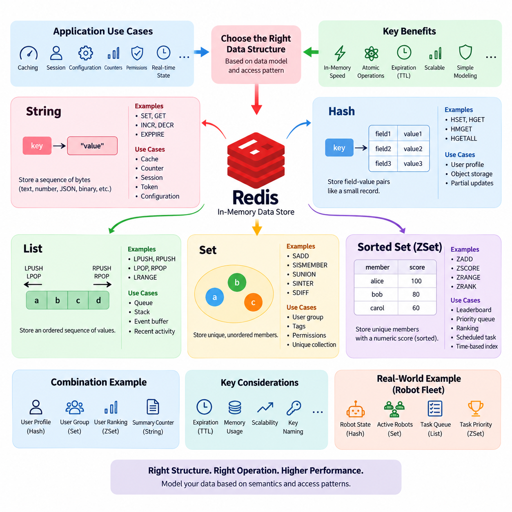
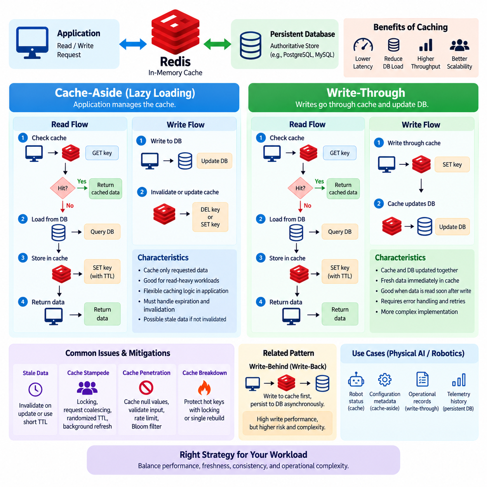
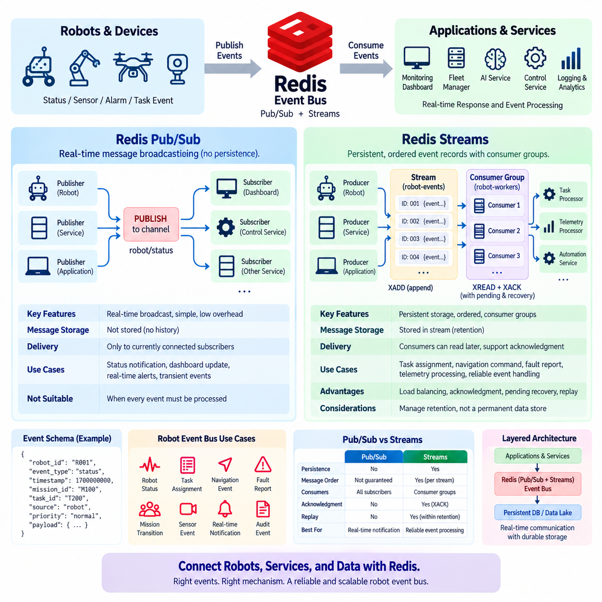
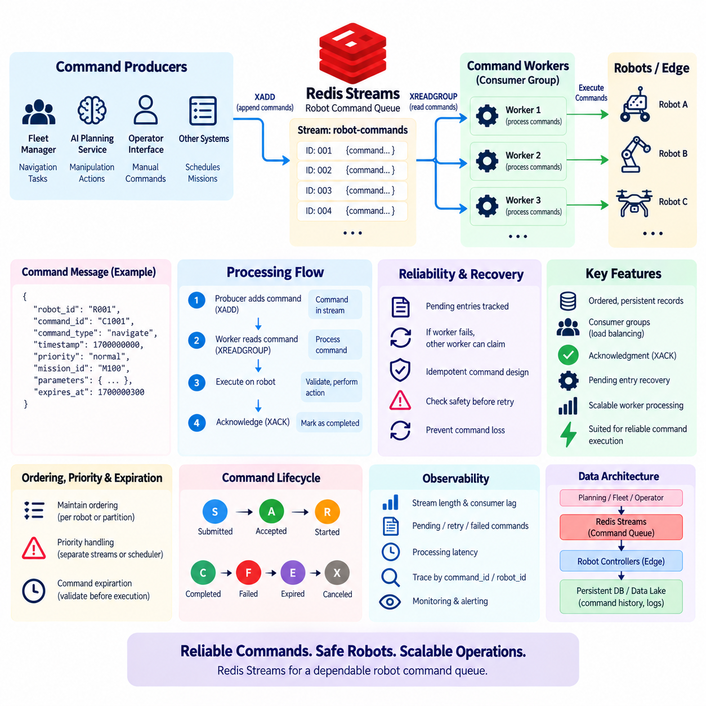
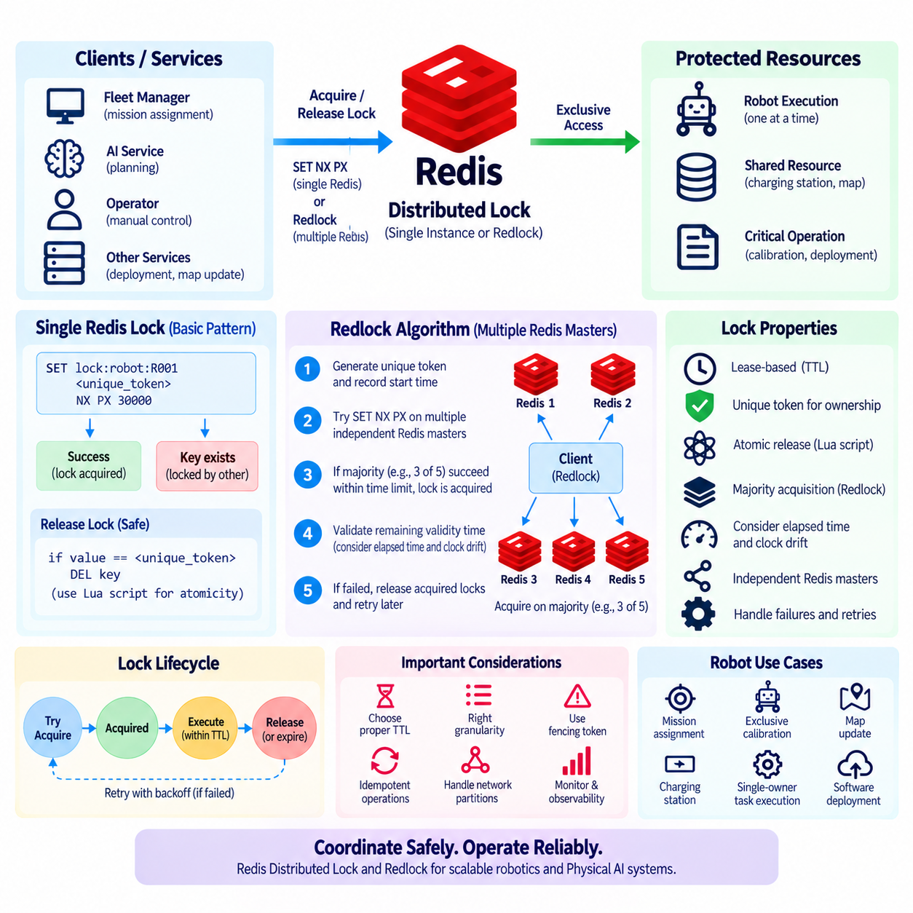
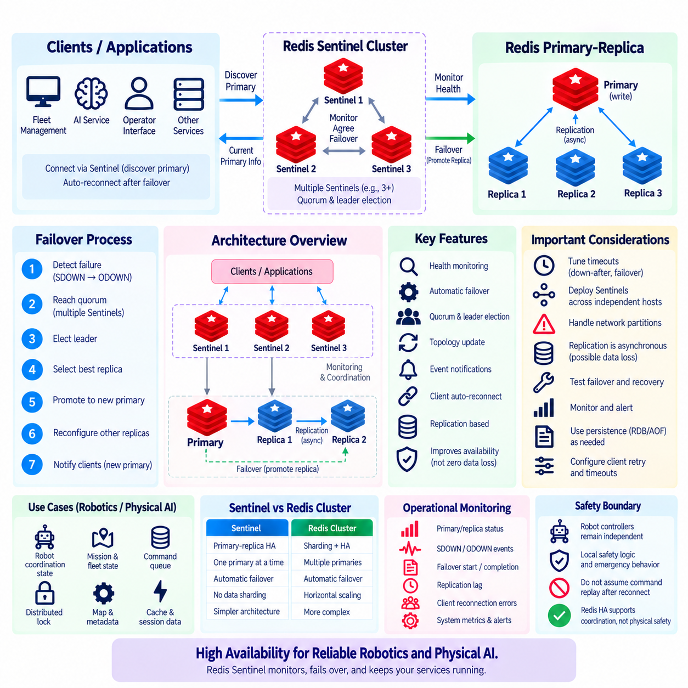
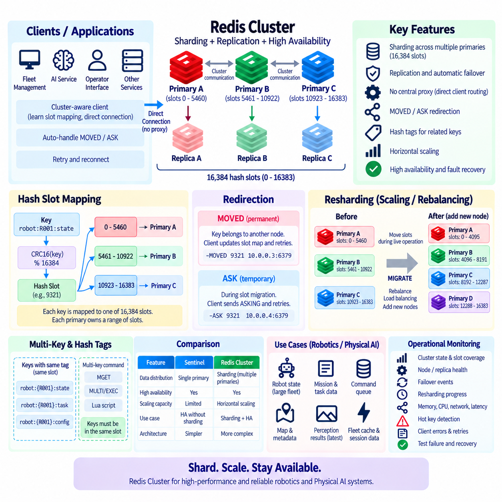
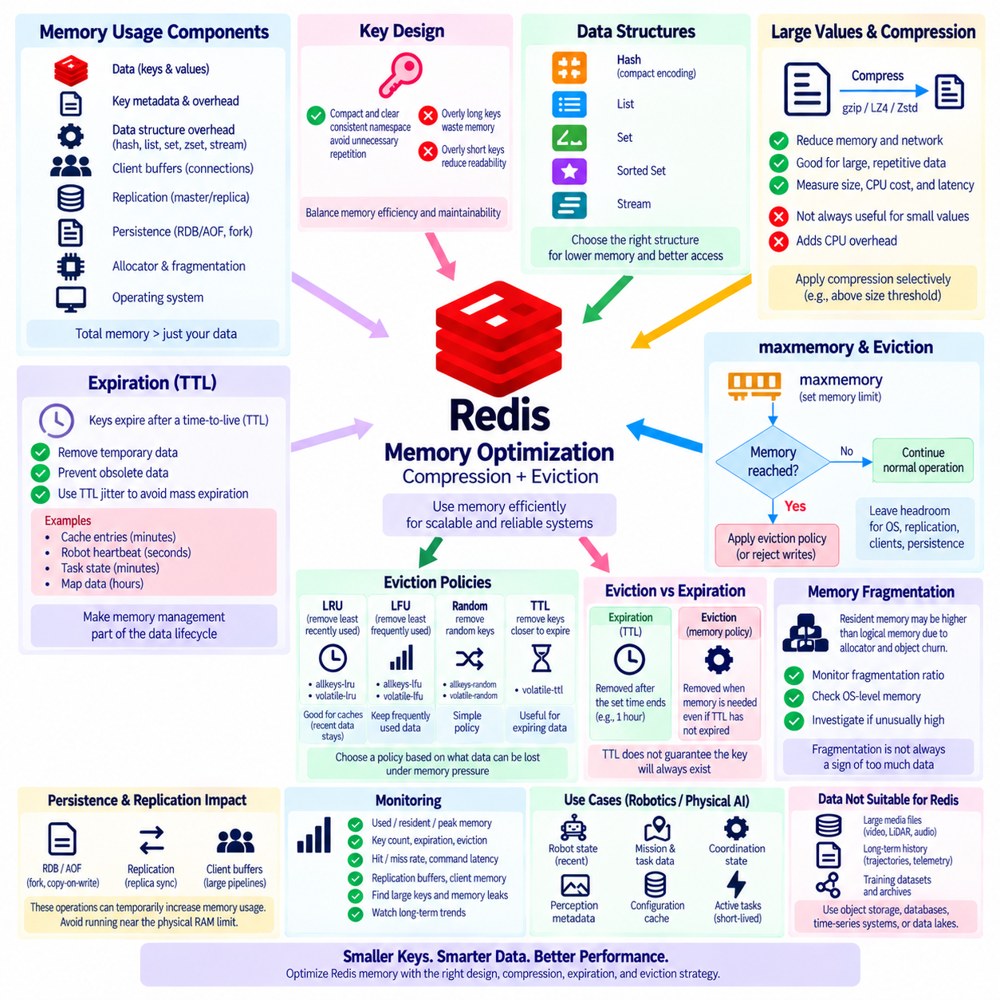
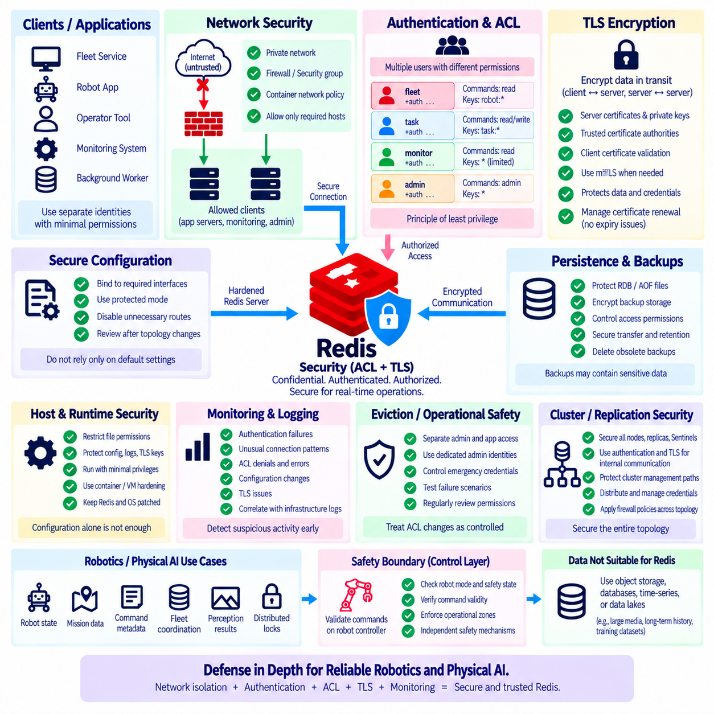
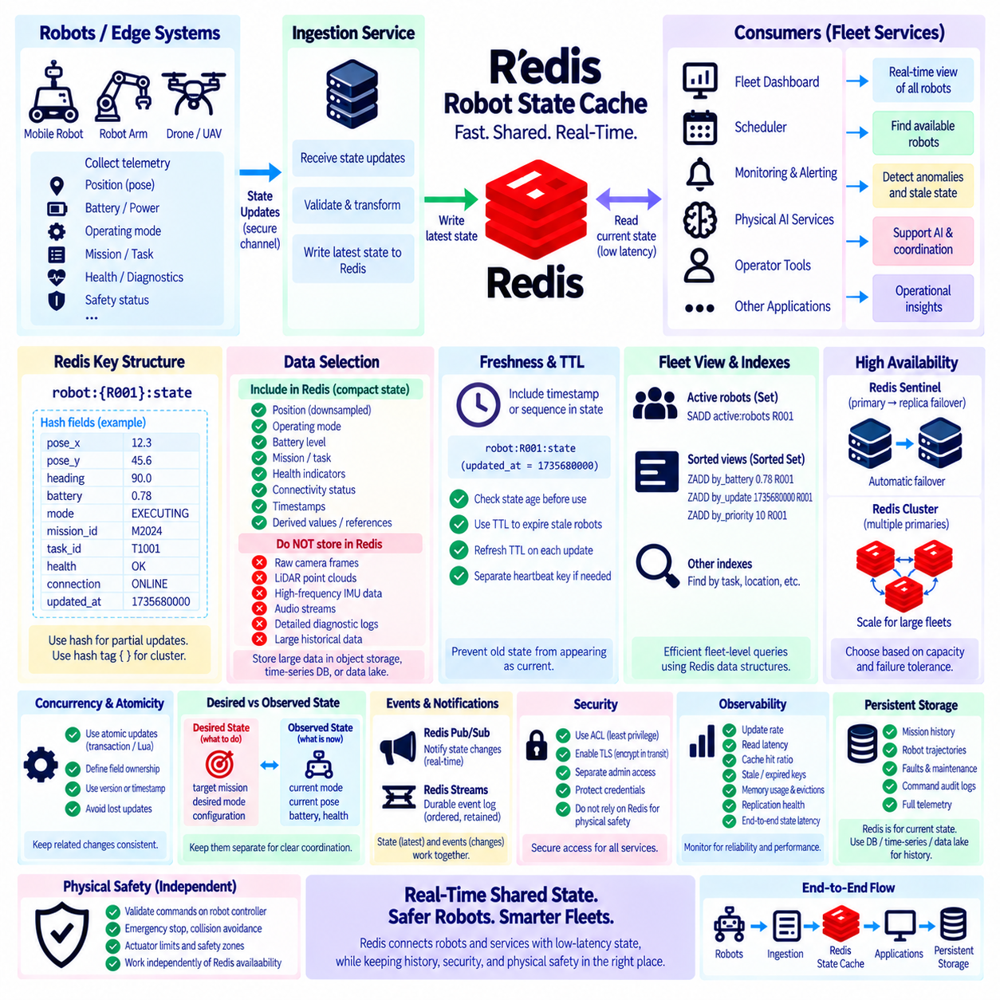

**Volume 08 Robot Database and Storage**


# 04. Redis

##  

## 04.01 Redis Data Structures: String, Hash, List, Set, ZSet [w/Code]

{width="7.268055555555556in" height="7.268055555555556in"}

Redis provides several built-in data structures that allow applications to store and manipulate data efficiently in memory. The most important structures are String, Hash, List, Set, and Sorted Set, commonly called ZSet. Each structure is optimized for a different access pattern, so choosing the appropriate structure is an important part of Redis data modeling. Unlike a traditional relational database, Redis does not require every value to be represented as a row and column. Instead, an application can select a native structure that closely matches the logical shape of its data and the operations that will be performed most frequently.

The String is the simplest and most fundamental Redis data type. A String stores a sequence of bytes and can represent ordinary text, numbers, serialized objects, JSON documents, tokens, or binary data. Common operations include SET and GET, while INCR and DECR allow numeric values to be modified atomically. Strings are therefore useful for counters, flags, configuration values, cache entries, session identifiers, and temporary application state. Expiration can also be associated with a String key, making it particularly useful for short-lived data such as verification codes, authentication tokens, rate-limit counters, and cached results.

A Redis Hash represents a collection of field-value pairs under a single Redis key. It is conceptually similar to a small record or dictionary, where each field identifies one attribute of an object. For example, a user profile can be stored under a key such as user:1001 with fields representing name, email, status, and department. Commands such as HSET, HGET, HMGET, and HGETALL provide direct access to individual or multiple fields. Hashes are useful when an application frequently updates only selected attributes of an object because the entire object does not need to be replaced for every small modification.

Lists store ordered sequences of values and are particularly useful when the relative position of elements matters. Redis Lists support insertion and removal from both ends, making commands such as LPUSH, RPUSH, LPOP, and RPOP efficient for queue and stack patterns. A List can therefore implement a simple task queue, event buffer, recent-activity stream, or work-processing mechanism. Elements can also be retrieved by position or by a range. However, Lists should not automatically be treated as general-purpose relational tables. Their value comes from sequential access and controlled insertion or removal patterns rather than arbitrary querying across many attributes.

Redis Sets store unique, unordered members. When the same value is inserted more than once, Redis keeps only one copy, which makes Sets useful whenever uniqueness is part of the data model. Sets support efficient membership testing through commands such as SISMEMBER and can perform mathematical operations such as union, intersection, and difference. These properties make Sets suitable for representing user groups, tags, permissions, feature membership, active device identifiers, or collections of unique entities. For example, separate Sets can represent users belonging to different groups, while intersection can identify users who belong to both groups.

A Sorted Set, commonly called a ZSet, combines unique members with numeric scores. Every member has one associated score, and Redis maintains the collection according to score-based ordering. Commands such as ZADD, ZSCORE, ZRANGE, and ZRANK allow applications to insert members, inspect scores, retrieve ordered ranges, and determine relative positions. This makes ZSets particularly useful for leaderboards, priority queues, ranking systems, scheduled tasks, and time-based indexes. A timestamp can be used as a score to maintain an ordered collection of events, while a numerical performance value can represent the ranking criterion in a competition or recommendation system.

The distinction between these structures should be based primarily on access requirements rather than on the visual appearance of the data. A String is appropriate when the application treats the stored value as one logical object or scalar value. A Hash is appropriate when the value naturally consists of several named attributes that are independently accessed or updated. A List is appropriate when ordering and sequential insertion or removal are central to the workload. A Set is appropriate when uniqueness and membership operations are important. A ZSet is appropriate when uniqueness must be combined with numerical ordering or ranking. Selecting the structure according to these operations can simplify application logic and improve Redis performance.

The structures can also be combined to represent more sophisticated application models. For example, a user profile can be stored in a Hash, while a Set maintains the users belonging to a particular group and a ZSet maintains their ranking. A String can hold a frequently accessed summary or counter associated with the same user. This approach allows each part of an application\'s state to use the Redis structure that best matches its behavior. The resulting model is not necessarily normalized in the same way as a relational database, because the design is driven by application access patterns, latency requirements, and operational simplicity.

Redis data structures are also important because many operations are performed atomically by the Redis server. For example, incrementing a counter with INCR does not require an application to retrieve the current value, calculate a new value, and write it back through separate operations. Similarly, Set membership operations and Sorted Set score updates can be performed directly by Redis. This reduces the need for application-side synchronization in many common cases. Atomic commands are especially valuable in distributed applications where multiple processes or servers may simultaneously access the same logical state.

Expiration provides another important capability when these structures are used for temporary application data. Redis keys can be configured with a time-to-live, allowing cached values, sessions, temporary locks, verification tokens, and short-term state to disappear automatically. Expiration is applied at the key level, so the data model should consider whether related fields or members need to expire independently. When individual elements require different lifetimes, a single Hash or List may not provide the desired behavior without additional design. In such situations, separate keys or other Redis structures may be more appropriate.

Strings and Hashes are frequently used for caching and object-oriented application state, while Lists, Sets, and ZSets are particularly useful for collections with specialized access behavior. A List can represent a sequence, a Set can represent membership, and a ZSet can represent ordered membership. This distinction is valuable because many application requirements can be expressed directly through these structures without introducing additional indexing mechanisms. For example, finding whether a user has a permission can be modeled as Set membership, while retrieving the highest-ranked users can be modeled as a Sorted Set range operation.

From a data architecture perspective, Redis structures should be designed around the operations that the application must perform at low latency. A useful modeling process begins by identifying the entities involved, the relationships that must be represented, the most frequent reads and writes, and whether ordering or uniqueness is required. The next step is to map each access pattern to a Redis command and select the structure that supports that command naturally. This is often more effective than first designing a relational-style schema and then attempting to reproduce it inside Redis.

The five structures also have different implications for memory usage and scalability. Redis keeps active data in memory, so the number of keys, fields, members, and associated metadata can become significant at large scale. A model that is convenient for a small dataset may become inefficient when millions or billions of objects are stored. Developers therefore need to consider key naming, object granularity, duplication, serialization format, expiration policies, and the frequency of large retrieval operations. Commands that return an entire large collection should be used carefully because a single request can consume substantial server and network resources.

For Physical AI and robotics systems, these structures can represent rapidly changing operational state without replacing the primary data lake or long-term database. Strings can store current status values or counters, Hashes can represent robot state summaries, Lists can buffer short sequences of tasks or events, Sets can maintain active robot or device membership, and ZSets can maintain priorities, timestamps, or rankings. A robot fleet management service, for example, could use a Hash for each robot\'s current state, a Set for robots assigned to a site, and a ZSet for task priorities. Historical sensor data would normally remain in a more appropriate persistent storage system rather than being retained indefinitely in Redis.

The main principle is that Redis data structures should be selected according to semantics and access patterns. String provides simple value storage, Hash provides field-based object storage, List provides ordered sequential collections, Set provides unique unordered membership, and ZSet provides unique members with score-based ordering. Understanding these differences allows developers to design data models that are concise, efficient, and aligned with Redis\'s in-memory execution model. In practical systems, the best Redis schema is not necessarily the one that most closely resembles a traditional database schema, but the one that expresses the application\'s high-frequency operations directly and predictably.

Redis는 애플리케이션이 메모리에서 데이터를 효율적으로 저장하고 조작할 수 있도록 여러 가지 내장 데이터 구조(Data Structure)를 제공합니다. 가장 중요한 구조로는 문자열(String), 해시(Hash), 리스트(List), 집합(Set), 정렬된 집합(Sorted Set), 일반적으로 ZSet이라고 부르는 구조가 있습니다. 각각의 구조는 서로 다른 데이터 접근 패턴에 최적화되어 있으므로, 적절한 구조를 선택하는 것은 Redis 데이터 모델링(Data Modeling)의 중요한 부분입니다. 전통적인 관계형 데이터베이스(Relational Database)와 달리 Redis에서는 모든 값을 행(Row)과 열(Column)로 표현할 필요가 없습니다. 대신 데이터의 논리적 형태와 가장 빈번하게 수행되는 연산에 적합한 네이티브 구조(Native Structure)를 선택할 수 있습니다.

String은 가장 단순하면서도 기본적인 Redis 데이터 타입(Data Type)입니다. String은 일련의 바이트(Byte)를 저장하며 일반적인 텍스트, 숫자, 직렬화된 객체(Serialized Object), JSON 문서, 토큰(Token), 바이너리 데이터(Binary Data) 등을 표현할 수 있습니다. 일반적으로 SET과 GET 명령을 사용하며, INCR과 DECR을 이용하면 숫자 값을 원자적으로(Atomically) 변경할 수 있습니다. 따라서 String은 카운터(Counter), 플래그(Flag), 설정 값(Configuration Value), 캐시 항목(Cache Entry), 세션 식별자(Session Identifier), 임시 애플리케이션 상태(Application State) 등에 적합합니다. String 키에는 만료 시간(Expiration)을 설정할 수도 있으므로 인증 토큰(Authentication Token), 인증 코드(Verification Code), 요청 제한 카운터(Rate-Limit Counter), 캐시된 결과(Cache Result)와 같은 짧은 수명의 데이터에도 유용합니다.

Redis Hash는 하나의 Redis 키 아래에 필드-값(Field-Value) 쌍을 모아 저장하는 구조입니다. 개념적으로 작은 레코드(Record) 또는 사전(Dictionary)과 유사하며, 각각의 필드는 객체의 하나의 속성(Attribute)을 식별합니다. 예를 들어 사용자 프로필(User Profile)을 user:1001과 같은 키에 저장하고, 이름(Name), 이메일(Email), 상태(Status), 부서(Department) 등을 각각의 필드로 표현할 수 있습니다. HSET, HGET, HMGET, HGETALL과 같은 명령을 이용하면 하나 또는 여러 필드에 직접 접근할 수 있습니다. Hash는 객체의 일부 속성만 자주 변경하는 애플리케이션에 특히 적합합니다. 작은 속성을 변경할 때마다 전체 객체를 교체할 필요가 없기 때문입니다.

List는 값의 순서가 있는 시퀀스(Sequence)를 저장하며, 요소 사이의 상대적인 위치가 중요한 경우에 특히 유용합니다. Redis List는 양쪽 끝에서 요소를 삽입하거나 제거할 수 있으므로 LPUSH, RPUSH, LPOP, RPOP과 같은 명령을 사용하면 큐(Queue)와 스택(Stack) 패턴을 효율적으로 구현할 수 있습니다. 따라서 List는 간단한 작업 큐(Task Queue), 이벤트 버퍼(Event Buffer), 최근 활동 기록(Recent Activity), 작업 처리 메커니즘(Work-Processing Mechanism) 등에 활용할 수 있습니다. 요소를 위치별로 조회하거나 특정 범위(Range)를 가져오는 것도 가능합니다. 다만 List를 범용 관계형 테이블(General-Purpose Relational Table)처럼 사용해서는 안 됩니다. List의 핵심 가치는 여러 속성에 대한 임의의 조회가 아니라 순차적인 접근과 통제된 삽입 및 제거 패턴에 있습니다.

Redis Set은 고유한 멤버(Member)를 저장하는 순서가 없는(Unordered) 컬렉션입니다. 동일한 값이 여러 번 삽입되더라도 Redis는 하나만 유지하므로, 데이터의 유일성(Uniqueness)이 중요한 경우 Set이 적합합니다. Set은 SISMEMBER를 통한 멤버십 확인(Membership Testing)을 효율적으로 지원하며, 합집합(Union), 교집합(Intersection), 차집합(Difference)과 같은 집합 연산도 수행할 수 있습니다. 이러한 특성으로 인해 Set은 사용자 그룹(User Group), 태그(Tag), 권한(Permission), 기능 사용 대상(Feature Membership), 활성 장치 식별자(Active Device Identifier), 고유 엔터티 컬렉션(Unique Entity Collection) 등에 적합합니다. 예를 들어 서로 다른 그룹에 속한 사용자를 각각의 Set으로 관리하고, 교집합 연산을 통해 두 그룹에 동시에 속한 사용자를 찾을 수 있습니다.

Sorted Set은 일반적으로 ZSet이라고 하며, 고유한 멤버와 숫자형 점수(Numeric Score)를 결합한 구조입니다. 모든 멤버는 하나의 점수를 가지며 Redis는 점수에 따라 컬렉션을 정렬된 상태로 유지합니다. ZADD, ZSCORE, ZRANGE, ZRANK와 같은 명령을 사용하면 멤버를 추가하고, 점수를 확인하고, 정렬된 범위를 조회하며, 상대적인 순위를 확인할 수 있습니다. 이러한 특성 때문에 ZSet은 리더보드(Leaderboard), 우선순위 큐(Priority Queue), 순위 시스템(Ranking System), 예약 작업(Scheduled Task), 시간 기반 인덱스(Time-Based Index) 등에 매우 유용합니다. 타임스탬프(Timestamp)를 점수로 사용하면 이벤트를 시간 순서대로 유지할 수 있으며, 수치형 성능 값을 점수로 사용하면 대회나 추천 시스템의 순위 기준으로 활용할 수 있습니다.

이러한 데이터 구조의 차이는 데이터가 어떻게 보이는지보다 어떤 접근이 필요한지를 기준으로 판단해야 합니다. 애플리케이션이 저장된 값을 하나의 논리적 객체 또는 스칼라 값(Scalar Value)으로 취급한다면 String이 적합합니다. 값이 여러 개의 명명된 속성(Named Attribute)으로 구성되고 각 속성에 독립적으로 접근하거나 변경해야 한다면 Hash가 적합합니다. 순서와 순차적인 삽입 또는 제거가 핵심이라면 List가 적합합니다. 유일성과 멤버십 연산이 중요하다면 Set이 적합합니다. 유일성을 유지하면서 숫자에 따른 정렬이나 순위가 필요하다면 ZSet이 적합합니다. 이러한 연산을 기준으로 데이터 구조를 선택하면 애플리케이션 로직을 단순화하고 Redis 성능을 향상시킬 수 있습니다.

이러한 구조들은 서로 결합하여 더욱 복잡한 애플리케이션 모델을 표현할 수도 있습니다. 예를 들어 사용자 프로필은 Hash에 저장하고, 특정 그룹에 속한 사용자는 Set으로 관리하며, 사용자의 순위는 ZSet으로 관리할 수 있습니다. String에는 동일한 사용자와 관련된 자주 조회되는 요약 정보나 카운터를 저장할 수도 있습니다. 이러한 방식에서는 애플리케이션 상태의 각 부분이 자신의 동작 특성에 가장 적합한 Redis 구조를 사용할 수 있습니다. 결과적으로 이러한 모델은 관계형 데이터베이스에서 사용하는 방식과 반드시 동일하게 정규화(Normalization)될 필요는 없습니다. 대신 애플리케이션의 접근 패턴, 지연 시간 요구사항(Latency Requirement), 운영 단순성(Operational Simplicity)을 중심으로 설계됩니다.

Redis 데이터 구조가 중요한 또 다른 이유는 많은 연산이 Redis 서버에서 원자적으로(Atomically) 수행되기 때문입니다. 예를 들어 INCR을 사용하여 카운터를 증가시키면 애플리케이션이 현재 값을 가져오고 새로운 값을 계산한 다음 다시 저장하는 여러 단계의 작업을 수행할 필요가 없습니다. Set 멤버십 확인이나 Sorted Set의 점수 변경 역시 Redis에서 직접 수행할 수 있습니다. 이를 통해 많은 일반적인 상황에서 애플리케이션 측의 동기화(Synchronization) 필요성을 줄일 수 있습니다. 특히 여러 프로세스나 서버가 동일한 논리적 상태에 동시에 접근하는 분산 애플리케이션(Distributed Application)에서는 이러한 원자적 명령이 매우 중요합니다.

만료(Expiration)는 이러한 데이터 구조를 임시 애플리케이션 데이터에 사용할 때 중요한 기능을 제공합니다. Redis 키에는 TTL(Time-to-Live)을 설정할 수 있으므로 캐시된 값, 세션(Session), 임시 잠금(Temporary Lock), 인증 토큰, 단기 상태(Short-Term State) 등을 자동으로 제거할 수 있습니다. 만료는 키 수준(Key Level)에서 적용되므로 관련된 필드나 멤버가 서로 독립적으로 만료되어야 하는지를 데이터 모델에서 고려해야 합니다. 개별 요소마다 서로 다른 수명을 설정해야 하는 경우 하나의 Hash나 List만으로는 원하는 동작을 구현하기 어려울 수 있습니다. 이러한 상황에서는 별도의 키를 사용하거나 다른 Redis 구조를 선택하는 것이 더 적절할 수 있습니다.

String과 Hash는 캐싱(Caching)과 객체 중심 애플리케이션 상태(Object-Oriented Application State)에 자주 사용되는 반면, List, Set, ZSet은 특수한 접근 동작을 가진 컬렉션(Collection)에 특히 유용합니다. List는 시퀀스를 표현하고, Set은 멤버십을 표현하며, ZSet은 정렬된 멤버십을 표현할 수 있습니다. 이러한 차이는 많은 애플리케이션 요구사항을 추가적인 인덱싱 메커니즘(Indexing Mechanism) 없이 Redis의 데이터 구조 자체로 직접 표현할 수 있다는 점에서 중요합니다. 예를 들어 사용자가 특정 권한을 가지고 있는지를 확인하는 작업은 Set 멤버십으로 모델링할 수 있고, 가장 높은 순위의 사용자를 조회하는 작업은 Sorted Set의 범위 조회 연산으로 모델링할 수 있습니다.

데이터 아키텍처(Data Architecture)의 관점에서 Redis 구조는 애플리케이션이 낮은 지연 시간으로 수행해야 하는 연산을 중심으로 설계해야 합니다. 유용한 모델링 과정은 먼저 관련된 엔터티(Entity), 표현해야 하는 관계(Relationship), 가장 빈번한 읽기 및 쓰기 작업, 그리고 정렬이나 유일성이 필요한지를 식별하는 것에서 시작합니다. 다음 단계에서는 각 접근 패턴을 적절한 Redis 명령에 연결하고, 해당 명령을 자연스럽게 지원하는 구조를 선택합니다. 이는 전통적인 관계형 스키마(Relational Schema)를 먼저 설계한 다음 이를 Redis 안에서 재현하려는 방식보다 효과적인 경우가 많습니다.

다섯 가지 구조는 메모리 사용량과 확장성(Scalability) 측면에서도 서로 다른 특성을 가집니다. Redis는 활성 데이터를 메모리에 유지하므로 대규모 환경에서는 키, 필드, 멤버 및 관련 메타데이터(Metadata)의 수가 상당한 수준으로 증가할 수 있습니다. 소규모 데이터셋에서는 편리한 모델이 수백만 또는 수십억 개의 객체가 저장되는 환경에서는 비효율적일 수 있습니다. 따라서 개발자는 키 네이밍(Key Naming), 객체 단위(Object Granularity), 데이터 중복(Duplication), 직렬화 형식(Serialization Format), 만료 정책(Expiration Policy), 대규모 조회의 빈도 등을 고려해야 합니다. 대규모 컬렉션 전체를 반환하는 명령은 하나의 요청이 Redis 서버와 네트워크에 상당한 부하를 발생시킬 수 있으므로 주의해서 사용해야 합니다.

Physical AI와 로봇 시스템에서는 이러한 구조를 빠르게 변화하는 운영 상태(Operational State)를 표현하는 데 사용할 수 있으며, 기본 데이터 레이크(Data Lake)나 장기 보관 데이터베이스(Long-Term Database)를 대체할 필요는 없습니다. String은 현재 상태 값이나 카운터를 저장하고, Hash는 로봇의 현재 상태 요약을 표현하며, List는 단기 작업이나 이벤트의 순차적인 버퍼로 활용할 수 있습니다. Set은 활성 로봇이나 장치의 멤버십을 관리하고, ZSet은 작업 우선순위(Priority), 타임스탬프 또는 순위를 관리하는 데 사용할 수 있습니다. 예를 들어 로봇 플릿 관리 서비스(Robot Fleet Management Service)는 각 로봇의 현재 상태를 Hash로 관리하고, 특정 사이트에 할당된 로봇을 Set으로 관리하며, 작업 우선순위를 ZSet으로 관리할 수 있습니다. 과거 센서 데이터는 일반적으로 Redis에 무기한 저장하기보다는 보다 적합한 영구 저장소(Persistent Storage)에 보관하는 것이 적절합니다.

핵심 원칙은 Redis 데이터 구조를 의미(Semantics)와 접근 패턴(Access Pattern)에 따라 선택해야 한다는 것입니다. String은 단순한 값 저장을 제공하고, Hash는 필드 기반 객체 저장을 제공하며, List는 순서가 있는 순차적 컬렉션을 제공하고, Set은 고유한 비정렬 멤버십을 제공하며, ZSet은 점수 기반 정렬과 고유 멤버를 함께 제공합니다. 이러한 차이를 이해하면 Redis의 인메모리 실행 모델(In-Memory Execution Model)에 맞는 간결하고 효율적인 데이터 모델을 설계할 수 있습니다. 실제 시스템에서 가장 적절한 Redis 스키마(Redis Schema)는 전통적인 데이터베이스 스키마와 가장 비슷한 것이 아니라, 애플리케이션에서 빈번하게 수행되는 연산을 직접적이고 예측 가능한 방식으로 표현할 수 있는 구조입니다.

##  

## 04.02 Redis Cache Strategy: Cache.Aside / Write.Through [w/Code]

{width="7.268055555555556in" height="7.268055555555556in"}

Redis is frequently used as a high-speed cache in front of a persistent database. The purpose of a cache is to reduce database access, lower application latency, and absorb repeated read requests. A cache strategy defines how application data moves between Redis and the primary data store, especially when data is read, created, updated, or deleted. Two commonly used patterns are Cache-Aside and Write-Through. They differ mainly in which component is responsible for updating the cache and how consistency between the cache and the persistent database is maintained.

Cache-Aside, also called Lazy Loading, is one of the most widely used Redis caching patterns. In this approach, the application is responsible for both reading from the cache and loading data into the cache when necessary. When a request arrives, the application first checks Redis. If the requested key exists, the cached value is returned immediately. This is called a cache hit. If the key does not exist, a cache miss occurs, and the application retrieves the data from the primary database, stores the result in Redis, and then returns the data to the requester.

The main advantage of Cache-Aside is that only data that is actually requested needs to be cached. This avoids filling Redis with large amounts of data that may never be accessed. It also allows the application to decide which objects should be cached, how long they should remain available, and under what conditions they should be invalidated. Cache-Aside is therefore particularly suitable for read-heavy applications where a relatively small portion of the persistent dataset receives a large proportion of the traffic. However, the application must explicitly implement cache population, expiration, invalidation, and error-handling logic.

A typical Cache-Aside read sequence begins with a request for a logical object such as a user profile, product record, or robot configuration. The application constructs a deterministic Redis key and performs a GET or equivalent lookup. If the key exists, Redis returns the cached representation without requiring a database query. If the key is missing, the application queries the persistent database and obtains the authoritative value. The application then writes that value into Redis, often with an expiration time, before returning it to the caller. Subsequent requests can therefore be served directly from memory until the cache entry expires or is explicitly invalidated.

Cache-Aside requires careful consideration of stale data. If the underlying database is updated while an old value remains in Redis, subsequent requests may receive the outdated cached value. A common solution is to invalidate the corresponding Redis key whenever the persistent value changes. Another approach is to use a relatively short time-to-live so that stale values eventually disappear automatically. The appropriate policy depends on the application\'s consistency requirements. Data such as product descriptions may tolerate a short period of staleness, while security permissions, financial balances, or safety-critical robot state may require stronger consistency guarantees.

Write-Through caching uses a different responsibility model. When the application changes data, the write operation is directed through the caching layer so that the cache and persistent database are updated as part of the same logical operation. Conceptually, the application writes the new value to the cache, and the cache layer ensures that the corresponding persistent store is also updated. The objective is to keep frequently accessed cached data synchronized with the authoritative storage system. Unlike Cache-Aside, the application does not wait for a later read miss to populate the cache after a write.

The main benefit of Write-Through is that successfully written data is immediately available in the cache. This can reduce the possibility that the application writes a new database value but leaves an old value in Redis. It is useful when the same data is likely to be read shortly after being modified and when maintaining cache freshness is important. However, Write-Through introduces additional complexity because a write may involve both Redis and the persistent database. The system must define what happens when one operation succeeds while the other fails, and it must provide appropriate retry or recovery mechanisms.

The difference between Cache-Aside and Write-Through becomes especially clear when considering the application\'s read and write paths. Cache-Aside places more responsibility on the application: reads check Redis first, misses load from the database, and writes normally update the database followed by cache invalidation or refresh. Write-Through places more responsibility on the caching mechanism: writes pass through the cache and are propagated to persistent storage, keeping the cached representation immediately available. Neither pattern is universally appropriate. The correct choice depends on read frequency, write frequency, consistency requirements, failure tolerance, and the relative cost of database access.

Cache expiration is an important component of both strategies. Redis can assign a TTL to cached keys so that entries are automatically removed after a defined period. Expiration prevents indefinitely stale data from remaining in memory and also helps control memory consumption. However, expiration alone should not be treated as a complete consistency mechanism. A long TTL may allow stale data to remain for too long, while a very short TTL may cause frequent cache misses and increase database traffic. A practical design therefore combines TTL with explicit invalidation or refresh behavior when the underlying data changes.

Cache stampede is another important concern. If a popular key expires while many requests arrive simultaneously, multiple application instances may detect the same cache miss and query the database at the same time. This can create a sudden burst of database traffic precisely when the cache was expected to protect the database. Common mitigation techniques include request coalescing, distributed locking, randomized expiration times, background refresh, and temporary stale-value serving. The appropriate technique depends on traffic volume and the cost of reconstructing the cached value.

Cache penetration occurs when requests repeatedly ask for data that does not exist in the persistent database. If every request misses Redis and then queries the database, attackers or malformed clients can generate unnecessary database load. Applications can mitigate this problem by caching negative results for a short period, validating request parameters, applying rate limits, or using Bloom filters where appropriate. The negative-cache TTL should generally be conservative because an object that does not exist today may be created later.

Cache breakdown refers to situations where an extremely popular data item becomes unavailable in the cache and many requests attempt to reconstruct it simultaneously. This is closely related to cache stampede but often focuses on a single high-value or highly popular key. Locking or request coalescing can ensure that only one process rebuilds the missing entry while other requests wait briefly or receive a controlled fallback response. For high-traffic services, protecting these hot keys can be more important than optimizing ordinary cache operations.

Write-Through can also introduce consistency and durability questions. If Redis is treated as the immediate write target but the persistent database update fails, the system must prevent the cache from becoming an apparently successful but non-durable source of truth. A robust implementation therefore defines transaction boundaries, retry behavior, failure states, and reconciliation procedures. In some architectures, a write-through cache is implemented through a dedicated caching component rather than by allowing application services to independently update Redis and the database. This centralized responsibility can reduce inconsistent implementation across services.

Another related pattern is Write-Behind, sometimes called Write-Back, in which changes are first written to the cache and persisted to the database asynchronously. This can provide very high write throughput because the application does not need to wait for the persistent database on every operation. However, it introduces a larger durability window and greater operational complexity. If Redis or the write queue fails before persistence occurs, recent changes may be lost. Write-Behind is therefore appropriate only when the system can tolerate asynchronous persistence and has reliable mechanisms for buffering, retrying, and recovering pending writes.

For Physical AI and robotics systems, cache strategy should be selected according to the distinction between operational state and authoritative historical data. Redis can provide fast access to current robot status, task assignments, configuration snapshots, fleet membership, or short-lived coordination state, while a persistent database or data lake retains durable records and historical sensor information. Cache-Aside can be useful for relatively stable robot configuration or metadata that is frequently read but infrequently changed. Write-Through may be appropriate for operational records where a successful update should immediately become visible to subsequent readers.

For example, a fleet management service could use Cache-Aside for robot metadata. When a robot\'s configuration is requested, the service checks Redis first and retrieves the persistent record only when the cache misses. After a configuration change, the service can update the database and invalidate the corresponding Redis key. For a frequently modified operational object where immediate cache visibility is important, a Write-Through design could update Redis and the persistent store as part of the same logical write operation. Historical telemetry should generally remain in durable storage rather than being treated as an indefinitely retained Redis cache.

A production Redis cache strategy should also consider key naming, serialization, TTL policy, memory limits, eviction behavior, observability, and failure recovery. Keys should follow predictable naming conventions so that related objects can be identified and invalidated consistently. Cached values should use a serialization format that balances size, compatibility, and processing cost. Redis memory policies should be selected according to the importance of cached data, and applications should monitor hit rate, miss rate, latency, memory usage, evictions, and database fallback traffic. These metrics reveal whether the cache is actually reducing the intended workload.

The fundamental principle is that Redis caching should be designed around the application\'s consistency and access requirements rather than simply adding Redis in front of a database. Cache-Aside provides flexible, demand-driven caching and is often straightforward for read-heavy workloads. Write-Through provides a more controlled relationship between writes, cached values, and persistent storage, but requires careful failure handling. TTL, invalidation, stampede protection, penetration protection, monitoring, and recovery mechanisms should be designed together. A well-designed Redis cache is therefore not merely a faster copy of database data; it is an explicit data-access layer with defined freshness, consistency, performance, and failure semantics.

Redis는 영구 데이터베이스(Persistent Database) 앞단에서 고속 캐시(High-Speed Cache)로 자주 사용됩니다. 캐시의 목적은 데이터베이스 접근을 줄이고 애플리케이션 지연 시간(Application Latency)을 낮추며 반복적인 읽기 요청을 흡수하는 것입니다. 캐시 전략(Cache Strategy)은 특히 데이터가 읽히고, 생성되고, 수정되고, 삭제될 때 Redis와 기본 데이터 저장소(Primary Data Store) 사이에서 데이터가 어떻게 이동하는지를 정의합니다. 일반적으로 많이 사용되는 두 가지 패턴은 Cache-Aside와 Write-Through입니다. 두 방식의 가장 큰 차이는 캐시를 업데이트할 책임이 어느 구성 요소에 있는지와 캐시와 영구 데이터베이스 사이의 일관성(Consistency)을 어떻게 유지하는지에 있습니다.

Cache-Aside는 Lazy Loading이라고도 하며, 가장 널리 사용되는 Redis 캐싱 패턴(Caching Pattern) 중 하나입니다. 이 방식에서는 애플리케이션이 캐시에서 데이터를 읽고 필요한 경우 데이터를 캐시에 적재하는 책임을 직접 가집니다. 요청이 들어오면 애플리케이션은 먼저 Redis를 확인합니다. 요청한 키가 존재하면 캐시된 값을 즉시 반환하며 이를 캐시 적중(Cache Hit)이라고 합니다. 키가 존재하지 않으면 캐시 미스(Cache Miss)가 발생하고, 애플리케이션은 기본 데이터베이스(Primary Database)에서 데이터를 가져온 다음 그 결과를 Redis에 저장하고 요청자에게 데이터를 반환합니다.

Cache-Aside의 가장 큰 장점은 실제로 요청된 데이터만 캐시에 저장된다는 점입니다. 따라서 실제로 접근되지 않을 가능성이 높은 대량의 데이터를 Redis에 미리 채우는 것을 방지할 수 있습니다. 또한 애플리케이션이 어떤 객체를 캐시할지, 얼마나 오래 유지할지, 어떤 조건에서 무효화(Invalidation)할지를 결정할 수 있습니다. 따라서 Cache-Aside는 읽기 중심(Read-Heavy) 애플리케이션, 특히 전체 영구 데이터셋 중 상대적으로 작은 일부 데이터에 많은 요청이 집중되는 환경에 적합합니다. 그러나 캐시 생성, 만료, 무효화 및 오류 처리 로직(Error-Handling Logic)을 애플리케이션에서 명시적으로 구현해야 합니다.

일반적인 Cache-Aside 읽기 과정은 사용자 프로필(User Profile), 제품 정보(Product Record), 로봇 설정(Robot Configuration)과 같은 논리적 객체에 대한 요청으로 시작됩니다. 애플리케이션은 결정론적인 Redis 키(Deterministic Redis Key)를 생성하고 GET 또는 이에 준하는 조회를 수행합니다. 키가 존재하면 Redis는 데이터베이스 조회 없이 캐시된 표현을 반환합니다. 키가 존재하지 않으면 애플리케이션은 영구 데이터베이스를 조회하여 기준이 되는 값을 가져옵니다. 그런 다음 애플리케이션은 일반적으로 만료 시간(Expiration Time)을 설정하면서 해당 값을 Redis에 저장한 후 호출자에게 반환합니다. 이후의 요청은 캐시 항목이 만료되거나 명시적으로 무효화될 때까지 메모리에서 직접 처리할 수 있습니다.

Cache-Aside에서는 오래된 데이터(Stale Data)를 신중하게 처리해야 합니다. 기본 데이터베이스의 값이 변경되었는데 Redis에 이전 값이 남아 있다면 이후 요청에서 오래된 캐시 값을 반환할 수 있습니다. 일반적인 해결 방법은 영구 데이터의 값이 변경될 때 해당 Redis 키를 무효화하는 것입니다. 또 다른 방법은 비교적 짧은 TTL(Time-to-Live)을 사용하여 오래된 값이 일정 시간이 지나면 자동으로 사라지도록 하는 것입니다. 적절한 정책은 애플리케이션의 일관성 요구사항(Consistency Requirement)에 따라 달라집니다. 제품 설명과 같은 데이터는 짧은 시간 동안의 오래된 값을 허용할 수 있지만, 보안 권한(Security Permission), 금융 잔액(Financial Balance), 안전이 중요한 로봇 상태(Safety-Critical Robot State)와 같은 데이터는 더 강한 일관성 보장이 필요할 수 있습니다.

Write-Through 캐싱은 서로 다른 책임 모델(Responsibility Model)을 사용합니다. 애플리케이션이 데이터를 변경할 때 캐시 계층(Caching Layer)을 통해 쓰기 작업을 수행하여 캐시와 영구 데이터베이스가 동일한 논리적 작업의 일부로 함께 업데이트되도록 합니다. 개념적으로 애플리케이션은 새로운 값을 캐시에 기록하고, 캐시 계층은 해당 영구 저장소(Persistent Store)도 함께 업데이트되도록 처리합니다. 목적은 자주 접근되는 캐시 데이터가 기준 저장소(Authoritative Storage System)와 동기화된 상태를 유지하도록 하는 것입니다. Cache-Aside와 달리 쓰기 이후 나중에 발생하는 읽기 미스에 의존하여 캐시를 채우지 않습니다.

Write-Through의 주요 장점은 성공적으로 기록된 데이터가 즉시 캐시에 존재한다는 것입니다. 이를 통해 애플리케이션이 새로운 값을 데이터베이스에 기록했지만 Redis에는 이전 값이 남아 있는 상황을 줄일 수 있습니다. 변경 직후 동일한 데이터를 다시 읽을 가능성이 높고 캐시의 최신성(Freshness)을 유지하는 것이 중요한 경우에 유용합니다. 그러나 Write-Through는 하나의 쓰기 작업이 Redis와 영구 데이터베이스 모두에 영향을 줄 수 있기 때문에 추가적인 복잡성을 발생시킵니다. 한쪽 작업은 성공하고 다른 쪽 작업은 실패하는 경우 어떻게 처리할 것인지 정의해야 하며, 적절한 재시도(Retry)와 복구(Recovery) 메커니즘도 필요합니다.

Cache-Aside와 Write-Through의 차이는 애플리케이션의 읽기 경로(Read Path)와 쓰기 경로(Write Path)를 살펴보면 더욱 명확해집니다. Cache-Aside에서는 애플리케이션의 책임이 더 큽니다. 읽기에서는 먼저 Redis를 확인하고, 캐시 미스가 발생하면 데이터베이스에서 데이터를 가져오며, 쓰기에서는 일반적으로 데이터베이스를 업데이트한 다음 캐시를 무효화하거나 갱신합니다. Write-Through에서는 캐싱 메커니즘의 책임이 더 큽니다. 쓰기 요청이 캐시를 통과하면서 영구 저장소로 전달되므로 캐시된 표현을 즉시 사용할 수 있습니다. 어느 패턴이 항상 적합한 것은 아닙니다. 적절한 선택은 읽기 빈도, 쓰기 빈도, 일관성 요구사항, 장애 허용성(Failure Tolerance), 데이터베이스 접근 비용 등에 따라 결정됩니다.

캐시 만료(Cache Expiration)는 두 전략 모두에서 중요한 구성 요소입니다. Redis는 캐시 키에 TTL을 설정하여 일정 시간이 지나면 항목이 자동으로 제거되도록 할 수 있습니다. 만료 기능은 오래된 데이터가 메모리에 무기한 남아 있는 것을 방지하고 메모리 사용량도 관리하는 데 도움이 됩니다. 그러나 만료만으로 완전한 일관성 메커니즘을 구현할 수 있다고 생각해서는 안 됩니다. TTL이 너무 길면 오래된 데이터가 지나치게 오래 남을 수 있고, TTL이 너무 짧으면 캐시 미스가 자주 발생하여 데이터베이스 트래픽이 증가할 수 있습니다. 따라서 실제 설계에서는 TTL과 함께 기본 데이터가 변경될 때의 명시적인 무효화 또는 갱신 동작을 함께 사용하는 것이 일반적입니다.

캐시 스탬피드(Cache Stampede) 역시 중요한 문제입니다. 인기 있는 키가 만료되는 순간 많은 요청이 동시에 들어오면 여러 애플리케이션 인스턴스가 동일한 캐시 미스를 감지하고 동시에 데이터베이스를 조회할 수 있습니다. 이로 인해 캐시가 데이터베이스를 보호해야 하는 바로 그 순간에 데이터베이스로 갑작스러운 대량 트래픽이 발생할 수 있습니다. 일반적인 완화 기법으로는 요청 병합(Request Coalescing), 분산 잠금(Distributed Locking), 무작위 만료 시간(Randomized Expiration), 백그라운드 갱신(Background Refresh), 일시적인 오래된 값 제공(Serving Stale Values) 등이 있습니다. 적절한 방법은 트래픽 규모와 캐시 값을 재구성하는 비용에 따라 결정됩니다.

캐시 침투(Cache Penetration)는 영구 데이터베이스에 존재하지 않는 데이터를 요청하는 상황이 반복적으로 발생하는 경우를 의미합니다. 모든 요청이 Redis에서 미스가 발생한 뒤 데이터베이스를 조회하게 되면 공격자나 잘못된 클라이언트가 불필요한 데이터베이스 부하를 발생시킬 수 있습니다. 애플리케이션은 일정 시간 동안 부정 결과(Negative Result)를 캐시하거나, 요청 파라미터를 검증하고, 속도 제한(Rate Limit)을 적용하거나, 필요한 경우 Bloom Filter를 사용할 수 있습니다. 다만 Negative Cache의 TTL은 일반적으로 보수적으로 설정해야 합니다. 현재 존재하지 않는 객체가 이후에 생성될 수도 있기 때문입니다.

캐시 붕괴(Cache Breakdown)는 매우 인기 있는 데이터 항목이 캐시에서 사라지고 많은 요청이 동시에 해당 항목을 다시 생성하려고 하는 상황을 의미합니다. 이는 Cache Stampede와 밀접하게 관련되어 있지만, 일반적으로 하나의 매우 중요하거나 매우 인기 있는 키에 초점을 둡니다. 잠금(Locking)이나 요청 병합(Request Coalescing)을 사용하면 하나의 프로세스만 누락된 항목을 재생성하고 다른 요청은 짧게 대기하거나 통제된 대체 응답(Fallback Response)을 받을 수 있습니다. 높은 트래픽을 처리하는 서비스에서는 이러한 Hot Key를 보호하는 것이 일반적인 캐시 연산을 최적화하는 것보다 더 중요할 수 있습니다.

Write-Through에서도 일관성과 내구성(Durability)에 관한 문제가 발생할 수 있습니다. Redis를 즉각적인 쓰기 대상으로 사용했지만 영구 데이터베이스 업데이트에 실패한다면, 시스템은 캐시 안에는 성공적으로 기록된 것처럼 보이지만 실제로는 영구적으로 저장되지 않은 상태가 발생하지 않도록 해야 합니다. 따라서 견고한 구현에서는 트랜잭션 경계(Transaction Boundary), 재시도 동작, 장애 상태(Failure State), 데이터 조정(Reconciliation) 절차를 정의해야 합니다. 일부 아키텍처에서는 애플리케이션 서비스가 Redis와 데이터베이스를 각각 독립적으로 업데이트하도록 하는 대신 전용 캐싱 컴포넌트(Dedicated Caching Component)를 통해 Write-Through를 구현합니다. 이러한 책임의 중앙화는 여러 서비스에서 서로 다른 방식으로 구현되는 문제를 줄일 수 있습니다.

이와 관련된 또 다른 패턴으로 Write-Behind 또는 Write-Back이 있습니다. 이 방식에서는 변경 사항을 먼저 캐시에 기록하고 이후 비동기적으로 데이터베이스에 저장합니다. 애플리케이션이 모든 작업마다 영구 데이터베이스의 응답을 기다릴 필요가 없기 때문에 매우 높은 쓰기 처리량(Write Throughput)을 제공할 수 있습니다. 그러나 데이터의 내구성 측면에서 더 큰 위험 구간(Durability Window)이 발생하고 운영 복잡성도 증가합니다. 영구 저장이 완료되기 전에 Redis나 쓰기 큐(Write Queue)에 장애가 발생하면 최근 변경 사항이 손실될 수 있습니다. 따라서 Write-Behind는 비동기 영속화를 허용할 수 있고 대기 중인 쓰기를 버퍼링하고 재시도하며 복구할 수 있는 신뢰성 높은 메커니즘이 있는 경우에만 적합합니다.

Physical AI와 로봇 시스템에서는 운영 상태(Operational State)와 기준이 되는 영구 데이터(Authoritative Historical Data)를 구분하여 캐시 전략을 선택해야 합니다. Redis는 현재 로봇 상태, 작업 할당(Task Assignment), 설정 스냅샷(Configuration Snapshot), 플릿 멤버십(Fleet Membership), 단기 협조 상태(Short-Lived Coordination State)에 빠른 접근을 제공할 수 있으며, 영구 데이터베이스나 데이터 레이크(Data Lake)는 내구성 있는 기록과 과거 센서 데이터를 보관할 수 있습니다. Cache-Aside는 자주 읽히지만 변경 빈도가 낮은 로봇 설정이나 메타데이터(Metadata)에 유용할 수 있습니다. Write-Through는 성공적인 업데이트가 이후 읽기 요청에 즉시 반영되어야 하는 운영 기록(Operational Record)에 적합할 수 있습니다.

예를 들어 로봇 플릿 관리 서비스(Robot Fleet Management Service)는 로봇 메타데이터에 Cache-Aside를 사용할 수 있습니다. 로봇 설정이 요청되면 서비스는 먼저 Redis를 확인하고 캐시 미스가 발생한 경우에만 영구 레코드를 가져옵니다. 설정이 변경되면 서비스는 데이터베이스를 업데이트한 후 해당 Redis 키를 무효화할 수 있습니다. 자주 변경되는 운영 객체에서 즉각적인 캐시 가시성(Cache Visibility)이 중요하다면 Write-Through 설계를 사용하여 동일한 논리적 쓰기 작업의 일부로 Redis와 영구 저장소를 함께 업데이트할 수 있습니다. 과거 텔레메트리(Telemetry) 데이터는 일반적으로 Redis에 무기한 저장하기보다는 영구 저장소에 보관하는 것이 적절합니다.

운영 환경의 Redis 캐시 전략에서는 키 네이밍(Key Naming), 직렬화(Serialization), TTL 정책, 메모리 제한(Memory Limit), 축출 동작(Eviction Behavior), 관측 가능성(Observability), 장애 복구(Failure Recovery)도 함께 고려해야 합니다. 키는 예측 가능한 명명 규칙(Naming Convention)을 사용해야 관련 객체를 일관되게 식별하고 무효화할 수 있습니다. 캐시 값은 크기, 호환성(Compatibility), 처리 비용 사이의 균형을 고려한 직렬화 형식을 사용해야 합니다. Redis 메모리 정책은 캐시 데이터의 중요도에 따라 선택해야 하며, 애플리케이션에서는 캐시 적중률(Hit Rate), 미스율(Miss Rate), 지연 시간(Latency), 메모리 사용량, 축출(Eviction), 데이터베이스 대체 조회 트래픽(Fallback Traffic)을 모니터링해야 합니다. 이러한 지표를 통해 캐시가 의도한 데이터베이스 작업량을 실제로 줄이고 있는지를 확인할 수 있습니다.

핵심 원칙은 단순히 데이터베이스 앞에 Redis를 추가하는 것이 아니라 애플리케이션의 일관성과 접근 요구사항을 중심으로 Redis 캐싱을 설계해야 한다는 것입니다. Cache-Aside는 유연하고 수요 기반(Demand-Driven)의 캐싱을 제공하며 읽기 중심 워크로드에 비교적 쉽게 적용할 수 있습니다. Write-Through는 쓰기 작업, 캐시 값, 영구 저장소 사이의 관계를 보다 통제된 방식으로 관리할 수 있지만 장애 처리에 대한 세심한 설계가 필요합니다. TTL, 무효화, 캐시 스탬피드 방어, 캐시 침투 방어, 모니터링, 복구 메커니즘은 서로 독립적으로 설계하기보다 하나의 체계로 함께 설계해야 합니다. 따라서 잘 설계된 Redis 캐시는 단순히 데이터베이스 데이터를 더 빠르게 복사한 것이 아니라, 데이터의 최신성(Freshness), 일관성(Consistency), 성능(Performance), 장애 동작(Failure Semantics)이 명확하게 정의된 하나의 데이터 접근 계층(Data Access Layer)입니다.

##  

## 04.03 Redis PubSub and Stream: Robot Event Bus [w/Code]

{width="7.268055555555556in" height="7.268055555555556in"}

Redis provides two important mechanisms for event-driven communication: Pub/Sub and Streams. Both allow applications and services to exchange messages without requiring every component to communicate directly with every other component. However, their reliability and processing models are fundamentally different. Pub/Sub is designed for lightweight real-time message broadcasting, while Redis Streams provides persistent, ordered event records with consumer-oriented processing. Understanding this distinction is essential when Redis is used as an event bus for distributed applications and Physical AI or robotics systems.

Redis Pub/Sub follows a publisher-subscriber communication model. A publisher sends a message to a named channel, and every subscriber currently connected to that channel receives the message. The publisher does not need to know which applications are listening, which creates a loosely coupled communication relationship. Channels can represent logical topics such as robot/status, robot/alarm, task/update, or sensor/event. This simple model makes Pub/Sub attractive for real-time notifications, dashboards, control interfaces, and transient application events.

A key characteristic of Pub/Sub is that messages are not stored for later delivery. If a subscriber is disconnected when a message is published, that subscriber does not receive the missed message after reconnecting. Redis therefore does not provide a built-in historical event log for ordinary Pub/Sub channels. This behavior makes Pub/Sub unsuitable when every event must be processed reliably. Instead, it should be used when the latest notification matters more than historical completeness, such as refreshing a monitoring screen or notifying connected services that an operational state has changed.

Redis Streams addresses this limitation by storing messages as persistent stream entries. Each entry receives an ordered identifier, allowing consumers to process events according to their position in the stream. A producer can append events with XADD, while consumers can retrieve entries using commands such as XREAD. Unlike Pub/Sub, a Stream can retain events after they have been published, allowing consumers to reconnect and continue processing events that were generated while they were temporarily unavailable.

Streams also support consumer groups, which provide a mechanism for distributing event processing across multiple workers. A consumer group maintains a logical processing position and assigns stream entries to individual consumers within the group. This allows multiple robot-processing services to share a workload without every service receiving every message. For example, several workers can process navigation events from the same stream while Redis tracks which entries have been delivered to which consumers.

Consumer groups also introduce explicit acknowledgment and recovery behavior. After a consumer processes an event, it can acknowledge the entry using XACK. Redis maintains information about pending entries that have been delivered but not yet acknowledged. If a worker crashes before acknowledgment, another consumer can inspect or claim the pending event and continue processing it. This provides a stronger processing model than Pub/Sub and is particularly valuable for task execution, telemetry processing, event-driven automation, and distributed robotics workflows.

A robot event bus can use Pub/Sub and Streams for different purposes within the same architecture. Pub/Sub can distribute transient notifications such as "robot online," "dashboard refresh," or "status changed" to currently connected applications. Streams can store important operational events such as task assignments, navigation commands, fault reports, mission transitions, and selected sensor events that must be processed reliably. This separation prevents the system from treating every message as equally important and allows the communication mechanism to match the operational meaning of each event.

For example, a fleet management service could publish a robot status update through Pub/Sub whenever a robot changes from idle to moving. A monitoring dashboard subscribed to the corresponding channel can immediately update its display. At the same time, a mission assignment can be written to a Redis Stream because the assignment must not disappear simply because a worker temporarily loses its network connection. The event can remain available until the responsible processing service has successfully consumed and acknowledged it.

Redis Streams can also support event replay within the configured retention period. This is useful when a new service needs to reconstruct recent operational state or when a processing component needs to recover after an interruption. However, Streams should not automatically be considered a permanent historical data store. Stream retention must be deliberately managed using length limits, time-based policies, or explicit deletion. Long-term robot telemetry and high-volume sensor data generally belong in durable storage systems designed for large historical datasets.

Event ordering is another important consideration. A Stream provides ordered entries within a stream, but a distributed system may contain multiple streams, producers, robots, or partitions. Global ordering across all events should therefore not be assumed unless the architecture explicitly establishes such an ordering boundary. For robotics systems, ordering is often more meaningful within a robot, mission, or task stream. A robot-specific event sequence can preserve the relationship between task assignment, execution state, completion, and fault events without requiring a single global event stream.

Event schema design is equally important. Each event should contain enough information for downstream consumers to understand its meaning without excessive dependence on the producer\'s internal state. Typical fields may include robot_id, event_type, timestamp, mission_id, task_id, source, priority, and payload. A stable schema allows multiple services to consume the same event independently. Versioning should also be considered so that producers and consumers can evolve without breaking existing processing logic.

Reliability requirements should determine whether an event is sent through Pub/Sub or Streams. If losing an event is acceptable and the primary requirement is immediate notification, Pub/Sub provides a simple and low-overhead mechanism. If an event represents a command, task, fault, transaction, or other action that must be processed, Streams provide stronger guarantees through persistence, consumer groups, acknowledgment, and pending-entry recovery. This distinction should be established at the architecture level rather than decided inconsistently by individual developers.

Physical AI systems can benefit from this event-driven model because robots, edge devices, AI services, and operational applications often operate asynchronously. A robot may generate an event while an AI inference service, fleet manager, monitoring application, and logging system are processing different parts of the workflow. Redis can provide a low-latency communication layer between these components, while durable databases and data lakes retain authoritative configuration, historical telemetry, training data, and audit records.

A practical architecture can therefore position Redis as a real-time event coordination layer rather than as the complete data platform. Pub/Sub handles transient real-time notifications, Streams handle durable short-to-medium-term event processing, and persistent databases or data lakes handle long-term records. This layered approach keeps operational communication fast while preventing Redis from becoming overloaded with data that requires long-term retention, complex analytics, or large-scale historical storage.

The central design principle is to select the communication mechanism according to the meaning and reliability requirements of the event. Pub/Sub is appropriate for immediate broadcast where missed messages are acceptable. Streams are appropriate when events need ordering, retention, consumer coordination, acknowledgment, and recovery. In a robot event bus, combining both mechanisms allows real-time notifications and reliable task processing to coexist without forcing every message into the same processing model. Redis therefore becomes a flexible event coordination layer connecting robots, edge systems, AI services, and operational applications.

Redis는 이벤트 기반 통신(Event-Driven Communication)을 위한 두 가지 중요한 메커니즘인 Pub/Sub과 Streams를 제공합니다. 두 방식 모두 모든 구성 요소가 서로 직접 통신하지 않아도 애플리케이션과 서비스가 메시지를 교환할 수 있도록 합니다. 그러나 신뢰성과 처리 모델은 근본적으로 다릅니다. Pub/Sub은 가볍고 실시간적인 메시지 브로드캐스팅(Message Broadcasting)을 위해 설계되었으며, Redis Streams는 지속적으로 저장되고 순서가 유지되는 이벤트 기록(Event Record)과 소비자 중심 처리(Consumer-Oriented Processing)를 제공합니다. Redis를 분산 애플리케이션이나 Physical AI 및 로봇 시스템의 이벤트 버스(Event Bus)로 사용할 때는 이러한 차이를 이해하는 것이 매우 중요합니다.

Redis Pub/Sub은 발행자-구독자(Publisher-Subscriber) 통신 모델을 따릅니다. 발행자(Publisher)가 이름이 지정된 채널(Channel)에 메시지를 보내면 해당 채널에 현재 연결되어 있는 모든 구독자(Subscriber)가 메시지를 수신합니다. 발행자는 어떤 애플리케이션이 메시지를 수신하고 있는지 알 필요가 없으므로 느슨하게 결합된 통신 관계(Loosely Coupled Communication)를 만들 수 있습니다. 채널은 robot/status, robot/alarm, task/update, sensor/event와 같은 논리적 주제(Logical Topic)를 표현할 수 있습니다. 이러한 단순한 구조 때문에 Pub/Sub은 실시간 알림(Real-Time Notification), 대시보드(Dashboard), 제어 인터페이스(Control Interface), 일시적인 애플리케이션 이벤트(Transient Application Event)에 적합합니다.

Pub/Sub의 중요한 특징은 메시지를 나중에 전달하기 위해 저장하지 않는다는 것입니다. 메시지가 발행되는 순간 구독자가 연결되어 있지 않다면 해당 구독자는 재연결한 이후에도 누락된 메시지를 받을 수 없습니다. 따라서 Redis는 일반적인 Pub/Sub 채널에 대해 내장된 과거 이벤트 로그(Historical Event Log)를 제공하지 않습니다. 이러한 특성 때문에 모든 이벤트를 반드시 처리해야 하는 경우 Pub/Sub을 사용하는 것은 적합하지 않습니다. 대신 최신 알림이 과거 이벤트의 완전한 보존보다 중요한 경우에 사용해야 합니다. 예를 들어 모니터링 화면을 갱신하거나 운영 상태가 변경되었다는 사실을 연결된 서비스에 알리는 경우에 적합합니다.

Redis Streams는 이러한 한계를 해결하기 위해 메시지를 영속적인 스트림 항목(Persistent Stream Entry)으로 저장합니다. 각 항목에는 순서가 있는 식별자(Ordered Identifier)가 부여되므로 소비자는 스트림에서 자신의 처리 위치에 따라 이벤트를 처리할 수 있습니다. 생산자(Producer)는 XADD를 사용하여 이벤트를 추가할 수 있으며, 소비자는 XREAD와 같은 명령을 사용하여 항목을 가져올 수 있습니다. Pub/Sub과 달리 Stream은 이벤트가 발행된 이후에도 해당 이벤트를 유지할 수 있으므로 소비자가 일시적으로 사용할 수 없는 상태였다가 다시 연결되더라도 그동안 생성된 이벤트를 이어서 처리할 수 있습니다.

Streams는 소비자 그룹(Consumer Group)도 지원하며, 이를 통해 여러 작업자(Worker)에게 이벤트 처리를 분산할 수 있습니다. 소비자 그룹은 논리적인 처리 위치(Processing Position)를 유지하고 그룹에 속한 개별 소비자에게 Stream 항목을 할당합니다. 이를 통해 여러 로봇 처리 서비스가 모든 메시지를 각각 수신하지 않고 동일한 작업량을 나누어 처리할 수 있습니다. 예를 들어 여러 작업자가 동일한 Stream의 내비게이션 이벤트(Navigation Event)를 처리하면서 Redis가 각 항목이 어떤 소비자에게 전달되었는지를 추적하도록 할 수 있습니다.

소비자 그룹은 명시적인 확인 응답(Acknowledgment)과 복구 동작(Recovery Behavior)도 제공합니다. 소비자가 이벤트 처리를 완료한 후 XACK를 사용하여 해당 항목을 확인할 수 있습니다. Redis는 전달되었지만 아직 확인되지 않은 보류 항목(Pending Entry)에 대한 정보를 유지합니다. 작업자가 확인 응답을 보내기 전에 장애가 발생하면 다른 소비자가 보류 중인 이벤트를 확인하거나 가져와서 처리를 계속할 수 있습니다. 이는 Pub/Sub보다 강력한 처리 모델을 제공하며 작업 실행(Task Execution), 텔레메트리 처리(Telemetry Processing), 이벤트 기반 자동화(Event-Driven Automation), 분산 로봇 워크플로(Distributed Robotics Workflow)에 특히 유용합니다.

로봇 이벤트 버스(Robot Event Bus)는 동일한 아키텍처 안에서 Pub/Sub과 Streams를 서로 다른 목적에 사용할 수 있습니다. Pub/Sub은 "robot online", "dashboard refresh", "status changed"와 같은 일시적인 알림을 현재 연결된 애플리케이션에 전달할 수 있습니다. 반면 작업 할당(Task Assignment), 내비게이션 명령(Navigation Command), 장애 보고(Fault Report), 미션 상태 전환(Mission Transition), 일부 센서 이벤트(Sensor Event)처럼 안정적으로 처리해야 하는 중요한 운영 이벤트는 Redis Stream에 저장할 수 있습니다. 이러한 분리는 모든 메시지를 동일하게 취급하지 않고 이벤트의 운영적 의미에 맞는 통신 메커니즘을 선택할 수 있도록 합니다.

예를 들어 플릿 관리 서비스(Fleet Management Service)는 로봇의 상태가 대기(Idle)에서 이동(Moving)으로 변경될 때마다 Pub/Sub을 통해 로봇 상태 업데이트를 발행할 수 있습니다. 해당 채널을 구독하고 있는 모니터링 대시보드는 즉시 화면을 업데이트할 수 있습니다. 동시에 미션 할당(Mission Assignment)은 작업자가 일시적으로 네트워크 연결을 잃더라도 사라져서는 안 되므로 Redis Stream에 기록할 수 있습니다. 이벤트는 담당 처리 서비스가 성공적으로 소비하고 확인할 때까지 유지될 수 있습니다.

Redis Streams는 설정된 보존 기간(Retention Period) 내에서 이벤트 재생(Event Replay)도 지원할 수 있습니다. 이는 새로운 서비스가 최근 운영 상태를 재구성해야 하거나 처리 구성 요소가 중단 이후 복구해야 하는 경우에 유용합니다. 그러나 Streams를 영구적인 과거 데이터 저장소(Permanent Historical Data Store)로 간주해서는 안 됩니다. Stream의 보존 정책은 길이 제한(Length Limit), 시간 기반 정책(Time-Based Policy), 명시적 삭제(Explicit Deletion) 등을 이용하여 의도적으로 관리해야 합니다. 장기간 보관해야 하는 로봇 텔레메트리와 대용량 센서 데이터는 일반적으로 대규모 과거 데이터셋을 위해 설계된 영구 저장 시스템에 저장하는 것이 적절합니다.

이벤트 순서(Event Ordering)도 중요한 고려사항입니다. 하나의 Stream 내부에서는 항목의 순서가 유지되지만 분산 시스템에서는 여러 Stream, 생산자, 로봇 또는 파티션이 존재할 수 있습니다. 따라서 아키텍처에서 명시적으로 순서 경계를 설정하지 않는 한 모든 이벤트에 대한 전역 순서(Global Ordering)를 가정해서는 안 됩니다. 로봇 시스템에서는 일반적으로 하나의 로봇, 미션 또는 작업 단위 내부의 순서가 더 의미가 있습니다. 로봇별 이벤트 시퀀스(Robot-Specific Event Sequence)를 사용하면 하나의 전역 이벤트 Stream을 만들지 않고도 작업 할당, 실행 상태, 완료 및 장애 이벤트 사이의 관계를 유지할 수 있습니다.

이벤트 스키마(Event Schema) 설계 역시 중요합니다. 각 이벤트는 생산자의 내부 상태에 지나치게 의존하지 않고도 다운스트림 소비자(Downstream Consumer)가 이벤트의 의미를 이해할 수 있을 만큼 충분한 정보를 포함해야 합니다. 일반적인 필드에는 robot_id, event_type, timestamp, mission_id, task_id, source, priority, payload 등이 포함될 수 있습니다. 안정적인 스키마(Stable Schema)를 사용하면 여러 서비스가 동일한 이벤트를 독립적으로 소비할 수 있습니다. 또한 생산자와 소비자가 기존 처리 기능을 중단하지 않고 발전할 수 있도록 스키마 버전 관리(Schema Versioning)도 고려해야 합니다.

신뢰성 요구사항(Reliability Requirement)에 따라 이벤트를 Pub/Sub으로 보낼지 Streams로 보낼지를 결정해야 합니다. 이벤트 손실이 허용되고 주요 요구사항이 즉각적인 알림이라면 Pub/Sub이 단순하고 낮은 오버헤드(Low-Overhead)의 메커니즘을 제공합니다. 이벤트가 명령(Command), 작업(Task), 장애(Fault), 트랜잭션(Transaction) 또는 반드시 처리되어야 하는 다른 동작을 의미한다면 Streams가 더 강력한 처리 모델을 제공합니다. Streams는 영속성(Persistence), 소비자 그룹, 확인 응답, 보류 항목 복구(Pending-Entry Recovery)를 제공합니다. 이러한 구분은 개별 개발자가 일관되지 않게 결정하기보다는 아키텍처 수준에서 정의하는 것이 바람직합니다.

Physical AI 시스템은 로봇, 엣지 장치(Edge Device), AI 서비스, 운영 애플리케이션이 비동기적으로 동작하는 경우가 많기 때문에 이러한 이벤트 기반 모델의 이점을 얻을 수 있습니다. 로봇이 하나의 이벤트를 생성하는 동안 AI 추론 서비스(AI Inference Service), 플릿 관리자(Fleet Manager), 모니터링 애플리케이션, 로깅 시스템은 각각 워크플로의 서로 다른 부분을 처리할 수 있습니다. Redis는 이러한 구성 요소 사이에 낮은 지연 시간의 통신 계층(Low-Latency Communication Layer)을 제공할 수 있으며, 영구 데이터베이스와 데이터 레이크는 기준이 되는 설정 정보, 과거 텔레메트리, 학습 데이터, 감사 기록(Audit Record)을 보관할 수 있습니다.

따라서 실용적인 아키텍처에서는 Redis를 완전한 데이터 플랫폼이 아니라 실시간 이벤트 조정 계층(Real-Time Event Coordination Layer)으로 배치할 수 있습니다. Pub/Sub은 일시적인 실시간 알림을 처리하고, Streams는 단기 또는 중기 수준의 안정적인 이벤트 처리를 담당하며, 영구 데이터베이스나 데이터 레이크는 장기적인 기록을 처리합니다. 이러한 계층화된 접근 방식은 운영 통신을 빠르게 유지하면서 Redis가 장기 보관, 복잡한 분석, 대규모 과거 데이터 저장을 필요로 하는 데이터로 과도하게 부하되는 것을 방지합니다.

핵심 설계 원칙은 이벤트의 의미와 신뢰성 요구사항에 따라 통신 메커니즘을 선택하는 것입니다. Pub/Sub은 메시지 누락이 허용되고 즉각적인 브로드캐스트가 필요한 경우에 적합합니다. Streams는 이벤트의 순서, 보존, 소비자 조정, 확인 응답, 복구가 필요한 경우에 적합합니다. 로봇 이벤트 버스에서는 두 메커니즘을 결합함으로써 모든 메시지를 동일한 처리 모델에 강제로 적용하지 않고도 실시간 알림과 신뢰성 높은 작업 처리를 함께 구현할 수 있습니다. 따라서 Redis는 로봇, 엣지 시스템, AI 서비스, 운영 애플리케이션을 연결하는 유연한 이벤트 조정 계층(Event Coordination Layer)으로 활용될 수 있습니다.

##  

## 04.04 Redis Streams: Robot Command Queue [w/Code]

{width="7.268055555555556in" height="7.268055555555556in"}

Redis Streams can be used to implement a reliable command queue for robots and autonomous systems. A robot command queue separates command production from command execution, allowing fleet managers, AI services, operator interfaces, and planning systems to submit commands without directly controlling the execution process. Redis Streams is well suited to this role because it provides ordered event records, consumer groups, acknowledgment, pending-entry tracking, and recovery mechanisms. Instead of treating a command as a temporary message, the system can represent it as a durable processing item with an identifiable lifecycle.

A robot command queue typically receives commands from multiple producers. A fleet management service may submit navigation tasks, an AI planning service may generate manipulation actions, and an operator interface may issue manual commands. These producers append command records to a Redis Stream using XADD. Each command can contain fields such as robot_id, command_id, command_type, timestamp, priority, mission_id, parameters, and expiration information. The command processor then reads these records through XREADGROUP and executes the appropriate action on the target robot.

Consumer groups are central to this architecture because they allow command-processing workloads to be distributed across multiple workers. A group such as robot-command-workers can contain several consumers, with each consumer responsible for processing a subset of commands. Redis tracks which entries have been delivered to each consumer. This prevents every worker from executing the same command and allows processing capacity to scale horizontally. Additional command workers can therefore be introduced as the number of robots or command requests increases, provided that the command semantics and ordering requirements are properly defined.

Command acknowledgment is an important part of reliable execution. After a worker receives a command, it should not immediately consider the command completed. The worker first validates the command, checks the target robot and required parameters, performs the requested operation, and then acknowledges the Stream entry using XACK when the required processing stage has been successfully completed. Until acknowledgment occurs, Redis maintains the entry in the pending entries list. This allows the system to distinguish between commands that have merely been delivered and commands that have actually completed their processing responsibility.

Worker failure can therefore be handled through pending-command recovery. If a command is delivered to a worker and that worker crashes before acknowledgment, the command remains pending. Another worker can inspect pending entries and claim work that has exceeded an appropriate processing interval. This mechanism is important for robotic systems because command loss can result in incomplete missions or inconsistent operational state. Recovery logic should nevertheless consider whether the command is safe to execute again. A navigation request may be retried under controlled conditions, while an irreversible physical action may require additional state verification before execution.

Command queues also require explicit treatment of ordering. Redis Streams maintains the order of entries within a stream, but consumer-group processing can distribute different commands to different workers. Consequently, application-level ordering must be defined according to the robot and command semantics. Commands for the same robot may need sequential execution, while commands for different robots can often execute concurrently. A practical architecture can use robot-specific streams, partitioning strategies, or application-level sequencing fields when strict ordering is required. The objective is to preserve the ordering that has operational meaning rather than unnecessarily enforcing global ordering.

Priority is another important consideration for robot command queues. Redis Streams naturally provides insertion order rather than arbitrary priority scheduling. If emergency commands must be processed ahead of ordinary commands, the application needs an explicit priority mechanism. This can be implemented by maintaining separate streams for emergency and normal commands, using multiple queues with defined scheduling rules, or introducing a priority layer before commands are written to the execution stream. The priority mechanism should ensure that safety-related commands cannot be delayed behind a large volume of routine navigation or telemetry-related work.

Command expiration is particularly important in robotics. A command may be valid only for a limited period because the physical environment can change after the command is created. For example, a navigation command generated thirty seconds ago may no longer be appropriate if another robot has occupied the target area. Each command can therefore contain a timestamp or expiration deadline, and the worker can validate this information before execution. An expired command should be rejected or redirected to a recovery workflow rather than blindly executed. Redis Stream retention and command validity are separate concepts: retaining an event does not mean that the command remains executable.

Idempotency is another fundamental requirement. A command may be delivered, partially executed, and then become pending because the worker fails before acknowledgment. If another worker subsequently processes the same command, the physical action could occur twice unless the command is designed to be idempotent or execution state is checked first. A unique command_id can be used as an execution identity, while a persistent command-state store can record whether the command has already been accepted, started, completed, or canceled. For physical operations, the worker should verify the robot\'s current state before repeating an operation that may already have taken effect.

Safety boundaries should also be separated from the command queue itself. Redis Streams can transport commands, but Redis should not automatically become the final authority for physical safety. A robot controller or safety subsystem should validate whether a command is physically permissible before execution. This can include emergency-stop state, collision constraints, operating-zone restrictions, actuator limits, battery conditions, and current robot mode. The command queue is therefore best understood as a coordination and delivery mechanism, while the robot\'s real-time controller and safety system retain authority over physical execution.

A useful command lifecycle can be represented as submitted, accepted, started, completed, failed, expired, or canceled. These states should not be inferred only from whether a Stream entry has been acknowledged. XACK indicates that a consumer has completed its responsibility for processing the Stream entry; it does not by itself represent the complete physical lifecycle of a robot command. A separate command-state record can maintain the authoritative business status, while the Stream provides the event and processing mechanism. This separation makes operational monitoring, troubleshooting, and audit analysis easier.

The command queue should also distinguish command events from high-volume sensor data. Redis Streams can transport selected telemetry or sensor events when low-latency processing is required, but a robot command queue should remain focused on actionable operational requests. Large camera frames, raw LiDAR scans, continuous IMU data, and other high-volume sensor streams should normally be stored in appropriate data systems rather than placed directly into the command queue. Commands can instead contain references to relevant data objects, model outputs, maps, or configuration records. This keeps command processing lightweight and predictable.

For a Physical AI fleet, the architecture can combine Redis Streams with persistent storage and edge execution systems. A planning service generates a command and writes it to the command Stream. A command worker consumes the entry, validates its schema and authorization, checks expiration and robot state, and sends the action to the robot\'s edge controller. The worker then records the resulting command state and acknowledges the Stream entry when its processing responsibility is complete. Persistent storage can retain the long-term command history, while Redis provides the low-latency coordination path required for active operations.

Observability is essential because a command queue can fail in ways that are not visible from application logs alone. Operators should be able to inspect stream length, consumer-group lag, pending entries, processing latency, retry counts, failed commands, expired commands, and commands that remain unacknowledged for unusually long periods. Correlation identifiers such as command_id, robot_id, mission_id, and trace identifiers should be propagated across the planning service, Redis, worker, edge controller, and persistent database. This creates a traceable execution path from the original command request to the physical robot outcome.

The fundamental principle is that Redis Streams should provide reliable command coordination without being treated as the complete robotics control system. Streams provide durable short-term command records, consumer-group distribution, acknowledgment, pending-entry recovery, and replay within the configured retention period. Application logic must provide priority, expiration, idempotency, authorization, lifecycle management, and command semantics, while the robot controller and safety layer retain authority over physical execution. With these boundaries clearly defined, Redis Streams can serve as a practical command queue connecting Physical AI planners, fleet management services, edge computers, and robot controllers with low latency and controlled reliability.

Redis Streams는 로봇과 자율 시스템(Autonomous System)을 위한 신뢰성 높은 명령 큐(Command Queue)를 구현하는 데 사용할 수 있습니다. 로봇 명령 큐는 명령 생성(Command Production)과 명령 실행(Command Execution)을 분리하여 플릿 관리자(Fleet Manager), AI 서비스, 운영자 인터페이스(Operator Interface), 계획 시스템(Planning System)이 실행 과정을 직접 제어하지 않고도 명령을 제출할 수 있도록 합니다. Redis Streams는 순서가 유지되는 이벤트 레코드(Ordered Event Record), 소비자 그룹(Consumer Group), 확인 응답(Acknowledgment), 보류 항목 추적(Pending-Entry Tracking), 복구 메커니즘(Recovery Mechanism)을 제공하기 때문에 이러한 역할에 적합합니다. 명령을 일시적인 메시지로만 취급하는 대신 식별 가능한 생명주기(Lifecycle)를 가진 영속적인 처리 항목(Processing Item)으로 표현할 수 있습니다.

로봇 명령 큐는 일반적으로 여러 생산자(Producer)로부터 명령을 전달받습니다. 플릿 관리 서비스는 내비게이션 작업(Navigation Task)을 제출할 수 있고, AI 계획 서비스는 조작 동작(Manipulation Action)을 생성할 수 있으며, 운영자 인터페이스는 수동 명령(Manual Command)을 발행할 수 있습니다. 이러한 생산자는 XADD를 사용하여 Redis Stream에 명령 레코드를 추가합니다. 각 명령에는 robot_id, command_id, command_type, timestamp, priority, mission_id, parameters, expiration 정보와 같은 필드를 포함할 수 있습니다. 이후 명령 처리기(Command Processor)는 XREADGROUP을 통해 이러한 레코드를 읽고 대상 로봇에 적절한 동작을 실행합니다.

소비자 그룹(Consumer Group)은 여러 작업자(Worker)에게 명령 처리 작업량을 분산할 수 있기 때문에 이러한 아키텍처의 핵심 요소입니다. robot-command-workers와 같은 그룹에는 여러 소비자가 포함될 수 있으며, 각 소비자는 일부 명령을 처리합니다. Redis는 어떤 항목이 어떤 소비자에게 전달되었는지를 추적합니다. 이를 통해 모든 작업자가 동일한 명령을 중복 실행하는 것을 방지하고 처리 용량을 수평적으로 확장(Horizontal Scaling)할 수 있습니다. 따라서 로봇 수나 명령 요청이 증가하면 명령의 의미와 순서 요구사항이 적절하게 정의되어 있다는 전제하에 추가적인 명령 처리 작업자를 투입할 수 있습니다.

명령 확인 응답(Command Acknowledgment)은 신뢰성 있는 실행의 중요한 요소입니다. 작업자가 명령을 수신했다고 해서 즉시 해당 명령을 완료된 것으로 간주해서는 안 됩니다. 작업자는 먼저 명령을 검증하고 대상 로봇과 필요한 파라미터를 확인한 다음 요청된 동작을 수행해야 합니다. 이후 필요한 처리 단계가 성공적으로 완료되었을 때 XACK를 사용하여 Stream 항목을 확인해야 합니다. 확인 응답이 이루어지기 전까지 Redis는 해당 항목을 보류 항목 목록(Pending Entries List)에 유지합니다. 이를 통해 시스템은 단순히 전달된 명령과 실제 처리 책임이 완료된 명령을 구분할 수 있습니다.

따라서 작업자 장애(Worker Failure)는 보류 명령 복구(Pending-Command Recovery)를 통해 처리할 수 있습니다. 명령이 작업자에게 전달된 후 확인 응답 전에 작업자가 장애를 일으키면 해당 명령은 보류 상태로 남습니다. 다른 작업자는 보류 항목을 확인하고 적절한 처리 시간이 초과된 작업을 가져와서(Claim) 처리를 계속할 수 있습니다. 이는 명령 손실이 미완료 미션이나 운영 상태 불일치(Operational State Inconsistency)를 발생시킬 수 있는 로봇 시스템에서 특히 중요합니다. 다만 복구 로직은 해당 명령을 다시 실행해도 안전한지를 반드시 고려해야 합니다. 내비게이션 요청은 통제된 조건에서 재시도할 수 있지만, 되돌릴 수 없는 물리적 동작(Irreversible Physical Action)은 실행 전에 추가적인 상태 검증이 필요할 수 있습니다.

명령 큐에서는 명령 순서(Ordering)를 명시적으로 다루어야 합니다. Redis Streams는 하나의 Stream 내부에서 항목 순서를 유지하지만 소비자 그룹이 서로 다른 작업자에게 서로 다른 명령을 분산할 수 있습니다. 따라서 애플리케이션 수준의 순서(Application-Level Ordering)는 로봇과 명령의 의미에 따라 정의해야 합니다. 동일한 로봇에 대한 명령은 순차적으로 실행되어야 할 수 있지만 서로 다른 로봇에 대한 명령은 동시에 실행할 수 있는 경우가 많습니다. 엄격한 순서가 필요한 경우 로봇별 Stream, 파티셔닝 전략(Partitioning Strategy), 애플리케이션 수준의 시퀀스 필드(Application-Level Sequencing Field) 등을 사용할 수 있습니다. 목표는 불필요하게 전역 순서(Global Ordering)를 강제하는 것이 아니라 실제 운영상 의미가 있는 순서를 유지하는 것입니다.

우선순위(Priority) 역시 로봇 명령 큐에서 중요한 요소입니다. Redis Streams는 본질적으로 임의의 우선순위 스케줄링(Arbitrary Priority Scheduling)보다는 삽입 순서를 제공합니다. 긴급 명령(Emergency Command)이 일반 명령보다 먼저 처리되어야 한다면 애플리케이션에서 명시적인 우선순위 메커니즘을 추가해야 합니다. 이를 위해 긴급 명령과 일반 명령을 별도의 Stream으로 관리하거나, 정의된 스케줄링 규칙을 가진 여러 큐를 사용하거나, 명령을 실행 Stream에 기록하기 전에 우선순위 계층(Priority Layer)을 둘 수 있습니다. 이러한 우선순위 메커니즘은 안전과 관련된 명령이 일반적인 내비게이션이나 텔레메트리 관련 작업의 대량 처리 뒤로 밀리지 않도록 해야 합니다.

명령 만료(Command Expiration)는 로봇 시스템에서 특히 중요합니다. 명령이 생성된 이후 물리적 환경이 변경될 수 있기 때문에 특정 명령은 제한된 시간 동안만 유효할 수 있습니다. 예를 들어 30초 전에 생성된 내비게이션 명령은 다른 로봇이 해당 목표 영역을 점유한 경우 더 이상 적절하지 않을 수 있습니다. 따라서 각 명령은 타임스탬프 또는 만료 기한(Expiration Deadline)을 포함할 수 있으며, 작업자는 실행 전에 이를 검증해야 합니다. 만료된 명령은 무조건 실행하기보다는 거부하거나 복구 워크플로(Recovery Workflow)로 전달해야 합니다. Redis Stream의 보존(Retention)과 명령의 유효성(Validity)은 서로 다른 개념입니다. 이벤트를 보존하고 있다고 해서 해당 명령이 계속 실행 가능한 것은 아닙니다.

멱등성(Idempotency) 역시 기본적인 요구사항입니다. 명령이 전달되고 일부 실행된 후 작업자가 확인 응답을 보내기 전에 장애가 발생하면 해당 명령은 보류 상태가 될 수 있습니다. 이후 다른 작업자가 동일한 명령을 처리할 경우 명령이 멱등적으로 설계되지 않았거나 실행 상태를 먼저 확인하지 않는다면 동일한 물리적 동작이 두 번 발생할 수 있습니다. 고유한 command_id를 실행 식별자(Execution Identity)로 사용할 수 있으며, 영구 명령 상태 저장소(Persistent Command-State Store)에 명령이 수락됨(Accepted), 시작됨(Started), 완료됨(Completed), 취소됨(Canceled) 등의 상태를 기록할 수 있습니다. 물리적 동작의 경우 작업자는 이미 해당 동작이 수행되었을 가능성이 있는지를 판단하기 위해 로봇의 현재 상태를 확인한 후 반복 실행 여부를 결정해야 합니다.

안전 경계(Safety Boundary)는 명령 큐 자체와 분리하는 것이 바람직합니다. Redis Streams는 명령을 전달할 수 있지만 Redis가 물리적 안전을 위한 최종 권한(Final Authority)이 되어서는 안 됩니다. 로봇 컨트롤러(Robot Controller)나 안전 서브시스템(Safety Subsystem)은 명령을 실행하기 전에 해당 명령이 물리적으로 허용 가능한지를 검증해야 합니다. 여기에는 비상 정지(Emergency Stop) 상태, 충돌 제약(Collision Constraint), 운용 구역 제한(Operating-Zone Restriction), 액추에이터 제한(Actuator Limit), 배터리 상태, 현재 로봇 모드 등이 포함될 수 있습니다. 따라서 명령 큐는 조정 및 전달 메커니즘(Coordination and Delivery Mechanism)으로 이해하고, 물리적 실행에 대한 권한은 로봇의 실시간 컨트롤러와 안전 시스템이 유지하는 것이 바람직합니다.

유용한 명령 생명주기(Command Lifecycle)는 제출됨(Submitted), 수락됨(Accepted), 시작됨(Started), 완료됨(Completed), 실패함(Failed), 만료됨(Expired), 취소됨(Canceled)과 같은 상태로 표현할 수 있습니다. 이러한 상태를 단순히 Stream 항목이 확인되었는지만으로 판단해서는 안 됩니다. XACK는 소비자가 해당 Stream 항목에 대한 처리 책임을 완료했다는 것을 의미할 뿐, 로봇 명령의 전체 물리적 생명주기가 완료되었다는 것을 의미하지 않습니다. 별도의 명령 상태 레코드(Command-State Record)가 권위 있는 비즈니스 상태(Authoritative Business Status)를 유지하고, Stream은 이벤트와 처리 메커니즘을 제공하도록 분리할 수 있습니다. 이러한 분리는 운영 모니터링, 문제 해결(Troubleshooting), 감사 분석(Audit Analysis)을 더욱 쉽게 만듭니다.

명령 큐는 대용량 센서 데이터와 명령 이벤트를 구분해야 합니다. Redis Streams는 낮은 지연 시간의 처리가 필요한 일부 텔레메트리 또는 센서 이벤트를 전달할 수 있지만, 로봇 명령 큐는 실행 가능한 운영 요청(Actionable Operational Request)에 집중하는 것이 좋습니다. 대용량 카메라 프레임, 원시 LiDAR 스캔, 연속적인 IMU 데이터 및 기타 대규모 센서 데이터는 일반적으로 명령 큐에 직접 저장하기보다는 적절한 데이터 시스템에 저장해야 합니다. 명령에는 대신 관련 데이터 객체, 모델 출력(Model Output), 지도(Map), 설정 레코드(Configuration Record)에 대한 참조를 포함할 수 있습니다. 이를 통해 명령 처리를 가볍고 예측 가능한 상태로 유지할 수 있습니다.

Physical AI 플릿에서는 Redis Streams를 영구 저장소(Persistent Storage) 및 엣지 실행 시스템(Edge Execution System)과 결합할 수 있습니다. 계획 서비스(Planning Service)가 명령을 생성하여 명령 Stream에 기록합니다. 명령 작업자는 해당 항목을 소비하고 스키마와 권한(Authorization)을 검증하며 만료 여부와 로봇 상태를 확인한 다음 로봇의 엣지 컨트롤러(Edge Controller)로 동작을 전달합니다. 이후 작업자는 명령 상태를 기록하고 자신의 처리 책임이 완료되었을 때 Stream 항목에 확인 응답을 보냅니다. 영구 저장소는 장기적인 명령 이력을 보관하고 Redis는 현재 운영에 필요한 낮은 지연 시간의 조정 경로(Low-Latency Coordination Path)를 제공할 수 있습니다.

관측 가능성(Observability)은 명령 큐의 장애가 애플리케이션 로그만으로는 항상 확인되지 않기 때문에 매우 중요합니다. 운영자는 Stream 길이, 소비자 그룹 지연(Consumer-Group Lag), 보류 항목, 처리 지연 시간, 재시도 횟수, 실패한 명령, 만료된 명령, 비정상적으로 오랫동안 확인되지 않은 명령을 확인할 수 있어야 합니다. command_id, robot_id, mission_id 및 추적 식별자(Trace Identifier)와 같은 상관 식별자(Correlation Identifier)는 계획 서비스, Redis, 작업자, 엣지 컨트롤러, 영구 데이터베이스 전체에서 전달되어야 합니다. 이를 통해 최초 명령 요청부터 실제 로봇 결과까지의 실행 경로를 추적할 수 있습니다.

핵심 원칙은 Redis Streams가 신뢰성 있는 명령 조정을 제공하되 완전한 로봇 제어 시스템으로 취급되어서는 안 된다는 것입니다. Streams는 단기적인 영속 명령 레코드, 소비자 그룹 기반 분산 처리, 확인 응답, 보류 항목 복구, 설정된 보존 기간 내 이벤트 재생을 제공합니다. 애플리케이션 로직은 우선순위, 만료, 멱등성, 권한, 생명주기 관리, 명령 의미를 담당해야 하며, 로봇 컨트롤러와 안전 계층(Safety Layer)은 물리적 실행에 대한 권한을 유지해야 합니다. 이러한 경계를 명확하게 정의하면 Redis Streams는 Physical AI 계획 시스템, 플릿 관리 서비스, 엣지 컴퓨터, 로봇 컨트롤러를 낮은 지연 시간과 통제된 신뢰성으로 연결하는 실용적인 명령 큐로 활용될 수 있습니다.

##  

## 04.05 Redis Distributed Lock: Redlock Algorithm [w/Code]

{width="7.268055555555556in" height="7.268055555555556in"}

A distributed lock is a coordination mechanism that allows multiple processes, servers, or services to agree that only one participant should perform a particular operation at a given time. In distributed systems, ordinary in-process locks are insufficient because different application instances do not share the same memory space. Redis can be used as a coordination service for distributed locking because it provides fast key operations and atomic commands. A well-designed Redis lock can prevent duplicate job execution, conflicting resource updates, and simultaneous processing of the same operational task.

The simplest Redis locking pattern uses SET with the NX and PX options. The NX option ensures that the key is created only when it does not already exist, while PX assigns an expiration time. A unique random value should be stored as the lock value so that the process holding the lock can later verify ownership. Conceptually, a service attempts to create a key such as lock:robot:R001 with a unique token and a short TTL. If the operation succeeds, the service owns the lock for the specified period; if the key already exists, another process currently holds the lock.

The unique lock token is essential when releasing a lock. A process must not simply execute DEL on the lock key because its lease may have expired and another process may already have acquired the same key. In that situation, the original process could accidentally delete a lock belonging to another process. The safe release pattern therefore checks that the stored value still matches the process\'s unique token and removes the key only when ownership is confirmed. This check-and-delete operation should be performed atomically, commonly by using a Lua script or an equivalent Redis-side atomic mechanism.

A Redis lock is normally lease-based rather than permanent. The lock has a finite validity period, after which Redis can remove the key automatically even if the application crashes. This prevents a failed process from permanently blocking other workers. However, the TTL must be chosen carefully. If it is too short, a legitimate operation may continue after its lock has expired, allowing another process to acquire the same lock. If it is too long, recovery from a crashed process becomes slower. The lock duration therefore needs to reflect the expected execution time and the system\'s failure-recovery requirements.

The single-instance Redis lock pattern is often sufficient when the Redis deployment itself provides the required availability and the application can tolerate the associated failure model. However, a distributed environment may contain multiple independent Redis instances, and this creates a different design problem. Redlock was proposed as an algorithm for acquiring a distributed lock across multiple independent Redis masters. Its purpose is to reduce dependence on the availability of one Redis instance by requiring successful acquisition across a majority of independent nodes within a bounded time interval.

In the Redlock approach, the client obtains a unique lock value and records the start time before attempting to acquire the lock. It then attempts to create the same lock key with the same unique value on multiple independent Redis masters, using a short expiration time. The client measures how much time was consumed during the acquisition process. The lock is considered successfully acquired only when the client obtains the lock on a majority of the configured instances and the remaining validity time is still positive after accounting for the elapsed acquisition time and an appropriate clock-drift margin.

For example, a deployment may use five independent Redis masters. A client attempts to acquire the same logical lock on all five instances. If at least three instances accept the lock within the required acquisition window and sufficient validity time remains, the client can treat the lock as acquired. The other instances do not independently determine ownership; the algorithm relies on the majority condition. If the client cannot establish a valid majority within the required time, it should release any locks it successfully acquired and report that the distributed lock was not obtained.

The validity calculation is important because a distributed lock cannot safely be treated as valid simply because every individual Redis key has a TTL. Network latency, processing time, scheduling delays, and clock differences reduce the effective time available to perform the protected operation. Redlock therefore considers the elapsed acquisition time when determining the remaining validity period. An application should never assume that it has unlimited time merely because the Redis keys were initially created with the same expiration value.

Redlock also depends on assumptions about the independence and behavior of the Redis instances. The nodes used by the algorithm should not all fail together because they share a single underlying failure domain. If multiple Redis masters are simply replicas or processes controlled by the same infrastructure failure boundary, the apparent independence may be misleading. Network partitions, operating-system failures, virtualization failures, and correlated infrastructure outages can affect the practical safety characteristics of the design. Distributed locking is therefore partly a systems-architecture problem rather than merely a Redis command pattern.

Another important issue is that acquiring a lock does not automatically guarantee that the protected operation is safe. A process may acquire a lock, pause for an unexpectedly long period, and continue after its lease has expired. Another process may then acquire a new lock and begin performing the same logical operation. The original process could still attempt to modify the protected resource. For critical workflows, the system may therefore need an additional fencing mechanism, such as a monotonically increasing fencing token that downstream resources validate before accepting an operation.

Fencing tokens are particularly valuable when the lock protects an external resource that cannot itself understand Redis lock ownership. Consider two workers that sequentially acquire a lock but experience long pauses. Worker A obtains token 41 and begins an operation, then its lease expires. Worker B obtains token 42 and starts the newer operation. If the protected storage system accepts only operations carrying a token greater than the last accepted token, Worker A\'s delayed operation can be rejected. This prevents an old lock holder from overwriting work performed by the current owner.

Redlock should therefore be understood as a coordination algorithm with explicit assumptions rather than as a universal guarantee of distributed-system correctness. The design is useful when the application needs a distributed lease and the operational environment satisfies the assumptions required by the algorithm. However, distributed-systems literature has debated the exact safety guarantees of Redlock under certain failure and timing models. For operations where incorrect concurrent execution could cause severe consequences, engineers should consider whether a stronger coordination system or a resource-level fencing mechanism is more appropriate.

For Physical AI and robotics, distributed locks can coordinate shared resources such as mission assignment, exclusive robot calibration, map updates, shared charging stations, software deployment, or single-owner task execution. For example, a fleet management service may acquire a lock before assigning a particular robot to a mission. Another service attempting the same assignment sees that the lock is already held and must wait, retry, or select another task. The lock coordinates the software workflow, while the robot controller and safety system remain responsible for physical execution and safety authority.

Lock granularity is also important. A global lock such as lock:robot-system can unnecessarily serialize unrelated operations across an entire fleet. More specific keys such as lock:robot:R001 or lock:mission:M100 allow independent work to proceed concurrently. However, excessively fine-grained locks can increase coordination overhead and make deadlock-like application behavior more difficult to reason about. A practical design should therefore define the smallest resource boundary that must be protected while keeping ownership and recovery behavior understandable.

Retry behavior should also be controlled. When a lock cannot be acquired, an application should not immediately issue an unlimited stream of requests against Redis. Backoff, jitter, maximum retry duration, and failure handling should be defined according to the workload. Randomized delays can reduce synchronized retry bursts when many workers compete for the same lock. The system should also distinguish between temporary contention and an actual Redis infrastructure failure so that applications do not respond to every lock failure in the same way.

Observability is essential for production distributed locking. Services should record lock acquisition latency, acquisition failures, lease duration, renewal activity, release failures, contention frequency, and the identity of the protected resource. Correlation identifiers should connect lock operations with the corresponding mission, robot, task, or transaction. Long-held locks and repeated expiration events can reveal application problems such as unexpected execution delays, insufficient TTL values, or overloaded workers. Monitoring these conditions is important because a distributed lock can become a hidden source of latency and operational instability.

The fundamental principle is that Redis distributed locking should be used for coordination, not as a substitute for transaction design, database constraints, or physical safety mechanisms. A simple SET NX PX lock can be appropriate for many single-Redis coordination scenarios when ownership tokens and safe release are implemented correctly. Redlock extends the concept to multiple independent Redis masters by requiring majority acquisition and bounded validity. For critical operations, however, lease expiration, process pauses, network partitions, clock assumptions, and stale lock holders must be considered explicitly. In robotics and Physical AI systems, the safest architecture combines Redis-based coordination with idempotent operations, fencing where necessary, persistent state, and independent robot safety authority.

분산 락(Distributed Lock)은 여러 프로세스, 서버 또는 서비스가 특정 작업을 수행할 때 한 번에 하나의 참여자만 해당 작업을 수행해야 한다는 데 합의할 수 있도록 하는 조정 메커니즘(Coordination Mechanism)입니다. 분산 시스템에서는 서로 다른 애플리케이션 인스턴스가 동일한 메모리 공간을 공유하지 않기 때문에 일반적인 프로세스 내부 락(In-Process Lock)만으로는 충분하지 않습니다. Redis는 빠른 키 연산(Key Operation)과 원자적 명령(Atomic Command)을 제공하므로 분산 락을 위한 조정 서비스(Coordination Service)로 사용할 수 있습니다. 잘 설계된 Redis 락은 작업의 중복 실행, 충돌하는 리소스 업데이트, 동일한 운영 작업의 동시 처리를 방지할 수 있습니다.

가장 단순한 Redis 락 패턴은 NX와 PX 옵션을 함께 사용하는 SET 명령입니다. NX 옵션은 해당 키가 존재하지 않을 때만 키를 생성하도록 하고, PX는 만료 시간(Expiration Time)을 지정합니다. 락을 획득한 프로세스가 이후 소유권을 확인할 수 있도록 고유한 무작위 값(Unique Random Value)을 락 값으로 저장해야 합니다. 개념적으로 서비스는 lock:robot:R001과 같은 키를 생성하면서 고유한 토큰(Unique Token)과 짧은 TTL(Time-to-Live)을 설정하려고 시도합니다. 작업이 성공하면 해당 서비스가 지정된 기간 동안 락을 소유하게 되고, 키가 이미 존재하면 다른 프로세스가 현재 락을 보유하고 있다는 의미입니다.

고유한 락 토큰(Unique Lock Token)은 락을 해제할 때 매우 중요합니다. 프로세스는 단순히 락 키에 DEL을 실행해서는 안 됩니다. 자신의 락 임대(Lease)가 이미 만료되었고 다른 프로세스가 동일한 키를 새로 획득했을 수 있기 때문입니다. 이러한 상황에서 원래 프로세스가 DEL을 실행하면 다른 프로세스가 소유한 락을 실수로 삭제할 수 있습니다. 따라서 안전한 락 해제 방식(Safe Release Pattern)은 저장된 값이 해당 프로세스의 고유 토큰과 일치하는지 확인하고, 소유권이 확인된 경우에만 키를 삭제해야 합니다. 이러한 확인과 삭제 작업은 원자적으로 수행해야 하며, 일반적으로 Lua 스크립트(Lua Script)나 이에 준하는 Redis 서버 측 원자적 메커니즘을 사용합니다.

Redis 락은 일반적으로 영구적인 락이 아니라 임대 기반(Lease-Based) 락입니다. 락에는 유한한 유효 기간이 있으며, 애플리케이션이 장애를 일으키더라도 해당 시간이 지나면 Redis가 키를 자동으로 제거할 수 있습니다. 이를 통해 장애가 발생한 프로세스가 다른 작업자를 영구적으로 차단하는 것을 방지할 수 있습니다. 그러나 TTL은 신중하게 설정해야 합니다. 너무 짧으면 정상적인 작업이 계속 실행되는 동안 락이 만료되어 다른 프로세스가 동일한 락을 획득할 수 있습니다. 반대로 너무 길면 장애가 발생한 프로세스로부터 복구하는 시간이 길어집니다. 따라서 락 지속 시간은 예상 실행 시간과 시스템의 장애 복구 요구사항(Failure-Recovery Requirement)을 고려하여 결정해야 합니다.

단일 Redis 인스턴스 기반 락 패턴(Single-Instance Redis Lock Pattern)은 Redis 배포 자체가 필요한 가용성을 제공하고 애플리케이션이 해당 장애 모델을 허용할 수 있다면 충분할 수 있습니다. 그러나 분산 환경에는 여러 개의 독립적인 Redis 인스턴스가 존재할 수 있으며, 이 경우 다른 설계 문제가 발생합니다. Redlock은 여러 개의 독립적인 Redis Master를 대상으로 분산 락을 획득하기 위한 알고리즘으로 제안되었습니다. 이 알고리즘의 목적은 여러 독립 노드의 가용성을 활용하여 하나의 Redis 인스턴스에 대한 의존도를 줄이는 것입니다. 이를 위해 제한된 시간 간격(Bounded Time Interval) 내에서 독립 노드의 과반수(Majority)에서 락 획득에 성공해야 합니다.

Redlock 방식에서는 클라이언트가 고유한 락 값을 생성하고 락 획득을 시도하기 전에 시작 시간을 기록합니다. 이후 여러 개의 독립적인 Redis Master에 동일한 논리적 락 키와 동일한 고유 값을 사용하여 짧은 만료 시간으로 락 생성을 시도합니다. 클라이언트는 락 획득 과정에 얼마나 많은 시간이 사용되었는지를 측정합니다. 클라이언트가 구성된 인스턴스의 과반수에서 락을 획득하고, 경과한 획득 시간과 적절한 클록 드리프트(Clock Drift) 여유를 고려한 후에도 남은 유효 시간이 양수인 경우에만 락을 성공적으로 획득한 것으로 간주합니다.

예를 들어 5개의 독립적인 Redis Master를 사용하는 환경을 생각할 수 있습니다. 클라이언트는 5개 인스턴스 모두에서 동일한 논리적 락을 획득하려고 시도합니다. 최소 3개의 인스턴스가 필요한 획득 시간 범위 내에서 락을 수락하고 충분한 유효 시간이 남아 있다면 클라이언트는 락을 획득한 것으로 간주할 수 있습니다. 나머지 인스턴스가 독립적으로 소유권을 결정하는 것은 아닙니다. 알고리즘은 과반수 조건에 의존합니다. 클라이언트가 필요한 시간 내에 유효한 과반수를 확보하지 못하면 성공적으로 획득한 일부 락을 해제하고 분산 락을 획득하지 못했다고 처리해야 합니다.

유효 시간 계산(Validity Calculation)은 매우 중요합니다. 분산 락은 각 Redis 키에 TTL이 설정되어 있다는 이유만으로 안전하게 유효하다고 간주할 수 없습니다. 네트워크 지연(Network Latency), 처리 시간, 스케줄링 지연(Scheduling Delay), 시스템 간 클록 차이(Clock Difference)가 실제 보호 작업에 사용할 수 있는 시간을 감소시키기 때문입니다. 따라서 Redlock은 남은 유효 시간을 계산할 때 락 획득에 걸린 경과 시간을 고려합니다. 애플리케이션은 Redis 키가 동일한 만료 값으로 처음 생성되었다는 이유만으로 무제한의 실행 시간이 있다고 가정해서는 안 됩니다.

Redlock은 Redis 인스턴스들의 독립성과 동작에 대한 특정 가정에도 의존합니다. 알고리즘에서 사용하는 노드들이 동일한 기반 장애 도메인(Failure Domain)을 공유하여 동시에 장애가 발생해서는 안 됩니다. 여러 Redis Master가 단순히 동일한 인프라 장애에 의해 함께 영향을 받는 복제본이나 프로세스라면 겉으로 보이는 독립성이 실제로는 의미가 없을 수 있습니다. 네트워크 파티션(Network Partition), 운영체제 장애, 가상화 장애, 상관된 인프라 장애(Correlated Infrastructure Outage)는 설계의 실제 안전 특성에 영향을 줄 수 있습니다. 따라서 분산 락은 단순한 Redis 명령 패턴이 아니라 시스템 아키텍처 문제이기도 합니다.

또 다른 중요한 문제는 락을 획득했다고 해서 보호 대상 작업이 자동으로 안전해지는 것은 아니라는 점입니다. 프로세스가 락을 획득한 후 예상보다 오랫동안 일시 정지되고 자신의 임대 기간이 만료된 상태에서 작업을 계속할 수 있습니다. 이때 다른 프로세스가 새로운 락을 획득하고 동일한 논리적 작업을 시작할 수 있습니다. 원래 프로세스가 여전히 보호된 리소스를 변경하려고 한다면 충돌이 발생할 수 있습니다. 따라서 중요한 워크플로에서는 펜싱 메커니즘(Fencing Mechanism)이 추가로 필요할 수 있으며, 예를 들어 단조 증가하는 펜싱 토큰(Monotonically Increasing Fencing Token)을 사용하여 다운스트림 리소스가 작업을 검증하도록 할 수 있습니다.

펜싱 토큰(Fencing Token)은 락이 Redis 소유권을 직접 이해할 수 없는 외부 리소스를 보호할 때 특히 유용합니다. 두 작업자가 순차적으로 락을 획득하지만 장시간 중단되는 상황을 생각해 볼 수 있습니다. 작업자 A가 토큰 41을 획득하여 작업을 시작한 후 락 임대가 만료됩니다. 이후 작업자 B가 토큰 42를 획득하고 새로운 작업을 시작합니다. 보호 대상 저장 시스템이 마지막으로 수락한 토큰보다 큰 토큰을 가진 작업만 허용하도록 한다면 작업자 A의 지연된 작업은 거부할 수 있습니다. 이를 통해 오래된 락 소유자가 현재 소유자가 수행한 작업을 덮어쓰는 것을 방지할 수 있습니다.

따라서 Redlock은 분산 시스템의 정확성을 보장하는 만능 솔루션이 아니라 명시적인 가정과 함께 사용되는 조정 알고리즘(Coordination Algorithm)으로 이해해야 합니다. 이 설계는 애플리케이션에 분산 임대(Distributed Lease)가 필요하고 운영 환경이 알고리즘에서 요구하는 가정을 만족하는 경우 유용할 수 있습니다. 그러나 특정 장애 및 타이밍 모델(Failure and Timing Model)에서 Redlock이 제공하는 정확한 안전성 보장에 대해서는 분산 시스템 분야에서 논의가 계속되어 왔습니다. 잘못된 동시 실행이 심각한 결과를 초래할 수 있는 작업에서는 더 강력한 조정 시스템이나 리소스 수준의 펜싱 메커니즘(Resource-Level Fencing Mechanism)이 더 적절한지 검토해야 합니다.

Physical AI와 로봇 시스템에서는 미션 할당(Mission Assignment), 로봇 교정(Robot Calibration), 지도 업데이트(Map Update), 공유 충전 스테이션(Shared Charging Station), 단일 소유자 작업 실행(Single-Owner Task Execution)과 같은 공유 리소스를 조정하는 데 분산 락을 사용할 수 있습니다. 예를 들어 플릿 관리 서비스(Fleet Management Service)가 특정 로봇을 특정 미션에 할당하기 전에 락을 획득할 수 있습니다. 동일한 할당을 시도하는 다른 서비스는 이미 락이 점유되어 있음을 확인하고 대기하거나 재시도하거나 다른 작업을 선택해야 합니다. 락은 소프트웨어 워크플로를 조정하지만 물리적 실행과 안전 권한은 여전히 로봇 컨트롤러와 안전 시스템이 담당합니다.

락의 세분화 정도(Lock Granularity)도 중요합니다. lock:robot-system과 같은 전역 락(Global Lock)은 전체 플릿에서 서로 관련 없는 작업까지 불필요하게 직렬화(Serialization)할 수 있습니다. lock:robot:R001 또는 lock:mission:M100과 같이 더 구체적인 키를 사용하면 독립적인 작업을 동시에 진행할 수 있습니다. 그러나 지나치게 세분화된 락은 조정 오버헤드(Coordination Overhead)를 증가시키고 교착 상태와 유사한 애플리케이션 동작(Deadlock-Like Behavior)을 이해하기 어렵게 만들 수 있습니다. 따라서 실제 설계에서는 보호해야 하는 가장 작은 리소스 경계를 정의하면서도 소유권과 복구 동작을 명확하게 이해할 수 있도록 해야 합니다.

재시도 동작(Retry Behavior) 역시 통제해야 합니다. 락을 획득하지 못했다고 해서 애플리케이션이 Redis에 무제한으로 요청을 즉시 보내서는 안 됩니다. 백오프(Backoff), 지터(Jitter), 최대 재시도 시간(Maximum Retry Duration), 장애 처리 방식을 워크로드에 맞게 정의해야 합니다. 무작위 지연(Randomized Delay)을 사용하면 동일한 락을 두고 많은 작업자가 경쟁할 때 동기화된 재시도 폭주(Retry Burst)를 줄일 수 있습니다. 또한 시스템은 일시적인 락 경쟁(Temporary Contention)과 실제 Redis 인프라 장애를 구분해야 하며, 모든 락 획득 실패에 동일한 방식으로 대응해서는 안 됩니다.

운영 환경의 분산 락에서는 관측 가능성(Observability)이 매우 중요합니다. 서비스는 락 획득 지연 시간, 획득 실패, 임대 기간, 갱신 활동(Renewal Activity), 해제 실패, 경쟁 빈도(Contestion Frequency), 보호되는 리소스의 식별자를 기록해야 합니다. 상관 식별자(Correlation Identifier)는 락 연산을 관련 미션, 로봇, 작업 또는 트랜잭션과 연결할 수 있어야 합니다. 장시간 유지되는 락과 반복적인 만료 이벤트는 예상보다 긴 실행 시간, 부족한 TTL, 과부하된 작업자와 같은 애플리케이션 문제를 발견하는 데 도움이 될 수 있습니다. 이러한 조건을 모니터링하는 것은 분산 락이 숨겨진 지연 시간과 운영 불안정성의 원인이 되는 것을 방지하기 위해 중요합니다.

핵심 원칙은 Redis 분산 락을 조정 목적으로 사용하되 트랜잭션 설계(Transaction Design), 데이터베이스 제약조건(Database Constraint), 물리적 안전 메커니즘(Physical Safety Mechanism)을 대체하는 수단으로 사용해서는 안 된다는 것입니다. 단일 Redis를 사용하는 많은 조정 시나리오에서는 소유권 토큰과 안전한 해제 로직이 올바르게 구현된 경우 SET NX PX 기반의 단순한 락이 적합할 수 있습니다. Redlock은 여러 개의 독립적인 Redis Master에서 과반수 락 획득과 제한된 유효 시간을 요구함으로써 이러한 개념을 확장합니다. 그러나 중요한 작업에서는 임대 만료, 프로세스 일시 정지, 네트워크 파티션, 클록 가정, 오래된 락 소유자를 명시적으로 고려해야 합니다. 로봇 및 Physical AI 시스템에서는 Redis 기반 조정을 멱등적 작업(Idempotent Operation), 필요한 경우의 펜싱, 영구 상태(Persistent State), 독립적인 로봇 안전 권한과 결합하는 것이 보다 견고한 아키텍처를 구성합니다.

##  

## 04.06 Redis Sentinel High Availability [w/Code]

{width="7.268055555555556in" height="7.268055555555556in"}

Redis Sentinel is a high-availability mechanism designed for Redis deployments that use a primary-replica architecture. A standalone Redis server can become a single point of failure because applications lose access to the service when that server becomes unavailable. Sentinel addresses this problem by continuously monitoring Redis instances, detecting failures, coordinating automatic failover, and informing clients about the current primary server. It provides availability management without requiring applications to manually select a replacement server after every primary failure.

A typical Sentinel deployment contains one Redis primary, one or more Redis replicas, and multiple Sentinel processes. The primary handles write operations and propagates data changes to its replicas through Redis replication. Replicas maintain copies of the primary dataset and can become candidates for promotion when the primary fails. Sentinel processes operate separately from the Redis data servers and monitor the health and topology of the deployment. Running multiple Sentinels reduces dependence on a single monitoring process and enables distributed agreement about failures and failover decisions.

Sentinel continuously checks whether monitored Redis servers are reachable and responsive. When a Sentinel cannot receive acceptable responses from a Redis instance within the configured timeout, it can mark that instance as subjectively down, commonly represented as SDOWN. This state reflects the observation of one Sentinel only. A temporary network delay, local connectivity problem, or overloaded server can therefore cause one Sentinel to suspect failure without immediately triggering a failover. This distinction helps prevent a single monitoring observation from controlling the entire availability decision.

When enough Sentinel processes independently agree that the primary is unavailable, the primary can be considered objectively down, or ODOWN. The required agreement is controlled by the configured quorum. Quorum is therefore an important part of Sentinel\'s failure-detection model because it requires multiple monitoring processes to confirm the problem. However, quorum for declaring ODOWN and the authorization needed to perform failover are related but distinct concepts. Sentinel also needs sufficient coordination among Sentinel processes to elect a leader that will conduct the failover.

During automatic failover, the elected Sentinel selects an appropriate replica and promotes it to become the new primary. Replica selection considers factors such as replica availability, replication status, configured priority, and replication offset. After promotion, the remaining replicas are reconfigured to replicate from the new primary. Sentinel also updates its internal view of the topology. Applications that support Sentinel-aware discovery can then obtain the address of the new primary and reconnect without requiring an administrator to manually modify a fixed server address.

Replication is therefore a fundamental dependency of Sentinel high availability. Redis replication is normally asynchronous, which means a replica may temporarily lag behind the primary. If the primary fails before the most recent writes have reached the replica that is promoted, some acknowledged data may be unavailable after failover. Sentinel improves service availability, but it does not convert asynchronous Redis replication into a fully synchronous durability mechanism. Applications must therefore distinguish high availability from guaranteed zero-data-loss persistence.

Sentinel-aware clients are an important part of the architecture. Instead of permanently connecting to a hard-coded Redis primary address, the application can contact Sentinel to discover which Redis instance is currently the primary for a named service. When failover occurs, the client library can rediscover the topology and establish a connection to the newly promoted primary. The exact reconnection behavior depends on the Redis client library, so timeout settings, retry policies, connection pools, and Sentinel support should be verified before production deployment.

A production Sentinel architecture normally uses multiple Sentinel processes located across independent hosts or failure domains. Three Sentinels are a common minimum topology because they allow majority-based coordination while tolerating the loss of one Sentinel under suitable conditions. Merely running three Sentinel processes on the same physical machine does not provide equivalent resilience because one host failure can remove all monitoring processes simultaneously. Placement should therefore reflect the infrastructure failures the system is intended to survive.

Network partitions require particular attention. A Sentinel may be able to communicate with some Redis nodes while another Sentinel observes a different network state. Quorum and majority-based failover coordination help reduce unsafe decisions, but network topology still influences availability. The system must be designed so that the group authorized to perform failover has the connectivity needed to reach the candidate replicas. Poor Sentinel placement or poorly understood network boundaries can create situations where healthy components cannot coordinate effectively.

Sentinel also provides monitoring and notification capabilities beyond automatic failover. It tracks primary and replica status, discovers topology changes, and can publish information about important events. Operations teams can integrate Sentinel events with monitoring and alerting systems to observe failovers, server availability changes, replica reconfiguration, and other topology transitions. These events should be correlated with application latency, connection failures, replication lag, and infrastructure metrics to understand whether a failover is an isolated Redis event or part of a broader system problem.

Failover timing should be configured carefully. If the down-after interval is too short, temporary latency or short network interruptions may cause unnecessary failure detection. If it is too long, applications may remain unable to write for an excessive period before failover begins. Similar considerations apply to failover timeout, client retry behavior, and connection timeouts. High availability is therefore not achieved simply by enabling Sentinel; detection, election, promotion, reconnection, and application recovery times must be considered as one end-to-end availability process.

Redis persistence settings remain important even when Sentinel is used. Replication and failover provide redundancy, while RDB snapshots and AOF persistence address different aspects of data recovery and durability. A deployment may combine replication, Sentinel, and persistence according to its recovery objectives. For cache-only workloads, limited persistence may be acceptable. For command state, coordination data, or other important operational information, persistence and external authoritative storage may be required. Sentinel does not eliminate the need for backup and recovery planning.

Sentinel should also be distinguished from Redis Cluster. Sentinel primarily provides high availability for a primary-replica Redis deployment while the dataset remains logically associated with one primary at a time. Redis Cluster introduces data sharding across multiple primary nodes in addition to high-availability mechanisms. Therefore, Sentinel is appropriate when the primary requirement is automatic failover without distributing the dataset across shards. Redis Cluster is considered when horizontal data partitioning and capacity scaling are also required.

In a Physical AI or robotics platform, Sentinel can protect Redis services that maintain caches, robot coordination state, event-processing metadata, command queues, distributed lock information, or short-lived fleet state. For example, an application may communicate with a Redis primary that supports fleet coordination while replicas continuously receive updates. If the primary server fails, Sentinel can promote a replica, and Sentinel-aware fleet services can reconnect to the new primary. This reduces service interruption without making Redis responsible for the robot\'s physical safety.

Safety-critical robot control should remain independent of Sentinel failover. A robot must not assume that loss of Redis connectivity means that a new command source is immediately trustworthy or that an interrupted command should automatically be repeated. Edge controllers should maintain local safety logic, command validation, emergency behavior, and bounded autonomous operation during infrastructure failures. Sentinel protects the availability of the Redis service layer, while robot controllers retain authority over real-time physical execution and safety constraints.

Operational testing is essential because a high-availability design that has never experienced controlled failure may behave differently from expectations. Teams should test primary shutdown, host failure, replica unavailability, Sentinel loss, network interruption, application reconnection, and recovery of the old primary. They should measure detection time, failover duration, client recovery time, replication lag, and potential data loss. Controlled failure testing exposes configuration and client-library problems before an actual production incident occurs.

Observability should cover both Redis and Sentinel. Important signals include primary availability, replica health, replication lag, Sentinel reachability, SDOWN and ODOWN events, leader election, failover start and completion, client reconnection errors, memory usage, persistence status, and command latency. Alerts should focus not only on individual server failures but also on whether the deployment still has enough healthy components to perform a safe failover. Monitoring the complete availability path is more useful than monitoring each Redis process in isolation.

The fundamental principle is that Redis Sentinel provides automated availability management around Redis replication rather than perfect fault tolerance. Sentinel monitors Redis nodes, reaches distributed agreement about primary failure, elects a failover leader, promotes an appropriate replica, reconfigures the remaining topology, and helps clients discover the new primary. Its effectiveness depends on replication health, Sentinel placement, quorum configuration, network design, client behavior, persistence strategy, and operational testing. For Physical AI systems, Sentinel can keep the Redis coordination layer available while durable databases, edge controllers, and independent safety mechanisms preserve long-term state and physical execution authority.

Redis Sentinel은 기본-복제본 아키텍처(Primary-Replica Architecture)를 사용하는 Redis 배포 환경을 위해 설계된 고가용성 메커니즘(High-Availability Mechanism)입니다. 독립형 Redis 서버(Standalone Redis Server)는 해당 서버를 사용할 수 없게 될 경우 애플리케이션이 서비스에 접근하지 못하므로 단일 장애점(Single Point of Failure)이 될 수 있습니다. Sentinel은 Redis 인스턴스를 지속적으로 모니터링하고, 장애를 감지하고, 자동 장애 조치(Automatic Failover)를 조정하며, 현재 기본 서버(Primary Server)의 정보를 클라이언트에 제공함으로써 이러한 문제를 해결합니다. 이를 통해 기본 서버 장애가 발생할 때마다 애플리케이션이 수동으로 대체 서버를 선택하지 않아도 가용성을 관리할 수 있습니다.

일반적인 Sentinel 배포 환경은 하나의 Redis 기본 서버(Primary), 하나 이상의 Redis 복제본(Replica), 여러 개의 Sentinel 프로세스로 구성됩니다. 기본 서버는 쓰기 작업을 처리하고 Redis 복제(Replication)를 통해 데이터 변경 사항을 복제본으로 전달합니다. 복제본은 기본 서버 데이터셋의 사본을 유지하며 기본 서버에 장애가 발생하면 승격(Promotion) 후보가 될 수 있습니다. Sentinel 프로세스는 Redis 데이터 서버와 별도로 동작하면서 배포 환경의 상태와 토폴로지(Topology)를 모니터링합니다. 여러 Sentinel을 운영하면 하나의 모니터링 프로세스에 대한 의존성을 줄이고 장애 및 장애 조치 결정에 대한 분산 합의(Distributed Agreement)를 수행할 수 있습니다.

Sentinel은 모니터링 대상 Redis 서버가 접근 가능하고 정상적으로 응답하는지를 지속적으로 확인합니다. Sentinel이 설정된 제한 시간 내에 Redis 인스턴스로부터 정상적인 응답을 받지 못하면 해당 인스턴스를 주관적 장애(Subjectively Down), 일반적으로 SDOWN이라고 하는 상태로 표시할 수 있습니다. 이 상태는 하나의 Sentinel이 관찰한 결과만을 나타냅니다. 따라서 일시적인 네트워크 지연, 로컬 연결 문제 또는 과부하된 서버 때문에 하나의 Sentinel이 장애를 의심하더라도 즉시 장애 조치가 실행되지는 않습니다. 이러한 구분은 하나의 모니터링 결과가 전체 가용성 결정을 단독으로 제어하는 것을 방지하는 데 도움이 됩니다.

충분한 수의 Sentinel 프로세스가 기본 서버를 사용할 수 없다고 독립적으로 판단하면 해당 기본 서버는 객관적 장애(Objectively Down), 즉 ODOWN 상태로 간주될 수 있습니다. 필요한 합의 수준은 설정된 쿼럼(Quorum)에 의해 제어됩니다. 따라서 쿼럼은 여러 모니터링 프로세스가 문제를 확인하도록 요구한다는 점에서 Sentinel 장애 감지 모델(Failure-Detection Model)의 중요한 부분입니다. 다만 ODOWN을 선언하기 위한 쿼럼과 실제 장애 조치를 수행하기 위해 필요한 권한은 서로 관련되어 있지만 구별되는 개념입니다. Sentinel은 장애 조치를 수행할 리더(Leader)를 선출하기 위해 Sentinel 프로세스 사이에서 충분한 조정도 필요합니다.

자동 장애 조치 과정에서 선출된 Sentinel은 적절한 복제본을 선택하여 새로운 기본 서버로 승격합니다. 복제본 선택에서는 복제본의 가용성, 복제 상태(Replication Status), 설정된 우선순위(Configured Priority), 복제 오프셋(Replication Offset) 등의 요소를 고려합니다. 승격이 완료되면 나머지 복제본은 새로운 기본 서버로부터 복제하도록 재구성됩니다. Sentinel 역시 내부 토폴로지 정보를 갱신합니다. Sentinel 기반 검색(Sentinel-Aware Discovery)을 지원하는 애플리케이션은 새로운 기본 서버의 주소를 확인하고 관리자가 고정 서버 주소를 수동으로 변경하지 않아도 새 기본 서버에 다시 연결할 수 있습니다.

따라서 복제(Replication)는 Sentinel 고가용성의 기본적인 의존 요소입니다. Redis 복제는 일반적으로 비동기(Asynchronous) 방식이므로 복제본이 기본 서버보다 일시적으로 뒤처질 수 있습니다. 가장 최근의 쓰기 작업이 승격될 복제본에 전달되기 전에 기본 서버에 장애가 발생하면 장애 조치 이후 일부 확인된 데이터가 사용할 수 없는 상태가 될 수 있습니다. Sentinel은 서비스 가용성을 향상시키지만 비동기 Redis 복제를 완전한 동기식 내구성 메커니즘(Fully Synchronous Durability Mechanism)으로 바꾸지는 않습니다. 따라서 애플리케이션에서는 고가용성(High Availability)과 데이터 손실이 전혀 없는 내구성(Zero-Data-Loss Durability)을 구분해야 합니다.

Sentinel을 인식하는 클라이언트(Sentinel-Aware Client)는 이러한 아키텍처의 중요한 구성 요소입니다. 애플리케이션은 고정된 Redis 기본 서버 주소에 영구적으로 연결하는 대신 Sentinel에 접근하여 지정된 서비스에서 현재 어떤 Redis 인스턴스가 기본 서버인지 확인할 수 있습니다. 장애 조치가 발생하면 클라이언트 라이브러리(Client Library)는 토폴로지를 다시 검색하고 새롭게 승격된 기본 서버와 연결을 설정할 수 있습니다. 실제 재연결 동작은 Redis 클라이언트 라이브러리에 따라 달라지므로 운영 환경에 배포하기 전에 제한 시간 설정, 재시도 정책(Retry Policy), 연결 풀(Connection Pool), Sentinel 지원 여부를 확인해야 합니다.

운영 환경의 Sentinel 아키텍처에서는 일반적으로 서로 독립적인 호스트 또는 장애 도메인(Failure Domain)에 여러 Sentinel 프로세스를 배치합니다. 3개의 Sentinel은 적절한 조건에서 하나의 Sentinel 장애를 허용하면서 과반수 기반 조정(Majority-Based Coordination)을 수행할 수 있기 때문에 일반적으로 사용되는 최소 토폴로지입니다. 그러나 3개의 Sentinel 프로세스를 동일한 물리적 서버에 배치하는 것은 동일한 수준의 복원력(Resilience)을 제공하지 않습니다. 하나의 호스트 장애로 모든 모니터링 프로세스가 동시에 사라질 수 있기 때문입니다. 따라서 Sentinel의 배치는 시스템이 견뎌야 하는 인프라 장애 유형을 고려하여 설계해야 합니다.

네트워크 파티션(Network Partition) 역시 특별한 주의가 필요합니다. 하나의 Sentinel은 일부 Redis 노드와 통신할 수 있지만 다른 Sentinel은 서로 다른 네트워크 상태를 관찰할 수 있습니다. 쿼럼과 과반수 기반 장애 조정은 안전하지 않은 결정을 줄이는 데 도움이 되지만 네트워크 토폴로지는 여전히 가용성에 영향을 미칩니다. 장애 조치를 수행할 권한을 가진 Sentinel 그룹이 승격 후보 복제본과 통신할 수 있도록 시스템을 설계해야 합니다. Sentinel 배치가 적절하지 않거나 네트워크 경계를 정확하게 이해하지 못하면 정상적으로 동작하는 구성 요소들이 효과적으로 협력하지 못하는 상황이 발생할 수 있습니다.

Sentinel은 자동 장애 조치뿐만 아니라 모니터링(Monitoring)과 알림(Notification) 기능도 제공합니다. Sentinel은 기본 서버와 복제본의 상태를 추적하고 토폴로지 변화를 감지하며 중요한 이벤트에 대한 정보를 발행할 수 있습니다. 운영 팀은 Sentinel 이벤트를 모니터링 및 경고 시스템(Alerting System)과 통합하여 장애 조치, 서버 가용성 변화, 복제본 재구성, 기타 토폴로지 전환을 확인할 수 있습니다. 이러한 이벤트를 애플리케이션 지연 시간, 연결 실패, 복제 지연(Replication Lag), 인프라 지표와 함께 분석하면 장애 조치가 Redis에 한정된 문제인지 더 광범위한 시스템 장애의 일부인지를 파악할 수 있습니다.

장애 조치 시간(Failover Timing)은 신중하게 설정해야 합니다. 장애 판단 시간 간격(Down-After Interval)이 너무 짧으면 일시적인 지연이나 짧은 네트워크 중단으로 불필요한 장애 감지가 발생할 수 있습니다. 반대로 너무 길면 장애 조치가 시작되기 전에 애플리케이션이 지나치게 오랜 시간 동안 쓰기 작업을 수행하지 못할 수 있습니다. 장애 조치 제한 시간(Failover Timeout), 클라이언트 재시도 동작, 연결 제한 시간(Connection Timeout)도 동일한 관점에서 고려해야 합니다. 따라서 단순히 Sentinel을 활성화하는 것만으로 고가용성이 완성되는 것이 아니라 장애 감지, 리더 선출, 승격, 재연결, 애플리케이션 복구 시간을 하나의 종단 간 가용성 과정(End-to-End Availability Process)으로 고려해야 합니다.

Sentinel을 사용하더라도 Redis 영속성 설정(Persistence Setting)은 여전히 중요합니다. 복제와 장애 조치는 중복성(Redundancy)을 제공하며, RDB 스냅샷(RDB Snapshot)과 AOF 영속성(AOF Persistence)은 데이터 복구 및 내구성의 서로 다른 측면을 담당합니다. 배포 환경에서는 복구 목표(Recovery Objective)에 따라 복제, Sentinel, 영속성을 함께 사용할 수 있습니다. 캐시 전용(Cache-Only) 워크로드에서는 제한적인 영속성만으로 충분할 수 있습니다. 반면 명령 상태(Command State), 조정 데이터(Coordination Data), 기타 중요한 운영 정보에서는 영속성과 외부 기준 저장소(External Authoritative Storage)가 필요할 수 있습니다. Sentinel은 백업 및 복구 계획(Backup and Recovery Planning)의 필요성을 제거하지 않습니다.

Sentinel은 Redis Cluster와도 구분해야 합니다. Sentinel은 주로 기본-복제본 Redis 배포 환경에서 고가용성을 제공하며, 데이터셋은 논리적으로 한 시점에 하나의 기본 서버와 연결됩니다. Redis Cluster는 고가용성 메커니즘과 함께 여러 기본 노드에 데이터를 분산하는 샤딩(Sharding)을 제공합니다. 따라서 데이터셋을 여러 샤드에 분산하지 않고 자동 장애 조치를 제공하는 것이 주요 요구사항이라면 Sentinel이 적합합니다. 반면 수평 데이터 파티셔닝(Horizontal Data Partitioning)과 용량 확장(Capacity Scaling)까지 필요한 경우 Redis Cluster를 고려할 수 있습니다.

Physical AI 또는 로봇 플랫폼에서는 Sentinel을 사용하여 캐시(Cache), 로봇 조정 상태(Robot Coordination State), 이벤트 처리 메타데이터(Event-Processing Metadata), 명령 큐(Command Queue), 분산 락 정보(Distributed Lock Information), 단기 플릿 상태(Short-Lived Fleet State)를 유지하는 Redis 서비스를 보호할 수 있습니다. 예를 들어 애플리케이션이 플릿 조정을 지원하는 Redis 기본 서버와 통신하는 동안 복제본은 지속적으로 업데이트를 전달받을 수 있습니다. 기본 서버에 장애가 발생하면 Sentinel이 복제본을 승격하고 Sentinel을 인식하는 플릿 서비스가 새로운 기본 서버에 다시 연결할 수 있습니다. 이를 통해 Redis가 로봇의 물리적 안전을 담당하지 않으면서도 서비스 중단 시간을 줄일 수 있습니다.

안전이 중요한 로봇 제어(Safety-Critical Robot Control)는 Sentinel 장애 조치와 독립적으로 유지해야 합니다. Redis 연결이 끊어졌다고 해서 로봇이 새로운 명령 소스를 즉시 신뢰할 수 있다고 가정하거나 중단된 명령을 자동으로 반복해서는 안 됩니다. 엣지 컨트롤러(Edge Controller)는 인프라 장애가 발생하는 동안에도 로컬 안전 로직(Local Safety Logic), 명령 검증(Command Validation), 비상 동작(Emergency Behavior), 제한된 자율 운용(Bounded Autonomous Operation)을 유지해야 합니다. Sentinel은 Redis 서비스 계층(Service Layer)의 가용성을 보호하며, 로봇 컨트롤러는 실시간 물리적 실행과 안전 제약에 대한 권한을 유지합니다.

운영 테스트(Operational Testing)는 필수적입니다. 통제된 장애를 경험하지 않은 고가용성 설계는 실제 장애 상황에서 예상과 다르게 동작할 수 있습니다. 운영 팀은 기본 서버 종료, 호스트 장애, 복제본 사용 불가, Sentinel 손실, 네트워크 중단, 애플리케이션 재연결, 이전 기본 서버의 복구 등을 테스트해야 합니다. 또한 장애 감지 시간, 장애 조치 시간, 클라이언트 복구 시간, 복제 지연, 잠재적인 데이터 손실을 측정해야 합니다. 통제된 장애 테스트(Controlled Failure Testing)를 수행하면 실제 운영 장애가 발생하기 전에 설정이나 클라이언트 라이브러리의 문제를 발견할 수 있습니다.

관측 가능성(Observability)은 Redis와 Sentinel 모두를 포함해야 합니다. 중요한 지표에는 기본 서버 가용성, 복제본 상태, 복제 지연, Sentinel 접근 가능 여부, SDOWN 및 ODOWN 이벤트, 리더 선출(Leader Election), 장애 조치 시작 및 완료, 클라이언트 재연결 오류, 메모리 사용량, 영속성 상태, 명령 지연 시간(Command Latency) 등이 포함됩니다. 경고는 개별 서버의 장애만 확인하는 것이 아니라 배포 환경에 안전한 장애 조치를 수행할 수 있을 만큼 충분한 정상 구성 요소가 남아 있는지도 확인해야 합니다. 각각의 Redis 프로세스를 독립적으로 모니터링하는 것보다 전체 가용성 경로(Availability Path)를 모니터링하는 것이 더 중요합니다.

핵심 원칙은 Redis Sentinel이 완벽한 장애 허용(Fault Tolerance)을 제공하는 것이 아니라 Redis 복제를 기반으로 자동화된 가용성 관리(Automated Availability Management)를 제공한다는 것입니다. Sentinel은 Redis 노드를 모니터링하고, 기본 서버 장애에 대한 분산 합의를 수행하고, 장애 조치 리더를 선출하고, 적절한 복제본을 승격하고, 나머지 토폴로지를 재구성하며, 클라이언트가 새로운 기본 서버를 찾도록 지원합니다. 이러한 기능의 효과는 복제 상태, Sentinel 배치, 쿼럼 설정, 네트워크 설계, 클라이언트 동작, 영속성 전략, 운영 테스트에 의해 결정됩니다. Physical AI 시스템에서는 Sentinel을 통해 Redis 조정 계층의 가용성을 유지하면서 영구 데이터베이스, 엣지 컨트롤러, 독립적인 안전 메커니즘이 장기 상태와 물리적 실행 권한을 유지하도록 설계할 수 있습니다.

##  

## 04.07 Redis Cluster Sharding Configuration [w/Code]

{width="7.268055555555556in" height="7.268055555555556in"}

Redis Cluster is a distributed Redis architecture designed to divide a dataset across multiple Redis nodes while also supporting high availability. Unlike a primary-replica deployment in which one primary logically owns the entire dataset, Redis Cluster distributes keys among multiple primary nodes. This horizontal partitioning allows memory capacity and request processing to scale beyond a single server. Each primary can also have one or more replicas that provide redundancy and can be promoted when the corresponding primary becomes unavailable.

Redis Cluster partitions data through a fixed space of 16,384 hash slots. Every key is mapped to one of these slots using a deterministic hash calculation based on CRC16. The slot is obtained conceptually by calculating CRC16(key) modulo 16384. Primary nodes are assigned different ranges of hash slots, and each primary becomes responsible for the keys mapped to its assigned slots. This approach avoids requiring every individual key to be listed in a central routing table and provides a stable abstraction for distributing data across the cluster.

Consider a cluster with three primary nodes. The 16,384 slots may be divided so that Primary A owns approximately the first third, Primary B owns the middle range, and Primary C owns the remaining range. A key such as robot:R001:state is hashed to a particular slot, and the primary responsible for that slot stores and serves the key. Another robot key may hash to a different slot and therefore reside on another primary. Workload and memory usage can consequently be distributed across several servers.

Redis Cluster does not normally use a central proxy to route every command. Cluster-aware clients learn the relationship between hash slots and Redis nodes and can send commands directly to the node responsible for a key. If a client sends a command to the wrong node, Redis can return a MOVED redirection containing the correct destination. The client updates its slot mapping and retries the operation against the appropriate node. This distributed routing model reduces dependence on a single routing component and allows clients to communicate directly with cluster nodes.

An ASK redirection can occur during slot migration. When a hash slot is being moved from one primary to another, some keys may already exist on the destination while the migration is still in progress. Redis can temporarily direct a client to the destination node using ASK rather than permanently changing the client\'s slot map. The distinction between MOVED and ASK is important because MOVED indicates a stable slot ownership change, while ASK represents temporary routing behavior during migration or rebalancing.

Hash tags allow related keys to be intentionally mapped to the same hash slot. Text enclosed in braces is used as the hash input when a valid hash tag is present. For example, keys such as robot:{R001}:state, robot:{R001}:task, and robot:{R001}:config can be designed to map to the same slot because they share the tag {R001}. This is useful when an operation must access multiple related keys on the same cluster node. Hash tags should be used carefully because concentrating too many heavily accessed keys into one slot can create an uneven workload.

Multi-key commands and transactions require special consideration in Redis Cluster. Operations involving multiple keys generally need those keys to reside in the same hash slot when they must be processed atomically together. Keys distributed across different slots cannot simply participate in every command as if Redis Cluster were a single non-sharded instance. Application data models should therefore be designed around cluster routing boundaries. Hash tags can support related atomic operations, but excessive use can reduce the distribution benefits that sharding is intended to provide.

A production Redis Cluster commonly combines sharding with replication. For example, three primary nodes may each have one replica, producing a six-node topology. Each primary owns a subset of the hash slots, while its replica maintains a copy of the primary\'s data. If a primary fails and the cluster has sufficient connectivity and agreement, an appropriate replica can be promoted to take ownership of that primary\'s slots. This architecture provides both horizontal data distribution and failure recovery.

Redis Cluster nodes communicate with each other through a cluster communication mechanism used to exchange node state, slot ownership, failure information, and topology changes. Each node maintains knowledge about the cluster rather than relying on a single central coordinator. Failure detection and failover decisions therefore depend on communication among cluster members. Network design, node reachability, latency, and placement across failure domains directly influence the availability characteristics of the cluster.

Cluster availability depends not only on the number of running Redis processes but also on whether the required hash slots remain serviceable. If a primary fails and no suitable replica can take over its slots, the cluster may lose access to the affected portion of the keyspace. Depending on configuration and failure conditions, this can affect the cluster\'s ability to serve requests. Replicas should therefore be distributed across independent hosts or failure domains so that one infrastructure failure does not remove both a primary and its recovery candidate.

Sharding improves capacity but does not guarantee perfectly balanced workloads. Hash slots can be distributed evenly while actual memory consumption or request traffic remains uneven because different keys have different sizes and access frequencies. A small number of hot keys may generate disproportionate traffic on one primary. Large objects can similarly create memory imbalance. Operators should monitor per-node memory, CPU, network traffic, command latency, key distribution, and hot-key behavior rather than assuming that equal slot counts automatically produce equal load.

Redis Cluster supports resharding, allowing hash slots to move between primary nodes when capacity or workload requirements change. During expansion, new primary nodes can be added and selected slots migrated from existing nodes to the new nodes. During rebalancing, slots can be redistributed to improve resource utilization. Because migration occurs while the cluster may still be serving applications, clients must correctly handle temporary redirections. Operational planning should consider migration traffic, latency changes, and the additional load created by moving data.

Scaling out a cluster should therefore be treated as a controlled operational process rather than simply adding another server. The new node initially owns no useful portion of the dataset until slots are assigned or migrated to it. Administrators or cluster-management tools must determine how many slots should move and from which existing primaries. After migration, slot ownership and workload distribution should be verified. Capacity planning should leave enough spare memory and network bandwidth to perform rebalancing safely during normal operation.

Persistence remains relevant in Redis Cluster. Each node can use RDB snapshots, AOF persistence, or an appropriate combination depending on durability requirements. Replication and cluster failover provide redundancy, while persistence addresses recovery from other failure scenarios. Because Redis replication is generally asynchronous, acknowledged writes may still be vulnerable under particular failures. Applications that require stronger durability should retain authoritative data in an appropriate persistent system rather than assuming that clustering alone guarantees zero data loss.

Redis Cluster should be distinguished from Redis Sentinel. Sentinel provides monitoring and automatic failover for a primary-replica architecture where one primary logically owns the complete dataset. Redis Cluster distributes the dataset across multiple primaries using hash slots and also provides mechanisms for replica-based failover. Sentinel is therefore useful when high availability is required without sharding, while Cluster is designed for environments that also require horizontal memory capacity, distributed request processing, and partitioned key ownership.

Key design becomes especially important in clustered environments. Names should express resource identity while supporting the desired partitioning strategy. A robotics platform might use keys such as robot:{R001}:state, robot:{R001}:mission, fleet:{F01}:config, or station:{C03}:status. Hash tags can keep strongly related records together when necessary, while unrelated robots or resources can naturally distribute across different slots. The goal is to balance locality requirements against even distribution and avoid accidental concentration of high-volume workloads.

In a Physical AI platform, Redis Cluster can distribute real-time coordination data for large robot fleets across multiple Redis primaries. Robot state, mission metadata, temporary perception results, task status, cache entries, and short-lived operational information can be partitioned by robot, fleet, facility, or another logical resource. As the number of robots increases, additional Redis nodes can provide more memory and processing capacity. Cluster-aware fleet services can route requests to the appropriate nodes without treating one Redis server as the central bottleneck.

High-volume sensor streams require a different design decision. Camera frames, LiDAR point clouds, audio, and long-term telemetry are usually too large or too persistent to treat Redis Cluster as their primary historical storage system. Redis may instead store recent metadata, indexes, references, current state, or short-lived derived results while object storage, time-series systems, databases, or data lakes retain large historical datasets. Sharding Redis does not remove the need to separate real-time operational state from durable data architecture.

Operational monitoring should include cluster state, slot coverage, node membership, replica health, failover events, redirections, resharding progress, memory usage, CPU load, network throughput, latency, and hot-key patterns. Applications should also monitor client-side routing errors and retry behavior because cluster availability depends partly on correct client implementation. Controlled tests involving node failure, replica promotion, network interruption, slot migration, and client reconnection can reveal weaknesses before production failures occur.

The fundamental principle is that Redis Cluster scales Redis by partitioning key ownership rather than making every node contain the entire dataset. Its 16,384 hash slots provide the logical distribution layer, primary nodes own subsets of those slots, replicas provide redundancy, and cluster-aware clients route requests to the correct destinations. Effective deployment requires careful key design, hash-tag strategy, replica placement, resharding procedures, capacity planning, persistence, monitoring, and failure testing. In robotics and Physical AI systems, Redis Cluster can scale the real-time coordination layer while durable storage and independent robot safety systems remain responsible for historical data and physical execution authority.

Redis Cluster는 데이터셋을 여러 Redis 노드에 분산하면서 동시에 고가용성(High Availability)을 지원하도록 설계된 분산 Redis 아키텍처(Distributed Redis Architecture)입니다. 하나의 기본 서버(Primary)가 전체 데이터셋을 논리적으로 소유하는 기본-복제본 배포(Primary-Replica Deployment)와 달리 Redis Cluster는 여러 기본 노드(Primary Node)에 키를 분산합니다. 이러한 수평 파티셔닝(Horizontal Partitioning)을 통해 메모리 용량과 요청 처리 성능을 단일 서버의 한계를 넘어 확장할 수 있습니다. 또한 각 기본 서버는 하나 이상의 복제본(Replica)을 가질 수 있으며, 해당 기본 서버를 사용할 수 없게 되면 복제본이 승격(Promotion)되어 중복성과 장애 복구를 제공할 수 있습니다.

Redis Cluster는 고정된 16,384개의 해시 슬롯(Hash Slot)을 사용하여 데이터를 분할합니다. 모든 키는 CRC16을 기반으로 하는 결정적 해시 계산(Deterministic Hash Calculation)을 통해 이 슬롯 중 하나에 매핑됩니다. 개념적으로 슬롯은 CRC16(key) modulo 16384를 계산하여 결정됩니다. 기본 노드에는 서로 다른 해시 슬롯 범위가 할당되고, 각 기본 노드는 자신에게 할당된 슬롯으로 매핑되는 키를 담당합니다. 이러한 방식은 모든 개별 키를 중앙 라우팅 테이블(Central Routing Table)에 등록할 필요 없이 클러스터 전체에 데이터를 분산하기 위한 안정적인 추상화 계층을 제공합니다.

3개의 기본 노드로 구성된 클러스터를 예로 들 수 있습니다. 16,384개의 슬롯을 분할하여 Primary A가 대략 첫 번째 3분의 1을 담당하고, Primary B가 중간 범위를 담당하며, Primary C가 나머지 범위를 담당하도록 구성할 수 있습니다. robot:R001:state와 같은 키는 특정 슬롯으로 해시되고 해당 슬롯을 담당하는 기본 서버가 이 키를 저장하고 제공합니다. 다른 로봇의 키는 다른 슬롯으로 해시되어 다른 기본 서버에 저장될 수 있습니다. 따라서 워크로드(Workload)와 메모리 사용량을 여러 서버에 분산할 수 있습니다.

Redis Cluster는 일반적으로 모든 명령을 라우팅하기 위한 중앙 프록시(Central Proxy)를 사용하지 않습니다. 클러스터 인식 클라이언트(Cluster-Aware Client)는 해시 슬롯과 Redis 노드 사이의 관계를 파악하고 특정 키를 담당하는 노드로 직접 명령을 전송할 수 있습니다. 클라이언트가 잘못된 노드로 명령을 보내면 Redis는 올바른 목적지를 포함하는 MOVED 리디렉션(Redirection)을 반환할 수 있습니다. 클라이언트는 슬롯 매핑(Slot Mapping)을 갱신하고 적절한 노드를 대상으로 작업을 다시 수행합니다. 이러한 분산 라우팅 모델(Distributed Routing Model)은 하나의 중앙 라우팅 구성 요소에 대한 의존성을 줄이고 클라이언트가 클러스터 노드와 직접 통신할 수 있도록 합니다.

슬롯 마이그레이션(Slot Migration) 중에는 ASK 리디렉션이 발생할 수 있습니다. 해시 슬롯이 하나의 기본 서버에서 다른 기본 서버로 이동하는 동안 일부 키는 마이그레이션이 완료되기 전에 이미 목적지 노드에 존재할 수 있습니다. 이때 Redis는 클라이언트의 슬롯 맵을 영구적으로 변경하는 대신 ASK를 사용하여 일시적으로 목적지 노드로 요청을 전달할 수 있습니다. MOVED와 ASK의 차이는 중요합니다. MOVED는 안정적으로 변경된 슬롯 소유권을 나타내는 반면 ASK는 마이그레이션이나 리밸런싱(Rebalancing) 과정에서 발생하는 일시적인 라우팅 동작을 나타냅니다.

해시 태그(Hash Tag)를 사용하면 서로 관련된 키를 의도적으로 동일한 해시 슬롯에 매핑할 수 있습니다. 유효한 해시 태그가 존재하면 중괄호 안의 문자열이 해시 입력(Hash Input)으로 사용됩니다. 예를 들어 robot:{R001}:state, robot:{R001}:task, robot:{R001}:config와 같은 키는 동일한 {R001} 태그를 공유하므로 같은 슬롯에 매핑되도록 설계할 수 있습니다. 이는 하나의 작업에서 여러 관련 키를 동일한 클러스터 노드에서 처리해야 할 때 유용합니다. 그러나 접근 빈도가 높은 너무 많은 키를 하나의 슬롯에 집중시키면 워크로드가 불균형해질 수 있으므로 해시 태그는 신중하게 사용해야 합니다.

다중 키 명령(Multi-Key Command)과 트랜잭션(Transaction)은 Redis Cluster에서 특별한 고려가 필요합니다. 여러 키를 사용하는 작업을 원자적으로 함께 처리해야 한다면 일반적으로 해당 키들이 동일한 해시 슬롯에 위치해야 합니다. 서로 다른 슬롯에 분산된 키는 Redis Cluster가 샤딩되지 않은 하나의 Redis 인스턴스인 것처럼 모든 명령에 자유롭게 참여할 수 없습니다. 따라서 애플리케이션 데이터 모델은 클러스터 라우팅 경계(Cluster Routing Boundary)를 고려하여 설계해야 합니다. 해시 태그는 관련된 원자적 작업을 지원할 수 있지만 과도하게 사용하면 샤딩이 제공하려는 분산 효과를 감소시킬 수 있습니다.

운영 환경의 Redis Cluster는 일반적으로 샤딩(Sharding)과 복제(Replication)를 함께 사용합니다. 예를 들어 3개의 기본 노드 각각에 하나의 복제본을 구성하면 총 6개 노드의 토폴로지가 만들어집니다. 각 기본 서버는 해시 슬롯의 일부를 소유하고 해당 복제본은 기본 서버 데이터의 사본을 유지합니다. 기본 서버에 장애가 발생하고 클러스터가 충분한 연결성과 합의 조건을 유지하고 있다면 적절한 복제본이 승격되어 장애가 발생한 기본 서버의 슬롯을 인계받을 수 있습니다. 이러한 아키텍처는 수평 데이터 분산과 장애 복구를 동시에 제공합니다.

Redis Cluster 노드는 노드 상태, 슬롯 소유권, 장애 정보, 토폴로지 변경 사항을 교환하기 위한 클러스터 통신 메커니즘(Cluster Communication Mechanism)을 통해 서로 통신합니다. 각 노드는 하나의 중앙 조정자(Central Coordinator)에 의존하지 않고 클러스터에 대한 정보를 유지합니다. 따라서 장애 감지와 장애 조치(Failover) 결정은 클러스터 구성원 간의 통신에 의존합니다. 네트워크 설계, 노드 접근 가능성, 지연 시간, 장애 도메인(Failure Domain) 간의 배치는 클러스터의 가용성 특성에 직접적인 영향을 미칩니다.

클러스터의 가용성은 실행 중인 Redis 프로세스의 수뿐만 아니라 필요한 해시 슬롯을 계속 서비스할 수 있는지에 의해서도 결정됩니다. 기본 서버에 장애가 발생하고 해당 슬롯을 인계할 적절한 복제본이 없다면 클러스터는 영향을 받은 키 공간(Keyspace)의 일부에 접근하지 못할 수 있습니다. 설정 및 장애 조건에 따라 이는 클러스터의 요청 처리 능력에 영향을 줄 수 있습니다. 따라서 하나의 인프라 장애로 기본 서버와 해당 복구 후보가 동시에 제거되지 않도록 복제본을 서로 독립적인 호스트 또는 장애 도메인에 배치해야 합니다.

샤딩은 용량을 확장하지만 완벽하게 균형 잡힌 워크로드를 자동으로 보장하지는 않습니다. 해시 슬롯이 균등하게 분배되어 있어도 키마다 크기와 접근 빈도가 다르기 때문에 실제 메모리 사용량이나 요청 트래픽은 불균형할 수 있습니다. 소수의 핫 키(Hot Key)가 하나의 기본 서버에 지나치게 많은 트래픽을 발생시킬 수도 있으며, 대용량 객체 역시 메모리 불균형을 만들 수 있습니다. 따라서 운영자는 동일한 슬롯 수가 자동으로 동일한 부하를 의미한다고 가정하지 말고 노드별 메모리, CPU, 네트워크 트래픽, 명령 지연 시간, 키 분포, 핫 키 동작을 모니터링해야 합니다.

Redis Cluster는 리샤딩(Resharding)을 지원하므로 용량이나 워크로드 요구사항이 변경될 때 기본 노드 사이에서 해시 슬롯을 이동할 수 있습니다. 확장 과정에서는 새로운 기본 노드를 추가하고 기존 노드가 보유한 일부 슬롯을 새로운 노드로 마이그레이션할 수 있습니다. 리밸런싱 과정에서는 리소스 사용률을 개선하기 위해 슬롯을 다시 분배할 수 있습니다. 클러스터가 애플리케이션 요청을 처리하는 동안에도 마이그레이션이 진행될 수 있으므로 클라이언트는 일시적인 리디렉션을 올바르게 처리해야 합니다. 운영 계획에서는 마이그레이션 트래픽, 지연 시간 변화, 데이터 이동으로 인해 발생하는 추가 부하를 고려해야 합니다.

따라서 클러스터의 수평 확장(Scale-Out)은 단순히 새로운 서버 하나를 추가하는 작업이 아니라 통제된 운영 프로세스(Controlled Operational Process)로 취급해야 합니다. 새로운 노드는 슬롯을 할당받거나 기존 슬롯이 마이그레이션되기 전까지는 데이터셋의 유용한 부분을 소유하지 않습니다. 관리자 또는 클러스터 관리 도구(Cluster-Management Tool)는 몇 개의 슬롯을 어떤 기존 기본 서버에서 새로운 노드로 이동할지 결정해야 합니다. 마이그레이션이 완료된 후에는 슬롯 소유권과 워크로드 분포를 확인해야 합니다. 용량 계획(Capacity Planning)에서는 정상 운영 중 안전하게 리밸런싱을 수행할 수 있도록 충분한 여유 메모리와 네트워크 대역폭을 확보해야 합니다.

Redis Cluster에서도 영속성(Persistence)은 중요합니다. 각 노드는 내구성 요구사항(Durability Requirement)에 따라 RDB 스냅샷(RDB Snapshot), AOF 영속성(AOF Persistence), 또는 적절한 조합을 사용할 수 있습니다. 복제와 클러스터 장애 조치는 중복성을 제공하고, 영속성은 다른 장애 상황에서의 복구를 담당합니다. Redis 복제는 일반적으로 비동기(Asynchronous) 방식이므로 특정 장애 상황에서는 확인된 쓰기 작업도 손실될 가능성이 있습니다. 더 강한 내구성이 필요한 애플리케이션은 클러스터링만으로 데이터 손실이 전혀 없다고 가정하지 말고 적절한 영구 시스템(Persistent System)에 기준 데이터(Authoritative Data)를 유지해야 합니다.

Redis Cluster는 Redis Sentinel과 구분해야 합니다. Sentinel은 하나의 기본 서버가 전체 데이터셋을 논리적으로 소유하는 기본-복제본 아키텍처에서 모니터링과 자동 장애 조치를 제공합니다. Redis Cluster는 해시 슬롯을 사용하여 데이터셋을 여러 기본 서버에 분산하고 복제본 기반 장애 조치 메커니즘도 제공합니다. 따라서 샤딩 없이 고가용성이 필요한 경우 Sentinel이 유용하며, 수평 메모리 용량(Horizontal Memory Capacity), 분산 요청 처리(Distributed Request Processing), 분할된 키 소유권(Partitioned Key Ownership)까지 필요한 환경에서는 Redis Cluster가 적합합니다.

클러스터 환경에서는 키 설계(Key Design)가 특히 중요합니다. 키 이름은 리소스의 정체성을 표현하면서 원하는 파티셔닝 전략(Partitioning Strategy)을 지원해야 합니다. 로봇 플랫폼에서는 robot:{R001}:state, robot:{R001}:mission, fleet:{F01}:config, station:{C03}:status와 같은 키를 사용할 수 있습니다. 필요한 경우 해시 태그를 사용하여 강하게 연관된 레코드를 같은 위치에 배치하고, 서로 관련 없는 로봇이나 리소스는 자연스럽게 다른 슬롯에 분산할 수 있습니다. 목표는 데이터 지역성(Locality) 요구와 균등한 분산 사이의 균형을 유지하고 대규모 워크로드가 특정 위치에 의도치 않게 집중되는 것을 방지하는 것입니다.

Physical AI 플랫폼에서는 Redis Cluster를 사용하여 대규모 로봇 플릿의 실시간 조정 데이터(Real-Time Coordination Data)를 여러 Redis 기본 서버에 분산할 수 있습니다. 로봇 상태, 미션 메타데이터(Mission Metadata), 임시 인지 결과(Temporary Perception Result), 작업 상태, 캐시 항목(Cache Entry), 단기 운영 정보 등을 로봇, 플릿, 시설 또는 다른 논리적 리소스를 기준으로 분할할 수 있습니다. 로봇 수가 증가하면 추가 Redis 노드를 통해 더 많은 메모리와 처리 용량을 제공할 수 있습니다. 클러스터 인식 플릿 서비스는 하나의 Redis 서버를 중앙 병목 지점으로 만들지 않고 요청을 적절한 노드로 라우팅할 수 있습니다.

대용량 센서 스트림(High-Volume Sensor Stream)은 다른 설계 판단이 필요합니다. 카메라 프레임(Camera Frame), LiDAR 포인트 클라우드(LiDAR Point Cloud), 오디오, 장기 텔레메트리(Long-Term Telemetry)는 일반적으로 Redis Cluster를 주요 이력 저장 시스템으로 사용하기에는 데이터 크기가 지나치게 크거나 보존 기간이 깁니다. 대신 Redis에는 최근 메타데이터, 인덱스(Index), 참조 정보, 현재 상태 또는 단기 파생 결과를 저장하고, 객체 저장소(Object Storage), 시계열 시스템(Time-Series System), 데이터베이스 또는 데이터 레이크(Data Lake)가 대규모 이력 데이터를 보관하도록 설계할 수 있습니다. Redis를 샤딩한다고 해서 실시간 운영 상태와 영구 데이터 아키텍처를 분리해야 할 필요가 없어지는 것은 아닙니다.

운영 모니터링(Operational Monitoring)은 클러스터 상태, 슬롯 커버리지(Slot Coverage), 노드 구성, 복제본 상태, 장애 조치 이벤트, 리디렉션, 리샤딩 진행 상태, 메모리 사용량, CPU 부하, 네트워크 처리량, 지연 시간, 핫 키 패턴을 포함해야 합니다. 클러스터 가용성은 올바른 클라이언트 구현에도 부분적으로 의존하므로 애플리케이션은 클라이언트 측 라우팅 오류와 재시도 동작도 모니터링해야 합니다. 노드 장애, 복제본 승격, 네트워크 중단, 슬롯 마이그레이션, 클라이언트 재연결을 포함한 통제된 테스트를 수행하면 실제 운영 장애가 발생하기 전에 시스템의 취약점을 발견할 수 있습니다.

핵심 원칙은 Redis Cluster가 모든 노드에 전체 데이터셋을 복제하는 방식이 아니라 키 소유권(Key Ownership)을 분할하여 Redis를 확장한다는 것입니다. 16,384개의 해시 슬롯은 논리적 분산 계층(Logical Distribution Layer)을 제공하고, 기본 노드는 이러한 슬롯의 일부를 소유하며, 복제본은 중복성을 제공하고, 클러스터 인식 클라이언트는 요청을 올바른 목적지로 라우팅합니다. 효과적인 배포를 위해서는 신중한 키 설계, 해시 태그 전략, 복제본 배치, 리샤딩 절차, 용량 계획, 영속성, 모니터링, 장애 테스트가 필요합니다. 로봇 및 Physical AI 시스템에서 Redis Cluster는 실시간 조정 계층을 확장할 수 있으며, 영구 저장소와 독립적인 로봇 안전 시스템은 각각 이력 데이터와 물리적 실행 권한을 담당하도록 구성할 수 있습니다.

##  

## 04.08 Redis Memory Optimization: Compression / Eviction [w/Code]

{width="7.268055555555556in" height="7.268055555555556in"}

Redis is primarily an in-memory data platform, so memory efficiency directly affects capacity, latency, operating cost, and system stability. A Redis deployment can become constrained long before the server\'s physical memory is completely consumed because Redis itself, client buffers, replication, persistence operations, the allocator, and the operating system all require memory. Effective optimization therefore begins with understanding what occupies memory rather than simply increasing the server\'s RAM whenever usage grows.

Redis memory consumption includes more than the raw values stored by an application. Every key has metadata and internal object overhead, while data structures such as hashes, lists, sets, and sorted sets require their own representations. Small values stored under millions of separate keys can therefore consume substantially more memory than their payload size suggests. Key naming, value size, data structure selection, expiration policy, and object count should all be treated as parts of the memory model.

Key design is one of the simplest optimization opportunities. Long descriptive keys improve readability but can become expensive when repeated millions of times. Applications should use naming conventions that remain understandable without unnecessary repetition. However, excessively cryptic keys can damage maintainability and observability. The objective is not to minimize every key to a few characters, but to establish a compact and consistent namespace that balances memory efficiency with operational clarity.

Choosing the appropriate Redis data structure can significantly reduce memory consumption. Instead of representing every field of an object as an independent top-level key, related fields can often be grouped into a Hash. Redis can use compact internal encodings for sufficiently small aggregate structures, reducing per-key overhead. Lists, Sets, Sorted Sets, and Streams also have different memory characteristics. Data modeling should therefore consider both access semantics and the number and size of objects created.

Large values deserve special attention because a few oversized objects can dominate memory usage and increase network and command latency. Large JSON documents, serialized model metadata, maps, or configuration snapshots may contain repeated field names and redundant information. Applications can normalize or restructure these objects, store only frequently accessed fields in Redis, and move large historical content to persistent storage. Redis is usually most effective when it contains operational working data rather than complete archival datasets.

Application-level compression can reduce the memory required by large values. Text, JSON, repeated metadata, and some serialized structures may compress effectively with algorithms such as gzip, LZ4, or Zstandard. The application compresses data before writing it to Redis and decompresses it after reading. Compression introduces CPU cost and additional latency, so it is not automatically beneficial for every value. Very small objects may consume more processing time than the memory savings justify.

The decision to compress should therefore be based on measured workload characteristics. Large, repetitive values with moderate access frequency are stronger candidates than tiny values accessed thousands of times per second. Engineers should measure the original size, compressed size, compression and decompression latency, CPU utilization, and network savings. A useful policy may apply compression only above a size threshold or only to specific data classes rather than enabling it indiscriminately across all Redis values.

Expiration is another major memory-management mechanism. Redis allows keys to have a time-to-live, or TTL, after which they become eligible for removal. Temporary cache entries, sessions, intermediate AI results, robot heartbeat information, short-lived task state, and transient coordination metadata should generally not remain forever. Explicit TTL policies prevent obsolete data from accumulating silently and transform memory management from an emergency cleanup activity into part of the normal data lifecycle.

TTL values should reflect the semantics of the data rather than use one arbitrary duration for every key. A robot heartbeat may be useful for only seconds, a configuration cache for minutes, and a computed map reference for hours. Adding randomized variation, often called TTL jitter, can prevent a large population of related keys from expiring simultaneously. Without such variation, synchronized expiration can cause sudden cache misses and large bursts of traffic against downstream databases or services.

Redis can enforce a maximum memory limit through the maxmemory configuration. When memory usage reaches that boundary, Redis applies the configured eviction policy to determine whether and which keys should be removed. This provides a controlled response to memory pressure rather than allowing the instance to grow without an application-level limit. The maxmemory value should leave sufficient headroom for the operating system, replication buffers, client connections, persistence activity, and temporary memory requirements.

The noeviction policy prevents Redis from automatically removing keys when the memory limit is reached. Instead, commands that require additional memory can fail. This behavior may be appropriate when unexpected data removal is less acceptable than rejecting writes. However, applications must be prepared to handle the resulting errors. A noeviction configuration does not solve memory pressure; it changes the failure mode from automatic key removal to explicit write failure.

Eviction policies based on least recently used behavior, commonly represented by LRU, favor removal of keys that have not been accessed recently. allkeys-lru considers keys across the configured dataset, while volatile-lru considers only keys with expiration settings. LRU can be effective for caches where recently accessed objects are more likely to be needed again. Redis uses efficient approximations rather than maintaining a perfectly exact global ordering, providing practical eviction behavior without excessive tracking overhead.

Least frequently used policies, or LFU, estimate how often keys are accessed and prefer removing less frequently used data. allkeys-lfu can be useful when a relatively stable set of hot objects should remain in memory despite periods of inactivity. volatile-lfu restricts candidates to expiring keys. LFU and LRU represent different assumptions about future value: LRU emphasizes recency, while LFU emphasizes historical access frequency. Workload measurements should determine which assumption better matches the application.

Random eviction policies remove candidates without relying on recency or frequency estimates, while TTL-oriented policies can favor keys that are closer to expiration. These approaches may be appropriate for specialized workloads, but they should be selected deliberately. The critical question is which data the application can safely lose under memory pressure. An eviction policy should express business and operational semantics rather than being chosen solely because it appears to maximize cache hit rate.

Eviction is fundamentally different from expiration. Expiration removes a key because its predefined lifetime has ended, while eviction removes a key because Redis needs memory according to the configured memory policy. A key may therefore be evicted even though its TTL has not expired. Applications must not interpret the presence of a TTL as a guarantee that the key will remain available for that entire period when an eviction policy allows it to be removed earlier.

Memory fragmentation can cause the process\'s resident memory to differ from the logical memory Redis reports for stored data. Allocator behavior, object churn, deletion patterns, and changing value sizes can leave memory regions that are not immediately returned to the operating system. Operators should monitor both Redis memory statistics and operating-system-level resident memory. A high fragmentation ratio may indicate that workload patterns or allocator behavior require investigation rather than simply concluding that the dataset itself is too large.

Persistence and replication can temporarily increase memory pressure. Fork-based background operations, copy-on-write behavior, replica synchronization, client output buffers, and large command pipelines may require additional memory beyond the steady-state dataset. Capacity planning should therefore avoid operating Redis continuously near the physical RAM limit. A server that appears healthy during normal traffic may encounter memory exhaustion when persistence, replication recovery, and traffic spikes occur simultaneously.

Monitoring should include used memory, resident memory, peak memory, fragmentation, key count, expiration activity, eviction count, cache hit and miss rates, command latency, replication buffers, and client memory. Memory analysis tools and sampling can help identify large keys and unexpected data structures. Trends are often more informative than isolated measurements because gradual growth may reveal missing TTLs, oversized values, key leaks, or a workload whose assumptions have changed over time.

In Physical AI systems, Redis memory should be reserved for data that benefits from extremely fast access. Current robot state, recent mission status, short-lived perception metadata, active task assignments, distributed coordination information, and frequently accessed configuration values are appropriate examples. Raw camera video, LiDAR recordings, long-term trajectories, training datasets, and historical telemetry should normally be moved to object storage, databases, time-series systems, or data lakes instead of consuming expensive Redis memory.

A robotics platform can combine these techniques into a tiered memory strategy. Small active state may remain uncompressed for minimum latency, larger temporary metadata may be compressed when measurements justify the CPU cost, and every transient class may receive a meaningful TTL. Cache-oriented keys can use an LRU or LFU eviction policy, while critical coordination state may require a separate Redis instance or a noeviction policy. Separating workloads prevents expendable cache data and operationally important state from competing under one ambiguous memory policy.

The fundamental principle is that Redis memory optimization is a data-lifecycle and workload-design problem, not merely a server-sizing exercise. Efficient key structures reduce overhead, compression trades CPU for memory and network savings, TTLs remove obsolete information, maxmemory establishes a controlled boundary, and eviction policies determine what can be sacrificed under pressure. For robotics and Physical AI, the strongest architecture keeps only valuable real-time working data in Redis while durable and high-volume information flows to storage systems designed for long-term retention.

Redis는 기본적으로 인메모리 데이터 플랫폼(In-Memory Data Platform)이므로 메모리 효율성(Memory Efficiency)은 용량, 지연 시간, 운영 비용, 시스템 안정성에 직접적인 영향을 미칩니다. Redis 자체뿐만 아니라 클라이언트 버퍼(Client Buffer), 복제(Replication), 영속성 작업(Persistence Operation), 메모리 할당자(Allocator), 운영체제도 메모리를 필요로 하기 때문에 서버의 물리적 메모리가 완전히 소진되기 훨씬 전에 Redis 배포 환경이 제약을 받을 수 있습니다. 따라서 효과적인 최적화는 사용량이 증가할 때마다 단순히 서버 RAM을 확장하는 것이 아니라 어떤 요소가 메모리를 사용하고 있는지를 이해하는 것에서 시작합니다.

Redis의 메모리 사용량에는 애플리케이션이 저장하는 원시 값(Raw Value) 이상의 요소가 포함됩니다. 모든 키에는 메타데이터(Metadata)와 내부 객체 오버헤드(Internal Object Overhead)가 있으며, 해시(Hash), 리스트(List), 셋(Set), 정렬 셋(Sorted Set)과 같은 데이터 구조 역시 각각의 내부 표현을 필요로 합니다. 따라서 수백만 개의 개별 키에 작은 값을 저장하면 실제 데이터 크기보다 훨씬 많은 메모리를 사용할 수 있습니다. 키 이름, 값 크기, 데이터 구조 선택, 만료 정책(Expiration Policy), 객체 수를 모두 메모리 모델(Memory Model)의 일부로 고려해야 합니다.

키 설계(Key Design)는 가장 간단하게 적용할 수 있는 최적화 방법 중 하나입니다. 길고 설명적인 키는 가독성을 향상시키지만 수백만 번 반복되면 상당한 메모리 비용이 발생할 수 있습니다. 애플리케이션은 불필요한 반복을 제거하면서도 이해할 수 있는 명명 규칙(Naming Convention)을 사용해야 합니다. 그러나 지나치게 축약된 키는 유지보수성과 관측 가능성(Observability)을 저하시킬 수 있습니다. 목표는 모든 키를 몇 글자로 줄이는 것이 아니라 메모리 효율성과 운영 명확성 사이의 균형을 유지하는 간결하고 일관된 네임스페이스(Namespace)를 만드는 것입니다.

적절한 Redis 데이터 구조(Data Structure)를 선택하면 메모리 사용량을 크게 줄일 수 있습니다. 객체의 모든 필드를 각각 독립적인 최상위 키(Top-Level Key)로 표현하는 대신 관련 필드를 하나의 해시(Hash)로 묶을 수 있습니다. Redis는 충분히 작은 집합형 구조에 대해 압축된 내부 인코딩(Compact Internal Encoding)을 사용할 수 있으므로 키별 오버헤드를 줄일 수 있습니다. 리스트(List), 셋(Set), 정렬 셋(Sorted Set), 스트림(Stream) 역시 서로 다른 메모리 특성을 가집니다. 따라서 데이터 모델링에서는 접근 의미(Access Semantics)뿐만 아니라 생성되는 객체의 수와 크기도 고려해야 합니다.

대용량 값(Large Value)은 소수의 큰 객체만으로도 메모리 사용량 대부분을 차지하고 네트워크 및 명령 지연 시간(Command Latency)을 증가시킬 수 있기 때문에 특별한 주의가 필요합니다. 대형 JSON 문서, 직렬화된 모델 메타데이터(Serialized Model Metadata), 지도 또는 구성 스냅샷(Configuration Snapshot)은 반복되는 필드 이름과 중복 정보를 포함할 수 있습니다. 애플리케이션은 이러한 객체를 정규화하거나 구조를 변경하고, 자주 접근하는 필드만 Redis에 저장하며, 대용량 이력 콘텐츠는 영구 저장소(Persistent Storage)로 이동할 수 있습니다. Redis는 전체 아카이브 데이터셋보다 운영 중인 작업 데이터(Operational Working Data)를 저장할 때 일반적으로 가장 효과적입니다.

애플리케이션 수준 압축(Application-Level Compression)을 사용하면 대용량 값에 필요한 메모리를 줄일 수 있습니다. 텍스트, JSON, 반복되는 메타데이터, 일부 직렬화 구조(Serialized Structure)는 gzip, LZ4 또는 Zstandard와 같은 알고리즘을 사용하여 효과적으로 압축할 수 있습니다. 애플리케이션은 데이터를 Redis에 기록하기 전에 압축하고 읽은 후 압축을 해제합니다. 그러나 압축은 CPU 비용과 추가 지연 시간을 발생시키므로 모든 값에 자동으로 유리한 것은 아닙니다. 매우 작은 객체에서는 메모리 절감 효과보다 압축과 해제에 필요한 처리 비용이 더 클 수 있습니다.

따라서 압축 여부는 실제로 측정된 워크로드 특성(Workload Characteristic)을 기반으로 결정해야 합니다. 크기가 크고 반복적인 값을 가지면서 접근 빈도가 중간 수준인 데이터는 초당 수천 번 접근되는 작은 값보다 압축에 적합한 후보입니다. 엔지니어는 원본 크기, 압축 후 크기, 압축 및 압축 해제 지연 시간, CPU 사용률, 네트워크 절감 효과를 측정해야 합니다. 모든 Redis 값에 무조건 압축을 적용하기보다는 특정 크기 임계값(Size Threshold) 이상에서만 압축하거나 특정 데이터 클래스에만 적용하는 정책이 더 효과적일 수 있습니다.

만료(Expiration)는 또 다른 주요 메모리 관리 메커니즘입니다. Redis에서는 키에 생존 시간(Time-to-Live, TTL)을 지정할 수 있으며, 해당 시간이 지나면 키를 제거할 수 있습니다. 임시 캐시 항목(Cache Entry), 세션(Session), 중간 AI 결과, 로봇 하트비트(Robot Heartbeat) 정보, 단기 작업 상태, 일시적인 조정 메타데이터(Coordination Metadata)는 일반적으로 영구적으로 유지할 필요가 없습니다. 명시적인 TTL 정책은 오래된 데이터가 인지되지 않은 상태에서 계속 누적되는 것을 방지하고 메모리 관리를 긴급 정리 작업이 아니라 정상적인 데이터 수명주기(Data Lifecycle)의 일부로 전환합니다.

TTL 값은 모든 키에 하나의 임의적인 지속 시간을 적용하기보다 데이터의 의미(Semantics)에 따라 설정해야 합니다. 로봇 하트비트는 몇 초 동안만 유용할 수 있고, 구성 캐시(Configuration Cache)는 몇 분 동안, 계산된 지도 참조 정보(Map Reference)는 몇 시간 동안 유효할 수 있습니다. TTL 지터(TTL Jitter)라고 하는 무작위 변동을 추가하면 많은 관련 키가 동시에 만료되는 것을 방지할 수 있습니다. 이러한 변동이 없으면 동기화된 대량 만료로 인해 갑작스러운 캐시 미스(Cache Miss)가 발생하고 하위 데이터베이스나 서비스에 대규모 트래픽이 집중될 수 있습니다.

Redis는 maxmemory 설정을 통해 최대 메모리 한계(Maximum Memory Limit)를 강제할 수 있습니다. 메모리 사용량이 이 경계에 도달하면 Redis는 설정된 축출 정책(Eviction Policy)을 적용하여 키를 제거할지, 어떤 키를 제거할지를 결정합니다. 이를 통해 애플리케이션 수준의 제한 없이 Redis 인스턴스가 계속 증가하도록 두는 대신 메모리 압박(Memory Pressure)에 통제된 방식으로 대응할 수 있습니다. maxmemory 값은 운영체제, 복제 버퍼(Replication Buffer), 클라이언트 연결, 영속성 작업, 임시 메모리 요구사항을 위한 충분한 여유 공간(Headroom)을 남기도록 설정해야 합니다.

noeviction 정책은 메모리 한계에 도달했을 때 Redis가 자동으로 키를 제거하지 못하도록 합니다. 대신 추가 메모리를 필요로 하는 명령이 실패할 수 있습니다. 이러한 동작은 예상하지 못한 데이터 제거보다 쓰기 요청을 거부하는 것이 더 적절한 환경에서 사용할 수 있습니다. 그러나 애플리케이션은 이로 인해 발생하는 오류를 처리할 준비가 되어 있어야 합니다. noeviction 설정은 메모리 압박 자체를 해결하는 것이 아니라 장애 형태(Failure Mode)를 자동 키 제거에서 명시적인 쓰기 실패로 변경합니다.

최근 최소 사용(Least Recently Used) 방식에 기반한 축출 정책은 일반적으로 LRU로 표현되며 최근에 접근되지 않은 키를 우선 제거합니다. allkeys-lru는 설정된 데이터셋 전체의 키를 대상으로 하고, volatile-lru는 만료 시간이 설정된 키만 대상으로 합니다. 최근에 접근한 객체가 다시 필요할 가능성이 높은 캐시에서는 LRU가 효과적일 수 있습니다. Redis는 완벽하게 정확한 전역 순서(Global Ordering)를 유지하는 대신 효율적인 근사 방식(Approximation)을 사용하여 과도한 추적 오버헤드 없이 실용적인 축출 동작을 제공합니다.

최소 사용 빈도(Least Frequently Used) 정책인 LFU는 키에 얼마나 자주 접근하는지를 추정하고 접근 빈도가 낮은 데이터를 우선 제거합니다. allkeys-lfu는 일정한 핫 객체(Hot Object) 집합을 비활성 기간이 있더라도 메모리에 유지해야 하는 환경에서 유용할 수 있습니다. volatile-lfu는 만료 시간이 설정된 키만 후보로 제한합니다. LFU와 LRU는 미래의 데이터 가치에 대해 서로 다른 가정을 사용합니다. LRU는 최근성(Recency)을 중요하게 평가하는 반면 LFU는 과거 접근 빈도(Historical Access Frequency)를 중요하게 평가합니다. 실제 워크로드 측정을 통해 어떤 방식이 애플리케이션에 더 적합한지 결정해야 합니다.

무작위 축출 정책(Random Eviction Policy)은 최근성이나 접근 빈도를 고려하지 않고 후보를 제거하며, TTL 중심 정책(TTL-Oriented Policy)은 만료 시점에 더 가까운 키를 우선 제거할 수 있습니다. 이러한 방식은 특수한 워크로드에서 적합할 수 있지만 의도적으로 선택해야 합니다. 핵심 질문은 메모리 압박 상황에서 애플리케이션이 어떤 데이터를 안전하게 잃을 수 있는가입니다. 축출 정책은 단순히 캐시 적중률(Cache Hit Rate)을 최대화하는 방식으로 선택하기보다 비즈니스 및 운영 의미(Business and Operational Semantics)를 반영해야 합니다.

축출(Eviction)은 만료(Expiration)와 근본적으로 다릅니다. 만료는 미리 정의된 키의 수명이 끝났기 때문에 해당 키를 제거하는 것이고, 축출은 설정된 메모리 정책에 따라 Redis가 메모리를 확보해야 하기 때문에 키를 제거하는 것입니다. 따라서 TTL이 아직 끝나지 않은 키도 축출될 수 있습니다. 축출 정책이 조기 제거를 허용하는 경우 애플리케이션은 TTL이 설정되어 있다는 이유만으로 해당 키가 전체 TTL 기간 동안 반드시 존재할 것이라고 해석해서는 안 됩니다.

메모리 단편화(Memory Fragmentation)로 인해 Redis가 저장 데이터에 대해 보고하는 논리적 메모리와 프로세스의 실제 상주 메모리(Resident Memory)가 서로 달라질 수 있습니다. 메모리 할당자의 동작, 객체의 반복적인 생성과 삭제(Object Churn), 삭제 패턴, 값 크기의 변화는 운영체제로 즉시 반환되지 않는 메모리 영역을 만들 수 있습니다. 운영자는 Redis 메모리 통계뿐만 아니라 운영체제 수준의 상주 메모리도 모니터링해야 합니다. 높은 단편화 비율(Fragmentation Ratio)은 단순히 데이터셋이 너무 크다는 의미가 아니라 워크로드 패턴이나 메모리 할당자 동작을 조사해야 한다는 신호일 수 있습니다.

영속성(Persistence)과 복제(Replication)는 일시적으로 메모리 압박을 증가시킬 수 있습니다. 포크 기반 백그라운드 작업(Fork-Based Background Operation), 쓰기 시 복사(Copy-on-Write), 복제본 동기화(Replica Synchronization), 클라이언트 출력 버퍼(Client Output Buffer), 대규모 명령 파이프라인(Command Pipeline)은 정상 상태의 데이터셋 이외에 추가 메모리를 요구할 수 있습니다. 따라서 용량 계획에서는 Redis를 물리적 RAM 한계에 지속적으로 근접한 상태로 운영하지 않아야 합니다. 평상시 정상적으로 보이는 서버도 영속성 작업, 복제 복구, 트래픽 급증이 동시에 발생하면 메모리 부족 상태에 도달할 수 있습니다.

모니터링(Monitoring)은 사용 중인 메모리, 상주 메모리, 최대 메모리 사용량(Peak Memory), 단편화, 키 개수, 만료 활동, 축출 횟수, 캐시 적중률과 미스율, 명령 지연 시간, 복제 버퍼, 클라이언트 메모리를 포함해야 합니다. 메모리 분석 도구(Memory Analysis Tool)와 샘플링(Sampling)을 사용하면 대용량 키와 예상하지 못한 데이터 구조를 찾을 수 있습니다. 단일 시점의 측정값보다 장기적인 추세가 더 유용한 경우가 많으며, 지속적인 증가 추세는 누락된 TTL, 지나치게 큰 값, 키 누수(Key Leak), 또는 기존 가정과 달라진 워크로드를 나타낼 수 있습니다.

Physical AI 시스템에서는 매우 빠른 접근을 통해 실질적인 이점을 얻는 데이터를 위해 Redis 메모리를 사용해야 합니다. 현재 로봇 상태(Current Robot State), 최근 미션 상태, 단기 인지 메타데이터(Perception Metadata), 활성 작업 할당(Active Task Assignment), 분산 조정 정보(Distributed Coordination Information), 자주 접근하는 구성 값 등이 적절한 예입니다. 반면 원시 카메라 영상, LiDAR 기록, 장기 이동 궤적(Long-Term Trajectory), 학습 데이터셋, 이력 텔레메트리(Historical Telemetry)는 비용이 높은 Redis 메모리를 사용하는 대신 객체 저장소(Object Storage), 데이터베이스, 시계열 시스템(Time-Series System), 데이터 레이크(Data Lake) 등으로 이동하는 것이 일반적으로 적절합니다.

로봇 플랫폼에서는 이러한 기법을 결합하여 계층형 메모리 전략(Tiered Memory Strategy)을 구성할 수 있습니다. 작은 활성 상태 데이터는 최소 지연 시간을 위해 압축하지 않은 상태로 유지하고, 더 큰 임시 메타데이터는 측정을 통해 CPU 비용이 정당화되는 경우 압축할 수 있으며, 모든 일시적 데이터 클래스에는 의미 있는 TTL을 설정할 수 있습니다. 캐시 중심 키에는 LRU 또는 LFU 축출 정책을 적용하고, 중요한 조정 상태(Critical Coordination State)는 별도의 Redis 인스턴스나 noeviction 정책을 사용할 수 있습니다. 워크로드를 분리하면 제거 가능한 캐시 데이터와 운영상 중요한 상태가 하나의 모호한 메모리 정책 아래에서 경쟁하는 것을 방지할 수 있습니다.

핵심 원칙은 Redis 메모리 최적화가 단순한 서버 크기 조정(Server Sizing) 문제가 아니라 데이터 수명주기(Data Lifecycle)와 워크로드 설계(Workload Design)의 문제라는 것입니다. 효율적인 키 구조는 오버헤드를 줄이고, 압축(Compression)은 CPU 비용과 메모리 및 네트워크 절감 효과를 교환하며, TTL은 오래된 정보를 제거하고, maxmemory는 통제된 메모리 경계를 설정하며, 축출 정책은 메모리 압박 상황에서 어떤 데이터를 희생할 수 있는지를 결정합니다. 로봇 및 Physical AI 시스템에서는 가치가 높은 실시간 작업 데이터만 Redis에 유지하고, 영구적이거나 대용량인 정보는 장기 보존을 위해 설계된 저장 시스템으로 전달하는 아키텍처가 가장 효과적입니다.

##  

## 04.09 Redis Security Configuration: ACL / TLS [w/Code]

{width="7.268055555555556in" height="7.268055555555556in"}

Redis security should be designed as a layered architecture rather than relying on one password or one network rule. Because Redis often contains caches, sessions, coordination state, command metadata, distributed locks, and other operational information, unauthorized access can affect both confidentiality and system behavior. A secure deployment combines network isolation, authentication, authorization, encrypted communication, protected credentials, safe configuration, monitoring, and disciplined operational procedures.

The first security boundary is network exposure. A Redis server should not normally be directly reachable from an untrusted public network. Deployment should restrict access through private networks, firewall rules, security groups, container network policies, or equivalent controls. Redis should listen only on interfaces required by the architecture, and unnecessary routes should be removed. Network isolation reduces the number of systems capable of reaching Redis before authentication and application-level controls are even evaluated.

Redis includes protective configuration mechanisms intended to reduce accidental exposure, but these should not replace deliberate network design. Binding Redis to appropriate interfaces and maintaining protected operating modes can help prevent unintended access. Production environments should explicitly define which application servers, management hosts, monitoring services, replicas, or cluster members are permitted to connect. Infrastructure configuration should be reviewed whenever topology changes because a secure Redis configuration can still become exposed through an incorrectly configured network.

Authentication verifies which identity is connecting to Redis, while authorization determines what that identity may do. Modern Redis deployments can use Access Control Lists, or ACLs, to define multiple users with different permissions. This is more flexible than giving every application the same unrestricted credential. A fleet service, monitoring system, administrative tool, and background worker can each use separate Redis identities, allowing permissions to reflect their actual responsibilities.

An ACL user can be configured with authentication credentials, allowed command categories, individual commands, and key-access patterns. For example, an application that only reads robot status may need GET or selected read commands but no permission to delete keys or modify server configuration. A task service may need access only to task-related namespaces. This supports the principle of least privilege, where each identity receives only the capabilities required to perform its intended function.

Key patterns provide another authorization boundary. If different applications use namespaces such as robot:\*, mission:\*, cache:\*, and admin:\*, ACL rules can restrict identities to the key regions they actually require. This makes key naming part of the security architecture as well as the data architecture. Namespace design should therefore be consistent and predictable. Poorly structured key names make it more difficult to create understandable access rules and increase the risk of granting unnecessarily broad permissions.

Command restrictions are especially important because not every Redis command has the same security impact. Normal application data operations differ significantly from administrative, configuration, scripting, debugging, or potentially destructive commands. Applications should not receive broad command access merely for convenience. ACL command categories and explicit command permissions can reduce the consequences of a compromised credential by preventing the affected identity from performing operations outside its normal role.

Credentials should be strong, unique, and managed outside application source code. Passwords or authentication secrets embedded in repositories, container images, scripts, or configuration files can be copied and reused long after the original deployment changes. Production systems should use an appropriate secret-management mechanism and limit which services and operators can retrieve credentials. Credential rotation procedures should also be defined so that compromised or outdated secrets can be replaced without causing unnecessary service interruption.

Authentication alone does not protect credentials or data while they travel across a network. Without transport encryption, network observers with sufficient access may be able to inspect sensitive traffic. Transport Layer Security, or TLS, provides encrypted communication between Redis clients and servers and can also be used for appropriate Redis-to-Redis communication depending on the deployment. TLS protects data in transit against passive observation and helps establish authenticated communication endpoints when certificates are properly validated.

A TLS configuration normally involves server certificates, private keys, trusted certificate authorities, protocol settings, and client-side certificate validation. Applications should verify the server identity rather than merely encrypting traffic without validation. Certificate expiration and renewal must also be operationally managed. A technically correct TLS deployment can still cause an outage if certificates expire unexpectedly or applications do not trust newly issued certificates after a rotation.

Mutual TLS, commonly called mTLS, can add client certificate authentication so that both sides authenticate each other at the transport layer. This can be useful in environments that require strong service identity in addition to Redis ACL authentication. TLS and ACLs solve different problems and can be used together: TLS protects and authenticates the communication channel, while ACLs control which Redis operations an authenticated Redis user may perform. One mechanism should not be treated as a replacement for the other.

Encryption introduces computational and operational overhead. TLS requires cryptographic processing, certificate management, connection establishment, and additional configuration. In many production environments this cost is justified by the security benefit, but performance should still be measured under realistic workloads. Connection pooling and persistent connections can reduce repeated handshake overhead. Security performance testing should focus on actual latency and throughput requirements rather than disabling encryption based on assumptions.

Administrative access should be separated from normal application access. Operators may require diagnostic or configuration capabilities that application services should never possess. Dedicated administrative identities, restricted management networks, controlled access paths, and audit procedures reduce the likelihood that an application compromise becomes full Redis administrative access. Emergency credentials should also be governed carefully and should not become permanent shared credentials used for routine operations.

Redis security also depends on the host and runtime environment. Operating-system permissions should restrict access to Redis configuration files, persistence files, logs, TLS private keys, and secret material. Containers or virtual machines should follow appropriate hardening practices, and Redis processes should run with only the privileges they require. Patching Redis, its operating system, client libraries, and surrounding infrastructure is part of the security lifecycle because configuration alone cannot compensate for known vulnerabilities indefinitely.

Persistence files and backups deserve the same protection as the live Redis service. RDB snapshots, AOF files, exported diagnostics, and backup archives may contain sensitive application information even when the Redis server itself is no longer accessible. Access permissions, storage encryption, backup retention, transfer security, and deletion procedures should therefore be defined. Protecting network traffic while leaving unprotected backups in broadly accessible storage creates an incomplete security boundary.

Logging and monitoring should detect both operational problems and suspicious activity. Teams should observe authentication failures, unusual connection patterns, unexpected command errors, ACL denials, configuration changes, connection sources, TLS problems, and changes in user definitions. Redis telemetry should be correlated with infrastructure and application logs where practical. Security monitoring is most useful when normal service behavior is understood well enough that deviations can be identified without generating excessive false alarms.

ACL changes should be treated as controlled configuration changes. Adding a user, expanding a key pattern, enabling a command category, or modifying authentication credentials can materially change the security boundary. Infrastructure-as-code or version-controlled configuration can improve consistency and reviewability when appropriate. Changes should be tested before production deployment, and organizations should periodically review whether identities and permissions are still required rather than allowing obsolete access to accumulate indefinitely.

In Redis Cluster, Sentinel, and replicated environments, security configuration must cover the complete topology rather than only the client-facing node. Redis nodes, replicas, Sentinel processes, cluster members, administrative tools, and monitoring systems may communicate across different paths. Authentication, TLS, certificate trust, firewall policy, and credential distribution should therefore be designed for all relevant communication flows. A secure front-end connection does not compensate for unprotected internal management or replication channels.

For Physical AI and robotics, Redis may contain robot state, mission assignments, command metadata, fleet coordination information, temporary perception results, or distributed lock state. These data can influence operational decisions even when Redis is not the final physical controller. A compromised identity capable of changing mission or command-related keys could disrupt fleet behavior. Robotics deployments should therefore separate read-only analytics, fleet coordination, command processing, monitoring, and administrative permissions wherever practical.

Redis authorization must not become the final safety boundary for physical actions. Even a correctly authenticated and authorized command should be validated by robot-side control and safety logic before actuators execute it. Edge controllers should enforce robot mode, command validity, operational zones, emergency-stop state, actuator constraints, and other physical safety requirements. Redis ACL and TLS protect the information and coordination layers, while independent robot safety mechanisms protect physical execution.

Security testing should verify expected failure behavior rather than only successful connections. Teams should confirm that unauthenticated clients are rejected, restricted users cannot access unauthorized keys or commands, invalid certificates fail validation, expired credentials are handled correctly, and network rules block prohibited paths. Credential rotation, certificate renewal, node replacement, failover, and disaster recovery should also be tested because security controls that work only during steady-state operation can fail during infrastructure changes.

The fundamental principle is defense in depth. Network isolation limits who can reach Redis, authentication establishes identity, ACLs enforce least-privilege authorization, TLS protects data in transit, secret management protects credentials, host controls protect Redis files and processes, and monitoring identifies abnormal behavior. In robotics and Physical AI systems, these controls should protect Redis as a real-time coordination service while durable storage, application validation, edge controllers, and independent safety mechanisms maintain their own security and authority boundaries.

Redis 보안(Security)은 하나의 비밀번호나 하나의 네트워크 규칙에 의존하는 것이 아니라 계층형 아키텍처(Layered Architecture)로 설계해야 합니다. Redis에는 캐시(Cache), 세션(Session), 조정 상태(Coordination State), 명령 메타데이터(Command Metadata), 분산 락(Distributed Lock) 및 기타 운영 정보가 저장되는 경우가 많으므로 무단 접근(Unauthorized Access)은 기밀성과 시스템 동작 모두에 영향을 줄 수 있습니다. 안전한 배포 환경은 네트워크 격리(Network Isolation), 인증(Authentication), 권한 부여(Authorization), 암호화 통신(Encrypted Communication), 자격 증명 보호(Credential Protection), 안전한 설정, 모니터링, 체계적인 운영 절차를 결합해야 합니다.

첫 번째 보안 경계(Security Boundary)는 네트워크 노출(Network Exposure)입니다. Redis 서버는 일반적으로 신뢰할 수 없는 공용 네트워크에서 직접 접근할 수 있도록 구성해서는 안 됩니다. 배포 환경에서는 사설 네트워크(Private Network), 방화벽 규칙(Firewall Rule), 보안 그룹(Security Group), 컨테이너 네트워크 정책(Container Network Policy) 또는 이에 준하는 제어 수단을 통해 접근을 제한해야 합니다. Redis는 아키텍처에서 필요한 인터페이스만 수신하도록 구성하고 불필요한 네트워크 경로를 제거해야 합니다. 네트워크 격리는 인증 및 애플리케이션 수준의 제어가 평가되기 전부터 Redis에 접근할 수 있는 시스템의 수를 줄여 줍니다.

Redis에는 의도하지 않은 노출을 줄이기 위한 보호 설정 메커니즘(Protective Configuration Mechanism)이 포함되어 있지만, 이를 의도적인 네트워크 설계의 대체 수단으로 사용해서는 안 됩니다. Redis를 적절한 인터페이스에 바인딩(Binding)하고 보호 모드(Protected Mode)를 유지하면 의도하지 않은 접근을 방지하는 데 도움이 됩니다. 운영 환경에서는 어떤 애플리케이션 서버, 관리 호스트, 모니터링 서비스, 복제본 또는 클러스터 구성원이 Redis에 연결할 수 있는지를 명시적으로 정의해야 합니다. 안전한 Redis 설정이라도 잘못 구성된 네트워크를 통해 노출될 수 있으므로 토폴로지가 변경될 때마다 인프라 설정을 검토해야 합니다.

인증(Authentication)은 Redis에 연결하는 주체의 신원을 확인하고, 권한 부여(Authorization)는 해당 신원이 어떤 작업을 수행할 수 있는지를 결정합니다. 현대적인 Redis 배포 환경에서는 접근 제어 목록(Access Control List, ACL)을 사용하여 서로 다른 권한을 가진 여러 사용자를 정의할 수 있습니다. 이는 모든 애플리케이션에 동일한 무제한 자격 증명을 제공하는 방식보다 유연합니다. 플릿 서비스(Fleet Service), 모니터링 시스템, 관리 도구, 백그라운드 작업자(Background Worker)가 각각 별도의 Redis 신원을 사용하도록 구성하면 실제 역할에 맞게 권한을 설정할 수 있습니다.

ACL 사용자는 인증 자격 증명(Authentication Credential), 허용되는 명령 카테고리(Command Category), 개별 명령, 키 접근 패턴(Key-Access Pattern)을 기준으로 설정할 수 있습니다. 예를 들어 로봇 상태만 읽는 애플리케이션은 GET 또는 일부 읽기 명령만 필요하며 키를 삭제하거나 서버 설정을 변경할 권한은 필요하지 않을 수 있습니다. 작업 서비스(Task Service)는 작업 관련 네임스페이스에만 접근하도록 제한할 수 있습니다. 이는 각 신원에 자신의 역할을 수행하는 데 필요한 기능만 부여하는 최소 권한 원칙(Principle of Least Privilege)을 지원합니다.

키 패턴(Key Pattern)은 또 다른 권한 부여 경계를 제공합니다. 서로 다른 애플리케이션이 robot:\*, mission:\*, cache:\*, admin:\*과 같은 네임스페이스(Namespace)를 사용한다면 ACL 규칙을 통해 각 신원이 실제로 필요한 키 영역에만 접근하도록 제한할 수 있습니다. 따라서 키 명명(Key Naming)은 데이터 아키텍처뿐만 아니라 보안 아키텍처(Security Architecture)의 일부가 됩니다. 네임스페이스 설계는 일관되고 예측 가능해야 합니다. 구조가 불명확한 키 이름은 이해하기 쉬운 접근 규칙을 만들기 어렵게 하고 불필요하게 넓은 권한을 부여할 위험을 증가시킵니다.

명령 제한(Command Restriction)은 모든 Redis 명령이 동일한 보안 영향을 갖지 않기 때문에 특히 중요합니다. 일반적인 애플리케이션 데이터 작업은 관리, 설정, 스크립팅(Scripting), 디버깅(Debugging), 잠재적으로 파괴적인 명령과 상당히 다릅니다. 편의성을 이유로 애플리케이션에 광범위한 명령 접근 권한을 제공해서는 안 됩니다. ACL 명령 카테고리와 명시적인 명령 권한을 사용하면 자격 증명이 침해되더라도 해당 신원이 정상적인 역할을 벗어난 작업을 수행하지 못하도록 제한하여 피해 범위를 줄일 수 있습니다.

자격 증명(Credential)은 강력하고 고유해야 하며 애플리케이션 소스 코드 외부에서 관리해야 합니다. 저장소(Repository), 컨테이너 이미지(Container Image), 스크립트 또는 설정 파일에 포함된 비밀번호나 인증 비밀(Authentication Secret)은 원래 배포 환경이 변경된 이후에도 복사되어 재사용될 수 있습니다. 운영 시스템에서는 적절한 비밀 관리 메커니즘(Secret-Management Mechanism)을 사용하고 어떤 서비스와 운영자가 자격 증명을 가져올 수 있는지를 제한해야 합니다. 또한 손상되었거나 오래된 비밀을 불필요한 서비스 중단 없이 교체할 수 있도록 자격 증명 순환(Credential Rotation) 절차를 정의해야 합니다.

인증만으로는 네트워크를 통해 이동하는 자격 증명이나 데이터를 보호할 수 없습니다. 전송 암호화(Transport Encryption)가 없다면 충분한 네트워크 접근 권한을 가진 관찰자가 민감한 트래픽을 확인할 가능성이 있습니다. 전송 계층 보안(Transport Layer Security, TLS)은 Redis 클라이언트와 서버 사이의 통신을 암호화하며 배포 구성에 따라 Redis 간 통신에도 사용할 수 있습니다. TLS는 전송 중 데이터(Data in Transit)를 수동적인 도청으로부터 보호하며 인증서(Certificate)를 올바르게 검증할 경우 인증된 통신 종단점(Authenticated Communication Endpoint)을 구성하는 데도 도움이 됩니다.

TLS 설정은 일반적으로 서버 인증서(Server Certificate), 개인 키(Private Key), 신뢰할 수 있는 인증 기관(Certificate Authority), 프로토콜 설정, 클라이언트 측 인증서 검증(Client-Side Certificate Validation)을 포함합니다. 애플리케이션은 서버 신원을 검증하지 않은 상태에서 단순히 트래픽만 암호화해서는 안 되며 서버의 신원을 확인해야 합니다. 인증서 만료와 갱신 역시 운영적으로 관리해야 합니다. 기술적으로 올바른 TLS 배포라도 인증서가 예기치 않게 만료되거나 인증서 교체 후 애플리케이션이 새 인증서를 신뢰하지 못하면 서비스 장애가 발생할 수 있습니다.

상호 TLS(Mutual TLS, mTLS)는 클라이언트 인증서 인증(Client Certificate Authentication)을 추가하여 전송 계층에서 통신 양측이 서로를 인증하도록 할 수 있습니다. 이는 Redis ACL 인증과 함께 강력한 서비스 신원(Service Identity)이 필요한 환경에서 유용할 수 있습니다. TLS와 ACL은 서로 다른 문제를 해결하며 함께 사용할 수 있습니다. TLS는 통신 채널을 보호하고 인증하며, ACL은 인증된 Redis 사용자가 어떤 Redis 작업을 수행할 수 있는지를 제어합니다. 따라서 어느 하나를 다른 하나의 대체 수단으로 취급해서는 안 됩니다.

암호화(Encryption)는 계산 및 운영 오버헤드를 발생시킵니다. TLS에는 암호 연산(Cryptographic Processing), 인증서 관리, 연결 설정(Connection Establishment), 추가 설정이 필요합니다. 많은 운영 환경에서 이러한 비용은 보안상의 이점으로 충분히 정당화되지만 실제 워크로드를 기반으로 성능을 측정해야 합니다. 연결 풀링(Connection Pooling)과 지속 연결(Persistent Connection)을 사용하면 반복적인 핸드셰이크(Handshake) 비용을 줄일 수 있습니다. 보안 성능 테스트에서는 추정만으로 암호화를 비활성화하기보다 실제 지연 시간과 처리량 요구사항을 측정해야 합니다.

관리자 접근(Administrative Access)은 일반적인 애플리케이션 접근과 분리해야 합니다. 운영자는 애플리케이션 서비스에는 절대로 필요하지 않은 진단 또는 설정 권한을 요구할 수 있습니다. 전용 관리자 신원(Dedicated Administrative Identity), 제한된 관리 네트워크(Restricted Management Network), 통제된 접근 경로, 감사 절차(Audit Procedure)를 사용하면 애플리케이션 침해가 Redis 전체 관리자 권한으로 확대될 가능성을 줄일 수 있습니다. 비상용 자격 증명(Emergency Credential) 역시 엄격하게 관리해야 하며 일상적인 운영을 위한 영구적인 공유 자격 증명으로 사용해서는 안 됩니다.

Redis 보안은 호스트 및 런타임 환경(Host and Runtime Environment)의 보안에도 의존합니다. 운영체제 권한(Operating-System Permission)은 Redis 설정 파일, 영속성 파일(Persistence File), 로그, TLS 개인 키, 비밀 정보에 대한 접근을 제한해야 합니다. 컨테이너 또는 가상 머신은 적절한 강화 방식(Hardening Practice)을 적용해야 하며 Redis 프로세스는 필요한 최소 권한으로 실행해야 합니다. Redis, 운영체제, 클라이언트 라이브러리 및 주변 인프라를 패치하는 작업 역시 보안 수명주기(Security Lifecycle)의 일부입니다. 설정만으로 알려진 취약점(Known Vulnerability)을 무기한 보완할 수는 없습니다.

영속성 파일과 백업(Backup)은 실행 중인 Redis 서비스와 동일한 수준으로 보호해야 합니다. RDB 스냅샷(RDB Snapshot), AOF 파일, 내보낸 진단 데이터(Exported Diagnostic Data), 백업 아카이브에는 Redis 서버에 더 이상 접근할 수 없는 상황에서도 민감한 애플리케이션 정보가 포함될 수 있습니다. 따라서 접근 권한, 저장소 암호화(Storage Encryption), 백업 보존(Backup Retention), 전송 보안, 삭제 절차를 정의해야 합니다. 네트워크 트래픽은 보호하면서 백업을 광범위하게 접근 가능한 저장소에 암호화 없이 보관한다면 완전한 보안 경계를 구성했다고 볼 수 없습니다.

로깅(Logging)과 모니터링(Monitoring)은 운영 문제뿐만 아니라 의심스러운 활동도 감지해야 합니다. 운영 팀은 인증 실패, 비정상적인 연결 패턴, 예상하지 못한 명령 오류, ACL 거부(ACL Denial), 설정 변경, 연결 출처, TLS 문제, 사용자 정의 변경 등을 관찰해야 합니다. 가능한 경우 Redis 텔레메트리(Telemetry)를 인프라 및 애플리케이션 로그와 연계해야 합니다. 정상적인 서비스 동작을 충분히 이해하여 과도한 오탐(False Alarm)을 발생시키지 않으면서 이상 동작을 식별할 수 있을 때 보안 모니터링의 효과가 높아집니다.

ACL 변경은 통제된 설정 변경(Controlled Configuration Change)으로 취급해야 합니다. 사용자를 추가하거나, 키 패턴 범위를 확대하거나, 명령 카테고리를 활성화하거나, 인증 자격 증명을 변경하는 작업은 보안 경계를 실질적으로 변화시킬 수 있습니다. 적절한 경우 코드형 인프라(Infrastructure as Code) 또는 버전 관리 설정(Version-Controlled Configuration)을 사용하면 일관성과 검토 가능성을 높일 수 있습니다. 변경 사항은 운영 환경에 적용하기 전에 테스트해야 하며, 조직은 오래된 접근 권한이 계속 누적되지 않도록 사용자 신원과 권한이 여전히 필요한지 정기적으로 검토해야 합니다.

Redis Cluster, Sentinel 및 복제 환경(Replicated Environment)에서는 보안 설정을 클라이언트가 직접 접근하는 노드에만 적용하는 것이 아니라 전체 토폴로지에 적용해야 합니다. Redis 노드, 복제본, Sentinel 프로세스, 클러스터 구성원, 관리 도구, 모니터링 시스템은 서로 다른 경로를 통해 통신할 수 있습니다. 따라서 인증, TLS, 인증서 신뢰(Certificate Trust), 방화벽 정책, 자격 증명 배포를 모든 관련 통신 흐름에 대해 설계해야 합니다. 안전한 프런트엔드 연결만으로 보호되지 않은 내부 관리 또는 복제 채널을 보완할 수는 없습니다.

Physical AI 및 로봇 시스템에서 Redis에는 로봇 상태(Robot State), 미션 할당(Mission Assignment), 명령 메타데이터, 플릿 조정 정보(Fleet Coordination Information), 임시 인지 결과(Temporary Perception Result), 분산 락 상태 등이 포함될 수 있습니다. Redis가 최종적인 물리적 컨트롤러가 아니더라도 이러한 데이터는 운영 의사결정에 영향을 줄 수 있습니다. 미션 또는 명령 관련 키를 변경할 수 있는 신원이 침해되면 플릿 동작에 장애를 일으킬 수 있습니다. 따라서 로봇 시스템에서는 가능한 경우 읽기 전용 분석(Read-Only Analytics), 플릿 조정, 명령 처리, 모니터링, 관리자 권한을 서로 분리해야 합니다.

Redis 권한 부여가 물리적 동작을 위한 최종 안전 경계(Final Safety Boundary)가 되어서는 안 됩니다. 올바르게 인증되고 권한이 부여된 명령이라도 액추에이터(Actuator)가 실행하기 전에 로봇 측 제어 및 안전 로직(Control and Safety Logic)에서 다시 검증해야 합니다. 엣지 컨트롤러(Edge Controller)는 로봇 모드, 명령 유효성(Command Validity), 운용 구역(Operational Zone), 비상 정지 상태(Emergency-Stop State), 액추에이터 제약조건 및 기타 물리적 안전 요구사항을 적용해야 합니다. Redis ACL과 TLS는 정보 및 조정 계층을 보호하고, 독립적인 로봇 안전 메커니즘은 물리적 실행을 보호합니다.

보안 테스트(Security Testing)는 정상적인 연결만 확인하는 것이 아니라 예상되는 실패 동작도 검증해야 합니다. 인증되지 않은 클라이언트가 거부되는지, 제한된 사용자가 허가되지 않은 키나 명령에 접근할 수 없는지, 잘못된 인증서가 검증에 실패하는지, 만료된 자격 증명이 올바르게 처리되는지, 네트워크 규칙이 금지된 경로를 차단하는지를 확인해야 합니다. 자격 증명 순환, 인증서 갱신, 노드 교체, 장애 조치, 재해 복구(Disaster Recovery) 역시 테스트해야 합니다. 정상 상태에서만 작동하는 보안 제어는 인프라 변경 과정에서 실패할 수 있기 때문입니다.

핵심 원칙은 심층 방어(Defense in Depth)입니다. 네트워크 격리는 Redis에 접근할 수 있는 주체를 제한하고, 인증은 신원을 확인하며, ACL은 최소 권한 기반의 권한 부여를 적용하고, TLS는 전송 중 데이터를 보호하며, 비밀 관리(Secret Management)는 자격 증명을 보호하고, 호스트 제어(Host Control)는 Redis 파일과 프로세스를 보호하며, 모니터링은 비정상적인 동작을 식별합니다. 로봇 및 Physical AI 시스템에서는 이러한 제어를 통해 Redis를 실시간 조정 서비스(Real-Time Coordination Service)로 보호하면서 영구 저장소, 애플리케이션 검증, 엣지 컨트롤러, 독립적인 안전 메커니즘이 각각 자체적인 보안 및 권한 경계를 유지하도록 설계해야 합니다.

##  

## 04.10 Redis-Based Robot Real-Time State Cache Case [w/Code]

{width="7.268055555555556in" height="7.268055555555556in"}

A Redis-based real-time robot state cache provides a fast shared representation of the most recent operational state of robots across a fleet. Instead of repeatedly querying a persistent database or processing complete telemetry histories, applications can read current state directly from Redis with very low latency. The cache can contain position, operating mode, battery level, connectivity, mission status, task assignment, health indicators, and timestamps required by fleet management, monitoring, and Physical AI services.

The architecture begins with robot or edge systems continuously producing state updates. An onboard controller or edge gateway collects selected telemetry from navigation, power, safety, mission, and diagnostic subsystems and converts it into a compact state message. The update is transmitted through the communication layer to an ingestion service, which validates the message and writes the latest state into Redis. Redis therefore becomes the fast operational state layer rather than the original source of every sensor measurement.

A practical key structure may use identifiers such as robot:R001 or robot:{R001} when Redis Cluster hash tags are required. The state can be represented as a Redis Hash containing fields such as pose_x, pose_y, heading, battery, mode, mission_id, task_id, health, connection, and updated_at. Using a Hash allows individual fields to be read or updated without rewriting a large serialized object. The exact structure should reflect the frequency and atomicity requirements of the application.

Not every sensor value should enter the real-time state cache. Raw camera frames, LiDAR point clouds, high-frequency IMU samples, audio, and detailed diagnostic streams can generate far more data than fleet applications need for current-state decisions. These streams should normally flow to specialized telemetry, object-storage, or data-lake systems. Redis should contain compact operational summaries, recent derived values, references, and state indicators that benefit directly from low-latency access.

Update frequency should be selected according to the semantics of each state field. Robot pose may change many times per second, battery percentage much more slowly, and mission assignment only when a scheduling event occurs. Writing every field at the fastest sensor frequency creates unnecessary network and Redis load. Edge aggregation, change detection, rate limiting, or field-specific update intervals can reduce traffic while preserving the freshness required by downstream services.

Freshness must be represented explicitly because a cached value can remain syntactically valid after the robot has disconnected. Every state record should therefore include a timestamp or sequence indicator that allows consumers to determine how recent the information is. A robot reported at position X ten minutes ago should not automatically be interpreted as currently occupying that position. Consumers should evaluate state age according to the operational meaning of the field before making decisions.

TTL provides an additional mechanism for detecting stale robot state. A robot state key can be refreshed whenever a valid heartbeat or state update arrives and allowed to expire when updates stop for longer than an expected interval. Expiration does not explain why communication stopped, but it prevents indefinitely retained state from appearing current. Separate heartbeat keys can also be used when the lifecycle of connectivity information differs from the lifecycle of other cached state.

A fleet application may combine state data with a Set containing currently active robot identifiers. When a robot begins reporting, its identifier can be added to the active fleet set, while heartbeat expiration or an offline-processing service can remove it when communication is lost. Sorted Sets can provide additional indexes, such as ordering robots by last-update time, battery level, task priority, or another numeric score. Redis data structures can therefore complement the primary robot-state Hash with efficient fleet-level views.

Atomic operations are important when several state fields represent one logical transition. For example, changing a robot from IDLE to EXECUTING while assigning a new task identifier may need to appear consistently to readers. Depending on the data model, a single Hash update, transaction, Lua script, or application-level version mechanism can ensure that related changes are applied coherently. Consumers should not observe combinations of fields that could never represent a valid robot state.

Concurrent writers require additional discipline. Navigation, mission management, charging, diagnostics, and operator services may all possess information related to the same robot. Allowing every service to overwrite the complete state object can create lost updates and ambiguous ownership. A stronger design defines which component owns each field or state domain. Version numbers, timestamps, conditional updates, or event-driven aggregation can be used when several producers contribute to one consolidated state representation.

A real-time cache should distinguish observed state from desired state. Observed state describes what the robot currently reports, such as its actual mode, pose, battery, and active task. Desired state represents what a fleet service wants the robot to do, such as a target mission, requested operating mode, or configuration version. Mixing both concepts into uncontrolled fields can create confusion during delays and failures. Separate namespaces or explicit field groups make reconciliation easier.

For example, a fleet scheduler may write a desired mission assignment while the robot continues reporting that it is currently idle. The difference between these states represents a transition that has not yet completed rather than an inconsistency that should be hidden. Once the robot accepts the mission and begins execution, its observed state changes accordingly. This pattern allows Redis to support coordination while preserving the distinction between software intent and physical reality.

Cache-aside behavior can be used when Redis does not contain a requested robot record. The application first checks Redis and, on a cache miss, retrieves an appropriate state snapshot from a persistent database before repopulating the cache. However, historical database state may already be stale relative to the physical robot. A recovered snapshot should therefore carry its original timestamp and should not automatically be treated as live state merely because it has just been inserted into Redis.

High availability becomes important when many fleet services depend on the cache. Redis Sentinel can provide automatic failover for a primary-replica deployment, while Redis Cluster can distribute state across multiple primary nodes when fleet size or workload exceeds a single server\'s capacity. Cluster key design can use robot identifiers as hash tags when related keys need slot locality. Availability architecture should be selected according to capacity, failure tolerance, and operational complexity rather than robot count alone.

Memory policies should protect the semantics of robot state. Short-lived cache entries can use meaningful TTL values, while maxmemory and eviction behavior must be chosen carefully. If active robot state is operationally important, it should not compete unpredictably with expendable application caches under one aggressive eviction policy. Separate Redis instances or logical workload boundaries can isolate critical coordination state from large disposable caches and provide clearer failure behavior.

Security is equally important because cached robot state can influence fleet decisions. Applications should use separate Redis ACL identities with least-privilege access to relevant namespaces and commands. TLS can protect state and credentials while they travel between edge gateways, services, and Redis infrastructure. Administrative access should remain separate from application access. Even with these controls, Redis authorization should not be treated as the final physical safety mechanism for robot actions.

A fleet dashboard is a representative consumer of the state cache. Instead of querying each robot individually, the dashboard can read the latest Redis state for many robots and display online status, battery, mission, position, and health. A scheduler can query the same state to identify robots that appear available for work. A monitoring service can detect stale timestamps or abnormal conditions. Multiple services can therefore share a consistent low-latency operational view without directly coupling themselves to every robot.

Redis Pub/Sub or Streams can complement the state cache when applications need notification of changes. The cache represents the latest known state, while an event mechanism communicates that something changed. A consumer that misses a transient notification can still query Redis for the current state. For workflows requiring durable event processing, Redis Streams can preserve ordered event records for a retention period. State and events should therefore be modeled as related but distinct concepts.

Persistent storage remains necessary because a current-state cache does not provide complete history. Robot trajectories, mission histories, faults, maintenance events, command audit records, and telemetry may need to be retained for analysis, compliance, debugging, or model training. Redis can provide the current operational snapshot while databases, time-series platforms, object storage, and data lakes maintain historical evidence. This separation prevents Redis memory from becoming an expensive long-term archive.

Observability should measure update rate, read latency, cache hit ratio, stale-state count, expired robot keys, memory consumption, evictions, connection failures, replication health, and Redis command latency. Application metrics should also track the time between a robot producing an update and consumers observing it. This end-to-end state propagation latency is often more meaningful than Redis command latency alone because network, ingestion, validation, and application processing all contribute to freshness.

Physical safety must remain outside the cache authority boundary. Redis may report that a robot is available, a mission is assigned, or a route is selected, but the robot controller must validate commands against its current local state before execution. Emergency stop, collision avoidance, actuator limits, safety zones, communication-loss behavior, and real-time control should continue operating independently of Redis availability. Cached state supports coordination and intelligence, not final physical authority.

The fundamental principle is to treat Redis as a real-time operational state layer between robots and higher-level services. Robots and edge systems produce validated updates, Redis maintains compact and fresh state, fleet applications consume low-latency views, event systems communicate transitions, and persistent platforms retain history. TTL, timestamps, ownership rules, atomic updates, high availability, security, memory isolation, and observability make the cache reliable. In Physical AI, this architecture creates a scalable shared state fabric while preserving robot-local control and safety authority.

Redis 기반 실시간 로봇 상태 캐시(Real-Time Robot State Cache)는 로봇 플릿(Robot Fleet) 전체에서 가장 최근의 운영 상태를 빠르게 공유할 수 있는 표현 계층을 제공합니다. 애플리케이션은 영구 데이터베이스(Persistent Database)를 반복적으로 조회하거나 전체 텔레메트리 이력(Telemetry History)을 처리하는 대신 Redis에서 현재 상태를 매우 낮은 지연 시간으로 직접 읽을 수 있습니다. 캐시에는 플릿 관리(Fleet Management), 모니터링, Physical AI 서비스에 필요한 위치, 동작 모드, 배터리 수준, 연결 상태, 미션 상태, 작업 할당, 상태 지표(Health Indicator), 타임스탬프(Timestamp) 등을 저장할 수 있습니다.

아키텍처는 로봇 또는 엣지 시스템(Edge System)이 지속적으로 상태 업데이트(State Update)를 생성하는 것에서 시작합니다. 온보드 컨트롤러(Onboard Controller) 또는 엣지 게이트웨이(Edge Gateway)는 내비게이션, 전원, 안전, 미션, 진단 서브시스템에서 선택된 텔레메트리를 수집하고 이를 간결한 상태 메시지(State Message)로 변환합니다. 업데이트는 통신 계층을 통해 수집 서비스(Ingestion Service)로 전달되고, 수집 서비스는 메시지를 검증한 후 최신 상태를 Redis에 기록합니다. 따라서 Redis는 모든 센서 측정값의 원본 저장소가 아니라 빠른 운영 상태 계층(Operational State Layer)이 됩니다.

실용적인 키 구조(Key Structure)는 robot:R001:state와 같은 식별자를 사용할 수 있으며, Redis Cluster의 해시 태그(Hash Tag)가 필요한 경우 robot:{R001}:state와 같은 형태를 사용할 수 있습니다. 상태는 pose_x, pose_y, heading, battery, mode, mission_id, task_id, health, connection, updated_at 등의 필드를 포함하는 Redis 해시(Hash)로 표현할 수 있습니다. 해시를 사용하면 큰 직렬화 객체(Serialized Object) 전체를 다시 기록하지 않고도 개별 필드를 읽거나 갱신할 수 있습니다. 정확한 구조는 애플리케이션의 갱신 빈도와 원자성 요구사항(Atomicity Requirement)을 반영해야 합니다.

모든 센서 값을 실시간 상태 캐시에 저장할 필요는 없습니다. 원시 카메라 프레임(Raw Camera Frame), LiDAR 포인트 클라우드(LiDAR Point Cloud), 고주파 IMU 샘플, 오디오, 상세 진단 스트림(Diagnostic Stream)은 플릿 애플리케이션이 현재 상태를 판단하는 데 필요한 것보다 훨씬 많은 데이터를 생성할 수 있습니다. 이러한 스트림은 일반적으로 전문 텔레메트리 시스템, 객체 저장소(Object Storage), 데이터 레이크(Data Lake)로 전달해야 합니다. Redis에는 낮은 지연 시간 접근으로 직접적인 이점을 얻을 수 있는 간결한 운영 요약, 최근 파생 값(Derived Value), 참조 정보, 상태 지표를 저장하는 것이 적절합니다.

업데이트 빈도(Update Frequency)는 각 상태 필드의 의미(Semantics)에 따라 선택해야 합니다. 로봇 위치(Pose)는 초당 여러 번 변경될 수 있지만 배터리 비율은 훨씬 느리게 변하며, 미션 할당은 스케줄링 이벤트가 발생할 때만 변경될 수 있습니다. 모든 필드를 가장 빠른 센서 주기로 기록하면 불필요한 네트워크 및 Redis 부하가 발생합니다. 엣지 집계(Edge Aggregation), 변경 감지(Change Detection), 속도 제한(Rate Limiting), 필드별 업데이트 간격을 사용하면 하위 서비스가 요구하는 최신성을 유지하면서 트래픽을 줄일 수 있습니다.

캐시된 값은 로봇의 연결이 끊어진 후에도 형식적으로는 유효한 상태로 남아 있을 수 있으므로 최신성(Freshness)을 명시적으로 표현해야 합니다. 따라서 모든 상태 레코드에는 소비자가 정보가 얼마나 최근의 것인지 판단할 수 있도록 타임스탬프 또는 시퀀스 지표(Sequence Indicator)를 포함해야 합니다. 10분 전에 위치 X에서 보고된 로봇을 현재도 그 위치에 있다고 자동으로 해석해서는 안 됩니다. 소비자는 의사결정을 수행하기 전에 해당 필드의 운영적 의미에 따라 상태 데이터의 경과 시간(State Age)을 평가해야 합니다.

TTL(Time-to-Live)은 오래된 로봇 상태(Stale Robot State)를 감지하기 위한 추가 메커니즘을 제공합니다. 유효한 하트비트(Heartbeat) 또는 상태 업데이트가 도착할 때마다 로봇 상태 키를 갱신하고, 예상된 시간보다 오랫동안 업데이트가 중단되면 키가 만료되도록 구성할 수 있습니다. 만료 자체는 통신이 중단된 원인을 설명하지는 않지만 오래된 상태가 현재 상태인 것처럼 무기한 유지되는 것을 방지합니다. 연결 정보의 수명주기가 다른 캐시 상태와 다르다면 별도의 하트비트 키(Heartbeat Key)를 사용할 수도 있습니다.

플릿 애플리케이션은 현재 활성화된 로봇 식별자를 포함하는 셋(Set)과 상태 데이터를 결합할 수 있습니다. 로봇이 상태 보고를 시작하면 활성 플릿 셋(Active Fleet Set)에 식별자를 추가하고, 하트비트가 만료되거나 오프라인 처리 서비스(Offline-Processing Service)가 통신 손실을 감지하면 이를 제거할 수 있습니다. 정렬 셋(Sorted Set)을 이용하면 마지막 업데이트 시간, 배터리 수준, 작업 우선순위 또는 다른 수치 점수를 기준으로 로봇을 정렬하는 추가 인덱스(Index)를 구성할 수 있습니다. 따라서 Redis 데이터 구조는 기본 로봇 상태 해시와 결합하여 효율적인 플릿 수준 뷰(Fleet-Level View)를 제공할 수 있습니다.

여러 상태 필드가 하나의 논리적 전환(Logical Transition)을 나타내는 경우 원자적 연산(Atomic Operation)이 중요합니다. 예를 들어 로봇 상태를 IDLE에서 EXECUTING으로 변경하면서 새로운 작업 식별자를 할당할 때는 두 변경 사항이 독자에게 일관된 상태로 보여야 할 수 있습니다. 데이터 모델에 따라 하나의 해시 업데이트, 트랜잭션(Transaction), Lua 스크립트(Lua Script), 애플리케이션 수준 버전 메커니즘(Application-Level Version Mechanism)을 사용하여 관련 변경을 일관되게 적용할 수 있습니다. 소비자는 실제로 존재할 수 없는 필드 조합을 유효한 로봇 상태로 관찰해서는 안 됩니다.

여러 작성자(Concurrent Writer)가 존재하는 환경에서는 추가적인 규칙이 필요합니다. 내비게이션, 미션 관리, 충전, 진단, 운영자 서비스가 모두 동일한 로봇과 관련된 정보를 가지고 있을 수 있습니다. 모든 서비스가 전체 상태 객체를 덮어쓸 수 있도록 허용하면 업데이트 손실(Lost Update)과 모호한 소유권이 발생할 수 있습니다. 더 견고한 설계에서는 각 필드 또는 상태 도메인(State Domain)을 어떤 구성 요소가 소유하는지 정의합니다. 여러 생산자가 하나의 통합 상태 표현에 기여해야 하는 경우 버전 번호, 타임스탬프, 조건부 업데이트(Conditional Update), 이벤트 기반 집계(Event-Driven Aggregation)를 사용할 수 있습니다.

실시간 캐시는 관측 상태(Observed State)와 목표 상태(Desired State)를 구분해야 합니다. 관측 상태는 실제 동작 모드, 위치, 배터리, 현재 작업과 같이 로봇이 현재 보고하는 상태를 나타냅니다. 목표 상태는 목표 미션, 요청된 동작 모드, 구성 버전과 같이 플릿 서비스가 로봇에게 수행하기를 원하는 상태를 나타냅니다. 두 개념을 통제되지 않은 동일한 필드에 혼합하면 지연이나 장애가 발생할 때 혼란을 일으킬 수 있습니다. 별도의 네임스페이스(Namespace) 또는 명시적인 필드 그룹을 사용하면 상태 조정(Reconciliation)이 쉬워집니다.

예를 들어 플릿 스케줄러(Fleet Scheduler)가 목표 미션 할당을 기록하더라도 로봇은 여전히 현재 유휴 상태(Idle State)라고 보고할 수 있습니다. 이 두 상태의 차이는 숨겨야 하는 불일치가 아니라 아직 완료되지 않은 상태 전환을 의미합니다. 로봇이 미션을 수락하고 실행을 시작하면 관측 상태가 이에 맞게 변경됩니다. 이러한 패턴을 사용하면 Redis가 소프트웨어 의도(Software Intent)와 물리적 현실(Physical Reality)의 차이를 유지하면서 조정을 지원할 수 있습니다.

Redis에 요청한 로봇 레코드가 존재하지 않는 경우 캐시 어사이드(Cache-Aside) 방식을 사용할 수 있습니다. 애플리케이션은 먼저 Redis를 확인하고 캐시 미스(Cache Miss)가 발생하면 영구 데이터베이스에서 적절한 상태 스냅샷(State Snapshot)을 가져온 후 캐시를 다시 채웁니다. 그러나 데이터베이스에 저장된 과거 상태는 실제 물리적 로봇 상태보다 이미 오래되었을 수 있습니다. 따라서 복구된 스냅샷에는 원래의 타임스탬프를 유지해야 하며 Redis에 방금 저장되었다는 이유만으로 이를 실시간 상태로 취급해서는 안 됩니다.

많은 플릿 서비스가 캐시에 의존하는 경우 고가용성(High Availability)이 중요해집니다. Redis Sentinel은 기본-복제본 배포(Primary-Replica Deployment)에서 자동 장애 조치(Automatic Failover)를 제공할 수 있으며, 플릿 규모나 워크로드가 단일 서버의 용량을 초과하면 Redis Cluster를 사용하여 여러 기본 노드에 상태를 분산할 수 있습니다. 관련 키에 슬롯 지역성(Slot Locality)이 필요한 경우 클러스터 키 설계에서 로봇 식별자를 해시 태그로 사용할 수 있습니다. 가용성 아키텍처는 단순한 로봇 수가 아니라 용량, 장애 허용 수준(Failure Tolerance), 운영 복잡성을 기준으로 선택해야 합니다.

메모리 정책(Memory Policy)은 로봇 상태의 의미를 보호할 수 있도록 설계해야 합니다. 단기 캐시 항목에는 의미 있는 TTL을 적용할 수 있지만 maxmemory와 축출 동작(Eviction Behavior)은 신중하게 선택해야 합니다. 활성 로봇 상태가 운영상 중요한 정보라면 제거 가능한 애플리케이션 캐시와 동일한 공격적인 축출 정책 아래에서 예측할 수 없이 경쟁하도록 해서는 안 됩니다. 별도의 Redis 인스턴스 또는 논리적 워크로드 경계(Logical Workload Boundary)를 사용하면 중요한 조정 상태를 대규모 일회성 캐시와 분리하고 보다 명확한 장애 동작을 제공할 수 있습니다.

캐시된 로봇 상태는 플릿의 의사결정에 영향을 줄 수 있으므로 보안(Security)도 중요합니다. 애플리케이션은 관련 네임스페이스와 명령에 대해 최소 권한 접근(Least-Privilege Access)을 제공하는 별도의 Redis ACL 신원을 사용해야 합니다. TLS는 엣지 게이트웨이, 서비스, Redis 인프라 사이에서 상태 데이터와 자격 증명(Credential)을 보호할 수 있습니다. 관리자 접근은 일반 애플리케이션 접근과 분리해야 합니다. 그러나 이러한 보안 제어가 존재하더라도 Redis 권한 부여를 로봇 동작을 위한 최종 물리적 안전 메커니즘으로 간주해서는 안 됩니다.

플릿 대시보드(Fleet Dashboard)는 상태 캐시를 사용하는 대표적인 소비자입니다. 대시보드는 각 로봇을 개별적으로 조회하는 대신 Redis에서 여러 로봇의 최신 상태를 읽어 온라인 상태, 배터리, 미션, 위치, 상태 정보를 표시할 수 있습니다. 스케줄러는 동일한 상태 정보를 조회하여 작업 수행이 가능한 것으로 보이는 로봇을 식별할 수 있습니다. 모니터링 서비스는 오래된 타임스탬프나 비정상 상태를 감지할 수 있습니다. 따라서 여러 서비스는 모든 로봇과 직접 결합하지 않고도 일관된 저지연 운영 뷰(Low-Latency Operational View)를 공유할 수 있습니다.

애플리케이션이 상태 변경 알림을 필요로 하는 경우 Redis Pub/Sub 또는 Streams를 상태 캐시와 결합할 수 있습니다. 캐시는 가장 최근에 알려진 상태(Latest Known State)를 표현하고 이벤트 메커니즘(Event Mechanism)은 어떤 변화가 발생했다는 사실을 전달합니다. 소비자가 일시적인 알림을 놓치더라도 Redis에서 현재 상태를 다시 조회할 수 있습니다. 지속적인 이벤트 처리가 필요한 워크플로에서는 Redis Streams를 사용하여 일정 보존 기간 동안 순서가 있는 이벤트 레코드를 유지할 수 있습니다. 따라서 상태(State)와 이벤트(Event)는 서로 연관되어 있지만 별개의 개념으로 모델링해야 합니다.

현재 상태 캐시(Current-State Cache)는 완전한 이력 정보를 제공하지 않으므로 영구 저장소(Persistent Storage)는 여전히 필요합니다. 로봇 이동 궤적, 미션 이력, 장애, 유지보수 이벤트, 명령 감사 기록(Command Audit Record), 텔레메트리는 분석, 규정 준수, 디버깅, 모델 학습을 위해 장기간 보존해야 할 수 있습니다. Redis는 현재 운영 스냅샷(Operational Snapshot)을 제공하고 데이터베이스, 시계열 플랫폼(Time-Series Platform), 객체 저장소, 데이터 레이크는 과거 데이터를 유지할 수 있습니다. 이러한 분리를 통해 Redis 메모리가 비용이 높은 장기 아카이브로 변하는 것을 방지할 수 있습니다.

관측 가능성(Observability)은 업데이트 속도(Update Rate), 읽기 지연 시간, 캐시 적중률(Cache Hit Ratio), 오래된 상태 개수, 만료된 로봇 키, 메모리 사용량, 축출 횟수, 연결 실패, 복제 상태, Redis 명령 지연 시간을 측정해야 합니다. 애플리케이션 지표에서는 로봇이 업데이트를 생성한 시점부터 소비자가 이를 관찰할 때까지의 시간도 추적해야 합니다. 이러한 종단 간 상태 전파 지연 시간(End-to-End State Propagation Latency)은 네트워크, 수집, 검증, 애플리케이션 처리가 모두 최신성에 영향을 주기 때문에 Redis 명령 지연 시간만 측정하는 것보다 더 중요한 지표가 될 수 있습니다.

물리적 안전(Physical Safety)은 캐시 권한 경계(Cache Authority Boundary) 외부에 유지되어야 합니다. Redis가 로봇을 사용 가능한 상태로 보고하거나 미션이 할당되었다고 표시하거나 경로가 선택되었다고 알려주더라도 로봇 컨트롤러는 명령을 실행하기 전에 현재 로컬 상태를 기준으로 명령을 검증해야 합니다. 비상 정지(Emergency Stop), 충돌 회피(Collision Avoidance), 액추에이터 제한(Actuator Limit), 안전 구역(Safety Zone), 통신 손실 대응, 실시간 제어는 Redis의 가용성과 독립적으로 계속 동작해야 합니다. 캐시된 상태는 조정과 지능화를 지원하지만 최종적인 물리적 실행 권한을 갖지 않습니다.

핵심 원칙은 Redis를 로봇과 상위 서비스 사이의 실시간 운영 상태 계층(Real-Time Operational State Layer)으로 사용하는 것입니다. 로봇과 엣지 시스템은 검증된 업데이트를 생성하고, Redis는 간결하고 최신의 상태를 유지하며, 플릿 애플리케이션은 저지연 상태 뷰를 사용하고, 이벤트 시스템은 상태 전환을 전달하며, 영구 플랫폼은 이력을 보존합니다. TTL, 타임스탬프, 소유권 규칙(Ownership Rule), 원자적 업데이트, 고가용성, 보안, 메모리 격리(Memory Isolation), 관측 가능성을 함께 적용하면 신뢰할 수 있는 캐시를 구축할 수 있습니다. Physical AI에서는 이러한 아키텍처를 통해 확장 가능한 공유 상태 패브릭(Shared State Fabric)을 구성하면서도 로봇 로컬 제어(Robot-Local Control)와 안전 권한(Safety Authority)을 독립적으로 유지할 수 있습니다.
