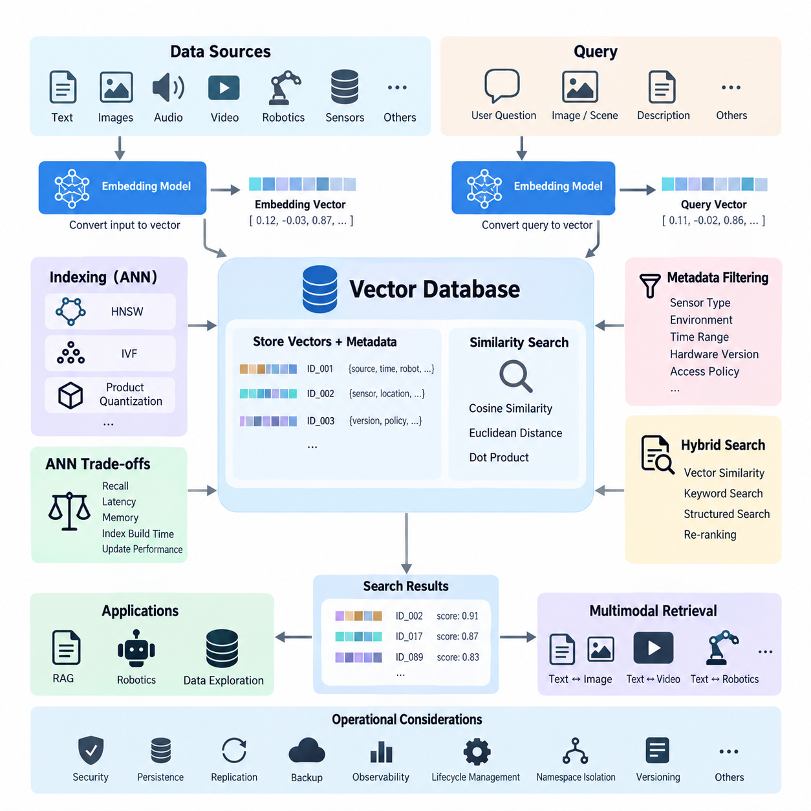
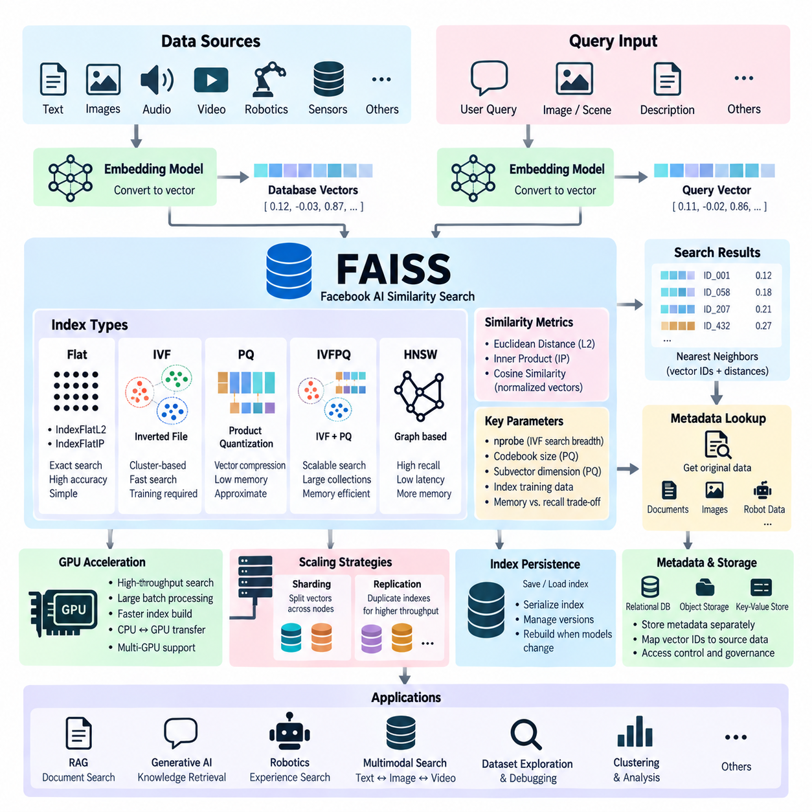
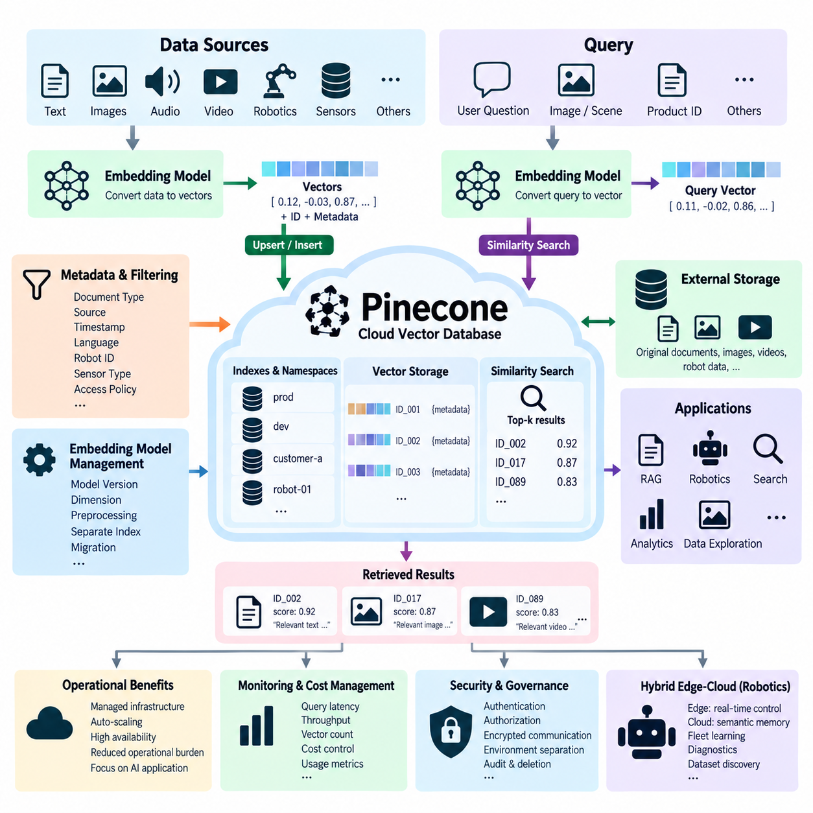
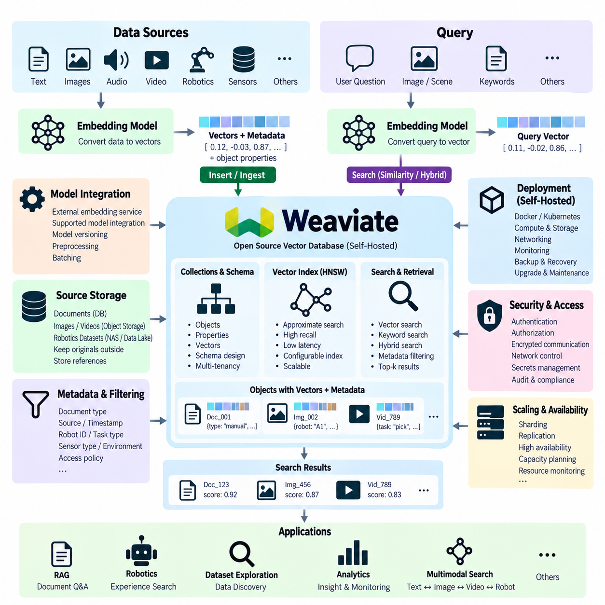
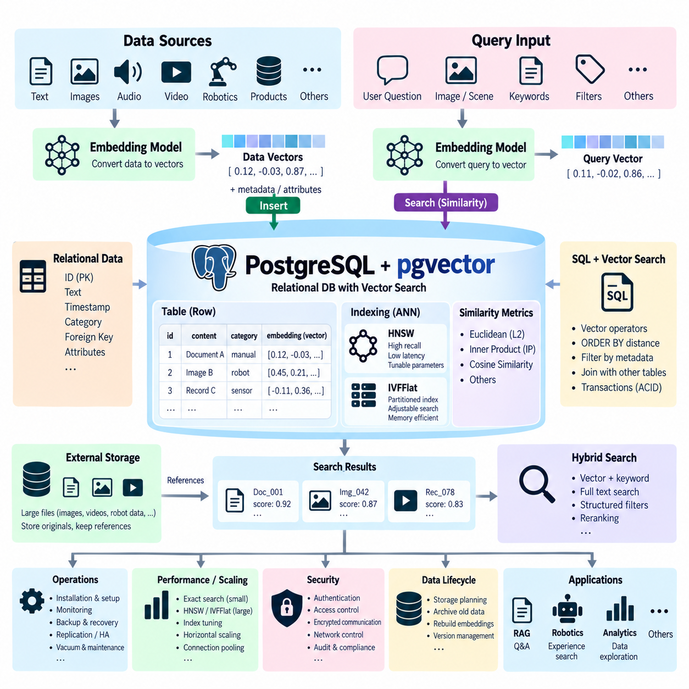
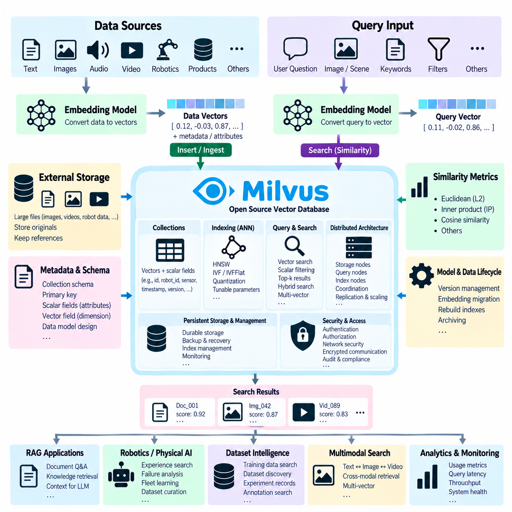
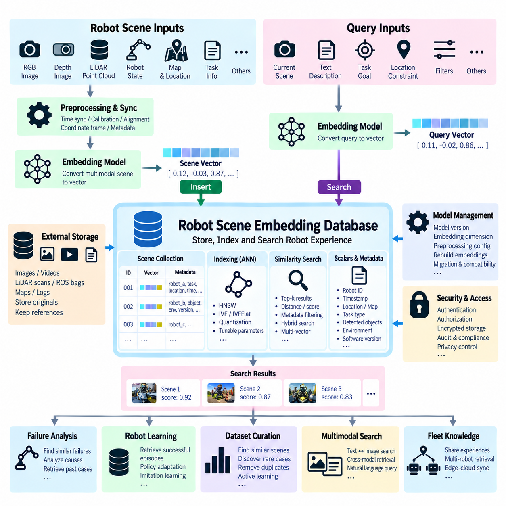
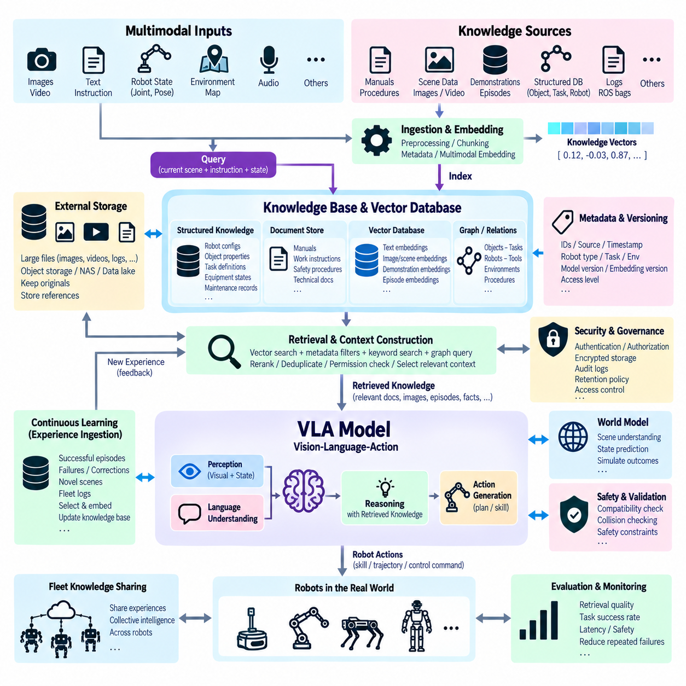
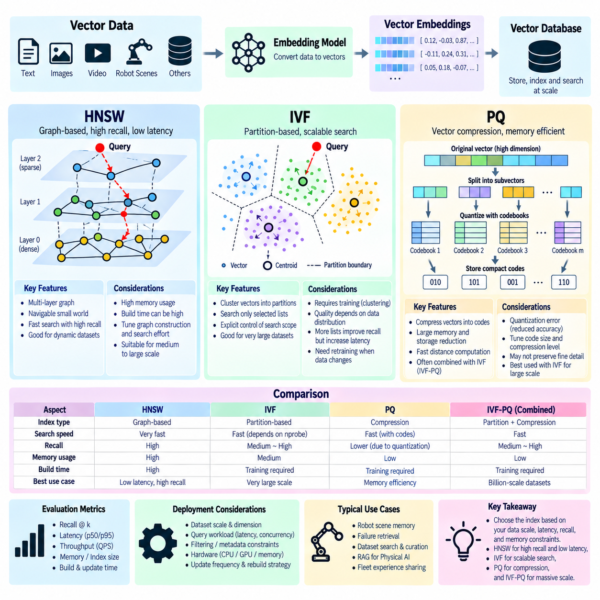
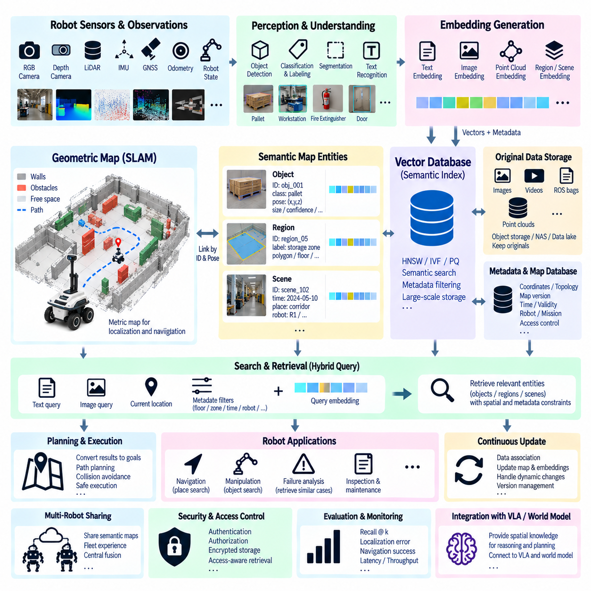

**Volume 08 Robot Database and Storage**


# 05. Vector Databases

##  

## 05.01 Vector Database Concepts: Embeddings / ANN Search

{width="7.268055555555556in" height="7.268055555555556in"}

Vector databases are specialized data systems designed to store, index, and retrieve high-dimensional numerical representations called embeddings. Unlike relational databases that primarily search structured values through exact comparisons, vector databases compare mathematical representations of meaning, appearance, behavior, or context. This makes them particularly useful for AI systems that must retrieve information based on semantic similarity rather than exact keywords or identifiers.

An embedding is a dense numerical vector generated by a machine learning model from an input such as text, an image, audio, video, sensor observations, robot states, or multimodal data. The embedding model transforms important characteristics of the original input into coordinates within a high-dimensional vector space. Inputs with similar semantic or perceptual characteristics are generally positioned closer together, allowing mathematical distance to approximate meaningful similarity.

Embedding dimensionality depends on the model and application. A vector may contain hundreds or thousands of floating-point values, with each dimension contributing to the learned representation. Individual dimensions usually do not correspond to simple human-readable attributes. Instead, meaning is distributed across the vector. This distributed representation enables AI applications to compare complex objects even when their raw formats, wording, viewpoints, or sensor observations differ substantially.

Similarity between vectors is commonly measured using cosine similarity, Euclidean distance, or dot product. Cosine similarity evaluates the angle between vectors and is widely used for semantic embeddings, while Euclidean distance measures geometric separation in vector space. Dot-product search is frequently used when embedding models are trained around that metric. The database and embedding model must therefore use compatible similarity assumptions to produce meaningful retrieval results.

A basic vector retrieval pipeline begins when source data is processed by an embedding model. The resulting vector is stored together with an identifier and associated metadata, such as document source, timestamp, robot identifier, sensor type, location category, access policy, or dataset version. When a query arrives, the same or a compatible embedding model converts it into a query vector. The database then searches for stored vectors located near that query in the embedding space.

Performing an exact comparison against every stored vector is known as exact nearest-neighbor search. Although this approach can provide highly accurate results, its computational cost increases rapidly as the number and dimensionality of vectors grow. AI platforms may contain millions or billions of embeddings, making exhaustive comparison impractical for latency-sensitive applications. Vector databases therefore commonly employ Approximate Nearest Neighbor (ANN) search to obtain highly relevant candidates with much lower computational cost.

ANN algorithms deliberately trade a small amount of retrieval accuracy for substantial improvements in search speed, memory efficiency, and scalability. Instead of calculating the distance between a query and every vector, an ANN index organizes the vector space so that promising regions or candidates can be examined first. The system attempts to retrieve vectors that are extremely close to the true nearest neighbors without requiring a complete scan of the entire collection.

Hierarchical Navigable Small World (HNSW) graphs are among the most widely used ANN indexing approaches. HNSW represents vectors as nodes in a multilayer graph and connects nearby vectors through navigable links. Search begins in sparse upper layers and progressively moves toward denser lower layers, rapidly approaching relevant neighborhoods. HNSW often provides excellent recall and low query latency, although maintaining the graph can require significant memory and index construction resources.

Another important ANN family uses inverted-file indexing, commonly represented by IVF techniques. The vector space is partitioned into clusters, and vectors are assigned to representative regions. During retrieval, the query first identifies likely clusters and searches only selected portions of the index. IVF can significantly reduce the number of distance calculations and can be combined with vector compression techniques to support very large embedding collections.

Product Quantization (PQ) reduces vector storage and distance-computation costs by representing vectors with compact encoded approximations. High-dimensional vectors are divided into smaller subvectors, and each subvector is mapped to a learned codebook entry. Instead of storing and comparing every original floating-point component, the system can operate on compact codes. IVF and PQ are frequently combined when database scale makes memory consumption and search throughput critical architectural concerns.

ANN configuration involves balancing recall, latency, memory consumption, index construction time, and update performance. Increasing the number of explored graph nodes or searched clusters may improve recall but also increase query latency. More aggressive compression reduces storage requirements but can reduce retrieval precision. Consequently, there is no universally optimal vector index. Parameters should be benchmarked using representative workloads and realistic queries rather than selected solely from theoretical performance characteristics.

Metadata filtering is another essential capability of practical vector databases. Semantic similarity alone may return mathematically relevant vectors that violate application constraints. A robot application, for example, may require observations from a particular sensor family, environment type, hardware version, time interval, or operational condition. Combining ANN retrieval with metadata filters allows the system to narrow the candidate space while preserving semantic similarity as the primary retrieval mechanism.

Vector databases commonly support hybrid retrieval that combines vector similarity with lexical or structured search. Keyword matching remains valuable for exact product names, error codes, component identifiers, technical terminology, and uncommon proper nouns that embeddings may not represent precisely. Hybrid systems can merge semantic scores with lexical relevance and metadata constraints, producing retrieval pipelines that benefit from both learned representations and conventional information-retrieval techniques.

Retrieval quality depends heavily on embedding quality. A sophisticated ANN index cannot compensate for embeddings that fail to represent distinctions important to the application. Embedding models should therefore be evaluated against domain-specific queries, positive examples, difficult negatives, and operational edge cases. Changes to an embedding model may also alter the geometry of the vector space, potentially requiring stored data to be re-embedded and indexes to be rebuilt or migrated.

Vector databases are especially important in Retrieval-Augmented Generation (RAG). Documents are divided into suitable chunks, transformed into embeddings, and indexed. A user question is embedded and used to retrieve semantically related chunks, which are then supplied to a language model as contextual evidence. Retrieval quality, chunking strategy, metadata design, embedding selection, reranking, and access control collectively determine whether the generated response receives relevant and trustworthy supporting information.

In Physical AI and robotics, vector databases can extend beyond document retrieval. Images, trajectories, manipulation episodes, sensor sequences, maps, object observations, failure events, and robot experiences can be represented as embeddings. A robot or orchestration platform can retrieve similar historical situations and associate them with actions, outcomes, environmental conditions, or safety information. This creates a searchable experience layer connecting large-scale robot data with reasoning and decision-support systems.

Multimodal embeddings further expand this architecture by placing information from different modalities into compatible representation spaces. A textual query such as a description of an object or scene may retrieve relevant images, video segments, or robot observations when the embedding model supports cross-modal alignment. Such capabilities are valuable for dataset exploration, robot memory, incident analysis, training-data discovery, and semantic search across heterogeneous Physical AI data repositories.

Operationally, a vector database must be treated as more than an ANN algorithm. Production systems require persistence, replication, backup, authentication, authorization, encryption, observability, lifecycle management, namespace isolation, and controlled index updates. The original source data should normally remain authoritative because embeddings are derived representations. Maintaining references between vectors and source objects allows retrieval results to be traced, validated, refreshed, deleted, or regenerated when models change.

A robust architecture also separates embedding generation from vector storage and retrieval. Embedding services can evolve independently, while the database manages vector collections, indexes, metadata, and query execution. Version identifiers for embedding models, preprocessing pipelines, schemas, and datasets should accompany stored vectors. This prevents vectors generated under incompatible representation spaces from being silently mixed and supports controlled migration when models or preprocessing procedures are upgraded.

Ultimately, vector databases provide the retrieval infrastructure that connects machine-learned representations with scalable data systems. Embeddings convert complex information into searchable numerical spaces, while ANN methods make similarity search practical at large scale. Their effectiveness depends on the combined design of embedding models, distance metrics, indexes, metadata, filtering, hybrid retrieval, and operational governance, forming a foundational data layer for modern generative AI and Physical AI systems.

벡터 데이터베이스(Vector Database)는 임베딩(Embedding)이라고 하는 고차원 수치 표현을 저장하고, 인덱싱(Indexing)하며, 검색하기 위해 설계된 특수한 데이터 시스템이다. 정확한 값 비교를 통해 구조화된 데이터를 주로 검색하는 관계형 데이터베이스(Relational Database)와 달리, 벡터 데이터베이스는 의미, 외형, 행동 또는 문맥을 수학적으로 표현한 결과를 비교한다. 따라서 정확한 키워드나 식별자보다 의미적 유사성(Semantic Similarity)을 기반으로 정보를 검색해야 하는 인공지능(AI) 시스템에 특히 유용하다.

임베딩(Embedding)은 텍스트, 이미지, 오디오, 비디오, 센서 관측값, 로봇 상태 또는 멀티모달 데이터(Multimodal Data)와 같은 입력을 기계학습 모델(Machine Learning Model)이 변환하여 생성한 밀집 수치 벡터(Dense Numerical Vector)이다. 임베딩 모델(Embedding Model)은 원본 입력의 중요한 특성을 고차원 벡터 공간(Vector Space)의 좌표로 변환한다. 의미적 또는 지각적으로 유사한 입력은 일반적으로 서로 가까운 위치에 배치되므로, 수학적 거리를 이용하여 의미 있는 유사성을 근사할 수 있다.

임베딩 차원(Embedding Dimensionality)은 사용되는 모델과 응용 분야에 따라 달라진다. 하나의 벡터는 수백 개에서 수천 개의 부동소수점 값(Floating-Point Value)을 포함할 수 있으며, 각 차원은 학습된 표현에 기여한다. 개별 차원은 일반적으로 사람이 쉽게 이해할 수 있는 단순한 속성과 직접 대응하지 않는다. 대신 의미가 전체 벡터에 분산되어 표현된다. 이러한 분산 표현(Distributed Representation)을 통해 원본 형식, 표현 방식, 관측 시점 또는 센서 데이터가 크게 다르더라도 복잡한 객체를 비교할 수 있다.

벡터 간 유사성은 일반적으로 코사인 유사도(Cosine Similarity), 유클리드 거리(Euclidean Distance), 또는 내적(Dot Product)을 이용하여 측정한다. 코사인 유사도는 벡터 사이의 각도를 평가하며 의미 임베딩(Semantic Embedding)에 널리 사용되고, 유클리드 거리는 벡터 공간에서의 기하학적 거리를 측정한다. 내적 검색(Dot-Product Search)은 임베딩 모델이 해당 측정 방식을 기준으로 학습된 경우 자주 사용된다. 따라서 의미 있는 검색 결과를 얻으려면 데이터베이스와 임베딩 모델이 서로 호환되는 유사성 측정 방식을 사용해야 한다.

기본적인 벡터 검색 파이프라인(Vector Retrieval Pipeline)은 원본 데이터를 임베딩 모델로 처리하면서 시작된다. 생성된 벡터는 식별자와 함께 문서 출처, 타임스탬프(Timestamp), 로봇 식별자, 센서 유형, 위치 범주, 접근 정책 또는 데이터셋 버전과 같은 관련 메타데이터(Metadata)와 함께 저장된다. 질의(Query)가 입력되면 동일하거나 호환되는 임베딩 모델이 이를 질의 벡터(Query Vector)로 변환하고, 데이터베이스는 임베딩 공간에서 해당 질의 벡터와 가까운 저장 벡터를 검색한다.

저장된 모든 벡터와 정확하게 비교하는 방식을 정확 최근접 이웃 검색(Exact Nearest-Neighbor Search)이라고 한다. 이 방법은 높은 정확도를 제공할 수 있지만 벡터의 수와 차원이 증가할수록 계산 비용이 급격히 증가한다. 인공지능 플랫폼에는 수백만 개에서 수십억 개의 임베딩이 포함될 수 있으므로 모든 벡터를 전수 비교하는 방식은 낮은 지연시간(Latency)이 필요한 응용 환경에서 비현실적이다. 따라서 벡터 데이터베이스는 일반적으로 근사 최근접 이웃 검색(Approximate Nearest Neighbor Search, ANN)을 사용하여 훨씬 낮은 계산 비용으로 관련성이 높은 후보를 검색한다.

근사 최근접 이웃(ANN) 알고리즘은 검색 속도, 메모리 효율성 및 확장성을 크게 향상시키는 대신 검색 정확도의 일부를 의도적으로 절충한다. ANN 인덱스(Index)는 질의 벡터를 모든 저장 벡터와 비교하는 대신, 가능성이 높은 영역이나 후보를 먼저 조사할 수 있도록 벡터 공간을 구성한다. 이를 통해 전체 벡터 집합을 완전히 검색하지 않고도 실제 최근접 이웃(True Nearest Neighbor)에 매우 가까운 벡터를 빠르게 찾는 것을 목표로 한다.

계층적 탐색 가능 소세계 그래프(Hierarchical Navigable Small World, HNSW)는 가장 널리 사용되는 ANN 인덱싱 방식 가운데 하나이다. HNSW는 벡터를 다계층 그래프(Multilayer Graph)의 노드(Node)로 표현하고 가까운 벡터를 탐색 가능한 연결 관계로 구성한다. 검색은 희소한 상위 계층에서 시작하여 점차 밀집된 하위 계층으로 이동하면서 관련성이 높은 영역에 빠르게 접근한다. HNSW는 높은 재현율(Recall)과 낮은 질의 지연시간을 제공하지만 그래프를 구축하고 유지하는 과정에서 상당한 메모리와 인덱스 생성 자원이 필요할 수 있다.

또 다른 중요한 ANN 방식은 역파일 인덱싱(Inverted-File Indexing)을 사용하는 계열이며 대표적으로 IVF(Inverted File) 기법이 있다. 벡터 공간을 여러 클러스터(Cluster)로 분할하고 각각의 벡터를 대표 영역에 할당한다. 검색 과정에서는 먼저 질의와 관련성이 높은 클러스터를 식별한 후 선택된 인덱스 영역만 검색한다. IVF는 거리 계산 횟수를 크게 줄일 수 있으며, 벡터 압축(Vector Compression) 기술과 결합하면 매우 큰 규모의 임베딩 컬렉션을 효과적으로 처리할 수 있다.

곱 양자화(Product Quantization, PQ)는 벡터를 압축된 근사 표현으로 변환하여 저장 공간과 거리 계산 비용을 감소시킨다. 고차원 벡터를 여러 개의 작은 서브벡터(Subvector)로 나누고 각각을 학습된 코드북(Codebook)의 항목에 대응시킨다. 모든 원본 부동소수점 요소를 직접 저장하고 비교하는 대신 압축된 코드(Compact Code)를 이용하여 연산할 수 있다. 데이터베이스 규모가 매우 커져 메모리 소비량과 검색 처리량(Search Throughput)이 중요한 아키텍처 요소가 되는 경우 IVF와 PQ를 함께 사용하는 경우가 많다.

ANN 설정에서는 재현율(Recall), 지연시간(Latency), 메모리 소비량, 인덱스 구축 시간 및 업데이트 성능 사이의 균형을 고려해야 한다. 탐색하는 그래프 노드 수나 검색 대상 클러스터 수를 증가시키면 재현율은 향상될 수 있지만 질의 지연시간 역시 증가한다. 더 강한 압축을 적용하면 저장 공간은 줄어들지만 검색 정밀도(Retrieval Precision)가 감소할 수 있다. 따라서 모든 환경에 적용할 수 있는 단일 최적 벡터 인덱스는 존재하지 않으며, 실제 응용 환경을 대표하는 워크로드(Workload)와 질의를 사용하여 매개변수를 벤치마킹(Benchmarking)해야 한다.

메타데이터 필터링(Metadata Filtering)은 실제 벡터 데이터베이스에서 매우 중요한 또 하나의 기능이다. 의미적 유사성만을 기준으로 검색하면 수학적으로는 관련성이 높지만 응용 시스템의 제약 조건을 충족하지 못하는 벡터가 반환될 수 있다. 예를 들어 로봇 응용 시스템은 특정 센서 계열, 환경 유형, 하드웨어 버전, 시간 구간 또는 운용 조건에서 생성된 관측 데이터만 필요할 수 있다. ANN 검색과 메타데이터 필터를 결합하면 의미적 유사성을 핵심 검색 기준으로 유지하면서 후보 공간을 효과적으로 제한할 수 있다.

벡터 데이터베이스는 벡터 유사성과 어휘 기반 검색(Lexical Search) 또는 구조화 검색(Structured Search)을 결합하는 하이브리드 검색(Hybrid Retrieval)을 지원하는 경우가 많다. 정확한 제품명, 오류 코드, 부품 식별자, 기술 용어 및 희귀 고유명사는 임베딩이 정확하게 표현하지 못할 수 있으므로 키워드 매칭(Keyword Matching)이 여전히 중요하다. 하이브리드 시스템은 의미 점수, 어휘 관련성 및 메타데이터 조건을 결합하여 학습된 표현과 기존 정보 검색 기술의 장점을 동시에 활용할 수 있다.

검색 품질은 임베딩 품질(Embedding Quality)에 크게 좌우된다. 아무리 정교한 ANN 인덱스를 사용하더라도 응용 분야에서 중요한 차이를 표현하지 못하는 임베딩 자체의 한계를 보완할 수는 없다. 따라서 임베딩 모델은 도메인 특화 질의(Domain-Specific Query), 긍정 예제(Positive Example), 구분하기 어려운 부정 예제(Hard Negative), 실제 운용 과정의 예외 상황을 이용하여 평가해야 한다. 임베딩 모델이 변경되면 벡터 공간의 구조도 달라질 수 있으므로 저장된 데이터를 다시 임베딩하고 인덱스를 재구축하거나 마이그레이션(Migration)해야 할 수도 있다.

벡터 데이터베이스는 검색 증강 생성(Retrieval-Augmented Generation, RAG)에서 특히 중요하다. 문서를 적절한 청크(Chunk)로 분할한 후 임베딩으로 변환하여 인덱싱한다. 사용자의 질문도 임베딩으로 변환하여 의미적으로 관련된 문서 청크를 검색하고, 검색된 내용을 언어 모델(Language Model)에 문맥적 근거(Contextual Evidence)로 제공한다. 검색 품질, 청킹 전략(Chunking Strategy), 메타데이터 설계, 임베딩 모델 선택, 재순위화(Reranking), 접근 제어가 결합되어 생성 모델이 얼마나 관련성 높고 신뢰할 수 있는 정보를 제공받는지를 결정한다.

피지컬 AI(Physical AI)와 로보틱스(Robotics)에서 벡터 데이터베이스는 단순한 문서 검색을 넘어 활용될 수 있다. 이미지, 이동 궤적(Trajectory), 조작 에피소드(Manipulation Episode), 센서 시퀀스(Sensor Sequence), 지도, 객체 관측 데이터, 실패 이벤트 및 로봇 경험을 임베딩으로 표현할 수 있다. 로봇 또는 오케스트레이션 플랫폼(Orchestration Platform)은 과거의 유사한 상황을 검색하고 이를 행동, 결과, 환경 조건 또는 안전 정보와 연결할 수 있다. 이를 통해 대규모 로봇 데이터와 추론 및 의사결정 지원 시스템을 연결하는 검색 가능한 경험 계층(Searchable Experience Layer)을 구축할 수 있다.

멀티모달 임베딩(Multimodal Embedding)은 서로 다른 데이터 유형의 정보를 호환 가능한 표현 공간에 배치함으로써 이러한 아키텍처를 더욱 확장한다. 임베딩 모델이 교차 모달 정렬(Cross-Modal Alignment)을 지원하면 객체나 장면을 설명하는 텍스트 질의를 이용하여 관련 이미지, 비디오 구간 또는 로봇 관측 데이터를 검색할 수 있다. 이러한 기능은 데이터셋 탐색, 로봇 메모리(Robot Memory), 사고 분석, 학습 데이터 검색 및 이질적인 피지컬 AI 데이터 저장소 전반의 의미 검색에 활용될 수 있다.

운영 관점에서 벡터 데이터베이스는 단순한 ANN 알고리즘 이상의 시스템으로 다루어야 한다. 실제 운영 시스템(Production System)에는 영속성(Persistence), 복제(Replication), 백업(Backup), 인증(Authentication), 권한 부여(Authorization), 암호화(Encryption), 관측 가능성(Observability), 수명주기 관리(Lifecycle Management), 네임스페이스 격리(Namespace Isolation), 통제된 인덱스 업데이트가 필요하다. 임베딩은 파생 표현(Derived Representation)이므로 일반적으로 원본 데이터를 최종 기준 데이터로 유지해야 하며, 벡터와 원본 객체 간 참조 관계를 유지하여 검색 결과를 추적, 검증, 갱신, 삭제 또는 재생성할 수 있도록 해야 한다.

견고한 아키텍처에서는 임베딩 생성(Embedding Generation)과 벡터 저장 및 검색(Vector Storage and Retrieval)을 분리하는 것도 중요하다. 임베딩 서비스는 독립적으로 발전할 수 있으며, 데이터베이스는 벡터 컬렉션(Vector Collection), 인덱스, 메타데이터 및 질의 실행을 관리한다. 저장되는 벡터에는 임베딩 모델, 전처리 파이프라인(Preprocessing Pipeline), 스키마(Schema), 데이터셋의 버전 식별자를 함께 기록해야 한다. 이를 통해 서로 호환되지 않는 표현 공간에서 생성된 벡터가 의도치 않게 혼합되는 것을 방지하고 모델이나 전처리 절차가 변경될 때 통제된 마이그레이션을 수행할 수 있다.

궁극적으로 벡터 데이터베이스(Vector Database)는 기계학습을 통해 생성된 표현과 확장 가능한 데이터 시스템을 연결하는 검색 인프라(Retrieval Infrastructure)를 제공한다. 임베딩은 복잡한 정보를 검색 가능한 수치 공간으로 변환하고, 근사 최근접 이웃(ANN) 기법은 대규모 환경에서도 유사성 검색을 실용적으로 수행할 수 있게 한다. 벡터 데이터베이스의 효과는 임베딩 모델, 거리 측정 방식, 인덱스, 메타데이터, 필터링, 하이브리드 검색 및 운영 거버넌스(Operational Governance)의 통합 설계에 의해 결정되며, 현대 생성형 AI(Generative AI)와 피지컬 AI 시스템을 구성하는 핵심 데이터 계층(Foundational Data Layer)이 된다.

##  

## 05.02 FAISS: Large-Scale Vector Search Library [w/Code]

{width="7.268055555555556in" height="7.268055555555556in"}

FAISS, or Facebook AI Similarity Search, is a software library designed for efficient similarity search and clustering of dense numerical vectors. It was developed to address the computational challenges that arise when AI systems must compare a query embedding against millions or billions of stored embeddings. Rather than functioning as a complete database, FAISS provides optimized algorithms and data structures that can serve as the high-performance vector-search engine inside a larger AI data architecture.

The fundamental FAISS workflow begins with a collection of fixed-dimensional vectors, usually produced by an embedding model. Text, images, audio, video, robot observations, trajectories, or other information can first be transformed into vectors and then added to a FAISS index. A query is transformed using a compatible embedding model, and FAISS searches the index for the nearest vectors according to a selected distance or similarity metric, returning identifiers and corresponding distance values.

FAISS commonly supports Euclidean distance and inner-product-based similarity calculations. Cosine similarity can also be implemented by normalizing vectors and performing inner-product search. Selecting the metric is not merely an implementation detail because the geometry assumed during embedding-model training affects how similarity should be interpreted. A search system should therefore preserve consistency among embedding generation, normalization procedures, FAISS index configuration, and application-level relevance evaluation.

One of the simplest FAISS structures is a flat index, such as IndexFlatL2 or IndexFlatIP. Flat indexes retain vectors without approximation and compare a query against all indexed vectors. They provide exact nearest-neighbor search and are useful as accuracy baselines, for relatively small datasets, or when maximum recall is more important than search cost. However, computation grows with collection size, making exhaustive flat search increasingly expensive for very large vector repositories.

FAISS provides multiple approximate nearest neighbor techniques for situations where exhaustive search is impractical. Inverted File Indexes, commonly called IVF indexes, divide the vector space into clusters represented by centroids. During a query, FAISS identifies the most promising clusters and searches vectors contained within only a selected number of them. This substantially reduces comparisons while allowing the operator to control the trade-off between query latency and retrieval recall.

An IVF index generally requires a training phase before vectors are added. Representative training vectors are used to learn the centroids that partition the embedding space. The quality and distribution of this training sample are important because poorly selected samples may create unbalanced or unrepresentative partitions. After training, database vectors are assigned to inverted lists associated with centroids, allowing queries to concentrate computation on regions likely to contain relevant nearest neighbors.

The nprobe parameter is especially important when using IVF. It determines how many inverted lists are examined for each query. A small nprobe value reduces computation and usually improves speed, but it may miss relevant vectors located in neighboring clusters. Increasing nprobe searches more regions and generally improves recall at the cost of additional latency. Production tuning therefore requires measuring recall and response time against representative queries rather than selecting parameters arbitrarily.

Product Quantization, or PQ, is another major FAISS capability for large-scale search. PQ compresses high-dimensional vectors by dividing them into subvectors and encoding each subvector using entries from learned codebooks. The resulting compact representation can dramatically reduce memory requirements compared with storing every component as a full floating-point value. Approximate distances can then be calculated efficiently from the encoded vectors, enabling much larger collections to remain searchable within available memory.

FAISS can combine inverted indexing and product quantization through structures such as IVFPQ. The IVF component limits search to selected portions of the vector space, while PQ reduces the storage and computational cost of vectors inside those regions. This combination is particularly useful when the vector collection becomes too large for straightforward in-memory exact search. The architectural trade-off is that compression and restricted probing introduce approximation that must be evaluated against application requirements.

Hierarchical Navigable Small World graph techniques are also available through FAISS indexes based on HNSW. These structures organize vectors as graph nodes connected to nearby neighbors, enabling search to navigate rapidly toward relevant regions. HNSW can provide strong recall and low query latency, particularly when enough memory is available. Compared with heavily compressed indexes, however, graph structures may consume more memory, making workload characteristics and infrastructure constraints important selection factors.

FAISS also provides GPU acceleration for supported index types and operations. Similarity calculations are highly parallel numerical workloads, making GPUs well suited for processing large batches of vector comparisons. CPU indexes can often be transferred to GPU resources, while multiple GPUs can be used to replicate or partition workloads depending on the architecture. GPU acceleration is particularly valuable for high-throughput retrieval, large batch queries, index construction, and AI pipelines that already use GPU-based embedding models.

Memory architecture becomes increasingly important as vector collections grow. A million vectors with hundreds or thousands of floating-point dimensions can already require substantial memory, while billion-scale collections demand careful compression, partitioning, or distributed strategies. FAISS provides mechanisms that help reduce this burden, but architects must still estimate vector count, dimensionality, representation size, index overhead, query concurrency, and available CPU or GPU memory before selecting an index configuration.

Large-scale FAISS systems may use sharding to divide vectors across multiple indexes, devices, or servers. Each shard searches a subset of the vector collection, after which candidate results are merged to obtain the global nearest neighbors. Replication can instead place equivalent indexes on multiple resources to increase query throughput. These approaches address different scaling requirements: sharding expands searchable capacity, whereas replication primarily improves concurrency and availability at the retrieval layer.

FAISS itself should not be confused with a full production vector database. It focuses primarily on vector indexing, similarity search, clustering, and related numerical operations. Features such as durable transactional storage, rich metadata management, authentication, authorization, replication policies, backup workflows, distributed coordination, and application APIs generally require additional infrastructure. Many vector database products and custom AI platforms therefore use FAISS-like indexing concepts while surrounding them with broader data-management capabilities.

Metadata is commonly managed outside the core FAISS index. FAISS search results usually provide vector identifiers and distances, which an application can map to documents, images, robot episodes, sensor records, or database rows stored elsewhere. This separation allows relational databases, object storage, key-value systems, or specialized metadata services to remain authoritative for original content. Careful identifier management is therefore essential for maintaining reliable relationships between vectors and their source objects.

Index persistence is another important operational consideration. A trained and populated FAISS index can be serialized to storage and loaded again rather than rebuilt every time an application starts. Nevertheless, the index should be treated as a derived artifact when vectors originate from external authoritative datasets. Keeping embedding-model versions, preprocessing configurations, index parameters, dataset manifests, and source identifiers makes it possible to reproduce or rebuild the index when data or models change.

Embedding-model migration requires particular attention because vectors produced by different models usually inhabit incompatible representation spaces. Adding vectors from a new embedding model directly into an existing index can make similarity results meaningless even when vector dimensions happen to match. A controlled migration typically creates a separate index, regenerates embeddings from authoritative source data, evaluates retrieval quality, and then switches applications to the new representation after validation.

FAISS is valuable in Retrieval-Augmented Generation systems where document chunks are embedded and indexed for semantic retrieval. A query embedding can rapidly identify candidate passages that are then filtered, reranked, and supplied to a language model. In this architecture, FAISS handles high-performance candidate generation, while surrounding services manage document ingestion, chunking, metadata, access permissions, reranking, source attribution, and lifecycle control.

Physical AI systems can apply the same architecture to robot and sensor data. Embeddings may represent camera observations, manipulation episodes, trajectories, environmental states, failure cases, object interactions, or learned robot experiences. FAISS can retrieve historical vectors similar to a current observation, allowing higher-level systems to locate related episodes, training samples, behaviors, or outcomes. The original high-volume data can remain in object or dataset storage while FAISS provides a compact semantic retrieval layer.

For multimodal robotics, separate or jointly trained embedding models can transform text, images, video segments, sensor sequences, and robot states into searchable representations. FAISS then provides efficient nearest-neighbor operations over these representations without needing to understand their original modality. When cross-modal embeddings share a compatible space, a textual description may retrieve relevant visual observations or robot experiences, supporting dataset exploration, robot memory, debugging, and training-data discovery.

Benchmarking is essential before deploying FAISS at scale. Evaluation should include recall at different values of k, query latency distributions, throughput, memory consumption, index construction time, update behavior, and CPU or GPU utilization. Tests should use realistic vector distributions and representative queries because synthetic random vectors may not reproduce the clustering characteristics of production embeddings. Exact flat search can serve as a reference for measuring the recall of approximate configurations.

Ultimately, FAISS provides a flexible computational foundation for large-scale vector similarity search rather than an all-in-one data platform. Its flat, IVF, PQ, IVFPQ, HNSW, CPU, and GPU capabilities allow engineers to select different balances of accuracy, latency, throughput, and memory efficiency. When integrated with embedding services, metadata systems, persistent storage, governance, and application logic, FAISS can form a powerful retrieval engine for generative AI, multimodal systems, and large-scale Physical AI data architectures.

FAISS(Facebook AI Similarity Search)는 밀집 수치 벡터(Dense Numerical Vector)의 효율적인 유사성 검색(Similarity Search)과 군집화(Clustering)를 위해 설계된 소프트웨어 라이브러리이다. AI 시스템이 하나의 질의 임베딩(Query Embedding)을 수백만 개 또는 수십억 개의 저장 임베딩과 비교해야 할 때 발생하는 계산 문제를 해결하기 위해 개발되었다. FAISS는 완전한 데이터베이스라기보다 대규모 AI 데이터 아키텍처 내부에서 고성능 벡터 검색 엔진(Vector Search Engine)으로 사용할 수 있는 최적화된 알고리즘과 데이터 구조를 제공한다.

FAISS의 기본적인 처리 과정은 일반적으로 임베딩 모델(Embedding Model)이 생성한 고정 차원의 벡터 컬렉션(Vector Collection)에서 시작한다. 텍스트, 이미지, 오디오, 비디오, 로봇 관측값, 이동 궤적(Trajectory) 또는 기타 정보를 먼저 벡터로 변환한 후 FAISS 인덱스(Index)에 추가할 수 있다. 질의 역시 호환되는 임베딩 모델을 통해 변환되며, FAISS는 선택된 거리 또는 유사성 측정 방식에 따라 인덱스에서 가장 가까운 벡터를 검색하여 식별자와 해당 거리 값을 반환한다.

FAISS는 일반적으로 유클리드 거리(Euclidean Distance)와 내적 기반 유사성(Inner-Product-Based Similarity) 계산을 지원한다. 벡터를 정규화(Normalization)한 후 내적 검색을 수행하는 방식으로 코사인 유사도(Cosine Similarity)도 구현할 수 있다. 측정 방식의 선택은 단순한 구현 세부사항이 아니며, 임베딩 모델 학습 과정에서 가정한 공간 구조가 유사성 해석 방식에 영향을 준다. 따라서 임베딩 생성, 정규화 절차, FAISS 인덱스 설정 및 응용 수준의 관련성 평가 사이에서 일관성을 유지해야 한다.

가장 단순한 FAISS 구조 가운데 하나는 IndexFlatL2 또는 IndexFlatIP와 같은 플랫 인덱스(Flat Index)이다. 플랫 인덱스는 벡터를 근사하지 않고 유지하며 하나의 질의를 인덱스에 저장된 모든 벡터와 비교한다. 따라서 정확 최근접 이웃 검색(Exact Nearest-Neighbor Search)을 제공하며, 비교적 작은 데이터셋, 정확도 기준선(Accuracy Baseline) 설정 또는 검색 비용보다 최대 재현율(Recall)이 중요한 환경에 유용하다. 그러나 컬렉션 규모가 증가할수록 계산량도 증가하므로 대규모 벡터 저장소에서는 전수 검색 비용이 급격하게 커진다.

FAISS는 전수 검색이 비현실적인 환경을 위해 다양한 근사 최근접 이웃(Approximate Nearest Neighbor, ANN) 기술을 제공한다. 일반적으로 IVF라고 하는 역파일 인덱스(Inverted File Index)는 벡터 공간을 중심점(Centroid)으로 표현되는 여러 클러스터(Cluster)로 분할한다. 질의가 입력되면 FAISS는 가장 가능성이 높은 클러스터를 식별하고 선택된 일부 클러스터에 포함된 벡터만 검색한다. 이를 통해 비교 횟수를 크게 줄이면서 질의 지연시간(Query Latency)과 검색 재현율 사이의 균형을 조절할 수 있다.

IVF 인덱스는 일반적으로 벡터를 추가하기 전에 학습 단계(Training Phase)를 필요로 한다. 대표성을 가진 학습 벡터를 이용하여 임베딩 공간을 분할하는 중심점을 학습한다. 학습 표본의 품질과 분포는 매우 중요하며, 부적절하게 선택된 표본은 불균형하거나 실제 데이터를 제대로 대표하지 못하는 공간 분할을 생성할 수 있다. 학습이 완료되면 데이터베이스의 벡터를 중심점과 연결된 역목록(Inverted List)에 할당하여 질의가 관련성이 높은 영역에 계산을 집중할 수 있도록 한다.

nprobe 매개변수(Parameter)는 IVF를 사용할 때 특히 중요하다. 이 값은 각 질의에서 탐색할 역목록의 수를 결정한다. 작은 nprobe 값은 계산량을 감소시켜 일반적으로 검색 속도를 향상시키지만 인접 클러스터에 위치한 관련 벡터를 놓칠 수 있다. nprobe 값을 증가시키면 더 많은 영역을 검색하여 일반적으로 재현율을 향상시키지만 지연시간도 증가한다. 따라서 실제 운영 환경에서는 임의로 값을 선택하기보다 대표적인 질의를 사용하여 재현율과 응답시간을 함께 측정해야 한다.

곱 양자화(Product Quantization, PQ)는 대규모 검색을 위한 FAISS의 또 다른 핵심 기능이다. PQ는 고차원 벡터를 여러 개의 서브벡터(Subvector)로 나누고 각 서브벡터를 학습된 코드북(Codebook)의 항목으로 인코딩하여 벡터를 압축한다. 이렇게 생성된 압축 표현(Compact Representation)은 모든 요소를 완전한 부동소수점 값으로 저장하는 것보다 메모리 요구량을 크게 줄일 수 있다. 인코딩된 벡터를 이용하여 근사 거리를 효율적으로 계산할 수 있으므로 제한된 메모리에서도 훨씬 큰 컬렉션을 검색할 수 있다.

FAISS는 IVFPQ와 같은 구조를 통해 역파일 인덱싱(Inverted Indexing)과 곱 양자화를 결합할 수 있다. IVF 구성요소는 검색 범위를 벡터 공간의 선택된 일부 영역으로 제한하고, PQ는 해당 영역에 포함된 벡터의 저장 및 계산 비용을 감소시킨다. 이러한 조합은 벡터 컬렉션이 너무 커져 단순한 인메모리 정확 검색(In-Memory Exact Search)을 수행하기 어려운 경우 특히 유용하다. 다만 압축과 제한된 탐색으로 인해 근사 오차가 발생하므로 실제 응용 요구사항을 기준으로 성능을 평가해야 한다.

계층적 탐색 가능 소세계(Hierarchical Navigable Small World, HNSW) 그래프 기술도 FAISS의 HNSW 기반 인덱스를 통해 사용할 수 있다. 이 구조는 벡터를 인접한 이웃과 연결된 그래프 노드(Graph Node)로 구성하여 검색 과정이 관련성이 높은 영역으로 빠르게 이동할 수 있도록 한다. HNSW는 충분한 메모리가 제공되는 환경에서 높은 재현율과 낮은 질의 지연시간을 제공할 수 있다. 그러나 강하게 압축된 인덱스와 비교하면 그래프 구조가 더 많은 메모리를 사용할 수 있으므로 워크로드 특성과 인프라 제약을 함께 고려해야 한다.

FAISS는 지원되는 인덱스 유형과 연산에 대해 GPU 가속(GPU Acceleration)도 제공한다. 유사성 계산은 높은 수준의 병렬 처리가 가능한 수치 연산이므로 GPU는 대규모 벡터 비교를 배치(Batch) 단위로 처리하는 데 적합하다. CPU 인덱스를 GPU 자원으로 이전할 수 있으며, 아키텍처에 따라 여러 GPU를 이용하여 워크로드를 복제하거나 분할할 수도 있다. GPU 가속은 높은 처리량의 검색, 대규모 배치 질의, 인덱스 구축 및 이미 GPU 기반 임베딩 모델을 사용하는 AI 파이프라인에서 특히 효과적이다.

벡터 컬렉션의 규모가 증가할수록 메모리 아키텍처(Memory Architecture)의 중요성도 커진다. 수백 또는 수천 차원의 벡터가 백만 개만 존재해도 상당한 메모리가 필요할 수 있으며, 수십억 규모의 컬렉션에서는 압축, 분할 또는 분산 처리 전략을 신중하게 설계해야 한다. FAISS는 이러한 부담을 줄이기 위한 여러 기능을 제공하지만, 인덱스를 선택하기 전에 벡터 수, 차원, 표현 크기, 인덱스 오버헤드(Index Overhead), 질의 동시성(Query Concurrency), 사용 가능한 CPU 또는 GPU 메모리를 함께 계산해야 한다.

대규모 FAISS 시스템에서는 샤딩(Sharding)을 사용하여 벡터를 여러 인덱스, 장치 또는 서버에 분할할 수 있다. 각 샤드(Shard)는 전체 벡터 컬렉션의 일부를 검색하고 이후 후보 결과를 병합하여 전역 최근접 이웃(Global Nearest Neighbor)을 결정한다. 반대로 복제(Replication)는 동일한 인덱스를 여러 자원에 배치하여 질의 처리량을 증가시킬 수 있다. 두 방식은 서로 다른 확장 요구를 해결하며, 샤딩은 검색 가능한 전체 용량을 확장하고 복제는 주로 동시 처리 능력과 검색 계층의 가용성을 향상시킨다.

FAISS 자체를 완전한 운영용 벡터 데이터베이스(Production Vector Database)와 동일하게 이해해서는 안 된다. FAISS는 주로 벡터 인덱싱(Vector Indexing), 유사성 검색, 군집화 및 관련 수치 연산에 집중한다. 영속적인 트랜잭션 저장(Durable Transactional Storage), 풍부한 메타데이터 관리, 인증(Authentication), 권한 부여(Authorization), 복제 정책, 백업 워크플로(Backup Workflow), 분산 조정(Distributed Coordination), 응용 프로그램 인터페이스(Application API)와 같은 기능은 일반적으로 추가적인 인프라가 필요하다. 따라서 많은 벡터 데이터베이스 제품과 맞춤형 AI 플랫폼은 FAISS와 유사한 인덱싱 개념을 더 광범위한 데이터 관리 기능과 결합한다.

메타데이터(Metadata)는 일반적으로 핵심 FAISS 인덱스 외부에서 관리된다. FAISS 검색 결과는 보통 벡터 식별자와 거리 값을 제공하며, 응용 시스템은 이를 다른 저장소에 저장된 문서, 이미지, 로봇 에피소드(Robot Episode), 센서 기록 또는 데이터베이스 행(Database Row)과 연결할 수 있다. 이러한 분리를 통해 관계형 데이터베이스(Relational Database), 객체 저장소(Object Storage), 키-값 시스템(Key-Value System) 또는 전문 메타데이터 서비스가 원본 콘텐츠의 기준 저장소로 유지될 수 있다. 따라서 벡터와 원본 객체 사이의 신뢰할 수 있는 관계를 유지하기 위한 식별자 관리가 매우 중요하다.

인덱스 영속성(Index Persistence)도 중요한 운영 요소이다. 학습되고 데이터가 채워진 FAISS 인덱스는 저장소에 직렬화(Serialization)한 후 다시 불러올 수 있으므로 응용 프로그램을 시작할 때마다 인덱스를 처음부터 재구축할 필요가 없다. 그러나 벡터가 외부의 기준 데이터셋에서 생성되는 경우 인덱스는 파생 산출물(Derived Artifact)로 취급하는 것이 적절하다. 임베딩 모델 버전, 전처리 설정, 인덱스 매개변수, 데이터셋 매니페스트(Dataset Manifest), 원본 식별자를 함께 관리하면 데이터나 모델이 변경될 때 인덱스를 재현하거나 재구축할 수 있다.

임베딩 모델 마이그레이션(Embedding-Model Migration)은 서로 다른 모델에서 생성된 벡터가 일반적으로 호환되지 않는 표현 공간(Representation Space)을 사용하기 때문에 특별한 주의가 필요하다. 벡터 차원이 우연히 동일하더라도 새로운 임베딩 모델에서 생성한 벡터를 기존 인덱스에 직접 추가하면 유사성 검색 결과가 의미를 잃을 수 있다. 통제된 마이그레이션에서는 일반적으로 별도의 인덱스를 생성하고 기준 원본 데이터에서 임베딩을 다시 생성한 후 검색 품질을 평가하며, 검증이 완료된 이후 응용 시스템을 새로운 표현 공간으로 전환한다.

FAISS는 문서 청크(Document Chunk)를 임베딩하고 의미 검색을 위해 인덱싱하는 검색 증강 생성(Retrieval-Augmented Generation, RAG) 시스템에서 유용하다. 질의 임베딩을 이용하여 후보 문서를 빠르게 검색한 후 필터링, 재순위화(Reranking)를 수행하고 선택된 정보를 언어 모델(Language Model)에 제공할 수 있다. 이 아키텍처에서 FAISS는 고성능 후보 생성(Candidate Generation)을 담당하고, 주변 서비스는 문서 수집, 청킹(Chunking), 메타데이터, 접근 권한, 재순위화, 출처 추적(Source Attribution), 수명주기 제어를 관리한다.

피지컬 AI(Physical AI) 시스템에서도 동일한 아키텍처를 로봇 및 센서 데이터에 적용할 수 있다. 임베딩은 카메라 관측값, 조작 에피소드(Manipulation Episode), 이동 궤적, 환경 상태, 실패 사례, 객체 상호작용 또는 학습된 로봇 경험을 표현할 수 있다. FAISS는 현재 관측값과 유사한 과거 벡터를 검색하여 상위 시스템이 관련 에피소드, 학습 샘플, 행동 또는 결과를 찾을 수 있도록 한다. 대용량 원본 데이터는 객체 저장소나 데이터셋 저장소에 유지하면서 FAISS를 압축된 의미 검색 계층(Semantic Retrieval Layer)으로 사용할 수 있다.

멀티모달 로보틱스(Multimodal Robotics)에서는 개별 또는 공동 학습된 임베딩 모델을 이용하여 텍스트, 이미지, 비디오 구간, 센서 시퀀스 및 로봇 상태를 검색 가능한 표현으로 변환할 수 있다. FAISS는 이러한 표현의 원래 데이터 유형을 직접 이해할 필요 없이 효율적인 최근접 이웃 연산을 제공한다. 교차 모달 임베딩(Cross-Modal Embedding)이 호환 가능한 공간을 공유한다면 텍스트 설명으로 관련 시각 관측 데이터나 로봇 경험을 검색할 수 있으며, 데이터셋 탐색, 로봇 메모리(Robot Memory), 디버깅(Debugging), 학습 데이터 검색 등에 활용할 수 있다.

FAISS를 대규모 환경에 배포하기 전에 벤치마킹(Benchmarking)을 수행하는 것이 필수적이다. 평가에는 서로 다른 k 값에서의 재현율, 질의 지연시간 분포, 처리량(Throughput), 메모리 사용량, 인덱스 구축 시간, 업데이트 특성, CPU 또는 GPU 사용률을 포함해야 한다. 무작위로 생성한 합성 벡터는 실제 운영 임베딩의 군집 특성을 재현하지 못할 수 있으므로 현실적인 벡터 분포와 대표적인 질의를 사용해야 한다. 정확한 플랫 검색(Exact Flat Search)은 근사 인덱스 설정의 재현율을 측정하기 위한 기준으로 활용할 수 있다.

궁극적으로 FAISS는 모든 기능을 포함한 데이터 플랫폼이 아니라 대규모 벡터 유사성 검색을 위한 유연한 계산 기반(Computational Foundation)을 제공한다. 플랫(Flat), IVF, PQ, IVFPQ, HNSW, CPU 및 GPU 기능을 활용하면 정확도, 지연시간, 처리량 및 메모리 효율성 사이에서 다양한 균형점을 선택할 수 있다. FAISS를 임베딩 서비스, 메타데이터 시스템, 영속 저장소(Persistent Storage), 거버넌스(Governance), 응용 로직과 통합하면 생성형 AI(Generative AI), 멀티모달 시스템(Multimodal System), 대규모 피지컬 AI 데이터 아키텍처를 위한 강력한 검색 엔진을 구축할 수 있다.

##  

## 05.03 Pinecone: Cloud Vector DB Usage [w/Code]

{width="7.268055555555556in" height="7.268055555555556in"}

Pinecone is a managed cloud vector database designed to store, index, and retrieve high-dimensional vector representations for AI applications. Instead of requiring developers to build and operate their own vector-search infrastructure, it provides database services through cloud-accessible APIs and software development kits. This allows application teams to concentrate on embedding generation, retrieval logic, and AI workflows while the service manages much of the underlying vector infrastructure.

A typical Pinecone workflow begins by transforming source information into embeddings. Text passages, images, product records, sensor observations, robot experiences, or other data can be processed by an embedding model to produce numerical vectors. These vectors are inserted into Pinecone together with unique identifiers and metadata. When a new query arrives, it is represented in a compatible vector space and submitted for similarity search against the stored collection.

The relationship between the embedding model and the vector database is fundamental. Pinecone stores and searches vector representations, while an embedding model determines what those vectors mean. Vectors produced by incompatible models should not normally be mixed within the same searchable collection because their coordinates may represent completely different semantic spaces. Embedding-model identity, dimensionality, preprocessing rules, and version information should therefore be treated as part of the data architecture.

Pinecone organizes searchable vector data through logical structures that isolate and manage collections of embeddings. Applications can separate vectors according to projects, environments, customers, models, datasets, or other operational boundaries. Within these structures, each vector is associated with an identifier that allows applications to connect the embedding to its original content. Clear naming and lifecycle policies become increasingly important as multiple AI services begin sharing vector infrastructure.

Metadata provides contextual information that cannot be represented reliably through vector similarity alone. A vector may be associated with attributes such as document type, source, timestamp, language, robot identifier, sensor category, dataset version, security classification, or operational state. Metadata filtering can restrict a similarity search to records satisfying application-specific conditions, preventing semantically similar but operationally inappropriate information from being returned.

Similarity search begins when a query representation is compared with indexed vectors according to an appropriate similarity metric. The system returns the most relevant candidates together with information needed to interpret or retrieve the corresponding records. Applications commonly request the top-k nearest results rather than retrieving a single match. These candidates may then be filtered, reranked, combined with other retrieval methods, or supplied directly to downstream AI components.

Cloud-managed vector search reduces the operational burden associated with self-hosted indexing systems. A team using a low-level vector library must normally plan compute resources, memory, storage, deployment, scaling, monitoring, index persistence, recovery, and service availability. A managed vector database abstracts many of these responsibilities behind a service interface. The trade-off is greater dependence on provider architecture, pricing, network connectivity, supported features, and service-level constraints.

Network architecture is therefore an important consideration when Pinecone is used in production systems. Embeddings and queries may travel between application infrastructure and the managed vector service, creating latency, bandwidth, security, and data-governance considerations. Large source objects should not automatically be duplicated into a vector database. In many architectures, original documents, images, video, or robot datasets remain in authoritative storage while Pinecone contains embeddings, identifiers, and retrieval-oriented metadata.

This separation is especially useful for AI dataset architectures. Large binary objects can remain in object storage, NAS systems, data lakes, or specialized dataset repositories. Pinecone can operate as a semantic index over those assets, allowing applications to discover relevant information without scanning the original files directly. Search results can return identifiers that the application resolves against authoritative metadata or storage systems to obtain the complete source objects.

Pinecone is commonly associated with Retrieval-Augmented Generation, or RAG. Documents are divided into appropriately sized chunks, converted into embeddings, and stored with metadata identifying their source and context. A user question is converted into a compatible representation, and semantically related chunks are retrieved. The selected evidence is then provided to a language model, allowing generation to be grounded in information obtained from an external knowledge collection.

Effective RAG requires more than simply storing document embeddings. Chunk size, overlap, metadata structure, query formulation, retrieval depth, filtering, reranking, and context assembly all influence final response quality. Retrieving too few candidates may omit useful evidence, while retrieving too many can introduce irrelevant context and increase model cost. Pinecone therefore functions as one component in a broader retrieval pipeline rather than independently determining the quality of generated answers.

Hybrid search can be useful when semantic similarity alone is insufficient. Embeddings are effective at retrieving conceptually related information, but exact terms such as model numbers, technical codes, error identifiers, product names, or uncommon terminology may require lexical signals. Combining semantic and keyword-oriented retrieval can improve candidate discovery for technical applications. Reranking can subsequently evaluate the candidate set with a more computationally expensive relevance model.

Namespaces or equivalent logical isolation mechanisms can help applications separate subsets of vectors without deploying entirely independent retrieval systems. For example, development and production data, different organizations, individual robots, separate factories, or dataset generations may require isolation. The chosen structure should reflect security, lifecycle, query, and scaling requirements rather than simply mirroring arbitrary application folders.

Vector updates and deletion are essential for continuously changing knowledge bases. Documents may be revised, robot experiences may be invalidated, access policies may change, and obsolete datasets may need to be removed. Applications should maintain reliable source identifiers so that embeddings can be replaced or deleted when authoritative data changes. Without this relationship, a vector index can gradually accumulate stale representations that continue appearing in search results.

Embedding-model upgrades create another lifecycle challenge. A new model may improve semantic quality or support additional modalities, but its vectors generally should not be assumed to be compatible with an existing embedding space. Migration may require regenerating vectors from original source data, loading them into a separate collection, benchmarking retrieval quality, and switching applications after validation. Versioned indexing prevents uncontrolled mixing of old and new vector representations.

Observability should cover both database performance and retrieval quality. Operational measurements can include query latency, throughput, failure rates, vector counts, ingestion behavior, and application-level errors. Retrieval evaluation should additionally measure whether relevant items actually appear among the returned candidates. A technically fast vector service provides limited value if embedding or filtering choices consistently retrieve the wrong information.

Cost management is particularly important for cloud vector databases because architectural choices influence resource consumption. Vector dimensionality, number of stored vectors, query volume, metadata size, ingestion rate, and retrieval patterns can affect overall cost. Applications should avoid storing unnecessary duplicate embeddings and should evaluate whether all historical data requires immediate online searchability. Tiered data lifecycle strategies can keep frequently accessed semantic indexes online while retaining colder source data elsewhere.

Security architecture should treat embeddings and metadata as governed application data rather than assuming numerical vectors are inherently harmless. Metadata can expose sensitive contextual information, and embeddings may represent proprietary documents, operational records, or internal knowledge. Authentication, authorization, encrypted communication, environment separation, secrets management, deletion policies, and auditing should therefore be integrated with the surrounding application security model.

For Physical AI, Pinecone can provide a cloud semantic memory layer over distributed robot information. Robot observations, task descriptions, manipulation episodes, failure reports, maintenance records, or summarized trajectories can be embedded and indexed. A robot management system can search for experiences similar to a current event and retrieve references to relevant historical data, enabling knowledge discovery across fleets without placing all high-volume sensor data directly inside the vector database.

A hybrid edge-cloud architecture is often appropriate for robotics because real-time control should not depend on unpredictable cloud retrieval latency. Safety loops, motion control, collision avoidance, and other deterministic functions remain at the robot or edge layer, while cloud vector retrieval supports slower knowledge-oriented tasks. Pinecone can therefore participate in semantic memory, diagnostics, fleet learning, RAG, and dataset discovery without becoming part of the hard real-time control path.

Multimodal systems can extend this concept by indexing embeddings derived from text, images, video, audio, or robot observations. When compatible multimodal models map different data types into aligned representation spaces, a textual description may retrieve relevant visual or robotic experiences. Alternatively, modality-specific indexes can be maintained and their results combined at the application layer. The design depends on embedding-model capabilities and retrieval requirements.

Pinecone should ultimately be viewed as a managed semantic retrieval service within a larger data architecture. Authoritative source storage, embedding generation, metadata governance, access control, evaluation, and application logic remain essential responsibilities of the overall system. By separating large source assets from searchable vector representations, organizations can build scalable retrieval layers that connect cloud AI, RAG, multimodal data, and Physical AI knowledge systems while maintaining clear ownership of the original information.

파인콘(Pinecone)은 AI 응용 프로그램을 위한 고차원 벡터 표현(High-Dimensional Vector Representation)을 저장하고, 인덱싱(Indexing)하며, 검색하도록 설계된 관리형 클라우드 벡터 데이터베이스(Managed Cloud Vector Database)이다. 개발자가 직접 벡터 검색 인프라(Vector Search Infrastructure)를 구축하고 운영하는 대신 클라우드에서 접근 가능한 API와 소프트웨어 개발 키트(Software Development Kit, SDK)를 통해 데이터베이스 서비스를 제공한다. 이를 통해 개발팀은 임베딩 생성, 검색 로직 및 AI 워크플로에 집중하고 기본 벡터 인프라의 상당 부분은 서비스가 관리하도록 할 수 있다.

일반적인 파인콘 워크플로(Pinecone Workflow)는 원본 정보를 임베딩(Embedding)으로 변환하면서 시작한다. 텍스트 구간, 이미지, 제품 레코드, 센서 관측값, 로봇 경험 또는 기타 데이터를 임베딩 모델(Embedding Model)로 처리하여 수치 벡터를 생성할 수 있다. 이러한 벡터는 고유 식별자와 메타데이터(Metadata)와 함께 파인콘에 삽입된다. 새로운 질의가 입력되면 호환 가능한 벡터 공간(Vector Space)의 표현으로 변환된 후 저장된 컬렉션을 대상으로 유사성 검색(Similarity Search)이 수행된다.

임베딩 모델과 벡터 데이터베이스 사이의 관계는 매우 중요하다. 파인콘은 벡터 표현을 저장하고 검색하지만, 해당 벡터가 무엇을 의미하는지는 임베딩 모델이 결정한다. 서로 호환되지 않는 모델에서 생성된 벡터는 좌표가 완전히 다른 의미 공간(Semantic Space)을 표현할 수 있으므로 일반적으로 동일한 검색 컬렉션에 혼합해서는 안 된다. 따라서 임베딩 모델의 식별 정보, 차원(Dimensionality), 전처리 규칙 및 버전 정보는 데이터 아키텍처의 일부로 관리해야 한다.

파인콘은 검색 가능한 벡터 데이터를 임베딩 컬렉션을 분리하고 관리할 수 있는 논리적 구조(Logical Structure)를 통해 구성한다. 응용 프로그램은 프로젝트, 환경, 고객, 모델, 데이터셋 또는 기타 운영 경계에 따라 벡터를 분리할 수 있다. 이러한 구조 내부에서 각 벡터는 응용 프로그램이 임베딩을 원본 콘텐츠와 연결할 수 있도록 식별자와 연계된다. 여러 AI 서비스가 동일한 벡터 인프라를 공유하기 시작하면 명확한 명명 규칙(Naming Convention)과 수명주기 정책(Lifecycle Policy)이 더욱 중요해진다.

메타데이터(Metadata)는 벡터 유사성만으로 신뢰성 있게 표현하기 어려운 문맥 정보를 제공한다. 하나의 벡터에는 문서 유형, 출처, 타임스탬프(Timestamp), 언어, 로봇 식별자, 센서 범주, 데이터셋 버전, 보안 등급 또는 운용 상태와 같은 속성이 연결될 수 있다. 메타데이터 필터링(Metadata Filtering)을 이용하면 응용 프로그램의 특정 조건을 만족하는 레코드로 유사성 검색 범위를 제한하여 의미적으로는 유사하지만 운영 목적에는 부적합한 정보가 반환되는 것을 방지할 수 있다.

유사성 검색은 질의 표현(Query Representation)을 적절한 유사성 측정 방식에 따라 인덱싱된 벡터와 비교하면서 시작한다. 시스템은 가장 관련성이 높은 후보와 함께 해당 레코드를 해석하거나 검색하는 데 필요한 정보를 반환한다. 응용 프로그램에서는 하나의 결과만 검색하기보다 일반적으로 상위 k개(Top-k)의 최근접 결과를 요청한다. 이러한 후보는 이후 필터링, 재순위화(Reranking), 다른 검색 방식과의 결합 또는 후속 AI 구성요소에 직접 제공하는 방식으로 활용할 수 있다.

클라우드 관리형 벡터 검색(Cloud-Managed Vector Search)은 자체 호스팅(Self-Hosted) 인덱싱 시스템과 관련된 운영 부담을 감소시킨다. 저수준 벡터 라이브러리를 사용하는 팀은 일반적으로 컴퓨팅 자원, 메모리, 저장소, 배포, 확장, 모니터링, 인덱스 영속성(Index Persistence), 복구 및 서비스 가용성을 직접 계획해야 한다. 관리형 벡터 데이터베이스는 이러한 책임의 상당 부분을 서비스 인터페이스 뒤로 추상화한다. 반면 공급자 아키텍처, 가격 정책, 네트워크 연결, 지원 기능 및 서비스 수준 제약에 대한 의존성이 증가할 수 있다.

따라서 파인콘을 실제 운영 시스템에서 사용할 때 네트워크 아키텍처(Network Architecture)는 중요한 고려 요소이다. 임베딩과 질의가 응용 인프라와 관리형 벡터 서비스 사이를 이동할 수 있으므로 지연시간, 대역폭, 보안 및 데이터 거버넌스(Data Governance)를 고려해야 한다. 대규모 원본 객체를 벡터 데이터베이스에 무조건 복제할 필요는 없다. 많은 아키텍처에서는 원본 문서, 이미지, 비디오 또는 로봇 데이터셋을 기준 저장소(Authoritative Storage)에 유지하고 파인콘에는 임베딩, 식별자 및 검색 중심의 메타데이터를 저장한다.

이러한 분리는 특히 AI 데이터셋 아키텍처(AI Dataset Architecture)에서 유용하다. 대규모 바이너리 객체(Binary Object)는 객체 저장소(Object Storage), 네트워크 결합 저장장치(Network Attached Storage, NAS), 데이터 레이크(Data Lake) 또는 전문 데이터셋 저장소에 유지할 수 있다. 파인콘은 이러한 자산을 대상으로 의미 인덱스(Semantic Index) 역할을 수행하여 원본 파일을 직접 검색하지 않고도 관련 정보를 찾을 수 있도록 한다. 검색 결과의 식별자를 기준 메타데이터 또는 저장 시스템과 연결하여 전체 원본 객체를 가져올 수 있다.

파인콘은 검색 증강 생성(Retrieval-Augmented Generation, RAG)과 자주 연계된다. 문서를 적절한 크기의 청크(Chunk)로 분할하고 임베딩으로 변환한 후 원본과 문맥을 식별하는 메타데이터와 함께 저장한다. 사용자의 질문도 호환 가능한 표현으로 변환한 다음 의미적으로 관련성이 높은 청크를 검색한다. 선택된 근거 정보(Evidence)는 언어 모델(Language Model)에 제공되어 외부 지식 컬렉션에서 검색한 정보를 기반으로 답변을 생성할 수 있도록 한다.

효과적인 RAG를 구현하려면 단순히 문서 임베딩을 저장하는 것만으로는 충분하지 않다. 청크 크기, 중첩(Overlap), 메타데이터 구조, 질의 구성, 검색 깊이(Retrieval Depth), 필터링, 재순위화 및 문맥 조립(Context Assembly)이 최종 응답 품질에 영향을 준다. 검색 후보가 너무 적으면 유용한 근거를 놓칠 수 있으며, 너무 많으면 관련성이 낮은 문맥이 포함되고 모델 비용이 증가할 수 있다. 따라서 파인콘은 생성 답변의 품질을 독립적으로 결정하는 시스템이 아니라 더 광범위한 검색 파이프라인(Retrieval Pipeline)의 한 구성요소로 동작한다.

의미적 유사성만으로 충분하지 않은 경우 하이브리드 검색(Hybrid Search)을 활용할 수 있다. 임베딩은 개념적으로 관련된 정보를 검색하는 데 효과적이지만 모델 번호, 기술 코드, 오류 식별자, 제품명 또는 드문 전문 용어와 같은 정확한 표현에는 어휘적 신호(Lexical Signal)가 필요할 수 있다. 의미 검색과 키워드 기반 검색을 결합하면 기술 응용 분야에서 후보 검색 성능을 향상시킬 수 있다. 이후 재순위화 모델(Reranking Model)을 사용하여 후보 집합의 관련성을 더욱 정밀하게 평가할 수 있다.

네임스페이스(Namespace) 또는 이에 상응하는 논리적 격리(Logical Isolation) 기능을 사용하면 완전히 독립된 검색 시스템을 배포하지 않고도 벡터의 부분 집합을 분리할 수 있다. 예를 들어 개발 및 운영 데이터, 서로 다른 조직, 개별 로봇, 별도의 공장 또는 서로 다른 세대의 데이터셋은 격리가 필요할 수 있다. 선택하는 구조는 단순히 응용 프로그램의 폴더 구조를 그대로 반영하기보다 보안, 수명주기, 질의 및 확장성 요구사항을 기준으로 설계해야 한다.

지속적으로 변화하는 지식 베이스(Knowledge Base)에서는 벡터 업데이트와 삭제가 필수적이다. 문서가 수정되거나 로봇 경험의 유효성이 사라질 수 있으며, 접근 정책이 변경되거나 오래된 데이터셋을 제거해야 할 수도 있다. 응용 프로그램은 기준 데이터가 변경될 때 해당 임베딩을 교체하거나 삭제할 수 있도록 신뢰할 수 있는 원본 식별자(Source Identifier)를 유지해야 한다. 이러한 관계가 없으면 벡터 인덱스에 오래된 표현이 점차 누적되어 계속 검색 결과에 나타날 수 있다.

임베딩 모델 업그레이드(Embedding-Model Upgrade)는 또 다른 수명주기 관리 문제를 발생시킨다. 새로운 모델은 의미 표현 품질을 향상시키거나 추가적인 데이터 유형을 지원할 수 있지만, 새로운 모델의 벡터가 기존 임베딩 공간과 호환된다고 가정해서는 안 된다. 마이그레이션(Migration) 과정에서는 원본 데이터에서 벡터를 다시 생성하고 별도의 컬렉션에 적재한 후 검색 품질을 벤치마킹하고 검증 이후 응용 시스템을 전환할 수 있다. 버전 기반 인덱싱(Versioned Indexing)은 새로운 벡터와 기존 벡터가 통제 없이 혼합되는 것을 방지한다.

관측 가능성(Observability)은 데이터베이스 성능뿐만 아니라 검색 품질도 포함해야 한다. 운영 지표에는 질의 지연시간, 처리량(Throughput), 실패율, 벡터 수, 데이터 수집 동작 및 응용 프로그램 수준의 오류가 포함될 수 있다. 검색 평가에서는 실제로 관련성이 높은 항목이 반환된 후보에 포함되는지도 측정해야 한다. 기술적으로 매우 빠른 벡터 서비스라도 임베딩이나 필터링 설정으로 인해 지속적으로 잘못된 정보를 검색한다면 실질적인 가치는 제한적이다.

클라우드 벡터 데이터베이스에서는 아키텍처 선택이 자원 사용량에 영향을 주기 때문에 비용 관리(Cost Management)가 특히 중요하다. 벡터 차원, 저장 벡터 수, 질의량, 메타데이터 크기, 데이터 수집 속도 및 검색 패턴이 전체 비용에 영향을 줄 수 있다. 응용 시스템은 불필요한 중복 임베딩을 저장하지 않아야 하며 모든 과거 데이터를 즉시 온라인 검색 가능 상태로 유지할 필요가 있는지도 평가해야 한다. 계층형 데이터 수명주기 전략(Tiered Data Lifecycle Strategy)을 사용하면 자주 검색되는 의미 인덱스는 온라인에 유지하면서 접근 빈도가 낮은 원본 데이터는 다른 저장 계층에 보관할 수 있다.

보안 아키텍처(Security Architecture)에서는 임베딩과 메타데이터를 단순한 수치 데이터라고 간주하기보다 관리 대상 응용 데이터(Governed Application Data)로 취급해야 한다. 메타데이터에는 민감한 문맥 정보가 포함될 수 있으며, 임베딩은 독점 문서, 운영 기록 또는 내부 지식을 표현할 수 있다. 따라서 인증(Authentication), 권한 부여(Authorization), 암호화 통신, 환경 분리, 비밀정보 관리(Secrets Management), 삭제 정책 및 감사(Auditing)를 주변 응용 시스템의 보안 모델과 통합해야 한다.

피지컬 AI(Physical AI) 환경에서 파인콘은 분산된 로봇 정보를 대상으로 클라우드 의미 메모리 계층(Cloud Semantic Memory Layer)을 제공할 수 있다. 로봇 관측값, 작업 설명, 조작 에피소드(Manipulation Episode), 실패 보고서, 유지보수 기록 또는 요약된 이동 궤적을 임베딩하여 인덱싱할 수 있다. 로봇 관리 시스템은 현재 이벤트와 유사한 경험을 검색하고 관련 과거 데이터에 대한 참조를 가져올 수 있으므로 모든 대용량 센서 데이터를 벡터 데이터베이스에 직접 저장하지 않고도 로봇 플릿(Fleet) 전체에서 지식을 탐색할 수 있다.

로보틱스(Robotics)에서는 실시간 제어가 예측하기 어려운 클라우드 검색 지연시간에 의존해서는 안 되기 때문에 하이브리드 엣지-클라우드 아키텍처(Hybrid Edge-Cloud Architecture)가 적합한 경우가 많다. 안전 루프(Safety Loop), 모션 제어(Motion Control), 충돌 회피(Collision Avoidance) 및 기타 결정론적 기능(Deterministic Function)은 로봇 또는 엣지 계층에 유지하고, 클라우드 벡터 검색은 상대적으로 느린 지식 중심 작업을 지원할 수 있다. 따라서 파인콘은 하드 실시간 제어 경로(Hard Real-Time Control Path)에 포함되지 않으면서 의미 메모리, 진단, 플릿 학습, RAG 및 데이터셋 탐색을 지원할 수 있다.

멀티모달 시스템(Multimodal System)은 텍스트, 이미지, 비디오, 오디오 또는 로봇 관측값에서 생성된 임베딩을 인덱싱함으로써 이러한 개념을 확장할 수 있다. 호환 가능한 멀티모달 모델이 서로 다른 데이터 유형을 정렬된 표현 공간(Aligned Representation Space)에 매핑하면 텍스트 설명을 이용하여 관련 시각 데이터나 로봇 경험을 검색할 수 있다. 또는 데이터 유형별 인덱스를 별도로 유지하고 응용 계층에서 결과를 결합할 수도 있다. 구체적인 설계는 임베딩 모델의 기능과 검색 요구사항에 따라 결정된다.

궁극적으로 파인콘(Pinecone)은 더 큰 데이터 아키텍처 내부에서 동작하는 관리형 의미 검색 서비스(Managed Semantic Retrieval Service)로 이해해야 한다. 기준 원본 저장소, 임베딩 생성, 메타데이터 거버넌스, 접근 제어, 평가 및 응용 로직은 전체 시스템에서 여전히 중요한 책임 영역이다. 대규모 원본 자산과 검색 가능한 벡터 표현을 분리함으로써 조직은 원본 정보에 대한 명확한 소유권과 관리 체계를 유지하면서 클라우드 AI, RAG, 멀티모달 데이터 및 피지컬 AI 지식 시스템을 연결하는 확장 가능한 검색 계층을 구축할 수 있다.

##  

## 05.04 Weaviate: Self-Hosted Vector DB [w/Code]

{width="7.268055555555556in" height="7.268055555555556in"}

Weaviate is an open-source vector database designed to store objects together with high-dimensional vector representations and retrieve them through semantic similarity search. It can be deployed as self-hosted infrastructure, allowing organizations to control where vector data, metadata, and indexes reside. This makes it useful when AI applications require semantic retrieval while infrastructure ownership, data locality, customization, or integration with private systems is important.

A typical self-hosted Weaviate workflow begins with source information such as documents, images, product records, sensor observations, or robot experiences. An embedding model converts this information into numerical vectors that represent semantic or perceptual characteristics. The vectors are stored together with application objects and properties, creating a searchable relationship between machine-learned representations and the descriptive information needed by downstream applications.

Vectorization can be performed outside Weaviate by dedicated embedding services or integrated into an application pipeline using supported model integrations. External vectorization provides explicit control over model selection, preprocessing, batching, hardware, and model versions. Regardless of the approach, vectors stored within the same semantic search space should be generated using compatible models and preprocessing procedures so that distance calculations remain meaningful.

Weaviate organizes information into collections containing objects, properties, and associated vectors. A schema or collection design describes how application information is represented and which properties are important for filtering or retrieval. For example, a robotics collection could include robot identifiers, task categories, sensor types, timestamps, environment labels, dataset versions, and references to original sensor files while maintaining an embedding for semantic similarity search.

Similarity search compares a query vector with vectors stored in a collection and returns the nearest candidates. Depending on the vector configuration, distance functions such as cosine distance, dot product, or Euclidean distance can be used. The selected metric should correspond to the assumptions of the embedding model. Applications typically retrieve several candidates and use their distances, properties, or additional ranking logic to determine which results should be passed to downstream processing.

Approximate Nearest Neighbor search is essential when collections grow beyond the scale where exhaustive comparison is practical. Weaviate commonly uses graph-based vector indexing techniques such as Hierarchical Navigable Small World, or HNSW, to navigate efficiently through high-dimensional spaces. Instead of comparing every vector, the graph guides the search toward promising neighborhoods, providing low-latency retrieval while accepting a controlled approximation of exact nearest-neighbor results.

HNSW introduces trade-offs among search recall, query latency, memory consumption, index construction cost, and update behavior. Increasing search effort can improve the probability of finding true nearest neighbors but consumes additional computation. Dense graph connectivity can improve navigation while increasing memory requirements. Self-hosted deployments should therefore benchmark index settings using realistic embeddings and application queries instead of assuming that one configuration is optimal for every workload.

For workloads where memory efficiency or different operational characteristics are required, vector index design should be considered alongside dataset size, dimensionality, update frequency, and available infrastructure. The vector index is only one part of the system because object properties and persistent data also consume storage resources. Capacity planning should account for the complete database footprint rather than estimating requirements from raw embedding vectors alone.

Filtering is an important capability because semantic similarity by itself cannot express every application constraint. A search for a robot experience may need to consider only a particular robot model, factory, sensor configuration, task type, or time range. Weaviate can combine vector retrieval with property-based filters, enabling applications to constrain the candidate set according to structured information while still using semantic similarity to rank relevant objects.

Hybrid search combines semantic vector retrieval with keyword-oriented retrieval. This is useful when an application must understand both conceptual similarity and exact terminology. Technical documentation, for example, may contain component numbers, error codes, software package names, or uncommon engineering terms that benefit from lexical matching. Hybrid retrieval can combine these signals so that semantically related information and exact textual evidence contribute to the candidate ranking.

Self-hosting provides greater infrastructure control but also transfers operational responsibilities to the organization. Teams must plan deployment, compute capacity, persistent storage, networking, monitoring, upgrades, backup, recovery, security, and availability. Unlike a fully managed cloud service, a self-hosted installation requires administrators to understand both database behavior and the surrounding infrastructure. This additional responsibility is the principal trade-off for increased control and deployment flexibility.

Container-based deployment is a practical approach for development and smaller installations. Weaviate can be incorporated into a containerized application environment together with embedding services, APIs, relational databases, or object storage. Container orchestration can extend this architecture for larger environments, but production design should carefully address persistent volumes, resource limits, restart behavior, network policies, service discovery, health monitoring, and controlled software upgrades.

Persistent storage is essential because vector indexes and application objects must survive process or container restarts. Storage performance can influence ingestion, index construction, recovery, and database responsiveness. Production deployments should use reliable persistent volumes rather than temporary container filesystems. Backup procedures should also be tested through actual restoration exercises because a backup that has never been restored provides limited assurance of recoverability.

High availability and horizontal scaling require architecture beyond a single database process. Larger deployments may distribute data across multiple nodes through sharding and maintain replicas according to availability and throughput requirements. Sharding increases total storage and processing capacity by distributing data, while replication maintains additional copies that can improve resilience and read capacity. The appropriate topology depends on dataset size, query load, failure tolerance, and infrastructure cost.

Self-hosted security begins with controlling access to the database network. Authentication and authorization should be integrated with application security policies, while transport encryption should protect traffic where required. Database endpoints should not be exposed unnecessarily to public networks. Secrets, credentials, certificates, firewall rules, container permissions, operating-system updates, audit requirements, and backup access should all be included in the security architecture rather than treating the vector database as an isolated component.

Original source objects often remain outside Weaviate when they are large or already managed by another authoritative system. Documents may reside in document repositories, images and video in object storage, and robotics datasets in NAS or data-lake infrastructure. Weaviate can store vectors, searchable properties, and references to these assets. Retrieval results can then direct applications to the authoritative source instead of duplicating every large binary object inside the vector database.

This separation is particularly valuable for Retrieval-Augmented Generation. Documents can be divided into chunks, transformed into embeddings, and stored with properties describing source, section, version, permissions, and other contextual information. A user query retrieves semantically or lexically relevant chunks, which can then be reranked and supplied to a language model. Weaviate consequently serves as the retrieval layer while the broader RAG pipeline manages ingestion, context assembly, generation, and source presentation.

Retrieval quality must be evaluated independently from database availability. A healthy database may still produce poor application results if the embedding model, chunking strategy, metadata filters, or query formulation is inappropriate. Evaluation datasets should contain representative queries and expected relevant objects. Metrics such as recall, ranking quality, latency, and throughput can then be measured while index parameters and retrieval strategies are adjusted systematically.

Embedding-model upgrades require controlled lifecycle management. Vectors generated by different models generally represent different mathematical spaces and should not be mixed merely because they have identical dimensionality. A migration can create a new collection or vector configuration, regenerate embeddings from authoritative source data, evaluate the new retrieval behavior, and redirect applications after validation. Maintaining model and preprocessing version information makes this process reproducible.

Observability should include infrastructure and retrieval behavior. CPU, memory, disk usage, storage latency, network traffic, query latency, ingestion rate, object count, errors, and node health help administrators understand system operation. Application-level measurements should additionally track whether relevant information is actually being retrieved. Combining operational telemetry with retrieval-quality evaluation prevents infrastructure optimization from being mistaken for improvement in AI performance.

For Physical AI systems, a self-hosted vector database can provide a private semantic memory layer close to enterprise or robotic infrastructure. Embeddings can represent robot observations, task descriptions, failure events, manipulation episodes, maintenance knowledge, maps, or summarized trajectories. Weaviate can retrieve similar historical experiences while original high-volume camera, LiDAR, audio, and telemetry data remain in specialized storage systems.

An edge and on-premises architecture can be particularly useful when robotics data should remain inside a factory, laboratory, or organization. Real-time motion and safety functions should remain in deterministic robot or edge-control systems, while Weaviate handles asynchronous semantic retrieval, diagnostics, fleet knowledge, dataset discovery, and AI context generation. This separation prevents non-deterministic database queries from becoming dependencies of hard real-time control loops.

Multimodal Physical AI can extend the architecture by storing representations derived from text, images, video, sensor sequences, and robot states. Compatible multimodal embedding models can place different information types into aligned vector spaces, enabling cross-modal retrieval. Alternatively, separate vector spaces can be maintained for different modalities and combined at the application layer, preserving flexibility when one embedding model cannot adequately represent every type of robotic information.

Ultimately, self-hosted Weaviate combines vector retrieval, structured object properties, filtering, and hybrid search within infrastructure controlled by the organization. Its value extends beyond nearest-neighbor search because it connects semantic representations with application metadata and operational data management. When integrated with embedding services, authoritative storage, security, monitoring, backup, and AI applications, it can provide a practical private retrieval layer for RAG, multimodal AI, and Physical AI systems.

위비에이트(Weaviate)는 객체(Object)를 고차원 벡터 표현(High-Dimensional Vector Representation)과 함께 저장하고 의미적 유사성 검색(Semantic Similarity Search)을 통해 검색하도록 설계된 오픈소스 벡터 데이터베이스(Open-Source Vector Database)이다. 자체 호스팅(Self-Hosted) 인프라에 배포할 수 있어 조직이 벡터 데이터, 메타데이터(Metadata), 인덱스(Index)의 저장 위치를 직접 통제할 수 있다. 따라서 인프라 소유권, 데이터 지역성(Data Locality), 사용자 정의 또는 사설 시스템과의 통합이 중요한 AI 응용 환경에서 유용하다.

일반적인 자체 호스팅 위비에이트 워크플로는 문서, 이미지, 제품 레코드, 센서 관측값 또는 로봇 경험과 같은 원본 정보에서 시작한다. 임베딩 모델(Embedding Model)은 이러한 정보를 의미적 또는 지각적 특성을 표현하는 수치 벡터로 변환한다. 벡터는 응용 객체 및 속성(Property)과 함께 저장되며, 이를 통해 기계학습으로 생성된 표현과 후속 응용 시스템에 필요한 설명 정보 사이에 검색 가능한 관계가 형성된다.

벡터화(Vectorization)는 전용 임베딩 서비스를 이용하여 위비에이트 외부에서 수행하거나 지원되는 모델 통합 기능을 이용하여 응용 파이프라인에 포함할 수 있다. 외부 벡터화는 모델 선택, 전처리, 배치 처리(Batching), 하드웨어 및 모델 버전을 명시적으로 제어할 수 있다는 장점이 있다. 어떤 방식을 사용하더라도 동일한 의미 검색 공간에 저장되는 벡터는 거리 계산이 의미를 유지하도록 서로 호환되는 모델과 전처리 절차를 이용하여 생성해야 한다.

위비에이트는 객체, 속성 및 연결된 벡터를 포함하는 컬렉션(Collection)을 통해 정보를 구성한다. 스키마(Schema) 또는 컬렉션 설계는 응용 정보를 어떻게 표현하고 어떤 속성이 필터링이나 검색에 중요한지를 정의한다. 예를 들어 로보틱스 컬렉션은 로봇 식별자, 작업 범주, 센서 유형, 타임스탬프(Timestamp), 환경 레이블, 데이터셋 버전 및 원본 센서 파일에 대한 참조를 포함하면서 의미적 유사성 검색을 위한 임베딩을 함께 유지할 수 있다.

유사성 검색(Similarity Search)은 질의 벡터(Query Vector)를 컬렉션에 저장된 벡터와 비교하여 가장 가까운 후보를 반환한다. 벡터 설정에 따라 코사인 거리(Cosine Distance), 내적(Dot Product), 유클리드 거리(Euclidean Distance)와 같은 거리 함수를 사용할 수 있다. 선택된 측정 방식은 임베딩 모델의 특성과 일치해야 한다. 응용 시스템은 일반적으로 여러 후보를 검색하고 거리, 속성 또는 추가적인 순위화 로직(Ranking Logic)을 이용하여 후속 처리에 전달할 결과를 결정한다.

컬렉션의 규모가 전수 비교를 수행하기 어려운 수준으로 증가하면 근사 최근접 이웃 검색(Approximate Nearest Neighbor Search, ANN)이 중요해진다. 위비에이트는 일반적으로 계층적 탐색 가능 소세계(Hierarchical Navigable Small World, HNSW)와 같은 그래프 기반 벡터 인덱싱(Graph-Based Vector Indexing) 기술을 사용하여 고차원 공간을 효율적으로 탐색한다. 모든 벡터를 비교하는 대신 그래프를 이용해 가능성이 높은 이웃 영역으로 검색을 유도함으로써 정확 최근접 이웃 결과의 통제된 근사를 허용하면서 낮은 검색 지연시간을 제공한다.

HNSW는 검색 재현율(Recall), 질의 지연시간(Query Latency), 메모리 사용량, 인덱스 구축 비용 및 업데이트 특성 사이의 절충 관계를 가진다. 검색 범위를 증가시키면 실제 최근접 이웃을 찾을 가능성이 높아질 수 있지만 추가적인 계산 자원이 필요하다. 그래프 연결 밀도를 높이면 탐색 성능을 개선할 수 있지만 메모리 요구량이 증가한다. 따라서 자체 호스팅 환경에서는 하나의 설정이 모든 워크로드에 최적이라고 가정하지 말고 실제 임베딩과 응용 질의를 이용하여 인덱스 설정을 벤치마킹(Benchmarking)해야 한다.

메모리 효율성이나 서로 다른 운영 특성이 요구되는 워크로드에서는 데이터셋 규모, 벡터 차원(Dimensionality), 업데이트 빈도 및 사용 가능한 인프라와 함께 벡터 인덱스 설계를 고려해야 한다. 벡터 인덱스는 전체 시스템의 일부일 뿐이며 객체 속성과 영속 데이터(Persistent Data)도 저장 자원을 사용한다. 따라서 용량 계획(Capacity Planning)에서는 원시 임베딩 벡터의 크기만 계산하는 것이 아니라 데이터베이스 전체의 저장 공간과 자원 사용량을 고려해야 한다.

필터링(Filtering)은 의미적 유사성만으로 모든 응용 제약 조건을 표현할 수 없기 때문에 중요한 기능이다. 예를 들어 로봇 경험을 검색할 때 특정 로봇 모델, 공장, 센서 구성, 작업 유형 또는 시간 범위에 해당하는 데이터만 필요할 수 있다. 위비에이트는 벡터 검색과 속성 기반 필터(Property-Based Filter)를 결합할 수 있으므로 구조화된 정보를 기준으로 후보 집합을 제한하면서 의미적 유사성을 이용하여 관련 객체의 순위를 결정할 수 있다.

하이브리드 검색(Hybrid Search)은 의미적 벡터 검색과 키워드 중심 검색(Keyword-Oriented Retrieval)을 결합한다. 이는 응용 시스템이 개념적 유사성과 정확한 용어를 모두 이해해야 하는 경우 유용하다. 예를 들어 기술 문서에는 부품 번호, 오류 코드, 소프트웨어 패키지 이름 또는 일반적이지 않은 엔지니어링 용어가 포함될 수 있으므로 어휘적 일치(Lexical Matching)가 효과적일 수 있다. 하이브리드 검색은 이러한 신호를 결합하여 의미적으로 관련된 정보와 정확한 텍스트 근거가 모두 후보 순위에 반영되도록 할 수 있다.

자체 호스팅은 인프라에 대한 더 높은 통제력을 제공하지만 운영 책임도 조직에 이전한다. 운영팀은 배포, 컴퓨팅 용량, 영속 저장소, 네트워크, 모니터링, 업그레이드, 백업, 복구, 보안 및 가용성을 직접 계획해야 한다. 완전 관리형 클라우드 서비스(Fully Managed Cloud Service)와 달리 자체 호스팅 설치에서는 관리자가 데이터베이스의 동작과 주변 인프라를 모두 이해해야 한다. 이러한 추가적인 운영 책임은 높은 통제력과 배포 유연성을 확보하기 위해 감수해야 하는 주요 절충 요소이다.

컨테이너 기반 배포(Container-Based Deployment)는 개발 환경과 비교적 작은 규모의 설치에서 실용적인 접근 방식이다. 위비에이트를 임베딩 서비스, API, 관계형 데이터베이스 또는 객체 저장소와 함께 컨테이너화된 응용 환경에 통합할 수 있다. 더 큰 환경에서는 컨테이너 오케스트레이션(Container Orchestration)을 이용하여 아키텍처를 확장할 수 있지만, 실제 운영 설계에서는 영속 볼륨(Persistent Volume), 자원 제한, 재시작 동작, 네트워크 정책, 서비스 검색(Service Discovery), 상태 모니터링 및 통제된 소프트웨어 업그레이드를 신중하게 고려해야 한다.

벡터 인덱스와 응용 객체가 프로세스 또는 컨테이너 재시작 이후에도 유지되어야 하므로 영속 저장소(Persistent Storage)는 필수적이다. 저장장치 성능은 데이터 수집(Ingestion), 인덱스 구축, 복구 및 데이터베이스 응답성에 영향을 줄 수 있다. 운영 환경에서는 임시 컨테이너 파일 시스템 대신 신뢰할 수 있는 영속 볼륨을 사용해야 한다. 또한 실제 복원 테스트(Restoration Test)를 통해 백업 절차를 검증해야 하며, 한 번도 복원해 보지 않은 백업은 복구 가능성을 충분히 보장한다고 보기 어렵다.

고가용성(High Availability)과 수평 확장(Horizontal Scaling)을 구현하려면 단일 데이터베이스 프로세스를 넘어서는 아키텍처가 필요하다. 대규모 환경에서는 샤딩(Sharding)을 통해 데이터를 여러 노드에 분산하고 가용성과 처리량 요구사항에 따라 복제본(Replica)을 유지할 수 있다. 샤딩은 데이터를 분산하여 전체 저장 및 처리 용량을 증가시키며, 복제(Replication)는 추가적인 데이터 사본을 유지하여 복원력과 읽기 처리 능력을 향상시킬 수 있다. 적절한 토폴로지(Topology)는 데이터셋 규모, 질의 부하, 장애 허용 수준 및 인프라 비용에 따라 결정된다.

자체 호스팅 보안은 데이터베이스 네트워크에 대한 접근을 통제하는 것에서 시작한다. 인증(Authentication)과 권한 부여(Authorization)를 응용 보안 정책과 통합해야 하며 필요한 경우 전송 암호화(Transport Encryption)를 통해 통신을 보호해야 한다. 데이터베이스 엔드포인트(Endpoint)를 불필요하게 공용 네트워크에 노출해서는 안 된다. 비밀정보(Secret), 자격 증명, 인증서, 방화벽 규칙, 컨테이너 권한, 운영체제 업데이트, 감사 요구사항 및 백업 접근 제어를 벡터 데이터베이스와 분리된 문제가 아니라 전체 보안 아키텍처의 일부로 관리해야 한다.

대용량이거나 이미 다른 기준 시스템에서 관리되는 원본 객체는 위비에이트 외부에 유지하는 경우가 많다. 문서는 문서 저장소, 이미지와 비디오는 객체 저장소(Object Storage), 로보틱스 데이터셋은 NAS 또는 데이터 레이크(Data Lake)에 저장할 수 있다. 위비에이트에는 이러한 자산의 벡터, 검색 가능한 속성 및 참조 정보를 저장할 수 있다. 검색 결과를 통해 응용 프로그램이 기준 원본 저장소로 접근하도록 하면 모든 대용량 바이너리 객체를 벡터 데이터베이스 내부에 중복 저장할 필요가 없다.

이러한 분리는 검색 증강 생성(Retrieval-Augmented Generation, RAG)에서 특히 유용하다. 문서를 청크(Chunk) 단위로 분할하고 임베딩으로 변환한 후 출처, 섹션, 버전, 접근 권한 및 기타 문맥 정보를 설명하는 속성과 함께 저장할 수 있다. 사용자의 질의는 의미적 또는 어휘적으로 관련된 청크를 검색하고, 검색 결과를 재순위화(Reranking)한 후 언어 모델(Language Model)에 제공할 수 있다. 따라서 위비에이트는 검색 계층(Retrieval Layer)을 담당하고 더 광범위한 RAG 파이프라인은 데이터 수집, 문맥 조립, 생성 및 출처 제시를 관리한다.

검색 품질(Retrieval Quality)은 데이터베이스 가용성과 별도로 평가해야 한다. 데이터베이스가 정상적으로 동작하더라도 임베딩 모델, 청킹 전략(Chunking Strategy), 메타데이터 필터 또는 질의 구성이 부적절하면 응용 시스템의 검색 결과는 좋지 않을 수 있다. 평가 데이터셋에는 대표적인 질의와 기대되는 관련 객체를 포함해야 한다. 이후 재현율, 순위 품질, 지연시간 및 처리량과 같은 지표를 측정하면서 인덱스 매개변수와 검색 전략을 체계적으로 조정할 수 있다.

임베딩 모델 업그레이드(Embedding-Model Upgrade)에는 통제된 수명주기 관리가 필요하다. 서로 다른 모델에서 생성된 벡터는 동일한 차원을 가지고 있더라도 일반적으로 서로 다른 수학적 공간을 표현하므로 단순히 혼합해서는 안 된다. 마이그레이션(Migration) 과정에서는 새로운 컬렉션 또는 벡터 설정을 생성하고 기준 원본 데이터에서 임베딩을 다시 생성한 후 새로운 검색 동작을 평가하고 검증 완료 후 응용 시스템을 전환할 수 있다. 모델 및 전처리 버전 정보를 유지하면 이러한 과정을 재현 가능하게 만들 수 있다.

관측 가능성(Observability)은 인프라와 검색 동작을 모두 포함해야 한다. CPU, 메모리, 디스크 사용량, 저장장치 지연시간, 네트워크 트래픽, 질의 지연시간, 데이터 수집 속도, 객체 수, 오류 및 노드 상태를 통해 관리자는 시스템의 운영 상태를 파악할 수 있다. 응용 수준에서는 실제로 관련 정보가 검색되는지도 추가적으로 측정해야 한다. 운영 텔레메트리(Operational Telemetry)와 검색 품질 평가를 함께 사용하면 단순한 인프라 최적화를 AI 성능 향상으로 잘못 해석하는 것을 방지할 수 있다.

피지컬 AI(Physical AI) 시스템에서 자체 호스팅 벡터 데이터베이스는 기업 또는 로봇 인프라와 가까운 위치에 사설 의미 메모리 계층(Private Semantic Memory Layer)을 제공할 수 있다. 임베딩은 로봇 관측값, 작업 설명, 실패 이벤트, 조작 에피소드(Manipulation Episode), 유지보수 지식, 지도 또는 요약된 이동 궤적을 표현할 수 있다. 위비에이트는 유사한 과거 경험을 검색하고 대용량 카메라, 라이다(LiDAR), 오디오 및 텔레메트리 데이터는 전문 저장 시스템에 그대로 유지할 수 있다.

로보틱스 데이터가 공장, 연구실 또는 조직 내부에 유지되어야 하는 경우 엣지 및 온프레미스 아키텍처(Edge and On-Premises Architecture)가 특히 유용할 수 있다. 실시간 모션 및 안전 기능은 결정론적 로봇 또는 엣지 제어 시스템에 유지하고, 위비에이트는 비동기 의미 검색, 진단, 플릿 지식(Fleet Knowledge), 데이터셋 탐색 및 AI 문맥 생성을 처리할 수 있다. 이러한 분리를 통해 비결정론적인 데이터베이스 질의가 하드 실시간 제어 루프(Hard Real-Time Control Loop)의 의존 요소가 되는 것을 방지할 수 있다.

멀티모달 피지컬 AI(Multimodal Physical AI)는 텍스트, 이미지, 비디오, 센서 시퀀스 및 로봇 상태에서 생성된 표현을 저장함으로써 이러한 아키텍처를 확장할 수 있다. 호환되는 멀티모달 임베딩 모델(Multimodal Embedding Model)은 서로 다른 유형의 정보를 정렬된 벡터 공간(Aligned Vector Space)에 배치하여 교차 모달 검색(Cross-Modal Retrieval)을 가능하게 한다. 또는 데이터 유형별로 별도의 벡터 공간을 유지한 후 응용 계층에서 결과를 결합하여 하나의 임베딩 모델이 모든 로봇 정보를 충분히 표현하기 어려운 경우에도 유연성을 확보할 수 있다.

궁극적으로 자체 호스팅 위비에이트(Self-Hosted Weaviate)는 조직이 직접 통제하는 인프라 내부에서 벡터 검색, 구조화된 객체 속성, 필터링 및 하이브리드 검색을 결합한다. 단순한 최근접 이웃 검색을 넘어 의미적 표현을 응용 메타데이터 및 운영 데이터 관리와 연결한다는 점에서 중요한 가치를 가진다. 임베딩 서비스, 기준 원본 저장소, 보안, 모니터링, 백업 및 AI 응용 시스템과 통합하면 RAG, 멀티모달 AI 및 피지컬 AI 시스템을 위한 실용적인 사설 검색 계층(Private Retrieval Layer)을 구축할 수 있다.

##  

## 05.05 pgvector: PostgreSQL Vector Extension [w/Code]

{width="7.268055555555556in" height="7.268055555555556in"}

pgvector is an open-source PostgreSQL extension that adds vector data types and similarity-search capabilities to a relational database. Instead of operating a separate vector database, developers can store embeddings beside conventional application data in PostgreSQL. This approach is useful when an existing system already depends on relational schemas, SQL, transactions, joins, constraints, and PostgreSQL administration but also requires semantic retrieval for AI applications.

The basic architecture begins by enabling the vector extension in a PostgreSQL database and defining a vector column with a dimensionality compatible with the selected embedding model. A table can contain an ordinary primary key, text, timestamps, categories, foreign keys, operational attributes, and an embedding within the same row. This allows the numerical representation used for semantic search to remain directly associated with authoritative relational information.

Embedding generation normally occurs outside PostgreSQL. Text, images, robot observations, product descriptions, or other information is processed by an embedding model, and the resulting numerical vector is inserted into the vector column. Applications should record the embedding model and preprocessing version because vectors generated by incompatible models should not be treated as belonging to the same semantic space, even when their dimensionality happens to be identical.

A query follows a similar process. The application transforms a search request into a query embedding using the same or a compatible model and sends that vector to PostgreSQL. pgvector provides operators for comparing the query vector with stored embeddings according to supported distance measures. SQL can then order records by vector distance and return the nearest objects, enabling semantic retrieval through familiar relational query mechanisms.

Vector similarity can be evaluated using metrics such as Euclidean distance, inner product, and cosine distance, with additional distance functions available for suitable vector representations. The correct metric depends on how the embedding model was trained and how its output is normalized. Application designers should therefore treat distance configuration as part of the embedding contract rather than selecting a metric solely because it produces numerically convenient results.

Exact nearest-neighbor search can be performed without an approximate vector index. PostgreSQL evaluates distances against the candidate vectors and sorts them to identify the closest results. This approach provides an important correctness baseline and can be practical for smaller datasets or heavily filtered queries. As vector collections grow, however, scanning large numbers of high-dimensional embeddings increases CPU work and query latency.

Approximate indexing is therefore important for larger workloads. pgvector supports specialized vector indexes that reduce the number of candidate comparisons required during nearest-neighbor search. HNSW, or Hierarchical Navigable Small World, organizes vectors using a graph structure that can navigate rapidly toward relevant neighborhoods. It generally offers strong query performance and recall, although index construction and memory requirements can be significant.

HNSW configuration introduces trade-offs between index size, construction effort, query speed, and recall. More extensive graph connectivity can improve search quality while consuming additional memory and build resources. Query-time search effort can also be adjusted to examine more candidates when higher recall is required. These parameters should be benchmarked with production-like embeddings because realistic vector distributions may behave differently from synthetic test data.

pgvector also supports IVFFlat indexing, which partitions vectors into groups and limits queries to selected regions of the vector space. Before effective use, the index depends on an appropriate distribution of data so that partitions represent the stored vectors reasonably well. Search parameters determine how many regions are examined. Searching more partitions generally increases recall but also requires additional computation, producing the familiar ANN balance between speed and retrieval quality.

One of pgvector\'s strongest architectural characteristics is the ability to combine vector similarity with ordinary SQL conditions. A semantic query can simultaneously filter by customer, robot identifier, document type, time interval, access policy, product category, or operational status. PostgreSQL can also join vector-bearing rows with other relational tables. This enables semantic retrieval to participate directly in structured business and operational logic rather than existing as an isolated search service.

For example, a robotics application can search for observations semantically similar to a current situation while restricting candidates to a particular robot platform, factory, sensor configuration, or software version. The result can then be joined with task records, maintenance histories, or experiment metadata. Such queries demonstrate why relational and vector capabilities in the same database can simplify applications whose semantic information is tightly connected to structured operational data.

Transactions are another important advantage. Embeddings can be inserted, updated, or deleted together with related relational information under PostgreSQL transaction semantics. This reduces synchronization problems that may occur when metadata is stored in one database and vectors in an independent search system. Nevertheless, embedding generation itself may be asynchronous or computationally expensive, so application workflows still need clear strategies for pending, failed, or outdated embeddings.

pgvector inherits much of its operational environment from PostgreSQL. Authentication, role-based permissions, backup procedures, replication strategies, monitoring, connection management, and high-availability architectures can be applied within familiar PostgreSQL practices. Organizations with established PostgreSQL expertise can therefore introduce vector search without adopting an entirely separate database operating model, although vector workloads add new CPU, memory, storage, and indexing considerations.

Storage planning should account for vector dimensionality, row count, numeric representation, indexes, relational columns, and PostgreSQL overhead. High-dimensional embeddings multiplied by millions of rows can consume substantial storage even before approximate indexes are added. Keeping every historical embedding online may not always be necessary. Data lifecycle policies can archive obsolete source information or regenerate embeddings when appropriate rather than allowing vector tables to grow without control.

Large binary source objects should generally remain in storage systems suited to their characteristics. Images, video, LiDAR sequences, audio, or large robot datasets can reside in object storage, NAS, or a data lake, while PostgreSQL stores metadata, file references, relationships, and embeddings. pgvector then acts as a semantic access path to the source assets without forcing PostgreSQL to become the primary repository for every high-volume binary object.

Retrieval-Augmented Generation is a common use case. Document chunks can be stored as relational rows containing source identifiers, text, metadata, permissions, and embeddings. A query vector retrieves semantically related chunks, while SQL filters enforce application constraints. Retrieved records can then be reranked and supplied to a language model. This architecture combines semantic retrieval with PostgreSQL\'s mature structured-data capabilities and transactional consistency.

Hybrid retrieval can also combine vector similarity with PostgreSQL text-search capabilities and structured conditions. Semantic embeddings are effective for conceptual matches, while lexical search is valuable for exact identifiers, technical terms, product codes, or unusual names. Application logic can combine or rerank candidates produced by these methods, creating retrieval pipelines that exploit both semantic representation and conventional database search.

Index selection should reflect workload characteristics rather than assuming that approximate search is always preferable. Exact search may be adequate when collections are small or SQL predicates reduce candidates substantially. HNSW may be appropriate when low-latency, high-recall vector retrieval is important and sufficient memory is available. IVFFlat may offer a different balance of build behavior, memory, and search characteristics. Benchmarking should guide the final choice.

Database maintenance becomes important as vectors are inserted, updated, and deleted over time. PostgreSQL statistics, vacuum behavior, index maintenance, table growth, write amplification, and query planning remain relevant to vector workloads. A vector-enabled table is still part of a relational database and should be monitored accordingly. Performance investigations should consider both traditional SQL execution plans and the behavior of vector indexes.

Embedding-model migration requires explicit version management. When an organization changes embedding models, existing vectors normally cannot simply be compared with vectors produced by the new model. A practical migration can create a new vector column or table, regenerate embeddings from authoritative source data, construct new indexes, evaluate retrieval quality, and switch applications after validation. The previous representation can then be retired according to rollback and retention requirements.

Horizontal scaling remains an architectural consideration because pgvector operates within PostgreSQL rather than automatically transforming it into an unlimited distributed vector platform. Read replicas, partitioning, connection pooling, application-level distribution, or PostgreSQL-compatible distributed architectures may be considered as workloads grow. Scaling decisions should examine both relational traffic and vector-search traffic because the two workloads can compete for CPU, memory, I/O, and cache resources.

For Physical AI, pgvector can provide a practical semantic layer over structured robot operations. A database can store tasks, robots, sensor metadata, incidents, maintenance events, experiment results, and vector representations within related schemas. Applications can search for similar failures, observations, task descriptions, or manipulation experiences while using SQL to constrain results according to operational context and retrieve associated structured records.

In edge or on-premises robotics deployments, pgvector is particularly attractive when PostgreSQL is already part of the local infrastructure. Semantic retrieval can remain within a factory or laboratory network rather than requiring every query to reach an external cloud vector service. Hard real-time control should remain separate, but pgvector can support diagnostics, robot memory, dataset discovery, fleet analytics, RAG, and asynchronous decision-support workflows.

Ultimately, pgvector extends PostgreSQL from conventional relational storage into a combined structured and semantic retrieval platform. Its primary architectural advantage is not simply nearest-neighbor search, but the ability to integrate embeddings with SQL, transactions, joins, filtering, security, backup, and established PostgreSQL operations. For applications where vector data is closely tied to relational information, it can provide a compact and practical foundation for RAG, enterprise AI, multimodal retrieval, and Physical AI systems.

pgvector는 관계형 데이터베이스(Relational Database)에 벡터 데이터 유형(Vector Data Type)과 유사성 검색(Similarity Search) 기능을 추가하는 오픈소스 PostgreSQL 확장 기능(PostgreSQL Extension)이다. 별도의 벡터 데이터베이스를 운영하는 대신 개발자는 기존 PostgreSQL 내부에서 일반적인 응용 데이터와 함께 임베딩(Embedding)을 저장할 수 있다. 기존 시스템이 관계형 스키마(Relational Schema), SQL, 트랜잭션(Transaction), 조인(Join), 제약조건(Constraint), PostgreSQL 관리 체계에 의존하면서 AI 응용을 위한 의미 검색(Semantic Retrieval)도 필요로 하는 경우 유용하다.

기본 아키텍처는 PostgreSQL 데이터베이스에서 벡터 확장 기능을 활성화하고 선택한 임베딩 모델과 호환되는 차원(Dimensionality)의 벡터 열(Vector Column)을 정의하는 것에서 시작한다. 하나의 테이블에는 일반적인 기본 키(Primary Key), 텍스트, 타임스탬프(Timestamp), 범주, 외래 키(Foreign Key), 운영 속성 및 임베딩을 동일한 행(Row)에 포함할 수 있다. 이를 통해 의미 검색에 사용되는 수치 표현을 기준 관계형 정보와 직접 연결된 상태로 유지할 수 있다.

임베딩 생성(Embedding Generation)은 일반적으로 PostgreSQL 외부에서 수행한다. 텍스트, 이미지, 로봇 관측값, 제품 설명 또는 기타 정보를 임베딩 모델(Embedding Model)로 처리한 후 생성된 수치 벡터를 벡터 열에 삽입한다. 서로 호환되지 않는 모델에서 생성된 벡터는 차원이 우연히 동일하더라도 같은 의미 공간(Semantic Space)에 속한다고 간주해서는 안 되므로, 응용 시스템은 임베딩 모델과 전처리 버전(Preprocessing Version)을 함께 기록하는 것이 중요하다.

질의(Query)도 유사한 과정으로 처리된다. 응용 프로그램은 검색 요청을 동일하거나 호환되는 모델을 이용하여 질의 임베딩(Query Embedding)으로 변환하고 해당 벡터를 PostgreSQL에 전달한다. pgvector는 지원되는 거리 측정 방식에 따라 질의 벡터와 저장된 임베딩을 비교하는 연산자(Operator)를 제공한다. SQL은 벡터 거리를 기준으로 레코드를 정렬하여 가장 가까운 객체를 반환할 수 있으므로 익숙한 관계형 질의 방식으로 의미 검색을 수행할 수 있다.

벡터 유사성(Vector Similarity)은 유클리드 거리(Euclidean Distance), 내적(Inner Product), 코사인 거리(Cosine Distance)와 같은 측정 방식을 이용하여 평가할 수 있으며 적절한 벡터 표현에서는 추가적인 거리 함수도 사용할 수 있다. 올바른 측정 방식은 임베딩 모델이 어떻게 학습되었으며 출력이 어떻게 정규화(Normalization)되었는지에 따라 달라진다. 따라서 거리 설정은 단순히 편리한 수치 결과를 제공하는 방식을 선택하는 것이 아니라 임베딩 계약(Embedding Contract)의 일부로 다루어야 한다.

근사 벡터 인덱스(Approximate Vector Index)를 사용하지 않고도 정확 최근접 이웃 검색(Exact Nearest-Neighbor Search)을 수행할 수 있다. PostgreSQL은 후보 벡터와의 거리를 계산하고 이를 정렬하여 가장 가까운 결과를 찾는다. 이러한 방식은 검색 정확도를 검증하기 위한 중요한 기준선(Baseline)이 되며 작은 데이터셋이나 강한 필터 조건이 적용된 질의에서는 실용적일 수 있다. 그러나 벡터 컬렉션이 증가하면 많은 고차원 임베딩을 검색해야 하므로 CPU 연산량과 질의 지연시간(Query Latency)이 증가한다.

따라서 대규모 워크로드에서는 근사 인덱싱(Approximate Indexing)이 중요하다. pgvector는 최근접 이웃 검색 과정에서 비교해야 하는 후보 수를 줄이는 특수 벡터 인덱스를 지원한다. 계층적 탐색 가능 소세계(Hierarchical Navigable Small World, HNSW)는 그래프 구조(Graph Structure)를 이용하여 관련성이 높은 이웃 영역으로 빠르게 이동할 수 있도록 벡터를 구성한다. 일반적으로 높은 검색 성능과 재현율(Recall)을 제공하지만 인덱스 구축과 메모리 요구량이 상당할 수 있다.

HNSW 설정은 인덱스 크기, 구축 비용, 질의 속도 및 재현율 사이에 절충 관계를 만든다. 그래프 연결성을 강화하면 검색 품질을 향상시킬 수 있지만 추가적인 메모리와 구축 자원이 필요하다. 질의 시 검색 범위 역시 더 많은 후보를 조사하도록 조정하여 높은 재현율을 얻을 수 있다. 실제 벡터 분포는 합성 테스트 데이터와 다른 특성을 보일 수 있으므로 이러한 매개변수는 실제 운영 환경과 유사한 임베딩을 이용하여 벤치마킹(Benchmarking)해야 한다.

pgvector는 벡터를 여러 그룹으로 분할하고 선택된 벡터 공간 영역으로 질의를 제한하는 IVFFlat 인덱싱(Indexing)도 지원한다. 효과적인 검색을 위해서는 저장된 벡터를 적절하게 표현할 수 있도록 데이터 분포를 고려하여 인덱스를 구성해야 한다. 검색 매개변수는 탐색할 영역의 수를 결정하며 더 많은 영역을 검색하면 일반적으로 재현율이 증가하지만 추가적인 계산이 필요하다. 따라서 IVFFlat 역시 속도와 검색 품질 사이의 전형적인 ANN(Approximate Nearest Neighbor) 절충 관계를 가진다.

pgvector의 가장 강력한 아키텍처 특성 가운데 하나는 벡터 유사성과 일반적인 SQL 조건을 결합할 수 있다는 점이다. 의미 검색 질의에서 고객, 로봇 식별자, 문서 유형, 시간 범위, 접근 정책, 제품 범주 또는 운영 상태를 동시에 필터링할 수 있다. PostgreSQL은 벡터를 포함하는 행을 다른 관계형 테이블과 조인할 수도 있다. 이를 통해 의미 검색이 독립된 검색 서비스에 머무르지 않고 구조화된 비즈니스 및 운영 로직에 직접 참여할 수 있다.

예를 들어 로보틱스(Robotics) 응용 프로그램은 현재 상황과 의미적으로 유사한 관측 데이터를 검색하면서 특정 로봇 플랫폼, 공장, 센서 구성 또는 소프트웨어 버전으로 후보를 제한할 수 있다. 이후 검색 결과를 작업 기록, 유지보수 이력 또는 실험 메타데이터와 조인할 수 있다. 이러한 질의는 의미 정보가 구조화된 운영 데이터와 긴밀하게 연결된 응용 환경에서 관계형 기능과 벡터 기능을 하나의 데이터베이스에 통합하는 것이 왜 유용한지를 보여준다.

트랜잭션(Transaction)은 또 다른 중요한 장점이다. 임베딩을 관련 관계형 정보와 함께 PostgreSQL 트랜잭션 의미론(Transaction Semantics)에 따라 삽입, 갱신 또는 삭제할 수 있다. 이를 통해 메타데이터를 하나의 데이터베이스에 저장하고 벡터를 별도의 검색 시스템에 저장할 때 발생할 수 있는 동기화 문제를 줄일 수 있다. 그러나 임베딩 생성 자체는 비동기적이거나 많은 계산 자원을 요구할 수 있으므로 대기 중, 실패 또는 오래된 임베딩을 처리하기 위한 명확한 응용 워크플로가 필요하다.

pgvector는 PostgreSQL의 운영 환경을 상당 부분 그대로 활용한다. 인증(Authentication), 역할 기반 권한(Role-Based Permission), 백업 절차, 복제 전략(Replication Strategy), 모니터링, 연결 관리(Connection Management), 고가용성(High Availability) 아키텍처를 기존 PostgreSQL 운영 방식에 적용할 수 있다. 따라서 PostgreSQL 운영 경험을 보유한 조직은 완전히 새로운 데이터베이스 운영 모델을 도입하지 않고 벡터 검색을 추가할 수 있지만, 벡터 워크로드에 따른 CPU, 메모리, 저장공간 및 인덱싱 요구사항은 별도로 고려해야 한다.

저장공간 계획(Storage Planning)에서는 벡터 차원, 행 수, 수치 표현 방식, 인덱스, 관계형 열 및 PostgreSQL 오버헤드를 함께 고려해야 한다. 고차원 임베딩이 수백만 개의 행에 저장되면 근사 인덱스를 추가하기 전에도 상당한 저장공간을 사용할 수 있다. 모든 과거 임베딩을 항상 온라인 상태로 유지할 필요가 있는지도 검토해야 한다. 데이터 수명주기 정책(Data Lifecycle Policy)을 이용하여 오래된 원본 정보를 아카이빙하거나 필요할 때 임베딩을 재생성함으로써 벡터 테이블이 통제 없이 증가하는 것을 방지할 수 있다.

대용량 바이너리 원본 객체(Binary Source Object)는 일반적으로 해당 데이터 특성에 적합한 저장 시스템에 유지하는 것이 좋다. 이미지, 비디오, 라이다(LiDAR) 시퀀스, 오디오 또는 대규모 로봇 데이터셋은 객체 저장소(Object Storage), NAS 또는 데이터 레이크(Data Lake)에 저장하고 PostgreSQL에는 메타데이터, 파일 참조, 관계 정보 및 임베딩을 저장할 수 있다. 이를 통해 PostgreSQL을 모든 대용량 바이너리 객체의 주 저장소로 사용하지 않으면서 pgvector를 원본 자산에 대한 의미적 접근 경로(Semantic Access Path)로 활용할 수 있다.

검색 증강 생성(Retrieval-Augmented Generation, RAG)은 대표적인 활용 사례이다. 문서 청크(Document Chunk)를 출처 식별자, 텍스트, 메타데이터, 접근 권한 및 임베딩을 포함하는 관계형 행으로 저장할 수 있다. 질의 벡터를 이용하여 의미적으로 관련된 청크를 검색하면서 SQL 필터로 응용 제약 조건을 적용할 수 있다. 검색된 레코드는 이후 재순위화(Reranking)를 거쳐 언어 모델(Language Model)에 제공할 수 있으며, 이러한 아키텍처는 의미 검색과 PostgreSQL의 성숙한 구조화 데이터 기능 및 트랜잭션 일관성을 결합한다.

하이브리드 검색(Hybrid Retrieval)은 벡터 유사성과 PostgreSQL의 텍스트 검색 기능 및 구조화된 조건을 결합할 수도 있다. 의미 임베딩은 개념적 일치에 효과적이며 어휘 검색(Lexical Search)은 정확한 식별자, 기술 용어, 제품 코드 또는 일반적이지 않은 이름을 검색하는 데 유용하다. 응용 로직은 이러한 검색 방식에서 생성된 후보를 결합하거나 재순위화하여 의미적 표현과 기존 데이터베이스 검색의 장점을 함께 활용하는 검색 파이프라인을 구성할 수 있다.

인덱스 선택은 근사 검색이 항상 더 우수하다고 가정하기보다 실제 워크로드 특성을 기준으로 결정해야 한다. 컬렉션이 작거나 SQL 조건을 통해 후보 수가 충분히 감소하는 경우 정확 검색(Exact Search)으로도 충분할 수 있다. 낮은 지연시간과 높은 재현율의 벡터 검색이 중요하고 충분한 메모리를 사용할 수 있다면 HNSW가 적합할 수 있다. IVFFlat은 인덱스 구축, 메모리 및 검색 특성 측면에서 다른 균형을 제공할 수 있으므로 최종 선택은 벤치마킹 결과를 기반으로 해야 한다.

벡터가 지속적으로 삽입, 갱신 및 삭제되면 데이터베이스 유지관리(Database Maintenance)가 중요해진다. PostgreSQL 통계 정보, 배큠(Vacuum) 동작, 인덱스 유지관리, 테이블 증가, 쓰기 증폭(Write Amplification), 질의 계획(Query Planning)은 벡터 워크로드에서도 여전히 중요하다. 벡터 기능이 활성화된 테이블 역시 관계형 데이터베이스의 일부이므로 동일한 운영 관점에서 모니터링해야 한다. 성능 분석에서는 기존 SQL 실행 계획뿐만 아니라 벡터 인덱스의 동작도 함께 고려해야 한다.

임베딩 모델 마이그레이션(Embedding-Model Migration)에는 명확한 버전 관리가 필요하다. 조직이 임베딩 모델을 변경하면 기존 벡터와 새로운 모델에서 생성된 벡터를 일반적으로 직접 비교할 수 없다. 실용적인 마이그레이션 방식은 새로운 벡터 열이나 테이블을 생성하고 기준 원본 데이터에서 임베딩을 다시 생성한 후 새로운 인덱스를 구축하고 검색 품질을 평가하는 것이다. 검증이 완료되면 응용 시스템을 전환하고 이전 표현은 롤백 및 보존 정책에 따라 단계적으로 제거할 수 있다.

pgvector는 PostgreSQL 내부에서 동작하므로 자동으로 무제한 분산 벡터 플랫폼(Distributed Vector Platform)이 되는 것은 아니며, 수평 확장(Horizontal Scaling)은 별도의 아키텍처 고려사항이다. 워크로드가 증가하면 읽기 복제본(Read Replica), 파티셔닝(Partitioning), 연결 풀링(Connection Pooling), 응용 수준 분산 또는 PostgreSQL 호환 분산 아키텍처를 검토할 수 있다. 관계형 트래픽과 벡터 검색 트래픽이 CPU, 메모리, 입출력 및 캐시 자원을 서로 경쟁할 수 있으므로 두 워크로드를 함께 분석해야 한다.

피지컬 AI(Physical AI) 환경에서 pgvector는 구조화된 로봇 운영 데이터 위에 실용적인 의미 계층(Semantic Layer)을 제공할 수 있다. 데이터베이스는 작업, 로봇, 센서 메타데이터, 사고 이벤트, 유지보수 기록, 실험 결과 및 벡터 표현을 서로 연관된 스키마에 저장할 수 있다. 응용 프로그램은 유사한 실패 사례, 관측값, 작업 설명 또는 조작 경험을 검색하면서 SQL을 이용하여 운영 문맥에 따라 결과를 제한하고 관련 구조화 레코드를 함께 검색할 수 있다.

엣지 또는 온프레미스 로보틱스(Edge or On-Premises Robotics) 환경에서는 PostgreSQL이 이미 로컬 인프라의 일부인 경우 pgvector가 특히 유용하다. 모든 질의를 외부 클라우드 벡터 서비스로 전송하지 않고 공장이나 연구실 네트워크 내부에서 의미 검색을 수행할 수 있다. 하드 실시간 제어(Hard Real-Time Control)는 별도로 유지해야 하지만 pgvector는 진단, 로봇 메모리(Robot Memory), 데이터셋 탐색, 플릿 분석(Fleet Analytics), RAG 및 비동기 의사결정 지원 워크플로를 지원할 수 있다.

궁극적으로 pgvector는 PostgreSQL을 기존의 관계형 저장소에서 구조화 검색과 의미 검색을 결합한 플랫폼으로 확장한다. 핵심적인 아키텍처 장점은 단순한 최근접 이웃 검색 기능 자체가 아니라 임베딩을 SQL, 트랜잭션, 조인, 필터링, 보안, 백업 및 기존 PostgreSQL 운영 체계와 통합할 수 있다는 점이다. 벡터 데이터가 관계형 정보와 밀접하게 연결된 응용 환경에서 RAG, 기업 AI(Enterprise AI), 멀티모달 검색(Multimodal Retrieval) 및 피지컬 AI 시스템을 위한 간결하고 실용적인 기반을 제공할 수 있다.

##  

## 05.06 Milvus: Open Source Vector DB [w/Code]

{width="7.268055555555556in" height="7.268055555555556in"}

Milvus is an open-source vector database designed for storing, indexing, and searching large collections of high-dimensional embeddings. It is intended for AI workloads where semantic similarity must be evaluated across millions or potentially much larger numbers of vectors. Unlike a low-level similarity-search library, Milvus provides database-oriented capabilities around vector storage, indexing, filtering, distributed execution, persistence, and application access.

A typical Milvus workflow begins with source data such as text, images, audio, video, product records, sensor observations, or robot experiences. An embedding model converts each item into a numerical vector representing important semantic or perceptual characteristics. Applications insert these vectors into Milvus together with identifiers and scalar metadata, creating a searchable representation that can remain connected to the authoritative source data.

Milvus organizes data into collections that function as logical containers for vectors and related fields. A collection schema defines primary keys, vector fields, and scalar attributes required by the application. Robotics data, for example, might include an embedding together with robot ID, sensor type, task category, timestamp, environment, software version, and source reference. Proper schema design enables semantic retrieval to operate alongside structured operational constraints.

Embedding dimensionality and similarity metrics must remain consistent with the selected embedding model. A vector field is configured according to the representation generated by that model, while similarity can be evaluated using supported metrics appropriate to the data and index. Embeddings produced by incompatible models should normally be separated because identical dimensions do not imply a shared semantic space. Model and preprocessing versions should therefore be tracked explicitly.

When a query arrives, the application converts it into a compatible query vector and submits a nearest-neighbor search. Milvus compares the query representation against indexed vectors and returns the top-k candidates according to similarity or distance. The result typically includes identifiers, scores or distances, and requested scalar fields. Applications can then resolve these identifiers to documents, images, robot episodes, or other original information stored elsewhere.

Exact vector comparison becomes expensive as collections grow, so Milvus supports approximate nearest-neighbor indexing to reduce search cost. Different index strategies can be selected according to data scale, hardware resources, latency requirements, memory availability, and desired recall. This flexibility is important because no single vector index provides the best balance for every workload, and production systems frequently require explicit performance tuning.

Graph-based indexes such as HNSW organize vectors through neighborhood connections that allow a query to navigate rapidly toward promising regions of the embedding space. HNSW can provide strong recall and low search latency but may require significant memory for large collections. Parameters controlling graph construction and search effort affect memory, index build time, latency, and recall, making representative benchmarking essential before production deployment.

Inverted-file approaches partition the vector space into regions so that a query searches only selected candidate areas rather than the entire collection. IVF-style techniques can reduce distance calculations substantially at large scale. Search parameters determine how broadly the index is explored, producing a trade-off between speed and recall. Quantization techniques can further reduce vector memory requirements by representing high-dimensional vectors with more compact approximations.

Milvus supports scalar filtering in combination with vector similarity search. A query can restrict candidates according to fields such as category, timestamp, robot identifier, dataset version, environment, or access-related attributes. This is important because semantic similarity alone may retrieve mathematically close vectors that do not satisfy operational requirements. Filtering allows structured context to constrain the search while the vector index determines semantic relevance.

Hybrid and multi-vector retrieval architectures can extend this concept when applications need several representations of the same object. Different embeddings may represent text, images, sparse lexical features, or specialized semantic properties. Search results from multiple representations can be combined or reranked to improve relevance. This is useful for multimodal AI and technical retrieval where exact terminology and learned semantic similarity may both contribute valuable evidence.

Milvus separates computational responsibilities within its distributed architecture so that storage, coordination, indexing, and query processing can scale according to workload requirements. This separation is useful for large deployments because ingestion and search do not necessarily have identical resource demands. Components can be scaled to support growing data volume, higher query concurrency, or increased indexing workloads without treating the system as one indivisible database process.

Persistent data architecture is particularly important for distributed vector databases. Large vector collections and associated metadata must survive service restarts and node failures, while indexes may be reconstructed or managed as derived structures. Production deployments therefore require reliable persistent storage and clear recovery procedures. The database should be considered part of a broader data platform that includes storage durability, backup strategy, monitoring, and failure management.

Object storage can play an important role in large Milvus architectures, particularly when persistence and distributed operation are separated from query-serving resources. Original high-volume assets such as images, video, LiDAR sequences, audio, or complete robot datasets should generally remain in storage designed for large objects. Milvus can maintain vectors, searchable scalar information, and references that allow applications to locate these authoritative assets after semantic retrieval.

Self-hosted Milvus can be deployed in infrastructure controlled by an organization, providing flexibility over data location, compute resources, networking, security, and operational policies. Containerized environments can support development or smaller installations, while orchestrated distributed deployments can address larger workloads. The selected topology should reflect actual vector volume, ingestion rate, query concurrency, availability targets, and administrative capability.

Operating a distributed Milvus environment requires attention to more than search accuracy. Administrators must monitor CPU, memory, storage, network utilization, query latency, ingestion throughput, index construction, errors, and component health. Capacity planning should consider vector dimensions, collection size, index overhead, metadata, replicas, and growth rates. Performance problems can arise from infrastructure bottlenecks even when the selected ANN algorithm is theoretically appropriate.

High availability and scaling strategies should be designed around the failure characteristics and performance objectives of the complete deployment. Replication can improve resilience and read capacity, while distribution of data and workload enables larger collections and greater concurrency. Recovery procedures should be tested rather than assumed. Operational architecture must also account for software upgrades, schema evolution, index rebuilding, and changes in embedding pipelines.

Security should be incorporated into the deployment architecture from the beginning. Database access should be restricted to authorized applications and users, while credentials and secrets require controlled management. Network segmentation, encrypted communication where appropriate, authentication, authorization, audit practices, and infrastructure security should protect both vectors and metadata. Embeddings should not be assumed to be non-sensitive simply because they are numerical representations.

Retrieval-Augmented Generation is a common Milvus application. Document chunks can be transformed into embeddings and stored with source identifiers, permissions, timestamps, and other contextual metadata. A user question is embedded and searched against the collection, producing candidate passages that can be filtered or reranked before being supplied to a language model. Milvus therefore operates as the scalable retrieval layer within a larger RAG pipeline.

RAG quality depends on more than database speed. Chunking strategy, embedding quality, metadata design, search depth, filtering, reranking, and context construction determine whether useful evidence reaches the language model. Exact search on a smaller evaluation set can provide a baseline for measuring approximate-index recall. Representative evaluation queries should be maintained so that infrastructure tuning does not accidentally reduce semantic retrieval quality.

Embedding-model migration requires a controlled data lifecycle. Vectors generated by a new model normally occupy a different representation space and should not simply be mixed with existing embeddings. A migration may create a new collection or vector field, regenerate embeddings from authoritative sources, construct appropriate indexes, compare retrieval quality, and switch application traffic after validation. Version information allows rollback and reproducibility.

Milvus is particularly relevant when semantic search must operate over large AI datasets. Training examples, images, video segments, generated annotations, simulation episodes, and experiment records can be represented as vectors and searched according to similarity. Rather than scanning large data lakes directly, researchers can use the vector database as a semantic catalog that points toward relevant source assets, accelerating dataset discovery and curation.

For Physical AI, embeddings can represent robot observations, trajectories, manipulation episodes, task descriptions, failures, environmental states, or summarized sensor sequences. Milvus can search large experience repositories for situations resembling a current event and return references to relevant historical episodes. This creates a semantic memory layer over fleet and laboratory data while raw sensor streams remain in specialized storage infrastructure.

In robotics, cloud or database retrieval should remain separate from hard real-time control. Motion control, emergency behavior, collision avoidance, and deterministic safety functions belong on robot or edge computing systems. Milvus is better suited to asynchronous functions such as experience retrieval, fleet learning, diagnostics, RAG, dataset discovery, training-data selection, and knowledge services where millisecond-level deterministic control guarantees are not required.

Multimodal Physical AI can use separate or aligned embeddings for text, images, video, audio, sensor data, and robot states. When a multimodal model places several modalities into a compatible representation space, one type of query can retrieve information from another modality. Where a single shared space is inappropriate, multiple vector fields or collections can preserve modality-specific representations and combine their retrieval results at a higher application layer.

Ultimately, Milvus provides an open-source foundation for vector retrieval at scales that may exceed the practical range of simple embedded libraries or single-node solutions. Its value comes from combining vector indexing, structured filtering, persistent data management, and distributed scaling within a database-oriented architecture. Integrated with embedding services, object storage, security, monitoring, and AI pipelines, it can support large-scale RAG, multimodal retrieval, dataset intelligence, and Physical AI semantic memory.

밀버스(Milvus)는 대규모 고차원 임베딩(High-Dimensional Embedding) 컬렉션을 저장하고, 인덱싱(Indexing)하며, 검색하도록 설계된 오픈소스 벡터 데이터베이스(Open-Source Vector Database)이다. 수백만 개 또는 그보다 훨씬 많은 벡터를 대상으로 의미적 유사성(Semantic Similarity)을 평가해야 하는 AI 워크로드를 위해 설계되었다. 저수준 유사성 검색 라이브러리와 달리 밀버스는 벡터 저장, 인덱싱, 필터링, 분산 실행, 영속성(Persistence), 응용 프로그램 접근을 포함하는 데이터베이스 중심 기능을 제공한다.

일반적인 밀버스 워크플로는 텍스트, 이미지, 오디오, 비디오, 제품 레코드, 센서 관측값 또는 로봇 경험과 같은 원본 데이터에서 시작한다. 임베딩 모델(Embedding Model)은 각각의 데이터를 중요한 의미적 또는 지각적 특성을 나타내는 수치 벡터로 변환한다. 응용 프로그램은 이러한 벡터를 식별자와 스칼라 메타데이터(Scalar Metadata)와 함께 밀버스에 삽입하여 기준 원본 데이터와 연결된 검색 가능한 표현을 생성한다.

밀버스는 벡터와 관련 필드를 저장하는 논리적 컨테이너(Logical Container) 역할을 하는 컬렉션(Collection)을 이용하여 데이터를 구성한다. 컬렉션 스키마(Collection Schema)는 응용 프로그램에 필요한 기본 키(Primary Key), 벡터 필드(Vector Field), 스칼라 속성을 정의한다. 예를 들어 로보틱스 데이터는 임베딩과 함께 로봇 ID, 센서 유형, 작업 범주, 타임스탬프(Timestamp), 환경, 소프트웨어 버전 및 원본 참조 정보를 포함할 수 있다. 적절한 스키마 설계를 통해 의미 검색과 구조화된 운영 조건을 함께 적용할 수 있다.

임베딩 차원(Embedding Dimensionality)과 유사성 측정 방식(Similarity Metric)은 선택한 임베딩 모델과 일관성을 유지해야 한다. 벡터 필드는 해당 모델이 생성하는 표현 방식에 따라 설정되며, 데이터 및 인덱스에 적합한 측정 방식을 이용하여 유사성을 평가할 수 있다. 서로 호환되지 않는 모델에서 생성된 임베딩은 동일한 차원을 갖더라도 동일한 의미 공간을 공유한다고 볼 수 없으므로 일반적으로 분리해야 한다. 따라서 모델과 전처리 버전(Preprocessing Version)을 명시적으로 관리해야 한다.

질의가 입력되면 응용 프로그램은 이를 호환되는 질의 벡터(Query Vector)로 변환하여 최근접 이웃 검색(Nearest-Neighbor Search)을 요청한다. 밀버스는 질의 표현을 인덱싱된 벡터와 비교하고 유사성 또는 거리에 따라 상위 k개(Top-k)의 후보를 반환한다. 검색 결과에는 일반적으로 식별자, 점수 또는 거리, 요청된 스칼라 필드가 포함된다. 응용 프로그램은 이러한 식별자를 이용하여 다른 저장소에 있는 문서, 이미지, 로봇 에피소드 또는 원본 정보를 찾을 수 있다.

컬렉션 규모가 증가하면 정확한 벡터 비교(Exact Vector Comparison)의 계산 비용이 커지므로 밀버스는 검색 비용을 줄이기 위한 근사 최근접 이웃 인덱싱(Approximate Nearest Neighbor Indexing, ANN)을 지원한다. 데이터 규모, 하드웨어 자원, 지연시간 요구사항, 메모리 가용성 및 목표 재현율(Recall)에 따라 서로 다른 인덱스 전략을 선택할 수 있다. 모든 워크로드에서 하나의 벡터 인덱스가 최적의 균형을 제공하지 않으므로 실제 운영 시스템에서는 명시적인 성능 조정이 필요하다.

HNSW(Hierarchical Navigable Small World)와 같은 그래프 기반 인덱스(Graph-Based Index)는 벡터를 이웃 관계로 연결하여 질의가 임베딩 공간에서 가능성이 높은 영역으로 빠르게 이동하도록 한다. HNSW는 높은 재현율과 낮은 검색 지연시간을 제공할 수 있지만 대규모 컬렉션에서는 상당한 메모리가 필요할 수 있다. 그래프 구축과 검색 범위를 제어하는 매개변수는 메모리, 인덱스 구축 시간, 지연시간 및 재현율에 영향을 주므로 운영 배포 전에 대표적인 데이터로 벤치마킹(Benchmarking)하는 것이 중요하다.

역파일(Inverted File) 방식은 벡터 공간을 여러 영역으로 분할하여 질의가 전체 컬렉션 대신 선택된 후보 영역만 검색하도록 한다. IVF 계열 기술은 대규모 환경에서 거리 계산 횟수를 크게 감소시킬 수 있다. 검색 매개변수는 인덱스를 얼마나 넓게 탐색할지를 결정하며 속도와 재현율 사이의 절충 관계를 형성한다. 양자화(Quantization) 기술을 함께 사용하면 고차원 벡터를 더 압축된 근사 표현으로 저장하여 메모리 요구량을 추가적으로 감소시킬 수 있다.

밀버스는 벡터 유사성 검색과 스칼라 필터링(Scalar Filtering)을 결합할 수 있다. 질의에서 범주, 타임스탬프, 로봇 식별자, 데이터셋 버전, 환경 또는 접근 관련 속성을 기준으로 후보를 제한할 수 있다. 이는 의미적 유사성만으로 검색할 경우 운영 요구조건을 만족하지 않는 벡터가 수학적으로 가깝다는 이유만으로 반환될 수 있기 때문에 중요하다. 필터링은 구조화된 문맥을 이용해 검색 범위를 제한하고 벡터 인덱스는 그 안에서 의미적 관련성을 결정한다.

하이브리드 및 다중 벡터 검색(Hybrid and Multi-Vector Retrieval) 아키텍처는 하나의 객체를 여러 표현으로 검색해야 할 때 이러한 개념을 확장한다. 서로 다른 임베딩을 이용하여 텍스트, 이미지, 희소 어휘 특성(Sparse Lexical Feature) 또는 특화된 의미 속성을 표현할 수 있다. 여러 표현에서 얻은 검색 결과를 결합하거나 재순위화(Reranking)하여 관련성을 높일 수 있다. 이는 정확한 기술 용어와 학습된 의미적 유사성이 모두 중요한 멀티모달 AI(Multimodal AI)와 기술 정보 검색에 유용하다.

밀버스는 분산 아키텍처(Distributed Architecture)에서 계산 책임을 분리하여 저장, 조정, 인덱싱 및 질의 처리를 워크로드 요구사항에 따라 확장할 수 있도록 설계된다. 이러한 분리는 대규모 환경에서 유용한데, 데이터 수집(Ingestion)과 검색이 반드시 동일한 자원 요구사항을 가지는 것은 아니기 때문이다. 시스템 전체를 하나의 분리할 수 없는 데이터베이스 프로세스로 취급하지 않고 데이터 증가, 질의 동시성 증가 또는 인덱싱 워크로드 증가에 따라 구성요소를 확장할 수 있다.

영속 데이터 아키텍처(Persistent Data Architecture)는 분산 벡터 데이터베이스에서 특히 중요하다. 대규모 벡터 컬렉션과 관련 메타데이터는 서비스 재시작과 노드 장애 이후에도 유지되어야 하며, 인덱스는 파생 구조(Derived Structure)로 관리하거나 필요할 때 재구축할 수 있다. 따라서 운영 배포에서는 신뢰할 수 있는 영속 저장소와 명확한 복구 절차가 필요하다. 데이터베이스는 저장 내구성(Storage Durability), 백업 전략, 모니터링 및 장애 관리를 포함하는 더 큰 데이터 플랫폼의 일부로 이해해야 한다.

객체 저장소(Object Storage)는 대규모 밀버스 아키텍처에서 중요한 역할을 수행할 수 있으며, 특히 영속성과 분산 운영이 질의 처리 자원과 분리된 경우 유용하다. 이미지, 비디오, 라이다(LiDAR) 시퀀스, 오디오 또는 전체 로봇 데이터셋과 같은 대용량 원본 자산은 일반적으로 대형 객체에 적합한 저장소에 유지해야 한다. 밀버스는 벡터, 검색 가능한 스칼라 정보 및 참조 정보를 유지하여 의미 검색 이후 응용 프로그램이 이러한 기준 원본 자산을 찾을 수 있도록 한다.

자체 호스팅 밀버스(Self-Hosted Milvus)는 조직이 통제하는 인프라에 배포할 수 있으므로 데이터 위치, 컴퓨팅 자원, 네트워크, 보안 및 운영 정책을 유연하게 관리할 수 있다. 컨테이너 기반 환경(Containerized Environment)은 개발 또는 소규모 설치에 사용할 수 있으며, 오케스트레이션된 분산 배포(Orchestrated Distributed Deployment)는 더 큰 워크로드를 처리할 수 있다. 선택하는 토폴로지(Topology)는 실제 벡터 규모, 데이터 수집 속도, 질의 동시성, 가용성 목표 및 운영 관리 역량을 반영해야 한다.

분산 밀버스 환경을 운영하려면 검색 정확도 이상의 요소를 관리해야 한다. 관리자는 CPU, 메모리, 저장장치, 네트워크 사용량, 질의 지연시간, 데이터 수집 처리량, 인덱스 구축, 오류 및 구성요소 상태를 모니터링해야 한다. 용량 계획(Capacity Planning)에서는 벡터 차원, 컬렉션 크기, 인덱스 오버헤드, 메타데이터, 복제본(Replica), 데이터 증가율을 함께 고려해야 한다. 선택한 ANN 알고리즘이 이론적으로 적합하더라도 인프라 병목으로 인해 성능 문제가 발생할 수 있다.

고가용성(High Availability)과 확장 전략은 전체 배포 환경의 장애 특성과 성능 목표를 기준으로 설계해야 한다. 복제(Replication)는 복원력과 읽기 처리 능력을 높일 수 있으며, 데이터와 워크로드를 분산하면 더 큰 컬렉션과 높은 동시성을 처리할 수 있다. 복구 절차는 단순히 가능하다고 가정하지 말고 실제로 시험해야 한다. 운영 아키텍처에서는 소프트웨어 업그레이드, 스키마 변경, 인덱스 재구축 및 임베딩 파이프라인 변경도 함께 고려해야 한다.

보안(Security)은 초기 배포 아키텍처 단계부터 포함해야 한다. 데이터베이스 접근은 권한을 가진 응용 프로그램과 사용자로 제한하고 자격 증명 및 비밀정보(Secret)를 통제된 방식으로 관리해야 한다. 네트워크 분할(Network Segmentation), 필요한 경우의 암호화 통신, 인증(Authentication), 권한 부여(Authorization), 감사(Audit) 및 인프라 보안을 통해 벡터와 메타데이터를 모두 보호해야 한다. 임베딩이 수치 표현이라는 이유만으로 민감하지 않은 정보라고 가정해서는 안 된다.

검색 증강 생성(Retrieval-Augmented Generation, RAG)은 밀버스의 대표적인 활용 분야이다. 문서 청크(Document Chunk)를 임베딩으로 변환하여 원본 식별자, 접근 권한, 타임스탬프 및 기타 문맥 메타데이터와 함께 저장할 수 있다. 사용자의 질문을 임베딩한 후 컬렉션에서 검색하여 후보 문서를 생성하고, 이를 필터링하거나 재순위화한 후 언어 모델(Language Model)에 제공한다. 따라서 밀버스는 더 큰 RAG 파이프라인 내부에서 확장 가능한 검색 계층(Scalable Retrieval Layer)으로 동작한다.

RAG 품질은 데이터베이스의 검색 속도만으로 결정되지 않는다. 청킹 전략(Chunking Strategy), 임베딩 품질, 메타데이터 설계, 검색 깊이, 필터링, 재순위화 및 문맥 구성(Context Construction)이 실제로 유용한 근거가 언어 모델에 전달되는지를 결정한다. 작은 평가 데이터셋에 대한 정확 검색(Exact Search)은 근사 인덱스의 재현율을 측정하기 위한 기준선으로 활용할 수 있다. 대표적인 평가 질의를 유지하여 인프라 최적화가 의미 검색 품질을 오히려 감소시키지 않는지 확인해야 한다.

임베딩 모델 마이그레이션(Embedding-Model Migration)에는 통제된 데이터 수명주기(Data Lifecycle)가 필요하다. 새로운 모델에서 생성된 벡터는 일반적으로 기존 임베딩과 다른 표현 공간을 사용하므로 단순히 기존 벡터와 혼합해서는 안 된다. 새로운 컬렉션 또는 벡터 필드를 생성하고 기준 원본 데이터에서 임베딩을 다시 생성한 후 적절한 인덱스를 구축하고 검색 품질을 비교할 수 있다. 검증 후 응용 트래픽을 전환하며 버전 정보를 이용하여 롤백과 재현성을 확보할 수 있다.

밀버스는 대규모 AI 데이터셋에서 의미 검색을 수행해야 하는 환경에 특히 적합하다. 학습 예제, 이미지, 비디오 구간, 생성된 주석(Annotation), 시뮬레이션 에피소드 및 실험 기록을 벡터로 표현하고 유사성에 따라 검색할 수 있다. 대규모 데이터 레이크를 직접 탐색하는 대신 벡터 데이터베이스를 관련 원본 자산으로 연결하는 의미 카탈로그(Semantic Catalog)로 사용하면 데이터셋 탐색과 큐레이션(Curation)을 효율화할 수 있다.

피지컬 AI(Physical AI)에서는 임베딩을 이용하여 로봇 관측값, 이동 궤적(Trajectory), 조작 에피소드(Manipulation Episode), 작업 설명, 실패 사례, 환경 상태 또는 요약된 센서 시퀀스를 표현할 수 있다. 밀버스는 현재 이벤트와 유사한 상황을 대규모 경험 저장소에서 검색하여 관련 과거 에피소드에 대한 참조를 반환할 수 있다. 이를 통해 원시 센서 스트림은 전문 저장 인프라에 유지하면서 플릿(Fleet) 및 연구실 데이터를 대상으로 의미 메모리 계층(Semantic Memory Layer)을 구축할 수 있다.

로보틱스에서는 클라우드 또는 데이터베이스 검색을 하드 실시간 제어(Hard Real-Time Control)와 분리해야 한다. 모션 제어(Motion Control), 비상 동작, 충돌 회피 및 결정론적 안전 기능(Deterministic Safety Function)은 로봇 또는 엣지 컴퓨팅 시스템에 위치해야 한다. 밀버스는 결정론적 밀리초 수준의 제어 보장이 필요하지 않은 경험 검색, 플릿 학습, 진단, RAG, 데이터셋 탐색, 학습 데이터 선택 및 지식 서비스와 같은 비동기 기능에 더 적합하다.

멀티모달 피지컬 AI(Multimodal Physical AI)는 텍스트, 이미지, 비디오, 오디오, 센서 데이터 및 로봇 상태를 위한 개별 또는 정렬된 임베딩을 사용할 수 있다. 멀티모달 모델이 여러 데이터 유형을 호환 가능한 표현 공간에 배치하면 하나의 데이터 유형으로 다른 유형의 정보를 검색할 수 있다. 단일 공유 공간이 적절하지 않은 경우 여러 벡터 필드 또는 컬렉션을 이용하여 데이터 유형별 표현을 유지하고 상위 응용 계층에서 검색 결과를 결합할 수 있다.

궁극적으로 밀버스(Milvus)는 단순한 임베디드 라이브러리나 단일 노드 솔루션의 실용적 범위를 넘어서는 규모의 벡터 검색을 위한 오픈소스 기반을 제공한다. 핵심 가치는 벡터 인덱싱, 구조화 필터링, 영속 데이터 관리 및 분산 확장(Distributed Scaling)을 데이터베이스 중심 아키텍처 안에서 결합한다는 점에 있다. 임베딩 서비스, 객체 저장소, 보안, 모니터링 및 AI 파이프라인과 통합하면 대규모 RAG, 멀티모달 검색, 데이터셋 인텔리전스(Dataset Intelligence) 및 피지컬 AI 의미 메모리를 지원할 수 있다.

##  

## 05.07 Robot Scene Embedding Storage and Similarity Search [w/Code]

{width="7.268055555555556in" height="7.268055555555556in"}

A robot scene is a structured observation of the environment captured at a particular moment or over a short temporal interval. It may contain RGB or depth images, LiDAR point clouds, object detections, robot poses, maps, language descriptions, task states, and interaction histories. Scene embedding converts this heterogeneous information into compact numerical representations that allow robot experiences to be stored, compared, and retrieved according to semantic or perceptual similarity.

The scene-embedding pipeline begins with synchronized sensor and state information. Cameras provide appearance and geometry, LiDAR contributes spatial structure, proprioceptive sensors describe robot motion, and task systems provide operational context. Before embedding generation, timestamps, coordinate frames, calibration parameters, robot identity, and mission information should be preserved so that the resulting vector remains traceable to the physical observation from which it originated.

Raw sensor data is normally too large and structurally complex to use directly for similarity search. A representation model therefore extracts meaningful features and encodes them into a fixed-dimensional vector. Depending on the application, embeddings may describe an entire scene, individual objects, local regions, trajectories, actions, or short temporal episodes. The representation level should correspond to the retrieval question the robot system is expected to answer.

Visual scene embeddings can be generated from RGB images using vision encoders that capture objects, appearance, spatial context, and semantic relationships. Depth images and point clouds can provide geometric representations describing surfaces, free space, obstacles, and three-dimensional arrangements. A robot operating in warehouses or factories may benefit from combining visual semantics with geometry because visually similar scenes can require different actions when their spatial layouts differ.

Multimodal scene embeddings integrate information from several sensor or semantic channels. Image features can be combined with depth, LiDAR, language, robot state, or task information to represent a richer scene context. Fusion can occur before embedding generation, within a learned multimodal model, or after independent modality-specific embeddings are produced. The appropriate strategy depends on model capabilities, available training data, and retrieval objectives.

Temporal information becomes important when a robot scene represents an event rather than a static observation. A sequence of frames can describe an approaching obstacle, failed manipulation, human interaction, navigation transition, or changing workspace. Temporal encoders can summarize these sequences into episode-level embeddings. Similarity search can then retrieve previous events with comparable dynamics rather than merely locating individual frames with similar visual appearance.

Scene embeddings should be stored together with structured metadata rather than as anonymous vectors. Useful metadata can include robot ID, mission ID, timestamp, location or map region, sensor configuration, software version, task type, detected objects, environmental conditions, and dataset version. Metadata enables a retrieval system to constrain vector search according to operational context and provides the provenance needed to interpret retrieved experiences.

Large source data should normally remain outside the vector database. High-resolution images, video sequences, LiDAR scans, ROS bags, maps, and telemetry archives can reside in object storage, NAS, or a data lake. The vector database stores embeddings, identifiers, searchable metadata, and references to these authoritative assets. This separation keeps similarity search efficient while preserving access to the complete evidence when a retrieved scene requires detailed analysis.

A query scene passes through an embedding pipeline compatible with the one used for stored scenes. The resulting query vector is compared with vectors in the scene database using an appropriate similarity metric. The database returns the top-k nearest candidates together with distances, scores, metadata, and source references. These results represent robot experiences that are mathematically close in the learned representation space and potentially relevant to the current situation.

Similarity does not automatically imply operational equivalence. Two warehouse scenes may contain similar shelves and pallets but differ in obstacle position, robot payload, floor condition, or mission state. For this reason, vector similarity should often be combined with metadata filtering and structured constraints. Retrieval can first restrict candidates to compatible robot platforms, tasks, environments, or software versions and then rank them according to embedding similarity.

Approximate Nearest Neighbor search becomes necessary when a robot fleet accumulates millions of scene embeddings. Indexes such as HNSW or IVF-based structures reduce the number of vector comparisons required for each query. Search parameters control the trade-off between latency and recall. Exact search on representative subsets can provide a baseline for measuring how much retrieval quality is lost when approximate indexing is introduced.

The quality of a scene retrieval system depends strongly on the embedding model. A useful representation should place operationally similar scenes near one another while separating scenes that require substantially different interpretations or actions. Generic vision embeddings may capture semantic appearance but overlook robotics-specific geometry or task state. Domain adaptation, multimodal training, or task-aware representations can therefore improve retrieval for specialized robot applications.

Robot scene retrieval can support failure analysis by searching historical experience for situations resembling a newly observed problem. If a manipulation attempt fails, the system can retrieve previous scenes containing similar objects, gripper configurations, environmental conditions, or failure patterns. Engineers or higher-level AI systems can examine associated actions and outcomes, accelerating diagnosis without manually searching large collections of sensor logs.

Experience retrieval can also support robot learning. Successful navigation, manipulation, inspection, or interaction episodes can be indexed as semantic memories. When a similar scene is encountered, the system can retrieve relevant examples and provide them to a planner, policy adaptation module, or reasoning model. Retrieved experiences should be treated as contextual evidence rather than direct control commands because similarity alone does not guarantee that a previous action is safe or optimal.

Scene embeddings are useful for dataset discovery and curation. Large robotics datasets frequently contain redundant frames, rare situations, repeated environments, and uneven task distributions. Vector search can identify clusters of similar scenes, retrieve examples around unusual events, discover near-duplicates, or locate scenes containing related semantic content. This helps researchers construct more balanced training and evaluation datasets without manually reviewing every recording.

Similarity search can contribute to active learning by identifying observations that are poorly represented in the existing dataset. A new scene that is distant from known clusters may represent a novel environment, unusual object arrangement, or rare failure case. Such observations can be prioritized for annotation or expert review. Conversely, highly redundant scenes may be sampled less aggressively, improving the efficiency of data labeling and training-data selection.

Cross-modal retrieval becomes possible when robot observations and language are represented in compatible embedding spaces. An engineer could search for scenes using a description such as a blocked aisle, misplaced pallet, failed grasp, or person approaching the robot. The system can return visual or multimodal experiences matching the description. Conversely, an observed scene may retrieve maintenance notes, task instructions, or textual reports associated with semantically related experiences.

A scene-memory architecture can integrate vector retrieval with a world model or higher-level reasoning system. The world model represents the current environment and predicts possible state transitions, while semantic memory retrieves relevant historical observations and episodes. A reasoning layer can compare current state, predicted outcomes, and retrieved experience. This creates a useful separation between perception, memory, prediction, reasoning, and real-time control.

For fleet robotics, scene embeddings can support collective experience across multiple robots. Individual robots generate observations locally, while selected embeddings and metadata are synchronized with an edge or central repository. Similarity search can then retrieve experiences captured by other robots operating in related environments. This allows knowledge discovered by one robot to become searchable evidence for the rest of the fleet without transferring every raw sensor stream continuously.

Edge-cloud partitioning should reflect latency, bandwidth, privacy, and safety requirements. Frequently needed embeddings or local indexes can remain on an edge computer for low-latency retrieval, while larger historical collections are maintained on-premises or in the cloud. Selected experiences can be synchronized asynchronously. Safety-critical motion control remains local and deterministic, whereas scene similarity search supports slower memory, analysis, learning, and reasoning functions.

Embedding lifecycle management is essential because perception models evolve. When an encoder is replaced, vectors produced by the new model may no longer be comparable with previously stored representations. Model identifier, embedding dimension, preprocessing configuration, and version should therefore accompany every vector collection. Migration can regenerate embeddings from authoritative scene data, build a new index, evaluate retrieval behavior, and switch applications after validation.

Evaluation should measure whether retrieved scenes are genuinely useful for robotics tasks rather than merely close according to vector distance. Test sets can contain query scenes with known relevant experiences, allowing recall, ranking quality, latency, and filtering accuracy to be measured. Human or task-level evaluation may also determine whether retrieved examples improve diagnosis, planning, dataset selection, or reasoning. Retrieval quality should be monitored as models and datasets change.

Security and governance apply to scene embeddings because robot observations can contain sensitive operational information. Metadata may reveal locations, equipment identities, production processes, or mission histories, while source images and sensor logs can contain additional restricted information. Access control, encryption, retention policies, auditability, and dataset provenance should therefore cover the vector index and the underlying source storage as one connected information system.

Ultimately, robot scene embedding transforms large collections of heterogeneous observations into searchable semantic memory. Vector databases provide efficient similarity retrieval, while metadata, authoritative storage, multimodal representations, temporal context, and lifecycle management preserve the operational meaning of each experience. Combined carefully, these components enable Physical AI systems to discover prior experience, analyze failures, curate datasets, share fleet knowledge, and connect perception with memory and higher-level reasoning.

로봇 장면(Robot Scene)은 특정 시점 또는 짧은 시간 구간 동안 획득된 환경에 대한 구조화된 관측(Structured Observation)이다. 여기에는 RGB 또는 깊이 이미지(Depth Image), 라이다(LiDAR) 포인트 클라우드(Point Cloud), 객체 탐지(Object Detection), 로봇 자세(Robot Pose), 지도, 언어 설명, 작업 상태 및 상호작용 이력이 포함될 수 있다. 장면 임베딩(Scene Embedding)은 이러한 이질적인 정보를 압축된 수치 표현으로 변환하여 로봇 경험을 의미적 또는 지각적 유사성에 따라 저장, 비교 및 검색할 수 있도록 한다.

장면 임베딩 파이프라인(Scene-Embedding Pipeline)은 동기화된 센서 및 상태 정보에서 시작한다. 카메라는 외관과 기하 정보를 제공하고, 라이다는 공간 구조를 제공하며, 고유수용성 센서(Proprioceptive Sensor)는 로봇의 움직임을 설명하고, 작업 시스템은 운영 문맥을 제공한다. 임베딩을 생성하기 전에 타임스탬프(Timestamp), 좌표 프레임(Coordinate Frame), 보정 매개변수(Calibration Parameter), 로봇 식별 정보 및 임무 정보를 보존하여 생성된 벡터를 원래의 물리적 관측과 추적 가능하게 연결해야 한다.

원시 센서 데이터(Raw Sensor Data)는 일반적으로 크기가 매우 크고 구조가 복잡하기 때문에 유사성 검색(Similarity Search)에 직접 사용하기 어렵다. 따라서 표현 모델(Representation Model)이 의미 있는 특징을 추출하여 고정 차원의 벡터로 인코딩한다. 응용 분야에 따라 임베딩은 전체 장면, 개별 객체, 국소 영역, 이동 궤적(Trajectory), 행동(Action) 또는 짧은 시간 에피소드(Temporal Episode)를 표현할 수 있다. 표현 수준은 로봇 시스템이 검색을 통해 해결하려는 질문과 일치해야 한다.

시각 장면 임베딩(Visual Scene Embedding)은 객체, 외관, 공간적 문맥 및 의미적 관계를 포착하는 비전 인코더(Vision Encoder)를 이용하여 RGB 이미지에서 생성할 수 있다. 깊이 이미지와 포인트 클라우드는 표면, 자유 공간, 장애물 및 3차원 배치를 설명하는 기하학적 표현을 제공할 수 있다. 창고나 공장에서 동작하는 로봇은 시각적으로 유사한 장면이라도 공간 배치에 따라 다른 행동이 필요할 수 있으므로 시각 의미와 기하 정보를 결합하는 것이 유용하다.

멀티모달 장면 임베딩(Multimodal Scene Embedding)은 여러 센서 또는 의미 채널의 정보를 통합한다. 이미지 특징을 깊이, 라이다, 언어, 로봇 상태 또는 작업 정보와 결합하여 더 풍부한 장면 문맥을 표현할 수 있다. 융합(Fusion)은 임베딩 생성 이전에 수행하거나 학습된 멀티모달 모델 내부에서 수행하거나, 각 데이터 유형별 임베딩을 독립적으로 생성한 후 수행할 수 있다. 적절한 전략은 모델의 기능, 사용 가능한 학습 데이터 및 검색 목적에 따라 달라진다.

로봇 장면이 정적인 관측이 아니라 하나의 사건(Event)을 나타내는 경우 시간 정보(Temporal Information)가 중요해진다. 연속된 프레임은 접근하는 장애물, 조작 실패, 사람과의 상호작용, 주행 상태 전환 또는 변화하는 작업공간을 설명할 수 있다. 시간 인코더(Temporal Encoder)는 이러한 시퀀스를 에피소드 수준 임베딩(Episode-Level Embedding)으로 요약할 수 있다. 이를 통해 유사성 검색은 시각적 외관이 비슷한 개별 프레임뿐만 아니라 유사한 동적 특성을 가진 과거 사건을 검색할 수 있다.

장면 임베딩은 익명의 벡터로 저장하기보다 구조화된 메타데이터(Structured Metadata)와 함께 저장해야 한다. 유용한 메타데이터에는 로봇 ID, 임무 ID, 타임스탬프, 위치 또는 지도 영역, 센서 구성, 소프트웨어 버전, 작업 유형, 탐지된 객체, 환경 조건 및 데이터셋 버전이 포함될 수 있다. 메타데이터는 운영 문맥에 따라 벡터 검색 범위를 제한하고 검색된 경험을 해석하는 데 필요한 데이터 출처 추적성(Provenance)을 제공한다.

대용량 원본 데이터는 일반적으로 벡터 데이터베이스 외부에 유지해야 한다. 고해상도 이미지, 비디오 시퀀스, 라이다 스캔, ROS 백(ROS Bag), 지도 및 텔레메트리 아카이브(Telemetry Archive)는 객체 저장소(Object Storage), NAS 또는 데이터 레이크(Data Lake)에 저장할 수 있다. 벡터 데이터베이스에는 임베딩, 식별자, 검색 가능한 메타데이터 및 이러한 기준 원본 자산에 대한 참조 정보를 저장한다. 이러한 분리를 통해 유사성 검색의 효율성을 유지하면서 검색된 장면을 상세히 분석할 때 전체 원본 근거에 접근할 수 있다.

질의 장면(Query Scene)은 저장된 장면에 사용한 파이프라인과 호환되는 임베딩 파이프라인을 통과한다. 생성된 질의 벡터(Query Vector)는 적절한 유사성 측정 방식(Similarity Metric)을 이용하여 장면 데이터베이스의 벡터와 비교된다. 데이터베이스는 거리, 점수, 메타데이터 및 원본 참조와 함께 상위 k개(Top-k)의 최근접 후보를 반환한다. 이러한 결과는 학습된 표현 공간에서 수학적으로 가까우며 현재 상황과 관련될 가능성이 있는 로봇 경험을 나타낸다.

유사성(Similarity)이 반드시 운영적 동등성(Operational Equivalence)을 의미하는 것은 아니다. 두 창고 장면이 유사한 선반과 팔레트를 포함하더라도 장애물 위치, 로봇 적재 상태, 바닥 조건 또는 임무 상태가 다를 수 있다. 따라서 벡터 유사성은 메타데이터 필터링(Metadata Filtering) 및 구조화된 제약조건과 함께 사용하는 것이 바람직하다. 검색 과정에서 먼저 호환 가능한 로봇 플랫폼, 작업, 환경 또는 소프트웨어 버전으로 후보를 제한하고 이후 임베딩 유사성에 따라 순위를 결정할 수 있다.

로봇 플릿(Robot Fleet)이 수백만 개의 장면 임베딩을 축적하면 근사 최근접 이웃 검색(Approximate Nearest Neighbor Search, ANN)이 필요해진다. HNSW 또는 IVF 기반 구조와 같은 인덱스는 각각의 질의에서 비교해야 하는 벡터 수를 줄인다. 검색 매개변수는 지연시간과 재현율(Recall) 사이의 절충 관계를 제어한다. 대표적인 데이터 부분집합에서 정확 검색(Exact Search)을 수행하면 근사 인덱싱을 도입하면서 검색 품질이 얼마나 감소하는지 측정하기 위한 기준선을 제공할 수 있다.

장면 검색 시스템의 품질은 임베딩 모델(Embedding Model)에 크게 의존한다. 유용한 표현은 운영적으로 유사한 장면을 서로 가까운 위치에 배치하고, 서로 다른 해석이나 행동이 필요한 장면은 구분할 수 있어야 한다. 일반적인 비전 임베딩은 의미적 외관을 포착할 수 있지만 로보틱스에 특화된 기하 정보나 작업 상태를 충분히 반영하지 못할 수 있다. 따라서 도메인 적응(Domain Adaptation), 멀티모달 학습 또는 작업 인식 표현(Task-Aware Representation)을 이용하면 특수 로봇 응용에서 검색 성능을 향상시킬 수 있다.

로봇 장면 검색(Robot Scene Retrieval)은 새롭게 관측된 문제와 유사한 과거 경험을 검색하여 실패 분석(Failure Analysis)을 지원할 수 있다. 조작 작업이 실패한 경우 시스템은 유사한 객체, 그리퍼 구성, 환경 조건 또는 실패 패턴을 포함하는 이전 장면을 검색할 수 있다. 엔지니어나 상위 수준 AI 시스템은 관련 행동과 결과를 함께 분석할 수 있으므로 대규모 센서 로그를 수작업으로 검색하지 않고도 문제 진단을 가속할 수 있다.

경험 검색(Experience Retrieval)은 로봇 학습(Robot Learning)에도 활용할 수 있다. 성공적인 주행, 조작, 검사 또는 상호작용 에피소드를 의미 메모리(Semantic Memory)로 인덱싱할 수 있다. 유사한 장면이 발생하면 시스템은 관련 사례를 검색하여 플래너(Planner), 정책 적응 모듈(Policy Adaptation Module) 또는 추론 모델(Reasoning Model)에 제공할 수 있다. 그러나 유사성만으로 과거 행동의 안전성이나 최적성을 보장할 수 없으므로 검색된 경험은 직접적인 제어 명령이 아니라 문맥적 근거(Contextual Evidence)로 사용해야 한다.

장면 임베딩은 데이터셋 탐색 및 큐레이션(Dataset Discovery and Curation)에도 유용하다. 대규모 로보틱스 데이터셋에는 중복 프레임, 희귀 상황, 반복되는 환경 및 불균형한 작업 분포가 포함되는 경우가 많다. 벡터 검색을 이용하면 유사한 장면의 군집(Cluster)을 식별하고, 특이한 사건 주변의 사례를 검색하며, 유사 중복 데이터(Near-Duplicate)를 발견하거나 관련 의미 내용을 가진 장면을 찾을 수 있다. 이를 통해 연구자는 모든 기록을 수작업으로 검토하지 않고도 더 균형 잡힌 학습 및 평가 데이터셋을 구성할 수 있다.

유사성 검색은 기존 데이터셋에서 충분히 표현되지 않은 관측을 식별하여 능동 학습(Active Learning)을 지원할 수 있다. 기존 군집에서 멀리 떨어진 새로운 장면은 새로운 환경, 특이한 객체 배치 또는 희귀 실패 사례를 나타낼 수 있다. 이러한 관측은 주석(Annotation) 또는 전문가 검토의 우선 대상으로 지정할 수 있다. 반대로 매우 중복되는 장면은 샘플링 비율을 낮춤으로써 데이터 라벨링 및 학습 데이터 선택의 효율성을 높일 수 있다.

로봇 관측과 언어가 호환되는 임베딩 공간(Embedding Space)에서 표현되면 교차 모달 검색(Cross-Modal Retrieval)이 가능해진다. 엔지니어는 막힌 통로, 잘못 배치된 팔레트, 실패한 파지 또는 로봇에 접근하는 사람과 같은 설명을 이용하여 장면을 검색할 수 있다. 시스템은 설명과 일치하는 시각적 또는 멀티모달 경험을 반환할 수 있다. 반대로 관측된 장면을 이용하여 의미적으로 관련된 유지보수 기록, 작업 지침 또는 텍스트 보고서를 검색할 수도 있다.

장면 메모리 아키텍처(Scene-Memory Architecture)는 벡터 검색을 월드 모델(World Model) 또는 상위 수준 추론 시스템과 통합할 수 있다. 월드 모델은 현재 환경을 표현하고 가능한 상태 전이(State Transition)를 예측하며, 의미 메모리는 관련된 과거 관측과 에피소드를 검색한다. 추론 계층(Reasoning Layer)은 현재 상태, 예측 결과 및 검색된 경험을 비교할 수 있다. 이를 통해 인지(Perception), 메모리(Memory), 예측(Prediction), 추론(Reasoning), 실시간 제어(Real-Time Control)를 역할별로 분리할 수 있다.

플릿 로보틱스(Fleet Robotics)에서 장면 임베딩은 여러 로봇 사이의 집단 경험(Collective Experience)을 지원할 수 있다. 개별 로봇은 로컬에서 관측 데이터를 생성하고 선택된 임베딩과 메타데이터를 엣지 또는 중앙 저장소와 동기화한다. 이후 유사성 검색을 통해 관련 환경에서 다른 로봇이 획득한 경험을 검색할 수 있다. 이를 통해 모든 원시 센서 스트림을 지속적으로 전송하지 않으면서 한 로봇이 획득한 지식을 전체 플릿이 검색 가능한 근거로 활용할 수 있다.

엣지-클라우드 분할(Edge-Cloud Partitioning)은 지연시간, 대역폭, 개인정보 보호 및 안전 요구사항을 반영해야 한다. 자주 필요한 임베딩이나 로컬 인덱스는 낮은 지연시간 검색을 위해 엣지 컴퓨터에 유지하고, 더 큰 규모의 과거 컬렉션은 온프레미스(On-Premises) 또는 클라우드에 저장할 수 있다. 선택된 경험은 비동기 방식으로 동기화할 수 있다. 안전 필수 모션 제어는 로컬에서 결정론적으로 유지하고 장면 유사성 검색은 상대적으로 느린 메모리, 분석, 학습 및 추론 기능을 지원한다.

인지 모델이 발전함에 따라 임베딩 수명주기 관리(Embedding Lifecycle Management)가 필수적이다. 인코더(Encoder)를 교체하면 새로운 모델에서 생성된 벡터는 이전에 저장된 표현과 더 이상 직접 비교할 수 없을 수 있다. 따라서 모든 벡터 컬렉션에는 모델 식별자, 임베딩 차원, 전처리 구성 및 버전 정보를 함께 관리해야 한다. 마이그레이션 과정에서는 기준 장면 데이터에서 임베딩을 다시 생성하고 새로운 인덱스를 구축하며 검색 동작을 평가한 후 검증을 거쳐 응용 시스템을 전환할 수 있다.

평가(Evaluation)는 단순히 벡터 거리가 가까운지를 측정하는 것이 아니라 검색된 장면이 실제 로보틱스 작업에 유용한지를 측정해야 한다. 평가 데이터셋에는 관련 경험이 알려진 질의 장면을 포함하여 재현율, 순위 품질(Ranking Quality), 지연시간 및 필터링 정확도를 측정할 수 있다. 사람 또는 작업 수준 평가를 통해 검색 사례가 진단, 계획, 데이터셋 선택 또는 추론을 실제로 향상시키는지도 판단할 수 있다. 모델과 데이터셋이 변경되면 검색 품질도 지속적으로 모니터링해야 한다.

로봇 관측에는 민감한 운영 정보가 포함될 수 있으므로 장면 임베딩에도 보안 및 거버넌스(Security and Governance)가 적용되어야 한다. 메타데이터는 위치, 장비 식별 정보, 생산 공정 또는 임무 이력을 노출할 수 있으며 원본 이미지와 센서 로그에는 추가적인 제한 정보가 포함될 수 있다. 따라서 접근 제어(Access Control), 암호화(Encryption), 보존 정책(Retention Policy), 감사 가능성(Auditability) 및 데이터셋 출처 추적성을 벡터 인덱스와 원본 저장소 전체에 연결된 하나의 정보 시스템 관점에서 적용해야 한다.

궁극적으로 로봇 장면 임베딩(Robot Scene Embedding)은 대규모의 이질적인 관측 데이터 컬렉션을 검색 가능한 의미 메모리(Semantic Memory)로 변환한다. 벡터 데이터베이스는 효율적인 유사성 검색을 제공하고, 메타데이터, 기준 원본 저장소, 멀티모달 표현, 시간적 문맥 및 수명주기 관리는 각각의 경험이 가진 운영적 의미를 보존한다. 이러한 요소를 적절하게 결합하면 피지컬 AI(Physical AI) 시스템은 과거 경험 탐색, 실패 분석, 데이터셋 큐레이션, 플릿 지식 공유 및 인지와 메모리, 상위 수준 추론의 연결을 수행할 수 있다.

##  

## 05.08 VLA Model Knowledge Base and Vector DB Integration [w/Code]

{width="7.268055555555556in" height="7.268055555555556in"}

A Vision-Language-Action model connects visual perception, language understanding, and robot action generation within a unified Physical AI pipeline. The model receives observations such as camera images together with natural-language goals and robot state, interprets the current situation, and generates actions or action representations. A knowledge base and vector database can extend this capability by providing external memory that is searchable during reasoning and task execution.

The VLA model itself should not be treated as a complete repository of operational knowledge. Model parameters contain knowledge acquired during training, but factories, robots, objects, procedures, maps, failures, and task policies continue to change after deployment. External knowledge systems allow information to be updated independently of model retraining and provide explicit sources that can be retrieved, inspected, versioned, secured, and associated with real robot experience.

A VLA knowledge architecture can combine structured knowledge, unstructured documents, and semantic vector memory. Structured databases may contain robot configurations, object properties, task definitions, equipment states, and maintenance records. Document repositories may store manuals and procedures, while vector databases index embeddings of text, images, scenes, demonstrations, and episodes. Together they provide complementary forms of memory for robot reasoning.

The vector database acts as semantic memory rather than simply as long-term file storage. Documents, scene observations, manipulation demonstrations, failure episodes, and task descriptions are transformed into embeddings and indexed according to their semantic or perceptual characteristics. When the VLA system encounters a new situation, a compatible query embedding can retrieve related experiences even when the current observation does not exactly match previously stored text or metadata.

Knowledge ingestion begins with authoritative source information. Robot manuals, work instructions, object models, images, videos, ROS bags, sensor sequences, task demonstrations, and fleet logs can be processed into searchable units. Each unit receives identifiers, metadata, provenance, and an embedding generated by an appropriate encoder. Large original assets remain in object storage, NAS, or a data lake, while the vector database maintains compact semantic representations and source references.

Multimodal embeddings are particularly important for VLA systems because a robot operates through several information channels simultaneously. Text can describe an intended task, images represent the observed workspace, video captures temporal behavior, and robot states describe embodiment and execution context. Compatible multimodal representations allow language queries to retrieve visual experiences or current scenes to retrieve related instructions, demonstrations, and historical episodes.

A retrieval request can originate from the user\'s instruction, the current visual scene, robot state, planner context, or a combination of these inputs. A retrieval module converts the context into one or more query representations and searches the knowledge system. Metadata filters can restrict results according to robot type, end effector, workspace, task, object, software version, safety class, or time period before semantic similarity is used to rank candidates.

Retrieved information should normally pass through a context-construction layer before reaching the VLA reasoning process. This layer can remove duplicates, apply permissions, rerank candidates, verify source versions, and limit context size. It can also combine vector results with structured database queries or lexical search. The objective is not to provide the model with the largest possible amount of information, but to construct a compact set of relevant and traceable evidence.

Retrieval-Augmented Generation principles can therefore be extended from language models to Vision-Language-Action systems. Instead of retrieving only document passages for text generation, the system can retrieve task instructions, visual examples, object information, robot demonstrations, previous failures, and successful trajectories. The retrieved context can support task interpretation, planning, action selection, explanation, or recovery while the VLA model remains responsible for integrating current perception.

A robot asked to manipulate an unfamiliar object illustrates this architecture. The current image and language instruction can form a multimodal query that retrieves visually similar objects, handling instructions, successful grasp demonstrations, and previous failure cases. Structured metadata can restrict results to compatible grippers or robot platforms. The VLA reasoning layer then evaluates this evidence together with the current geometry and robot state before proposing an action.

Experience memory can continuously expand as robots execute tasks. Successful episodes, unusual observations, operator corrections, and selected failures can be summarized and embedded after execution. Metadata records the robot, task, environment, model version, action outcome, and source logs. New experiences become searchable by other tasks or robots, allowing the knowledge base to evolve from deployed operation instead of remaining fixed at the time of initial model training.

Not every observation should become permanent memory. Continuous cameras and sensors can generate enormous amounts of redundant data, so a memory-selection policy is necessary. Novel scenes, failures, successful demonstrations, operator interventions, rare events, or high-value task outcomes can be prioritized. Similarity search can identify near-duplicate experiences, while novelty detection and clustering can help determine which episodes provide new information worth retaining.

The architecture should distinguish semantic memory from episodic memory. Semantic memory represents generalized information such as object properties, task concepts, procedures, and relationships. Episodic memory represents specific experiences containing a time, environment, robot state, actions, and outcomes. Vector databases can index both, but metadata and storage schemas should preserve the distinction so that the reasoning system understands whether retrieved evidence is general knowledge or a particular historical event.

A structured knowledge base can complement vector retrieval by representing explicit relationships. A robot may need to know that a tool belongs to a certain equipment class, that a procedure requires a specific end effector, or that an object is located within a designated workcell. Relational databases or graph structures can answer these precise questions, while vector retrieval discovers semantically related information. Combining both avoids forcing every knowledge problem into embedding similarity.

Hybrid retrieval can integrate semantic vectors, keyword search, structured SQL filters, and graph relationships. Exact identifiers and safety procedure numbers may be better retrieved lexically, while ambiguous scene descriptions benefit from embeddings. Structured queries enforce compatibility constraints, and graph traversal can expose relationships between objects, tasks, and equipment. A retrieval orchestrator can combine these sources before presenting evidence to the VLA reasoning layer.

World models can add another layer by representing the current environment and predicting how it may change after an action. The knowledge base provides factual and procedural information, semantic memory retrieves related experiences, and the world model predicts possible state transitions. The VLA system can integrate perception, retrieved memory, predicted outcomes, and task objectives, creating a richer reasoning architecture than a purely reactive mapping from images and language to actions.

Retrieved experiences must not automatically become executable commands. A demonstration that succeeded on another robot, software version, payload, or environment may be unsafe in the current context. Compatibility checks should compare embodiment, workspace constraints, object state, tool configuration, and safety requirements. Retrieval supplies evidence and candidate strategies, while validation, planning, collision checking, and safety control determine whether an action can actually be executed.

This separation is especially important for hard real-time robotics. Vector search, knowledge retrieval, large-model reasoning, and cloud services may have variable latency and cannot replace deterministic motion control or emergency safety functions. Low-level control, collision protection, and safety interlocks remain local. VLA reasoning and memory retrieval operate at a higher level, producing goals or candidate actions that are validated before entering the real-time execution layer.

Edge, on-premises, and cloud resources can cooperate within the knowledge architecture. Frequently accessed task knowledge and recent scene embeddings can be cached near the robot, while large historical vector collections and training datasets remain in an on-premises data center or cloud environment. Retrieval can follow a hierarchical strategy that searches local memory first and expands outward when additional evidence is required, reducing latency and network traffic.

Fleet operation creates the possibility of collective intelligence. Each robot can contribute selected experiences to a shared knowledge repository, where embeddings make them searchable by other robots. A failure observed by one unit can later be retrieved when another encounters a similar scene. Central systems can cluster experiences across the fleet, identify recurring problems, curate valuable demonstrations, and distribute validated knowledge or updated indexes back toward edge systems.

Knowledge and embedding versioning are essential because VLA models, perception encoders, robot software, and operating procedures evolve independently. Every memory item should retain model identifiers, embedding versions, source versions, timestamps, and relevant robot configuration. When an embedding model changes, vectors may need regeneration and reindexing. Version-aware retrieval prevents incompatible representations or obsolete procedures from silently contaminating current reasoning.

Security and governance must cover the complete retrieval chain. Robot observations may reveal production environments, people, equipment, or confidential processes, while operational documents can contain restricted procedures. Authentication, authorization, encryption, audit logs, retention rules, source provenance, and access-aware filtering should apply to knowledge stores, vector databases, object storage, and retrieval services. Retrieved context should never bypass the permissions of its original source.

Evaluation should measure whether retrieval improves robot behavior rather than only vector-search accuracy. Useful metrics include retrieval recall, ranking quality, latency, source correctness, context relevance, task success, recovery success, and reduction of repeated failures. Controlled tests can compare VLA performance with and without external memory. Evaluation should also identify harmful retrieval, where irrelevant or outdated experiences cause poorer planning or inappropriate actions.

Ultimately, integrating a VLA model with a knowledge base and vector database creates a layered Physical AI memory architecture. Perception describes the current world, the knowledge base provides explicit facts and procedures, vector retrieval supplies semantically related experience, and the VLA model integrates this evidence into task reasoning. World models, planners, validation, and real-time control then convert high-level decisions into safe execution, enabling robots to learn from accumulated knowledge without placing every capability inside a single model.

비전-언어-행동 모델(Vision-Language-Action Model, VLA)은 시각 인지(Visual Perception), 언어 이해(Language Understanding), 로봇 행동 생성(Robot Action Generation)을 하나의 통합된 피지컬 AI(Physical AI) 파이프라인으로 연결한다. 모델은 카메라 이미지와 자연어 목표(Natural-Language Goal), 로봇 상태 등의 관측 정보를 입력받아 현재 상황을 해석하고 행동 또는 행동 표현(Action Representation)을 생성한다. 지식 베이스(Knowledge Base)와 벡터 데이터베이스(Vector Database)는 추론과 작업 실행 중 검색할 수 있는 외부 메모리(External Memory)를 제공하여 이러한 능력을 확장할 수 있다.

VLA 모델 자체를 운영 지식(Operational Knowledge)의 완전한 저장소로 간주해서는 안 된다. 모델 매개변수(Model Parameter)는 학습 과정에서 습득한 지식을 포함하지만 공장, 로봇, 객체, 절차, 지도, 실패 사례 및 작업 정책은 배포 이후에도 지속적으로 변화한다. 외부 지식 시스템을 이용하면 모델을 다시 학습하지 않고 정보를 독립적으로 갱신할 수 있으며, 검색, 검토, 버전 관리, 보안 적용 및 실제 로봇 경험과의 연결이 가능한 명시적 정보 출처를 제공할 수 있다.

VLA 지식 아키텍처(VLA Knowledge Architecture)는 구조화 지식(Structured Knowledge), 비정형 문서(Unstructured Document), 의미 벡터 메모리(Semantic Vector Memory)를 결합할 수 있다. 구조화 데이터베이스에는 로봇 구성, 객체 속성, 작업 정의, 장비 상태 및 유지보수 기록을 저장할 수 있다. 문서 저장소에는 매뉴얼과 절차를 저장하고, 벡터 데이터베이스에는 텍스트, 이미지, 장면, 시연 및 에피소드의 임베딩(Embedding)을 인덱싱할 수 있다. 이들은 함께 로봇 추론에 필요한 상호 보완적인 메모리를 제공한다.

벡터 데이터베이스는 단순한 장기 파일 저장소가 아니라 의미 메모리(Semantic Memory) 역할을 수행한다. 문서, 장면 관측, 조작 시연(Manipulation Demonstration), 실패 에피소드 및 작업 설명은 임베딩으로 변환되고 의미적 또는 지각적 특성에 따라 인덱싱된다. VLA 시스템이 새로운 상황을 만났을 때 호환 가능한 질의 임베딩(Query Embedding)을 이용하여 현재 관측이 이전에 저장된 텍스트나 메타데이터와 정확하게 일치하지 않더라도 관련 경험을 검색할 수 있다.

지식 수집(Knowledge Ingestion)은 신뢰할 수 있는 기준 원본 정보(Authoritative Source Information)에서 시작한다. 로봇 매뉴얼, 작업 지침, 객체 모델, 이미지, 비디오, ROS 백(ROS Bag), 센서 시퀀스, 작업 시연 및 플릿 로그(Fleet Log)를 검색 가능한 단위로 처리할 수 있다. 각각의 단위에는 식별자, 메타데이터, 출처 추적 정보(Provenance), 적절한 인코더로 생성된 임베딩이 부여된다. 대용량 원본 자산은 객체 저장소(Object Storage), NAS 또는 데이터 레이크(Data Lake)에 유지하고 벡터 데이터베이스에는 압축된 의미 표현과 원본 참조를 저장한다.

로봇은 여러 정보 채널을 동시에 이용하여 동작하므로 멀티모달 임베딩(Multimodal Embedding)은 VLA 시스템에서 특히 중요하다. 텍스트는 수행하려는 작업을 설명하고, 이미지는 관측된 작업공간을 나타내며, 비디오는 시간적 행동을 포착하고, 로봇 상태는 신체 구조(Embodiment)와 실행 문맥을 설명한다. 호환되는 멀티모달 표현을 이용하면 언어 질의로 시각 경험을 검색하거나 현재 장면을 이용하여 관련 작업 지침, 시연 및 과거 에피소드를 검색할 수 있다.

검색 요청(Retrieval Request)은 사용자의 지시, 현재 시각 장면, 로봇 상태, 플래너 문맥(Planner Context) 또는 이들의 조합에서 생성될 수 있다. 검색 모듈(Retrieval Module)은 이러한 문맥을 하나 이상의 질의 표현(Query Representation)으로 변환하고 지식 시스템을 검색한다. 메타데이터 필터(Metadata Filter)를 이용하여 로봇 유형, 엔드 이펙터(End Effector), 작업공간, 작업, 객체, 소프트웨어 버전, 안전 등급 또는 시간 범위에 따라 후보를 제한한 후 의미적 유사성을 이용하여 순위를 결정할 수 있다.

검색된 정보는 일반적으로 VLA 추론 과정에 전달되기 전에 문맥 구성 계층(Context-Construction Layer)을 통과해야 한다. 이 계층에서는 중복 제거, 권한 적용, 후보 재순위화(Reranking), 원본 버전 검증 및 문맥 크기 제한을 수행할 수 있다. 또한 벡터 검색 결과를 구조화 데이터베이스 질의 또는 어휘 검색(Lexical Search)과 결합할 수 있다. 목표는 모델에 가능한 한 많은 정보를 제공하는 것이 아니라 관련성이 높고 추적 가능한 근거를 압축된 형태로 구성하는 것이다.

따라서 검색 증강 생성(Retrieval-Augmented Generation, RAG)의 원리를 언어 모델에서 비전-언어-행동 시스템으로 확장할 수 있다. 텍스트 생성을 위한 문서 구절만 검색하는 것이 아니라 작업 지침, 시각적 사례, 객체 정보, 로봇 시연, 과거 실패 사례 및 성공적인 이동 궤적(Trajectory)을 검색할 수 있다. 검색된 문맥은 작업 해석, 계획, 행동 선택, 설명 또는 복구를 지원하며 VLA 모델은 현재 인지 정보와 이러한 근거를 통합하는 역할을 수행한다.

익숙하지 않은 객체를 조작하도록 요청받은 로봇을 통해 이러한 아키텍처를 설명할 수 있다. 현재 이미지와 언어 지시를 결합하여 멀티모달 질의(Multimodal Query)를 생성하고 시각적으로 유사한 객체, 취급 지침, 성공적인 파지 시연(Grasp Demonstration) 및 과거 실패 사례를 검색할 수 있다. 구조화된 메타데이터를 이용하여 호환되는 그리퍼 또는 로봇 플랫폼으로 결과를 제한한다. 이후 VLA 추론 계층은 현재 기하 구조와 로봇 상태를 검색된 근거와 함께 평가하여 행동을 제안한다.

로봇이 작업을 수행하면서 경험 메모리(Experience Memory)는 지속적으로 확장될 수 있다. 성공적인 에피소드, 특이한 관측, 작업자 수정(Operator Correction), 선택된 실패 사례를 실행 이후 요약하고 임베딩할 수 있다. 메타데이터에는 로봇, 작업, 환경, 모델 버전, 행동 결과 및 원본 로그를 기록한다. 새로운 경험은 다른 작업이나 로봇에서도 검색 가능해지므로 지식 베이스는 초기 모델 학습 시점에 고정되지 않고 실제 배포 운영을 통해 지속적으로 발전할 수 있다.

모든 관측을 영구 메모리(Permanent Memory)로 저장할 필요는 없다. 연속적인 카메라와 센서는 엄청난 양의 중복 데이터를 생성할 수 있으므로 메모리 선택 정책(Memory-Selection Policy)이 필요하다. 새로운 장면, 실패, 성공적인 시연, 작업자 개입, 희귀 사건 또는 가치가 높은 작업 결과를 우선적으로 저장할 수 있다. 유사성 검색을 이용하여 거의 중복되는 경험을 식별하고 신규성 탐지(Novelty Detection)와 군집화(Clustering)를 이용하여 어떤 에피소드가 보존할 가치가 있는 새로운 정보를 제공하는지 판단할 수 있다.

아키텍처에서는 의미 메모리(Semantic Memory)와 에피소드 메모리(Episodic Memory)를 구분해야 한다. 의미 메모리는 객체 속성, 작업 개념, 절차 및 관계와 같은 일반화된 정보를 나타낸다. 에피소드 메모리는 특정 시간, 환경, 로봇 상태, 행동 및 결과를 포함하는 개별 경험을 나타낸다. 벡터 데이터베이스는 두 유형 모두를 인덱싱할 수 있지만, 검색된 근거가 일반 지식인지 특정 과거 사건인지 추론 시스템이 이해할 수 있도록 메타데이터와 저장 스키마에서 이러한 차이를 보존해야 한다.

구조화 지식 베이스(Structured Knowledge Base)는 명시적인 관계를 표현하여 벡터 검색을 보완할 수 있다. 로봇은 특정 도구가 어떤 장비 종류에 속하는지, 특정 절차가 어떤 엔드 이펙터를 요구하는지 또는 객체가 지정된 작업 셀(Workcell) 내부에 위치하는지를 알아야 할 수 있다. 관계형 데이터베이스(Relational Database) 또는 그래프 구조(Graph Structure)는 이러한 정확한 질문에 답할 수 있으며, 벡터 검색은 의미적으로 관련된 정보를 탐색한다. 두 방식을 결합하면 모든 지식 문제를 임베딩 유사성만으로 해결하려는 한계를 피할 수 있다.

하이브리드 검색(Hybrid Retrieval)은 의미 벡터, 키워드 검색, 구조화된 SQL 필터 및 그래프 관계를 통합할 수 있다. 정확한 식별자와 안전 절차 번호는 어휘 검색이 더 적합할 수 있고 모호한 장면 설명은 임베딩 검색이 효과적이다. 구조화 질의는 호환성 제약조건을 적용하고 그래프 탐색(Graph Traversal)은 객체, 작업 및 장비 사이의 관계를 찾아낼 수 있다. 검색 오케스트레이터(Retrieval Orchestrator)는 이러한 정보원을 결합한 후 VLA 추론 계층에 근거를 제공할 수 있다.

월드 모델(World Model)은 현재 환경을 표현하고 행동 이후 환경이 어떻게 변화할지를 예측함으로써 또 다른 계층을 추가할 수 있다. 지식 베이스는 사실과 절차 정보를 제공하고 의미 메모리는 관련 경험을 검색하며 월드 모델은 가능한 상태 전이(State Transition)를 예측한다. VLA 시스템은 인지 정보, 검색된 메모리, 예측 결과 및 작업 목표를 통합할 수 있으며 이를 통해 이미지와 언어를 행동으로 직접 변환하는 순수 반응형 구조보다 풍부한 추론 아키텍처를 구성할 수 있다.

검색된 경험을 자동으로 실행 가능한 명령으로 변환해서는 안 된다. 다른 로봇, 소프트웨어 버전, 적재 상태 또는 환경에서 성공한 시연이 현재 상황에서는 안전하지 않을 수 있다. 호환성 검사(Compatibility Check)는 신체 구조, 작업공간 제약조건, 객체 상태, 도구 구성 및 안전 요구사항을 비교해야 한다. 검색은 근거와 후보 전략을 제공하고 실제 행동 실행 가능 여부는 검증, 계획, 충돌 검사(Collision Checking) 및 안전 제어(Safety Control)를 통해 결정해야 한다.

이러한 분리는 하드 실시간 로보틱스(Hard Real-Time Robotics)에서 특히 중요하다. 벡터 검색, 지식 검색, 대규모 모델 추론 및 클라우드 서비스는 가변적인 지연시간을 가질 수 있으므로 결정론적 모션 제어(Deterministic Motion Control)나 비상 안전 기능을 대체할 수 없다. 저수준 제어, 충돌 보호 및 안전 인터록(Safety Interlock)은 로컬에 유지해야 한다. VLA 추론과 메모리 검색은 상위 계층에서 동작하며 실시간 실행 계층으로 전달되기 전에 검증되는 목표 또는 후보 행동을 생성한다.

엣지(Edge), 온프레미스(On-Premises), 클라우드(Cloud) 자원은 지식 아키텍처 안에서 협력할 수 있다. 자주 사용하는 작업 지식과 최근 장면 임베딩은 로봇 가까이에 캐싱(Caching)하고 대규모 과거 벡터 컬렉션과 학습 데이터셋은 온프레미스 데이터센터 또는 클라우드에 유지할 수 있다. 검색은 먼저 로컬 메모리를 확인한 후 추가 근거가 필요하면 외부로 확장하는 계층적 전략(Hierarchical Strategy)을 사용할 수 있으며 이를 통해 지연시간과 네트워크 트래픽을 줄일 수 있다.

플릿 운영(Fleet Operation)은 집단 지능(Collective Intelligence)을 구축할 가능성을 제공한다. 각 로봇은 선택된 경험을 공유 지식 저장소에 제공하고 임베딩을 통해 다른 로봇이 이를 검색할 수 있다. 하나의 로봇이 관측한 실패 사례는 다른 로봇이 유사한 장면을 만났을 때 검색될 수 있다. 중앙 시스템은 플릿 전체 경험을 군집화하고 반복되는 문제를 식별하며 가치 있는 시연을 큐레이션하고 검증된 지식 또는 갱신된 인덱스를 다시 엣지 시스템으로 배포할 수 있다.

VLA 모델, 인지 인코더(Perception Encoder), 로봇 소프트웨어 및 운영 절차는 서로 독립적으로 발전하므로 지식 및 임베딩 버전 관리(Knowledge and Embedding Versioning)가 필수적이다. 모든 메모리 항목에는 모델 식별자, 임베딩 버전, 원본 버전, 타임스탬프 및 관련 로봇 구성 정보를 유지해야 한다. 임베딩 모델이 변경되면 벡터를 다시 생성하고 재인덱싱해야 할 수 있다. 버전을 인식하는 검색은 호환되지 않는 표현이나 오래된 절차가 현재 추론 과정에 조용히 혼입되는 것을 방지한다.

보안 및 거버넌스(Security and Governance)는 전체 검색 체인에 적용되어야 한다. 로봇 관측은 생산 환경, 사람, 장비 또는 기밀 공정을 노출할 수 있으며 운영 문서에는 제한된 절차 정보가 포함될 수 있다. 인증(Authentication), 권한 부여(Authorization), 암호화(Encryption), 감사 로그(Audit Log), 보존 규칙, 원본 출처 추적 및 접근 권한 기반 필터링을 지식 저장소, 벡터 데이터베이스, 객체 저장소 및 검색 서비스에 적용해야 한다. 검색된 문맥이 원본 정보의 접근 권한을 우회해서는 안 된다.

평가(Evaluation)는 단순한 벡터 검색 정확도보다 검색이 실제 로봇 행동을 향상시키는지를 측정해야 한다. 유용한 지표에는 검색 재현율, 순위 품질(Ranking Quality), 지연시간, 원본 정확성, 문맥 관련성, 작업 성공률, 복구 성공률 및 반복 실패 감소가 포함될 수 있다. 외부 메모리를 사용하는 경우와 사용하지 않는 경우의 VLA 성능을 통제된 실험으로 비교할 수 있다. 관련성이 없거나 오래된 경험이 잘못된 계획이나 부적절한 행동을 유발하는 유해 검색(Harmful Retrieval)도 평가해야 한다.

궁극적으로 VLA 모델을 지식 베이스와 벡터 데이터베이스에 통합하면 계층화된 피지컬 AI 메모리 아키텍처(Layered Physical AI Memory Architecture)를 구축할 수 있다. 인지 계층은 현재 세계를 설명하고, 지식 베이스는 명시적인 사실과 절차를 제공하며, 벡터 검색은 의미적으로 관련된 경험을 제공하고, VLA 모델은 이러한 근거를 작업 추론에 통합한다. 이후 월드 모델, 플래너, 검증 계층 및 실시간 제어가 상위 수준 결정을 안전한 실행으로 변환함으로써 모든 능력을 하나의 모델 내부에 저장하지 않고도 축적된 지식으로부터 학습하는 로봇 시스템을 구현할 수 있다.

##  

## 05.09 Vector DB Index Comparison: HNSW, IVF, PQ

{width="7.268055555555556in" height="7.268055555555556in"}

Vector database indexes reduce the computational cost of finding embeddings that are closest to a query vector. Exact nearest-neighbor search compares a query against every candidate and provides a useful accuracy baseline, but its cost grows with collection size and vector dimensionality. Approximate Nearest Neighbor indexing sacrifices some exactness to reduce latency, memory traffic, or storage requirements, making large-scale semantic retrieval practical.

HNSW, IVF, and PQ address different parts of the vector-search problem. HNSW organizes vectors as a navigable graph, IVF divides the vector space into partitions so that only selected regions need to be searched, and PQ compresses vectors into compact codes that make storage and distance computation cheaper. They should not be viewed simply as three interchangeable algorithms because their structures, resource requirements, and optimization objectives differ substantially.

Hierarchical Navigable Small World, or HNSW, builds a multi-layer graph whose nodes represent stored vectors. Connections link vectors to nearby neighbors, while upper layers provide longer-range paths across the vector space. During a query, search begins in sparse upper layers and progressively moves toward denser lower layers. This graph traversal allows the algorithm to reach promising neighborhoods without scanning every stored vector.

HNSW is widely used when low query latency and high recall are important. Its graph can preserve many useful neighborhood relationships, allowing search to find strong candidates with relatively few distance calculations. The principal cost is memory because the database must store vectors together with graph connections and supporting structures. Large HNSW indexes can therefore require substantial RAM, particularly when high-dimensional vectors and large collections are involved.

Two important HNSW tuning concepts are graph construction quality and query search effort. Increasing connectivity or construction effort can improve the quality of the graph but increases build time and memory usage. Increasing query-time exploration examines more candidate nodes and can improve recall at the expense of latency. The appropriate settings depend on vector distribution, collection size, update behavior, available memory, and service-level objectives.

HNSW can also be attractive for dynamic datasets because new vectors can be inserted into the graph without requiring a complete retraining stage comparable to clustering-based indexes. However, frequent updates, deletions, index growth, and database-specific maintenance behavior still require operational consideration. HNSW should therefore be benchmarked not only for static search speed but also for ingestion throughput, memory growth, rebuild procedures, and long-term maintenance.

Inverted File indexing, commonly represented by IVF, takes a partition-based approach. A clustering process divides the vector space into regions represented by centroids. Each stored vector is assigned to one or more corresponding partitions, often called inverted lists. At query time, the system identifies the nearest centroids and searches only selected lists rather than examining the complete vector collection.

The number of partitions and the number of partitions examined during a query strongly affect IVF behavior. Searching only a small number of lists reduces latency but may miss relevant vectors located in neighboring partitions. Searching more lists improves recall while increasing computation. This parameterized search scope makes IVF useful when operators want explicit control over the trade-off between search speed and retrieval quality.

IVF normally requires a training or clustering stage before the index can represent the dataset effectively. Training samples should reflect the actual vector distribution, because poor centroid placement can create unbalanced or semantically inappropriate partitions. Significant changes in data distribution may eventually reduce index quality. Consequently, IVF deployment should consider dataset evolution, retraining strategy, partition balance, and index reconstruction procedures.

Product Quantization, or PQ, focuses primarily on compact vector representation. A high-dimensional vector is divided into several subvectors, and each subvector is approximated using an entry from a learned codebook. Instead of storing every original floating-point component for search, the system stores compact code identifiers. Approximate distances can then be computed from these compressed representations using efficient lookup operations.

The major advantage of PQ is memory and storage reduction. When billions of vectors or very high-dimensional embeddings must be retained, storing full-precision vectors and large indexes can become prohibitively expensive. PQ can substantially reduce the footprint, allowing more vectors to remain in memory or reducing storage and data-transfer costs. The trade-off is quantization error because compressed representations do not preserve every detail of the original vector.

PQ configuration determines how aggressively vectors are compressed. More detailed codes generally preserve vector information better but consume more memory, while stronger compression reduces footprint at the cost of greater approximation error. The effect on retrieval quality depends on the embedding distribution and application. A configuration suitable for broad image retrieval may not preserve the distinctions required for fine-grained robot failure analysis or technical document search.

PQ is frequently combined with IVF rather than used as an entirely independent search architecture. IVF first narrows the search to selected partitions, while PQ reduces the memory and computation required to evaluate vectors inside those partitions. This combination, commonly referred to as IVF-PQ, is particularly useful for very large collections where both candidate reduction and vector compression are necessary to achieve acceptable resource consumption.

HNSW and IVF-PQ therefore represent different scaling philosophies. HNSW spends substantial memory to construct a navigable neighborhood graph and can provide strong recall with low latency. IVF-PQ reduces the candidate search space and compresses vector representations, making it attractive when memory efficiency and very large scale are dominant requirements. The better choice depends on actual workload constraints rather than a universal ranking of index technologies.

Dataset scale is one of the first selection factors. For moderate collections with sufficient RAM and demanding interactive latency, HNSW may provide a straightforward high-recall solution. As collections become extremely large, storing complete vectors and graph connections can become expensive, making partitioning and compression increasingly valuable. However, thresholds depend on embedding dimensions, hardware, implementation, query rate, and database architecture.

Query workload also affects index selection. Interactive applications may prioritize predictable low latency, while offline dataset exploration may tolerate slower searches in exchange for reduced infrastructure cost. High query concurrency can make CPU and memory bandwidth important, while ingestion-heavy systems must consider index update cost. Filter-heavy workloads may behave differently because metadata predicates can greatly reduce the effective candidate population before or during vector search.

Recall should always be measured against an appropriate exact-search baseline. ANN parameters can make an index appear extremely fast simply by examining too few candidates, but this speed has little value if relevant results disappear. Evaluation should use representative production queries and known relevant neighbors. Recall at k, latency percentiles, throughput, memory consumption, build time, index size, and update performance should be measured together.

Filtering introduces another practical consideration. A vector database may need to retrieve similar items only from a particular robot, customer, time interval, task, or security domain. Depending on the database implementation, filters may be applied before, during, or after ANN traversal. Highly selective filtering can alter index behavior substantially. Index benchmarks should therefore reproduce real metadata constraints rather than testing only unrestricted vector searches.

Vector dimensionality directly affects computational and storage costs. Higher-dimensional embeddings require more memory and more arithmetic for distance calculations. HNSW must maintain vectors plus graph structures, while PQ can reduce the representation footprint through compression. Dimensionality reduction or a smaller embedding model may sometimes provide greater system-level benefit than aggressive index tuning, provided semantic retrieval quality remains sufficient.

Hardware architecture also influences performance. Large-memory CPU servers may accommodate substantial HNSW indexes, while GPU-accelerated systems can make highly parallel distance calculations and IVF-style searches attractive. Storage bandwidth, cache behavior, network topology, NUMA characteristics, and accelerator memory can all become bottlenecks. An index should therefore be evaluated on the hardware architecture intended for production rather than selected solely from algorithmic descriptions.

Index construction time matters when embeddings change frequently or entire collections must be regenerated. HNSW graph construction can be computationally expensive, while IVF requires clustering and PQ requires codebook training. Embedding-model migration may force large portions of the index to be rebuilt regardless of algorithm. Organizations should include rebuild duration, temporary storage, dual-index operation, validation, and rollback in lifecycle planning.

For robot scene memory, HNSW can be effective when a facility maintains a moderate-to-large collection of scene embeddings and requires fast retrieval of similar experiences. A robot encountering a failure can query historical observations and receive high-recall candidates quickly. Metadata can restrict results to compatible platforms, tasks, or environments, while retrieved source references provide access to full sensor logs for diagnosis and reasoning.

IVF-PQ becomes attractive when a fleet accumulates extremely large experience repositories containing embeddings from many robots, sites, tasks, and years of operation. Partitioning reduces the candidate space while quantization controls memory growth. The resulting retrieval may be less exact than an expensive full-vector configuration, so critical subsets or recent experiences can remain in higher-fidelity indexes while older archives use stronger compression.

Tiered indexing can combine these approaches. Recent, frequently accessed, or safety-relevant experiences may use high-recall HNSW or even exact search for limited subsets, while large historical collections use IVF-PQ. A retrieval orchestrator can search local and high-value memory first, then expand toward compressed archival indexes when necessary. This architecture aligns retrieval fidelity and infrastructure cost with the operational value of the data.

No ANN index should be considered part of a hard real-time safety mechanism unless the complete system has been engineered and validated for that requirement. Approximate search latency and recall can vary with data, load, parameters, and infrastructure. In Physical AI, HNSW, IVF, and PQ are better suited to semantic memory, RAG, experience retrieval, dataset discovery, diagnostics, and planning support, while deterministic safety and motion control remain separate.

Ultimately, HNSW emphasizes graph-based navigation and high-recall low-latency retrieval, IVF emphasizes partition-based candidate reduction, and PQ emphasizes vector compression and resource efficiency. IVF and PQ can be combined for very large-scale search, while HNSW is often compelling when memory is available and retrieval quality is prioritized. Reliable selection requires workload-specific benchmarking across recall, latency, throughput, memory, index size, build cost, filtering, and lifecycle behavior.

벡터 데이터베이스 인덱스(Vector Database Index)는 질의 벡터(Query Vector)와 가장 가까운 임베딩(Embedding)을 찾는 데 필요한 계산 비용을 줄인다. 정확 최근접 이웃 검색(Exact Nearest-Neighbor Search)은 질의를 모든 후보와 비교하여 정확도 평가를 위한 유용한 기준선(Baseline)을 제공하지만, 컬렉션 크기와 벡터 차원이 증가할수록 비용도 증가한다. 근사 최근접 이웃 인덱싱(Approximate Nearest Neighbor Indexing, ANN)은 일부 정확성을 희생하는 대신 지연시간, 메모리 트래픽 또는 저장공간 요구량을 줄여 대규모 의미 검색(Semantic Retrieval)을 실용적으로 만든다.

HNSW, IVF, PQ는 벡터 검색 문제의 서로 다른 부분을 해결한다. HNSW는 벡터를 탐색 가능한 그래프(Navigable Graph)로 구성하고, IVF는 벡터 공간을 여러 파티션(Partition)으로 나누어 선택된 영역만 검색하도록 하며, PQ는 벡터를 압축된 코드(Compact Code)로 표현하여 저장 및 거리 계산 비용을 줄인다. 따라서 이 세 가지를 단순히 서로 교환 가능한 알고리즘으로 보아서는 안 되며, 구조, 자원 요구사항 및 최적화 목표가 상당히 다르다는 점을 이해해야 한다.

계층적 탐색 가능 소세계(Hierarchical Navigable Small World, HNSW)는 저장된 벡터를 노드(Node)로 표현하는 다계층 그래프(Multi-Layer Graph)를 구축한다. 연결선은 가까운 벡터들을 이웃으로 연결하고 상위 계층은 벡터 공간의 먼 영역을 빠르게 이동할 수 있는 경로를 제공한다. 질의가 입력되면 희소한 상위 계층에서 검색을 시작하여 점차 밀도가 높은 하위 계층으로 이동한다. 이러한 그래프 탐색(Graph Traversal)을 통해 모든 벡터를 조사하지 않고도 가능성이 높은 이웃 영역에 접근할 수 있다.

HNSW는 낮은 질의 지연시간(Query Latency)과 높은 재현율(Recall)이 중요한 환경에서 널리 사용된다. 그래프는 유용한 이웃 관계를 많이 보존할 수 있으므로 비교적 적은 거리 계산만으로도 관련성이 높은 후보를 찾을 수 있다. 주요 비용은 메모리인데, 데이터베이스가 벡터뿐만 아니라 그래프 연결 정보와 관련 구조도 함께 저장해야 하기 때문이다. 따라서 고차원 벡터와 대규모 컬렉션을 사용하는 경우 HNSW 인덱스는 상당한 RAM을 요구할 수 있다.

HNSW의 중요한 조정 개념은 그래프 구축 품질(Graph Construction Quality)과 질의 검색 노력(Query Search Effort)이다. 연결성이나 구축 과정의 탐색량을 증가시키면 그래프 품질을 향상시킬 수 있지만 구축 시간과 메모리 사용량이 증가한다. 질의 시 탐색 범위를 확대하면 더 많은 후보 노드를 조사하여 재현율을 높일 수 있지만 지연시간도 증가한다. 적절한 설정은 벡터 분포, 컬렉션 크기, 갱신 특성, 사용 가능한 메모리 및 서비스 수준 목표(Service-Level Objective)에 따라 결정해야 한다.

HNSW는 클러스터링 기반 인덱스와 같은 완전한 재학습 단계를 수행하지 않고 새로운 벡터를 그래프에 삽입할 수 있으므로 동적 데이터셋(Dynamic Dataset)에서도 유용할 수 있다. 그러나 빈번한 갱신과 삭제, 인덱스 증가, 데이터베이스별 유지관리 동작은 여전히 운영 관점에서 고려해야 한다. 따라서 HNSW는 정적인 검색 속도뿐만 아니라 데이터 수집 처리량(Ingestion Throughput), 메모리 증가, 재구축 절차 및 장기 유지관리 측면에서도 벤치마킹해야 한다.

역파일 인덱싱(Inverted File Indexing)을 대표하는 IVF는 파티션 기반 접근 방식(Partition-Based Approach)을 사용한다. 클러스터링(Clustering) 과정을 통해 벡터 공간을 중심점(Centroid)으로 대표되는 여러 영역으로 분할한다. 저장된 각각의 벡터는 대응되는 하나 이상의 파티션에 할당되며 이러한 파티션을 흔히 역목록(Inverted List)이라고 한다. 질의 시 시스템은 가장 가까운 중심점을 식별하고 전체 벡터 컬렉션 대신 선택된 목록만 검색한다.

파티션 수와 질의 과정에서 검색하는 파티션 수는 IVF의 동작에 큰 영향을 준다. 적은 수의 목록만 검색하면 지연시간을 줄일 수 있지만 인접 파티션에 위치한 관련 벡터를 놓칠 가능성이 있다. 더 많은 목록을 검색하면 재현율은 높아지지만 계산량도 증가한다. 이처럼 검색 범위를 매개변수로 조정할 수 있기 때문에 IVF는 검색 속도와 검색 품질 사이의 절충 관계를 명시적으로 제어하려는 환경에서 유용하다.

IVF는 일반적으로 데이터셋을 효과적으로 표현할 수 있는 인덱스를 구축하기 전에 학습 또는 클러스터링 단계(Training or Clustering Stage)가 필요하다. 학습 샘플은 실제 벡터 분포를 반영해야 하며, 부적절한 중심점 배치는 불균형하거나 의미적으로 적절하지 않은 파티션을 만들 수 있다. 데이터 분포가 크게 변화하면 인덱스 품질이 저하될 수 있으므로 IVF 배포에서는 데이터셋 변화, 재학습 전략, 파티션 균형 및 인덱스 재구축 절차를 고려해야 한다.

곱 양자화(Product Quantization, PQ)는 주로 벡터 표현을 압축하는 데 초점을 둔다. 고차원 벡터를 여러 개의 부분 벡터(Subvector)로 분할하고 각각의 부분 벡터를 학습된 코드북(Codebook)의 항목을 이용하여 근사한다. 검색을 위해 원래의 모든 부동소수점 성분을 저장하는 대신 시스템은 압축된 코드 식별자를 저장한다. 이후 효율적인 조회 연산(Lookup Operation)을 이용하여 이러한 압축 표현에서 근사 거리를 계산할 수 있다.

PQ의 가장 큰 장점은 메모리 및 저장공간 절감이다. 수십억 개의 벡터 또는 매우 높은 차원의 임베딩을 보존해야 하는 경우 전체 정밀도 벡터(Full-Precision Vector)와 대규모 인덱스를 저장하는 비용이 지나치게 커질 수 있다. PQ는 저장 크기를 크게 줄여 더 많은 벡터를 메모리에 유지하거나 저장 및 데이터 전송 비용을 줄일 수 있다. 반면 압축된 표현은 원본 벡터의 모든 세부 정보를 보존하지 않으므로 양자화 오차(Quantization Error)가 발생한다.

PQ 설정은 벡터를 얼마나 강하게 압축할 것인지를 결정한다. 더 세밀한 코드는 일반적으로 벡터 정보를 더 잘 보존하지만 더 많은 메모리를 사용하고, 강한 압축은 저장 크기를 줄이는 대신 근사 오차를 증가시킨다. 검색 품질에 미치는 영향은 임베딩 분포와 응용 분야에 따라 달라진다. 일반적인 이미지 검색에 적합한 설정이 세밀한 로봇 실패 분석이나 기술 문서 검색에 필요한 차이를 충분히 보존하지 못할 수도 있다.

PQ는 완전히 독립적인 검색 아키텍처로 사용하기보다 IVF와 결합하여 사용하는 경우가 많다. IVF는 먼저 검색할 후보 파티션을 제한하고 PQ는 해당 파티션 내부 벡터를 평가하는 데 필요한 메모리와 계산 비용을 줄인다. 일반적으로 IVF-PQ라고 불리는 이 조합은 후보 감소와 벡터 압축을 모두 적용해야 적절한 자원 사용량을 달성할 수 있는 초대규모 컬렉션에서 특히 유용하다.

따라서 HNSW와 IVF-PQ는 서로 다른 확장 철학(Scaling Philosophy)을 나타낸다. HNSW는 상당한 메모리를 사용하여 탐색 가능한 이웃 그래프를 구축하고 낮은 지연시간으로 높은 재현율을 제공할 수 있다. IVF-PQ는 후보 검색 공간을 축소하고 벡터 표현을 압축하므로 메모리 효율성과 초대규모 확장이 주요 요구사항일 때 유용하다. 더 적절한 선택은 특정 인덱스 기술의 보편적인 우열이 아니라 실제 워크로드 제약조건에 따라 결정된다.

데이터셋 규모(Dataset Scale)는 인덱스를 선택할 때 가장 먼저 고려해야 하는 요소 중 하나이다. 충분한 RAM을 보유하고 있으며 대화형 검색의 낮은 지연시간이 필요한 중간 규모의 컬렉션에서는 HNSW가 비교적 단순한 고재현율 솔루션을 제공할 수 있다. 컬렉션이 매우 커지면 전체 벡터와 그래프 연결 정보를 저장하는 비용이 증가하므로 파티셔닝과 압축의 가치가 커진다. 그러나 실제 기준점은 임베딩 차원, 하드웨어, 구현 방식, 질의량 및 데이터베이스 아키텍처에 따라 달라진다.

질의 워크로드(Query Workload)도 인덱스 선택에 영향을 준다. 대화형 응용 프로그램은 예측 가능한 낮은 지연시간을 우선할 수 있는 반면 오프라인 데이터셋 탐색은 인프라 비용을 줄이기 위해 더 느린 검색을 허용할 수 있다. 높은 질의 동시성(Query Concurrency)에서는 CPU와 메모리 대역폭이 중요해지고, 데이터 수집량이 많은 시스템에서는 인덱스 갱신 비용을 고려해야 한다. 필터링이 많은 워크로드는 메타데이터 조건이 벡터 검색 전이나 검색 중에 실질적인 후보 수를 크게 줄일 수 있기 때문에 다른 특성을 보일 수 있다.

재현율은 항상 적절한 정확 검색 기준선(Exact-Search Baseline)과 비교하여 측정해야 한다. ANN 매개변수를 이용해 지나치게 적은 후보만 검색하면 인덱스가 매우 빠르게 보일 수 있지만 관련 결과가 사라진다면 이러한 속도는 의미가 없다. 평가는 실제 운영 환경을 대표하는 질의와 알려진 관련 이웃을 사용해야 한다. 상위 k개 재현율(Recall at k), 지연시간 백분위수(Latency Percentile), 처리량, 메모리 사용량, 구축 시간, 인덱스 크기 및 갱신 성능을 함께 측정해야 한다.

필터링(Filtering)은 또 다른 실용적인 고려사항이다. 벡터 데이터베이스는 특정 로봇, 고객, 시간 범위, 작업 또는 보안 영역에 속하는 항목만을 대상으로 유사한 결과를 검색해야 할 수 있다. 데이터베이스 구현에 따라 필터는 ANN 탐색 이전, 탐색 중 또는 탐색 이후에 적용될 수 있다. 선택성이 매우 높은 필터는 인덱스 동작을 크게 변화시킬 수 있다. 따라서 인덱스 벤치마크는 제한 없는 벡터 검색만 시험하지 말고 실제 메타데이터 제약조건을 재현해야 한다.

벡터 차원(Vector Dimensionality)은 계산 및 저장 비용에 직접적인 영향을 준다. 높은 차원의 임베딩은 거리 계산을 위해 더 많은 메모리와 연산량을 요구한다. HNSW는 벡터와 그래프 구조를 함께 유지해야 하는 반면 PQ는 압축을 통해 표현 크기를 줄일 수 있다. 의미 검색 품질을 충분히 유지할 수 있다면 차원 축소(Dimensionality Reduction) 또는 더 작은 임베딩 모델을 사용하는 것이 공격적인 인덱스 조정보다 시스템 전체적으로 더 큰 이점을 제공할 수도 있다.

하드웨어 아키텍처(Hardware Architecture) 역시 성능에 영향을 준다. 대용량 메모리를 갖춘 CPU 서버는 상당한 규모의 HNSW 인덱스를 수용할 수 있으며 GPU 가속 시스템에서는 고도로 병렬화된 거리 계산과 IVF 계열 검색이 효과적일 수 있다. 저장장치 대역폭, 캐시 동작, 네트워크 토폴로지, NUMA 특성 및 가속기 메모리도 병목이 될 수 있다. 따라서 알고리즘 설명만을 기준으로 인덱스를 선택하지 말고 실제 운영에 사용할 하드웨어에서 평가해야 한다.

임베딩이 자주 변경되거나 전체 컬렉션을 다시 생성해야 하는 환경에서는 인덱스 구축 시간(Index Construction Time)이 중요하다. HNSW 그래프 구축은 계산 비용이 높을 수 있으며 IVF는 클러스터링, PQ는 코드북 학습이 필요하다. 임베딩 모델 마이그레이션(Embedding-Model Migration)은 알고리즘 종류와 관계없이 대규모 인덱스 재구축을 요구할 수 있다. 조직은 수명주기 계획에 재구축 시간, 임시 저장공간, 이중 인덱스 운영(Dual-Index Operation), 검증 및 롤백을 포함해야 한다.

로봇 장면 메모리(Robot Scene Memory)에서는 시설이 중대형 규모의 장면 임베딩 컬렉션을 유지하면서 유사 경험을 빠르게 검색해야 할 경우 HNSW가 효과적일 수 있다. 로봇이 실패 상황을 만났을 때 과거 관측 데이터를 검색하여 높은 재현율의 후보를 빠르게 얻을 수 있다. 메타데이터를 이용하여 호환되는 플랫폼, 작업 또는 환경으로 결과를 제한하고 검색된 원본 참조를 통해 전체 센서 로그에 접근하여 진단과 추론에 활용할 수 있다.

IVF-PQ는 플릿이 여러 로봇, 사업장, 작업 및 장기간의 운영 과정에서 생성된 임베딩을 포함하는 초대규모 경험 저장소를 축적하는 경우 유용해진다. 파티셔닝은 후보 공간을 줄이고 양자화는 메모리 증가를 제어한다. 검색 결과는 비용이 높은 전체 벡터 구성보다 정확도가 낮을 수 있으므로 중요도가 높은 데이터 부분집합이나 최근 경험은 높은 정밀도의 인덱스에 유지하고 오래된 아카이브에는 더 강한 압축을 적용할 수 있다.

계층형 인덱싱(Tiered Indexing)은 이러한 접근 방법을 결합할 수 있다. 최근 데이터, 자주 접근하는 경험 또는 안전과 관련된 경험은 고재현율 HNSW를 사용하거나 제한된 데이터 부분집합에서는 정확 검색을 사용할 수 있으며 대규모 과거 컬렉션에는 IVF-PQ를 사용할 수 있다. 검색 오케스트레이터(Retrieval Orchestrator)는 먼저 로컬 및 가치가 높은 메모리를 검색하고 필요한 경우 압축된 아카이브 인덱스로 검색 범위를 확장할 수 있다. 이를 통해 데이터의 운영 가치에 따라 검색 정확도와 인프라 비용을 조정할 수 있다.

전체 시스템이 해당 요구사항을 충족하도록 설계되고 검증되지 않은 경우 ANN 인덱스를 하드 실시간 안전 메커니즘(Hard Real-Time Safety Mechanism)의 일부로 간주해서는 안 된다. 근사 검색의 지연시간과 재현율은 데이터, 부하, 매개변수 및 인프라에 따라 달라질 수 있다. 피지컬 AI(Physical AI)에서 HNSW, IVF 및 PQ는 의미 메모리, RAG, 경험 검색, 데이터셋 탐색, 진단 및 계획 지원에 더 적합하며 결정론적 안전 및 모션 제어는 별도의 계층으로 유지해야 한다.

궁극적으로 HNSW는 그래프 기반 탐색(Graph-Based Navigation)과 높은 재현율의 저지연 검색을 강조하고, IVF는 파티션 기반 후보 감소(Partition-Based Candidate Reduction)를 강조하며, PQ는 벡터 압축(Vector Compression)과 자원 효율성을 강조한다. IVF와 PQ는 초대규모 검색을 위해 결합할 수 있으며 HNSW는 충분한 메모리를 사용할 수 있고 검색 품질이 중요한 환경에서 강력한 선택지가 될 수 있다. 신뢰할 수 있는 인덱스 선택을 위해서는 재현율, 지연시간, 처리량, 메모리, 인덱스 크기, 구축 비용, 필터링 및 수명주기 특성을 실제 워크로드에 맞추어 종합적으로 벤치마킹해야 한다.

##  

## 05.10 Robot Semantic Map Vector Storage Case [w/Code]

{width="7.268055555555556in" height="7.268055555555556in"}

A robot semantic map extends a geometric map by attaching meaning to places, objects, structures, and observations. Traditional SLAM may describe walls, free space, obstacles, and robot poses, while a semantic map can represent concepts such as loading station, elevator, fire extinguisher, workstation, pallet, restricted zone, or damaged surface. Vector storage adds another layer by making these semantic entities searchable through learned embeddings.

The architecture begins with synchronized robot perception. RGB cameras, depth cameras, LiDAR, IMU, GNSS, odometry, and robot state can contribute observations associated with a position and time. Perception models detect objects, classify regions, segment surfaces, recognize text, or describe scenes. Every semantic observation should retain spatial coordinates, reference frames, timestamps, sensor provenance, and confidence so that meaning remains connected to physical space.

Geometric and semantic information should remain distinguishable even when they are tightly integrated. Occupancy grids, point clouds, meshes, and metric landmarks represent physical geometry, while semantic labels and embeddings describe meaning. A navigation controller may require precise geometry for collision avoidance, whereas a task planner may ask for a location semantically described as a charging area or a place containing a particular type of equipment.

An embedding model can transform map entities into vectors that encode semantic or perceptual characteristics. Text descriptions, cropped object images, scene images, map regions, point-cloud segments, or multimodal observations can each receive embeddings. A storage record then links the vector to a semantic entity identifier, map coordinates, object or region metadata, and references to the original sensor information.

The vector database should not replace the authoritative geometric map. Instead, it acts as a semantic retrieval layer connected to map data through stable identifiers. Large point clouds, images, video sequences, and ROS bags can remain in object storage, NAS, or a data lake. The vector database stores compact embeddings and metadata, while a spatial or mapping database maintains geometry, coordinates, topology, and other map-specific structures.

This separation supports efficient multimodal search. A user might ask the robot to find an area that looks like a maintenance workspace, while another robot may query using a camera observation rather than text. Both inputs can be converted into compatible embeddings and compared with stored semantic-map vectors. The retrieved records provide map entity identifiers and spatial references that connect semantic similarity back to physical locations.

Metadata filtering is essential because semantic similarity alone does not guarantee spatial or operational relevance. A query can first restrict candidates by building, floor, map version, robot type, zone, object class, timestamp, confidence, or mission. Vector similarity then ranks candidates inside the valid subset. Spatial predicates can further restrict results to entities within a radius, polygon, corridor, or designated operating area.

A hybrid query can therefore combine vector similarity with spatial and relational constraints. For example, a robot may search for an object visually similar to a reference image, located on the second floor, inside an authorized zone, and within ten meters of its current route. The vector database identifies semantic similarity, while geospatial and structured databases enforce location and operational constraints before results are used by planning.

Object-level semantic mapping represents each detected physical object as an entity with a persistent or probabilistic identity. The record can contain object class, position, orientation, dimensions, observation history, confidence, source frames, and an embedding. Multiple observations of the same object may be associated with one entity after data association, allowing the semantic map to accumulate richer descriptions without treating every detection as a new object.

Region-level embeddings provide a broader representation of the environment. A corridor, storage zone, laboratory, outdoor loading area, or intersection can be represented by an embedding derived from multiple observations. These vectors enable place recognition and semantic localization when exact visual details have changed. A robot can retrieve regions that resemble its current surroundings and use the candidates as contextual evidence for localization or task reasoning.

Scene-level storage can preserve snapshots of important environmental states. Instead of indexing every video frame, the system can select keyframes, unusual scenes, transitions, failures, or task-relevant observations. Each scene embedding is associated with pose, map region, time, robot identity, and source data. Similarity search can later retrieve historical scenes showing how the same place or a similar environment appeared under different conditions.

Temporal information becomes important when environments change. Pallets move, doors open and close, equipment is relocated, and temporary obstacles appear. A semantic map should therefore avoid assuming that every observation is permanently valid. Timestamps, validity intervals, observation frequency, confidence decay, and map versions can help distinguish persistent infrastructure from temporary state and prevent outdated vector records from dominating current decisions.

Semantic map updates require data association between new observations and existing entities. Geometry, object class, appearance embeddings, timestamps, and motion assumptions can contribute to determining whether a detection represents an existing object or a new one. Vector similarity is useful evidence, but it should not be the only criterion. Incorrect association can merge different physical objects and corrupt both semantic memory and spatial reasoning.

Approximate Nearest Neighbor indexes can support large semantic maps containing millions of object, region, and scene embeddings. HNSW can provide high-recall interactive retrieval when sufficient memory is available, while IVF or IVF-PQ can support much larger historical collections with lower memory requirements. Different semantic-map layers can use different indexes according to access frequency, required recall, and data scale.

A hierarchical storage strategy is particularly useful for mobile robots. Recent and locally relevant embeddings can remain on the robot or nearby edge computer for low-latency access. Facility-level semantic memory can reside on an on-premises server, while long-term fleet history may be stored centrally. Retrieval can search local memory first and progressively expand to facility or fleet collections when additional context is needed.

Semantic maps can improve natural-language robot interaction. An operator can request, "Go to the area where blue containers are stored," even if no waypoint with that exact name exists. The language instruction is embedded and matched against object and region representations. Retrieved candidates are converted into spatial goals, but navigation still relies on the geometric map, localization, path planning, obstacle avoidance, and safety constraints.

The same architecture supports visual place retrieval. A robot can use its current camera image to search for previously observed regions with similar appearance. This can complement conventional localization, especially when semantic landmarks are more stable than low-level visual features. However, perceptual similarity does not prove geometric identity, so retrieved candidates should be verified using pose estimation, geometry, topology, or additional sensor evidence.

Failure analysis is another important application. When navigation or manipulation fails at a particular location, the associated scene, map region, robot state, and event description can be embedded and stored. Later failures can retrieve similar historical episodes, helping engineers identify recurring environmental patterns. The system can link semantic-map entities to logs, sensor recordings, maintenance records, and corrective actions for deeper diagnosis.

Fleet robots can contribute observations to a shared semantic map while maintaining provenance for each source. Multiple robots may observe the same corridor, machine, or outdoor region from different viewpoints and sensor configurations. Central fusion can consolidate stable knowledge while retaining individual observations. Vector search then allows one robot to benefit from experiences collected by others without copying every raw sensor file to the robot.

Map and embedding version management is critical because geometry, semantic models, and embedding models can evolve independently. Every vector should reference the map version and encoder version under which it was created. A remodeled facility may invalidate spatial relationships even when object descriptions remain semantically meaningful. Version-aware retrieval prevents vectors tied to obsolete maps or incompatible embedding spaces from being silently mixed with current data.

Security and access control can also have spatial meaning. Some map regions, images, or operational descriptions may be restricted according to user role, robot authorization, mission, or facility zone. Retrieval should apply permissions before protected information enters a reasoning model. Authentication, encryption, audit logging, source provenance, retention policies, and access-aware metadata filtering should extend across vector storage, map databases, and original sensor archives.

Evaluation must examine both semantic retrieval quality and spatial usefulness. Recall at k and ranking metrics can measure whether related entities are retrieved, while localization error, destination correctness, navigation success, task completion, and query latency measure operational value. Tests should include appearance changes, moved objects, duplicate objects, map updates, poor lighting, sensor differences, and ambiguous language to expose failure modes.

A Physical AI system can connect semantic maps with VLA models, world models, planners, and experience memory. The semantic map provides grounded knowledge about what exists and where it is located, vector retrieval discovers related entities and experiences, and the world model can represent current state or predicted changes. Higher-level reasoning can use this information to propose goals while deterministic navigation and safety remain separate execution layers.

Ultimately, vector storage transforms a robot semantic map from a collection of labeled coordinates into searchable spatial memory. Geometry answers where the robot can move, structured map data describes explicit entities and relationships, and embeddings provide flexible semantic similarity across language, images, scenes, and objects. Combining these layers allows robots to retrieve meaningful places and experiences while preserving the spatial grounding required for reliable real-world operation.

로봇 의미 지도(Robot Semantic Map)는 장소, 객체, 구조물 및 관측 정보에 의미를 부여하여 기하학적 지도(Geometric Map)를 확장한다. 전통적인 동시적 위치추정 및 지도작성(Simultaneous Localization and Mapping, SLAM)은 벽, 자유 공간, 장애물 및 로봇 자세를 표현하지만, 의미 지도는 적재 구역, 엘리베이터, 소화기, 작업대, 팔레트, 제한 구역 또는 손상된 노면과 같은 개념을 표현할 수 있다. 벡터 저장소(Vector Storage)는 이러한 의미 엔티티를 학습된 임베딩(Embedding)을 통해 검색할 수 있도록 새로운 계층을 추가한다.

아키텍처는 동기화된 로봇 인지(Synchronized Robot Perception)에서 시작한다. RGB 카메라, 깊이 카메라(Depth Camera), LiDAR, IMU, GNSS, 오도메트리(Odometry) 및 로봇 상태는 특정 위치와 시간에 연결된 관측 정보를 제공할 수 있다. 인지 모델(Perception Model)은 객체를 탐지하고, 영역을 분류하며, 표면을 분할하고, 문자를 인식하거나 장면을 설명한다. 모든 의미 관측은 의미 정보와 물리적 공간의 연결을 유지할 수 있도록 공간 좌표, 기준 좌표계(Reference Frame), 타임스탬프, 센서 출처 정보(Provenance) 및 신뢰도를 보존해야 한다.

기하학적 정보와 의미 정보는 긴밀하게 통합되더라도 서로 구분하여 유지해야 한다. 점유 격자(Occupancy Grid), 포인트 클라우드(Point Cloud), 메시(Mesh) 및 계량 랜드마크(Metric Landmark)는 물리적 기하 구조를 표현하고, 의미 레이블(Semantic Label)과 임베딩은 의미를 표현한다. 내비게이션 제어기는 충돌 회피를 위해 정확한 기하 정보를 요구하는 반면, 작업 플래너(Task Planner)는 충전 구역 또는 특정 종류의 장비가 존재하는 장소와 같이 의미적으로 표현된 위치를 요청할 수 있다.

임베딩 모델(Embedding Model)은 지도 엔티티(Map Entity)를 의미적 또는 지각적 특성을 표현하는 벡터로 변환할 수 있다. 텍스트 설명, 잘라낸 객체 이미지, 장면 이미지, 지도 영역, 포인트 클라우드 세그먼트(Point-Cloud Segment) 또는 멀티모달 관측(Multimodal Observation)에 각각 임베딩을 생성할 수 있다. 이후 저장 레코드는 벡터를 의미 엔티티 식별자, 지도 좌표, 객체 또는 영역 메타데이터 및 원본 센서 정보에 대한 참조와 연결한다.

벡터 데이터베이스(Vector Database)는 기준이 되는 기하학적 지도(Authoritative Geometric Map)를 대체해서는 안 된다. 대신 안정적인 식별자를 통해 지도 데이터와 연결되는 의미 검색 계층(Semantic Retrieval Layer)의 역할을 수행한다. 대용량 포인트 클라우드, 이미지, 비디오 시퀀스 및 ROS 백(ROS Bag)은 객체 저장소(Object Storage), NAS 또는 데이터 레이크(Data Lake)에 유지할 수 있다. 벡터 데이터베이스에는 압축된 임베딩과 메타데이터를 저장하고 공간 또는 지도 데이터베이스(Spatial or Mapping Database)는 기하 구조, 좌표, 토폴로지(Topology) 및 기타 지도 관련 구조를 관리한다.

이러한 분리는 효율적인 멀티모달 검색(Multimodal Search)을 지원한다. 사용자는 로봇에게 유지보수 작업공간과 유사하게 보이는 영역을 찾도록 요청할 수 있으며, 다른 로봇은 텍스트 대신 카메라 관측을 이용하여 질의할 수 있다. 두 입력 모두 호환 가능한 임베딩으로 변환되어 저장된 의미 지도 벡터와 비교될 수 있다. 검색된 레코드는 지도 엔티티 식별자와 공간 참조(Spatial Reference)를 제공하여 의미적 유사성을 실제 물리적 위치와 다시 연결한다.

의미적 유사성만으로는 공간적 또는 운영적 관련성을 보장할 수 없으므로 메타데이터 필터링(Metadata Filtering)이 필수적이다. 질의는 먼저 건물, 층, 지도 버전, 로봇 유형, 구역, 객체 클래스, 타임스탬프, 신뢰도 또는 임무에 따라 후보를 제한할 수 있다. 이후 유효한 부분집합 내부에서 벡터 유사성을 이용하여 후보 순위를 결정한다. 공간 조건(Spatial Predicate)을 추가하여 특정 반경, 다각형, 통로 또는 지정된 운영 구역 내부에 존재하는 엔티티만 검색할 수도 있다.

따라서 하이브리드 질의(Hybrid Query)는 벡터 유사성과 공간 및 관계형 제약조건을 결합할 수 있다. 예를 들어 로봇은 기준 이미지와 시각적으로 유사하면서 2층의 허가된 구역에 있고 현재 경로에서 10미터 이내에 위치한 객체를 검색할 수 있다. 벡터 데이터베이스는 의미적 유사성을 식별하고 지리공간 데이터베이스(Geospatial Database)와 구조화 데이터베이스(Structured Database)는 위치 및 운영 제약조건을 적용한 후 결과를 계획 과정에 전달한다.

객체 수준 의미 지도작성(Object-Level Semantic Mapping)은 탐지된 각각의 물리적 객체를 지속적 또는 확률적 식별자(Persistent or Probabilistic Identity)를 가진 엔티티로 표현한다. 레코드에는 객체 클래스, 위치, 방향, 크기, 관측 이력, 신뢰도, 원본 프레임 및 임베딩을 포함할 수 있다. 데이터 연관(Data Association) 이후 동일한 객체에 대한 여러 관측을 하나의 엔티티에 연결함으로써 모든 탐지를 새로운 객체로 처리하지 않고 의미 지도가 더욱 풍부한 설명을 축적하도록 할 수 있다.

영역 수준 임베딩(Region-Level Embedding)은 환경을 보다 넓은 범위에서 표현한다. 복도, 저장 구역, 실험실, 실외 적재 구역 또는 교차로를 여러 관측으로부터 생성된 임베딩으로 표현할 수 있다. 이러한 벡터는 정확한 시각적 세부 정보가 변화한 경우에도 장소 인식(Place Recognition)과 의미적 위치추정(Semantic Localization)을 가능하게 한다. 로봇은 현재 주변 환경과 유사한 영역을 검색하고 그 후보를 위치추정 또는 작업 추론을 위한 문맥적 근거로 활용할 수 있다.

장면 수준 저장(Scene-Level Storage)은 중요한 환경 상태의 스냅샷을 보존할 수 있다. 모든 비디오 프레임을 인덱싱하는 대신 시스템은 키프레임(Keyframe), 특이한 장면, 상태 전환, 실패 상황 또는 작업과 관련된 관측을 선택할 수 있다. 각각의 장면 임베딩은 자세, 지도 영역, 시간, 로봇 식별자 및 원본 데이터와 연결된다. 이후 유사성 검색을 통해 동일한 장소 또는 유사한 환경이 서로 다른 조건에서 어떻게 나타났는지를 보여주는 과거 장면을 검색할 수 있다.

환경이 변화하는 경우 시간 정보(Temporal Information)가 중요해진다. 팔레트는 이동하고, 문은 열리고 닫히며, 장비 위치가 변경되고, 임시 장애물이 나타날 수 있다. 따라서 의미 지도는 모든 관측이 영구적으로 유효하다고 가정해서는 안 된다. 타임스탬프, 유효 기간(Validity Interval), 관측 빈도, 신뢰도 감쇠(Confidence Decay) 및 지도 버전을 이용하면 지속적인 기반 시설과 일시적인 상태를 구분하고 오래된 벡터 레코드가 현재 의사결정을 지배하는 것을 방지할 수 있다.

의미 지도 갱신(Semantic Map Update)에서는 새로운 관측과 기존 엔티티 사이의 데이터 연관이 필요하다. 기하 구조, 객체 클래스, 외형 임베딩(Appearance Embedding), 타임스탬프 및 움직임 가정을 함께 사용하여 탐지 결과가 기존 객체인지 새로운 객체인지 판단할 수 있다. 벡터 유사성은 유용한 근거이지만 유일한 판단 기준으로 사용해서는 안 된다. 잘못된 연관은 서로 다른 물리적 객체를 하나로 병합하여 의미 메모리와 공간 추론을 모두 손상시킬 수 있다.

근사 최근접 이웃(Approximate Nearest Neighbor, ANN) 인덱스는 수백만 개의 객체, 영역 및 장면 임베딩을 포함하는 대규모 의미 지도를 지원할 수 있다. 충분한 메모리를 사용할 수 있다면 HNSW는 높은 재현율의 대화형 검색을 제공할 수 있으며, IVF 또는 IVF-PQ는 더 적은 메모리로 훨씬 큰 과거 데이터 컬렉션을 지원할 수 있다. 서로 다른 의미 지도 계층은 접근 빈도, 필요한 재현율 및 데이터 규모에 따라 서로 다른 인덱스를 사용할 수 있다.

계층형 저장 전략(Hierarchical Storage Strategy)은 이동 로봇(Mobile Robot)에 특히 유용하다. 최근 데이터와 로컬 환경에 관련된 임베딩은 낮은 지연시간으로 접근할 수 있도록 로봇 또는 인접한 엣지 컴퓨터(Edge Computer)에 유지할 수 있다. 시설 수준 의미 메모리(Facility-Level Semantic Memory)는 온프레미스 서버(On-Premises Server)에 저장하고 장기간의 플릿 이력(Fleet History)은 중앙 시스템에 저장할 수 있다. 검색은 먼저 로컬 메모리를 확인한 후 추가 문맥이 필요한 경우 시설 또는 플릿 컬렉션으로 점진적으로 확장할 수 있다.

의미 지도는 자연어 기반 로봇 상호작용(Natural-Language Robot Interaction)을 향상시킬 수 있다. 정확히 동일한 이름의 웨이포인트가 존재하지 않더라도 작업자는 로봇에게 "파란색 컨테이너가 보관된 구역으로 이동하라"라고 요청할 수 있다. 언어 지시는 임베딩으로 변환되어 객체 및 영역 표현과 비교된다. 검색된 후보는 공간 목표(Spatial Goal)로 변환되지만 실제 내비게이션은 여전히 기하학적 지도, 위치추정, 경로 계획(Path Planning), 장애물 회피 및 안전 제약조건을 기반으로 수행된다.

동일한 아키텍처는 시각적 장소 검색(Visual Place Retrieval)도 지원한다. 로봇은 현재 카메라 이미지를 이용하여 과거에 관측한 영역 중 외형이 유사한 장소를 검색할 수 있다. 의미적 랜드마크가 저수준 시각 특징보다 안정적인 경우 이러한 방법은 기존 위치추정을 보완할 수 있다. 그러나 지각적 유사성이 기하학적으로 동일한 장소임을 증명하는 것은 아니므로 검색 후보는 자세 추정(Pose Estimation), 기하 구조, 토폴로지 또는 추가 센서 근거를 통해 검증해야 한다.

실패 분석(Failure Analysis)은 또 다른 중요한 응용 분야이다. 특정 위치에서 내비게이션 또는 조작이 실패하면 관련 장면, 지도 영역, 로봇 상태 및 이벤트 설명을 임베딩하여 저장할 수 있다. 이후 발생하는 실패는 유사한 과거 에피소드를 검색할 수 있으므로 엔지니어가 반복적으로 발생하는 환경 패턴을 식별하는 데 도움을 준다. 시스템은 의미 지도 엔티티를 로그, 센서 기록, 유지보수 기록 및 시정 조치(Corrective Action)와 연결하여 더욱 심층적인 진단을 지원할 수 있다.

플릿 로봇(Fleet Robot)은 각각의 정보 출처를 유지하면서 공유 의미 지도(Shared Semantic Map)에 관측 정보를 제공할 수 있다. 여러 로봇이 서로 다른 시점과 센서 구성으로 동일한 복도, 장비 또는 실외 영역을 관측할 수 있다. 중앙 융합(Central Fusion)은 개별 관측 정보를 유지하면서 안정적인 지식을 통합할 수 있다. 이후 벡터 검색을 이용하면 모든 원본 센서 파일을 각 로봇에 복사하지 않고도 하나의 로봇이 다른 로봇이 수집한 경험을 활용할 수 있다.

기하 구조, 의미 모델 및 임베딩 모델은 서로 독립적으로 발전할 수 있으므로 지도 및 임베딩 버전 관리(Map and Embedding Version Management)가 중요하다. 모든 벡터는 생성 당시 사용된 지도 버전과 인코더 버전(Encoder Version)을 참조해야 한다. 시설 구조가 변경되면 객체 설명의 의미는 여전히 유효하더라도 공간 관계가 무효화될 수 있다. 버전 인식 검색(Version-Aware Retrieval)은 오래된 지도에 연결된 벡터나 호환되지 않는 임베딩 공간이 현재 데이터와 조용히 혼합되는 것을 방지한다.

보안 및 접근 제어(Security and Access Control)는 공간적인 의미도 가질 수 있다. 일부 지도 영역, 이미지 또는 운영 설명은 사용자 역할, 로봇 권한, 임무 또는 시설 구역에 따라 접근이 제한될 수 있다. 보호된 정보가 추론 모델에 전달되기 전에 검색 단계에서 권한을 적용해야 한다. 인증(Authentication), 암호화(Encryption), 감사 로그(Audit Logging), 출처 추적, 보존 정책 및 접근 권한 기반 메타데이터 필터링을 벡터 저장소, 지도 데이터베이스 및 원본 센서 아카이브 전체에 적용해야 한다.

평가(Evaluation)는 의미 검색 품질과 공간적 유용성을 함께 검토해야 한다. 상위 k개 재현율(Recall at k)과 순위 지표(Ranking Metric)는 관련 엔티티가 제대로 검색되는지를 측정할 수 있으며, 위치추정 오차, 목적지 정확도, 내비게이션 성공률, 작업 완료율 및 질의 지연시간은 운영적 가치를 평가할 수 있다. 외형 변화, 이동된 객체, 중복 객체, 지도 갱신, 열악한 조명, 센서 차이 및 모호한 언어를 포함한 시험을 통해 실패 모드(Failure Mode)를 확인해야 한다.

피지컬 AI(Physical AI) 시스템은 의미 지도를 VLA 모델(Vision-Language-Action Model), 월드 모델(World Model), 플래너(Planner) 및 경험 메모리(Experience Memory)와 연결할 수 있다. 의미 지도는 무엇이 존재하고 어디에 위치하는지에 대한 공간적으로 연결된 지식을 제공하고, 벡터 검색은 관련 엔티티와 경험을 찾아내며, 월드 모델은 현재 상태 또는 예상되는 변화를 표현할 수 있다. 상위 수준 추론은 이러한 정보를 이용하여 목표를 제안하고 결정론적 내비게이션과 안전 기능은 별도의 실행 계층으로 유지할 수 있다.

궁극적으로 벡터 저장소(Vector Storage)는 로봇 의미 지도를 단순한 레이블 좌표의 집합에서 검색 가능한 공간 메모리(Searchable Spatial Memory)로 변환한다. 기하 구조는 로봇이 어디로 이동할 수 있는지를 설명하고, 구조화된 지도 데이터는 명시적인 엔티티와 관계를 표현하며, 임베딩은 언어, 이미지, 장면 및 객체 사이에서 유연한 의미적 유사성을 제공한다. 이러한 계층을 결합하면 실제 환경에서 신뢰성 있는 동작에 필요한 공간적 기반(Spatial Grounding)을 유지하면서 의미 있는 장소와 경험을 검색할 수 있는 로봇 시스템을 구축할 수 있다.
