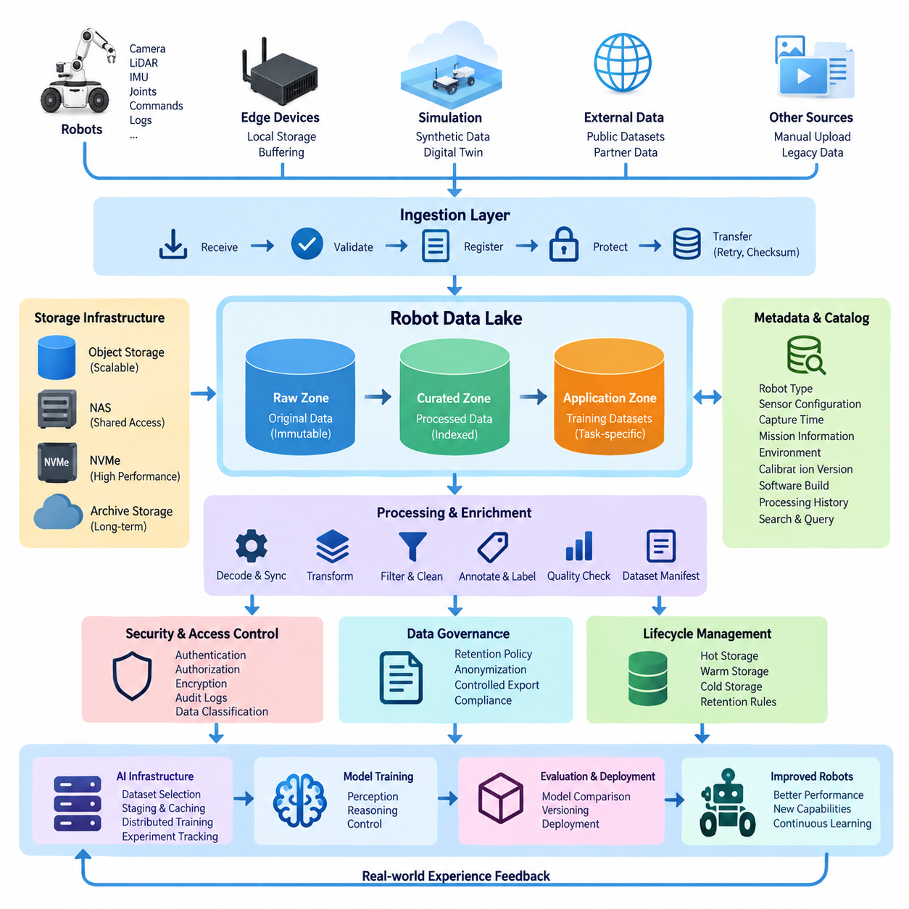
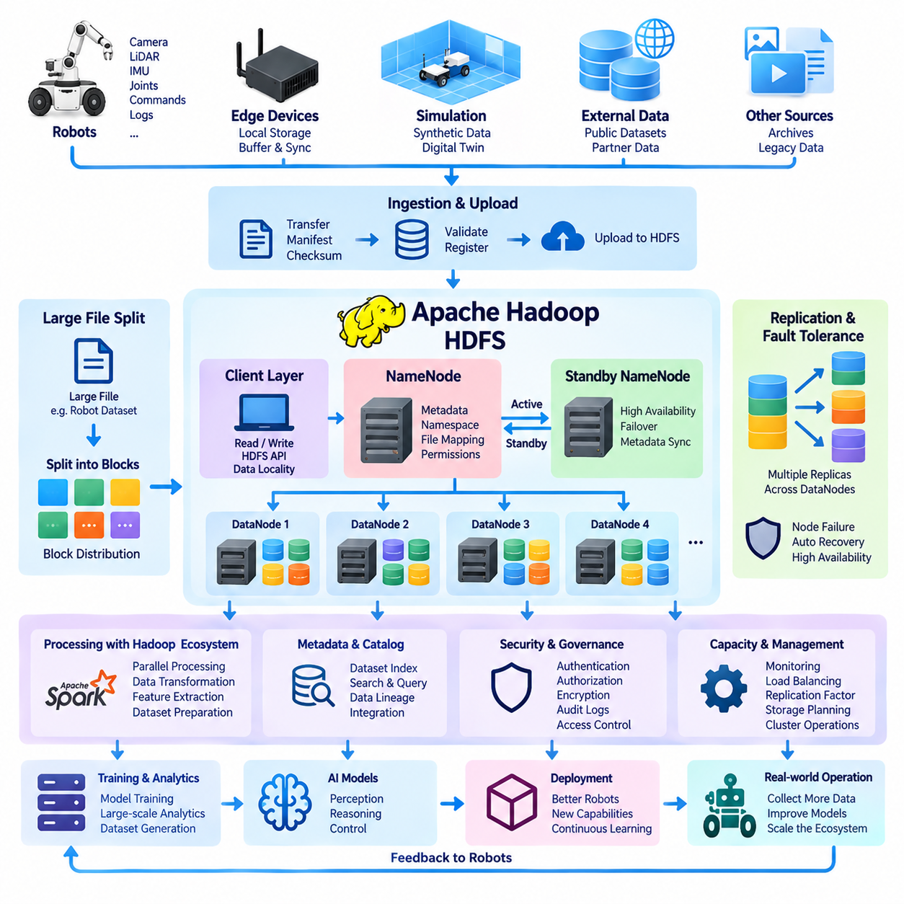
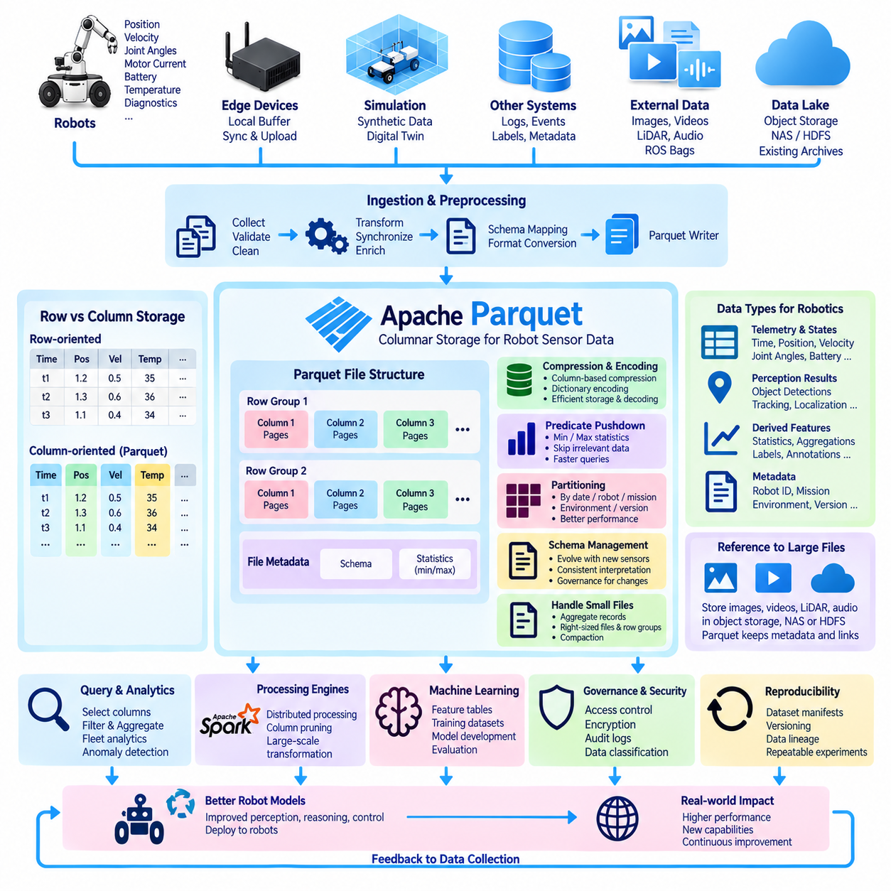
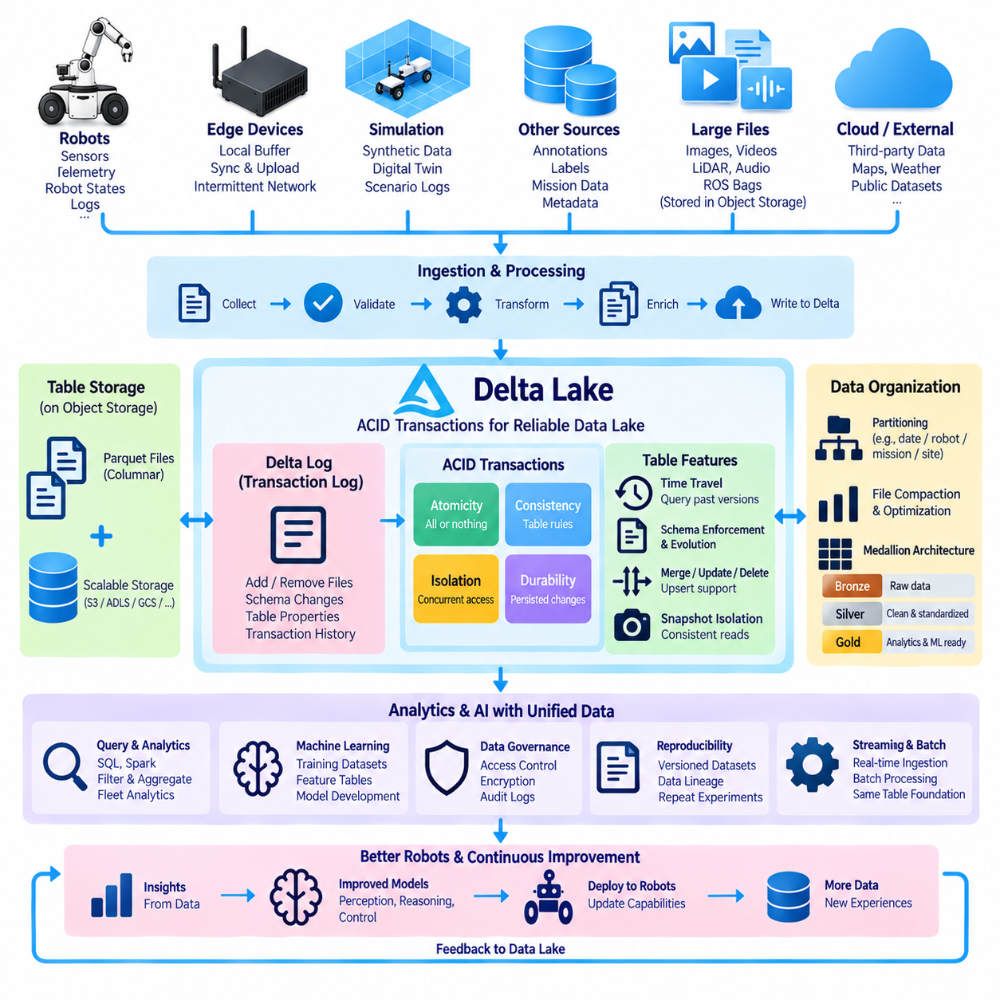
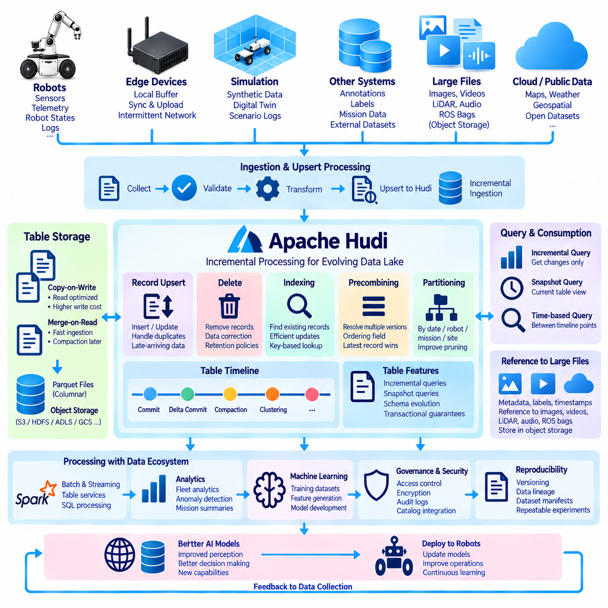
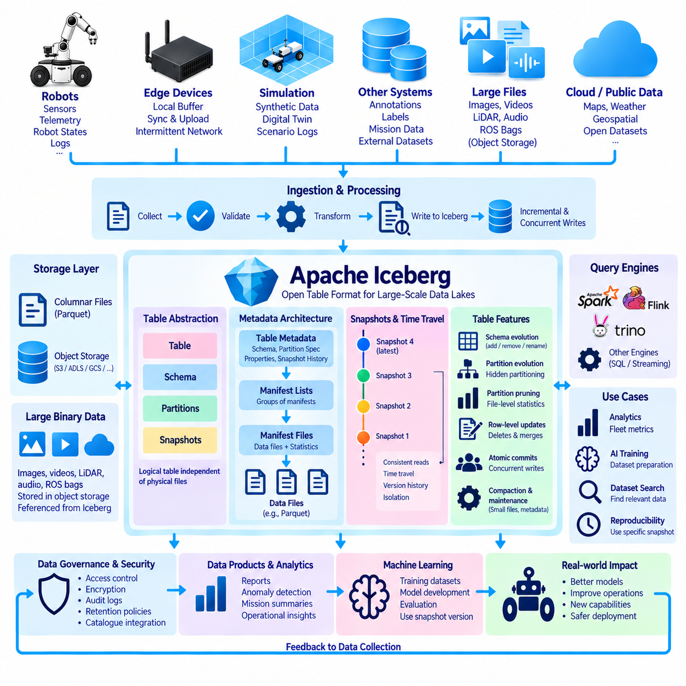
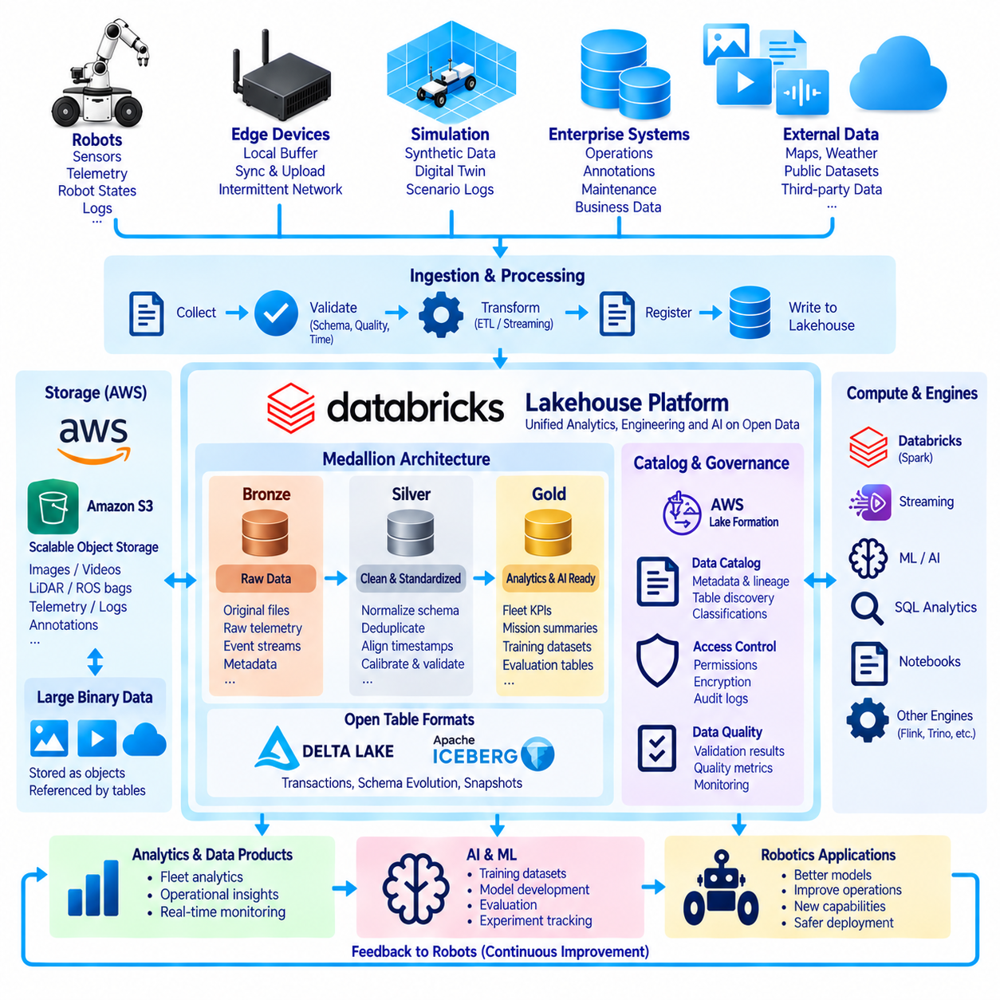
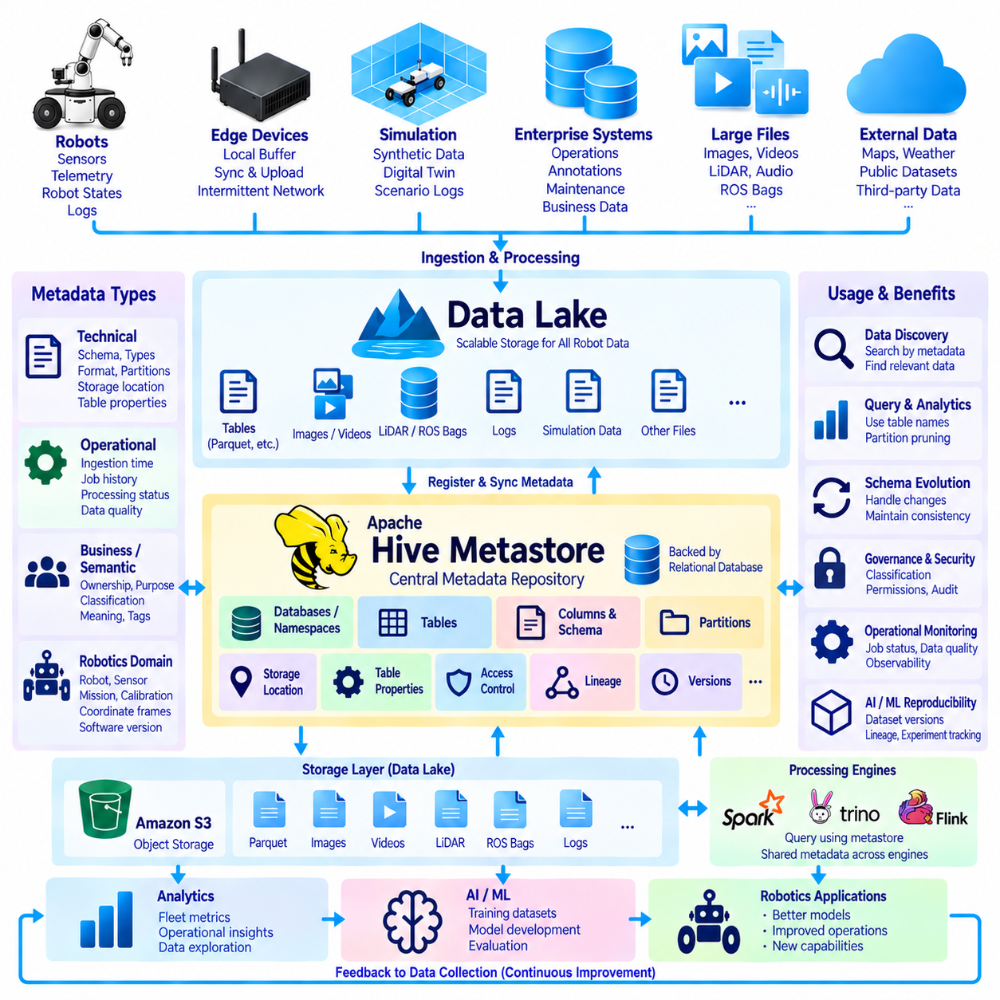
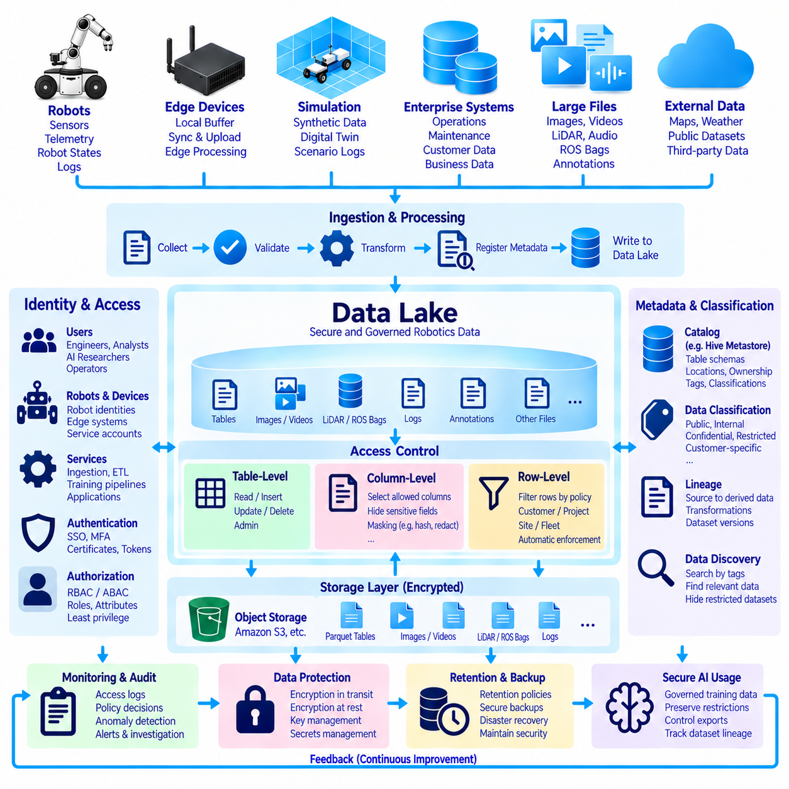
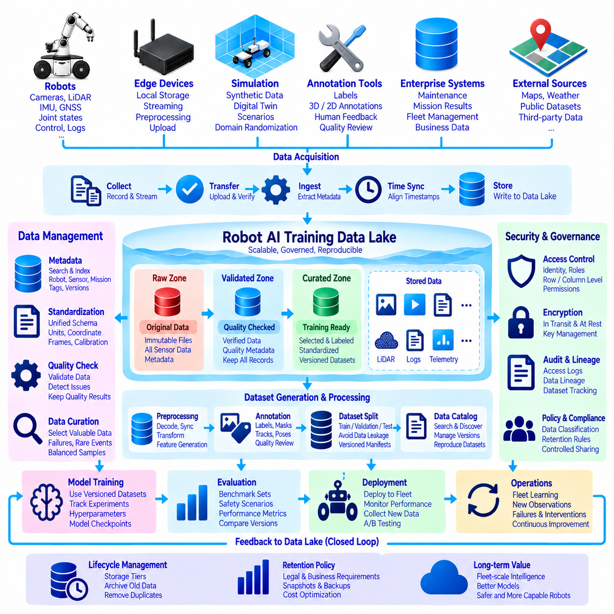

**Volume 08 Robot Database and Storage**

# 06. Data Lakes

## 06.01 Data Lake Architecture Overview for Robot Data

{width="7.268055555555556in" height="7.268055555555556in"}

Robot data differs fundamentally from conventional enterprise data because it is generated continuously by machines that perceive, decide, and act in the physical world. A robot may simultaneously produce camera frames, LiDAR point clouds, depth maps, audio, joint states, motor commands, localization estimates, navigation trajectories, diagnostic logs, and AI inference results. A data lake provides a scalable foundation for storing these heterogeneous data streams without forcing them into a single rigid schema at ingestion time.

The central principle of a robot data lake is to preserve raw observations while progressively creating more structured and reusable representations. Original sensor recordings can be retained together with timestamps, robot identifiers, mission information, calibration parameters, software versions, and environmental context. Processed datasets, annotations, embeddings, trajectories, and training samples are then derived from these sources without replacing them, allowing engineers to reproduce experiments and generate new datasets when algorithms or requirements change.

A practical architecture normally separates data according to its lifecycle rather than treating the lake as one large storage directory. Incoming robot data first enters an ingestion or landing area where files and streams are validated, registered, and protected from accidental modification. Validated information can then move into raw, curated, and application-oriented zones. This layered organization reduces ambiguity about whether a dataset represents original evidence, transformed information, or a version prepared for a specific AI workload.

The ingestion layer connects robots, edge computers, gateways, simulation environments, and external datasets to the lake. High-bandwidth sensors may initially record data on local NVMe storage because network connectivity cannot always support continuous transmission. Metadata and critical events can be transmitted immediately, while large image sequences, point clouds, or ROS bag files are synchronized later. Reliable ingestion therefore requires buffering, retry mechanisms, checksums, transfer manifests, and mechanisms for detecting incomplete or duplicated uploads.

Storage technology should reflect the scale and access characteristics of robot workloads. Object storage is particularly suitable for large collections of images, videos, point clouds, archives, simulation outputs, and model artifacts because it provides scalable namespaces and metadata capabilities. NAS systems remain useful for interactive engineering workflows and shared project directories, while high-performance local storage can serve active training or preprocessing jobs. The data lake can combine these technologies instead of requiring every workload to use one physical storage platform.

Metadata is what transforms a large collection of files into an operational robot data lake. Each dataset should be associated with information such as robot type, sensor configuration, capture time, location category, mission identifier, environmental conditions, calibration version, software build, and processing history. Catalog services can index this information so researchers search for meaningful conditions such as nighttime navigation sequences, manipulation failures, specific camera configurations, or rare obstacle encounters rather than manually browsing millions of files.

Time synchronization is especially important because physical AI depends on relationships between observations and actions. Camera images, LiDAR scans, IMU measurements, joint positions, control commands, and localization estimates must often be reconstructed along a common timeline. The architecture should therefore preserve source timestamps, synchronization quality, clock domains, and timing corrections. When available, PTP or hardware timestamps can improve temporal alignment and enable more accurate reconstruction of events across distributed sensors and computing nodes.

The curated layer converts raw robot recordings into forms suitable for analysis and machine learning. Processing pipelines may decode sensor logs, extract frames, transform coordinate systems, remove corrupted samples, synchronize multimodal streams, calculate quality metrics, anonymize sensitive content, or create standardized dataset manifests. Importantly, curated data should maintain explicit lineage back to the original source. Engineers must be able to determine exactly which recordings, transformations, parameters, and software versions produced a particular training dataset.

Robot data lakes must also support annotation and semantic enrichment. Human annotations, automated labels, segmentation masks, bounding boxes, object tracks, scene descriptions, failure categories, and task outcomes can be stored as independent data products linked to immutable source observations. This separation allows labels to evolve without repeatedly copying large sensor datasets. Multiple annotation versions can coexist, enabling teams to compare labeling policies, improve quality, and reproduce historical AI experiments.

For Physical AI development, the lake becomes a bridge between real-world operation, simulation, and model training. Real robot experiences can be selected to construct training datasets, while difficult situations discovered during operation can be reproduced in simulation. Synthetic data generated from digital twins can then be stored using compatible metadata and schemas. The architecture should distinguish real, simulated, reconstructed, and augmented samples while allowing them to participate in unified dataset queries and training pipelines.

A well-designed data lake should integrate directly with AI infrastructure. Training systems need efficient methods for selecting dataset versions, staging samples near GPU resources, caching frequently accessed files, and recording which data contributed to each model. Rather than copying arbitrary directories into training servers, dataset manifests can define reproducible collections of objects. This approach supports distributed training, experiment tracking, model comparison, and future reconstruction of the exact data environment used for a released model.

Data governance must be incorporated into the architecture from the beginning. Robot recordings may contain faces, voices, vehicle identifiers, facility layouts, customer assets, or operational information that should not be universally accessible. Access control can therefore be applied according to dataset classification, project, role, and lifecycle stage. Encryption, audit logs, retention policies, anonymization pipelines, and controlled export mechanisms help maintain data sovereignty while still allowing authorized teams to extract value from collected information.

Lifecycle management becomes increasingly important as robot fleets expand because continuously generated sensor data can quickly reach petabyte scale. Not every observation requires permanent high-performance storage. Frequently used datasets can remain in hot storage, less active collections can migrate to lower-cost capacity, and historical archives can move to cold storage. Retention decisions should consider reproducibility, safety investigations, regulatory requirements, dataset uniqueness, and the probability that information will contribute to future model improvement.

Quality management should operate continuously across the lake. Automated pipelines can detect missing frames, timestamp discontinuities, corrupted archives, abnormal sensor values, incomplete metadata, calibration mismatches, or unexpected file counts. Checksums can verify integrity during transfers between robots, edge systems, NAS devices, object stores, and archives. Quality results themselves should become searchable metadata, allowing training pipelines to exclude unreliable samples automatically instead of discovering defects after expensive model training has begun.

Security architecture should assume that robot data moves across multiple trust boundaries. Data may travel from embedded devices through wireless networks, edge gateways, on-premise infrastructure, and centralized storage. Authentication, device identity, encrypted transport, least-privilege authorization, immutable logging, and controlled service interfaces reduce the risk of unauthorized modification or extraction. Particularly valuable raw recordings and validated datasets can also use write-once or versioned storage policies to protect provenance.

Ultimately, a robot data lake should be understood as a data foundation for continuous Physical AI improvement rather than simply a repository for large files. Operational robots generate experiences, the lake preserves and organizes those experiences, processing pipelines convert them into reusable knowledge, and AI systems transform selected datasets into improved perception, reasoning, and control models. Those models return to robots and generate new experiences, creating a closed data-to-intelligence lifecycle that can scale across robots, environments, and applications.

## 06.02 Apache Hadoop HDFS: Large-Scale Distributed Storage

{width="7.268055555555556in" height="7.268055555555556in"}

Apache Hadoop provides a distributed computing and storage framework designed to process very large datasets across clusters of commodity servers. Its storage component, Hadoop Distributed File System (HDFS), divides large files into blocks and distributes them across multiple machines. Instead of relying on one high-capacity storage server, HDFS combines the disks and processing resources of many nodes into a unified storage environment.

HDFS was designed around the assumption that hardware failures are normal in large distributed systems. When hundreds or thousands of disks and servers operate together, individual components will eventually fail. HDFS addresses this problem through replication, health monitoring, and automatic recovery mechanisms. Data blocks are normally stored on multiple DataNodes, allowing the system to continue serving data when a disk, server, or network path becomes unavailable.

The HDFS architecture separates metadata management from physical block storage. A NameNode maintains the filesystem namespace, directory hierarchy, permissions, filenames, and mappings between files and their distributed blocks. DataNodes store the actual blocks and respond to client read and write requests. This separation allows applications to access files through a logical filesystem while HDFS manages their physical distribution across the cluster.

When a large file is written to HDFS, it is divided into fixed-size blocks that can be distributed independently. Modern deployments commonly use relatively large block sizes because HDFS is optimized for large sequential data access rather than millions of tiny random operations. A multi-gigabyte robot sensor archive, for example, can be divided among several DataNodes so that storage capacity and data-processing workloads can be distributed across the cluster.

Replication provides the fundamental fault-tolerance mechanism of HDFS. Each block can have multiple replicas stored on different DataNodes, and placement policies attempt to prevent a single hardware failure from destroying every copy. If HDFS detects that a replica has disappeared because a node failed, another healthy replica can be copied automatically to restore the desired replication level. This mechanism makes distributed storage resilient without requiring highly specialized storage hardware.

The NameNode continuously receives status information from DataNodes through heartbeat messages and block reports. Heartbeats indicate that a node remains operational, while block reports describe the blocks currently stored by that node. If a DataNode stops responding for a configured period, the NameNode considers it unavailable and begins coordinating recovery. These mechanisms allow cluster health and data availability to be maintained automatically as infrastructure conditions change.

High availability is particularly important because filesystem metadata is essential for locating distributed data. Production Hadoop environments can deploy multiple NameNodes using active and standby roles. Metadata changes are synchronized so that a standby NameNode can assume responsibility if the active service fails. Additional coordination mechanisms help prevent split-brain conditions in which multiple nodes incorrectly attempt to control the same filesystem namespace.

HDFS follows a data-locality principle that became central to the original Hadoop architecture. Moving very large datasets repeatedly across a network can be more expensive than moving computation toward the machines that already contain the required data. Hadoop processing frameworks can therefore schedule tasks close to relevant HDFS blocks when possible. This reduces network traffic and allows storage bandwidth from multiple servers to contribute to large-scale parallel processing.

For robot data, this architecture can be useful when enormous collections of sensor recordings must be processed in parallel. Camera sequences, LiDAR captures, simulation results, telemetry archives, ROS recordings, and historical fleet logs may collectively reach hundreds of terabytes or petabytes. Distributed preprocessing jobs can scan these collections to extract frames, calculate statistics, identify events, transform formats, or generate training datasets without requiring all source data to pass through one storage server.

HDFS is particularly effective for workloads dominated by large files, sequential reads, batch processing, and write-once-read-many patterns. These characteristics match many archival and offline analytics workloads but do not match every robotics application. Real-time robot state, rapidly changing key-value information, transactional records, or large numbers of very small files are generally better handled by databases, caches, streaming platforms, or storage systems optimized for those access patterns.

The small-file problem is an important consideration when storing AI and robot datasets in HDFS. Every file and block requires metadata that must be managed by the NameNode. Millions of individually stored image files can therefore create significant metadata overhead even when their combined storage capacity is manageable. Packaging small objects into larger container files, archives, sequence-oriented formats, or dataset shards can reduce namespace pressure and improve sequential I/O efficiency.

HDFS can form one layer of a broader data lake architecture rather than functioning as the entire data platform. Raw sensor archives can enter distributed storage while metadata catalogs, SQL engines, NoSQL databases, object stores, and machine-learning platforms provide complementary capabilities. Processing frameworks such as Apache Spark can operate over distributed datasets, enabling large-scale transformation, feature extraction, aggregation, and dataset preparation without requiring a centralized preprocessing server.

Data ingestion into HDFS must account for the characteristics of physical robots and edge environments. Robots may operate with intermittent connectivity and generate data faster than it can be transferred to a central cluster. Edge systems can therefore buffer recordings locally, create transfer manifests, calculate checksums, and upload completed data segments when sufficient connectivity becomes available. The central ingestion process can verify integrity before registering new blocks and associated metadata.

Security is another essential part of production HDFS deployment. Authentication can establish the identity of users and services, while filesystem permissions and authorization policies restrict access to sensitive datasets. Encryption can protect information during network transmission and while stored on disks. Audit records can document access to valuable robot recordings, helping organizations enforce data governance, investigate abnormal activity, and maintain accountability across shared infrastructure.

Storage capacity planning must consider replication because the physical space consumed by HDFS can be substantially larger than the logical dataset size. A dataset of hundreds of terabytes may require several times that capacity depending on the configured replication factor and operational reserve. Administrators must also leave sufficient free space for rebalancing, temporary processing outputs, node failures, dataset growth, and recovery operations rather than sizing the cluster only for current raw data volume.

Cluster balancing becomes necessary as new servers are added, old nodes are replaced, or data distribution becomes uneven. HDFS provides mechanisms for redistributing blocks so that storage utilization is balanced across DataNodes. Balanced placement helps prevent individual disks or servers from becoming capacity bottlenecks and allows parallel workloads to use the aggregate bandwidth of the cluster more effectively. Monitoring storage utilization and network behavior therefore remains an important operational responsibility.

HDFS also introduces tradeoffs compared with modern object storage. Object stores often provide simpler scale-out capacity, flexible metadata integration, cloud compatibility, and convenient interfaces for contemporary AI platforms. HDFS can offer strong locality and mature integration with Hadoop-oriented analytics environments, particularly in on-premise clusters where computation and storage are intentionally colocated. Architecture selection should therefore depend on workload patterns rather than assuming one technology is universally superior.

In a Physical AI data platform, HDFS is best viewed as a distributed storage and processing foundation for selected large-scale workloads. It can preserve massive historical robot datasets while allowing multiple compute nodes to process different portions simultaneously. Combined with metadata catalogs, dataset manifests, AI training infrastructure, and governance controls, HDFS can transform geographically and temporally accumulated robot experiences into an accessible resource for large-scale analytics and model development.

As robot fleets grow, distributed storage becomes more than a capacity solution. It becomes part of the pipeline that converts operational experience into reusable intelligence. Robots generate observations, edge systems buffer and transfer them, HDFS distributes durable copies across the cluster, parallel processing converts raw recordings into curated datasets, and AI systems consume those datasets for training. Improved models can then return to deployed robots, completing a scalable data-to-learning cycle.

## 06.03 Apache Parquet: Columnar Robot Sensor Storage [w/Code]

{width="7.268055555555556in" height="7.268055555555556in"}

Apache Parquet is an open columnar storage format designed for efficient analytical processing of large structured and semi-structured datasets. Unlike row-oriented formats that store all fields of each record together, Parquet organizes values primarily by column. This approach is particularly useful for robot telemetry and sensor metadata because analytical workloads often need only a small subset of variables from datasets containing hundreds of attributes.

Robot systems continuously generate structured measurements such as timestamps, positions, velocities, accelerations, joint angles, motor currents, battery levels, temperatures, localization estimates, object detections, and diagnostic states. Storing these measurements as individual text records can create substantial storage and parsing overhead. Parquet converts them into a compact binary representation while preserving a well-defined schema, allowing large collections of robot observations to be stored and queried efficiently.

The main advantage of columnar storage becomes visible when an analysis accesses only selected variables. Suppose a robot dataset contains one hundred sensor and state fields, but an engineer needs only timestamp, battery voltage, motor temperature, and velocity. A row-oriented representation may require reading most of every record. Parquet can retrieve primarily the required columns, reducing disk I/O, memory consumption, and data transfer during analytical workloads.

Parquet files are internally divided into row groups, which contain groups of records and provide important units for parallel processing. Within each row group, values are separated into column chunks, and those chunks are further organized into pages. This hierarchical structure allows processing engines to read selected portions of large files efficiently. Row-group sizing therefore becomes an important design decision when optimizing robot datasets for storage, scanning, and distributed computation.

Compression is highly effective in Parquet because values within the same column usually have similar data types and statistical characteristics. A timestamp column, robot identifier column, operating-mode column, or repeated status field can often be encoded more efficiently than heterogeneous values stored together. Parquet supports compression algorithms and encoding techniques that reduce storage requirements while maintaining efficient decoding for analytical processing.

Encoding provides another source of efficiency beyond general compression. Repeated categorical values such as robot model, mission type, sensor state, or error category can benefit from dictionary encoding, while numerical sequences may benefit from specialized representations. The exact effectiveness depends on data distribution, but column-oriented organization gives storage engines opportunities to exploit repetition and predictable value patterns that commonly appear in robot telemetry.

Parquet also stores metadata and statistics that can help query engines avoid unnecessary reads. Minimum and maximum values associated with data regions can allow a system to determine that certain row groups cannot satisfy a filter condition. For example, a query searching for high motor temperatures or data within a specific time interval may skip portions whose statistics fall completely outside the requested range. This technique is commonly called predicate pushdown or data skipping.

Partitioning complements Parquet\'s internal columnar organization. Large robot datasets can be arranged into directory structures based on attributes such as capture date, robot fleet, robot identifier, mission, environment, or dataset version. A query requesting one robot on a specific date can then avoid scanning unrelated partitions entirely. Effective partition design can dramatically improve performance, although excessively granular partitions may create too many small files and metadata operations.

The small-file problem is therefore important when designing Parquet-based robot storage. Writing every sensor message or short recording segment as a separate Parquet file can produce enormous numbers of tiny files, reducing the benefits of columnar processing. Data pipelines should generally aggregate records into appropriately sized files and row groups. Compaction processes can periodically combine small ingestion outputs into larger optimized files for downstream analytics and machine-learning preparation.

Schema management is another major advantage of Parquet. Robot platforms evolve continuously, and new sensors, firmware versions, perception outputs, or diagnostic variables may introduce additional fields. Parquet embeds schema information with the data, allowing processing systems to interpret each dataset consistently. However, schema evolution still requires governance because renamed fields, incompatible data types, changed units, or altered semantics can create subtle errors even when files remain technically readable.

For robotics, timestamps deserve particular attention when designing a Parquet schema. A record may contain acquisition time, hardware timestamp, system time, synchronized global time, processing time, and ingestion time. These values should not be merged into an ambiguous generic timestamp field. Explicit timestamp semantics make it possible to reconstruct sensor sequences, measure processing latency, align modalities, and investigate timing problems across robots and distributed computing infrastructure.

Parquet is especially suitable for structured sensor measurements and derived metadata, but it is usually not the ideal container for every raw robot data type. Large JPEG images, video streams, LiDAR binary captures, audio files, and ROS bag archives may remain in object storage, NAS, or distributed file storage. Parquet tables can then contain references to these objects together with timestamps, labels, calibration information, quality indicators, and other searchable attributes.

This separation creates a useful pattern for robot data lakes. Large binary sensor objects remain in storage systems optimized for large files, while Parquet provides an analytical index and structured representation of their context. An engineer can query millions of records to identify relevant scenes and retrieve only the associated images, point clouds, or recordings. This avoids repeatedly scanning enormous binary archives simply to discover which data should participate in an experiment.

Parquet integrates naturally with distributed processing engines such as Apache Spark and with modern analytical systems capable of reading columnar files directly. Large telemetry datasets can therefore be filtered, joined, aggregated, and transformed across multiple compute nodes. Processing pipelines can calculate fleet statistics, identify anomalies, create feature tables, build training manifests, or summarize operational behavior while benefiting from column pruning and distributed execution.

Machine-learning workflows can also use Parquet as an intermediate representation between raw data collection and model training. A preprocessing pipeline may transform raw robot logs into synchronized records, calculate derived features, attach labels, and write the resulting structured samples into versioned Parquet datasets. Training systems can then select required columns and partitions instead of repeatedly decoding the complete raw recording collection for every experiment.

Dataset reproducibility improves when Parquet files are combined with manifests, version identifiers, and data lineage. A training dataset should record which source files contributed observations, which transformations were applied, what schema version was used, and which Parquet objects constitute the final dataset. Immutable or versioned dataset releases make it possible to reconstruct previous experiments even after newer sensor recordings and processing pipelines have been introduced.

Quality control can be integrated directly into the Parquet generation pipeline. Before records are committed, processing jobs can verify expected columns, data types, units, timestamp ordering, acceptable ranges, missing values, and synchronization quality. Quality indicators can themselves become columns, enabling downstream queries to exclude corrupted or uncertain observations. This converts data quality from an external manual process into a searchable property of the dataset.

Security and governance remain necessary even though Parquet is only a file format. Access control is typically enforced by the surrounding storage platform, catalog, query engine, and data-lake infrastructure. Sensitive columns can be removed, transformed, anonymized, or separated into controlled datasets. Encryption at rest and in transit, audit logging, dataset classification, retention rules, and controlled export policies can then protect structured robot information throughout its lifecycle.

Within a Physical AI architecture, Parquet serves as an efficient bridge between massive raw robot experience and scalable analytical intelligence. Robots generate heterogeneous observations, ingestion pipelines preserve the original evidence, processing systems convert selected information into structured Parquet datasets, and distributed engines analyze those datasets efficiently. The resulting tables can support dataset discovery, fleet analytics, anomaly detection, AI training, evaluation, and continuous improvement of deployed robotic systems.

## 06.04 Delta Lake: ACID Transaction Data Lake [w/Code]

{width="7.268055555555556in" height="7.268055555555556in"}

Delta Lake is an open table format and storage layer designed to bring reliable data-management capabilities to data lakes built on scalable file or object storage. Traditional data lakes can store enormous quantities of raw and processed information, but concurrent writes, partial updates, schema changes, and failed processing jobs can make datasets inconsistent. Delta Lake addresses these problems by adding transaction management and table metadata around data files.

The central concept of Delta Lake is the transaction log, commonly called the Delta Log. Instead of treating a directory of files as an unmanaged dataset, Delta Lake records table changes as ordered transactions. The log describes which data files were added or removed, schema information, table properties, and transaction metadata. Processing engines can reconstruct a consistent table state by interpreting this history rather than simply listing whatever files happen to exist in storage.

ACID transactions provide the foundation for reliable updates. Atomicity ensures that a transaction is committed completely or not applied, preventing partially written robot datasets from appearing as valid results. Consistency preserves defined table rules, isolation protects concurrent operations from interfering with each other, and durability ensures that successfully committed changes remain available. Together, these properties make data-lake tables behave more like managed database tables.

This reliability is valuable for robotics because robot data pipelines often operate concurrently. Multiple robots may upload telemetry while preprocessing jobs transform sensor records, quality-control services flag corrupted samples, annotation systems add labels, and training pipelines read existing datasets. Without transactional coordination, readers could observe incomplete or conflicting states. Delta Lake allows these activities to operate against consistent table versions while new transactions are committed independently.

Delta Lake commonly stores table data using columnar files such as Apache Parquet while adding transactional metadata above them. Parquet provides efficient compression, column pruning, and analytical scanning, whereas Delta Lake manages which Parquet files constitute the valid table at a particular version. This separation combines scalable file-based storage with database-like consistency, making it possible to retain the economics of a data lake while improving operational reliability.

The transaction log also enables snapshot isolation. A query can operate against a stable snapshot of a table even while other processes are writing new data. For example, an AI training pipeline may begin reading a robot telemetry dataset while ingestion continues in parallel. The training job can remain associated with one consistent table version rather than unexpectedly incorporating files that appeared halfway through the experiment.

Time travel is another important capability derived from table version history. Users can query earlier versions of a Delta table or inspect how data changed over time, subject to retained history and underlying files. In a Physical AI workflow, this can help reproduce a previous training dataset, investigate when incorrect labels entered a pipeline, compare processing revisions, or analyze robot behavior using the dataset state that existed during an earlier experiment.

Schema enforcement helps prevent malformed data from silently contaminating a shared table. Incoming records are checked against the expected table structure, reducing the risk that incompatible fields or incorrect data types are accepted without detection. Robot fleets frequently contain different hardware generations and software versions, so explicit schema validation can detect unexpected changes before they propagate into analytics, model training, or safety-related evaluation workflows.

At the same time, controlled schema evolution allows tables to adapt as robot platforms change. New sensors, perception outputs, diagnostic fields, or mission attributes may require additional columns. Instead of creating unrelated datasets whenever the schema changes, compatible evolution can be managed through defined operations. Governance remains essential because adding a field is different from changing its units, meaning, coordinate frame, timestamp semantics, or interpretation.

Delta Lake also supports update-oriented operations that are difficult to manage safely with ordinary immutable file collections. Records can be inserted, updated, deleted, or merged according to application requirements. A robotics pipeline may use merge operations to incorporate corrected annotations, update quality flags, reconcile late-arriving telemetry, or maintain a current representation of robot states while preserving the transactional integrity of the table.

Late-arriving data is common in mobile robotics because network connectivity may be intermittent. A robot can operate offline, buffer telemetry locally, and upload historical records hours later. Transactional ingestion allows delayed records to be integrated without requiring the entire dataset to be rebuilt. Processing logic can identify the appropriate partitions or keys, merge the arriving information, and create a new consistent table version while existing readers continue using earlier snapshots.

Partitioning remains important for performance even when transactions are available. Robot datasets may be organized by date, fleet, robot identifier, mission, site, environment, or another frequently filtered attribute. Query engines can avoid scanning irrelevant partitions when filters match the partition structure. However, excessive partitioning can generate small files and metadata overhead, so partition strategy should reflect actual access patterns rather than simply creating directories for every available field.

Frequent streaming or incremental writes can also create many small Parquet files. Delta Lake environments therefore benefit from file compaction and layout optimization so that analytical workloads do not spend excessive time opening tiny objects. Periodic optimization can consolidate small outputs into larger files while maintaining the logical contents of the table. This is especially useful when high-frequency robot telemetry is continuously ingested and later analyzed in large batches.

The medallion architecture is frequently associated with Delta Lake data platforms. A bronze layer can preserve minimally processed robot records, a silver layer can contain validated, synchronized, and standardized information, and a gold layer can provide application-oriented datasets for analytics or AI. These names are conventions rather than mandatory Delta Lake components, but the layered model provides a useful method for separating raw evidence from increasingly refined data products.

For robot sensor systems, the bronze layer may preserve imported telemetry and references to raw images, LiDAR, video, audio, or ROS recordings. The silver layer can normalize timestamps, coordinate systems, robot identifiers, sensor states, and quality indicators. Gold tables can then expose fleet statistics, anomaly features, training samples, mission summaries, or evaluation metrics. Transactional lineage between these stages improves reproducibility and operational confidence.

Delta Lake is particularly useful when structured tables must reference much larger binary sensor objects. Raw video, image collections, point clouds, and recording archives may remain in object storage or another large-file repository, while Delta tables maintain searchable metadata, labels, timestamps, quality information, and object locations. Queries can identify relevant scenes transactionally and then retrieve only the heavy sensor objects required for analysis or model training.

Streaming and batch processing can operate over the same logical data foundation. Continuous telemetry ingestion can append or merge new records, while scheduled analytical jobs process larger historical windows. This reduces the need to maintain completely separate storage systems for real-time and offline workloads. A unified table history also makes it easier to understand which data was available to each downstream process at a particular point in time.

Machine-learning reproducibility benefits directly from versioned Delta tables. Instead of defining a training dataset only by a mutable directory path, an experiment can record a specific table version together with model code, parameters, and environment information. Later, the same logical dataset can be reconstructed if its historical files remain available. This strengthens comparisons between model generations and helps distinguish algorithm changes from changes in training data.

Governance and security are implemented through the broader platform surrounding Delta Lake. Access control, encryption, audit logging, catalog permissions, retention rules, and sensitive-data policies determine who can read or modify tables. Transaction history provides useful operational evidence, but retention and cleanup policies must be designed carefully because deleting obsolete files too aggressively can limit the ability to access historical table versions.

Within a Physical AI data architecture, Delta Lake can connect continuously changing robot experience with dependable analytical and training datasets. Robots and edge systems generate observations, ingestion services commit them transactionally, refinement pipelines produce validated table versions, and AI systems consume stable snapshots for analysis and learning. New models return to deployed robots, generating additional experience and creating a governed, reproducible data-to-intelligence cycle.

## 06.05 Apache Hudi: Incremental Processing Data Lake [w/Code]

{width="7.268055555555556in" height="7.268055555555556in"}

Apache Hudi is an open-source transactional data-lake platform designed to manage large datasets that change continuously over time. Traditional file-based lakes are efficient for storing immutable historical data, but updates, deletes, late-arriving records, and continuous ingestion can become difficult to manage. Hudi adds table management, indexing, transactional writes, and incremental processing capabilities above scalable storage systems.

The name Hudi originally reflects the concept of Hadoop Upserts Deletes and Incrementals, emphasizing workloads where existing records must evolve rather than simply accumulate. A robot fleet is a natural example because telemetry, mission states, annotations, quality flags, and operational metadata may arrive continuously and sometimes require correction. Hudi allows these changing records to be managed as logical tables instead of unmanaged collections of files.

A core capability of Hudi is record-level upsert processing. An upsert determines whether an incoming record should be inserted as new data or used to update an existing record. This is useful when robots reconnect after offline operation, corrected localization results arrive later, annotations are revised, or duplicate telemetry is detected. The storage layer can incorporate these changes without requiring the complete historical dataset to be rewritten.

Hudi organizes table changes along a timeline of actions. Commits, delta commits, compactions, clustering operations, and other table-management activities are recorded so that processing systems can understand how a dataset evolved. This timeline provides a consistent view of table state and supports incremental consumption. Instead of repeatedly scanning all historical files, downstream applications can determine which changes occurred after a previously processed point.

Incremental processing is one of Hudi\'s most important characteristics. A consumer can request records that changed between selected points on the table timeline rather than reading the entire table. For large robot fleets, this can dramatically reduce unnecessary computation. A daily analytics job, for example, can process only telemetry added or modified since its previous successful execution instead of scanning years of operational history.

Hudi provides two major table types that represent different tradeoffs between write performance and read performance. Copy-on-Write tables create updated base files when changes are committed, producing read-optimized datasets at the cost of additional write work. Merge-on-Read tables can write changes into log files first and merge them with base data later, reducing ingestion latency while shifting some work toward compaction or query-time merging.

Copy-on-Write can be appropriate for robot datasets that are updated periodically but read frequently for analytics, reporting, or training preparation. Because updates are incorporated into new base files, readers can access a relatively straightforward representation of the latest table state. The tradeoff is write amplification, since modifying a subset of records may require rewriting larger file groups rather than changing individual bytes in place.

Merge-on-Read is useful when high-frequency updates or low-latency ingestion are more important. Robot telemetry, changing mission status, anomaly events, or continuously updated perception metadata can be written quickly as incremental changes. Compaction later combines accumulated log records with base files. This separates immediate ingestion requirements from the heavier work required to maintain efficient analytical storage.

Hudi indexing helps identify where existing records are located so that updates and deletes can be applied efficiently. Records are normally associated with keys that uniquely identify logical entities or events. In robotics, a key might combine robot identifier, mission identifier, sensor stream, timestamp, sequence number, or another stable identifier. Careful key design is essential because incorrect uniqueness assumptions can create duplicate records or overwrite unrelated observations.

Precombining is also important when multiple versions of the same logical record arrive. Hudi can use an ordering field to determine which version should take precedence during ingestion. For example, processing version, event sequence, or update timestamp may help resolve competing records. Robotics pipelines must define this ordering semantically rather than assuming that arrival time always represents the newest physical observation, especially when connectivity is intermittent.

Late-arriving data is common in autonomous and mobile systems. Robots may operate in warehouses, outdoor environments, underground facilities, or remote sites where network access is temporarily unavailable. Data can be buffered on edge computers and uploaded later. Hudi\'s update and incremental mechanisms allow delayed information to be integrated into existing tables while maintaining a manageable history of changes for downstream processing.

Deletion is another capability that distinguishes managed data-lake tables from simple append-only storage. Records may need to be removed because they are duplicates, invalid, corrupted, outside retention policies, or subject to privacy requirements. Hudi can represent deletion operations transactionally rather than requiring administrators to manually locate and rewrite arbitrary files. The surrounding governance system should still document why data was removed and which policies authorized the operation.

Partitioning helps Hudi limit the amount of storage examined during queries and updates. Robot tables can be partitioned according to date, site, fleet, mission, environment, or another frequently accessed dimension. Effective partitioning improves pruning and data management, but overly fine partitions can create small-file problems. Partition design should therefore balance query locality, update behavior, file sizes, and the distribution of incoming robot data.

Small-file management is especially important in continuously ingested datasets. Thousands of robots generating frequent updates can create large numbers of undersized files that reduce storage and query efficiency. Hudi includes mechanisms for managing file sizing and reorganizing data. Clustering can rewrite table layout to improve file organization and query performance without changing the logical records exposed to applications.

Compaction is particularly important for Merge-on-Read tables because incremental log files accumulate over time. A compaction operation merges these changes into new base files, reducing the amount of work required by future reads. Scheduling compaction involves a tradeoff: performing it frequently consumes compute and storage bandwidth, while delaying it too long can increase read amplification. Workload characteristics should determine the appropriate strategy.

Hudi can provide different query perspectives depending on table type and processing requirements. Snapshot queries present a current view of the table, while incremental queries expose changes over a selected interval. Merge-on-Read configurations can also distinguish between views optimized for recently written data and views based on compacted storage. These capabilities allow one table foundation to support both current-state analysis and change-oriented processing.

For robot sensor architectures, Hudi does not necessarily need to contain every raw binary object. Large images, videos, point clouds, audio streams, and ROS recordings can remain in object storage or distributed file systems. Hudi tables can maintain searchable records containing timestamps, robot identifiers, labels, quality states, processing results, and references to those large objects. This separates efficient metadata processing from heavy binary storage.

This pattern becomes powerful for Physical AI dataset generation. An incremental query can identify only newly collected or modified scenes since the previous training-data build. Processing pipelines can retrieve the referenced sensor objects, perform synchronization and quality checks, generate labels or features, and append the resulting samples to a new dataset version. Expensive historical data does not need to be completely rescanned after every update.

Hudi integrates with distributed data-processing ecosystems, including engines commonly used for large-scale SQL, streaming, and batch workloads. Robot fleet analytics can aggregate operational metrics, detect anomalies, generate mission summaries, or prepare AI training tables across large historical collections. Incremental consumption reduces repeated processing and enables downstream pipelines to react efficiently as new operational data becomes available.

Reproducibility still requires explicit dataset versioning and lineage even when incremental tables are used. AI experiments should record the relevant table state, processing interval, source objects, schema version, transformations, and output dataset identifiers. Incremental processing improves efficiency, but it should not turn training data into an undefined moving target. Stable releases or manifests remain necessary when experiments must be repeated or audited.

Security and governance are provided by the broader data platform surrounding Hudi. Authentication, authorization, encryption, audit logging, retention policies, catalog integration, and controlled data export determine how robot information can be accessed and modified. Because Hudi supports updates and deletes, operational permissions should distinguish between reading datasets, ingesting new records, modifying existing information, and performing administrative table operations.

Within a Physical AI data lake, Apache Hudi is especially valuable when robot information changes continuously and downstream systems should process only what has changed. Robots generate new experiences, edge systems buffer and upload records, Hudi manages inserts, updates, deletes, and table history, and incremental consumers transform recent changes into analytics or training data. Improved AI models return to robots, creating an efficient continuous data-to-learning cycle.

## 06.06 Apache Iceberg: Table Format Standard [w/Code]

{width="7.268055555555556in" height="7.268055555555556in"}

Apache Iceberg is an open table format designed to manage very large analytical datasets stored in data lakes. Instead of treating a table as a directory containing loosely managed files, Iceberg introduces structured metadata that explicitly defines which data files belong to each table state. This approach provides database-like table management while retaining scalable storage on object stores and distributed file systems.

Iceberg separates the logical table from the physical arrangement of its data files. Applications interact with tables, schemas, partitions, and snapshots rather than depending directly on directory layouts. Data files are commonly stored in columnar formats such as Apache Parquet, while Iceberg maintains metadata describing their organization. This abstraction allows storage layout to evolve without forcing applications to understand every underlying file-management detail.

A central concept in Iceberg is the snapshot. Every committed table change produces a new snapshot representing a consistent version of the table. Snapshots reference metadata that ultimately identifies the data files belonging to that version. Readers can therefore operate against a stable table state even while writers are adding or modifying data. This isolation is important for long-running analytics and AI pipelines that require reproducible input.

Iceberg uses multiple metadata layers to efficiently track extremely large tables. Table metadata records information such as the current schema, partition specification, properties, and snapshot history. Manifest lists identify groups of manifests, while manifest files describe collections of data files and relevant statistics. This hierarchical metadata structure prevents query engines from repeatedly listing enormous storage directories simply to discover which files belong to a table.

Avoiding expensive filesystem listing operations is particularly valuable in object storage. A robotics data lake may contain millions of files distributed across years of fleet operation. If every query had to enumerate storage objects before determining what to read, planning overhead could become substantial. Iceberg\'s metadata structures allow query engines to identify relevant files through maintained table metadata instead of rediscovering the physical dataset for every operation.

Iceberg supports atomic table changes so readers do not observe partially committed updates. Writers prepare new data and metadata before publishing a new table state. Once the commit succeeds, readers can access the new snapshot; if it fails, the previous snapshot remains valid. This behavior is valuable when robot telemetry, annotations, quality results, and derived datasets are updated concurrently by multiple processing pipelines.

Time travel follows naturally from Iceberg\'s snapshot architecture. Applications can access previous snapshots by version or time when the required metadata and data files are still retained. For Physical AI development, this enables engineers to reconstruct the table state used by an earlier experiment, compare dataset generations, investigate when incorrect data entered a pipeline, or evaluate a model against a historically consistent dataset.

Schema evolution is designed to avoid fragile dependence on column positions or names alone. Iceberg assigns persistent identifiers to fields, helping it track columns as schemas change. Tables can evolve through operations such as adding, removing, renaming, or reordering fields without requiring a complete rewrite of historical data in many cases. This is useful for robot platforms where telemetry schemas expand as new sensors and software capabilities are introduced.

Schema evolution still requires semantic governance. A technically valid rename or type modification does not automatically preserve the meaning of robot data. Engineers must separately control units, coordinate frames, calibration definitions, timestamp semantics, sensor identities, and interpretation rules. Iceberg provides mechanisms for managing table structure, while the robotics data architecture must define what each field means across hardware and software generations.

Partition evolution is another major Iceberg capability. Traditional directory-based partitioning often embeds partition structure directly into file paths, making later changes difficult. Iceberg maintains partition specifications as table metadata, allowing partition strategies to evolve over time. Historical data can remain under its original specification while newly written data uses a revised strategy, and query engines can interpret both through the same logical table.

Hidden partitioning further reduces application dependence on physical storage layout. Users can query logical columns such as timestamps while Iceberg applies appropriate partition transformations internally. Applications therefore do not necessarily need to construct filters using manually generated partition directory values. This separation simplifies queries and allows storage optimization strategies to change without requiring every consuming application to be rewritten.

Partition pruning and file-level statistics help reduce unnecessary data scanning. Metadata can describe ranges and characteristics of values contained in data files, allowing compatible query engines to eliminate files that cannot satisfy a filter. A fleet analysis requesting one time range, robot group, or operational condition may therefore scan only a fraction of a large historical table instead of reading every stored file.

Iceberg supports row-level modification patterns through compatible processing engines, including operations such as updates, deletes, and merges. Depending on the engine and table configuration, changes may be represented through rewritten data files or delete information associated with existing files. These capabilities are useful when duplicate robot telemetry must be removed, annotations corrected, quality flags changed, or late-arriving information incorporated into an established table.

Concurrent data pipelines benefit from Iceberg\'s commit model because independent writers can work against known table states and attempt atomic metadata updates. Conflict detection and retry behavior help prevent unrelated operations from silently producing an inconsistent table. This is useful in a robotics environment where ingestion, annotation, dataset curation, analytics, and AI preparation pipelines may all interact with shared tables simultaneously.

Iceberg is designed for interoperability across analytical engines rather than being tied to one processing framework. Engines such as Apache Spark, Apache Flink, Trino, and other compatible systems can operate on the same table representation. This reduces the need to create separate physical copies of robot datasets for different analytical tools and supports an architecture where storage remains stable while compute technologies evolve independently.

This engine independence is important for long-lived robotics platforms. Data collected today may remain valuable for many years, while processing frameworks, AI systems, and infrastructure can change much more quickly. Using a standardized table abstraction helps separate durable data assets from individual compute engines. Historical robot experience can therefore remain accessible even as organizations replace or expand the technologies used to analyze it.

Large binary robot sensor objects do not necessarily need to be embedded directly inside Iceberg tables. Images, videos, LiDAR point clouds, audio, and ROS recordings can remain as large objects in scalable storage. Iceberg tables can store structured telemetry, timestamps, labels, calibration references, quality indicators, processing results, and object locations, providing an efficient searchable layer over much larger physical sensor archives.

For AI dataset preparation, an Iceberg table can act as a structured catalog of candidate observations. Queries can select scenes according to robot type, environment, mission outcome, sensor configuration, anomaly state, label quality, or time range. Processing pipelines can then retrieve the referenced binary objects and construct versioned training datasets. This approach avoids repeatedly scanning large media archives simply to discover which observations are relevant.

Snapshot-based reproducibility is particularly useful for machine learning. An experiment can record an Iceberg snapshot identifier together with model code, hyperparameters, software environment, and dataset-generation logic. If the snapshot and its referenced files remain available, the input table can later be reconstructed consistently. This provides a stronger reproducibility boundary than relying only on a directory whose contents may continue changing.

Table maintenance remains necessary as datasets grow. Frequent ingestion, updates, or streaming operations may create many small files and metadata objects. Data-file compaction can combine undersized files, while metadata maintenance can reduce planning overhead and remove obsolete information according to retention policies. These operations should preserve logical table semantics while improving storage efficiency and query performance.

Governance and security are implemented through the broader catalog, storage, and compute environment surrounding Iceberg. Authentication, authorization, encryption, audit logging, retention controls, and dataset classification determine who can access or modify robot information. Snapshot expiration and orphan-file cleanup require particular care because aggressive deletion can remove historical data needed for time travel, reproducibility, investigation, or compliance.

Within a Physical AI data lake, Apache Iceberg provides a standardized table layer between durable storage and changing analytical technologies. Robots generate observations, ingestion pipelines write structured data and references, Iceberg organizes files into consistent snapshots, and multiple compute engines analyze the same tables. AI pipelines use stable versions to build models, improved models return to robots, and new operational experience continuously expands the governed data foundation.

## 06.07 Data Lakehouse Architecture: Databricks / AWS Lake Formation

{width="7.268055555555556in" height="7.268055555555556in"}

A data lakehouse combines the scalable, low-cost storage characteristics of a data lake with the structured management, reliability, and query capabilities traditionally associated with a data warehouse. For robotics and Physical AI, this architecture provides a unified foundation for raw sensor archives, structured telemetry, operational analytics, simulation results, AI training datasets, and model-related metadata without requiring isolated platforms for every workload.

Traditional data lakes are highly flexible because images, videos, LiDAR point clouds, ROS recordings, logs, tables, and arbitrary files can coexist in scalable object storage. However, unmanaged collections can suffer from inconsistent schemas, duplicate data, weak transaction control, and difficult discovery. A lakehouse adds table formats, metadata catalogs, governance, transactional processing, and optimized compute engines while retaining the underlying data lake as durable storage.

The architecture normally separates storage from compute. Robot data can reside persistently in object storage while independent compute resources perform ingestion, SQL analytics, distributed preprocessing, streaming, or machine-learning workloads. Compute clusters can scale according to demand without requiring the underlying dataset to move. This separation is valuable when large historical robot datasets must remain available while different teams and workloads require different processing capacities.

A typical robotics lakehouse begins at the ingestion layer. Robots, edge computers, simulation environments, enterprise applications, external datasets, and annotation systems continuously produce information. High-bandwidth binary recordings may be uploaded in batches, while telemetry and operational events can arrive through streaming pipelines. Validation, checksum verification, schema checks, timestamp normalization, and metadata registration establish trustworthy inputs before information enters managed analytical tables.

Large binary objects and structured information can follow complementary storage paths. Images, video, audio, point clouds, and ROS bag files can remain as durable objects, while structured tables store telemetry, labels, quality indicators, calibration references, mission information, and object locations. This approach prevents analytical engines from repeatedly scanning massive binary archives merely to discover relevant observations and allows structured queries to select the heavy sensor objects needed for downstream processing.

Databricks provides a lakehouse-oriented platform that integrates data engineering, analytics, governance, streaming, and machine-learning workflows around scalable cloud storage. Technologies such as Delta Lake can provide transactional table management, while distributed compute engines process large datasets. In a robotics environment, these capabilities can support fleet analytics, telemetry transformation, dataset curation, feature generation, model experimentation, and operational monitoring within a coordinated data platform.

The medallion architecture is commonly used to organize lakehouse data pipelines. A bronze layer preserves raw or minimally transformed information, a silver layer contains validated and standardized records, and a gold layer provides application-oriented data products. Although these layer names are architectural conventions rather than universal requirements, they provide a useful separation between original robot evidence, reusable trusted information, and datasets optimized for specific analytics or AI workloads.

For robot data, bronze storage may preserve uploaded telemetry, event streams, sensor metadata, and references to raw binary recordings. Silver processing can normalize timestamps, coordinate systems, units, robot identifiers, sensor configurations, and quality states while removing duplicates or invalid records. Gold datasets can provide fleet KPIs, mission summaries, anomaly features, evaluation tables, or curated AI training indexes designed for specific consumers.

AWS provides cloud services that can participate in a lakehouse architecture, with Amazon S3 commonly serving as scalable object storage. AWS Lake Formation focuses on building, securing, and governing data lakes by coordinating access to cataloged data and integrating with surrounding AWS analytics services. Rather than acting as a table format itself, it provides governance and permission-management capabilities around data stored within the broader AWS data ecosystem.

A centralized catalog is essential because physical files alone do not explain the meaning of a robotics dataset. Catalog entries can describe schemas, table locations, ownership, classifications, partitions, and relationships between data products. Additional robotics metadata should capture robot models, sensor configurations, software releases, calibration versions, mission contexts, environmental conditions, and processing lineage so that engineers can discover datasets based on operational meaning rather than filenames.

Open table formats provide an important management layer within modern lakehouses. Technologies such as Delta Lake or Apache Iceberg can define consistent table states over collections of files and support capabilities such as atomic commits, schema evolution, snapshots, updates, and scalable metadata management. The exact capabilities depend on the selected format and processing engine, but the objective is to prevent analytical tables from becoming unmanaged directories of unrelated files.

Transaction management becomes important when many robotics pipelines operate simultaneously. Fleet ingestion may append telemetry while annotation systems modify labels, quality services mark invalid samples, preprocessing jobs generate derived records, and AI pipelines read training candidates. Managed table semantics allow readers to access consistent states while writers publish controlled changes, reducing the risk that an experiment consumes partially updated or internally inconsistent data.

Streaming and batch workloads can share the same lakehouse foundation. Operational telemetry may arrive continuously and feed near-real-time monitoring, while scheduled jobs analyze months or years of historical robot behavior. Rather than maintaining completely separate data copies for these workloads, managed tables and object storage can provide a common source of truth. Processing engines can then select the access pattern appropriate for each workload.

A lakehouse is particularly valuable for AI because model development requires more than storing training files. Engineers need dataset discovery, versioning, lineage, quality information, reproducible transformations, experiment tracking, and controlled access to source observations. Structured tables can identify candidate scenes, while processing pipelines retrieve associated images, video, LiDAR, or audio and transform them into versioned datasets for perception, world-model, planning, or policy-learning tasks.

Dataset reproducibility should be designed explicitly. An AI experiment should record the exact table version or snapshot, selection logic, source objects, processing code, schema version, annotation release, and transformation parameters used to construct its training and evaluation data. Without this information, a lakehouse can still become a moving collection of data. Stable dataset manifests and lineage convert continuously changing operational data into reproducible scientific and engineering assets.

Data quality can be integrated into each lakehouse stage. Ingestion pipelines can detect corrupted files, missing metadata, invalid schemas, timestamp discontinuities, and transfer failures. Refinement stages can evaluate synchronization, calibration consistency, value ranges, duplicate records, and annotation quality. Quality results can themselves become managed columns and metadata, enabling downstream applications to select data according to measurable reliability requirements.

Governance becomes increasingly important when a lakehouse serves multiple engineering teams, projects, customers, or geographic regions. Access control can distinguish raw sensor archives, operational tables, personally sensitive information, training datasets, and externally shareable products. Encryption, audit logging, retention policies, data classification, catalog permissions, and controlled exports help ensure that convenient centralized access does not become uncontrolled access.

Cloud lakehouses can coexist with on-premise and edge infrastructure. Robots may first record data on local NVMe storage, transfer it to an on-premise NAS or object store, and later synchronize selected information with a cloud lakehouse. Sensitive or latency-critical workloads can remain local while large-scale analytics or training use centralized resources. This hybrid architecture is often more realistic for robotics than assuming continuous high-bandwidth connectivity from every robot.

Cost management must consider both storage and data movement. Object storage can economically preserve large archives, but repeated retrieval, network transfer, distributed scans, and unnecessary duplication can become expensive. Lifecycle policies can move older datasets to colder storage tiers, while partition pruning, caching, columnar formats, and dataset selection reduce processing volume. Architecture should therefore optimize how often large robot data moves, not merely where it is stored.

A mature lakehouse supports multiple compute technologies without forcing the durable data foundation to change whenever an analytical tool changes. SQL engines, distributed processing frameworks, streaming systems, notebooks, and machine-learning environments can operate over governed datasets through compatible interfaces. This separation allows robotics organizations to preserve long-lived operational experience while continuously evolving the software used to extract intelligence from it.

Within a Physical AI architecture, the lakehouse becomes the connection between fleet experience and continuously improving intelligence. Robots generate observations, edge and cloud pipelines ingest them, governed storage preserves raw evidence, managed tables organize reusable information, and analytical systems transform it into insights and AI datasets. Models trained from these datasets return to deployed robots, creating a traceable and scalable data-to-intelligence feedback cycle.

## 06.08 Data Lake Metadata Management: Hive Metastore [w/Code]

{width="7.268055555555556in" height="7.268055555555556in"}

A data lake can contain enormous volumes of robot telemetry, sensor recordings, simulation outputs, annotations, operational logs, and AI datasets, but physical files alone do not explain what the data represents. Metadata management provides the descriptive layer that connects stored objects with schemas, locations, partitions, ownership, formats, and operational meaning. Without this layer, a large data lake can gradually become difficult to discover, interpret, and govern.

Metadata can be divided into several complementary categories. Technical metadata describes schemas, column types, file formats, partitions, storage locations, and table properties. Operational metadata records ingestion time, processing status, job history, and data quality. Business or semantic metadata explains ownership, purpose, classification, and meaning. Robotics systems additionally require domain metadata describing robots, sensors, missions, calibration, coordinate frames, and software versions.

A metadata catalog creates a searchable representation of data assets rather than requiring engineers to browse storage directories manually. A table entry can identify where data is stored, how it is structured, and how processing engines should interpret it. This abstraction is particularly important when the same physical storage contains Parquet tables, logs, images, videos, LiDAR recordings, ROS bags, simulation data, and references to externally managed datasets.

Apache Hive Metastore is a widely used metadata repository originating from the Apache Hive ecosystem. It stores metadata about databases, tables, columns, partitions, storage locations, and related properties independently from the actual table data. Processing engines can consult the metastore to discover how a logical table maps to physical files, allowing users to query named tables instead of manually specifying storage paths and schemas for every operation.

The Hive Metastore commonly exposes metadata services to multiple clients while maintaining persistent catalog information in a backing relational database. This separation allows compute engines to remain largely independent of metadata persistence. Apache Spark and other compatible analytical technologies can interact with catalog information through supported integrations, enabling different processing workloads to share consistent definitions of tables and their underlying storage.

Table metadata typically includes a table name, database or namespace, columns, data types, storage location, file format, partition information, and table properties. These attributes form a contract between stored files and processing engines. If the metadata states that a column represents a timestamp, integer, string, or structured value, compatible engines can construct an appropriate logical representation without inspecting every file before executing a query.

Partition metadata is especially important for large historical datasets. Robot telemetry may be organized according to date, site, fleet, robot group, or another operational dimension. By recording partition information, a catalog helps processing engines identify subsets that may satisfy a query. Proper partition pruning can substantially reduce the amount of storage scanned when an engineer needs only a specific operational period or subset of the fleet.

Hive-style partition management historically has often reflected directory structures such as date or site values encoded in storage paths. This model is straightforward but can become difficult to maintain when partition strategies evolve or when enormous numbers of partitions accumulate. Modern table formats such as Apache Iceberg provide richer metadata models that reduce dependence on directory-based partition discovery while still integrating with catalog services in supported architectures.

Metadata consistency is essential because incorrect catalog information can make valid physical data difficult to access or, more dangerously, cause it to be interpreted incorrectly. Schema definitions, partition values, storage paths, and file formats must remain synchronized with the underlying dataset. Automated ingestion pipelines should therefore register metadata as part of the data-writing process instead of relying on engineers to update catalog entries manually after files have already arrived.

Schema management becomes more challenging as robot platforms evolve. A telemetry table may gain fields when a new sensor is introduced, a controller is upgraded, or additional diagnostic information becomes available. Metadata systems must represent these changes while downstream applications understand which schema versions apply to which records. Schema evolution should be accompanied by semantic documentation so that identical-looking fields are not assumed to have unchanged meaning across generations.

Robotics metadata must describe more than conventional database schemas. A velocity field is ambiguous without units and coordinate-frame conventions, while a camera image may require intrinsic calibration, extrinsic calibration, timestamp source, sensor identity, and robot configuration. LiDAR and IMU data similarly depend on frame relationships and synchronization information. A useful robotics catalog should therefore connect technical metadata with domain-specific semantic metadata.

Time metadata deserves particular attention in Physical AI systems. Sensor timestamp, hardware capture time, robot clock, edge reception time, ingestion time, and cloud processing time can represent different events. Metadata should identify clock domains, synchronization methods, time zones where relevant, and timestamp provenance. Without these distinctions, multimodal observations may appear structurally valid while being incorrectly aligned during perception, mapping, or model training.

Large binary objects can also participate in catalog-based management even when they are not stored directly inside relational-style tables. A structured metadata table can contain object URIs, checksums, sizes, media types, capture times, robot identifiers, sensor identifiers, and processing status. Queries can first search this lightweight metadata and then retrieve only selected images, videos, point clouds, audio files, or ROS bags required for analysis or AI training.

Data lineage extends metadata from describing what a dataset is to explaining how it was produced. Lineage can connect raw robot observations to validation jobs, cleaned tables, annotations, feature-generation pipelines, training datasets, experiments, and deployed models. When a model behaves unexpectedly, engineers can trace its data ancestry and determine which source observations and transformations contributed to the affected model version.

Operational metadata helps monitor whether the data lake is functioning correctly. Ingestion jobs can record start and completion times, record counts, transferred bytes, rejected files, validation results, and processing errors. Quality systems can register missing values, timestamp gaps, duplicate records, calibration problems, or corrupted objects. These records transform metadata from a static catalog into an operational observability layer for the data platform.

Metadata also supports data discovery. Engineers should be able to locate datasets according to meaningful characteristics such as robot platform, sensor type, site, mission, environmental condition, annotation status, quality level, or time range. Searchable tags and semantic descriptions reduce dependence on institutional knowledge. This becomes increasingly important as a robotics organization accumulates years of operational experience and personnel or project structures change.

Governance depends heavily on reliable metadata because security policies require knowledge about the data being protected. Catalog classifications can distinguish public information, internal operational records, sensitive sensor data, customer-specific datasets, and restricted AI assets. Access-control systems can then combine identity, roles, classifications, and resource ownership to determine who may discover, read, modify, or export particular data products.

A production metastore requires its own reliability strategy. Because many analytical workloads depend on metadata discovery, metastore unavailability can prevent users from accessing otherwise healthy data files. The backing database should therefore be protected through appropriate backup, recovery, monitoring, and high-availability practices. Metadata changes should also be auditable because accidental deletion or modification of catalog definitions can disrupt many dependent pipelines.

As data platforms evolve, organizations may use the Hive Metastore together with or transition toward newer catalogs and open table-format catalogs. Apache Iceberg, Delta Lake, cloud catalogs, and governance platforms introduce different metadata capabilities and integration models. The architectural objective should not be attachment to one catalog implementation, but stable logical identities, interoperable metadata, controlled evolution, and clear separation between durable data and replaceable compute technologies.

Metadata management also improves reproducibility in machine learning. A training dataset should reference not only physical files but also table versions, schemas, filters, annotations, quality states, transformation history, and source provenance. Recording these relationships allows engineers to reconstruct the conditions under which a model was trained. Dataset identity therefore becomes a combination of data content, metadata state, processing logic, and version information.

Within a Physical AI data lake, metadata forms the navigation and control layer connecting stored experience to usable intelligence. Robots generate observations, storage systems preserve the physical bytes, and catalogs describe what those bytes mean, where they reside, how they were produced, and who may use them. Hive Metastore and related catalog technologies provide this logical bridge, enabling analytics and AI systems to transform large robot archives into discoverable, governed, and reproducible datasets.

## 06.09 Data Lake Security: Column / Row Level Access Control

{width="7.268055555555556in" height="7.268055555555556in"}

A robotics data lake may contain operational telemetry, maps, images, video, audio, LiDAR recordings, maintenance information, customer data, annotations, and AI training datasets. Giving every user unrestricted access to all of this information creates unnecessary security and privacy risk. Data lake security therefore requires layered authorization that controls not only access to storage objects, but also which tables, rows, columns, and derived data products each identity may use.

Authentication establishes who or what is requesting access, while authorization determines what that identity is permitted to do. Human engineers, analysts, AI researchers, robots, edge systems, ingestion services, and automated training pipelines should normally use identifiable accounts or service identities. Central identity management allows permissions to follow organizational roles rather than relying on shared credentials or manually distributed storage keys.

Role-based access control assigns permissions according to responsibilities such as data engineer, fleet operator, AI researcher, security administrator, or external collaborator. Attribute-based access control can extend this model by considering properties such as project, site, organization, data classification, device identity, or environment. Combining roles and attributes provides more precise authorization when robotics datasets span multiple customers, missions, regions, and security domains.

The principle of least privilege should guide every access decision. A perception researcher who needs labeled camera data does not automatically require access to customer information, maintenance records, or every raw fleet log. Similarly, an ingestion service may require permission to append data without needing permission to delete historical datasets. Restricting each identity to the minimum required operations reduces both accidental damage and the impact of compromised credentials.

Table-level access control determines whether a user or service can read or modify an entire logical table. This is useful when datasets already have clear security boundaries, such as separating public reference data from internal fleet telemetry or restricted project information. Permissions can typically distinguish operations such as reading, inserting, updating, deleting, or administering a table, depending on the catalog, query engine, and governance platform being used.

Column-level access control provides finer protection when sensitive and non-sensitive attributes coexist within the same table. A robot mission table might contain operational metrics alongside customer identifiers, exact locations, device serial numbers, or internal diagnostic fields. Authorized applications can access the columns required for their tasks while protected columns remain hidden or inaccessible, avoiding unnecessary duplication of separate sanitized tables.

Column masking can provide an additional layer when complete denial is not appropriate. Instead of exposing an original value, a policy may return a redacted, hashed, generalized, or partially obscured representation. Analysts might receive a regional identifier rather than a precise location, or a pseudonymous identifier instead of a customer-linked value. Masking should be applied consistently so alternative query paths cannot trivially reveal the protected information.

Row-level access control restricts which records a user can retrieve from an otherwise accessible table. For example, one customer may be permitted to view only robots associated with its own deployment, while a site operator sees only records from an assigned facility. The query system applies a policy predicate so unauthorized rows are filtered automatically rather than depending on every application developer to implement equivalent filtering correctly.

Row-level and column-level policies can be combined. An external project partner might access only rows belonging to an approved project and, within those rows, only a subset of non-sensitive columns. Internal engineers may receive broader access while security administrators retain privileged capabilities. This layered approach allows one governed logical dataset to serve multiple audiences without producing uncontrolled copies for every access pattern.

Data classification provides the foundation for scalable policy decisions. Catalog metadata can label assets as public, internal, confidential, restricted, customer-specific, personally sensitive, export-controlled, or according to an organization\'s own classification model. Policies can then reference these classifications rather than defining permissions independently for every file. Classification should follow data through derived tables and datasets whenever sensitivity remains relevant.

The metadata catalog becomes a critical component of access control because authorization policies often depend on table identities, schemas, ownership, tags, and classifications. Catalog permissions determine who can discover a dataset as well as who can query it. In some environments, hiding metadata about restricted datasets is itself important because table names, schemas, locations, or descriptive tags can reveal sensitive operational information even without access to the underlying records.

Physical storage permissions and logical data permissions must be coordinated. If a query engine enforces row-level restrictions but users can directly download the underlying object files from storage, the logical policy can be bypassed. Sensitive tables should therefore use storage architectures and identity policies that prevent unauthorized direct access. Governed query paths, catalog authorization, and object-store permissions must form a consistent security boundary.

Encryption protects data when authorization controls alone are insufficient. Data should normally be protected in transit using secure communication protocols and encrypted at rest using appropriate storage mechanisms. Encryption keys require controlled lifecycle management, access policies, rotation, monitoring, and recovery procedures. Encryption does not replace authorization, because an authorized processing service may decrypt data while still needing restrictions on which records it can expose.

Secrets such as cloud credentials, database passwords, API tokens, certificates, and encryption keys should not be embedded in robot logs, notebooks, source code, or data-processing scripts. Secret-management systems can issue and rotate credentials while limiting their exposure. Short-lived credentials and workload identities further reduce dependence on long-lived static keys, which are particularly dangerous when copied across development machines, robots, and shared compute environments.

Audit logging provides evidence of how protected information is being used. Security logs should record important authentication events, permission changes, data accesses, policy decisions, administrative actions, and exports where supported. For sensitive robotics datasets, audit trails can help determine who accessed particular information, when it occurred, and through which service. Logs themselves require protection because they may contain sensitive operational metadata.

Security monitoring should identify unusual behavior rather than merely archive audit events. Examples include repeated authorization failures, unexpectedly large exports, access from unusual identities, changes to sensitive policies, or a service reading datasets outside its normal workload. Alerts and investigation workflows allow organizations to respond before an abnormal event becomes a larger incident. Baselines should reflect legitimate automated robotics and AI workloads to avoid excessive false alarms.

AI pipelines introduce additional security considerations because training often combines information from many sources. Dataset construction should preserve access restrictions, classifications, provenance, and approved-use constraints. Creating a derived training table should not automatically remove the protections associated with its source data. Organizations should also control who can export datasets, model artifacts, embeddings, features, or intermediate representations that may retain sensitive information.

Robots and edge devices should be treated as security principals rather than trusted simply because they belong to the fleet. Device identities, certificates, controlled credentials, secure communication, and restricted service permissions can limit what each robot is allowed to upload or retrieve. Compromise of one device should not provide unrestricted access to historical fleet data, cloud storage, metadata catalogs, or model repositories belonging to the entire organization.

Network architecture adds another defensive layer. Storage services, metadata catalogs, processing clusters, and administrative interfaces can be separated according to trust boundaries and exposed only through required network paths. Private connectivity, firewalls, endpoint controls, and service-to-service authentication reduce unnecessary exposure. Network restrictions complement identity-based authorization but should not be used as a substitute for granular data permissions.

Data retention and deletion policies are part of security because information that no longer needs to exist continues to create risk. Raw sensor archives, derived datasets, temporary processing outputs, audit records, and model-development artifacts may require different retention periods. Deletion must also account for snapshots, backups, replicas, caches, and archived copies so that removing a visible table does not falsely imply that all associated data has disappeared.

Backup and recovery procedures must preserve security properties. A backup containing restricted robot data should receive protection equivalent to the primary dataset, including encryption, controlled access, retention policies, and auditing. Restoration procedures should not accidentally recreate obsolete permissions or expose recovered information to broader groups. Security configuration and catalog metadata may therefore need to be backed up and tested together with the underlying data.

A mature Physical AI data lake treats security as an end-to-end architecture rather than a single permission setting. Identity management establishes trusted principals, catalogs classify resources, row- and column-level controls restrict visibility, storage policies prevent bypass, encryption protects data, and auditing provides accountability. Together these mechanisms allow robot experience to remain broadly useful for analytics and AI while limiting access according to operational need, sensitivity, and governance policy.

## 06.10 Robot AI Training Data Lake Build Case

{width="7.268055555555556in" height="7.268055555555556in"}

A Robot AI Training Data Lake is built to transform continuously accumulated robot experience into reusable training and evaluation assets. Unlike a conventional archive that merely preserves files, it organizes sensor observations, telemetry, mission context, annotations, simulation outputs, and processing history so AI engineers can discover and reproduce datasets. The design connects deployed robots with an iterative data-to-model learning cycle.

The build case begins by identifying data producers across the robotics system. Mobile robots, manipulators, autonomous vehicles, edge computers, simulation environments, annotation tools, maintenance systems, and external sources can all contribute information. Typical observations include camera images, video, LiDAR, radar, depth, audio, IMU, GNSS, joint states, control commands, navigation states, system logs, mission results, and operator interventions.

Data acquisition should preserve the original observation whenever practical because future AI tasks may require information that current preprocessing discards. Robots can first record high-bandwidth data to local NVMe storage while lightweight telemetry is streamed continuously. When connectivity permits, edge software uploads completed sessions or selected events to centralized storage. Checksums and transfer manifests help verify that large recordings arrive without silent corruption.

Time synchronization is fundamental to multimodal robot learning. Camera frames, LiDAR scans, IMU samples, localization estimates, control commands, and actuator states must be associated with reliable temporal references. The ingestion pipeline should preserve capture timestamps, clock domains, synchronization status, and timestamp provenance. PTP, hardware timestamps, or other synchronization mechanisms can improve alignment when the hardware architecture supports them.

The physical storage layer can use scalable object storage, NAS, or distributed storage according to deployment requirements. Large binary objects such as video, point clouds, ROS bags, and raw sensor sequences remain as immutable or carefully versioned files. Structured metadata and telemetry can be stored in columnar formats such as Parquet. Separating large objects from searchable structured indexes makes petabyte-scale archives easier to query and maintain.

A raw zone preserves original evidence with minimal transformation. Each uploaded session receives stable identifiers and metadata describing robot identity, platform version, sensor configuration, software release, mission, site, timestamps, and storage locations. The raw zone should not be treated as a convenient workspace where files are casually modified. Preserving source observations allows future pipelines to regenerate datasets when algorithms or requirements change.

A validated zone is created after automated quality checks. Pipelines detect corrupted files, missing sensor streams, timestamp discontinuities, incomplete transfers, invalid schemas, calibration mismatches, and unexpected recording durations. Quality results are stored as metadata rather than simply deleting imperfect data. A recording that is unsuitable for normal training may still be valuable for failure analysis, robustness research, or anomaly detection.

Standardization converts heterogeneous fleet data into consistent representations. Robot identifiers, sensor names, units, coordinate frames, timestamps, mission states, and event definitions are normalized according to controlled schemas. Calibration references and software versions remain attached to observations so engineers can interpret historical data correctly. Standardization allows multiple robot generations to participate in common dataset-selection and analytics workflows.

Metadata becomes the searchable index of the training lake. Instead of scanning millions of sensor files, engineers query structured information describing where, when, and under what conditions observations were collected. Search dimensions can include robot type, sensor configuration, environment, weather, mission outcome, intervention, anomaly, object class, quality level, annotation state, or software version. Selected metadata then resolves to the required physical objects.

Data curation determines which experiences should become training candidates. Randomly storing everything does not guarantee useful learning data because routine operation can overwhelm rare but important situations. Curation pipelines can identify failures, near misses, unusual objects, localization degradation, difficult lighting, rare environments, human interventions, or model uncertainty. These events can be prioritized while maintaining representative samples of normal operation.

Annotation workflows enrich selected observations with supervised information. Depending on the AI task, annotations may include bounding boxes, segmentation masks, tracks, poses, actions, trajectories, scene descriptions, object relationships, success states, or human corrections. Annotation versions, annotator information, quality reviews, and source observations should remain linked so labels can be corrected without losing the history of how a training dataset was produced.

Simulation data can complement real-world recordings when rare, dangerous, or difficult scenarios are expensive to collect physically. Digital twins and synthetic environments can generate controlled variations in objects, lighting, weather, geometry, sensor noise, and robot behavior. Synthetic data should remain identifiable through metadata so engineers can measure real-to-sim composition and evaluate whether models trained on simulated experience transfer successfully to real robots.

Dataset generation should create immutable or versioned manifests rather than copying arbitrary files into temporary directories without provenance. A manifest can identify selected observations, object references, labels, schema versions, quality criteria, transformations, and train-validation-test assignments. The resulting dataset version becomes a reproducible engineering artifact that can be referenced by experiments, benchmarks, model cards, and deployment records.

Train, validation, and test separation requires careful attention to correlation. Consecutive frames from the same mission can be nearly identical, so randomly splitting individual images may create misleading evaluation results. Depending on the application, splits may need to be separated by session, route, site, robot, environment, or time period. Metadata enables these constraints to be applied systematically rather than relying on filenames or manual organization.

The lake should support distributed preprocessing without permanently duplicating every intermediate representation. Compute clusters can decode recordings, synchronize modalities, generate crops, transform point clouds, calculate features, or build model-ready samples from selected source objects. Frequently reused outputs may be materialized and cached, while temporary transformations can be regenerated. This balances storage cost, processing time, and reproducibility.

Model training consumes explicitly versioned datasets and records their identities with code, hyperparameters, software environments, checkpoints, and evaluation results. Experiment tracking connects a model back to the exact data used to produce it. When a later model improves or regresses, engineers can compare dataset versions and determine whether the difference originated from architecture, optimization, labels, data composition, or preprocessing.

Evaluation data requires stronger stability than ordinary training data. Benchmark sets representing safety-critical scenarios, rare events, difficult environmental conditions, and normal fleet operation should be carefully versioned and protected from unintended training contamination. Access and lineage controls help determine whether evaluation samples have entered training pipelines. Stable benchmarks allow performance changes across model generations to be interpreted consistently.

Security and governance are applied across the entire lake. Identity-based permissions control who can upload, annotate, query, modify, export, or delete information. Sensitive columns or rows can receive finer restrictions, while encryption protects data in transit and at rest. Retention policies, audit logs, dataset classifications, and controlled sharing are especially important when robot recordings contain customer, facility, geographic, or human-related information.

Lifecycle management prevents the training lake from growing without control. Frequently used datasets and recent recordings can remain on high-performance storage, while older raw archives move to lower-cost tiers. Duplicate or temporary outputs can be removed according to policy, but deletion must respect dataset manifests, snapshots, experiments, and legal retention requirements. Storage optimization should never silently destroy the ability to reproduce important models.

The most valuable operational pattern is a closed learning loop. Deployed models generate predictions, confidence measures, failures, interventions, and new observations. These signals return to the data lake, where curation systems identify informative experiences for annotation and retraining. New dataset versions are generated, models are trained and evaluated, and approved models return to the fleet. Deployment therefore becomes another source of learning data rather than the end of development.

A mature Robot AI Training Data Lake becomes the long-term memory of a Physical AI system. Raw observations preserve what robots experienced, metadata explains the context, quality pipelines establish trust, annotations add learning signals, and versioned manifests define reproducible datasets. Training and evaluation convert this accumulated experience into improved models, while deployed robots continuously contribute new evidence, creating a governed cycle of fleet-scale intelligence improvement.
