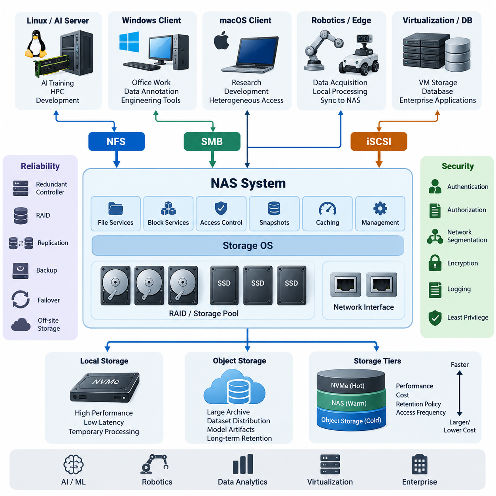
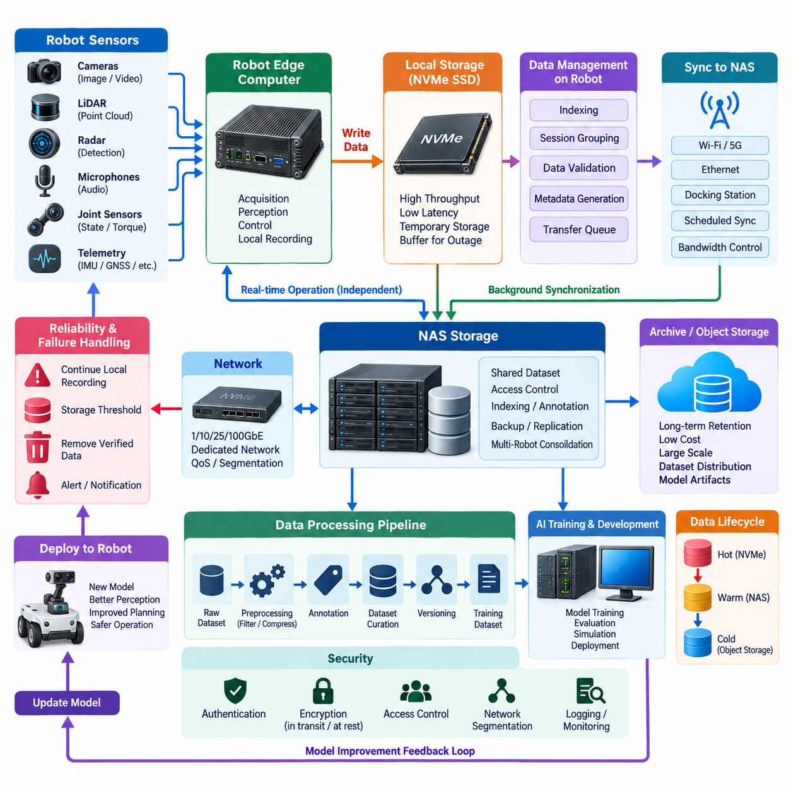
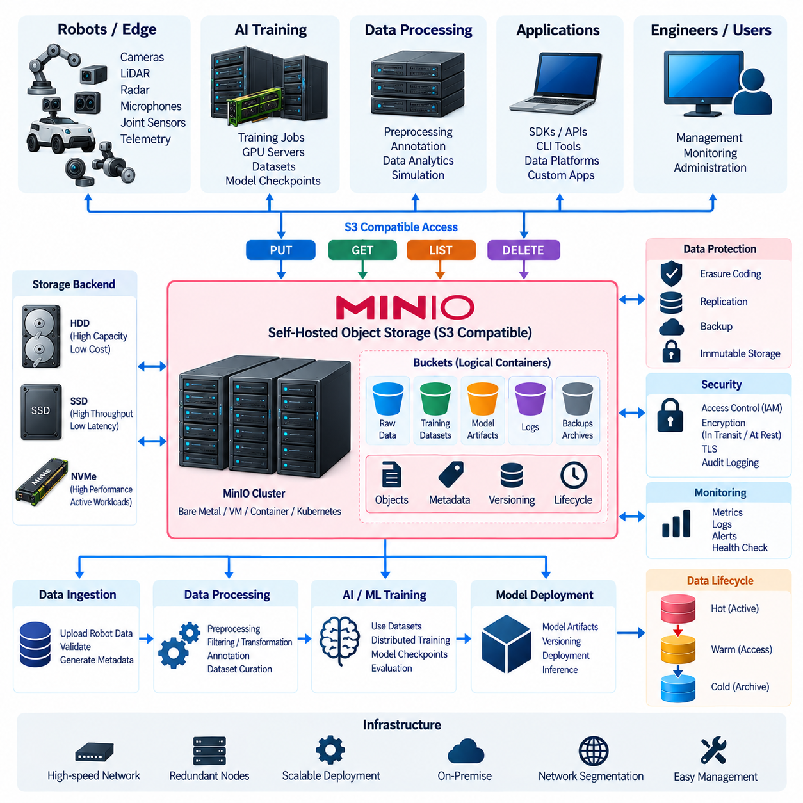
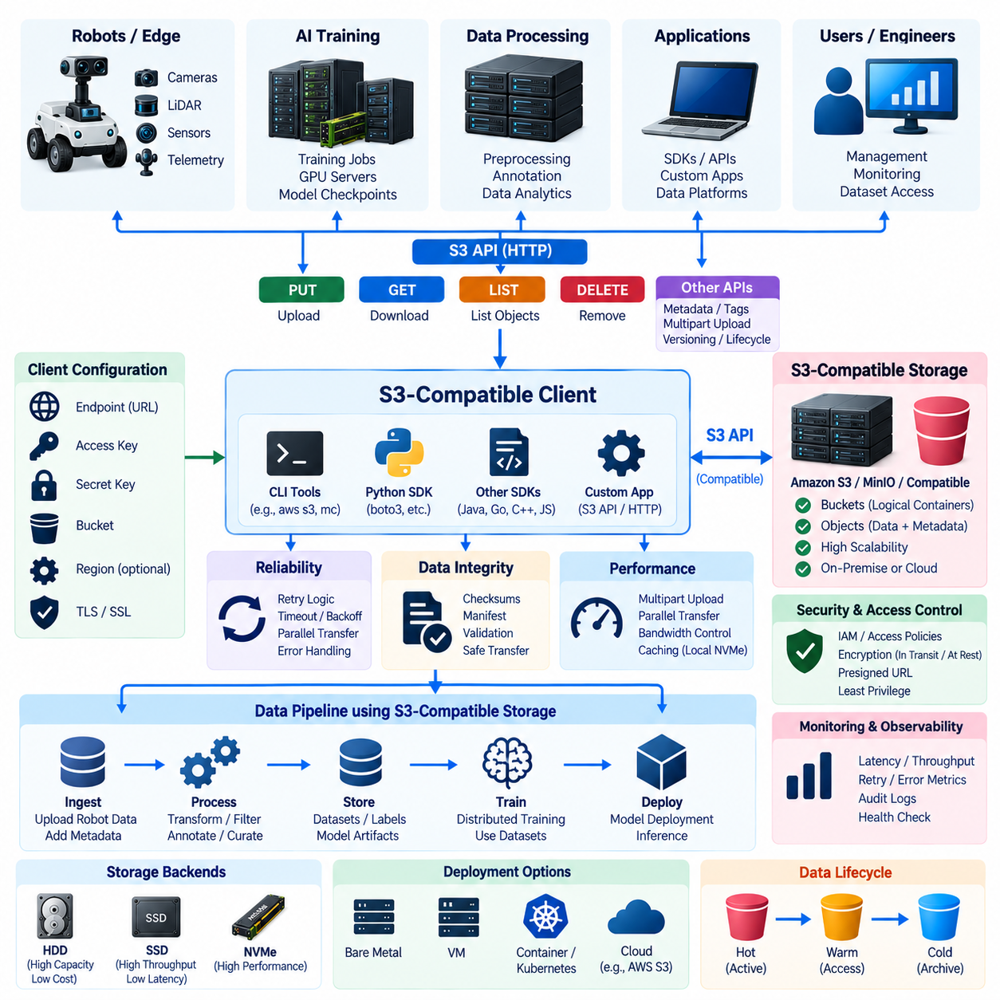
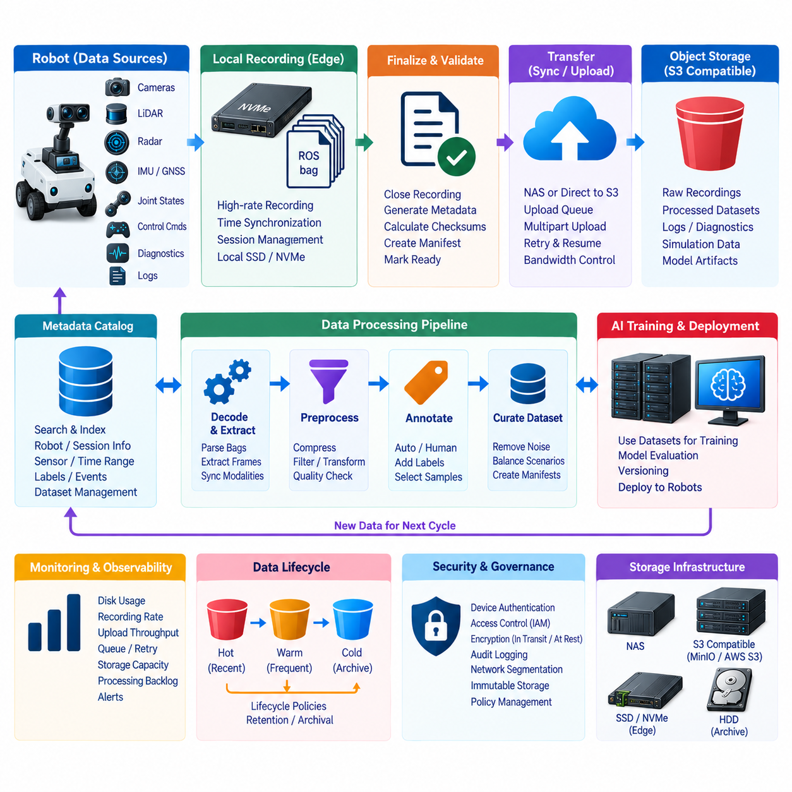
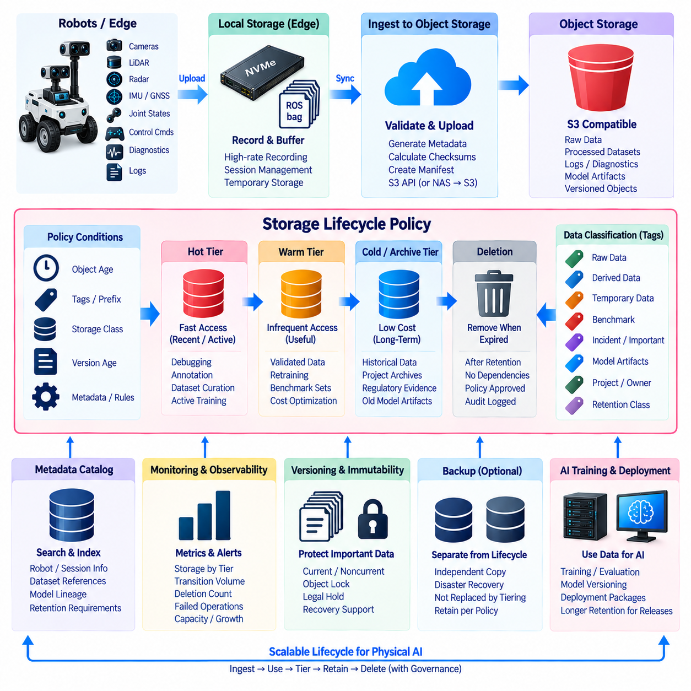
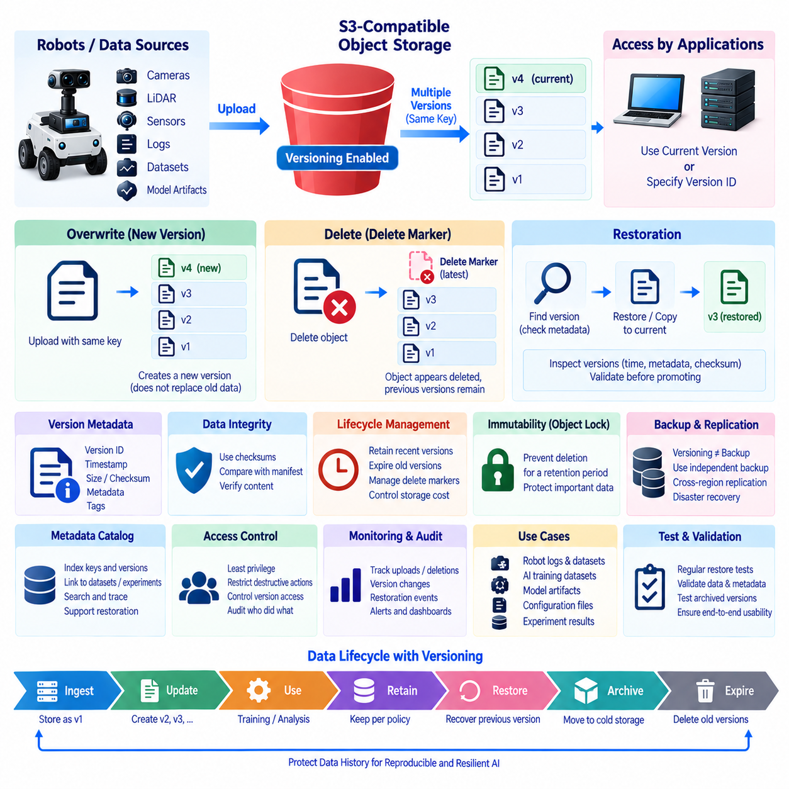
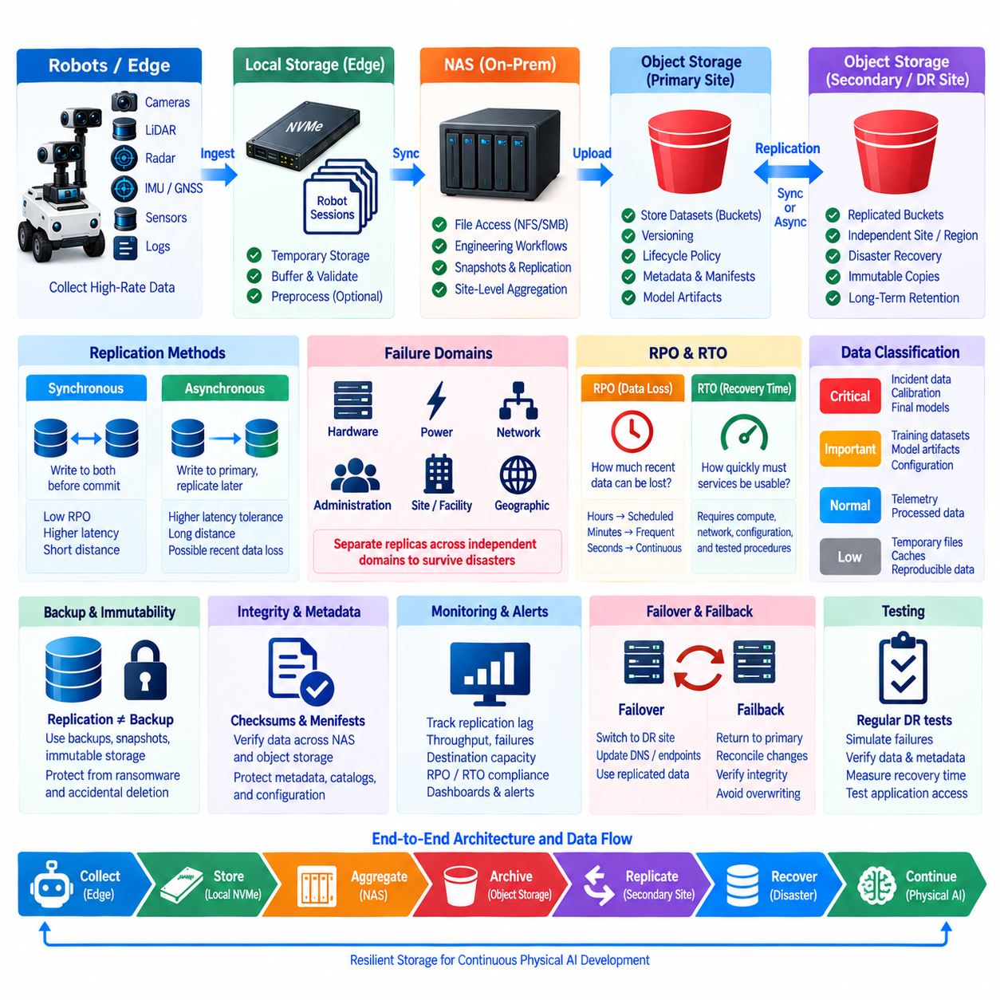
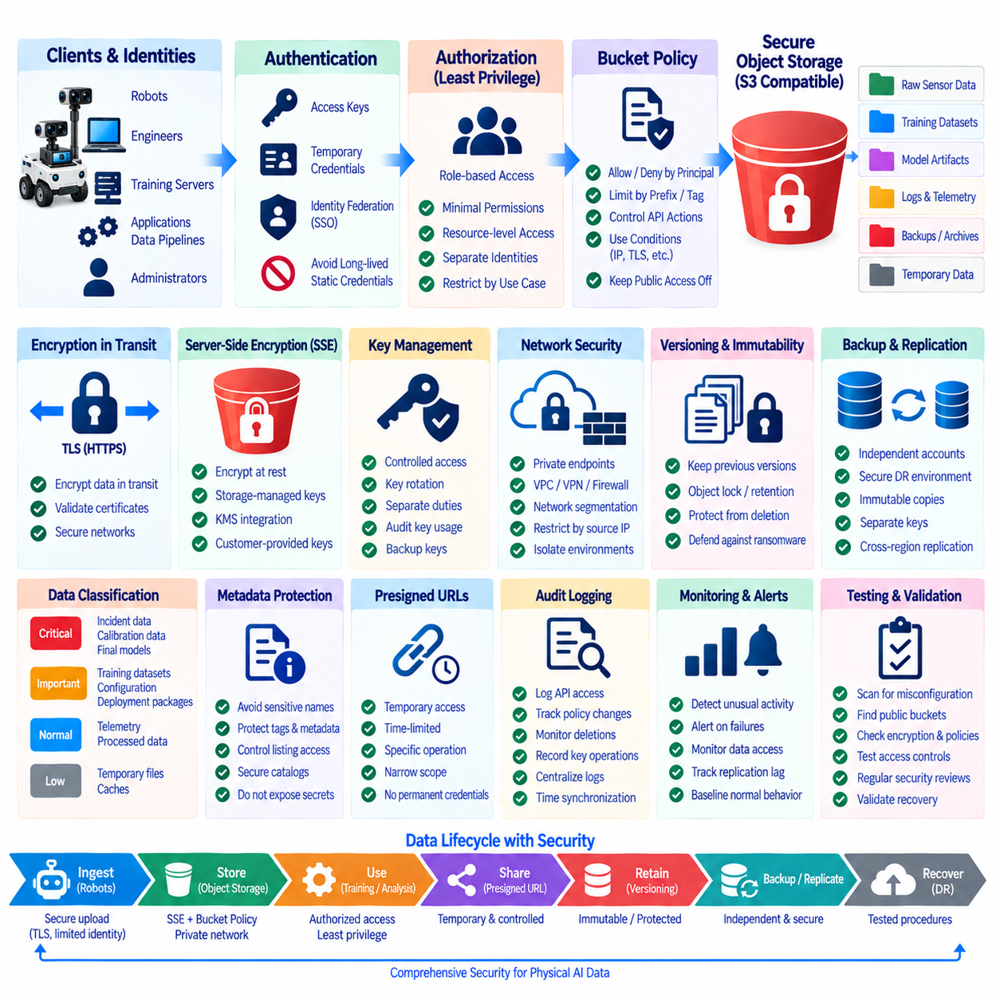
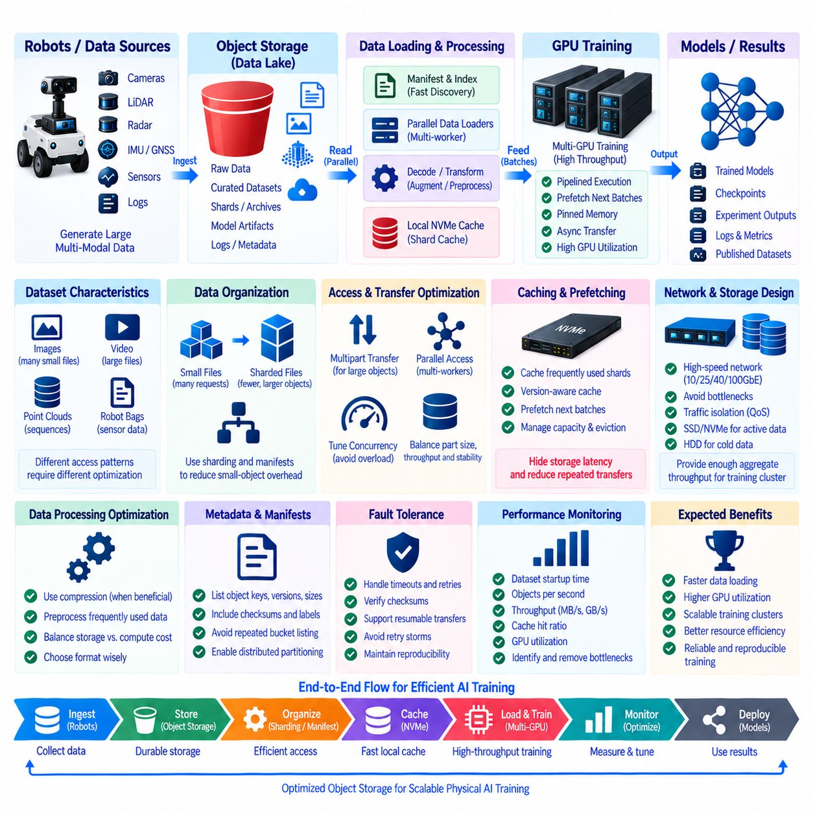

**Volume 08 Robot Database and Storage**


# 07. NAS and Object Storage

##  

## 07.01 NAS Architecture: NFS, SMB, iSCSI Comparison

{width="7.268055555555556in" height="7.268055555555556in"}

Network Attached Storage provides shared storage services over an IP network and is widely used in AI laboratories, robotics platforms, enterprise data centers, and distributed development environments. Instead of attaching disks directly to individual computers, a NAS system centralizes storage capacity and exposes data through network protocols. This architecture simplifies sharing, backup, access control, capacity expansion, and lifecycle management while allowing heterogeneous systems to work with common datasets.

A typical NAS architecture consists of physical storage devices, a storage operating system, network interfaces, protocol services, and client machines. Hard disk drives or SSDs are organized through RAID, storage pools, or similar redundancy mechanisms. Above this physical layer, the NAS operating system manages volumes, permissions, snapshots, caching, and network services. Clients access these resources through protocols such as NFS, SMB, while block-oriented environments may use iSCSI.

NFS, or Network File System, is a file-level protocol traditionally associated with Linux and UNIX environments. A server exports directories, and remote clients mount them into their local directory trees. Applications can therefore interact with remote files using familiar filesystem operations. This makes NFS particularly convenient for Linux-based AI servers, GPU workstations, robotics development machines, shared source repositories, and large scientific datasets.

Modern NFS implementations support stronger security, improved locking, parallel workloads, and more efficient communication than earlier versions. NFSv4 integrates features such as stateful operation and enhanced authentication mechanisms, while enterprise deployments can combine NFS with Kerberos and centralized identity services. Performance depends heavily on network bandwidth, latency, server caching, storage media, metadata activity, and the access patterns generated by applications.

SMB, or Server Message Block, is another file-level storage protocol and is deeply integrated with Windows environments. Users typically see SMB resources as shared folders or mapped network drives. Windows authentication, Active Directory integration, access control lists, file locking, and familiar administrative tools make SMB especially suitable for organizations where Windows desktops and application servers constitute a significant portion of the computing infrastructure.

SMB is not limited to Windows. Linux, macOS, NAS appliances, and many embedded platforms can access SMB shares, making it useful for heterogeneous environments. In robotics or AI organizations, researchers may use Linux GPU machines while administrative users and annotation teams use Windows workstations. A NAS can expose selected datasets through both NFS and SMB, allowing different clients to access centralized storage through protocols appropriate to their operating environments.

NFS and SMB operate primarily at the file level. The server maintains the filesystem and presents files and directories to clients. This architecture differs fundamentally from iSCSI, which provides block-level storage. With iSCSI, a storage server exposes logical block devices called LUNs across an IP network. The client sees the remote resource much like a locally attached disk and normally creates and manages its own filesystem on that device.

Because iSCSI operates below the filesystem layer, it is useful when an application or operating system expects direct block storage. Virtualization platforms, database servers, clustered infrastructure, backup systems, and specialized enterprise applications may use iSCSI volumes. The client has greater control over filesystem formatting and block organization, but this also introduces operational responsibilities that are different from ordinary shared-folder administration.

The distinction between file sharing and block storage becomes especially important when multiple computers need simultaneous access. NFS and SMB are explicitly designed around shared filesystem access and coordinate file operations through their protocol semantics. A conventional iSCSI LUN, however, should not simply be mounted read-write by several independent hosts using an ordinary filesystem. Multi-host block access generally requires a cluster-aware filesystem or another coordination mechanism.

Protocol selection should therefore begin with workload requirements rather than theoretical protocol performance. NFS is often a natural choice for Linux-centric compute clusters, AI training servers, container hosts, and robotics development systems. SMB is usually preferable when Windows integration, user-oriented file sharing, office workflows, or Active Directory permissions are important. iSCSI becomes attractive when software requires a disk-like block device instead of a network filesystem.

Performance comparisons must also consider the complete data path. A 10, 25, or 100 Gigabit Ethernet connection cannot deliver its theoretical throughput if the underlying disk array, NAS processor, filesystem, or client application becomes the bottleneck. Conversely, an all-flash array can remain underutilized when connected through a slow network. Queue depth, file size, metadata operations, concurrent users, caching behavior, and sequential versus random access can significantly alter observed performance.

Large AI datasets illustrate these differences clearly. Training workloads that continuously read large image, video, point-cloud, or tensor files may benefit from high-bandwidth NFS combined with local caching and fast network interfaces. Workloads containing millions of tiny files can become metadata-bound even when raw network bandwidth is abundant. Dataset packaging, sharding, prefetching, local NVMe caches, and parallel data loaders can therefore matter as much as the selected storage protocol.

Robotics systems introduce another dimension because data is generated continuously by cameras, LiDAR, radar, microphones, telemetry systems, and simulation environments. Edge computers may initially write data to local SSDs and later synchronize it with centralized NAS storage. NFS can serve Linux processing pipelines, while SMB can expose validated datasets to Windows-based annotation or engineering tools. This hybrid approach separates real-time acquisition requirements from centralized data management.

Reliability should be designed independently from protocol choice. RAID protects against certain disk failures but does not replace backup, and a NAS itself can remain a single point of failure unless redundancy is implemented. Production architectures may include redundant controllers, multiple network interfaces, link aggregation, failover paths, snapshots, replication, immutable backup copies, and off-site storage. Recovery objectives should determine how much redundancy and replication are economically justified.

Security must also extend beyond simple username and password protection. Storage networks should use appropriate segmentation, firewall policies, least-privilege permissions, identity management, encryption where required, logging, and administrative separation. NFS exports should be restricted to authorized clients and networks, SMB shares should apply carefully designed access control policies, and iSCSI environments should restrict initiators and targets while protecting the storage network from unauthorized access.

NAS architecture increasingly operates together with object storage rather than replacing it. NAS protocols provide familiar filesystem semantics, hierarchical directories, and compatibility with conventional applications. Object storage organizes data as objects inside logical namespaces or buckets and commonly exposes access through APIs. Large-scale AI repositories can therefore use NAS for active engineering workflows while object storage supports massive archives, dataset distribution, model artifacts, and long-term retention.

A practical architecture may consequently combine several storage tiers. Local NVMe storage handles latency-sensitive processing, centralized NFS or SMB storage supports collaborative datasets, iSCSI supplies block devices to specialized infrastructure, and object storage provides scalable repositories for less filesystem-dependent information. Data can migrate between these tiers according to performance requirements, project status, retention policy, cost, and frequency of access.

For Physical AI and robot fleet environments, this layered model becomes particularly valuable. Robots and edge computers generate operational data locally, on-premise servers aggregate and preprocess selected streams, NAS systems provide controlled shared workspaces, and object storage preserves large historical collections. Training systems can retrieve curated subsets without forcing every robot, workstation, and GPU server to interact with the same storage technology.

Ultimately, NFS, SMB, and iSCSI represent different storage abstractions rather than interchangeable network protocols. NFS emphasizes shared file access in Linux-oriented environments, SMB provides rich file-sharing integration across Windows and heterogeneous clients, and iSCSI delivers network-based block devices for workloads requiring disk semantics. Effective NAS design combines these technologies according to workload behavior, operating systems, security boundaries, scalability requirements, and the broader AI data lifecycle.

네트워크 연결 스토리지(Network Attached Storage, NAS)는 IP 네트워크를 통해 공유 스토리지 서비스를 제공하며, 인공지능 연구실(AI Laboratory), 로보틱스 플랫폼(Robotics Platform), 기업 데이터센터(Enterprise Data Center), 분산 개발 환경(Distributed Development Environment)에서 널리 사용된다. 개별 컴퓨터에 디스크를 직접 연결하는 대신 NAS 시스템은 스토리지 용량(Storage Capacity)을 중앙화하고 네트워크 프로토콜(Network Protocol)을 통해 데이터를 제공한다. 이러한 구조는 공유, 백업(Backup), 접근 제어(Access Control), 용량 확장, 수명주기 관리(Lifecycle Management)를 단순화하면서 서로 다른 시스템이 공통 데이터셋(Dataset)을 활용할 수 있도록 한다.

일반적인 NAS 아키텍처(NAS Architecture)는 물리적 스토리지 장치(Physical Storage Device), 스토리지 운영체제(Storage Operating System), 네트워크 인터페이스(Network Interface), 프로토콜 서비스(Protocol Service), 클라이언트 시스템(Client System)으로 구성된다. 하드 디스크 드라이브(Hard Disk Drive, HDD) 또는 솔리드 스테이트 드라이브(Solid State Drive, SSD)는 RAID, 스토리지 풀(Storage Pool) 또는 이와 유사한 중복성 메커니즘(Redundancy Mechanism)을 통해 구성된다. 상위 계층의 NAS 운영체제는 볼륨(Volume), 권한, 스냅샷(Snapshot), 캐싱(Caching), 네트워크 서비스를 관리한다. 클라이언트는 NFS와 SMB 같은 프로토콜을 통해 이러한 자원에 접근하며, 블록 기반 환경(Block-Oriented Environment)에서는 iSCSI를 사용할 수 있다.

네트워크 파일 시스템(Network File System, NFS)은 전통적으로 리눅스(Linux) 및 유닉스(UNIX) 환경과 연관된 파일 수준 프로토콜(File-Level Protocol)이다. 서버는 디렉터리(Directory)를 내보내기(Export)하고 원격 클라이언트는 이를 자신의 로컬 디렉터리 트리(Local Directory Tree)에 마운트(Mount)한다. 따라서 애플리케이션은 익숙한 파일 시스템 연산(Filesystem Operation)을 이용해 원격 파일을 처리할 수 있다. 이러한 특성으로 NFS는 리눅스 기반 AI 서버, GPU 워크스테이션(GPU Workstation), 로보틱스 개발 시스템, 공유 소스 저장소(Shared Source Repository), 대규모 과학 데이터셋에 특히 적합하다.

최신 NFS 구현은 초기 버전보다 강화된 보안(Security), 향상된 잠금 기능(Locking), 병렬 워크로드(Parallel Workload), 효율적인 통신 기능을 지원한다. NFSv4는 상태 기반 동작(Stateful Operation)과 향상된 인증 메커니즘(Authentication Mechanism) 등의 기능을 통합하며, 기업 환경에서는 커버로스(Kerberos) 및 중앙 집중식 신원 관리 서비스(Centralized Identity Service)와 결합할 수 있다. 실제 성능은 네트워크 대역폭(Network Bandwidth), 지연시간(Latency), 서버 캐싱(Server Caching), 스토리지 매체(Storage Media), 메타데이터 작업(Metadata Operation), 애플리케이션의 접근 패턴(Access Pattern)에 크게 영향을 받는다.

서버 메시지 블록(Server Message Block, SMB)은 또 다른 파일 수준 스토리지 프로토콜(File-Level Storage Protocol)이며 윈도우(Windows) 환경에 깊이 통합되어 있다. 사용자는 일반적으로 SMB 자원을 공유 폴더(Shared Folder) 또는 매핑된 네트워크 드라이브(Mapped Network Drive) 형태로 사용한다. 윈도우 인증(Windows Authentication), 액티브 디렉터리(Active Directory) 연동, 접근 제어 목록(Access Control List, ACL), 파일 잠금(File Locking), 익숙한 관리 도구를 제공하기 때문에 SMB는 윈도우 데스크톱과 애플리케이션 서버가 컴퓨팅 인프라의 상당 부분을 차지하는 조직에 특히 적합하다.

SMB는 윈도우에만 제한되지 않는다. 리눅스, macOS, NAS 장비(NAS Appliance), 다양한 임베디드 플랫폼(Embedded Platform)에서도 SMB 공유에 접근할 수 있으므로 이기종 환경(Heterogeneous Environment)에서 유용하다. 로보틱스 또는 AI 조직에서는 연구자가 리눅스 GPU 시스템을 사용하는 반면, 관리 담당자와 데이터 주석 작업팀(Annotation Team)은 윈도우 워크스테이션을 사용할 수 있다. NAS는 선택된 데이터셋을 NFS와 SMB 양쪽으로 제공하여 서로 다른 클라이언트가 자신의 운영 환경에 적합한 프로토콜을 통해 중앙 스토리지에 접근하도록 구성할 수 있다.

NFS와 SMB는 주로 파일 수준(File Level)에서 동작한다. 서버가 파일 시스템(Filesystem)을 관리하고 파일과 디렉터리를 클라이언트에게 제공한다. 이러한 아키텍처는 블록 수준 스토리지(Block-Level Storage)를 제공하는 iSCSI와 근본적으로 다르다. iSCSI에서는 스토리지 서버가 논리 단위 번호(Logical Unit Number, LUN)라고 하는 논리적 블록 장치(Logical Block Device)를 IP 네트워크를 통해 제공한다. 클라이언트는 원격 자원을 로컬에 직접 연결된 디스크처럼 인식하며 일반적으로 해당 장치에 자체 파일 시스템을 생성하고 관리한다.

iSCSI는 파일 시스템 계층 아래에서 동작하기 때문에 애플리케이션이나 운영체제가 직접적인 블록 스토리지(Direct Block Storage)를 요구할 때 유용하다. 가상화 플랫폼(Virtualization Platform), 데이터베이스 서버(Database Server), 클러스터 인프라(Cluster Infrastructure), 백업 시스템(Backup System), 특수 기업용 애플리케이션 등이 iSCSI 볼륨을 사용할 수 있다. 클라이언트는 파일 시스템 포맷과 블록 구성(Block Organization)에 대해 더 높은 제어권을 가지지만, 이는 일반적인 공유 폴더 관리와는 다른 운영상의 책임을 수반한다.

여러 컴퓨터가 동시에 접근해야 하는 경우 파일 공유(File Sharing)와 블록 스토리지(Block Storage)의 차이는 특히 중요해진다. NFS와 SMB는 공유 파일 시스템 접근(Shared Filesystem Access)을 목적으로 설계되었으며 프로토콜 자체의 의미 체계(Protocol Semantics)를 통해 파일 작업을 조정한다. 반면 일반적인 iSCSI LUN은 일반 파일 시스템을 사용하는 여러 독립 호스트에서 단순히 읽기·쓰기(Read-Write) 방식으로 동시에 마운트해서는 안 된다. 다중 호스트 블록 접근(Multi-Host Block Access)에는 일반적으로 클러스터 인식 파일 시스템(Cluster-Aware Filesystem) 또는 별도의 조정 메커니즘이 필요하다.

따라서 프로토콜 선택(Protocol Selection)은 이론적인 프로토콜 성능보다는 워크로드 요구사항(Workload Requirement)에서 시작해야 한다. NFS는 리눅스 중심의 컴퓨팅 클러스터(Compute Cluster), AI 학습 서버(AI Training Server), 컨테이너 호스트(Container Host), 로보틱스 개발 시스템에서 자연스러운 선택이 될 수 있다. SMB는 윈도우 통합, 사용자 중심 파일 공유, 사무 업무 흐름(Office Workflow), 액티브 디렉터리 권한 관리가 중요할 때 적합하다. 소프트웨어가 네트워크 파일 시스템보다 디스크와 유사한 블록 장치(Block Device)를 요구한다면 iSCSI가 유용한 선택이 될 수 있다.

성능 비교(Performance Comparison)에서는 전체 데이터 경로(Data Path)를 함께 고려해야 한다. 10, 25 또는 100기가비트 이더넷(Gigabit Ethernet)을 사용하더라도 기본 디스크 배열(Disk Array), NAS 프로세서, 파일 시스템 또는 클라이언트 애플리케이션이 병목(Bottleneck)이 되면 이론적인 네트워크 처리량을 달성할 수 없다. 반대로 올플래시 배열(All-Flash Array)도 느린 네트워크에 연결되면 충분히 활용되지 못한다. 큐 깊이(Queue Depth), 파일 크기, 메타데이터 작업, 동시 사용자 수, 캐싱 동작, 순차 접근(Sequential Access)과 무작위 접근(Random Access)의 차이는 실제 성능에 상당한 영향을 줄 수 있다.

대규모 AI 데이터셋(Large-Scale AI Dataset)은 이러한 차이를 명확하게 보여준다. 이미지, 비디오, 포인트 클라우드(Point Cloud), 텐서(Tensor) 파일을 지속적으로 읽는 학습 워크로드는 로컬 캐싱(Local Caching) 및 고속 네트워크 인터페이스와 결합된 고대역폭 NFS의 이점을 얻을 수 있다. 수백만 개의 작은 파일을 포함하는 워크로드는 네트워크 대역폭이 충분하더라도 메타데이터 병목(Metadata Bottleneck)에 직면할 수 있다. 따라서 데이터셋 패키징(Dataset Packaging), 샤딩(Sharding), 프리페칭(Prefetching), 로컬 NVMe 캐시(Local NVMe Cache), 병렬 데이터 로더(Parallel Data Loader)는 선택된 스토리지 프로토콜만큼 중요할 수 있다.

로보틱스 시스템(Robotics System)은 카메라, 라이다(LiDAR), 레이더(Radar), 마이크, 텔레메트리 시스템(Telemetry System), 시뮬레이션 환경에서 데이터가 지속적으로 생성되기 때문에 또 다른 고려 요소가 존재한다. 엣지 컴퓨터(Edge Computer)는 먼저 로컬 SSD에 데이터를 기록하고 이후 중앙 NAS 스토리지와 동기화할 수 있다. NFS는 리눅스 처리 파이프라인(Processing Pipeline)에 사용하고 SMB는 검증된 데이터셋을 윈도우 기반 주석 또는 엔지니어링 도구에 제공할 수 있다. 이러한 하이브리드 접근(Hybrid Approach)은 실시간 데이터 획득 요구사항과 중앙 집중식 데이터 관리를 분리한다.

신뢰성(Reliability)은 프로토콜 선택과 별개로 설계되어야 한다. RAID는 특정 디스크 장애로부터 데이터를 보호하지만 백업을 대체하지 않으며, 중복 구조가 구현되지 않은 NAS 자체는 단일 장애점(Single Point of Failure)이 될 수 있다. 운영 환경에서는 이중화 컨트롤러(Redundant Controller), 다중 네트워크 인터페이스, 링크 집성(Link Aggregation), 장애 조치 경로(Failover Path), 스냅샷, 복제(Replication), 변경 불가능 백업(Immutable Backup), 오프사이트 스토리지(Off-Site Storage)를 사용할 수 있다. 복구 목표(Recovery Objective)에 따라 경제적으로 타당한 중복성과 복제 수준을 결정해야 한다.

보안(Security) 역시 단순한 사용자 이름과 비밀번호 보호를 넘어 확장되어야 한다. 스토리지 네트워크에는 적절한 네트워크 분할(Network Segmentation), 방화벽 정책(Firewall Policy), 최소 권한(Least Privilege), 신원 관리(Identity Management), 필요한 경우 암호화(Encryption), 로깅(Logging), 관리 권한 분리(Administrative Separation)를 적용해야 한다. NFS 내보내기(Export)는 승인된 클라이언트와 네트워크로 제한하고, SMB 공유에는 신중하게 설계된 접근 제어 정책을 적용하며, iSCSI 환경에서는 이니시에이터(Initiator)와 타깃(Target)을 제한하면서 비인가 접근으로부터 스토리지 네트워크를 보호해야 한다.

NAS 아키텍처는 객체 스토리지(Object Storage)를 대체하기보다는 점차 객체 스토리지와 함께 운영되는 형태로 발전하고 있다. NAS 프로토콜은 익숙한 파일 시스템 의미 체계(Filesystem Semantics), 계층형 디렉터리(Hierarchical Directory), 기존 애플리케이션과의 높은 호환성을 제공한다. 반면 객체 스토리지는 데이터를 논리적 네임스페이스(Namespace) 또는 버킷(Bucket) 내부의 객체(Object)로 구성하고 일반적으로 응용 프로그램 인터페이스(Application Programming Interface, API)를 통해 접근한다. 따라서 대규모 AI 저장소에서는 NAS를 활성 엔지니어링 워크플로에 활용하고 객체 스토리지를 대규모 아카이브, 데이터셋 배포, 모델 산출물(Model Artifact), 장기 보존에 활용할 수 있다.

실제 아키텍처에서는 여러 개의 스토리지 계층(Storage Tier)을 결합할 수 있다. 로컬 NVMe 스토리지는 지연시간에 민감한 처리(Latency-Sensitive Processing)를 담당하고, 중앙 집중식 NFS 또는 SMB 스토리지는 협업용 데이터셋을 제공하며, iSCSI는 특수 인프라에 블록 장치를 제공하고, 객체 스토리지는 파일 시스템 의존성이 낮은 정보를 위한 확장 가능한 저장소를 제공한다. 데이터는 성능 요구사항, 프로젝트 상태, 보존 정책(Retention Policy), 비용, 접근 빈도에 따라 이러한 계층 사이에서 이동할 수 있다.

피지컬 AI(Physical AI) 및 로봇 플릿(Robot Fleet) 환경에서는 이러한 계층형 모델(Layered Model)이 특히 중요한 가치를 가진다. 로봇과 엣지 컴퓨터는 운영 데이터를 로컬에서 생성하고, 온프레미스 서버(On-Premise Server)는 선택된 데이터 스트림을 집계하고 전처리하며, NAS 시스템은 통제된 공유 작업공간(Shared Workspace)을 제공하고, 객체 스토리지는 대규모 과거 데이터 컬렉션을 보존한다. 학습 시스템은 모든 로봇, 워크스테이션, GPU 서버가 동일한 스토리지 기술을 사용하도록 강제하지 않고도 정제된 데이터 부분집합(Curated Subset)을 가져와 사용할 수 있다.

결국 NFS, SMB, iSCSI는 서로 교환 가능한 단순 네트워크 프로토콜이 아니라 서로 다른 스토리지 추상화(Storage Abstraction)를 제공하는 기술이다. NFS는 리눅스 중심 환경에서 공유 파일 접근을 강조하고, SMB는 윈도우 및 이기종 클라이언트 환경에서 풍부한 파일 공유 통합 기능을 제공하며, iSCSI는 디스크 의미 체계(Disk Semantics)를 필요로 하는 워크로드에 네트워크 기반 블록 장치를 제공한다. 효과적인 NAS 설계는 워크로드 특성, 운영체제, 보안 경계(Security Boundary), 확장성 요구사항, 그리고 전체 AI 데이터 수명주기(AI Data Lifecycle)를 고려하여 이러한 기술을 적절하게 조합해야 한다.

##  

## 07.02 Robot Edge NAS Design: Sensor Data Local Storage

{width="7.268055555555556in" height="7.268055555555556in"}

Robot edge storage architecture is designed around a fundamental constraint: sensor data is generated continuously at the physical edge, while network connectivity and centralized storage cannot always guarantee matching bandwidth, latency, or availability. Cameras, LiDAR, radar, microphones, joint sensors, force sensors, and telemetry streams therefore require local storage capable of absorbing data immediately before selected information is transferred to a NAS or other central repository.

A robot may generate multiple synchronized data streams with very different characteristics. High-resolution cameras produce large sequential image or video streams, LiDAR generates dense point clouds, and control systems create smaller but highly frequent state messages. These streams must often preserve timestamps and relationships between sensors. Storage design must therefore consider not only total capacity but also sustained write throughput, latency, metadata overhead, synchronization, and temporary traffic bursts.

Local NVMe SSDs are particularly useful as the first storage tier because they provide high throughput and low latency without depending on the network. During robot operation, sensor acquisition processes can write directly to local storage while perception and control applications continue executing independently. This prevents temporary network congestion or NAS unavailability from interrupting data collection and reduces the risk that real-time workloads compete with remote storage traffic.

The local storage layer should normally be treated as an operational buffer rather than the permanent system of record. Raw sensor streams can first be captured locally, validated, indexed, and grouped into sessions or missions. Once the robot reaches an appropriate synchronization point, selected data can be transferred to centralized NAS storage. This separation allows the acquisition pipeline to prioritize deterministic collection while centralized infrastructure handles collaboration, retention, and larger-scale processing.

Capacity planning begins with the aggregate data generation rate. If several cameras, LiDAR units, and other sensors collectively generate hundreds of megabytes per second, even a multi-terabyte SSD can fill quickly. Designers should estimate sustained and peak rates, expected mission duration, compression ratios, reserved free space, and synchronization delay. Storage sizing should include safety margin so that unexpected network outages do not immediately stop data acquisition.

Data reduction can significantly decrease storage pressure, but it must be applied according to the purpose of the dataset. Video compression, point-cloud filtering, frame sampling, region-of-interest extraction, and event-based recording can reduce volume. However, aggressively discarding raw information may prevent future model development or failure analysis. Important experiments may therefore preserve raw streams while routine fleet operations retain only events, features, or selected intervals.

A useful edge architecture separates hot operational data from data waiting for synchronization. Active sensor files are written into a temporary capture area, while completed and validated sessions move into a transfer queue. A synchronization service then copies queued data to the NAS according to available bandwidth and priority. Successfully transferred files can be verified through size checks, hashes, manifests, or other integrity mechanisms before local copies become eligible for deletion.

This staged workflow is important because file transfer completion does not automatically prove data integrity. Interrupted transfers, partial files, storage failures, or application crashes can create inconsistencies between the robot and NAS. Each dataset session should therefore contain metadata describing the robot, sensors, timestamps, software versions, calibration information, mission identifiers, and expected files. Checksums can confirm that centralized copies match the original edge data.

NAS storage acts as a shared consolidation layer for data collected from multiple robots and edge computers. Instead of allowing training servers or engineers to retrieve large datasets directly from individual robots, each robot synchronizes validated data into a controlled namespace. Central servers can then perform indexing, annotation, quality analysis, dataset construction, backup, and AI training without placing additional computational or network load on operational robots.

Directory and naming conventions become increasingly important as the fleet grows. A simple structure may organize data by robot identifier, date, mission, sensor, and recording session. More advanced systems can maintain a metadata catalog independently from the physical directory structure. The goal is to ensure that a dataset remains traceable even after files have moved from robot SSDs to NAS volumes, archives, object storage, or model-development environments.

Time synchronization is especially important for multimodal robotics datasets. Camera images, LiDAR scans, joint states, localization estimates, and control commands may need to be reconstructed as one physical event. Precision Time Protocol, hardware timestamps, synchronized clocks, or platform-specific timestamp mechanisms can establish temporal relationships. Storage must preserve these timestamps rather than relying only on filesystem creation or modification times.

Network architecture determines how quickly edge storage can be drained into the NAS. Gigabit Ethernet may be adequate for moderate datasets but can become a bottleneck when several robots upload large recordings simultaneously. Higher-speed Ethernet, dedicated data networks, Wi-Fi, or scheduled synchronization windows can be used depending on deployment conditions. Upload policies can also prioritize critical logs and metadata before transferring large raw sensor files.

Bandwidth-aware synchronization is particularly valuable for mobile robots. A robot may operate in areas with unstable wireless connectivity and later return to a docking station with reliable high-speed networking. During operation, only compact telemetry or important events may be transmitted immediately. Large camera and LiDAR recordings remain on local SSDs and are synchronized after docking, reducing dependence on continuous high-bandwidth wireless communication.

The edge system should also protect real-time robot functions from storage overload. Sensor recording, AI inference, localization, navigation, and control may share the same compute platform. If background synchronization consumes excessive CPU, memory, disk bandwidth, or network capacity, robot performance can degrade. Resource limits, transfer throttling, process priorities, separate storage devices, and scheduled synchronization can isolate data-management activity from mission-critical workloads.

Failure handling should be designed explicitly. If the NAS becomes unreachable, local recording should continue until a defined storage threshold is reached. If available capacity falls below a warning level, the system can prioritize important sessions, remove verified temporary data, reduce nonessential recording, or notify operators. Automatic deletion should never depend solely on file age when data has not yet been confirmed as safely transferred and retained elsewhere.

Security must follow the data across both edge and centralized storage. Robots should authenticate before writing to NAS destinations, and each device should receive only the permissions required for its assigned namespace. Sensitive datasets may require encryption at rest and in transit. Network segmentation can separate robot control traffic from bulk storage transfers, reducing the possibility that large synchronization workloads or unauthorized access affect operational communication.

A complete design should also distinguish NAS from backup and long-term archive storage. The NAS may contain active datasets used by engineers and training systems, but accidental deletion, ransomware, hardware failure, or administrative errors can still affect shared storage. Snapshots, replication, immutable backups, and object-storage archives provide additional protection. Data lifecycle policies can move older raw datasets away from expensive high-performance NAS capacity.

For AI development, the centralized dataset should not be treated as an uncontrolled collection of files. Raw robot recordings can pass through validation, preprocessing, annotation, curation, and versioning stages before becoming training datasets. A model should be traceable to the dataset version used for training, while the dataset should remain traceable to original robot sessions. This lineage supports reproducibility, debugging, safety analysis, and future model improvement.

A scalable fleet architecture therefore forms a continuous data path from sensor to edge storage, centralized NAS, and eventually archive or object storage. Local NVMe provides fast temporary absorption, NAS provides shared operational storage, and colder tiers provide economical long-term retention. Metadata, integrity verification, synchronization policies, and lifecycle rules connect these physical tiers into one manageable data system rather than a collection of independent disks.

In Physical AI systems, this architecture creates a feedback loop between physical operation and model development. Robots generate multimodal experience, edge computers preserve it reliably, NAS infrastructure consolidates and organizes it, and AI pipelines transform selected data into improved perception, planning, and control models. Updated models can then return to edge systems, producing new operational data and continuously expanding the organization\'s reusable physical-world knowledge.

로봇 엣지 스토리지 아키텍처(Robot Edge Storage Architecture)는 물리적 엣지(Physical Edge)에서 센서 데이터가 지속적으로 생성되는 반면, 네트워크 연결성과 중앙 집중식 스토리지(Centralized Storage)는 항상 이에 상응하는 대역폭(Bandwidth), 지연시간(Latency), 가용성(Availability)을 보장할 수 없다는 기본적인 제약을 중심으로 설계된다. 따라서 카메라, 라이다(LiDAR), 레이더(Radar), 마이크, 관절 센서(Joint Sensor), 힘 센서(Force Sensor), 텔레메트리(Telemetry) 스트림은 선택된 정보가 NAS 또는 다른 중앙 저장소로 전송되기 전에 데이터를 즉시 수용할 수 있는 로컬 스토리지(Local Storage)를 필요로 한다.

로봇은 서로 매우 다른 특성을 가진 여러 개의 동기화된 데이터 스트림(Synchronized Data Stream)을 생성할 수 있다. 고해상도 카메라는 대용량의 연속적인 이미지 또는 비디오 스트림을 생성하고, 라이다는 밀집된 포인트 클라우드(Point Cloud)를 생성하며, 제어 시스템(Control System)은 상대적으로 작지만 매우 빈번한 상태 메시지(State Message)를 생성한다. 이러한 스트림은 센서 간 타임스탬프(Timestamp)와 상호 관계를 보존해야 하는 경우가 많다. 따라서 스토리지 설계에서는 전체 용량뿐만 아니라 지속 쓰기 처리량(Sustained Write Throughput), 지연시간, 메타데이터 오버헤드(Metadata Overhead), 동기화(Synchronization), 일시적인 트래픽 급증까지 고려해야 한다.

로컬 NVMe SSD(Local NVMe SSD)는 네트워크에 의존하지 않으면서 높은 처리량과 낮은 지연시간을 제공하기 때문에 첫 번째 스토리지 계층(Storage Tier)으로 특히 유용하다. 로봇이 작동하는 동안 센서 데이터 획득 프로세스(Sensor Acquisition Process)는 로컬 스토리지에 직접 데이터를 기록하고, 인지(Perception) 및 제어 애플리케이션(Control Application)은 독립적으로 계속 실행될 수 있다. 이를 통해 일시적인 네트워크 혼잡(Network Congestion)이나 NAS 사용 불가 상태가 데이터 수집을 중단시키는 것을 방지하고, 실시간 워크로드(Real-Time Workload)가 원격 스토리지 트래픽과 경쟁할 위험을 줄일 수 있다.

로컬 스토리지 계층(Local Storage Layer)은 일반적으로 영구적인 기록 시스템(System of Record)이 아니라 운영 버퍼(Operational Buffer)로 취급해야 한다. 원시 센서 스트림(Raw Sensor Stream)은 먼저 로컬에서 수집되고 검증, 인덱싱(Indexing), 세션(Session) 또는 미션(Mission) 단위로 그룹화될 수 있다. 이후 로봇이 적절한 동기화 시점(Synchronization Point)에 도달하면 선택된 데이터를 중앙 NAS 스토리지로 전송할 수 있다. 이러한 분리를 통해 데이터 획득 파이프라인(Acquisition Pipeline)은 결정론적 수집(Deterministic Collection)을 우선하고, 중앙 인프라는 협업, 보존, 대규모 처리를 담당할 수 있다.

용량 계획(Capacity Planning)은 전체 데이터 생성률(Aggregate Data Generation Rate)을 계산하는 것에서 시작한다. 여러 대의 카메라, 라이다 및 기타 센서가 합쳐서 초당 수백 메가바이트의 데이터를 생성한다면 수 테라바이트 규모의 SSD도 빠르게 가득 찰 수 있다. 설계자는 지속 및 최대 데이터 생성률, 예상 미션 지속시간, 압축률(Compression Ratio), 예약 여유 공간(Reserved Free Space), 동기화 지연시간을 추정해야 한다. 예상하지 못한 네트워크 장애가 발생하더라도 데이터 수집이 즉시 중단되지 않도록 스토리지 용량에는 충분한 안전 여유(Safety Margin)를 포함해야 한다.

데이터 축소(Data Reduction)는 스토리지 부담을 크게 줄일 수 있지만 데이터셋의 목적에 따라 적용해야 한다. 비디오 압축(Video Compression), 포인트 클라우드 필터링(Point-Cloud Filtering), 프레임 샘플링(Frame Sampling), 관심 영역 추출(Region-of-Interest Extraction), 이벤트 기반 기록(Event-Based Recording)을 사용하면 데이터 크기를 줄일 수 있다. 그러나 원시 정보를 지나치게 제거하면 향후 모델 개발이나 장애 분석에 필요한 정보를 잃을 수 있다. 따라서 중요한 실험에서는 원시 스트림을 보존하고, 일상적인 플릿 운영(Fleet Operation)에서는 이벤트, 특징(Feature), 선택된 시간 구간만 유지하는 방식이 가능하다.

효과적인 엣지 아키텍처(Edge Architecture)는 활성 운영 데이터(Hot Operational Data)와 동기화를 기다리는 데이터를 분리한다. 활성 센서 파일은 임시 캡처 영역(Temporary Capture Area)에 기록되고, 기록이 완료되고 검증된 세션은 전송 대기열(Transfer Queue)로 이동한다. 이후 동기화 서비스(Synchronization Service)는 사용 가능한 대역폭과 우선순위에 따라 대기 중인 데이터를 NAS로 복사한다. 성공적으로 전송된 파일은 크기 검사(Size Check), 해시(Hash), 매니페스트(Manifest) 또는 기타 무결성 메커니즘(Integrity Mechanism)을 통해 검증된 후에야 로컬 복사본을 삭제 가능한 상태로 전환할 수 있다.

이러한 단계적 워크플로(Staged Workflow)가 중요한 이유는 파일 전송 완료가 자동으로 데이터 무결성(Data Integrity)을 증명하지 않기 때문이다. 전송 중단, 불완전한 파일, 스토리지 장애, 애플리케이션 충돌(Application Crash)은 로봇과 NAS 사이에 데이터 불일치를 발생시킬 수 있다. 따라서 각 데이터셋 세션에는 로봇, 센서, 타임스탬프, 소프트웨어 버전, 보정 정보(Calibration Information), 미션 식별자(Mission Identifier), 예상 파일을 설명하는 메타데이터(Metadata)가 포함되어야 한다. 체크섬(Checksum)을 사용하면 중앙 저장소의 복사본이 원본 엣지 데이터와 일치하는지 확인할 수 있다.

NAS 스토리지는 여러 로봇과 엣지 컴퓨터에서 수집된 데이터를 위한 공유 통합 계층(Shared Consolidation Layer)으로 동작한다. 학습 서버나 엔지니어가 개별 로봇에서 직접 대규모 데이터셋을 가져오도록 하는 대신, 각 로봇은 검증된 데이터를 통제된 네임스페이스(Controlled Namespace)에 동기화한다. 이후 중앙 서버는 운영 중인 로봇에 추가적인 연산 또는 네트워크 부하를 발생시키지 않으면서 인덱싱, 데이터 주석(Data Annotation), 품질 분석(Quality Analysis), 데이터셋 구성, 백업, AI 학습(AI Training)을 수행할 수 있다.

플릿(Fleet)의 규모가 증가할수록 디렉터리 및 명명 규칙(Directory and Naming Convention)은 더욱 중요해진다. 단순한 구조에서는 로봇 식별자(Robot Identifier), 날짜, 미션, 센서, 기록 세션을 기준으로 데이터를 구성할 수 있다. 보다 발전된 시스템에서는 물리적인 디렉터리 구조와 독립적으로 메타데이터 카탈로그(Metadata Catalog)를 유지할 수 있다. 핵심 목표는 파일이 로봇 SSD에서 NAS 볼륨, 아카이브(Archive), 객체 스토리지(Object Storage), 모델 개발 환경으로 이동한 이후에도 데이터셋의 추적 가능성(Traceability)을 유지하는 것이다.

시간 동기화(Time Synchronization)는 멀티모달 로보틱스 데이터셋(Multimodal Robotics Dataset)에서 특히 중요하다. 카메라 이미지, 라이다 스캔, 관절 상태(Joint State), 위치 추정(Localization Estimate), 제어 명령(Control Command)을 하나의 물리적 이벤트로 재구성해야 할 수 있다. 정밀 시간 프로토콜(Precision Time Protocol, PTP), 하드웨어 타임스탬프(Hardware Timestamp), 동기화된 클록(Synchronized Clock), 플랫폼별 타임스탬프 메커니즘을 이용하여 시간적 관계를 설정할 수 있다. 스토리지는 단순히 파일 시스템의 생성 또는 수정 시간에 의존하지 않고 이러한 타임스탬프를 보존해야 한다.

네트워크 아키텍처(Network Architecture)는 엣지 스토리지에 저장된 데이터를 얼마나 빠르게 NAS로 이동시킬 수 있는지를 결정한다. 기가비트 이더넷(Gigabit Ethernet)은 중간 규모의 데이터셋에는 충분할 수 있지만 여러 로봇이 동시에 대규모 기록 데이터를 업로드하면 병목이 될 수 있다. 배치 환경에 따라 고속 이더넷(High-Speed Ethernet), 전용 데이터 네트워크(Dedicated Data Network), Wi-Fi 또는 예약된 동기화 시간대를 사용할 수 있다. 업로드 정책(Upload Policy)을 통해 대규모 원시 센서 파일보다 중요한 로그와 메타데이터를 우선적으로 전송할 수도 있다.

대역폭 인식 동기화(Bandwidth-Aware Synchronization)는 모바일 로봇(Mobile Robot)에 특히 유용하다. 로봇은 무선 연결이 불안정한 영역에서 작업한 후 안정적인 고속 네트워크를 사용할 수 있는 도킹 스테이션(Docking Station)으로 복귀할 수 있다. 운영 중에는 작은 용량의 텔레메트리나 중요한 이벤트만 즉시 전송하고, 대규모 카메라 및 라이다 기록은 로컬 SSD에 유지한 후 도킹 이후 동기화할 수 있다. 이를 통해 지속적인 고대역폭 무선 통신에 대한 의존성을 줄일 수 있다.

엣지 시스템은 스토리지 과부하(Storage Overload)로부터 실시간 로봇 기능도 보호해야 한다. 센서 기록, AI 추론(AI Inference), 위치 추정, 내비게이션(Navigation), 제어가 동일한 컴퓨팅 플랫폼을 공유할 수 있다. 백그라운드 동기화(Background Synchronization)가 CPU, 메모리, 디스크 대역폭 또는 네트워크 용량을 지나치게 사용하면 로봇 성능이 저하될 수 있다. 자원 제한(Resource Limit), 전송 속도 제한(Transfer Throttling), 프로세스 우선순위(Process Priority), 별도의 스토리지 장치, 예약 동기화를 통해 데이터 관리 작업을 미션 핵심 워크로드(Mission-Critical Workload)와 분리할 수 있다.

장애 처리(Failure Handling)는 명시적으로 설계되어야 한다. NAS에 접근할 수 없는 경우에도 정의된 스토리지 임계값(Storage Threshold)에 도달할 때까지 로컬 기록을 계속할 수 있어야 한다. 사용 가능한 용량이 경고 수준 이하로 감소하면 시스템은 중요한 세션을 우선하고, 검증이 완료된 임시 데이터를 제거하거나, 비필수 기록을 축소하거나, 운영자에게 알림을 제공할 수 있다. 다른 위치로 안전하게 전송되고 보존되었다는 사실이 확인되지 않은 데이터는 단순히 파일 생성 후 경과 시간만을 기준으로 자동 삭제해서는 안 된다.

보안(Security)은 엣지와 중앙 스토리지 전체에서 데이터를 따라 적용되어야 한다. 로봇은 NAS 목적지에 데이터를 기록하기 전에 인증(Authentication)을 수행해야 하며 각 장치는 자신에게 할당된 네임스페이스에 필요한 최소한의 권한만 부여받아야 한다. 민감한 데이터셋에는 저장 데이터 암호화(Encryption at Rest)와 전송 데이터 암호화(Encryption in Transit)가 필요할 수 있다. 네트워크 분할(Network Segmentation)을 통해 로봇 제어 트래픽과 대용량 스토리지 전송을 분리하면 대규모 동기화 작업이나 비인가 접근이 운영 통신에 영향을 미칠 가능성을 줄일 수 있다.

완전한 설계에서는 NAS와 백업(Backup), 장기 아카이브 스토리지(Long-Term Archive Storage)의 역할도 구분해야 한다. NAS에는 엔지니어와 학습 시스템이 사용하는 활성 데이터셋(Active Dataset)이 저장될 수 있지만, 실수에 의한 삭제, 랜섬웨어(Ransomware), 하드웨어 장애, 관리 오류는 공유 스토리지에도 영향을 줄 수 있다. 스냅샷(Snapshot), 복제(Replication), 변경 불가능 백업(Immutable Backup), 객체 스토리지 아카이브(Object-Storage Archive)는 추가적인 보호 기능을 제공한다. 데이터 수명주기 정책(Data Lifecycle Policy)을 통해 오래된 원시 데이터셋을 비용이 높은 고성능 NAS에서 다른 저장 계층으로 이동시킬 수 있다.

AI 개발 관점에서 중앙 집중식 데이터셋은 통제되지 않은 파일 모음으로 취급해서는 안 된다. 원시 로봇 기록(Raw Robot Recording)은 학습 데이터셋이 되기 전에 검증, 전처리(Preprocessing), 주석, 큐레이션(Curation), 버전 관리(Versioning) 단계를 거칠 수 있다. 모델은 학습에 사용된 데이터셋 버전(Dataset Version)까지 추적할 수 있어야 하며, 데이터셋은 다시 원본 로봇 세션까지 추적 가능해야 한다. 이러한 데이터 계보(Data Lineage)는 재현성(Reproducibility), 디버깅(Debugging), 안전성 분석(Safety Analysis), 향후 모델 개선을 지원한다.

따라서 확장 가능한 플릿 아키텍처(Scalable Fleet Architecture)는 센서에서 엣지 스토리지, 중앙 NAS, 최종적으로 아카이브 또는 객체 스토리지까지 이어지는 연속적인 데이터 경로(Data Path)를 형성한다. 로컬 NVMe는 빠른 임시 데이터 수용을 담당하고, NAS는 공유 운영 스토리지(Shared Operational Storage)를 제공하며, 콜드 스토리지 계층(Cold Storage Tier)은 경제적인 장기 보존을 담당한다. 메타데이터, 무결성 검증, 동기화 정책, 수명주기 규칙은 이러한 물리적 계층들을 독립적인 디스크의 집합이 아니라 하나의 관리 가능한 데이터 시스템으로 연결한다.

피지컬 AI 시스템(Physical AI System)에서 이러한 아키텍처는 물리적 운영과 모델 개발 사이의 피드백 루프(Feedback Loop)를 형성한다. 로봇은 멀티모달 경험(Multimodal Experience)을 생성하고, 엣지 컴퓨터는 이를 안정적으로 보존하며, NAS 인프라는 데이터를 통합하고 체계화한다. 이후 AI 파이프라인(AI Pipeline)은 선택된 데이터를 개선된 인지, 계획(Planning), 제어 모델(Control Model)로 변환한다. 업데이트된 모델은 다시 엣지 시스템에 배포되고 새로운 운영 데이터를 생성하면서 조직이 재사용할 수 있는 물리 세계 지식(Physical-World Knowledge)을 지속적으로 확장한다.

##  

## 07.03 MinIO Object Storage: Self-Hosted Setup [w/Code]

{width="7.268055555555556in" height="7.268055555555556in"}

MinIO is a self-hosted object storage platform designed around an S3-compatible application programming interface. Unlike traditional NAS systems that expose hierarchical filesystems through NFS or SMB, MinIO stores data as objects inside buckets. Applications interact with those objects through APIs, SDKs, command-line tools, or compatible data platforms, making the architecture suitable for AI datasets, model artifacts, backups, logs, and large binary data collections.

Object storage organizes information differently from conventional filesystem storage. Each object contains data, an object name or key, and associated metadata, while buckets provide logical containers for groups of objects. Applications do not normally mount these objects as ordinary local directories. Instead, they perform operations such as PUT, GET, LIST, and DELETE through the S3-compatible interface, which separates application-level data access from the physical arrangement of disks.

A self-hosted MinIO deployment gives an organization direct control over storage hardware, network topology, access policies, and data location. It can run on dedicated servers, virtual machines, containers, or orchestrated infrastructure depending on operational requirements. For AI and robotics environments, this allows large datasets to remain inside an on-premise network while still providing an object-storage interface similar to that used by cloud-native applications.

The simplest deployment may use a single MinIO server with locally attached storage. This configuration is useful for development, experimentation, demonstrations, or workloads where service interruption is acceptable. The server exposes an S3-compatible endpoint and management interface, while applications access named buckets through configured credentials. Production systems, however, generally require stronger redundancy, monitoring, backup, and failure-management strategies.

Storage media should be selected according to workload characteristics rather than capacity alone. HDDs provide economical capacity for large archives and infrequently accessed datasets, while SSDs and NVMe devices provide higher throughput and lower latency for active workloads. AI repositories may combine high-capacity storage for raw datasets with faster storage for frequently accessed training subsets, checkpoints, embeddings, or intermediate processing results.

Distributed object storage can spread data across multiple drives or nodes, improving capacity and resilience. MinIO uses erasure coding techniques to protect data against certain drive or node failures by storing encoded information across available storage resources. This approach differs from simply maintaining one complete copy on every disk and allows storage efficiency and fault tolerance to be balanced according to the deployed topology.

Erasure coding should not be confused with backup. Redundancy can keep a service available when hardware components fail, but it does not automatically protect against accidental deletion, compromised credentials, software errors, or destructive administrative actions. A complete architecture therefore combines storage-level resilience with versioning, replication, immutable retention where appropriate, independent backups, and recovery procedures tested before an actual incident occurs.

Network design becomes critical when MinIO serves large AI or robotics datasets. A storage cluster may contain enough disks to deliver several gigabytes per second, but clients cannot use that performance if network links become the bottleneck. High-speed Ethernet, redundant interfaces, suitable switching infrastructure, balanced client connections, and careful separation of storage traffic from latency-sensitive robot-control networks can improve predictable system behavior.

Buckets should represent meaningful administrative or lifecycle boundaries rather than arbitrary folders. An organization might separate raw robot recordings, curated training datasets, synthetic data, model checkpoints, deployment artifacts, and long-term archives into different buckets. Object prefixes can provide additional logical organization inside each bucket, while metadata and tags can describe project identifiers, robot sources, dataset versions, retention classes, or processing status.

Access control is fundamental because object storage often consolidates valuable datasets from many projects. Administrative credentials should not be embedded in ordinary applications. Separate users, service accounts, access keys, and policies can restrict each workload to required buckets and operations. A training pipeline may receive read access to curated datasets and write access to model-output locations without receiving permission to delete original robot recordings.

Encryption can protect data both while stored and while moving across the network. Transport Layer Security should be used to protect S3-compatible API traffic, particularly when clients operate across shared or untrusted networks. Depending on infrastructure requirements, server-side encryption and external key-management mechanisms can provide additional protection for stored objects. Key lifecycle and recovery procedures must be designed together with encryption.

MinIO can become part of an AI data pipeline rather than functioning only as passive storage. Data ingestion services can upload robot sessions, preprocessing systems can retrieve raw objects and generate derived datasets, annotation pipelines can store labels, and training systems can consume versioned collections. Model checkpoints and final artifacts can then return to object storage, creating a common repository across multiple stages of model development.

This architecture is especially useful when datasets become too large or distributed for conventional workstation-oriented file sharing. Training jobs running on multiple GPU servers can access objects through standard APIs without requiring every system to share identical filesystem mount configurations. Containerized workloads can receive endpoint and credential information dynamically, while data-management software can interact with the same storage through compatible S3 libraries.

Object naming requires careful design because an object store should not be treated exactly like a conventional filesystem. Keys can appear hierarchical by using separators such as slashes, but this hierarchy is primarily logical. A consistent naming scheme can encode dataset family, acquisition date, robot identifier, mission, sensor, or version. However, important searchable attributes should also be maintained in metadata catalogs rather than relying entirely on long object names.

Large files can be transferred efficiently through multipart upload mechanisms. Instead of requiring an entire large dataset archive to be uploaded as one uninterrupted operation, multipart transfers divide an object into parts that can be transmitted and retried independently. This is valuable for large video recordings, simulation outputs, model checkpoints, and packaged datasets, particularly when network connections may occasionally experience interruptions or variable throughput.

Data integrity should be verified throughout ingestion and migration workflows. Applications can maintain checksums, manifests, object counts, expected sizes, and dataset-level metadata before deleting source copies. A successful API response alone should not be the only criterion for removing valuable robot data. Validation procedures should confirm that expected objects exist, their contents are intact, and required metadata has been preserved in the destination repository.

Versioning can provide protection and reproducibility when objects change over time. Instead of immediately replacing the only available copy of an object, version-enabled storage can retain previous versions according to configured policies. For AI development, dataset releases should ideally be immutable or explicitly versioned so that a training experiment can later identify the exact data collection, labels, preprocessing results, and model artifacts used during execution.

Lifecycle management helps prevent high-performance storage from becoming an unlimited accumulation point. Policies can expire temporary objects, retain important datasets, or move information toward colder storage according to age and operational value. Raw sensor recordings may initially remain in active object storage, curated subsets may stay readily accessible for repeated training, and older archives can migrate to lower-cost capacity designed primarily for retention.

Monitoring should cover both infrastructure health and application-level behavior. Administrators need visibility into disk utilization, capacity growth, network throughput, request latency, error rates, node availability, and failed operations. Alerts can identify conditions such as rapidly declining free capacity or unavailable storage components before they become service interruptions. Logs and audit information also support security investigation and operational troubleshooting.

MinIO and NAS storage can coexist within the same architecture because they solve different access problems. NAS provides filesystem semantics that are convenient for engineers, legacy applications, and interactive file workflows, while MinIO provides object APIs suited to scalable datasets, automation, cloud-native applications, and programmatic pipelines. Data can move between these systems according to lifecycle stage instead of forcing every workload onto a single storage abstraction.

In a Physical AI environment, robots may first capture high-rate sensor streams onto local NVMe storage and later synchronize validated sessions to NAS. Data-ingestion processes can subsequently package or transform selected datasets and place them into MinIO buckets for long-term management, distributed training, or model development. This separates real-time robot acquisition, collaborative engineering storage, and scalable object-oriented dataset management into appropriate layers.

A mature self-hosted MinIO architecture therefore extends beyond installing an object-storage server. It requires deliberate decisions about hardware, redundancy, networking, bucket organization, identities, encryption, versioning, lifecycle rules, observability, backup, and disaster recovery. When these elements are designed together, MinIO can provide an on-premise S3-compatible data foundation connecting robot-generated experience with AI training, model management, and long-term organizational knowledge.

MinIO는 S3 호환 응용 프로그램 인터페이스(S3-Compatible Application Programming Interface)를 중심으로 설계된 자체 호스팅 객체 스토리지(Self-Hosted Object Storage) 플랫폼이다. NFS 또는 SMB를 통해 계층형 파일 시스템(Hierarchical Filesystem)을 제공하는 기존 NAS 시스템과 달리, MinIO는 데이터를 버킷(Bucket) 내부의 객체(Object) 형태로 저장한다. 애플리케이션은 API, 소프트웨어 개발 키트(Software Development Kit, SDK), 명령줄 도구(Command-Line Tool), 호환 데이터 플랫폼을 통해 이러한 객체와 상호작용하며, 이러한 구조는 AI 데이터셋, 모델 산출물(Model Artifact), 백업, 로그, 대규모 바이너리 데이터(Binary Data) 저장에 적합하다.

객체 스토리지(Object Storage)는 기존 파일 시스템 스토리지(Filesystem Storage)와 다른 방식으로 정보를 구성한다. 각 객체는 데이터, 객체 이름 또는 키(Object Key), 관련 메타데이터(Metadata)를 포함하며, 버킷은 여러 객체를 그룹화하는 논리적 컨테이너(Logical Container)를 제공한다. 애플리케이션은 일반적으로 이러한 객체를 로컬 디렉터리처럼 마운트하지 않는다. 대신 S3 호환 인터페이스를 통해 PUT, GET, LIST, DELETE 등의 작업을 수행하며, 이를 통해 애플리케이션 수준의 데이터 접근과 디스크의 물리적 구성을 분리한다.

자체 호스팅 MinIO(Self-Hosted MinIO)를 구축하면 조직이 스토리지 하드웨어, 네트워크 토폴로지(Network Topology), 접근 정책(Access Policy), 데이터 위치를 직접 제어할 수 있다. 운영 요구사항에 따라 전용 서버(Dedicated Server), 가상 머신(Virtual Machine), 컨테이너(Container), 오케스트레이션 인프라(Orchestrated Infrastructure)에서 실행할 수 있다. AI 및 로보틱스 환경에서는 대규모 데이터셋을 온프레미스 네트워크(On-Premise Network) 내부에 유지하면서도 클라우드 네이티브 애플리케이션(Cloud-Native Application)에서 사용하는 것과 유사한 객체 스토리지 인터페이스를 제공할 수 있다.

가장 단순한 배포(Deployment)는 로컬 스토리지가 직접 연결된 단일 MinIO 서버로 구성할 수 있다. 이러한 구성은 개발, 실험, 데모 또는 서비스 중단을 허용할 수 있는 워크로드에 적합하다. 서버는 S3 호환 엔드포인트(S3-Compatible Endpoint)와 관리 인터페이스(Management Interface)를 제공하며, 애플리케이션은 설정된 자격 증명(Credential)을 이용하여 지정된 버킷에 접근한다. 그러나 운영 시스템(Production System)에서는 일반적으로 더욱 강력한 중복성(Redundancy), 모니터링(Monitoring), 백업, 장애 관리(Failure Management) 전략이 필요하다.

스토리지 매체(Storage Media)는 단순히 용량만을 기준으로 선택하기보다 워크로드 특성에 따라 선택해야 한다. HDD는 대규모 아카이브와 접근 빈도가 낮은 데이터셋에 경제적인 용량을 제공하며, SSD와 NVMe 장치는 활성 워크로드(Active Workload)에 높은 처리량(Throughput)과 낮은 지연시간(Latency)을 제공한다. AI 저장소에서는 원시 데이터셋(Raw Dataset)을 위한 대용량 스토리지와 자주 사용하는 학습 데이터 부분집합, 체크포인트(Checkpoint), 임베딩(Embedding), 중간 처리 결과를 위한 고속 스토리지를 함께 구성할 수 있다.

분산 객체 스토리지(Distributed Object Storage)는 데이터를 여러 드라이브 또는 노드(Node)에 분산하여 용량과 복원력(Resilience)을 향상시킬 수 있다. MinIO는 이레이저 코딩(Erasure Coding) 기술을 사용하여 인코딩된 정보를 사용 가능한 여러 스토리지 자원에 분산 저장함으로써 특정 드라이브 또는 노드 장애로부터 데이터를 보호한다. 이러한 방식은 모든 디스크에 완전한 복사본 하나씩을 단순히 저장하는 방법과 다르며, 구축된 토폴로지에 따라 스토리지 효율성과 장애 허용성(Fault Tolerance)의 균형을 조정할 수 있다.

이레이저 코딩을 백업(Backup)과 혼동해서는 안 된다. 중복성은 하드웨어 구성요소에 장애가 발생했을 때 서비스를 계속 사용할 수 있도록 지원하지만, 실수로 인한 삭제, 자격 증명 탈취, 소프트웨어 오류 또는 파괴적인 관리 작업으로부터 자동으로 데이터를 보호하지는 않는다. 따라서 완전한 아키텍처에서는 스토리지 수준 복원력과 함께 버전 관리(Versioning), 복제(Replication), 필요한 경우 변경 불가능 보존(Immutable Retention), 독립적인 백업, 실제 장애가 발생하기 전에 검증된 복구 절차(Recovery Procedure)를 함께 구성해야 한다.

MinIO가 대규모 AI 또는 로보틱스 데이터셋을 제공할 경우 네트워크 설계(Network Design)는 매우 중요해진다. 스토리지 클러스터(Storage Cluster)가 초당 수 기가바이트의 데이터를 처리할 수 있는 충분한 디스크 성능을 보유하더라도 네트워크 링크가 병목(Bottleneck)이 되면 클라이언트는 해당 성능을 활용할 수 없다. 고속 이더넷(High-Speed Ethernet), 이중화 네트워크 인터페이스(Redundant Network Interface), 적절한 스위칭 인프라(Switching Infrastructure), 균형 잡힌 클라이언트 연결, 지연시간에 민감한 로봇 제어 네트워크와 스토리지 트래픽의 분리는 예측 가능한 시스템 동작을 향상시킬 수 있다.

버킷(Bucket)은 임의의 폴더가 아니라 의미 있는 관리 또는 데이터 수명주기 경계(Data Lifecycle Boundary)를 나타내도록 설계해야 한다. 조직은 원시 로봇 기록(Raw Robot Recording), 정제된 학습 데이터셋(Curated Training Dataset), 합성 데이터(Synthetic Data), 모델 체크포인트(Model Checkpoint), 배포 산출물(Deployment Artifact), 장기 아카이브(Long-Term Archive)를 서로 다른 버킷으로 분리할 수 있다. 객체 접두사(Object Prefix)는 각 버킷 내부에서 추가적인 논리적 구성을 제공하고, 메타데이터와 태그(Tag)는 프로젝트 식별자, 로봇 출처, 데이터셋 버전, 보존 등급(Retention Class), 처리 상태 등을 표현할 수 있다.

객체 스토리지는 여러 프로젝트의 중요한 데이터셋을 통합하는 경우가 많기 때문에 접근 제어(Access Control)가 핵심적이다. 관리자 자격 증명(Administrative Credential)을 일반 애플리케이션 내부에 직접 포함해서는 안 된다. 개별 사용자, 서비스 계정(Service Account), 접근 키(Access Key), 정책(Policy)을 이용하여 각 워크로드가 필요한 버킷과 작업에만 접근하도록 제한할 수 있다. 예를 들어 학습 파이프라인은 정제된 데이터셋에 대한 읽기 권한과 모델 출력 위치에 대한 쓰기 권한만 부여받고, 원본 로봇 기록을 삭제할 수 있는 권한은 부여받지 않을 수 있다.

암호화(Encryption)는 저장 중인 데이터와 네트워크를 통해 이동하는 데이터 모두를 보호할 수 있다. 특히 클라이언트가 공유 네트워크 또는 신뢰할 수 없는 네트워크를 통해 동작하는 경우 전송 계층 보안(Transport Layer Security, TLS)을 사용하여 S3 호환 API 트래픽을 보호해야 한다. 인프라 요구사항에 따라 서버 측 암호화(Server-Side Encryption)와 외부 키 관리 메커니즘(Key Management Mechanism)을 통해 저장 객체를 추가적으로 보호할 수 있다. 키 수명주기(Key Lifecycle)와 복구 절차는 암호화와 함께 설계되어야 한다.

MinIO는 단순한 수동형 스토리지(Passive Storage)가 아니라 AI 데이터 파이프라인(AI Data Pipeline)의 일부로 구성할 수 있다. 데이터 수집 서비스(Data Ingestion Service)는 로봇 세션을 업로드하고, 전처리 시스템(Preprocessing System)은 원시 객체를 가져와 파생 데이터셋(Derived Dataset)을 생성하며, 주석 파이프라인(Annotation Pipeline)은 라벨(Label)을 저장할 수 있다. 이후 학습 시스템은 버전이 관리되는 데이터 컬렉션을 사용하고 모델 체크포인트와 최종 산출물을 다시 객체 스토리지에 저장함으로써 모델 개발의 여러 단계에서 공통 저장소를 구축할 수 있다.

이러한 아키텍처는 데이터셋이 기존 워크스테이션 중심 파일 공유 방식으로 관리하기 어려울 정도로 커지거나 분산될 때 특히 유용하다. 여러 GPU 서버에서 실행되는 학습 작업(Training Job)은 모든 시스템에 동일한 파일 시스템 마운트 설정을 구성하지 않고도 표준 API를 통해 객체에 접근할 수 있다. 컨테이너화된 워크로드(Containerized Workload)는 엔드포인트와 자격 증명 정보를 동적으로 제공받을 수 있으며, 데이터 관리 소프트웨어는 호환 가능한 S3 라이브러리를 통해 동일한 스토리지와 상호작용할 수 있다.

객체 스토어(Object Store)를 기존 파일 시스템과 완전히 동일하게 취급해서는 안 되므로 객체 명명(Object Naming)은 신중하게 설계해야 한다. 슬래시와 같은 구분자를 사용하면 키가 계층형 구조처럼 보일 수 있지만, 이러한 계층은 기본적으로 논리적인 구조이다. 일관된 명명 규칙(Naming Scheme)을 통해 데이터셋 계열, 획득 날짜, 로봇 식별자, 미션, 센서, 버전 등을 표현할 수 있다. 그러나 중요한 검색 속성(Searchable Attribute)은 지나치게 긴 객체 이름에만 의존하지 않고 메타데이터 카탈로그(Metadata Catalog)에도 유지하는 것이 바람직하다.

대용량 파일은 멀티파트 업로드(Multipart Upload) 메커니즘을 통해 효율적으로 전송할 수 있다. 하나의 대규모 데이터셋 아카이브 전체를 중단 없이 한 번에 업로드하는 대신, 멀티파트 전송은 객체를 여러 부분으로 분리하여 각 부분을 독립적으로 전송하고 재시도할 수 있도록 한다. 이는 대용량 비디오 기록, 시뮬레이션 결과(Simulation Output), 모델 체크포인트, 패키징된 데이터셋(Packaged Dataset)을 전송할 때 특히 유용하며, 네트워크 연결에 간헐적인 중단이나 처리량 변동이 발생하는 환경에서 효과적이다.

데이터 수집 및 마이그레이션 워크플로(Migration Workflow) 전체에서 데이터 무결성(Data Integrity)을 검증해야 한다. 애플리케이션은 원본 복사본을 삭제하기 전에 체크섬(Checksum), 매니페스트(Manifest), 객체 수(Object Count), 예상 크기(Expected Size), 데이터셋 수준 메타데이터를 유지할 수 있다. 단순히 API가 성공 응답을 반환했다는 이유만으로 중요한 로봇 데이터를 제거해서는 안 된다. 검증 절차는 예상된 객체가 존재하는지, 객체 내용이 손상되지 않았는지, 필요한 메타데이터가 목적지 저장소에 보존되었는지를 확인해야 한다.

버전 관리(Versioning)는 객체가 시간에 따라 변경될 때 데이터 보호와 재현성(Reproducibility)을 제공할 수 있다. 객체의 기존 복사본을 즉시 대체하는 대신 버전 관리가 활성화된 스토리지는 설정된 정책에 따라 이전 버전을 유지할 수 있다. AI 개발 환경에서는 데이터셋 릴리스(Dataset Release)를 가능한 한 변경 불가능한 형태로 유지하거나 명시적으로 버전 관리하여, 이후 학습 실험에서 실행 당시 사용했던 정확한 데이터 컬렉션, 라벨, 전처리 결과, 모델 산출물을 식별할 수 있도록 해야 한다.

수명주기 관리(Lifecycle Management)는 고성능 스토리지가 제한 없이 데이터가 누적되는 공간이 되는 것을 방지한다. 정책을 통해 임시 객체를 만료시키고 중요한 데이터셋을 유지하거나 데이터의 생성 시점과 운영 가치에 따라 더 낮은 계층의 스토리지로 이동시킬 수 있다. 원시 센서 기록은 처음에는 활성 객체 스토리지(Active Object Storage)에 유지하고, 정제된 부분집합은 반복 학습을 위해 빠르게 접근 가능한 상태로 보존하며, 오래된 아카이브는 장기 보존을 위한 저비용 스토리지로 이동할 수 있다.

모니터링(Monitoring)은 인프라 상태와 애플리케이션 수준 동작을 모두 포함해야 한다. 관리자는 디스크 사용률(Disk Utilization), 용량 증가율(Capacity Growth), 네트워크 처리량, 요청 지연시간(Request Latency), 오류율(Error Rate), 노드 가용성(Node Availability), 실패한 작업에 대한 가시성(Visibility)을 확보해야 한다. 사용 가능한 용량의 급격한 감소나 스토리지 구성요소 장애와 같은 조건을 알림(Alert)을 통해 서비스 중단 전에 식별할 수 있다. 로그와 감사 정보(Audit Information)는 보안 조사와 운영 문제 해결에도 활용된다.

MinIO와 NAS 스토리지는 서로 다른 데이터 접근 문제를 해결하기 때문에 동일한 아키텍처 안에서 함께 운영할 수 있다. NAS는 엔지니어, 기존 애플리케이션, 대화형 파일 워크플로(Interactive File Workflow)에 편리한 파일 시스템 의미 체계(Filesystem Semantics)를 제공한다. 반면 MinIO는 확장 가능한 데이터셋, 자동화, 클라우드 네이티브 애플리케이션, 프로그램 기반 파이프라인(Programmatic Pipeline)에 적합한 객체 API(Object API)를 제공한다. 모든 워크로드를 하나의 스토리지 추상화(Storage Abstraction)에 강제로 맞추는 대신 데이터의 수명주기 단계에 따라 두 시스템 사이에서 데이터를 이동시킬 수 있다.

피지컬 AI 환경(Physical AI Environment)에서는 로봇이 먼저 고속 센서 스트림(High-Rate Sensor Stream)을 로컬 NVMe 스토리지에 저장하고 이후 검증된 세션을 NAS와 동기화할 수 있다. 데이터 수집 프로세스는 이후 선택된 데이터셋을 패키징하거나 변환하여 장기 관리, 분산 학습(Distributed Training), 모델 개발을 위한 MinIO 버킷에 저장할 수 있다. 이를 통해 실시간 로봇 데이터 획득, 협업 엔지니어링 스토리지(Collaborative Engineering Storage), 확장 가능한 객체 중심 데이터셋 관리(Object-Oriented Dataset Management)를 각각 적절한 계층으로 분리할 수 있다.

성숙한 자체 호스팅 MinIO 아키텍처(Mature Self-Hosted MinIO Architecture)는 단순히 객체 스토리지 서버를 설치하는 것에서 끝나지 않는다. 하드웨어, 중복성, 네트워크, 버킷 구성, 신원 관리(Identity), 암호화, 버전 관리, 수명주기 규칙, 관측 가능성(Observability), 백업, 재해 복구(Disaster Recovery)에 대한 체계적인 설계가 필요하다. 이러한 요소를 함께 설계하면 MinIO는 로봇이 생성한 경험 데이터를 AI 학습, 모델 관리, 장기적인 조직 지식(Organizational Knowledge)과 연결하는 온프레미스 S3 호환 데이터 기반(On-Premise S3-Compatible Data Foundation)을 제공할 수 있다.

##  

## 07.04 Amazon S3 API Compatible Storage Client [w/Code]

{width="7.268055555555556in" height="7.268055555555556in"}

Amazon S3 API-compatible storage clients provide a standardized way for applications to communicate with object storage systems through interfaces modeled on Amazon Simple Storage Service. Instead of depending on a particular storage appliance or filesystem, software communicates with an endpoint using HTTP-based requests, credentials, bucket names, and object keys. This abstraction allows similar application logic to work with cloud S3 services and compatible self-hosted platforms.

The fundamental data model consists of buckets and objects. A bucket acts as a logical container, while each object contains data, an object key, and associated metadata. Unlike conventional filesystems, applications do not normally navigate physical directories or disk volumes. Keys may contain slash characters that create a directory-like appearance, but the client ultimately addresses objects through API operations against a storage endpoint.

The most common client operations correspond to creating, retrieving, listing, and deleting objects. PUT requests upload data, GET requests retrieve it, LIST operations discover objects or prefixes, and DELETE removes selected objects when permitted. Additional operations can manage metadata, object tags, multipart uploads, versions, lifecycle configurations, and access policies. These capabilities allow storage interaction to become part of automated data pipelines rather than manual file management.

An S3-compatible client requires several configuration elements before establishing a connection. These normally include the endpoint address, access key, secret key, target bucket, region information when required, and transport-security settings. Cloud services may use public endpoints, while an on-premise deployment may expose an internal hostname or IP-based endpoint. Applications should obtain these settings from secure configuration rather than embedding sensitive credentials directly in source code.

Authentication determines which identity is making a request, while authorization determines which operations that identity may perform. S3-compatible systems commonly use access-key credentials together with request-signing mechanisms. Policies can then restrict users or service accounts to specific buckets, prefixes, or operations. A robot ingestion service, for example, may be allowed to upload objects without receiving permission to delete historical training datasets.

Client software exists at several abstraction levels. Command-line clients are convenient for administrators and interactive testing, while software development kits allow applications written in Python, Java, C++, Go, JavaScript, and other languages to access object storage programmatically. Higher-level AI frameworks and data platforms may integrate S3-compatible access directly, enabling training pipelines to consume remote datasets without implementing low-level HTTP requests themselves.

Python-based AI workflows commonly use an S3 SDK or compatible library to create clients and perform object operations. Once configured, an application can upload sensor recordings, enumerate dataset objects, download selected samples, or write model checkpoints. The same application architecture can often target different compatible storage systems by changing endpoint and credential configuration, although implementation-specific differences should always be tested before assuming complete interchangeability.

S3 compatibility does not necessarily mean that every implementation supports every Amazon S3 feature identically. Core object operations are broadly interoperable, but behavior involving identity management, lifecycle policies, replication, event notifications, encryption, versioning, or specialized extensions can differ between platforms. Client applications should therefore identify the specific API features they depend on and validate those features against the selected storage implementation.

Large-object transfer requires more consideration than uploading small configuration files. Multipart upload divides a large object into independently transferred parts and later combines them into the final object. Failed parts can be retried without retransmitting the entire dataset. This improves resilience for large robot videos, point-cloud archives, simulation outputs, model checkpoints, and packaged AI datasets transferred across networks with variable throughput.

Parallel transfers can further increase throughput when storage, network, and client resources are capable of handling concurrent requests. However, increasing concurrency without limits can overload network links, storage nodes, CPU resources, or robot edge computers. Production clients should control worker counts, connection pools, timeouts, retry behavior, and bandwidth consumption according to workload priorities rather than simply maximizing the number of simultaneous transfers.

Retry logic is essential because distributed storage operations can fail temporarily. Network interruptions, overloaded services, transient server errors, and connection timeouts do not always indicate permanent failure. Well-designed clients distinguish retryable errors from authentication failures, invalid requests, or missing objects. Exponential backoff and bounded retry policies can improve reliability while preventing large fleets of clients from repeatedly overwhelming a recovering storage service.

Data integrity should be verified independently of application-level assumptions. Upload workflows can maintain object sizes, checksums, manifests, session identifiers, and expected object counts. After transfer, validation processes can confirm that all required objects exist and that the destination contains the expected data. Robot-side source files should remain protected until the system has sufficient evidence that centralized copies have been transferred and validated successfully.

Object metadata provides useful context without modifying the object payload itself. A robotics pipeline can associate attributes such as robot identifier, sensor type, acquisition time, mission identifier, calibration version, software release, or dataset status with uploaded objects. Tags can support lifecycle or administrative classification. For large repositories, important metadata should also be indexed in a dedicated catalog or database to enable efficient search and dataset discovery.

Object keys should follow a consistent naming convention. A key might logically represent a project, robot, date, mission, sensor, and filename, allowing humans and software to understand the object\'s origin. Nevertheless, object names should not become the only source of dataset semantics. Structured metadata, manifests, and catalogs provide stronger mechanisms for maintaining provenance when data is reorganized, transformed, copied, or incorporated into new dataset versions.

Security should protect both credentials and transferred data. Transport Layer Security encrypts communication between the client and storage endpoint, while server certificate validation helps prevent connections to unintended systems. Credentials should be stored in protected environment variables, secret-management systems, workload identities, or other controlled mechanisms. Logging should avoid exposing secret keys, authentication tokens, or other reusable security information.

Least-privilege access is especially important when many robots, users, and AI pipelines share the same object-storage infrastructure. Individual services should receive only the permissions needed for their functions. Data ingestion clients may write to designated raw-data locations, training systems may read approved datasets, and deployment pipelines may access model artifacts. Separating these permissions reduces the impact of compromised or incorrectly configured clients.

Presigned URLs provide another useful access mechanism. A trusted service can generate a time-limited URL that permits a specific object operation without distributing long-lived storage credentials to the recipient. This can support temporary downloads, uploads from controlled external processes, dataset exchange, or application workflows. Expiration periods and permitted operations should be limited according to the intended use and security requirements.

S3-compatible clients can bridge edge robotics infrastructure and centralized AI systems. A robot may first record high-rate data to local NVMe storage and later run an ingestion client when suitable connectivity becomes available. The client packages or selects completed sessions, attaches metadata, uploads objects, verifies successful transfer, and updates local state. Large transfers can be deferred until the robot reaches a high-bandwidth docking or maintenance network.

Centralized processing systems can use the same API model in the opposite direction. Preprocessing workers retrieve raw objects, produce transformed data, and upload new results. Annotation services store labels, training systems consume curated datasets, and model pipelines write checkpoints and deployment packages. Because each stage communicates through object APIs, compute resources can scale independently from the underlying storage infrastructure.

Caching can improve performance when the same remote objects are accessed repeatedly. GPU training nodes may copy frequently used shards to local NVMe storage while treating object storage as the authoritative repository. This reduces repeated network transfers and can improve accelerator utilization. Cache policies must still preserve dataset identity so that a locally cached object cannot silently substitute for a different or newer dataset version.

Versioning and immutable dataset practices improve reproducibility. Training code should identify the exact dataset release, manifest, preprocessing configuration, and model artifacts associated with an experiment. When storage supports object versioning, previous object states can be retained according to policy. Dataset-level manifests can additionally record expected keys and checksums, creating a stable reference even when the repository contains many evolving projects.

Observability should be incorporated into client design rather than added only after failures occur. Useful measurements include request latency, transfer throughput, uploaded and downloaded bytes, retry counts, failed operations, authentication errors, and queue depth. Combined with storage-side metrics and audit logs, these signals help administrators determine whether performance problems originate from clients, networks, storage services, or application behavior.

In a Physical AI architecture, the S3-compatible client becomes a portable data interface connecting robots, edge computers, NAS-based staging areas, object storage, GPU training systems, and model-management services. It decouples applications from specific physical disks while preserving controlled access to large datasets. Combined with metadata, integrity verification, security, versioning, and lifecycle policies, this interface supports a scalable path from physical-world data acquisition to AI training and model deployment.

Amazon S3 API 호환 스토리지 클라이언트(Amazon S3 API-Compatible Storage Client)는 아마존 심플 스토리지 서비스(Amazon Simple Storage Service, Amazon S3)를 모델로 한 인터페이스를 통해 애플리케이션이 객체 스토리지(Object Storage) 시스템과 통신할 수 있도록 표준화된 방법을 제공한다. 특정 스토리지 장비나 파일 시스템에 의존하는 대신 소프트웨어는 HTTP 기반 요청, 자격 증명(Credential), 버킷 이름(Bucket Name), 객체 키(Object Key)를 사용하여 엔드포인트(Endpoint)와 통신한다. 이러한 추상화는 유사한 애플리케이션 로직을 클라우드 S3 서비스와 호환 가능한 자체 호스팅 플랫폼(Self-Hosted Platform)에서 사용할 수 있도록 한다.

기본적인 데이터 모델(Data Model)은 버킷(Bucket)과 객체(Object)로 구성된다. 버킷은 논리적 컨테이너(Logical Container) 역할을 하며, 각 객체는 데이터, 객체 키, 관련 메타데이터(Metadata)를 포함한다. 기존 파일 시스템과 달리 애플리케이션은 일반적으로 물리적인 디렉터리나 디스크 볼륨(Disk Volume)을 탐색하지 않는다. 키에 슬래시 문자를 포함하여 디렉터리와 유사한 형태로 표현할 수 있지만, 클라이언트는 궁극적으로 스토리지 엔드포인트에 대한 API 작업을 통해 객체에 접근한다.

가장 일반적인 클라이언트 작업(Client Operation)은 객체 생성, 검색, 목록 조회, 삭제에 해당한다. PUT 요청은 데이터를 업로드하고, GET 요청은 데이터를 가져오며, LIST 작업은 객체 또는 접두사(Prefix)를 검색하고, DELETE는 권한이 허용된 경우 선택한 객체를 제거한다. 추가적인 작업을 통해 메타데이터, 객체 태그(Object Tag), 멀티파트 업로드(Multipart Upload), 버전(Version), 수명주기 구성(Lifecycle Configuration), 접근 정책(Access Policy)을 관리할 수 있다. 이러한 기능을 통해 스토리지 상호작용을 수동 파일 관리가 아닌 자동화된 데이터 파이프라인(Data Pipeline)의 일부로 구성할 수 있다.

S3 호환 클라이언트(S3-Compatible Client)는 연결을 설정하기 전에 여러 구성 요소가 필요하다. 일반적으로 엔드포인트 주소(Endpoint Address), 액세스 키(Access Key), 시크릿 키(Secret Key), 대상 버킷(Target Bucket), 필요한 경우 리전 정보(Region Information), 전송 보안 설정(Transport Security Setting)이 포함된다. 클라우드 서비스는 공개 엔드포인트를 사용할 수 있으며, 온프레미스 배포(On-Premise Deployment)는 내부 호스트 이름이나 IP 기반 엔드포인트를 사용할 수 있다. 애플리케이션은 민감한 자격 증명을 소스 코드에 직접 포함하지 않고 안전한 구성 환경에서 이러한 설정을 가져와야 한다.

인증(Authentication)은 어떤 신원(Identity)이 요청을 수행하는지를 결정하고, 권한 부여(Authorization)는 해당 신원이 어떤 작업을 수행할 수 있는지를 결정한다. S3 호환 시스템은 일반적으로 액세스 키 자격 증명과 요청 서명 메커니즘(Request-Signing Mechanism)을 함께 사용한다. 이후 정책을 통해 사용자 또는 서비스 계정(Service Account)이 특정 버킷, 접두사 또는 작업에만 접근하도록 제한할 수 있다. 예를 들어 로봇 데이터 수집 서비스(Robot Ingestion Service)는 객체 업로드 권한을 가지면서 과거 학습 데이터셋을 삭제할 권한은 부여받지 않을 수 있다.

클라이언트 소프트웨어(Client Software)는 여러 추상화 수준(Abstract Level)으로 제공된다. 명령줄 클라이언트(Command-Line Client)는 관리자와 대화형 테스트(Interactive Testing)에 편리하며, 소프트웨어 개발 키트(Software Development Kit, SDK)는 Python, Java, C++, Go, JavaScript 등의 언어로 작성된 애플리케이션이 객체 스토리지에 프로그램 방식으로 접근할 수 있도록 한다. 상위 수준의 AI 프레임워크(AI Framework)와 데이터 플랫폼은 S3 호환 접근 기능을 직접 통합하여 학습 파이프라인이 저수준 HTTP 요청을 직접 구현하지 않고도 원격 데이터셋을 사용할 수 있도록 한다.

Python 기반 AI 워크플로(Python-Based AI Workflow)는 일반적으로 S3 SDK 또는 호환 라이브러리를 이용하여 클라이언트를 생성하고 객체 작업을 수행한다. 설정이 완료되면 애플리케이션은 센서 기록(Sensor Recording)을 업로드하고, 데이터셋 객체를 열거하며, 선택된 샘플을 다운로드하거나 모델 체크포인트(Model Checkpoint)를 기록할 수 있다. 엔드포인트와 자격 증명 설정을 변경하는 것만으로 동일한 애플리케이션 아키텍처를 서로 다른 호환 스토리지 시스템에 적용할 수 있는 경우가 많지만, 완전한 상호 교환성(Interchangeability)을 가정하기 전에 구현별 차이를 반드시 검증해야 한다.

S3 호환성(S3 Compatibility)이 모든 구현에서 Amazon S3의 모든 기능을 동일하게 지원한다는 의미는 아니다. 핵심 객체 작업(Core Object Operation)은 폭넓은 상호운용성(Interoperability)을 제공하지만, 신원 관리(Identity Management), 수명주기 정책, 복제(Replication), 이벤트 알림(Event Notification), 암호화(Encryption), 버전 관리(Versioning), 특수 확장 기능의 동작은 플랫폼에 따라 다를 수 있다. 따라서 클라이언트 애플리케이션은 자신이 의존하는 구체적인 API 기능을 식별하고 선택된 스토리지 구현에서 해당 기능을 검증해야 한다.

대용량 객체 전송(Large-Object Transfer)은 작은 구성 파일을 업로드하는 것보다 많은 고려가 필요하다. 멀티파트 업로드(Multipart Upload)는 대규모 객체를 독립적으로 전송할 수 있는 여러 부분으로 나누고 이후 이를 최종 객체로 결합한다. 실패한 부분만 다시 전송할 수 있으므로 전체 데이터셋을 처음부터 재전송할 필요가 없다. 이는 처리량이 변동하는 네트워크를 통해 대규모 로봇 비디오, 포인트 클라우드 아카이브(Point-Cloud Archive), 시뮬레이션 출력(Simulation Output), 모델 체크포인트, 패키징된 AI 데이터셋을 전송할 때 복원력(Resilience)을 향상시킨다.

스토리지, 네트워크, 클라이언트 자원이 동시 요청을 처리할 수 있다면 병렬 전송(Parallel Transfer)을 통해 처리량을 더욱 향상시킬 수 있다. 그러나 제한 없이 동시성을 증가시키면 네트워크 링크, 스토리지 노드(Storage Node), CPU 자원 또는 로봇 엣지 컴퓨터(Robot Edge Computer)에 과부하가 발생할 수 있다. 운영 클라이언트(Production Client)는 단순히 동시 전송 수를 최대화하는 대신 워크로드 우선순위에 따라 작업자 수(Worker Count), 연결 풀(Connection Pool), 타임아웃(Timeout), 재시도 동작(Retry Behavior), 대역폭 사용량을 제어해야 한다.

분산 스토리지 작업(Distributed Storage Operation)은 일시적으로 실패할 수 있기 때문에 재시도 로직(Retry Logic)이 필수적이다. 네트워크 중단, 서비스 과부하, 일시적인 서버 오류, 연결 타임아웃이 항상 영구적인 장애를 의미하는 것은 아니다. 잘 설계된 클라이언트는 재시도 가능한 오류(Retryable Error)와 인증 실패, 잘못된 요청, 존재하지 않는 객체 등을 구분한다. 지수 백오프(Exponential Backoff)와 제한된 재시도 정책(Bounded Retry Policy)은 복구 중인 스토리지 서비스에 다수의 클라이언트가 반복적으로 요청을 보내는 것을 방지하면서 신뢰성을 향상시킬 수 있다.

데이터 무결성(Data Integrity)은 애플리케이션 수준의 가정과 독립적으로 검증해야 한다. 업로드 워크플로는 객체 크기(Object Size), 체크섬(Checksum), 매니페스트(Manifest), 세션 식별자(Session Identifier), 예상 객체 수(Expected Object Count)를 유지할 수 있다. 전송 이후 검증 프로세스(Validation Process)는 필요한 모든 객체가 존재하는지와 목적지에 예상한 데이터가 저장되었는지를 확인할 수 있다. 중앙 저장소의 복사본이 성공적으로 전송되고 검증되었다는 충분한 근거를 확보할 때까지 로봇 측 원본 파일은 보호되어야 한다.

객체 메타데이터(Object Metadata)는 객체의 페이로드(Payload)를 변경하지 않으면서 유용한 컨텍스트(Context)를 제공한다. 로보틱스 파이프라인(Robotics Pipeline)은 업로드된 객체에 로봇 식별자(Robot Identifier), 센서 유형, 획득 시간(Acquisition Time), 미션 식별자(Mission Identifier), 보정 버전(Calibration Version), 소프트웨어 릴리스(Software Release), 데이터셋 상태와 같은 속성을 연결할 수 있다. 태그는 수명주기 또는 관리 목적의 분류를 지원할 수 있다. 대규모 저장소에서는 효율적인 검색과 데이터셋 탐색(Dataset Discovery)을 위해 중요한 메타데이터를 별도의 카탈로그 또는 데이터베이스에도 인덱싱하는 것이 바람직하다.

객체 키(Object Key)는 일관된 명명 규칙(Naming Convention)을 따라야 한다. 키는 논리적으로 프로젝트, 로봇, 날짜, 미션, 센서, 파일 이름을 표현하여 사람과 소프트웨어가 객체의 출처를 이해할 수 있도록 구성할 수 있다. 그러나 객체 이름이 데이터셋 의미 정보(Dataset Semantics)의 유일한 출처가 되어서는 안 된다. 구조화된 메타데이터(Structured Metadata), 매니페스트, 카탈로그는 데이터가 재구성, 변환, 복사되거나 새로운 데이터셋 버전에 포함되더라도 데이터 출처(Provenance)를 유지하기 위한 보다 강력한 방법을 제공한다.

보안(Security)은 자격 증명과 전송되는 데이터를 모두 보호해야 한다. 전송 계층 보안(Transport Layer Security, TLS)은 클라이언트와 스토리지 엔드포인트 사이의 통신을 암호화하고, 서버 인증서 검증(Server Certificate Validation)은 의도하지 않은 시스템에 연결되는 것을 방지하는 데 도움을 준다. 자격 증명은 보호된 환경 변수(Environment Variable), 비밀 관리 시스템(Secret Management System), 워크로드 신원(Workload Identity) 또는 기타 통제된 메커니즘을 통해 관리해야 한다. 로그에는 시크릿 키, 인증 토큰(Authentication Token) 또는 재사용 가능한 기타 보안 정보를 노출하지 않아야 한다.

최소 권한 접근(Least-Privilege Access)은 여러 로봇, 사용자, AI 파이프라인이 동일한 객체 스토리지 인프라를 공유하는 환경에서 특히 중요하다. 각각의 서비스에는 자신의 기능을 수행하는 데 필요한 권한만 부여해야 한다. 데이터 수집 클라이언트(Data Ingestion Client)는 지정된 원시 데이터 위치에 쓰기 권한을 받고, 학습 시스템은 승인된 데이터셋에 대한 읽기 권한을 가지며, 배포 파이프라인(Deployment Pipeline)은 모델 산출물에 접근할 수 있다. 이러한 권한 분리는 클라이언트가 침해되거나 잘못 구성되었을 때 발생할 수 있는 영향을 줄인다.

사전 서명 URL(Presigned URL)은 또 다른 유용한 접근 메커니즘(Access Mechanism)을 제공한다. 신뢰할 수 있는 서비스가 특정 객체 작업을 허용하는 시간 제한 URL(Time-Limited URL)을 생성하면 수신자에게 장기간 사용할 수 있는 스토리지 자격 증명을 전달하지 않고도 접근을 제공할 수 있다. 이는 임시 다운로드, 통제된 외부 프로세스의 업로드, 데이터셋 교환, 애플리케이션 워크플로 등에 활용할 수 있다. 만료 시간(Expiration Period)과 허용 작업은 사용 목적과 보안 요구사항에 맞게 제한해야 한다.

S3 호환 클라이언트는 엣지 로보틱스 인프라(Edge Robotics Infrastructure)와 중앙 집중식 AI 시스템(Centralized AI System)을 연결할 수 있다. 로봇은 먼저 고속 데이터를 로컬 NVMe 스토리지에 기록하고 적절한 네트워크 연결이 확보되면 데이터 수집 클라이언트를 실행할 수 있다. 클라이언트는 완료된 세션을 패키징하거나 선택하고, 메타데이터를 연결하고, 객체를 업로드하고, 성공적인 전송을 검증한 후 로컬 상태를 갱신한다. 대용량 전송은 로봇이 고대역폭 도킹 네트워크(Docking Network) 또는 유지보수 네트워크에 연결될 때까지 지연할 수 있다.

중앙 처리 시스템(Centralized Processing System)은 동일한 API 모델을 반대 방향으로 사용할 수 있다. 전처리 작업자(Preprocessing Worker)는 원시 객체를 가져와 변환된 데이터를 생성하고 새로운 결과를 업로드한다. 주석 서비스(Annotation Service)는 라벨을 저장하고, 학습 시스템은 정제된 데이터셋(Curated Dataset)을 사용하며, 모델 파이프라인은 체크포인트와 배포 패키지(Deployment Package)를 기록한다. 각 단계가 객체 API를 통해 통신하므로 컴퓨팅 자원은 기본 스토리지 인프라와 독립적으로 확장될 수 있다.

캐싱(Caching)은 동일한 원격 객체에 반복적으로 접근할 때 성능을 향상시킬 수 있다. GPU 학습 노드(GPU Training Node)는 객체 스토리지를 권위 있는 저장소(Authoritative Repository)로 유지하면서 자주 사용하는 샤드(Shard)를 로컬 NVMe 스토리지에 복사할 수 있다. 이를 통해 반복적인 네트워크 전송을 줄이고 가속기 활용률(Accelerator Utilization)을 향상시킬 수 있다. 그러나 캐시 정책(Cache Policy)은 데이터셋 식별 정보를 유지하여 로컬 캐시 객체가 다른 데이터셋 버전이나 새로운 버전을 의도치 않게 대체하지 않도록 해야 한다.

버전 관리(Versioning)와 변경 불가능한 데이터셋 방식(Immutable Dataset Practice)은 재현성(Reproducibility)을 향상시킨다. 학습 코드는 실험과 관련된 정확한 데이터셋 릴리스(Dataset Release), 매니페스트, 전처리 구성(Preprocessing Configuration), 모델 산출물을 식별할 수 있어야 한다. 스토리지가 객체 버전 관리를 지원하는 경우 정책에 따라 이전 객체 상태를 보존할 수 있다. 데이터셋 수준 매니페스트는 예상 키와 체크섬을 추가로 기록하여 저장소에 많은 프로젝트가 지속적으로 변화하는 상황에서도 안정적인 참조를 제공할 수 있다.

관측 가능성(Observability)은 장애가 발생한 이후에 추가하는 것이 아니라 클라이언트 설계 단계에서부터 포함해야 한다. 유용한 측정 항목에는 요청 지연시간(Request Latency), 전송 처리량(Transfer Throughput), 업로드 및 다운로드 바이트 수, 재시도 횟수(Retry Count), 실패 작업, 인증 오류(Authentication Error), 대기열 깊이(Queue Depth)가 포함된다. 이러한 정보와 스토리지 측 메트릭(Storage-Side Metric), 감사 로그(Audit Log)를 결합하면 성능 문제가 클라이언트, 네트워크, 스토리지 서비스 또는 애플리케이션 동작 중 어디에서 발생하는지 파악할 수 있다.

피지컬 AI 아키텍처(Physical AI Architecture)에서 S3 호환 클라이언트는 로봇, 엣지 컴퓨터, NAS 기반 스테이징 영역(NAS-Based Staging Area), 객체 스토리지, GPU 학습 시스템, 모델 관리 서비스(Model Management Service)를 연결하는 이식 가능한 데이터 인터페이스(Portable Data Interface)가 된다. 이는 애플리케이션을 특정 물리 디스크로부터 분리하면서 대규모 데이터셋에 대한 통제된 접근을 유지한다. 메타데이터, 무결성 검증, 보안, 버전 관리, 수명주기 정책과 결합하면 물리 세계 데이터 획득(Physical-World Data Acquisition)에서 AI 학습과 모델 배포(Model Deployment)까지 확장 가능한 데이터 경로를 구축할 수 있다.

##  

## 07.05 Robot Log / Sensor Bag Object Storage Pipeline [w/Code]

{width="7.268055555555556in" height="7.268055555555556in"}

A robot log, sensor bag, and object storage pipeline provides a structured path for moving operational data from physical robots into reusable engineering and AI repositories. Robots continuously generate camera frames, LiDAR scans, radar measurements, IMU signals, GNSS data, joint states, control commands, diagnostics, and software logs. The pipeline must capture these heterogeneous streams reliably while preserving the context required to reconstruct what happened during operation.

Robot data is commonly recorded as sessions or bag-like containers rather than as unrelated individual files. ROS and similar middleware environments can serialize multiple topics with timestamps into recording structures that preserve temporal relationships between sensors and software components. A session may contain perception inputs, localization outputs, planner decisions, actuator commands, and diagnostic events, allowing engineers to replay an operational sequence later for debugging, validation, or model development.

The first stage of the pipeline is local acquisition on the robot or edge computer. High-rate sensor streams should normally be written to local SSD or NVMe storage rather than directly to remote object storage. Local recording isolates acquisition from wireless instability, network congestion, and temporary backend outages. Perception, localization, planning, and control processes can continue operating while the storage layer absorbs sequential sensor data with predictable latency.

Recording software should organize data around explicit session boundaries. A mission start, experiment identifier, route, operator command, or defined time interval can create a new recording session. Each session should have a unique identifier and associated metadata describing the robot, software version, sensor configuration, calibration, mission, location context where appropriate, and recording period. This information makes raw data understandable after it leaves the original robot.

Time synchronization is essential because multimodal data only becomes useful when measurements can be correlated accurately. Camera images, LiDAR point clouds, IMU samples, wheel odometry, GNSS measurements, joint states, and control commands may operate at different frequencies. Hardware timestamps, synchronized clocks, PTP, GNSS time, or middleware timestamps should therefore be preserved so that downstream systems can reconstruct the temporal sequence of physical events.

Active recording files should be separated from completed sessions. A file still being written should not be uploaded as though it were complete because the remote copy may represent an inconsistent state. When recording ends, the system can close the bag, finalize indexes, generate metadata, calculate file sizes and checksums, and mark the session as ready for transfer. This creates a clear transition from acquisition to data management.

Large recordings may be divided into chunks according to duration, size, topic group, or operational phase. Chunking prevents one damaged or interrupted transfer from affecting an entire multi-hour mission and allows downstream applications to retrieve only the required portion of a dataset. However, chunk boundaries should preserve enough metadata to reconstruct the original session and maintain relationships among synchronized streams.

A manifest can act as the authoritative description of a completed recording. It may contain the session identifier, expected files or objects, sizes, checksums, recording times, sensor topics, software versions, and processing status. The manifest allows automated systems to determine whether a session is complete without relying only on directory contents. It also becomes useful when the dataset later moves between NAS, object storage, archives, and training environments.

Before transfer, optional preprocessing can reduce storage volume or prepare data for downstream use. Video streams may be compressed, point clouds filtered, diagnostic logs normalized, or privacy-sensitive fields transformed according to policy. Raw data should not be discarded automatically simply because a smaller derived representation exists. Important experiments, incidents, and training sources may require the original measurements for future algorithms or forensic analysis.

The transfer stage moves validated recordings from robot storage into centralized infrastructure. A robot may first synchronize data to a nearby NAS or upload directly to S3-compatible object storage when sufficient connectivity exists. Mobile robots can postpone large transfers until they reach a docking station or maintenance network. Small diagnostic events and critical logs can be transmitted earlier while high-volume sensor bags remain queued locally.

An upload queue provides controlled synchronization between edge storage and the backend. Sessions can be prioritized by operational importance, available bandwidth, age, or storage pressure. The transfer service should support interruption recovery, bounded retries, timeouts, and bandwidth throttling. These controls prevent large uploads from consuming resources required by navigation, perception, teleoperation, or other mission-critical robot functions.

Multipart and parallel uploads can improve transfer efficiency for large bag files or archives. Multipart transfer allows failed portions to be retransmitted independently, while controlled parallelism can increase utilization of high-speed links. Concurrency should still be limited according to robot CPU load, storage bandwidth, network capacity, and backend performance. The objective is reliable ingestion rather than maximum transfer speed at the expense of robot operation.

Object storage provides a scalable destination because recorded sessions can be represented as immutable or versioned objects inside buckets. Separate buckets or logical prefixes may distinguish raw recordings, validated sessions, processed datasets, diagnostic logs, simulation data, and model artifacts. Object keys can encode project, robot, date, mission, and session identifiers while metadata records attributes that should remain searchable independently of naming conventions.

Integrity verification must occur before local recordings become eligible for deletion. The backend should confirm expected object counts, sizes, checksums, and manifest information after upload. A session can then move from states such as recording, finalized, queued, uploading, verifying, and archived. Explicit state management prevents a temporary network failure or incomplete upload from being mistaken for successful long-term preservation.

Centralized metadata services can provide capabilities that object storage alone does not efficiently provide. A database or catalog can index robot identifiers, time ranges, sensor combinations, software versions, labels, events, and dataset membership. Engineers can query the catalog to find relevant sessions and then retrieve the corresponding objects from storage. This separates large binary payloads from structured search and operational metadata.

Once centralized, robot recordings can enter processing pipelines. Workers retrieve selected objects, decode sensor bags, extract frames or point clouds, synchronize modalities, calculate quality metrics, and identify corrupted or incomplete sequences. Derived outputs can be stored as new objects rather than overwriting the original recordings. This preserves provenance and allows processing algorithms to evolve without destroying the source data.

Annotation and curation transform operational recordings into datasets suitable for machine learning. Interesting scenes can be selected based on rare objects, localization failures, planner interventions, environmental conditions, or model uncertainty. Human or automated annotation systems add labels, and curation processes remove unusable samples or balance scenario coverage. Dataset manifests then reference selected source objects and their derived annotations.

Versioning is critical because the same robot session may contribute to multiple dataset releases. Instead of physically duplicating every large sensor recording, dataset definitions can reference immutable source objects through manifests or catalogs. Each release can identify its source sessions, preprocessing configuration, annotations, filtering rules, and checksums. Training experiments can therefore reproduce the exact dataset composition used for a particular model.

Storage lifecycle policies should reflect the different value and access frequency of data. Newly recorded sessions may remain in high-performance storage while engineers validate them. Frequently used training data can stay in a warm tier, whereas older raw bags can migrate to lower-cost archival storage. Critical incident recordings, benchmark datasets, and model-validation evidence may require longer retention than ordinary operational telemetry.

Security and governance must remain consistent across the pipeline. Robots should authenticate to ingestion services using device-specific identities, and write permissions should be limited to designated destinations. Training jobs may receive read-only access to approved datasets, while deletion or retention-policy changes require stronger administrative privileges. Encryption, audit logging, network segmentation, and immutable retention can protect high-value operational data.

Observability helps operators understand both robot-side and backend conditions. Useful metrics include local disk utilization, recording rate, queue depth, upload throughput, retry counts, verification failures, object-storage capacity, and processing backlog. Alerts can identify a robot approaching storage exhaustion or a backend ingestion service falling behind before either condition causes data loss or interferes with normal robot operation.

The complete pipeline forms a data feedback loop for Physical AI. Robots generate experience, edge storage preserves it, synchronization services transfer validated sessions, object storage provides scalable retention, and processing systems convert recordings into searchable and trainable datasets. AI models trained from these datasets can be evaluated, versioned, and deployed back to robots, where they generate new experience that begins the next cycle of collection and improvement.

로봇 로그, 센서 백 및 객체 스토리지 파이프라인(Robot Log, Sensor Bag, and Object Storage Pipeline)은 물리적 로봇에서 생성되는 운영 데이터를 재사용 가능한 엔지니어링 및 AI 저장소로 이동시키기 위한 체계적인 데이터 경로를 제공한다. 로봇은 카메라 프레임, 라이다(LiDAR) 스캔, 레이더(Radar) 측정값, 관성 측정 장치(Inertial Measurement Unit, IMU) 신호, 위성항법시스템(Global Navigation Satellite System, GNSS) 데이터, 관절 상태(Joint State), 제어 명령(Control Command), 진단 정보, 소프트웨어 로그를 지속적으로 생성한다. 파이프라인은 운영 상황을 재구성하는 데 필요한 컨텍스트(Context)를 보존하면서 이러한 이기종 데이터 스트림을 안정적으로 수집해야 한다.

로봇 데이터는 일반적으로 서로 관련 없는 개별 파일이 아니라 세션(Session) 또는 백 형태 컨테이너(Bag-Like Container)로 기록된다. ROS 및 유사한 미들웨어(Middleware) 환경에서는 여러 토픽(Topic)을 타임스탬프(Timestamp)와 함께 직렬화하여 센서와 소프트웨어 구성요소 사이의 시간적 관계를 보존하는 기록 구조에 저장할 수 있다. 하나의 세션에는 인지 입력(Perception Input), 위치 추정 출력(Localization Output), 플래너 결정(Planner Decision), 액추에이터 명령(Actuator Command), 진단 이벤트가 포함될 수 있으며, 엔지니어는 이후 디버깅(Debugging), 검증(Validation), 모델 개발을 위해 운영 과정을 재생할 수 있다.

파이프라인의 첫 번째 단계는 로봇 또는 엣지 컴퓨터(Edge Computer)에서 수행되는 로컬 데이터 획득(Local Acquisition)이다. 고속 센서 스트림은 일반적으로 원격 객체 스토리지에 직접 기록하기보다 로컬 SSD 또는 NVMe 스토리지에 기록해야 한다. 로컬 기록(Local Recording)은 무선 네트워크 불안정, 네트워크 혼잡(Network Congestion), 일시적인 백엔드 장애(Backend Outage)로부터 데이터 획득 과정을 분리한다. 인지, 위치 추정, 계획(Planning), 제어 프로세스가 계속 동작하는 동안 스토리지 계층은 예측 가능한 지연시간으로 연속적인 센서 데이터를 수용할 수 있다.

기록 소프트웨어(Recording Software)는 명확한 세션 경계(Session Boundary)를 중심으로 데이터를 구성해야 한다. 미션 시작, 실험 식별자(Experiment Identifier), 경로(Route), 운영자 명령 또는 정의된 시간 구간을 기준으로 새로운 기록 세션을 생성할 수 있다. 각 세션에는 고유 식별자(Unique Identifier)와 함께 로봇, 소프트웨어 버전, 센서 구성, 보정 정보(Calibration), 미션, 필요한 경우 위치 컨텍스트(Location Context), 기록 기간을 설명하는 메타데이터(Metadata)가 포함되어야 한다. 이러한 정보는 원시 데이터가 원래 로봇에서 이동한 이후에도 데이터의 의미를 이해할 수 있도록 한다.

시간 동기화(Time Synchronization)는 멀티모달 데이터(Multimodal Data)의 측정값을 정확하게 연관시킬 수 있도록 하기 때문에 필수적이다. 카메라 이미지, 라이다 포인트 클라우드(Point Cloud), IMU 샘플, 휠 오도메트리(Wheel Odometry), GNSS 측정값, 관절 상태, 제어 명령은 서로 다른 주기로 동작할 수 있다. 따라서 하드웨어 타임스탬프(Hardware Timestamp), 동기화된 클록(Synchronized Clock), 정밀 시간 프로토콜(Precision Time Protocol, PTP), GNSS 시간 또는 미들웨어 타임스탬프를 보존하여 후속 시스템이 물리적 이벤트의 시간적 순서를 재구성할 수 있도록 해야 한다.

활성 기록 파일(Active Recording File)은 기록이 완료된 세션과 분리해야 한다. 아직 기록 중인 파일을 완료된 데이터처럼 업로드하면 원격 복사본이 불완전한 상태가 될 수 있다. 기록이 종료되면 시스템은 백(Bag)을 닫고, 인덱스(Index)를 완성하고, 메타데이터를 생성하고, 파일 크기와 체크섬(Checksum)을 계산한 후 해당 세션을 전송 준비 완료(Ready for Transfer) 상태로 표시할 수 있다. 이를 통해 데이터 획득 단계에서 데이터 관리 단계로 명확하게 전환할 수 있다.

대규모 기록 데이터는 지속시간, 크기, 토픽 그룹(Topic Group), 운영 단계에 따라 여러 청크(Chunk)로 분할할 수 있다. 청크 분할(Chunking)은 하나의 손상이나 전송 중단이 수 시간에 이르는 전체 미션 데이터에 영향을 미치는 것을 방지하고, 후속 애플리케이션이 데이터셋에서 필요한 부분만 가져올 수 있도록 한다. 그러나 청크 경계는 원래 세션을 재구성하고 동기화된 데이터 스트림 사이의 관계를 유지할 수 있도록 충분한 메타데이터를 보존해야 한다.

매니페스트(Manifest)는 완료된 기록 세션에 대한 기준 정보(Authoritative Description) 역할을 할 수 있다. 여기에는 세션 식별자, 예상 파일 또는 객체, 크기, 체크섬, 기록 시간, 센서 토픽, 소프트웨어 버전, 처리 상태가 포함될 수 있다. 매니페스트를 사용하면 자동화 시스템이 단순히 디렉터리 내용만 확인하지 않고 세션의 완전성을 판단할 수 있다. 또한 데이터셋이 이후 NAS, 객체 스토리지(Object Storage), 아카이브(Archive), 학습 환경 사이에서 이동할 때도 유용하게 활용된다.

전송 전에 선택적인 전처리(Preprocessing)를 수행하여 스토리지 사용량을 줄이거나 후속 처리에 적합한 형태로 데이터를 준비할 수 있다. 비디오 스트림을 압축하고, 포인트 클라우드를 필터링하며, 진단 로그(Diagnostic Log)를 정규화하거나, 정책에 따라 개인정보 보호가 필요한 필드를 변환할 수 있다. 단순히 크기가 작은 파생 표현(Derived Representation)이 존재한다는 이유만으로 원시 데이터를 자동 삭제해서는 안 된다. 중요한 실험, 사고, 학습 데이터는 향후 알고리즘 개발이나 포렌식 분석(Forensic Analysis)을 위해 원본 측정값이 필요할 수 있다.

전송 단계(Transfer Stage)는 검증된 기록 데이터를 로봇 스토리지에서 중앙 집중식 인프라(Centralized Infrastructure)로 이동시킨다. 로봇은 먼저 인근 NAS와 데이터를 동기화하거나 충분한 네트워크 연결이 확보된 경우 S3 호환 객체 스토리지(S3-Compatible Object Storage)에 직접 업로드할 수 있다. 모바일 로봇(Mobile Robot)은 도킹 스테이션(Docking Station)이나 유지보수 네트워크에 도착할 때까지 대용량 전송을 연기할 수 있다. 작은 진단 이벤트와 중요 로그는 먼저 전송하고 대용량 센서 백은 로컬 대기열에 유지할 수 있다.

업로드 대기열(Upload Queue)은 엣지 스토리지와 백엔드 사이의 동기화를 제어한다. 세션은 운영 중요도, 사용 가능한 대역폭(Bandwidth), 데이터 생성 시점, 스토리지 압박(Storage Pressure)에 따라 우선순위를 지정할 수 있다. 전송 서비스는 중단 복구(Interruption Recovery), 제한된 재시도(Bounded Retry), 타임아웃(Timeout), 대역폭 제한(Bandwidth Throttling)을 지원해야 한다. 이러한 제어를 통해 대용량 업로드가 내비게이션(Navigation), 인지, 원격조작(Teleoperation) 또는 기타 미션 핵심 로봇 기능에 필요한 자원을 과도하게 사용하는 것을 방지할 수 있다.

멀티파트 업로드(Multipart Upload)와 병렬 업로드(Parallel Upload)는 대규모 백 파일 또는 아카이브의 전송 효율을 향상시킬 수 있다. 멀티파트 전송은 실패한 부분만 독립적으로 다시 전송할 수 있으며, 제어된 병렬 처리는 고속 네트워크 링크의 활용률을 높일 수 있다. 그러나 동시성(Concurrency)은 로봇 CPU 부하, 스토리지 대역폭, 네트워크 용량, 백엔드 성능을 고려하여 제한해야 한다. 목표는 로봇 운영 성능을 희생하면서 최대 전송 속도를 달성하는 것이 아니라 안정적인 데이터 수집(Data Ingestion)을 구현하는 것이다.

객체 스토리지는 기록된 세션을 버킷(Bucket) 내부의 변경 불가능한 객체(Immutable Object) 또는 버전 관리 객체(Versioned Object)로 표현할 수 있기 때문에 확장 가능한 저장 목적지를 제공한다. 서로 다른 버킷 또는 논리적 접두사(Logical Prefix)를 사용하여 원시 기록, 검증된 세션, 처리된 데이터셋, 진단 로그, 시뮬레이션 데이터, 모델 산출물(Model Artifact)을 구분할 수 있다. 객체 키(Object Key)는 프로젝트, 로봇, 날짜, 미션, 세션 식별자를 표현하고, 메타데이터는 명명 규칙과 독립적으로 검색해야 하는 속성을 기록할 수 있다.

로컬 기록 데이터를 삭제 가능한 상태로 전환하기 전에 반드시 무결성 검증(Integrity Verification)을 수행해야 한다. 백엔드는 업로드 이후 예상 객체 수, 크기, 체크섬, 매니페스트 정보를 확인해야 한다. 세션은 기록 중(Recording), 완료(Finalized), 대기(Queued), 업로드 중(Uploading), 검증 중(Verifying), 아카이브 완료(Archived) 등의 상태를 순차적으로 가질 수 있다. 이러한 명시적 상태 관리(Explicit State Management)는 일시적인 네트워크 장애나 불완전한 업로드가 성공적인 장기 보존으로 잘못 판단되는 것을 방지한다.

중앙 집중식 메타데이터 서비스(Centralized Metadata Service)는 객체 스토리지 자체만으로는 효율적으로 제공하기 어려운 기능을 지원할 수 있다. 데이터베이스(Database) 또는 카탈로그(Catalog)는 로봇 식별자, 시간 범위, 센서 조합, 소프트웨어 버전, 라벨(Label), 이벤트, 데이터셋 소속 정보를 인덱싱할 수 있다. 엔지니어는 카탈로그를 검색하여 관련 세션을 찾은 다음 스토리지에서 해당 객체를 가져올 수 있다. 이를 통해 대규모 바이너리 페이로드(Binary Payload)와 구조화된 검색 및 운영 메타데이터를 분리할 수 있다.

중앙에 저장된 로봇 기록은 이후 데이터 처리 파이프라인(Data Processing Pipeline)에 입력될 수 있다. 작업자(Worker)는 선택된 객체를 가져와 센서 백을 디코딩하고, 프레임 또는 포인트 클라우드를 추출하며, 여러 모달리티(Modality)를 동기화하고, 품질 메트릭(Quality Metric)을 계산하고, 손상되거나 불완전한 시퀀스를 식별할 수 있다. 파생 결과는 원본 기록을 덮어쓰지 않고 새로운 객체로 저장할 수 있다. 이를 통해 데이터 출처(Provenance)를 유지하면서 원본 데이터를 손상시키지 않고 처리 알고리즘을 지속적으로 발전시킬 수 있다.

데이터 주석(Annotation)과 큐레이션(Curation)은 운영 기록을 머신러닝(Machine Learning)에 적합한 데이터셋으로 변환한다. 희귀 객체(Rare Object), 위치 추정 실패(Localization Failure), 플래너 개입(Planner Intervention), 환경 조건, 모델 불확실성(Model Uncertainty)을 기준으로 중요한 장면을 선택할 수 있다. 사람 또는 자동화된 주석 시스템이 라벨을 추가하고, 큐레이션 과정에서는 사용할 수 없는 샘플을 제거하거나 시나리오 분포를 조정한다. 이후 데이터셋 매니페스트(Dataset Manifest)는 선택된 원본 객체와 해당 객체에서 파생된 주석 정보를 참조한다.

동일한 로봇 세션이 여러 데이터셋 릴리스(Dataset Release)에 포함될 수 있기 때문에 버전 관리(Versioning)는 매우 중요하다. 모든 대용량 센서 기록을 물리적으로 반복 복사하는 대신 데이터셋 정의가 매니페스트 또는 카탈로그를 통해 변경 불가능한 원본 객체를 참조하도록 구성할 수 있다. 각 릴리스는 원본 세션, 전처리 구성, 주석, 필터링 규칙, 체크섬을 식별할 수 있다. 따라서 학습 실험은 특정 모델에서 사용된 정확한 데이터셋 구성을 재현할 수 있다.

스토리지 수명주기 정책(Storage Lifecycle Policy)은 데이터의 가치와 접근 빈도 차이를 반영해야 한다. 새롭게 기록된 세션은 엔지니어가 검증하는 동안 고성능 스토리지에 유지할 수 있다. 자주 사용되는 학습 데이터는 웜 계층(Warm Tier)에 유지하고, 오래된 원시 백 데이터는 비용이 낮은 아카이브 스토리지(Archive Storage)로 이동할 수 있다. 중요한 사고 기록, 벤치마크 데이터셋(Benchmark Dataset), 모델 검증 증거(Model Validation Evidence)는 일반적인 운영 텔레메트리보다 더 오랜 기간 보존해야 할 수 있다.

보안 및 거버넌스(Security and Governance)는 전체 파이프라인에서 일관되게 유지되어야 한다. 로봇은 장치별 신원(Device-Specific Identity)을 사용하여 데이터 수집 서비스에 인증해야 하며, 쓰기 권한은 지정된 목적지로 제한해야 한다. 학습 작업은 승인된 데이터셋에 대한 읽기 전용(Read-Only) 접근만 부여받을 수 있으며, 삭제 또는 보존 정책 변경에는 보다 강력한 관리 권한이 필요하다. 암호화(Encryption), 감사 로깅(Audit Logging), 네트워크 분할(Network Segmentation), 변경 불가능한 보존(Immutable Retention)을 통해 중요한 운영 데이터를 보호할 수 있다.

관측 가능성(Observability)은 운영자가 로봇 측과 백엔드의 상태를 모두 이해할 수 있도록 한다. 유용한 메트릭에는 로컬 디스크 사용률(Local Disk Utilization), 기록 속도(Recording Rate), 대기열 깊이(Queue Depth), 업로드 처리량(Upload Throughput), 재시도 횟수(Retry Count), 검증 실패(Verification Failure), 객체 스토리지 용량, 처리 백로그(Processing Backlog)가 포함된다. 알림(Alert)을 통해 로봇의 스토리지 부족이나 백엔드 데이터 수집 서비스의 처리 지연을 데이터 손실이나 정상적인 로봇 운영에 영향을 주기 전에 식별할 수 있다.

전체 파이프라인은 피지컬 AI(Physical AI)를 위한 데이터 피드백 루프(Data Feedback Loop)를 형성한다. 로봇은 경험 데이터를 생성하고, 엣지 스토리지는 이를 보존하며, 동기화 서비스(Synchronization Service)는 검증된 세션을 전송하고, 객체 스토리지는 확장 가능한 장기 보존을 제공하며, 처리 시스템은 기록 데이터를 검색 및 학습 가능한 데이터셋으로 변환한다. 이러한 데이터셋으로 학습된 AI 모델은 평가, 버전 관리, 로봇 재배포 과정을 거치며, 로봇은 다시 새로운 경험을 생성하여 다음 데이터 수집과 모델 개선 주기를 시작한다.

##  

## 07.06 Object Storage Lifecycle Policy: Tiering / Deletion [w/Code]

{width="7.268055555555556in" height="7.268055555555556in"}

Object storage lifecycle management defines how data changes state as it ages, loses operational value, or reaches the end of its required retention period. Instead of keeping every object indefinitely on the same high-performance storage, lifecycle policies automate transitions between storage tiers and eventual deletion. This reduces cost and capacity pressure while preserving important datasets according to operational, legal, research, and AI-development requirements.

A lifecycle policy is generally evaluated from object attributes such as creation time, version age, prefix, tags, storage class, or other supported metadata. Rules determine what should happen when specified conditions are satisfied. An object may remain in an active tier for several weeks, move to a lower-cost tier after a defined period, enter archival storage later, and finally become eligible for deletion when its retention requirement expires.

Storage tiering separates data according to access frequency, latency requirements, and economic value. A hot tier provides rapid access for recently generated or frequently used information, while a warm tier accommodates data that remains useful but is accessed less often. A cold or archival tier prioritizes capacity efficiency and long-term retention over immediate retrieval performance. The exact implementation depends on the selected object-storage platform and infrastructure.

In robotics environments, newly collected sensor recordings typically begin as hot data because engineers may need to inspect them immediately. Recent missions can contain localization failures, perception anomalies, planner interventions, or valuable training examples. Keeping these objects in readily accessible storage supports debugging, annotation, dataset curation, and repeated processing during the period when their operational value is highest.

As robot recordings age, most sessions are accessed less frequently. Validated data that is no longer part of active engineering work can move to a warm tier while remaining available for occasional analysis or model retraining. This transition releases expensive high-performance capacity for newer workloads. Frequently reused benchmark datasets or important scenario collections can remain warm longer than ordinary operational recordings.

Cold storage is appropriate for data that must be retained but rarely accessed. Historical raw sensor bags, completed project datasets, regulatory evidence, old simulation results, or previous model artifacts may belong in this category. Retrieval can involve greater latency or operational overhead depending on the storage system, so applications should not assume that archived objects behave exactly like objects in an active high-performance tier.

Lifecycle policies should distinguish between raw data and derived data because their long-term value can differ substantially. A derived image, embedding, filtered point cloud, or temporary preprocessing result may be reproducible from an authoritative raw recording. Such derived objects may therefore have shorter retention periods. Conversely, unique physical-world sensor measurements may be impossible to reproduce and can justify substantially longer retention.

Temporary data deserves explicit lifecycle rules. Multipart upload remnants, intermediate processing files, caches, temporary exports, failed-job outputs, and staging objects can accumulate silently and consume significant capacity. Automated expiration policies can remove these objects after an appropriate period. However, deletion conditions should clearly distinguish disposable temporary data from incomplete but potentially valuable ingestion sessions.

Object tags and prefixes can provide practical mechanisms for assigning lifecycle behavior. Objects can be classified as raw, curated, temporary, benchmark, incident, model, or archive data. Additional tags may represent project ownership, retention class, sensitivity, or processing state. Lifecycle engines can then apply different transition and expiration policies without requiring every application to implement independent cleanup logic.

Deletion must be treated as a controlled lifecycle state rather than a simple storage optimization. Before an object expires, the system should determine whether retention obligations, dataset references, active experiments, legal holds, incident investigations, or model-reproducibility requirements still depend on it. Automatic deletion without dependency awareness can permanently break datasets or eliminate evidence needed to explain previously trained models.

Versioned object storage requires additional lifecycle planning because deleting the current object does not necessarily remove previous versions. Old versions can continue consuming substantial capacity even when users no longer see them through normal access patterns. Policies may separately manage current versions, noncurrent versions, and delete markers. Retention rules should preserve versions that support recovery while eventually expiring unnecessary historical copies.

Immutable storage and object locking introduce deliberate restrictions on deletion. Important datasets, audit records, safety evidence, or backup objects may be protected for a defined retention period during which modification or deletion is prohibited. This can protect information against ransomware, compromised credentials, or accidental administrative actions. Lifecycle expiration must therefore respect any active retention or immutability constraints.

Backup and lifecycle management solve different problems. Lifecycle policies control how primary stored objects move and expire, while backups provide independent recovery paths when primary data is lost or corrupted. Moving an object from hot to cold storage is not equivalent to creating a backup. Similarly, deleting an object from active storage should not automatically imply that every independent recovery copy must be removed unless policy explicitly requires it.

Dataset manifests and metadata catalogs help prevent lifecycle automation from losing semantic context. A catalog can record which robot sessions belong to a training dataset, which model was trained from that dataset, and which objects remain required for reproducibility. Before deleting source data, lifecycle services can evaluate references or apply retention classes assigned during dataset curation rather than relying only on object age.

AI model artifacts require their own lifecycle strategy. Temporary checkpoints generated during training may consume large amounts of storage but have limited long-term value. Selected checkpoints, final models, evaluation reports, deployment packages, and datasets associated with released models may need longer retention. Policies can remove redundant intermediate artifacts while preserving enough information to reproduce, audit, or roll back important model releases.

Lifecycle transitions should consider retrieval cost as well as storage cost. Moving large datasets to a cheaper archival tier can reduce monthly storage consumption, but repeatedly restoring those datasets may increase cost, delay experiments, and consume network resources. Access history and workload patterns can therefore inform tiering decisions. Data used regularly for retraining may be more economical to keep in a warmer tier.

Robotic fleet data often has uneven value distribution. Most routine missions may contain repetitive environments, while a small number of sessions capture rare failures, unusual obstacles, safety interventions, or previously unseen conditions. Retention policy should therefore incorporate data value rather than applying identical expiration periods to every recording. Automated event detection and human review can promote important sessions to longer retention classes.

Deletion workflows should include observable state transitions. Objects can move through states such as active, transition scheduled, archived, expiration candidate, deletion approved, and deleted. Logging these transitions creates an audit trail and helps administrators understand why data disappeared. For high-value repositories, deletion events may require additional validation or approval rather than relying entirely on unattended expiration rules.

Monitoring is essential because lifecycle automation can affect millions of objects without direct human interaction. Useful measurements include capacity by storage tier, transition volume, deletion counts, failed lifecycle operations, archive growth, restoration requests, and objects approaching expiration. Dashboards and alerts can reveal incorrect policies, unexpectedly rapid data growth, or archival tiers that are accumulating data faster than planned.

Lifecycle policies should be tested before they are applied broadly. A rule intended for temporary objects can cause severe data loss if its prefix, tag condition, or retention period is incorrect. Administrators can first evaluate policies against test buckets or representative object inventories and inspect the expected transition results. Policy changes should be version-controlled and reviewed like other important infrastructure configurations.

A scalable Physical AI storage architecture can combine local NVMe, NAS, active object storage, and archival object storage as complementary lifecycle stages. Robots initially preserve high-rate data locally, validated sessions move into centralized hot storage, selected datasets remain available for AI development, and older material transitions toward economical retention tiers. Lifecycle automation coordinates these movements according to defined organizational policy.

The complete lifecycle forms a controlled progression from creation to eventual disposal. Data is ingested, validated, classified, actively used, transitioned between tiers, retained according to value and obligation, and finally deleted when no valid dependency remains. When tiering, metadata, versioning, immutability, backup, monitoring, and deletion governance are designed together, object storage can scale without sacrificing traceability, reproducibility, security, or long-term data value.

객체 스토리지 수명주기 관리(Object Storage Lifecycle Management)는 데이터가 오래되거나 운영 가치가 감소하거나 필요한 보존 기간(Retention Period)의 종료 시점에 도달할 때 데이터의 상태가 어떻게 변화하는지를 정의한다. 모든 객체를 동일한 고성능 스토리지에 무기한 유지하는 대신 수명주기 정책(Lifecycle Policy)을 통해 스토리지 계층(Storage Tier) 사이의 전환과 최종 삭제를 자동화할 수 있다. 이를 통해 운영, 법적 요구사항, 연구, AI 개발에 필요한 중요한 데이터셋을 보존하면서 비용과 스토리지 용량 부담을 줄일 수 있다.

수명주기 정책은 일반적으로 객체 생성 시간(Object Creation Time), 버전 생성 후 경과 시간(Version Age), 접두사(Prefix), 태그(Tag), 스토리지 클래스(Storage Class) 또는 기타 지원되는 메타데이터(Metadata)와 같은 객체 속성을 기준으로 평가된다. 규칙은 지정된 조건이 충족되었을 때 수행할 작업을 결정한다. 객체는 일정 기간 활성 계층(Active Tier)에 유지된 후 저비용 계층으로 이동하고, 이후 아카이브 스토리지(Archive Storage)로 전환된 다음 보존 요구사항이 종료되면 최종적으로 삭제 대상이 될 수 있다.

스토리지 계층화(Storage Tiering)는 데이터의 접근 빈도(Access Frequency), 지연시간 요구사항(Latency Requirement), 경제적 가치에 따라 데이터를 분리한다. 핫 계층(Hot Tier)은 최근 생성되었거나 자주 사용하는 정보에 빠른 접근을 제공하며, 웜 계층(Warm Tier)은 여전히 유용하지만 접근 빈도가 낮아진 데이터를 수용한다. 콜드 또는 아카이브 계층(Cold or Archive Tier)은 즉각적인 검색 성능보다 용량 효율성과 장기 보존(Long-Term Retention)을 우선한다. 구체적인 구현 방식은 선택한 객체 스토리지 플랫폼과 인프라에 따라 달라진다.

로보틱스 환경(Robotics Environment)에서 새롭게 수집된 센서 기록(Sensor Recording)은 엔지니어가 즉시 분석해야 할 가능성이 있기 때문에 일반적으로 핫 데이터(Hot Data)로 시작한다. 최근 미션에는 위치 추정 실패(Localization Failure), 인지 이상(Perception Anomaly), 플래너 개입(Planner Intervention), 가치 있는 학습 사례가 포함될 수 있다. 이러한 객체를 빠르게 접근할 수 있는 스토리지에 유지하면 디버깅(Debugging), 데이터 주석(Annotation), 데이터셋 큐레이션(Dataset Curation), 반복적인 데이터 처리를 지원할 수 있다.

로봇 기록이 오래될수록 대부분의 세션은 접근 빈도가 감소한다. 검증이 완료되고 활성 엔지니어링 작업에 더 이상 포함되지 않는 데이터는 웜 계층으로 이동하면서도 필요할 경우 분석이나 모델 재학습(Model Retraining)에 사용할 수 있다. 이러한 전환은 비용이 높은 고성능 스토리지 용량을 새로운 워크로드에 제공한다. 반복적으로 사용되는 벤치마크 데이터셋(Benchmark Dataset)이나 중요한 시나리오 데이터는 일반적인 운영 기록보다 웜 계층에 더 오래 유지할 수 있다.

콜드 스토리지(Cold Storage)는 보존해야 하지만 거의 접근하지 않는 데이터에 적합하다. 과거의 원시 센서 백(Raw Sensor Bag), 완료된 프로젝트 데이터셋, 규제 관련 증거(Regulatory Evidence), 오래된 시뮬레이션 결과(Simulation Result), 이전 모델 산출물(Model Artifact) 등이 이 범주에 포함될 수 있다. 스토리지 시스템에 따라 검색 시 더 높은 지연시간이나 운영 오버헤드(Operational Overhead)가 발생할 수 있으므로 애플리케이션은 아카이브된 객체가 활성 고성능 계층의 객체와 완전히 동일하게 동작한다고 가정해서는 안 된다.

수명주기 정책은 원시 데이터(Raw Data)와 파생 데이터(Derived Data)를 구분해야 한다. 두 데이터 유형의 장기적인 가치는 크게 다를 수 있기 때문이다. 파생 이미지, 임베딩(Embedding), 필터링된 포인트 클라우드(Point Cloud), 임시 전처리 결과는 기준이 되는 원시 기록으로부터 다시 생성할 수 있다. 따라서 이러한 파생 객체에는 더 짧은 보존 기간을 적용할 수 있다. 반대로 고유한 물리 세계 센서 측정값(Physical-World Sensor Measurement)은 다시 생성하기 어려우므로 훨씬 긴 보존 기간을 적용할 가치가 있다.

임시 데이터(Temporary Data)에는 명확한 수명주기 규칙이 필요하다. 멀티파트 업로드(Multipart Upload)의 잔여 데이터, 중간 처리 파일, 캐시(Cache), 임시 내보내기 데이터, 실패한 작업의 출력, 스테이징 객체(Staging Object)는 사용자에게 잘 드러나지 않으면서 상당한 스토리지 용량을 소비할 수 있다. 자동 만료 정책(Expiration Policy)을 사용하면 적절한 기간이 지난 후 이러한 객체를 제거할 수 있다. 그러나 삭제 조건은 폐기 가능한 임시 데이터와 아직 완료되지 않았지만 가치가 있을 수 있는 수집 세션을 명확하게 구분해야 한다.

객체 태그(Object Tag)와 접두사(Prefix)는 수명주기 동작을 할당하기 위한 실용적인 메커니즘을 제공할 수 있다. 객체를 원시 데이터, 정제 데이터(Curated Data), 임시 데이터, 벤치마크, 사고 기록(Incident), 모델, 아카이브 등의 유형으로 분류할 수 있다. 추가적인 태그를 통해 프로젝트 소유권(Project Ownership), 보존 등급(Retention Class), 민감도(Sensitivity), 처리 상태를 표현할 수도 있다. 수명주기 엔진(Lifecycle Engine)은 각 애플리케이션이 독립적인 정리 로직을 구현하지 않아도 이러한 분류를 기준으로 서로 다른 전환 및 만료 정책을 적용할 수 있다.

삭제(Deletion)는 단순한 스토리지 최적화가 아니라 통제된 수명주기 상태(Controlled Lifecycle State)로 취급해야 한다. 객체가 만료되기 전에 시스템은 보존 의무(Retention Obligation), 데이터셋 참조(Dataset Reference), 진행 중인 실험, 법적 보존(Legal Hold), 사고 조사(Incident Investigation), 모델 재현성(Model Reproducibility) 요구사항이 해당 객체에 여전히 의존하는지 확인해야 한다. 이러한 의존 관계를 고려하지 않은 자동 삭제는 데이터셋을 영구적으로 손상시키거나 이전에 학습된 모델을 설명하는 데 필요한 증거를 제거할 수 있다.

버전 관리 객체 스토리지(Versioned Object Storage)는 현재 객체를 삭제하더라도 이전 버전이 반드시 제거되는 것은 아니기 때문에 추가적인 수명주기 계획이 필요하다. 사용자가 일반적인 접근 과정에서 이전 버전을 확인하지 못하더라도 오래된 버전이 상당한 용량을 계속 사용할 수 있다. 정책은 현재 버전(Current Version), 비현재 버전(Noncurrent Version), 삭제 마커(Delete Marker)를 각각 관리할 수 있다. 보존 규칙은 복구에 필요한 버전을 유지하면서 불필요한 과거 복사본은 최종적으로 만료시키도록 설계해야 한다.

변경 불가능 스토리지(Immutable Storage)와 객체 잠금(Object Lock)은 의도적으로 삭제를 제한한다. 중요한 데이터셋, 감사 기록(Audit Record), 안전 관련 증거(Safety Evidence), 백업 객체는 정의된 보존 기간 동안 수정 또는 삭제할 수 없도록 보호할 수 있다. 이러한 방식은 랜섬웨어(Ransomware), 자격 증명 탈취, 관리자의 실수로부터 정보를 보호하는 데 도움이 된다. 따라서 수명주기 만료(Lifecycle Expiration)는 활성화된 보존 또는 불변성 제약(Immutable Constraint)을 반드시 준수해야 한다.

백업(Backup)과 수명주기 관리는 서로 다른 문제를 해결한다. 수명주기 정책은 기본 스토리지에 저장된 객체가 어떻게 이동하고 만료되는지를 제어하며, 백업은 기본 데이터가 손실되거나 손상되었을 때 사용할 수 있는 독립적인 복구 경로(Recovery Path)를 제공한다. 객체를 핫 계층에서 콜드 계층으로 이동하는 것은 백업을 생성하는 것과 동일하지 않다. 마찬가지로 활성 스토리지에서 객체를 삭제한다고 해서 정책이 명시적으로 요구하지 않는 한 모든 독립적인 복구 복사본까지 자동으로 삭제해야 하는 것은 아니다.

데이터셋 매니페스트(Dataset Manifest)와 메타데이터 카탈로그(Metadata Catalog)는 수명주기 자동화 과정에서 데이터의 의미적 컨텍스트(Semantic Context)가 손실되는 것을 방지한다. 카탈로그에는 어떤 로봇 세션이 특정 학습 데이터셋에 포함되는지, 어떤 모델이 해당 데이터셋으로 학습되었는지, 재현성을 위해 어떤 객체를 계속 보존해야 하는지를 기록할 수 있다. 원본 데이터를 삭제하기 전에 수명주기 서비스는 단순한 객체 생성 후 경과 시간만 확인하는 대신 참조 관계를 평가하거나 데이터셋 큐레이션 과정에서 지정된 보존 등급을 적용할 수 있다.

AI 모델 산출물(AI Model Artifact)에도 독립적인 수명주기 전략이 필요하다. 학습 과정에서 생성되는 임시 체크포인트(Temporary Checkpoint)는 많은 스토리지 용량을 사용할 수 있지만 장기적인 가치는 제한적일 수 있다. 반면 선택된 체크포인트, 최종 모델, 평가 보고서(Evaluation Report), 배포 패키지(Deployment Package), 릴리스된 모델과 관련된 데이터셋은 더 오래 보존해야 할 수 있다. 정책을 통해 중복된 중간 산출물을 제거하면서 중요한 모델 릴리스를 재현, 감사(Audit), 롤백(Rollback)하는 데 필요한 정보는 유지할 수 있다.

수명주기 전환(Lifecycle Transition)은 스토리지 비용뿐만 아니라 데이터 검색 비용(Retrieval Cost)도 고려해야 한다. 대규모 데이터셋을 저비용 아카이브 계층으로 이동하면 월간 스토리지 비용을 줄일 수 있지만 해당 데이터를 반복적으로 복원해야 한다면 비용이 증가하고 실험이 지연되며 네트워크 자원을 소비할 수 있다. 따라서 접근 이력(Access History)과 워크로드 패턴(Workload Pattern)을 계층화 결정에 활용할 수 있다. 정기적으로 재학습에 사용하는 데이터는 보다 높은 웜 계층에 유지하는 것이 경제적으로 더 효율적일 수 있다.

로봇 플릿 데이터(Robotic Fleet Data)는 데이터 가치가 균등하게 분포하지 않는 경우가 많다. 대부분의 일상적인 미션은 반복적인 환경을 포함할 수 있지만 일부 세션에는 희귀한 장애, 특이한 장애물, 안전 개입(Safety Intervention), 이전에 관찰하지 못한 조건이 포함될 수 있다. 따라서 모든 기록에 동일한 만료 기간을 적용하기보다 데이터 가치를 보존 정책에 반영해야 한다. 자동 이벤트 탐지(Automated Event Detection)와 사람의 검토를 통해 중요한 세션을 더 긴 보존 등급으로 승격할 수 있다.

삭제 워크플로(Deletion Workflow)는 관측 가능한 상태 전환(Observable State Transition)을 포함해야 한다. 객체는 활성(Active), 전환 예정(Transition Scheduled), 아카이브 완료(Archived), 만료 후보(Expiration Candidate), 삭제 승인(Deletion Approved), 삭제 완료(Deleted) 등의 상태를 거칠 수 있다. 이러한 상태 전환을 로깅하면 감사 추적(Audit Trail)이 생성되고 관리자는 데이터가 삭제된 이유를 파악할 수 있다. 가치가 높은 저장소에서는 완전히 자동화된 만료 규칙에만 의존하지 않고 삭제 전에 추가적인 검증이나 승인을 요구할 수 있다.

수명주기 자동화(Lifecycle Automation)는 사람의 직접적인 개입 없이 수백만 개의 객체에 영향을 줄 수 있으므로 모니터링(Monitoring)이 필수적이다. 유용한 측정 항목에는 스토리지 계층별 용량, 전환 데이터 양(Transition Volume), 삭제 객체 수, 실패한 수명주기 작업, 아카이브 증가량, 복원 요청(Restore Request), 만료 예정 객체가 포함된다. 대시보드(Dashboard)와 알림(Alert)을 통해 잘못된 정책, 예상보다 빠른 데이터 증가, 계획보다 빠르게 데이터가 누적되는 아카이브 계층을 식별할 수 있다.

수명주기 정책은 광범위하게 적용하기 전에 반드시 테스트해야 한다. 임시 객체를 대상으로 설계한 규칙이라도 접두사, 태그 조건 또는 보존 기간이 잘못 설정되면 심각한 데이터 손실을 발생시킬 수 있다. 관리자는 먼저 테스트 버킷(Test Bucket)이나 대표적인 객체 목록에 정책을 적용하여 예상되는 전환 결과를 확인할 수 있다. 정책 변경 사항은 다른 중요한 인프라 구성과 마찬가지로 버전 관리(Version Control)하고 검토해야 한다.

확장 가능한 피지컬 AI 스토리지 아키텍처(Physical AI Storage Architecture)는 로컬 NVMe, NAS, 활성 객체 스토리지(Active Object Storage), 아카이브 객체 스토리지(Archive Object Storage)를 상호 보완적인 수명주기 단계로 결합할 수 있다. 로봇은 처음에 고속 데이터를 로컬에 보존하고, 검증된 세션은 중앙 집중식 핫 스토리지로 이동하며, 선택된 데이터셋은 AI 개발을 위해 접근 가능한 상태로 유지되고, 오래된 데이터는 경제적인 장기 보존 계층으로 이동한다. 수명주기 자동화는 정의된 조직 정책(Organizational Policy)에 따라 이러한 데이터 이동을 조정한다.

전체 수명주기(Lifecycle)는 데이터 생성부터 최종 폐기까지 통제된 진행 과정(Controlled Progression)을 형성한다. 데이터는 수집(Ingestion), 검증, 분류(Classification), 활성 사용, 스토리지 계층 간 전환, 데이터 가치와 의무에 따른 보존 과정을 거친 후 유효한 의존 관계가 더 이상 존재하지 않을 때 최종적으로 삭제된다. 계층화, 메타데이터, 버전 관리, 불변성(Immutability), 백업, 모니터링, 삭제 거버넌스(Deletion Governance)를 함께 설계하면 추적 가능성(Traceability), 재현성(Reproducibility), 보안, 장기적인 데이터 가치를 유지하면서 객체 스토리지를 확장할 수 있다.

##  

## 07.07 Object Storage Versioning and Restoration [w/Code]

{width="7.268055555555556in" height="7.268055555555556in"}

Object storage versioning preserves multiple states of an object under the same logical key, allowing earlier data to remain recoverable after updates or deletions. Instead of treating an overwrite as permanent replacement, the storage system assigns a distinct version identifier to each stored state. This capability is valuable for AI datasets, robot logs, model artifacts, configuration packages, and other information where accidental changes can have significant consequences.

When versioning is enabled for a bucket, uploading an object with an existing key normally creates a new version rather than physically replacing the previous data. Applications can continue retrieving the current version through the familiar object key, while older versions remain available through version-aware operations. This separates the logical identity of an object from its historical physical states and provides a foundation for restoration and auditing.

Version identifiers allow clients and management systems to address a specific historical object state. A dataset manifest can reference an exact version rather than relying only on a key that may later be overwritten. This is particularly important for reproducible AI experiments because the same logical filename can otherwise point to different content over time. Explicit version references preserve a stable relationship between experiments, datasets, and model outputs.

Object deletion behaves differently when versioning is active. A normal delete operation may create a delete marker instead of immediately destroying all historical object data. The object then appears deleted through ordinary access, while previous versions can still exist underneath the marker. Removing the delete marker can make an earlier version visible again, although exact behavior depends on the selected object-storage implementation and configured retention policies.

Delete markers should therefore be understood as logical state indicators rather than complete data erasure. They are useful for recovering from accidental deletion because historical versions can remain available. However, they also consume metadata and can complicate storage management when large repositories experience frequent object replacement and deletion. Lifecycle policies should explicitly manage obsolete versions and unnecessary delete markers where supported.

Restoration begins by identifying the object and the historical version that should become usable again. Administrators or automated recovery tools can inspect available versions, creation times, metadata, checksums, and related dataset manifests. Once the correct state is identified, the system can expose that version, copy it into a new current object, or remove an applicable delete marker. Recovery procedures should preserve evidence of what was restored and why.

A safe restoration workflow should avoid destroying the current state while recovering an older one. Instead of permanently replacing the current object immediately, an older version can be copied to a temporary location or restored as another version. Engineers can validate size, checksum, metadata, and application behavior before promoting it. This approach is especially useful when the reason for corruption or unintended modification is not yet fully understood.

Checksums and manifests provide important evidence during restoration. A historical version is useful only when the system can determine that it represents the expected data. Dataset manifests can record object keys, version identifiers, sizes, hashes, timestamps, and processing information. Recovery software can compare restored objects against these records, reducing the possibility of selecting an incorrect historical state merely because its timestamp appears appropriate.

Versioning is especially valuable for robot-generated datasets because raw physical-world measurements can be difficult or impossible to reproduce. A processing error might overwrite metadata, a synchronization workflow might upload an incorrect file, or an operator might accidentally delete a session. Historical object versions can provide a recovery path without requiring the robot to repeat the original mission, environment, or physical event.

AI training datasets also benefit from version-aware storage. Labels, preprocessing outputs, manifests, and dataset packages can change as annotation quality improves or processing algorithms evolve. Preserving previous states allows engineers to determine exactly what information was available during an earlier experiment. A model release can reference immutable dataset manifests containing explicit object versions, supporting reproducibility and later investigation.

Model artifacts require similar protection. Training pipelines can generate checkpoints, optimized models, quantized models, configuration files, evaluation results, and deployment packages. Accidentally overwriting a validated artifact with an experimental version can disrupt deployment or rollback operations. Versioned object storage provides historical states, while release processes can additionally use immutable naming and retention policies for production-approved models.

Versioning is not equivalent to backup. All versions may reside in the same storage system and can therefore share infrastructure risks, administrative boundaries, or account-level security exposure. A catastrophic storage failure, compromised privileged account, or destructive policy can potentially affect multiple versions. Independent backups, replication to separate failure domains, and immutable recovery copies remain necessary for stronger disaster-recovery protection.

Object locking and immutable retention can complement versioning by preventing selected versions from being modified or permanently deleted for a defined period. Important training datasets, safety records, released models, or incident evidence can receive stronger protection than ordinary working data. Versioning provides history, while immutability controls whether that history can be intentionally or accidentally destroyed before its retention period expires.

Lifecycle management is essential because versioning can substantially increase storage consumption. Every overwrite may preserve another full object version, and large sensor bags, videos, point-cloud archives, or model checkpoints can consume capacity rapidly. Policies can retain recent noncurrent versions for recovery while expiring older versions after an appropriate period. Critical objects can use longer retention classes than temporary or reproducible data.

Version retention should reflect data value rather than using one policy for every object. Raw robot recordings associated with rare incidents may justify long historical retention, while temporary preprocessing outputs may require only a short recovery window. Final model releases can retain multiple validated versions, whereas intermediate checkpoints may expire quickly. Tags, prefixes, bucket boundaries, or metadata can assign these different policies automatically.

Restoration from archival storage may involve an additional stage. A historical object version can exist but reside in a cold tier that does not support immediate access. The system may first need to request restoration into an accessible state and wait for the storage platform to make the data available. Recovery planning should therefore consider both whether a version exists and how quickly that version can actually be retrieved.

Recovery objectives help determine the required architecture. Recovery Point Objective describes how much recent data loss can be tolerated, while Recovery Time Objective describes how quickly service or data must become available again. Versioning can improve recovery from logical errors, but the complete RPO and RTO strategy may also require replication, snapshots, backups, redundant infrastructure, monitoring, and documented operational procedures.

Metadata catalogs can make version restoration more practical in large repositories. Instead of manually browsing millions of object versions, a catalog can associate robot sessions, dataset releases, model experiments, object keys, and version identifiers. Engineers can identify a failed experiment or corrupted dataset and trace it back to the precise object states required for recovery. This connects storage-level history with application-level meaning.

Audit logging should accompany versioning and restoration. Useful records include who uploaded a new version, when an object was deleted, which version became noncurrent, who initiated restoration, and whether permanent deletion occurred. These events help diagnose operational mistakes and security incidents. They also provide governance evidence when important datasets or model artifacts must be traced across their complete lifecycle.

Access control should distinguish ordinary object operations from destructive version-management operations. Many applications may need permission to read current objects, while fewer identities should be allowed to retrieve historical versions, remove delete markers, alter retention settings, or permanently delete specific versions. Least-privilege policies reduce the probability that compromised applications can erase both current and recoverable historical data.

Restoration procedures should be tested regularly rather than assumed to work because versioning is enabled. Test scenarios can include accidental overwrite, logical deletion, corrupted metadata, expired credentials, archived versions, and partial dataset recovery. Successful tests should verify object contents as well as application-level usability. A technically restored object is not sufficient if dependent manifests, metadata, permissions, or dataset relationships remain inconsistent.

In a Physical AI data architecture, versioning can protect the continuous flow from robot experience to AI models. Raw sensor sessions, curated datasets, labels, processing outputs, checkpoints, and deployment packages evolve at different rates, but each can retain recoverable historical states according to its value. This allows engineering teams to experiment and automate aggressively while maintaining controlled paths back to previously validated information.

A complete versioning and restoration strategy therefore combines historical object versions, explicit version identifiers, delete-marker handling, checksums, manifests, lifecycle policies, immutability, independent backups, metadata catalogs, access control, and audit records. Together these mechanisms transform object history from passive storage overhead into an operational recovery capability that supports reproducibility, resilience, traceability, and long-term management of Physical AI data.

객체 스토리지 버전 관리(Object Storage Versioning)는 동일한 논리적 객체 키(Logical Object Key) 아래에서 객체의 여러 상태를 보존하여 데이터가 업데이트되거나 삭제된 이후에도 이전 데이터를 복구할 수 있도록 한다. 덮어쓰기(Overwrite)를 영구적인 교체로 처리하는 대신 스토리지 시스템은 저장된 각 상태에 고유한 버전 식별자(Version Identifier)를 할당한다. 이러한 기능은 AI 데이터셋, 로봇 로그(Robot Log), 모델 산출물(Model Artifact), 구성 패키지(Configuration Package)처럼 실수에 의한 변경이 중요한 영향을 미칠 수 있는 정보를 보호하는 데 유용하다.

버킷(Bucket)에 버전 관리(Versioning)가 활성화되면 기존 키와 동일한 객체를 업로드할 때 일반적으로 이전 데이터를 물리적으로 교체하는 대신 새로운 버전이 생성된다. 애플리케이션은 기존 객체 키를 통해 현재 버전(Current Version)을 계속 가져올 수 있으며, 이전 버전은 버전 인식 작업(Version-Aware Operation)을 통해 사용할 수 있다. 이를 통해 객체의 논리적 식별 정보와 과거의 물리적 상태를 분리하고 복원(Restoration) 및 감사(Audit)를 위한 기반을 제공한다.

버전 식별자(Version Identifier)를 사용하면 클라이언트와 관리 시스템이 특정 과거 객체 상태를 직접 지정할 수 있다. 데이터셋 매니페스트(Dataset Manifest)는 이후 덮어쓸 수 있는 키에만 의존하지 않고 정확한 버전을 참조할 수 있다. 이는 동일한 논리적 파일 이름이 시간에 따라 서로 다른 내용을 가리킬 수 있기 때문에 재현 가능한 AI 실험(Reproducible AI Experiment)에서 특히 중요하다. 명시적인 버전 참조(Explicit Version Reference)는 실험, 데이터셋, 모델 출력 사이의 안정적인 관계를 유지한다.

버전 관리가 활성화된 경우 객체 삭제(Object Deletion)는 일반적인 삭제와 다르게 동작한다. 일반적인 삭제 작업은 모든 과거 객체 데이터를 즉시 제거하는 대신 삭제 마커(Delete Marker)를 생성할 수 있다. 이 경우 일반적인 접근에서는 객체가 삭제된 것처럼 보이지만 이전 버전은 삭제 마커 아래에 계속 존재할 수 있다. 삭제 마커를 제거하면 이전 버전을 다시 표시할 수 있지만 정확한 동작은 선택한 객체 스토리지 구현(Object Storage Implementation)과 설정된 보존 정책(Retention Policy)에 따라 달라진다.

따라서 삭제 마커(Delete Marker)는 완전한 데이터 삭제가 아니라 논리적 상태 표시자(Logical State Indicator)로 이해해야 한다. 이전 버전이 계속 존재할 수 있기 때문에 실수로 객체를 삭제한 경우 복구하는 데 유용하다. 그러나 대규모 저장소에서 객체 교체와 삭제가 빈번하게 발생하면 삭제 마커 역시 메타데이터를 사용하고 스토리지 관리를 복잡하게 만들 수 있다. 지원되는 경우 수명주기 정책(Lifecycle Policy)을 통해 불필요한 과거 버전과 삭제 마커를 명시적으로 관리해야 한다.

복원(Restoration)은 사용할 수 있도록 복구해야 하는 객체와 과거 버전을 식별하는 것에서 시작한다. 관리자 또는 자동화된 복구 도구(Recovery Tool)는 사용 가능한 버전, 생성 시간, 메타데이터(Metadata), 체크섬(Checksum), 관련 데이터셋 매니페스트를 확인할 수 있다. 올바른 상태를 식별한 후 시스템은 해당 버전을 다시 사용할 수 있도록 노출하거나 새로운 현재 객체로 복사하거나 해당 삭제 마커를 제거할 수 있다. 복구 절차는 무엇을 어떤 이유로 복원했는지에 대한 기록을 유지해야 한다.

안전한 복원 워크플로(Restoration Workflow)는 이전 버전을 복구하는 과정에서 현재 상태를 파괴하지 않아야 한다. 현재 객체를 즉시 영구적으로 교체하는 대신 이전 버전을 임시 위치(Temporary Location)에 복사하거나 또 다른 버전으로 복원할 수 있다. 엔지니어는 해당 데이터를 실제 운영 상태로 승격하기 전에 크기, 체크섬, 메타데이터, 애플리케이션 동작을 검증할 수 있다. 이러한 방식은 데이터 손상이나 의도하지 않은 변경의 원인이 아직 완전히 파악되지 않은 경우 특히 유용하다.

체크섬과 매니페스트(Manifest)는 복원 과정에서 중요한 검증 정보를 제공한다. 시스템이 특정 과거 버전이 예상한 데이터라는 것을 확인할 수 있어야 해당 버전이 실질적인 가치를 가진다. 데이터셋 매니페스트에는 객체 키, 버전 식별자, 크기, 해시(Hash), 타임스탬프(Timestamp), 처리 정보를 기록할 수 있다. 복구 소프트웨어는 복원된 객체를 이러한 기록과 비교하여 단순히 타임스탬프가 적절해 보인다는 이유만으로 잘못된 과거 상태를 선택할 가능성을 줄일 수 있다.

버전 관리는 원시 물리 세계 측정값(Raw Physical-World Measurement)을 다시 생성하기 어렵거나 불가능할 수 있기 때문에 로봇 생성 데이터셋(Robot-Generated Dataset)에 특히 유용하다. 처리 오류로 메타데이터를 덮어쓸 수 있고, 동기화 워크플로(Synchronization Workflow)가 잘못된 파일을 업로드하거나 운영자가 실수로 세션을 삭제할 수 있다. 과거 객체 버전은 로봇이 원래의 미션, 환경 또는 물리적 이벤트를 다시 수행하지 않고도 데이터를 복구할 수 있는 경로를 제공한다.

AI 학습 데이터셋(AI Training Dataset)도 버전 인식 스토리지(Version-Aware Storage)의 이점을 얻을 수 있다. 데이터 주석(Label), 전처리 출력(Preprocessing Output), 매니페스트, 데이터셋 패키지는 주석 품질이 개선되거나 처리 알고리즘이 발전함에 따라 변경될 수 있다. 이전 상태를 보존하면 엔지니어가 과거 실험 당시 정확히 어떤 정보를 사용했는지 확인할 수 있다. 모델 릴리스(Model Release)는 명시적인 객체 버전을 포함하는 변경 불가능한 데이터셋 매니페스트(Immutable Dataset Manifest)를 참조하여 재현성과 향후 분석을 지원할 수 있다.

모델 산출물에도 이와 유사한 보호가 필요하다. 학습 파이프라인(Training Pipeline)은 체크포인트(Checkpoint), 최적화 모델(Optimized Model), 양자화 모델(Quantized Model), 구성 파일, 평가 결과(Evaluation Result), 배포 패키지(Deployment Package)를 생성할 수 있다. 검증된 산출물을 실험용 버전으로 실수로 덮어쓰면 배포나 롤백(Rollback) 작업에 문제가 발생할 수 있다. 버전 관리 객체 스토리지는 과거 상태를 제공하며, 릴리스 프로세스에서는 운영 승인을 받은 모델을 위해 변경 불가능한 명명 방식과 보존 정책을 추가로 적용할 수 있다.

버전 관리(Versioning)는 백업(Backup)과 동일하지 않다. 모든 버전이 동일한 스토리지 시스템에 존재할 수 있으므로 인프라 위험(Infrastructure Risk), 관리 경계(Administrative Boundary), 계정 수준의 보안 위험을 공유할 수 있다. 심각한 스토리지 장애, 권한이 높은 계정의 침해, 파괴적인 정책은 여러 버전에 동시에 영향을 줄 수 있다. 따라서 보다 강력한 재해 복구(Disaster Recovery)를 위해서는 독립적인 백업, 별도의 장애 도메인(Failure Domain)으로의 복제(Replication), 변경 불가능한 복구 복사본(Immutable Recovery Copy)이 필요하다.

객체 잠금(Object Lock)과 변경 불가능한 보존(Immutable Retention)은 선택된 버전이 정의된 기간 동안 수정되거나 영구 삭제되는 것을 방지하여 버전 관리를 보완할 수 있다. 중요한 학습 데이터셋, 안전 기록(Safety Record), 릴리스된 모델, 사고 증거(Incident Evidence)는 일반적인 작업 데이터보다 강력한 보호를 적용할 수 있다. 버전 관리는 과거 이력(History)을 제공하고, 불변성(Immutability)은 보존 기간이 종료되기 전에 해당 이력이 의도적 또는 실수로 삭제되는 것을 방지한다.

버전 관리는 스토리지 사용량을 크게 증가시킬 수 있으므로 수명주기 관리(Lifecycle Management)가 필수적이다. 객체를 덮어쓸 때마다 또 하나의 전체 객체 버전이 보존될 수 있으며, 대규모 센서 백(Sensor Bag), 비디오, 포인트 클라우드 아카이브(Point-Cloud Archive), 모델 체크포인트는 빠르게 용량을 소비할 수 있다. 정책을 통해 최근 비현재 버전(Noncurrent Version)을 복구 목적으로 유지하고 적절한 기간이 지난 오래된 버전은 만료시킬 수 있다. 중요한 객체에는 임시 또는 재생성 가능한 데이터보다 긴 보존 등급(Retention Class)을 적용할 수 있다.

버전 보존(Version Retention)은 모든 객체에 하나의 정책을 적용하기보다 데이터 가치에 따라 결정해야 한다. 희귀한 사고와 관련된 원시 로봇 기록은 장기간의 과거 버전 보존이 필요할 수 있지만, 임시 전처리 결과는 짧은 복구 기간만 필요할 수 있다. 최종 모델 릴리스는 검증된 여러 버전을 유지하고, 중간 체크포인트는 빠르게 만료시킬 수 있다. 태그(Tag), 접두사(Prefix), 버킷 경계(Bucket Boundary), 메타데이터를 이용하여 서로 다른 정책을 자동으로 할당할 수 있다.

아카이브 스토리지(Archive Storage)에서 복원할 경우 추가적인 단계가 필요할 수 있다. 과거 객체 버전이 존재하더라도 즉시 접근할 수 없는 콜드 계층(Cold Tier)에 저장되어 있을 수 있다. 이 경우 시스템은 먼저 접근 가능한 상태로 복원 요청(Restore Request)을 수행하고 스토리지 플랫폼이 데이터를 사용할 수 있도록 준비할 때까지 기다려야 할 수 있다. 따라서 복구 계획은 단순히 버전이 존재하는지만 확인하는 것이 아니라 실제로 해당 버전을 얼마나 빠르게 가져올 수 있는지도 고려해야 한다.

복구 목표(Recovery Objective)는 필요한 아키텍처를 결정하는 데 도움을 준다. 복구 시점 목표(Recovery Point Objective, RPO)는 허용할 수 있는 최근 데이터 손실량을 의미하고, 복구 시간 목표(Recovery Time Objective, RTO)는 서비스 또는 데이터를 얼마나 빠르게 다시 사용할 수 있어야 하는지를 의미한다. 버전 관리는 논리적 오류(Logical Error)로부터의 복구를 개선할 수 있지만 전체 RPO와 RTO 전략에는 복제, 스냅샷(Snapshot), 백업, 이중화 인프라(Redundant Infrastructure), 모니터링, 문서화된 운영 절차도 필요할 수 있다.

메타데이터 카탈로그(Metadata Catalog)는 대규모 저장소에서 버전 복원을 더욱 실용적으로 만들 수 있다. 수백만 개의 객체 버전을 수동으로 탐색하는 대신 카탈로그에서 로봇 세션, 데이터셋 릴리스, 모델 실험(Model Experiment), 객체 키, 버전 식별자를 연결할 수 있다. 엔지니어는 실패한 실험이나 손상된 데이터셋을 식별하고 복구에 필요한 정확한 객체 상태까지 추적할 수 있다. 이를 통해 스토리지 수준의 과거 이력과 애플리케이션 수준의 의미(Application-Level Meaning)를 연결할 수 있다.

감사 로깅(Audit Logging)은 버전 관리와 복원 과정에 함께 적용해야 한다. 유용한 기록에는 누가 새로운 버전을 업로드했는지, 객체가 언제 삭제되었는지, 어떤 버전이 비현재 상태가 되었는지, 누가 복원을 시작했는지, 영구 삭제(Permanent Deletion)가 발생했는지가 포함된다. 이러한 이벤트는 운영 실수와 보안 사고(Security Incident)를 분석하는 데 도움을 준다. 또한 중요한 데이터셋이나 모델 산출물의 전체 수명주기를 추적해야 할 때 거버넌스 증거(Governance Evidence)를 제공한다.

접근 제어(Access Control)는 일반적인 객체 작업과 파괴적인 버전 관리 작업(Destructive Version-Management Operation)을 구분해야 한다. 많은 애플리케이션이 현재 객체를 읽을 권한은 필요할 수 있지만, 과거 버전을 가져오거나 삭제 마커를 제거하거나 보존 설정을 변경하거나 특정 버전을 영구적으로 삭제할 수 있는 권한은 더 적은 수의 신원(Identity)에만 부여해야 한다. 최소 권한 정책(Least-Privilege Policy)은 침해된 애플리케이션이 현재 데이터와 복구 가능한 과거 데이터를 모두 삭제할 가능성을 줄인다.

버전 관리가 활성화되어 있다는 이유만으로 복원 절차가 정상적으로 동작한다고 가정해서는 안 되며 정기적으로 테스트해야 한다. 테스트 시나리오(Test Scenario)에는 실수에 의한 덮어쓰기, 논리적 삭제(Logical Deletion), 손상된 메타데이터, 만료된 자격 증명(Credential), 아카이브된 버전, 부분적인 데이터셋 복구 등이 포함될 수 있다. 성공적인 테스트에서는 객체 내용뿐만 아니라 애플리케이션 수준의 사용 가능성(Application-Level Usability)까지 검증해야 한다. 객체 자체가 기술적으로 복원되더라도 관련 매니페스트, 메타데이터, 권한, 데이터셋 관계가 일관되지 않으면 완전한 복구라고 할 수 없다.

피지컬 AI 데이터 아키텍처(Physical AI Data Architecture)에서 버전 관리는 로봇 경험(Robot Experience)에서 AI 모델까지 이어지는 지속적인 데이터 흐름을 보호할 수 있다. 원시 센서 세션, 정제된 데이터셋(Curated Dataset), 라벨, 처리 결과, 체크포인트, 배포 패키지는 서로 다른 속도로 변화하지만 각각의 가치에 따라 복구 가능한 과거 상태를 유지할 수 있다. 이를 통해 엔지니어링 팀은 실험과 자동화를 적극적으로 수행하면서도 이전에 검증된 정보로 돌아갈 수 있는 통제된 복구 경로를 유지할 수 있다.

완전한 버전 관리 및 복원 전략(Versioning and Restoration Strategy)은 과거 객체 버전, 명시적 버전 식별자, 삭제 마커 처리(Delete-Marker Handling), 체크섬, 매니페스트, 수명주기 정책, 불변성, 독립적인 백업, 메타데이터 카탈로그, 접근 제어, 감사 기록(Audit Record)을 결합한다. 이러한 메커니즘을 함께 적용하면 객체의 과거 이력을 단순한 스토리지 오버헤드(Storage Overhead)가 아니라 운영 가능한 복구 기능(Operational Recovery Capability)으로 전환하여 피지컬 AI 데이터의 재현성(Reproducibility), 복원력(Resilience), 추적 가능성(Traceability), 장기적인 관리를 지원할 수 있다.

##  

## 07.08 NAS / Object Storage Replication and DR Design

{width="7.268055555555556in" height="7.268055555555556in"}

NAS and object storage replication provides a foundation for protecting robotics and AI data against hardware failure, storage corruption, site outages, operational mistakes, and larger disasters. NAS systems primarily expose file-oriented interfaces, while object storage organizes data as objects inside buckets. A disaster recovery design can combine both technologies so that operational files remain convenient to access while critical datasets are replicated into independent recovery locations.

Replication creates additional copies of data in another storage system or failure domain. A NAS may replicate directories, snapshots, or volumes to a secondary NAS, while object storage can replicate buckets or selected objects to another cluster, region, or site. The objective is not simply to duplicate capacity, but to ensure that important data remains available when the primary storage environment becomes unavailable or unusable.

Replication architecture should begin by defining failure domains. Two storage systems located in the same rack may protect against individual disk failure but provide little protection against fire, flooding, power loss, network failure, or administrative compromise affecting the entire facility. Stronger disaster recovery separates replicas across independent hardware, power, network, administrative, and preferably geographic boundaries according to the risks the organization intends to tolerate.

Synchronous replication writes data to multiple storage systems before acknowledging completion to the application. This can minimize data loss when the primary system fails, but it introduces additional latency and depends on reliable low-latency connectivity between replicas. It is therefore most practical across nearby infrastructure where network conditions are predictable and the application requires a very small recovery point.

Asynchronous replication allows the primary storage system to acknowledge writes before the secondary copy has been completed. Data is transferred afterward according to replication queues, schedules, or continuous background processes. This approach supports longer distances and reduces application latency, but a sudden failure can lose the most recent unreplicated changes. The acceptable replication delay should therefore be derived from business and engineering recovery requirements.

Recovery Point Objective, or RPO, describes how much recent data an organization can tolerate losing after a failure. An RPO of several hours permits periodic replication, while a much smaller RPO requires more frequent or continuous synchronization. Different robotics datasets can use different RPO values. Critical mission evidence may require aggressive replication, whereas reproducible intermediate processing outputs may tolerate a longer recovery window.

Recovery Time Objective, or RTO, defines how quickly storage services or datasets must become usable after an outage. Meeting RTO requires more than having a secondary copy. Recovery infrastructure must provide sufficient compute, storage performance, networking, credentials, configuration, and operational procedures to make the replicated data accessible. A replica that requires several days of manual reconstruction cannot satisfy a short RTO even if no data was lost.

NAS replication commonly operates at file, filesystem, snapshot, or block level depending on the platform. Snapshot-based replication can efficiently transfer changed data while preserving point-in-time states. File synchronization is flexible but may not preserve every filesystem property unless configured carefully. Block-level replication can provide strong consistency characteristics but may also reproduce logical corruption or accidental changes quickly to the secondary system.

Object storage replication typically operates at the object or bucket level. Newly created or modified objects can be copied to another object-storage destination while preserving selected metadata and, depending on the implementation, version information. Replication policies can target particular buckets, prefixes, tags, or object classes. This allows important robot recordings and released datasets to receive stronger protection than temporary processing objects or caches.

Replication and backup should not be treated as identical mechanisms. Replication improves availability by maintaining another usable copy, but destructive actions or corrupted data may also propagate to replicas. Backup preserves independent recovery points that can survive failures affecting the active storage environment. A resilient design therefore combines replication for continuity with versioning, snapshots, immutable copies, or backups for historical recovery.

Immutability provides additional protection against ransomware, compromised administrative accounts, and accidental deletion. Object locking, write-once retention, or protected snapshots can prevent selected recovery copies from being modified for a defined period. The disaster recovery copy should not rely entirely on the same credentials and administrative controls as production storage, because a compromised identity could otherwise damage both primary and secondary data.

A Physical AI environment often contains data with very different recovery priorities. Raw robot sensor bags may be irreplaceable because the original physical event cannot be reproduced. Curated training datasets are valuable because they represent substantial processing and annotation effort. Temporary caches, intermediate tensors, or reproducible preprocessing outputs can often receive lower replication priority because they can be regenerated from authoritative source data.

Data classification should therefore drive replication policy. Critical incident recordings, calibration information, dataset manifests, final model artifacts, deployment packages, and essential configuration can receive aggressive replication and longer retention. Ordinary telemetry may use scheduled replication, while disposable intermediate data may remain unreplicated. This prevents disaster recovery infrastructure from consuming capacity equally for data with very different business and engineering value.

A practical robotics architecture may use local NVMe for high-rate acquisition, NAS for site-level aggregation, and object storage for centralized retention. Completed robot sessions can move from edge storage to NAS, where engineers access them through familiar file protocols. Validated sessions can then be uploaded or synchronized into object storage, and selected buckets can replicate to a secondary site or cloud environment for disaster recovery.

NAS and object storage should not necessarily contain identical representations of every dataset. NAS may hold active working directories optimized for engineering workflows, while object storage maintains immutable session archives, manifests, processed datasets, and model artifacts. Replication design should identify the authoritative copy for each data class. Without clear ownership, multiple replicas can evolve independently and create uncertainty about which copy represents the valid state.

Checksums and manifests are important when data crosses different storage technologies. File-based NAS data may be transformed into objects, archives, or dataset shards before replication. A manifest can record expected filenames or object keys, sizes, hashes, timestamps, and dataset identifiers. Recovery processes can verify these records to confirm that replicated data remains complete and has not silently changed during transfer or storage.

Metadata must be protected alongside large binary data. Recovering terabytes of sensor recordings is insufficient if the system loses information describing robot identifiers, calibration versions, mission times, dataset membership, annotations, or model relationships. Metadata databases, catalogs, manifests, and configuration repositories therefore require their own backup and replication strategies. Their recovery order should be coordinated with the objects they describe.

Network design directly influences replication performance. Large video, LiDAR, simulation, and training datasets can consume substantial bandwidth, especially when multiple robots upload simultaneously. Replication services should support bandwidth limits, scheduling, queues, retries, and resumable transfers. Operational traffic for navigation, teleoperation, monitoring, or production systems should remain protected from bulk disaster recovery transfers through appropriate network separation and quality controls.

Replication lag should be continuously measured rather than assumed. Useful metrics include pending bytes, pending objects, oldest unreplicated object age, transfer throughput, failed replication operations, destination capacity, and verification errors. Alerts can identify when the secondary site is falling behind the required RPO. Without such observability, an organization may discover during a disaster that its supposedly protected data is significantly outdated.

Disaster recovery also requires a defined failover process. When primary storage becomes unavailable, applications must know how to locate and authenticate to the recovery environment. DNS changes, endpoint configuration, mounted shares, S3 endpoints, credentials, access policies, and application configuration may all need adjustment. Automating these dependencies reduces recovery time and limits mistakes during stressful operational incidents.

Failback is equally important. After the primary site has been repaired, data generated or modified in the recovery environment may need to return safely to the original infrastructure. Administrators must determine which system is authoritative, reconcile changes, verify integrity, and avoid overwriting newer recovery-site data with older primary-site copies. Failback procedures should therefore be designed and tested together with failover procedures.

Disaster recovery testing should simulate realistic failures rather than only confirming that replica files exist. Tests can include loss of the primary NAS, object-storage cluster failure, network isolation, accidental deletion, credential compromise, corrupted data, and complete site unavailability. Teams should measure actual recovery time, verify recovered checksums and metadata, and confirm that applications can consume the restored datasets correctly.

A secondary storage site is useful only if it can support the workload required during recovery. Capacity planning should consider current protected data, growth rate, version history, replication overhead, retention policies, and temporary restore space. Performance planning should also consider how quickly large datasets must be restored. A system with sufficient capacity but inadequate throughput may technically preserve data while still failing operational recovery requirements.

Geographic replication introduces additional considerations such as network latency, bandwidth cost, data sovereignty, security boundaries, and cloud egress charges. Organizations should determine which datasets genuinely require off-site or cross-region protection. Critical source data and released model assets may justify geographically separated copies, while large reproducible datasets may use less expensive protection strategies depending on their reconstruction cost and required recovery time.

The complete NAS and object storage disaster recovery design should combine failure-domain separation, replication, versioning, snapshots, immutable retention, independent backups, integrity verification, metadata protection, monitoring, and tested recovery procedures. No single mechanism protects against every failure. Layered protection ensures that hardware faults, logical corruption, human error, ransomware, and site-level disasters do not share one common path to permanent data loss.

In a Physical AI infrastructure, this layered architecture protects the continuous knowledge flow from robot experience to trained models. Edge devices capture unique physical-world observations, NAS systems support local engineering workflows, object storage provides scalable dataset retention, and independent replicas preserve recoverable copies. When RPO, RTO, data classification, replication, and recovery testing are designed together, the storage platform becomes a resilient foundation for long-term Physical AI development.

NAS 및 객체 스토리지 복제(NAS and Object Storage Replication)는 하드웨어 장애, 스토리지 손상, 사이트 장애, 운영 실수, 대규모 재해로부터 로보틱스 및 AI 데이터를 보호하기 위한 기반을 제공한다. NAS 시스템은 주로 파일 중심 인터페이스(File-Oriented Interface)를 제공하고 객체 스토리지(Object Storage)는 데이터를 버킷(Bucket) 내부의 객체로 구성한다. 재해 복구 설계(Disaster Recovery Design)는 두 기술을 결합하여 운영 파일의 편리한 접근성을 유지하면서 중요한 데이터셋을 독립적인 복구 위치에 복제할 수 있다.

복제(Replication)는 다른 스토리지 시스템이나 장애 도메인(Failure Domain)에 데이터의 추가 복사본을 생성한다. NAS는 디렉터리, 스냅샷(Snapshot), 볼륨(Volume)을 보조 NAS로 복제할 수 있으며, 객체 스토리지는 버킷이나 선택된 객체를 다른 클러스터(Cluster), 리전(Region), 사이트(Site)로 복제할 수 있다. 목적은 단순히 저장 용량을 복제하는 것이 아니라 기본 스토리지 환경을 사용할 수 없게 되었을 때도 중요한 데이터를 사용할 수 있도록 보장하는 것이다.

복제 아키텍처(Replication Architecture)는 장애 도메인을 정의하는 것에서 시작해야 한다. 동일한 랙(Rack)에 위치한 두 개의 스토리지 시스템은 개별 디스크 장애에 대해서는 보호 기능을 제공할 수 있지만 화재, 침수, 전원 장애, 네트워크 장애 또는 전체 시설에 영향을 미치는 관리상의 침해에 대해서는 보호 효과가 제한적이다. 보다 강력한 재해 복구는 조직이 허용하려는 위험 수준에 따라 하드웨어, 전원, 네트워크, 관리 체계를 분리하고 가능하면 지리적으로도 복제본을 분리한다.

동기식 복제(Synchronous Replication)는 애플리케이션에 쓰기 완료를 알리기 전에 여러 스토리지 시스템에 데이터를 기록한다. 기본 시스템에 장애가 발생했을 때 데이터 손실을 최소화할 수 있지만 추가적인 지연시간(Latency)이 발생하고 복제 시스템 사이에 안정적인 저지연 연결이 필요하다. 따라서 네트워크 상태를 예측할 수 있고 매우 작은 복구 시점이 필요한 가까운 인프라 사이에서 가장 실용적이다.

비동기식 복제(Asynchronous Replication)는 보조 복사본의 기록이 완료되기 전에 기본 스토리지 시스템이 쓰기 완료를 승인할 수 있도록 한다. 이후 데이터는 복제 큐(Replication Queue), 일정(Schedule), 지속적인 백그라운드 프로세스(Background Process)를 통해 전송된다. 이 방식은 장거리 복제를 지원하고 애플리케이션 지연시간을 줄일 수 있지만 갑작스러운 장애가 발생하면 아직 복제되지 않은 최신 변경 사항이 손실될 수 있다. 따라서 허용 가능한 복제 지연시간은 비즈니스 및 엔지니어링 복구 요구사항을 기반으로 결정해야 한다.

복구 시점 목표(Recovery Point Objective, RPO)는 장애 발생 후 조직이 허용할 수 있는 최근 데이터 손실량을 의미한다. 수 시간의 RPO를 허용한다면 주기적인 복제로 충분할 수 있지만 매우 작은 RPO가 필요하다면 더 빈번하거나 지속적인 동기화가 필요하다. 로보틱스 데이터셋마다 서로 다른 RPO를 적용할 수 있다. 중요한 미션 증거는 적극적인 복제가 필요할 수 있지만 재생성 가능한 중간 처리 결과는 더 긴 복구 간격을 허용할 수 있다.

복구 시간 목표(Recovery Time Objective, RTO)는 장애 발생 이후 스토리지 서비스나 데이터셋을 얼마나 빠르게 다시 사용할 수 있어야 하는지를 정의한다. RTO를 충족하려면 단순히 보조 복사본을 보유하는 것만으로는 충분하지 않다. 복구 인프라는 복제된 데이터에 접근할 수 있도록 충분한 컴퓨팅, 스토리지 성능, 네트워크, 자격 증명(Credential), 구성(Configuration), 운영 절차를 제공해야 한다. 데이터 손실이 없더라도 수일간의 수동 재구성이 필요한 복제본은 짧은 RTO를 만족할 수 없다.

NAS 복제는 플랫폼에 따라 일반적으로 파일(File), 파일 시스템(Filesystem), 스냅샷 또는 블록(Block) 수준에서 동작한다. 스냅샷 기반 복제(Snapshot-Based Replication)는 특정 시점 상태(Point-in-Time State)를 유지하면서 변경된 데이터를 효율적으로 전송할 수 있다. 파일 동기화(File Synchronization)는 유연하지만 세심하게 구성하지 않으면 모든 파일 시스템 속성을 보존하지 못할 수 있다. 블록 수준 복제(Block-Level Replication)는 강력한 일관성 특성을 제공할 수 있지만 논리적 손상이나 실수에 의한 변경까지 빠르게 보조 시스템으로 복제할 수 있다.

객체 스토리지 복제(Object Storage Replication)는 일반적으로 객체 또는 버킷 수준에서 동작한다. 새롭게 생성되거나 수정된 객체를 다른 객체 스토리지 목적지로 복사하면서 선택된 메타데이터와 구현 방식에 따라 버전 정보(Version Information)를 보존할 수 있다. 복제 정책은 특정 버킷, 접두사(Prefix), 태그(Tag), 객체 클래스(Object Class)를 대상으로 설정할 수 있다. 이를 통해 중요한 로봇 기록과 릴리스 데이터셋에는 임시 처리 객체나 캐시(Cache)보다 강력한 보호를 적용할 수 있다.

복제와 백업(Backup)은 동일한 메커니즘으로 취급해서는 안 된다. 복제는 사용 가능한 또 하나의 복사본을 유지하여 가용성(Availability)을 향상시키지만 파괴적인 작업이나 손상된 데이터 역시 복제본으로 전파될 수 있다. 백업은 활성 스토리지 환경에 영향을 미치는 장애에서도 사용할 수 있는 독립적인 복구 시점(Recovery Point)을 보존한다. 따라서 복원력이 높은 설계는 서비스 연속성을 위한 복제와 과거 상태 복구를 위한 버전 관리(Versioning), 스냅샷, 변경 불가능한 복사본(Immutable Copy), 백업을 함께 사용한다.

불변성(Immutability)은 랜섬웨어(Ransomware), 관리자 계정 침해, 실수에 의한 삭제에 대한 추가적인 보호 기능을 제공한다. 객체 잠금(Object Lock), 한 번 쓰기 보존(Write-Once Retention), 보호된 스냅샷(Protected Snapshot)을 통해 선택된 복구 복사본을 일정 기간 수정할 수 없도록 설정할 수 있다. 재해 복구 복사본은 운영 스토리지와 완전히 동일한 자격 증명 및 관리 제어에 의존하지 않아야 한다. 그렇지 않으면 하나의 침해된 신원이 기본 데이터와 보조 데이터 모두를 손상시킬 수 있다.

피지컬 AI 환경(Physical AI Environment)에는 복구 우선순위가 크게 다른 데이터가 존재한다. 원시 로봇 센서 백(Raw Robot Sensor Bag)은 원래의 물리적 이벤트를 다시 생성할 수 없기 때문에 대체 불가능할 수 있다. 정제된 학습 데이터셋(Curated Training Dataset)은 상당한 처리 및 주석 작업(Annotation)을 포함하기 때문에 높은 가치를 가진다. 반면 임시 캐시, 중간 텐서(Intermediate Tensor), 재생성 가능한 전처리 결과는 기준 원본 데이터로부터 다시 생성할 수 있으므로 더 낮은 복제 우선순위를 적용할 수 있다.

따라서 데이터 분류(Data Classification)가 복제 정책을 결정해야 한다. 중요한 사고 기록(Incident Recording), 보정 정보(Calibration Information), 데이터셋 매니페스트(Dataset Manifest), 최종 모델 산출물(Final Model Artifact), 배포 패키지(Deployment Package), 필수 구성 정보에는 적극적인 복제와 장기간의 보존을 적용할 수 있다. 일반적인 텔레메트리(Telemetry)는 예약된 복제를 사용하고 폐기 가능한 중간 데이터는 복제하지 않을 수도 있다. 이를 통해 서로 다른 비즈니스 및 엔지니어링 가치를 가진 데이터에 재해 복구 인프라 용량이 동일하게 소비되는 것을 방지할 수 있다.

실용적인 로보틱스 아키텍처(Robotics Architecture)는 고속 데이터 수집을 위한 로컬 NVMe, 사이트 수준 집계를 위한 NAS, 중앙 집중식 보존을 위한 객체 스토리지를 사용할 수 있다. 완료된 로봇 세션은 엣지 스토리지(Edge Storage)에서 NAS로 이동하고 엔지니어는 익숙한 파일 프로토콜(File Protocol)을 통해 접근할 수 있다. 검증된 세션은 이후 객체 스토리지로 업로드하거나 동기화할 수 있으며 선택된 버킷은 재해 복구를 위해 보조 사이트나 클라우드 환경으로 복제할 수 있다.

NAS와 객체 스토리지가 모든 데이터셋의 완전히 동일한 표현을 반드시 보유할 필요는 없다. NAS는 엔지니어링 워크플로에 최적화된 활성 작업 디렉터리(Active Working Directory)를 보유할 수 있으며 객체 스토리지는 변경 불가능한 세션 아카이브(Session Archive), 매니페스트, 처리된 데이터셋, 모델 산출물을 유지할 수 있다. 복제 설계에서는 각 데이터 클래스의 기준 복사본(Authoritative Copy)을 명확하게 정의해야 한다. 명확한 소유권이 없으면 여러 복제본이 독립적으로 변경되어 어떤 복사본이 유효한 상태를 나타내는지 불분명해질 수 있다.

체크섬(Checksum)과 매니페스트는 데이터가 서로 다른 스토리지 기술 사이를 이동할 때 중요하다. 파일 기반 NAS 데이터는 복제 전에 객체, 아카이브(Archive), 데이터셋 샤드(Dataset Shard)로 변환될 수 있다. 매니페스트에는 예상 파일 이름 또는 객체 키(Object Key), 크기, 해시(Hash), 타임스탬프(Timestamp), 데이터셋 식별자(Dataset Identifier)를 기록할 수 있다. 복구 프로세스는 이러한 기록을 검증하여 복제된 데이터가 완전하며 전송 또는 저장 과정에서 조용히 변경되지 않았는지 확인할 수 있다.

대용량 바이너리 데이터(Binary Data)와 함께 메타데이터(Metadata)도 보호해야 한다. 로봇 식별자, 보정 버전(Calibration Version), 미션 시간, 데이터셋 구성 관계, 주석 정보, 모델 관계를 설명하는 정보가 손실된다면 수 테라바이트의 센서 기록을 복구하더라도 충분하지 않다. 따라서 메타데이터 데이터베이스, 카탈로그(Catalog), 매니페스트, 구성 저장소(Configuration Repository)에도 독립적인 백업 및 복제 전략이 필요하다. 이들의 복구 순서는 해당 메타데이터가 설명하는 객체의 복구 과정과 조정되어야 한다.

네트워크 설계(Network Design)는 복제 성능에 직접적인 영향을 미친다. 대규모 비디오, LiDAR, 시뮬레이션, 학습 데이터셋은 특히 여러 로봇이 동시에 업로드할 경우 상당한 네트워크 대역폭을 사용할 수 있다. 복제 서비스는 대역폭 제한(Bandwidth Limit), 스케줄링(Scheduling), 큐, 재시도(Retry), 재개 가능한 전송(Resumable Transfer)을 지원해야 한다. 내비게이션(Navigation), 원격 조작(Teleoperation), 모니터링, 생산 시스템의 운영 트래픽은 적절한 네트워크 분리와 품질 제어를 통해 대규모 재해 복구 전송의 영향을 받지 않도록 보호해야 한다.

복제 지연(Replication Lag)은 가정하는 것이 아니라 지속적으로 측정해야 한다. 유용한 지표에는 대기 중인 바이트(Pending Bytes), 대기 중인 객체, 가장 오래된 미복제 객체의 경과 시간, 전송 처리량(Transfer Throughput), 실패한 복제 작업, 대상 스토리지 용량, 검증 오류(Verification Error)가 포함된다. 알림(Alert)을 통해 보조 사이트가 요구되는 RPO보다 뒤처지는 상황을 식별할 수 있다. 이러한 관측 가능성(Observability)이 없다면 실제 재해가 발생한 이후에야 보호된 것으로 생각했던 데이터가 상당히 오래된 상태였음을 발견할 수 있다.

재해 복구에는 정의된 장애 조치(Failover) 프로세스도 필요하다. 기본 스토리지를 사용할 수 없게 되면 애플리케이션은 복구 환경의 위치와 인증 방법을 알아야 한다. DNS 변경, 엔드포인트 구성(Endpoint Configuration), 마운트된 공유 폴더(Mounted Share), S3 엔드포인트, 자격 증명, 접근 정책(Access Policy), 애플리케이션 구성을 변경해야 할 수 있다. 이러한 종속성을 자동화하면 복구 시간을 줄이고 긴급한 운영 사고 상황에서 발생할 수 있는 실수를 줄일 수 있다.

장애 복귀(Failback)도 동일하게 중요하다. 기본 사이트가 복구된 이후 복구 환경에서 생성되거나 수정된 데이터를 원래 인프라로 안전하게 되돌려야 할 수 있다. 관리자는 어떤 시스템이 기준 시스템(Authoritative System)인지 결정하고 변경 사항을 조정하며 데이터 무결성(Data Integrity)을 검증하고, 복구 사이트에서 생성된 최신 데이터를 기본 사이트의 오래된 복사본으로 덮어쓰는 상황을 방지해야 한다. 따라서 장애 복귀 절차는 장애 조치 절차와 함께 설계하고 테스트해야 한다.

재해 복구 테스트(Disaster Recovery Testing)는 단순히 복제 파일이 존재하는지만 확인하는 것이 아니라 현실적인 장애를 시뮬레이션해야 한다. 테스트에는 기본 NAS 손실, 객체 스토리지 클러스터 장애, 네트워크 단절(Network Isolation), 실수에 의한 삭제, 자격 증명 침해, 데이터 손상, 전체 사이트 사용 불가능 상황 등이 포함될 수 있다. 팀은 실제 복구 시간을 측정하고 복구된 체크섬과 메타데이터를 검증하며 애플리케이션이 복구된 데이터셋을 정상적으로 사용할 수 있는지 확인해야 한다.

보조 스토리지 사이트(Secondary Storage Site)는 복구 중 필요한 워크로드를 지원할 수 있어야 실질적인 가치가 있다. 용량 계획(Capacity Planning)에서는 현재 보호되는 데이터, 데이터 증가율, 버전 이력(Version History), 복제 오버헤드, 보존 정책, 임시 복원 공간을 고려해야 한다. 성능 계획(Performance Planning)에서는 대규모 데이터셋을 얼마나 빠르게 복원해야 하는지도 고려해야 한다. 충분한 저장 용량이 있더라도 처리량(Throughput)이 부족한 시스템은 데이터를 기술적으로 보존하면서도 실제 운영 복구 요구사항을 충족하지 못할 수 있다.

지리적 복제(Geographic Replication)는 네트워크 지연시간, 대역폭 비용, 데이터 주권(Data Sovereignty), 보안 경계(Security Boundary), 클라우드 데이터 반출 비용(Cloud Egress Charge)과 같은 추가적인 요소를 고려해야 한다. 조직은 어떤 데이터셋이 실제로 오프사이트(Off-Site) 또는 리전 간 보호(Cross-Region Protection)를 필요로 하는지 결정해야 한다. 중요한 원본 데이터와 릴리스된 모델 자산은 지리적으로 분리된 복사본을 유지할 가치가 있지만 대규모 재생성 가능 데이터셋은 재구성 비용과 필요한 복구 시간에 따라 보다 경제적인 보호 전략을 사용할 수 있다.

완전한 NAS 및 객체 스토리지 재해 복구 설계(NAS and Object Storage Disaster Recovery Design)는 장애 도메인 분리, 복제, 버전 관리, 스냅샷, 변경 불가능한 보존(Immutable Retention), 독립적인 백업, 무결성 검증(Integrity Verification), 메타데이터 보호, 모니터링, 검증된 복구 절차를 결합해야 한다. 하나의 메커니즘만으로 모든 장애를 방어할 수는 없다. 계층화된 보호(Layered Protection)를 적용하면 하드웨어 장애, 논리적 손상, 사람의 실수, 랜섬웨어, 사이트 수준 재해가 하나의 공통 경로를 통해 영구적인 데이터 손실로 이어지는 것을 방지할 수 있다.

피지컬 AI 인프라(Physical AI Infrastructure)에서 이러한 계층형 아키텍처(Layered Architecture)는 로봇 경험(Robot Experience)에서 학습된 모델(Trained Model)까지 이어지는 지속적인 지식 흐름을 보호한다. 엣지 장치(Edge Device)는 고유한 물리 세계 관측 데이터를 수집하고, NAS 시스템은 로컬 엔지니어링 워크플로를 지원하며, 객체 스토리지는 확장 가능한 데이터셋 보존을 제공하고, 독립적인 복제본은 복구 가능한 데이터를 보존한다. RPO, RTO, 데이터 분류, 복제, 복구 테스트를 함께 설계하면 스토리지 플랫폼을 장기적인 피지컬 AI 개발을 위한 복원력 있는 기반(Resilient Foundation)으로 구축할 수 있다.

##  

## 07.09 Object Storage Security: Bucket Policy / SSE

{width="7.268055555555556in" height="7.268055555555556in"}

Object storage security protects data through multiple coordinated controls rather than relying on a single password or network boundary. A secure architecture combines identity management, authentication, authorization, bucket policies, encryption, network protection, audit logging, versioning, and operational monitoring. For robotics and Physical AI systems, these controls protect valuable sensor recordings, datasets, model artifacts, logs, and deployment packages throughout their lifecycle.

The first security boundary is identity. Human users, robots, applications, training servers, data pipelines, and administrative services should use distinguishable identities rather than sharing one credential. Separate identities make permissions easier to restrict and activities easier to audit. Service accounts or workload identities can represent automated systems, while centralized identity providers can manage engineers and administrators according to organizational roles.

Authentication verifies who or what is requesting access, while authorization determines which actions that identity may perform. S3-compatible systems commonly use access keys, signed requests, temporary credentials, or identity federation. Long-lived static credentials should be minimized where practical. Secrets should not be embedded directly in source code, container images, scripts, or robot software repositories because these locations can expose credentials unintentionally.

Least privilege is the central authorization principle. A robot responsible only for uploading sensor sessions does not normally need permission to delete historical datasets or modify model artifacts. A training service may need read access to curated datasets and write access to experiment outputs but no administrative privileges. Restricting each identity to required resources and operations reduces the impact of mistakes or compromised credentials.

Bucket policies provide resource-level authorization rules for object storage. A policy can specify which principals may access a bucket, which object prefixes they can use, which API actions are permitted, and under what conditions requests are accepted. Policies can separate raw sensor data, curated datasets, model artifacts, logs, backups, and temporary objects even when they are managed within the same object-storage infrastructure.

Policy conditions can enforce additional security context rather than relying only on identity. Access may be restricted according to network source, transport security, object tags, requested actions, or other attributes supported by the storage platform. For example, a sensitive dataset can require encrypted transport and approved identities, while a robot upload account can be restricted to a specific ingestion prefix without permission to read unrelated objects.

Public access should normally be disabled for internal robotics and AI repositories. Misconfigured anonymous access can expose large volumes of sensor data, intellectual property, models, logs, or operational information. Bucket-level public-access protections, explicit deny rules, configuration scanning, and periodic reviews can reduce this risk. External sharing should use controlled mechanisms rather than making an entire bucket publicly readable.

Presigned URLs provide a useful mechanism for temporary delegated access. A trusted service can generate a time-limited URL that permits a specific upload or download without distributing permanent storage credentials to the client. This can support external annotation tools, temporary dataset delivery, or robot upload workflows. Expiration times should remain short enough to limit exposure, and the permitted operation should be narrowly scoped.

Encryption in transit protects data while it moves between robots, NAS gateways, applications, and object-storage endpoints. TLS should be used for S3 API communication so credentials, metadata, and object contents are not exposed to network observers. Clients should validate server certificates rather than disabling verification for convenience. Internal storage networks also require encryption when traffic crosses security boundaries or untrusted infrastructure.

Server-side encryption, or SSE, protects objects at rest by encrypting data within the storage system. The client uploads data through the normal object API, and the storage service performs encryption before persistent storage. During authorized retrieval, the service decrypts the object transparently. SSE reduces the risk associated with lost drives, unauthorized physical access, storage-media reuse, or lower-level access to stored data.

Different SSE models provide different levels of key control. Storage-managed encryption allows the object-storage service to manage encryption keys automatically, simplifying operations. Key-management-service integration provides stronger centralized control, auditing, rotation, and separation of duties. Some systems also support customer-provided encryption keys, but these approaches require careful key handling because loss of the key can make otherwise intact data unrecoverable.

Key management is therefore as important as encryption itself. Encryption keys should have controlled access, defined rotation procedures, protected backups where appropriate, and audit records for sensitive operations. Storage administrators should not automatically receive unrestricted access to every key. Separating storage administration from key-management authority can reduce the consequences of one compromised administrative account.

Client-side encryption can provide another security layer when data must remain encrypted before reaching the storage service. The application encrypts content locally and uploads ciphertext rather than plaintext. This reduces trust placed in the storage infrastructure but transfers responsibility for encryption formats, key distribution, rotation, and recovery to the application environment. It should be adopted only when its operational complexity is justified.

Encryption does not replace authorization. An encrypted object that is automatically decrypted for an overprivileged account remains exposed to that identity. Similarly, strong bucket policies cannot protect plaintext transmitted through an insecure network. Effective object-storage security therefore combines identity, authorization, transport encryption, at-rest encryption, key management, and monitoring as complementary controls rather than interchangeable features.

Network architecture provides another defensive layer. Object-storage endpoints can be placed on private networks, segmented from public services, and accessed through controlled gateways, VPNs, private endpoints, or firewalls. Robotics networks may separate robot ingestion traffic, engineering access, AI training clusters, administrative interfaces, and replication traffic. Segmentation limits lateral movement when one system becomes compromised.

Versioning and object locking can reduce the damage caused by destructive actions. Versioning preserves previous object states after overwrites or logical deletion, while object locking or immutable retention can prevent selected data from being permanently deleted for a defined period. These controls are valuable against accidental deletion and ransomware, although they must be combined with independent backups because versioning alone is not complete disaster protection.

Sensitive data should be classified before security policies are assigned. Raw robot video may contain people, facilities, or operational details, while model artifacts may contain valuable intellectual property. Calibration data, credentials, incident recordings, and deployment packages can have different risk profiles. Classification allows encryption, retention, access control, replication, and auditing requirements to be matched to actual data sensitivity.

Metadata can also reveal sensitive information even when the object content is encrypted. Object keys, bucket names, tags, timestamps, robot identifiers, project names, and custom metadata may expose operational context. Naming conventions should therefore avoid unnecessary secrets or personally sensitive information. Access to object listings and metadata catalogs should be controlled with the same care applied to the underlying binary objects.

Audit logging provides evidence of security-relevant activity. Logs should capture authentication attempts, object reads and writes, policy changes, deletion operations, version access, administrative actions, and encryption-key events where supported. Centralizing logs outside the protected storage system can make them harder for an attacker to erase. Time synchronization is important so events from robots, storage services, identity systems, and security tools can be correlated.

Monitoring converts audit data into operational detection. Alerts can identify unusual download volumes, repeated authentication failures, unexpected deletion attempts, policy modifications, access from unusual networks, or abnormal key usage. Baselines for robots and automated pipelines are especially useful because their behavior is often predictable. Deviations from normal upload locations, object prefixes, or API patterns can indicate configuration errors or compromised credentials.

Credential rotation and revocation must be operationally practical. If a robot, server, or developer credential is compromised, administrators should be able to disable it without disrupting unrelated workloads. Short-lived credentials reduce the lifetime of stolen secrets, while automated rotation reduces dependence on manual processes. Inventory systems should record which identities and credentials belong to each robot, application, service, and environment.

Backup and replication environments require independent security controls. Replicating objects into a secondary site provides limited protection if the same compromised credentials can delete both primary and recovery copies. Recovery storage can use separate accounts, restricted administrative paths, immutable retention, and independent encryption keys. Security architecture should intentionally reduce common failure modes across production and disaster-recovery environments.

Security configuration should be continuously validated. Automated checks can detect public buckets, overly broad policies, unused credentials, disabled encryption, unexpected administrative privileges, expired certificates, or missing audit logging. Policy definitions should be version-controlled and reviewed before deployment. Infrastructure-as-code practices can make security settings reproducible and reduce configuration drift across development, production, and recovery systems.

A Physical AI architecture can apply these controls from edge to cloud. Robots authenticate with limited identities and upload encrypted data through TLS, object storage enforces bucket policies and SSE, metadata catalogs control discovery, AI training services receive dataset-specific permissions, and model repositories protect deployment artifacts. Audit logs, monitoring, immutable copies, and independent backups provide additional layers around the entire data pipeline.

A complete object-storage security model therefore combines identity, least privilege, bucket policies, private networking, TLS, server-side encryption, secure key management, versioning, immutability, logging, monitoring, credential lifecycle management, and independent recovery controls. Security becomes strongest when these mechanisms reinforce one another, protecting Physical AI data against unauthorized access, accidental modification, credential compromise, ransomware, and infrastructure failure.

객체 스토리지 보안(Object Storage Security)은 하나의 비밀번호나 네트워크 경계(Network Boundary)에 의존하지 않고 여러 보안 제어를 상호 연계하여 데이터를 보호한다. 안전한 아키텍처는 신원 관리(Identity Management), 인증(Authentication), 권한 부여(Authorization), 버킷 정책(Bucket Policy), 암호화(Encryption), 네트워크 보호, 감사 로깅(Audit Logging), 버전 관리(Versioning), 운영 모니터링을 결합한다. 로보틱스 및 피지컬 AI(Physical AI) 시스템에서 이러한 제어는 중요한 센서 기록, 데이터셋, 모델 산출물(Model Artifact), 로그, 배포 패키지(Deployment Package)를 전체 수명주기에 걸쳐 보호한다.

첫 번째 보안 경계는 신원(Identity)이다. 사람 사용자, 로봇, 애플리케이션, 학습 서버, 데이터 파이프라인, 관리 서비스는 하나의 자격 증명(Credential)을 공유하지 않고 서로 구분할 수 있는 신원을 사용해야 한다. 개별 신원을 사용하면 권한을 제한하기 쉽고 활동을 감사하기도 용이하다. 서비스 계정(Service Account)이나 워크로드 신원(Workload Identity)은 자동화 시스템을 나타낼 수 있으며, 중앙 집중식 신원 공급자(Identity Provider)는 조직의 역할에 따라 엔지니어와 관리자를 관리할 수 있다.

인증(Authentication)은 누가 또는 무엇이 접근을 요청하는지 확인하고, 권한 부여(Authorization)는 해당 신원이 어떤 작업을 수행할 수 있는지 결정한다. S3 호환 시스템(S3-Compatible System)은 일반적으로 액세스 키(Access Key), 서명된 요청(Signed Request), 임시 자격 증명(Temporary Credential), 신원 연동(Identity Federation)을 사용한다. 장기간 유지되는 정적 자격 증명(Static Credential)은 가능한 한 최소화해야 한다. 비밀 정보(Secret)를 소스 코드, 컨테이너 이미지, 스크립트, 로봇 소프트웨어 저장소에 직접 포함하면 의도하지 않게 자격 증명이 노출될 수 있으므로 피해야 한다.

최소 권한(Least Privilege)은 권한 부여의 핵심 원칙이다. 센서 세션을 업로드하는 역할만 수행하는 로봇은 일반적으로 과거 데이터셋을 삭제하거나 모델 산출물을 변경할 권한이 필요하지 않다. 학습 서비스(Training Service)는 정제된 데이터셋(Curated Dataset)에 대한 읽기 권한과 실험 결과에 대한 쓰기 권한은 필요하지만 관리자 권한은 필요하지 않을 수 있다. 각 신원의 접근 범위와 작업을 필요한 수준으로 제한하면 실수나 자격 증명 침해가 발생했을 때 피해 범위를 줄일 수 있다.

버킷 정책(Bucket Policy)은 객체 스토리지에 대한 자원 수준 권한 부여 규칙(Resource-Level Authorization Rule)을 제공한다. 정책에서는 어떤 주체(Principal)가 버킷에 접근할 수 있는지, 어떤 객체 접두사(Object Prefix)를 사용할 수 있는지, 어떤 API 작업을 허용하는지, 어떤 조건에서 요청을 허용할지를 지정할 수 있다. 동일한 객체 스토리지 인프라에서 관리하더라도 원시 센서 데이터, 정제 데이터셋, 모델 산출물, 로그, 백업, 임시 객체에 서로 다른 정책을 적용할 수 있다.

정책 조건(Policy Condition)을 사용하면 신원에만 의존하지 않고 추가적인 보안 컨텍스트(Security Context)를 적용할 수 있다. 스토리지 플랫폼이 지원하는 기능에 따라 네트워크 출처(Network Source), 전송 보안(Transport Security), 객체 태그(Object Tag), 요청 작업(Requested Action) 등의 속성을 기준으로 접근을 제한할 수 있다. 예를 들어 민감한 데이터셋은 암호화된 전송과 승인된 신원을 요구하고, 로봇 업로드 계정은 특정 수집 접두사(Ingestion Prefix)에만 접근하도록 제한하면서 다른 객체를 읽을 권한은 부여하지 않을 수 있다.

내부 로보틱스 및 AI 저장소에서는 일반적으로 공개 접근(Public Access)을 비활성화해야 한다. 잘못 구성된 익명 접근(Anonymous Access)은 대규모 센서 데이터, 지식재산(Intellectual Property), 모델, 로그 또는 운영 정보를 노출할 수 있다. 버킷 수준 공개 접근 차단, 명시적 거부 규칙(Explicit Deny Rule), 구성 스캐닝(Configuration Scanning), 정기적인 검토를 통해 이러한 위험을 줄일 수 있다. 외부 공유가 필요한 경우 전체 버킷을 공개적으로 읽을 수 있도록 설정하는 대신 통제된 공유 메커니즘을 사용해야 한다.

사전 서명 URL(Presigned URL)은 일시적인 위임 접근(Delegated Access)을 제공하는 유용한 메커니즘이다. 신뢰할 수 있는 서비스가 특정 업로드 또는 다운로드를 허용하는 시간 제한 URL을 생성하면 클라이언트에 영구적인 스토리지 자격 증명을 제공할 필요가 없다. 이는 외부 주석 도구(Annotation Tool), 임시 데이터셋 전달, 로봇 업로드 워크플로에 활용할 수 있다. 노출 위험을 제한하도록 만료 시간을 충분히 짧게 설정하고 허용되는 작업 범위도 최소화해야 한다.

전송 중 암호화(Encryption in Transit)는 로봇, NAS 게이트웨이, 애플리케이션, 객체 스토리지 엔드포인트(Object Storage Endpoint) 사이에서 데이터가 이동하는 동안 이를 보호한다. S3 API 통신에는 전송 계층 보안(Transport Layer Security, TLS)을 사용하여 자격 증명, 메타데이터, 객체 내용이 네트워크 관찰자에게 노출되지 않도록 해야 한다. 클라이언트는 편의를 위해 인증서 검증을 비활성화하지 말고 서버 인증서를 검증해야 한다. 내부 스토리지 네트워크도 보안 경계나 신뢰할 수 없는 인프라를 통과할 경우 암호화를 적용해야 한다.

서버 측 암호화(Server-Side Encryption, SSE)는 스토리지 시스템 내부에서 데이터를 암호화하여 저장 상태의 객체를 보호한다. 클라이언트는 일반적인 객체 API를 통해 데이터를 업로드하고 스토리지 서비스는 데이터를 영구 저장하기 전에 암호화를 수행한다. 권한이 있는 사용자가 데이터를 가져올 때 서비스는 객체를 투명하게 복호화한다. SSE는 디스크 분실, 승인되지 않은 물리적 접근, 스토리지 미디어 재사용 또는 저장 데이터에 대한 하위 수준 접근으로 발생할 수 있는 위험을 줄인다.

서버 측 암호화 방식(SSE Model)에 따라 암호화 키(Encryption Key)에 대한 제어 수준이 달라진다. 스토리지 관리형 암호화(Storage-Managed Encryption)는 객체 스토리지 서비스가 암호화 키를 자동으로 관리하여 운영을 단순화한다. 키 관리 서비스(Key Management Service, KMS) 연동은 중앙 집중식 제어, 감사, 키 순환(Key Rotation), 직무 분리(Separation of Duties)를 강화한다. 일부 시스템은 고객 제공 암호화 키(Customer-Provided Encryption Key)도 지원하지만 키를 분실하면 정상적인 데이터도 복구할 수 없으므로 매우 신중하게 관리해야 한다.

따라서 키 관리(Key Management)는 암호화 자체만큼 중요하다. 암호화 키에는 통제된 접근 권한, 정의된 순환 절차, 필요한 경우 보호된 백업, 민감한 작업에 대한 감사 기록이 필요하다. 스토리지 관리자라고 해서 모든 키에 자동으로 무제한 접근할 수 있도록 해서는 안 된다. 스토리지 관리 권한과 키 관리 권한을 분리하면 하나의 관리자 계정이 침해되었을 때 발생할 수 있는 피해를 줄일 수 있다.

클라이언트 측 암호화(Client-Side Encryption)는 데이터가 스토리지 서비스에 도달하기 전부터 암호화 상태를 유지해야 할 때 추가적인 보안 계층을 제공할 수 있다. 애플리케이션이 로컬에서 데이터를 암호화하고 평문(Plaintext)이 아닌 암호문(Ciphertext)을 업로드한다. 이는 스토리지 인프라에 요구되는 신뢰 수준을 낮추지만 암호화 형식, 키 배포(Key Distribution), 키 순환, 복구에 대한 책임을 애플리케이션 환경으로 이전한다. 따라서 운영 복잡성을 감수할 필요가 있을 때 적용해야 한다.

암호화는 권한 부여를 대체하지 않는다. 과도한 권한을 가진 계정에 자동으로 복호화되는 암호화 객체는 여전히 해당 신원에 노출된다. 마찬가지로 강력한 버킷 정책을 적용하더라도 안전하지 않은 네트워크를 통해 평문 데이터가 전송된다면 데이터를 보호할 수 없다. 따라서 효과적인 객체 스토리지 보안은 신원, 권한 부여, 전송 암호화, 저장 데이터 암호화(Encryption at Rest), 키 관리, 모니터링을 서로 대체하는 기능이 아니라 상호 보완적인 제어로 결합한다.

네트워크 아키텍처(Network Architecture)는 또 하나의 방어 계층을 제공한다. 객체 스토리지 엔드포인트를 사설 네트워크(Private Network)에 배치하고 공개 서비스와 분리하며 통제된 게이트웨이(Gateway), 가상 사설망(Virtual Private Network, VPN), 프라이빗 엔드포인트(Private Endpoint), 방화벽(Firewall)을 통해 접근하도록 구성할 수 있다. 로보틱스 네트워크는 로봇 수집 트래픽, 엔지니어링 접근, AI 학습 클러스터, 관리 인터페이스, 복제 트래픽을 분리할 수 있다. 네트워크 분할(Network Segmentation)은 하나의 시스템이 침해되었을 때 공격자가 다른 영역으로 이동하는 것을 제한한다.

버전 관리(Versioning)와 객체 잠금(Object Lock)은 파괴적인 작업으로 인한 피해를 줄일 수 있다. 버전 관리는 덮어쓰기나 논리적 삭제(Logical Deletion) 이후에도 이전 객체 상태를 보존하며, 객체 잠금이나 변경 불가능한 보존(Immutable Retention)은 선택된 데이터를 일정 기간 영구 삭제하지 못하도록 할 수 있다. 이러한 제어는 실수에 의한 삭제와 랜섬웨어에 효과적이지만 버전 관리만으로 완전한 재해 보호를 제공할 수 없으므로 독립적인 백업과 함께 사용해야 한다.

민감한 데이터는 보안 정책을 할당하기 전에 분류(Data Classification)해야 한다. 원시 로봇 영상에는 사람, 시설 또는 운영 정보가 포함될 수 있으며 모델 산출물에는 중요한 지식재산이 포함될 수 있다. 보정 데이터(Calibration Data), 자격 증명, 사고 기록(Incident Recording), 배포 패키지는 서로 다른 위험 특성을 가질 수 있다. 데이터 분류를 통해 암호화, 보존, 접근 제어, 복제(Replication), 감사 요구사항을 실제 데이터 민감도에 맞게 적용할 수 있다.

객체 내용이 암호화되어 있더라도 메타데이터(Metadata)는 민감한 정보를 노출할 수 있다. 객체 키(Object Key), 버킷 이름, 태그, 타임스탬프(Timestamp), 로봇 식별자, 프로젝트 이름, 사용자 정의 메타데이터(Custom Metadata)는 운영 컨텍스트를 드러낼 수 있다. 따라서 명명 규칙(Naming Convention)에는 불필요한 비밀 정보나 개인적으로 민감한 정보를 포함하지 않아야 한다. 객체 목록과 메타데이터 카탈로그(Metadata Catalog)에 대한 접근도 실제 바이너리 객체와 동일한 수준으로 신중하게 통제해야 한다.

감사 로깅(Audit Logging)은 보안과 관련된 활동에 대한 증거를 제공한다. 로그에는 인증 시도, 객체 읽기와 쓰기, 정책 변경, 삭제 작업, 버전 접근, 관리 작업, 지원되는 경우 암호화 키 관련 이벤트를 기록해야 한다. 보호 대상 스토리지 시스템 외부에 로그를 중앙 집중화하면 공격자가 로그를 삭제하기 어렵게 만들 수 있다. 시간 동기화(Time Synchronization)도 중요하며 이를 통해 로봇, 스토리지 서비스, 신원 시스템, 보안 도구에서 발생한 이벤트를 서로 연계하여 분석할 수 있다.

모니터링(Monitoring)은 감사 데이터를 운영 탐지(Operational Detection)로 전환한다. 비정상적인 다운로드 양, 반복되는 인증 실패, 예상하지 못한 삭제 시도, 정책 변경, 비정상적인 네트워크에서의 접근, 비정상적인 키 사용 등을 알림으로 탐지할 수 있다. 로봇과 자동화된 파이프라인은 일반적으로 행동 패턴을 예측할 수 있으므로 기준선(Baseline)을 설정하는 것이 특히 유용하다. 정상적인 업로드 위치, 객체 접두사 또는 API 사용 패턴에서 벗어나는 동작은 구성 오류나 자격 증명 침해를 나타낼 수 있다.

자격 증명 순환(Credential Rotation)과 폐기(Revocation)는 운영 환경에서 실질적으로 수행 가능해야 한다. 로봇, 서버 또는 개발자 자격 증명이 침해된 경우 관리자는 관련 없는 워크로드를 중단하지 않고 해당 자격 증명만 비활성화할 수 있어야 한다. 단기 자격 증명(Short-Lived Credential)은 탈취된 비밀 정보의 유효 기간을 줄이고 자동화된 순환은 수동 작업에 대한 의존성을 낮춘다. 인벤토리 시스템(Inventory System)은 각 로봇, 애플리케이션, 서비스, 환경에 어떤 신원과 자격 증명이 연결되어 있는지 기록해야 한다.

백업 및 복제 환경(Backup and Replication Environment)에는 독립적인 보안 제어가 필요하다. 동일하게 침해된 자격 증명으로 기본 복사본과 복구 복사본을 모두 삭제할 수 있다면 객체를 보조 사이트에 복제하는 것만으로는 충분한 보호를 제공하지 못한다. 복구 스토리지는 별도의 계정, 제한된 관리 경로, 변경 불가능한 보존, 독립적인 암호화 키를 사용할 수 있다. 보안 아키텍처는 운영 환경과 재해 복구(Disaster Recovery) 환경 사이의 공통 장애 요인을 의도적으로 줄여야 한다.

보안 구성(Security Configuration)은 지속적으로 검증해야 한다. 자동화된 검사를 통해 공개 버킷, 지나치게 광범위한 정책, 사용하지 않는 자격 증명, 비활성화된 암호화, 예상하지 못한 관리자 권한, 만료된 인증서, 누락된 감사 로깅을 탐지할 수 있다. 정책 정의는 버전 관리 시스템(Version Control System)에서 관리하고 배포 전에 검토해야 한다. 코드형 인프라(Infrastructure as Code, IaC)를 사용하면 보안 설정을 재현 가능하게 만들고 개발, 운영, 복구 환경 사이의 구성 편차(Configuration Drift)를 줄일 수 있다.

피지컬 AI 아키텍처(Physical AI Architecture)는 이러한 제어를 엣지(Edge)에서 클라우드(Cloud)까지 적용할 수 있다. 로봇은 제한된 신원으로 인증하고 TLS를 통해 암호화된 데이터를 업로드하며, 객체 스토리지는 버킷 정책과 서버 측 암호화(SSE)를 적용한다. 메타데이터 카탈로그는 데이터 검색 권한을 통제하고 AI 학습 서비스에는 데이터셋별 권한을 부여하며 모델 저장소(Model Repository)는 배포 산출물을 보호한다. 감사 로그, 모니터링, 변경 불가능한 복사본, 독립적인 백업은 전체 데이터 파이프라인을 추가적으로 보호한다.

완전한 객체 스토리지 보안 모델(Object Storage Security Model)은 신원, 최소 권한, 버킷 정책, 사설 네트워크, TLS, 서버 측 암호화, 안전한 키 관리, 버전 관리, 불변성, 로깅, 모니터링, 자격 증명 수명주기 관리(Credential Lifecycle Management), 독립적인 복구 제어를 결합한다. 이러한 메커니즘이 서로 보완하도록 구성할 때 보안은 가장 강력해지며, 피지컬 AI 데이터를 승인되지 않은 접근, 실수에 의한 변경, 자격 증명 침해, 랜섬웨어, 인프라 장애로부터 보호할 수 있다.

##  

## 07.10 AI Training Data Object Storage Performance Optimization

{width="7.268055555555556in" height="7.268055555555556in"}

AI training workloads place unusual demands on object storage because GPUs can consume data much faster than conventional applications. Training performance depends not only on GPU compute but also on how quickly datasets can be discovered, transferred, decoded, transformed, and delivered to accelerators. Object-storage optimization therefore requires an end-to-end view of the path from storage media and network interfaces to CPU workers, local caches, host memory, and GPU pipelines.

The first optimization step is understanding the workload rather than maximizing a single storage benchmark. Large video files, image datasets, point-cloud sequences, robot sensor bags, embeddings, and millions of small samples produce very different access patterns. Sequential throughput may dominate large-object workloads, while request rate, metadata operations, and latency become critical when training repeatedly accesses many small objects.

Small-object overhead can significantly reduce effective training throughput. Each object may require request processing, authentication, metadata lookup, network transactions, and application-level handling before useful bytes reach the training process. Millions of tiny images or annotations can therefore create far more overhead than fewer large objects containing the same total data volume. Dataset packaging and sharding can reduce this inefficiency.

Sharding groups many individual samples into larger storage objects while preserving an index or manifest that identifies samples inside each shard. Formats and frameworks vary, but the architectural principle is consistent: reduce the number of remote storage operations while maintaining efficient sequential reading. Shard size should balance transfer efficiency, randomization requirements, parallel workers, recovery behavior, and the cost of downloading unnecessary data.

Parallelism is essential for saturating high-speed object storage. Multiple data-loader workers can request different objects or shards concurrently so that network and storage latency are hidden behind useful work. However, unlimited concurrency is not automatically beneficial. Excessive workers can overload CPUs, storage endpoints, network queues, or metadata services. Concurrency should be measured and tuned against the complete training system rather than selected arbitrarily.

Multipart transfer improves efficiency for very large objects by dividing them into multiple parts that can be transferred concurrently and retried independently. Large robot datasets, archives, checkpoints, and simulation outputs can benefit from multipart upload and download strategies where supported. Part size and concurrency should be chosen to balance throughput, memory consumption, request overhead, network stability, and recovery from interrupted transfers.

Local NVMe caching can substantially reduce repeated object-storage traffic. Frequently reused training shards can be downloaded once to fast local storage and consumed repeatedly across epochs. A cache manager can track available capacity, recently used data, dataset versions, and eviction priorities. This approach is particularly effective when GPU servers have high-speed NVMe but communicate with centralized object storage through a slower shared network.

Caching must remain version-aware. If an object is updated while an older local copy remains cached, training may silently consume stale data. Cache keys can therefore incorporate object versions, checksums, immutable dataset identifiers, or manifest versions. Before reuse, the system can verify that the cached representation corresponds to the requested dataset. Reproducibility is more important than saving a small amount of transfer time.

Prefetching hides storage latency by retrieving future training data before the GPU requires it. While the accelerator processes the current batch, CPU workers can fetch, decode, decompress, augment, and stage subsequent batches. Effective prefetch depth depends on memory capacity, transformation cost, network latency, and batch size. Too little prefetching starves the GPU, while excessive prefetching wastes memory and can increase storage contention.

The training pipeline should overlap storage I/O, CPU preprocessing, host-to-device transfer, and GPU computation whenever possible. A sequential design that waits for each stage to finish before starting the next leaves expensive resources idle. Pipelined execution allows object downloads, decoding, augmentation, memory staging, and accelerator computation to proceed concurrently. Performance analysis should therefore measure pipeline stalls rather than only raw storage bandwidth.

Pinned host memory and asynchronous device transfers can reduce the time required to move prepared batches from CPU memory to GPU memory. These techniques do not increase object-storage throughput directly, but they prevent downstream transfer inefficiencies from being incorrectly diagnosed as storage problems. End-to-end profiling should distinguish remote I/O wait, CPU decoding time, memory copies, GPU utilization, and synchronization delays.

Network capacity is a major design constraint for distributed training. A single GPU server may require substantial sustained throughput, while a multi-node cluster can multiply that demand. 10, 25, 40, 100 GbE or faster networking may be appropriate depending on dataset characteristics and cluster scale. Actual usable throughput depends on storage nodes, switches, NICs, protocol overhead, concurrency, and competing traffic rather than link speed alone.

Network topology should minimize unnecessary bottlenecks between storage and training nodes. Multiple storage servers connected through a constrained uplink can make aggregate disk performance irrelevant. Training traffic can also interfere with robot ingestion, backups, replication, and engineering access when they share the same links. Dedicated networks, traffic segmentation, scheduling, or quality-of-service controls can protect critical workloads and provide predictable training performance.

Object-storage servers must provide enough aggregate disk and network throughput to match training demand. HDD-based clusters can offer large economical capacity, but random small-object access may expose seek and metadata limitations. SSD or NVMe tiers can accelerate active datasets, indexes, and metadata-heavy workloads. Hybrid designs can keep frequently trained datasets on faster media while moving older or infrequently used data to capacity-oriented tiers.

Data compression can reduce storage capacity and network transfer requirements, but decompression consumes CPU resources. For highly compressible sensor or textual data, the network savings can outweigh the additional compute cost. For already compressed video or image formats, additional compression may provide little benefit. The correct decision depends on whether the current bottleneck is storage capacity, network bandwidth, CPU processing, or accelerator starvation.

Data preprocessing can similarly trade storage for compute. Resizing images, converting formats, generating point-cloud features, or preparing tokenized data ahead of training can reduce repeated CPU work during every epoch. However, excessive preprocessing creates additional derived datasets and storage requirements. Frequently reused transformations are strong candidates for precomputation, while experiment-specific augmentation is often better performed dynamically.

Dataset manifests help training systems avoid expensive directory-style discovery operations. Instead of repeatedly listing large buckets or prefixes, a manifest can describe the exact object keys, versions, sizes, checksums, labels, and shard assignments belonging to a dataset release. Workers can partition the manifest deterministically and access only required objects. This improves startup time, reproducibility, distributed coordination, and integrity validation.

Distributed training requires careful dataset partitioning. If many workers repeatedly request the same objects, storage hotspots and redundant network transfers can occur. Deterministic sharding can assign different portions of a dataset to ranks or nodes while preserving the required statistical sampling behavior. Node-local caches can further reduce duplicate downloads when multiple GPUs on the same server consume related training data.

Storage performance should be evaluated using application-level metrics. Useful measurements include dataset startup time, objects per second, effective MB/s or GB/s, cache hit ratio, request latency, CPU utilization, network utilization, data-loader wait time, batch preparation time, and GPU utilization. A storage system can report high aggregate bandwidth while GPUs remain underutilized because the actual bottleneck lies in small-object requests or preprocessing.

GPU starvation is one of the clearest symptoms of an inefficient input pipeline. If accelerator utilization repeatedly drops while training waits for the next batch, engineers should trace the delay backward through data loaders, CPU transformations, caches, network transfers, and object-storage requests. Increasing GPU count without fixing the input path can worsen the problem because more accelerators compete for the same constrained storage and network resources.

Benchmarking should reproduce realistic training behavior rather than relying only on sequential file-copy tests. Tests should use representative object sizes, worker counts, batch sizes, transformations, cache states, network paths, and concurrent training nodes. Both cold-cache and warm-cache behavior should be measured. Scaling tests can reveal the point where additional GPUs stop improving training throughput because storage or preprocessing becomes saturated.

Metadata and request scaling also require attention as datasets grow. Large numbers of workers can generate substantial LIST, HEAD, GET, authentication, and catalog traffic. Repeated object discovery should be minimized through manifests and cached metadata. Connection reuse, persistent client sessions, batching where supported, and sensible retry policies can reduce unnecessary overhead while avoiding synchronized retry storms during temporary service degradation.

Fault tolerance must remain part of performance optimization. Aggressive parallel transfers without bounded retries can amplify failures and overload a recovering service. Training pipelines should handle timeouts, partial downloads, corrupted cache entries, unavailable objects, and transient network errors. Checksums and manifests can verify downloaded data, while resumable transfers and controlled backoff prevent temporary failures from turning into large training interruptions.

A practical Physical AI training architecture can use object storage as the durable dataset repository and local NVMe as the high-performance working tier. Robot data flows from edge systems into centralized storage, where validation and curation create immutable dataset releases. GPU servers read manifests, prefetch selected shards into local caches, process batches through parallel loaders, and continuously feed accelerators while preserving dataset version information.

Performance optimization should therefore focus on balanced utilization across storage, network, CPU, memory, and GPUs. Sharding reduces request overhead, parallelism increases concurrency, caching removes repeated transfers, prefetching hides latency, preprocessing manages CPU cost, and manifests improve coordination. When these mechanisms are tuned together using realistic measurements, object storage can support scalable AI training without becoming the bottleneck of the Physical AI development pipeline.

AI 학습 워크로드(AI Training Workload)는 GPU가 일반적인 애플리케이션보다 훨씬 빠른 속도로 데이터를 소비할 수 있기 때문에 객체 스토리지(Object Storage)에 특별한 요구사항을 발생시킨다. 학습 성능은 GPU 연산 성능뿐만 아니라 데이터셋을 얼마나 빠르게 탐색하고 전송하며 디코딩(Decoding), 변환(Transformation)하여 가속기(Accelerator)에 전달하는지에 따라 달라진다. 따라서 객체 스토리지 최적화(Object Storage Optimization)는 스토리지 미디어와 네트워크 인터페이스에서 CPU 워커(Worker), 로컬 캐시(Local Cache), 호스트 메모리(Host Memory), GPU 파이프라인까지 이어지는 전체 경로를 고려해야 한다.

첫 번째 최적화 단계는 하나의 스토리지 벤치마크(Storage Benchmark) 수치를 최대화하는 것이 아니라 워크로드의 특성을 이해하는 것이다. 대용량 비디오 파일, 이미지 데이터셋, 포인트 클라우드(Point Cloud) 시퀀스, 로봇 센서 백(Robot Sensor Bag), 임베딩(Embedding), 수백만 개의 작은 샘플은 서로 다른 접근 패턴을 생성한다. 대용량 객체에서는 순차 처리량(Sequential Throughput)이 중요하지만 많은 소형 객체를 반복적으로 접근하는 학습에서는 요청 처리율(Request Rate), 메타데이터 작업, 지연시간(Latency)이 중요해진다.

소형 객체 오버헤드(Small-Object Overhead)는 실질적인 학습 처리량을 크게 감소시킬 수 있다. 각 객체는 유효한 데이터가 학습 프로세스에 도달하기 전에 요청 처리, 인증(Authentication), 메타데이터 조회, 네트워크 트랜잭션(Network Transaction), 애플리케이션 수준 처리가 필요할 수 있다. 따라서 동일한 전체 데이터 용량이라도 수백만 개의 작은 이미지나 주석 파일은 적은 수의 대용량 객체보다 훨씬 많은 오버헤드를 발생시킬 수 있다. 데이터셋 패키징(Dataset Packaging)과 샤딩(Sharding)을 통해 이러한 비효율을 줄일 수 있다.

샤딩(Sharding)은 많은 개별 샘플을 더 큰 스토리지 객체로 그룹화하면서 각 샤드(Shard) 내부의 샘플을 식별하는 인덱스(Index) 또는 매니페스트(Manifest)를 유지하는 방식이다. 구체적인 형식과 프레임워크는 다를 수 있지만 기본적인 아키텍처 원칙은 동일하다. 즉 효율적인 순차 읽기를 유지하면서 원격 스토리지 작업 횟수를 줄이는 것이다. 샤드 크기는 전송 효율, 무작위화(Randomization) 요구사항, 병렬 워커, 복구 동작, 불필요한 데이터 다운로드 비용 사이의 균형을 고려하여 결정해야 한다.

병렬 처리(Parallelism)는 고속 객체 스토리지의 성능을 충분히 활용하기 위해 필수적이다. 여러 데이터 로더 워커(Data-Loader Worker)가 서로 다른 객체나 샤드를 동시에 요청하면 네트워크 및 스토리지 지연시간을 실제 작업과 중첩하여 숨길 수 있다. 그러나 무제한적인 동시성(Concurrency)이 항상 성능 향상을 의미하는 것은 아니다. 지나치게 많은 워커는 CPU, 스토리지 엔드포인트(Storage Endpoint), 네트워크 큐(Network Queue), 메타데이터 서비스를 과부하시킬 수 있다. 따라서 전체 학습 시스템을 측정하면서 적절한 동시성을 조정해야 한다.

멀티파트 전송(Multipart Transfer)은 매우 큰 객체를 여러 부분으로 분할하여 동시에 전송하고 각 부분을 독립적으로 재시도할 수 있도록 하여 전송 효율을 높인다. 대규모 로봇 데이터셋, 아카이브(Archive), 체크포인트(Checkpoint), 시뮬레이션 결과는 지원되는 경우 멀티파트 업로드 및 다운로드 전략을 활용할 수 있다. 파트 크기(Part Size)와 동시성은 처리량, 메모리 사용량, 요청 오버헤드, 네트워크 안정성, 중단된 전송의 복구 특성을 고려하여 결정해야 한다.

로컬 NVMe 캐싱(Local NVMe Caching)은 반복적인 객체 스토리지 트래픽을 크게 줄일 수 있다. 자주 사용하는 학습 샤드를 한 번만 고속 로컬 스토리지에 다운로드한 후 여러 에포크(Epoch)에 걸쳐 반복적으로 사용할 수 있다. 캐시 관리자(Cache Manager)는 사용 가능한 용량, 최근 사용 데이터, 데이터셋 버전, 제거 우선순위(Eviction Priority)를 추적할 수 있다. 이러한 방식은 GPU 서버에 고속 NVMe가 있지만 중앙 객체 스토리지와는 상대적으로 느린 공유 네트워크로 연결된 경우 특히 효과적이다.

캐싱(Caching)은 반드시 버전 인식(Version-Aware) 방식으로 동작해야 한다. 객체가 업데이트되었지만 이전 로컬 복사본이 캐시에 남아 있다면 학습 과정에서 오래된 데이터를 인식하지 못한 채 사용할 수 있다. 따라서 캐시 키(Cache Key)에 객체 버전, 체크섬(Checksum), 변경 불가능한 데이터셋 식별자(Immutable Dataset Identifier), 매니페스트 버전을 포함할 수 있다. 데이터를 재사용하기 전에 캐시된 데이터가 요청한 데이터셋과 일치하는지 검증할 수 있다. 소량의 전송 시간을 절약하는 것보다 재현성(Reproducibility)을 보장하는 것이 중요하다.

프리페칭(Prefetching)은 GPU가 데이터를 필요로 하기 전에 향후 학습 데이터를 미리 가져와 스토리지 지연시간을 숨긴다. 가속기가 현재 배치를 처리하는 동안 CPU 워커는 다음 배치를 가져오고 디코딩, 압축 해제(Decompression), 데이터 증강(Augmentation), 스테이징(Staging)할 수 있다. 적절한 프리페치 깊이(Prefetch Depth)는 메모리 용량, 변환 비용, 네트워크 지연시간, 배치 크기에 따라 달라진다. 프리페칭이 부족하면 GPU가 대기하게 되고 지나치게 많으면 메모리를 낭비하고 스토리지 경합(Contention)을 증가시킬 수 있다.

학습 파이프라인(Training Pipeline)은 가능한 경우 스토리지 입출력(Storage I/O), CPU 전처리, 호스트-장치 전송(Host-to-Device Transfer), GPU 연산을 서로 중첩하여 수행해야 한다. 각 단계가 완료될 때까지 다음 단계를 기다리는 순차적 설계는 고가의 자원을 유휴 상태로 만든다. 파이프라인 실행(Pipelined Execution)을 사용하면 객체 다운로드, 디코딩, 데이터 증강, 메모리 스테이징, 가속기 연산을 동시에 수행할 수 있다. 따라서 성능 분석에서는 단순한 원시 스토리지 대역폭보다 파이프라인 정체(Pipeline Stall)를 측정해야 한다.

고정 호스트 메모리(Pinned Host Memory)와 비동기 장치 전송(Asynchronous Device Transfer)은 준비된 배치를 CPU 메모리에서 GPU 메모리로 이동하는 시간을 줄일 수 있다. 이러한 기술이 객체 스토리지 처리량 자체를 증가시키는 것은 아니지만 후단 전송 과정의 비효율을 스토리지 문제로 잘못 판단하는 것을 방지한다. 종단 간 프로파일링(End-to-End Profiling)을 통해 원격 입출력 대기, CPU 디코딩 시간, 메모리 복사, GPU 사용률, 동기화 지연을 구분하여 분석해야 한다.

네트워크 용량(Network Capacity)은 분산 학습(Distributed Training)에서 중요한 설계 제약사항이다. 단일 GPU 서버도 상당한 지속 처리량(Sustained Throughput)을 요구할 수 있으며 멀티 노드 클러스터(Multi-Node Cluster)는 이러한 요구량을 여러 배로 증가시킬 수 있다. 데이터셋 특성과 클러스터 규모에 따라 10, 25, 40, 100 GbE 이상의 네트워크가 적합할 수 있다. 실제 사용 가능한 처리량은 링크 속도만으로 결정되지 않으며 스토리지 노드, 스위치, 네트워크 인터페이스 카드(Network Interface Card, NIC), 프로토콜 오버헤드, 동시성, 경쟁 트래픽의 영향을 받는다.

네트워크 토폴로지(Network Topology)는 스토리지와 학습 노드 사이의 불필요한 병목 현상(Bottleneck)을 최소화하도록 설계해야 한다. 여러 스토리지 서버가 제한된 하나의 업링크(Uplink)를 공유한다면 전체 디스크 성능이 높아도 실질적인 효과가 제한된다. 또한 학습 트래픽이 로봇 데이터 수집, 백업, 복제(Replication), 엔지니어링 접근과 동일한 링크를 공유하면 서로 간섭할 수 있다. 전용 네트워크, 트래픽 분할(Traffic Segmentation), 스케줄링, 서비스 품질(Quality of Service, QoS) 제어를 통해 중요한 워크로드를 보호하고 예측 가능한 학습 성능을 제공할 수 있다.

객체 스토리지 서버(Object Storage Server)는 학습 요구량을 충족할 수 있는 충분한 총 디스크 및 네트워크 처리량을 제공해야 한다. HDD 기반 클러스터는 경제적으로 대규모 용량을 제공할 수 있지만 무작위 소형 객체 접근(Random Small-Object Access)에서는 탐색 시간(Seek Time)과 메타데이터 성능의 한계가 나타날 수 있다. SSD 또는 NVMe 계층은 활성 데이터셋, 인덱스, 메타데이터 중심 워크로드를 가속할 수 있다. 하이브리드 설계(Hybrid Design)는 자주 학습하는 데이터셋을 빠른 미디어에 유지하고 오래되거나 사용 빈도가 낮은 데이터는 용량 중심 계층으로 이동할 수 있다.

데이터 압축(Data Compression)은 스토리지 용량과 네트워크 전송량을 줄일 수 있지만 압축 해제에 CPU 자원을 사용한다. 압축률이 높은 센서 데이터나 텍스트 데이터의 경우 추가적인 연산 비용보다 네트워크 절감 효과가 더 클 수 있다. 이미 압축된 비디오나 이미지 형식에서는 추가 압축으로 얻는 효과가 제한적일 수 있다. 적절한 결정은 현재 병목이 스토리지 용량, 네트워크 대역폭, CPU 처리 또는 가속기 데이터 부족(Accelerator Starvation) 중 어디에 있는지에 따라 달라진다.

데이터 전처리(Data Preprocessing) 역시 스토리지와 연산 사이의 자원 교환 관계를 형성한다. 이미지 크기 조정, 형식 변환, 포인트 클라우드 특징 생성, 토큰화 데이터(Tokenized Data) 준비를 학습 전에 수행하면 각 에포크에서 반복되는 CPU 작업을 줄일 수 있다. 그러나 과도한 전처리는 추가적인 파생 데이터셋(Derived Dataset)과 스토리지 요구량을 발생시킨다. 반복적으로 사용하는 변환은 사전 계산(Precomputation)에 적합하지만 실험별 데이터 증강은 동적으로 수행하는 것이 더 적절한 경우가 많다.

데이터셋 매니페스트(Dataset Manifest)를 사용하면 학습 시스템에서 비용이 높은 디렉터리 방식의 탐색 작업을 줄일 수 있다. 대규모 버킷이나 접두사를 반복적으로 나열하는 대신 매니페스트에서 데이터셋 릴리스에 포함된 정확한 객체 키, 버전, 크기, 체크섬, 라벨(Label), 샤드 할당 정보를 정의할 수 있다. 워커는 매니페스트를 결정론적(Deterministic)으로 분할하여 필요한 객체만 접근할 수 있다. 이를 통해 시작 시간, 재현성, 분산 작업 조정, 무결성 검증(Integrity Validation)을 개선할 수 있다.

분산 학습에서는 데이터셋 분할(Dataset Partitioning)을 신중하게 설계해야 한다. 많은 워커가 동일한 객체를 반복적으로 요청하면 스토리지 핫스팟(Storage Hotspot)과 중복 네트워크 전송이 발생할 수 있다. 결정론적 샤딩(Deterministic Sharding)을 사용하면 필요한 통계적 샘플링 특성을 유지하면서 데이터셋의 서로 다른 부분을 랭크(Rank)나 노드에 할당할 수 있다. 노드 로컬 캐시(Node-Local Cache)를 추가하면 동일한 서버의 여러 GPU가 관련 학습 데이터를 사용할 때 중복 다운로드를 더욱 줄일 수 있다.

스토리지 성능은 애플리케이션 수준 지표(Application-Level Metric)를 사용하여 평가해야 한다. 유용한 측정 항목에는 데이터셋 시작 시간, 초당 객체 수(Objects per Second), 실효 MB/s 또는 GB/s, 캐시 적중률(Cache Hit Ratio), 요청 지연시간, CPU 사용률, 네트워크 사용률, 데이터 로더 대기시간, 배치 준비 시간, GPU 사용률이 포함된다. 스토리지 시스템이 높은 총 대역폭을 보고하더라도 실제 병목이 소형 객체 요청이나 전처리에 있다면 GPU 사용률은 낮게 유지될 수 있다.

GPU 데이터 부족(GPU Starvation)은 비효율적인 입력 파이프라인을 나타내는 가장 명확한 증상 중 하나다. 학습 과정에서 다음 배치를 기다리면서 가속기 사용률이 반복적으로 감소한다면 엔지니어는 데이터 로더, CPU 변환, 캐시, 네트워크 전송, 객체 스토리지 요청을 역방향으로 추적하여 지연 원인을 찾아야 한다. 입력 경로를 개선하지 않은 상태에서 GPU 수만 증가시키면 더 많은 가속기가 동일한 제한된 스토리지와 네트워크 자원을 경쟁하게 되어 문제가 악화될 수 있다.

벤치마킹(Benchmarking)은 단순한 순차 파일 복사 테스트가 아니라 실제 학습 동작을 재현해야 한다. 테스트에서는 대표적인 객체 크기, 워커 수, 배치 크기, 변환 작업, 캐시 상태, 네트워크 경로, 동시 학습 노드 수를 사용해야 한다. 콜드 캐시(Cold Cache)와 웜 캐시(Warm Cache)의 동작을 모두 측정해야 한다. 확장성 테스트(Scaling Test)를 통해 GPU를 추가해도 스토리지 또는 전처리가 포화되어 학습 처리량이 더 이상 증가하지 않는 지점을 확인할 수 있다.

데이터셋 규모가 증가하면 메타데이터와 요청 확장성(Request Scalability)도 고려해야 한다. 많은 워커는 상당한 LIST, HEAD, GET, 인증, 카탈로그 트래픽을 생성할 수 있다. 매니페스트와 캐시된 메타데이터를 사용하여 반복적인 객체 탐색을 최소화해야 한다. 연결 재사용(Connection Reuse), 지속적인 클라이언트 세션(Persistent Client Session), 지원되는 경우 배치 처리, 적절한 재시도 정책(Retry Policy)을 적용하면 불필요한 오버헤드를 줄이면서 일시적인 서비스 장애에서 동기화된 재시도 폭주(Retry Storm)가 발생하는 것을 방지할 수 있다.

성능 최적화 과정에서도 장애 허용성(Fault Tolerance)을 유지해야 한다. 제한 없는 재시도를 사용하는 공격적인 병렬 전송은 장애를 증폭시키고 복구 중인 서비스에 추가적인 부하를 발생시킬 수 있다. 학습 파이프라인은 시간 초과(Timeout), 부분 다운로드, 손상된 캐시 항목, 사용할 수 없는 객체, 일시적인 네트워크 오류를 처리할 수 있어야 한다. 체크섬과 매니페스트를 통해 다운로드한 데이터를 검증하고, 재개 가능한 전송(Resumable Transfer)과 제어된 백오프(Controlled Backoff)를 사용하여 일시적인 장애가 장시간의 학습 중단으로 확대되는 것을 방지할 수 있다.

실용적인 피지컬 AI 학습 아키텍처(Physical AI Training Architecture)는 객체 스토리지를 영구적인 데이터셋 저장소(Durable Dataset Repository)로 사용하고 로컬 NVMe를 고성능 작업 계층(High-Performance Working Tier)으로 사용할 수 있다. 로봇 데이터는 엣지 시스템에서 중앙 스토리지로 이동하고 검증과 큐레이션(Curation)을 통해 변경 불가능한 데이터셋 릴리스(Immutable Dataset Release)가 생성된다. GPU 서버는 매니페스트를 읽고 선택된 샤드를 로컬 캐시에 프리페치한 후 병렬 로더를 통해 배치를 처리하여 데이터셋 버전 정보를 유지하면서 가속기에 지속적으로 데이터를 공급한다.

따라서 성능 최적화는 스토리지, 네트워크, CPU, 메모리, GPU 전체의 균형 잡힌 활용에 초점을 맞춰야 한다. 샤딩은 요청 오버헤드를 줄이고, 병렬 처리는 동시성을 높이며, 캐싱은 반복적인 전송을 제거하고, 프리페칭은 지연시간을 숨기며, 전처리는 CPU 비용을 관리하고, 매니페스트는 작업 조정을 개선한다. 이러한 메커니즘을 실제 워크로드 측정을 기반으로 함께 조정하면 객체 스토리지가 피지컬 AI 개발 파이프라인의 병목이 되지 않으면서 확장 가능한 AI 학습을 지원할 수 있다.
