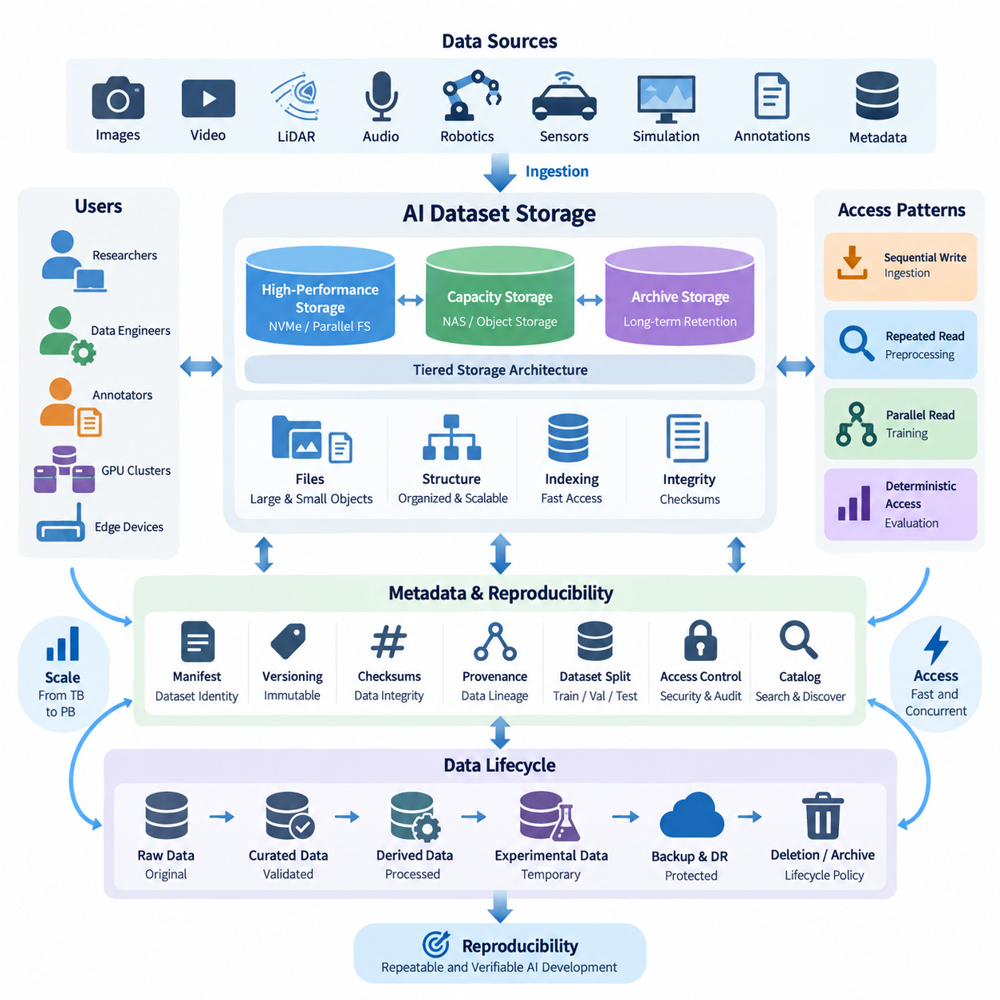
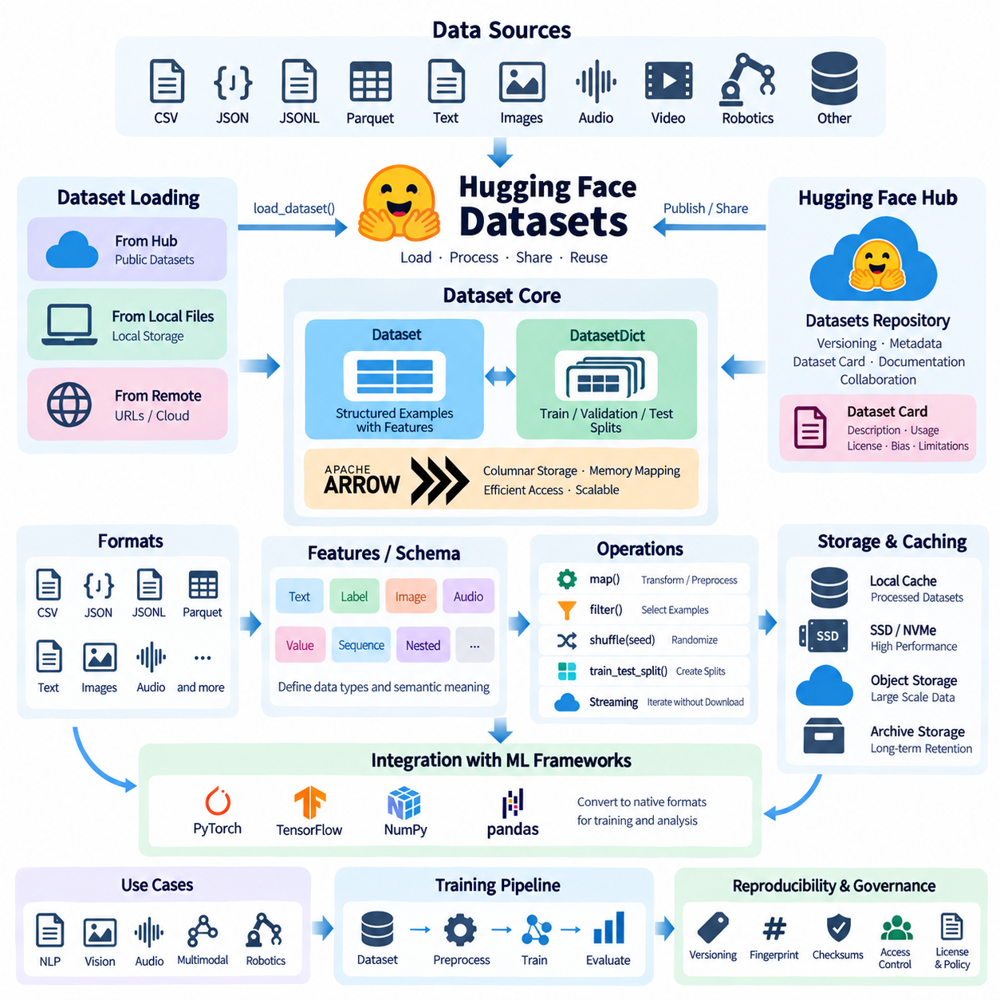
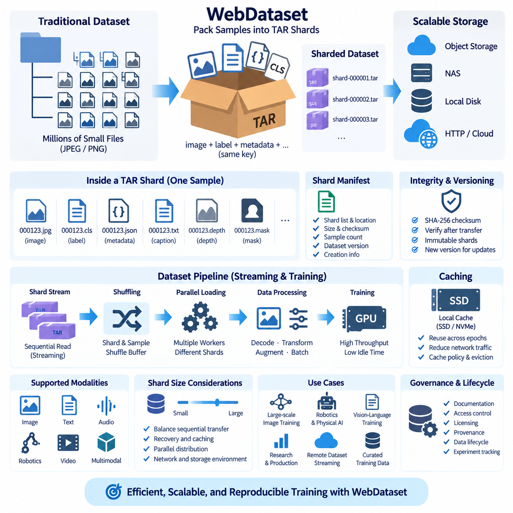
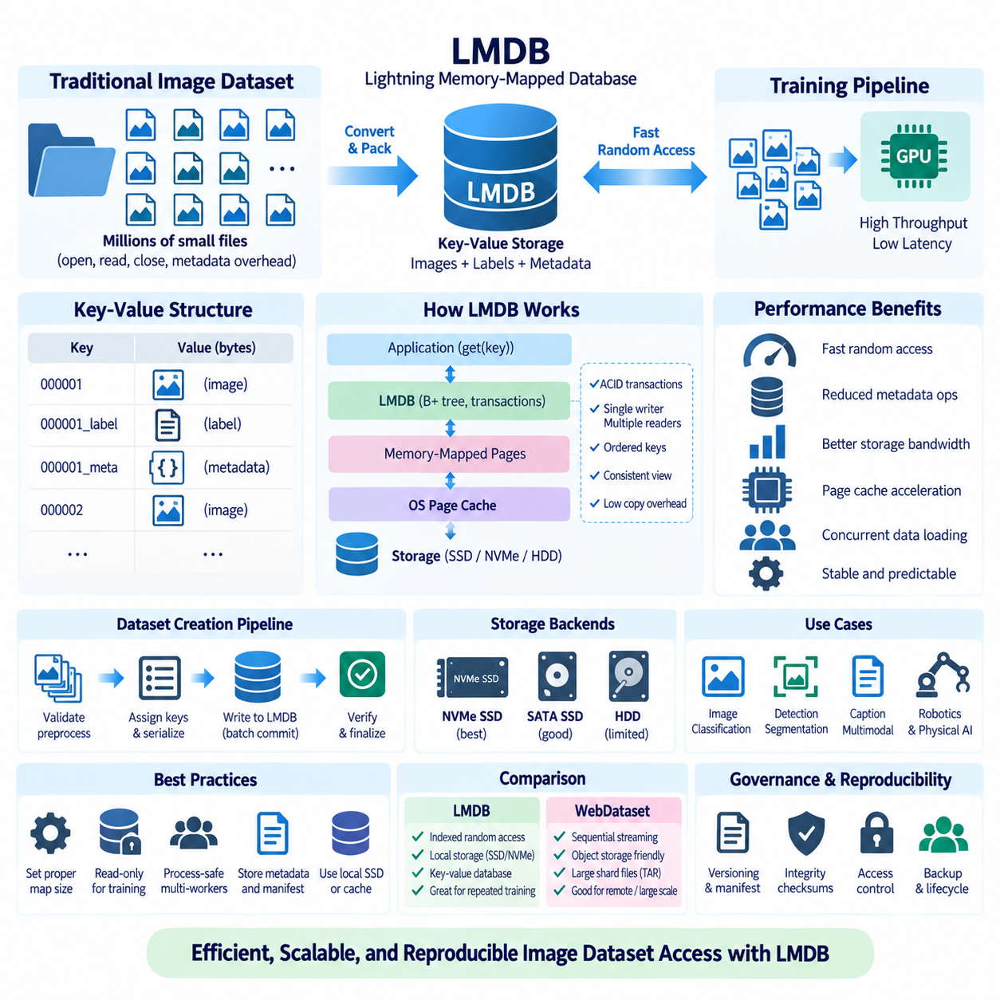
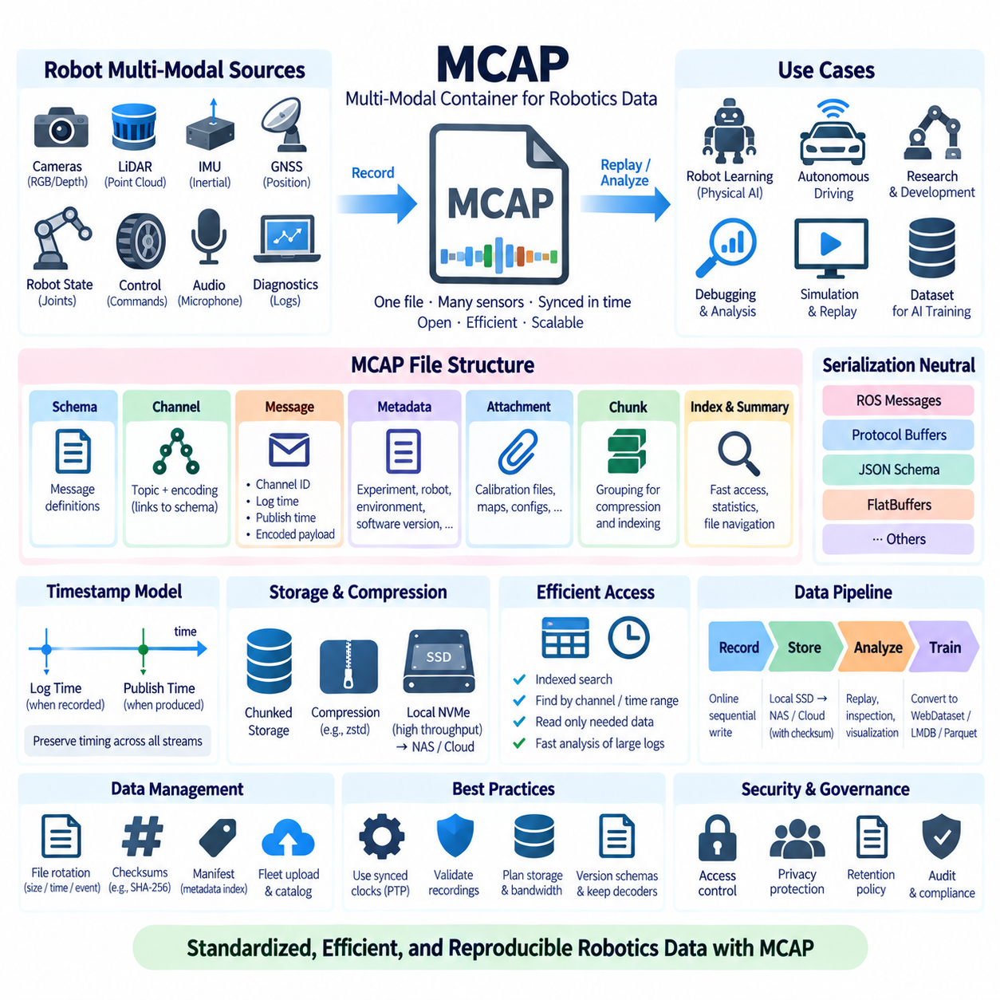
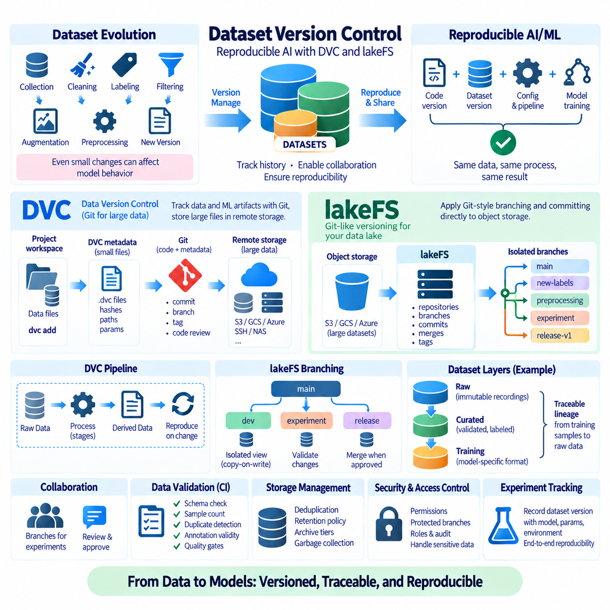
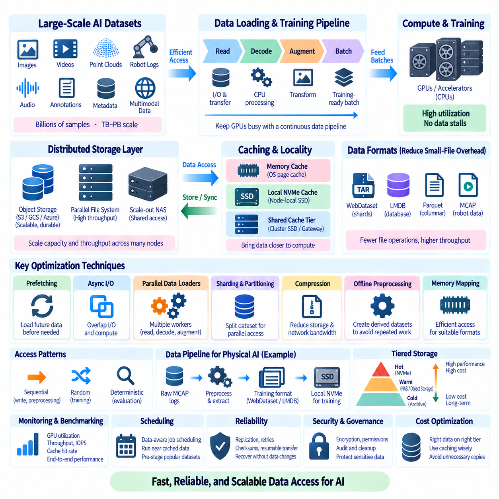
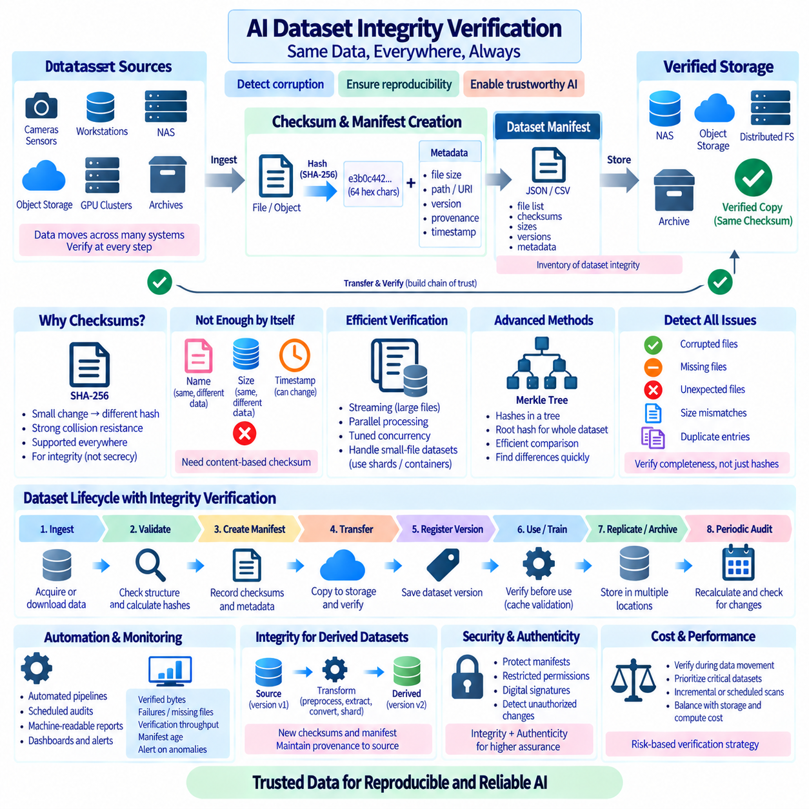
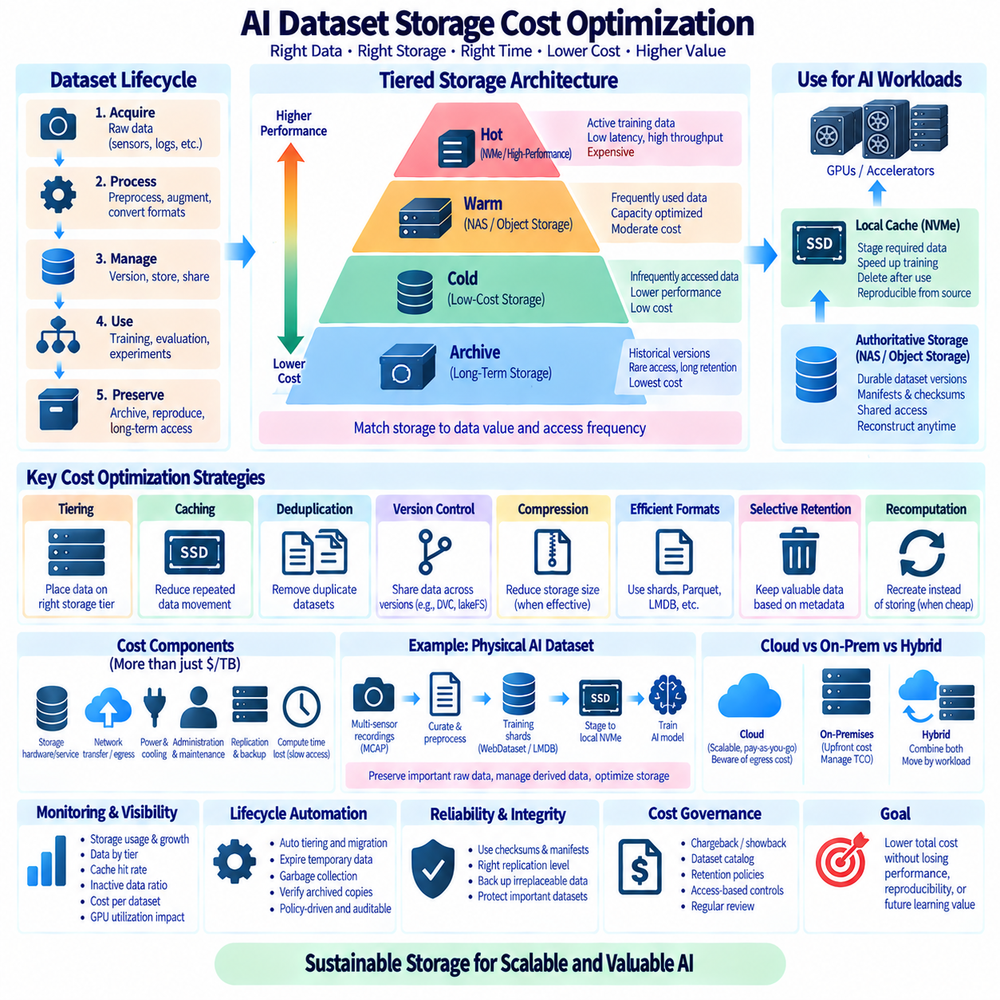
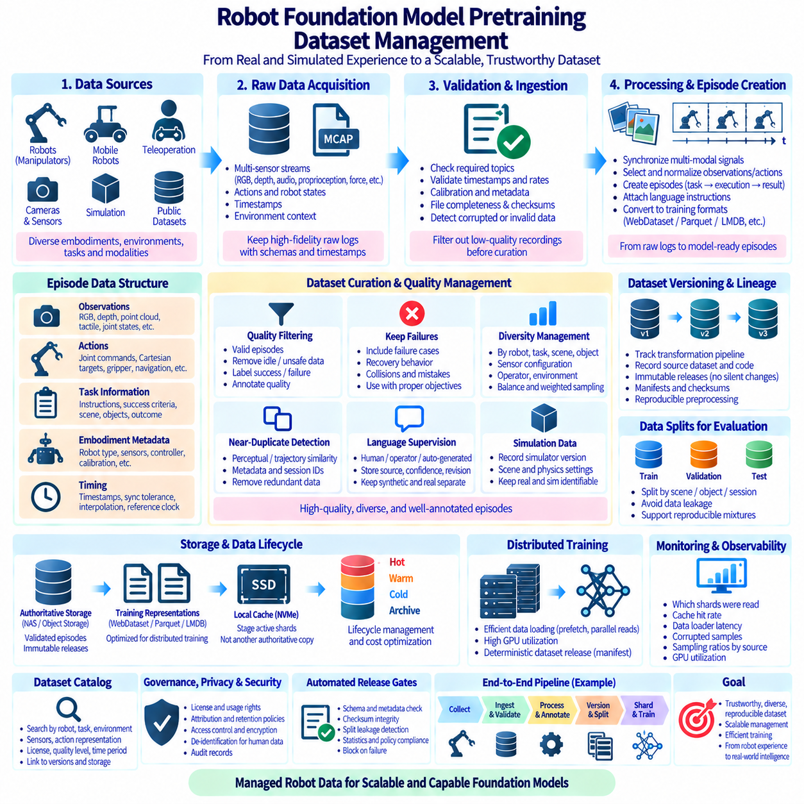

**Volume 08 Robot Database and Storage**

# 08. AI Dataset Storage

## 08.01 AI Dataset Storage Requirements: Scale, Access, Reproducibility

{width="7.268055555555556in" height="7.268055555555556in"}

AI dataset storage is fundamentally different from conventional file storage because machine learning workloads combine enormous data volume, diverse file formats, repeated experimentation, and highly variable access patterns. A storage architecture must support not only the current dataset size but also continuous growth caused by new sensor recordings, annotations, synthetic samples, derived features, checkpoints, and intermediate processing outputs.

Scale must therefore be considered as both capacity and operational scalability. A dataset repository may grow from several terabytes during early experimentation to hundreds of terabytes or multiple petabytes when autonomous systems, robots, cameras, LiDAR, simulation platforms, and digital twins continuously generate data. The architecture should allow storage capacity to expand without forcing teams to redesign directory structures, application interfaces, or training pipelines whenever additional devices are installed.

AI datasets are rarely homogeneous. A single robotics dataset can contain RGB images, depth maps, point clouds, video sequences, audio, telemetry, joint states, trajectories, annotations, calibration parameters, metadata, and simulation records. Storage systems must preserve relationships among these elements while allowing each data type to use an appropriate representation. Large binary objects and small metadata records may require very different storage and indexing strategies.

The number of files can become as important as total capacity. Millions of small images or annotation files can overwhelm metadata operations even when their combined size is moderate. Conversely, very large video archives or compressed training shards create different challenges involving throughput and parallel reads. Dataset design should therefore consider object count, average object size, directory depth, archive strategy, and expected concurrency rather than evaluating storage only by available terabytes.

Access requirements are strongly influenced by the AI workload. Data ingestion usually produces sequential writes, while preprocessing may repeatedly scan large portions of a dataset. Model training introduces highly parallel reads from multiple workers or GPUs, and evaluation may require deterministic access to a fixed subset. These patterns mean that storage performance should be evaluated using realistic pipelines rather than relying only on theoretical sequential read and write specifications.

High-performance training environments require sufficient aggregate throughput to prevent expensive accelerators from waiting for data. When multiple GPUs simultaneously request images, tensors, or training shards, a storage system that performs well for one workstation may become a bottleneck. Parallel file systems, network-attached storage, local NVMe caches, and object storage can therefore be combined into hierarchical architectures that place frequently accessed data closer to compute resources.

Latency also matters, particularly for workloads containing many small objects. A training process may issue thousands of file-open and metadata operations every second, making namespace performance and caching critical. Packaging small samples into larger containers such as tar shards, database records, or optimized dataset formats can reduce metadata overhead. However, packaging decisions should remain compatible with inspection, debugging, selective retrieval, and long-term dataset maintenance.

Access architecture must also accommodate different users and computational environments. Researchers may explore datasets interactively from workstations, preprocessing servers may perform batch transformations, GPU clusters may consume training data at high speed, and edge systems may require selected subsets for validation. A consistent namespace, API, or dataset abstraction can prevent each environment from creating independent copies whose provenance and synchronization become difficult to control.

Tiered storage provides a practical method for balancing performance and cost. Frequently used training datasets can reside on high-speed NVMe or performance-oriented NAS systems, while less active datasets remain on capacity storage or object repositories. Historical versions and rarely accessed raw data can move to archival tiers. The important principle is that movement between tiers should preserve dataset identity, metadata, checksums, and version relationships.

Reproducibility introduces requirements that conventional shared folders often fail to address. An experiment must identify exactly which data was used, including dataset version, filtering rules, preprocessing configuration, annotation revision, and train-validation-test split. A directory named "latest" cannot provide this guarantee because its contents may change. Dataset versions should therefore be immutable or explicitly versioned once they are associated with experiments or released models.

A reproducible dataset can be represented by a manifest containing stable identifiers, file locations, checksums, labels, split assignments, transformation information, and provenance. The manifest separates logical dataset identity from physical storage location. Files may later migrate from local disks to NAS or object storage while the manifest continues to describe the same dataset version, provided that integrity and identity are maintained through controlled mapping and verification.

Checksums are particularly important for large AI repositories because silent corruption, incomplete transfers, accidental replacement, and synchronization failures may otherwise remain unnoticed until training produces unexpected results. Hash values such as SHA-256 can verify files after download, migration, backup, or archival. For extremely large collections, hierarchical manifests can record checksums at object, shard, directory, and dataset levels to support efficient validation.

Provenance extends reproducibility beyond simple file integrity. Teams should know where raw data originated, when it was collected, which sensor or simulator generated it, which preprocessing pipeline transformed it, and which annotation process produced its labels. Derived datasets should maintain references to their parent datasets so that an experiment can be traced backward from a training artifact to the original observations and transformation history.

Dataset immutability does not mean that errors can never be corrected. Instead, corrections should produce a new identifiable version while preserving the previous state when required for audit or experiment reconstruction. For example, fixing mislabeled objects can generate version 1.1 from version 1.0 rather than silently replacing annotation files. Models trained on either version can then be associated with an exact and independently recoverable data state.

Reproducibility also depends on deterministic dataset partitioning. Training, validation, and test samples should not be reassigned unintentionally when data is copied or reorganized. Split information should therefore be stored as version-controlled metadata rather than inferred dynamically from mutable directory contents. This is particularly important for robotics and temporal datasets, where neighboring frames or sequences can create data leakage if partition boundaries are poorly controlled.

Security and access control must operate without undermining usability. Raw sensor datasets may contain confidential environments, human images, customer information, or proprietary operational data. Role-based permissions can distinguish administrators, dataset engineers, researchers, annotation workers, and external collaborators. Access policies should be applied at appropriate dataset or project boundaries while audit records provide visibility into important modifications, exports, and administrative operations.

Storage architecture should additionally distinguish raw, curated, derived, and experimental data. Raw data represents the closest preserved form of original acquisition and should normally receive strong protection against modification. Curated datasets contain validated and organized samples, while derived layers may include resized images, converted tensors, embeddings, augmented samples, or training shards. Experimental caches can be treated as reproducible outputs that may be deleted and regenerated when capacity is required.

Metadata becomes the connective layer across these storage classes. Instead of forcing users to remember physical paths, a dataset catalog can describe semantic properties such as sensor type, environment, task, collection date, annotation status, license, quality level, and dataset version. Searchable metadata enables researchers to discover appropriate data without scanning massive directory trees and provides the foundation for automated dataset assembly and governance.

Lifecycle management prevents AI storage from becoming an uncontrolled accumulation of duplicated files. Policies can determine when temporary preprocessing outputs expire, when inactive datasets move to lower-cost tiers, and which released datasets require long-term retention. Deduplication and content-addressable techniques may further reduce redundant storage, but deletion decisions should always consider whether an artifact can be reproduced reliably from preserved source data and processing definitions.

Backup and disaster recovery strategies must reflect dataset value rather than treating every byte identically. Irreplaceable raw recordings, manually created annotations, manifests, calibration information, and provenance metadata often deserve stronger protection than regenerable caches. Multiple copies across independent storage domains can protect critical assets, while integrity verification ensures that backups remain usable rather than merely existing as untested copies.

Hybrid architectures are often suitable for robotics and Physical AI because data moves across edge devices, laboratories, on-premise GPU systems, NAS platforms, and potentially cloud object storage. Edge systems can temporarily buffer newly collected observations, central storage can preserve authoritative datasets, and compute nodes can cache active training subsets. Clear ownership rules are necessary so that temporary replicas are not confused with authoritative dataset versions.

As dataset scale increases, storage should become part of the machine learning platform rather than remain an isolated infrastructure component. Training pipelines can resolve dataset versions automatically, verify manifests before execution, record data lineage with experiment metadata, and register newly generated artifacts after processing. This integration reduces manual path management and makes experiments portable across workstations, clusters, and future infrastructure generations.

A mature AI dataset storage strategy ultimately balances three tightly connected objectives: scale, access, and reproducibility. Scale ensures that expanding multimodal collections remain manageable, access ensures that researchers and accelerators receive data efficiently, and reproducibility ensures that every important experiment can be reconstructed from identifiable inputs. Treating these objectives together transforms storage from passive capacity into a dependable foundation for sustainable AI development.

## 08.02 HuggingFace Datasets Format and Usage [w/Code]

{width="7.268055555555556in" height="7.268055555555556in"}

Hugging Face Datasets is a library and ecosystem designed to simplify the discovery, loading, processing, sharing, and reuse of datasets for machine learning. Instead of requiring developers to manually download archives and implement custom parsers, it provides standardized interfaces through which datasets can be accessed and transformed consistently across natural language, vision, audio, multimodal, and increasingly robotics-oriented workflows.

The central abstraction is the Dataset object, which represents a structured collection of examples with defined columns and feature types. A dataset may contain text, numerical values, class labels, images, audio, arrays, identifiers, or nested structures. DatasetDict extends this model by organizing multiple logical splits, commonly train, validation, and test, under one interface so experiments can maintain consistent partition boundaries.

Many Hugging Face datasets use Apache Arrow as an underlying representation. Arrow provides a column-oriented memory format that supports efficient serialization, memory mapping, and analytical operations without repeatedly converting data into Python objects. This architecture is especially valuable for large datasets because applications can access selected portions of data without loading the entire collection into system memory.

A dataset schema is described through features that define the expected type and semantic meaning of each column. Basic fields may use strings, integers, floating-point values, or booleans, while specialized features can represent class labels, images, audio, sequences, and nested records. Explicit schemas improve consistency because downstream pipelines can determine how data should be interpreted instead of inferring structure from arbitrary files.

The library supports datasets originating from common formats such as CSV, JSON, JSON Lines, Parquet, text files, images, and audio collections. Data can therefore be converted from existing repositories into a standardized dataset interface without requiring a single universal source format. Parquet is particularly useful for large structured collections because columnar storage, compression, and selective reading can substantially improve storage and processing efficiency.

Dataset loading commonly begins with the load_dataset interface, which can retrieve a published dataset or construct one from local or remote data files. Configuration parameters can select subsets, configurations, splits, or particular source files. Once loaded, applications interact with datasets through a common API, reducing the amount of dataset-specific code required when experiments move between different data sources.

A major advantage of the format is memory-mapped access. Instead of copying an entire dataset into RAM, Arrow-backed datasets can reference data stored on disk and retrieve records when required. This allows datasets larger than available memory to remain practical on ordinary workstations. It also reduces unnecessary memory duplication when preprocessing or training pipelines repeatedly access the same underlying dataset.

Streaming provides another approach for collections that are extremely large or remotely hosted. In streaming mode, examples can be consumed progressively without first downloading the complete dataset. This is useful when datasets reach hundreds of gigabytes or terabytes, or when users need to inspect and process only part of a collection. Streaming changes some assumptions about random access, however, so algorithms must be designed appropriately.

Transformation operations allow datasets to be prepared without building completely separate manual processing systems. Functions such as map can apply tokenization, normalization, feature extraction, filtering, or metadata generation across examples. Operations can be batched or parallelized where appropriate, enabling the same conceptual preprocessing pipeline to operate on small experimental subsets and much larger production-oriented datasets.

Filtering is important because real AI repositories frequently contain samples that should not participate in every experiment. Dataset operations can select examples according to labels, metadata, quality indicators, sensor conditions, or other criteria. Combined with deterministic selection rules, filtering makes it possible to define specialized training collections while retaining a traceable relationship with a broader source dataset.

Shuffling and splitting must be handled carefully when reproducibility matters. Randomized operations should use explicit seeds so that another execution can reconstruct the same sample ordering or partition. Existing official train, validation, and test splits should normally remain identifiable rather than being silently reorganized. For temporal, robotics, or sequential data, splitting by sequence or recording session can also prevent closely related frames from leaking across evaluation boundaries.

Dataset fingerprints support reproducibility by identifying dataset states produced through transformations. When operations modify a dataset, the resulting state can be associated with information derived from the previous dataset and transformation process. This mechanism helps caching and repeated computation, although robust experimental governance should still record source revisions, preprocessing parameters, code versions, and externally maintained manifests when long-term traceability is required.

Caching is another important component of practical usage. Downloaded source material and processed Arrow representations can be stored locally so subsequent executions do not need to repeat expensive network transfers or transformations. In shared GPU environments, cache placement should be planned carefully because large datasets can quickly consume local disks. High-speed SSD or NVMe storage can be particularly useful for frequently accessed processed datasets.

The Hugging Face Hub complements the Datasets library by providing dataset repositories with version-controlled files, metadata, documentation, and collaboration mechanisms. A repository can contain data files, loading information, README documentation, dataset cards, and supporting resources. Revisions can be referenced explicitly, helping training workflows avoid relying solely on a mutable latest state when a reproducible experiment requires a known dataset revision.

Dataset cards provide human-readable documentation describing what a dataset contains and how it should be used. Useful documentation may include data sources, collection methodology, supported tasks, languages, licenses, known limitations, annotation procedures, and potential biases. Technical storage efficiency alone is insufficient for responsible dataset management because researchers also need contextual information to determine whether data is appropriate for a particular experiment.

Large datasets require special attention to repository organization. Storing millions of individual files can create inefficient metadata operations and difficult synchronization behavior. Larger shards using formats such as Parquet can reduce file counts while retaining structured access. Shard size should balance transfer efficiency, parallelism, selective retrieval, recovery from failed downloads, and compatibility with the intended training environment.

Image datasets can represent images directly through specialized image features while maintaining labels and metadata in associated columns. Depending on the storage design, image information may reference files or be represented within dataset-oriented structures. This approach allows vision pipelines to preserve relationships among images, classes, bounding-box metadata, acquisition conditions, and other attributes rather than maintaining disconnected folders and spreadsheets.

Audio and multimodal datasets follow similar principles. Audio samples can be associated with sampling information, transcripts, speaker metadata, or task labels, while multimodal records may combine text, images, audio, sensor measurements, or structured fields. For Physical AI and robotics, this model can help describe synchronized observations, actions, task states, and environmental metadata, although very large continuous sensor streams may require complementary storage architectures.

Robotics datasets introduce additional complexity because a meaningful training sample may be an episode or trajectory rather than an independent file. Camera frames, depth observations, robot states, actions, timestamps, calibration data, and task descriptions must remain aligned. Hugging Face-compatible representations can organize metadata and training-ready records, while large raw videos, point clouds, or high-frequency sensor streams may remain in external object or file storage.

Integration with machine learning frameworks makes the dataset representation useful beyond storage. Dataset records can be converted or formatted for libraries such as PyTorch, TensorFlow, NumPy, or pandas depending on the workflow. This allows a dataset to move from inspection and preprocessing into model training without repeatedly rewriting loading logic, reducing differences between exploratory notebooks and automated training pipelines.

Performance still depends on the relationship between data representation and workload. A well-structured Arrow or Parquet dataset can provide efficient access, but GPU training may remain limited if samples require expensive decoding, network transfers, or numerous random reads. Benchmarking should therefore measure end-to-end data delivery to training workers rather than assuming that a standardized dataset format automatically eliminates every storage bottleneck.

For institutional AI infrastructure, Hugging Face datasets can be incorporated into a broader data governance architecture rather than treated as isolated downloads. Organizations can maintain controlled mirrors, approved revisions, checksums, manifests, access policies, and internal dataset catalogs. Public Hub repositories can serve as acquisition sources while authoritative internal copies preserve the exact versions required for training, auditing, and long-term model maintenance.

Security and licensing remain important even when technical loading is simple. A dataset being downloadable does not automatically mean that every commercial, research, redistribution, or derivative use is permitted. Dataset metadata and documentation should therefore be reviewed together with organizational policies. Sensitive or proprietary collections may use similar technical formats while remaining inside controlled on-premise or private storage environments.

Hugging Face Datasets is most effective when viewed as a standardized data access and processing layer rather than as a replacement for every storage technology. NAS systems, object storage, NVMe caches, archival repositories, and distributed storage can continue to hold physical data, while dataset definitions provide structured logical access. This separation allows infrastructure to evolve without forcing every training application to understand physical storage details.

In a mature AI workflow, dataset format, version, transformation history, storage location, and experiment identity become connected components of one reproducible pipeline. Hugging Face Datasets provides practical mechanisms for representing, loading, transforming, caching, streaming, and sharing data within that pipeline. Combined with disciplined versioning and storage governance, it can provide a scalable bridge between raw data repositories and repeatable model development.

## 08.03 WebDataset: Large-Scale Image Dataset Efficient Storage [w/Code]

{width="7.268055555555556in" height="7.268055555555556in"}

WebDataset is a data representation and input-pipeline approach designed for efficient training on very large collections of images and other sample-oriented data. Instead of storing millions of training examples as individually opened files, it groups related samples into sequential archive shards, commonly using TAR files. This design reduces filesystem metadata overhead and makes large datasets easier to stream across local, networked, and object-based storage.

Traditional image datasets frequently organize each image as an independent JPEG or PNG file inside nested directories. This structure is convenient for human inspection but becomes inefficient when datasets contain millions or billions of objects. Training workers must repeatedly perform directory lookups, file-open operations, permission checks, and metadata requests. At large scale, these operations can become a bottleneck even when the underlying storage provides sufficient raw bandwidth.

WebDataset addresses this problem by packaging many samples into larger TAR shards. A dataset might therefore consist of hundreds or thousands of files such as shard-000001.tar, shard-000002.tar, and subsequent numbered archives. Each shard contains multiple training samples, allowing storage systems to perform relatively large sequential reads instead of continuously opening many small independent files. This improves compatibility with high-throughput machine learning workloads.

Samples are identified by a shared key. For example, one sample could contain 000123.jpg for an image, 000123.cls for a class label, and 000123.json for associated metadata. Because these files share the same base key, the input pipeline can interpret them as components of one logical training example. This convention can be extended to text captions, masks, depth maps, tensors, sensor states, or other modalities.

TAR is particularly suitable for this approach because it is a simple sequential archive format with relatively low structural overhead. WebDataset does not require a complex centralized database to describe every individual sample. Instead, samples can be read as streams from shards. This simplicity allows datasets to remain portable across ordinary disks, NAS systems, distributed filesystems, HTTP servers, and cloud-compatible object storage.

Shard size is an important architectural decision. Very small shards recreate some of the metadata and connection overhead that WebDataset is intended to reduce, while extremely large shards can make transfer recovery, caching, dataset updates, and parallel distribution less flexible. Practical shard sizes depend on sample size, network behavior, storage architecture, worker count, and operational requirements rather than following one universal value.

A useful shard should normally contain enough samples to support efficient sequential transfer while remaining manageable as an independent storage object. For image-centric datasets, shard sizes ranging from hundreds of megabytes to several gigabytes are common design choices, but benchmarking is preferable to relying on fixed assumptions. Object storage request costs, network latency, local cache capacity, and failure recovery can all influence the optimal configuration.

Streaming is one of the most important characteristics of WebDataset. Training workers can begin consuming samples as shard data arrives instead of waiting for an entire dataset to be downloaded and extracted. This is especially valuable for datasets stored remotely or for collections that are larger than local storage capacity. A GPU cluster can therefore process a rotating stream of shards while maintaining only an active cache of required data.

Sequential access also makes better use of storage bandwidth. Hard disks, network storage, and object stores generally handle sustained transfers more efficiently than huge numbers of tiny random requests. NVMe systems can tolerate random access much better, but metadata operations and distributed coordination may still become expensive at massive scale. WebDataset converts many fine-grained accesses into fewer larger transfers that are easier for infrastructure to serve efficiently.

Parallel training requires careful shard distribution. Multiple workers should receive different shards or sample sequences so that they do not repeatedly process identical data during the same training epoch. Dataset pipelines can divide shards among nodes and workers while applying controlled shuffling. This architecture is well suited to distributed GPU training because the shard itself becomes a convenient unit for data assignment and parallel consumption.

Shuffling in a streaming system differs from randomly permuting an entire in-memory dataset. WebDataset pipelines can randomize shard order and maintain sample-level shuffle buffers while reading. Larger buffers generally produce stronger mixing but require more memory. Reproducible experiments should explicitly manage random seeds, shard lists, worker configuration, and shuffle parameters because changes to these settings can alter the effective sequence of training samples.

Dataset manifests can provide a stable description of the shard collection. A manifest may record shard names, locations, byte sizes, checksums, sample counts, dataset version, and creation information. This separates the logical identity of a dataset from the physical location of its TAR files. Shards can then move between local disks, NAS, object storage, or archival systems while integrity and dataset membership remain verifiable.

Checksums are especially useful because large datasets may be transferred repeatedly between infrastructure layers. A corrupted or incomplete shard can affect thousands of training samples at once. Recording SHA-256 or another strong hash for each shard enables verification after creation, migration, download, replication, and backup. Shard-level validation is also operationally simpler than computing integrity checks across millions of individual files during routine transfers.

WebDataset can support multimodal samples rather than images alone. An autonomous robot sample might include an RGB frame, depth representation, segmentation mask, action vector, timestamp, and JSON metadata sharing a common sample key. Vision-language training can similarly combine an image with text or tokenized annotations. The important design principle is that components belonging to the same logical example remain identifiable within the archive stream.

For robotics and Physical AI, the choice of sample boundary requires additional consideration. Independent frames can be represented naturally, but many tasks depend on episodes, trajectories, or temporally synchronized observations. Shards may contain sequences or references to larger media objects while metadata describes temporal relationships. Very large continuous video, LiDAR, or high-frequency sensor streams may still benefit from specialized external formats combined with WebDataset-derived training samples.

Preprocessing often occurs before shard creation. Raw images may be validated, resized, normalized in representation, assigned labels, or paired with metadata before they are written into final training shards. Once a version is released, treating its shards as immutable simplifies reproducibility. Corrections or improved preprocessing can produce a new dataset version instead of modifying existing TAR files and silently changing previously executed experiments.

Sharding can also improve data lifecycle management. Raw data can remain in an authoritative repository while curated training samples are transformed into WebDataset archives optimized for repeated model training. These archives can be regenerated when processing logic changes, making them a derived data layer rather than the only preserved copy. This distinction is important because training-optimized representations should not replace irreplaceable original sensor or image data.

Local caching can significantly improve repeated training. Remote shards can be downloaded to SSD or NVMe storage and reused across epochs, reducing network traffic and object-store requests. Cache policies should consider capacity, dataset version, shard popularity, and eviction behavior. In multi-node environments, administrators must also decide whether caches are private to each worker, shared within a node, or coordinated across the cluster.

Object storage is a natural backend for WebDataset because each TAR shard becomes a relatively large immutable object. Systems compatible with object-oriented APIs can distribute these shards without maintaining enormous directory trees containing millions of individual images. HTTP-based delivery can also work effectively because sequential shard retrieval maps naturally to standard network transfer mechanisms and content caching infrastructure.

NAS systems can similarly benefit from sharding. Instead of serving millions of open and close operations over NFS or SMB, a NAS can provide a much smaller number of large TAR files to training nodes. This does not eliminate every network bottleneck, but it reduces metadata pressure and can improve effective throughput. Performance should still be tested under realistic numbers of simultaneous GPU workers and network connections.

Compression requires a tradeoff between storage efficiency and random or streaming accessibility. Individual image files such as JPEG are already compressed, so compressing an entire TAR archive may provide limited benefit while making selective or streaming access more complicated. Uncompressed TAR shards are therefore often practical for image datasets. Other data types may justify different compression strategies depending on redundancy, CPU cost, and access requirements.

Fault handling is easier when failures are isolated at the shard level. If one transfer fails or one archive is damaged, the system can retry, replace, or quarantine that shard rather than restarting acquisition of an entire monolithic dataset. Pipelines should still define how malformed samples are handled, because silently skipping excessive errors can change the effective training distribution and hide underlying data-quality problems.

WebDataset should not be interpreted as a complete dataset governance system. It primarily addresses efficient representation and streaming of training examples. Dataset documentation, access control, licensing, provenance, semantic catalogs, annotation history, and retention policies still require complementary mechanisms. A robust architecture combines WebDataset shards with manifests, version control, metadata services, experiment tracking, and organizational governance.

Integration with PyTorch and similar training environments allows streamed samples to pass through decoding, transformation, batching, and model input stages without first reconstructing a traditional directory hierarchy. Pipeline stages can be composed so that data flows from storage to training workers continuously. Prefetching and parallel decoding can further overlap data preparation with GPU computation, helping reduce accelerator idle time.

The performance objective is not merely maximum disk throughput but sustained delivery of training-ready batches. Measurements should include shard retrieval, decoding, augmentation, CPU utilization, network throughput, worker concurrency, and GPU waiting time. A storage benchmark showing several gigabytes per second may still produce poor model-training utilization if image decoding or preprocessing cannot keep pace with accelerator consumption.

At very large scale, WebDataset supports a useful separation between physical storage and logical training datasets. A training configuration can reference a controlled set of shard patterns or a manifest rather than millions of explicit paths. Infrastructure teams can replicate or relocate those shards while maintaining stable dataset identity. Researchers can then reproduce experiments by recording the exact shard collection and transformation configuration.

WebDataset is therefore most valuable when large sample collections create filesystem, network, or object-count bottlenecks. By transforming millions of small independent files into manageable sequential shards, it reduces metadata operations, enables efficient streaming, simplifies parallel distribution, and works naturally with hierarchical storage. Combined with versioning, manifests, checksums, caching, and disciplined preprocessing, it provides a scalable storage layer for large AI training datasets.

## 08.04 LMDB: Fast Image Dataset Access [w/Code]

{width="7.268055555555556in" height="7.268055555555556in"}

LMDB, or Lightning Memory-Mapped Database, is an embedded key-value database frequently used to improve access to large image datasets. Instead of storing millions of images as individually opened files, applications can place encoded images, labels, and metadata into a database and retrieve them through compact keys. This reduces repeated filesystem metadata operations and provides a predictable interface for high-frequency training data access.

Conventional image folders work well for small and medium collections because files remain easy to inspect and manipulate. At larger scale, however, training workers may perform enormous numbers of open, read, close, directory lookup, and metadata operations. These operations can become expensive on local disks and even more problematic over shared network storage, causing CPUs or GPUs to wait despite apparently sufficient storage bandwidth.

LMDB addresses this problem by presenting dataset records through a memory-mapped database environment. The operating system maps database pages into virtual memory, allowing frequently accessed pages to benefit naturally from the filesystem page cache. Applications request values using keys while LMDB and the operating system manage page access. This architecture can reduce copying and avoid much of the overhead associated with repeatedly opening independent files.

A typical image dataset can use sequential identifiers or stable sample IDs as keys. A value may contain a JPEG or PNG byte stream, while separate keys can store labels, dimensions, annotations, or metadata. Another design serializes an entire logical sample into one value. The appropriate schema depends on whether training usually requires all components together or frequently accesses individual metadata fields independently.

LMDB is based on a B+ tree and provides ordered key-value access with ACID transaction semantics. Reads occur through transactions that provide a consistent database view. The database uses a single-writer, multiple-reader model, meaning many readers can operate concurrently while only one write transaction modifies the environment at a time. This behavior fits training datasets particularly well because they are commonly written once and read repeatedly.

The single-writer model should influence dataset construction. Instead of allowing many preprocessing workers to write independently to the same environment without coordination, a common pattern is to preprocess samples in parallel and funnel finalized records through a controlled writer. After database creation and validation, the training dataset can be treated as immutable, simplifying concurrency, reproducibility, backup, and deployment.

Read transactions are lightweight, but application design must still manage them correctly. Long-lived transactions retain a consistent snapshot and may prevent old database pages from being reclaimed while writes continue. For read-only training datasets this is usually less problematic because the database does not change during training. Nevertheless, transaction lifetime and worker initialization should be deliberately designed rather than hidden inside uncontrolled global state.

LMDB environments have a configured map size that defines the maximum address-space range available to the database. Dataset builders must choose a value large enough to accommodate expected records and database overhead. On 64-bit systems, a generous map size can often be reserved because virtual address space is much larger than physical storage, but the configured value should still reflect platform constraints and deployment practices.

Data preparation normally begins by enumerating source images and validating them before insertion. Corrupt images, inconsistent labels, missing annotations, and duplicate identifiers should ideally be detected before finalizing the database. Each accepted sample receives a deterministic key and is written inside a transaction. Large ingestion jobs can commit records in batches rather than placing the entire construction process inside one extremely large transaction.

Metadata describing the database itself is also valuable. Special records or an external manifest can preserve the number of samples, schema version, class mapping, source dataset revision, preprocessing parameters, creation date, and checksums. Without this information, a fast database may still be difficult to reproduce. Storage performance should therefore be combined with explicit dataset identity and provenance rather than treated as an isolated objective.

For image training, LMDB commonly stores compressed image bytes rather than fully decoded tensors. JPEG or PNG data consumes less storage and I/O bandwidth, while decoding occurs after retrieval. Alternatively, preprocessed arrays can be stored when decoding cost dominates and capacity is less constrained. The correct choice depends on the balance among storage space, I/O throughput, CPU decoding capacity, augmentation requirements, and GPU consumption rate.

Random access is one of LMDB\'s important advantages for machine learning. A training loader can generate shuffled sample indices, convert them to keys, and retrieve corresponding values without scanning a large archive sequentially. This makes LMDB suitable for workloads that require repeated random sampling, balanced class sampling, hard-example mining, or deterministic access to individual records during evaluation.

Sequential access can also perform efficiently because nearby database pages may benefit from operating-system readahead and caching. Dataset builders that use orderly keys can provide predictable traversal, although physical page placement is ultimately controlled by the database structure and update history. For immutable training datasets created in a controlled process, access behavior is generally easier to characterize than for frequently modified transactional databases.

Multi-process data loading requires attention to how LMDB environments are opened. Deep-learning frameworks commonly launch several worker processes to prepare batches concurrently. Rather than blindly sharing arbitrary database objects created before worker startup, implementations should open or initialize read access in a process-safe manner appropriate to the framework and platform. Read-only options can also avoid unnecessary locking or write-related behavior.

When the dataset fits substantially within available memory, repeated epochs can become very fast because database pages remain in the operating system page cache. This does not mean that LMDB copies the entire database into RAM. Memory mapping allows the operating system to decide which pages remain resident and which are evicted. Consequently, performance depends on working-set size, RAM capacity, competing workloads, and underlying storage speed.

NVMe SSDs are particularly effective backends for LMDB because their low latency and strong random-read performance complement key-based sample retrieval. SATA SSDs can also provide good results for many workloads. Hard disks may benefit from reduced file metadata activity but remain limited by mechanical random access when the working set is not cached. Storage benchmarks should therefore reflect the actual dataset size and sampling pattern.

Using LMDB over network filesystems requires more caution than using it on local storage. Memory-mapped database semantics, filesystem locking, consistency behavior, and network failure characteristics may not match LMDB\'s expected operating environment. A safer architecture for many training systems is to maintain authoritative datasets on centralized storage and stage validated LMDB copies onto local SSD or NVMe storage before intensive training.

LMDB differs conceptually from shard-streaming formats such as WebDataset. WebDataset is naturally suited to large sequential transfers, remote streaming, and object storage, while LMDB provides indexed key-value access and efficient random retrieval from a database environment. Neither approach is universally superior. The workload, storage backend, dataset scale, network topology, and required access pattern determine which representation is more appropriate.

For example, a massive dataset stored in cloud object storage may benefit from sequential shard streaming because downloading one large object is more natural than performing fine-grained database-style reads. A laboratory workstation repeatedly training on a locally staged image dataset may benefit strongly from LMDB. Hybrid architectures can also convert authoritative raw data into either LMDB databases or WebDataset shards according to the target compute environment.

LMDB can store more than image bytes. Classification labels, bounding boxes, segmentation metadata, captions, embeddings, calibration parameters, or serialized multimodal records can be associated with each key. However, very large continuous videos, point clouds, and high-frequency robotics streams may be better maintained in specialized source formats, with LMDB containing selected training samples, indexes, or compact derived representations.

Robotics and Physical AI workloads can use LMDB when training requires rapid random access to extracted observations. RGB frames, depth images, state vectors, actions, task identifiers, and timestamps can be serialized into sample records or coordinated through related keys. Care must be taken to preserve episode and trajectory boundaries because random access efficiency should not destroy the temporal relationships required by sequential learning tasks.

Reproducibility is improved when a completed LMDB dataset is treated as a versioned artifact. Once training begins, records should not be silently modified in place. Changes to labels, preprocessing, filtering, or sample membership should generate a new database version. A manifest can associate that version with source data, code revision, configuration, sample count, and integrity information so earlier experiments remain reconstructable.

Integrity verification can operate at several levels. Source files can be checked before database creation, individual records can carry identifiers or hashes, and completed database files can be validated after transfer. For large environments, file-level checksums provide a straightforward way to verify staged copies. Backup procedures should include all files required by the LMDB environment rather than copying only a partially selected component.

Capacity planning must account for more than the original image sizes. Database pages, keys, metadata, alignment, and free-space behavior contribute overhead, while storing decoded or serialized arrays may greatly increase capacity requirements. A pilot conversion of a representative subset can provide realistic estimates before processing a multi-terabyte collection. Sufficient temporary storage should also be reserved for construction, validation, and migration.

Database creation speed is usually less important than sustained training performance because an immutable training database may be built once and consumed for many epochs or experiments. Nevertheless, construction pipelines should support restartability and validation. If preprocessing fails near the end of a very large conversion, operators should be able to identify completed input ranges and rebuild deterministically rather than manually guessing which records are valid.

Caching and staging policies can further improve cluster efficiency. A central NAS or object repository can preserve canonical source datasets while individual training nodes maintain local LMDB versions optimized for their experiments. Version identifiers and checksums allow nodes to determine whether the required database is already cached. Older versions can be evicted according to capacity policies without compromising the authoritative source data.

Security and governance remain separate from raw access speed. An LMDB file containing sensitive images is still sensitive even though records are accessed through keys rather than filenames. File permissions, encryption at rest where appropriate, controlled staging, audit mechanisms, retention rules, and dataset licensing should therefore remain part of the surrounding storage architecture. Database packaging does not replace organizational data controls.

Performance evaluation should measure the complete training input path rather than LMDB lookup latency alone. Important measurements include records per second, effective image throughput, decoding time, augmentation cost, worker utilization, page-cache behavior, storage latency, and GPU idle time. Increasing the number of loader workers is useful only until CPU, memory, storage, or synchronization becomes the new bottleneck.

LMDB is therefore most valuable when a workload repeatedly accesses a large, mostly immutable dataset through many random or indexed reads. By combining memory-mapped access, transactional consistency, compact key-value retrieval, and efficient concurrent readers, it can substantially reduce the overhead of conventional image directories. Used with local SSD or NVMe staging, deterministic dataset construction, versioning, and integrity validation, LMDB provides a robust high-speed storage layer for AI training data.

## 08.05 MCAP Format: Robot Multi-Modal Data Storage Standard [w/Code]

{width="7.268055555555556in" height="7.268055555555556in"}

MCAP is an open container format designed for recording timestamped, heterogeneous message streams produced by robotics and other data-intensive systems. A single file can preserve messages from cameras, LiDAR, IMUs, GNSS receivers, robot states, control systems, and application software while maintaining the timing and channel information required to reconstruct an experiment, mission, or robot operation.

Robotic data differs from conventional image or tabular datasets because observations are generated continuously by multiple asynchronous sources. Cameras may operate at tens of frames per second, IMUs at hundreds of hertz, and control or diagnostic topics at independent rates. A useful recording format must therefore preserve not only payloads but also timestamps, topic relationships, schemas, and ordering across heterogeneous streams.

MCAP organizes information around records describing schemas, channels, messages, metadata, attachments, statistics, indexes, and other structural elements. A schema describes how a message payload should be interpreted, while a channel associates messages with a topic and encoding. This separation allows many messages to reuse common structural definitions instead of repeatedly embedding descriptive information in every individual sample.

Messages form the central time-series data records. Each message is associated with a channel and includes timing information together with its encoded payload. MCAP distinguishes log time, representing when the recording system considers the message to have occurred, from publish time, which can represent when the producer published it. Preserving these values helps downstream systems analyze timing relationships and reconstruct recorded behavior.

The format is intentionally serialization-neutral. MCAP can store payloads encoded using different serialization technologies as long as the associated schema and channel information describe how those bytes should be interpreted. This allows it to support ecosystems using ROS message encodings, Protocol Buffers, JSON Schema, FlatBuffers, or other representations without forcing every robotics platform to adopt one universal application-level message definition.

This separation between container and message encoding is important for long-lived robotics infrastructure. Sensor interfaces, middleware, and software frameworks can evolve while the container remains stable. A recording platform can therefore preserve different message families inside a common file structure, while analysis tools inspect the channel and schema metadata to select the appropriate decoder for each stream.

MCAP is particularly relevant to ROS environments because robotics experiments often involve many synchronized topics. Camera images, transforms, joint states, navigation outputs, point clouds, commands, and diagnostics can be recorded together while retaining topic identity and timestamps. MCAP has also been adopted in ROS 2 tooling as a storage option, allowing recorded data to participate in rosbag-oriented workflows while using the MCAP container.

A multimodal robot recording may contain RGB and depth cameras, LiDAR point clouds, radar observations, IMU measurements, wheel odometry, GNSS positions, actuator states, battery telemetry, planner outputs, and operator commands. Keeping these streams in a coordinated container reduces the risk that independently stored files lose synchronization or require fragile filename conventions to reconstruct temporal relationships.

Timestamp quality remains essential even when the container preserves time accurately. MCAP can record timestamps supplied by the surrounding system, but it cannot correct clocks that were poorly synchronized during acquisition. Robotics platforms using PTP, gPTP, GNSS-derived timing, hardware triggers, or carefully managed system clocks should preserve clock-domain and synchronization metadata so later analysis can distinguish recording accuracy from sensor timing uncertainty.

Chunking is an important mechanism for organizing large recordings. Messages can be grouped into chunks that improve storage management and support compression and indexing. Instead of treating a multi-hour robot mission as an unstructured sequence of individual records, chunked organization provides larger logical units that can be compressed, scanned, indexed, and recovered more efficiently while retaining message-level timing information.

Compression can reduce storage requirements for suitable data. MCAP supports compressed chunks through supported compression mechanisms, but the practical benefit depends on payload characteristics. Already compressed JPEG or H.264 data may gain relatively little from additional compression, whereas structured telemetry or uncompressed sensor records may compress substantially. CPU cost, write throughput, read latency, and storage capacity should therefore be evaluated together.

Indexes enable efficient access without requiring applications to scan an entire recording from the beginning. Depending on how a file is written and indexed, tools can locate channels, chunks, and time ranges more efficiently. This is particularly useful for large robot logs when engineers need only a short interval surrounding a failure, collision, localization anomaly, or perception event rather than several hours of unrelated operation.

The summary section can contain indexes, statistics, and other information that helps readers understand and navigate a completed file. This structure supports efficient post-recording analysis because tools can inspect high-level information before reading all message payloads. When recordings are finalized correctly, the resulting file can serve both sequential replay workloads and selective investigation of particular channels or time windows.

Metadata records provide a mechanism for storing contextual information that does not naturally belong to individual high-rate messages. A robotics dataset can associate a recording with robot identity, mission identifier, environment, software version, calibration revision, operator information, or experimental configuration. Consistent metadata conventions are important because a technically valid recording without contextual information may still be difficult to interpret months later.

Attachments can preserve supporting files alongside recorded message streams. Examples include calibration files, configuration snapshots, maps, mission descriptions, or other artifacts required to interpret the recording. Whether an organization stores these directly as attachments or references externally managed artifacts depends on governance requirements, but their relationship to the recording should remain explicit and reproducible.

MCAP supports sequential writing, which is essential for online robot data acquisition. A recorder can append messages as the robot operates rather than knowing the final file contents in advance. This makes the format suitable for long-running missions, autonomous vehicle tests, laboratory experiments, and fleet data collection. Recorder design must still ensure that storage throughput is sufficient for the aggregate sensor data rate.

Write bandwidth can become demanding when multiple high-resolution sensors operate simultaneously. Several cameras, dense LiDAR, radar, audio, and high-frequency state streams may collectively produce hundreds of megabytes per second before compression. Storage planning should therefore calculate sustained aggregate data rate, peak bursts, recording duration, and safety margin rather than selecting a drive solely from its advertised maximum sequential throughput.

Fast local NVMe storage is often appropriate for high-bandwidth acquisition because it can absorb large sequential writes with low latency. Completed MCAP recordings can later be transferred to NAS, object storage, or archival infrastructure. This separation between acquisition storage and long-term storage reduces the risk that temporary network congestion interrupts sensor recording while still allowing centralized dataset management after a mission is complete.

Large missions may be divided into multiple MCAP files rather than producing one enormous recording. File rotation can be based on duration, size, mission phase, or operational events. Smaller files simplify transfer, verification, parallel processing, and fault isolation, while overly small files create additional metadata overhead. A fleet data architecture should define deterministic naming and manifest rules that connect rotated files to one logical session.

Integrity management is important because one MCAP file may contain many sensor streams that would be expensive or impossible to recollect. File checksums such as SHA-256 can verify recordings after transfer, replication, or archival. Dataset manifests can record file names, sizes, checksums, mission IDs, time ranges, robot identifiers, and software versions so that large collections remain auditable even after physical files move between storage systems.

Recovery behavior also matters for field robotics. Power loss, process termination, or storage failure may interrupt a recording before normal finalization. MCAP\'s structure and available tooling can support recovery-oriented workflows, but acquisition systems should explicitly test interrupted-write scenarios. A theoretically recoverable format is not sufficient unless the organization\'s recorder, filesystem, and operational procedures have been validated under realistic failures.

Replay is one of the most valuable capabilities of structured robot recordings. Recorded topics can be fed back into perception, localization, planning, or diagnostic software to reproduce conditions observed during operation. Engineers can test a new algorithm against exactly the same sensor sequence, compare software revisions, or investigate failures without repeating the physical mission, improving both development efficiency and experimental repeatability.

For AI development, MCAP is particularly useful as an authoritative raw or near-raw multimodal recording layer. Training pipelines can extract synchronized frames, point clouds, state-action pairs, trajectories, or event windows from MCAP files and convert them into formats optimized for model training. WebDataset, LMDB, Parquet, or tensor-oriented formats may then serve as derived training representations while MCAP preserves the original temporal context.

This distinction between acquisition format and training format is important. A format optimized for robot recording must preserve timing, schemas, and heterogeneous streams, whereas a format optimized for GPU training prioritizes batch throughput and randomized sample access. Attempting to force one representation to solve both problems can create unnecessary compromises. MCAP can preserve source truth while downstream datasets are specialized for particular learning tasks.

Physical AI datasets benefit from this layered architecture because observations and actions must often remain temporally aligned. A robot-learning pipeline may need camera frames, proprioception, commands, force measurements, and task annotations from the same interval. MCAP preserves the recorded streams and their timing relationships, while an extraction pipeline can construct episodes or trajectories with deterministic rules documented in a dataset manifest.

Fleet-scale collection introduces additional requirements. Hundreds of robots can produce many recordings per day, making file naming, upload state, metadata indexing, retention, and dataset selection important operational concerns. A central catalog can index MCAP metadata without immediately decoding every payload, enabling engineers to search by robot, mission, software version, sensor configuration, location category, or time range before selecting recordings for analysis.

Security and privacy must be applied at the storage-system level as well as the file level. Robot recordings may contain images of people, customer environments, facility layouts, geographic information, or proprietary operational data. Access control, encryption, retention policies, audit logging, and controlled export procedures should therefore accompany MCAP repositories. An open file specification does not imply that recorded content should be openly accessible.

Schema evolution requires disciplined management. Software updates may introduce new fields, change message definitions, or add channels. Because MCAP records schema and channel information, files can remain self-describing at the container level, but downstream applications must still understand the corresponding schema versions. Organizations should preserve schema definitions and decoder compatibility instead of assuming future software will automatically understand every historical message.

Long-term preservation should include more than the MCAP files themselves. Decoder software, schema definitions, calibration data, configuration files, manifests, and documentation may all be required to interpret historical recordings accurately. Container stability is valuable, but durable reproducibility depends on preserving the semantic context around the bytes. Version-controlled supporting artifacts therefore form an important part of the dataset archive.

MCAP is consequently best understood as a standardized container layer for timestamped multimodal robotics data rather than simply another image dataset format. It combines heterogeneous channels, schemas, timestamps, chunking, compression, indexing, metadata, and attachments within a structure suitable for recording and replay. These capabilities make it a strong foundation for managing complex sensor and software streams generated by modern robots.

When combined with synchronized clocks, high-throughput acquisition storage, checksums, manifests, versioned schemas, centralized catalogs, and derived AI training formats, MCAP can connect physical robot operation with reproducible data engineering. It provides a durable boundary between raw multimodal acquisition and downstream analytics, simulation, replay, and machine learning, making it an important storage standard for scalable robotics and Physical AI data pipelines.

## 08.06 Dataset Version Control: DVC / LakeFS [w/Code]

{width="7.268055555555556in" height="7.268055555555556in"}

Dataset version control applies software-engineering principles such as versioning, reproducibility, branching, history, and traceability to data used for artificial intelligence and machine learning. Unlike source code, datasets can contain millions of files and terabytes or petabytes of content, so ordinary Git repositories are usually unsuitable for storing the data itself. Tools such as DVC and lakeFS address this problem through complementary version-control architectures.

AI datasets change continuously during collection, cleaning, labeling, filtering, augmentation, and preprocessing. Even a small modification can alter model behavior because the effective training distribution has changed. Recording only the model source code is therefore insufficient for reproducibility. A reliable experiment must identify the exact dataset version, preprocessing logic, configuration, model code, and training parameters that produced a particular result.

Dataset identity should be treated as an explicit engineering artifact rather than an informal directory name such as dataset_final_v3_new. A version should represent a known collection of data and associated metadata that can be referenced later. Stable identifiers, commits, tags, manifests, checksums, and provenance records allow engineers to determine exactly which samples participated in training, evaluation, validation, or deployment qualification.

DVC, or Data Version Control, extends Git-oriented workflows to large datasets and machine-learning artifacts. Instead of committing large data files directly into Git, DVC stores lightweight metadata describing those files while the actual content resides in separate storage. Git then versions the DVC metadata together with source code, enabling a code commit to be associated with a specific state of the dataset.

A DVC-tracked file or directory is represented through metadata containing information required to identify its content. Content hashes allow DVC to detect changes and associate logical paths with stored objects. Large datasets can therefore remain outside the Git object database while developers continue using familiar operations such as branches, commits, tags, checkout-oriented workflows, and code review for the lightweight metadata.

DVC remote storage provides the shared data layer used by multiple workstations, servers, or training nodes. Depending on the environment, the remote can be located on cloud object storage, SSH-accessible storage, network storage, or another supported backend. Developers exchange small metadata through Git while DVC transfers the corresponding large data objects between local workspaces and configured remote storage when required.

This separation is valuable because source code and data have very different storage characteristics. Source files are usually small and benefit from line-oriented diffs, whereas datasets may contain large binary images, videos, tensors, archives, or robot logs. DVC allows Git to remain focused on code and metadata while specialized storage infrastructure handles the volume and throughput requirements of training data.

A typical workflow begins with raw or curated data in a project workspace. The dataset is added to DVC, producing metadata that is committed to Git. Data objects are pushed to a DVC remote, while the Git repository preserves the reference. Another machine can clone the code repository, select the required Git revision, and retrieve the corresponding dataset objects, helping reconstruct the original experiment environment.

DVC can also describe data-processing pipelines. Pipeline stages define dependencies, commands, parameters, and outputs so that derived datasets can be connected to their source data and transformation logic. When a dependency or parameter changes, affected stages can be identified and reproduced. This transforms dataset preparation from an undocumented sequence of scripts into a more explicit and repeatable computational workflow.

Reproducible pipelines are especially important when preprocessing includes resizing, filtering, annotation conversion, train-validation splitting, feature extraction, or multimodal synchronization. A final training directory alone does not explain how its contents were produced. Recording dependencies and transformation stages allows teams to connect derived artifacts with the raw inputs, software revisions, and parameters that generated them.

DVC is particularly suitable for project-oriented machine-learning workflows where datasets and experiments are closely associated with Git repositories. Individual researchers or small teams can adopt it without replacing their entire storage architecture. It is useful when developers want data versions to follow software branches and commits while storing large artifacts on infrastructure better suited to binary data.

lakeFS approaches dataset version control from a different architectural direction. Rather than extending a local Git workflow with external data objects, lakeFS provides Git-like versioning semantics over data stored in object-storage environments. It introduces concepts such as repositories, branches, commits, merges, and tags for large collections of objects, allowing data engineering workflows to operate against isolated logical versions.

A lakeFS branch can provide an isolated view of data without requiring users to duplicate an entire multi-terabyte dataset immediately. Data engineers can write new or modified objects into a branch, validate the resulting state, and later commit or merge approved changes. This copy-on-write-oriented model makes branching practical for large data lakes where physically copying every object for each experiment would be prohibitively expensive.

Branching is valuable for dataset preparation because experimental transformations should not immediately modify production or authoritative data. A team can create a branch for new labels, filtering rules, preprocessing logic, or dataset imports. Validation jobs can inspect the resulting version, and only accepted changes are merged into the main dataset lineage. Failed experiments can be discarded without contaminating the stable dataset state.

Commits provide immutable reference points representing a known state of the versioned data. Training jobs can record a lakeFS commit identifier rather than referring only to a mutable object-storage path. This makes later reproduction more reliable because the logical dataset reference does not silently change when new objects are added or existing data is replaced through subsequent workflows.

Tags can assign human-readable names to important immutable versions. For example, a dataset approved for a model release can be associated with a release-oriented tag while development continues on newer branches. Tags are useful for production qualification, benchmarking, regulatory evidence, or long-running experiments because they provide stable references to specific committed states rather than moving development branches.

lakeFS is especially useful in centralized data platforms built around object storage. Large organizations may maintain raw, curated, labeled, and training-ready zones containing enormous numbers of objects. Applying versioning at the data-lake layer allows multiple analytics, ETL, machine-learning, and validation systems to share consistent dataset versions without requiring every application to implement independent snapshot logic.

The difference between DVC and lakeFS is therefore primarily architectural rather than simply functional. DVC integrates naturally with Git-centric machine-learning projects and tracks large files through metadata plus external storage. lakeFS places version-control semantics closer to the object-storage data platform itself. Teams can choose either approach or combine them when project-level reproducibility and platform-level data versioning are both required.

In a combined architecture, lakeFS can manage authoritative datasets and transformations in centralized object storage while DVC records project-specific references, derived artifacts, parameters, and experiment dependencies. The exact integration should remain simple enough to operate reliably. Introducing two versioning layers without clearly defining responsibility can create confusion about which identifier represents the authoritative dataset state.

Checksums and content hashes are fundamental to trustworthy version control. A filename alone does not prove that two datasets contain identical bytes. Hash-based identification can detect modifications, corruption, or unexpected replacement. At large scale, systems may use hashes differently internally, but dataset manifests should still provide verifiable relationships among logical versions, physical objects, and transferred copies.

Version control should also preserve provenance. A dataset version is more useful when engineers know where its data originated, which ingestion process created it, what transformations were applied, which annotation revision was used, and who or what process approved the resulting state. Provenance transforms a version identifier from a technical snapshot into an auditable record of the dataset lifecycle.

Raw data should normally be treated as immutable whenever practical. Instead of overwriting original sensor recordings, images, or externally acquired datasets, processing stages should create new curated or derived versions. This preserves the ability to reproduce previous results and apply improved processing algorithms later. Version-control systems are most effective when they reinforce this append-and-derive model rather than legitimizing uncontrolled mutation.

Robotics and Physical AI increase the importance of dataset lineage because data often passes through several representations. Raw MCAP recordings may be synchronized and segmented into episodes, images may be extracted and annotated, trajectories may be filtered, and final samples may be converted into WebDataset, LMDB, Parquet, or tensor formats. Each transformation should remain traceable to the original recording and processing configuration.

A Physical AI dataset can therefore use layered versioning. The acquisition layer preserves immutable robot recordings, a curated layer identifies validated missions or episodes, and a training layer contains model-specific representations. Version identifiers and manifests connect these layers so an unexpected model behavior can be traced backward from a training sample to its processed episode and ultimately to the original robot recording.

Train, validation, and test splits must also be versioned. Changing a split can alter reported model performance even when individual samples remain unchanged. Split definitions should therefore be stored as explicit artifacts rather than regenerated with uncontrolled random operations. Stable sample identifiers and recorded random seeds allow the same partitioning to be reconstructed and inspected across experiments.

Dataset version control also supports collaboration. Multiple researchers can experiment with different preprocessing rules without exchanging manually named archive files. Branches or project revisions communicate the intended state, while commits establish reviewable checkpoints. Teams can compare metadata, pipeline definitions, sample counts, or validation reports before accepting a new dataset version into a shared production workflow.

Continuous integration concepts can be extended to data changes. Before a dataset branch or revision is accepted, automated checks can verify schema compatibility, sample counts, duplicate rates, missing fields, class distributions, corruption, annotation validity, and required metadata. Dataset changes can therefore pass through quality gates similar to software changes, reducing the risk that malformed data silently enters expensive training jobs.

Versioning does not eliminate the need for storage lifecycle management. Historical dataset states can consume substantial capacity, especially when transformations generate new binary objects. Deduplication, copy-on-write behavior, content-addressed storage, retention policies, archival tiers, and garbage collection help control growth. Organizations should distinguish versions that must remain reproducible from temporary experimental states that can eventually be removed.

Access control must also align with versioning. A user permitted to create an experimental branch should not automatically gain authority to modify or promote production datasets. Storage permissions, repository roles, protected branches, review processes, and service identities can separate experimentation from approved changes. This is especially important when datasets contain confidential, licensed, customer, or safety-critical information.

Backup and version control solve different problems. Version control preserves logical history, but it does not automatically protect against infrastructure loss, credential compromise, accidental repository deletion, or storage-system failure. Critical dataset repositories still require replication, backups, integrity verification, and disaster-recovery procedures. A version history that exists only on one storage system remains a single point of failure.

Performance considerations are also important. Training jobs should not repeatedly reconstruct huge datasets across slow networks simply because version control can identify them. Frequently used versions can be staged or cached on local NVMe storage while their authoritative identity remains in DVC or lakeFS. The cache is disposable; the versioned repository and metadata determine which data should be restored when needed.

Experiment tracking becomes more powerful when dataset versions are recorded alongside model artifacts. A training run should ideally capture source-code commit, dataset version, pipeline configuration, hyperparameters, environment information, and resulting model identifier. When a model reaches deployment, these references create a reproducibility chain connecting production behavior to the exact data and software used during training.

Dataset version control is therefore not merely a mechanism for keeping old copies of files. It establishes a controlled relationship among data identity, history, transformations, experiments, and storage infrastructure. DVC provides a practical Git-oriented approach for project-level machine-learning workflows, while lakeFS brings Git-like branching and committing to large object-storage data platforms.

When combined with immutable raw data, manifests, hashes, reproducible pipelines, automated validation, access control, experiment tracking, and reliable backup, DVC and lakeFS can form important components of a scalable AI data architecture. Their central value is the ability to answer a critical reproducibility question: exactly which data, transformations, and version state produced a particular model, experiment, or operational result?

## 08.07 AI Dataset Access Optimization: Distributed Storage Cache [w/Code]

{width="7.268055555555556in" height="7.268055555555556in"}

AI dataset access optimization is the discipline of delivering training data to CPUs, GPUs, and accelerators fast enough that computation is not stalled by storage. Modern datasets may contain billions of samples or petabytes of images, video, point clouds, robot logs, and multimodal records. Capacity alone is therefore insufficient; the storage architecture must provide predictable throughput, concurrency, and locality.

The fundamental performance objective is sustained delivery of training-ready batches rather than maximum advertised disk bandwidth. A GPU can remain idle even when storage appears fast if file lookup, network latency, decoding, decompression, augmentation, or Python data-loading workers cannot supply batches in time. Dataset access must therefore be analyzed as an end-to-end pipeline extending from physical storage to accelerator memory.

AI workloads create unusual access patterns. Data ingestion commonly produces large sequential writes, preprocessing may repeatedly scan complete datasets, and training combines randomized reads with many concurrent workers. Evaluation may require deterministic access to fixed subsets. Storage optimized only for sequential transfer can perform poorly when thousands of workers simultaneously request small, randomly distributed samples.

Small-file overhead is a major problem in large image datasets. Millions of JPEG, PNG, annotation, and metadata files generate repeated directory lookup, open, stat, read, and close operations. Metadata servers and network filesystems can become bottlenecks long before storage media reach their bandwidth limits. Packaging samples into WebDataset shards, LMDB databases, Parquet files, or similar containers can reduce these operations significantly.

Distributed storage spreads data across multiple storage devices or nodes so capacity and aggregate throughput can scale beyond a single server. Parallel file systems, distributed file systems, scale-out NAS, and object-storage platforms represent different implementations of this principle. The appropriate architecture depends on workload characteristics, consistency requirements, failure model, network topology, dataset size, and operational complexity.

Parallel file systems are useful when many compute nodes require a shared filesystem namespace with high aggregate bandwidth. Data can be striped across multiple storage targets so concurrent readers use several devices in parallel. Their performance depends not only on disk count but also on metadata services, network bandwidth, stripe configuration, client concurrency, and the size and distribution of individual dataset objects.

Object storage offers a different access model based on objects and keys rather than conventional filesystem paths. It scales well for large immutable datasets and integrates naturally with cloud and data-lake architectures. AI pipelines can stream objects directly, access large shards, or stage selected datasets onto local storage. Object storage is particularly effective when dataset formats avoid excessive requests for tiny independent objects.

Scale-out NAS provides familiar filesystem semantics while distributing capacity and service across storage infrastructure. It can simplify shared access for research teams, annotation systems, preprocessing servers, and GPU clusters. However, workload testing remains essential because a NAS system that performs well for large sequential files may behave differently when hundreds of workers generate random metadata operations and small reads.

The network is part of the storage system. A fast NVMe array cannot provide its full capability when compute nodes communicate through an undersized network link. Ethernet speed, switching architecture, oversubscription, protocol overhead, latency, packet loss, and simultaneous traffic from other workloads all influence effective dataset throughput. Storage and network capacity should therefore be planned as one integrated data path.

Data locality reduces unnecessary network movement by placing frequently accessed data near computation. A central repository may preserve authoritative datasets while selected versions are staged onto GPU-server NVMe drives or node-local SSDs. Training then reads from the local copy rather than repeatedly transferring identical samples across the network. The central dataset identity remains authoritative even though disposable local replicas accelerate access.

Caching extends this locality principle by retaining recently or frequently accessed data in faster storage. A cache can exist in system memory, local NVMe, shared SSD tiers, filesystem caches, object-storage gateways, or application-specific data loaders. The optimal cache level depends on dataset size, reuse frequency, access distribution, available memory, network cost, and whether multiple training jobs share similar data.

The operating-system page cache is often the first transparent caching layer. Frequently read filesystem pages remain in unused system memory and can be served without another physical storage access. When a dataset working set fits substantially in RAM, repeated epochs may become much faster. However, performance can change abruptly when competing jobs evict cached pages, so page-cache benefits should not be mistaken for guaranteed storage performance.

Local NVMe caches provide larger and more persistent working sets than RAM. Before training begins, required dataset shards or databases can be copied from central NAS or object storage to local NVMe. Training workers then perform random or sequential reads at local-storage latency. After the experiment, the cache can be deleted because the authoritative version, manifest, and integrity information remain in centralized storage.

Shared caching tiers can reduce repeated transfers when many compute nodes use the same dataset. Instead of every worker independently downloading identical objects from remote storage, a high-performance cache closer to the cluster can serve popular data. This approach is useful for repeated foundation-model experiments or common benchmark datasets, but cache capacity and eviction policies must reflect actual access frequency rather than assumptions.

Cache correctness is as important as cache speed. A cached filename does not guarantee that the bytes correspond to the dataset version requested by an experiment. Cache keys should therefore incorporate immutable object identifiers, hashes, version IDs, or equivalent information. Checksums can validate staged copies, while manifests specify exactly which objects belong to a dataset version. Mutable paths should not silently reuse stale cached data.

Prefetching hides storage latency by requesting future data before the accelerator needs it. A data loader can maintain queues of decoded or partially processed batches while the GPU executes the current step. Effective prefetching overlaps storage I/O, CPU decoding, augmentation, host-to-device transfer, and accelerator computation. Excessive prefetching, however, can waste memory and I/O when samples are discarded or access patterns change.

Asynchronous I/O similarly allows computation and data transfer to proceed concurrently. Rather than blocking a training process for each read, worker processes or threads can request multiple samples and process completed operations as they arrive. Queue depth must be tuned to the storage backend: insufficient concurrency leaves devices idle, while excessive concurrency can increase contention, latency, and memory consumption.

Data-loader parallelism is another major optimization parameter. Multiple worker processes can read, decode, transform, and batch samples concurrently. The optimal worker count depends on CPU cores, storage latency, dataset format, augmentation cost, and accelerator speed. Increasing workers indefinitely does not guarantee higher throughput; after saturation, additional workers can create context switching, duplicated memory, storage contention, and metadata pressure.

Dataset sharding improves parallel access by dividing large collections into independently readable units. Workers or distributed training ranks can receive different shards, reducing contention and duplicate reads. Shard size should balance transfer efficiency, parallelism, recovery granularity, cache utilization, and shuffle quality. Very small shards recreate metadata overhead, while extremely large shards can reduce distribution flexibility and fault isolation.

Distributed training introduces another dimension to data access. Hundreds of GPUs may request samples simultaneously, multiplying aggregate bandwidth requirements. Dataset partitioning should minimize unnecessary duplicate reads while maintaining statistically appropriate shuffling. Each rank needs a defined portion of the sample sequence, and epoch-level reshuffling should remain deterministic when reproducibility is required.

Randomization can conflict with storage efficiency. Perfectly random access across billions of tiny files generates expensive seeks and remote requests. A common compromise is hierarchical shuffling: randomize shard order and then shuffle samples within a memory buffer. This preserves useful statistical randomness while allowing largely sequential reads from storage. WebDataset-style pipelines are well suited to this access pattern.

Compression trades storage and network bandwidth for CPU computation. Compressed datasets require fewer bytes to move but consume processor resources during decompression. Images and video may already use compressed codecs, while structured sensor or numerical data can benefit substantially from additional compression. The best choice depends on whether the system is limited by network, storage bandwidth, CPU decoding, or accelerator consumption rate.

Preprocessing can be moved offline when repeated transformations dominate training time. Expensive resizing, format conversion, feature extraction, synchronization, or annotation processing can be performed once and stored as a derived dataset. This increases storage consumption but reduces repeated CPU work during every epoch. Dataset version control should connect the derived representation to its original data and transformation configuration.

Memory mapping can improve access for suitable dataset formats by allowing applications to address file-backed regions through virtual memory. The operating system loads pages on demand and can reuse them through the page cache. Formats such as LMDB and Apache Arrow can exploit memory-oriented access patterns effectively. Benefits depend on record layout, locality, working-set size, and the underlying storage device.

Robotics and Physical AI datasets create additional challenges because individual samples may combine RGB images, depth, LiDAR, audio, proprioception, actions, and timestamps. Reading each modality from independent remote files can multiply latency. Container formats such as MCAP can preserve raw synchronized streams, while derived episode-oriented or shard-based formats can reorganize selected modalities for efficient model training.

A practical Physical AI architecture can separate authoritative storage from training storage. Raw MCAP logs and validated datasets remain on centralized NAS or object storage, while preprocessing converts selected data into WebDataset, LMDB, Parquet, or tensor-oriented representations. Frequently used training versions are staged to local NVMe, allowing GPU nodes to consume optimized data without modifying the authoritative source.

Tiered storage matches data value and access frequency to storage cost and performance. Active training datasets may reside on NVMe or high-performance distributed storage, warm datasets on capacity NAS or object storage, and inactive historical versions on lower-cost archive tiers. Dataset catalogs and version identifiers allow data to move between tiers without losing logical identity or provenance.

Scheduling can become data-aware in large clusters. Instead of assigning a training job solely according to available GPUs, a scheduler can consider where the requested dataset is already cached. Running computation near an existing copy can reduce startup time and network traffic. Conversely, frequently requested datasets can be proactively staged near expected compute resources when upcoming workloads are known.

Monitoring is essential because storage bottlenecks are often misdiagnosed as GPU or model problems. Useful measurements include GPU utilization, data-loader wait time, samples per second, storage throughput, IOPS, metadata operations, network utilization, cache hit rate, CPU decode utilization, queue depth, and batch preparation latency. Observing only disk bandwidth hides many causes of accelerator starvation.

Benchmarking should reproduce the real workload rather than rely exclusively on synthetic sequential tests. A meaningful benchmark uses representative sample sizes, formats, worker counts, augmentation, shuffle behavior, network paths, and numbers of concurrent GPUs. Cold-cache and warm-cache runs should be distinguished because a system may appear exceptionally fast only after the entire working set has entered memory.

Failure handling must be considered in distributed storage pipelines. Storage nodes, network links, cache devices, and preprocessing workers can fail independently. Replication, retry policies, checksums, idempotent staging, resumable transfers, and deterministic manifests help the pipeline recover without silently changing the dataset. Cached copies should always be replaceable from an authoritative source.

Security remains relevant even when performance is the primary objective. Local caches and temporary staging areas can create additional copies of sensitive data outside centralized access controls. Encryption, permissions, cleanup policies, auditability, and dataset-specific retention rules should therefore extend to cache layers. Performance optimization should not create unmanaged replicas that bypass the governance model.

Cost optimization requires balancing expensive high-performance storage against utilization. Keeping every historical dataset permanently on NVMe is rarely economical, while retrieving every training sample from distant archival storage is operationally inefficient. A well-designed hierarchy promotes frequently used data to faster tiers and demotes inactive versions while preserving reproducible references to their authoritative location.

The most effective architecture therefore combines distributed capacity with carefully designed locality. Centralized object storage, NAS, or distributed storage provides durability and shared access; local NVMe and memory caches provide low-latency working sets; sharding and optimized formats reduce metadata overhead; prefetching and parallel loaders overlap I/O with computation; and version-aware manifests guarantee that acceleration does not compromise correctness.

AI dataset access optimization should ultimately be evaluated by accelerator productivity rather than storage specifications alone. The objective is a stable pipeline in which data arrives before GPUs require it, dataset identity remains reproducible, and scaling compute nodes does not immediately expose a new I/O bottleneck. Distributed storage and intelligent caching together transform large AI datasets from passive archives into high-throughput computational resources.

## 08.08 AI Dataset Checksum Integrity Verification Automation [w/Code]

{width="7.268055555555556in" height="7.268055555555556in"}

AI dataset integrity verification ensures that the bytes used for training, evaluation, archival, and reproduction are exactly the bytes that were intended. Large datasets frequently move between acquisition systems, workstations, NAS devices, object storage, GPU clusters, and archives. Without systematic verification, silent corruption, incomplete transfers, accidental replacement, or missing files can remain undetected until expensive experiments fail.

A checksum is a compact value calculated from file contents and used to detect changes. Cryptographic hash functions such as SHA-256 are commonly suitable for dataset integrity because even a small modification produces a different digest with extremely high probability. The checksum does not describe what a file contains; instead, it provides a reproducible fingerprint that can later be recalculated and compared with an expected value.

Checksums should be distinguished from filenames, file sizes, and modification timestamps. Two files can have the same name and size while containing different data, and timestamps can change during copying or restoration. These attributes remain useful metadata, but they are not strong evidence of byte-level identity. A content-derived checksum provides a substantially stronger basis for determining whether a stored or transferred file matches its recorded reference.

Integrity verification begins when data first enters the managed dataset lifecycle. After acquisition or download, files should be validated before they are accepted as authoritative source data. The system can calculate a checksum, record the file size and logical path, associate relevant metadata, and store these values in a manifest. Later operations can verify copies against this trusted reference rather than assuming successful transfer implies correct data.

A dataset manifest acts as an integrity inventory. Each entry can identify a logical file or object, its expected size, checksum, dataset version, storage location, and optional provenance information. At large scale, manifests may also include shard identifiers, sample counts, time ranges, robot mission IDs, schema versions, or acquisition sessions. The manifest separates logical dataset identity from the physical location of its files.

SHA-256 is widely used because it provides strong collision resistance and is supported by operating systems, programming languages, object-storage tools, and data-management platforms. For most AI dataset workflows, its purpose is integrity verification rather than secrecy. Hashes can normally be stored alongside manifests, but access to sensitive dataset metadata should still follow organizational security and privacy requirements.

Verification should occur after every important data movement. A file copied from an acquisition SSD to NAS can be checked against its source hash, and the NAS copy can later be checked after migration to object storage or archive media. This creates a chain of verified transfers. When source and destination checksums match, the system gains evidence that the bytes survived the movement unchanged.

Large files require streaming checksum calculation rather than loading the complete file into memory. Hash functions can process data incrementally in blocks, making the memory requirement nearly independent of file size. This is important for multi-gigabyte videos, MCAP robot logs, WebDataset TAR shards, database files, and large archives. The limiting factors become storage read throughput, CPU hashing speed, and network transfer behavior.

Parallel checksum generation can accelerate verification of datasets containing many independent files. Multiple worker processes can hash different files concurrently, particularly on SSD or distributed storage. However, excessive parallelism can reduce performance by saturating disks, metadata servers, network links, or CPU resources. Verification concurrency should therefore be tuned to the characteristics of the underlying storage system.

Small-file datasets present the opposite challenge. Hash computation for each individual JPEG or annotation may be inexpensive, but opening millions of files creates substantial metadata overhead. Packaging data into immutable shards or database containers can reduce the number of physical objects requiring verification. Integrity can then be managed at both container level and, where necessary, individual sample or record level.

Hierarchical integrity models are useful for large datasets. Individual files or objects receive hashes, and a dataset manifest records those hashes. The manifest itself can then be hashed to create a compact fingerprint representing the complete dataset state. Tree-based constructions such as Merkle trees extend this principle by combining hashes hierarchically, enabling efficient comparison and localization of differences within very large collections.

A Merkle tree represents leaf data using hashes and repeatedly combines child hashes until a root hash is produced. If the dataset changes, the affected path through the tree changes as well. This allows systems to compare large collections using compact root identifiers and investigate only differing branches. The exact implementation varies, but the general concept is useful for content-addressed storage, distributed synchronization, and immutable dataset snapshots.

Integrity verification should detect missing and unexpected files as well as corrupted files. Comparing only hashes of files that happen to exist can overlook incomplete copies. Automated validation should compare the complete expected manifest against the observed destination, identifying missing objects, unexpected additions, duplicate logical identifiers, size mismatches, and checksum failures. Dataset completeness is part of integrity.

Partial transfers require explicit handling. Interrupted downloads or network copies may leave files with plausible names but incomplete content. Temporary extensions, atomic rename operations, transfer-state records, and resumable copy mechanisms help distinguish incomplete data from finalized objects. A file should not enter the authoritative dataset manifest until transfer completion and integrity verification have both succeeded.

Automation is essential because manual verification does not scale to hundreds of gigabytes or petabytes. Ingestion pipelines can automatically calculate hashes after download, create manifests, validate required files, and move verified data into trusted storage. Transfer jobs can verify destination copies before deleting sources, while scheduled background jobs can periodically audit important datasets for unexpected changes or storage degradation.

An automated verification workflow should produce machine-readable results. Rather than printing only PASS or FAIL to a terminal, the system can record verification time, dataset version, file count, total bytes, successful hashes, missing files, mismatches, errors, and software version. These records form an audit trail and allow monitoring systems to identify recurring failures or storage components associated with integrity problems.

Idempotent verification makes automation safer. Running the same validation process repeatedly should not modify correct dataset content or produce inconsistent states. Verified files can remain untouched, failed items can be retried, and incomplete operations can resume from recorded checkpoints. This property is particularly important for long-running transfers where restarting verification from the beginning may consume many hours.

Dataset version control and checksums reinforce each other. A version identifier states which logical dataset state an experiment expects, while hashes verify that physical files actually correspond to that state. DVC, lakeFS, object-storage versioning, Git metadata, or custom manifests can preserve logical history, but checksum verification provides independent evidence that stored bytes have not changed unexpectedly.

Immutable datasets simplify integrity management. Once a dataset version is finalized, files should ideally not be edited in place. Corrections create a new version with new hashes and a new manifest. This avoids ambiguity about whether a historical checksum still represents current content. Immutability also makes caching, replication, synchronization, and experiment reproduction more reliable because identifiers continue to refer to stable bytes.

Object storage can provide integrity-related metadata and platform-specific checks during upload or retrieval, but application-level dataset verification remains valuable. Platform checksums may use different algorithms or semantics depending on upload method and service implementation. Maintaining a dataset-controlled manifest with an explicitly defined hash algorithm provides a portable verification mechanism across local disks, NAS, cloud services, and archives.

Robotics and Physical AI datasets make integrity particularly important because recollecting data can be expensive or impossible. A robot mission may contain synchronized camera, LiDAR, IMU, GNSS, audio, state, and action streams. Losing or corrupting one recording can invalidate a complete multimodal episode. Raw MCAP files, calibration artifacts, maps, configurations, and mission metadata should therefore be verified as a coherent acquisition package.

Derived datasets require their own integrity records. Extracting images from MCAP, generating synchronized episodes, converting samples into WebDataset shards, constructing LMDB databases, or creating Parquet tables produces new physical bytes. These outputs should receive new checksums and manifests while provenance records connect them to source versions and transformation parameters. Source hashes alone cannot verify transformed data.

Training caches should also be validated when correctness matters. A local NVMe copy may be considered disposable, but a corrupted cache can still influence model training before anyone notices. Version-aware cache keys combined with checksums allow the system to verify staged data before a training job begins. Failed cache entries can be deleted and reconstructed from the authoritative repository instead of contaminating experiments.

Archive verification addresses long-term risks such as media degradation, accidental modification, incomplete backup, or administrative errors. Important dataset versions can be periodically audited by recalculating checksums and comparing them with preserved manifests. Verification frequency should reflect data value, storage technology, redundancy, and recovery requirements rather than applying an unnecessarily expensive full scan to every dataset at the same interval.

Replication should not be confused with integrity. Multiple replicas provide availability, but corrupted data can be replicated successfully to several locations. Each replica should be associated with a known trusted checksum so that systems can distinguish identical corruption from correct duplication. When a mismatch occurs, a verified replica or authoritative source can be used to reconstruct the damaged copy.

Verification failures should trigger controlled remediation rather than automatic deletion. A mismatch may indicate corruption, incomplete transfer, wrong dataset version, software error, or an unauthorized modification. The system should quarantine questionable files, preserve diagnostic information, identify a trusted replacement, and record the recovery action. Automated repair is useful only when the correct source can be determined unambiguously.

Security monitoring can use integrity verification to detect unexpected modifications, although checksums alone do not provide authentication. If an attacker can modify both a dataset and its stored checksum, a simple comparison may still succeed. Higher-assurance systems can protect manifests using restricted permissions, digital signatures, trusted metadata stores, or other authenticated mechanisms so that the reference integrity information cannot be silently replaced.

Digital signatures add authenticity to integrity information. A trusted process can sign a dataset manifest after validation, allowing later systems to verify both that the manifest has not changed and that it originated from an authorized signer. This can be useful for controlled dataset releases, regulated environments, external data exchange, or safety-sensitive robotics where provenance and authorization matter alongside byte-level correctness.

Verification must be balanced against performance. Reading petabytes solely to recompute hashes consumes storage bandwidth, CPU time, energy, and operational capacity. Systems can verify during natural data movement, prioritize critical versions, use incremental audits, validate changed objects, or schedule deep scans during low-utilization periods. Integrity strategy should be risk-based rather than assuming that maximum verification frequency is always optimal.

Monitoring can summarize integrity health across the data platform. Useful metrics include verified bytes, verification throughput, checksum failures, missing files, unexpected objects, retry counts, corrupted replicas, manifest age, and time since last audit. Dashboards and alerts can transform integrity from an occasional manual task into an observable operational property of the AI data infrastructure.

A complete automated pipeline can therefore follow a trusted sequence: ingest data, validate structure, calculate hashes, create a manifest, verify transfer, register the dataset version, replicate or archive it, and periodically audit critical copies. Derived transformations repeat the process with new manifests while maintaining links to their source versions. Every significant dataset state becomes independently identifiable and verifiable.

The goal of checksum automation is not simply to produce hash files. It is to establish evidence that the dataset used by an experiment is complete, unchanged, correctly versioned, and traceable to a trusted source. When manifests, cryptographic hashes, immutable versions, automated verification, audit records, and controlled recovery are integrated, dataset integrity becomes a repeatable property of the AI engineering workflow.

For scalable AI and Physical AI systems, this verification layer connects storage reliability with scientific reproducibility. Models can only be reproduced reliably when the underlying data is also reproducible at the byte and version level. Automated checksum and integrity verification therefore provides a foundation for trustworthy movement, caching, transformation, backup, archival, and reuse of large datasets throughout their entire lifecycle.

## 08.09 AI Dataset Storage Cost Optimization

{width="7.268055555555556in" height="7.268055555555556in"}

AI dataset storage cost optimization is the process of minimizing total storage expenditure while preserving the performance, durability, accessibility, and reproducibility required by AI workloads. Large datasets can grow from terabytes to petabytes through raw acquisition, preprocessing, augmentation, derived formats, experiment copies, and backups. Cost control therefore requires lifecycle architecture rather than simply purchasing cheaper storage.

The true cost of dataset storage extends beyond price per terabyte. Organizations must consider storage hardware or service charges, replication, backup, network transfer, retrieval fees, power, cooling, rack space, administration, maintenance, and the compute time lost when data cannot be delivered quickly enough. A low-cost storage tier can become expensive if slow access repeatedly leaves costly GPU resources idle.

Dataset value and access frequency should determine storage placement. Data actively used for training requires high throughput and low latency, while datasets accessed occasionally can reside on capacity-oriented storage. Historical versions retained primarily for reproducibility can move to archival systems. This creates a tiered architecture in which storage performance and cost are matched to actual workload requirements.

A common hierarchy consists of hot, warm, cold, and archive tiers. Hot data may reside on NVMe or high-performance distributed storage near GPU systems. Warm data can use capacity NAS or object storage, while cold datasets move to lower-cost storage. Long-term archives preserve important historical versions at the lowest practical cost, accepting slower retrieval when immediate access is unnecessary.

Hot storage should contain only data that benefits from its performance. Keeping every raw dataset, historical model input, and unused experiment permanently on NVMe wastes expensive capacity. Active training versions, frequently reused preprocessing outputs, and temporary working sets are stronger candidates. Automated policies can demote data when access frequency decreases and promote it again when workloads require it.

Local NVMe caches provide a useful separation between authoritative storage and high-performance training access. A centralized NAS or object repository can hold durable dataset versions while training nodes stage selected data onto local NVMe. The local copy can be deleted after the experiment because it is reproducible from the authoritative source. This avoids purchasing enough premium shared storage for every dataset simultaneously.

Caching is most economical when it eliminates repeated data movement. Frequently accessed shards or database files can remain close to compute resources, reducing network traffic and remote retrieval operations. Cache policies should use measurable signals such as access frequency, dataset size, reuse probability, and training schedules. Retaining rarely reused data in expensive cache capacity provides little financial benefit.

Duplicate datasets are a major source of unnecessary storage growth. Researchers often create copies with names such as final, final2, backup, processed, or experiment-specific variants. Content hashes and manifests can identify identical files or objects even when names differ. Deduplication and content-addressed storage allow multiple logical dataset references to share the same physical content where the storage architecture supports it.

Version control can reduce uncontrolled copying by representing dataset states logically rather than through complete physical duplication. DVC can reuse content-addressed objects across project revisions, while lakeFS can provide branching semantics over object storage without immediately copying an entire dataset. Version-aware workflows make experimentation safer while limiting the proliferation of manually duplicated multi-terabyte directories.

Copy-on-write techniques further reduce the cost of dataset branching. A new logical version initially references existing objects and stores additional physical data only when objects change. This is particularly useful when an experiment modifies a small percentage of a large dataset. Instead of duplicating ten terabytes to change a few files, the platform can preserve shared data and store only the differences.

Compression reduces physical storage consumption and can also decrease network transfer requirements. Its economic value depends on the data type. Text, structured metadata, numerical arrays, and some sensor streams may compress effectively, while JPEG images and encoded video may already contain substantial compression. Compression decisions should consider capacity savings, CPU cost, decompression latency, and training throughput together.

Data format selection affects cost because inefficient layouts generate both storage and operational overhead. Millions of tiny files consume filesystem metadata resources and create expensive request patterns on remote storage. Packaging samples into WebDataset shards, Parquet files, LMDB databases, or other suitable containers can reduce object counts, metadata operations, request charges, and data-loading overhead while improving training efficiency.

Derived datasets require explicit retention policies. Preprocessed images, resized variants, embeddings, converted annotations, synchronized episodes, and training shards may consume more space than the raw source. Some derived data is expensive to reproduce and worth retaining, while other outputs can be regenerated cheaply. Storage policy should compare recomputation cost with long-term storage cost before deciding what to preserve.

Recomputation is itself a storage optimization strategy. If a derived dataset can be recreated deterministically in a few hours from immutable raw data and versioned processing code, permanently storing every historical copy may be unnecessary. Conversely, outputs requiring weeks of GPU processing or unavailable external dependencies may be cheaper to retain. The correct decision depends on total regeneration cost and operational risk.

Raw data should not automatically be deleted simply because derived data exists. Original sensor recordings or externally acquired datasets may be irreplaceable and enable future preprocessing improvements. A better approach is to preserve authoritative raw data on lower-cost durable storage while keeping only actively used derived representations on faster tiers. This separates preservation value from immediate performance requirements.

Robotics and Physical AI systems can generate particularly high storage volumes because multiple cameras, LiDAR, radar, audio, telemetry, and control streams operate simultaneously. Raw MCAP recordings may therefore grow rapidly during fleet operation. Retention policies can classify missions by value, preserving rare events, failures, edge cases, benchmark routes, and validated training episodes while managing routine redundant recordings differently.

Selective retention must be governed carefully to avoid destroying future learning value. Automatic deletion based solely on age may remove rare scenarios that become important later. Metadata-driven policies can incorporate mission type, sensor configuration, event rarity, annotation status, quality score, model uncertainty, regulatory requirements, and whether equivalent data already exists. Cost optimization should preserve informational diversity, not merely reduce bytes.

Dataset catalogs make lifecycle decisions easier because storage managers can understand what each dataset contains and why it exists. Metadata can describe owner, source, version, size, creation date, last access, retention class, reproduction cost, associated models, and legal constraints. Without a catalog, organizations often retain everything because they cannot confidently determine which files are safe to archive or remove.

Object storage lifecycle policies can automate movement between storage classes according to age or access patterns. Frequently used objects remain in standard storage while older or inactive objects transition to lower-cost classes. However, retrieval latency, minimum retention periods, operation charges, and retrieval costs vary among storage services, so lifecycle rules should reflect actual workload behavior rather than price-per-gigabyte comparisons alone.

Cloud egress can become a significant cost when large datasets repeatedly move from cloud storage to external GPU infrastructure or another region. Training architecture should consider where computation occurs relative to authoritative data. Moving compute closer to data, maintaining controlled local caches, or transferring optimized shards rather than raw files can reduce repeated network charges and shorten training startup time.

On-premises storage has a different cost structure. Hardware acquisition is visible upfront, but electricity, cooling, drive replacement, networking, backup capacity, administration, and unused reserved capacity contribute to total cost of ownership(TCO). Comparing cloud and on-premises storage therefore requires equivalent assumptions about durability, performance, replication, utilization, operational labor, and expected equipment lifetime.

Hybrid storage can combine these economic models. Frequently used datasets may remain on local NAS or high-performance storage near on-premises GPUs, while less active versions are placed in scalable object or archival storage. Data can move between environments according to workload demand. A hybrid strategy is effective only when dataset identity, manifests, checksums, and transfer automation remain consistent across locations.

Replication policies have a direct effect on cost. Maintaining three full copies of every dataset may provide strong redundancy but can triple raw capacity requirements before backup or version overhead is considered. Critical raw data may justify multiple replicas, while reproducible caches do not. Redundancy should be based on data value, recovery objectives, failure domains, and regeneration capability rather than one universal replication factor.

Backup policies should similarly distinguish irreplaceable data from reproducible artifacts. Raw acquisition data, manually produced annotations, manifests, calibration records, and approved dataset releases may require robust backup. Temporary caches, downloaded public datasets with reliable sources, and easily regenerated preprocessing outputs may require less protection. Backup resources should concentrate on information whose loss would create meaningful operational damage.

Integrity verification supports cost optimization by allowing organizations to trust fewer well-managed copies instead of retaining numerous uncertain backups. Checksums and manifests prove whether archived or transferred datasets remain complete. Without verification, teams may keep extra copies simply because they are unsure which one is correct. A verified authoritative copy plus appropriate redundancy is more manageable than many undocumented replicas.

Garbage collection removes physical objects that are no longer referenced by retained dataset versions. In content-addressed or version-controlled systems, deleting a logical branch does not necessarily remove underlying data because other versions may still reference it. Safe garbage collection must identify reachable objects, respect retention windows, preserve protected versions, and provide safeguards against accidental deletion of shared content.

Retention schedules should define how long different classes of data remain available. Temporary preprocessing outputs might survive for days or weeks, experiment datasets for months, approved training releases for years, and irreplaceable raw data potentially much longer. The exact periods depend on scientific, contractual, regulatory, and operational requirements. Explicit policies prevent storage from growing indefinitely through organizational inertia.

Chargeback or showback mechanisms can make storage consumption visible to teams. Reporting capacity by project, dataset, owner, storage tier, and access frequency helps identify unused resources and unusually expensive workflows. The objective is not merely accounting; visibility encourages engineers to understand the cost implications of creating copies, retaining temporary outputs, or repeatedly transferring large datasets between environments.

Monitoring should track both capacity and economic behavior. Useful metrics include total stored bytes, growth rate, duplicate ratio, bytes by storage tier, cache hit rate, inactive-data percentage, retrieval volume, network transfer, replication overhead, archive growth, and estimated cost per dataset. Combining these metrics with GPU utilization reveals whether storage savings are accidentally creating larger compute expenses.

Automation is essential at petabyte scale. Lifecycle engines can migrate inactive data, expire temporary caches, identify unreferenced objects, verify archived copies, and generate reports without requiring administrators to inspect individual directories. Automated actions should remain policy-driven and auditable, with protected dataset versions and approval requirements for destructive operations involving valuable or irreplaceable data.

A cost-efficient Physical AI pipeline can retain immutable raw MCAP recordings on durable capacity storage, maintain curated mission and episode versions under dataset version control, convert active subsets into WebDataset or LMDB training formats, and stage those representations onto local NVMe. When training ends, disposable caches are removed while manifests preserve the ability to reconstruct exactly the same dataset later.

The economic objective should therefore be cost per useful AI workload rather than cost per stored terabyte alone. Faster storage may be justified when it significantly increases accelerator utilization, while cheap archive storage is appropriate when retrieval is rare. Storage decisions should account for the interaction among capacity, access frequency, data movement, recomputation, GPU time, durability, and human operational effort.

AI dataset storage cost optimization ultimately depends on disciplined data lifecycle management. Tiering, caching, deduplication, compression, version control, selective retention, garbage collection, and automated migration work best when combined with manifests, checksums, catalogs, and reproducible pipelines. Together they preserve valuable data while eliminating unnecessary copies and placing each dataset on storage appropriate to its current role.

A mature architecture treats storage cost as a dynamic property of the dataset lifecycle. Data moves from acquisition to active processing, training, reuse, preservation, and eventual expiration while its logical identity remains stable. By separating authoritative data from disposable performance copies and aligning storage tiers with measurable value and access demand, AI organizations can scale datasets without allowing storage expense to scale uncontrollably.

## 08.10 Robot Foundation Model Pretraining Dataset Management Case

{width="7.268055555555556in" height="7.268055555555556in"}

Robot Foundation Model pretraining requires dataset management at a scale and complexity beyond conventional perception training. A single model may learn from robot demonstrations, teleoperation, autonomous trajectories, images, video, depth, language instructions, proprioception, force signals, actions, and simulation. Dataset management must therefore preserve synchronized multimodal experience while supporting large distributed training workloads.

The fundamental training unit is often an episode or trajectory rather than an independent image. An episode may describe a task from initialization through execution to completion or failure, containing observations, actions, timestamps, language commands, robot states, and environment context. Dataset systems must preserve these relationships because randomly separating individual frames can destroy the temporal and causal information needed for action prediction and policy learning.

Robot data originates from heterogeneous embodiments. Manipulators may differ in joint count, gripper design, workspace, controller frequency, camera placement, and action representation, while mobile robots add localization, navigation, velocity, and map information. Foundation-model datasets therefore need a common logical schema that preserves embodiment-specific details without incorrectly forcing every robot into an identical physical representation.

A practical canonical schema separates observations, actions, task information, embodiment metadata, and timing information. Observations can contain RGB, depth, point clouds, tactile measurements, joint states, and end-effector poses. Actions may contain joint commands, Cartesian targets, gripper states, or mobile-base commands. Task metadata describes instructions, success criteria, scene context, objects, and episode outcomes.

Time synchronization is critical because multimodal streams operate at different frequencies. Cameras may produce frames at tens of hertz while joint encoders and controllers operate much faster. Dataset construction must define timestamps, synchronization tolerances, interpolation policies, dropped-sample handling, and reference clocks. Poor temporal alignment can teach a model incorrect relationships between observations and actions even when every individual sensor sample is valid.

Raw acquisition data should remain distinct from model-ready training data. Robot logs such as MCAP can preserve high-fidelity sensor and control streams together with schemas and timestamps. A processing pipeline can then synchronize signals, select observations, normalize actions, generate episodes, attach language descriptions, and convert approved outputs into formats optimized for distributed pretraining. This separation allows future preprocessing methods to reuse the original evidence.

Dataset ingestion begins with structural and integrity validation. Each recording can be checked for required topics, valid timestamps, expected sensor rates, calibration availability, file completeness, and checksums. Episodes containing damaged streams, impossible robot states, missing actions, or severe synchronization errors should be flagged before they enter the curated corpus. Automated validation prevents low-quality acquisition failures from silently propagating into expensive training runs.

Quality management should distinguish technical validity from behavioral usefulness. A technically complete episode may still contain idle periods, repeated motions, failed demonstrations, unsafe behavior, ambiguous instructions, or actions unrelated to the intended task. Quality pipelines can assign labels describing success, failure reason, operator intervention, motion quality, task relevance, sensor quality, and annotation confidence instead of treating every recorded trajectory as equally valuable.

Failures should not automatically be discarded. Robot Foundation Models may benefit from understanding unsuccessful actions, recovery behavior, collisions, unreachable configurations, or planning mistakes when those samples are correctly identified and used by an appropriate training objective. Dataset management should preserve failure semantics so training systems can intentionally include, exclude, or weight these episodes rather than mixing them unknowingly with successful demonstrations.

Large-scale pretraining also requires diversity management. A dataset containing millions of trajectories can remain narrow if most recordings represent the same robot, environment, object, viewpoint, or task. Metadata should support analysis by embodiment, task family, scene, object category, sensor configuration, operator, geography where relevant, success state, and acquisition method. Dataset size should therefore be evaluated together with coverage and diversity.

Imbalanced datasets can cause dominant robots or tasks to overwhelm smaller but important domains. Sampling policies may assign weights by embodiment, task, environment, quality, or rarity. Dataset manifests can define reproducible mixtures rather than relying on directory sizes or accidental file ordering. A training run should be able to state exactly which datasets were combined, at what proportions, and under which filtering rules.

Cross-embodiment training requires careful normalization. Joint-space actions from different robots are not directly equivalent, and even Cartesian commands may use different coordinate conventions or control horizons. Preprocessing can map signals into common representations where physically meaningful while retaining original robot-specific data and transformation metadata. The goal is interoperability without erasing information required to interpret each embodiment correctly.

Language supervision introduces another management layer. Instructions may originate from operators, task definitions, human annotations, automatically generated descriptions, or multimodal models. Dataset records should distinguish these sources and preserve language, confidence, generation method, and revision history. Otherwise synthetic descriptions and verified human instructions may become indistinguishable, making later quality analysis and filtering difficult.

Simulation can expand task and environment coverage at lower acquisition cost, but simulated and real data should remain identifiable. Metadata can record simulator version, scene assets, physics settings, randomization parameters, controller configuration, and generation procedure. Training mixtures can then intentionally control the proportion of simulation and real-world experience while researchers measure transfer behavior instead of unknowingly blending different data distributions.

Transformation lineage is essential because model-ready datasets pass through many processing stages. A raw recording may become synchronized episodes, normalized trajectories, filtered demonstrations, tokenized sequences, and finally training shards. Every derived version should identify its source dataset, processing code, parameters, schema version, and transformation time. This makes unexpected model behavior traceable back through the data pipeline.

Immutable dataset versions provide stable references for experiments. Once a pretraining release is approved, its content should not be silently modified. Corrections, new episodes, improved annotations, or changed normalization should produce a new version. Version identifiers combined with manifests and checksums allow researchers to reproduce a model run months later even when the active dataset has continued to evolve.

Training and evaluation separation requires special attention in robotics. Random frame-level splitting can place adjacent frames from the same trajectory into both sets, creating severe leakage. Even episode-level splitting may be insufficient when repeated demonstrations occur in the same scene. Splits can instead isolate sessions, environments, objects, operators, task configurations, or acquisition campaigns according to the evaluation objective.

Near-duplicate detection further protects evaluation integrity and improves storage efficiency. Repeated demonstrations may contain nearly identical visual sequences or trajectories even though file hashes differ. Perceptual similarity, trajectory similarity, metadata relationships, and session identifiers can help identify overlap. Exact checksums detect identical bytes, while semantic or perceptual methods address duplication at the experience level.

At large scale, the authoritative dataset should be separated from training-optimized representations. Durable object storage or capacity NAS can maintain validated episodes and immutable releases, while WebDataset shards, Parquet tables, LMDB databases, or tensor-oriented formats provide efficient consumption. Local NVMe caches can stage active shards near GPU nodes without becoming another uncontrolled authoritative copy.

Sharding strategy strongly influences distributed training performance. Shards should be large enough to avoid millions of metadata operations but small enough to distribute, shuffle, retry, and cache efficiently. Episode boundaries should be respected when temporal continuity matters. Manifests can record shard membership, episode counts, byte sizes, checksums, schema versions, and sampling metadata so distributed workers can consume deterministic dataset releases.

Data loading must sustain accelerator throughput. GPU clusters can process samples faster than centralized storage can supply many small files, so prefetching, parallel readers, asynchronous transfer, local caching, and sequential shard access are important. Performance should be measured as delivered training batches per second and accelerator utilization rather than storage bandwidth alone. A theoretically fast filesystem is insufficient if decoding or synchronization becomes the bottleneck.

Robot Foundation Model datasets can reach petabyte scale, making lifecycle management economically necessary. Frequently used pretraining releases can occupy high-performance tiers, while older validated versions move to capacity or archival storage. Temporary conversions and caches can expire automatically if they are reproducible. Irreplaceable raw demonstrations, annotations, calibration records, and release manifests deserve stronger retention and backup policies.

Dataset catalogs provide a searchable control plane above physical storage. Researchers should be able to discover datasets by robot, task, environment, sensor suite, action representation, license, quality level, language availability, or acquisition period. The catalog can reference immutable versions and storage locations without requiring users to understand the underlying directory or bucket organization.

Governance becomes important when datasets combine internal recordings, public robot datasets, simulation assets, and externally licensed material. Each source can carry different redistribution, commercial-use, attribution, privacy, or retention conditions. Provenance metadata should travel into derived datasets so that a large pretraining mixture does not erase the legal and operational constraints inherited from its components.

Privacy and security controls may be necessary when robots operate in human environments. Camera, audio, location, or interaction data can contain sensitive information even when collected for robotics research. Access controls, de-identification workflows, encryption, audit records, and retention rules should be applied according to the deployment context. Dataset convenience should not bypass the governance requirements associated with the original recordings.

Pretraining releases should pass automated gates before becoming available to large compute jobs. Validation can check schema compatibility, required metadata, checksum integrity, split leakage, missing shards, invalid actions, synchronization quality, dataset statistics, and policy constraints. A failed gate should block release registration rather than allowing a multi-node training run to discover the problem after consuming substantial compute resources.

Observability connects dataset management with model training. Systems can record which shards were read, cache hit rates, corrupted samples, decoding failures, per-source sampling ratios, data-loader latency, and accelerator waiting time. These metrics reveal whether a model actually consumed the intended mixture and whether infrastructure problems changed effective sampling during training.

A representative Physical AI pipeline can therefore begin with robot fleets, teleoperation stations, simulation, and external datasets. Raw recordings enter validated storage, receive checksums and provenance metadata, and are transformed into synchronized episodes. Quality filtering, annotation, normalization, diversity analysis, versioning, and split generation produce an approved pretraining release that is subsequently converted into distributed training shards.

During training, the release manifest defines the exact dataset composition while storage and caching layers deliver shards to GPU workers. Afterward, model checkpoints, training configuration, dataset version, mixture definition, preprocessing code, and evaluation results should remain linked. This creates an evidence chain from physical robot experience to a specific foundation-model checkpoint rather than treating the dataset as an anonymous collection of files.

The central objective of Robot Foundation Model dataset management is not simply to accumulate the largest possible number of robot hours. The goal is to construct a trustworthy, diverse, temporally correct, versioned, efficiently accessible body of experience whose origin and transformations remain traceable. Scale becomes valuable only when the dataset can be understood, reproduced, governed, and delivered reliably to training infrastructure.

A mature architecture treats robot experience as a managed data product. Raw evidence is preserved, derived representations are reproducible, episodes carry semantic and embodiment context, releases are immutable, training mixtures are explicit, and infrastructure continuously verifies integrity and performance. These practices allow Robot Foundation Model pretraining to scale across robots, tasks, environments, and compute systems without losing control of the data that defines model behavior.
