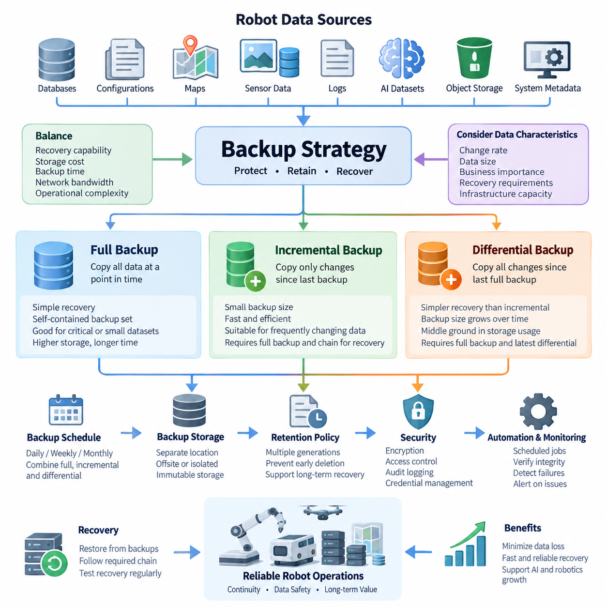
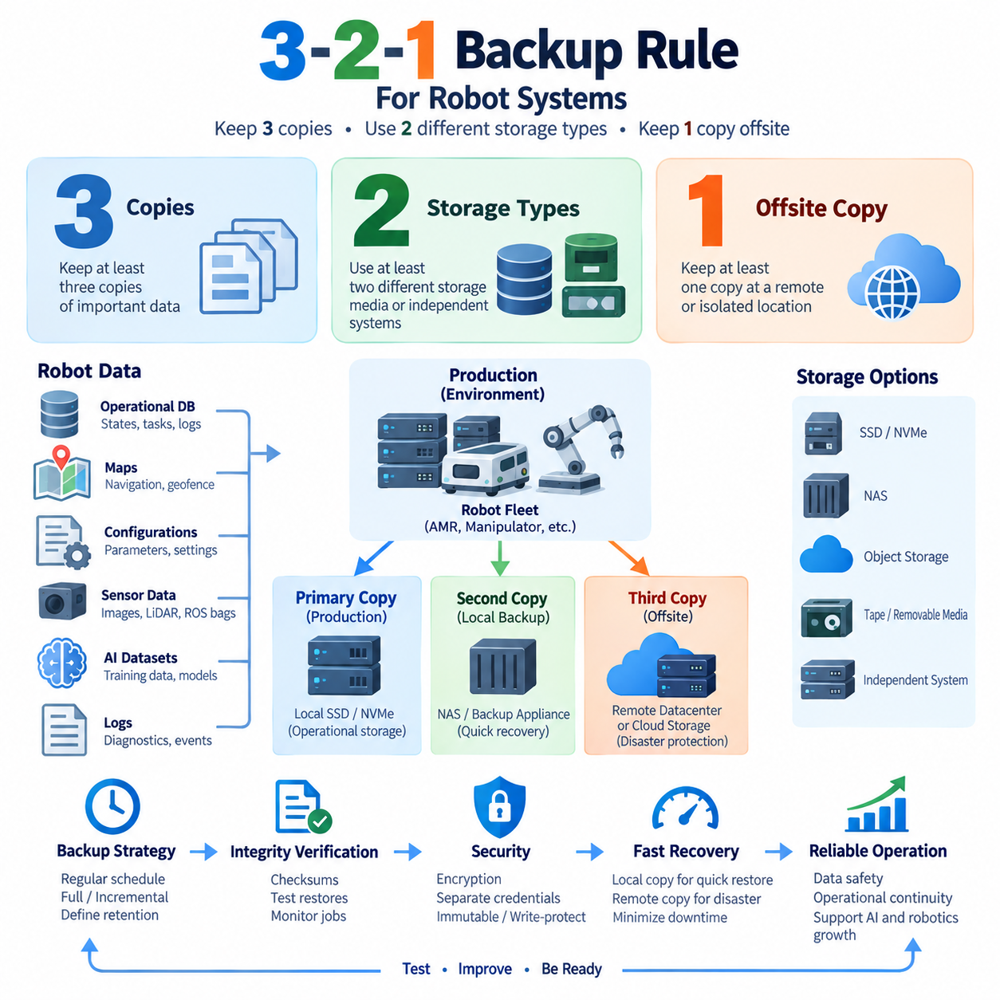
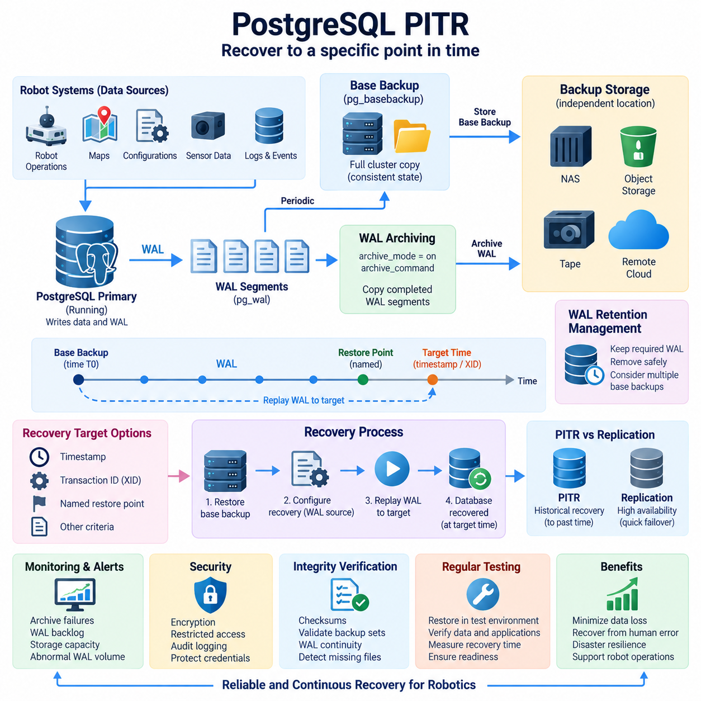
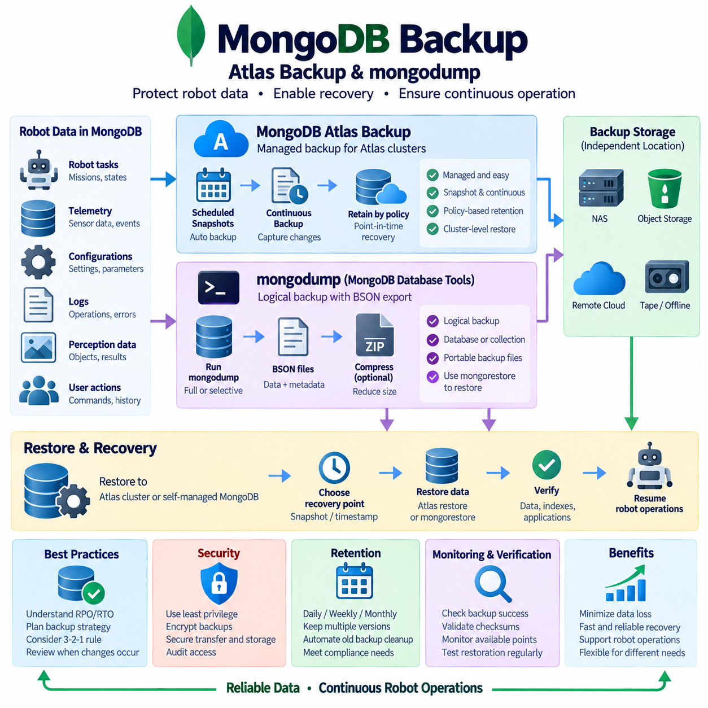
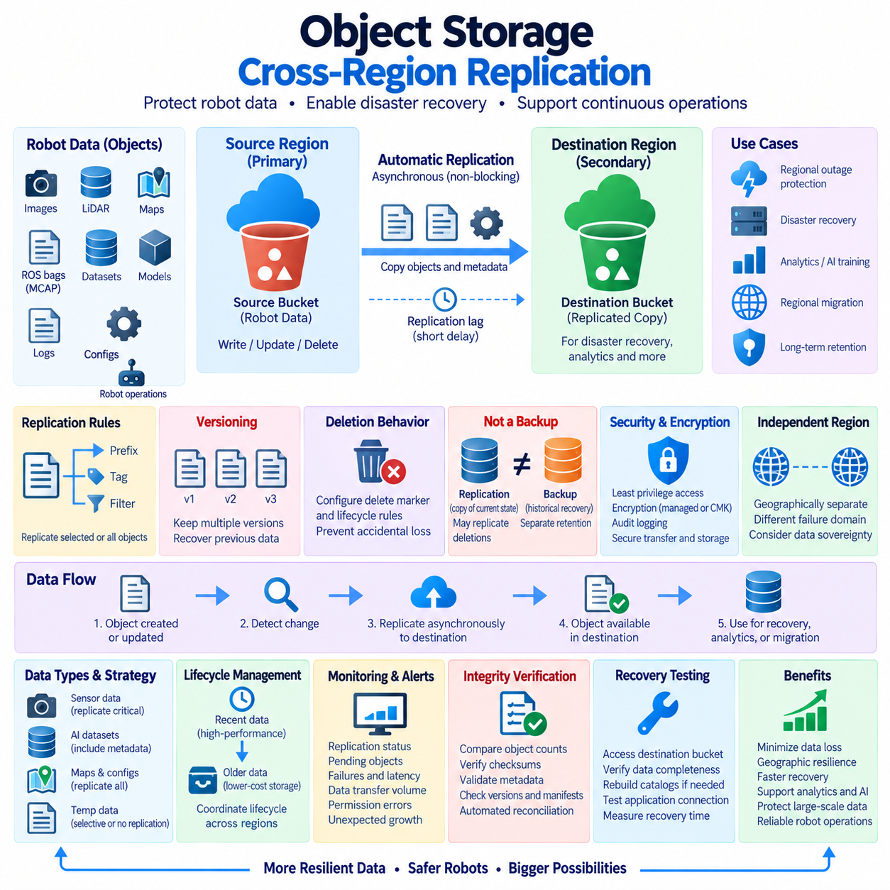
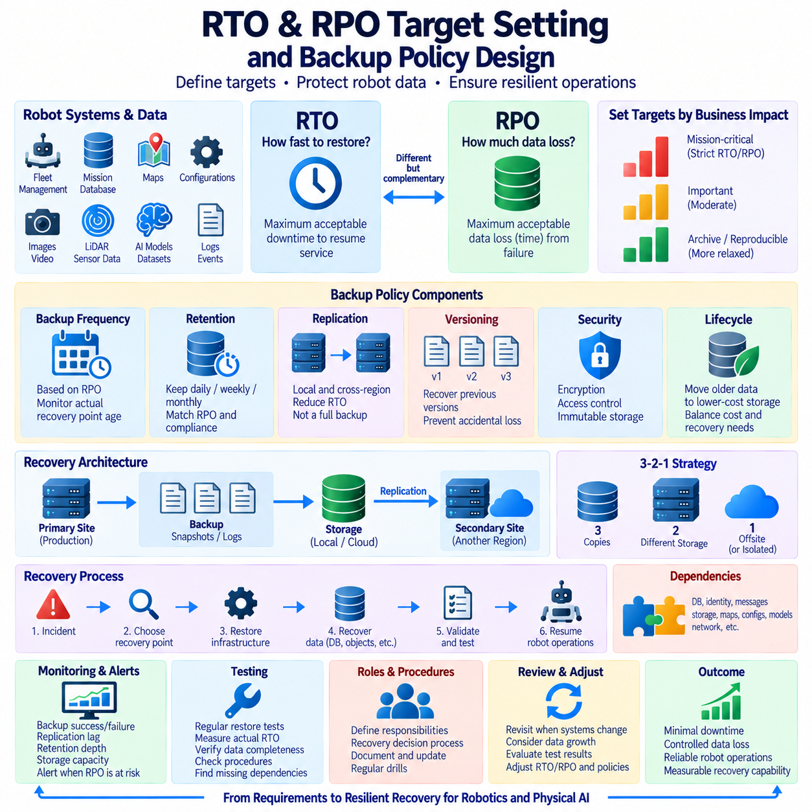
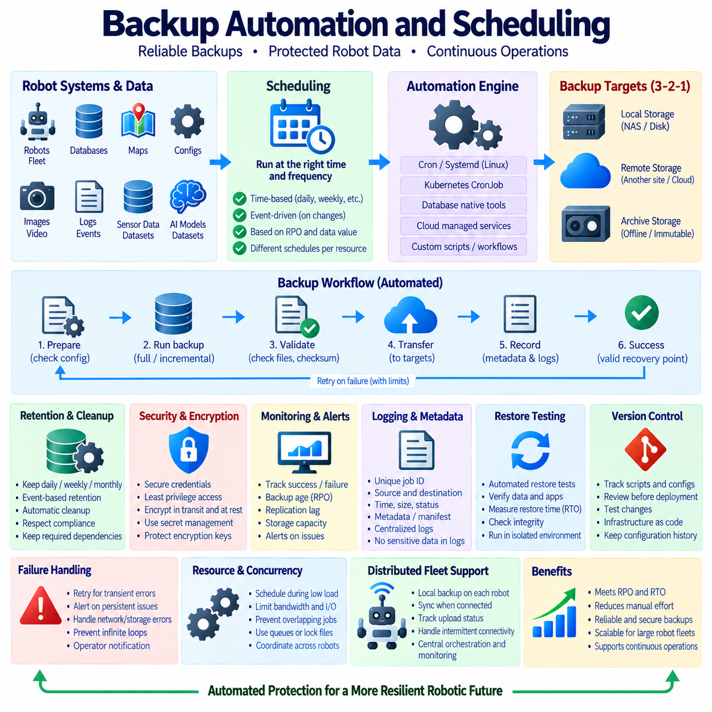
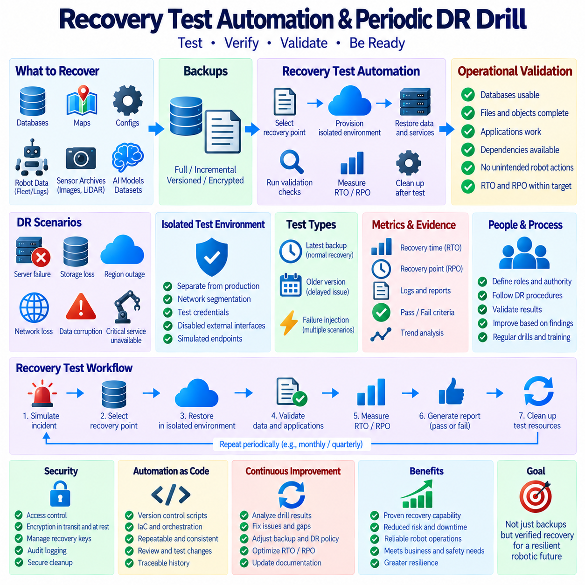
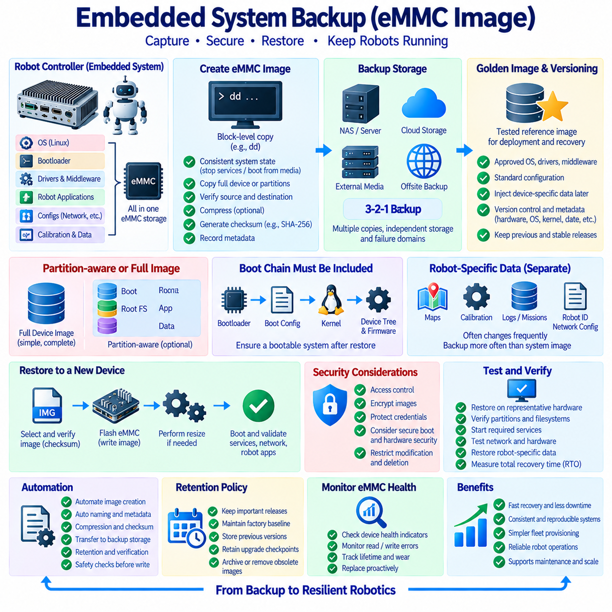
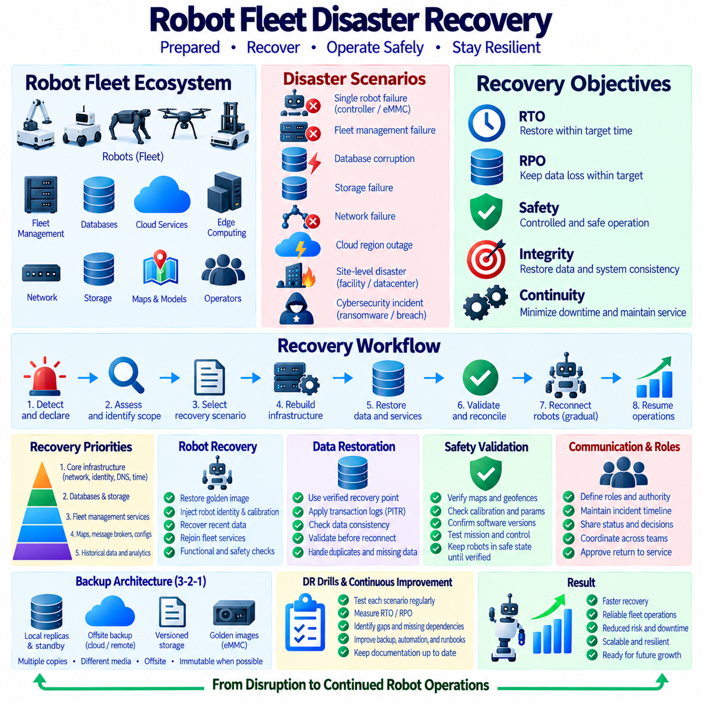

**Volume 08 Robot Database and Storage**

# 09. Backup and Recovery

## 09.01 Backup Strategy: Full, Incremental, Differential

{width="7.268055555555556in" height="7.268055555555556in"}

A backup strategy defines how copies of operational data are created, retained, and restored when the primary data becomes unavailable, corrupted, deleted, or compromised. In robot database and storage environments, backup planning must cover not only traditional databases but also sensor recordings, maps, configuration files, AI datasets, object storage, robot logs, and system metadata. A reliable strategy therefore balances recovery capability, storage consumption, backup duration, network bandwidth, and operational complexity.

Full backup is the simplest backup model because it creates a complete copy of all selected data at a specific point in time. Every database file, dataset object, configuration record, or other protected item within the backup scope is copied regardless of whether it has changed since the previous backup. Recovery is straightforward because administrators normally need only the selected full backup to reconstruct the protected dataset, making the restoration process comparatively predictable.

The primary advantage of full backup is operational simplicity. Each backup set can represent a self-contained recovery point, reducing dependencies on earlier backup operations and simplifying restoration procedures. This property is particularly useful for critical robot configuration repositories, database snapshots, map databases, or compact operational datasets where predictable recovery is more important than minimizing backup size. Full backups also provide convenient baseline copies for later incremental or differential backup operations.

The major disadvantage is resource consumption. Repeatedly copying an entire multi-terabyte robot dataset can require substantial storage capacity, network bandwidth, and backup time even when only a small fraction of the data has changed. Large image collections, LiDAR recordings, MCAP files, simulation datasets, and foundation-model training repositories make this problem especially significant. Consequently, organizations commonly schedule full backups less frequently and combine them with more storage-efficient backup methods between full backup cycles.

Incremental backup copies only data that has changed since the most recent backup operation, whether that previous operation was a full backup or another incremental backup. Consider a full backup created on Sunday. A Monday incremental backup stores changes made after Sunday, while Tuesday stores only changes made after Monday. Wednesday then contains only changes since Tuesday. This creates a sequence of relatively small backup sets that collectively describe the evolution of the protected data after the baseline full backup.

Because incremental backups capture relatively small change sets, they can significantly reduce daily backup duration, storage requirements, and network traffic. This characteristic is valuable in robot systems that continuously generate telemetry, logs, sensor observations, database transactions, and operational records. Instead of repeatedly transferring unchanged information, the backup infrastructure concentrates resources on newly created or modified data, allowing frequent protection intervals even when the complete production dataset is extremely large.

The efficiency of incremental backup introduces a recovery dependency chain. Restoring Wednesday\'s state may require the original full backup followed by Monday, Tuesday, and Wednesday incremental backups in the correct sequence. If one required backup is unavailable or corrupted, recovery may become incomplete. Long incremental chains can also increase restoration time and operational complexity. Backup systems therefore require reliable catalogs, integrity verification, retention management, and periodic creation of new full or synthetic baseline backups.

Differential backup provides a compromise between full and incremental approaches. It copies all data changed since the most recent full backup rather than only changes since the immediately preceding backup. If Sunday contains the full backup, Monday\'s differential contains Monday\'s changes. Tuesday\'s differential contains changes accumulated during Monday and Tuesday, while Wednesday\'s differential contains everything changed from Sunday through Wednesday. Differential backup sets therefore become progressively larger until another full backup establishes a new baseline.

Recovery from differential backup is generally simpler than recovery from a long incremental chain. To restore Wednesday\'s protected state, the system typically requires the Sunday full backup and the Wednesday differential backup. Monday and Tuesday differential sets are not necessary for that recovery point. This reduces the number of backup components involved during restoration and can lower the probability of recovery failure caused by a missing intermediate backup, although differential backups consume increasingly more storage as the cycle progresses.

The practical choice among these approaches depends on the relationship between backup window, recovery requirements, change rate, dataset size, and infrastructure capacity. Full backup favors restoration simplicity but requires greater backup resources. Incremental backup favors frequent, storage-efficient protection but introduces longer recovery chains. Differential backup occupies the middle ground, requiring more backup capacity than incremental methods while generally providing simpler restoration. No single method is optimal for every robot data category or operational environment.

Robot systems make this selection more complex because their data has very different recovery characteristics. A PostgreSQL operational database may change continuously, while a calibrated map may remain unchanged for weeks. Sensor archives may grow rapidly without modifying existing files, whereas robot configuration repositories may be small but operationally critical. AI training datasets can contain millions of objects yet change primarily when new dataset versions are published. Backup policies should therefore classify data before assigning a backup mechanism.

A practical architecture can combine periodic full backups with frequent incremental or differential protection. Critical databases and configuration repositories may receive frequent change-based backups, while large immutable sensor archives can be protected according to newly created objects or storage-level replication policies. Map releases and validated AI datasets can be preserved as versioned recovery points. The resulting backup architecture should reflect the behavior and business importance of each data class rather than applying one universal schedule to every storage system.

Backup frequency must also be distinguished from backup retention. Creating backups frequently does not guarantee long-term recoverability if older recovery points are immediately deleted. Retention policies determine how many daily, weekly, monthly, or archival copies remain available. Multiple generations are important because corruption, accidental modification, ransomware, or application errors may remain undetected for some time. If every retained backup already contains the unwanted change, technically successful backups may still provide no useful recovery point.

Backup integrity is equally important. A completed backup job indicates that data was copied, but it does not prove that the resulting backup can be restored correctly. Backup systems should verify checksums, backup catalogs, object counts, database consistency, encryption metadata, and required dependency chains. Periodic restoration tests provide stronger evidence by reconstructing selected databases, files, or datasets in an isolated environment and confirming that applications can actually consume the restored information.

The storage location of backups must be designed independently from the backup type. A full, incremental, or differential copy stored on the same physical system as production data can disappear during hardware failure, storage corruption, theft, or destructive administrative error. Backup architecture should therefore use appropriately separated storage domains and, where required, geographically or logically isolated copies. Offline or immutable protection can further reduce exposure to failures or attacks that affect simultaneously accessible production and backup systems.

Security controls must protect backup data throughout its lifecycle. Backup repositories may contain database credentials, robot configuration, operational histories, maps, sensor recordings, proprietary AI datasets, and other sensitive information. Encryption in transit and at rest, restricted administrative access, credential separation, audit logging, and controlled deletion should therefore be incorporated into backup design. Recovery credentials and encryption keys must themselves remain available during disasters without becoming an easy path for unauthorized access.

Automation becomes essential as robot fleets and storage systems expand. Backup software can schedule jobs, identify changed data, manage retention, verify backup completion, detect failures, and report recovery-point status. Monitoring should distinguish successful execution from meaningful protection by checking whether expected data was actually captured and whether the latest valid recovery point satisfies operational objectives. Alerts should identify missed backups, abnormal backup sizes, integrity failures, repository capacity problems, and broken incremental dependency chains.

Ultimately, full, incremental, and differential backups are complementary mechanisms rather than competing technologies. Full backups provide dependable baselines, incremental backups enable efficient high-frequency protection, and differential backups reduce restoration dependencies while retaining some storage efficiency. A robust robot storage architecture combines these mechanisms according to data behavior and recovery priorities, then reinforces them with retention policies, integrity verification, isolation, security controls, monitoring, and routine recovery testing.

## 09.02 3.2.1 Backup Rule and Robot System Application

{width="7.268055555555556in" height="7.268055555555556in"}

The 3-2-1 backup rule is a widely used resilience principle that reduces the risk of losing critical information through hardware failure, software corruption, human error, cyberattack, or physical disaster. The rule recommends maintaining at least three copies of important data, storing those copies on at least two different types of storage media or independent storage systems, and keeping at least one copy at an offsite or otherwise isolated location. For robot systems, this principle provides a practical foundation for designing recoverable data infrastructure.

The first element, "3," means that important information should exist in three copies: the primary production data and at least two additional backup copies. A robot fleet may store its active operational database on a production server while maintaining a local backup on dedicated backup storage and another protected copy in a remote environment. Multiple copies reduce dependence on any single storage device, server, filesystem, or administrative operation and provide alternative recovery paths when one copy becomes unavailable.

Simply creating three copies on the same storage system does not provide sufficient protection. If the production database, its backup directory, and another copied directory all reside on the same physical storage array, a controller failure, filesystem corruption, ransomware attack, or destructive administrative command could affect all three simultaneously. The 3-2-1 rule therefore emphasizes failure-domain separation rather than merely counting duplicated files. Each copy should contribute meaningful independence to the overall recovery architecture.

The "2" represents the use of at least two different storage media or independent storage platforms. Depending on the robot infrastructure, production data may reside on NVMe or SSD storage while backup copies are placed on NAS, object storage, dedicated backup appliances, removable media, or another independently managed storage system. The objective is to prevent a common hardware, software, or management failure from simultaneously destroying every available copy of the protected information.

Modern implementations interpret storage diversity according to failure independence rather than requiring traditional combinations such as disk and tape. For example, a robot database running on local SSD storage may be backed up to an independent NAS and replicated to object storage managed through a separate infrastructure domain. What matters is that the backup architecture avoids excessive dependency on the same host, controller, filesystem, credentials, administrative interface, or physical device that supports the production environment.

The "1" requires at least one backup copy to remain offsite or sufficiently isolated from the primary environment. A remote data center, cloud object storage service, geographically separated facility, or securely disconnected repository can provide this protection. Offsite separation becomes critical when fire, flooding, theft, electrical damage, site-wide storage failure, or another physical event affects the entire local facility. A backup located beside the production server may survive a logical database failure but cannot protect against every site-level disaster.

Isolation also has growing importance in protection against ransomware and destructive cyberattacks. A remote backup that remains permanently writable using the same administrative credentials as the production environment may still be compromised. Backup architecture can therefore strengthen the 3-2-1 principle through immutable object versions, write-protected snapshots, offline media, separate credentials, restricted deletion permissions, or logically isolated backup repositories. The objective is to ensure that at least one recovery path survives even when production administration is compromised.

Robot systems contain several data classes that should be treated differently when implementing this rule. Operational databases can contain robot states, task histories, fleet assignments, charging information, maintenance records, and mission results. File or object storage may contain ROS bags, MCAP recordings, camera images, LiDAR point clouds, diagnostic logs, and AI training samples. Map databases, calibration parameters, robot configuration files, deployment packages, and AI model artifacts can be equally important even when their storage volume is relatively small.

For an indoor or outdoor AMR fleet, the primary copy may exist on the fleet-management server or edge infrastructure where robots continuously exchange operational information. A second copy can be maintained on local NAS or dedicated backup storage to support rapid restoration without depending on external connectivity. A third copy can be transferred to remote object storage or another physically separated site. This architecture combines fast local recovery with protection against failures that affect the entire operating location.

Large sensor datasets require a slightly different implementation because repeatedly duplicating every object can consume substantial storage and network bandwidth. Camera recordings, LiDAR scans, radar data, and multimodal robot datasets may reach terabyte or petabyte scale. The 3-2-1 principle should therefore be combined with lifecycle management, incremental transfer, deduplication, compression, versioning, and appropriate retention policies. Critical datasets may receive full three-copy protection, while temporary or reproducible intermediate data can follow less expensive retention policies.

AI datasets and Physical AI training repositories introduce additional requirements because reproducibility depends on more than preserving raw files. Dataset versions, annotations, metadata, checksums, preprocessing configurations, training manifests, and model associations should remain recoverable together. Maintaining several copies of images while losing the metadata that identifies the exact training dataset can make the backup operationally incomplete. Backup scope should therefore preserve the logical dataset structure required to reproduce experiments and rebuild training pipelines.

Robot maps and configuration data are typically smaller than sensor archives but can have much higher operational importance per unit of storage. Navigation maps, semantic maps, geofences, docking positions, sensor calibration parameters, network configuration, safety settings, and fleet configuration may determine whether robots can resume operation after a system failure. These assets are well suited to frequent versioned backups because their relatively small size permits strong protection without imposing significant storage or network overhead.

Database protection should combine the 3-2-1 storage principle with database-aware recovery mechanisms. Copying database files without considering transaction consistency may produce a backup that exists physically but cannot be restored reliably. Database snapshots, transaction logs, write-ahead logs, consistent dumps, or point-in-time recovery data should therefore be incorporated according to the database technology. The resulting backup sets can then be distributed across independent local and remote storage locations to satisfy broader resilience requirements.

Backup frequency and the number of copies address different problems. Three copies do not guarantee a sufficiently recent recovery point if backups are performed only occasionally. Robot systems generating continuous operational data must therefore define backup intervals according to acceptable data loss. Frequently changing databases may require continuous or short-interval protection, while stable maps or released AI models may require backups primarily when versions change. The 3-2-1 architecture provides location diversity, while scheduling determines temporal recovery coverage.

Recovery speed must also be considered when deciding where each copy is stored. A remote backup can provide excellent disaster protection but may require significant time to retrieve several terabytes of robot data. Maintaining a local recovery copy allows frequently needed databases, configurations, and operational files to be restored quickly, while the remote copy provides disaster-level protection. Backup design should therefore balance resilience with practical restoration bandwidth, dataset size, service dependencies, and expected recovery time.

Integrity verification is necessary because the existence of three copies does not guarantee that three usable copies exist. Backup jobs should validate checksums, file counts, database consistency, metadata, encryption information, and backup catalogs. Automated monitoring can detect failed transfers, incomplete datasets, corrupted archives, unexpected backup sizes, or missing recovery points. Periodic restoration tests should then verify that selected robot databases, maps, configurations, sensor archives, and AI datasets can actually be reconstructed from protected copies.

Security must remain independent across backup domains whenever practical. If production servers and every backup repository share the same privileged credentials, one compromised account can undermine the entire 3-2-1 design. Separate administrative roles, restricted service accounts, encryption, multifactor authentication where applicable, audit logging, deletion protection, and controlled key management can reduce this risk. Remote and immutable copies are most valuable when attackers or accidental operations cannot easily modify them through the production environment.

The 3-2-1 rule should ultimately be treated as an architectural baseline rather than a complete disaster-recovery solution. Robot organizations still need retention policies, recovery objectives, backup automation, integrity verification, security controls, restoration procedures, and periodic disaster-recovery exercises. When these mechanisms are combined, the three copies provide redundancy, the two storage domains reduce common-mode failure, and the one isolated or offsite copy protects against site-level or administrative disasters.

Applied correctly, the 3-2-1 principle creates a layered recovery architecture for robotics and Physical AI systems. Production storage supports normal robot operation, independent local backup storage provides rapid recovery, and isolated remote storage provides the final recovery path during severe incidents. By extending the rule across databases, maps, configurations, sensor archives, logs, AI datasets, and model artifacts, robot operators can protect both operational continuity and the long-term data assets required for autonomous-system development.

## 09.03 PostgreSQL PITR Backup Configuration [w/Code]

{width="7.268055555555556in" height="7.268055555555556in"}

PostgreSQL Point-in-Time Recovery, commonly abbreviated as PITR, is a backup and recovery mechanism that allows a database cluster to be restored to a specific moment rather than only to the time when a conventional backup was created. PITR combines a physical base backup with archived Write-Ahead Log records. Because PostgreSQL records database changes in WAL before they are considered durable, replaying those records from a known backup state can reconstruct subsequent database activity.

Write-Ahead Logging is fundamental to PostgreSQL durability and PITR. WAL records describe low-level changes required to reproduce modifications to database pages and related structures. During normal operation, PostgreSQL writes WAL into the pg_wal directory using sequential WAL segment files. PITR extends this mechanism by preserving completed WAL segments outside the active database cluster, allowing changes that occurred after the base backup to remain available even when the original database storage is lost.

A PITR backup architecture therefore contains two complementary components. The base backup captures a consistent physical representation of the PostgreSQL cluster, including database files and required cluster metadata. WAL archiving continuously preserves transaction history generated after that backup. A base backup without the required WAL history limits recovery to the backup state, while archived WAL without a valid starting base backup cannot independently reconstruct the complete cluster. Reliable PITR requires both components to be managed as one recovery chain.

WAL archiving begins by enabling PostgreSQL archive mode and defining how completed WAL segments are copied to durable backup storage. The archive_mode parameter activates archiving, while archive_command or an appropriate archive library determines how PostgreSQL transfers each completed segment. The destination should be independent from the primary database storage because placing archived WAL on the same failed disk or server would undermine the recovery design. Archive operations must also avoid silently overwriting existing WAL files.

The archive process should report success only after a WAL segment has been safely preserved. PostgreSQL retains WAL that has not been successfully archived, so a failing archive mechanism can eventually consume available storage in pg_wal. Monitoring must therefore detect archive failures, increasing archive backlog, storage-capacity problems, abnormal WAL generation, and unavailable destinations. In robot fleet databases, sustained telemetry or task-event workloads can generate substantial WAL traffic, making archive throughput and capacity planning operationally important.

A physical base backup can be created with PostgreSQL mechanisms such as pg_basebackup. The backup must represent the entire database cluster rather than selected SQL objects because PITR operates at the physical cluster level. Backup procedures should preserve the files and metadata necessary for PostgreSQL to establish a valid recovery starting point. Administrators should record backup time, PostgreSQL version, cluster identity, WAL requirements, checksum information, and retention relationships so that each base backup can be associated with the correct WAL archive.

Base backups should be created periodically even when WAL is archived continuously. Keeping only one very old base backup may force recovery to replay a very large quantity of WAL, increasing restoration time and expanding dependency on long-term WAL retention. More frequent base backups shorten the potential replay interval but consume additional backup capacity. The appropriate schedule therefore depends on database size, WAL generation rate, recovery-time objectives, available storage, network performance, and the operational importance of the robot service.

Recovery begins by restoring a suitable base backup into the PostgreSQL data directory and configuring the server to retrieve archived WAL. PostgreSQL recovery configuration identifies the command or mechanism used to obtain required WAL segments from archive storage. When recovery starts, PostgreSQL reads the restored cluster state and sequentially replays WAL records. This process advances the database from the base-backup state toward the required recovery target while reconstructing committed changes recorded after the backup.

PITR can stop recovery according to a defined target instead of replaying every available WAL record. A recovery target may be specified using a timestamp, transaction identifier, named restore point, or other supported recovery criterion. This capability is useful when an administrator needs to recover the database to the moment immediately before an accidental deletion, incorrect application update, destructive transaction, or corrupted operational change. The target should be chosen carefully because timestamps and transaction boundaries may not correspond exactly to human expectations.

Named restore points can make operational recovery easier when potentially risky changes are planned. Before a major database migration, fleet-management software deployment, schema modification, or administrative operation, a restore point can identify a known location in the WAL stream. If the subsequent operation produces unacceptable results, PITR can target that restore point or another appropriate recovery position. Restore points do not replace backups because they are only WAL markers and still depend on a valid base backup and retained WAL history.

Robot fleet systems can benefit substantially from PITR because operational databases frequently change throughout the day. Robot task assignments, mission states, charging events, maintenance information, configuration changes, user actions, and fleet-management records may be continuously committed to PostgreSQL. A nightly backup alone could lose many hours of operational history after a failure. Continuous WAL archiving reduces the potential recovery gap by preserving database changes between scheduled physical base backups.

PITR should nevertheless be distinguished from high availability and replication. A streaming replica can provide rapid failover when the primary database server fails, but it may also reproduce accidental deletion or application-level corruption from the primary. PITR provides historical recovery by preserving a recoverable sequence of changes over time. Production robot systems can therefore combine replication for service continuity with PITR for historical restoration rather than treating one mechanism as a complete replacement for the other.

Archived WAL and base backups require coordinated retention management. Removing WAL segments too early can break recovery chains for retained base backups, while retaining every segment indefinitely can consume excessive storage. Backup software or administrative procedures should determine which WAL files remain necessary for available recovery points before deletion. Retention design should also consider multiple base backups, recovery objectives, compliance requirements, disaster-recovery copies, and the possibility that corruption may remain undetected for an extended period.

Backup storage should be protected independently from the production PostgreSQL server. Base backups and archived WAL can be stored on dedicated backup storage, NAS, object storage, or remote infrastructure according to the broader backup architecture. Applying the 3-2-1 principle strengthens PITR by maintaining multiple copies across independent failure domains. Remote or immutable storage is particularly useful because database administrators, ransomware, or destructive scripts should not be able to erase both production data and all usable recovery history through one compromised environment.

Security is important because PostgreSQL backups may contain the complete operational history of a robot fleet. Backup repositories should use encryption where appropriate, restricted service credentials, controlled filesystem or object permissions, audit logging, and protected encryption keys. The process performing WAL archiving should receive only the privileges required to write backup objects. Recovery access should likewise be controlled because possession of a physical base backup and corresponding WAL files can expose sensitive database contents.

Integrity verification should cover both the base backup and WAL archive. A backup operation that appears successful is insufficient if files are incomplete, corrupted, incorrectly associated, or inaccessible during recovery. Checksums, backup manifests, WAL continuity checks, archive monitoring, and storage-level integrity mechanisms can help detect problems before a disaster occurs. PostgreSQL backup tools and external backup systems should be monitored so that missing segments or damaged backup sets are identified while alternative recovery options still exist.

Periodic recovery testing is the strongest validation of a PITR configuration. A test environment can restore a selected base backup, retrieve archived WAL, replay changes to a defined recovery target, and start PostgreSQL without affecting production. Administrators can then verify database consistency, expected tables, application connectivity, robot fleet records, and the actual time required for restoration. Such exercises reveal configuration errors that ordinary backup-success messages cannot detect and provide evidence that recovery procedures remain operational.

Automation should integrate base-backup scheduling, WAL archiving, retention, monitoring, integrity checking, and recovery documentation. Alerts should report failed archives, missing WAL segments, stale base backups, unexpected WAL growth, insufficient repository capacity, and unsuccessful verification jobs. For robot systems operating continuously, backup health should be treated as an observable production service rather than an occasional administrative activity. Recovery readiness depends on continuous evidence that the complete backup chain remains valid.

A well-designed PostgreSQL PITR configuration therefore forms a continuous recovery timeline rather than a collection of isolated backup files. Periodic physical base backups establish reliable starting states, archived WAL preserves subsequent changes, recovery targets identify the desired historical point, and protected storage preserves the entire chain against infrastructure failure. Combined with replication, independent backup domains, monitoring, retention management, and regular restore testing, PITR provides a robust recovery foundation for PostgreSQL-based robotics and Physical AI services.

## 09.04 MongoDB Backup: Atlas Backup / mongodump [w/Code]

{width="7.268055555555556in" height="7.268055555555556in"}

MongoDB backup design must protect document data, indexes, metadata, and the consistency relationships required to restore an operational database after failure or accidental modification. Two common approaches are managed MongoDB Atlas backups and logical backups created with MongoDB Database Tools such as mongodump. Their purposes overlap, but their operating models differ significantly. Atlas provides managed backup capabilities integrated with cloud database infrastructure, while mongodump exports database contents into portable BSON-based backup files.

MongoDB Atlas backup is designed for clusters operated through the Atlas managed platform. Backup configuration is associated with the cluster and can provide scheduled recovery points without requiring administrators to manually export every database. Depending on the Atlas deployment and backup configuration, snapshots can be retained according to defined policies and used to restore protected cluster data. This approach reduces the operational work required to build and maintain a separate backup mechanism around a managed MongoDB environment.

Snapshot-based backup captures database storage at a defined recovery point and is particularly useful when the database contains large collections that would be expensive to export repeatedly. Instead of logically reading every document and generating a new BSON export for each backup, the managed infrastructure can maintain snapshot-based recovery data. Administrators should still understand snapshot frequency, retention periods, storage location, restore procedures, and the recovery capabilities available for the specific Atlas cluster configuration.

Continuous backup capabilities can further reduce the gap between available recovery points by preserving database changes between scheduled snapshots. This is valuable for continuously changing robot databases containing task histories, mission events, device states, configuration updates, maintenance records, or operator actions. A backup strategy should define how much recent data can be lost after an incident and select recovery mechanisms that satisfy that requirement rather than assuming that the existence of any snapshot provides sufficient protection.

Atlas backup simplifies infrastructure management, but recovery readiness still requires explicit operational planning. Administrators need to know which clusters are protected, how long recovery points are retained, which users can initiate restoration, where restored data will be created, and how applications will reconnect afterward. Backup policies should be reviewed whenever cluster topology, database size, workload characteristics, security requirements, or robot fleet operating requirements change.

mongodump provides a different backup model by reading data from a MongoDB deployment and creating a logical representation of database contents. Collection documents are written in BSON format, while associated metadata can also be preserved for later restoration. The resulting backup directory or archive can be copied to NAS, object storage, removable media, or remote backup infrastructure, making mongodump useful when administrators need portable database-level backup artifacts under their direct control.

A mongodump operation can target an entire MongoDB deployment, a selected database, or more specific data depending on the backup requirement. This flexibility is useful in robotics systems where some databases contain critical fleet operations while others hold temporary analytics or reproducible intermediate information. Selective logical backups can reduce backup size, but administrators must ensure that all collections and metadata required to reconstruct the intended application state are included.

The corresponding mongorestore utility reconstructs MongoDB data from backups produced by mongodump. Restoration can be directed to an appropriate MongoDB environment for disaster recovery, migration, testing, or validation. Because logical restoration recreates data from exported BSON rather than simply mounting a physical storage image, recovery performance depends on database size, document count, indexes, storage throughput, CPU resources, and the target deployment configuration.

Consistency becomes important when mongodump is executed against a database that continues to receive writes. A robot fleet database may process task assignments, telemetry summaries, charging events, mission transitions, and operator commands while the backup is running. If related collections are captured at different logical moments without an appropriate consistency strategy, the resulting backup may not represent the exact application state expected by the recovery process. Backup planning must therefore account for write activity and deployment topology.

Replica sets provide additional opportunities for controlling backup impact. Backup operations can be designed so that production workload disruption is minimized while still preserving the consistency required by the application. However, using another replica-set member as a backup source does not automatically make every backup logically correct. Replication lag, read preferences, ongoing transactions, and application-level relationships should be considered when deciding where and how a logical backup is created.

Large MongoDB databases expose an important limitation of mongodump as a general-purpose backup mechanism. Exporting and later restoring hundreds of gigabytes or several terabytes of BSON can require substantial time, CPU, storage bandwidth, and temporary capacity. For large continuously operating clusters, managed snapshots or specialized backup systems may provide more practical recovery characteristics. mongodump remains valuable for smaller databases, selective exports, migrations, development copies, and additional independent backup layers.

Compression and archive formats can simplify the management of mongodump output. Instead of maintaining a large directory tree containing individual collection files, administrators can create more manageable backup artifacts and transfer them to protected storage. Compression can reduce storage and network requirements when the data is compressible, although it introduces additional processing overhead. Backup design should therefore evaluate transfer bandwidth, backup window, available CPU capacity, restore speed, and long-term storage cost together.

Robot systems frequently store semi-structured operational information in MongoDB because document models accommodate changing schemas and heterogeneous records. A manipulator application may store task definitions, execution histories, detected objects, grasp results, error events, and contextual metadata in related collections. An AMR service may store missions, robot status, charging history, user commands, and configuration documents. Backup scope should preserve the information required to reconstruct these relationships rather than protecting isolated collections without application context.

Backup storage should remain independent from the MongoDB production environment. A mongodump archive stored on the same server and filesystem as the active database can disappear during a storage failure, ransomware incident, or destructive administrative operation. Logical backups should therefore be transferred to dedicated NAS, object storage, remote infrastructure, or another protected domain. Atlas backups should similarly be incorporated into the organization\'s broader disaster-recovery strategy rather than treated as the only form of data protection.

The 3-2-1 principle can strengthen MongoDB protection by combining multiple backup mechanisms and storage domains. The production MongoDB cluster represents the active copy, a local independent backup can support rapid restoration, and another protected copy can reside remotely or in isolated storage. Atlas snapshots and mongodump archives can complement each other when different recovery scenarios justify both, providing managed recovery points together with portable logical copies that can be retained independently.

Security controls must protect MongoDB backup data because logical dumps can expose database contents outside the access-control boundary of the production server. Backup credentials should receive only necessary privileges, transfer channels should be protected, backup repositories should enforce restricted access, and stored backup artifacts should be encrypted where appropriate. Encryption keys, service credentials, deletion permissions, and audit records should be managed so that backup infrastructure does not become an easier path to sensitive robot operational data.

Retention policy determines how long Atlas recovery points and mongodump archives remain useful. Keeping only the latest backup provides little protection when corruption or unwanted changes are discovered days later. Daily, weekly, monthly, or version-related recovery points can be retained according to operational requirements and storage capacity. Old backup deletion should be automated carefully so that required disaster-recovery copies are not removed before newer backups have been verified.

Integrity verification should confirm that backup artifacts are complete and usable. mongodump archives can be checked for expected databases, collections, metadata, file sizes, and checksums before being transferred or retained. Managed backups should also be monitored for successful creation and available recovery points. A backup status indicating success is useful, but actual restoration provides stronger evidence because it verifies that stored data can be reconstructed into a functioning MongoDB environment.

Periodic recovery tests should restore selected Atlas backups or mongodump archives into isolated test environments. Administrators can then verify document counts, indexes, collection structures, application queries, robot task histories, configuration data, and service connectivity. Measuring recovery duration also reveals whether the current backup approach can meet operational recovery objectives as database size grows. Recovery testing should therefore be considered part of the backup lifecycle rather than an activity performed only after a real failure.

A robust MongoDB strategy does not require choosing Atlas Backup or mongodump as universally superior. Atlas backup is well suited to managed cluster protection and operationally convenient recovery, while mongodump provides portable logical backups useful for selective protection, migration, testing, and independent retention. For robotics and Physical AI systems, combining appropriate MongoDB backup mechanisms with isolated storage, security controls, retention management, monitoring, and tested restoration procedures creates a more dependable path from data loss to operational recovery.

## 09.05 Object Storage Cross-Region Replication [w/Code]

{width="7.268055555555556in" height="7.268055555555556in"}

Object storage cross-region replication is a resilience mechanism that automatically copies objects from a source storage region to a geographically separate destination region. It is designed to protect large-scale unstructured data against regional outages, infrastructure failures, accidental loss, and disaster scenarios. For robotics and Physical AI systems, replicated objects may include sensor recordings, ROS bags, MCAP files, images, LiDAR point clouds, maps, AI datasets, model artifacts, logs, and simulation results.

Object storage organizes information as objects rather than traditional filesystem blocks or relational records. Each object normally contains data, an identifier or key, and associated metadata. This architecture scales effectively for very large collections of robot-generated information because applications can address individual objects without managing conventional directory-based storage infrastructure. Cross-region replication extends this model by maintaining corresponding object copies across independent geographic storage locations.

A typical replication architecture contains a source bucket in one region and a destination bucket in another region. When an eligible object is created or updated in the source, the storage platform detects the change and asynchronously transfers the required object data and metadata to the destination. Applications continue using the source region for normal operations, while the remote region maintains a protected copy that can support disaster recovery, regional migration, analytics, or long-term data protection.

Replication is generally asynchronous because synchronous transfer across geographically distant regions would add network latency to normal object writes. A newly created robot sensor file may therefore exist in the source region before its replicated copy becomes available in the destination. This interval is known as replication lag. Disaster-recovery planning must recognize that cross-region replication can substantially improve geographic resilience without necessarily guaranteeing zero data loss during an immediate regional failure.

Replication rules determine which objects are copied and how the process behaves. Policies may apply to an entire bucket or only to objects matching selected prefixes, tags, or other supported criteria. This allows robotics organizations to separate critical and temporary data. Validated maps, mission records, calibration files, trained models, and important datasets may be replicated remotely, while temporary preprocessing outputs, caches, intermediate simulation files, or reproducible artifacts can remain only in the primary region.

Versioning is an important companion to replication because overwriting or deleting an object can otherwise propagate an unwanted state. With object versioning enabled, multiple versions of the same logical object can be retained, allowing earlier content to remain recoverable after modification. For robot datasets that evolve through annotation, preprocessing, validation, or model-training stages, versioned storage also helps preserve the relationship between historical dataset states and the experiments that consumed them.

Deletion behavior requires deliberate configuration. Replication of newly created objects is clearly desirable, but automatically reproducing every deletion may reduce disaster-recovery value if an operator, application, or compromised account removes data incorrectly. Object-storage platforms provide different mechanisms for handling deletion markers, versions, and lifecycle expiration. Administrators should therefore define whether deletion events should propagate and ensure that at least one protected recovery path survives accidental or malicious removal.

Cross-region replication is not equivalent to backup. Replication primarily maintains another copy of data and may reproduce unwanted modifications, corruption, or deletion according to configured rules. Backup introduces historical recovery points, retention boundaries, and potentially immutable copies that remain independent from current production state. A robust robot data architecture can therefore combine replication for geographic availability with versioning, snapshots, archival copies, or immutable backup storage for historical recovery.

For robot sensor archives, replication policies should consider both data value and data volume. A fleet of cameras, LiDARs, radars, microphones, and other sensors can generate enormous amounts of information, making indiscriminate replication expensive. Critical incident recordings, validated training samples, rare-event datasets, and regulatory evidence may justify immediate remote replication, while raw repetitive recordings may follow lifecycle policies that replicate only selected data or move older objects into lower-cost storage classes.

Physical AI datasets introduce another challenge because an individual dataset may consist of millions of objects together with annotations, manifests, calibration data, metadata, and provenance records. Replicating only raw sensor files can leave the remote copy operationally incomplete. Replication scope should preserve the complete logical dataset required to reproduce training or evaluation. Checksums, manifests, dataset versions, transformation records, and model associations should therefore be treated as part of the protected data structure.

Maps and robot configuration artifacts are usually much smaller than raw sensor datasets but can have greater immediate operational importance. Navigation maps, semantic maps, geofences, mission definitions, calibration files, deployment packages, and AI inference models may be required to restore robot operation after a regional service failure. Their relatively small size makes aggressive cross-region replication practical, allowing the disaster-recovery environment to maintain current operational assets with limited bandwidth overhead.

The destination region should represent a genuinely independent failure domain. Placing two copies in different storage systems within the same physical region may protect against some device failures but does not provide the same resilience against region-wide network, power, control-plane, or environmental incidents. Region selection should consider geographic separation, service availability, regulatory requirements, network connectivity, data sovereignty, latency, and the organization's disaster-recovery architecture.

Security policies must be coordinated across both regions without making them unnecessarily dependent on a single compromised administrative path. Replication requires permissions to read eligible source objects and create corresponding destination objects. Access should follow least-privilege principles, while encryption, key management, audit logging, identity controls, and deletion permissions should be configured appropriately in both locations. Destination data should not become less protected simply because it serves as a replica.

Encryption must also remain compatible with the replication architecture. Objects may be encrypted using storage-platform-managed keys or customer-controlled key-management systems, depending on infrastructure requirements. When customer-managed encryption is used, replication workflows may require explicit permissions for source decryption and destination encryption operations. Disaster-recovery testing must confirm that destination objects remain decryptable even when the primary region or its associated services are unavailable.

Lifecycle management helps control the long-term cost of geographically replicated object storage. Recent robot data may remain in high-performance storage for active analysis, while older objects can transition to lower-cost archival classes according to retention policies. Source and destination lifecycle rules should be coordinated carefully because independently expiring objects can alter recovery coverage. Storage savings should therefore be balanced against the period during which historical robot data must remain recoverable.

Monitoring should provide visibility into replication health rather than merely confirming that destination storage exists. Useful indicators include pending objects, replication failures, replication latency, transferred data volume, permission errors, and destination capacity or policy problems. Sudden increases in unreplicated sensor files can indicate network congestion, authentication failure, configuration changes, or abnormal data generation. Alerts allow administrators to respond before the remote recovery copy becomes significantly outdated.

Integrity verification is particularly important when millions of robot objects are distributed across regions. Object counts, checksums, metadata, version identifiers, manifests, and replication status can be compared to identify missing or inconsistent data. Large datasets should be verified through automated inventory and reconciliation processes rather than manual inspection. The objective is to demonstrate that the destination contains a logically complete and usable recovery copy, not merely that replication jobs have been executed.

Disaster recovery requires more than storing replicated objects. Applications must know how to locate the destination bucket, obtain credentials, access encryption keys, rebuild indexes or catalogs, and reconnect robot services to the recovered data. Recovery procedures should define how the secondary region becomes operational when the primary region is unavailable. Periodic exercises can validate access paths, permissions, data completeness, application configuration, and the actual time required to resume critical robot services.

Cross-region replication can also support distributed analytics and AI development when remote teams or compute environments need access to large datasets. A replicated dataset near GPU training infrastructure can reduce repeated long-distance transfers and isolate analytics workloads from operational storage. However, analytics convenience should not weaken disaster-recovery controls. Replicated production data, working AI copies, and protected backup versions should remain clearly distinguished according to their purpose and retention requirements.

A robust object-storage architecture therefore combines cross-region replication with versioning, lifecycle management, security controls, integrity verification, monitoring, and independent backup policies. Replication provides geographic redundancy and faster access to remote copies, while historical backups and immutable retention provide protection against logical errors and destructive changes. Applied to robotics and Physical AI, this layered approach preserves large-scale sensor and AI assets while supporting recovery from both infrastructure failures and data-level incidents.

## 09.06 RTO / RPO Target Setting and Backup Policy Design

{width="7.268055555555556in" height="7.268055555555556in"}

Recovery Time Objective defines the maximum acceptable duration between a service disruption and restoration of the required business or operational capability. It answers the practical question of how quickly a system must become usable again after failure. In robotics infrastructure, RTO may apply to fleet-management databases, mission servers, map repositories, configuration services, object storage, AI inference services, or supporting cloud and edge systems.

Recovery Point Objective defines the maximum acceptable amount of data loss measured backward in time from an incident. If a database has an RPO of fifteen minutes, the recovery architecture should provide a recoverable state that is no more than approximately fifteen minutes older than the failure point. RPO therefore influences backup frequency, transaction-log protection, replication design, snapshot intervals, and continuous data-protection mechanisms.

RTO and RPO describe different dimensions of recovery and should not be treated as interchangeable. RTO concerns how long service restoration can take, while RPO concerns how much recently generated data may be lost. A system can have a short RPO but a long RTO if recent data is protected frequently but restoration requires hours. Conversely, rapid failover can provide a short RTO while insufficient historical protection still produces an unacceptable RPO.

Target setting should begin with operational impact rather than with available backup technology. Administrators should identify what happens when each service becomes unavailable and what consequences result from losing recent information. A robot mission database may require tighter objectives than an archive containing reproducible simulation output. Navigation maps and safety-related configuration may contain relatively little data, yet their absence can prevent an entire robot fleet from returning to operation.

Data classification provides a practical basis for assigning recovery targets. Mission-critical operational data can be separated from important development assets, long-term archives, and temporary or reproducible information. Each class can then receive an appropriate RTO, RPO, retention period, backup frequency, replication method, and recovery procedure. This prevents organizations from applying expensive high-availability protection uniformly to data that does not require the same recovery characteristics.

Robot fleet databases often require relatively strict recovery objectives because their contents change continuously and directly support active operations. Task assignments, mission states, charging events, robot status, maintenance records, and operator actions may be committed throughout the day. Frequent backups, transaction-log archiving, database replication, or point-in-time recovery mechanisms can reduce potential data loss, while standby infrastructure can reduce the time required to resume database services.

Maps and configuration repositories require a different policy because their change frequency may be lower while their operational importance remains high. Navigation maps, semantic maps, geofences, calibration parameters, docking positions, network configuration, and safety settings may change only during controlled deployment activities. Versioned backups can therefore be triggered when approved changes occur, while replicated current versions can support rapid restoration after infrastructure failure.

Large sensor archives typically tolerate different RTO and RPO values from operational databases. Camera streams, LiDAR point clouds, radar recordings, ROS bags, and MCAP files can consume enormous storage capacity, making continuous multi-copy protection expensive. Backup policies can prioritize validated datasets, rare-event recordings, incident evidence, and irreplaceable field data while applying lifecycle management or less aggressive recovery targets to reproducible or low-value raw information.

AI and Physical AI datasets require recovery policies that preserve reproducibility as well as file availability. Raw sensor objects alone may be insufficient if annotations, manifests, preprocessing parameters, dataset versions, provenance information, and model associations are lost. RPO should therefore describe the acceptable loss of the complete logical dataset state, while RTO should consider how long it takes to reconstruct a usable dataset environment for training, evaluation, or deployment.

Backup frequency is closely related to RPO but does not automatically guarantee it. A backup scheduled every hour may suggest an hourly recovery interval, yet failed jobs, delayed transfers, corrupted archives, or incomplete transaction data can create a much larger actual recovery gap. Backup policy should therefore monitor the age of the latest verified recovery point rather than relying only on the configured schedule. Recovery objectives must be supported by measurable evidence.

RTO is affected by far more than the time required to copy backup files. Restoration may require provisioning servers, creating storage volumes, retrieving archived objects, decrypting data, rebuilding databases, restoring indexes, applying transaction logs, validating consistency, configuring networks, updating credentials, and reconnecting applications. Robot services may additionally require maps, configuration, models, and middleware dependencies before autonomous operation can safely resume.

Recovery dependencies should therefore be identified during policy design. A fleet-management database may be restored successfully but remain unusable if identity services, message brokers, object storage, map repositories, or network configuration are unavailable. Effective RTO should represent restoration of the required operational capability rather than restoration of an isolated database process. Dependency mapping helps determine the correct sequence for recovering interconnected robot services.

Replication can reduce RTO by maintaining a ready or near-ready copy of data and services, but replication alone does not provide complete backup protection. Accidental deletion, application corruption, or malicious changes can propagate rapidly to replicas. Historical backups, versioning, immutable storage, and point-in-time recovery remain necessary when recovery must return to an earlier valid state. Backup policy should therefore combine availability mechanisms with historical recovery mechanisms.

The 3-2-1 backup principle can support RTO and RPO objectives by distributing recovery copies across independent storage and failure domains. A local backup may provide rapid restoration and therefore support a shorter RTO, while an offsite or isolated copy protects against site-wide disasters. Multiple copies do not automatically satisfy recovery objectives, however. Their creation frequency, transfer delay, integrity, accessibility, and restoration performance must correspond to the defined targets.

Retention policy determines how far backward recovery can reach. A system may meet a fifteen-minute RPO for recent failures but still be unable to recover from corruption discovered several weeks later if older recovery points have already been deleted. Daily, weekly, monthly, or event-based retention can preserve different historical horizons. Backup retention should therefore be designed together with RPO, incident-detection expectations, storage capacity, regulatory requirements, and data value.

Recovery tiers can simplify policy management across heterogeneous robot infrastructure. A highest-priority tier may use replication, frequent recovery points, local standby resources, and remote immutable backups. A second tier may rely on periodic snapshots and scheduled replication, while archival or reproducible data may accept slower restoration and larger recovery gaps. The purpose of tiering is not merely cost reduction but alignment between protection effort and operational consequence.

Security requirements influence achievable recovery objectives. Encryption, access controls, isolated credentials, immutable storage, and approval mechanisms may add operational steps, but removing these controls can expose every recovery copy to the same compromise. Backup policy should ensure that authorized recovery personnel can obtain required credentials and encryption keys during a disaster without weakening normal security. Recovery documentation should include these dependencies without exposing sensitive secrets.

Monitoring should continuously compare actual protection status with defined recovery objectives. Useful measurements include the age of the newest verified recovery point, backup completion time, replication lag, archive backlog, failed jobs, available retention depth, restore throughput, and storage capacity. If the newest valid recovery point becomes older than the RPO target, the system should generate an operational alert rather than waiting for a real incident to reveal the protection gap.

Restore testing is essential for validating RTO because theoretical transfer calculations rarely represent the complete recovery process. Periodic exercises should restore databases, object repositories, maps, configurations, and selected datasets into isolated environments and measure the time required to reach a usable state. Testing can expose missing credentials, unavailable dependencies, corrupted backups, slow archive retrieval, incorrect procedures, or application compatibility problems that ordinary backup monitoring cannot detect.

Recovery policy should also define roles, responsibilities, and decision points. During an incident, teams need to know who declares recovery, who selects the recovery point, who restores infrastructure, who validates data, and who authorizes the return to robot operation. Technical backup capability can provide little practical value if recovery actions depend on undocumented knowledge or unclear authority. Procedures should therefore be documented, maintained, exercised, and updated as infrastructure changes.

RTO and RPO targets should be reviewed whenever robot operations, data volumes, application architecture, or infrastructure dependencies change. A recovery policy that was practical for a small robot deployment may become inadequate when the fleet expands, sensor volume grows, or cloud and edge services become more interconnected. Measured backup duration, replication behavior, restoration performance, and recovery-test results should provide evidence for adjusting targets and protection mechanisms.

A mature backup policy connects business and operational requirements directly to technical recovery mechanisms. RPO determines how frequently recoverable states must be created and preserved, while RTO determines how quickly those states must be transformed back into functioning services. By combining classification, replication, backups, PITR, cross-region protection, retention, monitoring, security, and recovery testing, robotics and Physical AI systems can establish measurable recovery capabilities rather than merely accumulating backup copies.

## 09.07 Backup Automation and Scheduling [w/Code]

{width="7.268055555555556in" height="7.268055555555556in"}

Backup automation converts a manually executed protection task into a repeatable operational process that creates recovery copies according to defined policies. In robotics infrastructure, automation is important because databases, maps, configurations, logs, sensor archives, and AI datasets change at different rates. A reliable design determines what must be protected, how frequently backups run, where copies are stored, how long they remain available, and how failures are detected.

Scheduling translates recovery requirements into execution times and frequencies. Systems with strict Recovery Point Objectives may require frequent database snapshots, transaction-log archiving, or continuous replication, while large sensor archives may be protected daily or after important collection sessions. Configuration repositories and maps may use event-driven backups whenever approved changes occur. The schedule should therefore reflect data value and change frequency rather than applying one interval to every resource.

A backup scheduler can be implemented through operating-system services, database-native mechanisms, orchestration platforms, or cloud-managed services. Linux environments commonly use cron or systemd timers to launch backup scripts at defined intervals, while Kubernetes environments can use CronJobs for containerized workloads. Cloud databases and object-storage platforms may provide managed scheduling mechanisms. The selected scheduler should provide predictable execution, logging, failure reporting, and manageable configuration.

Backup scripts should separate configuration from execution logic whenever possible. Database addresses, destination paths, retention periods, storage buckets, and other environment-specific values can be maintained in configuration files or protected environment settings rather than embedded throughout scripts. This improves maintainability and reduces accidental errors when the same automation is deployed across development, laboratory, production, edge, and disaster-recovery environments.

Database automation must use backup mechanisms appropriate to the database technology. PostgreSQL workflows may coordinate pg_basebackup, WAL archiving, logical dumps, or managed snapshots, while MongoDB workflows may use mongodump or managed Atlas backup capabilities. Simply copying active database files with a generic filesystem command may produce an inconsistent backup. Automation should invoke database-aware procedures and verify their completion before declaring the job successful.

Object and file backup automation often handles maps, robot configurations, models, logs, datasets, and sensor recordings. Tools can synchronize selected directories or objects to NAS, object storage, remote servers, or archival repositories. Policies should exclude temporary caches and reproducible intermediate files when appropriate while ensuring that manifests, metadata, checksums, calibration information, and configuration dependencies accompany the protected data needed for complete recovery.

A backup workflow should treat successful command execution as only one stage of the process. After creating the backup, automation can verify that expected files exist, confirm archive size, generate or compare checksums, inspect database backup metadata, and validate that the destination is reachable. Only after these checks succeed should the backup be recorded as a valid recovery point. This prevents incomplete artifacts from silently appearing as successful backups.

Naming conventions and metadata make automated backups easier to identify and restore. Backup artifacts can include system identifiers, database names, timestamps, backup types, versions, or environment labels in their metadata or naming structure. A separate manifest can record creation time, source, object count, checksum information, software version, and dependencies. Consistent identification becomes especially valuable when hundreds or thousands of scheduled backups accumulate across robot systems.

Retention automation prevents backup storage from growing without limit. A policy may retain recent daily backups, fewer weekly backups, selected monthly backups, and event-specific recovery points associated with major releases or robot deployments. Cleanup processes should execute only after newer backups have been verified and should respect immutable or regulatory retention requirements. Automated deletion must be designed as carefully as automated creation because an incorrect cleanup rule can remove critical recovery history.

Full, incremental, and differential backups can be scheduled together to balance recovery complexity and resource consumption. A system may periodically create a full baseline while generating smaller incremental backups between full backups. Differential backups provide another compromise by preserving all changes since the most recent full backup. Automation should track backup dependencies so that required parent backups are not deleted while dependent recovery chains remain within the retention period.

Resource scheduling is particularly important for robotics systems that produce large volumes of data. Backup jobs consume CPU, storage bandwidth, network capacity, and sometimes database I/O that may compete with navigation, perception, fleet coordination, or AI workloads. Heavy transfers can be scheduled during lower-load periods, bandwidth can be limited, and jobs can be distributed over time. Critical operational protection, however, should not be delayed merely to optimize infrastructure utilization.

Concurrency control prevents multiple backup jobs from interfering with each other. A delayed daily job may still be running when the next scheduled execution begins, or several robots may upload large archives simultaneously. Lock files, scheduler concurrency policies, job queues, or distributed coordination mechanisms can prevent unwanted overlap. Automation should define whether overlapping jobs are skipped, delayed, queued, or allowed to run concurrently according to storage and recovery requirements.

Failure handling should distinguish between temporary and persistent problems. Network interruptions, unavailable object storage, or transient database connections may justify controlled retry attempts with increasing delays. Authentication failures, insufficient storage capacity, corrupted source data, or repeated backup errors usually require operator intervention. Retry logic should have clear limits so that a failing process does not loop indefinitely while creating excessive traffic or hiding an unresolved infrastructure problem.

Monitoring transforms scheduled backup jobs into an observable protection system. Useful information includes start and completion times, backup duration, transferred data size, latest valid recovery point, failed jobs, replication lag, available storage capacity, and retention status. Dashboards can summarize these metrics, while alerts can identify situations where backup age exceeds the defined RPO. The important question is not whether the scheduler executed, but whether recoverable data was actually produced.

Logging should provide enough information to diagnose failures without exposing passwords, access tokens, encryption keys, or other secrets. Each backup run can receive a unique job identifier and record its source, destination, start time, completion state, validation result, and error information. Centralized logs are useful when backups are distributed across robot edge computers, on-premises servers, and cloud services because operators can investigate protection status from a common monitoring environment.

Credential management is essential for unattended automation. Hard-coded passwords or cloud keys embedded in scripts create unnecessary security risk and make credential rotation difficult. Backup processes should obtain credentials from protected secret-management mechanisms, operating-system credential stores, workload identities, or equivalent services. Permissions should follow least-privilege principles so that a compromised backup process cannot modify unrelated production resources or delete protected historical copies.

Encryption should be incorporated into automated transfer and storage workflows. Backup data moving between robots, edge servers, NAS systems, data centers, and cloud object storage should use protected communication channels. Stored backup artifacts may also require encryption at rest. Automation must ensure that encryption keys required for disaster recovery remain available through a protected recovery process, because an encrypted backup without accessible keys is operationally equivalent to unavailable data.

The 3-2-1 principle can be implemented through coordinated automation rather than manual copying. A local scheduled backup can provide rapid recovery, another copy can be transferred to a different storage technology, and an offsite or isolated copy can protect against facility-wide incidents. Each stage should be independently monitored. A successful local backup does not mean the complete 3-2-1 workflow succeeded if the remote transfer or isolated retention stage failed.

Event-driven automation complements time-based scheduling. A new robot software release, map update, calibration change, model deployment, database migration, or configuration modification can automatically trigger a protected recovery point before or after the change. This creates backups around operationally significant events even when they occur between scheduled jobs. Event metadata can also link the backup to a deployment version, experiment, maintenance activity, or change-management record.

Recovery testing can itself be automated. Selected backup artifacts can periodically be restored into isolated environments, followed by scripts that check database connectivity, document or row counts, indexes, file checksums, maps, configuration structures, and application queries. Automated restore tests provide stronger evidence than backup creation logs because they demonstrate that protected data can actually be reconstructed. Measured restore duration can also be compared with the defined RTO.

Robot fleets introduce distributed scheduling challenges because backup activity may occur across many edge computers with intermittent connectivity. Each robot may temporarily buffer logs, mission records, or sensor data locally and synchronize them when network conditions permit. Central orchestration can track upload state and identify missing devices, while local automation protects data during disconnection. Policies should prevent temporary communication loss from being mistaken for successful centralized protection.

Automation configuration should be treated as controlled infrastructure rather than informal administrative scripting. Backup scripts, scheduler definitions, retention rules, infrastructure templates, and recovery procedures can be version controlled and reviewed before deployment. Changes should be tested because a small modification to a path, filter, credential, or deletion rule can affect every future backup. Configuration history also provides evidence of which protection policy was active at a particular time.

A mature backup scheduling system therefore forms a continuous operational loop: identify protected data, schedule or trigger backup creation, transfer copies to appropriate storage, verify integrity, enforce retention, monitor status, alert on failures, and periodically test restoration. For robotics and Physical AI systems, this automation reduces dependence on manual action while connecting backup frequency, security, storage separation, RPO, RTO, and verified recovery into a measurable and repeatable protection process.

## 09.08 Recovery Test Automation: Periodic DR Drill [w/Code]

{width="7.268055555555556in" height="7.268055555555556in"}

Recovery testing verifies that backup data can actually be transformed into a usable system after failure. A successful backup job proves only that data was copied or archived; it does not prove that the backup is complete, readable, consistent, or operationally recoverable. For robotics and Physical AI systems, recovery testing should validate databases, maps, configurations, models, sensor archives, credentials, dependencies, and the services required to resume robot operations.

Disaster Recovery drills extend ordinary restore tests by exercising a broader failure scenario. Instead of restoring a single file or database, a DR drill can simulate loss of a production server, storage system, data center, cloud region, or critical platform service. The objective is to determine whether people, procedures, infrastructure, backup copies, and application dependencies can collectively restore the required operational capability within defined recovery objectives.

Periodic execution is important because recovery capability changes as systems evolve. A procedure that worked six months earlier may fail after database growth, software upgrades, credential rotation, network changes, new encryption policies, or migration to different storage. Scheduled DR drills provide recurring evidence that the recovery architecture still works under current conditions rather than relying on documentation or assumptions created when the system was originally deployed.

Recovery test automation makes these exercises repeatable and measurable. An automated workflow can select a recovery point, provision an isolated test environment, retrieve backup artifacts, restore databases and files, apply transaction logs, configure services, execute validation checks, collect timing information, and remove temporary resources afterward. Automation reduces variation between tests and allows the same recovery procedure to be evaluated consistently over time.

The test environment should normally be isolated from production systems. Restored databases may contain production identifiers, robot configurations, credentials, or historical commands that must not accidentally interact with active robots or external services. Network segmentation, separate namespaces, test credentials, disabled outbound interfaces, or simulated endpoints can prevent recovered applications from issuing real commands while still allowing their internal behavior to be validated.

Recovery-point selection should reflect realistic failure scenarios rather than always restoring the newest backup. One test may restore the most recent verified copy to evaluate normal disaster recovery, while another may select an older version to simulate delayed discovery of corruption or accidental deletion. PostgreSQL PITR can be tested against a timestamp or restore point, while versioned object storage and MongoDB backups can be evaluated using historical snapshots or logical backup artifacts.

Database recovery tests should verify more than whether the server process starts. PostgreSQL tests can confirm restored databases, schemas, tables, indexes, transaction consistency, and application queries after base-backup and WAL recovery. MongoDB tests can validate collections, documents, indexes, metadata, and representative queries after Atlas restoration or mongorestore. Database-specific checks provide stronger evidence than a simple connection-success message.

File and object recovery tests should verify completeness as well as accessibility. Robot maps, configuration packages, AI models, calibration files, ROS bags, MCAP recordings, images, point clouds, and dataset manifests can be compared with expected inventories. File sizes, checksums, object counts, metadata, version identifiers, and directory or key structures can be checked automatically to detect missing, truncated, corrupted, or incorrectly restored content.

Application-level validation determines whether restored data is actually useful. A fleet-management service may be tested by loading recent robot records, retrieving mission histories, resolving map references, and executing representative API queries. AI systems may verify that model files, configuration, preprocessing metadata, and required dataset components are mutually compatible. Recovery is complete only when the intended service can use the restored information correctly.

Dependency validation is essential because modern robot services rarely operate independently. Restoring a database may not restore operational capability if message brokers, identity services, object storage, map services, DNS, certificates, network routes, configuration servers, or encryption keys remain unavailable. DR drills should therefore test the dependency chain and recovery order needed to reconstruct a functional robot service rather than evaluating isolated storage components only.

RTO measurement should begin when the simulated incident is declared and continue until the required service reaches a predefined usable state. This includes detection, decision making, infrastructure provisioning, backup retrieval, restoration, validation, configuration, application startup, and authorization to resume operations. Measuring only file-transfer or database-restore time can significantly underestimate the real Recovery Time Objective performance of the complete system.

RPO validation determines whether the recovered state satisfies the allowed data-loss window. The test can compare the incident time with the timestamp of the newest usable recovery point and confirm whether the gap remains within the defined Recovery Point Objective. Backup schedules alone are insufficient evidence because failed jobs, replication lag, delayed archives, or corrupted recovery points can make the actual recoverable state older than expected.

Automated validation should produce explicit pass or fail results. Tests can compare expected and recovered object counts, database records, checksums, schema versions, configuration hashes, application responses, and recovery timestamps. Thresholds can also determine whether measured RTO and RPO remain within policy. A recovery test should not be marked successful merely because the automation script reached its final step without reporting an operating-system error.

Failure injection can make DR drills more realistic. Test scenarios may represent database corruption, deleted objects, unavailable primary storage, failed edge servers, lost cloud connectivity, or regional service disruption. The purpose is not to create uncontrolled production risk but to exercise known recovery paths under safe conditions. Controlled fault scenarios reveal assumptions that normal restore tests may never encounter and help teams understand which failures require different recovery mechanisms.

Robot fleets introduce additional DR requirements because operational state may be distributed across cloud services, on-premises infrastructure, edge computers, and individual robots. A drill can verify how robots behave when central services are unavailable, how local data is buffered, how synchronization resumes, and whether duplicated or conflicting mission records appear after recovery. Recovery procedures should preserve both centralized data integrity and safe robot behavior during service transitions.

Periodic DR drills should include human decision making even when technical restoration is highly automated. Teams must know who declares the disaster, who selects the recovery point, who authorizes failover, who validates restored data, and who approves the return to robot operation. Automated systems can execute recovery steps rapidly, but unclear authority or communication can still increase downtime. Exercises therefore validate organizational readiness as well as technical readiness.

Drill frequency should be based on system criticality, rate of change, recovery objectives, and operational risk. Critical fleet databases and services may justify more frequent automated restore tests, while comprehensive regional DR exercises can occur less often because they consume more resources. Significant architecture changes, database migrations, storage redesigns, security changes, or major robot deployments can also trigger additional tests rather than waiting for the next scheduled exercise.

Monitoring and evidence collection should accompany every recovery exercise. Logs can record the selected backup, timestamps for each recovery stage, transferred data volume, validation results, errors, retries, manual interventions, and final service status. Dashboards or reports can compare results across multiple drills to reveal increasing restore duration, recurring failures, or dependency bottlenecks. Historical measurements make recovery capability observable rather than subjective.

Security must remain active during recovery testing. Test environments containing restored production information require access control, encryption, audit logging, protected credentials, and controlled disposal after testing. Recovery personnel must also be able to obtain required encryption keys and secrets through approved emergency procedures. A backup that cannot be decrypted during a disaster is unusable, while unrestricted emergency credentials can create a separate security vulnerability.

Cleanup is part of automated recovery testing because temporary environments can consume substantial compute and storage resources or leave sensitive data exposed. After validation and evidence collection, automation can terminate test instances, remove temporary volumes, revoke short-lived credentials, and delete test copies according to policy. Cleanup itself should be logged so that the organization can confirm that recovery exercises do not create unmanaged copies of protected robot data.

Results from each DR drill should feed back into backup and recovery policy. If restoration exceeds the RTO, the organization may need faster storage, local recovery copies, standby infrastructure, simpler procedures, or improved automation. If the RPO is violated, backup frequency, WAL archiving, replication, or snapshot policies may require adjustment. Missing dependencies and validation failures should similarly produce tracked corrective actions rather than remaining informal observations.

Recovery automation should be version controlled alongside infrastructure and application configurations. Restore scripts, orchestration definitions, validation tests, recovery manifests, and DR procedures evolve as the system changes. Maintaining these artifacts as controlled code allows review, testing, rollback, and traceability. The recovery process can then be developed and maintained with the same discipline applied to production infrastructure rather than existing as an emergency-only collection of scripts.

A mature DR program forms a continuous verification cycle in which backups are created, validated, periodically restored, tested against application requirements, measured against RTO and RPO, and improved using drill results. For robotics and Physical AI systems, periodic automated DR drills transform backup from passive stored data into demonstrated recovery capability. The ultimate objective is not simply to possess backups, but to prove repeatedly that critical robot services can be restored safely, correctly, and within defined operational targets.

## 09.09 Embedded System Backup: eMMC Image [w/Code]

{width="7.268055555555556in" height="7.268055555555556in"}

Embedded system backup requires a different strategy from ordinary server backup because the operating system, bootloader, device configuration, application software, drivers, and persistent data may coexist on a single eMMC device. In a robot controller or edge computer, failure of this storage can make the entire device unbootable. An eMMC image backup therefore preserves a restorable representation of the embedded storage so that a replacement device can be returned to a known operational state.

An eMMC image is generally a block-level copy of all or selected regions of embedded flash storage. Unlike a file backup that copies only visible directories and files, an image can preserve partition tables, filesystems, boot partitions, operating-system files, installed packages, application binaries, and configuration data. This makes image-based recovery useful when rebuilding an embedded controller manually would require many installation and configuration steps.

Robotic platforms commonly depend on tightly coupled software and hardware configurations. An embedded computer may contain Linux, ROS or ROS 2, device drivers, middleware, network settings, sensor calibration, hardware interfaces, AI runtime libraries, and robot-specific applications. Restoring only application source code does not reconstruct this complete environment. A validated eMMC image can preserve the software baseline required to reproduce the deployed robot controller.

Image creation should be performed from a consistent system state. If files are being modified while a raw block image is captured, different portions of the filesystem may represent different moments in time. The safest method is often to stop relevant services, unmount filesystems when practical, boot from external recovery media, or use a vendor-supported imaging mechanism. The objective is to prevent active writes from producing an internally inconsistent recovery image.

Linux systems can use block-level utilities such as dd to read an eMMC block device and write its contents to an image file. Because dd operates directly on storage blocks, the source and destination device names must be verified carefully before execution. Reversing them during restoration can overwrite the wrong disk. Automated procedures should therefore discover devices safely, verify identifiers, record capacity, and require explicit safeguards before destructive write operations.

Raw eMMC images can be large because the image may represent the entire device capacity, including unused filesystem space. Compression can substantially reduce storage requirements when unused or repetitive blocks compress effectively. A workflow may create an image and then store it in a compressed archive, but compression introduces additional CPU time and recovery steps. Backup design should balance image size, transfer time, storage cost, and restoration speed.

Partition-aware backup provides an alternative to copying the entire eMMC device. Boot partitions, root filesystems, application partitions, persistent configuration, and user-data areas can be protected separately when the platform architecture supports it. This can reduce backup size and allow selective restoration, but it increases recovery complexity because partition layout and boot metadata must also be preserved. Full-device imaging is often simpler when exact reconstruction is the primary objective.

The boot chain deserves special attention because restoring a root filesystem alone may not produce a bootable embedded system. Depending on the platform, recovery may require partition tables, bootloader components, boot configuration, kernel images, device trees, firmware, or dedicated boot partitions. Backup documentation should identify which elements reside on eMMC and which are stored elsewhere so that the complete bootable state can be reconstructed.

Robot-specific persistent data should be separated conceptually from the base system image. Maps, calibration parameters, robot identity, network configuration, mission data, logs, learned parameters, and local databases may change much more frequently than the operating-system image. A practical strategy can create periodic golden images for the stable software baseline while backing up frequently changing operational data through a separate, more frequent mechanism.

A golden image represents a tested reference state that can be used to provision or recover multiple compatible devices. It may contain the approved operating system, middleware, drivers, runtime libraries, robot applications, and default configuration. Before deployment, device-specific information such as hostname, certificates, network identity, calibration, or robot ID can be injected separately. This reduces the need to maintain a completely unique full image for every robot.

Version management is essential when multiple robot hardware and software revisions exist. An image created for one board revision, storage capacity, kernel, driver stack, or peripheral configuration may not operate correctly on another platform. Image metadata should therefore record hardware model, board revision, software release, kernel version, architecture, image creation date, partition layout, and relevant application versions. Recovery personnel must be able to identify the correct image without guessing.

Checksums provide a simple mechanism for detecting image corruption. After image creation, a cryptographic hash such as SHA-256 can be calculated and stored with the backup metadata. The checksum can be verified after copying the image to NAS, object storage, removable media, or another recovery repository. Verification before restoration is particularly important because writing a corrupted image to eMMC can leave the target system unusable and require another recovery cycle.

Backup storage should be independent from the embedded device being protected. Saving the only eMMC image on the same robot computer provides little protection against device loss, storage failure, electrical damage, or physical destruction. Images can be transferred to an engineering workstation, NAS, central server, object storage, or offsite repository. Critical production images can also follow the 3-2-1 principle so that multiple copies exist across independent storage and failure domains.

Security is important because a complete eMMC image may contain credentials, certificates, network settings, application secrets, proprietary robot software, and operational information. Images should therefore be protected through access control and encryption where appropriate. Sensitive credentials can be excluded from golden images and provisioned securely after restoration. Backup repositories should also restrict deletion and modification so that trusted recovery images cannot be silently replaced.

Secure boot and hardware-backed security can affect image restoration. A copied image may contain software that is valid only when signed correctly or associated with particular boot keys, device identities, or trusted hardware. Recovery procedures should therefore account for boot verification, key provisioning, encrypted partitions, Trusted Platform Module or secure-element dependencies, and vendor-specific security mechanisms. A byte-for-byte image alone may not recreate external security state.

Storage capacity differences must be considered when restoring images. A raw image created from a larger eMMC device may not fit on a nominally smaller replacement even when the actual used data is small. Conversely, restoring a smaller image to a larger device may leave unused capacity until partitions and filesystems are expanded. Standardizing replacement storage sizes and documenting post-restoration resizing procedures can make field recovery more predictable.

Flash memory health also influences backup and recovery policy. eMMC devices have finite program and erase endurance, and storage degradation can eventually produce read or write failures. Health information, available lifetime indicators, filesystem errors, and I/O failures can be monitored where the hardware exposes suitable metrics. Preventive replacement combined with a recent validated image can turn an unexpected storage failure into a controlled maintenance operation.

Automation can standardize image creation, naming, compression, checksum generation, transfer, retention, and verification. A backup script can identify the platform, generate an image identifier, capture system metadata, create or compress the image, calculate a checksum, transfer artifacts to protected storage, and record the result in a manifest. Automated safeguards should stop the process when device identity, available space, or destination validation does not match expected conditions.

Retention policies should preserve images that correspond to important software releases and deployment milestones. Keeping only the newest image can be dangerous if a recently deployed software version later proves defective. Stable production images, previous validated releases, factory baselines, and major upgrade checkpoints can be retained according to operational requirements. Images no longer compatible with supported hardware should be archived or removed through a controlled lifecycle process.

Restoration should be tested on representative hardware rather than assumed to work because image creation succeeded. A recovery test can write the image to a spare eMMC device or compatible target, boot the system, verify partitions and filesystems, start required services, test network connectivity, load robot applications, and check attached hardware. Robot-specific data can then be restored separately to verify that the complete recovery workflow returns the controller to an operational state.

Recovery time includes more than writing the image. Technicians may need to replace hardware, enter recovery mode, connect external media, transfer a large image, flash eMMC, verify checksums, expand filesystems, restore device-specific configuration, provision credentials, reconnect sensors, and perform functional tests. Measuring the entire procedure during periodic drills provides a realistic basis for evaluating whether embedded recovery can meet the required RTO.

Fleet-scale recovery benefits from standardized images and automated provisioning. When dozens or hundreds of robots use compatible computing platforms, maintaining a controlled image catalog can reduce field-service complexity. A technician can select the approved image for the hardware and software version, restore the baseline, inject robot-specific identity and configuration, synchronize current operational data, and execute validation tests before returning the robot to service.

A mature embedded backup strategy therefore combines block-level eMMC imaging with separate protection for frequently changing robot data, image metadata, checksums, secure storage, version control, and tested restoration procedures. Golden images provide reproducible system baselines, while regular data backups preserve current operational state. Together, these mechanisms allow a failed embedded controller to be reconstructed as a verified bootable system rather than merely recovering individual files.

## 09.10 Robot Fleet Disaster Recovery Scenarios and Procedures

{width="7.268055555555556in" height="7.268055555555556in"}

A robot fleet disaster recovery strategy defines how distributed robotic operations can be restored after failures that affect databases, fleet-management servers, cloud services, edge infrastructure, networks, storage, or multiple robots simultaneously. Unlike recovery for a single computer, fleet recovery must coordinate centralized services and autonomous edge devices while preserving operational safety. The objective is to restore both information integrity and controlled robot operation within defined RTO and RPO targets.

Disaster scenarios should be defined according to failure domains rather than treating every outage as the same event. A fleet may experience failure of one robot controller, an on-premises server, a database cluster, shared storage, network infrastructure, a cloud region, or an entire operating site. Each scenario affects different components and requires a different recovery path. Scenario-based planning helps teams identify which services remain available and which dependencies must be reconstructed.

Individual robot failure is one of the smallest recovery domains but still requires coordinated procedures. If an embedded controller or eMMC device fails, the robot may lose its operating environment, local configuration, cached missions, or recently collected data. Recovery can restore a validated golden image, inject robot-specific identity and calibration, restore recent operational data, reconnect the robot to fleet services, and execute functional checks before the unit returns to autonomous operation.

Central fleet-management failure can affect many robots even when their onboard computers remain healthy. Mission allocation, traffic coordination, charging management, map distribution, telemetry aggregation, and operator interfaces may become unavailable. Robots should transition to predefined safe behavior such as completing an allowed local action, stopping at a safe location, or operating under restricted capability. Recovery procedures must define both server restoration and fleet behavior during central-service loss.

Database corruption requires a different response from simple infrastructure failure. Immediately failing over to a replica may not solve the problem if corrupted or accidentally modified data has already propagated. Recovery may require selecting an earlier valid recovery point, restoring a backup, applying transaction logs to a controlled point, validating database consistency, and reconnecting applications. PostgreSQL PITR, MongoDB backup restoration, and immutable historical copies can support this type of recovery.

Storage failure can affect maps, AI models, logs, sensor archives, configuration packages, and database backup repositories. Recovery procedures should determine whether replicas, secondary storage, object-storage versions, NAS copies, or offsite archives remain available. Operationally critical artifacts such as current maps and robot configurations should generally be restored before large historical sensor archives. Recovery priority should follow service dependencies and operational value rather than total data volume.

Network failure can partition robots from fleet servers without damaging stored data. During disconnection, edge systems may continue limited local functions and buffer telemetry, mission events, or sensor records according to predefined policies. After connectivity returns, synchronization must identify missing records, duplicated events, stale commands, and conflicting state. Recovery therefore includes reconciliation of distributed state rather than merely re-establishing the network connection.

A cloud-region outage requires services to be reconstructed or activated in another failure domain. Cross-region object replication, database replicas, infrastructure templates, container images, configuration repositories, and protected secrets can reduce recovery time. DNS, routing, certificates, identity services, and external integrations must also be considered. A secondary region containing data but lacking these dependencies may not provide a usable fleet-management environment.

Site-level disasters represent a broader recovery scenario because local servers, NAS devices, network equipment, engineering workstations, charging infrastructure, and robots may be affected together. Offsite backup becomes essential when local recovery copies are unavailable. The organization may need to restore fleet services in a remote data center or cloud environment while separately assessing surviving robots. The 3-2-1 backup principle helps ensure that a local physical incident does not eliminate every recovery copy.

Cybersecurity incidents can require isolation before restoration. If ransomware, credential compromise, malicious configuration changes, or unauthorized deletion is suspected, rapidly reconnecting restored systems to the compromised environment can repeat the incident. Recovery procedures should identify trusted backups, rotate affected credentials, verify software and configuration integrity, isolate recovery networks, and reconnect components gradually. Immutable backups provide additional protection against modification of historical recovery points.

Disaster declaration should initiate a defined recovery workflow rather than an improvised sequence of technical actions. The incident must first be classified, affected services identified, and the operational impact assessed. The recovery team then selects the appropriate recovery scenario, establishes communication and authority, determines the target recovery point, and protects remaining valid data. Clear decision points reduce the risk that hurried actions destroy useful evidence or overwrite recoverable information.

Recovery priorities should follow a dependency-aware service hierarchy. Core infrastructure such as networking, identity, DNS, time synchronization, credentials, and storage access may need to be restored before databases and fleet applications. Databases, map repositories, message brokers, and configuration services can then support fleet-management functions. Large sensor archives and historical analytics can often be restored later because they are not required for immediate robot operation.

Infrastructure reconstruction should be as reproducible as possible. Infrastructure-as-Code templates, container definitions, configuration management, documented network settings, and controlled software repositories can rebuild servers without relying on undocumented manual knowledge. Embedded systems can use validated eMMC golden images, while cloud and on-premises platforms can use standardized deployment artifacts. Reproducibility reduces configuration drift and makes recovery procedures easier to test before an actual disaster.

Data restoration should use verified recovery points rather than simply selecting the newest available file. Backup manifests, timestamps, checksums, transaction logs, replication status, and validation records can help determine whether a recovery point is trustworthy. The selected data should be restored into an isolated environment when possible and checked for structural and logical consistency. This is particularly important when the disaster involves corruption, accidental deletion, or malicious modification.

Fleet-state reconciliation becomes necessary when robots continue operating or buffering information while central services are unavailable. A recovered server may contain an older view of robot positions, mission states, charging status, or maintenance events. Robots may simultaneously hold newer local information. Recovery procedures need rules for determining authoritative state, rejecting obsolete commands, resolving duplicate records, and synchronizing buffered events without creating unsafe or logically inconsistent fleet behavior.

Robot return-to-service should be controlled rather than reconnecting the entire fleet simultaneously. A small group of representative robots can first connect to the recovered environment and verify authentication, maps, mission exchange, telemetry, charging interfaces, and traffic coordination. Once these checks succeed, additional robots can be admitted in stages. Progressive restoration limits the operational impact of configuration errors that were not discovered during infrastructure and application validation.

Safety validation is a distinct requirement for robotic disaster recovery. Successful restoration of databases and servers does not automatically mean robots are ready for autonomous motion. Navigation maps, geofences, calibration, localization references, safety parameters, software versions, and mission rules should be validated before operation resumes. When uncertainty remains, robots should stay in a safe state until operators confirm that the restored digital environment matches the physical operating environment.

RTO and RPO provide measurable acceptance criteria for each recovery scenario. Critical fleet services may require shorter restoration times and smaller data-loss windows than historical sensor archives or development datasets. Measurements should include incident declaration, decision making, infrastructure reconstruction, data restoration, validation, robot reconnection, and operational approval. Scenario-specific measurements provide more useful evidence than assigning one universal recovery objective to the entire robotics platform.

Communication procedures are as important as technical procedures during a fleet disaster. Responsibilities should identify who declares the incident, who controls recovery infrastructure, who selects recovery data, who validates cybersecurity, who confirms robot safety, and who authorizes service restoration. Status information should be recorded using a common incident timeline. Clear communication prevents multiple teams from performing conflicting recovery actions on databases, storage, networks, or robots.

Recovery runbooks translate architecture into executable procedures. A runbook should identify prerequisites, required tools, backup locations, dependencies, validation steps, escalation paths, and criteria for proceeding to the next recovery stage. Procedures should be detailed enough to support trained personnel who did not design the original system. Automation can execute repeatable technical steps, while the runbook provides the operational context and decision logic surrounding those automated actions.

Periodic DR drills should exercise the fleet recovery procedures before they are needed in production. Tests can simulate database loss, failed storage, unavailable central services, network partition, edge-computer replacement, or regional outage. Each drill should measure recovery time, verify recovery points, record manual interventions, identify missing dependencies, and confirm robot behavior. Findings should become tracked improvements to backup policies, automation, infrastructure, and runbooks.

Backup architecture should support multiple recovery layers. Local replicas and standby services can provide fast recovery from common infrastructure failures, historical backups can recover from corruption or deletion, offsite copies can protect against site disasters, and golden embedded images can rebuild failed robot controllers. No single mechanism covers every disaster scenario. Fleet resilience emerges from combining availability, backup, isolation, versioning, replication, and tested reconstruction procedures.

A mature robot fleet disaster recovery process forms a controlled sequence from incident detection to safe operational restoration. The organization identifies the failure domain, protects surviving data, selects a verified recovery point, reconstructs infrastructure, restores data and dependencies, validates applications, reconciles distributed robot state, reconnects robots progressively, and confirms safety before normal operation resumes. Repeated DR drills then provide evidence that these procedures remain effective as the fleet and infrastructure evolve.
