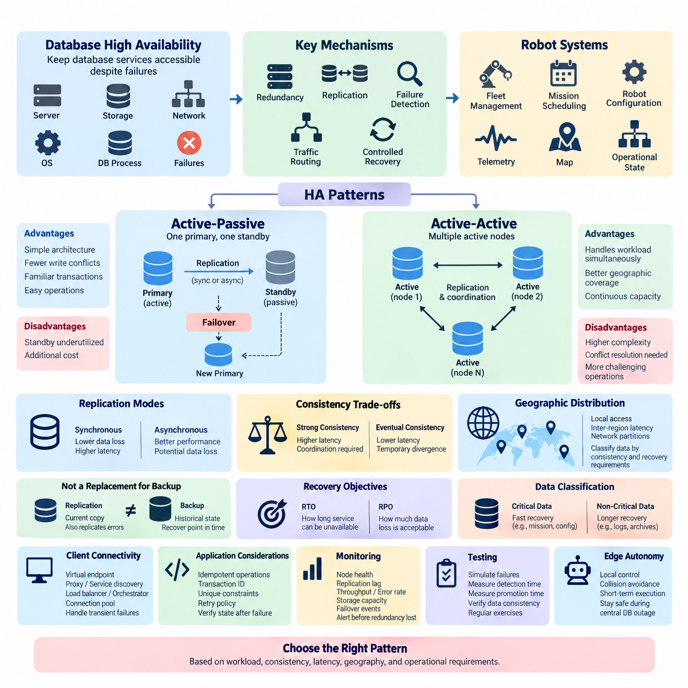
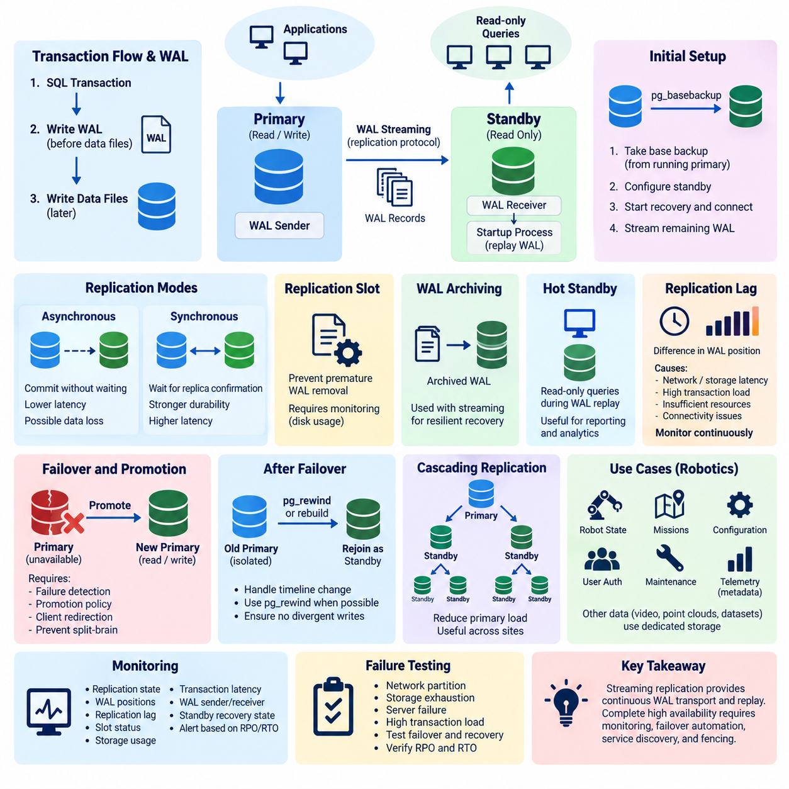
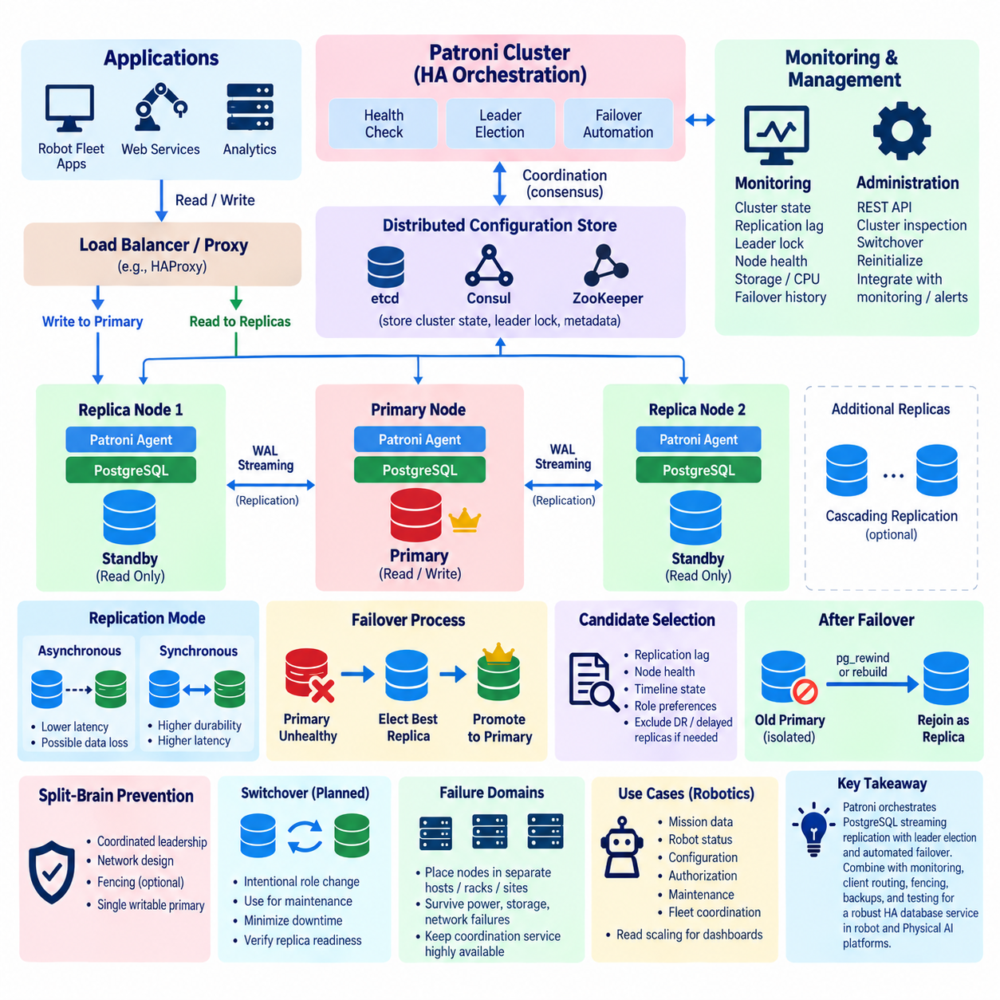
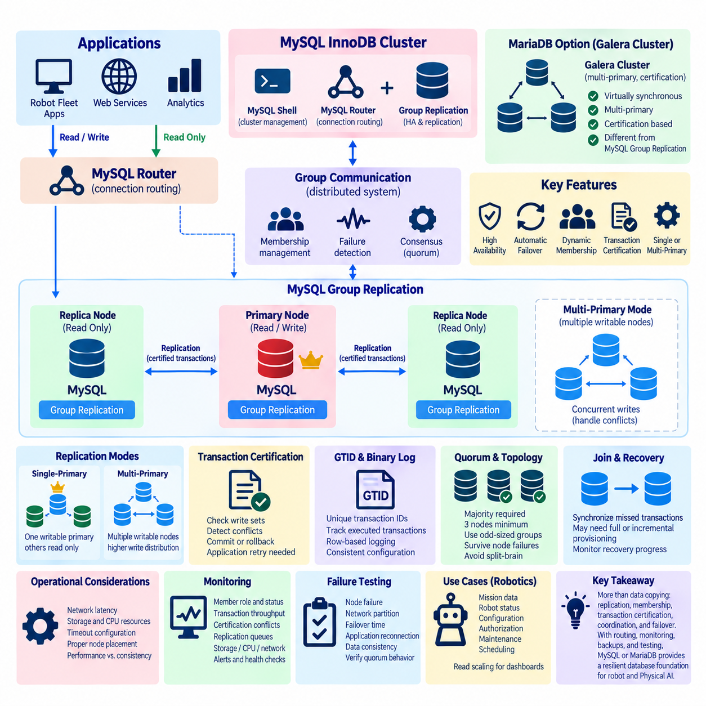
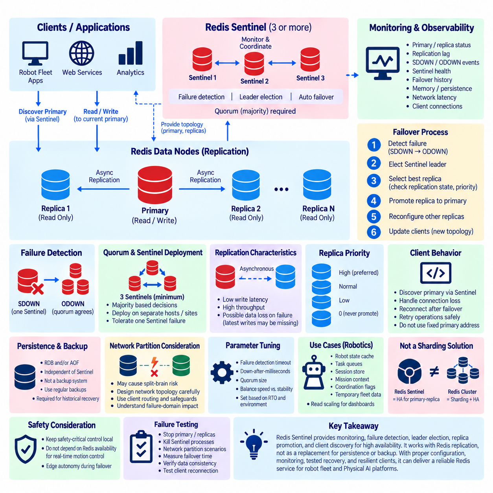
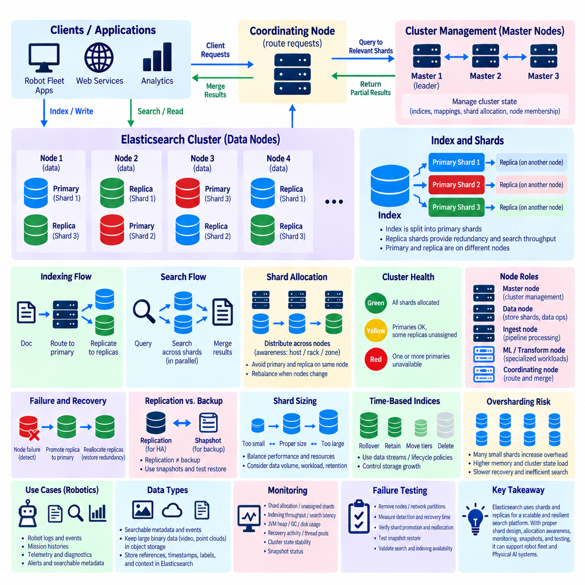
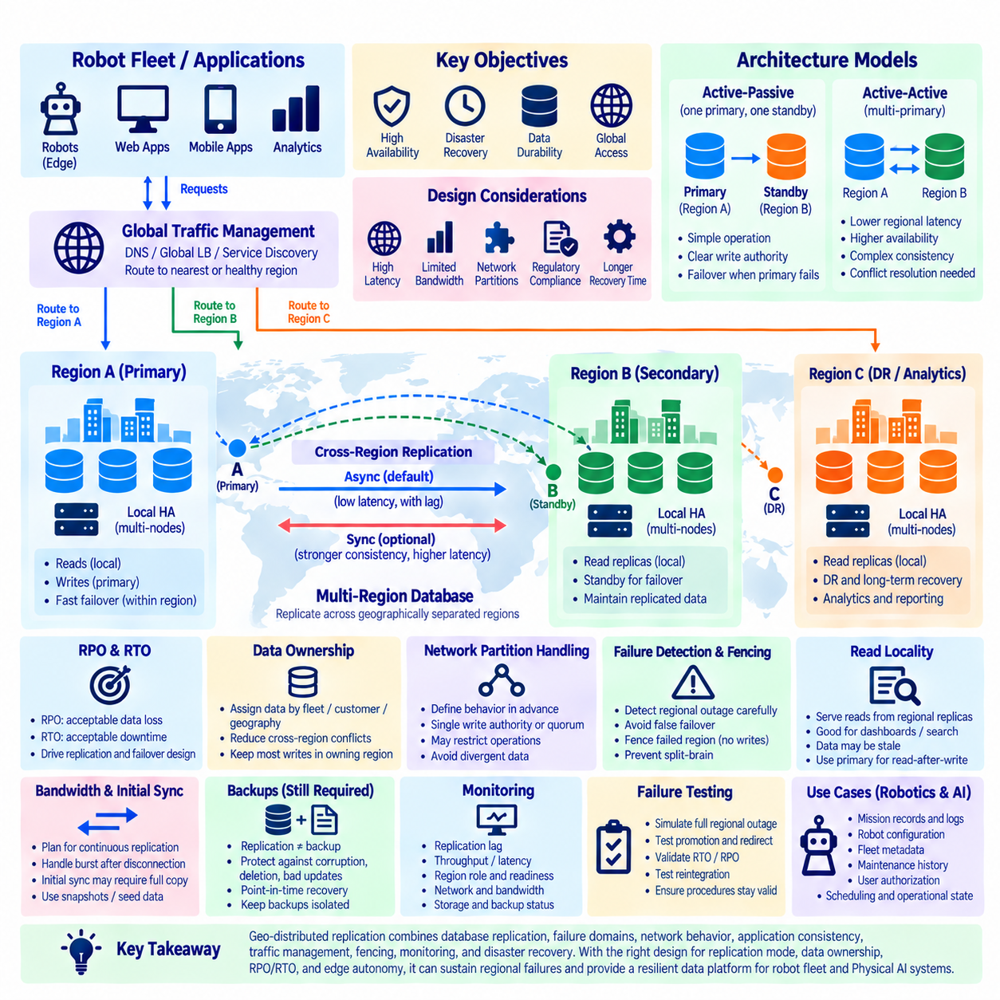
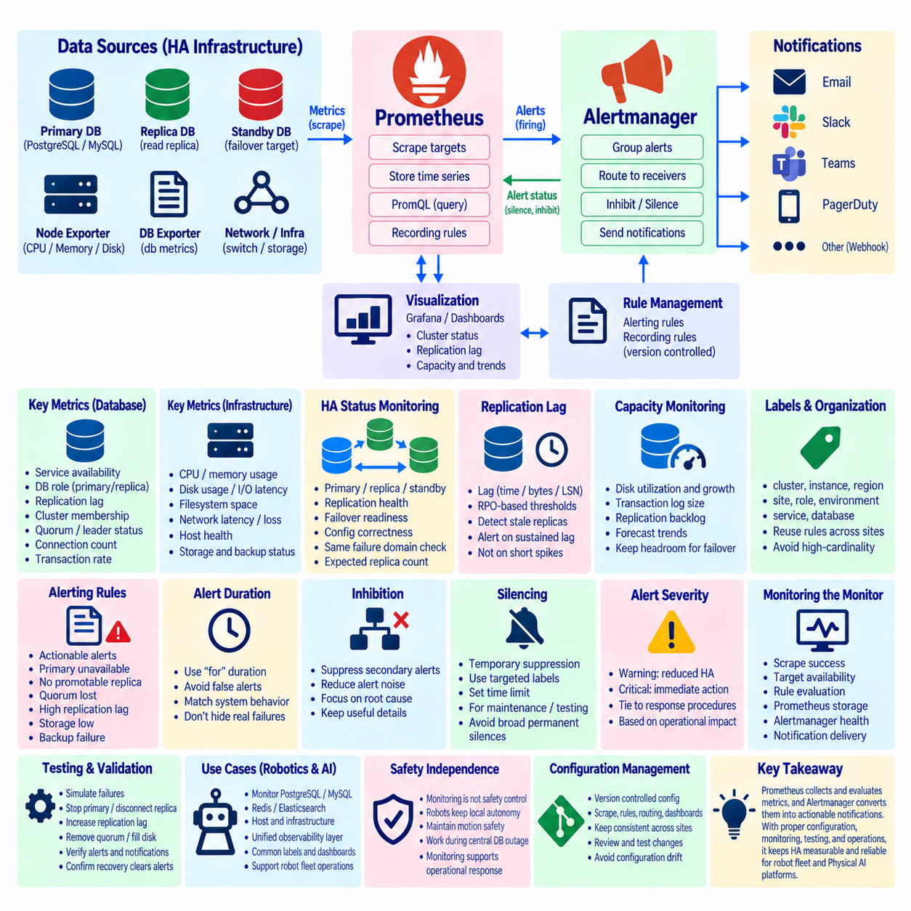
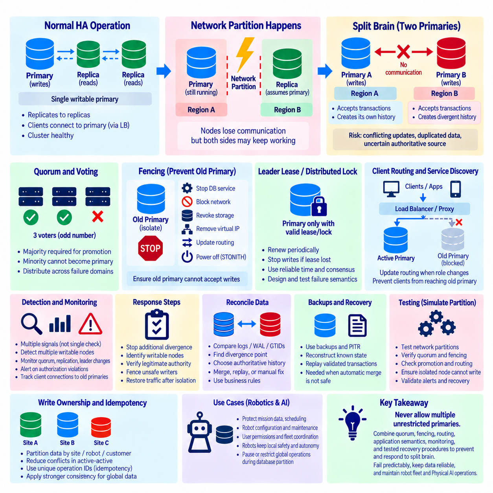
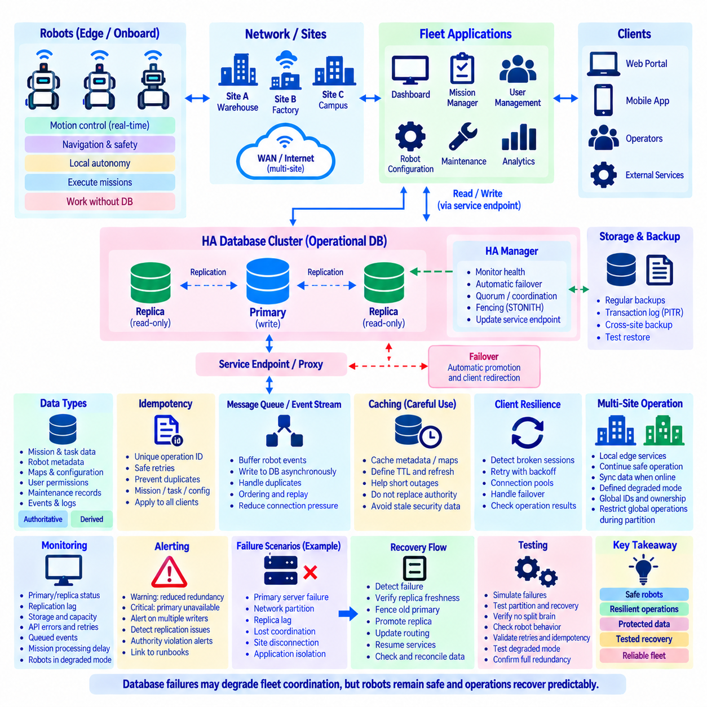

**Volume 08 Robot Database and Storage**


# 10. Database Replication and HA

##  

## 10.01 DB HA Patterns: Active.Passive / Active.Active

{width="7.268055555555556in" height="7.268055555555556in"}

High availability in database systems is the architectural discipline of keeping data services accessible when servers, storage devices, networks, operating systems, or database processes fail. In robotics, this requirement can be especially important because fleet management, mission scheduling, robot configuration, telemetry, maps, and operational state may depend continuously on database services. A high-availability design therefore combines redundancy, replication, failure detection, traffic routing, and controlled recovery rather than relying on a single powerful database server.

Database high availability is commonly described through active-passive and active-active patterns. Both maintain more than one database instance, but they differ in how those instances process workloads. Active-passive architectures normally designate one database node as the operational primary while another remains synchronized and prepared to take over. Active-active architectures allow multiple nodes or sites to process workloads simultaneously, requiring additional mechanisms for coordinating writes, replication, consistency, and conflict resolution.

In an active-passive architecture, applications send normal database traffic to the active node. The passive node receives replicated data but generally does not accept application writes while operating as a standby. Replication may be synchronous, asynchronous, or a combination depending on durability and latency requirements. When the active node fails, the standby is promoted and client connections are redirected to it, restoring database service without requiring the failed machine to return immediately.

The major advantage of active-passive design is architectural clarity. Because one node normally owns the writable database state, application developers face fewer concurrent-write conflicts and the system can preserve familiar transactional behavior. Operations teams can also reason more easily about primary ownership, replication state, and failover. The main disadvantage is that standby resources may provide limited productive capacity during normal operation even though they consume infrastructure, maintenance, monitoring, and licensing resources.

Failover is the central operational process in active-passive HA. A monitoring component detects that the active database is unavailable or unhealthy, verifies whether promotion is safe, selects an eligible standby, promotes it, and redirects database clients. This sequence must distinguish genuine failures from temporary network interruptions. An incorrect promotion can create two nodes that both believe they are primary, producing the dangerous split-brain condition addressed later in this chapter structure.

Synchronous replication can reduce potential data loss by requiring a replica to acknowledge selected changes before a transaction is considered committed. This strengthens durability across node failure but adds communication latency to transaction processing. Asynchronous replication allows the primary to commit without waiting for the replica, usually improving response time but creating replication lag. If the primary fails before outstanding changes reach the standby, recently committed transactions may be unavailable after promotion.

Active-active architecture changes the model by allowing two or more database nodes, clusters, or geographic sites to serve application workloads concurrently. Instead of reserving one environment mainly for failure recovery, infrastructure can contribute to normal service capacity. Requests may be distributed by geography, tenant, robot fleet, shard, or application function. If one active location fails, traffic can potentially move toward another location that was already processing live workloads.

The difficulty of active-active operation lies primarily in data coordination. When multiple nodes can modify the same logical information, concurrent updates may occur before replication delivers each change everywhere. The database architecture must therefore define ownership, consensus, conflict detection, conflict resolution, or application-level reconciliation. Some designs avoid conflicts by assigning specific records or partitions to particular writers, while distributed databases may use quorum or consensus mechanisms to coordinate state across nodes.

Consistency requirements should determine replication architecture rather than treating active-active as automatically superior. Strongly consistent transactions may require coordination among nodes before accepting a write, which can increase latency as network distance grows. Systems prioritizing availability and low-latency local operations may permit temporary divergence and converge later. Robot systems often contain both categories: mission ownership and safety-relevant configuration may demand strict consistency, while some telemetry or historical observations can tolerate delayed synchronization.

Geographic distribution makes this tradeoff more visible. A robot fleet operating across several factories, warehouses, or cities may benefit from databases positioned close to each operational site. Local applications can continue using nearby services when a remote region becomes unreachable. However, inter-region latency and network partitions prevent designers from assuming that every location can synchronously coordinate every transaction at negligible cost. Data domains must therefore be classified according to consistency, latency, and recovery requirements.

High availability should also be distinguished from backup and disaster recovery. Replication creates another current or nearly current copy of database state, but replication can also reproduce accidental deletions, corrupted records, or malicious modifications. Backup retains recoverable historical states, while HA focuses primarily on service continuity. A robust robot data platform consequently combines replication and failover with backup, point-in-time recovery, integrity verification, and disaster-recovery procedures rather than replacing one mechanism with another.

Recovery objectives provide measurable requirements for this architecture. Recovery Time Objective expresses how long a database service may remain unavailable, while Recovery Point Objective expresses how much recent data loss can be tolerated. These targets influence whether manual failover is sufficient, whether automatic promotion is required, how many replicas should exist, and whether synchronous replication is justified. They also connect HA design directly with the backup and recovery concepts developed in the preceding chapter.

Robot databases should not assign identical HA requirements to every dataset. A fleet scheduler, robot authorization database, mission state store, or operational configuration service may require rapid recovery because interruption can stop multiple robots. Historical logs and large sensor archives may accept longer restoration periods. Separating these service classes prevents organizations from applying expensive synchronous redundancy universally while still protecting database functions that directly affect ongoing robot operations.

Client connectivity is another essential layer. Promoting a standby accomplishes little if applications continue connecting to the failed address. HA systems therefore commonly use virtual endpoints, proxies, service discovery, cluster-aware drivers, load balancers, or orchestrators to direct applications toward healthy database instances. Connection pools must also recognize broken sessions and reconnect safely. Robot applications should be designed for transient database failures instead of assuming that every connection remains permanently valid.

Failover must preserve application semantics as well as connectivity. A transaction may have reached the database immediately before a connection was lost, leaving the client uncertain whether the operation committed. Blindly repeating such requests can create duplicate mission records, commands, or events. Idempotent operations, transaction identifiers, unique constraints, retry policies, and explicit state verification help applications recover safely. Database HA is therefore partly an application architecture problem rather than purely an infrastructure configuration problem.

Monitoring determines whether an HA design works reliably in production. Operators should observe node health, replication delay, transaction throughput, storage capacity, connection counts, error rates, replication state, and failover events. Alerting should identify degradation before redundancy disappears completely. A primary database that remains operational while its only replica has been disconnected for hours is technically available, but the system has already lost the redundancy required to survive the next failure.

HA testing must intentionally exercise failure conditions. Teams should test database-process termination, server loss, storage faults, network partitions, replica lag, exhausted disk capacity, and loss of communication between cluster members. Tests should measure detection time, promotion time, application reconnection, transaction behavior, and data consistency after recovery. Periodic exercises reveal assumptions that normal monitoring cannot expose and prepare operators to respond predictably when real infrastructure failures occur.

For robot fleets, database availability should be considered together with edge autonomy. Robots should not become immediately unsafe merely because a central database connection disappears. Essential local control, collision avoidance, and short-term mission execution can remain at the robot or edge layer while centralized databases maintain fleet-level state and coordination. This separation reduces the consequence of temporary database outages while HA mechanisms restore centralized services and reconcile accumulated operational information afterward.

The choice between active-passive and active-active therefore depends on workload characteristics rather than terminology. Active-passive is often appropriate when transactional simplicity, deterministic ownership, and straightforward failover are priorities. Active-active becomes attractive when multiple locations must serve traffic concurrently, geographic latency matters, or service capacity should remain distributed during failures. Its benefits must be balanced against greater complexity in synchronization, consistency management, routing, conflict handling, and operational diagnosis.

A mature architecture may combine both patterns. A regional robot platform could operate active-active services across major sites while each regional database cluster internally uses an active-passive or consensus-based redundancy mechanism. Data can also be partitioned so that each region owns particular robot fleets while replicating selected information globally. Such layered designs demonstrate that database HA is not a single configuration but a hierarchy of failure domains, replication relationships, and application responsibilities.

Ultimately, database high availability is achieved when infrastructure failure becomes an anticipated operating condition rather than an exceptional event. Redundant nodes, appropriate replication modes, reliable health detection, controlled failover, safe client retries, continuous monitoring, and repeated failure testing must work together. These principles provide the conceptual foundation for the subsequent PostgreSQL, Patroni, MySQL or MariaDB, Redis, Elasticsearch, geo-distributed replication, monitoring, and split-brain topics defined in this chapter.

데이터베이스 시스템에서 고가용성(High Availability, HA)은 서버, 저장장치(Storage Device), 네트워크(Network), 운영체제(Operating System), 데이터베이스 프로세스(Database Process) 등에 장애가 발생하더라도 데이터 서비스를 지속적으로 사용할 수 있도록 유지하는 아키텍처 원칙이다. 로보틱스(Robotics) 환경에서는 플릿 관리(Fleet Management), 임무 스케줄링(Mission Scheduling), 로봇 설정(Robot Configuration), 텔레메트리(Telemetry), 지도(Map), 운영 상태(Operational State) 등이 데이터베이스 서비스에 지속적으로 의존할 수 있으므로 이러한 요구가 특히 중요하다. 따라서 고가용성 설계는 하나의 강력한 데이터베이스 서버에 의존하는 대신 이중화(Redundancy), 복제(Replication), 장애 감지(Failure Detection), 트래픽 라우팅(Traffic Routing), 통제된 복구(Controlled Recovery)를 결합한다.

데이터베이스 고가용성은 일반적으로 액티브-패시브(Active-Passive)와 액티브-액티브(Active-Active) 패턴으로 설명된다. 두 방식 모두 하나 이상의 데이터베이스 인스턴스(Database Instance)를 유지하지만, 각 인스턴스가 워크로드(Workload)를 처리하는 방식에서 차이가 있다. 액티브-패시브 아키텍처는 일반적으로 하나의 데이터베이스 노드를 운영 프라이머리(Primary)로 지정하고 다른 노드는 동기화된 상태에서 인계를 준비한다. 액티브-액티브 아키텍처에서는 여러 노드나 사이트가 동시에 워크로드를 처리하므로 쓰기(Write), 복제, 일관성(Consistency), 충돌 해결(Conflict Resolution)을 조정하기 위한 추가 메커니즘이 필요하다.

액티브-패시브 아키텍처(Active-Passive Architecture)에서는 애플리케이션(Application)이 일반적인 데이터베이스 트래픽을 액티브 노드(Active Node)로 전송한다. 패시브 노드(Passive Node)는 복제된 데이터를 수신하지만 대기 노드(Standby)로 동작하는 동안에는 일반적으로 애플리케이션의 쓰기를 허용하지 않는다. 복제 방식은 내구성(Durability)과 지연시간(Latency) 요구사항에 따라 동기식(Synchronous), 비동기식(Asynchronous), 또는 두 방식의 조합을 사용할 수 있다. 액티브 노드에 장애가 발생하면 대기 노드를 승격(Promotion)하고 클라이언트 연결을 해당 노드로 전환하여 장애 서버가 즉시 복구되지 않더라도 데이터베이스 서비스를 재개할 수 있다.

액티브-패시브 설계의 주요 장점은 아키텍처의 명확성이다. 하나의 노드가 일반적으로 쓰기 가능한 데이터베이스 상태를 소유하므로 애플리케이션 개발자는 동시 쓰기 충돌(Concurrent Write Conflict)을 상대적으로 적게 처리하면서 기존의 트랜잭션(Transaction) 동작을 유지할 수 있다. 운영팀 역시 프라이머리 소유권(Primary Ownership), 복제 상태(Replication State), 장애조치(Failover)를 비교적 쉽게 관리할 수 있다. 반면 대기 자원은 인프라, 유지보수, 모니터링(Monitoring), 라이선스 비용을 소비하면서 정상 운영 중에는 제한적인 생산 능력만 제공할 수 있다는 단점이 있다.

장애조치(Failover)는 액티브-패시브 고가용성의 핵심 운영 과정이다. 모니터링 구성요소가 액티브 데이터베이스의 사용 불가능 상태나 비정상 상태를 감지하고, 승격이 안전한지 확인한 후 적절한 대기 노드를 선택하여 승격하고 데이터베이스 클라이언트를 새로운 노드로 전환한다. 이 과정에서는 실제 장애와 일시적인 네트워크 단절(Network Interruption)을 구별해야 한다. 잘못된 승격이 발생하면 두 노드가 모두 자신을 프라이머리라고 판단하는 위험한 스플릿 브레인(Split-Brain) 상태가 발생할 수 있다.

동기식 복제(Synchronous Replication)는 트랜잭션이 커밋(Commit)된 것으로 간주되기 전에 복제본(Replica)이 특정 변경사항을 확인하도록 요구함으로써 잠재적인 데이터 손실을 줄일 수 있다. 이는 노드 장애 상황에서 내구성을 강화하지만 트랜잭션 처리에 통신 지연을 추가한다. 비동기식 복제(Asynchronous Replication)는 프라이머리가 복제본의 응답을 기다리지 않고 커밋할 수 있어 일반적으로 응답시간을 개선하지만 복제 지연(Replication Lag)이 발생할 수 있다. 처리되지 않은 변경사항이 대기 노드에 도달하기 전에 프라이머리가 장애를 일으키면 최근 커밋된 트랜잭션을 승격 이후 사용할 수 없을 수도 있다.

액티브-액티브 아키텍처(Active-Active Architecture)는 둘 이상의 데이터베이스 노드, 클러스터(Cluster), 또는 지리적으로 분산된 사이트가 애플리케이션 워크로드를 동시에 처리할 수 있도록 함으로써 운영 모델을 변화시킨다. 하나의 환경을 주로 장애 복구용으로 대기시키는 대신 여러 인프라가 정상적인 서비스 처리 능력에 기여할 수 있다. 요청은 지리적 위치, 테넌트(Tenant), 로봇 플릿(Robot Fleet), 샤드(Shard), 애플리케이션 기능 등에 따라 분산될 수 있다. 하나의 활성 위치에 장애가 발생하면 이미 실제 워크로드를 처리하고 있던 다른 위치로 트래픽을 이동할 수 있다.

액티브-액티브 운영의 어려움은 주로 데이터 조정(Data Coordination)에 있다. 여러 노드가 동일한 논리적 정보를 수정할 수 있다면 복제를 통해 변경사항이 모든 노드에 전달되기 전에 동시 업데이트(Concurrent Update)가 발생할 수 있다. 따라서 데이터베이스 아키텍처는 소유권(Ownership), 합의(Consensus), 충돌 감지(Conflict Detection), 충돌 해결(Conflict Resolution), 또는 애플리케이션 수준의 조정(Application-Level Reconciliation) 방법을 정의해야 한다. 일부 설계에서는 특정 레코드(Record)나 파티션(Partition)의 쓰기 권한을 특정 노드에 할당하여 충돌을 방지하고, 분산 데이터베이스(Distributed Database)는 쿼럼(Quorum)이나 합의 메커니즘을 사용하여 여러 노드의 상태를 조정할 수 있다.

일관성 요구사항(Consistency Requirement)은 액티브-액티브가 항상 더 우수하다고 가정하기보다 복제 아키텍처를 결정하는 기준이 되어야 한다. 강한 일관성(Strong Consistency)을 요구하는 트랜잭션은 쓰기를 허용하기 전에 노드 사이의 조정이 필요할 수 있으며 네트워크 거리가 증가할수록 지연시간이 증가한다. 가용성과 낮은 로컬 지연시간을 우선하는 시스템은 일시적인 데이터 불일치(Divergence)를 허용하고 이후 다시 수렴하도록 설계할 수 있다. 로봇 시스템에서는 임무 소유권이나 안전 관련 설정은 엄격한 일관성을 요구하는 반면 일부 텔레메트리나 과거 관측 데이터는 지연된 동기화를 허용할 수 있다.

지리적 분산(Geographic Distribution)은 이러한 트레이드오프(Trade-Off)를 더욱 명확하게 보여준다. 여러 공장, 창고, 도시에서 운영되는 로봇 플릿은 각 운영 사이트 가까이에 데이터베이스를 배치함으로써 이점을 얻을 수 있다. 원격 리전(Region)에 접근할 수 없는 경우에도 로컬 애플리케이션은 가까운 서비스를 계속 이용할 수 있다. 그러나 리전 간 지연시간(Inter-Region Latency)과 네트워크 파티션(Network Partition) 때문에 모든 위치가 모든 트랜잭션을 거의 비용 없이 동기식으로 조정할 수 있다고 가정해서는 안 된다. 따라서 데이터 영역은 일관성, 지연시간, 복구 요구사항에 따라 분류되어야 한다.

고가용성은 백업(Backup) 및 재해복구(Disaster Recovery, DR)와도 구별되어야 한다. 복제는 현재 또는 거의 현재 상태의 데이터베이스 사본을 생성하지만 실수로 발생한 삭제, 손상된 레코드, 악의적인 변경사항까지 복제할 수 있다. 백업은 복구 가능한 과거 상태를 보존하는 반면 고가용성은 주로 서비스 연속성(Service Continuity)에 초점을 맞춘다. 따라서 견고한 로봇 데이터 플랫폼은 복제와 장애조치뿐 아니라 백업, 특정 시점 복구(Point-in-Time Recovery, PITR), 무결성 검증(Integrity Verification), 재해복구 절차를 함께 구성해야 한다.

복구 목표(Recovery Objective)는 이러한 아키텍처에 정량적인 요구사항을 제공한다. 복구 시간 목표(Recovery Time Objective, RTO)는 데이터베이스 서비스를 사용할 수 없는 상태가 얼마나 오래 지속될 수 있는지를 의미하며, 복구 시점 목표(Recovery Point Objective, RPO)는 어느 정도의 최근 데이터 손실을 허용할 수 있는지를 의미한다. 이러한 목표에 따라 수동 장애조치가 충분한지, 자동 승격이 필요한지, 몇 개의 복제본을 유지해야 하는지, 동기식 복제가 필요한지가 결정된다. 또한 고가용성 설계를 이전 장에서 다룬 백업 및 복구 개념과 직접 연결한다.

로봇 데이터베이스의 모든 데이터셋(Dataset)에 동일한 고가용성 요구사항을 적용해서는 안 된다. 플릿 스케줄러(Fleet Scheduler), 로봇 인증 데이터베이스(Robot Authorization Database), 임무 상태 저장소(Mission State Store), 운영 설정 서비스(Operational Configuration Service)는 서비스 중단으로 여러 로봇이 정지할 수 있으므로 빠른 복구가 필요할 수 있다. 반면 과거 로그나 대규모 센서 아카이브(Sensor Archive)는 더 긴 복구 시간을 허용할 수 있다. 이러한 서비스 등급을 분리하면 모든 데이터에 고비용의 동기식 이중화를 적용하지 않으면서 실제 로봇 운영에 직접 영향을 미치는 데이터베이스 기능을 보호할 수 있다.

클라이언트 연결성(Client Connectivity)도 중요한 계층이다. 애플리케이션이 계속 장애가 발생한 주소로 접속한다면 대기 노드를 승격하더라도 의미가 없다. 따라서 고가용성 시스템은 가상 엔드포인트(Virtual Endpoint), 프록시(Proxy), 서비스 디스커버리(Service Discovery), 클러스터 인식 드라이버(Cluster-Aware Driver), 로드 밸런서(Load Balancer), 오케스트레이터(Orchestrator) 등을 사용하여 애플리케이션을 정상적인 데이터베이스 인스턴스로 연결한다. 연결 풀(Connection Pool)도 손상된 세션을 인식하고 안전하게 재연결할 수 있어야 한다. 로봇 애플리케이션은 모든 연결이 영구적으로 유지된다고 가정하지 않고 일시적인 데이터베이스 장애를 처리할 수 있도록 설계해야 한다.

장애조치는 연결성뿐만 아니라 애플리케이션 의미론(Application Semantics)도 보존해야 한다. 연결이 끊어지기 직전에 트랜잭션이 데이터베이스에 도달했다면 클라이언트는 해당 작업이 실제로 커밋되었는지 알지 못할 수 있다. 이러한 요청을 무조건 반복하면 중복 임무 레코드, 명령, 이벤트가 생성될 수 있다. 멱등성 연산(Idempotent Operation), 트랜잭션 식별자(Transaction Identifier), 고유 제약조건(Unique Constraint), 재시도 정책(Retry Policy), 명시적인 상태 검증을 사용하면 애플리케이션을 안전하게 복구할 수 있다. 따라서 데이터베이스 고가용성은 단순한 인프라 설정 문제가 아니라 애플리케이션 아키텍처의 문제이기도 하다.

모니터링(Monitoring)은 고가용성 설계가 실제 운영 환경에서 신뢰성 있게 작동하는지를 결정한다. 운영자는 노드 상태(Node Health), 복제 지연, 트랜잭션 처리량(Transaction Throughput), 저장공간 용량, 연결 수, 오류율(Error Rate), 복제 상태, 장애조치 이벤트 등을 관찰해야 한다. 경고(Alerting)는 이중화 기능이 완전히 사라지기 전에 성능 저하를 감지해야 한다. 프라이머리 데이터베이스가 정상적으로 작동하더라도 유일한 복제본이 수시간 동안 연결되지 않았다면 서비스는 사용 가능하지만 다음 장애를 견딜 수 있는 이중화 능력은 이미 상실한 상태이다.

고가용성 테스트(HA Testing)는 의도적으로 장애 조건을 발생시켜야 한다. 데이터베이스 프로세스 종료, 서버 장애, 저장장치 오류, 네트워크 파티션, 복제 지연, 디스크 용량 고갈, 클러스터 구성원 간 통신 단절 등을 시험해야 한다. 테스트에서는 장애 감지 시간(Detection Time), 승격 시간(Promotion Time), 애플리케이션 재연결, 트랜잭션 동작, 복구 후 데이터 일관성을 측정해야 한다. 정기적인 장애 훈련(Failure Exercise)은 정상적인 모니터링으로 확인하기 어려운 가정을 발견하고 실제 인프라 장애가 발생했을 때 운영자가 예측 가능한 방식으로 대응하도록 준비시킨다.

로봇 플릿에서는 데이터베이스 가용성을 엣지 자율성(Edge Autonomy)과 함께 고려해야 한다. 중앙 데이터베이스 연결이 끊어졌다는 이유만으로 로봇이 즉시 안전하지 않은 상태가 되어서는 안 된다. 필수적인 로컬 제어(Local Control), 충돌 회피(Collision Avoidance), 단기 임무 수행(Short-Term Mission Execution)은 로봇이나 엣지 계층(Edge Layer)에 유지할 수 있으며 중앙 데이터베이스는 플릿 수준의 상태와 조정을 담당할 수 있다. 이러한 분리는 일시적인 데이터베이스 장애의 영향을 줄이고 고가용성 메커니즘이 중앙 서비스를 복원한 후 누적된 운영 정보를 다시 조정할 수 있도록 한다.

따라서 액티브-패시브와 액티브-액티브의 선택은 용어 자체가 아니라 워크로드 특성(Workload Characteristics)에 따라 결정되어야 한다. 액티브-패시브는 트랜잭션의 단순성, 결정적인 소유권(Deterministic Ownership), 명확한 장애조치를 우선하는 경우 적합할 수 있다. 액티브-액티브는 여러 위치에서 동시에 트래픽을 처리해야 하거나 지리적 지연시간이 중요하거나 장애 상황에서도 서비스 처리 능력을 분산된 상태로 유지해야 할 때 유용하다. 그러나 그 이점은 동기화, 일관성 관리, 라우팅, 충돌 처리, 운영 진단의 복잡성 증가와 함께 평가되어야 한다.

성숙한 아키텍처는 두 패턴을 결합할 수도 있다. 지역별 로봇 플랫폼은 주요 사이트 사이에서 액티브-액티브 서비스를 운영하면서 각 지역 데이터베이스 클러스터 내부에서는 액티브-패시브 또는 합의 기반 이중화(Consensus-Based Redundancy)를 사용할 수 있다. 또한 각 리전이 특정 로봇 플릿의 데이터를 소유하도록 데이터를 파티셔닝(Partitioning)하면서 일부 정보만 전역적으로 복제할 수도 있다. 이러한 계층적 설계는 데이터베이스 고가용성이 하나의 설정이 아니라 장애 도메인(Failure Domain), 복제 관계(Replication Relationship), 애플리케이션 책임(Application Responsibility)으로 구성된 계층적 구조임을 보여준다.

궁극적으로 데이터베이스 고가용성은 인프라 장애를 예외적인 사건이 아니라 예상된 운영 조건으로 취급할 때 달성된다. 이중화된 노드, 적절한 복제 방식, 신뢰할 수 있는 상태 감지, 통제된 장애조치, 안전한 클라이언트 재시도, 지속적인 모니터링, 반복적인 장애 테스트가 함께 작동해야 한다. 이러한 원칙은 본 장에서 이어지는 PostgreSQL, Patroni, MySQL/MariaDB, Redis, Elasticsearch, 지리적 분산 복제(Geo-Distributed Replication), 모니터링, 스플릿 브레인 대응(Split-Brain Response)을 이해하기 위한 개념적 기반을 제공한다.

##  

## 10.02 PostgreSQL Streaming Replication Deep Dive [w/Code]

{width="7.268055555555556in" height="7.268055555555556in"}

PostgreSQL streaming replication is a physical replication mechanism that continuously transfers Write-Ahead Log (WAL) records from a primary database server to one or more standby servers. Instead of reproducing individual SQL statements, the standby applies low-level changes recorded in WAL, allowing it to maintain a binary-compatible copy of the primary database cluster. This mechanism forms a fundamental building block for PostgreSQL high availability, read scaling, and disaster recovery architectures.

Write-Ahead Logging is the foundation of PostgreSQL replication. Before modified database pages are permanently written to data files, PostgreSQL records the corresponding changes in WAL. This ordering supports crash recovery because committed changes can be reconstructed from the log after a failure. Streaming replication extends the same principle across servers by transmitting WAL records to standby systems, where PostgreSQL replays them to reproduce the primary server\'s database state.

The primary server generates WAL continuously as transactions insert, update, delete, or modify database objects. A WAL sender process on the primary communicates with a WAL receiver process running on each connected standby. The receiver obtains WAL records through PostgreSQL\'s replication protocol and writes them locally. A startup process on the standby then replays those records against its database files, progressively advancing the standby toward the current state of the primary.

A standby normally begins from a consistent physical copy of the primary database cluster. PostgreSQL tools such as pg_basebackup can create this initial base backup while the primary remains operational. Once the required database files and replication configuration are available, the standby starts recovery and connects to the primary. Streaming replication then supplies WAL generated after the base backup, allowing the standby to catch up without repeatedly copying the entire database.

Physical replication requires compatibility between primary and standby environments because WAL describes changes at PostgreSQL\'s storage level rather than as portable logical operations. The standby represents the database cluster as a whole rather than selectively subscribing to arbitrary tables. This differs from logical replication, which operates on logical data changes and can replicate selected tables. Streaming replication is therefore particularly suitable when the objective is maintaining a complete standby for availability and recovery.

PostgreSQL supports asynchronous streaming replication as the common low-latency operating model. In this configuration, the primary can report a transaction as committed without waiting for the standby to confirm that the corresponding WAL has been received or persisted. Application response time is therefore less dependent on replica communication. However, if the primary fails while some WAL remains in transit, the promoted standby may not contain the most recently committed transactions.

Replication lag describes the distance between the primary\'s current WAL position and the progress achieved by a standby. Lag may arise from limited network bandwidth, storage latency, high transaction volume, insufficient standby resources, long recovery operations, or temporary connectivity loss. A replica that is technically connected but significantly behind the primary may provide weaker recovery characteristics than expected. Monitoring replication progress is consequently essential when streaming replication supports production HA.

Synchronous replication changes the commit path by requiring confirmation from designated standby systems according to the configured synchronization policy. A transaction on the primary may wait until the required replica has received, written, flushed, or applied the relevant WAL, depending on configuration. This can substantially reduce the risk of committed transaction loss during primary failure, but database latency becomes more sensitive to network conditions and standby performance.

The choice between synchronous and asynchronous replication should reflect Recovery Point Objective (RPO), transaction criticality, network characteristics, and acceptable application latency. A mission-state database for a robot fleet may justify stronger durability guarantees than a database containing reconstructable operational statistics. Conversely, forcing geographically distant replicas into every synchronous commit path can increase transaction latency and make remote infrastructure conditions directly visible to applications.

PostgreSQL provides replication slots to help coordinate WAL retention for replicas and other replication consumers. A physical replication slot records the WAL position still required by a standby, preventing the primary from removing necessary WAL prematurely. This improves resilience when a replica disconnects temporarily. However, an inactive slot can cause WAL files to accumulate on the primary, potentially exhausting storage, so slot status and retained WAL volume must be continuously monitored.

WAL retention can also be supported through configuration and WAL archiving. Streaming replication delivers records directly while the connection is available, whereas archived WAL provides another path for retrieving historical log segments. A standby can therefore combine restored archive files with streamed WAL. This combination is valuable for resilient recovery architectures because temporary streaming interruptions do not necessarily require rebuilding the replica when the missing WAL remains available from an archive.

Hot standby capability allows read-only queries to execute while a standby continues replaying WAL. This makes replicas useful for reporting, monitoring, analytics, or other read workloads rather than reserving all standby resources exclusively for failure recovery. Read scaling must nevertheless account for replication delay because queries executed on a standby may observe an older database state than queries executed on the primary, especially when asynchronous replication is used.

Read workloads can also interact with WAL replay. A long-running query on the standby may require row versions that incoming WAL needs to remove or modify as part of recovery. PostgreSQL must then resolve the conflict, potentially delaying replay or canceling the conflicting standby query depending on configuration and workload behavior. HA replicas used simultaneously for analytical workloads should therefore be designed so that reporting activity does not undermine replication freshness or recovery readiness.

When a primary database becomes unavailable, a sufficiently current standby can be promoted to become a new writable primary. Promotion ends recovery mode and allows normal read-write transactions. Streaming replication itself provides the replicated database state required for this transition, but complete high availability also requires failure detection, promotion policy, client redirection, and protection against multiple primaries. These responsibilities are commonly handled by additional orchestration components.

After promotion, the old primary cannot simply resume normal writable operation without considering the new cluster history. If both systems accept writes independently, their timelines diverge and split-brain can occur. PostgreSQL uses timeline histories to represent changes in recovery lineage following promotion. Administrators or HA automation must ensure that the former primary is isolated, repaired, rewound when appropriate, or rebuilt before it rejoins the replication topology.

pg_rewind can be useful when a former primary has diverged from the newly promoted server but remains sufficiently compatible for synchronization. Rather than performing another complete base backup, pg_rewind identifies changed blocks and adjusts the old server to follow the new timeline. This can reduce recovery time and network transfer for large database clusters, although correct prerequisites, WAL availability, and operational procedures remain essential before the server is safely returned as a standby.

Cascading replication allows a standby to provide WAL to additional downstream standbys. Instead of every replica connecting directly to the primary, intermediate replicas distribute replication traffic. This architecture can reduce network and WAL-sender load on the primary and can be useful across sites or network boundaries. The trade-off is that downstream replicas inherit additional replication paths and may experience greater lag or become disconnected when an upstream standby fails.

For robot and Physical AI systems, streaming replication can protect operational databases containing fleet state, mission records, robot configuration, user authorization, maintenance information, and structured telemetry metadata. A local standby can provide rapid recovery from server failure, while additional replicas may support read-intensive fleet dashboards or remote recovery. Large raw sensor datasets, video, point clouds, and training archives are normally better handled by storage architectures designed for those data types.

Replication health should be monitored through PostgreSQL statistics and operational metrics rather than inferred only from whether a standby process is running. Important observations include replica connection state, WAL sender and receiver activity, WAL positions, replay progress, replication lag, replication-slot status, retained WAL volume, transaction latency, storage consumption, and standby recovery state. Alert thresholds should reflect the actual RPO and RTO required by each database service.

Failure testing is necessary because a replication topology that appears healthy during normal operation may behave differently during network partitions, storage exhaustion, abrupt server loss, or heavy transaction load. Operators should validate replica catch-up, WAL retention, promotion, client reconnection, old-primary isolation, and reconstruction of failed replicas. Tests should also verify whether the measured data-loss window and recovery duration remain within the intended RPO and RTO.

PostgreSQL streaming replication should therefore be understood as a continuous WAL transport and replay system rather than a complete HA solution by itself. It supplies synchronized standby database state, while production availability depends on surrounding mechanisms for monitoring, quorum or leader decisions, automated failover, service discovery, fencing, and recovery. This distinction provides the foundation for the next topic, where Patroni coordinates PostgreSQL replication nodes into an automated high-availability cluster.

PostgreSQL 스트리밍 복제(Streaming Replication)는 프라이머리 데이터베이스 서버(Primary Database Server)에서 하나 이상의 대기 서버(Standby Server)로 쓰기 선행 로그(Write-Ahead Log, WAL) 레코드를 지속적으로 전송하는 물리적 복제(Physical Replication) 메커니즘이다. 개별 SQL 문장을 다시 실행하는 대신 대기 서버가 WAL에 기록된 저수준 변경사항을 적용하여 프라이머리 데이터베이스 클러스터와 바이너리 호환(Binary-Compatible)되는 복사본을 유지한다. 이 메커니즘은 PostgreSQL 고가용성(High Availability), 읽기 확장(Read Scaling), 재해복구(Disaster Recovery) 아키텍처의 핵심 기반을 형성한다.

쓰기 선행 로깅(Write-Ahead Logging)은 PostgreSQL 복제의 기반이다. 수정된 데이터베이스 페이지(Database Page)가 데이터 파일에 영구적으로 기록되기 전에 PostgreSQL은 해당 변경사항을 WAL에 기록한다. 이러한 순서는 장애 발생 후 로그를 이용하여 커밋된 변경사항을 복구할 수 있으므로 충돌 복구(Crash Recovery)를 지원한다. 스트리밍 복제는 동일한 원리를 서버 간으로 확장하여 WAL 레코드를 대기 시스템으로 전송하고, PostgreSQL이 이를 재생(Replay)하여 프라이머리 서버의 데이터베이스 상태를 재현하도록 한다.

프라이머리 서버는 트랜잭션(Transaction)이 데이터를 삽입(Insert), 갱신(Update), 삭제(Delete)하거나 데이터베이스 객체를 변경할 때 지속적으로 WAL을 생성한다. 프라이머리의 WAL 송신 프로세스(WAL Sender Process)는 연결된 각 대기 서버에서 실행되는 WAL 수신 프로세스(WAL Receiver Process)와 통신한다. 수신기는 PostgreSQL 복제 프로토콜(Replication Protocol)을 통해 WAL 레코드를 받아 로컬에 기록한다. 이후 대기 서버의 시작 프로세스(Startup Process)가 해당 레코드를 데이터베이스 파일에 재생하여 프라이머리의 현재 상태에 점진적으로 접근한다.

대기 서버는 일반적으로 프라이머리 데이터베이스 클러스터의 일관된 물리적 복사본(Physical Copy)에서 시작한다. pg_basebackup과 같은 PostgreSQL 도구를 사용하면 프라이머리가 운영되는 동안 초기 기본 백업(Base Backup)을 생성할 수 있다. 필요한 데이터베이스 파일과 복제 설정이 준비되면 대기 서버는 복구(Recovery)를 시작하고 프라이머리에 연결한다. 이후 스트리밍 복제가 기본 백업 이후 생성된 WAL을 전달함으로써 전체 데이터베이스를 반복해서 복사하지 않고도 대기 서버가 프라이머리 상태를 따라잡을 수 있다.

물리적 복제는 WAL이 이식 가능한 논리적 연산(Logical Operation)이 아니라 PostgreSQL 저장장치 수준(Storage Level)의 변경사항을 기술하기 때문에 프라이머리와 대기 서버 환경 사이의 호환성을 요구한다. 대기 서버는 임의의 테이블만 선택적으로 구독하는 것이 아니라 데이터베이스 클러스터 전체를 복제한다. 이는 논리적 데이터 변경을 기반으로 선택된 테이블을 복제할 수 있는 논리적 복제(Logical Replication)와 다르다. 따라서 스트리밍 복제는 완전한 대기 시스템을 유지하여 가용성과 복구 능력을 확보하려는 경우에 특히 적합하다.

PostgreSQL은 일반적인 저지연 운영 모델(Low-Latency Operating Model)로 비동기식 스트리밍 복제(Asynchronous Streaming Replication)를 지원한다. 이 구성에서는 프라이머리가 대기 서버에서 해당 WAL을 수신하거나 영구 저장했다는 확인을 기다리지 않고 트랜잭션이 커밋되었다고 응답할 수 있다. 따라서 애플리케이션 응답시간이 복제본과의 통신에 상대적으로 덜 의존한다. 그러나 일부 WAL이 전송 중인 상태에서 프라이머리에 장애가 발생하면 승격된 대기 서버에는 가장 최근에 커밋된 트랜잭션이 존재하지 않을 수 있다.

복제 지연(Replication Lag)은 프라이머리의 현재 WAL 위치와 대기 서버가 처리한 위치 사이의 차이를 의미한다. 제한된 네트워크 대역폭(Network Bandwidth), 저장장치 지연(Storage Latency), 높은 트랜잭션 처리량, 부족한 대기 서버 자원, 장시간의 복구 작업, 일시적인 연결 단절 등으로 인해 복제 지연이 발생할 수 있다. 기술적으로 연결되어 있더라도 프라이머리보다 크게 뒤처진 복제본은 예상보다 낮은 복구 능력을 제공할 수 있다. 따라서 스트리밍 복제를 운영 고가용성에 사용하는 경우 복제 진행 상태를 지속적으로 모니터링하는 것이 필수적이다.

동기식 복제(Synchronous Replication)는 설정된 동기화 정책에 따라 지정된 대기 시스템으로부터 확인 응답을 요구함으로써 커밋 경로(Commit Path)를 변경한다. 프라이머리의 트랜잭션은 설정에 따라 필요한 복제본이 관련 WAL을 수신(Receive), 기록(Write), 플러시(Flush), 또는 적용(Apply)할 때까지 기다릴 수 있다. 이를 통해 프라이머리 장애 시 이미 커밋된 트랜잭션이 손실될 위험을 크게 줄일 수 있지만 데이터베이스 지연시간이 네트워크 상태와 대기 서버 성능에 더 민감해진다.

동기식 복제와 비동기식 복제의 선택은 복구 시점 목표(Recovery Point Objective, RPO), 트랜잭션 중요도(Transaction Criticality), 네트워크 특성, 허용 가능한 애플리케이션 지연시간을 반영해야 한다. 로봇 플릿(Robot Fleet)의 임무 상태 데이터베이스(Mission-State Database)는 재구성 가능한 운영 통계 데이터베이스보다 강력한 내구성 보장(Durability Guarantee)이 필요할 수 있다. 반대로 지리적으로 멀리 떨어진 복제본을 모든 동기식 커밋 경로에 강제로 포함하면 트랜잭션 지연이 증가하고 원격 인프라 상태가 애플리케이션 성능에 직접 영향을 줄 수 있다.

PostgreSQL은 복제본 및 다른 복제 소비자(Replication Consumer)의 WAL 보존을 조정하기 위해 복제 슬롯(Replication Slot)을 제공한다. 물리적 복제 슬롯(Physical Replication Slot)은 대기 서버가 여전히 필요로 하는 WAL 위치를 기록하여 프라이머리가 필요한 WAL을 너무 일찍 제거하지 못하도록 한다. 이는 복제본의 연결이 일시적으로 끊어진 경우 복원력을 높인다. 그러나 비활성 슬롯(Inactive Slot)은 프라이머리에 WAL 파일이 계속 누적되게 하여 저장공간을 고갈시킬 수 있으므로 슬롯 상태와 보존된 WAL 용량을 지속적으로 모니터링해야 한다.

WAL 보존(WAL Retention)은 관련 설정과 WAL 아카이빙(WAL Archiving)을 통해서도 지원할 수 있다. 스트리밍 복제는 연결이 가능한 동안 WAL 레코드를 직접 전달하는 반면, 아카이브된 WAL은 과거 로그 세그먼트(Log Segment)를 가져올 수 있는 또 다른 경로를 제공한다. 따라서 대기 서버는 복원된 아카이브 파일과 스트리밍된 WAL을 함께 사용할 수 있다. 이러한 조합은 일시적인 스트리밍 중단이 발생하더라도 누락된 WAL이 아카이브에 남아 있다면 복제본을 다시 구축하지 않아도 되므로 복원력 있는 복구 아키텍처에 유용하다.

핫 스탠바이(Hot Standby) 기능을 사용하면 대기 서버가 WAL을 계속 재생하는 동안 읽기 전용 쿼리(Read-Only Query)를 실행할 수 있다. 이를 통해 모든 대기 서버 자원을 장애 복구 목적으로만 유지하지 않고 보고(Reporting), 모니터링, 분석(Analytics) 또는 기타 읽기 워크로드에 활용할 수 있다. 그러나 읽기 확장에서는 복제 지연을 고려해야 한다. 특히 비동기식 복제를 사용하는 경우 대기 서버에서 실행되는 쿼리가 프라이머리에서 실행되는 쿼리보다 오래된 데이터베이스 상태를 관찰할 수 있기 때문이다.

읽기 워크로드(Read Workload)는 WAL 재생과 상호작용할 수도 있다. 대기 서버에서 실행되는 장시간 쿼리는 수신되는 WAL이 복구 과정에서 제거하거나 변경해야 하는 이전 행 버전(Row Version)을 필요로 할 수 있다. 이 경우 PostgreSQL은 충돌을 해결해야 하며 설정과 워크로드 동작에 따라 WAL 재생을 지연시키거나 충돌하는 대기 서버 쿼리를 취소할 수 있다. 따라서 분석 워크로드에도 사용되는 고가용성 복제본은 보고 작업이 복제 최신성이나 복구 준비 상태를 저해하지 않도록 설계해야 한다.

프라이머리 데이터베이스를 사용할 수 없게 되면 충분히 최신 상태인 대기 서버를 승격(Promotion)하여 새로운 쓰기 가능한 프라이머리로 전환할 수 있다. 승격은 복구 모드(Recovery Mode)를 종료하고 정상적인 읽기-쓰기 트랜잭션(Read-Write Transaction)을 허용한다. 스트리밍 복제 자체는 이러한 전환에 필요한 복제된 데이터베이스 상태를 제공하지만 완전한 고가용성을 구현하려면 장애 감지(Failure Detection), 승격 정책(Promotion Policy), 클라이언트 전환(Client Redirection), 다중 프라이머리 방지 기능도 필요하다. 이러한 책임은 일반적으로 추가적인 오케스트레이션(Orchestration) 구성요소가 담당한다.

승격 이후 기존 프라이머리는 새로운 클러스터 이력(Cluster History)을 고려하지 않은 상태에서 단순히 쓰기 가능한 운영을 재개해서는 안 된다. 두 시스템이 독립적으로 쓰기를 허용하면 각각의 타임라인(Timeline)이 분기되어 스플릿 브레인(Split-Brain)이 발생할 수 있다. PostgreSQL은 승격 이후 복구 계보(Recovery Lineage)의 변화를 표현하기 위해 타임라인 이력(Timeline History)을 사용한다. 관리자 또는 고가용성 자동화 시스템은 기존 프라이머리를 격리하고 필요에 따라 복구, 되감기(Rewind), 또는 재구축한 후 복제 토폴로지(Replication Topology)에 다시 참여시켜야 한다.

pg_rewind는 기존 프라이머리가 새롭게 승격된 서버와 분기되었지만 다시 동기화할 수 있는 조건을 만족할 때 유용하다. 새로운 전체 기본 백업을 수행하는 대신 pg_rewind는 변경된 블록(Block)을 식별하여 기존 서버가 새로운 타임라인을 따르도록 조정한다. 이를 통해 대규모 데이터베이스 클러스터의 복구 시간과 네트워크 전송량을 줄일 수 있다. 다만 서버를 안전하게 대기 노드로 복귀시키기 전에 필요한 조건, WAL 가용성, 적절한 운영 절차가 충족되어야 한다.

계단식 복제(Cascading Replication)를 사용하면 하나의 대기 서버가 추가적인 하위 대기 서버(Downstream Standby)에 WAL을 제공할 수 있다. 모든 복제본이 프라이머리에 직접 연결하는 대신 중간 복제본이 복제 트래픽을 분산한다. 이러한 아키텍처는 프라이머리의 네트워크 및 WAL 송신기(WAL Sender) 부하를 줄일 수 있으며 사이트 또는 네트워크 경계를 넘어 복제할 때 유용하다. 반면 하위 복제본은 추가적인 복제 경로를 거치기 때문에 복제 지연이 증가하거나 상위 대기 서버에 장애가 발생하면 연결이 끊어질 수 있다.

로봇 및 피지컬 AI(Physical AI) 시스템에서 스트리밍 복제는 플릿 상태(Fleet State), 임무 기록(Mission Record), 로봇 설정, 사용자 인증(User Authorization), 유지보수 정보(Maintenance Information), 구조화된 텔레메트리 메타데이터(Structured Telemetry Metadata)를 포함하는 운영 데이터베이스를 보호할 수 있다. 로컬 대기 서버는 서버 장애 발생 시 빠른 복구를 제공할 수 있으며 추가적인 복제본은 읽기 집약적인 플릿 대시보드(Fleet Dashboard)나 원격 복구를 지원할 수 있다. 대규모 원시 센서 데이터, 영상, 포인트 클라우드(Point Cloud), 학습 아카이브(Training Archive)는 일반적으로 해당 데이터 유형에 적합한 별도의 저장 아키텍처에서 처리하는 것이 적절하다.

복제 상태(Replication Health)는 대기 서버 프로세스가 실행 중인지 여부만으로 판단하지 않고 PostgreSQL 통계와 운영 지표를 통해 모니터링해야 한다. 주요 관찰 대상에는 복제본 연결 상태, WAL 송신기 및 수신기 활동, WAL 위치, 재생 진행 상태, 복제 지연, 복제 슬롯 상태, 보존된 WAL 용량, 트랜잭션 지연시간, 저장공간 사용량, 대기 서버 복구 상태 등이 포함된다. 경고 임계값(Alert Threshold)은 각 데이터베이스 서비스에서 실제로 요구하는 RPO와 복구 시간 목표(Recovery Time Objective, RTO)를 반영해야 한다.

장애 테스트(Failure Testing)는 정상적으로 보이는 복제 토폴로지가 네트워크 파티션(Network Partition), 저장공간 고갈(Storage Exhaustion), 갑작스러운 서버 장애, 높은 트랜잭션 부하 등의 상황에서 다르게 동작할 수 있기 때문에 반드시 필요하다. 운영자는 복제본 따라잡기(Replica Catch-Up), WAL 보존, 승격, 클라이언트 재연결, 기존 프라이머리 격리, 장애 복제본 재구축 과정을 검증해야 한다. 또한 측정된 데이터 손실 구간과 복구 시간이 목표로 설정한 RPO 및 RTO 범위 안에 유지되는지도 확인해야 한다.

따라서 PostgreSQL 스트리밍 복제는 그 자체만으로 완전한 고가용성 솔루션이라기보다 지속적인 WAL 전송 및 재생 시스템(Continuous WAL Transport and Replay System)으로 이해해야 한다. 스트리밍 복제는 동기화된 대기 데이터베이스 상태를 제공하지만 실제 운영 가용성은 모니터링, 쿼럼(Quorum) 또는 리더 결정(Leader Decision), 자동 장애조치(Automated Failover), 서비스 디스커버리, 펜싱(Fencing), 복구를 담당하는 주변 메커니즘에 의존한다. 이러한 구분은 다음 절에서 Patroni가 PostgreSQL 복제 노드들을 자동화된 고가용성 클러스터(Automated High-Availability Cluster)로 조정하는 원리를 이해하기 위한 기반을 제공한다.

##  

## 10.03 PostgreSQL Patroni HA Cluster: Auto Failover [w/Code]

{width="7.268055555555556in" height="7.268055555555556in"}

Patroni is an open-source high-availability orchestration framework designed to manage PostgreSQL clusters and automate leader election, replication control, and failover. PostgreSQL streaming replication provides synchronized database copies, but replication alone does not decide which server should become primary after a failure. Patroni adds this coordination layer, transforming multiple PostgreSQL instances into an operational HA cluster capable of responding automatically to node and service failures.

A typical Patroni architecture consists of several PostgreSQL nodes running Patroni agents together with a distributed configuration store or distributed consensus system. Patroni continuously observes PostgreSQL health and cluster membership while coordinating leadership through shared state. Instead of allowing each database server to independently decide whether it should become primary, the cluster uses coordinated leader information to maintain a single authoritative writable PostgreSQL instance.

Distributed consensus is essential because failover decisions must remain coordinated even when servers or network paths fail. Patroni commonly integrates with distributed systems such as etcd, Consul, or ZooKeeper, while deployments may also use supported alternatives depending on architecture. The distributed coordination layer stores cluster metadata and leader information. Patroni nodes compete for or renew leadership according to defined rules, allowing the cluster to distinguish the current leader from replicas.

The Patroni leader normally hosts the writable PostgreSQL primary. It periodically renews a leader lock or equivalent leadership state in the distributed configuration store. As long as the node remains healthy and can maintain this leadership information, other Patroni members continue operating as replicas. If the leader becomes unavailable or can no longer renew its leadership state within the configured timing conditions, the remaining members can begin an election and failover process.

PostgreSQL replicas under Patroni normally use streaming replication to receive WAL from the current primary. Patroni therefore does not replace PostgreSQL\'s native replication mechanism; instead, it manages and coordinates it. PostgreSQL remains responsible for WAL generation, transmission, and replay, while Patroni supervises node roles, replication configuration, promotion, demotion, and topology changes. This separation is important for understanding where database durability ends and HA orchestration begins.

Automatic failover begins when the current leader is considered unavailable according to Patroni\'s health and coordination logic. Eligible replicas are evaluated as candidates for promotion. Replication state matters because promoting a severely delayed replica could increase data loss. After a suitable replica obtains leadership, Patroni promotes its PostgreSQL instance from recovery mode into a writable primary and updates cluster state so that other members can recognize and follow the new leader.

Failover timing requires careful configuration. Patroni parameters governing the control loop, leader lock lifetime, retry behavior, and failover decisions determine how rapidly the cluster reacts to failures. Aggressive timing may reduce service interruption but can make the system more sensitive to temporary network instability or overloaded infrastructure. Conservative timing can reduce unnecessary role changes but increases recovery time. These settings should therefore be aligned with the database service\'s Recovery Time Objective (RTO).

Recovery Point Objective (RPO) depends strongly on PostgreSQL replication mode rather than Patroni alone. With asynchronous replication, transactions acknowledged by the failed primary may not yet exist on the promoted replica. Patroni can automate promotion, but it cannot reconstruct WAL that never reached another server. Synchronous replication can reduce this exposure by requiring selected replicas to confirm WAL progress before commits complete, at the cost of additional transaction latency and availability considerations.

Candidate selection is consequently more than simply choosing any running replica. A production HA design should consider replication lag, timeline state, node health, topology, and whether a member is intended to participate in promotion. Patroni provides mechanisms for controlling member behavior so that particular nodes can serve specialized roles. For example, a remote disaster-recovery replica or delayed replica may be valuable for recovery while being inappropriate as an automatic failover candidate.

Split-brain prevention is one of the most important responsibilities of a PostgreSQL HA architecture. If two database nodes simultaneously accept writes as primary, their histories can diverge and automated reconciliation becomes difficult. Patroni uses coordinated leadership to reduce this risk, but reliable operation also depends on sound network design and operational controls. In critical environments, fencing mechanisms may be added to ensure that an isolated former primary cannot continue accepting application writes.

When a failed former primary returns, it cannot automatically assume its previous role because another server may already have accepted new transactions as the current primary. Its database timeline may have diverged from the cluster. Patroni can coordinate reinitialization or use PostgreSQL recovery mechanisms such as pg_rewind where appropriate. The returning node must be synchronized with the current leader before it can safely rejoin the cluster as a replica.

Patroni exposes a REST API that supports health checks, cluster inspection, and administrative operations. Load balancers, proxies, monitoring platforms, or service-discovery mechanisms can use node state to determine which PostgreSQL instance currently serves the primary role and which instances are replicas. This interface helps separate database role management from client routing, allowing infrastructure components to direct write traffic toward the leader and, when appropriate, read traffic toward replicas.

Client routing remains a separate architectural concern because Patroni does not automatically make every application connection follow a newly promoted primary. Production environments commonly place a routing or proxy layer in front of PostgreSQL or integrate service discovery with application connection logic. Components such as HAProxy can use Patroni health information to identify the writable leader. Connection pools must also discard failed sessions and reconnect applications after failover.

Patroni supports controlled administrative operations in addition to unexpected automatic failover. A planned switchover intentionally transfers leadership from a healthy primary to an eligible replica, which is useful during maintenance, operating-system updates, hardware replacement, or infrastructure migration. Unlike emergency failover, switchover can be coordinated while the existing primary remains available, allowing administrators to reduce disruption and verify replica readiness before changing database leadership.

Cluster topology should account for failure domains rather than merely counting database servers. Three nodes located on the same physical host, storage system, power domain, or network switch may not provide meaningful resilience against infrastructure failure. PostgreSQL and Patroni nodes should be distributed according to the failures the system is expected to survive. Coordination services must likewise remain available because loss of distributed consensus can affect the cluster\'s ability to safely perform leadership changes.

Monitoring a Patroni cluster requires observing both PostgreSQL replication health and orchestration state. Important information includes the current leader, member availability, replication lag, WAL positions, timeline changes, leader-lock status, failover history, PostgreSQL process health, storage capacity, connection load, and distributed coordination service health. Monitoring only PostgreSQL can miss orchestration failures, while monitoring only Patroni can overlook database-level degradation that makes a replica unsuitable for promotion.

Operational testing should deliberately reproduce realistic failure scenarios. Tests can terminate PostgreSQL, stop Patroni, isolate a node from the network, interrupt the coordination service, introduce replication lag, or simulate host loss. Engineers should measure detection time, leader election, promotion time, application reconnection, transaction behavior, and replica recovery. The objective is not simply to demonstrate that failover occurs, but to confirm that the entire database service returns within its intended RTO and RPO.

For robot fleet platforms, Patroni can protect centralized operational databases containing mission assignments, robot status, configuration, authorization, maintenance records, and fleet coordination information. If the active database server fails, automatic promotion can restore centralized data services without waiting for manual database intervention. Robots should nevertheless preserve essential local autonomy so that collision avoidance, safety control, and short-term execution do not depend entirely on continuous database availability.

A practical robot deployment may place PostgreSQL and Patroni nodes across independent edge or on-premise servers while keeping low-level robot control outside the HA database path. The database cluster maintains persistent fleet-level information, whereas robots and edge controllers continue safety-critical operations locally. After a database failover, applications reconnect to the new primary and synchronize operational state, limiting the effect of infrastructure failure on physical robot behavior.

Security must also cover the entire HA control plane. PostgreSQL authentication, replication credentials, Patroni API access, coordination-service permissions, network segmentation, encryption, and secret management should be treated as related controls. An attacker capable of manipulating leadership information or administrative APIs could affect database availability even without directly modifying application tables. HA infrastructure therefore requires security controls comparable to those protecting the database itself.

Patroni should ultimately be understood as the orchestration layer surrounding PostgreSQL streaming replication rather than as a replacement for PostgreSQL replication. PostgreSQL maintains replicated data through WAL, while Patroni determines roles, coordinates leadership, automates promotion, and manages cluster membership. Combined with distributed coordination, client routing, monitoring, fencing, backups, and tested recovery procedures, it provides a foundation for automated PostgreSQL high availability in robot and Physical AI platforms.

Patroni는 PostgreSQL 클러스터를 관리하고 리더 선출(Leader Election), 복제 제어(Replication Control), 장애조치(Failover)를 자동화하도록 설계된 오픈소스 고가용성 오케스트레이션 프레임워크(Open-Source High-Availability Orchestration Framework)이다. PostgreSQL 스트리밍 복제(Streaming Replication)는 동기화된 데이터베이스 복사본을 제공하지만 복제 기능 자체는 장애 이후 어떤 서버가 프라이머리(Primary)가 되어야 하는지 결정하지 않는다. Patroni는 이러한 조정 계층(Coordination Layer)을 추가하여 여러 PostgreSQL 인스턴스를 노드 및 서비스 장애에 자동 대응할 수 있는 운영 고가용성 클러스터(HA Cluster)로 구성한다.

일반적인 Patroni 아키텍처는 Patroni 에이전트(Patroni Agent)가 실행되는 여러 PostgreSQL 노드와 분산 설정 저장소(Distributed Configuration Store) 또는 분산 합의 시스템(Distributed Consensus System)으로 구성된다. Patroni는 공유 상태(Shared State)를 통해 리더십(Leadership)을 조정하면서 PostgreSQL 상태와 클러스터 구성원을 지속적으로 관찰한다. 각 데이터베이스 서버가 자신이 프라이머리가 되어야 하는지를 독립적으로 판단하는 대신 클러스터는 조정된 리더 정보를 사용하여 하나의 권위 있는 쓰기 가능 PostgreSQL 인스턴스를 유지한다.

분산 합의(Distributed Consensus)는 서버나 네트워크 경로에 장애가 발생하더라도 장애조치 결정을 일관되게 유지해야 하므로 매우 중요하다. Patroni는 일반적으로 etcd, Consul, ZooKeeper와 같은 분산 시스템과 통합되며 아키텍처에 따라 지원되는 다른 대안을 사용할 수도 있다. 분산 조정 계층(Distributed Coordination Layer)은 클러스터 메타데이터(Cluster Metadata)와 리더 정보를 저장한다. Patroni 노드는 정의된 규칙에 따라 리더십을 획득하거나 갱신함으로써 현재 리더와 복제본(Replica)을 구분한다.

Patroni 리더(Leader)는 일반적으로 쓰기 가능한 PostgreSQL 프라이머리를 호스팅한다. 리더는 분산 설정 저장소에서 리더 잠금(Leader Lock) 또는 이에 해당하는 리더십 상태를 주기적으로 갱신한다. 노드가 정상 상태를 유지하고 이러한 리더십 정보를 계속 유지할 수 있는 동안 다른 Patroni 구성원은 복제본으로 동작한다. 리더를 사용할 수 없게 되거나 설정된 시간 조건 안에서 리더십 상태를 갱신할 수 없게 되면 나머지 구성원들이 리더 선출 및 장애조치 절차를 시작할 수 있다.

Patroni가 관리하는 PostgreSQL 복제본은 일반적으로 스트리밍 복제(Streaming Replication)를 사용하여 현재 프라이머리로부터 쓰기 선행 로그(Write-Ahead Log, WAL)를 수신한다. 따라서 Patroni는 PostgreSQL의 기본 복제 메커니즘을 대체하지 않고 이를 관리하고 조정한다. PostgreSQL은 WAL 생성, 전송, 재생(Replay)을 담당하고 Patroni는 노드 역할, 복제 설정, 승격(Promotion), 강등(Demotion), 토폴로지 변경(Topology Change)을 감독한다. 이러한 역할 구분은 데이터베이스 내구성(Durability)과 고가용성 오케스트레이션(HA Orchestration)의 경계를 이해하는 데 중요하다.

자동 장애조치(Automatic Failover)는 Patroni의 상태 확인 및 조정 로직에 따라 현재 리더를 사용할 수 없다고 판단할 때 시작된다. 승격 가능한 복제본은 후보 노드(Candidate Node)로 평가된다. 심각하게 지연된 복제본을 승격하면 데이터 손실이 증가할 수 있으므로 복제 상태가 중요하다. 적절한 복제본이 리더십을 획득하면 Patroni는 해당 PostgreSQL 인스턴스를 복구 모드(Recovery Mode)에서 쓰기 가능한 프라이머리로 승격하고 다른 구성원이 새로운 리더를 인식하고 따를 수 있도록 클러스터 상태를 갱신한다.

장애조치 시간(Failover Timing)은 신중하게 설정해야 한다. 제어 루프(Control Loop), 리더 잠금 수명(Leader Lock Lifetime), 재시도 동작(Retry Behavior), 장애조치 결정을 제어하는 Patroni 매개변수는 클러스터가 장애에 얼마나 빠르게 대응하는지를 결정한다. 공격적인 시간 설정은 서비스 중단 시간을 줄일 수 있지만 일시적인 네트워크 불안정이나 과부하된 인프라에 시스템이 더 민감해질 수 있다. 보수적인 설정은 불필요한 역할 변경을 줄일 수 있지만 복구 시간을 증가시킨다. 따라서 이러한 설정은 데이터베이스 서비스의 복구 시간 목표(Recovery Time Objective, RTO)에 맞춰야 한다.

복구 시점 목표(Recovery Point Objective, RPO)는 Patroni 자체보다는 PostgreSQL의 복제 방식에 크게 의존한다. 비동기식 복제(Asynchronous Replication)를 사용하는 경우 장애가 발생한 프라이머리가 이미 승인한 트랜잭션이 승격될 복제본에 아직 존재하지 않을 수 있다. Patroni는 승격을 자동화할 수 있지만 다른 서버에 도달하지 않은 WAL을 복원할 수는 없다. 동기식 복제(Synchronous Replication)는 선택된 복제본이 WAL 진행 상태를 확인한 이후 커밋(Commit)을 완료하도록 하여 이러한 위험을 줄일 수 있지만 추가적인 트랜잭션 지연과 가용성 측면의 고려가 필요하다.

따라서 후보 노드 선택(Candidate Selection)은 단순히 실행 중인 복제본 하나를 선택하는 문제가 아니다. 운영 고가용성 설계에서는 복제 지연(Replication Lag), 타임라인 상태(Timeline State), 노드 상태(Node Health), 토폴로지, 특정 구성원이 승격에 참여하도록 설계되었는지를 고려해야 한다. Patroni는 특정 노드가 특수한 역할을 수행하도록 구성원 동작을 제어하는 메커니즘을 제공한다. 예를 들어 원격 재해복구 복제본(Remote Disaster-Recovery Replica)이나 지연 복제본(Delayed Replica)은 복구에는 유용하지만 자동 장애조치 후보로는 적합하지 않을 수 있다.

스플릿 브레인 방지(Split-Brain Prevention)는 PostgreSQL 고가용성 아키텍처에서 가장 중요한 책임 중 하나이다. 두 데이터베이스 노드가 동시에 프라이머리로서 쓰기를 허용하면 각각의 데이터 이력이 분기될 수 있으며 자동화된 재조정이 어려워진다. Patroni는 조정된 리더십(Coordinated Leadership)을 사용하여 이러한 위험을 줄이지만 신뢰성 있는 운영은 적절한 네트워크 설계와 운영 통제에도 의존한다. 중요한 환경에서는 격리된 기존 프라이머리가 애플리케이션 쓰기를 계속 허용하지 못하도록 펜싱(Fencing) 메커니즘을 추가할 수 있다.

장애가 발생했던 기존 프라이머리가 복귀하더라도 다른 서버가 이미 현재 프라이머리로서 새로운 트랜잭션을 처리했을 수 있으므로 이전 역할을 자동으로 다시 가져올 수 없다. 기존 프라이머리의 데이터베이스 타임라인(Database Timeline)은 클러스터와 분기되어 있을 수 있다. Patroni는 재초기화(Reinitialization)를 조정하거나 적절한 경우 pg_rewind와 같은 PostgreSQL 복구 메커니즘을 사용할 수 있다. 복귀한 노드는 복제본으로 안전하게 클러스터에 다시 참여하기 전에 현재 리더와 동기화되어야 한다.

Patroni는 상태 확인(Health Check), 클러스터 검사(Cluster Inspection), 관리 작업(Administrative Operation)을 지원하는 REST API를 제공한다. 로드 밸런서(Load Balancer), 프록시(Proxy), 모니터링 플랫폼(Monitoring Platform), 서비스 디스커버리(Service Discovery) 메커니즘은 노드 상태 정보를 사용하여 현재 어떤 PostgreSQL 인스턴스가 프라이머리 역할을 수행하고 어떤 인스턴스가 복제본인지 판단할 수 있다. 이러한 인터페이스는 데이터베이스 역할 관리와 클라이언트 라우팅(Client Routing)을 분리하여 인프라 구성요소가 쓰기 트래픽은 리더로, 필요한 경우 읽기 트래픽은 복제본으로 전달할 수 있게 한다.

Patroni가 새롭게 승격된 프라이머리를 모든 애플리케이션 연결이 자동으로 따라가도록 만드는 것은 아니므로 클라이언트 라우팅은 별도의 아키텍처 문제로 남는다. 운영 환경에서는 일반적으로 PostgreSQL 앞에 라우팅 또는 프록시 계층(Routing or Proxy Layer)을 배치하거나 서비스 디스커버리를 애플리케이션 연결 로직과 통합한다. HAProxy와 같은 구성요소는 Patroni 상태 정보를 사용하여 쓰기 가능한 리더를 식별할 수 있다. 연결 풀(Connection Pool) 역시 장애가 발생한 세션을 제거하고 장애조치 이후 애플리케이션을 다시 연결해야 한다.

Patroni는 예기치 않은 자동 장애조치뿐 아니라 통제된 관리 작업도 지원한다. 계획된 전환(Switchover)은 정상적인 프라이머리에서 적합한 복제본으로 의도적으로 리더십을 이전하는 방식으로 유지보수, 운영체제 업데이트, 하드웨어 교체, 인프라 마이그레이션(Migration) 등에 유용하다. 긴급 장애조치와 달리 전환은 기존 프라이머리를 사용할 수 있는 상태에서 조정할 수 있으므로 관리자는 데이터베이스 리더십을 변경하기 전에 서비스 중단을 줄이고 복제본의 준비 상태를 확인할 수 있다.

클러스터 토폴로지(Cluster Topology)는 단순히 데이터베이스 서버의 수를 계산하는 것이 아니라 장애 도메인(Failure Domain)을 고려해야 한다. 동일한 물리적 호스트, 저장장치 시스템, 전원 도메인(Power Domain), 네트워크 스위치에 위치한 세 개의 노드는 인프라 장애에 대해 실질적인 복원력을 제공하지 못할 수 있다. PostgreSQL 및 Patroni 노드는 시스템이 견뎌야 하는 장애 유형에 따라 분산되어야 한다. 분산 합의(Distributed Consensus)의 손실은 클러스터가 안전하게 리더십을 변경하는 능력에 영향을 줄 수 있으므로 조정 서비스 역시 가용성을 유지해야 한다.

Patroni 클러스터 모니터링은 PostgreSQL 복제 상태와 오케스트레이션 상태를 모두 관찰해야 한다. 주요 정보에는 현재 리더, 구성원 가용성(Member Availability), 복제 지연, WAL 위치, 타임라인 변경, 리더 잠금 상태, 장애조치 이력, PostgreSQL 프로세스 상태, 저장공간 용량, 연결 부하(Connection Load), 분산 조정 서비스 상태 등이 포함된다. PostgreSQL만 모니터링하면 오케스트레이션 장애를 놓칠 수 있으며 Patroni만 모니터링하면 복제본을 승격에 부적합하게 만드는 데이터베이스 수준의 성능 저하를 발견하지 못할 수 있다.

운영 테스트(Operational Testing)는 현실적인 장애 시나리오를 의도적으로 재현해야 한다. 테스트에서는 PostgreSQL 종료, Patroni 중지, 네트워크에서 특정 노드 격리, 조정 서비스 중단, 복제 지연 발생, 호스트 장애 등을 수행할 수 있다. 엔지니어는 장애 감지 시간(Detection Time), 리더 선출, 승격 시간, 애플리케이션 재연결, 트랜잭션 동작, 복제본 복구 과정을 측정해야 한다. 목적은 단순히 장애조치가 발생한다는 것을 확인하는 것이 아니라 전체 데이터베이스 서비스가 목표로 설정한 RTO와 RPO 범위 안에서 복구되는지를 검증하는 것이다.

로봇 플릿 플랫폼(Robot Fleet Platform)에서 Patroni는 임무 할당(Mission Assignment), 로봇 상태(Robot Status), 설정(Configuration), 인증(Authorization), 유지보수 기록(Maintenance Record), 플릿 조정 정보(Fleet Coordination Information)를 포함하는 중앙 운영 데이터베이스를 보호할 수 있다. 활성 데이터베이스 서버에 장애가 발생하면 자동 승격을 통해 수동 데이터베이스 개입을 기다리지 않고 중앙 데이터 서비스를 복원할 수 있다. 그러나 충돌 회피(Collision Avoidance), 안전 제어(Safety Control), 단기 작업 수행(Short-Term Execution)이 지속적인 데이터베이스 가용성에 전적으로 의존하지 않도록 로봇 자체의 필수적인 로컬 자율성(Local Autonomy)을 유지해야 한다.

실제 로봇 배포에서는 PostgreSQL 및 Patroni 노드를 서로 독립적인 엣지(Edge) 또는 온프레미스(On-Premise) 서버에 배치하면서 저수준 로봇 제어(Low-Level Robot Control)를 고가용성 데이터베이스 경로에서 분리할 수 있다. 데이터베이스 클러스터는 지속적으로 보존해야 하는 플릿 수준 정보를 관리하고 로봇과 엣지 컨트롤러는 안전 필수 작업(Safety-Critical Operation)을 로컬에서 계속 수행한다. 데이터베이스 장애조치 이후 애플리케이션은 새로운 프라이머리에 다시 연결하고 운영 상태를 동기화함으로써 인프라 장애가 실제 로봇 동작에 미치는 영향을 제한할 수 있다.

보안(Security)은 전체 고가용성 제어 영역(HA Control Plane)을 포함해야 한다. PostgreSQL 인증(Authentication), 복제 자격 증명(Replication Credential), Patroni API 접근, 조정 서비스 권한(Coordination-Service Permission), 네트워크 분할(Network Segmentation), 암호화(Encryption), 비밀정보 관리(Secret Management)를 서로 연관된 통제로 다루어야 한다. 리더십 정보나 관리 API를 조작할 수 있는 공격자는 애플리케이션 테이블을 직접 수정하지 않고도 데이터베이스 가용성에 영향을 줄 수 있다. 따라서 고가용성 인프라는 데이터베이스 자체를 보호하는 수준에 상응하는 보안 통제가 필요하다.

궁극적으로 Patroni는 PostgreSQL 복제를 대체하는 시스템이 아니라 PostgreSQL 스트리밍 복제 주변에서 동작하는 오케스트레이션 계층(Orchestration Layer)으로 이해해야 한다. PostgreSQL은 WAL을 통해 복제 데이터를 유지하고 Patroni는 역할을 결정하며 리더십을 조정하고 승격을 자동화하며 클러스터 구성원을 관리한다. 여기에 분산 조정(Distributed Coordination), 클라이언트 라우팅, 모니터링, 펜싱, 백업(Backup), 검증된 복구 절차를 결합하면 로봇 및 피지컬 AI(Physical AI) 플랫폼을 위한 자동화된 PostgreSQL 고가용성의 기반을 구축할 수 있다.

##  

## 10.04 MySQL / MariaDB Group Replication [w/Code]

{width="7.268055555555556in" height="7.268055555555556in"}

MySQL Group Replication is a distributed replication technology designed to maintain a group of MySQL servers that coordinate database changes and provide fault tolerance. Instead of depending only on a traditional primary-to-replica replication chain, members participate in a replication group and exchange transaction information through a group communication mechanism. This architecture can support automated membership management, failure detection, transaction coordination, and high-availability database services.

Group Replication operates by combining MySQL transaction processing with distributed agreement among participating members. Transactions are first executed locally, but before they are finally committed, information about their writes is distributed to the group for certification. Members evaluate whether concurrently executed transactions conflict with one another. Transactions that successfully pass certification can be applied consistently, while conflicting transactions may be rejected and rolled back.

The certification process is a fundamental difference from simple asynchronous replication. Group members examine transaction write sets representing the rows affected by transactions and use them to identify conflicting updates. This approach enables multiple servers to coordinate transaction ordering without simply replaying an unconstrained stream of independent writes. Applications must nevertheless be prepared for transactions to fail certification and should implement appropriate retry behavior.

MySQL Group Replication can operate in single-primary mode or multi-primary mode. Single-primary mode designates one member as the writable primary while the remaining members normally serve as read-only replicas. This model simplifies application behavior because writes have a clear destination. If the primary leaves the group or fails, another eligible member can be selected, allowing the database service to continue with a new primary.

Multi-primary mode allows multiple members to accept transactions concurrently. This can distribute write activity and remove the requirement that every application write target a single server. However, concurrent modifications to overlapping data can create certification conflicts. Multi-primary deployment therefore requires careful workload design, transaction retry handling, application awareness, and avoidance of write patterns that repeatedly modify the same records across different members.

Group membership is managed dynamically as servers join, leave, fail, or recover. Members exchange information through the group communication layer and maintain a consistent view of participating nodes. Failure detection allows remaining members to update their membership view when a server becomes unreachable. This group-oriented model provides the coordination required for automated HA behavior, but reliable network connectivity and appropriate timeout configuration remain important operational requirements.

Quorum is essential to maintaining safe group operation. A replication group must retain a majority of members to make progress safely when communication failures divide the cluster. For example, a three-member deployment can generally tolerate the loss of one member while retaining a majority. If a network partition isolates nodes without a majority, those nodes should not independently continue normal group decisions, helping reduce the possibility of divergent database histories.

Odd-sized groups are commonly useful because they provide clear majority decisions without adding unnecessary voting ambiguity. Three members are a practical minimum for tolerating one member failure while maintaining majority availability, while larger groups can tolerate additional failures depending on topology. Simply adding members does not automatically improve performance because each member participates in communication, certification, replication, and state maintenance, increasing coordination overhead.

MySQL Group Replication relies on replicated transaction information rather than shared storage. Each participating server maintains its own database copy and local storage subsystem. This eliminates a single shared database disk as the fundamental replication dependency, but consistency also depends on each member correctly receiving and applying replicated transactions. Storage latency, CPU pressure, network delay, and transaction volume can therefore influence replication throughput and member health.

A joining or recovering member must obtain the database state required to become consistent with the group. MySQL can use recovery mechanisms to transfer transactions that the member missed while unavailable, and appropriate provisioning may be required when the difference is too large or necessary history is unavailable. Administrators should monitor recovery progress because a server listed in the topology is not necessarily ready to carry production traffic immediately after starting.

Binary logging remains an important part of the replication architecture. Group Replication depends on transaction metadata and configuration that allow changes to be identified and replicated consistently. Server identifiers, global transaction identifiers, row-based logging, and other replication-related settings must be correctly configured. Inconsistent configuration among members can prevent nodes from joining the group or produce operational behavior different from the intended HA design.

Global Transaction Identifiers (GTIDs) provide unique identities for replicated transactions and help servers track which transactions have already been executed. This is valuable when members leave and later rejoin because replication recovery can determine which transaction history is missing. GTID-based tracking also simplifies many operational tasks compared with relying only on binary-log file names and positions, particularly when database roles change during failover.

MySQL InnoDB Cluster builds a broader HA solution around Group Replication. Group Replication supplies distributed database membership and transaction replication, while MySQL Router can direct application connections toward appropriate cluster members. MySQL Shell provides administration and cluster-management capabilities. Together, these components can create an integrated architecture in which replication, topology management, routing, and administrative automation cooperate rather than being independently assembled.

MySQL Router is especially important when the writable member changes. Applications should not require manually updated database addresses whenever a failover occurs. A routing layer can maintain knowledge of the cluster topology and direct read-write connections toward the appropriate primary while optionally routing read-only traffic toward replicas. Existing application connections may still fail during role changes, so connection pools and applications need reconnect and retry logic.

MariaDB provides related high-availability approaches, but its replication architecture should not be assumed to be identical to MySQL Group Replication. MariaDB deployments commonly use technologies such as Galera Cluster for virtually synchronous multi-primary clustering, alongside traditional replication options. Although both ecosystems address database redundancy and availability, their protocols, configuration, transaction behavior, failure handling, and operational tooling differ and should be evaluated independently.

Galera-based MariaDB clustering replicates transactional changes across cluster nodes while using certification-based mechanisms to coordinate concurrent writes. Multiple nodes can accept application traffic, but this does not mean that conflicting writes become free of coordination cost. Workloads with frequent concurrent updates to the same records can experience certification conflicts or rollbacks, making application transaction design and retry behavior important for stable multi-primary operation.

Network latency has a stronger architectural effect in coordinated replication than in loosely coupled asynchronous replicas. Transactions that require communication or certification across members are affected by communication delay and cluster health. Nodes should therefore be placed according to realistic latency and failure-domain requirements. Spreading replicas across independent infrastructure improves resilience, but excessive geographic distance can directly affect transaction performance and recovery behavior.

Database consistency should be considered together with availability requirements. A robot fleet database may contain mission ownership, configuration, authorization, maintenance state, and scheduling information for which conflicting concurrent updates are undesirable. Single-primary operation may therefore provide a simpler operational model for many transactional workloads. Multi-primary operation can be appropriate when the data model and workload are deliberately designed to minimize conflicting writes.

Robot systems should also separate database HA from real-time robot safety. A MySQL or MariaDB cluster can maintain fleet-level operational state, business records, user information, maintenance history, and mission metadata, but low-level motion control and collision avoidance should not require continuous access to the central database. Edge controllers and robots can preserve essential local operation while the database cluster detects failures, changes membership, and restores centralized service.

Monitoring should cover both database performance and distributed cluster state. Important observations include member role, group membership, transaction throughput, certification conflicts, replication queues, recovery progress, connection errors, storage utilization, CPU load, network latency, and failed members. A cluster can appear operational while one member is falling behind or repeatedly leaving and rejoining, so HA monitoring must evaluate redundancy quality rather than only whether a database endpoint responds.

Failure testing should validate member loss, primary failure, network partition, routing changes, node recovery, and transaction behavior during topology transitions. Engineers should measure failure detection, election or role-change time, application reconnection, transaction rollback, and data consistency after recovery. Testing should also verify whether the remaining group retains quorum and whether isolated nodes behave safely instead of continuing as independent writable database services.

For production robotics platforms, the appropriate architecture depends on workload, consistency requirements, latency, and operational complexity. MySQL Group Replication with single-primary operation provides coordinated redundancy with a relatively clear write model, while multi-primary designs offer greater write distribution at the cost of conflict management. MariaDB clustering offers related alternatives with different implementation characteristics. Both require monitoring, routing, backup, recovery testing, and application-aware retry mechanisms.

Group replication should therefore be understood as more than copying data between database servers. It combines replication with membership management, transaction certification, distributed coordination, and failure handling to maintain a coherent database service across multiple nodes. When integrated with routing, monitoring, appropriate quorum design, backups, and tested recovery procedures, MySQL or MariaDB clustering can provide a resilient database foundation for robot fleet and Physical AI services.

MySQL 그룹 복제(Group Replication)는 데이터베이스 변경사항을 조정하고 장애 허용성(Fault Tolerance)을 제공하는 MySQL 서버 그룹을 유지하도록 설계된 분산 복제 기술(Distributed Replication Technology)이다. 전통적인 프라이머리-복제본(Primary-to-Replica) 복제 체인에만 의존하는 대신 구성원들이 복제 그룹(Replication Group)에 참여하고 그룹 통신 메커니즘(Group Communication Mechanism)을 통해 트랜잭션 정보를 교환한다. 이러한 아키텍처는 자동화된 구성원 관리(Membership Management), 장애 감지(Failure Detection), 트랜잭션 조정(Transaction Coordination), 고가용성 데이터베이스 서비스를 지원할 수 있다.

그룹 복제(Group Replication)는 MySQL 트랜잭션 처리와 참여 구성원 사이의 분산 합의(Distributed Agreement)를 결합하여 동작한다. 트랜잭션은 먼저 로컬에서 실행되지만 최종적으로 커밋(Commit)되기 전에 해당 쓰기 정보가 인증(Certification)을 위해 그룹에 배포된다. 구성원들은 동시에 실행된 트랜잭션이 서로 충돌하는지를 평가한다. 인증을 성공적으로 통과한 트랜잭션은 일관성 있게 적용될 수 있으며 충돌하는 트랜잭션은 거부되고 롤백(Rollback)될 수 있다.

인증 과정(Certification Process)은 단순한 비동기식 복제(Asynchronous Replication)와 구별되는 핵심 요소이다. 그룹 구성원은 트랜잭션이 영향을 준 행을 나타내는 트랜잭션 쓰기 집합(Transaction Write Set)을 검사하고 이를 이용하여 충돌하는 업데이트를 식별한다. 이 방식은 독립적인 쓰기 스트림을 제한 없이 재생하는 대신 여러 서버가 트랜잭션 순서를 조정할 수 있게 한다. 그러나 애플리케이션은 트랜잭션 인증이 실패할 수 있다는 점을 고려하고 적절한 재시도 동작(Retry Behavior)을 구현해야 한다.

MySQL 그룹 복제는 단일 프라이머리 모드(Single-Primary Mode) 또는 다중 프라이머리 모드(Multi-Primary Mode)로 운영할 수 있다. 단일 프라이머리 모드에서는 하나의 구성원을 쓰기 가능한 프라이머리로 지정하고 나머지 구성원은 일반적으로 읽기 전용 복제본(Read-Only Replica)으로 동작한다. 쓰기의 목적지가 명확하기 때문에 애플리케이션 동작을 단순화할 수 있다. 프라이머리가 그룹을 이탈하거나 장애를 일으키면 다른 적합한 구성원을 선택하여 새로운 프라이머리로 데이터베이스 서비스를 계속 제공할 수 있다.

다중 프라이머리 모드(Multi-Primary Mode)에서는 여러 구성원이 동시에 트랜잭션을 받아들일 수 있다. 이를 통해 쓰기 작업을 분산하고 모든 애플리케이션 쓰기가 하나의 서버를 대상으로 해야 하는 요구를 제거할 수 있다. 그러나 서로 중첩되는 데이터를 동시에 수정하면 인증 충돌(Certification Conflict)이 발생할 수 있다. 따라서 다중 프라이머리 배포에는 신중한 워크로드 설계, 트랜잭션 재시도 처리, 애플리케이션 수준의 인식, 여러 구성원에서 동일한 레코드를 반복적으로 수정하는 쓰기 패턴의 회피가 필요하다.

그룹 구성원(Group Membership)은 서버가 가입(Join), 이탈(Leave), 장애 발생 또는 복구됨에 따라 동적으로 관리된다. 구성원들은 그룹 통신 계층(Group Communication Layer)을 통해 정보를 교환하고 참여 노드에 대한 일관된 구성원 뷰(Membership View)를 유지한다. 장애 감지 기능을 통해 서버에 접근할 수 없게 되면 나머지 구성원들이 구성원 상태를 갱신할 수 있다. 이러한 그룹 중심 모델은 자동화된 고가용성 동작에 필요한 조정을 제공하지만 안정적인 네트워크 연결과 적절한 타임아웃(Timeout) 설정이 중요한 운영 요구사항으로 남는다.

쿼럼(Quorum)은 안전한 그룹 운영을 유지하는 데 필수적이다. 통신 장애로 클러스터가 분리되더라도 복제 그룹은 안전하게 작업을 계속하기 위해 구성원의 과반수(Majority)를 유지해야 한다. 예를 들어 세 개의 구성원으로 이루어진 배포는 일반적으로 하나의 구성원을 잃더라도 과반수를 유지할 수 있다. 네트워크 파티션(Network Partition)으로 과반수를 확보하지 못한 노드들은 독립적으로 정상적인 그룹 결정을 계속해서는 안 되며, 이를 통해 데이터베이스 이력이 서로 분기되는 위험을 줄일 수 있다.

홀수 개의 그룹(Odd-Sized Group)은 불필요한 투표 모호성 없이 명확한 과반수 결정을 제공하므로 일반적으로 유용하다. 세 개의 구성원은 하나의 구성원 장애를 허용하면서 과반수 가용성을 유지하기 위한 실용적인 최소 구성이며, 더 큰 그룹은 토폴로지(Topology)에 따라 추가적인 장애를 허용할 수 있다. 그러나 단순히 구성원을 추가한다고 성능이 자동으로 향상되는 것은 아니다. 각 구성원이 통신, 인증, 복제, 상태 유지에 참여하므로 조정 오버헤드(Coordination Overhead)가 증가하기 때문이다.

MySQL 그룹 복제는 공유 저장장치(Shared Storage)가 아니라 복제된 트랜잭션 정보에 의존한다. 각 참여 서버는 자체 데이터베이스 복사본과 로컬 저장장치 시스템을 유지한다. 이는 하나의 공유 데이터베이스 디스크가 기본적인 복제 의존점이 되는 것을 제거하지만 일관성은 각 구성원이 복제된 트랜잭션을 정확하게 수신하고 적용하는 것에도 의존한다. 따라서 저장장치 지연(Storage Latency), CPU 부하, 네트워크 지연(Network Delay), 트랜잭션 처리량이 복제 성능과 구성원 상태에 영향을 줄 수 있다.

새롭게 참여하거나 복구되는 구성원은 그룹과 일관된 상태가 되기 위해 필요한 데이터베이스 상태를 확보해야 한다. MySQL은 복구 메커니즘(Recovery Mechanism)을 이용하여 구성원이 사용할 수 없었던 동안 누락된 트랜잭션을 전달할 수 있으며, 차이가 지나치게 크거나 필요한 이력을 사용할 수 없는 경우 적절한 프로비저닝(Provisioning)이 필요할 수 있다. 서버가 토폴로지에 표시된다고 해서 시작 직후 즉시 운영 트래픽을 처리할 준비가 완료된 것은 아니므로 관리자는 복구 진행 상태를 모니터링해야 한다.

바이너리 로깅(Binary Logging)은 복제 아키텍처에서 여전히 중요한 역할을 수행한다. 그룹 복제는 변경사항을 식별하고 일관성 있게 복제할 수 있도록 하는 트랜잭션 메타데이터(Transaction Metadata)와 설정에 의존한다. 서버 식별자(Server Identifier), 글로벌 트랜잭션 식별자(Global Transaction Identifier), 행 기반 로깅(Row-Based Logging), 기타 복제 관련 설정이 올바르게 구성되어야 한다. 구성원 사이의 설정이 일치하지 않으면 노드가 그룹에 참여하지 못하거나 의도한 고가용성 설계와 다른 운영 동작이 발생할 수 있다.

글로벌 트랜잭션 식별자(Global Transaction Identifier, GTID)는 복제되는 트랜잭션에 고유한 식별자를 부여하고 서버가 이미 실행한 트랜잭션을 추적할 수 있도록 한다. 이는 구성원이 그룹을 이탈한 후 다시 참여할 때 복제 복구가 누락된 트랜잭션 이력을 판단하는 데 유용하다. GTID 기반 추적은 특히 장애조치 과정에서 데이터베이스 역할이 변경될 때 바이너리 로그 파일 이름과 위치에만 의존하는 방식보다 여러 운영 작업을 단순화할 수 있다.

MySQL InnoDB Cluster는 그룹 복제를 중심으로 보다 포괄적인 고가용성 솔루션을 구성한다. 그룹 복제는 분산 데이터베이스 구성원 관리와 트랜잭션 복제를 제공하고 MySQL Router는 애플리케이션 연결을 적절한 클러스터 구성원으로 전달할 수 있다. MySQL Shell은 관리 및 클러스터 관리 기능을 제공한다. 이러한 구성요소를 결합하면 복제, 토폴로지 관리, 라우팅(Routing), 관리 자동화가 독립적으로 구성되는 대신 서로 협력하는 통합 아키텍처를 구축할 수 있다.

MySQL Router는 쓰기 가능한 구성원이 변경될 때 특히 중요하다. 장애조치가 발생할 때마다 애플리케이션이 데이터베이스 주소를 수동으로 변경하도록 해서는 안 된다. 라우팅 계층(Routing Layer)은 클러스터 토폴로지 정보를 유지하고 읽기-쓰기 연결(Read-Write Connection)을 적절한 프라이머리로 전달하는 동시에 필요한 경우 읽기 전용 트래픽을 복제본으로 전달할 수 있다. 역할 변경 과정에서 기존 애플리케이션 연결은 여전히 실패할 수 있으므로 연결 풀(Connection Pool)과 애플리케이션에는 재연결 및 재시도 로직이 필요하다.

MariaDB는 관련된 고가용성 방식을 제공하지만 그 복제 아키텍처가 MySQL 그룹 복제와 동일하다고 가정해서는 안 된다. MariaDB 배포에서는 전통적인 복제 방식과 함께 사실상 동기식 다중 프라이머리 클러스터링(Virtually Synchronous Multi-Primary Clustering)을 위한 Galera Cluster와 같은 기술을 일반적으로 사용할 수 있다. 두 생태계 모두 데이터베이스 이중화와 가용성을 다루지만 프로토콜, 설정, 트랜잭션 동작, 장애 처리, 운영 도구가 서로 다르므로 독립적으로 평가해야 한다.

Galera 기반 MariaDB 클러스터링은 인증 기반 메커니즘(Certification-Based Mechanism)을 사용하여 동시 쓰기를 조정하면서 클러스터 노드 전체에 트랜잭션 변경사항을 복제한다. 여러 노드가 애플리케이션 트래픽을 받을 수 있지만 이것이 충돌하는 쓰기의 조정 비용이 사라진다는 의미는 아니다. 동일한 레코드에 대해 빈번한 동시 업데이트가 발생하는 워크로드에서는 인증 충돌이나 롤백이 발생할 수 있으므로 안정적인 다중 프라이머리 운영을 위해 애플리케이션 트랜잭션 설계와 재시도 동작이 중요하다.

네트워크 지연시간(Network Latency)은 느슨하게 결합된 비동기식 복제본보다 조정형 복제(Coordinated Replication)에 더 큰 아키텍처적 영향을 미친다. 구성원 간 통신이나 인증이 필요한 트랜잭션은 통신 지연과 클러스터 상태의 영향을 받는다. 따라서 노드는 현실적인 지연시간과 장애 도메인(Failure Domain) 요구사항을 기준으로 배치해야 한다. 독립적인 인프라에 복제본을 분산하면 복원력을 향상시킬 수 있지만 지나치게 먼 지리적 거리는 트랜잭션 성능과 복구 동작에 직접적인 영향을 줄 수 있다.

데이터베이스 일관성(Database Consistency)은 가용성 요구사항과 함께 고려해야 한다. 로봇 플릿 데이터베이스에는 임무 소유권(Mission Ownership), 설정, 인증, 유지보수 상태(Maintenance State), 스케줄링 정보처럼 충돌하는 동시 업데이트가 바람직하지 않은 데이터가 포함될 수 있다. 따라서 많은 트랜잭션 워크로드에서는 단일 프라이머리 운영이 보다 단순한 운영 모델을 제공할 수 있다. 다중 프라이머리 운영은 데이터 모델과 워크로드가 충돌하는 쓰기를 최소화하도록 의도적으로 설계된 경우에 적합할 수 있다.

로봇 시스템에서는 데이터베이스 고가용성과 실시간 로봇 안전(Real-Time Robot Safety)을 분리해야 한다. MySQL 또는 MariaDB 클러스터는 플릿 수준 운영 상태, 비즈니스 기록, 사용자 정보, 유지보수 이력, 임무 메타데이터를 유지할 수 있지만 저수준 모션 제어(Low-Level Motion Control)와 충돌 회피(Collision Avoidance)가 중앙 데이터베이스에 대한 지속적인 접근을 요구해서는 안 된다. 엣지 컨트롤러(Edge Controller)와 로봇은 데이터베이스 클러스터가 장애를 감지하고 구성원을 변경하며 중앙 서비스를 복구하는 동안 필수적인 로컬 운영을 유지할 수 있다.

모니터링(Monitoring)은 데이터베이스 성능과 분산 클러스터 상태를 모두 포함해야 한다. 중요한 관찰 대상에는 구성원 역할(Member Role), 그룹 구성 상태, 트랜잭션 처리량, 인증 충돌, 복제 큐(Replication Queue), 복구 진행 상태, 연결 오류, 저장공간 사용률, CPU 부하, 네트워크 지연, 장애 구성원 등이 포함된다. 하나의 구성원이 지속적으로 뒤처지거나 반복적으로 그룹에서 이탈하고 다시 참여하더라도 클러스터 자체는 정상처럼 보일 수 있으므로 고가용성 모니터링은 데이터베이스 엔드포인트의 응답 여부뿐 아니라 이중화 품질(Redundancy Quality)까지 평가해야 한다.

장애 테스트(Failure Testing)는 구성원 손실, 프라이머리 장애, 네트워크 파티션, 라우팅 변경, 노드 복구, 토폴로지 전환 과정의 트랜잭션 동작을 검증해야 한다. 엔지니어는 장애 감지, 선출 또는 역할 변경 시간, 애플리케이션 재연결, 트랜잭션 롤백, 복구 이후 데이터 일관성을 측정해야 한다. 또한 남아 있는 그룹이 쿼럼을 유지하는지, 격리된 노드가 독립적인 쓰기 가능 데이터베이스 서비스로 계속 동작하지 않고 안전하게 처리되는지도 검증해야 한다.

운영 로보틱스 플랫폼(Production Robotics Platform)에 적합한 아키텍처는 워크로드, 일관성 요구사항, 지연시간, 운영 복잡성에 따라 결정된다. 단일 프라이머리 방식의 MySQL 그룹 복제는 비교적 명확한 쓰기 모델을 유지하면서 조정된 이중화를 제공한다. 다중 프라이머리 설계는 더 높은 쓰기 분산 능력을 제공하지만 충돌 관리 비용이 증가한다. MariaDB 클러스터링은 서로 다른 구현 특성을 가진 관련 대안을 제공하며 두 방식 모두 모니터링, 라우팅, 백업(Backup), 복구 테스트, 애플리케이션 인식형 재시도 메커니즘(Application-Aware Retry Mechanism)이 필요하다.

따라서 그룹 복제(Group Replication)는 단순히 데이터베이스 서버 사이에서 데이터를 복사하는 기술 이상으로 이해해야 한다. 그룹 복제는 복제와 구성원 관리, 트랜잭션 인증, 분산 조정, 장애 처리를 결합하여 여러 노드에서 일관된 데이터베이스 서비스를 유지한다. 적절한 쿼럼 설계, 라우팅, 모니터링, 백업, 검증된 복구 절차와 통합하면 MySQL 또는 MariaDB 클러스터링은 로봇 플릿 및 피지컬 AI(Physical AI) 서비스를 위한 복원력 있는 데이터베이스 기반을 제공할 수 있다.

##  

## 10.05 Redis Sentinel Cluster Auto Failover [w/Code]

{width="7.268055555555556in" height="7.268055555555556in"}

Redis Sentinel is a high-availability mechanism for Redis deployments that monitors primary and replica instances, detects failures, coordinates automatic failover, and informs clients about the current primary. It is designed for replicated Redis environments where service continuity is required without introducing Redis Cluster sharding. Sentinel therefore focuses on availability and role management, while Redis replication continues to provide copies of the primary dataset across replica nodes.

A typical Sentinel deployment contains one Redis primary, one or more Redis replicas, and multiple independent Sentinel processes. The primary accepts normal write operations and propagates changes to replicas through Redis replication. Sentinel processes continuously observe these Redis instances and communicate with one another. By separating monitoring and failover coordination from the data nodes, Sentinel can make collective decisions about whether a primary is actually unavailable.

Redis replication is normally asynchronous, meaning the primary can acknowledge writes before replicas confirm that they have received them. This design provides low write latency and high throughput, but it also means recently acknowledged data can be lost if the primary fails before its latest changes reach a replica. Sentinel can automate recovery from primary failure, but automatic failover does not by itself guarantee zero data loss because durability remains dependent on replication progress.

Sentinel continuously performs health checks against monitored Redis servers and exchanges information with other Sentinel instances. A temporary connection failure observed by one Sentinel should not immediately trigger a cluster-wide role change. Instead, Sentinel distinguishes an individual observer\'s assessment from a collectively confirmed failure. This prevents many short-lived network or process disturbances from unnecessarily promoting a replica and changing the database topology.

A subjectively down condition, commonly called SDOWN, occurs when one Sentinel concludes that a monitored instance has failed to respond within the configured timeout. For a primary, this local judgment is not sufficient to initiate automatic failover. Sentinel communicates with peer Sentinels and determines whether enough observers also consider the primary unavailable. When the required quorum agrees, the primary can be classified as objectively down, or ODOWN.

Quorum is therefore central to Sentinel\'s failure-detection model. It specifies how many Sentinel processes must agree that a primary is unavailable before objective failure is established. Quorum should not be confused with every condition required to authorize a failover, because Sentinel also uses leader-election logic among available Sentinels. A sound deployment needs enough independent Sentinel processes to make reliable decisions when individual monitoring processes or network paths fail.

Deploying three Sentinel processes is a common architecture because it allows majority-based coordination while tolerating the loss of one Sentinel under appropriate conditions. These processes should ideally be distributed across independent hosts or failure domains rather than placed together on one machine. Running several Sentinels on a single host increases process redundancy but provides little protection if that host, power source, operating system, or network path becomes unavailable.

When a primary is confirmed unavailable, the Sentinel processes coordinate to determine which Sentinel will lead the failover operation. The elected Sentinel evaluates available replicas and selects a suitable candidate for promotion. Candidate selection considers replication-related information and replica suitability rather than randomly choosing any reachable node. The selected replica is then instructed to become the new writable primary.

After promotion, the failover process must reorganize the remaining replication topology. Other replicas are directed to replicate from the new primary rather than the failed server. If the former primary later returns, Sentinel can reconfigure it to follow the current primary as a replica instead of allowing it to automatically resume its old writable role. This behavior helps restore a consistent primary-replica topology after a server failure.

Replica freshness is important because the most useful failover candidate is generally one that has received as much of the primary\'s recent replication stream as possible. A replica that has been disconnected for a long period may be operational but contain stale data. Sentinel\'s failover process therefore needs replication state and configuration information when evaluating candidates. Operational monitoring should likewise track replica connectivity and replication delay before an emergency occurs.

Sentinel supports replica priority settings that influence whether a replica should be considered for promotion and how candidates are ranked. This allows administrators to reflect infrastructure design in failover policy. For example, a well-provisioned local replica may be preferred over a remote recovery node. A replica can also be configured so that it remains available for replication purposes without becoming an automatic promotion candidate when its role or location makes promotion undesirable.

Client discovery is another important Sentinel function. Applications should not permanently assume that one fixed Redis address will always represent the primary because automatic failover can move the writable role to another server. Sentinel-aware clients can query Sentinel to discover the address of the current primary. After failover, clients reconnect using the updated topology, allowing the Redis service to continue without manually changing every application\'s configuration.

Existing client connections do not automatically survive a server failure simply because Sentinel promotes another replica. Applications and connection pools must recognize broken connections, rediscover the current primary, reconnect, and safely retry operations where appropriate. Retry behavior should consider whether an operation may already have been executed before the connection failed. High availability therefore requires cooperation between Sentinel, Redis replication, client libraries, and application logic.

Sentinel itself does not provide data sharding. This distinction is important because Redis Sentinel and Redis Cluster solve different architectural problems. Sentinel manages high availability for primary-replica deployments, while Redis Cluster partitions the keyspace across multiple masters and can provide replication and failover within a sharded topology. Choosing between them depends on whether the primary requirement is availability for one logical dataset or horizontal distribution of data and throughput.

Persistence configuration also remains independent of Sentinel failover. Redis can use Redis Database files (RDB), Append Only File (AOF), or combinations of persistence mechanisms depending on durability and recovery requirements. Sentinel does not replace these mechanisms and should not be treated as a backup system. Replication may reproduce unwanted modifications or deletions across replicas, so durable persistence and independent backups remain necessary when historical recovery is required.

Network partitions create one of the most difficult HA scenarios. A primary may continue running while becoming unreachable from enough Sentinel processes to trigger failover elsewhere. If clients can still reach the isolated old primary, writes could occur while another replica is promoted. Deployment design should therefore consider network topology, client routing, Redis configuration, and operational safeguards that limit the possibility and impact of divergent writes during partitions.

Failover parameters must balance recovery speed against stability. A very short failure-detection timeout may allow rapid reaction to genuine outages but can make the system sensitive to temporary latency, CPU stalls, or network congestion. Longer thresholds reduce false failure detection but increase service interruption before promotion begins. These values should be selected according to measured infrastructure behavior and the Recovery Time Objective rather than copied unchanged between environments.

Recovery Point Objective is strongly affected by asynchronous replication. Sentinel can reduce the time required to restore a writable Redis service, but it cannot guarantee that every acknowledged write exists on the promoted replica. Applications storing critical robot state should understand this limitation. If a value cannot tolerate loss or reconstruction, Redis may need to be combined with a more durable system of record rather than being treated as the sole authoritative storage layer.

For robotics, Sentinel is particularly suitable for Redis services used as fast operational state stores, caches, event coordination layers, session stores, or short-lived fleet information. Robot status summaries, task queues, temporary mission context, coordination flags, and rapidly accessed configuration data may benefit from Redis performance and automatic failover. The exact suitability depends on whether the application can tolerate Redis replication and persistence characteristics.

Safety-critical robot behavior should remain separated from Sentinel-controlled infrastructure. Motion control, emergency stopping, collision avoidance, and immediate actuator decisions should not depend on successful communication with a centralized Redis primary. Robots and edge controllers should preserve essential local autonomy while centralized services recover. After failover, fleet applications can reconnect to the new Redis primary and resume higher-level coordination without compromising local safety functions.

Monitoring should include both Redis data nodes and Sentinel processes. Important observations include primary and replica roles, replica connectivity, replication offsets, replication delay, Sentinel reachability, SDOWN and ODOWN events, quorum state, leader elections, failover duration, memory utilization, persistence health, client connections, and network latency. Monitoring only the current primary can hide degraded redundancy until the moment a real failure occurs.

Failure testing should intentionally stop the primary, disconnect replicas, terminate Sentinel processes, create network partitions, and restore failed nodes. Engineers should measure detection time, quorum formation, leader election, replica promotion, client rediscovery, application reconnection, and topology reconstruction. Data consistency after failover should also be examined so that the actual recovery behavior and potential loss window are understood before the system is deployed in production.

Redis Sentinel should ultimately be understood as an HA coordination layer built around Redis primary-replica replication. Replication maintains redundant data copies, while Sentinel provides monitoring, collective failure detection, leader election, replica promotion, topology reconfiguration, and primary discovery. Combined with persistence, backups, resilient clients, observability, failure-domain separation, and tested recovery procedures, it can provide a practical high-availability Redis service for robot fleet and Physical AI platforms.

Redis Sentinel은 프라이머리(Primary) 및 복제본(Replica) 인스턴스를 모니터링하고, 장애를 감지하며, 자동 장애조치(Auto Failover)를 조정하고, 현재 프라이머리에 대한 정보를 클라이언트(Client)에 제공하는 Redis 고가용성(High Availability) 메커니즘이다. Redis Cluster의 샤딩(Sharding)을 도입하지 않고도 서비스 연속성이 필요한 복제형 Redis 환경을 위해 설계되었다. 따라서 Sentinel은 가용성과 역할 관리(Role Management)에 집중하며, Redis 복제(Replication)는 프라이머리 데이터셋의 복사본을 여러 복제 노드에 유지하는 역할을 계속 수행한다.

일반적인 Sentinel 배포는 하나의 Redis 프라이머리, 하나 이상의 Redis 복제본, 그리고 여러 개의 독립적인 Sentinel 프로세스로 구성된다. 프라이머리는 일반적인 쓰기 작업(Write Operation)을 처리하고 Redis 복제를 통해 변경사항을 복제본으로 전달한다. Sentinel 프로세스는 이러한 Redis 인스턴스를 지속적으로 관찰하면서 서로 통신한다. 모니터링과 장애조치 조정을 데이터 노드(Data Node)에서 분리함으로써 Sentinel은 프라이머리를 실제로 사용할 수 없는지에 대해 집단적인 판단을 수행할 수 있다.

Redis 복제는 일반적으로 비동기식(Asynchronous)으로 동작하므로 프라이머리는 복제본이 데이터를 수신했다고 확인하기 전에 쓰기 작업을 승인할 수 있다. 이러한 설계는 낮은 쓰기 지연시간(Write Latency)과 높은 처리량(Throughput)을 제공하지만, 프라이머리의 최신 변경사항이 복제본에 도달하기 전에 장애가 발생하면 최근 승인된 데이터가 손실될 수 있다는 의미이기도 하다. Sentinel은 프라이머리 장애로부터의 복구를 자동화할 수 있지만 내구성(Durability)은 복제 진행 상태에 의존하므로 자동 장애조치 자체가 데이터 무손실을 보장하지는 않는다.

Sentinel은 모니터링 대상 Redis 서버에 지속적으로 상태 확인(Health Check)을 수행하고 다른 Sentinel 인스턴스와 정보를 교환한다. 하나의 Sentinel이 관찰한 일시적인 연결 장애가 즉시 전체 클러스터의 역할 변경을 발생시켜서는 안 된다. 따라서 Sentinel은 개별 관찰자의 장애 판단과 여러 Sentinel이 공동으로 확인한 장애를 구분한다. 이를 통해 짧은 네트워크 장애나 프로세스 이상으로 인해 불필요하게 복제본을 승격하고 데이터베이스 토폴로지(Database Topology)를 변경하는 상황을 줄일 수 있다.

주관적 다운(Subjectively Down), 일반적으로 SDOWN이라고 하는 상태는 하나의 Sentinel이 설정된 타임아웃(Timeout) 안에 모니터링 대상 인스턴스로부터 응답을 받지 못했다고 판단할 때 발생한다. 프라이머리의 경우 이러한 개별적인 판단만으로는 자동 장애조치를 시작하기에 충분하지 않다. Sentinel은 다른 Sentinel과 통신하여 충분한 수의 관찰자 역시 프라이머리를 사용할 수 없다고 판단하는지 확인한다. 필요한 쿼럼(Quorum)이 이에 동의하면 프라이머리는 객관적 다운(Objectively Down), 즉 ODOWN 상태로 분류될 수 있다.

따라서 쿼럼은 Sentinel 장애 감지 모델(Failure-Detection Model)의 핵심이다. 쿼럼은 객관적인 장애 상태가 확정되기 전에 몇 개의 Sentinel 프로세스가 프라이머리를 사용할 수 없다고 동의해야 하는지를 지정한다. 그러나 쿼럼을 장애조치를 승인하기 위한 모든 조건과 동일하게 이해해서는 안 된다. Sentinel은 사용 가능한 Sentinel 사이에서 리더 선출(Leader Election) 로직도 사용하기 때문이다. 안정적인 배포를 위해서는 개별 모니터링 프로세스나 네트워크 경로에 장애가 발생해도 신뢰할 수 있는 결정을 내릴 수 있도록 충분한 수의 독립적인 Sentinel이 필요하다.

세 개의 Sentinel 프로세스를 배포하는 방식은 적절한 조건에서 하나의 Sentinel 손실을 허용하면서 과반수 기반 조정(Majority-Based Coordination)을 수행할 수 있기 때문에 일반적으로 사용되는 아키텍처이다. 이러한 프로세스는 하나의 시스템에 함께 배치하기보다 독립적인 호스트(Host)나 장애 도메인(Failure Domain)에 분산하는 것이 바람직하다. 하나의 호스트에서 여러 Sentinel을 실행하면 프로세스 수준의 이중화는 증가하지만 해당 호스트, 전원, 운영체제 또는 네트워크 경로에 장애가 발생할 경우 실질적인 보호 효과는 제한적이다.

프라이머리를 사용할 수 없다는 것이 확인되면 Sentinel 프로세스는 어떤 Sentinel이 장애조치 작업을 주도할 것인지 결정하기 위해 서로 조정한다. 선출된 Sentinel은 사용 가능한 복제본을 평가하고 승격(Promotion)에 적합한 후보를 선택한다. 후보 선택은 단순히 접근 가능한 노드를 임의로 고르는 것이 아니라 복제 관련 정보와 복제본의 적합성을 고려한다. 선택된 복제본은 새로운 쓰기 가능 프라이머리(New Writable Primary)가 되도록 승격된다.

승격 이후 장애조치 과정에서는 남아 있는 복제 토폴로지를 다시 구성해야 한다. 다른 복제본은 장애가 발생한 서버가 아니라 새로운 프라이머리를 복제하도록 변경된다. 이전 프라이머리가 이후 다시 복구되면 Sentinel은 해당 서버가 기존의 쓰기 가능한 역할을 자동으로 재개하도록 두는 대신 현재 프라이머리를 따르는 복제본으로 재구성할 수 있다. 이러한 동작을 통해 서버 장애 이후 일관된 프라이머리-복제본 토폴로지를 다시 구축할 수 있다.

복제본 최신성(Replica Freshness)은 중요한 요소이다. 일반적으로 가장 유용한 장애조치 후보는 프라이머리의 최근 복제 스트림(Replication Stream)을 가능한 많이 수신한 복제본이다. 장시간 연결이 끊어져 있었던 복제본은 정상적으로 실행 중이더라도 오래된 데이터를 가지고 있을 수 있다. 따라서 Sentinel의 장애조치 과정에서는 후보를 평가할 때 복제 상태와 설정 정보를 고려해야 하며 운영 모니터링에서도 긴급 상황이 발생하기 전에 복제본 연결 상태와 복제 지연(Replication Delay)을 추적해야 한다.

Sentinel은 복제본이 승격 대상으로 고려되어야 하는지와 후보 우선순위에 영향을 주는 복제본 우선순위(Replica Priority) 설정을 지원한다. 이를 통해 관리자는 인프라 설계를 장애조치 정책(Failover Policy)에 반영할 수 있다. 예를 들어 충분한 성능을 가진 로컬 복제본을 원격 복구 노드보다 우선하도록 설정할 수 있다. 또한 특정 복제본의 역할이나 위치가 승격에 적합하지 않다면 복제 용도로는 유지하면서 자동 승격 후보에서는 제외하도록 구성할 수 있다.

클라이언트 탐색(Client Discovery) 역시 Sentinel의 중요한 기능이다. 자동 장애조치로 쓰기 가능한 역할이 다른 서버로 이동할 수 있으므로 애플리케이션은 하나의 고정된 Redis 주소가 항상 프라이머리를 나타낸다고 가정해서는 안 된다. Sentinel 인식 클라이언트(Sentinel-Aware Client)는 Sentinel에 질의하여 현재 프라이머리의 주소를 확인할 수 있다. 장애조치 이후 클라이언트는 갱신된 토폴로지를 이용해 다시 연결함으로써 모든 애플리케이션 설정을 수동으로 변경하지 않고 Redis 서비스를 계속 이용할 수 있다.

Sentinel이 다른 복제본을 승격한다고 해서 기존 클라이언트 연결이 서버 장애를 자동으로 통과하여 유지되는 것은 아니다. 애플리케이션과 연결 풀(Connection Pool)은 끊어진 연결을 인식하고 현재 프라이머리를 다시 탐색한 뒤 재연결하고 필요한 경우 안전하게 작업을 재시도해야 한다. 재시도 동작은 연결이 끊어지기 전에 해당 작업이 이미 실행되었을 가능성도 고려해야 한다. 따라서 고가용성은 Sentinel, Redis 복제, 클라이언트 라이브러리(Client Library), 애플리케이션 로직이 함께 동작해야 달성할 수 있다.

Sentinel 자체는 데이터 샤딩(Data Sharding)을 제공하지 않는다. Redis Sentinel과 Redis Cluster가 서로 다른 아키텍처 문제를 해결한다는 점에서 이러한 구분은 중요하다. Sentinel은 프라이머리-복제본 배포의 고가용성을 관리하는 반면 Redis Cluster는 키 공간(Keyspace)을 여러 프라이머리에 분할하고 샤딩된 토폴로지 내부에서 복제와 장애조치를 제공할 수 있다. 따라서 두 방식의 선택은 하나의 논리적 데이터셋에 대한 가용성이 주요 요구사항인지, 데이터와 처리량의 수평적 분산(Horizontal Distribution)이 필요한지에 따라 달라진다.

영속성 설정(Persistence Configuration) 역시 Sentinel 장애조치와는 독립적인 영역이다. Redis는 내구성과 복구 요구사항에 따라 Redis 데이터베이스 파일(Redis Database File, RDB), 추가 전용 파일(Append Only File, AOF), 또는 두 영속성 메커니즘의 조합을 사용할 수 있다. Sentinel은 이러한 메커니즘을 대체하지 않으며 백업 시스템으로 간주해서도 안 된다. 복제는 원하지 않는 변경이나 삭제까지 복제본 전체로 전달할 수 있으므로 과거 상태 복구가 필요하다면 영속성 및 독립적인 백업(Backup)이 여전히 필요하다.

네트워크 파티션(Network Partition)은 고가용성에서 가장 어려운 시나리오 중 하나이다. 프라이머리가 계속 실행되고 있더라도 충분한 수의 Sentinel에서 접근할 수 없게 되면 다른 위치에서 장애조치가 발생할 수 있다. 이때 클라이언트가 격리된 기존 프라이머리에 계속 접근할 수 있다면 다른 복제본이 새로운 프라이머리로 승격되는 동안 기존 프라이머리에서도 쓰기가 발생할 수 있다. 따라서 배포 설계에서는 네트워크 토폴로지, 클라이언트 라우팅(Client Routing), Redis 설정, 운영 보호장치를 고려하여 네트워크 분할 중 데이터 이력이 분기될 가능성과 영향을 제한해야 한다.

장애조치 매개변수(Failover Parameter)는 복구 속도와 안정성 사이에서 균형을 맞춰야 한다. 매우 짧은 장애 감지 타임아웃은 실제 장애에 빠르게 대응할 수 있지만 일시적인 지연, CPU 정지, 네트워크 혼잡에 시스템이 민감해질 수 있다. 더 긴 임계값은 잘못된 장애 감지(False Failure Detection)를 줄이지만 승격이 시작되기 전까지의 서비스 중단 시간을 증가시킨다. 따라서 이러한 값은 다른 환경의 설정을 그대로 복사하기보다 실제 인프라 동작과 복구 시간 목표(Recovery Time Objective, RTO)를 기준으로 결정해야 한다.

복구 시점 목표(Recovery Point Objective, RPO)는 비동기식 복제의 영향을 크게 받는다. Sentinel은 쓰기 가능한 Redis 서비스를 복구하는 데 필요한 시간을 줄일 수 있지만 이미 승인된 모든 쓰기가 승격된 복제본에 존재한다고 보장할 수는 없다. 중요한 로봇 상태를 저장하는 애플리케이션은 이러한 제한을 이해해야 한다. 손실이나 재구성을 허용할 수 없는 데이터라면 Redis를 유일한 권위 저장소(Authoritative Storage)로 사용하는 대신 보다 내구성 높은 기록 시스템(System of Record)과 결합할 필요가 있다.

로보틱스(Robotics) 환경에서 Sentinel은 빠른 운영 상태 저장소(Operational State Store), 캐시(Cache), 이벤트 조정 계층(Event Coordination Layer), 세션 저장소(Session Store), 단기 플릿 정보(Short-Lived Fleet Information)에 사용되는 Redis 서비스에 특히 적합하다. 로봇 상태 요약, 작업 큐(Task Queue), 임시 임무 컨텍스트(Mission Context), 조정 플래그(Coordination Flag), 빠르게 접근해야 하는 설정 데이터 등이 Redis의 성능과 자동 장애조치 기능의 이점을 얻을 수 있다. 구체적인 적합성은 애플리케이션이 Redis의 복제 및 영속성 특성을 어느 정도 허용할 수 있는지에 따라 결정된다.

안전 필수 로봇 동작(Safety-Critical Robot Behavior)은 Sentinel이 관리하는 인프라와 분리되어야 한다. 모션 제어(Motion Control), 비상 정지(Emergency Stop), 충돌 회피(Collision Avoidance), 즉각적인 액추에이터 결정(Actuator Decision)은 중앙 Redis 프라이머리와의 통신 성공 여부에 의존해서는 안 된다. 로봇과 엣지 컨트롤러(Edge Controller)는 중앙 서비스가 복구되는 동안 필수적인 로컬 자율성(Local Autonomy)을 유지해야 한다. 장애조치 이후 플릿 애플리케이션은 새로운 Redis 프라이머리에 다시 연결하여 로컬 안전 기능을 저해하지 않고 상위 수준의 조정을 재개할 수 있다.

모니터링(Monitoring)은 Redis 데이터 노드와 Sentinel 프로세스를 모두 포함해야 한다. 주요 관찰 대상에는 프라이머리 및 복제본 역할, 복제본 연결 상태, 복제 오프셋(Replication Offset), 복제 지연, Sentinel 접근성, SDOWN 및 ODOWN 이벤트, 쿼럼 상태, 리더 선출, 장애조치 시간, 메모리 사용량, 영속성 상태, 클라이언트 연결, 네트워크 지연시간 등이 포함된다. 현재 프라이머리만 모니터링하면 실제 장애가 발생하기 전까지 이중화 성능이 저하된 상태를 발견하지 못할 수 있다.

장애 테스트(Failure Testing)에서는 의도적으로 프라이머리를 중지하고, 복제본 연결을 차단하고, Sentinel 프로세스를 종료하고, 네트워크 파티션을 발생시키고, 장애 노드를 복구해야 한다. 엔지니어는 장애 감지 시간, 쿼럼 형성(Quorum Formation), 리더 선출, 복제본 승격, 클라이언트 재탐색, 애플리케이션 재연결, 토폴로지 재구성을 측정해야 한다. 또한 장애조치 이후 데이터 일관성을 확인하여 실제 복구 동작과 잠재적인 데이터 손실 구간을 운영 환경에 배포하기 전에 이해해야 한다.

궁극적으로 Redis Sentinel은 Redis 프라이머리-복제본 복제를 기반으로 구축된 고가용성 조정 계층(HA Coordination Layer)으로 이해해야 한다. 복제는 이중화된 데이터 복사본을 유지하고 Sentinel은 모니터링, 집단 장애 감지(Collective Failure Detection), 리더 선출, 복제본 승격, 토폴로지 재구성, 프라이머리 탐색(Primary Discovery)을 제공한다. 여기에 영속성, 백업, 복원력 있는 클라이언트(Resilient Client), 관측성(Observability), 장애 도메인 분리, 검증된 복구 절차를 결합하면 로봇 플릿(Robot Fleet) 및 피지컬 AI(Physical AI) 플랫폼을 위한 실용적인 고가용성 Redis 서비스를 구축할 수 있다.

##  

## 10.06 Elasticsearch Cluster Shard Replication Design [w/Code]

{width="7.268055555555556in" height="7.268055555555556in"}

Elasticsearch cluster architecture is designed around distributed storage, parallel search, and fault tolerance by dividing index data into shards and distributing those shards across multiple nodes. An index is not stored as one monolithic structure. Instead, Elasticsearch partitions it into primary shards and can maintain replica shards for redundancy. This distributed model allows search and indexing workloads to scale beyond the capacity of a single server while reducing the impact of individual node failures.

A shard is the fundamental unit of data distribution in Elasticsearch and internally represents an independent Lucene index. Documents assigned to an Elasticsearch index are distributed among its primary shards according to Elasticsearch routing logic. Because each shard can reside on a different node, indexing and search operations can execute across multiple machines in parallel. Shard design therefore directly influences scalability, resource utilization, recovery behavior, and operational complexity.

Primary shards define the original partitions of an index. When an index is created, its configured number of primary shards determines how the document space is partitioned. Documents are routed to specific primary shards, which become responsible for accepting the corresponding indexing operations. The number and expected size of primary shards should therefore reflect anticipated data volume, growth, node capacity, and workload characteristics rather than being selected arbitrarily.

Replica shards are copies of primary shards maintained on other eligible nodes. Their first purpose is availability: if the node containing a primary shard fails, an available replica can be promoted so that the shard remains accessible. Replicas can also contribute to search throughput because read operations may be served by either primary or replica copies. Replication therefore supports both fault tolerance and horizontal distribution of search workloads.

Elasticsearch avoids placing a replica shard on the same node as its corresponding primary shard because doing so would provide little protection against node failure. In a healthy multi-node cluster, primary and replica copies are distributed across different nodes according to shard allocation rules. If one node becomes unavailable, the cluster can continue using surviving shard copies while reallocating missing replicas to restore the intended redundancy level.

When a document is indexed, the coordinating node determines the target shard from the document\'s routing information and forwards the operation to the node containing the relevant primary shard. The primary processes the operation and coordinates replication to its replica copies. This primary-replica relationship establishes a consistent write path for each shard while allowing the overall index to remain distributed across many nodes.

Search operations follow a different distributed pattern. A coordinating node identifies the shards that must participate in the query and sends requests to suitable shard copies across the cluster. Each participating shard performs local search processing and returns partial results. The coordinating node then merges these results into the final response. Elasticsearch can therefore parallelize searches across shards, although excessive shard counts can also create coordination and resource overhead.

Cluster nodes can perform different responsibilities depending on their configured roles. Master-eligible nodes participate in cluster coordination and management of cluster metadata, while data nodes store shards and execute data operations. Other specialized roles can support ingest processing, machine learning, transforms, or coordinating workloads. Separating roles can become useful as deployments grow because cluster management, indexing, searching, and specialized processing place different demands on infrastructure.

Cluster state contains essential metadata describing indices, mappings, shard allocation, node membership, and other configuration required for coordinated operation. The elected master node manages changes to this state and distributes updated information to the cluster. Master responsibilities should therefore be distinguished from ordinary document processing. A stable cluster-management layer is necessary for safely responding to node membership changes, index creation, shard allocation, and recovery events.

Node failure triggers shard availability and recovery mechanisms. When a node disappears, Elasticsearch detects the membership change and evaluates the shards that were hosted on the failed node. If a lost primary has an available replica, a surviving replica can be promoted to primary. Elasticsearch can then create additional replica copies on suitable nodes to return the index to its configured redundancy level once sufficient resources are available.

Cluster health is commonly summarized as green, yellow, or red. Green indicates that primary and replica shards are allocated as intended. Yellow means all primary shards are available but at least one replica shard is unassigned, so data remains accessible while redundancy is reduced. Red indicates that one or more primary shards are unavailable, which means some index data cannot currently be accessed. These states provide a concise view of shard availability rather than complete system health.

Shard allocation determines where shard copies are placed and can incorporate node availability, disk conditions, allocation awareness, and configured constraints. Production deployments can use awareness attributes to distribute copies across failure domains such as hosts, racks, or availability zones. The objective is not merely to spread shards evenly, but to avoid placing redundant copies where a single infrastructure failure could simultaneously remove both the primary and its replicas.

Replication does not replace backup. Replica shards protect against node and storage failures by maintaining additional active copies, but accidental deletion, incorrect updates, or application errors can propagate through the cluster. Elasticsearch snapshots provide a separate recovery mechanism for preserving index data outside the active shard topology. High-availability design should therefore combine shard replication with snapshot policies and tested restore procedures.

Shard sizing is one of the most important design decisions in Elasticsearch. Too few very large shards can limit parallelism and make recovery operations lengthy, while too many small shards consume memory, file handles, CPU time, and cluster-management resources. The appropriate balance depends on document size, query patterns, indexing rate, retention period, hardware capacity, and recovery objectives. Shard strategy should consequently be measured and adjusted using realistic workloads.

Oversharding can become especially problematic when many indices each contain numerous small shards. Every shard introduces Lucene structures and operational overhead even when it stores relatively little data. A cluster with excessive shard counts may experience increased heap pressure, slower cluster-state operations, longer recovery, and inefficient searches. Index lifecycle and data organization should therefore consider shard count as an infrastructure resource rather than treating shards as cost-free logical partitions.

Time-oriented data is often organized into multiple indices according to operational periods or lifecycle policies. Logs, events, telemetry, and robot observations may continuously accumulate, making lifecycle management important for controlling storage growth. Elasticsearch data streams and index lifecycle mechanisms can support rollover, retention, movement between storage tiers, and deletion according to policy, allowing shard organization to evolve as data ages.

Recovery traffic must be considered when sizing the cluster. After a node failure, Elasticsearch may need to copy large shard datasets across the network to recreate missing replicas. This recovery consumes network bandwidth, storage I/O, CPU resources, and time while normal search and indexing workloads continue. A cluster designed only for steady-state utilization may therefore perform poorly during failure recovery. Operational headroom is necessary to restore redundancy without overwhelming surviving nodes.

Replica count represents a trade-off among availability, search capacity, storage consumption, and indexing cost. Additional replicas create more surviving copies and can increase read capacity, but every indexed change must also be replicated and each copy consumes storage. Replica configuration should therefore correspond to failure tolerance and workload requirements. Increasing replicas without considering node count and failure domains may provide less resilience than expected.

For robot and Physical AI platforms, Elasticsearch can store and search structured operational events, robot logs, mission histories, diagnostic messages, alerts, semantic metadata, and searchable telemetry. Sharding allows these datasets to expand across multiple data nodes, while replicas maintain availability when individual servers fail. Elasticsearch is particularly valuable when operators need rapid filtering, full-text search, aggregation, and investigation across large volumes of machine-generated operational information.

Raw camera streams, dense point clouds, and large training datasets should not automatically be placed directly into Elasticsearch simply because they originate from robots. Elasticsearch is generally more appropriate for searchable metadata, events, derived features, references, and indexed operational records. Large binary objects can remain in object or file storage while Elasticsearch maintains identifiers, timestamps, robot metadata, mission context, semantic labels, and locations needed for efficient discovery.

A robot fleet deployment can distribute Elasticsearch nodes across independent infrastructure while applications access the cluster through stable service endpoints. If one data node fails, surviving shard copies can continue serving accessible data while the cluster reconstructs redundancy. Fleet dashboards, diagnostic systems, mission analysis services, and observability platforms can therefore remain available despite individual server failures, provided shard allocation and capacity have been designed for the expected failure scenarios.

Monitoring should extend beyond the simple green, yellow, and red health indicator. Important observations include shard allocation, unassigned shards, node availability, indexing throughput, search latency, JVM heap usage, garbage collection, disk utilization, disk watermarks, recovery activity, thread pools, query load, cluster-state stability, and snapshot status. A green cluster can still suffer severe performance problems, so availability and performance must be monitored together.

Failure testing should remove data nodes, interrupt network paths, exhaust controlled storage capacity, and restore nodes while observing shard promotion and reallocation. Engineers should measure detection time, search availability, indexing behavior, recovery throughput, replica reconstruction, and the time required to return to full redundancy. Snapshot restoration should also be tested independently because successful shard replication does not prove that disaster recovery procedures will work.

Elasticsearch shard replication should ultimately be understood as a distributed data-placement and availability architecture rather than merely a mechanism for maintaining duplicate files. Primary shards partition the index, replicas provide redundant searchable copies, cluster coordination manages placement and promotion, and recovery reconstructs lost redundancy. Combined with deliberate shard sizing, failure-domain awareness, monitoring, snapshots, lifecycle management, and capacity headroom, this design can provide a scalable and resilient search foundation for robot fleet and Physical AI platforms.

Elasticsearch 클러스터 아키텍처(Cluster Architecture)는 인덱스 데이터를 샤드(Shard)로 분할하고 이러한 샤드를 여러 노드에 분산함으로써 분산 저장(Distributed Storage), 병렬 검색(Parallel Search), 장애 허용성(Fault Tolerance)을 제공하도록 설계된다. 하나의 인덱스(Index)는 단일 구조로 저장되지 않는다. 대신 Elasticsearch는 이를 프라이머리 샤드(Primary Shard)로 분할하고 이중화를 위한 복제본 샤드(Replica Shard)를 유지할 수 있다. 이러한 분산 모델은 검색 및 인덱싱 워크로드를 단일 서버의 처리 용량 이상으로 확장하면서 개별 노드 장애의 영향을 줄일 수 있게 한다.

샤드(Shard)는 Elasticsearch에서 데이터를 분산하는 기본 단위이며 내부적으로 독립적인 Lucene 인덱스(Index)를 나타낸다. Elasticsearch 인덱스에 할당된 문서는 Elasticsearch의 라우팅 로직(Routing Logic)에 따라 프라이머리 샤드 사이에 분산된다. 각 샌드는 서로 다른 노드에 배치될 수 있으므로 인덱싱(Indexing)과 검색 작업(Search Operation)을 여러 시스템에서 병렬로 수행할 수 있다. 따라서 샤드 설계는 확장성, 자원 사용률, 복구 동작, 운영 복잡성에 직접적인 영향을 준다.

프라이머리 샤드(Primary Shard)는 인덱스의 원본 파티션(Original Partition)을 정의한다. 인덱스가 생성될 때 설정된 프라이머리 샤드의 수에 따라 문서 공간(Document Space)이 어떻게 분할될지가 결정된다. 문서는 특정 프라이머리 샤드로 라우팅되며 해당 샤드는 관련 인덱싱 작업을 처리하는 역할을 담당한다. 따라서 프라이머리 샤드의 개수와 예상 크기는 임의로 결정하기보다 예상 데이터 용량, 증가량, 노드 처리 능력, 워크로드 특성을 반영하여 결정해야 한다.

복제본 샤드(Replica Shard)는 다른 적합한 노드에 유지되는 프라이머리 샤드의 복사본이다. 첫 번째 목적은 가용성(Availability)이다. 프라이머리 샤드가 존재하는 노드에 장애가 발생하면 사용 가능한 복제본을 승격(Promotion)하여 해당 샤드에 계속 접근할 수 있다. 또한 읽기 작업은 프라이머리 또는 복제본에서 처리될 수 있으므로 복제본은 검색 처리량(Search Throughput) 향상에도 기여할 수 있다. 따라서 복제는 장애 허용성과 검색 워크로드의 수평적 분산(Horizontal Distribution)을 모두 지원한다.

Elasticsearch는 해당 프라이머리 샤드와 동일한 노드에 복제본 샤드를 배치하지 않는다. 동일한 노드에 배치하면 노드 장애에 대한 보호 효과가 거의 없기 때문이다. 정상적인 다중 노드 클러스터(Multi-Node Cluster)에서는 샤드 할당 규칙(Shard Allocation Rule)에 따라 프라이머리와 복제본이 서로 다른 노드에 분산된다. 하나의 노드를 사용할 수 없게 되면 클러스터는 살아남은 샤드 복사본을 계속 사용하면서 누락된 복제본을 다시 할당하여 의도된 이중화 수준을 복원할 수 있다.

문서가 인덱싱될 때 조정 노드(Coordinating Node)는 문서의 라우팅 정보(Routing Information)를 이용하여 대상 샤드를 결정하고 관련 프라이머리 샤드를 보유한 노드로 작업을 전달한다. 프라이머리는 해당 작업을 처리하고 복제본으로의 복제를 조정한다. 이러한 프라이머리-복제본 관계(Primary-Replica Relationship)는 각 샤드에 대해 일관된 쓰기 경로(Write Path)를 구성하는 동시에 전체 인덱스가 여러 노드에 분산된 상태를 유지할 수 있게 한다.

검색 작업(Search Operation)은 이와 다른 분산 처리 패턴을 따른다. 조정 노드는 쿼리(Query)에 참여해야 하는 샤드를 식별하고 클러스터 전체의 적절한 샤드 복사본에 요청을 전송한다. 참여하는 각 샤드는 로컬 검색 처리를 수행하고 부분 결과(Partial Result)를 반환한다. 이후 조정 노드는 이러한 결과를 최종 응답으로 병합한다. 따라서 Elasticsearch는 여러 샤드에서 검색을 병렬화할 수 있지만 지나치게 많은 샤드는 조정 및 자원 오버헤드(Resource Overhead)를 증가시킬 수 있다.

클러스터 노드(Cluster Node)는 설정된 역할에 따라 서로 다른 책임을 수행할 수 있다. 마스터 적격 노드(Master-Eligible Node)는 클러스터 조정과 클러스터 메타데이터(Cluster Metadata) 관리에 참여하며, 데이터 노드(Data Node)는 샤드를 저장하고 데이터 작업을 실행한다. 그 밖의 특수 역할은 수집 처리(Ingest Processing), 머신러닝(Machine Learning), 변환(Transform), 조정 워크로드 등을 지원할 수 있다. 배포 규모가 증가하면 역할을 분리함으로써 클러스터 관리, 인덱싱, 검색, 특수 처리에서 발생하는 서로 다른 인프라 요구사항을 효과적으로 관리할 수 있다.

클러스터 상태(Cluster State)는 인덱스, 매핑(Mapping), 샤드 할당, 노드 구성원(Node Membership), 기타 클러스터의 조정된 운영에 필요한 설정을 설명하는 핵심 메타데이터를 포함한다. 선출된 마스터 노드(Elected Master Node)는 이러한 상태의 변경을 관리하고 갱신된 정보를 클러스터에 배포한다. 따라서 마스터 역할은 일반적인 문서 처리와 구분되어야 한다. 노드 구성 변경, 인덱스 생성, 샤드 할당, 복구 이벤트에 안전하게 대응하기 위해서는 안정적인 클러스터 관리 계층(Cluster-Management Layer)이 필요하다.

노드 장애(Node Failure)가 발생하면 샤드 가용성 및 복구 메커니즘이 동작한다. 하나의 노드가 사라지면 Elasticsearch는 구성원 변경을 감지하고 장애 노드에 배치되어 있던 샤드를 평가한다. 손실된 프라이머리에 사용 가능한 복제본이 존재하면 살아남은 복제본을 새로운 프라이머리로 승격할 수 있다. 이후 충분한 자원을 사용할 수 있게 되면 Elasticsearch는 적절한 노드에 추가적인 복제본을 생성하여 인덱스를 설정된 이중화 수준으로 복원할 수 있다.

클러스터 상태(Cluster Health)는 일반적으로 녹색(Green), 노란색(Yellow), 빨간색(Red)으로 요약된다. 녹색은 프라이머리와 복제본 샤드가 의도한 대로 모두 할당된 상태를 의미한다. 노란색은 모든 프라이머리 샤드는 사용 가능하지만 하나 이상의 복제본 샤드가 할당되지 않아 데이터에는 접근할 수 있으나 이중화 수준이 감소한 상태를 의미한다. 빨간색은 하나 이상의 프라이머리 샤드를 사용할 수 없어 일부 인덱스 데이터에 현재 접근할 수 없음을 의미한다. 이러한 상태는 전체 시스템 상태가 아니라 샤드 가용성을 간결하게 나타낸다.

샤드 할당(Shard Allocation)은 샤드 복사본을 어느 위치에 배치할지를 결정하며 노드 가용성, 디스크 상태, 할당 인식(Allocation Awareness), 설정된 제약조건 등을 고려할 수 있다. 운영 환경에서는 인식 속성(Awareness Attribute)을 사용하여 호스트, 랙(Rack), 가용 영역(Availability Zone)과 같은 장애 도메인(Failure Domain)에 복사본을 분산할 수 있다. 목적은 단순히 샤드를 균등하게 분배하는 것이 아니라 하나의 인프라 장애로 프라이머리와 해당 복제본이 동시에 손실되는 상황을 방지하는 것이다.

복제(Replication)는 백업(Backup)을 대체하지 않는다. 복제본 샤드는 추가적인 활성 복사본을 유지하여 노드 및 저장장치 장애에 대응하지만 실수에 의한 삭제, 잘못된 업데이트, 애플리케이션 오류는 클러스터 전체로 전파될 수 있다. Elasticsearch 스냅샷(Snapshot)은 활성 샤드 토폴로지 외부에 인덱스 데이터를 보존하기 위한 별도의 복구 메커니즘을 제공한다. 따라서 고가용성 설계는 샤드 복제와 스냅샷 정책(Snapshot Policy), 검증된 복원 절차(Restore Procedure)를 함께 구성해야 한다.

샤드 크기 조정(Shard Sizing)은 Elasticsearch에서 가장 중요한 설계 결정 가운데 하나이다. 지나치게 적은 수의 매우 큰 샤드는 병렬성을 제한하고 복구 작업 시간을 증가시킬 수 있으며, 너무 많은 작은 샤드는 메모리, 파일 핸들(File Handle), CPU 시간, 클러스터 관리 자원을 소비한다. 적절한 균형은 문서 크기, 쿼리 패턴(Query Pattern), 인덱싱 속도, 보존 기간(Retention Period), 하드웨어 용량, 복구 목표에 따라 달라진다. 따라서 샤드 전략은 현실적인 워크로드를 이용하여 측정하고 조정해야 한다.

과도한 샤딩(Oversharding)은 다수의 인덱스가 각각 많은 작은 샤드를 포함할 때 특히 문제가 될 수 있다. 각 샤드는 비교적 적은 데이터를 저장하더라도 Lucene 구조와 운영 오버헤드를 발생시킨다. 샤드 수가 지나치게 많은 클러스터에서는 힙 메모리 압박(Heap Pressure), 느린 클러스터 상태 처리, 긴 복구 시간, 비효율적인 검색이 발생할 수 있다. 따라서 인덱스 수명주기(Index Lifecycle)와 데이터 구성에서는 샤드를 비용이 없는 논리적 파티션으로 취급하지 말고 인프라 자원으로 고려해야 한다.

시간 중심 데이터(Time-Oriented Data)는 운영 기간이나 수명주기 정책(Lifecycle Policy)에 따라 여러 인덱스로 구성되는 경우가 많다. 로그, 이벤트, 텔레메트리(Telemetry), 로봇 관측 데이터는 지속적으로 누적될 수 있으므로 저장공간 증가를 제어하기 위한 수명주기 관리가 중요하다. Elasticsearch 데이터 스트림(Data Stream)과 인덱스 수명주기 메커니즘은 정책에 따른 롤오버(Rollover), 보존, 저장 계층(Storage Tier) 사이의 이동, 삭제를 지원하여 데이터가 오래됨에 따라 샤드 구성이 변화할 수 있도록 한다.

클러스터 용량을 설계할 때는 복구 트래픽(Recovery Traffic)을 고려해야 한다. 노드 장애 이후 Elasticsearch는 누락된 복제본을 다시 생성하기 위해 대규모 샤드 데이터를 네트워크를 통해 복사해야 할 수 있다. 이러한 복구 작업은 정상적인 검색과 인덱싱이 계속되는 동안 네트워크 대역폭, 저장장치 입출력(Storage I/O), CPU 자원, 시간을 소비한다. 따라서 정상 상태의 사용률만 기준으로 설계된 클러스터는 장애 복구 과정에서 성능이 크게 저하될 수 있으며 살아남은 노드에 과도한 부하를 주지 않고 이중화를 복원하기 위한 운영 여유 용량(Operational Headroom)이 필요하다.

복제본 개수(Replica Count)는 가용성, 검색 처리 능력, 저장공간 소비, 인덱싱 비용 사이의 절충 관계(Trade-Off)를 나타낸다. 복제본을 추가하면 장애 시 살아남을 수 있는 데이터 복사본이 증가하고 읽기 처리 능력을 높일 수 있지만 모든 인덱싱 변경사항을 추가 복제본에도 전달해야 하며 각 복사본이 저장공간을 소비한다. 따라서 복제본 설정은 장애 허용 수준과 워크로드 요구사항에 맞추어 결정해야 한다. 노드 수와 장애 도메인을 고려하지 않고 복제본 수만 증가시키면 예상보다 낮은 복원력을 얻을 수 있다.

로봇 및 피지컬 AI(Physical AI) 플랫폼에서 Elasticsearch는 구조화된 운영 이벤트, 로봇 로그(Robot Log), 임무 이력(Mission History), 진단 메시지(Diagnostic Message), 경고(Alert), 의미 메타데이터(Semantic Metadata), 검색 가능한 텔레메트리를 저장하고 검색하는 데 활용할 수 있다. 샤딩을 통해 이러한 데이터셋을 여러 데이터 노드로 확장할 수 있으며 복제본은 개별 서버에 장애가 발생해도 가용성을 유지한다. 특히 대량의 기계 생성 운영 정보(Machine-Generated Operational Information)에 대한 빠른 필터링, 전문 검색(Full-Text Search), 집계(Aggregation), 분석이 필요한 경우 유용하다.

원시 카메라 스트림(Raw Camera Stream), 고밀도 포인트 클라우드(Dense Point Cloud), 대규모 학습 데이터셋을 단순히 로봇에서 생성되었다는 이유만으로 Elasticsearch에 직접 저장해서는 안 된다. Elasticsearch는 일반적으로 검색 가능한 메타데이터, 이벤트, 파생 특징(Derived Feature), 참조 정보, 인덱싱된 운영 기록에 더 적합하다. 대규모 바이너리 객체(Binary Object)는 객체 저장소(Object Storage)나 파일 저장소에 유지하고 Elasticsearch에는 효율적인 검색에 필요한 식별자, 타임스탬프, 로봇 메타데이터, 임무 컨텍스트, 의미 라벨(Semantic Label), 위치 정보를 저장할 수 있다.

로봇 플릿(Robot Fleet) 배포에서는 Elasticsearch 노드를 독립적인 인프라에 분산하면서 애플리케이션이 안정적인 서비스 엔드포인트(Service Endpoint)를 통해 클러스터에 접근하도록 구성할 수 있다. 하나의 데이터 노드에 장애가 발생하면 살아남은 샤드 복사본이 접근 가능한 데이터를 계속 제공하는 동안 클러스터는 이중화를 다시 구축할 수 있다. 따라서 샤드 할당과 용량이 예상 장애 시나리오에 맞게 설계되었다면 개별 서버 장애 상황에서도 플릿 대시보드, 진단 시스템, 임무 분석 서비스, 관측성 플랫폼(Observability Platform)을 계속 운영할 수 있다.

모니터링(Monitoring)은 단순한 녹색, 노란색, 빨간색 상태 지표 이상을 포함해야 한다. 주요 관찰 대상에는 샤드 할당, 미할당 샤드(Unassigned Shard), 노드 가용성, 인덱싱 처리량, 검색 지연시간(Search Latency), JVM 힙 사용량(JVM Heap Usage), 가비지 컬렉션(Garbage Collection), 디스크 사용률, 디스크 워터마크(Disk Watermark), 복구 작업, 스레드 풀(Thread Pool), 쿼리 부하, 클러스터 상태 안정성, 스냅샷 상태 등이 포함된다. 녹색 상태의 클러스터에서도 심각한 성능 문제가 발생할 수 있으므로 가용성과 성능을 함께 모니터링해야 한다.

장애 테스트(Failure Testing)에서는 데이터 노드를 제거하고, 네트워크 경로를 차단하고, 통제된 방식으로 저장공간을 소진시키고, 노드를 복원하면서 샤드 승격 및 재할당 과정을 관찰해야 한다. 엔지니어는 장애 감지 시간, 검색 가용성, 인덱싱 동작, 복구 처리량, 복제본 재구성, 완전한 이중화 상태로 복귀하는 데 필요한 시간을 측정해야 한다. 또한 성공적인 샤드 복제가 재해 복구(Disaster Recovery) 절차의 성공을 보장하는 것은 아니므로 스냅샷 복원도 독립적으로 테스트해야 한다.

궁극적으로 Elasticsearch 샤드 복제(Shard Replication)는 단순히 중복 파일을 유지하는 메커니즘이 아니라 분산 데이터 배치(Distributed Data Placement) 및 가용성 아키텍처로 이해해야 한다. 프라이머리 샤드는 인덱스를 분할하고, 복제본은 중복된 검색 가능 복사본을 제공하며, 클러스터 조정(Cluster Coordination)은 배치와 승격을 관리하고, 복구 기능은 손실된 이중화를 다시 구축한다. 여기에 체계적인 샤드 크기 설계, 장애 도메인 인식, 모니터링, 스냅샷, 수명주기 관리, 충분한 여유 용량을 결합하면 로봇 플릿 및 피지컬 AI 플랫폼을 위한 확장 가능하고 복원력 있는 검색 기반을 구축할 수 있다.

##  

## 10.07 Geo-Distributed Replication: Multi-Region Design

{width="7.268055555555556in" height="7.268055555555556in"}

Geo-distributed replication extends database high availability beyond a single data center or availability zone by maintaining database copies across geographically separated regions. Its objective is to preserve service continuity when an entire site becomes unavailable because of power, network, infrastructure, or regional cloud failures. Unlike local replication, multi-region design must account for wide-area latency, limited bandwidth, network partitions, regulatory boundaries, and substantially longer recovery paths.

A multi-region architecture normally separates local high availability from geographic disaster recovery. Within each region, multiple database nodes can provide rapid failover for ordinary server or rack failures. Replication between regions then protects against larger site-level failures. This layered design prevents every small local incident from becoming a cross-region event while maintaining a remote database copy that can assume service when an entire regional deployment is lost.

Network latency is the dominant constraint in geographically distributed replication. Communication between nearby servers may require only a small delay, while communication between distant regions can add tens or hundreds of milliseconds. If every transaction must wait for confirmation from another region, application write latency increases accordingly. Database architecture must therefore decide which operations require cross-region durability and which can complete using only local acknowledgements.

Asynchronous cross-region replication is widely used because the primary region can commit transactions without waiting for a remote replica. This keeps application latency close to local database performance and allows geographically distant replicas to remain practical. The trade-off is a replication lag window. If the primary region fails suddenly, transactions that were committed locally but had not yet reached the remote region may be unavailable after regional failover.

Synchronous or strongly coordinated replication can reduce the potential data-loss window by requiring remote acknowledgement before completing selected writes. However, geographic network delay becomes part of transaction latency, and loss of connectivity between regions can directly affect write availability. Strong cross-region consistency is therefore not automatically preferable. It must be justified by the value of the protected data and the application\'s tolerance for latency and temporary unavailability.

Recovery Point Objective defines how much recent data loss can be tolerated after a regional disaster, while Recovery Time Objective defines how long the service can remain unavailable before recovery. These objectives should drive replication topology rather than being documented after implementation. A low RPO may require tighter replication guarantees, while a low RTO requires prepared infrastructure, automated promotion, traffic redirection, validated configuration, and continuously monitored replica readiness.

An active-passive multi-region design normally directs writes to one primary region while another region maintains a replicated standby environment. This model provides a clear authority for updates and simplifies conflict management. During regional failure, the standby is promoted and application traffic is redirected. The design is operationally straightforward, but failover procedures must verify replica freshness and prevent the failed region from unexpectedly returning as an independent writable database.

Active-active architecture allows applications in multiple regions to access writable database services closer to their location. This can reduce regional access latency and improve geographic service availability, but concurrent writes introduce significantly more complex consistency requirements. If two regions modify the same logical data while communication is delayed or interrupted, the system requires conflict detection, deterministic resolution, ownership rules, or a data model designed to avoid conflicting updates.

Data ownership can simplify multi-region operation. Instead of allowing every region to update every record, applications can assign ownership according to robot fleet, customer, facility, geographic area, or another stable partition. Most writes then remain within the owning region while selected information is replicated globally. This approach can reduce cross-region conflicts and coordination traffic while still supporting geographically distributed services and consolidated analytics.

Network partitions require explicit design because both regions may remain operational while losing communication with one another. Allowing every isolated region to continue unrestricted writes can produce divergent histories that are difficult to reconcile. Systems may instead preserve a single writable authority, use quorum-based decisions, restrict selected operations, or temporarily operate with reduced functionality. Partition behavior must be defined before deployment rather than improvised during an outage.

Failover begins with reliable failure detection, but detecting a regional outage is more difficult than detecting a failed database process. Monitoring must distinguish database failure from local routing problems, inter-region network interruption, control-plane failure, and application connectivity issues. Incorrectly declaring a healthy region unavailable can trigger an unnecessary regional failover and create two competing writable environments, making conservative coordination and fencing important.

Fencing prevents a failed or isolated primary region from continuing to accept authoritative writes after another region has been promoted. Techniques depend on infrastructure and may involve database controls, network isolation, service discovery, load balancers, orchestration systems, or access-policy changes. The essential objective is to maintain one clearly recognized write authority whenever the database architecture requires single-primary semantics and thereby reduce split-brain risk.

Traffic management is part of database disaster recovery even though it may exist outside the database itself. DNS, global load balancers, service discovery, application gateways, or orchestration platforms can redirect clients toward the surviving region. Traffic redirection must be coordinated with database promotion because sending writes to a standby before it is ready can cause failures, while continuing to route traffic to an unavailable region extends the outage.

Read locality can improve performance without requiring every region to become writable. Regional replicas can serve dashboards, search operations, reporting, or other workloads that tolerate replication delay while authoritative writes remain in one primary region. Applications must understand that remote replica reads may be stale. Features requiring immediate read-after-write behavior should therefore access an appropriate authoritative path or use database mechanisms that provide the required consistency.

Replication bandwidth must be included in capacity planning. Robot fleets can generate continuous mission events, telemetry, logs, configuration changes, and operational records, producing sustained replication traffic between sites. Large bursts after temporary disconnection may create additional catch-up load. Network links must therefore support both normal replication throughput and recovery conditions without allowing replication queues to grow indefinitely during peak operation.

Initial synchronization and regional rebuilds can transfer much more data than ordinary incremental replication. Creating a new replica may require a full database copy, snapshot restoration, or bulk synchronization before continuous replication can resume. For large databases, transferring this state across a wide-area network may take considerable time and bandwidth. Seed copies, snapshots, object storage, or staged provisioning can therefore become important parts of multi-region recovery planning.

Data placement must also consider regulatory and organizational boundaries. Some information may need to remain within a country, customer environment, factory, or controlled security domain even when the application operates globally. Multi-region replication should therefore classify data according to residency, confidentiality, durability, and sharing requirements. Replicating every table or record everywhere can increase regulatory exposure, network cost, and operational complexity without providing useful resilience.

Backups remain necessary even when several geographic replicas exist. Replication protects service availability by maintaining operational copies, but corruption, accidental deletion, incorrect application updates, or malicious changes can propagate between regions. Independent backups and point-in-time recovery provide a historical recovery path outside the live replication topology. Backup copies should also be protected from the same credentials and failure domains as the production database where practical.

Monitoring must provide both regional and global visibility. Engineers should observe database health, replication lag, transaction throughput, replication queues, network latency, bandwidth, replica freshness, regional role, failover readiness, storage capacity, backup status, and routing state. A remote replica that is technically running but several hours behind does not provide the recovery capability assumed by the architecture, making measurable readiness more important than simple node availability.

Multi-region failure testing should include complete regional isolation rather than only stopping a database process. Tests should examine loss of inter-region connectivity, primary-region shutdown, standby promotion, traffic redirection, application reconnection, fencing, replica recovery, and reintegration of the former primary. Engineers should measure actual RTO and RPO behavior and confirm that recovery procedures remain valid as database size, network conditions, and infrastructure configurations change.

For robot fleet and Physical AI platforms, geographic replication can protect mission records, robot configuration, maintenance history, fleet metadata, user authorization, scheduling information, and operational state shared across sites. However, robots should not require continuous access to a distant region for immediate motion decisions. Local edge systems should retain the autonomy necessary for safe operation while regional database services recover or temporarily lose inter-region connectivity.

A practical architecture may therefore combine robot-local autonomy, site-level edge databases, regional high-availability clusters, and asynchronous replication toward a secondary region or central platform. Data can move upward according to importance and timing requirements while essential control remains local. This hierarchy reduces dependence on wide-area connectivity and allows different consistency, latency, retention, and recovery policies to be applied to different classes of robot data.

Geo-distributed replication should ultimately be designed as a coordinated system of database replication, failure domains, network behavior, application consistency, traffic management, fencing, monitoring, and disaster recovery. Multi-region copies alone do not create resilience. When replication mode, data ownership, RPO/RTO, failover authority, backup strategy, and edge autonomy are deliberately aligned, the architecture can sustain regional failures while preserving dependable robot fleet and Physical AI services.

지리적 분산 복제(Geo-Distributed Replication)는 지리적으로 분리된 여러 리전(Region)에 데이터베이스 복사본을 유지함으로써 단일 데이터센터(Data Center) 또는 가용 영역(Availability Zone)을 넘어 데이터베이스 고가용성(High Availability)을 확장한다. 그 목적은 전력, 네트워크, 인프라 또는 리전 단위 클라우드 장애로 전체 사이트를 사용할 수 없게 되더라도 서비스 연속성(Service Continuity)을 유지하는 것이다. 로컬 복제(Local Replication)와 달리 멀티 리전 설계(Multi-Region Design)는 광역 네트워크 지연, 제한된 대역폭, 네트워크 파티션(Network Partition), 규제 경계, 훨씬 긴 복구 경로를 고려해야 한다.

멀티 리전 아키텍처(Multi-Region Architecture)는 일반적으로 로컬 고가용성(Local High Availability)과 지리적 재해 복구(Geographic Disaster Recovery)를 분리한다. 각 리전 내부에서는 여러 데이터베이스 노드가 일반적인 서버 또는 랙(Rack) 장애에 대해 신속한 장애조치(Failover)를 제공할 수 있다. 리전 사이의 복제는 보다 큰 사이트 수준 장애로부터 시스템을 보호한다. 이러한 계층형 설계(Layered Design)는 작은 로컬 장애가 모두 리전 간 장애 이벤트로 확대되는 것을 방지하면서 전체 리전 배포가 손실될 경우 서비스를 인계할 수 있는 원격 데이터베이스 복사본을 유지한다.

네트워크 지연시간(Network Latency)은 지리적 분산 복제에서 가장 중요한 제약조건이다. 인접한 서버 사이의 통신에는 매우 작은 지연만 필요할 수 있지만 멀리 떨어진 리전 사이의 통신에는 수십 또는 수백 밀리초의 지연이 추가될 수 있다. 모든 트랜잭션(Transaction)이 다른 리전의 확인을 기다려야 한다면 애플리케이션 쓰기 지연시간도 이에 따라 증가한다. 따라서 데이터베이스 아키텍처에서는 어떤 작업에 리전 간 내구성(Cross-Region Durability)이 필요한지, 어떤 작업은 로컬 확인(Local Acknowledgement)만으로 완료할 수 있는지를 결정해야 한다.

비동기식 리전 간 복제(Asynchronous Cross-Region Replication)는 프라이머리 리전(Primary Region)이 원격 복제본의 응답을 기다리지 않고 트랜잭션을 커밋(Commit)할 수 있기 때문에 널리 사용된다. 이를 통해 애플리케이션 지연시간을 로컬 데이터베이스 성능에 가깝게 유지하면서 지리적으로 멀리 떨어진 복제본도 실용적으로 운영할 수 있다. 그러나 그 대가로 복제 지연 구간(Replication Lag Window)이 발생한다. 프라이머리 리전에 갑작스러운 장애가 발생하면 로컬에서는 커밋되었지만 원격 리전에 아직 도달하지 않은 트랜잭션을 리전 장애조치 이후 사용할 수 없을 수 있다.

동기식 또는 강하게 조정된 복제(Synchronous or Strongly Coordinated Replication)는 선택된 쓰기 작업을 완료하기 전에 원격 리전의 확인을 요구함으로써 잠재적인 데이터 손실 구간을 줄일 수 있다. 그러나 지리적 네트워크 지연이 트랜잭션 지연시간에 직접 포함되며 리전 사이의 연결이 끊어지면 쓰기 가용성(Write Availability)에 직접적인 영향을 줄 수 있다. 따라서 강한 리전 간 일관성(Strong Cross-Region Consistency)이 항상 더 나은 것은 아니다. 보호해야 할 데이터의 가치와 애플리케이션이 허용할 수 있는 지연시간 및 일시적인 서비스 중단을 기준으로 선택해야 한다.

복구 시점 목표(Recovery Point Objective, RPO)는 리전 재해 이후 허용할 수 있는 최근 데이터 손실량을 정의하고, 복구 시간 목표(Recovery Time Objective, RTO)는 서비스가 복구되기 전까지 허용할 수 있는 최대 중단 시간을 정의한다. 이러한 목표는 구현 이후 문서화하는 것이 아니라 복제 토폴로지(Replication Topology)를 결정하는 기준이 되어야 한다. 낮은 RPO에는 보다 강한 복제 보장이 필요할 수 있으며, 낮은 RTO를 달성하려면 준비된 인프라, 자동 승격(Automated Promotion), 트래픽 전환(Traffic Redirection), 검증된 설정, 지속적으로 모니터링되는 복제본 준비 상태가 필요하다.

액티브-패시브 멀티 리전 설계(Active-Passive Multi-Region Design)는 일반적으로 하나의 프라이머리 리전으로 쓰기를 전달하고 다른 리전에서는 복제된 대기 환경(Standby Environment)을 유지한다. 이 모델은 업데이트 권한을 명확하게 정의하여 충돌 관리를 단순화한다. 리전 장애가 발생하면 대기 리전을 승격하고 애플리케이션 트래픽을 전환한다. 운영 방식은 비교적 단순하지만 장애조치 절차에서는 복제본 최신성(Replica Freshness)을 확인하고 장애가 발생했던 리전이 복구된 뒤 독립적인 쓰기 가능 데이터베이스로 예기치 않게 다시 동작하지 않도록 해야 한다.

액티브-액티브 아키텍처(Active-Active Architecture)는 여러 리전의 애플리케이션이 자신의 위치에 가까운 쓰기 가능 데이터베이스 서비스에 접근할 수 있도록 한다. 이를 통해 리전별 접근 지연시간을 줄이고 지리적 서비스 가용성을 향상시킬 수 있지만 동시 쓰기(Concurrent Write)로 인해 훨씬 복잡한 일관성 요구사항이 발생한다. 통신이 지연되거나 중단된 상태에서 두 리전이 동일한 논리적 데이터를 수정하면 시스템에는 충돌 감지(Conflict Detection), 결정론적 해결(Deterministic Resolution), 소유권 규칙(Ownership Rule), 또는 충돌하는 업데이트를 회피하도록 설계된 데이터 모델이 필요하다.

데이터 소유권(Data Ownership)을 정의하면 멀티 리전 운영을 단순화할 수 있다. 모든 리전에서 모든 레코드를 수정하도록 허용하는 대신 로봇 플릿(Robot Fleet), 고객, 시설, 지리적 영역 또는 기타 안정적인 파티션(Partition)에 따라 소유권을 할당할 수 있다. 대부분의 쓰기는 소유 리전 내부에서 처리하고 선택된 정보만 전역으로 복제한다. 이러한 접근 방식은 리전 간 충돌과 조정 트래픽(Coordination Traffic)을 줄이면서 지리적으로 분산된 서비스와 통합 분석(Consolidated Analytics)을 지원할 수 있다.

네트워크 파티션(Network Partition)이 발생하면 두 리전이 모두 정상적으로 운영되면서 서로 통신하지 못할 수 있으므로 이에 대한 명시적인 설계가 필요하다. 격리된 모든 리전에서 제한 없이 쓰기를 계속 허용하면 이후 조정하기 어려운 분기된 데이터 이력(Divergent History)이 생성될 수 있다. 시스템은 하나의 쓰기 권한(Write Authority)을 유지하거나, 쿼럼 기반 결정(Quorum-Based Decision)을 사용하거나, 특정 작업을 제한하거나, 일시적으로 축소된 기능으로 운영할 수 있다. 파티션 상황에서의 동작은 장애 발생 시 즉흥적으로 결정하는 것이 아니라 배포 전에 정의해야 한다.

장애조치(Failover)는 신뢰할 수 있는 장애 감지(Failure Detection)에서 시작하지만 리전 전체 장애를 감지하는 것은 단일 데이터베이스 프로세스 장애를 감지하는 것보다 어렵다. 모니터링 시스템은 데이터베이스 장애와 로컬 라우팅 문제, 리전 간 네트워크 단절, 제어 평면(Control Plane) 장애, 애플리케이션 연결 문제를 구분해야 한다. 정상적인 리전을 장애 상태로 잘못 판단하면 불필요한 리전 장애조치를 유발하고 두 개의 경쟁하는 쓰기 가능 환경을 만들 수 있으므로 보수적인 조정과 펜싱(Fencing)이 중요하다.

펜싱(Fencing)은 다른 리전이 승격된 이후 장애 또는 격리된 프라이머리 리전이 권위 있는 쓰기(Authoritative Write)를 계속 처리하지 못하도록 방지한다. 사용되는 기법은 인프라에 따라 달라지며 데이터베이스 제어, 네트워크 격리(Network Isolation), 서비스 디스커버리(Service Discovery), 로드 밸런서(Load Balancer), 오케스트레이션 시스템(Orchestration System), 접근 정책 변경 등이 사용될 수 있다. 핵심 목적은 단일 프라이머리 의미론(Single-Primary Semantics)이 필요한 데이터베이스에서 하나의 명확한 쓰기 권한을 유지하여 스플릿 브레인(Split-Brain) 위험을 줄이는 것이다.

트래픽 관리(Traffic Management)는 데이터베이스 외부에 존재할 수 있지만 데이터베이스 재해 복구(Database Disaster Recovery)의 일부이다. DNS, 글로벌 로드 밸런서(Global Load Balancer), 서비스 디스커버리, 애플리케이션 게이트웨이(Application Gateway), 오케스트레이션 플랫폼 등을 이용하여 클라이언트를 정상적으로 동작하는 리전으로 전환할 수 있다. 트래픽 전환은 데이터베이스 승격과 조정되어야 한다. 준비되지 않은 대기 리전으로 쓰기 요청을 보내면 장애가 발생할 수 있으며 사용할 수 없는 리전으로 계속 트래픽을 전달하면 서비스 중단 시간이 증가한다.

읽기 지역성(Read Locality)은 모든 리전을 쓰기 가능 상태로 만들지 않고도 성능을 향상시킬 수 있다. 리전별 복제본은 권위 있는 쓰기를 하나의 프라이머리 리전에 유지하면서 복제 지연을 허용할 수 있는 대시보드, 검색, 보고 또는 기타 워크로드를 처리할 수 있다. 애플리케이션은 원격 복제본에서 읽은 데이터가 오래된 상태(Stale Data)일 수 있다는 점을 이해해야 한다. 따라서 즉각적인 쓰기 후 읽기(Read-After-Write)가 필요한 기능은 적절한 권위 경로(Authoritative Path)에 접근하거나 필요한 일관성을 제공하는 데이터베이스 메커니즘을 사용해야 한다.

복제 대역폭(Replication Bandwidth)은 용량 계획(Capacity Planning)에 포함되어야 한다. 로봇 플릿은 지속적으로 임무 이벤트, 텔레메트리(Telemetry), 로그, 설정 변경, 운영 기록을 생성할 수 있으며 이로 인해 사이트 사이에서 지속적인 복제 트래픽이 발생한다. 일시적인 연결 중단 이후에는 누적된 데이터를 따라잡기 위한 추가적인 트래픽이 발생할 수 있다. 따라서 네트워크 링크는 정상적인 복제 처리량뿐 아니라 복구 상황에서도 충분한 용량을 제공하여 최대 운영 시 복제 큐(Replication Queue)가 무한정 증가하지 않도록 해야 한다.

초기 동기화(Initial Synchronization)와 리전 재구축(Regional Rebuild)은 일반적인 증분 복제(Incremental Replication)보다 훨씬 많은 데이터를 전송할 수 있다. 새로운 복제본을 생성하려면 지속적인 복제를 시작하기 전에 전체 데이터베이스 복사, 스냅샷 복원(Snapshot Restoration), 대량 동기화(Bulk Synchronization)가 필요할 수 있다. 대규모 데이터베이스에서는 이러한 상태를 광역 네트워크(Wide-Area Network)로 전송하는 데 상당한 시간과 대역폭이 필요하다. 따라서 시드 복사본(Seed Copy), 스냅샷, 객체 저장소(Object Storage), 단계적 프로비저닝(Staged Provisioning)이 멀티 리전 복구 계획의 중요한 요소가 될 수 있다.

데이터 배치(Data Placement)는 규제 및 조직적 경계(Regulatory and Organizational Boundaries)도 고려해야 한다. 애플리케이션이 전 세계적으로 운영되더라도 일부 정보는 특정 국가, 고객 환경, 공장 또는 통제된 보안 도메인(Security Domain) 내부에 유지되어야 할 수 있다. 따라서 멀티 리전 복제에서는 데이터 거주성(Data Residency), 기밀성(Confidentiality), 내구성, 공유 요구사항에 따라 데이터를 분류해야 한다. 모든 테이블이나 레코드를 모든 위치에 복제하면 실질적인 복원력 향상 없이 규제 위험, 네트워크 비용, 운영 복잡성만 증가할 수 있다.

여러 개의 지리적 복제본이 존재하더라도 백업(Backup)은 여전히 필요하다. 복제는 운영 가능한 데이터 복사본을 유지하여 서비스 가용성을 보호하지만 데이터 손상(Corruption), 실수에 의한 삭제, 잘못된 애플리케이션 업데이트, 악의적인 변경은 리전 사이에 전파될 수 있다. 독립적인 백업과 특정 시점 복구(Point-in-Time Recovery)는 실시간 복제 토폴로지 외부에서 과거 상태로 복구할 수 있는 경로를 제공한다. 가능하다면 백업 복사본은 운영 데이터베이스와 동일한 인증정보 및 장애 도메인으로부터도 분리하여 보호해야 한다.

모니터링(Monitoring)은 리전별 상태와 전역 상태(Global Visibility)를 모두 제공해야 한다. 엔지니어는 데이터베이스 상태, 복제 지연, 트랜잭션 처리량, 복제 큐, 네트워크 지연시간, 대역폭, 복제본 최신성, 리전 역할(Regional Role), 장애조치 준비 상태, 저장공간 용량, 백업 상태, 라우팅 상태를 관찰해야 한다. 원격 복제본이 기술적으로 실행 중이더라도 몇 시간 뒤처져 있다면 아키텍처에서 기대한 복구 능력을 제공하지 못하므로 단순한 노드 가용성보다 측정 가능한 준비 상태(Measurable Readiness)가 중요하다.

멀티 리전 장애 테스트(Multi-Region Failure Testing)는 데이터베이스 프로세스를 중지하는 수준을 넘어 전체 리전 격리(Regional Isolation)를 포함해야 한다. 테스트에서는 리전 간 연결 손실, 프라이머리 리전 종료, 대기 리전 승격, 트래픽 전환, 애플리케이션 재연결, 펜싱, 복제본 복구, 이전 프라이머리의 재통합(Reintegration)을 검증해야 한다. 엔지니어는 실제 RTO와 RPO 동작을 측정하고 데이터베이스 크기, 네트워크 상태, 인프라 설정이 변경되더라도 복구 절차가 계속 유효한지 확인해야 한다.

로봇 플릿 및 피지컬 AI(Physical AI) 플랫폼에서 지리적 복제는 임무 기록(Mission Record), 로봇 설정, 유지보수 이력, 플릿 메타데이터(Fleet Metadata), 사용자 인증(Authorization), 스케줄링 정보, 여러 사이트에서 공유되는 운영 상태를 보호할 수 있다. 그러나 로봇의 즉각적인 모션 결정(Motion Decision)이 먼 리전과의 지속적인 연결에 의존해서는 안 된다. 리전 데이터베이스 서비스가 복구되거나 리전 간 연결이 일시적으로 끊어지더라도 로컬 엣지 시스템(Local Edge System)은 안전한 운영에 필요한 자율성(Autonomy)을 유지해야 한다.

따라서 실용적인 아키텍처는 로봇 로컬 자율성(Robot-Local Autonomy), 사이트 수준 엣지 데이터베이스(Site-Level Edge Database), 리전 고가용성 클러스터(Regional High-Availability Cluster), 보조 리전 또는 중앙 플랫폼으로의 비동기식 복제를 결합할 수 있다. 데이터는 중요도와 시간 요구사항에 따라 상위 계층으로 이동하고 필수 제어는 로컬에 유지할 수 있다. 이러한 계층 구조(Hierarchy)는 광역 네트워크 연결에 대한 의존성을 줄이고 서로 다른 종류의 로봇 데이터에 서로 다른 일관성, 지연시간, 보존, 복구 정책을 적용할 수 있게 한다.

궁극적으로 지리적 분산 복제(Geo-Distributed Replication)는 데이터베이스 복제, 장애 도메인, 네트워크 동작, 애플리케이션 일관성, 트래픽 관리, 펜싱, 모니터링, 재해 복구가 결합된 하나의 조정 시스템(Coordinated System)으로 설계해야 한다. 단순히 여러 리전에 데이터 복사본을 배치하는 것만으로 복원력(Resilience)이 확보되는 것은 아니다. 복제 방식, 데이터 소유권, RPO/RTO, 장애조치 권한(Failover Authority), 백업 전략, 엣지 자율성(Edge Autonomy)을 의도적으로 정렬하면 리전 단위 장애를 견디면서 신뢰할 수 있는 로봇 플릿 및 피지컬 AI 서비스를 유지할 수 있다.

##  

## 10.08 HA Configuration Monitoring: Prometheus / Alertmanager [w/Code]

{width="7.268055555555556in" height="7.268055555555556in"}

High-availability monitoring must verify more than whether a database process is running. A healthy HA system requires correct node roles, reachable replicas, acceptable replication lag, valid quorum, sufficient storage, stable network paths, and functioning failover mechanisms. Prometheus provides time-series metric collection for these conditions, while Alertmanager transforms monitoring rules into controlled notifications that operators can use to respond before redundancy is lost.

Prometheus follows a pull-oriented monitoring model in which the server periodically scrapes HTTP metric endpoints exposed by monitored systems or exporters. Database servers commonly require dedicated exporters that translate internal statistics into Prometheus-compatible metrics. Infrastructure exporters can simultaneously expose CPU, memory, disk, filesystem, and network information, allowing database behavior to be correlated with the health of the underlying host.

A typical HA monitoring architecture includes database nodes, database-specific exporters, node-level exporters, Prometheus, alerting rules, Alertmanager, and visualization systems. Prometheus periodically collects metrics from every relevant component and stores them as labeled time series. Operators can then query current and historical behavior using PromQL, while dashboards provide a consolidated view of replication, availability, capacity, and failover readiness.

Labels are fundamental to organizing HA metrics. Metrics can identify cluster, database, instance, region, site, role, environment, or service so that the same monitoring rules can operate across many deployments. A metric indicating replication lag becomes substantially more useful when it can be grouped by primary, replica, cluster, and region. Label design should remain controlled because excessive high-cardinality labels can increase Prometheus resource consumption.

Database availability metrics should distinguish primary, replica, and unavailable states rather than reporting only process uptime. A running database process may be unable to accept connections, may have the wrong role, or may be isolated from its peers. HA monitoring should therefore verify service reachability, database role, replication state, cluster membership, leader status, and whether the expected number of healthy members is currently available.

Replication lag is one of the most important HA indicators because a replica that is running but significantly behind the primary may provide poor recovery capability. Monitoring should observe lag in time, bytes, log positions, transaction identifiers, or database-specific replication queues as appropriate. Alert thresholds should reflect the actual Recovery Point Objective and workload characteristics instead of treating every temporary increase in replication delay as a critical failure.

Failover readiness should be monitored before a failure occurs. A cluster can appear healthy while lacking a usable promotion candidate because replicas are disconnected, stale, misconfigured, or located in the same failure domain as the primary. Monitoring rules can evaluate replica count, synchronization state, quorum availability, leader-election components, replication health, and infrastructure placement so that degraded redundancy is detected while the primary is still operating.

Prometheus recording rules can precompute frequently used or computationally expensive expressions. Instead of repeatedly calculating complex HA conditions across many raw metrics, a recording rule can produce a simplified time series representing replica health, service availability, or cluster redundancy. This improves query consistency and can make dashboards and alert expressions easier to maintain, particularly across large robot-fleet infrastructure.

Alerting rules evaluate Prometheus expressions and create alerts when defined conditions are satisfied. Effective HA alerts should represent actionable operational states rather than every unusual metric movement. Examples include primary unavailable, no promotable replica, quorum lost, replication lag above an RPO-related threshold, storage approaching exhaustion, repeated failover, backup failure, or an unexpected change in cluster membership.

The \`for\` duration in a Prometheus alerting rule can require a condition to remain true for a specified period before an alert becomes active. This is useful for avoiding notifications caused by very short network delays, brief load spikes, or transient replication lag. However, excessive delay can hide genuine failures. The duration should therefore correspond to the urgency of the condition and the system\'s expected transient behavior.

Alertmanager receives alerts generated by Prometheus and handles grouping, routing, inhibition, silencing, and notification delivery. Grouping combines related alerts so that one infrastructure failure does not produce hundreds of independent notifications. Routing can direct database alerts to the appropriate operations team, while severity, environment, service, region, or cluster labels can determine how and where notifications are delivered.

Inhibition reduces redundant alert noise by suppressing secondary alerts when a higher-level failure already explains them. For example, if an entire database node is unavailable, alerts for every individual service or replica process on that node may add little operational value. Carefully designed inhibition relationships help operators focus on the most relevant failure while preserving lower-level metrics for diagnosis.

Silences provide temporary suppression of selected alerts during known maintenance or controlled testing. They should be targeted using labels and limited in duration so that unrelated failures remain visible. Permanent or excessively broad silences can conceal real incidents. Maintenance workflows should therefore define when silences begin, when they expire, and how monitoring coverage is restored after planned database switchovers or infrastructure changes.

Alert severity should reflect operational impact. A warning may indicate reduced redundancy, increasing replication lag, or declining disk capacity while the database service remains available. A critical alert should represent conditions requiring immediate action, such as loss of the writable primary without successful failover, loss of quorum, unavailable primary shards, or complete loss of a required database service. Severity should be tied to response procedures rather than visual preference.

Infrastructure metrics provide essential context for database HA. CPU saturation can delay replication processing, memory pressure can destabilize database processes, disk latency can slow transaction persistence, and filesystem exhaustion can stop writes entirely. Network packet loss or latency can disrupt consensus and replication even when every server is running. Database metrics and host metrics should therefore be analyzed together rather than as separate monitoring domains.

Capacity alerts should identify trends before hard limits are reached. Disk utilization is especially important because databases, transaction logs, snapshots, and replication backlogs can consume storage rapidly during abnormal conditions. Monitoring can combine current utilization with growth rate and operational thresholds. Capacity planning should also preserve enough free resources for failover and recovery, when surviving nodes may temporarily process additional workload.

Monitoring the monitoring system is itself necessary. Prometheus scrape failures, stale targets, missing exporters, Alertmanager failures, or notification delivery problems can create a false impression that the infrastructure is healthy. Operators should track scrape success, target availability, rule evaluation, Prometheus storage health, Alertmanager cluster state where applicable, and notification pipeline status so that loss of observability becomes an explicit incident.

HA dashboards should present operational relationships rather than isolated graphs. A useful cluster view can combine current primary, replica states, replication lag, transaction rate, connection count, disk utilization, host load, quorum state, recent failovers, and backup status. Regional or fleet-level dashboards can summarize many clusters and allow engineers to drill down from degraded service indicators to individual database nodes and infrastructure metrics.

Alert annotations should contain enough context to begin investigation without forcing an operator to reconstruct the problem from a metric name. Useful information can include affected cluster, instance, current role, observed value, threshold, duration, and a concise description of the expected response. Links to dashboards or operational runbooks can further reduce response time when they are maintained alongside the monitored system.

HA configuration and monitoring should be managed as version-controlled infrastructure where practical. Prometheus scrape configuration, recording rules, alerting rules, Alertmanager routing, dashboard definitions, and database HA parameters can be reviewed and tested through controlled changes. Configuration consistency is particularly important across multiple robot sites because manually maintained monitoring rules can drift and create different operational behavior for otherwise identical deployments.

Testing should deliberately trigger conditions that monitoring is expected to detect. Engineers can stop a primary database, disconnect a replica, increase replication delay, remove quorum members, fill a controlled test filesystem, or interrupt an exporter. The objective is not only to confirm that failover works but also to verify that the correct alerts appear, notifications reach the intended destination, dashboards reflect the event, and recovery clears the alerts correctly.

For robot fleet and Physical AI infrastructure, monitoring can cover PostgreSQL, MySQL or MariaDB, Redis, Elasticsearch, host systems, and supporting HA components through a common Prometheus-based observability layer. Each database exposes different internal signals, but labels and dashboards can normalize operational concepts such as primary availability, replica health, lag, quorum, capacity, and recovery readiness across heterogeneous storage technologies.

Robot-side safety should remain independent of centralized monitoring availability. Prometheus and Alertmanager can notify operators that fleet databases or regional services are degraded, but they are not real-time safety controllers. Robots and edge systems should preserve local motion safety, collision avoidance, and essential autonomous behavior while central database infrastructure is failing or recovering. Monitoring supports operational response rather than immediate physical control.

A mature HA monitoring design therefore connects technical measurements to recovery objectives and operational actions. Prometheus collects and evaluates database and infrastructure signals, while Alertmanager converts meaningful conditions into grouped, routed, and controlled notifications. Combined with dashboards, runbooks, version-controlled configuration, capacity monitoring, and repeated failure testing, this observability layer makes database redundancy measurable and operationally usable for robot fleet and Physical AI platforms.

고가용성 모니터링(High-Availability Monitoring)은 단순히 데이터베이스 프로세스가 실행 중인지 확인하는 것 이상을 검증해야 한다. 정상적인 고가용성(HA) 시스템에는 올바른 노드 역할(Node Role), 접근 가능한 복제본(Replica), 허용 가능한 복제 지연(Replication Lag), 유효한 쿼럼(Quorum), 충분한 저장공간, 안정적인 네트워크 경로, 정상적으로 작동하는 장애조치(Failover) 메커니즘이 필요하다. Prometheus는 이러한 상태에 대한 시계열 메트릭(Time-Series Metric) 수집을 제공하며, Alertmanager는 모니터링 규칙을 운영자가 이중화가 손실되기 전에 대응할 수 있는 체계적인 알림(Notification)으로 변환한다.

Prometheus는 서버가 모니터링 대상 시스템이나 익스포터(Exporter)가 제공하는 HTTP 메트릭 엔드포인트(Metric Endpoint)를 주기적으로 스크레이프(Scrape)하는 풀 기반 모니터링 모델(Pull-Oriented Monitoring Model)을 사용한다. 데이터베이스 서버에는 일반적으로 내부 통계를 Prometheus 호환 메트릭으로 변환하는 전용 익스포터가 필요하다. 인프라 익스포터는 CPU, 메모리, 디스크, 파일시스템, 네트워크 정보를 동시에 제공할 수 있으므로 데이터베이스 동작을 기반 호스트(Host)의 상태와 연계하여 분석할 수 있다.

일반적인 고가용성 모니터링 아키텍처(HA Monitoring Architecture)는 데이터베이스 노드, 데이터베이스 전용 익스포터, 노드 수준 익스포터(Node-Level Exporter), Prometheus, 알림 규칙(Alerting Rule), Alertmanager, 시각화 시스템(Visualization System)으로 구성된다. Prometheus는 관련된 모든 구성요소에서 메트릭을 주기적으로 수집하여 레이블이 지정된 시계열 데이터로 저장한다. 운영자는 PromQL을 사용하여 현재 및 과거 동작을 조회할 수 있으며 대시보드(Dashboard)를 통해 복제, 가용성, 용량, 장애조치 준비 상태를 통합적으로 확인할 수 있다.

레이블(Label)은 고가용성 메트릭을 구성하는 핵심 요소이다. 메트릭에 클러스터(Cluster), 데이터베이스, 인스턴스(Instance), 리전(Region), 사이트(Site), 역할(Role), 환경(Environment), 서비스(Service) 정보를 지정하면 동일한 모니터링 규칙을 여러 배포 환경에 적용할 수 있다. 복제 지연을 나타내는 메트릭은 프라이머리(Primary), 복제본, 클러스터, 리전별로 그룹화할 수 있을 때 훨씬 유용해진다. 다만 과도한 고카디널리티 레이블(High-Cardinality Label)은 Prometheus 자원 소비를 증가시킬 수 있으므로 레이블 설계를 적절히 통제해야 한다.

데이터베이스 가용성 메트릭(Database Availability Metric)은 단순히 프로세스 가동시간(Process Uptime)만 보고하는 대신 프라이머리, 복제본, 사용 불가 상태를 구분해야 한다. 실행 중인 데이터베이스 프로세스도 연결을 받아들이지 못하거나 잘못된 역할을 수행하거나 다른 노드와 격리되어 있을 수 있다. 따라서 고가용성 모니터링에서는 서비스 접근성(Service Reachability), 데이터베이스 역할, 복제 상태, 클러스터 구성원 상태(Cluster Membership), 리더 상태(Leader Status), 예상된 수의 정상 구성원이 현재 사용 가능한지를 검증해야 한다.

복제 지연(Replication Lag)은 실행 중이지만 프라이머리보다 크게 뒤처진 복제본이 충분한 복구 능력을 제공하지 못할 수 있기 때문에 가장 중요한 고가용성 지표 중 하나이다. 모니터링에서는 데이터베이스 특성에 따라 시간, 바이트(Byte), 로그 위치(Log Position), 트랜잭션 식별자(Transaction Identifier), 데이터베이스별 복제 큐(Replication Queue) 등을 이용하여 지연을 관찰해야 한다. 경고 임계값(Alert Threshold)은 모든 일시적인 복제 지연을 심각한 장애로 간주하기보다 실제 복구 시점 목표(Recovery Point Objective, RPO)와 워크로드 특성을 반영해야 한다.

장애가 발생하기 전에 장애조치 준비 상태(Failover Readiness)를 모니터링해야 한다. 복제본의 연결이 끊겼거나, 오래된 상태이거나, 잘못 설정되었거나, 프라이머리와 동일한 장애 도메인(Failure Domain)에 위치한다면 클러스터가 정상으로 보이더라도 실제로 사용할 수 있는 승격 후보(Promotion Candidate)가 없을 수 있다. 모니터링 규칙은 복제본 수, 동기화 상태, 쿼럼 가용성, 리더 선출 구성요소(Leader-Election Component), 복제 상태, 인프라 배치를 평가하여 프라이머리가 아직 정상적으로 운영되는 동안 이중화 저하를 감지할 수 있다.

Prometheus 기록 규칙(Recording Rule)은 자주 사용되거나 계산 비용이 높은 표현식(Expression)을 미리 계산할 수 있다. 많은 원시 메트릭에서 복잡한 고가용성 상태를 반복적으로 계산하는 대신 기록 규칙을 이용하여 복제본 상태, 서비스 가용성, 클러스터 이중화 등을 나타내는 단순화된 시계열 데이터를 생성할 수 있다. 이는 쿼리 일관성(Query Consistency)을 향상시키고 특히 대규모 로봇 플릿 인프라에서 대시보드와 경고 표현식을 보다 쉽게 유지관리할 수 있도록 한다.

경고 규칙(Alerting Rule)은 Prometheus 표현식을 평가하고 정의된 조건이 충족될 때 경고(Alert)를 생성한다. 효과적인 고가용성 경고는 비정상적인 모든 메트릭 변화가 아니라 운영자가 실제로 조치할 수 있는 상태(Actionable Operational State)를 나타내야 한다. 대표적인 예로 프라이머리 사용 불가, 승격 가능한 복제본 부재, 쿼럼 손실, RPO 관련 임계값 이상의 복제 지연, 저장공간 부족 접근, 반복적인 장애조치, 백업 실패, 예상하지 못한 클러스터 구성원 변경 등이 있다.

Prometheus 경고 규칙의 \`for\` 지속시간(Duration)은 특정 조건이 일정 시간 동안 계속 유지된 이후에만 경고가 활성화되도록 할 수 있다. 이는 매우 짧은 네트워크 지연, 순간적인 부하 증가, 일시적인 복제 지연으로 발생하는 불필요한 알림을 방지하는 데 유용하다. 그러나 지나치게 긴 지연시간은 실제 장애를 감출 수 있다. 따라서 지속시간은 해당 상태의 긴급성과 시스템에서 예상되는 일시적인 동작 특성에 맞추어 설정해야 한다.

Alertmanager는 Prometheus가 생성한 경고를 수신하여 그룹화(Grouping), 라우팅(Routing), 억제(Inhibition), 사일런싱(Silencing), 알림 전달(Notification Delivery)을 처리한다. 그룹화를 이용하면 하나의 인프라 장애로 수백 개의 개별 알림이 발생하는 것을 방지할 수 있다. 라우팅은 데이터베이스 경고를 적절한 운영팀으로 전달하며 심각도(Severity), 환경, 서비스, 리전 또는 클러스터 레이블에 따라 알림의 전달 위치와 방법을 결정할 수 있다.

억제(Inhibition)는 상위 수준의 장애가 이미 하위 장애의 원인을 설명하는 경우 2차적인 경고를 억제하여 불필요한 알림을 줄인다. 예를 들어 데이터베이스 노드 전체를 사용할 수 없는 경우 해당 노드에서 실행되는 모든 개별 서비스나 복제본 프로세스에 대한 경고는 운영상 추가적인 가치가 적을 수 있다. 적절하게 설계된 억제 관계(Inhibition Relationship)는 진단을 위한 하위 수준 메트릭을 유지하면서 운영자가 가장 중요한 장애에 집중하도록 지원한다.

사일런스(Silence)는 예정된 유지보수 또는 통제된 테스트 동안 선택된 경고를 일시적으로 억제한다. 관련 없는 장애가 계속 표시될 수 있도록 레이블을 이용하여 대상을 구체적으로 지정하고 제한된 시간 동안만 적용해야 한다. 영구적이거나 지나치게 광범위한 사일런스는 실제 장애를 감출 수 있다. 따라서 유지보수 워크플로(Maintenance Workflow)에서는 사일런스의 시작 시점과 만료 시점, 계획된 데이터베이스 스위치오버(Switchover) 또는 인프라 변경 이후 모니터링 범위를 복원하는 방법을 정의해야 한다.

경고 심각도(Alert Severity)는 운영 영향을 반영해야 한다. 경고 수준(Warning)은 데이터베이스 서비스가 계속 사용 가능한 상태에서 이중화 감소, 복제 지연 증가, 디스크 용량 감소 등을 나타낼 수 있다. 심각 수준(Critical)은 성공적인 장애조치 없이 쓰기 가능한 프라이머리가 손실되거나, 쿼럼이 손실되거나, 프라이머리 샤드(Primary Shard)를 사용할 수 없거나, 필수 데이터베이스 서비스 전체가 중단되는 것처럼 즉각적인 대응이 필요한 상태를 나타내야 한다. 심각도는 시각적인 선호가 아니라 대응 절차(Response Procedure)와 연결되어야 한다.

인프라 메트릭(Infrastructure Metric)은 데이터베이스 고가용성 상태를 이해하기 위한 필수적인 맥락을 제공한다. CPU 포화(CPU Saturation)는 복제 처리를 지연시킬 수 있고 메모리 압박(Memory Pressure)은 데이터베이스 프로세스를 불안정하게 만들 수 있으며 디스크 지연(Disk Latency)은 트랜잭션 영속화(Transaction Persistence)를 느리게 할 수 있다. 파일시스템 공간이 소진되면 쓰기 작업이 완전히 중단될 수 있으며 네트워크 패킷 손실이나 지연은 모든 서버가 실행 중이더라도 합의(Consensus)와 복제를 방해할 수 있다. 따라서 데이터베이스 메트릭과 호스트 메트릭을 별개의 모니터링 영역으로 분리하지 말고 함께 분석해야 한다.

용량 경고(Capacity Alert)는 시스템이 실제 한계에 도달하기 전에 변화 추세를 식별해야 한다. 특히 데이터베이스, 트랜잭션 로그(Transaction Log), 스냅샷(Snapshot), 복제 백로그(Replication Backlog)는 비정상적인 상황에서 저장공간을 빠르게 소비할 수 있으므로 디스크 사용률이 중요하다. 모니터링은 현재 사용률과 증가 속도, 운영 임계값을 함께 평가할 수 있다. 또한 장애조치 및 복구 과정에서는 정상 노드가 추가적인 워크로드를 일시적으로 처리할 수 있으므로 용량 계획에서 충분한 여유 자원(Headroom)을 확보해야 한다.

모니터링 시스템 자체를 모니터링하는 것도 필요하다. Prometheus 스크레이프 실패(Scrape Failure), 오래된 대상(Stale Target), 누락된 익스포터, Alertmanager 장애, 알림 전달 실패는 인프라가 정상이라는 잘못된 인상을 만들 수 있다. 운영자는 스크레이프 성공 여부, 대상 가용성(Target Availability), 규칙 평가(Rule Evaluation), Prometheus 저장소 상태, 해당되는 경우 Alertmanager 클러스터 상태, 알림 파이프라인(Notification Pipeline) 상태를 추적하여 관측성 상실(Loss of Observability) 자체가 명확한 장애 이벤트가 되도록 해야 한다.

고가용성 대시보드(HA Dashboard)는 서로 독립된 그래프보다 운영 관계(Operational Relationship)를 보여주어야 한다. 효과적인 클러스터 화면은 현재 프라이머리, 복제본 상태, 복제 지연, 트랜잭션 처리율, 연결 수, 디스크 사용률, 호스트 부하, 쿼럼 상태, 최근 장애조치, 백업 상태를 함께 표시할 수 있다. 리전 또는 플릿 수준 대시보드는 여러 클러스터를 요약하고 엔지니어가 서비스 저하 지표에서 개별 데이터베이스 노드 및 인프라 메트릭까지 단계적으로 상세 분석(Drill-Down)할 수 있도록 구성할 수 있다.

경고 주석(Alert Annotation)은 운영자가 메트릭 이름만 보고 문제를 다시 분석하지 않아도 조사를 시작할 수 있을 정도의 정보를 포함해야 한다. 유용한 정보에는 영향을 받는 클러스터, 인스턴스, 현재 역할, 관측값(Observed Value), 임계값, 지속시간, 예상 대응 방법에 대한 간결한 설명 등이 포함될 수 있다. 대시보드 또는 운영 런북(Operational Runbook)에 대한 연결도 모니터링 대상 시스템과 함께 유지관리된다면 장애 대응 시간을 더욱 단축할 수 있다.

고가용성 설정과 모니터링은 가능한 경우 버전 관리형 인프라(Version-Controlled Infrastructure)로 관리해야 한다. Prometheus 스크레이프 설정, 기록 규칙, 경고 규칙, Alertmanager 라우팅, 대시보드 정의, 데이터베이스 고가용성 매개변수 등을 통제된 변경 절차를 통해 검토하고 테스트할 수 있다. 특히 여러 로봇 사이트에서는 수동으로 관리되는 모니터링 규칙이 점차 서로 달라져 동일한 배포 환경에서 서로 다른 운영 동작을 만들 수 있으므로 설정 일관성(Configuration Consistency)이 중요하다.

테스트에서는 모니터링 시스템이 감지해야 하는 조건을 의도적으로 발생시켜야 한다. 엔지니어는 프라이머리 데이터베이스를 중지하고, 복제본 연결을 끊고, 복제 지연을 증가시키고, 쿼럼 구성원을 제거하고, 통제된 테스트 파일시스템을 채우거나, 익스포터 연결을 차단할 수 있다. 목적은 장애조치 자체의 성공만 확인하는 것이 아니라 올바른 경고가 발생하고, 알림이 의도된 대상에 전달되며, 대시보드가 이벤트를 정확히 표시하고, 복구 이후 경고가 정상적으로 해제되는지까지 검증하는 것이다.

로봇 플릿 및 피지컬 AI(Physical AI) 인프라에서는 공통 Prometheus 기반 관측성 계층(Observability Layer)을 통해 PostgreSQL, MySQL 또는 MariaDB, Redis, Elasticsearch, 호스트 시스템, 그리고 관련 고가용성 구성요소를 함께 모니터링할 수 있다. 각 데이터베이스는 서로 다른 내부 신호를 제공하지만 레이블과 대시보드를 활용하면 프라이머리 가용성, 복제본 상태, 복제 지연, 쿼럼, 용량, 복구 준비 상태와 같은 운영 개념을 서로 다른 저장 기술에 걸쳐 일관되게 표현할 수 있다.

로봇 측 안전(Robot-Side Safety)은 중앙 집중형 모니터링 가용성과 독립적으로 유지되어야 한다. Prometheus와 Alertmanager는 플릿 데이터베이스나 리전 서비스가 저하되었음을 운영자에게 알릴 수 있지만 실시간 안전 제어기(Real-Time Safety Controller)는 아니다. 중앙 데이터베이스 인프라가 장애 상태이거나 복구 중이더라도 로봇과 엣지 시스템(Edge System)은 로컬 모션 안전(Local Motion Safety), 충돌 회피(Collision Avoidance), 필수적인 자율 동작을 유지해야 한다. 모니터링은 즉각적인 물리 제어가 아니라 운영 대응(Operational Response)을 지원한다.

성숙한 고가용성 모니터링 설계(HA Monitoring Design)는 기술적인 측정값을 복구 목표(Recovery Objective) 및 운영 조치와 연결해야 한다. Prometheus는 데이터베이스와 인프라 신호를 수집하고 평가하며 Alertmanager는 의미 있는 상태를 그룹화되고 라우팅되며 통제된 알림으로 변환한다. 여기에 대시보드, 런북, 버전 관리형 설정, 용량 모니터링, 반복적인 장애 테스트를 결합하면 데이터베이스 이중화를 측정 가능하고 실제 운영에 활용 가능한 형태로 만들어 로봇 플릿 및 피지컬 AI 플랫폼의 신뢰성 있는 운영을 지원할 수 있다.

##  

## 10.09 HA Database Split-Brain Response

{width="7.268055555555556in" height="7.268055555555556in"}

Split brain is one of the most dangerous failure conditions in a high-availability database because two or more nodes may simultaneously believe they are authorized to operate as the writable primary. Instead of producing a simple outage, the system can continue accepting transactions along separate paths. This can create divergent database histories, conflicting updates, duplicated operations, and uncertainty about which data should be treated as authoritative.

Split brain commonly begins with a communication failure rather than a complete server failure. A primary database may continue running while losing contact with replicas, cluster managers, or other regions. Another part of the HA system can interpret this isolation as primary failure and promote a replica. If the original primary remains reachable by some applications, both sides may accept writes independently even though they can no longer coordinate.

Network partitions are therefore a major source of split-brain risk. A partition divides cluster members into groups that remain internally functional but cannot communicate reliably with one another. From the perspective of one partition, the nodes on the other side may appear failed even though they are still running. HA architecture must distinguish loss of communication from confirmed loss of authority and define which partition is permitted to continue processing writes.

Quorum mechanisms reduce this risk by requiring sufficient agreement before important cluster decisions can be made. A partition that retains the required majority can continue leader election or promotion, while a minority partition should normally lose the ability to make authoritative changes. Quorum does not eliminate every operational problem, but it provides a formal rule for determining which part of a distributed system retains decision-making authority during communication failures.

Odd-sized voting groups are commonly used because they make majority decisions easier to maintain. In a three-member coordination group, two members can form a majority if one member becomes unavailable. However, simply adding voting processes to the same physical server or network segment does not create meaningful fault tolerance. Quorum members should be distributed across appropriate failure domains so that one infrastructure failure does not remove the majority simultaneously.

Fencing is a critical mechanism for preventing an old primary from continuing to accept writes after another node has been promoted. The objective is to isolate or disable the node whose authority has been revoked before the replacement becomes fully authoritative. Fencing can involve stopping database services, blocking network access, revoking storage access, changing routing, disabling virtual addresses, modifying access policies, or using infrastructure management interfaces to power off an unsafe node.

STONITH, commonly interpreted as "Shoot The Other Node In The Head," is a strong form of fencing used in some HA systems. Despite the dramatic name, its purpose is precise: ensure that a node cannot continue modifying shared or authoritative state when its cluster role is uncertain. Power control, hypervisor operations, cloud instance controls, or storage fencing can provide stronger guarantees than merely asking an unresponsive database process to shut down.

Leader leases and distributed locks can also help preserve a single writable authority. A node may be permitted to act as primary only while it owns a valid lease or lock maintained through a consensus or coordination service. If it loses access to that authority and cannot renew the lease, it should stop accepting writes. Such mechanisms are useful only when expiration, clock assumptions, network behavior, and failure semantics are carefully designed and tested.

Client routing must follow the same authority model as the database cluster. Even if the cluster correctly promotes a new primary, stale DNS records, load balancers, proxies, connection pools, or application configuration can continue sending requests to the old node. HA design should therefore coordinate database role changes with service discovery and routing updates so that clients converge on the currently authorized writable endpoint.

Detection should combine multiple signals rather than interpreting one failed health check as proof that a primary has disappeared. Database reachability, replication state, cluster membership, coordination-service status, network paths, and peer observations can provide a more reliable picture. Aggressive failure detection may reduce outage time but can also increase false promotions, so timeout and election settings must balance Recovery Time Objective with split-brain protection.

When split brain is suspected, the first operational priority is to stop additional divergence. Engineers should identify which nodes are currently writable, which clients can reach them, and which side retains legitimate cluster authority. Unsafe writers should be isolated before normal traffic is restored. Continuing to accept transactions on both sides while investigating may increase the amount of conflicting data and make subsequent reconciliation significantly more difficult.

After write authority has been stabilized, transaction histories must be compared. Administrators may examine transaction logs, WAL positions, GTIDs, replication offsets, timestamps, application identifiers, or database-specific metadata to determine where histories diverged. The exact evidence depends on the database technology. The objective is to establish a reliable boundary between common replicated history and transactions that occurred independently after the partition.

Choosing the authoritative history should follow predefined ownership and business rules rather than simply selecting the node containing the largest amount of data. One branch may contain later transactions while another contains operations that are more important or externally committed. Mission assignments, payments, inventory changes, robot commands, maintenance records, and authorization updates can have different reconciliation requirements, making application semantics essential to recovery.

Automatic merging is safe only when conflicts can be resolved deterministically. Independent inserts with globally unique identifiers may sometimes be combined, while concurrent updates to the same record may require business-level decisions. Blindly copying one database over another can discard valid transactions, but blindly merging every record can create impossible states. Recovery procedures should classify data according to whether it can be replayed, merged, regenerated, or manually reviewed.

Idempotency helps reduce damage when operations must be retried or replayed after a split-brain incident. If a mission request, event, or command has a unique operation identifier, the application can recognize that the same logical action was already processed and avoid duplicating it. This is especially valuable when clients experienced timeouts during the partition and cannot determine whether their original transaction completed before reconnecting to another primary.

Write ownership can prevent many conflicts before they occur. Data can be partitioned by site, robot, customer, region, or another stable key so that only one authority normally updates a given logical record. Even in active-active systems, ownership rules reduce the probability that isolated regions modify the same data concurrently. Global information that requires strict consistency can use stronger coordination while locally owned data continues with fewer dependencies.

Monitoring should detect conditions that indicate increased split-brain risk before conflicting writes occur. Important signals include loss of quorum, multiple writable nodes, unexpected leader changes, failed fencing, replication interruption, rapidly increasing lag, coordination-service failures, inconsistent cluster membership, and clients connected to obsolete primaries. Alerts should emphasize authority violations because a functioning but unauthorized writer can be more dangerous than an unavailable node.

Audit logs are essential during incident reconstruction. Database logs, cluster-manager events, proxy records, infrastructure events, application request identifiers, and accurate timestamps can reveal when the partition began, when promotion occurred, and which clients wrote to each branch. Clock synchronization across database, application, and infrastructure systems improves the ability to reconstruct the sequence of events and determine the scope of divergent transactions.

Backups and point-in-time recovery provide an additional safety mechanism when reconciliation cannot confidently restore a consistent state. Replication alone is insufficient because conflicting or incorrect changes may already exist across live nodes. Historical backups, archived transaction logs, and recovery checkpoints allow administrators to reconstruct a known state and selectively replay validated operations when direct reconciliation would create unacceptable uncertainty.

Failure testing should intentionally reproduce network partitions and isolation scenarios rather than testing only clean process shutdowns. Engineers should disconnect the primary from coordination services, isolate replicas, interrupt client routes, and verify quorum behavior, fencing, promotion, routing convergence, and recovery. Tests should confirm that an isolated node cannot remain an authoritative writer after losing the conditions required to hold the primary role.

Operational runbooks should define split-brain response before an incident occurs. They should identify who can declare a primary authoritative, how unsafe nodes are fenced, how traffic is stopped or redirected, which evidence must be preserved, and how divergent data is classified. Recovery steps should be rehearsed because improvised decisions made during an outage can unintentionally destroy evidence or overwrite transactions needed for later reconciliation.

For robot fleet and Physical AI systems, conflicting database authority can affect mission ownership, scheduling, robot configuration, maintenance state, user permissions, and fleet coordination. Immediate robot safety should therefore remain local rather than depending on the availability of a globally authoritative database. During a database partition, robots can preserve safe local behavior while higher-level operations restrict or suspend actions that require globally consistent state.

A resilient architecture treats split-brain prevention as a combination of quorum, fencing, authority management, routing, application semantics, monitoring, and tested recovery procedures. No single mechanism is sufficient in every failure scenario. The essential principle is that losing communication must never silently create multiple unrestricted authorities. When authority is explicit and unsafe writers can be isolated quickly, HA systems can fail predictably instead of allowing hidden data divergence.

스플릿 브레인(Split Brain)은 두 개 이상의 노드가 동시에 자신이 쓰기 가능한 프라이머리(Writable Primary)로 동작할 권한이 있다고 판단할 수 있기 때문에 고가용성 데이터베이스(High-Availability Database)에서 가장 위험한 장애 상태 중 하나이다. 단순한 서비스 중단이 발생하는 대신 시스템이 서로 분리된 경로에서 계속 트랜잭션(Transaction)을 처리할 수 있다. 이로 인해 서로 분기된 데이터베이스 이력(Divergent Database History), 충돌하는 업데이트, 중복 작업, 어떤 데이터를 권위 있는 데이터(Authoritative Data)로 취급해야 하는지에 대한 불확실성이 발생할 수 있다.

스플릿 브레인은 완전한 서버 장애보다 통신 장애(Communication Failure)에서 시작되는 경우가 많다. 프라이머리 데이터베이스는 계속 실행되고 있지만 복제본(Replica), 클러스터 관리자(Cluster Manager), 또는 다른 리전(Region)과의 연결을 잃을 수 있다. 고가용성 시스템의 다른 영역에서는 이러한 격리를 프라이머리 장애로 판단하여 복제본을 승격(Promotion)할 수 있다. 기존 프라이머리에 일부 애플리케이션이 계속 접근할 수 있다면 양쪽 모두 서로 조정할 수 없는 상태에서 독립적으로 쓰기를 처리할 수 있다.

따라서 네트워크 파티션(Network Partition)은 스플릿 브레인 위험의 주요 원인이다. 네트워크 파티션은 클러스터 구성원을 내부적으로는 정상적으로 동작하지만 서로 안정적으로 통신할 수 없는 여러 그룹으로 분리한다. 한 파티션의 관점에서는 반대편 노드가 실제로 계속 실행되고 있더라도 장애가 발생한 것처럼 보일 수 있다. 고가용성 아키텍처는 통신 손실과 권한 상실이 확정된 상태를 구분하고 어떤 파티션이 계속 쓰기를 처리할 수 있는지를 명확하게 정의해야 한다.

쿼럼 메커니즘(Quorum Mechanism)은 중요한 클러스터 결정을 내리기 전에 충분한 동의를 요구함으로써 이러한 위험을 줄인다. 필요한 과반수(Majority)를 유지한 파티션은 리더 선출(Leader Election)이나 승격을 계속 수행할 수 있지만 소수 파티션(Minority Partition)은 일반적으로 권위 있는 변경을 수행할 능력을 잃어야 한다. 쿼럼이 모든 운영 문제를 제거하는 것은 아니지만 통신 장애가 발생했을 때 분산 시스템의 어느 부분이 의사결정 권한(Decision-Making Authority)을 유지하는지를 결정하는 공식적인 규칙을 제공한다.

홀수 개의 투표 그룹(Odd-Sized Voting Group)은 과반수 결정을 보다 쉽게 유지할 수 있기 때문에 일반적으로 사용된다. 세 개의 구성원으로 이루어진 조정 그룹에서는 하나의 구성원을 사용할 수 없게 되더라도 두 구성원이 과반수를 형성할 수 있다. 그러나 동일한 물리 서버나 네트워크 세그먼트(Network Segment)에 투표 프로세스를 단순히 추가하는 것은 실질적인 장애 허용성(Fault Tolerance)을 제공하지 않는다. 하나의 인프라 장애로 과반수가 동시에 제거되지 않도록 쿼럼 구성원을 적절한 장애 도메인(Failure Domain)에 분산해야 한다.

펜싱(Fencing)은 다른 노드가 승격된 이후 기존 프라이머리가 계속 쓰기를 처리하는 것을 방지하는 핵심 메커니즘이다. 목적은 권한이 취소된 노드를 격리하거나 비활성화한 이후에 교체 노드가 완전한 권위 노드(Authoritative Node)가 되도록 하는 것이다. 펜싱에는 데이터베이스 서비스 중지, 네트워크 접근 차단, 저장장치 접근 권한 제거, 라우팅 변경, 가상 주소(Virtual Address) 비활성화, 접근 정책 변경 또는 인프라 관리 인터페이스를 이용한 위험 노드의 전원 차단 등이 포함될 수 있다.

일반적으로 "Shoot The Other Node In The Head"를 의미하는 STONITH는 일부 고가용성 시스템에서 사용하는 강력한 형태의 펜싱이다. 표현은 극단적이지만 목적은 명확하다. 클러스터 역할이 불확실한 노드가 공유 상태(Shared State) 또는 권위 있는 상태(Authoritative State)를 계속 변경하지 못하도록 확실하게 차단하는 것이다. 전원 제어, 하이퍼바이저(Hypervisor) 작업, 클라우드 인스턴스 제어 또는 저장장치 펜싱(Storage Fencing)은 응답하지 않는 데이터베이스 프로세스에 단순히 종료를 요청하는 것보다 강력한 보장을 제공할 수 있다.

리더 리스(Leader Lease)와 분산 잠금(Distributed Lock) 역시 하나의 쓰기 권한을 유지하는 데 도움이 될 수 있다. 노드는 합의 또는 조정 서비스(Consensus or Coordination Service)를 통해 유지되는 유효한 리스나 잠금을 소유하고 있는 동안에만 프라이머리로 동작하도록 허용될 수 있다. 해당 권한에 접근할 수 없어 리스를 갱신하지 못한다면 쓰기 처리를 중단해야 한다. 이러한 메커니즘은 만료 조건, 시간 동기화 가정, 네트워크 동작, 장애 의미론(Failure Semantics)이 신중하게 설계되고 테스트될 때 효과적이다.

클라이언트 라우팅(Client Routing)은 데이터베이스 클러스터와 동일한 권한 모델(Authority Model)을 따라야 한다. 클러스터가 새로운 프라이머리를 올바르게 승격하더라도 오래된 DNS 레코드, 로드 밸런서(Load Balancer), 프록시(Proxy), 연결 풀(Connection Pool), 애플리케이션 설정이 기존 노드로 계속 요청을 전달할 수 있다. 따라서 고가용성 설계에서는 데이터베이스 역할 변경과 서비스 디스커버리(Service Discovery) 및 라우팅 갱신을 조정하여 클라이언트가 현재 권한을 가진 쓰기 가능 엔드포인트(Writable Endpoint)로 수렴하도록 해야 한다.

장애 감지(Detection)는 하나의 상태 확인 실패를 프라이머리 소멸의 증거로 해석하기보다 여러 신호를 결합해야 한다. 데이터베이스 접근 가능성, 복제 상태, 클러스터 구성원 상태(Cluster Membership), 조정 서비스 상태, 네트워크 경로, 피어 관찰(Peer Observation)을 함께 사용하면 보다 신뢰할 수 있는 상태 판단이 가능하다. 공격적인 장애 감지는 서비스 중단 시간을 줄일 수 있지만 잘못된 승격(False Promotion)을 증가시킬 수 있으므로 타임아웃과 선출 설정은 복구 시간 목표(Recovery Time Objective, RTO)와 스플릿 브레인 방지 사이에서 균형을 이루어야 한다.

스플릿 브레인이 의심되는 경우 첫 번째 운영 우선순위는 추가적인 데이터 분기(Divergence)를 중단하는 것이다. 엔지니어는 현재 어떤 노드가 쓰기 가능한 상태인지, 어떤 클라이언트가 각 노드에 접근할 수 있는지, 어느 영역이 정당한 클러스터 권한을 유지하고 있는지를 확인해야 한다. 정상 트래픽을 복원하기 전에 안전하지 않은 쓰기 노드(Unsafe Writer)를 격리해야 한다. 양쪽에서 트랜잭션을 계속 처리하면서 조사하면 충돌 데이터의 양이 증가하여 이후의 데이터 조정(Reconciliation)이 훨씬 어려워질 수 있다.

쓰기 권한이 안정화된 이후에는 트랜잭션 이력(Transaction History)을 비교해야 한다. 관리자는 트랜잭션 로그, WAL 위치(WAL Position), GTID, 복제 오프셋(Replication Offset), 타임스탬프(Timestamp), 애플리케이션 식별자 또는 데이터베이스별 메타데이터를 조사하여 어느 지점에서 이력이 분기되었는지를 판단할 수 있다. 정확한 증거는 데이터베이스 기술에 따라 달라진다. 목적은 공통으로 복제된 이력과 파티션 발생 이후 독립적으로 수행된 트랜잭션 사이의 신뢰할 수 있는 경계점을 확립하는 것이다.

권위 있는 이력(Authoritative History)의 선택은 단순히 가장 많은 데이터를 포함한 노드를 선택하는 것이 아니라 사전에 정의된 소유권 및 비즈니스 규칙(Ownership and Business Rule)을 따라야 한다. 한쪽 분기에 더 최근의 트랜잭션이 존재할 수 있지만 다른 분기에는 외부적으로 이미 확정되었거나 더 중요한 작업이 포함될 수 있다. 임무 할당(Mission Assignment), 결제, 재고 변경, 로봇 명령, 유지보수 기록, 권한 업데이트는 서로 다른 조정 요구사항을 가질 수 있으므로 복구 과정에서는 애플리케이션 의미론(Application Semantics)이 중요하다.

자동 병합(Automatic Merge)은 충돌을 결정론적으로 해결할 수 있을 때만 안전하다. 전역적으로 고유한 식별자(Globally Unique Identifier)를 사용하는 독립적인 삽입 작업은 경우에 따라 결합할 수 있지만 동일한 레코드에 대한 동시 업데이트는 비즈니스 수준의 판단이 필요할 수 있다. 하나의 데이터베이스를 다른 데이터베이스 위에 무조건 복사하면 유효한 트랜잭션이 손실될 수 있고 모든 레코드를 무조건 병합하면 논리적으로 불가능한 상태가 생성될 수 있다. 복구 절차에서는 데이터를 재실행(Replay), 병합(Merge), 재생성(Regenerate), 수동 검토(Manual Review)가 가능한 유형으로 분류해야 한다.

멱등성(Idempotency)은 스플릿 브레인 사고 이후 작업을 재시도하거나 다시 실행해야 할 때 피해를 줄이는 데 도움이 된다. 임무 요청, 이벤트 또는 명령에 고유한 작업 식별자(Operation Identifier)가 존재하면 애플리케이션은 동일한 논리적 작업이 이미 처리되었음을 인식하고 중복 실행을 방지할 수 있다. 이는 파티션 발생 중 클라이언트가 타임아웃을 경험하여 다른 프라이머리에 다시 연결하기 전에 원래 트랜잭션이 완료되었는지를 판단할 수 없는 상황에서 특히 유용하다.

쓰기 소유권(Write Ownership)은 많은 충돌이 발생하기 전에 이를 방지할 수 있다. 데이터는 사이트, 로봇, 고객, 리전 또는 기타 안정적인 키(Stable Key)를 기준으로 분할하여 일반적으로 하나의 권한 주체만 특정 논리적 레코드를 수정하도록 할 수 있다. 액티브-액티브 시스템(Active-Active System)에서도 소유권 규칙은 격리된 리전들이 동일한 데이터를 동시에 수정할 가능성을 줄인다. 강한 일관성(Strong Consistency)이 필요한 전역 정보에는 보다 강한 조정 메커니즘을 적용하고 로컬 소유 데이터는 더 적은 의존성으로 계속 처리할 수 있다.

모니터링(Monitoring)은 실제로 충돌하는 쓰기가 발생하기 전에 스플릿 브레인 위험 증가를 나타내는 상태를 감지해야 한다. 주요 신호에는 쿼럼 손실, 여러 개의 쓰기 가능 노드, 예상하지 못한 리더 변경, 펜싱 실패, 복제 중단, 급격히 증가하는 복제 지연, 조정 서비스 장애, 일치하지 않는 클러스터 구성원 상태, 오래된 프라이머리(Obsolete Primary)에 연결된 클라이언트 등이 포함된다. 정상적으로 실행되고 있지만 권한이 없는 쓰기 노드는 사용 불가능한 노드보다 더 위험할 수 있으므로 경고는 권한 위반(Authority Violation)을 중요하게 다루어야 한다.

감사 로그(Audit Log)는 사고 재구성(Incident Reconstruction)에 필수적이다. 데이터베이스 로그, 클러스터 관리자 이벤트, 프록시 기록, 인프라 이벤트, 애플리케이션 요청 식별자, 정확한 타임스탬프를 이용하면 파티션이 언제 시작되었고, 언제 승격이 발생했으며, 어떤 클라이언트가 각 분기에 데이터를 기록했는지를 파악할 수 있다. 데이터베이스, 애플리케이션, 인프라 시스템 사이의 시간 동기화(Clock Synchronization)는 이벤트 순서를 재구성하고 분기된 트랜잭션의 범위를 판단하는 능력을 향상시킨다.

백업(Backup)과 특정 시점 복구(Point-in-Time Recovery)는 데이터 조정만으로 일관된 상태를 신뢰성 있게 복원할 수 없는 경우 추가적인 안전 메커니즘을 제공한다. 충돌하거나 잘못된 변경사항이 이미 운영 노드 전체에 존재할 수 있으므로 복제만으로는 충분하지 않다. 과거 백업, 보관된 트랜잭션 로그(Archived Transaction Log), 복구 체크포인트(Recovery Checkpoint)를 이용하면 알려진 정상 상태를 재구성하고 직접적인 조정 과정에서 불확실성이 지나치게 큰 경우 검증된 작업만 선택적으로 다시 실행할 수 있다.

장애 테스트(Failure Testing)는 정상적인 프로세스 종료만 테스트하는 것이 아니라 네트워크 파티션과 격리 시나리오(Isolation Scenario)를 의도적으로 재현해야 한다. 엔지니어는 프라이머리를 조정 서비스에서 분리하고, 복제본을 격리하고, 클라이언트 라우팅을 중단하면서 쿼럼 동작, 펜싱, 승격, 라우팅 수렴(Routing Convergence), 복구 과정을 검증해야 한다. 테스트에서는 격리된 노드가 프라이머리 역할을 유지하기 위한 조건을 잃은 이후에도 권위 있는 쓰기 노드로 계속 동작할 수 없는지를 확인해야 한다.

운영 런북(Operational Runbook)은 실제 사고가 발생하기 전에 스플릿 브레인 대응 절차를 정의해야 한다. 여기에는 누가 프라이머리의 권위를 선언할 수 있는지, 안전하지 않은 노드를 어떻게 펜싱할 것인지, 트래픽을 어떻게 중단하거나 전환할 것인지, 어떤 증거를 보존해야 하는지, 분기된 데이터를 어떻게 분류할 것인지가 포함되어야 한다. 장애 상황에서 즉흥적으로 내린 결정은 중요한 증거를 제거하거나 이후 데이터 조정에 필요한 트랜잭션을 덮어쓸 수 있으므로 복구 절차를 사전에 반복적으로 연습해야 한다.

로봇 플릿(Robot Fleet) 및 피지컬 AI(Physical AI) 시스템에서는 충돌하는 데이터베이스 권한이 임무 소유권, 스케줄링, 로봇 설정, 유지보수 상태, 사용자 권한, 플릿 조정(Fleet Coordination)에 영향을 줄 수 있다. 따라서 즉각적인 로봇 안전은 전역적으로 권위 있는 데이터베이스의 가용성에 의존하기보다 로컬에서 유지되어야 한다. 데이터베이스 파티션이 발생하는 동안 로봇은 안전한 로컬 동작(Local Behavior)을 유지하고 상위 수준 시스템에서는 전역적으로 일관된 상태가 필요한 작업을 제한하거나 일시 중단할 수 있다.

복원력 있는 아키텍처(Resilient Architecture)는 스플릿 브레인 방지를 쿼럼, 펜싱, 권한 관리(Authority Management), 라우팅, 애플리케이션 의미론, 모니터링, 검증된 복구 절차가 결합된 문제로 다룬다. 모든 장애 시나리오를 하나의 메커니즘만으로 해결할 수는 없다. 핵심 원칙은 통신 손실이 여러 개의 제한 없는 권한 주체(Unrestricted Authority)를 조용히 생성하도록 해서는 안 된다는 것이다. 권한이 명확하게 정의되고 안전하지 않은 쓰기 노드를 신속하게 격리할 수 있다면 고가용성 시스템은 숨겨진 데이터 분기를 허용하는 대신 예측 가능한 방식으로 장애에 대응할 수 있다.

##  

## 10.10 Robot Fleet Database HA Operation Case

{width="7.268055555555556in" height="7.268055555555556in"}

A robot fleet database is a shared operational foundation that stores information required to coordinate many robots, missions, users, facilities, and supporting services. High availability becomes important because a database outage can interrupt mission assignment, fleet dashboards, configuration access, maintenance workflows, and coordination between robots. The HA design must therefore protect centralized operations without making immediate robot safety dependent on continuous database connectivity.

A practical fleet architecture separates real-time robot control from fleet-level database services. Motion control, emergency stopping, obstacle avoidance, localization, and essential navigation remain on the robot or local edge system. The central database manages slower-changing operational state such as robot registration, mission queues, schedules, maps, configuration versions, user permissions, maintenance records, and historical events. This separation limits the physical consequences of database failure.

The primary operational database can be deployed as an HA cluster with one writable primary and one or more replicas. Applications access the database through a stable service endpoint rather than connecting permanently to a specific server. Replication continuously transfers committed changes to standby nodes, while an HA manager observes node health and promotes a suitable replica when the primary becomes unavailable. Client routing is then updated toward the new writable node.

Fleet applications should not assume that every database request will succeed immediately. A primary failure can interrupt existing connections while promotion and routing changes occur. Connection pools, API services, mission managers, and fleet orchestration components should detect broken sessions and reconnect using bounded retry policies. Transactions must be designed so that retries do not accidentally create duplicate missions, commands, reservations, or maintenance records.

Idempotency is especially important in robot fleet operations because communication failures can leave clients uncertain about whether a request was completed. A mission creation request can include a globally unique operation identifier so that repeating the same logical request does not create another mission. Similar identifiers can protect charging requests, task assignments, configuration updates, and other operations that may be retried after database or network recovery.

Robot state should be classified according to durability and timing requirements. Persistent mission definitions, configuration, authorization, maintenance history, and business records generally require durable storage. High-frequency telemetry, transient positions, heartbeats, and temporary sensor-derived states may use specialized time-series, cache, streaming, or observability systems. Treating every robot message as an equally critical relational transaction can unnecessarily increase database load and complicate HA recovery.

A fleet database should also distinguish authoritative state from derived state. Mission ownership, robot assignment, configuration versions, and access permissions may represent authoritative records that require carefully controlled updates. Dashboard summaries, utilization statistics, search indexes, and analytical views can often be reconstructed from primary records or event streams. This classification helps determine which data requires strict replication guarantees and which services can temporarily operate with stale information.

During normal operation, fleet services write authoritative transactions to the primary database while replicas remain synchronized and may support selected read workloads. Monitoring continuously evaluates primary availability, replica health, replication lag, storage capacity, connection count, transaction rate, and HA coordination state. The objective is to detect degraded redundancy before an actual primary failure occurs rather than discovering that no usable replica exists during an outage.

Consider a fleet control system operating many AMRs across a warehouse or industrial site. The database primary becomes unavailable because of a server or storage failure. Robots already executing missions should continue their locally validated motion behavior, while the fleet orchestration layer temporarily pauses database-dependent actions that cannot be safely confirmed. The HA system detects primary failure, evaluates available replicas, and begins controlled failover.

Before promotion, the HA mechanism should verify that the candidate replica is sufficiently current and still has legitimate authority to become primary. Quorum or coordination services can prevent isolated nodes from independently promoting themselves. If the previous primary might still be running, fencing should remove its ability to accept writes. This step is critical because restoring service quickly is less valuable than creating two writable primaries with divergent mission and robot state.

After a replica is promoted, the database service endpoint or proxy redirects new application connections toward the new primary. Fleet APIs and orchestration services reconnect and resume transactions according to their retry logic. Operations whose results were uncertain during the failure are checked using transaction or operation identifiers before being repeated. This prevents a temporary database outage from turning into duplicated robot missions or contradictory fleet assignments.

Replication lag determines how much recently committed information may be missing after an asynchronous failover. The operational impact depends on the lost data type. Losing a dashboard update may be tolerable, while losing a newly issued mission assignment or authorization change may require additional verification. Recovery Point Objective should therefore be connected to application semantics, and critical records may require stronger durability policies than high-volume operational observations.

When the failed server returns, it should not automatically resume its previous primary role. Its database history may be behind or may have diverged from the promoted node. The returning server should be isolated, compared with the current authoritative history, resynchronized, and reintroduced as a replica. Automated rejoin mechanisms can simplify this process, but they must preserve the rule that only one node owns writable authority in a single-primary architecture.

Fleet operation may also span multiple buildings, factories, or geographic regions. Each site can maintain local edge services and selected local data so that temporary WAN failure does not stop safe robot operation. Regional or central databases can receive synchronized mission history, fleet metadata, maintenance information, and analytical records. This hierarchical approach combines local autonomy with centralized visibility while reducing dependence on continuous wide-area connectivity.

A site disconnected from the central platform should enter a defined degraded operating mode rather than behaving unpredictably. Existing missions may continue when their required maps, permissions, and resources are locally available, while new globally coordinated operations can be restricted. Locally generated events can be buffered and synchronized after connectivity returns. The precise policy depends on whether each data category is locally authoritative, centrally authoritative, or safely mergeable.

Conflicting ownership must be prevented when multiple sites can operate during disconnection. Robot identifiers, mission identifiers, resource reservations, and task ownership should use rules that remain unambiguous across failure domains. Globally unique identifiers and explicit site ownership reduce collision risk. Data requiring one global authority may need to become read-only or unavailable during partition, while site-owned records can continue to evolve locally and synchronize later.

Caching can improve resilience but must not silently replace authoritative database state. Fleet services may cache robot metadata, maps, configuration, or permission information to survive short database interruptions. Every cached item should have defined validity and refresh behavior. Safety-sensitive or authorization-related decisions should not rely indefinitely on stale information merely because a cached copy remains technically available after the central database has failed.

Message queues and event streams can decouple robot communication from immediate database availability. Robot events can enter a durable messaging layer and be written to the operational database when database service is available. This reduces direct connection pressure and allows short outages to be absorbed without losing every incoming event. However, consumers must handle duplicate delivery, ordering, replay, and backpressure so that delayed processing does not corrupt fleet state.

Monitoring should connect database health to fleet-level consequences. Engineers need visibility into primary role, replicas, replication lag, failover state, storage, backups, API errors, connection retries, queued events, mission-processing delays, and the number of robots operating in degraded mode. A database cluster can technically be healthy while fleet services remain unable to reconnect, so infrastructure metrics and application-level service indicators should be examined together.

Alerting should distinguish reduced redundancy from actual service loss. A failed replica may generate a warning because the primary remains available but the fleet has lost part of its recovery protection. Loss of the writable primary without successful promotion is more urgent, while multiple writable nodes should be treated as an authority violation. Alerts should lead to specific operational procedures rather than merely report that a metric crossed a threshold.

Backups remain necessary even when the fleet database has several replicas. Replication protects availability but can rapidly reproduce accidental deletion, corrupted application updates, or logically incorrect records across all nodes. Scheduled backups, transaction-log archiving, and point-in-time recovery provide a historical recovery path. Restore procedures should be tested using representative fleet data so that backup existence is not mistaken for proven recoverability.

HA testing should reproduce realistic fleet failures rather than only stopping database processes in isolation. Tests can terminate the primary, disconnect replicas, interrupt network paths, remove coordination members, restart the former primary, and temporarily isolate fleet applications. Engineers should observe robot behavior, mission continuity, failover time, reconnection, retries, duplicate prevention, monitoring, alerts, and the restoration of full redundancy after recovery.

A useful test also verifies what happens during database unavailability rather than concentrating only on recovery. Robots should maintain local safety, applications should reject or queue operations according to defined policies, operators should receive understandable status information, and uncertain transactions should remain traceable. This confirms that the fleet fails in a controlled mode instead of allowing infrastructure failure to create unsafe or logically inconsistent behavior.

The resulting HA architecture is therefore more than a replicated database cluster. It combines local robot autonomy, authoritative data classification, database replication, automated failover, fencing, stable client routing, idempotent applications, buffering, monitoring, backups, and tested recovery procedures. When these layers are designed together, database failures can degrade fleet coordination temporarily without becoming uncontrolled robot failures or permanent corruption of operational state.

로봇 플릿 데이터베이스(Robot Fleet Database)는 다수의 로봇, 임무(Mission), 사용자, 시설, 지원 서비스를 조정하는 데 필요한 정보를 저장하는 공통 운영 기반이다. 데이터베이스 장애는 임무 할당, 플릿 대시보드(Fleet Dashboard), 설정 접근, 유지보수 워크플로(Maintenance Workflow), 로봇 간 협업을 중단시킬 수 있으므로 고가용성(High Availability, HA)이 중요하다. 따라서 고가용성 설계는 중앙 운영을 보호하면서도 즉각적인 로봇 안전이 지속적인 데이터베이스 연결에 의존하지 않도록 해야 한다.

실용적인 플릿 아키텍처(Fleet Architecture)는 실시간 로봇 제어(Real-Time Robot Control)와 플릿 수준 데이터베이스 서비스를 분리한다. 모션 제어(Motion Control), 비상 정지(Emergency Stop), 장애물 회피(Obstacle Avoidance), 위치추정(Localization), 필수 내비게이션은 로봇 또는 로컬 엣지 시스템(Local Edge System)에 유지한다. 중앙 데이터베이스는 로봇 등록, 임무 큐(Mission Queue), 일정, 지도, 설정 버전, 사용자 권한, 유지보수 기록, 과거 이벤트와 같이 상대적으로 느리게 변경되는 운영 상태를 관리한다. 이러한 분리는 데이터베이스 장애가 물리적 시스템에 미치는 영향을 제한한다.

주요 운영 데이터베이스(Operational Database)는 하나의 쓰기 가능 프라이머리(Writable Primary)와 하나 이상의 복제본(Replica)을 갖는 고가용성 클러스터로 배포할 수 있다. 애플리케이션은 특정 서버에 영구적으로 연결하는 대신 안정적인 서비스 엔드포인트(Service Endpoint)를 통해 데이터베이스에 접근한다. 복제(Replication)는 커밋된 변경사항을 대기 노드(Standby Node)로 지속적으로 전달하며 고가용성 관리자(HA Manager)는 노드 상태를 감시하고 프라이머리를 사용할 수 없게 되면 적절한 복제본을 승격(Promotion)한다. 이후 클라이언트 라우팅(Client Routing)은 새로운 쓰기 가능 노드로 변경된다.

플릿 애플리케이션(Fleet Application)은 모든 데이터베이스 요청이 즉시 성공한다고 가정해서는 안 된다. 프라이머리 장애가 발생하면 승격과 라우팅 변경 과정에서 기존 연결이 중단될 수 있다. 연결 풀(Connection Pool), API 서비스, 임무 관리자(Mission Manager), 플릿 오케스트레이션(Fleet Orchestration) 구성요소는 끊어진 세션을 감지하고 제한된 재시도 정책(Bounded Retry Policy)을 사용하여 다시 연결해야 한다. 재시도로 인해 임무, 명령, 예약 또는 유지보수 기록이 중복 생성되지 않도록 트랜잭션을 설계해야 한다.

멱등성(Idempotency)은 통신 장애로 인해 클라이언트가 요청 완료 여부를 확인할 수 없는 상황이 발생할 수 있으므로 로봇 플릿 운영에서 특히 중요하다. 임무 생성 요청에 전역 고유 작업 식별자(Globally Unique Operation Identifier)를 포함하면 동일한 논리적 요청을 반복하더라도 새로운 임무가 추가로 생성되지 않도록 할 수 있다. 유사한 식별자를 이용하여 데이터베이스 또는 네트워크 복구 이후 재시도될 수 있는 충전 요청, 작업 할당, 설정 업데이트 및 기타 작업을 보호할 수 있다.

로봇 상태(Robot State)는 데이터 지속성(Durability)과 시간 요구사항에 따라 분류해야 한다. 영구적인 임무 정의, 설정, 인증, 유지보수 이력, 비즈니스 기록은 일반적으로 지속성 저장소(Durable Storage)가 필요하다. 고주파 텔레메트리(High-Frequency Telemetry), 일시적인 위치, 하트비트(Heartbeat), 임시 센서 기반 상태는 특화된 시계열 시스템(Time-Series System), 캐시(Cache), 스트리밍(Streaming), 관측성 시스템(Observability System)을 사용할 수 있다. 모든 로봇 메시지를 동일하게 중요한 관계형 트랜잭션(Relational Transaction)으로 처리하면 데이터베이스 부하가 불필요하게 증가하고 고가용성 복구가 복잡해질 수 있다.

플릿 데이터베이스는 권위 있는 상태(Authoritative State)와 파생 상태(Derived State)도 구분해야 한다. 임무 소유권, 로봇 할당, 설정 버전, 접근 권한은 신중하게 통제된 업데이트가 필요한 권위 있는 레코드(Authoritative Record)가 될 수 있다. 대시보드 요약, 활용률 통계, 검색 인덱스(Search Index), 분석 뷰(Analytical View)는 기본 레코드나 이벤트 스트림(Event Stream)에서 다시 생성할 수 있는 경우가 많다. 이러한 분류는 어떤 데이터에 엄격한 복제 보장이 필요하고 어떤 서비스가 일시적으로 오래된 정보(Stale Information)를 사용하여 운영될 수 있는지를 결정하는 데 도움이 된다.

정상 운영 중에는 플릿 서비스가 권위 있는 트랜잭션을 프라이머리 데이터베이스에 기록하고 복제본은 동기화된 상태를 유지하면서 필요에 따라 일부 읽기 워크로드(Read Workload)를 처리할 수 있다. 모니터링은 프라이머리 가용성, 복제본 상태, 복제 지연(Replication Lag), 저장 용량, 연결 수, 트랜잭션 처리율, 고가용성 조정 상태(HA Coordination State)를 지속적으로 평가한다. 목적은 실제 프라이머리 장애가 발생했을 때 사용할 수 있는 복제본이 없다는 사실을 발견하는 것이 아니라 장애 발생 전에 이중화 저하(Degraded Redundancy)를 감지하는 것이다.

창고 또는 산업 현장에서 다수의 자율이동로봇(Autonomous Mobile Robot, AMR)을 운영하는 플릿 제어 시스템을 고려할 수 있다. 서버 또는 저장장치 장애로 데이터베이스 프라이머리를 사용할 수 없게 되더라도 이미 임무를 수행 중인 로봇은 로컬에서 검증된 모션 동작(Local Validated Motion Behavior)을 계속 수행해야 한다. 플릿 오케스트레이션 계층은 안전하게 확인할 수 없는 데이터베이스 의존 작업을 일시 중지하고 고가용성 시스템은 프라이머리 장애를 감지하여 사용 가능한 복제본을 평가한 후 통제된 장애조치(Failover)를 시작한다.

승격하기 전에 고가용성 메커니즘은 후보 복제본(Candidate Replica)이 충분히 최신 상태인지 그리고 프라이머리가 될 정당한 권한을 가지고 있는지를 검증해야 한다. 쿼럼(Quorum) 또는 조정 서비스(Coordination Service)는 격리된 노드가 독립적으로 자신을 승격하는 것을 방지할 수 있다. 기존 프라이머리가 계속 실행되고 있을 가능성이 있다면 펜싱(Fencing)을 통해 쓰기 작업을 처리할 수 없도록 해야 한다. 서비스의 빠른 복구보다 서로 다른 임무 및 로봇 상태를 가진 두 개의 쓰기 가능 프라이머리를 생성하지 않는 것이 더 중요하다.

복제본이 승격되면 데이터베이스 서비스 엔드포인트 또는 프록시(Proxy)가 새로운 애플리케이션 연결을 신규 프라이머리로 전달한다. 플릿 API와 오케스트레이션 서비스는 다시 연결한 후 재시도 로직(Retry Logic)에 따라 트랜잭션 처리를 재개한다. 장애 발생 중 결과를 확신할 수 없었던 작업은 다시 실행하기 전에 트랜잭션 또는 작업 식별자를 이용하여 처리 여부를 확인한다. 이를 통해 일시적인 데이터베이스 장애가 중복된 로봇 임무나 상충하는 플릿 할당으로 이어지는 것을 방지한다.

복제 지연(Replication Lag)은 비동기 장애조치(Asynchronous Failover) 이후 최근에 커밋된 정보가 어느 정도 손실될 수 있는지를 결정한다. 운영상의 영향은 손실된 데이터 유형에 따라 달라진다. 대시보드 업데이트 손실은 허용될 수 있지만 새롭게 발행된 임무 할당이나 권한 변경이 손실되면 추가적인 검증이 필요할 수 있다. 따라서 복구 시점 목표(Recovery Point Objective, RPO)는 애플리케이션 의미론(Application Semantics)과 연결되어야 하며 중요한 레코드는 대용량 운영 관측 데이터보다 강한 지속성 정책(Durability Policy)을 요구할 수 있다.

장애가 발생했던 서버가 복구되더라도 이전의 프라이머리 역할을 자동으로 다시 수행해서는 안 된다. 해당 서버의 데이터베이스 이력이 뒤처졌거나 승격된 노드와 서로 분기(Divergence)되었을 수 있다. 복구된 서버를 격리한 후 현재의 권위 있는 이력과 비교하고 다시 동기화하여 복제본으로 재편입해야 한다. 자동 재가입 메커니즘(Automated Rejoin Mechanism)은 이러한 과정을 단순화할 수 있지만 단일 프라이머리 아키텍처(Single-Primary Architecture)에서는 하나의 노드만 쓰기 권한을 가진다는 원칙을 반드시 유지해야 한다.

플릿 운영은 여러 건물, 공장 또는 지리적 리전(Geographic Region)에 걸쳐 이루어질 수도 있다. 각 사이트는 로컬 엣지 서비스와 선택된 로컬 데이터를 유지하여 일시적인 광역 네트워크(Wide Area Network, WAN) 장애가 안전한 로봇 운영을 중단시키지 않도록 할 수 있다. 리전 또는 중앙 데이터베이스는 동기화된 임무 이력, 플릿 메타데이터, 유지보수 정보, 분석 레코드를 수신할 수 있다. 이러한 계층형 접근 방식(Hierarchical Approach)은 로컬 자율성(Local Autonomy)과 중앙 가시성(Centralized Visibility)을 결합하면서 지속적인 광역 연결에 대한 의존성을 감소시킨다.

중앙 플랫폼과 연결이 끊어진 사이트는 예측할 수 없는 방식으로 동작하는 대신 정의된 성능 저하 운영 모드(Degraded Operating Mode)로 전환해야 한다. 필요한 지도, 권한, 자원이 로컬에 존재한다면 기존 임무를 계속 수행할 수 있지만 새로운 전역 조정 작업(Globally Coordinated Operation)은 제한할 수 있다. 로컬에서 생성된 이벤트는 버퍼링(Buffering)한 후 연결이 복구되면 동기화할 수 있다. 구체적인 정책은 각 데이터 범주가 로컬 권위(Local Authority), 중앙 권위(Central Authority), 또는 안전하게 병합 가능한 상태인지에 따라 결정된다.

여러 사이트가 연결이 끊어진 상태에서도 운영될 수 있다면 충돌하는 소유권(Conflicting Ownership)을 방지해야 한다. 로봇 식별자, 임무 식별자, 자원 예약(Resource Reservation), 작업 소유권(Task Ownership)은 장애 도메인 전체에서 모호하지 않은 규칙을 사용해야 한다. 전역 고유 식별자(Globally Unique Identifier)와 명시적인 사이트 소유권(Site Ownership)은 충돌 위험을 감소시킨다. 하나의 전역 권한(Global Authority)이 필요한 데이터는 네트워크 파티션 동안 읽기 전용(Read-Only) 또는 사용 불가 상태가 되어야 할 수 있지만 사이트 소유 레코드는 로컬에서 계속 변경되고 이후 동기화될 수 있다.

캐싱(Caching)은 복원력(Resilience)을 향상시킬 수 있지만 권위 있는 데이터베이스 상태를 암묵적으로 대체해서는 안 된다. 플릿 서비스는 짧은 데이터베이스 장애를 견디기 위해 로봇 메타데이터, 지도, 설정, 권한 정보를 캐시할 수 있다. 모든 캐시 항목에는 정의된 유효성(Validity)과 갱신 동작(Refresh Behavior)이 있어야 한다. 중앙 데이터베이스가 장애 상태라고 해서 캐시된 복사본이 기술적으로 계속 사용 가능하다는 이유만으로 안전 관련 또는 권한 관련 판단에서 오래된 정보에 무기한 의존해서는 안 된다.

메시지 큐(Message Queue)와 이벤트 스트림(Event Stream)은 로봇 통신을 즉각적인 데이터베이스 가용성으로부터 분리할 수 있다. 로봇 이벤트는 내구성 있는 메시징 계층(Durable Messaging Layer)에 먼저 입력된 후 데이터베이스 서비스를 사용할 수 있을 때 운영 데이터베이스에 기록될 수 있다. 이를 통해 직접 연결 부하를 줄이고 짧은 장애 동안 모든 수신 이벤트가 손실되는 것을 방지할 수 있다. 그러나 소비자(Consumer)는 중복 전달, 순서 보장(Ordering), 재실행(Replay), 역압력(Backpressure)을 처리하여 지연된 처리가 플릿 상태를 손상시키지 않도록 해야 한다.

모니터링(Monitoring)은 데이터베이스 상태를 플릿 수준의 운영 결과와 연결해야 한다. 엔지니어는 프라이머리 역할, 복제본, 복제 지연, 장애조치 상태, 저장공간, 백업, API 오류, 연결 재시도, 대기 중인 이벤트, 임무 처리 지연, 성능 저하 모드에서 동작하는 로봇 수를 확인할 수 있어야 한다. 데이터베이스 클러스터가 기술적으로 정상이어도 플릿 서비스가 다시 연결하지 못할 수 있으므로 인프라 메트릭(Infrastructure Metric)과 애플리케이션 수준 서비스 지표(Application-Level Service Indicator)를 함께 분석해야 한다.

알림(Alerting)은 이중화 감소와 실제 서비스 손실을 구분해야 한다. 복제본 장애는 프라이머리가 계속 사용 가능하지만 플릿이 일부 복구 보호 기능을 잃었다는 의미이므로 경고(Warning)를 발생시킬 수 있다. 성공적인 승격 없이 쓰기 가능 프라이머리를 잃는 상황은 더 긴급하며 여러 개의 쓰기 가능 노드가 존재하는 상태는 권한 위반(Authority Violation)으로 처리해야 한다. 알림은 단순히 메트릭이 임계값을 넘었다는 사실을 전달하는 데 그치지 않고 구체적인 운영 절차로 연결되어야 한다.

플릿 데이터베이스에 여러 개의 복제본이 존재하더라도 백업(Backup)은 여전히 필요하다. 복제는 가용성을 보호하지만 실수로 인한 삭제, 손상된 애플리케이션 업데이트, 논리적으로 잘못된 레코드를 모든 노드에 빠르게 복제할 수도 있다. 정기적인 백업, 트랜잭션 로그 아카이빙(Transaction-Log Archiving), 특정 시점 복구(Point-in-Time Recovery, PITR)는 과거 상태로 복구할 수 있는 경로를 제공한다. 백업 파일이 존재한다는 사실을 실제 복구 가능성이 검증된 것으로 오해하지 않도록 대표적인 플릿 데이터를 사용하여 복원 절차를 테스트해야 한다.

고가용성 테스트(HA Testing)는 데이터베이스 프로세스만 독립적으로 중지하는 것이 아니라 실제적인 플릿 장애를 재현해야 한다. 테스트에서는 프라이머리를 종료하고, 복제본 연결을 차단하고, 네트워크 경로를 중단하고, 조정 구성원을 제거하고, 기존 프라이머리를 재시작하거나 플릿 애플리케이션을 일시적으로 격리할 수 있다. 엔지니어는 로봇 동작, 임무 연속성, 장애조치 시간, 재연결, 재시도, 중복 방지, 모니터링, 알림, 복구 이후 완전한 이중화 상태의 복원까지 관찰해야 한다.

효과적인 테스트는 복구 과정에만 집중하지 않고 데이터베이스를 사용할 수 없는 동안 어떤 일이 발생하는지도 검증해야 한다. 로봇은 로컬 안전(Local Safety)을 유지해야 하고 애플리케이션은 정의된 정책에 따라 작업을 거부하거나 큐에 저장해야 하며 운영자는 이해하기 쉬운 상태 정보를 제공받아야 한다. 또한 결과가 불확실한 트랜잭션(Uncertain Transaction)은 추적 가능한 상태로 유지되어야 한다. 이를 통해 인프라 장애가 안전하지 않거나 논리적으로 일관되지 않은 동작을 만드는 대신 플릿이 통제된 모드(Controlled Mode)로 장애에 대응하는지를 확인할 수 있다.

결과적으로 고가용성 아키텍처(HA Architecture)는 단순한 복제 데이터베이스 클러스터(Replicated Database Cluster) 이상의 구조이다. 로컬 로봇 자율성(Local Robot Autonomy), 권위 있는 데이터 분류, 데이터베이스 복제, 자동 장애조치(Automated Failover), 펜싱, 안정적인 클라이언트 라우팅, 멱등성 애플리케이션(Idempotent Application), 버퍼링, 모니터링, 백업, 검증된 복구 절차를 하나의 시스템으로 결합해야 한다. 이러한 계층을 함께 설계하면 데이터베이스 장애가 플릿 조정 기능을 일시적으로 저하시킬 수는 있어도 통제되지 않은 로봇 장애나 운영 상태의 영구적인 손상으로 확대되는 것을 방지할 수 있다.
