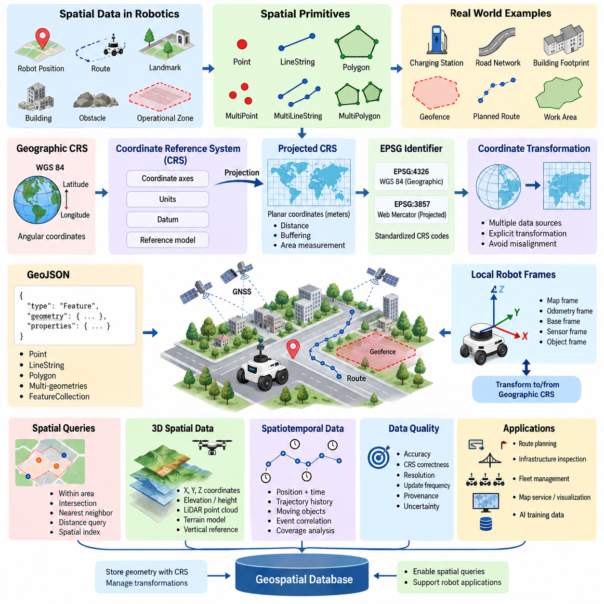
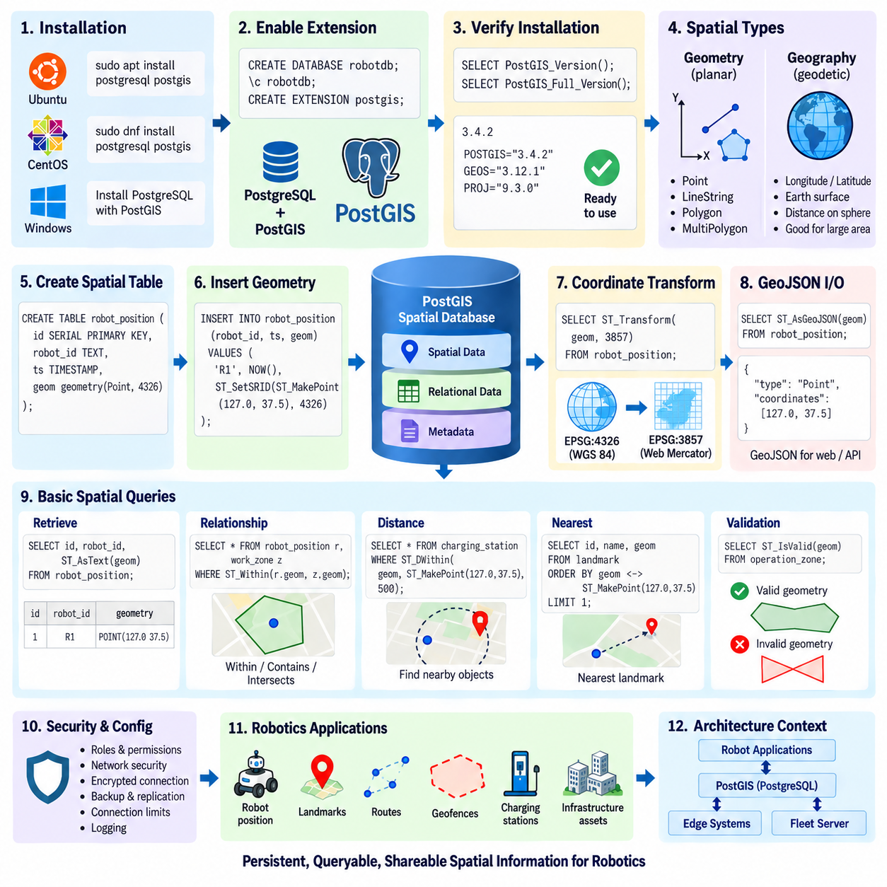
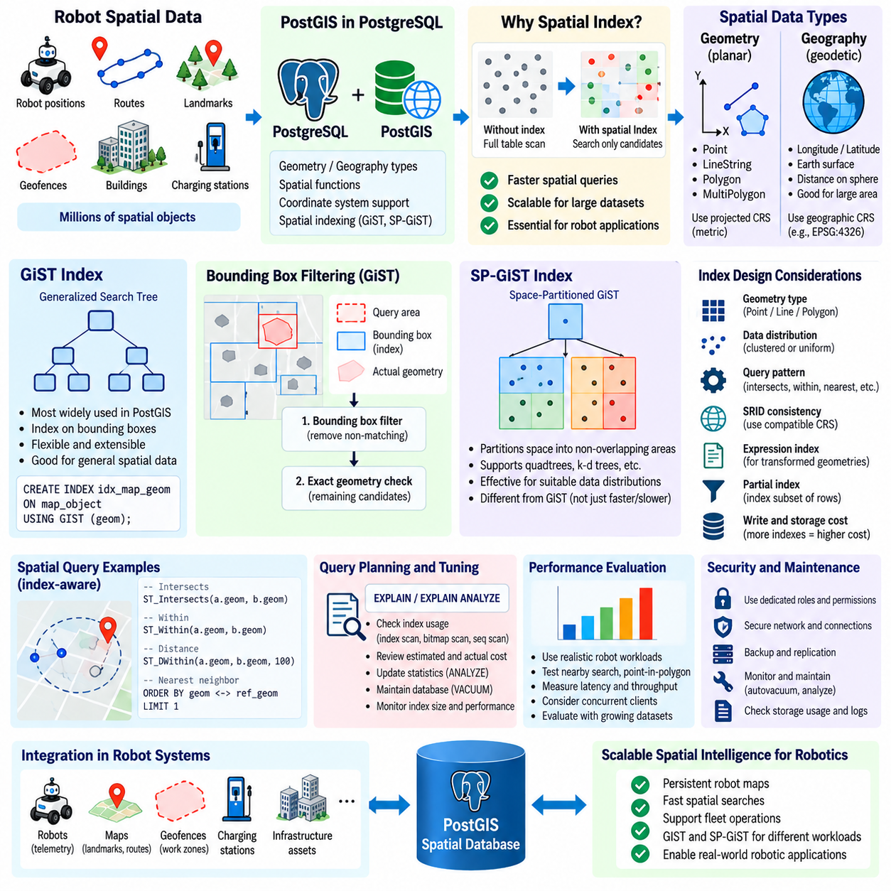
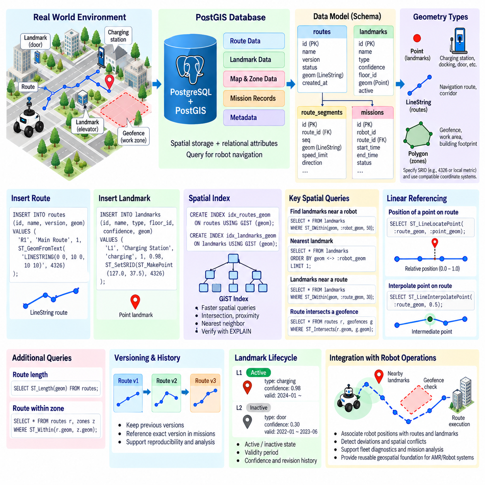
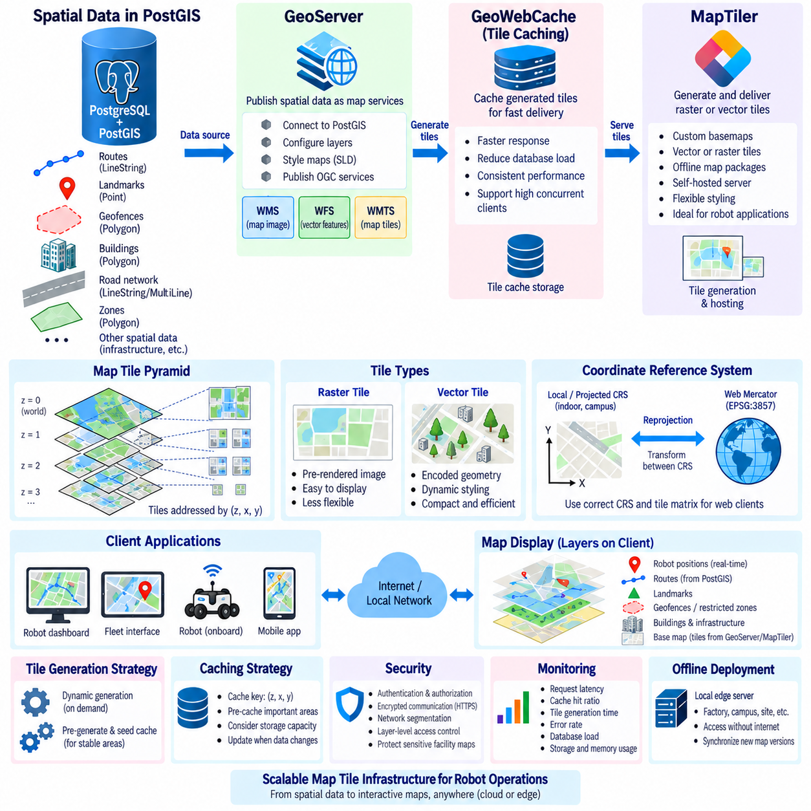
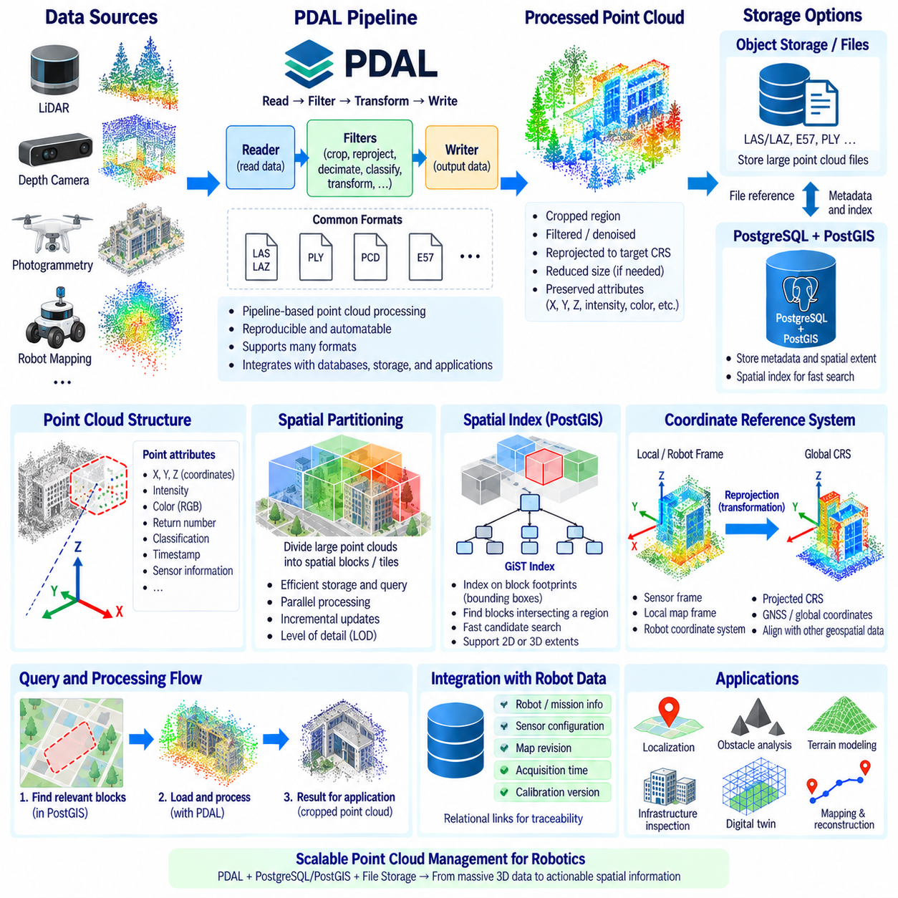
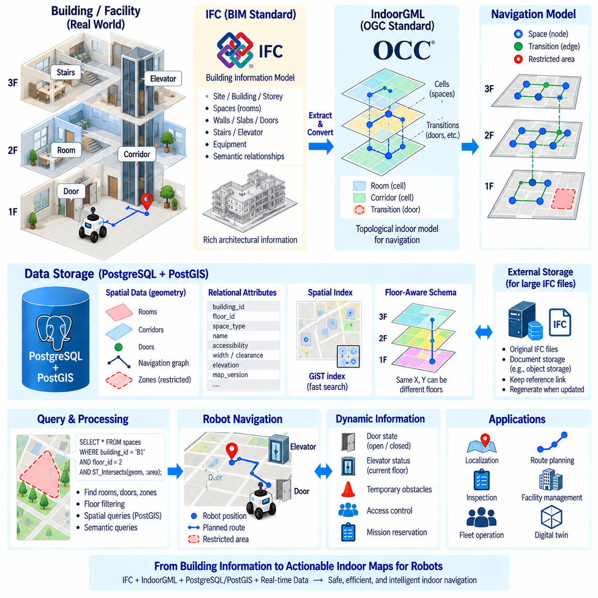
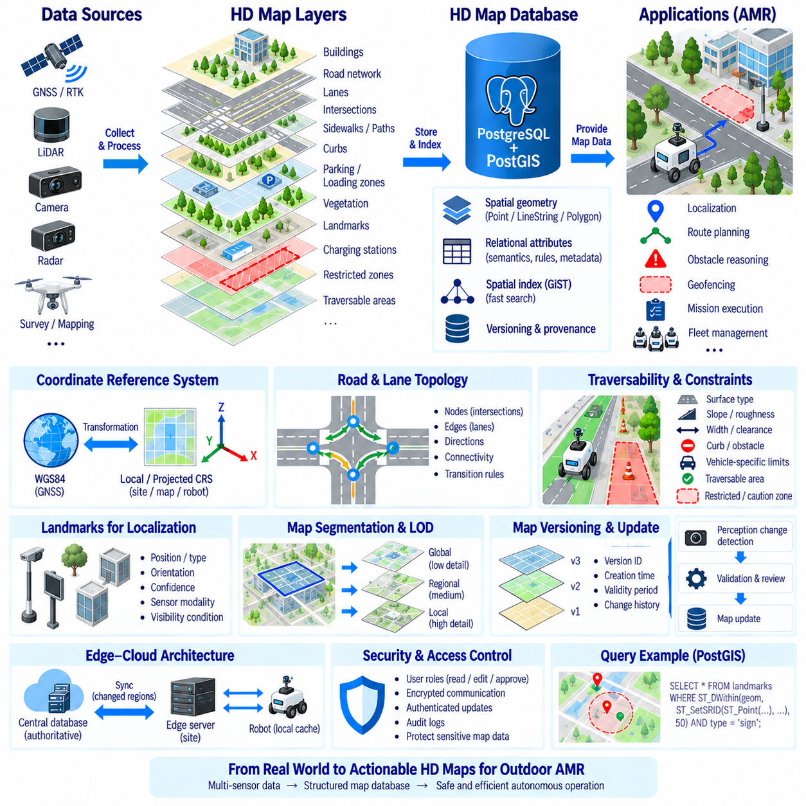
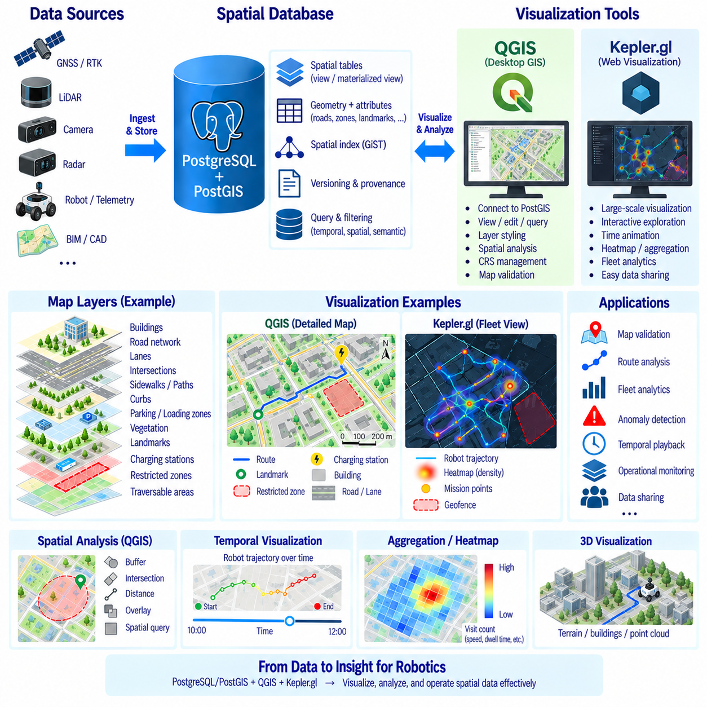
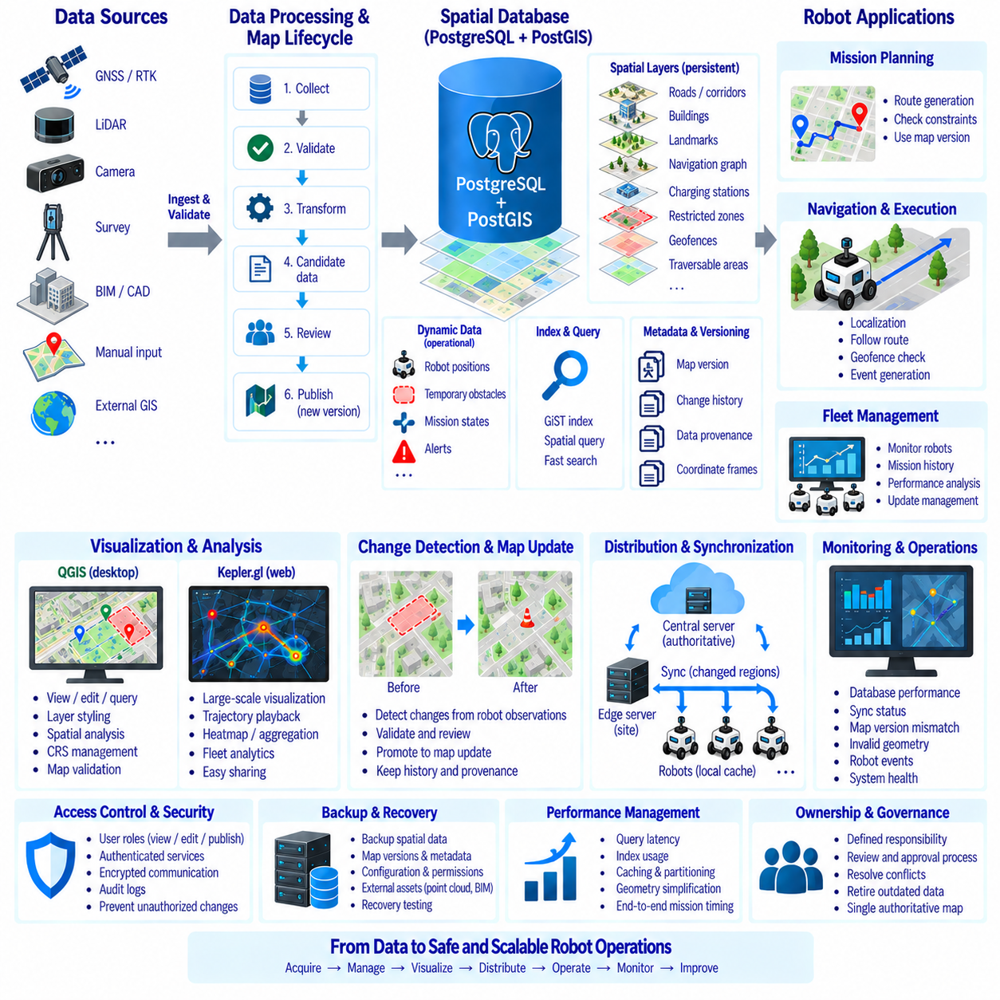

**Volume 08 Robot Database and Storage**

# 11. Geospatial Database

## 11.01 Spatial Data Overview: CRS, Projection, GeoJSON

{width="7.268055555555556in" height="7.268055555555556in"}

공간 데이터(Spatial Data)는 위치(Location), 형상(Shape), 거리(Distance) 또는 공간적 관계(Spatial Relationship)에 따라 의미가 결정되는 객체, 사건 및 환경을 표현한다. 이름이나 식별자와 같은 일반적인 속성과 달리 공간 정보(Spatial Information)는 대상이 어디에 존재하며 다른 개체와 기하학적으로 어떤 관계를 갖는지를 설명한다. 로보틱스(Robotics)에서 공간 데이터는 로봇 위치, 주행 경로, 랜드마크(Landmark), 건물, 장애물, 작업 구역, 도로망 또는 지리적 환경 등을 표현할 수 있다.

가장 일반적인 공간 기본 요소(Spatial Primitive)는 점(Point), 선(Line), 다각형(Polygon)이다. 점은 충전소, 감지된 랜드마크 또는 위성항법시스템 경유점(GNSS Waypoint)과 같은 개별 위치를 나타낸다. 선 또는 라인스트링(LineString)은 도로 중심선, 계획된 경로 또는 로봇 궤적을 표현할 수 있다. 다각형은 건물의 외곽선, 제한 구역, 작업 영역 또는 지오펜스(Geofence)와 같은 영역을 나타낸다. 더욱 복잡한 데이터셋(Dataset)은 이러한 기본 요소를 다중 기하 구조(Multi-Geometry)와 컬렉션(Collection)으로 결합한다.

좌표(Coordinate)의 숫자 값에는 기준 체계가 필요하기 때문에 좌표만으로는 공간 정보를 올바르게 설명하기 어렵다. 좌표 참조 시스템(Coordinate Reference System, CRS)은 좌표가 지구 표면 또는 그 주변의 위치와 어떻게 대응되는지를 정의한다. 여기에는 좌표축(Coordinate Axis), 단위(Unit), 데이텀(Datum), 수학적 기준 모델(Mathematical Reference Model)과 같은 속성이 포함된다. CRS 메타데이터(Metadata)가 없다면 서로 비슷해 보이는 좌표 값을 가진 두 데이터셋이 실제로는 완전히 다른 물리적 위치를 나타낼 수 있다.

지리 좌표계(Geographic Coordinate System)는 일반적으로 위도(Latitude)와 경도(Longitude) 같은 각도 좌표(Angular Coordinate)를 사용하여 위치를 표현한다. WGS 84는 가장 널리 사용되는 지리 기준 시스템(Geographic Reference System) 가운데 하나이며 많은 위성항법시스템(GNSS)과 웹 지도(Web Mapping) 애플리케이션의 기반이 된다. 경도와 위도는 전 지구적 위치를 표현하는 데 편리하지만, 도(Degree)는 지구 표면 전체에서 일정한 물리적 거리를 나타내지 않기 때문에 모든 공간 계산에 적합하지는 않다.

투영 좌표계(Projected Coordinate System)는 곡면으로 이루어진 지리적 기준면(Geographic Reference Surface)의 위치를 2차원 평면으로 변환한다. 투영(Projection)을 적용하면 좌표를 미터(Meter)와 같은 선형 단위로 표현할 수 있어 거리 계산, 버퍼링(Buffering), 면적 측정 및 지역 주행 분석 등에 활용하기 쉽다. 모든 투영에는 일정한 왜곡(Distortion)이 발생하므로 애플리케이션의 지리적 범위와 분석 요구사항에 따라 적절한 투영법을 선택해야 한다.

투영 왜곡(Projection Distortion)은 거리, 방향, 면적 또는 형상에 영향을 줄 수 있다. 따라서 전 지구적 시각화(Global Visualization)에 적합한 좌표계가 특정 도시나 산업 현장에서 수행되는 정밀 로봇 작업에는 적합하지 않을 수 있다. 지역 또는 국지 투영 좌표계(Local or Regional Projected System)는 경로 계획(Route Planning), 인프라 검사(Infrastructure Inspection), 실외 자율이동로봇(Outdoor AMR) 운용 및 공간 데이터베이스 질의(Spatial Database Query)에 보다 의미 있는 미터 단위 계산을 제공할 수 있다. 데이터베이스는 원본 CRS를 보존하면서 서로 다른 기준 체계 사이의 변환을 명시적으로 관리해야 한다.

EPSG 식별자(EPSG Identifier)는 다양한 좌표 참조 시스템을 표준화하여 식별하는 방법을 제공한다. 예를 들어 EPSG:4326은 일반적으로 WGS 84 지리 좌표와 연결되며, EPSG:3857은 웹 메르카토르(Web Mercator) 지도 시각화에 널리 사용된다. EPSG 식별자를 저장하거나 전송하면 지리정보시스템(GIS), 공간 데이터베이스(Spatial Database), 로봇 애플리케이션이 좌표 값을 일관성 있게 해석하고 서로 다른 시스템을 연동할 때 제어된 좌표 변환(Coordinate Transformation)을 수행할 수 있다.

좌표 변환(Coordinate Transformation)은 로봇 데이터가 여러 출처에서 생성되는 경우 특히 중요하다. 위성항법시스템(GNSS) 측정값은 전 지구적 지리 CRS를 사용할 수 있고, 지도 제공자는 투영된 지도 타일(Map Tile)을 제공할 수 있으며, 로봇 내부에서는 지역 직교 좌표계(Local Cartesian Map Frame)를 사용할 수 있다. 이러한 데이터를 통합하려면 모든 좌표 값을 동일한 것으로 취급해서는 안 되며 명시적인 변환 과정이 필요하다. 잘못된 CRS 가정은 랜드마크 위치를 이동시키거나 경로를 왜곡하고 잘못된 공간 관계를 생성할 수 있다.

로봇 시스템은 전 지구적 지리공간 CRS 정의와 개념적으로 다른 지역 좌표 프레임(Local Coordinate Frame)도 사용한다. 이동 로봇(Mobile Robot)은 지도(Map), 오도메트리(Odometry), 베이스(Base), 센서(Sensor), 객체(Object) 프레임을 유지하면서 동시에 자신의 환경을 지리 좌표와 연결할 수 있다. 따라서 견고한 공간 아키텍처(Spatial Architecture)는 지역 로봇 기하 구조(Local Robot Geometry)와 지리 참조 공간 데이터(Georeferenced Spatial Data) 사이의 경계를 명확히 유지하고, 전 지구적 위치가 필요한 경우 두 체계를 연결하는 변환 관계를 함께 관리해야 한다.

GeoJSON은 JSON 구조를 사용하여 지리적 피처(Geographic Feature)를 교환하기 위한 경량의 사람이 읽을 수 있는 형식이다. GeoJSON 피처(Feature)는 일반적으로 기하 구조(Geometry)와 이를 설명하는 속성(Property)을 결합하며, 피처 컬렉션(FeatureCollection)은 여러 피처를 하나의 객체로 묶는다. 지원되는 기하 유형에는 점(Point), 다중 점(MultiPoint), 라인스트링(LineString), 다중 라인스트링(MultiLineString), 다각형(Polygon), 다중 다각형(MultiPolygon), 기하 컬렉션(GeometryCollection)이 포함되므로 다양한 지도 및 로봇 데이터 교환 작업에 활용할 수 있다.

로봇 플릿 애플리케이션(Robot Fleet Application)은 GeoJSON을 사용하여 충전 위치, 주행 통로, 배송 목적지, 운영 경계 및 제한 구역을 교환할 수 있다. 경로는 라인스트링(LineString)으로 표현할 수 있으며, 지오펜스(Geofence)는 식별자, 접근 정책 또는 운영 목적을 설명하는 속성과 함께 다각형(Polygon)으로 인코딩할 수 있다. GeoJSON은 웹 기술(Web Technology)과 자연스럽게 통합되기 때문에 공간 데이터베이스, 응용 프로그램 인터페이스(API), 대시보드(Dashboard), 시각화 시스템(Visualization System) 사이의 인터페이스에서 특히 유용하다.

GeoJSON 좌표는 정해진 숫자 순서를 따르므로 애플리케이션은 이 순서를 정확하게 해석해야 한다. 지리적 위치에서는 경도(Longitude)가 위도(Latitude)보다 먼저 나타나며, 이는 일반적으로 말할 때 사용하는 위도-경도 순서와 반대일 수 있다. 두 값을 실수로 뒤바꾸는 것은 공간 데이터 오류의 흔한 원인이다. 따라서 데이터를 수용하기 전에 좌표 범위, 기하 구조, 예상 CRS 조건 및 애플리케이션별 지리적 경계를 검증(Validation)해야 한다.

공간 데이터는 단순한 좌표를 넘어 위상(Topology)과 관계(Relationship) 정보도 포함한다. 애플리케이션에서는 로봇이 운영 구역 내부에 있는지, 경로가 제한 구역과 교차하는지, 차량에서 가장 가까운 랜드마크가 무엇인지 또는 지정된 거리 안에 어떤 지도 객체가 존재하는지를 판단해야 하는 경우가 많다. 공간 데이터베이스는 기하 유형, 공간 참조 정보, 기하 연산(Geometric Operation), 특수 인덱스(Specialized Index)를 결합하여 이러한 질의를 지원한다.

3차원 로보틱스(Three-Dimensional Robotics)에서는 고도(Elevation)와 지역 높이(Local Height)가 수평 좌표와 함께 사용될 수 있기 때문에 추가적인 고려가 필요하다. 라이다 지도(LiDAR Map), 지형 모델(Terrain Model), 무인항공 로봇(Aerial Robot), 인프라 검사 시스템에서는 X, Y, Z 정보가 필요할 수 있지만 수직 기준(Vertical Reference) 역시 명확하게 이해해야 한다. 로봇의 지역 지도, 타원체(Ellipsoid), 평균 해수면(Mean Sea Level)을 기준으로 측정된 높이는 적절한 변환 모델 없이 동일한 값으로 취급할 수 없다.

시간(Time)은 자율 시스템의 공간 정보를 더욱 확장한다. 로봇의 위치는 일반적으로 어디에서 발생했는가뿐만 아니라 언제 발생했는가에 따라서도 의미가 결정된다. 따라서 플릿 궤적(Fleet Trajectory), 이동 장애물(Moving Obstacle), 검사 기록(Inspection Record), 위치추정 이력(Localization History)은 공간 좌표와 타임스탬프(Timestamp), 식별자(Identifier)를 함께 사용한다. 이러한 시공간 구조(Spatiotemporal Structure)를 이용하면 데이터베이스에서 이동 경로를 재구성하고, 작업 범위를 분석하며, 운영 패턴을 탐지하고, 로봇의 행동과 환경 사건을 연계할 수 있다.

공간 데이터 품질(Spatial Data Quality)은 단순한 숫자의 정밀도(Numeric Precision)만으로 결정되지 않는다. 정확도(Accuracy), CRS의 정확성, 해상도(Resolution), 갱신 주기(Update Frequency), 데이터 출처(Provenance), 불확실성(Uncertainty)은 모두 데이터셋이 로봇 운용에 적합한지를 결정하는 요소다. 많은 소수 자릿수로 기록된 좌표라고 해서 반드시 물리적으로 정확한 것은 아니다. 따라서 공간 정보를 저장하거나 자동화된 의사결정에 사용할 때는 GNSS 불확실성, 지도 노후화, 센서 보정(Sensor Calibration), 위치추정 드리프트(Localization Drift), 좌표 변환 오류를 함께 고려해야 한다.

실용적인 지리공간 데이터베이스 아키텍처(Geospatial Database Architecture)는 CRS 메타데이터와 기하 구조의 의미를 외부 문서가 아니라 데이터 모델(Data Model)의 일부로 취급한다. 기하 컬럼(Geometry Column)은 명확하게 정의된 공간 참조 조건을 가져야 하며, 좌표 변환은 통제된 인터페이스에서 수행되어야 한다. 또한 데이터 수집 파이프라인(Ingestion Pipeline)은 호환되지 않거나 잘못 구성된 기하 데이터를 거부할 수 있어야 한다. 이러한 원칙은 로봇, 엣지 컴퓨터(Edge Computer), 플릿 서버(Fleet Server), 클라우드 서비스(Cloud Service)가 지도를 공유할수록 더욱 중요해진다.

로봇 데이터베이스 및 스토리지 아키텍처(Robot Database and Storage Architecture)에서 공간 데이터는 저장된 정보와 물리적 세계(Physical World)를 연결하는 역할을 한다. 좌표 참조 시스템(CRS)은 좌표의 의미를 정의하고, 투영(Projection)은 지리 정보를 특정 측정과 지도 작업에 활용할 수 있도록 하며, GeoJSON은 편리한 데이터 교환 표현을 제공한다. 이러한 개념은 이후 다루게 될 공간 인덱싱(Spatial Indexing), PostGIS 질의, 경로 저장(Route Storage), 지도 서비스(Map Service), 포인트 클라우드 관리(Point Cloud Management), 실내 및 실외 로봇 지도 데이터베이스를 이해하기 위한 기반을 형성한다.

## 11.02 PostGIS Install, Config, Basic Queries [w/Code]

{width="7.268055555555556in" height="7.268055555555556in"}

PostGIS는 PostgreSQL에 기하(Geometry) 및 지리(Geography) 데이터 타입, 공간 함수(Spatial Function), 좌표 참조 시스템(Coordinate Reference System) 지원, 공간 인덱싱(Spatial Indexing) 기능을 추가하는 공간 데이터베이스 확장(Spatial Database Extension)이다. 로봇 데이터베이스 아키텍처(Robot Database Architecture)에서는 로봇 ID, 임무, 타임스탬프(Timestamp), 상태 값과 같은 일반적인 관계형 정보와 위치, 경로, 랜드마크(Landmark), 운영 구역, 지도 객체를 동일한 트랜잭션 데이터베이스(Transactional Database) 안에서 함께 관리할 수 있도록 한다.

일반적인 PostGIS 환경은 호환되는 PostgreSQL을 설치한 후 운영체제와 PostgreSQL 버전에 적합한 PostGIS 패키지를 설치하는 과정으로 시작한다. PostGIS는 PostgreSQL을 대체하는 것이 아니라 기존 데이터베이스 서버를 확장한다. 따라서 ACID 트랜잭션(Transaction), 역할(Role), 백업(Backup), 복제(Replication), SQL 처리, JSONB와 같은 PostgreSQL 기능을 그대로 유지하면서 지도 및 로보틱스 애플리케이션에 필요한 특수 공간 연산(Spatial Operation)을 추가할 수 있다.

필요한 소프트웨어 패키지를 설치한 후에는 각각의 데이터베이스에서 공간 기능(Spatial Functionality)을 개별적으로 활성화해야 한다. 일반적으로 사용하는 SQL 명령인 \`CREATE EXTENSION postgis;\`는 PostGIS 확장을 로드하고 데이터베이스에 필요한 공간 데이터 타입, 함수, 연산자(Operator), 지원 메타데이터(Metadata)를 생성한다. 특수 기능이 필요한 경우 추가 확장을 활성화할 수 있지만 기본적인 기하 데이터 저장과 공간 질의에는 핵심 PostGIS 확장만으로 충분하다.

설치는 단순히 패키지가 설치되었다고 가정해서는 안 되며 PostgreSQL 내부에서 직접 검증해야 한다. \`PostGIS_Version()\` 또는 \`PostGIS_Full_Version()\`과 같은 함수를 사용하면 활성화된 확장의 버전과 관련 라이브러리(Library) 정보를 확인할 수 있다. 또한 로봇 애플리케이션이 실제 운영용 공간 테이블을 생성하기 전에 PostgreSQL 서버 버전, 확장 상태, 데이터베이스 인코딩(Encoding), 권한(Permission), 예상 설정 상태를 함께 확인해야 한다.

PostGIS는 주로 \`geometry\`와 \`geography\`라는 두 가지 공간 데이터 타입을 제공한다. 기하(Geometry)는 일반적으로 지정된 평면 또는 투영 좌표 참조 시스템(Projected Coordinate Reference System)에서 좌표를 해석할 때 사용하며, 지역 지도와 미터 단위 공간 처리에 적합하다. 지리(Geography)는 지구상의 측지 좌표(Geodetic Coordinate)를 대상으로 하며 지구의 곡면을 고려하여 계산하므로 넓은 지역에서 경도와 위도를 이용한 거리 연산에 유용하다.

공간 컬럼(Spatial Column)은 관련 속성을 알고 있다면 기하 유형(Geometry Type)과 공간 참조 시스템 식별자(Spatial Reference System Identifier, SRID)를 함께 정의해야 한다. 예를 들어 WGS 84 위치를 저장하는 로봇 위치 테이블은 \`geometry(Point, 4326)\` 컬럼을 사용할 수 있다. 경로 테이블에는 \`geometry(LineString, SRID)\`를 사용할 수 있으며, 운영 경계에는 Polygon 또는 MultiPolygon을 사용할 수 있다. 이러한 명시적 정의는 데이터의 일관성을 높이고 호환되지 않는 기하 데이터가 실수로 입력되는 것을 방지한다.

공간 객체(Spatial Object)는 좌표 값 또는 텍스트 기반의 기하 표현으로 생성할 수 있다. \`ST_MakePoint()\`는 숫자 좌표를 사용하여 점(Point)을 생성하고, \`ST_SetSRID()\`는 의도한 공간 참조 식별자를 지정한다. \`ST_GeomFromText()\`는 웰노운 텍스트(Well-Known Text)를 이용하여 기하 데이터를 생성하며 \`POINT\`, \`LINESTRING\`, \`POLYGON\`과 같은 값을 PostGIS 객체로 변환할 수 있다. SRID를 지정하는 것은 좌표계를 설명하는 것이며 좌표 값 자체를 수치적으로 변환하는 것은 아니다.

공간 데이터를 지원되는 서로 다른 참조 시스템 사이에서 변환해야 하는 경우에는 \`ST_Transform()\`을 이용하여 좌표 변환(Coordinate Transformation)을 수행한다. SRID 레이블을 변경하는 것과 실제 좌표를 변환하는 것은 서로 다른 작업이므로 이 차이는 매우 중요하다. GNSS 데이터는 EPSG:4326으로 입력될 수 있지만 지역 경로 분석에는 미터 단위의 적절한 투영 CRS가 필요할 수 있다. 따라서 애플리케이션은 원본 참조 정보를 보존하고 다른 좌표계가 필요한 계산에 대해서만 명시적으로 데이터를 변환해야 한다.

기본적인 데이터 조회는 일반적인 SQL 조건과 공간 정보를 결합하여 수행할 수 있다. 하나의 질의(Query)에서 동일한 행(Row)에 저장된 로봇 식별자, 타임스탬프, 기하 데이터를 함께 조회할 수 있으며, \`ST_AsText()\`와 같은 함수는 기하 데이터를 사람이 읽을 수 있는 웰노운 텍스트(Well-Known Text) 형식으로 변환한다. \`ST_X()\`와 \`ST_Y()\`는 점(Point)에서 좌표 성분을 추출하여 저장된 값을 확인하거나 기본 공간 타입을 유지하면서 애플리케이션 인터페이스를 통해 좌표를 제공할 수 있게 한다.

공간 관계 질의(Spatial Relationship Query)는 여러 기하 객체가 서로 어떻게 상호작용하는지를 판단한다. \`ST_Intersects()\`는 두 기하 객체가 공간적으로 일부라도 공유하는지를 검사하고, \`ST_Within()\`은 하나의 기하 객체가 다른 객체 내부에 존재하는지를 판단한다. \`ST_Contains()\`는 포함하는 객체의 관점에서 반대 방향의 포함 관계를 표현한다. 이를 통해 로봇이 허가된 작업 구역 내부에 있는지, 계획된 경로가 제한 구역을 통과하는지 또는 랜드마크가 특정 시설 영역에 포함되는지를 판단할 수 있다.

거리 기반 질의(Distance-Based Query)는 로봇 애플리케이션에서 핵심적인 기능이다. \`ST_Distance()\`는 사용되는 공간 데이터 타입과 참조 시스템에 따라 거리를 계산하며, \`ST_DWithin()\`은 두 객체가 지정된 거리 이내에 존재하는지를 판단한다. 특히 특정 위치 주변의 충전소, 랜드마크, 로봇, 위험 요소 또는 임무 목표를 검색하는 데 유용하다. 거리의 단위가 무엇인지는 좌표 참조 시스템과 기하(Geometry) 또는 지리(Geography) 중 어떤 타입을 사용하는지에 따라 달라진다.

최근접 객체 검색(Nearest-Object Search)은 공간 연산자, 인덱스(Index), 정렬 표현식을 결합하여 주변 피처(Feature)를 효율적으로 찾을 수 있도록 한다. 플릿 서비스(Fleet Service)는 로봇에서 가장 가까운 충전소, 경로에서 가장 가까운 검사 지점 또는 위치추정 결과에서 가장 가까운 알려진 랜드마크를 찾아야 할 수 있다. 모든 좌표를 애플리케이션 코드로 전송하는 대신 이러한 공간 관계를 데이터베이스 내부에서 직접 계산하면 데이터 이동량을 줄이고 지리공간 처리 로직을 중앙화할 수 있다.

GeoJSON은 PostGIS 기반 서비스와 자연스럽게 통합될 수 있다. \`ST_AsGeoJSON()\`은 저장된 기하 데이터를 웹 API, 대시보드(Dashboard), 지도 시각화 시스템(Map Visualization System)에 적합한 GeoJSON 표현으로 변환한다. 반대로 GeoJSON 기하 데이터는 PostGIS에서 지원하는 입력 함수를 이용하여 공간 데이터베이스 객체로 변환할 수 있다. 이를 통해 PostGIS는 내부적으로 데이터베이스 기하 데이터를 사용하는 로봇 애플리케이션과 표준화된 JSON 기반 지리 정보를 교환하는 외부 서비스 사이에서 효과적인 영속 저장 계층(Persistence Layer)으로 활용될 수 있다.

공간 데이터는 실제 운영 지도 정보가 되기 전에 검증되어야 한다. \`ST_IsValid()\`와 같은 함수는 유효하지 않은 다각형 기하(Polygonal Geometry)를 탐지할 수 있으며, 필요한 경우 추가 PostGIS 함수를 사용하여 특정 기하 문제를 검사하거나 수정할 수 있다. 애플리케이션 수준의 검증에서도 SRID, 예상 기하 유형, 좌표 범위, 타임스탬프, 식별자, 운영 경계를 확인해야 한다. 기하학적으로 유효한 데이터라 하더라도 특정 로봇 시스템에서는 의미적으로 잘못된 데이터일 수 있기 때문이다.

공간 테이블(Spatial Table)은 기하 데이터와 함께 일반적인 관계형 제약조건(Relational Constraint)을 유지할 수 있다. 기본 키(Primary Key)는 지도 개체를 식별하고, 외래 키(Foreign Key)는 공간 피처를 로봇 또는 임무와 연결하며, 타임스탬프는 관측 이력을 보존하고, 속성(Attribute)은 의미 정보를 설명한다. 예를 들어 랜드마크 테이블은 관계형 식별자, 랜드마크 유형, 신뢰도(Confidence), 생성 시간, Point 기하 데이터를 하나의 구조 안에 포함할 수 있다. 이러한 하이브리드 모델(Hybrid Model)은 기존 PostgreSQL 아키텍처에서 PostGIS를 사용하는 주요 장점 중 하나다.

데이터베이스 설정은 일반적인 PostgreSQL 배포에서 사용하는 것과 동일한 보안 원칙(Security Principle)을 따라야 한다. 로봇 애플리케이션은 관리자 계정 대신 해당 기능에 필요한 최소 권한만 가진 전용 역할(Dedicated Role)을 사용하여 접속해야 한다. 네트워크 노출(Network Exposure), 인증(Authentication), 암호화 연결(Encrypted Connection), 백업 정책, 연결 제한(Connection Limit), 로깅(Logging)은 배포 요구사항에 맞게 구성해야 한다. 공간 기능이 추가되었다고 해서 기존 데이터베이스의 보안 및 운영 통제가 불필요해지는 것은 아니다.

로보틱스 분야에서 PostGIS는 공간 정보를 지속적으로 저장하고 질의하며 여러 시스템 구성요소가 공유해야 할 때 특히 유용하다. 로봇 위치, 충전소, 경로, 지오펜스(Geofence), 인프라 자산(Infrastructure Asset), 임무 영역을 일관된 공간 데이터 타입과 SQL 의미 체계를 이용하여 관리할 수 있다. 엣지 시스템(Edge System)은 운영 정보를 갱신하고, 플릿 서버(Fleet Server)는 보다 광범위한 질의, 이력 분석, 시각화 또는 다른 지도 서비스와의 동기화를 수행할 수 있다.

PostGIS를 모든 로봇 지도 표현을 대체하는 시스템으로 간주해서는 안 된다. 고주파 점유 격자(High-Frequency Occupancy Grid), 원시 라이다 스트림(Raw LiDAR Stream), 고밀도 포인트 클라우드(Dense Point Cloud), 일시적인 지역 경로 계획기 상태(Local Planner State)는 특수한 메모리 구조, 파일, 객체 스토리지(Object Storage) 또는 전용 처리 시스템이 필요할 수 있다. PostGIS는 기하학적으로 의미 있는 정보를 구조화된 메타데이터, 트랜잭션 기록, 운영 개체 간 관계와 함께 지속적으로 저장하고 질의해야 할 때 가장 효과적이다.

따라서 기본적인 PostGIS 워크플로(Workflow)는 PostgreSQL 설치와 확장 활성화에서 시작하여 공간 컬럼 정의, SRID 관리, 기하 데이터 입력, 좌표 변환, 공간 질의로 이어진다. 이러한 기반이 구축되면 동일한 데이터베이스를 공간 인덱싱(Spatial Indexing), 경로 및 랜드마크 관리, 지도 서비스(Map Service), 포인트 클라우드 통합(Point Cloud Integration), 실내 지도(Indoor Map), 실외 자율이동로봇 고정밀 지도(Outdoor AMR HD Map) 저장으로 확장할 수 있으며, 복잡성이 증가하는 로봇 시스템을 위한 체계적인 지리공간 기반(Geospatial Foundation)을 제공할 수 있다.

## 11.03 PostGIS Spatial Index: GiST / SP.GiST Design [w/Code]

{width="7.268055555555556in" height="7.268055555555556in"}

공간 인덱스(Spatial Index)는 PostGIS 데이터베이스가 소규모 기하 데이터 집합을 넘어 성장할 때 필수적인 요소다. 인덱스가 없다면 공간 조건자(Spatial Predicate)를 처리하기 위해 PostgreSQL이 테이블의 상당 부분을 검사하면서 기하학적 관계를 반복적으로 계산해야 할 수 있다. 로봇 플릿(Robot Fleet)은 수백만 개의 위치, 랜드마크(Landmark), 경로 구간, 지오펜스(Geofence), 인프라 객체를 생성할 수 있으므로 효율적인 공간 인덱싱(Spatial Indexing)은 확장 가능한 지리공간 데이터베이스 설계의 핵심 요구사항이다.

일반적인 B-트리 인덱스(B-tree Index)와 달리 공간 인덱스는 단순한 스칼라 순서(Scalar Ordering)로 효율적으로 표현할 수 없는 다차원 객체(Multidimensional Object)를 구성해야 한다. 점(Point), 선(Line), 다각형(Polygon)은 2차원 또는 그 이상의 공간에서 특정 영역을 차지한다. 따라서 PostGIS는 기하학적 속성에 따라 공간 객체를 구성하고 관련 없는 후보를 빠르게 제거하기 위해 주로 GiST와 SP-GiST 같은 특수 PostgreSQL 인덱스 접근 방식(Index Access Method)을 사용한다.

GiST(Generalized Search Tree)는 PostGIS에서 가장 널리 사용되는 공간 인덱싱 프레임워크(Spatial Indexing Framework)다. GiST 자체가 하나의 특정 기하 트리 알고리즘(Geometric Tree Algorithm)을 의미하는 것은 아니며, PostgreSQL 데이터 타입이 검색 동작을 정의할 수 있도록 하는 확장 가능한 기반 구조다. PostGIS 기하 데이터의 경우 GiST는 일반적으로 경계 상자(Bounding Box) 표현을 구성하여 공간 범위가 요청된 관계를 만족할 가능성이 있는 후보 기하 데이터를 빠르게 식별한다.

기하 컬럼(Geometry Column)에 대한 GiST 인덱스는 일반적으로 \`CREATE INDEX idx_map_geom ON map_object USING GIST (geom);\`과 같은 명령으로 생성한다. 인덱스가 생성되면 PostgreSQL의 질의 계획기(Query Planner)는 호환되는 공간 연산자와 함수에서 이를 사용할 수 있다. 이는 로봇 위치, 도로 구간, 랜드마크, 작업 구역, 건물 외곽선, 충전소 또는 기타 대규모 공간 데이터셋을 포함하는 테이블에서 특히 중요한 역할을 한다.

경계 상자(Bounding Box)는 GiST를 활용하는 많은 PostGIS 연산을 이해하기 위한 핵심 개념이다. 복잡한 다각형에는 수천 개의 꼭짓점(Vertex)이 포함될 수 있지만 모든 데이터베이스 객체와 완전한 기하 구조를 직접 비교하면 많은 연산 비용이 발생한다. 인덱스는 먼저 단순한 경계 영역을 비교하여 명백하게 일치할 수 없는 객체를 제거하고, 필요한 경우 남아 있는 후보에 대해서만 정확한 기하 연산을 수행한다. 이를 통해 효율적인 필터링 후 정밀화(Filter-and-Refine) 처리 구조가 형성된다.

\`ST_Intersects()\`, \`ST_Within()\`, \`ST_DWithin()\`과 같은 함수는 질의와 데이터가 적절하게 구성되어 있다면 공간 인덱스의 이점을 활용할 수 있다. 플릿 서버(Fleet Server)는 충전소 주변에 위치한 로봇, 계획된 경로와 교차하는 지도 객체 또는 지역 검색 범위 안의 운영 피처(Operational Feature)를 빠르게 식별할 수 있다. 데이터베이스는 모든 공간 레코드를 검색하는 대신 기하학적으로 관련된 후보로 검색 범위를 좁힌 후 비용이 높은 계산을 수행한다.

PostGIS는 인덱스를 고려한 질의 설계(Index-Aware Query Design)에 유용한 공간 연산자도 제공한다. 경계 상자 연산자(Bounding-Box Operator)는 중첩 또는 상대적인 공간 관계를 표현할 수 있으며, 거리 정렬 연산자(Distance Ordering Operator)인 \`\<-\>\`는 최근접 이웃 검색(Nearest-Neighbor Search)에 일반적으로 사용된다. 질의에서 기준 기하 데이터와의 거리를 기준으로 객체를 정렬하고 \`LIMIT\`을 적용하면 주변 랜드마크나 시설을 효율적으로 검색하면서 데이터베이스 인덱스를 근접 검색에 직접 활용할 수 있다.

SP-GiST(Space-Partitioned Generalized Search Tree)는 검색 공간을 서로 중첩되지 않는 영역으로 분할하는 방식에 기반한 다른 형태의 인덱싱 프레임워크를 제공한다. 연산자 클래스(Operator Class)와 데이터 타입에 따라 쿼드트리(Quadtree), k-d 트리(k-d Tree), 라딕스 트리(Radix Tree) 및 기타 분할 기반 구조와 개념적으로 관련된 구조를 지원할 수 있다. GiST가 서로 중첩될 수 있는 경계 영역을 그룹화할 수 있는 것과 달리 SP-GiST는 검색 영역을 재귀적으로 여러 파티션(Partition)으로 분할한다.

이러한 차이 때문에 GiST와 SP-GiST를 단순히 동일한 인덱스의 빠른 버전과 느린 버전으로 이해해서는 안 된다. 효율성은 기하 유형(Geometry Type), 공간 분포(Spatial Distribution), 연산자 클래스, 질의 패턴(Query Pattern), 갱신 특성(Update Behavior), 데이터셋 특성에 따라 달라진다. GiST는 많은 PostGIS 워크로드에서 일반적인 범용 선택으로 사용되며, SP-GiST는 명시적인 공간 분할의 이점을 활용할 수 있는 데이터셋과 접근 패턴에서 효과적인 대안이 될 수 있다.

로봇 위치 데이터셋은 데이터 분포가 중요한 이유를 잘 보여준다. 넓은 캠퍼스에서 운영되는 플릿은 충전소, 통로, 엘리베이터, 작업 구역 주변에 높은 밀도의 클러스터(Cluster)를 생성하면서 다른 영역에는 데이터가 거의 존재하지 않을 수 있다. 반면 다른 시스템은 실외 도로 전체에 관측 데이터를 비교적 균등하게 분포시킬 수 있다. 인덱스 구조는 클러스터링(Clustering), 중첩, 차원, 기하 복잡도에 따라 다르게 동작하므로 인덱스 대안을 평가할 때는 실제 운영 환경을 대표하는 데이터를 사용해야 한다.

인덱스 설계(Index Design)에서는 테이블이 점, 선, 다각형 또는 혼합 기하 데이터를 포함하는지도 고려해야 한다. 서로 중첩되는 경계 상자를 가진 대형 다각형은 수백만 개의 독립적인 점 데이터와 다른 검색 특성을 보일 수 있다. 경로 네트워크(Route Network)는 많은 수의 가느다란 라인스트링(LineString)을 포함할 수 있는 반면, 지오펜스 테이블은 상대적으로 적은 수의 대형 다각형을 포함할 수 있다. 전체 행(Row)의 수만으로 인덱스를 선택하면 공간 후보를 얼마나 효과적으로 제거할 수 있는지를 결정하는 기하 구조의 특성을 반영하지 못한다.

공간 참조 시스템 식별자(Spatial Reference System Identifier, SRID)의 일관성은 인덱스를 사용할 때도 여전히 중요하다. 인덱스는 서로 호환되지 않는 좌표 참조 시스템(Coordinate Reference System)을 사용하는 기하 데이터나 잘못 지정된 SRID를 수정할 수 없다. 질의에서는 호환되는 참조 시스템의 기하 데이터를 비교해야 하며 좌표 변환(Coordinate Transformation)은 명확하게 관리해야 한다. 대규모 질의 경로에서 \`ST_Transform()\`을 반복적으로 적용하면 최적화 전략에도 영향을 줄 수 있으므로 필요한 경우 변환된 컬럼 또는 표현식 인덱스(Expression Index)를 신중하게 설계할 수 있다.

표현식 인덱스(Expression Index)는 애플리케이션이 변환되거나 파생된 공간 표현을 반복적으로 질의하는 경우 유용할 수 있다. 검색할 때마다 동일한 좌표 변환을 다시 계산하는 대신 특정 상황에서는 해당 표현식 자체에 인덱스를 구성할 수 있다. 이러한 설계에서는 실제 질의 표현식과 인덱스 표현식이 정확하게 일치해야 하며, 추가 인덱스는 저장 공간을 사용하고 삽입 및 갱신 과정에서 유지관리 작업을 발생시키므로 측정된 워크로드 요구사항을 근거로 적용해야 한다.

부분 공간 인덱스(Partial Spatial Index)는 일부 행만 빈번한 질의 대상이 되는 경우 사용할 수 있는 또 다른 최적화 방법이다. 로봇 데이터베이스에는 과거 데이터, 비활성 데이터, 현재 사용 중인 지도 객체가 함께 저장될 수 있지만 실제 운영 질의는 활성 피처만 반복적으로 검색할 수 있다. 적절한 SQL 조건자를 사용하는 부분 인덱스는 인덱스 크기와 유지관리 부담을 줄일 수 있다. PostgreSQL이 이를 효과적으로 사용하려면 질의 조건이 부분 인덱스의 조건과 대응되어야 한다.

모든 공간 인덱스는 쓰기 성능과 저장 공간 측면의 비용을 발생시킨다. 로봇 텔레메트리 시스템(Robot Telemetry System)이 지속적으로 위치 데이터를 삽입하거나 갱신하면 데이터 변경과 함께 관련 인덱스 구조도 유지해야 한다. 명확한 질의 요구사항 없이 여러 인덱스를 생성하면 데이터 수집 성능(Ingestion Performance)이 저하되고 디스크 사용량이 증가하며 유지관리 작업 시간이 길어질 수 있다. 고주파의 일시적인 위치추정 데이터는 상대적으로 정적인 랜드마크, 경로 또는 인프라 지도와 다른 인덱싱 전략이 필요할 수 있다.

PostgreSQL 통계 정보(Statistics)와 질의 계획기(Query Planner)는 사용 가능한 인덱스가 실제로 사용될 것인지를 결정한다. 따라서 \`EXPLAIN\`과 \`EXPLAIN ANALYZE\`는 공간 데이터베이스 튜닝(Spatial Database Tuning)에 필수적인 도구다. 이를 통해 PostgreSQL이 인덱스 스캔(Index Scan), 비트맵 스캔(Bitmap Scan), 순차 스캔(Sequential Scan) 가운데 어떤 방법을 선택하는지 확인하고 예상 실행 동작과 실제 실행 동작을 분석할 수 있다. 특히 테이블의 많은 부분을 반환하는 질의에서는 인덱스가 존재한다고 해서 반드시 성능이 향상되는 것은 아니다.

데이터베이스 유지관리(Database Maintenance) 역시 시간이 지남에 따라 공간 질의 성능에 영향을 미친다. \`ANALYZE\`는 질의 계획기가 사용하는 통계 정보를 갱신하고, \`VACUUM\`은 PostgreSQL의 저장 공간 유지관리와 가시성 관리(Visibility Management)를 지원한다. 로봇 위치가 자주 갱신되거나 지도 데이터가 지속적으로 수정되는 테이블은 데이터 증가량, 데드 튜플(Dead Tuple), 인덱스 크기, 질의 동작 변화를 모니터링해야 한다. 자동 진공(Autovacuum) 설정과 유지관리 정책은 기본 설정에만 의존하지 않고 실제 쓰기 빈도와 운영 요구사항을 반영해야 한다.

성능 평가는 단순한 합성 질의(Synthetic Query)만 벤치마킹하기보다 실제 로봇 워크로드를 재현해야 한다. 유용한 시험에는 주변 객체 검색, 점-다각형 포함 검사(Point-in-Polygon Check), 경로 교차 질의, 지오펜스 감지, 최근접 랜드마크 검색, 지도 영역 조회가 포함된다. 작은 데모 환경에서 우수한 성능을 보이는 인덱스도 플릿 규모에서는 다르게 동작할 수 있으므로 지연시간 분포(Latency Distribution), 동시 접속 클라이언트, 캐시 상태, 데이터셋 증가, 삽입 속도, 질의 선택도(Query Selectivity)를 함께 측정해야 한다.

많은 로봇 지리공간 데이터베이스(Robot Geospatial Database)에서는 GiST를 범용 공간 인덱스로 먼저 적용하고 실행 계획과 실제 측정 성능을 확인한 후, 워크로드의 근거가 충분한 경우에만 SP-GiST 또는 특수한 설계를 도입하는 것이 실용적이다. 인덱스 아키텍처(Index Architecture)는 이론적인 선호보다 기하 데이터의 특성과 실제 질의 패턴을 기준으로 결정해야 한다. 이러한 측정 기반 접근법(Measurement-Driven Approach)은 데이터베이스 설계를 이해하기 쉽게 유지하면서 공간 데이터셋이 증가할 때 명확한 최적화 경로를 제공한다.

잘 설계된 PostGIS 공간 인덱싱 계층(Spatial Indexing Layer)은 지속적으로 저장되는 로봇 지도와 신속하게 반응하는 운영 지능(Operational Intelligence)을 연결한다. GiST는 광범위한 공간 워크로드를 위한 유연한 다차원 인덱싱을 제공하고, SP-GiST는 적절한 데이터 분포와 연산자 클래스에 대해 공간 분할 기반의 대안을 제공한다. 올바른 CRS 관리, 질의 계획, 유지관리, 워크로드 시험과 결합하면 이러한 인덱스는 로봇 위치, 경로, 랜드마크, 지오펜스 및 인프라 데이터에 대한 확장 가능한 공간 검색을 가능하게 한다.

## 11.04 Robot Route / Landmark PostGIS Storage Queries [w/Code]

{width="7.268055555555556in" height="7.268055555555556in"}

로봇 경로(Robot Route)와 랜드마크(Landmark)는 자율주행 내비게이션 데이터베이스(Autonomous Navigation Database)를 구성하는 두 가지 핵심 공간 개체(Spatial Entity)다. 경로는 로봇이 이동할 것으로 예상되거나 이동이 허용된 공간을 나타내며, 랜드마크는 위치추정(Localization), 내비게이션(Navigation), 검사(Inspection), 도킹(Docking) 또는 의미 이해(Semantic Understanding)와 연관된 공간적으로 식별 가능한 기준을 나타낸다. PostGIS는 두 개체를 관계형 속성과 함께 기본 기하 데이터(Native Geometry)로 저장하여 공간 질의(Spatial Query)를 일반적인 로봇 데이터베이스 운영의 일부로 사용할 수 있게 한다.

실용적인 스키마(Schema)는 일반적으로 경로 정의(Route Definition), 경로 구간(Route Segment), 랜드마크 및 관련 운영 메타데이터(Operational Metadata)를 분리한다. 경로에는 식별자, 이름, 버전, 유효 상태, 생성 타임스탬프(Timestamp), LineString 또는 MultiLineString 기하 데이터를 포함할 수 있다. 랜드마크에는 식별자, 의미 클래스(Semantic Class), 신뢰도(Confidence), 층 또는 구역 정보, 타임스탬프, Point 기하 데이터를 포함할 수 있다. 이러한 분리는 공간적 의미를 명확하게 유지하면서 외래 키(Foreign Key)를 통해 피처(Feature)를 지도, 임무, 시설 또는 로봇과 연결할 수 있도록 한다.

완전한 로봇 경로는 순서가 지정된 좌표들이 하나의 연속적인 경로를 구성하는 경우 \`LineString\`으로 표현할 수 있다. 보다 복잡한 네트워크에서는 여러 경로 구간을 사용하고 각각의 구간을 개별적으로 저장한 후 관계형 식별자를 통해 연결할 수 있다. 구간 단위 저장(Segment-Level Storage)은 경로를 따라 속도 제한, 이동 방향, 노면 상태, 접근 가능성, 안전 제한 또는 운영 비용이 달라지고 내비게이션이나 임무 계획 과정에서 이를 독립적으로 평가해야 할 때 유용하다.

랜드마크는 많은 내비게이션 기준을 개별적인 위치로 모델링할 수 있기 때문에 일반적으로 \`Point\` 기하 데이터로 표현한다. 충전소, 도킹 위치, 출입문, 엘리베이터, 검사 지점, 적재 구역, 교통 제어 위치 및 인식 가능한 환경 기준 등이 대표적인 예다. 랜드마크가 단일 위치가 아니라 의미 있는 물리적 영역을 차지하는 경우 모든 의미 객체를 점으로 강제하여 표현하기보다는 Polygon 또는 다른 기하 유형(Geometry Type)을 사용할 수 있다.

기하 컬럼(Geometry Column)은 공간 참조 시스템 식별자(Spatial Reference System Identifier, SRID)를 명확하게 지정해야 한다. 전역 실외 데이터(Global Outdoor Data)는 위성항법시스템(GNSS) 좌표에서 생성될 수 있으며, 실내 시설에서는 투영 좌표(Projected Coordinate) 또는 지역 기준 미터 좌표(Local Metric Coordinate)를 사용할 수 있다. 동일한 공간 연산에 참여하는 경로와 랜드마크 기하 데이터는 호환되는 좌표계를 사용해야 한다. 잘못된 SRID 지정은 실제 물리적 위치가 서로 호환되지 않음에도 데이터베이스에서는 경로, 랜드마크, 로봇 위치가 공간적으로 연관된 것처럼 보이게 만들 수 있다.

경로 기하 데이터(Route Geometry)는 \`ST_GeomFromText()\`를 사용하여 웰노운 텍스트(Well-Known Text)로 생성하거나 점과 선을 이용하여 프로그래밍 방식으로 구성할 수 있다. 예를 들어 LineString에는 내비게이션 통로를 따라 연속되는 위치를 나타내는 순서화된 좌표 집합을 포함할 수 있다. 방향이 운영적으로 의미가 있는 경우 애플리케이션은 경로 방향(Route Direction)을 보존해야 한다. 좌표 순서를 반대로 변경하면 기하학적 경로 자체는 동일한 물리적 공간을 차지하더라도 시작점과 목적지 관계의 의미가 달라질 수 있기 때문이다.

랜드마크를 입력할 때 좌표가 숫자 값으로 제공된다면 \`ST_MakePoint()\`와 \`ST_SetSRID()\`를 함께 사용할 수 있다. 의미 정보(Semantic Information)는 불필요하게 기하 데이터 내부에 인코딩하기보다 관계형 컬럼(Relational Column)에 유지해야 한다. 따라서 하나의 랜드마크 레코드는 Point와 함께 \`landmark_type\`, \`name\`, \`confidence\`, \`floor_id\`, \`active\`와 같은 속성을 포함할 수 있다. 이러한 구조에서는 일반적인 SQL 필터링과 공간 조건자(Spatial Predicate)를 하나의 질의에서 함께 사용할 수 있다.

일반적으로 사용되는 질의 중 하나는 로봇 또는 경로 주변에 위치한 랜드마크를 검색하는 것이다. \`ST_DWithin()\`은 검색 범위를 지정된 거리 안에 존재하는 객체로 제한하여 멀리 떨어진 랜드마크에 대한 불필요한 연산을 방지할 수 있다. 내비게이션 서비스는 이 연산을 사용하여 지역 영역 안의 도킹 스테이션(Docking Station), 현재 궤적 주변의 검사 지점 또는 로봇이 특정 임무 구간에 접근하면서 관측할 것으로 예상되는 위치추정 랜드마크를 식별할 수 있다.

최근접 이웃 검색(Nearest-Neighbor Search)은 고정된 반경 안의 모든 랜드마크가 아니라 가장 가까운 랜드마크가 필요한 경우 유용하다. PostGIS는 공간 인덱스(Spatial Index), \`\<-\>\` 거리 정렬 연산자(Distance-Ordering Operator), \`LIMIT\`을 결합하여 주변 후보를 효율적으로 검색할 수 있다. 이 패턴은 전체 랜드마크 테이블을 내비게이션 애플리케이션으로 전송하지 않고도 가장 가까운 충전소, 기준 마커(Reference Marker), 엘리베이터, 적재 지점 또는 복구 위치(Recovery Location)를 선택하는 데 활용할 수 있다.

경로와 랜드마크 사이의 관계(Route-to-Landmark Relationship) 역시 데이터베이스에서 직접 평가할 수 있다. \`ST_DWithin()\`은 랜드마크가 경로에서 지정된 거리 이내에 존재하는지를 판단할 수 있으며, 거리 함수(Distance Function)는 경로 기하 데이터로부터 랜드마크까지의 이격 거리를 계산할 수 있다. 이를 통해 의미 객체를 내비게이션 통로와 자동으로 연결할 수 있다. 지도 관리 프로세스(Map-Management Process)는 특정 경로 버전과 관련된 랜드마크를 식별하고 계획된 운영 경로와 공간적으로 관계가 없는 객체를 제외할 수 있다.

PostGIS의 선형 참조 함수(Linear-Referencing Function)는 경로 중심 데이터베이스에 추가적인 기능을 제공한다. \`ST_LineLocatePoint()\`는 LineString을 따라 특정 점의 상대적 위치를 계산하여 경로의 시작점과 끝점 사이에서 분수 형태의 위치(Fractional Location)를 반환할 수 있다. 따라서 랜드마크를 경로와의 기하학적 거리뿐만 아니라 해당 경로에서의 진행 위치(Progress Position)와도 연결할 수 있으며, 이는 순서가 있는 임무 이벤트와 경로 상대적 의미 정보(Route-Relative Semantic Information)를 관리하는 데 유용하다.

\`ST_LineInterpolatePoint()\`는 경로를 따라 지정된 분수 위치에 해당하는 점을 생성할 수 있다. 이를 이용하여 중간 체크포인트(Intermediate Checkpoint), 시각화 마커(Visualization Marker), 샘플링 위치 또는 임무 트리거 위치(Mission Trigger Position)를 생성할 수 있다. 경로 길이 정보와 결합하면 애플리케이션은 기하학적 진행 상태와 운영 이벤트 사이를 변환할 수 있다. 이러한 함수는 경로를 단순히 지도에 표시되는 선이 아니라 하나의 공간 참조 구조(Spatial Reference Structure)로 활용할 수 있도록 한다.

공간 관계 질의(Spatial Relationship Query)를 사용하면 경로가 운영 영역과 교차하는지를 판단할 수 있다. \`ST_Intersects()\`는 경로가 지오펜스(Geofence), 제한 구역(Restricted Zone), 작업 영역 또는 지도에 등록된 인프라 피처와 교차하는지를 검사할 수 있다. 필요한 경우 \`ST_Within()\`과 \`ST_Contains()\`를 사용하여 포함 관계(Containment Relationship)를 평가할 수도 있다. 이러한 질의를 통해 지도 검증(Map Validation)과 임무 준비 과정에서 로봇이 실제 환경에서 경로를 실행하기 전에 공간적 충돌을 탐지할 수 있다.

경로 길이(Route Length) 역시 데이터베이스에서 계산할 수 있는 유용한 속성이다. \`ST_Length()\`는 좌표계와 공간 데이터 타입에 따라 적절한 기하 데이터의 길이를 계산할 수 있다. 계산된 값은 경로 비교, 임무 추정(Mission Estimation), 유지관리 분석 또는 내비게이션 메타데이터 생성에 활용될 수 있다. 적절하지 않은 좌표 표현에서 수행된 계산은 의미 있는 실제 물리적 거리와 일치하지 않을 수 있으므로 올바른 좌표 참조 시스템(CRS)을 선택하는 것이 중요하다.

경로와 랜드마크 테이블이 실제 운영에서 중요한 규모로 증가하면 일반적으로 기하 컬럼에 공간 인덱스를 생성해야 한다. GiST 인덱스는 PostGIS 기하 데이터에 대한 일반적인 범용 선택이며 교차, 근접, 포함 및 최근접 이웃 연산을 가속할 수 있다. 질의 계획기(Query Planner)가 특정 데이터셋과 질의 선택도(Query Selectivity)에 대해 인덱스 사용 여부를 결정하므로 \`EXPLAIN\` 또는 \`EXPLAIN ANALYZE\`를 사용하여 인덱스의 실제 효과를 검증해야 한다.

지도나 운영 정책이 변경되는 경우 경로 데이터에는 버전 관리(Versioning)를 적용해야 한다. 이전 상태를 보존하지 않고 기하 데이터를 교체하면 과거 임무 기록을 해석하기 어려워질 수 있다. 경로 식별자는 논리적인 경로 자체를 나타내고 별도의 버전 식별자는 기하 데이터의 개정 상태를 구분하도록 설계할 수 있다. 그러면 임무 기록은 실행 당시 사용한 정확한 경로 버전을 참조할 수 있으며 재현성(Reproducibility), 사고 분석(Incident Analysis), 시뮬레이션 재생(Simulation Replay), 지도 개정본 간 비교를 지원할 수 있다.

물리적 환경은 계속 변화하기 때문에 랜드마크에도 수명주기 관리(Lifecycle Management)가 필요하다. 충전소의 위치가 변경되거나, 출입문 구조가 수정되거나, 임시 검사 지점이 사라지거나, 위치추정 랜드마크의 신뢰성이 낮아질 수 있다. 오래된 레코드를 즉시 삭제하기보다 데이터베이스에서 활성 상태(Active State), 유효 기간(Validity Period), 신뢰도 정보 또는 개정 이력(Revision History)을 유지할 수 있다. 이를 통해 운영 추적성을 보존하면서 현재 내비게이션 질의에서는 비활성 공간 피처를 제외할 수 있다.

경로와 랜드마크 정보는 로봇 위치 이력(Robot-Position History)과 함께 사용되는 경우가 많다. 데이터베이스는 로봇이 어떤 경로 구간 주변에 있었는지, 기록된 위치 주변에서 어떤 랜드마크를 사용할 수 있었는지 또는 로봇이 예상된 통로에서 이탈했는지를 판단할 수 있다. 타임스탬프와 공간 조건자를 결합하면 임무 상황을 재구성하고 플릿 진단(Fleet Diagnostics), 내비게이션 성능 분석, 운영 감사(Operational Auditing), 실제 로봇 행동을 기반으로 한 학습 데이터 생성을 지원할 수 있다.

따라서 PostGIS는 단순히 경로 좌표와 랜드마크 위치를 저장하는 기능 이상의 역할을 수행한다. PostGIS는 기하 데이터, 의미 메타데이터(Semantic Metadata), 임무 기록, 공간 관계를 함께 질의할 수 있는 관계형-공간 모델(Relational-Spatial Model)을 제공한다. 일관된 CRS 관리, 기하 데이터 검증, 공간 인덱싱, 버전 관리 및 신중하게 설계된 질의를 결합하면 경로와 랜드마크 저장 구조는 실내 자율이동로봇(Indoor AMR), 실외 자율 로봇(Outdoor Autonomous Robot), 플릿 규모 내비게이션 시스템(Fleet-Scale Navigation System)을 위한 재사용 가능한 지리공간 기반(Geospatial Foundation)이 된다.

## 11.05 Map Tile Server: GeoServer / MapTiler [w/Code]

{width="7.268055555555556in" height="7.268055555555556in"}

지도 타일 서버(Map Tile Server)는 대규모 지리공간 데이터셋(Geospatial Dataset)을 클라이언트 애플리케이션(Client Application)이 지리적 영역과 확대 수준(Zoom Level)에 따라 효율적으로 요청할 수 있는 지도 콘텐츠로 변환한다. 전체 도로망, 시설 지도 또는 로봇 운영 영역을 한 번에 전송하는 대신 현재 화면(Viewport)에 필요한 타일(Tile)만 제공한다. 이러한 아키텍처는 네트워크 트래픽과 렌더링(Rendering) 부하를 줄이면서 로봇 대시보드, 플릿 인터페이스(Fleet Interface), 운영 지도 애플리케이션이 대규모 공간 환경을 대화형으로 표시할 수 있도록 한다.

타일 기반 지도(Tile-Based Mapping)는 여러 확대 수준에 걸쳐 지도를 일정한 규칙으로 주소 지정할 수 있는 영역으로 분할한다. 낮은 확대 수준에서는 적은 수의 타일이 넓은 지리적 영역을 나타내며, 확대 수준이 높아질수록 더욱 상세한 지역을 표현한다. 타일 좌표는 일반적으로 확대 수준(Zoom), X, Y 값으로 표현한다. 클라이언트는 현재 화면과 교차하는 타일을 계산하여 개별적으로 요청하므로 효율적인 캐싱(Caching), 병렬 검색(Parallel Retrieval), 점진적인 지도 렌더링이 가능하다.

래스터 타일(Raster Tile)은 미리 렌더링된 지도 이미지를 포함하는 반면, 벡터 타일(Vector Tile)은 인코딩된 기하 피처(Geometric Feature)와 속성을 포함하여 클라이언트가 동적으로 스타일을 적용할 수 있도록 한다. 래스터 타일은 표시가 간단하지만 렌더링 이후의 유연성이 제한된다. 벡터 타일은 도로, 건물, 구역, 랜드마크, 인프라를 압축된 기하 데이터로 표현하므로 기본 지도를 다시 생성하지 않고도 로봇 상태와 운영 상황에 따라 색상, 레이블, 표시 여부 또는 강조 방식을 변경할 수 있다.

일반적인 로보틱스 지도 아키텍처(Robotics Mapping Architecture)는 권위 있는 공간 저장소(Authoritative Spatial Storage)와 타일 전달(Tile Delivery)을 분리한다. PostGIS는 경로, 랜드마크, 지오펜스(Geofence), 건물, 도로망, 운영 영역을 구조화된 공간 레코드로 관리하고, 지도 서버(Map Server)는 선택된 정보를 표준화된 지도 서비스 또는 타일을 통해 제공할 수 있다. 로봇 애플리케이션은 필요한 경우 공간 데이터베이스에서 정밀한 기하 데이터를 계속 질의하고, 시각화 클라이언트는 표시와 상호작용에 최적화된 지도 표현을 사용한다.

GeoServer는 PostGIS와 같은 데이터 소스로부터 확립된 지리공간 서비스 표준(Geospatial Service Standard)을 통해 데이터를 제공하도록 설계된 오픈소스 지리공간 서버(Open-Source Geospatial Server)다. PostGIS 테이블이나 공간 뷰(Spatial View)를 GeoServer 레이어(Layer)로 구성하면 저장된 경로, 랜드마크, 운영 구역 또는 인프라 정보를 지도 클라이언트에 제공할 수 있다. 이러한 분리를 통해 데이터베이스는 영속성(Persistence)과 질의에 집중하고 GeoServer는 지리공간 데이터 공개, 스타일링(Styling), 서비스 인터페이스를 담당할 수 있다.

GeoServer는 일반적으로 개방형 지리공간 컨소시엄(Open Geospatial Consortium, OGC)과 관련된 웹 맵 서비스(Web Map Service, WMS), 웹 피처 서비스(Web Feature Service, WFS), 웹 맵 타일 서비스(Web Map Tile Service, WMTS) 등의 표준을 지원한다. WMS는 일반적으로 렌더링된 지도 이미지를 생성하고, WFS는 클라이언트가 검사하거나 처리할 수 있는 지리 피처를 제공하며, WMTS는 사전에 정의된 타일 구조를 통해 지도 콘텐츠를 제공한다. 어떤 인터페이스를 선택할지는 시각화, 실제 피처 기하 데이터 접근 또는 반복적인 지도 표시의 효율성 중 무엇이 필요한지에 따라 달라진다.

GeoWebCache는 GeoServer와 밀접하게 연계되어 있으며 생성된 지도 타일을 캐시하여 동일한 요청이 발생할 때 원본 데이터로부터 반복적으로 렌더링하지 않도록 할 수 있다. 타일 캐싱(Tile Caching)은 여러 플릿 운영자가 동일한 시설, 도로망 또는 운영 영역을 반복해서 확인하는 환경에서 특히 유용하다. 자주 사용되는 타일을 캐시에서 직접 제공하면 데이터베이스 접근과 렌더링 비용을 줄이면서 대시보드와 모니터링 스테이션(Monitoring Station)의 응답 일관성을 향상시킬 수 있다.

MapTiler는 지리공간 데이터 소스로부터 타일 지도를 생성하고 호스팅(Hosting)하며 전달하기 위한 도구와 서버 중심 워크플로(Workflow)를 제공한다. 특히 준비된 래스터 또는 벡터 타일 데이터셋, 사용자 정의 베이스맵(Custom Basemap), 오프라인 지도 패키지(Offline Map Package), 자체 호스팅(Self-Hosted) 지도 전달이 필요한 애플리케이션에서 유용하다. 로봇 시스템에서는 MapTiler 기반 인프라가 동적 로봇 위치, 경로, 임무, 경고 및 운영 구역을 표시하는 시각적 지도 기반을 제공할 수 있다.

벡터 타일 워크플로(Vector Tile Workflow)는 대화형 플릿 인터페이스(Interactive Fleet Interface)에 특히 적합하다. 도로, 건물 외곽선, 시설 경계, 지도 랜드마크와 같이 정적이거나 천천히 변경되는 인프라는 벡터 타일로 인코딩하고, 빠르게 변경되는 로봇 상태는 별도의 동적 레이어(Dynamic Layer)로 유지할 수 있다. 이러한 분리는 로봇 위치가 갱신될 때마다 기본 지도 타일을 무효화하는 것을 방지하고, 상대적으로 안정적인 지리 콘텐츠와 독립적으로 텔레메트리(Telemetry)를 갱신할 수 있게 한다.

좌표 참조 시스템(Coordinate Reference System, CRS)은 타일 생성과 서비스 제공의 전체 과정에서 신중하게 관리해야 한다. 원본 데이터는 지역 투영 CRS(Local Projected CRS) 또는 지리 CRS(Geographic CRS)에 저장될 수 있지만 웹 지도 클라이언트는 웹 중심의 투영법(Web-Oriented Projection)과 표준화된 타일 매트릭스(Tile Matrix)를 요구하는 경우가 많다. 따라서 지도 서버는 원본 CRS를 이해하고 필요한 경우 제어된 재투영(Reprojection)을 수행해야 한다. CRS를 잘못 설정하면 경로, 건물, 랜드마크 및 로봇 오버레이가 표시되는 베이스맵과 서로 어긋날 수 있다.

레이어 설계(Layer Design)는 의미적 특성과 갱신 빈도(Update Frequency)를 모두 반영해야 한다. 건물, 도로, 지형, 제한 구역, 충전소, 내비게이션 랜드마크 및 경로 네트워크를 하나의 구분되지 않은 지도로 병합하기보다 별도의 논리적 레이어(Logical Layer)로 제공할 수 있다. 이러한 구조에서는 클라이언트가 임무 요구에 따라 정보를 활성화하거나 비활성화할 수 있으며, 안정적인 인프라와 더 자주 변경되는 운영 정보에 서로 다른 캐싱 정책을 적용할 수 있다.

스타일링(Styling)은 공간 정보를 이해하기 쉬운 지도 그래픽으로 변환하는 방법을 결정한다. 경로는 사용 가능 여부 또는 방향에 따라 다르게 표시할 수 있으며, 제한 구역에는 구별되는 패턴을 적용하고 충전소에는 쉽게 인식할 수 있는 기호를 사용할 수 있다. GeoServer는 서버 측 스타일링(Server-Side Styling) 메커니즘을 지원하며, 벡터 타일 클라이언트는 클라이언트 측에서 스타일을 적용할 수 있는 경우가 많다. 중앙에서 일관된 렌더링이 중요한지 또는 애플리케이션별 유연한 시각화가 중요한지에 따라 적절한 방식을 선택해야 한다.

확대 수준별 시각화(Zoom-Dependent Visualization)는 지나치게 많은 세부 정보로 지도가 복잡해지는 것을 방지한다. 광역 수준에서는 주요 운영 영역과 경로 네트워크만 필요할 수 있지만 높은 확대 수준에서는 개별 랜드마크, 출입문, 충전 지점, 건물 세부 정보 또는 내비게이션 통로를 표시할 수 있다. 유용한 축척 범위(Scale Range)에 맞추어 레이어와 스타일을 설계하면 가독성을 향상시키고 각 지도 화면에서 전송하고 렌더링해야 하는 기하 데이터의 양을 줄일 수 있다.

타일 생성(Tile Generation)은 요청이 들어올 때 동적으로 수행하거나 사전 생성(Pre-Generation) 및 캐시 시딩(Cache Seeding)을 통해 미리 수행할 수 있다. 동적 생성은 변경되는 원본 데이터에 자연스럽게 대응할 수 있지만 캐시되지 않은 요청에서는 처리 지연시간이 증가할 수 있다. 사전 생성된 타일은 안정적인 환경에서 예측 가능한 검색 성능을 제공하지만 중요한 지도 콘텐츠가 변경되면 다시 생성해야 한다. 로봇 배포 환경에서는 각 공간 레이어의 갱신 빈도에 따라 두 가지 방식을 함께 사용할 수 있다.

캐싱 전략(Caching Strategy)은 확대 수준, 지리적 범위, 데이터 변경 빈도, 저장 용량, 예상되는 클라이언트 동작을 고려해야 한다. 모든 확대 수준에서 가능한 모든 타일을 생성하면 실제로 요청되지 않는 타일이 많더라도 상당한 저장 공간을 사용할 수 있다. 보다 실용적인 방법은 중요한 로봇 운영 영역과 자주 사용하는 확대 수준을 미리 캐시하고, 사용 빈도가 낮은 영역이나 해상도는 필요할 때 동적으로 생성하는 것이다.

오프라인 운영(Offline Operation)은 클라우드 연결이 불안정하거나 사용할 수 없는 환경에 배치된 로봇에서 중요하다. 지역 엣지 서버(Local Edge Server)는 공장, 캠퍼스, 건설 현장, 물류 야드 또는 실외 임무 영역에 필요한 타일을 호스팅할 수 있다. 그러면 로봇이나 운영자 스테이션은 외부 서비스에 의존하지 않고 로컬 네트워크를 통해 지도에 접근할 수 있다. 중앙 인프라에서 새로운 지도 버전이 제공되면 동기화 프로세스(Synchronization Process)를 통해 지역 타일 저장소를 갱신할 수 있다.

지도 레이어가 민감한 운영 정보를 노출할 수 있으므로 보안(Security)을 고려해야 한다. 내부 시설 배치, 제한 구역, 인프라 위치, 로봇 경로 또는 임무 영역을 공개적으로 접근 가능한 엔드포인트(Endpoint)를 통해 자동으로 노출해서는 안 된다. 인증(Authentication), 권한 부여(Authorization), 암호화 통신(Encrypted Communication), 네트워크 분할(Network Segmentation), 리버스 프록시(Reverse Proxy), 레이어 수준 접근 정책(Layer-Level Access Policy)을 사용하여 시스템 역할과 배포 경계에 따라 지도 서비스 접근을 제한할 수 있다.

모니터링(Monitoring)은 지도 서버뿐만 아니라 관련 의존 시스템도 포함해야 한다. 주요 운영 지표에는 요청 지연시간(Request Latency), 캐시 적중률(Cache Hit Ratio), 타일 생성 시간, 오류율(Error Rate), 데이터베이스 질의 부하, 저장 공간 사용량, 동시 접속 클라이언트 수, 메모리 사용량 등이 포함된다. 렌더링 시간이 갑자기 증가하면 비용이 높은 원본 질의, 비효율적인 캐싱, 지나치게 복잡한 기하 데이터 또는 과도한 스타일 규칙이 원인일 수 있다. 관측 가능성(Observability)을 확보하면 지도 서버 문제와 PostGIS, 네트워크 또는 클라이언트 측 병목 현상을 구분할 수 있다.

로봇 플릿 인터페이스(Robot Fleet Interface)는 하나의 애플리케이션에서 여러 지도 전달 방식을 결합할 수 있다. 타일 기반 베이스맵(Tiled Basemap)은 지리적 배경을 제공하고, PostGIS에서 생성된 벡터 레이어(Vector Layer)는 인프라와 운영 구역을 표현하며, 실시간 텔레메트리 채널(Real-Time Telemetry Channel)은 로봇 위치를 지속적으로 갱신할 수 있다. 임무 경로와 경고는 별도의 오버레이(Overlay)로 렌더링할 수 있다. 이러한 계층형 아키텍처는 정적 지도 콘텐츠와 고주파 운영 상태가 불필요하게 결합되는 것을 방지한다.

따라서 GeoServer와 MapTiler는 단순히 서로 교체 가능한 제품이라기보다 지리공간 데이터 전달(Geospatial Delivery)의 상호 보완적인 영역을 담당한다. GeoServer는 공간 데이터베이스와 상호운용 가능한 지리공간 서비스(Interoperable Geospatial Service)를 제공하는 데 강점을 가지며, MapTiler 워크플로는 웹, 지역 환경 및 오프라인 시각화를 위한 타일 지도 생성과 전달에 중점을 둔다. 원본 데이터, 클라이언트 요구사항, 서비스 표준, 캐싱 전략 및 배포 환경에 따라 두 방식 모두 로보틱스 아키텍처의 구성요소가 될 수 있다.

잘 설계된 지도 타일 인프라(Map Tile Infrastructure)는 지속적으로 저장되는 지리공간 데이터를 로봇 운영을 위한 신속한 시각적 상황 정보(Visual Context)로 변환한다. PostGIS는 권위 있는 공간 데이터베이스(Authoritative Spatial Database)로 유지하면서 GeoServer, 타일 캐시(Tile Cache), MapTiler 기반 서비스가 최적화된 표현을 클라이언트에 제공할 수 있다. CRS 관리, 레이어, 벡터 또는 래스터 형식, 캐싱, 보안, 오프라인 배포, 동적 텔레메트리 오버레이를 조정하면 기본 공간 데이터의 정밀성을 유지하면서 확장 가능한 로봇 지도 시각화를 제공할 수 있다.

## 11.06 Point Cloud Spatial Index: pdal / PostgreSQL [w/Code]

{width="7.268055555555556in" height="7.268055555555556in"}

포인트 클라우드(Point Cloud)는 일반적으로 X, Y, Z 좌표와 함께 강도(Intensity), 색상(Color), 리턴 번호(Return Number), 분류(Classification), 타임스탬프(Timestamp), 센서 정보 등의 속성을 포함하는 대규모의 개별 점 집합으로 3차원 환경을 표현한다. 로보틱스(Robotics)에서 포인트 클라우드는 주로 라이다(LiDAR), 깊이 카메라(Depth Camera), 사진측량(Photogrammetry), 매핑 시스템(Mapping System)으로부터 생성되며 위치추정(Localization), 장애물 분석, 지형 모델링, 인프라 검사 및 물리적 환경의 재구성에 활용된다.

포인트 클라우드 데이터셋(Point-Cloud Dataset)은 일반적인 2차원 공간 피처(Spatial Feature)와 상당히 다른 특성을 가진다. 하나의 스캔에는 수십만 개에서 수백만 개의 점이 포함될 수 있으며 장기간의 매핑 작업에서는 수십억 개의 관측 데이터가 누적될 수 있다. 모든 점을 독립적인 관계형 행(Relational Row)으로 저장하면 행 오버헤드, 인덱싱 비용, 질의 처리량이 지나치게 증가할 수 있다. 따라서 실용적인 아키텍처에서는 점을 블록(Block), 패치(Patch), 타일(Tile) 또는 외부 파일로 구성하여 공간 단위로 처리한다.

PDAL(Point Data Abstraction Library)은 포인트 클라우드 데이터를 읽고, 변환하고, 필터링하고, 처리하고, 기록하기 위한 파이프라인 중심 프레임워크(Pipeline-Oriented Framework)를 제공한다. 다양한 일반 형식을 지원하며 포인트 클라우드 연산을 재현 가능한 처리 파이프라인으로 구성할 수 있다. 로봇 데이터 아키텍처에서는 모든 구성요소가 자체적인 포인트 클라우드 변환 로직을 구현하지 않아도 PDAL이 원시 센서 아카이브, 공간 데이터베이스, 객체 스토리지(Object Storage), 시각화 시스템, 분석 애플리케이션 사이에서 동작할 수 있다.

PDAL 파이프라인(PDAL Pipeline)은 일반적으로 리더(Reader), 필터(Filter), 라이터(Writer)로 구성된다. 리더는 지원되는 데이터 소스에서 포인트 데이터를 가져오고, 필터는 자르기(Cropping), 재투영(Reprojection), 다운샘플링(Decimation), 분류, 변환, 속성 조작 등의 연산을 수행하며, 라이터는 처리 결과를 대상 형식이나 저장 시스템으로 전달한다. 파이프라인을 선언적으로 정의하면 처리 단계를 보다 쉽게 재현하고 자동화하며 버전 관리하고 로봇 매핑 워크플로에 통합할 수 있다.

포인트 클라우드를 지리공간 데이터베이스(Geospatial Database)와 결합할 때는 좌표 참조 관리(Coordinate Reference Management)가 필수적이다. 실외 라이다 데이터는 투영 좌표계(Projected Coordinate System)를 기준으로 할 수 있는 반면, 로봇이 생성한 클라우드는 처음에는 지역 지도 프레임(Local Map Frame)이나 센서 프레임(Sensor Frame)에 존재할 수 있다. 포인트 데이터를 도로, 건물, 경로 또는 GNSS 관측값과 통합하기 전에 지역 로봇 좌표 프레임과 지리 좌표 사이의 변환 관계를 명확하게 정의해야 한다. 잘못된 참조 정보는 정밀한 3차원 측정값도 무효화할 수 있다.

원본과 대상 공간 참조 시스템(Spatial Reference System)이 알려져 있다면 PDAL 처리 과정에 재투영(Reprojection)을 포함할 수 있다. 이를 통해 저장이나 분석 전에 포인트 클라우드 좌표를 변환하여 다른 지리공간 레이어와 정렬할 수 있다. 재투영은 단순히 좌표 참조 레이블을 지정하는 것과는 다르다. 특히 로봇의 지역 좌표를 전역 지도 시스템과 연결할 때는 수치적 좌표 변환을 수행하기 전에 원본 좌표가 의미하는 기준을 정확하게 정의해야 한다.

공간 분할(Spatial Partitioning)은 확장 가능한 포인트 클라우드 관리에서 가장 중요한 기술 가운데 하나다. 전체 환경을 하나의 거대한 객체로 처리하는 대신 공간적으로 경계가 정의된 여러 영역으로 클라우드를 분할할 수 있다. 그러면 로봇 주변 환경에 대한 질의에서는 요청된 영역과 교차하는 블록만 접근하면 된다. 공간 분할은 병렬 처리(Parallel Processing), 증분 갱신(Incremental Update), 선택적 전송(Selective Transfer), 시각화 또는 원격 접근을 위한 세부 수준(Level of Detail) 전략도 지원한다.

경계 상자(Bounding Box)는 포인트 클라우드 블록의 공간 범위를 간결하게 표현한다. 전체 포인트 데이터가 다른 위치에 저장되어 있더라도 PostgreSQL과 PostGIS는 이러한 범위를 기하 데이터(Geometry)로 저장할 수 있다. 메타데이터 테이블(Metadata Table)에는 블록 식별자, 원본 파일, 취득 시간, 센서, 포인트 수, 좌표 참조 정보, 2차원 또는 3차원 공간 범위를 저장할 수 있다. 공간 인덱스(Spatial Index)를 이용하면 비용이 높은 포인트 클라우드 데이터를 로드하기 전에 관련 블록을 먼저 식별할 수 있다.

GiST 기반 공간 인덱스(GiST-Based Spatial Index)는 포인트 클라우드 블록의 풋프린트(Footprint) 또는 경계 기하 데이터에 대한 검색을 가속할 수 있다. 예를 들어 애플리케이션은 로봇 임무 영역, 도로 구간, 검사 영역 또는 지도 화면과 교차하는 모든 클라우드 블록을 검색할 수 있다. 이러한 1차 검색에서는 개별 포인트를 모두 검사할 필요가 없다. 후보 블록을 빠르게 식별한 후 PDAL 또는 다른 처리 구성요소로 전달하여 상세한 3차원 분석을 수행할 수 있다.

이러한 2단계 패턴(Two-Stage Pattern)은 대략적인 공간 검색(Coarse Spatial Discovery)과 정밀한 포인트 처리(Fine Point Processing)를 분리한다. PostgreSQL과 PostGIS는 트랜잭션 메타데이터, 기하 관계, 타임스탬프, 임무 참조 및 인덱스 기반 영역 검색에 효과적이며, PDAL은 포인트 클라우드 변환과 필터링에 최적화되어 있다. 두 시스템을 결합하면 관계형 데이터베이스가 모든 저수준 포인트 연산을 수행하지 않으면서도 포인트 클라우드 자산을 전체 지리공간 정보 모델에 포함할 수 있다.

자르기(Cropping)는 로봇 애플리케이션에서 일반적으로 사용하는 PDAL 연산이다. PostGIS가 관심 영역과 중첩되는 블록을 식별하면 PDAL은 실제 포인트 데이터를 다각형(Polygon), 경계 영역 또는 기타 지원되는 공간 조건에 맞추어 자를 수 있다. 따라서 로봇 검사 워크플로는 PostgreSQL에서 시설 영역을 질의하고 관련 클라우드 파일에 대한 참조를 가져온 후 기계, 통로, 도로 구간 또는 인프라 자산 주변의 포인트만 처리할 수 있다.

필터링(Filtering)을 사용하면 저장 또는 후속 처리 전에 포인트 클라우드의 크기를 줄일 수 있다. 애플리케이션에 따라 PDAL 파이프라인은 노이즈를 제거하거나 특정 분류를 선택하고, 밀도를 낮추거나 특정 리턴을 유지하며, 고도 범위를 제한할 수 있다. 목적은 단순히 데이터 용량을 최소화하는 것이 아니라 의도한 작업에 적합한 표현을 생성하는 것이다. 위치추정, 지형 분석, 시각화, 구조물 검사에서는 동일한 원본 클라우드에 대해 서로 다른 데이터 부분집합이나 해상도가 필요할 수 있다.

포인트 속성(Point Attribute)이 이후 분석에 기여한다면 이를 보존해야 한다. 라이다 강도(LiDAR Intensity), RGB 값, 분류 레이블(Classification Label), 리턴 정보, 취득 시간, 원본 식별자는 순수한 XYZ 좌표만으로 표현할 수 없는 정보를 제공한다. 메타데이터 설계에서는 각 포인트마다 저장해야 하는 속성과 전체 블록 또는 취득 세션(Acquisition Session)에 적용되는 정보를 구분해야 한다. 수백만 개의 개별 포인트에 세션 수준 메타데이터를 반복 저장하면 불필요한 저장 공간 오버헤드가 발생한다.

PostgreSQL은 포인트 클라우드 데이터셋과 다른 로봇 정보 사이의 관계도 관리할 수 있다. 클라우드 블록은 해당 데이터를 생성한 로봇, 임무, 센서 설정(Sensor Configuration), 보정 버전(Calibration Version), 지도 개정본(Map Revision), 취득 세션을 참조할 수 있다. 이러한 관계형 연결은 추적성(Traceability)을 향상시키고 공간 조건과 운영 상황을 결합한 질의를 가능하게 한다. 엔지니어는 파일 디렉터리를 직접 검색하지 않고 특정 임무, 시간 구간, 센서 구성 또는 지역과 관련된 포인트 클라우드를 검색할 수 있다.

대규모 포인트 클라우드 페이로드(Point-Cloud Payload)는 특수 파일이나 객체 스토리지에 유지하고 PostgreSQL에는 검색 가능한 메타데이터와 공간 풋프린트를 저장하는 것이 효과적인 경우가 많다. 효율적인 포인트 클라우드 접근을 위해 설계된 형식에 고밀도 데이터를 보존하고, 데이터베이스에는 각 자산의 저장 위치와 공간 범위를 기록할 수 있다. 이러한 하이브리드 아키텍처(Hybrid Architecture)는 데이터베이스 크기가 불필요하게 증가하는 것을 방지하면서 중앙 집중식 검색, 거버넌스(Governance), 출처 추적(Provenance), 로봇 임무 기록과의 통합을 유지한다.

소규모 데이터셋이나 긴밀하게 통합된 애플리케이션에서는 선택한 PostgreSQL 생태계에서 지원하는 경우 데이터베이스 내부 포인트 클라우드 표현(Database-Resident Point-Cloud Representation)도 고려할 수 있다. 그러나 데이터베이스 저장 방식이 항상 우수하다고 가정하기보다는 측정된 요구사항을 기준으로 저장 아키텍처를 선택해야 한다. 포인트 수, 갱신 빈도, 질의 단위(Query Granularity), 네트워크 대역폭, 백업 전략, 처리 도구 및 시각화 요구사항이 적절한 설계를 결정한다.

3차원 인덱싱(Three-Dimensional Indexing)은 많은 전통적인 지리공간 연산이 2차원 풋프린트를 중심으로 처리된다는 점에서 추가적인 고려가 필요하다. 건물 스캔은 X와 Y 좌표에서는 다른 데이터셋과 중첩되지만 서로 다른 고도 범위에 존재할 수 있다. 실제 체적 구분(Volumetric Discrimination)이 필요한 애플리케이션은 Z 범위를 보존하고 3차원 분석에 적합한 처리 구조를 사용해야 한다. PDAL이 이후 상세한 Z 인식 필터링(Z-Aware Filtering)을 수행하더라도 2차원 PostGIS 풋프린트는 초기 검색 단계에서 여전히 유용하다.

반복적인 매핑에서는 시간적 구성(Temporal Organization) 역시 중요하다. 자율 로봇은 동일한 시설이나 실외 환경을 매일 스캔하여 동일한 위치에 대해 여러 포인트 클라우드 버전을 생성할 수 있다. 취득 타임스탬프와 지도 개정 정보를 이용하면 현재 기하 데이터와 과거 관측 데이터를 구분할 수 있다. 공간 필터링과 시간 필터링을 결합하면 변화 감지(Change Detection), 건설 모니터링, 인프라 검사, 환경 변화 분석 및 임무 재생(Mission Replay)을 지원할 수 있다.

데이터 품질(Data Quality)과 출처 정보(Provenance)는 포인트 클라우드 저장 구조와 함께 관리해야 한다. 센서 모델, 보정 상태, 좌표 프레임, 변환 이력(Transformation History), 취득 시간, 처리 파이프라인 버전, 원본 파일 식별자는 특정 클라우드가 특정 분석에 적합한지를 결정할 수 있다. 기하학적으로 밀도가 높은 포인트 클라우드라도 위치추정이나 보정의 불확실성이 크다면 신뢰할 수 있다고 단정할 수 없다. 출처 메타데이터는 처리 결과의 재현성을 높이고 엔지니어가 매핑 파이프라인을 역추적하여 오류 원인을 찾을 수 있도록 한다.

성능 시험(Performance Testing)은 단순히 파일 크기만 비교하기보다 실제 포인트 클라우드 워크로드를 반영해야 한다. 주요 측정 항목에는 공간 검색 지연시간, 질의당 선택되는 블록 수, 전송 바이트 수, PDAL 처리 시간, 메모리 사용량, 동시 요청 수, 저장장치 처리량(Storage Throughput)이 포함된다. 지나치게 작은 블록은 메타데이터 오버헤드를 증가시키고 지나치게 큰 블록은 지역 질의에서 불필요한 데이터를 읽게 하므로 블록 크기와 공간 분할 전략을 함께 평가해야 한다.

따라서 확장 가능한 로보틱스 아키텍처(Scalable Robotics Architecture)는 PostgreSQL, PostGIS, PDAL, 포인트 클라우드 스토리지(Point-Cloud Storage)를 서로 보완적인 구성요소로 취급한다. PostgreSQL은 관계형 상황 정보(Relational Context)를 관리하고, PostGIS는 인덱스 기반 공간 검색을 제공하며, PDAL은 포인트 수준의 변환과 필터링을 수행하고, 필요한 경우 파일 또는 객체 스토리지가 대규모 고밀도 페이로드를 보존한다. 이러한 역할 분리는 라이다 지도, 3차원 검사 데이터, 지형 모델, 디지털 트윈(Digital Twin), 자율 로봇 월드 표현(World Representation)을 위한 실용적인 기반을 제공한다.

## 11.07 Indoor Map Standard: IndoorGML / IFC Data Storage

{width="7.268055555555556in" height="7.268055555555556in"}

실내 로봇 내비게이션(Indoor Robot Navigation)에는 단순한 기하학적 위치 이상의 정보를 표현하는 지도 구조가 필요하다. 공장, 창고, 병원, 사무실, 공공시설 내부에서 운용되는 로봇은 방, 복도, 출입문, 계단, 엘리베이터, 층, 제한 구역 및 공간 사이의 연결 관계를 이해해야 한다. 실내 지도 표준(Indoor Mapping Standard)은 이러한 요소를 구조적으로 표현하여 내비게이션 데이터베이스가 물리적 기하 정보와 의미 정보(Semantic Information), 위상 정보(Topological Information)를 연결할 수 있도록 한다.

실내 환경은 일반적인 실외 지리 지도와 근본적으로 다르다. GNSS 신호를 사용할 수 없거나 신뢰성이 낮은 경우가 많고, 동일한 수평 좌표에 여러 층이 존재할 수 있으며, 공간 연결성(Connectivity)은 출입문, 엘리베이터, 경사로, 계단과 같은 특정 전이 지점(Transition Point)에 의해 결정된다. 따라서 유용한 실내 데이터베이스는 객체가 어디에 있는지만 표현하는 것이 아니라 공간이 어떻게 연결되어 있으며 로봇이 어떤 전이를 실제로 통과할 수 있는지도 표현해야 한다.

IndoorGML은 실내 공간 환경, 특히 셀 공간(Cellular Space)과 연결 관계를 모델링하기 위한 개방형 지리공간 컨소시엄(Open Geospatial Consortium, OGC) 표준이다. 건물을 단순한 기하 표면의 집합으로 취급하는 대신 IndoorGML은 이동 가능한 공간을 셀(Cell)로, 셀 사이의 관계를 전이(Transition)로 표현할 수 있다. 이러한 구조는 경로 계획(Route Planning)이 건축 기하 자체보다 공간 사이의 연결 관계에 더 크게 의존하는 경우가 많은 로봇 내비게이션에 특히 적합하다.

단순화된 IndoorGML 기반 내비게이션 모델(Navigation Model)은 방, 복도, 홀, 엘리베이터 영역 및 기타 공간을 위상 네트워크(Topological Network)의 노드(Node)로 표현할 수 있다. 출입문, 통로 또는 기타 전이는 이들 사이의 연결성을 형성한다. 로봇 플래너(Robot Planner)는 이러한 그래프 형태 표현(Graph-Like Representation)을 이용하여 기하학적으로 가까운 두 위치가 직접 이동할 수 없는 경우와 출입문을 통해 연결되어 유효한 이동 순서를 형성하는 공간을 구분할 수 있다.

IndoorGML은 동일한 실내 환경에 대한 서로 다른 해석을 표현하기 위한 다중 레이어(Multiple Layer) 개념도 지원한다. 하나의 레이어는 물리적 연결성을 설명하고 다른 레이어는 접근성(Accessibility) 또는 운영 관계를 표현할 수 있다. 로보틱스에서는 이러한 개념을 내비게이션 중심 뷰(Navigation-Oriented View)로 확장하여 전체 건물 기하 정보를 중복하지 않으면서 일반 통로, 로봇 접근 가능 경로, 제한 구역 또는 특정 기능이 필요한 전이를 구분할 수 있다.

IFC(Industry Foundation Classes)는 빌딩 정보 모델링(Building Information Modeling, BIM)에 널리 사용되는 표준화된 데이터 모델이다. IFC는 부지(Site), 건물(Building), 층(Storey), 공간(Space), 벽(Wall), 슬래브(Slab), 출입문(Door), 계단(Stair), 설비(Equipment) 및 이들 사이의 관계와 같은 구조화된 객체를 통해 건물을 표현한다. 내비게이션 중심 실내 표현과 비교하면 IFC는 로봇 중심 실내 지도를 구성하는 중요한 원천이 될 수 있는 풍부한 건축 및 엔지니어링 정보를 포함한다.

따라서 IFC와 IndoorGML은 실내 공간 정보의 서로 다르지만 상호 보완적인 측면을 다룬다. IFC는 주로 BIM 관점에서 건물과 그 구성요소를 표현하는 반면, IndoorGML은 내비게이션과 공간 분석에 유용한 실내 공간과 연결성을 강조한다. 로보틱스 시스템은 로봇 플래너가 전체 BIM 데이터셋을 직접 해석하도록 하는 대신 IFC에서 필요한 기하 정보와 의미 정보를 추출하여 선택된 정보를 내비게이션 중심 모델로 변환할 수 있다.

IFC 건물 요소(Building Element)는 일반적으로 로봇 지도 정보로 사용하기 전에 필터링해야 한다. 구조 벽, 출입문, 바닥, 경사로, 계단, 엘리베이터, 기둥, 공간은 중요할 수 있지만 많은 건설 세부 정보는 자율 내비게이션에 거의 필요하지 않을 수 있다. 따라서 변환 파이프라인(Conversion Pipeline)은 식별자와 의미적 관계를 유지하면서 위치추정(Localization), 경로 계획, 충돌 검사(Collision Checking), 검사 또는 시설 상호작용에 필요한 기하 정보와 속성만 선택해야 한다.

PostgreSQL과 PostGIS는 처리된 실내 지도 정보를 위한 실용적인 영속성 계층(Persistence Layer)을 제공할 수 있다. 건물 식별자, 층 번호, 공간 클래스, 접근성 상태, 의미 속성, 개정 메타데이터(Revision Metadata)를 관계형으로 저장할 수 있으며, 방 경계, 복도 영역, 출입문, 랜드마크, 내비게이션 구역은 공간 기하 데이터(Spatial Geometry)로 표현할 수 있다. 이를 통해 일반적인 SQL 필터링과 공간 질의(Spatial Query)를 동일한 데이터베이스에서 수행할 수 있다.

동일한 X와 Y 좌표가 서로 다른 층의 물리적 위치를 의미할 수 있으므로 층 인식 스키마(Floor-Aware Schema)는 필수적이다. 따라서 각각의 실내 공간 엔티티(Indoor Spatial Entity)는 명시적인 건물 및 층 또는 스토리(Storey) 식별자와 연결되어야 한다. 필요한 경우 고도 정보(Elevation Information)도 보존할 수 있다. 세부 공간 연산을 수행하기 전에 건물과 층을 기준으로 질의 범위를 제한하면 수직으로 분리된 공간 사이에 잘못된 관계가 생성되는 것을 방지할 수 있다.

연결성(Connectivity)은 매번 기하 정보로부터 다시 계산하기보다 명시적으로 저장해야 한다. 내비게이션 그래프(Navigation Graph)는 공간이나 웨이포인트(Waypoint)를 나타내는 노드와 유효한 전이를 나타내는 에지(Edge)를 관리할 수 있다. 각 에지는 방향, 이동 비용(Traversal Cost), 폭, 여유 공간(Clearance), 접근성 또는 전이 유형과 같은 속성을 포함할 수 있다. PostGIS 기하 데이터는 물리적 위치를 설명하고 관계형 그래프 구조는 경로 계획 알고리즘에 필요한 논리적 연결성을 보존한다.

출입문(Door)은 건축 기하 정보와 내비게이션 위상 구조(Navigation Topology)를 연결하기 때문에 특히 중요하다. 출입문은 공간적 위치와 물리적 치수를 가지면서 동시에 두 공간 사이의 전이를 나타낼 수 있다. 로봇 데이터베이스에는 개방 또는 폐쇄 상태, 최소 폭, 자동 작동 여부, 접근 제한 등의 운영 속성을 추가로 기록할 수 있다. 동적인 출입문 상태는 비교적 정적인 건축 정보와 분리하여 전체 지도를 다시 구성하지 않고도 갱신할 수 있도록 해야 한다.

엘리베이터(Elevator)는 여러 층에 걸쳐 공간을 수직으로 연결하기 때문에 더욱 풍부한 모델이 필요하다. 엘리베이터는 관련 대기 영역, 출입 위치, 운행 층(Served Floor), 전이 관계를 포함하는 인프라로 표현할 수 있다. 실시간 엘리베이터 상태는 건물 관리 시스템(Building Management System)이나 로봇 통합 인터페이스에서 제공받을 수 있으며, 공간 데이터베이스에는 영속적인 위상 구조를 저장할 수 있다. 경로 계획은 정적 연결성과 현재 운영 가능성을 결합할 수 있다.

실내 로봇 접근성(Robot Accessibility)은 사람을 중심으로 정의된 건물 연결성만으로 판단할 수 없다. 계단은 건축적으로 두 층을 연결하지만 바퀴형 자율이동로봇(Autonomous Mobile Robot, AMR)은 사용할 수 없으며, 경사로나 엘리베이터가 필요한 대안 경로를 제공할 수 있다. 따라서 내비게이션 데이터베이스는 물리적 연결성과 로봇별 이동 가능성(Robot-Specific Traversability)을 구분해야 한다. 최소 폭, 경사도, 여유 공간, 바닥 상태, 적재 제한, 허용 로봇 클래스 등의 속성이 특정 전이의 유효성에 영향을 줄 수 있다.

건물 내부에서도 좌표 참조 관리(Coordinate Reference Management)는 필요하다. BIM 기하 데이터는 프로젝트별 좌표계(Project-Specific Coordinate System)를 사용할 수 있고, 로봇 위치추정은 지역 지도 프레임(Local Map Frame)에서 동작하며, 시설 정보는 외부 지리 참조 시스템(Geographic Reference System)과 연결될 수도 있다. 이러한 프레임 사이의 변환 관계를 명확하게 문서화해야 한다. 일관된 참조 전략은 실내 로봇 지도를 실외 지도, 부지 인프라, 디지털 트윈(Digital Twin), 지리공간 데이터베이스와 정렬할 수 있도록 한다.

실내 데이터가 지속적으로 변경되는 BIM 모델에서 생성되는 경우 지도 버전 관리(Map Versioning)가 특히 중요하다. 벽의 위치가 변경되고, 출입문이 추가되며, 장비 배치가 바뀌거나 건설 이후 운영 구역이 재정의될 수 있다. 데이터베이스는 지도 개정 식별자(Map Revision Identifier)와 유효 기간(Effective Period)을 보존하여 로봇 임무가 이후의 건물 변경 사항을 자동으로 상속하는 대신 실행 당시 사용한 정확한 실내 지도 버전을 참조할 수 있도록 해야 한다.

공간 인덱스(Spatial Index)는 방, 복도, 출입문, 랜드마크, 운영 구역과 관련된 실내 검색을 가속할 수 있다. 기하 컬럼(Geometry Column)에 대한 GiST 인덱스는 로봇의 지역 영역 또는 계획된 경로와 교차하는 피처(Feature)를 빠르게 식별하는 데 도움이 된다. 그러나 순수한 2차원 인덱스는 동일한 수평 영역을 차지하는 여러 층의 기하 데이터를 반환할 수 있으므로 공간 조건과 함께 층 조건 및 의미 필터(Semantic Filter)를 적용해야 한다.

실내 지도 저장소는 내비게이션 이외의 의미 기반 질의(Semantic Query)도 지원할 수 있다. 로봇은 기계실 내부의 모든 검사 지점을 찾거나 특정 층의 충전소를 식별하고, 계획된 복도를 따라 존재하는 출입문을 검색하거나 특정 시설 구역에 속하는 장비를 찾을 수 있다. 관계형 의미 정보와 PostGIS 공간 관계를 결합하면 서로 분리된 별도의 지도 데이터베이스를 유지하지 않고도 이러한 질의를 처리할 수 있다.

대규모 BIM 파일을 운영용 내비게이션 데이터베이스 내부에 직접 저장할 필요는 없다. 원본 IFC 파일은 권위 있는 엔지니어링 자산(Authoritative Engineering Asset)으로 문서 저장소(Document Storage) 또는 객체 스토리지(Object Storage)에 유지하고, PostgreSQL에는 로봇과 관련된 추출 엔티티, 식별자, 위상 구조, 공간 기하 데이터를 저장할 수 있다. 원본 IFC 객체에 대한 참조를 유지하면 출처 추적(Provenance)을 보존하고 기반 건물 모델이 변경될 때 업데이트된 내비게이션 지도를 다시 생성할 수 있다.

따라서 유용한 처리 아키텍처는 원본 모델(Source Model), 변환(Transformation), 운영 저장소(Operational Storage), 로봇 활용(Robot Consumption)을 분리한다. IFC는 상세한 건물 정보를 제공하고, 변환 프로세스는 내비게이션과 관련된 기하 정보와 의미 정보를 추출하며, IndoorGML 개념은 실내 공간과 연결성을 구성하고, PostgreSQL/PostGIS는 최적화된 운영 표현을 저장한다. 이후 로봇 애플리케이션은 위치추정, 경로 설정, 임무 실행 및 플릿 관리에 필요한 단순화된 모델을 사용한다.

검증(Validation)은 기하 정보와 위상 구조를 모두 검사해야 한다. 방 폴리곤(Room Polygon)은 기하학적으로 유효해야 하고, 층 식별자는 일관성을 유지해야 하며, 출입문은 예상된 공간을 연결하고 그래프 에지는 물리적으로 가능한 전이와 대응해야 한다. 로봇별 검증에서는 여유 공간, 접근성, 제한 구역 및 필요한 인프라도 추가로 확인해야 한다. 기하학적으로 정확한 건물 모델이라도 연결성이나 이동 가능성이 잘못 표현되면 실제 로봇이 사용할 수 없는 지도가 될 수 있다.

실내 지도 데이터베이스는 실시간 로봇 정보(Live Robot Information)와 결합될 때 더욱 강력해진다. 정적인 공간, 출입문, 엘리베이터, 내비게이션 네트워크를 로봇 위치, 임시 장애물, 접근 제어 상태, 임무 예약(Mission Reservation), 시설 이벤트와 연결할 수 있다. 영속적인 지도는 구조적 상황 정보(Structural Context)를 제공하고 동적 운영 레이어(Dynamic Operational Layer)는 현재 상태를 표현함으로써 기본 건물 모델을 수정하지 않고도 경로 계획과 플릿 오케스트레이션(Fleet Orchestration)이 변화에 대응할 수 있도록 한다.

따라서 IndoorGML, IFC, PostgreSQL, PostGIS는 실내 로보틱스 데이터 아키텍처(Indoor Robotics Data Architecture)의 상호 보완적인 계층을 구성할 수 있다. IFC는 상세한 건물 의미 정보를 보존하고, IndoorGML은 이동 가능한 공간과 연결성을 위한 개념을 제공하며, PostgreSQL은 구조화된 관계와 메타데이터를 관리하고, PostGIS는 공간 기하 정보와 인덱스 기반 질의를 지원한다. 이들을 결합하면 복잡한 건물 정보를 자율 로봇을 위한 영속적이고 층을 인식하며 의미적으로 풍부한 실내 지도로 변환할 수 있는 기반을 제공한다.

## 11.08 Outdoor AMR HD Map Database Design [w/Code]

{width="7.268055555555556in" height="7.268055555555556in"}

실외 자율이동로봇(Outdoor Autonomous Mobile Robot, Outdoor AMR)에는 일반적인 디지털 지도보다 훨씬 상세한 운영 정보를 환경에 대해 표현할 수 있는 고정밀 지도 데이터베이스(HD Map Database)가 필요하다. 데이터베이스는 위치추정(Localization), 경로 계획(Route Planning), 장애물 판단(Obstacle Reasoning), 지오펜싱(Geofencing), 임무 실행(Mission Execution), 플릿 관리(Fleet Management)를 지원해야 한다. 도로, 차선, 경계, 교차로, 경사, 노면, 랜드마크, 제한 구역, 주행 가능 영역은 사람을 위한 시각 정보가 아니라 기계가 해석할 수 있는 공간 엔티티(Spatial Entity)가 된다.

고정밀 지도(HD Map)는 기하학적 표현(Geometric Representation)과 의미 및 운영 정보(Semantic and Operational Meaning)를 분리해야 한다. 도로 중심선(Road Centerline)은 기하 정보를 나타내고, 속성은 방향, 폭, 노면 유형, 속도 제한, 경사도, 적재 제한 또는 로봇 접근 가능성을 지정할 수 있다. 이러한 분리를 통해 동일한 물리적 기하 정보를 로봇 기능별로 별도의 지도를 생성하지 않고도 위치추정, 전역 경로 계획(Global Planning), 안전 검증(Safety Validation), 임무 관리에 활용할 수 있다.

실용적인 데이터베이스 모델(Database Model)은 실외 환경을 도로망, 차선, 보도, 교차로, 주차 구역, 상하차 구역, 건물, 연석(Curb), 식생 경계(Vegetation Boundary), 랜드마크, 충전소, 제한 영역 등의 레이어(Layer)로 구성할 수 있다. 각 레이어에는 명확하게 정의된 의미적 역할(Semantic Role)이 있어야 한다. 레이어를 분리하면 업데이트가 단순해지고 애플리케이션이 특정 내비게이션 또는 시각화 작업에 필요한 정보만 요청할 수 있다.

PostgreSQL과 PostGIS는 관계형 속성과 공간 기하 데이터(Spatial Geometry)를 함께 관리할 수 있기 때문에 영속적인 고정밀 지도 저장소(Persistent HD Map Storage)를 위한 유용한 기반을 제공한다. 포인트(Point)는 랜드마크와 스테이션을 표현하고, 라인스트링(LineString)은 도로 중심선이나 차선 경계를 나타내며, 폴리곤(Polygon)은 주행 가능 노면, 제한 영역 또는 운영 구역을 표현할 수 있다. 이후 인덱스가 적용된 PostGIS 질의를 통해 공간 관계를 직접 평가할 수 있다.

실외 AMR 데이터베이스에서는 좌표 참조 시스템(Coordinate Reference System, CRS)을 명확하게 관리해야 한다. GNSS와 RTK 관측값은 일반적으로 전역 지리 좌표(Global Geographic Coordinate)에서 생성되지만, 내비게이션 알고리즘은 투영 좌표계(Projected Coordinate System) 또는 지역 미터 단위 좌표 프레임(Local Metric Frame)에서 더욱 효율적으로 동작하는 경우가 많다. 데이터베이스는 모든 공간 데이터셋의 좌표 참조 정보를 기록하고 전역, 사이트, 지도, 로봇 좌표 프레임을 연결하는 변환 관계를 보존해야 한다.

RTK-GNSS는 고정밀 실외 위치 정보를 제공할 수 있지만 고정밀 지도는 GNSS에만 의존해서는 안 된다. 건물, 나무, 구조물, 터널 또는 전파 환경은 위성 기반 위치추정 성능을 저하시킬 수 있다. 따라서 라이다 랜드마크(LiDAR Landmark), 시각 특징(Visual Feature), 도로 기하 정보, 레이더 기준점(Radar Reference) 또는 기타 지속적으로 유지되는 환경 특징을 위치추정 기준으로 저장할 수 있다. 데이터베이스는 여러 위치추정 모달리티(Localization Modality)를 연결하는 공통 공간 기준이 된다.

도로 및 차선 위상 구조(Road and Lane Topology)는 기하 정보와 함께 명시적으로 표현해야 한다. 두 도로 구간이 기하학적으로 교차하더라도 유효한 로봇 전이를 형성하지 않을 수 있으며, 반대로 분리된 기하 구조가 지정된 횡단 구간이나 교차점(Junction)을 통해 연결될 수도 있다. 위상 그래프(Topological Graph)는 노드, 에지, 선행 및 후행 관계, 허용 방향, 전이 비용을 표현하여 경로 계획이 원시 기하 데이터로부터 연결성을 반복적으로 추론하지 않도록 할 수 있다.

주행 가능성(Traversability)은 일반적인 지도와 실외 로봇 지도 사이의 핵심적인 차이점이다. 기하학적으로 개방된 영역이라고 해서 AMR이 안전하게 주행할 수 있는 것은 아니다. 노면 재질, 거칠기(Roughness), 경사도, 연석 높이, 도로 폭, 배수 구조물, 식생, 여유 공간(Clearance), 지형 상태가 이동성에 영향을 줄 수 있다. 이러한 특성은 속성 또는 특수 레이어로 저장하고 경로 계획 비용(Planning Cost)이나 강제 주행 제한 조건으로 변환할 수 있다.

차량별 제약조건(Vehicle-Specific Constraint)은 일반적인 지도 속성과 구분하여 관리해야 한다. 좁은 경로는 소형 로봇에는 주행 가능하지만 대형 플랫폼에는 사용할 수 없을 수 있으며, 가파른 경사는 특정 구동 시스템에는 허용되지만 다른 시스템에서는 금지될 수 있다. 지도에는 측정 가능한 환경 특성을 저장하고, 로봇 프로파일(Robot Profile)에는 폭, 높이, 지상고, 최소 회전 반경(Turning Radius), 등판 능력, 적재 상태 및 기타 제약조건을 정의하여 경로 평가에 사용할 수 있다.

지오펜스(Geofence)는 로봇이 이동할 수 있는 영역을 제어하기 위한 운영 메커니즘을 제공한다. 폴리곤 레이어는 진입 금지 구역, 주의 구역, 임무 경계, 보행자 민감 구역, 공사 구역 또는 임시 제외 영역을 표현할 수 있다. PostGIS 공간 조건(Spatial Predicate)을 이용하면 로봇 위치나 계획 경로가 이러한 영역에 진입하는지 판단할 수 있다. 지오펜스 정의를 데이터베이스에 유지하면 플릿 전체에 적용되는 정책을 중앙에서 관리할 수 있다.

랜드마크(Landmark)는 기하 정보뿐만 아니라 위치추정 가치(Localization Value)를 설명하는 정보도 포함해야 한다. 랜드마크 레코드는 위치, 유형, 방향, 신뢰도(Confidence), 센서 모달리티(Sensor Modality), 가시 조건, 생성 시간, 지도 버전을 포함할 수 있다. 안정적인 기둥, 건물 모서리, 표지판, 반사체, 도로 구조물 또는 시각적으로 구별되는 객체를 지속적인 기준점으로 사용할 수 있다. 환경 변화로 기존 위치추정 특징의 신뢰성이 저하될 수 있으므로 랜드마크 품질을 지속적으로 관리해야 한다.

지도 분할(Map Segmentation)은 대규모 실외 환경에서 확장성을 향상시킨다. 캠퍼스, 산업 단지, 물류 야드 또는 공공 도로망을 공간 타일(Spatial Tile)이나 영역으로 나눌 수 있다. 그러면 로봇은 현재 위치 또는 계획된 임무 경로 주변의 지도 세그먼트만 가져올 수 있다. 공간 분할은 네트워크 전송량, 메모리 사용량, 질의 범위를 줄이는 동시에 분산 엣지 캐시(Distributed Edge Cache)와 증분 지도 동기화(Incremental Map Synchronization)를 지원한다.

GiST 공간 인덱스(GiST Spatial Index)는 지도 기하 데이터, 랜드마크, 경로, 운영 구역에 대한 검색을 가속할 수 있다. 주변 랜드마크 검색, 임무 영역과 교차하는 도로 구간 검색 또는 계획된 경로와 중첩되는 지오펜스 검색에서는 전체 지도를 순차적으로 검색하는 방식을 피해야 한다. 인덱스 효율성은 기하 데이터의 분포와 질의 패턴에 따라 달라지므로 EXPLAIN ANALYZE와 실제 내비게이션 워크로드를 사용하여 데이터베이스 성능을 검증해야 한다.

고정밀 지도 데이터는 여러 세부 수준(Level of Detail, LOD)을 지원해야 한다. 전역 임무 계획에는 도로 연결성과 주요 구역만 필요할 수 있지만 지역 내비게이션(Local Navigation)에서는 정밀한 경계, 연석, 노면 정보, 위치추정 랜드마크가 필요할 수 있다. 서로 다른 공간 축척에 적합한 표현을 유지하면 모든 로봇이 모든 위치에서 최고 상세도의 지도를 불러오는 것을 방지하고 운영 요구에 따라 대역폭과 메모리를 할당할 수 있다.

실외 환경은 지속적으로 변화하므로 지도 버전 관리(Map Versioning)가 필수적이다. 공사, 주차된 구조물, 도로 보수, 식생 성장, 신규 건물 또는 변경된 운영 정책은 내비게이션 조건을 변화시킬 수 있다. 각 지도 릴리스(Map Release)에는 버전 식별자, 생성 시간, 유효성 정보, 변경 이력(Change History)이 있어야 한다. 임무를 수행하는 로봇은 자신이 사용하는 지도 버전을 알고 있어야 플릿 동작의 재현성(Reproducibility)을 유지할 수 있다.

업데이트에서는 영구적인 지도 변경(Persistent Map Change)과 일시적인 환경 이벤트(Temporary Environmental Event)를 구분해야 한다. 새로 설치된 연석은 고정밀 지도 개정이 필요할 수 있지만 주차 차량, 임시 장벽 또는 단기 공사 구역은 동적 운영 레이어(Dynamic Operational Layer)에 속한다. 두 범주를 영구 지도에 함께 포함하면 불필요한 개정이 증가한다. 따라서 정적 고정밀 지도 정보와 동적 월드 상태(World State)는 공간적으로 정렬하되 서로 분리하여 관리해야 한다.

변화 감지(Change Detection)는 로봇 인지(Perception)와 지도 유지보수(Map Maintenance)를 연결할 수 있다. 반복적인 라이다, 카메라, GNSS 또는 레이더 관측을 통해 저장된 기하 정보나 랜드마크가 실제 환경과 더 이상 일치하지 않는다는 사실을 발견할 수 있다. 후보 변경 사항이 권위 있는 지도 데이터를 자동으로 덮어써서는 안 된다. 관측 결과를 신뢰도, 시간, 데이터 소스와 함께 기록하고 검토 또는 검증한 후 통제된 업데이트 프로세스를 통해 새로운 지도 개정본으로 승격할 수 있다.

출처 추적(Provenance)은 중요한 모든 고정밀 지도 요소에 필요하다. 데이터베이스는 정보가 어디에서 생성되었는지, 어떤 센서나 측량 과정이 생성했는지, 언제 취득되었는지, 어떤 처리 파이프라인(Processing Pipeline)이 생성했는지, 어떤 검증 과정이 승인했는지를 기록해야 한다. 출처 정보를 이용하면 엔지니어가 위치추정 실패나 경로 계획 이상을 조사하고 문제가 센싱, 좌표 변환, 정보 추출 또는 오래된 지도 정보 중 어디에서 발생했는지 추적할 수 있다.

엣지-클라우드 아키텍처(Edge-Cloud Architecture)를 사용하면 실외 로봇 플릿 전체에 고정밀 지도를 효율적으로 배포할 수 있다. 중앙 데이터베이스는 권위 있는 지도 버전(Authoritative Map Version)을 관리하고 사이트 서버 또는 로봇 컴퓨터는 운영에 필요한 부분집합을 캐시할 수 있다. 동기화는 전체 지도를 반복적으로 배포하는 대신 변경된 영역만 전송해야 한다. 로봇은 일시적인 네트워크 단절 중에도 검증된 로컬 데이터로 계속 운용하고 연결이 복구되면 최신 개정본을 동기화할 수 있다.

고정밀 지도는 상세한 시설 배치, 인프라 위치, 제한 영역, 로봇 운영 정책을 노출할 수 있으므로 보안(Security)과 접근 제어(Access Control)가 필요하다. 데이터베이스 역할(Database Role)은 지도 정보를 읽고, 수정하고, 승인하고, 배포할 수 있는 사용자를 제한해야 한다. 암호화 통신(Encrypted Communication), 인증된 업데이트 채널(Authenticated Update Channel), 감사 로그(Audit Log), 개정 관리(Revision Control)를 적용하면 승인되지 않았거나 손상된 지도 데이터가 자율 내비게이션 시스템에 전달될 위험을 줄일 수 있다.

따라서 완전한 실외 AMR 고정밀 지도 데이터베이스(Outdoor AMR HD Map Database)는 정밀한 기하 정보, 위상 구조, 의미 정보, 주행 가능성, 위치추정 기준, 운영 구역, 버전 관리, 출처 추적을 결합한다. PostgreSQL/PostGIS는 영속적인 공간 데이터 관리를 제공하고 인지 파이프라인(Perception Pipeline)과 엣지 캐시(Edge Cache)는 업데이트와 지역 접근을 지원할 수 있다. 이러한 아키텍처는 일반적인 지도를 위치추정, 경로 계획, 안전, 임무 실행 및 확장 가능한 플릿 자율운영(Scalable Fleet Autonomy)을 지원하는 기계 운영형 월드 표현(Machine-Operational World Representation)으로 변환한다.

## 11.09 Spatial Data Visualization: QGIS / Kepler.gl [w/Code]

{width="7.268055555555556in" height="7.268055555555556in"}

공간 데이터 시각화(Spatial Data Visualization)는 좌표, 기하 데이터(Geometry), 속성, 공간 관계를 사람이 검사하고 해석할 수 있는 시각적 표현으로 변환한다. 로보틱스(Robotics)에서는 지도 검증, 로봇 궤적 분석, 랜드마크 확인, 지오펜스(Geofence) 검사, 센서 기반 피처 분석, 플릿 동작 이해를 위해 시각화가 중요하다. 공간 데이터베이스의 데이터가 정확하더라도 지도상에 표시하면 즉시 발견할 수 있는 매핑 오류가 데이터 자체에는 숨겨져 있을 수 있다.

QGIS는 공간 데이터를 조회하고, 편집하고, 질의하고, 스타일링(Styling)하고, 분석하기 위한 다양한 기능을 제공하는 데스크톱 지리정보시스템(Geographic Information System, GIS)이다. PostgreSQL/PostGIS에 직접 연결할 수 있으므로 엔지니어는 모든 데이터셋을 중간 파일로 내보내지 않고 데이터베이스 레이어를 검사할 수 있다. 따라서 로봇 경로, 랜드마크, 운영 구역, 건물, 도로망, 내비게이션 영역을 권위 있는 데이터베이스 레코드(Authoritative Database Record)와 연결된 상태로 시각화할 수 있다.

QGIS의 PostGIS 연결은 공간 테이블(Spatial Table)과 뷰(View)를 지도 레이어(Map Layer)로 제공한다. 기하 컬럼(Geometry Column)은 피처가 어떻게 렌더링되는지를 결정하며 관계형 속성은 속성 테이블(Attribute Table)과 필터링 도구를 통해 검사할 수 있다. 엔지니어는 경로 라인스트링(Route LineString), 랜드마크 포인트(Landmark Point), 제한 구역 폴리곤(Restricted-Area Polygon)을 함께 표시하여 서로 다른 데이터베이스 테이블에 저장된 기하 관계를 하나의 공간적 맥락에서 확인할 수 있다.

시각화 과정에서는 좌표 참조 시스템(Coordinate Reference System, CRS) 관리가 필수적이다. QGIS는 서로 다른 지원 좌표계에 저장된 레이어를 공통 지도 화면에 맞게 변환하여 표시할 수 있지만 원본 CRS가 정확하게 정의되어 있어야 한다. 따라서 로봇 지역 좌표(Robot-Local Coordinate), 투영된 사이트 좌표(Projected Site Coordinate), GNSS 기반 지리 좌표, 외부 베이스맵(External Basemap)에 명확한 참조 정보를 부여하여 화면상의 정렬이 실제 공간적 일관성을 나타내도록 해야 한다.

레이어 스타일링(Layer Styling)은 원시 기하 데이터를 의미 있는 운영 정보로 변환한다. 도로 클래스는 서로 다른 선 굵기로 표시하고, 지오펜스는 채우기 패턴으로 구분하며, 랜드마크는 유형에 따라 서로 다른 기호를 사용할 수 있다. 로봇 궤적은 임무, 속도 또는 상태에 따라 색상을 변경할 수 있다. 효과적인 스타일링은 단순한 지도 장식이 아니라 의미 정보를 전달하여 비정상 상태나 중요한 공간 관계를 빠르게 식별할 수 있도록 해야 한다.

QGIS 필터링(Filtering)과 규칙 기반 시각화(Rule-Based Visualization)를 사용하면 대규모 로보틱스 데이터셋의 특정 부분에 집중할 수 있다. 엔지니어는 특정 지도 버전의 랜드마크, 특정 로봇과 연결된 경로, 특정 기간에 활성화된 제한 구역 또는 검증이 필요한 상태의 피처만 표시할 수 있다. 데이터베이스 측 필터링(Database-Side Filtering)과 QGIS 표현식(Expression)을 결합하면 불필요한 레코드가 시각화를 복잡하게 만드는 것을 방지할 수 있다.

시간 기반 시각화(Temporal Visualization)는 로봇 공간 데이터가 시간에 따라 변화할 때 유용하다. 위치 이력(Position History), 임무 궤적, 감지된 장애물, 지도 개정본, 환경 관측 데이터에 타임스탬프(Timestamp)를 포함하면 이동이나 변화를 시간 순서로 분석할 수 있다. 수천 개의 과거 위치를 동시에 표시하는 대신 시간 인식 시각화(Time-Aware Visualization)를 사용하여 로봇이 환경을 어떻게 이동했으며 중요한 공간 이벤트가 언제 발생했는지 확인할 수 있다.

QGIS는 편집 워크플로(Editing Workflow)도 지원하므로 통제된 지도 유지보수(Map Maintenance)에 활용할 수 있다. 권한이 허용되는 경우 운영자는 기하 데이터를 수정하고, 속성을 검사하며, 새로운 공간 피처를 생성할 수 있다. 그러나 실수로 기하 정보를 수정하면 내비게이션이나 안전에 영향을 줄 수 있으므로 권위 있는 데이터를 직접 편집하는 작업은 신중하게 관리해야 한다. 운영 시스템에서는 데이터베이스 권한, 검증 규칙, 버전 관리, 검토 절차를 시각적 편집 도구와 함께 사용해야 한다.

공간 분석 도구(Spatial Analysis Tool)는 QGIS를 단순한 지도 표시 도구 이상의 시스템으로 확장한다. 엔지니어는 거리를 측정하고, 교차 관계를 검사하며, 버퍼(Buffer)를 생성하고, 레이어를 비교하고, 공간적 불일치를 식별할 수 있다. 예를 들어 계획된 AMR 경로와 제한 구역을 비교하고, 랜드마크와 도로 기하 정보의 관계를 검사하며, 시설 피처를 새롭게 수집된 측량 데이터와 비교할 수 있다. 따라서 시각화는 지도 검증(Map Verification)과 디버깅(Debugging)의 일부가 된다.

Kepler.gl은 웹 기반 환경에서 대규모 지리공간 데이터를 대화형으로 탐색하는 데 중점을 둔 다른 형태의 시각화 방식을 제공한다. 특히 대규모 포인트, 궤적, 아크(Arc), 그리드(Grid) 또는 기타 지리 레코드를 신속하게 탐색해야 할 때 유용하다. 로봇 위치 이력, 플릿 이동 패턴, 임무 분포, 센서 관측 데이터, 실외 이동성 데이터셋을 대화형 시각 레이어(Interactive Visual Layer)로 변환할 수 있다.

Kepler.gl은 일반적으로 좌표와 관련 속성을 포함하는 테이블 형식 또는 지리공간 데이터셋을 사용한다. 포인트 레코드는 로봇 관측이나 이벤트를 표현할 수 있으며 선(Line) 또는 이동 경로 중심 표현(Trip-Oriented Representation)을 사용하여 시간과 공간에 따른 이동을 나타낼 수 있다. 색상, 크기, 높이, 필터링, 시간 제어를 통해 추가 속성을 표현하면 대규모 데이터셋에서 밀도, 이동 패턴, 운영 집중 영역 또는 비정상 동작을 파악할 수 있다.

따라서 QGIS와 Kepler.gl의 강점은 동일하기보다 상호 보완적이다. QGIS는 상세한 GIS 검사, 공간 편집, CRS 관리, PostGIS 통합, 엔지니어링 분석에 적합하다. Kepler.gl은 대규모 지리공간 데이터셋의 빠른 대화형 탐색과 시각적으로 풍부한 표현에 중점을 둔다. 로보틱스 워크플로에서는 QGIS를 지도 엔지니어링과 검증에 사용하고 Kepler.gl을 플릿 분석(Fleet Analytics)이나 운영 데이터 탐색에 활용할 수 있다.

어느 도구를 사용하더라도 시각화 전에 데이터 준비(Data Preparation)가 중요하다. 기하 데이터 유효성(Geometry Validity), 좌표 참조, 속성 이름, 타임스탬프, 식별자, 단위가 일관되어야 한다. 대규모 원시 텔레메트리(Raw Telemetry) 테이블은 표시하기 전에 필터링하거나 집계할 필요가 있다. 기반 데이터베이스가 수백만 개의 레코드를 효율적으로 저장하고 질의할 수 있더라도 불필요한 데이터를 모두 클라이언트로 전송하면 시각화 성능이 저하될 수 있다.

PostGIS 뷰(View)와 구체화된 뷰(Materialized View)는 권위 있는 원본 테이블을 변경하지 않고도 시각화 중심 표현(Visualization-Oriented Representation)을 제공할 수 있다. 뷰는 경로 기하 데이터와 로봇 또는 임무 속성을 결합할 수 있으며, 구체화된 뷰는 반복적인 분석에 필요한 비용이 높은 집계 결과를 미리 계산할 수 있다. 이러한 분리를 통해 핵심 운영 테이블은 신뢰성 높은 로봇 데이터 관리에 최적화하면서 시각화 스키마는 사용자 요구에 맞게 발전시킬 수 있다.

공간 집계(Spatial Aggregation)를 사용하면 개별 레코드만으로는 확인하기 어려운 패턴을 발견할 수 있다. 로봇 관측값을 그리드 셀(Grid Cell), 구역, 도로 구간 또는 운영 영역으로 그룹화하여 방문 횟수, 평균 속도, 체류 시간(Dwell Time), 이벤트 빈도 또는 임무 밀도를 계산할 수 있다. 이러한 요약 정보를 단계 구분 기호(Graduated Symbol), 히트맵(Heatmap), 그리드 또는 기타 시각적 인코딩으로 표현하면 개별 궤적 대신 플릿 수준의 동작을 이해하는 데 도움이 된다.

고도 또는 높이가 운영상 중요한 경우 3차원 시각화(Three-Dimensional Visualization)가 추가적인 가치를 제공할 수 있다. 실외 지형, 다층 시설, 포인트 클라우드 기반 구조물, 공간 밀도 값은 높이 기반 표현(Height-Based Representation)을 활용할 수 있다. 그러나 3차원 시각화는 단순히 시각적 복잡성을 추가하는 것이 아니라 의미 있는 공간 정보를 전달할 때 사용해야 한다. 기반 Z 좌표와 참조 프레임(Reference Frame) 역시 정확하게 정의되어 있어야 한다.

시각화에서는 정적 지도 정보(Static Map Information)와 동적 운영 데이터(Dynamic Operational Data)를 구분해야 한다. 건물, 도로, 차선, 영구 지오펜스는 비교적 천천히 변경되는 반면 로봇 위치, 임시 장애물, 경고, 임무 상태는 지속적으로 갱신될 수 있다. 이러한 레이어를 분리하면 정적 정보는 캐싱(Caching)하거나 재사용하고 동적 오버레이(Dynamic Overlay)는 독립적으로 갱신할 수 있어 불필요한 데이터 전송을 줄이고 실시간 인터페이스를 단순화할 수 있다.

공간 데이터셋의 규모가 증가하면 성능 최적화(Performance Optimization)가 중요해진다. 데이터베이스 측 공간 필터링, 경계 상자 질의(Bounding-Box Query), GiST 인덱스, 기하 단순화(Geometry Simplification), 집계, 세부 수준(Level of Detail, LOD) 전략을 사용하여 시각화 클라이언트에 전달되는 정보량을 줄일 수 있다. 목적은 저장된 모든 좌표를 동시에 표시하는 것이 아니라 현재 분석 질문과 화면 축척에 적합한 공간 세부 정보를 제공하는 것이다.

시각화된 지도는 시설 배치, 로봇 경로, 인프라, 제한 구역 또는 임무 이력을 노출할 수 있으므로 보안(Security)도 고려해야 한다. QGIS에서 사용하는 데이터베이스 계정에는 필요한 권한만 부여하고 웹 시각화를 위해 내보내는 데이터셋에서는 분석에 필요하지 않은 민감한 속성을 제외해야 한다. 시각화 공유가 제한되지 않은 운영 데이터를 의도치 않게 배포하는 수단이 되어서는 안 된다.

견고한 시각화 워크플로(Robust Visualization Workflow)는 화면에 표시되는 정보와 기반 원본 데이터 사이의 추적성(Traceability)을 유지한다. 엔지니어링 의사결정에 결과를 사용하는 경우 지도 버전, 질의 조건, 시간 범위, 필터링 규칙, 좌표 참조, 시각화 설정을 식별할 수 있어야 한다. 이를 통해 스크린샷과 대시보드를 단순한 비공식 그림이 아니라 재현 가능한 데이터베이스 질의 및 데이터셋과 연결된 분석 결과로 활용할 수 있다.

따라서 QGIS, Kepler.gl, PostGIS는 로보틱스를 위한 상호 보완적인 공간 시각화 환경(Spatial Visualization Environment)을 구성할 수 있다. PostGIS는 구조화되고 인덱싱된 공간 정보를 유지하고, QGIS는 상세한 지도 엔지니어링과 검증을 지원하며, Kepler.gl은 대규모 운영 데이터셋의 대화형 탐색을 가능하게 한다. 이들을 결합하면 로봇 경로, 랜드마크, 고정밀 지도(HD Map), 텔레메트리, 지오펜스, 공간 이력을 개발, 검증, 운영 및 플릿 분석을 위한 해석 가능한 시각 정보로 변환할 수 있다.

## 11.10 Robot Spatial Data Management Operation Case

{width="7.268055555555556in" height="7.268055555555556in"}

로봇 공간 데이터 관리(Robot Spatial Data Management)는 자율 시스템이 실험실 시연 단계에서 지속적인 플릿 배포(Continuous Fleet Deployment) 단계로 발전하면서 하나의 운영 체계가 된다. 지도, 경로, 랜드마크, 지오펜스(Geofence), 로봇 위치, 임무 이력, 센서 관측값, 환경 변화는 로봇과 서버 전체에서 일관성을 유지해야 한다. 목적은 단순히 지리 정보를 저장하는 것이 아니라 위치추정(Localization), 경로 계획(Planning), 안전, 모니터링, 유지보수를 지원하는 신뢰할 수 있는 공간 표현(Spatial Representation)을 유지하는 것이다.

실용적인 운영 사례는 영속적인 지도 정보(Persistent Map Information)와 빠르게 변화하는 운영 데이터(Operational Data)를 분리하는 권위 있는 공간 데이터베이스(Authoritative Spatial Database)에서 시작한다. PostgreSQL과 PostGIS는 도로, 복도, 랜드마크, 충전소, 제한 구역, 내비게이션 그래프, 지도 메타데이터를 관리할 수 있다. 로봇 위치, 임시 장애물, 임무 상태, 경고는 동적 레코드(Dynamic Record) 또는 스트림(Stream)으로 처리하면서 환경적 맥락을 제공하는 영속적 공간 엔티티에 대한 참조를 유지할 수 있다.

공간 정보는 일반적으로 여러 데이터 소스로부터 시스템에 입력된다. 측량 데이터(Survey Data), BIM 또는 CAD 모델, GNSS/RTK 측정값, 라이다 매핑(LiDAR Mapping), 카메라, 수동으로 정의된 운영 구역, 기존 지리 데이터셋이 모두 로봇 지도 구성에 기여할 수 있다. 각 데이터 소스는 서로 다른 좌표, 정확도 수준, 식별자, 업데이트 주기를 사용할 수 있다. 따라서 수집 프로세스(Ingestion Process)는 정보가 운영 저장소에 들어가기 전에 좌표 참조, 기하 데이터, 타임스탬프, 데이터 소스 식별 정보, 필수 속성을 검증해야 한다.

지도 데이터는 수집 단계에서 운영 환경으로 직접 이동하기보다 통제된 수명주기(Controlled Lifecycle)를 거쳐야 한다. 새롭게 취득한 정보는 먼저 후보 데이터(Candidate Data)로 저장하고, 표준화된 기하 정보와 의미 정보로 처리하며, 기존 지도 콘텐츠와 비교하여 검증한 후 배포 전에 검토할 수 있다. 승인된 정보는 정의된 지도 개정본(Map Revision)의 일부가 된다. 이러한 과정은 검증되지 않은 센서 관측이나 우발적인 편집이 자율 로봇이 사용하는 환경을 즉시 변경하는 것을 방지한다.

운영 데이터베이스(Operational Database)는 공간 엔티티를 기능에 따라 구성할 수 있다. 기본 기하 정보(Base Geometry)는 도로, 건물, 복도, 주행 가능 표면을 표현하고, 위치추정 레이어(Localization Layer)는 안정적인 랜드마크를 포함하며, 위상 구조(Topology)는 유효한 연결성을 설명한다. 정책 레이어(Policy Layer)는 지오펜스와 접근 규칙을 정의하고, 인프라 레이어(Infrastructure Layer)는 충전 또는 서비스 지점을 표현한다. 이러한 관심사의 분리는 하나의 물리적 환경이 전체 지도를 중복하지 않고 여러 로봇 기능을 지원하도록 한다.

좌표 관리(Coordinate Management)는 전체 운영 과정에서 일관성을 유지해야 한다. 실외 로봇은 WGS84 GNSS 좌표, 투영된 사이트 좌표(Projected Site Coordinate), 지역 지도 프레임(Local Map Frame), 로봇 상대 좌표 프레임(Robot-Relative Frame)을 결합할 수 있으며, 실내 시스템은 건물별 좌표를 사용할 수 있다. 변환 관계(Transformation Relationship)는 명시적으로 관리하고 검증해야 한다. 몇 미터에 불과한 좌표 오차도 잘못된 참조 프레임에서 해석되면 기술적으로 유효한 경로, 랜드마크 또는 지오펜스를 운영상 위험한 정보로 만들 수 있다.

운영 데이터베이스가 증가하면 공간 인덱싱(Spatial Indexing)이 필수적이다. GiST 인덱스는 주변 랜드마크, 경로 구간, 제한 영역, 충전소 또는 로봇 주변의 지도 영역 검색을 가속할 수 있다. 질의는 가능한 경우 전체 데이터셋을 반복적으로 검색하는 대신 검색 공간을 제한해야 한다. 실제 운영 질의 패턴은 개발 시험과 크게 다를 수 있으므로 대표적인 플릿 워크로드(Fleet Workload)를 이용하여 인덱스 성능을 검증해야 한다.

임무 계획(Mission Planning)은 통합된 공간 데이터 활용을 명확하게 보여주는 사례다. 임무 요청에는 출발지, 목적지, 로봇, 운영 제약조건이 포함된다. 시스템은 경로를 생성하기 전에 관련 위상 구조, 주행 가능성(Traversability) 정보, 제한 영역, 로봇별 제약조건을 검색한다. 생성된 경로는 지도 버전과 계획 파라미터(Planning Parameter)에 대한 참조와 함께 저장하여 이후 분석에서 어떤 공간 정보가 해당 의사결정을 지원했는지 정확하게 재구성할 수 있다.

임무 실행 중 로봇은 계획된 경로와 임무에 연결할 수 있는 위치 및 상태 정보를 지속적으로 생성한다. 현재 위치는 지오펜스, 예상 이동 통로 또는 허용된 운영 영역과 비교할 수 있다. 중요한 경로 이탈(Deviation)은 기반 지도를 수정하지 않고 이벤트를 생성할 수 있다. 이러한 분리를 통해 일시적인 로봇 상태가 권위 있는 지리 정보를 오염시키지 않으면서 영속적인 공간 규칙을 기준으로 동적 동작을 모니터링할 수 있다.

임시 장애물(Temporary Obstacle)은 영구적인 지도 피처와 다른 수명주기를 가져야 한다. 팔레트, 주차 차량, 폐쇄된 통로, 공사 장벽은 몇 분에서 며칠 동안 내비게이션을 차단할 수 있지만 자동으로 영구 지도 기하 데이터가 되어서는 안 된다. 동적 장애물 레코드에는 위치, 공간 범위, 감지 시간, 신뢰도(Confidence), 데이터 소스, 만료 정책(Expiration Policy)을 포함할 수 있다. 영구적인 변화는 검증 이후 정식 지도 업데이트로 승격할 수 있다.

로봇 관측 데이터(Robot Observation)는 변화 감지(Change Detection)를 통해 지도 유지보수(Map Maintenance)를 지원할 수도 있다. 저장된 랜드마크와 센서 관측값 사이의 불일치가 반복되면 객체가 이동하거나 사라졌음을 의미할 수 있다. 도로 경계, 구조물 또는 주행 가능 표면의 차이는 지도 변경 후보 이벤트(Candidate Map-Change Event)를 생성할 수 있다. 자동 감지는 잠재적인 불일치를 식별하고, 통제된 검증 과정을 통해 권위 있는 지도를 실제로 수정할 것인지 결정해야 한다.

버전 관리(Version Management)는 안전한 지도 배포의 기반을 제공한다. 배포되는 각 지도에는 고유한 버전 식별자, 생성 시간, 유효성 상태, 상위 개정본(Parent Revision), 변경 설명이 포함될 수 있다. 로봇은 현재 사용 중인 지도 버전을 보고해야 한다. 새로운 버전이 배포되면 플릿 관리 시스템은 어떤 로봇에 업데이트가 필요한지, 변경 사항이 현재 수행 중인 임무에 영향을 주는지 또는 현재 운영 영역 외부에만 영향을 미치는지를 판단할 수 있다.

대규모 환경에서는 전체 지도를 교체하는 방식보다 영역 기반 동기화(Region-Based Synchronization)가 효과적이다. 공간 타일(Spatial Tile) 또는 운영 영역을 사용하면 중앙 서버가 각 로봇이나 사이트에 필요한 영역만 배포할 수 있다. 엣지 서버(Edge Server)와 로봇 컴퓨터는 검증된 로컬 캐시(Local Cache)를 유지하여 네트워크가 중단된 상황에서도 운용을 지속할 수 있다. 연결이 복구되면 전체 공간 데이터베이스를 전송하지 않고 변경된 영역과 메타데이터를 동기화할 수 있다.

운영 모니터링(Operational Monitoring)에는 공간 데이터 서비스 자체의 상태도 포함해야 한다. 유용한 지표에는 데이터베이스 질의 지연시간, 공간 인덱스 사용률, 동기화 지연, 지도 다운로드 실패, 버전 불일치, 유효하지 않은 기하 데이터 수, 캐시 상태, 좌표 변환 오류 등이 포함된다. 로봇 센서와 경로 계획 소프트웨어가 정상적으로 작동하더라도 내비게이션 문제가 지도 인프라(Map Infrastructure)에서 발생할 수 있으므로 이러한 상태를 모니터링하는 것이 중요하다.

데이터 출처 추적(Data Provenance)은 운영 사고를 추적 가능하게 만든다. 중요한 지도 엔티티에는 데이터 소스, 취득 시간, 처리 방법, 관련 개정본, 검증 상태를 기록해야 한다. 로봇이 특정 랜드마크 주변에서 반복적으로 위치추정에 실패하거나 예상과 다르게 특정 경로를 회피하는 경우 엔지니어는 관련 공간 정보를 원래 데이터 소스까지 추적할 수 있다. 출처 정보는 지도를 출처를 알 수 없는 데이터셋이 아니라 감사 가능한 엔지니어링 자산(Auditable Engineering Asset)으로 만든다.

시각화 도구(Visualization Tool)는 이러한 데이터를 위한 중요한 운영 인터페이스를 제공한다. QGIS는 PostGIS 레이어, 기하 데이터, 속성, 좌표계에 대한 상세한 엔지니어링 검사를 지원할 수 있으며, 웹 중심 시각화(Web-Oriented Visualization)는 플릿 궤적, 임무 밀도, 지오펜스, 시간 패턴을 표시할 수 있다. 운영자는 명확하게 분리된 시각적 표현을 통해 권위 있는 지도 레이어, 후보 업데이트, 동적 장애물, 실시간 로봇 상태를 구분할 수 있어야 한다.

접근 제어(Access Control)는 공간 데이터 수정이 초래할 수 있는 결과를 반영해야 한다. 많은 사용자가 지도를 조회할 권한을 필요로 할 수 있지만 후보 정보를 편집할 수 있는 사용자는 더 제한되어야 하며, 운영용 개정본을 배포하는 권한은 승인된 역할에만 부여해야 한다. 데이터베이스 역할, 인증된 서비스, 암호화 통신, 감사 로그(Audit Log), 승인 워크플로(Approval Workflow)를 사용하면 승인되지 않은 변경이 로봇으로 전파되는 것을 방지할 수 있다. 지도 배포(Map Publication)는 운영 설정 변경(Operational Configuration Change)으로 취급해야 한다.

백업 및 복구 절차(Backup and Recovery Procedure)는 공간 콘텐츠뿐만 아니라 운영 맥락도 보존해야 한다. 지도 버전, 위상 구조, 메타데이터, 권한, 출처 정보를 제외하고 기하 데이터만 복구하면 이전 임무를 재현하지 못할 수 있다. 따라서 백업에는 시스템 복구 요구사항에 따라 관계형 레코드, 공간 테이블, 설정, 개정 이력, 포인트 클라우드(Point Cloud)나 BIM 파일과 같은 외부 자산에 대한 참조도 포함해야 한다.

성능 관리(Performance Management)는 데이터베이스 벤치마크만이 아니라 종단 간 운영 동작(End-to-End Operational Behavior)에 중점을 두어야 한다. 엔지니어는 로봇이 지역 지도 영역을 가져오고, 랜드마크를 검색하고, 지오펜스에 대해 경로를 검증하고, 개정본을 동기화하며, 연결 중단 이후 복구하는 데 필요한 시간을 측정해야 한다. 이후 데이터베이스 인덱스, 캐싱(Caching), 파티셔닝(Partitioning), 기하 단순화(Geometry Simplification), 엣지 배포를 실제 임무 요구사항에 따라 조정할 수 있다.

성숙한 운영 프로세스(Mature Operating Process)는 공간 정보에 대한 소유권(Ownership)도 명확하게 정의한다. 매핑 시스템이 관측 데이터를 자동으로 수집하더라도 변경 사항 검증, 개정본 배포, 충돌 해결, 오래된 데이터 폐기에 대한 책임은 여전히 필요하다. 명확한 소유권은 여러 팀이나 로봇이 동일한 환경에 대해 서로 경쟁하는 버전을 생성하는 것을 방지하고 플릿 운영을 위한 단일 권위 공간 기준(Single Authoritative Spatial Reference)을 유지하도록 한다.

따라서 전체 운영 사례는 취득(Acquire), 검증(Validate), 변환(Transform), 저장(Store), 인덱싱(Index), 배포(Publish), 분산(Distribute), 활용(Use), 모니터링(Monitor), 변화 감지(Detect Change), 검토(Review), 개정(Revise)으로 이어지는 연속적인 공간 데이터 수명주기(Spatial-Data Lifecycle)를 형성한다. PostgreSQL/PostGIS는 영속적인 공간 데이터 관리를 제공하고, 로봇은 관측 데이터를 제공하면서 운영에 필요한 부분집합을 사용하며, 시각화 및 모니터링 도구는 사람의 감독(Human Oversight)을 지원한다. 이러한 폐루프 아키텍처(Closed-Loop Architecture)는 추적성, 안전성, 확장 가능한 자율운영을 유지하면서 공간 정보를 실제 물리 환경과 지속적으로 동기화한다.
