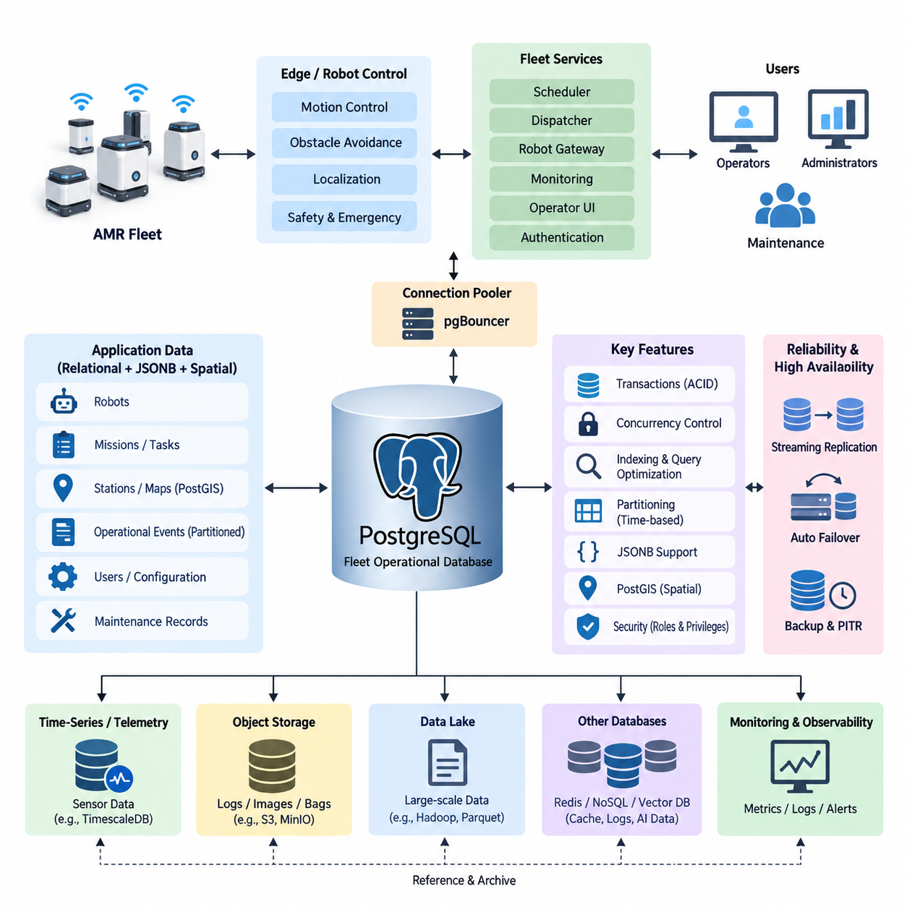
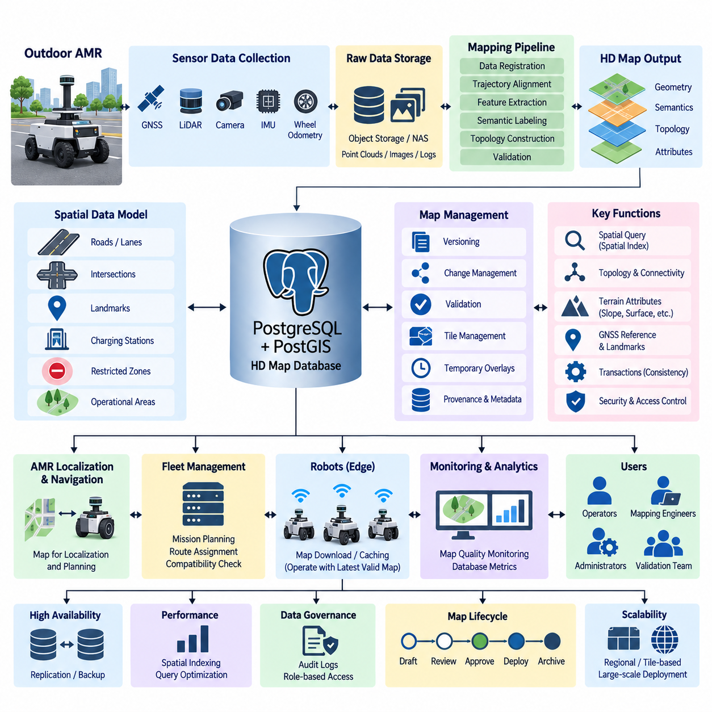
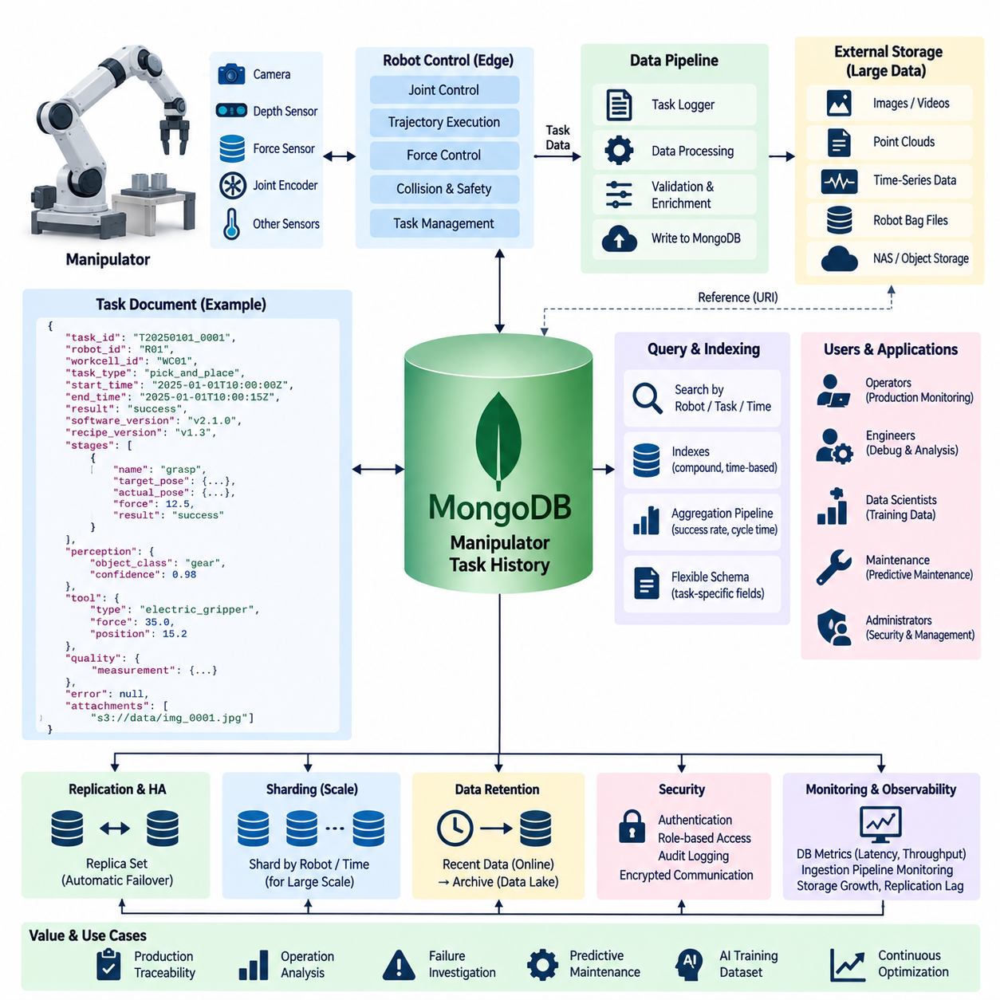
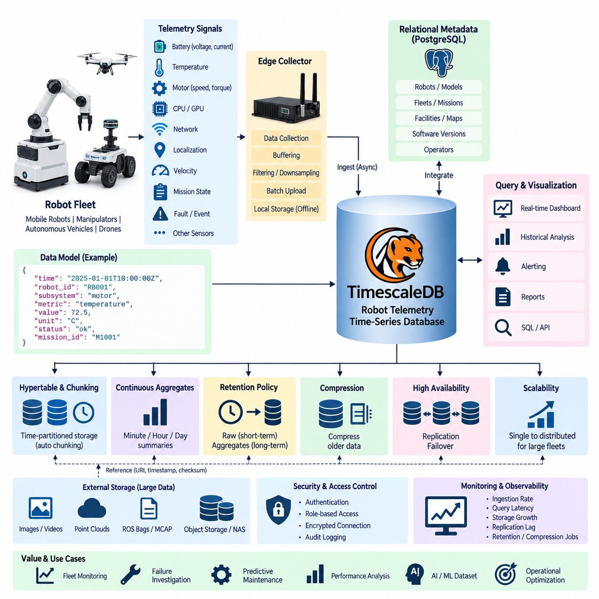
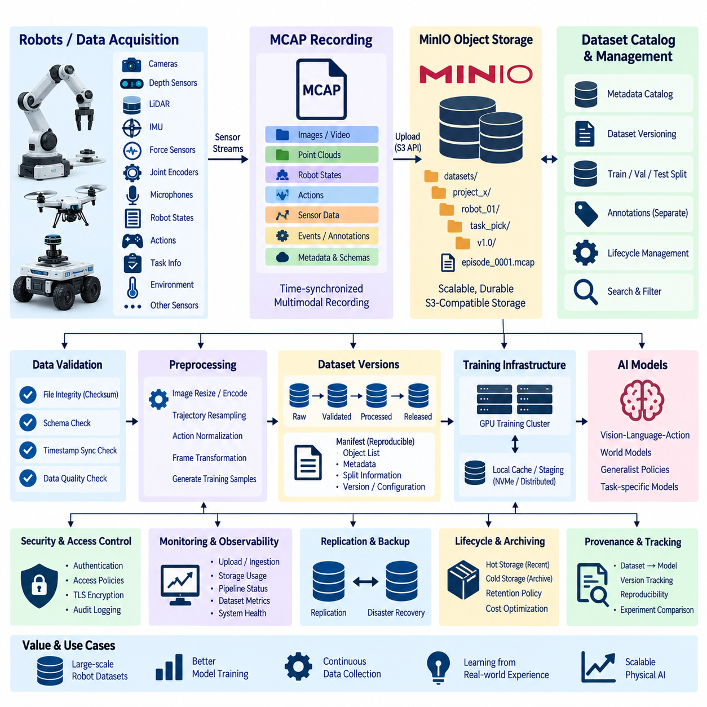
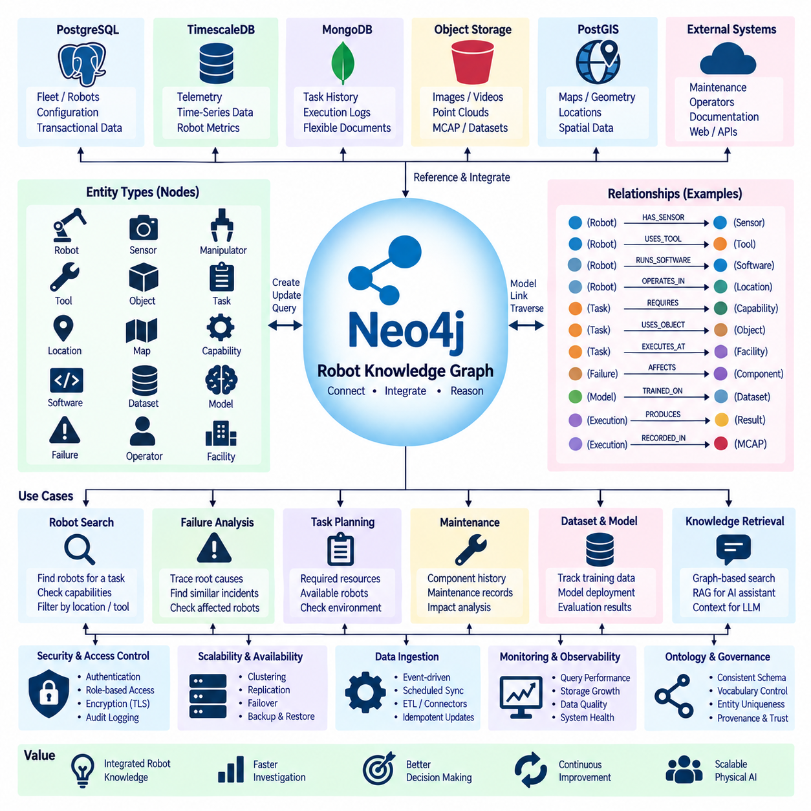
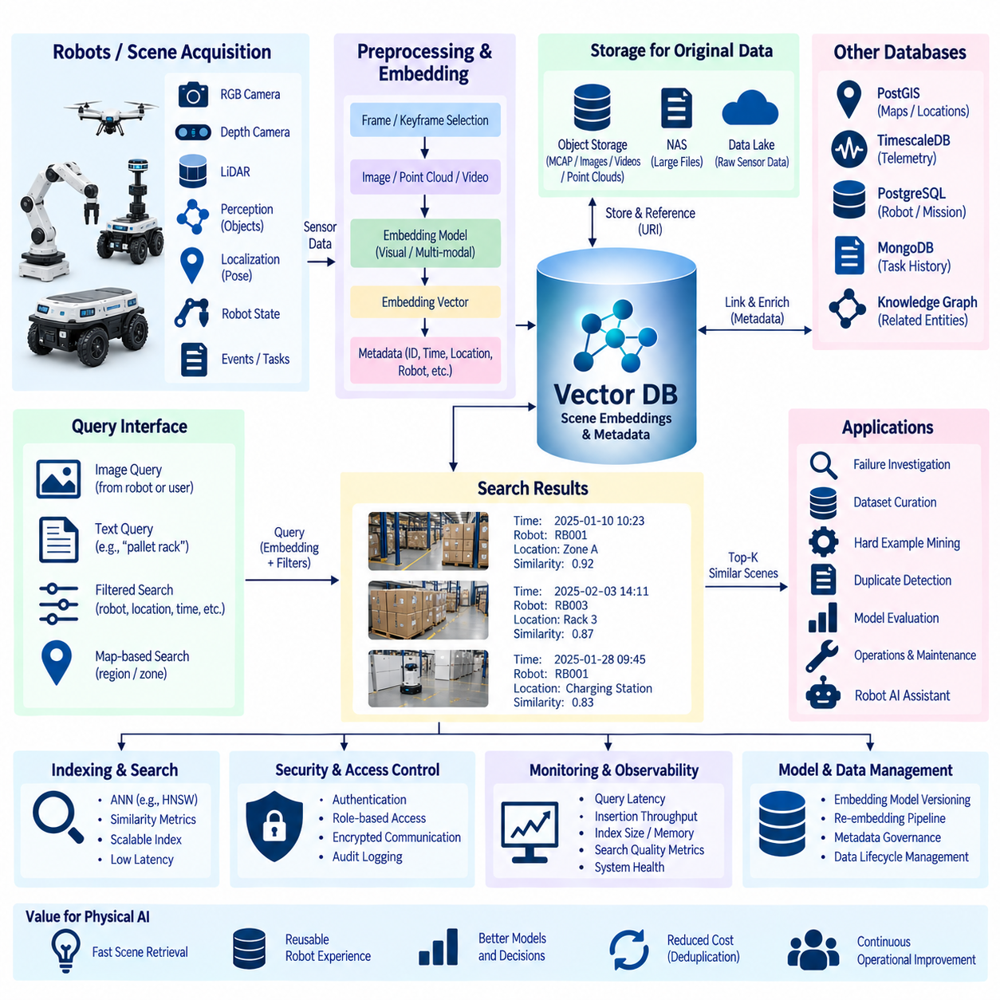
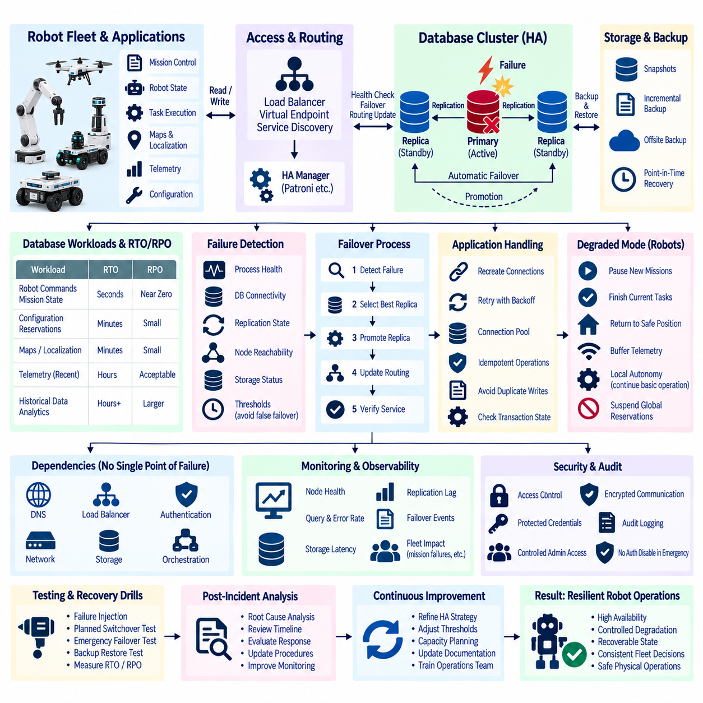
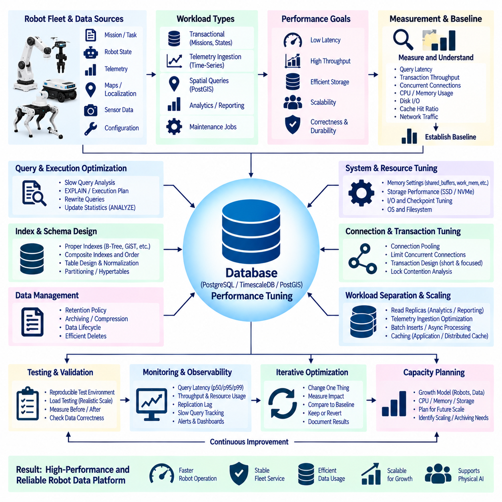
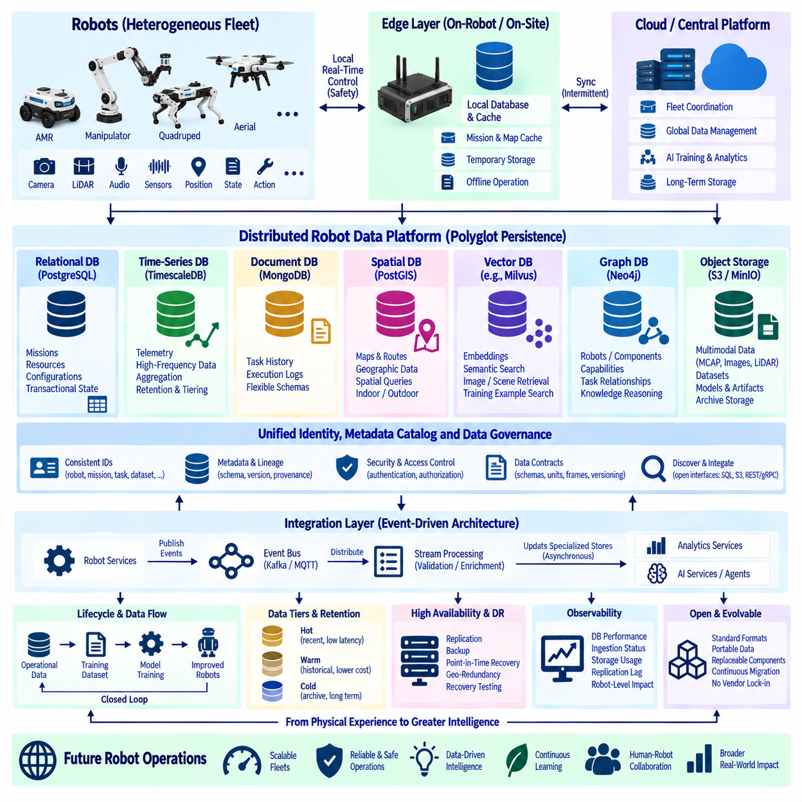

**Volume 08 Robot Database and Storage**

# 12. Database Case Studies

## 12.01 Indoor AMR Fleet PostgreSQL Operation Case

{width="7.268055555555556in" height="7.268055555555556in"}

An indoor Autonomous Mobile Robot (AMR) fleet generates operational data continuously as robots receive missions, navigate through shared spaces, interact with stations, charge batteries, and report faults. PostgreSQL can serve as the central transactional database for this environment because fleet operations require structured relationships, reliable transactions, concurrent access, historical traceability, and consistent state management across many robots and services.

A typical deployment separates real-time robot control from persistent fleet data management. Motion controllers, obstacle avoidance, localization, and emergency responses remain inside the robot or edge computing layer, while PostgreSQL stores information that must survive process restarts and system failures. This includes robot identities, fleet membership, mission definitions, task assignments, charging records, station information, configuration versions, maintenance events, and summarized operational states.

The core relational model usually begins with tables representing robots, missions, tasks, stations, maps, users, and operational events. A robot record can contain a stable robot identifier, model type, software version, current lifecycle state, assigned map, and maintenance status. Mission and task tables reference these records through foreign keys, allowing the database to enforce relationships rather than relying entirely on application code to maintain consistency.

Mission execution illustrates why transaction support is important. When a dispatcher assigns a transport task, several database changes may need to occur together: the task changes from pending to assigned, the selected robot becomes reserved, an assignment record is created, and an operational event is recorded. PostgreSQL transactions allow these modifications to be committed atomically so that a partial application failure does not leave a robot reserved without a corresponding mission.

Concurrency becomes increasingly important as fleet size grows. Multiple scheduling workers, monitoring services, operator interfaces, and robot gateways may attempt to update related records simultaneously. PostgreSQL transaction isolation, row-level locking, constraints, and carefully designed update statements can prevent conflicting assignments. For example, a scheduler can lock an eligible task or robot record while completing an assignment, reducing the possibility that two workers allocate the same resource concurrently.

The database should not receive every high-frequency control signal generated by the robots. Wheel encoder samples, raw LiDAR packets, camera frames, and dense localization streams can overwhelm a transactional database and are generally better handled through dedicated telemetry, time-series, object-storage, or robotics data pipelines. PostgreSQL instead stores operationally meaningful state changes, references to large data objects, aggregated metrics, mission events, and information needed for fleet-level decisions.

Robot state is commonly represented through both current-state and historical-event models. A current-state table provides rapid access to information such as whether a robot is idle, executing a mission, charging, unavailable, or in an error state. A separate event table records transitions with timestamps and contextual information. This combination gives operators a fast fleet overview while preserving enough history to reconstruct what occurred during incidents or performance investigations.

JSONB is useful when AMR data contains structured attributes that vary among robot models or software versions. A conventional relational schema can preserve stable fields such as robot ID, task ID, timestamps, and status, while JSONB stores optional diagnostic parameters, navigation metadata, device-specific configuration, or extended event details. This hybrid approach avoids creating excessive nullable columns while retaining PostgreSQL indexing and query capabilities for frequently accessed JSON attributes.

Indoor AMR systems also depend strongly on spatial information. Robots operate on maps containing stations, charging points, restricted areas, corridors, intersections, elevators, and other operational landmarks. PostgreSQL can maintain map metadata and logical relationships, while PostGIS can extend the database with spatial geometry, coordinate queries, proximity operations, and spatial indexes when geometric processing is required. This connects fleet transactions with the spatial context of robot operations.

Database indexes must reflect actual fleet queries rather than simply indexing every column. Common access patterns include finding pending tasks by priority, retrieving active missions for a robot, examining recent faults, locating robots associated with a map, and reviewing events within a time interval. Composite indexes combining status, robot identifiers, priorities, and timestamps can substantially reduce query cost when their column order corresponds to frequent filtering and sorting patterns.

Operational event tables can become some of the largest relational structures in a long-running fleet. Time-based partitioning provides a practical way to organize mission history, alarms, state transitions, and audit records into manageable ranges. Recent partitions remain readily accessible for operational analysis, while older partitions can be compressed, archived, exported to analytical storage, or retained according to organizational policies without continuously enlarging the active working set.

Connection management becomes another concern when many fleet microservices communicate with PostgreSQL. Robot gateways, schedulers, dashboards, authentication services, monitoring applications, and reporting processes can collectively create more database sessions than expected. A connection pooler such as pgBouncer can reduce connection overhead and stabilize database resource consumption, especially when application instances scale dynamically or frequently establish short-lived database connections.

Maintenance is essential because frequent inserts and updates create dead tuples under PostgreSQL\'s Multi-Version Concurrency Control model. Autovacuum therefore needs to be monitored rather than treated as a background mechanism that never requires attention. Tables containing rapidly changing robot states or task queues may need different vacuum and analyze settings from mostly static map or configuration tables. Accurate statistics are equally important because query planners depend on them when selecting execution strategies.

Reliability architecture should assume that the fleet database can eventually experience hardware, operating-system, network, or database-process failures. PostgreSQL Write-Ahead Logging provides the foundation for durability and recovery, while streaming replication can maintain standby servers. In deployments requiring higher availability, automated failover frameworks can promote a healthy replica when the primary database becomes unavailable, reducing interruption to fleet-management services.

High availability does not eliminate the need for backups. Logical backups can protect selected schemas or configuration information, while physical base backups combined with archived WAL records support Point-in-Time Recovery. A practical AMR operation defines recovery objectives according to business impact and periodically verifies restoration procedures. A backup that has never been restored under controlled conditions should not be considered sufficient evidence that fleet operations can actually be recovered.

Database observability should be integrated with the wider robot operations platform. Administrators need visibility into connection counts, transaction rates, replication lag, lock waits, long-running queries, cache effectiveness, table growth, vacuum behavior, storage utilization, and query latency. These database metrics become more valuable when correlated with fleet indicators such as task throughput, robot availability, charging congestion, mission delays, and dispatch-service errors.

Security requires separation between application responsibilities. A fleet scheduler should receive only the privileges required for task and assignment operations, while monitoring software may need read-only access and administrative functions should use separate protected roles. Authentication, encrypted connections, role-based privileges, audit records, network segmentation, and controlled credential management reduce the possibility that compromise of one robot-facing service provides unrestricted access to the entire operational database.

An important operational principle is that PostgreSQL should represent authoritative fleet business state without becoming part of the robot\'s hard real-time control loop. A robot must remain capable of performing safety-critical responses even when the database or network is temporarily unavailable. Edge software can buffer selected events and synchronize them after connectivity returns, while the fleet system reconciles persistent task and robot states according to explicitly defined recovery rules.

During a network interruption, for example, the server may still regard a robot as executing a mission while the robot has locally completed or aborted it. Reconnection logic should therefore use identifiers, timestamps, mission sequence information, and idempotent updates to determine the valid state. Simply overwriting database records with the most recently received message can create inconsistencies when delayed messages arrive out of order or services retry previously executed operations.

A mature AMR PostgreSQL deployment consequently combines relational modeling, transaction discipline, selective JSONB flexibility, spatial extensions, indexing, partitioning, connection pooling, replication, backup, monitoring, and security. These mechanisms are most effective when database responsibilities are clearly separated from high-frequency sensor storage and deterministic robot control. The result is a persistent operational layer capable of supporting reliable coordination and long-term traceability across an expanding indoor robot fleet.

As the fleet grows from a small installation into multiple operational zones or facilities, database design should evolve through measured workload evidence rather than premature complexity. Query statistics, table growth, transaction contention, recovery tests, and service-level requirements can reveal when additional replicas, partitioning, archival pipelines, or distributed components are justified. PostgreSQL can therefore remain the transactional foundation while specialized storage systems handle data types whose scale or access patterns require different architectures.

## 12.02 Outdoor AMR HD Map Database Build Case

{width="7.268055555555556in" height="7.268055555555556in"}

Outdoor Autonomous Mobile Robots (AMRs) operate across environments where localization, route planning, terrain interpretation, and safety decisions depend on persistent spatial knowledge. An HD map database provides this structured representation by combining geometric, semantic, topological, and operational information. Unlike a simple navigation map, it becomes a shared spatial reference connecting localization, planning, fleet management, monitoring, and long-term autonomous operation.

Building an outdoor AMR HD map begins with establishing a consistent coordinate framework. GNSS observations, LiDAR point clouds, camera measurements, IMU trajectories, wheel odometry, and surveyed landmarks may originate from different coordinate systems. The mapping pipeline must therefore define coordinate reference systems, transformations, origins, and frame relationships explicitly so that every stored spatial object can be interpreted consistently across robots, mapping sessions, and software versions.

The raw mapping layer commonly contains LiDAR scans, images, GNSS measurements, IMU data, and robot poses collected during surveying runs. These high-volume sensor datasets should normally remain in object storage, NAS, or specialized dataset repositories rather than being inserted directly into the relational database. The HD map database stores metadata, spatial indexes, acquisition references, processing status, timestamps, calibration identifiers, and links to the corresponding raw or processed files.

PostgreSQL with PostGIS can form the central structured database for an outdoor HD map system. PostgreSQL manages transactional consistency, metadata relationships, version information, and operational records, while PostGIS adds geometry types, coordinate reference system support, spatial functions, and spatial indexing. Together they allow map entities such as roads, lanes, boundaries, intersections, landmarks, charging locations, restricted zones, and operational areas to be represented as queryable spatial objects.

An HD map should separate geometric representation from semantic meaning. Geometry describes where an object exists through points, lines, polygons, or other spatial structures, while semantic attributes describe what the object means to the robot. A polygon may represent a drivable area, restricted region, loading zone, or charging area, while a line may represent a lane centerline, boundary, preferred route, or virtual safety constraint used by navigation software.

Topological information complements geometric information by describing connectivity. Outdoor AMRs need to understand not only where road segments are located but also how they connect and which transitions are operationally valid. Nodes can represent intersections, gates, stations, or decision points, while edges represent traversable connections. Attributes such as direction, maximum speed, vehicle class, terrain condition, and access restrictions can be associated with these graph elements.

Spatial indexing becomes essential as map coverage and object count increase. PostGIS commonly supports GiST and SP-GiST indexing strategies that accelerate spatial filtering and relationship queries. Instead of scanning every map feature, the database can rapidly identify objects intersecting a robot\'s operating region, landmarks within a defined distance, route segments near the current position, or restricted zones overlapping a planned trajectory. Index design should reflect actual navigation and fleet query patterns.

Outdoor operation introduces terrain properties that may not appear in conventional road maps. The database can associate traversable regions or route segments with slope, surface type, roughness, clearance requirements, expected traction, obstacle characteristics, and environmental constraints. These attributes allow planners to distinguish between geometrically possible paths and paths that are appropriate for a particular AMR\'s dimensions, payload, suspension capability, or operational mission.

GNSS-based localization can also be supported through map landmarks and reference information. Surveyed points, RTK reference coordinates, fiducial landmarks, LiDAR features, building boundaries, and other stable environmental references can be stored with accuracy or provenance metadata. Localization software can retrieve the appropriate reference features for a region while the database maintains information about when, how, and with which mapping process each reference was created.

Map versioning is critical because outdoor environments change over time. Construction work, relocated barriers, modified traffic routes, newly installed facilities, vegetation, or operational policy changes can invalidate existing map information. Each map release should therefore have an explicit version, creation time, validation state, geographic coverage, and relationship to previous versions. Robots must be able to determine which approved map version applies to their current operating area.

Updates should distinguish between temporary conditions and persistent map changes. A parked vehicle, temporary work zone, or short-term obstruction should not automatically rewrite the authoritative HD map. Such conditions can be represented as dynamic operational overlays with expiration times or confidence values. Persistent modifications can enter a controlled mapping and validation workflow before becoming part of the next authoritative map version distributed to the fleet.

A practical map-building pipeline moves data through several stages. Sensor recordings are first collected and registered, after which localization trajectories and point clouds are aligned. Relevant geometric features are extracted, semantic attributes are assigned, and topology is constructed. The resulting map objects are validated before publication. Database records can track this lifecycle so that draft, reviewed, approved, deployed, deprecated, and archived map states remain distinguishable.

Quality management requires more than verifying that spatial objects exist in the database. Map validation should examine coordinate consistency, geometry validity, topology connectivity, duplicate features, missing attributes, discontinuities, and relationships between overlapping objects. Operational tests can additionally verify whether generated routes are traversable and whether localization remains stable. Validation results should be associated with specific map versions so that deployment decisions remain traceable.

Map provenance provides another important layer of traceability. Each feature or map region can retain references to its source survey, acquisition date, processing software, calibration configuration, operator, automated extraction process, and validation result. When an unexpected navigation problem occurs, engineers can determine whether the relevant information came from an outdated survey, incorrect transformation, failed extraction process, or later manual modification.

Large outdoor deployments benefit from dividing maps into manageable geographic regions or tiles. Robots rarely require an entire facility or campus map simultaneously, so regional organization reduces transfer size and query workload. A database can maintain tile boundaries, map-layer identifiers, versions, and dependencies while object storage contains larger raster, point-cloud, or binary map artifacts. Robots then retrieve only the spatial resources needed for their current or anticipated operating region.

The HD map database should also integrate with mission and fleet systems. A mission may reference pickup and delivery stations, permitted operating zones, route classes, or geographic restrictions stored in the map database. Fleet services can query whether a robot is compatible with a particular route based on width, payload, terrain, access policy, or other constraints. Spatial information consequently becomes part of operational task allocation rather than remaining an isolated mapping resource.

Database transactions are valuable when publishing map updates because related spatial objects must remain mutually consistent. Changing a route may require simultaneous modifications to lane geometry, connectivity, speed constraints, and operational metadata. Transactional updates prevent clients from observing partially updated map states. For larger releases, a complete candidate version can be validated separately and activated only after all required consistency checks have succeeded.

Security and governance are important because unauthorized map modifications can directly affect robot behavior. Read and write privileges should therefore be separated among robots, fleet applications, mapping engineers, validation services, and administrators. Production robots generally require approved read access, while map modification should pass through controlled roles and workflows. Audit records can identify who changed map information, when the change occurred, and which map release incorporated it.

Availability requirements depend on how robots consume maps. Frequently used map regions may be cached on the robot or edge server so temporary database or network failures do not immediately stop autonomous operation. PostgreSQL replication and backup protect the authoritative metadata repository, while object-storage replication protects larger map artifacts. Local caching and version identifiers allow operation to continue using the last validated map until connectivity is restored.

Monitoring should cover both database health and map quality. Database metrics include query latency, connection utilization, storage growth, index efficiency, replication lag, and backup status. Map-oriented metrics include feature counts, geographic coverage, update frequency, validation failures, outdated regions, and deployed map versions. Combining these perspectives helps operators distinguish infrastructure problems from errors in the spatial information consumed by autonomous robots.

As an outdoor AMR deployment expands, the HD map database evolves from a navigation support component into a shared spatial knowledge layer. PostgreSQL and PostGIS can maintain authoritative structured geometry, semantics, topology, versions, and operational relationships, while object storage handles large point clouds, images, and map artifacts. This separation allows each storage technology to manage the data type for which it is best suited while preserving a consistent spatial reference.

A mature implementation ultimately treats the HD map as a governed, versioned, and continuously validated operational asset rather than a static file generated once during commissioning. Sensor surveys, database transactions, spatial indexing, semantic layers, topology, provenance, validation, caching, and controlled deployment form one lifecycle. Through this architecture, outdoor AMRs can share reliable spatial knowledge while adapting systematically to changing environments and expanding operational areas.

## 12.03 Manipulator Task History MongoDB Storage Case

{width="7.268055555555556in" height="7.268055555555556in"}

Industrial manipulators generate a detailed operational history whenever they execute pick-and-place, assembly, inspection, packaging, machine-tending, or material-handling tasks. Unlike highly normalized business records, manipulator task data often contains variable structures describing robot states, trajectories, tool conditions, object information, perception results, execution parameters, and failure diagnostics. MongoDB provides a flexible document-oriented model suitable for storing this heterogeneous task history.

A practical storage architecture separates real-time robot control from historical task persistence. Joint servo control, trajectory interpolation, collision response, force control, and emergency functions remain inside the robot controller or edge control system. MongoDB receives task-level information after or during execution through an application or data pipeline, preserving records needed for traceability, production analysis, debugging, maintenance, and future AI-based optimization without becoming part of the deterministic control loop.

The central data object can be modeled as a task execution document. Each document may contain a task identifier, robot identifier, workcell identifier, task type, start and completion timestamps, execution result, software version, recipe version, and operator or production context. Nested structures can then represent motion stages, manipulated objects, tools, perception outputs, quality results, and errors while keeping all information associated with one execution logically grouped.

MongoDB\'s embedded document model is useful because manipulator tasks naturally form hierarchical structures. A single assembly operation may contain approach, grasp, transfer, insertion, verification, and retreat stages. Each stage can contain its own timestamps, target pose, actual pose, velocity parameters, force thresholds, execution result, and diagnostic information. Embedding these elements within one task document allows engineers to retrieve the complete execution context without reconstructing it from numerous relational tables.

Not every task requires the same attributes. A vacuum-gripper operation may record suction pressure and vacuum detection status, while an electric gripper records finger position, gripping force, and motor current. Welding, dispensing, fastening, or inspection tools introduce additional parameters. MongoDB permits these task-specific structures to coexist within the same collection while common identifiers and timestamps remain consistent across the overall operational history.

Robot motion information requires careful storage granularity. Storing every high-frequency joint position, torque, velocity, and Cartesian pose sample directly as ordinary MongoDB documents can create unnecessary database volume and write pressure. The task document should normally retain important trajectory summaries, commanded poses, critical waypoints, execution statistics, and references to detailed time-series or binary data stored in systems optimized for high-rate signals.

Perception information can also be represented as nested task context. A manipulation task may include detected object classes, object identifiers, estimated six-degree-of-freedom poses, confidence values, grasp candidates, selected grasp poses, and inspection results. Storing these outputs together with the executed robot action makes it possible to investigate whether a failure originated from perception, planning, grasp selection, motion execution, tooling, or interaction with the physical environment.

Task history becomes particularly valuable when failures occur. A failure document can preserve the execution stage, error code, controller message, retry count, robot state, tool state, object information, relevant sensor summaries, and recovery action. Rather than storing only a final status such as failed, the database should retain sufficient context to reconstruct the sequence leading to the event and compare it with successful executions of the same task.

MongoDB indexes should be designed around operational queries. Engineers commonly search task histories by robot ID, workcell, task type, execution result, error code, product identifier, or time range. Compound indexes combining robot identifiers, timestamps, and task status can accelerate frequently repeated investigations. Indexes should remain selective because excessive indexing increases storage requirements and adds write overhead to a database receiving continuous production records.

Time is a fundamental dimension of manipulator history. Every task should use a consistent timestamp policy so that records from robot controllers, vision systems, edge computers, and factory applications can be correlated. Start time, completion time, stage timestamps, and event times provide a common execution timeline. Where multiple computing systems participate, clock synchronization and explicit timestamp provenance become important for reconstructing the true order of closely spaced events.

Large binary artifacts should normally remain outside MongoDB task documents. Camera images, depth maps, point clouds, robot bag files, video, detailed force traces, and other large data objects can be stored in NAS or object storage. MongoDB then records object identifiers, storage locations, checksums, timestamps, acquisition context, and metadata. This keeps operational queries responsive while preserving a traceable connection between task records and supporting evidence.

Task documents should also preserve configuration provenance. Manipulator behavior can change when robot programs, motion parameters, tool calibration, perception models, grasp policies, or workcell configurations are updated. Recording software versions, model versions, calibration identifiers, recipe revisions, and configuration hashes allows engineers to determine exactly which system configuration produced a particular task result and compare performance before and after changes.

Schema flexibility does not mean that schema governance can be ignored. Uncontrolled field naming, inconsistent units, changing data types, or undocumented nested structures can make historical analysis difficult. A production MongoDB design should define stable naming conventions, required identifiers, timestamp formats, coordinate-frame conventions, physical units, and document version fields. Application-level validation or MongoDB schema validation can enforce essential rules while retaining flexibility for task-specific extensions.

Aggregation pipelines provide a useful mechanism for analyzing manipulator operations directly from stored documents. Task records can be grouped by robot, task type, product, shift, failure category, or software version to calculate execution counts, success rates, cycle-time distributions, retry frequencies, and error patterns. These results can support production dashboards and engineering investigations without requiring every analytical question to be implemented as a separate transactional data model.

Historical data can also support predictive maintenance. Repeated increases in cycle time, motor load summaries, gripping retries, force anomalies, tool errors, or calibration corrections may indicate gradual degradation. MongoDB can retain the task context surrounding these indicators, allowing maintenance systems or analytical pipelines to correlate mechanical symptoms with particular robots, joints, end effectors, products, or operating conditions rather than examining isolated alarm messages.

Replica sets can improve availability when the task-history database is operationally important. MongoDB replication maintains copies of data across multiple nodes and supports failover when the primary node becomes unavailable. This protects the persistence service from a single database-node failure, although robot controllers should still continue safe local behavior when database connectivity is interrupted. Historical recording must never become a dependency for emergency or deterministic motion control.

Sharding can be considered when task history grows beyond the practical capacity or throughput of a single replica set. Suitable shard-key selection depends on access patterns and data distribution, and a poorly selected key can create hotspots. Robot identifiers, time components, or carefully constructed compound strategies may be evaluated using measured workloads. Sharding should therefore be introduced because demonstrated scale requires it rather than as an automatic feature of the initial architecture.

Retention policies should distinguish operationally active history from long-term archives. Recent task documents may remain online for rapid troubleshooting and production analysis, while older records can be exported to a data lake or archival object storage. High-value failure cases, validation datasets, or records associated with safety and quality investigations may require longer retention than routine successful operations, depending on organizational and regulatory requirements.

Security requires separation of application privileges. Robot gateways may require permission to insert task records, production dashboards may require read access, analytics services may need aggregation privileges, and database administrators require separate management roles. Authentication, encrypted communication, network segmentation, credential management, role-based authorization, and audit logging reduce the risk that a compromised robot-facing service can alter or extract unrestricted historical information.

Observability should monitor both MongoDB infrastructure and the task-ingestion pipeline. Useful indicators include operation latency, write throughput, connection utilization, replication lag, storage growth, index usage, cache behavior, failed writes, and ingestion backlog. These database measurements should be correlated with manipulator metrics such as task throughput, cycle time, failure frequency, retry rate, and robot availability to determine whether production anomalies originate from robotics or data infrastructure.

The resulting architecture treats MongoDB as a flexible operational history repository rather than a substitute for every robot data store. Deterministic control remains on the robot, high-frequency signals and large artifacts use specialized storage, and MongoDB maintains task-oriented documents that connect execution context, perception, tooling, results, diagnostics, and configuration provenance. This division preserves query flexibility without forcing fundamentally different robot data types into a single persistence technology.

As manipulator fleets and Physical AI applications evolve, accumulated task histories can become valuable training and evaluation resources. Successful and failed executions can be selected using metadata queries, linked with sensor artifacts, transformed into learning datasets, and compared across software or policy versions. A well-governed MongoDB task history therefore supports not only production traceability but also the transition from conventional robot operation toward data-driven optimization and learning-based manipulation.

## 12.04 Robot Telemetry TimescaleDB Operation Case

{width="7.268055555555556in" height="7.268055555555556in"}

Robot telemetry represents the continuous stream of time-stamped measurements describing the condition, behavior, and performance of a robotic system. Mobile robots, manipulators, autonomous vehicles, and Physical AI platforms can generate battery voltage, current, temperature, motor speed, torque, CPU and GPU utilization, network status, localization quality, velocity, mission state, and fault information. TimescaleDB provides a PostgreSQL-based time-series architecture for storing and analyzing this operational data.

A practical telemetry architecture separates deterministic robot control from telemetry persistence. Motor control, localization, obstacle avoidance, safety functions, and other latency-sensitive processes remain within the robot or edge computing environment. Telemetry collectors observe selected signals and asynchronously transmit them to the storage infrastructure. Consequently, temporary database or network failures should affect monitoring visibility rather than interrupt the robot\'s safety-critical control functions.

Telemetry data is fundamentally organized around time. Each record normally contains a timestamp together with identifiers such as robot ID, device ID, subsystem, sensor type, or operational context. Measurements can then contain values such as battery state of charge, motor temperature, velocity, CPU load, localization confidence, or communication latency. Consistent timestamps allow measurements originating from different robot subsystems to be correlated along a common operational timeline.

TimescaleDB extends PostgreSQL with capabilities designed for time-series workloads while preserving SQL and the PostgreSQL ecosystem. Robot telemetry can therefore coexist with relational metadata describing robots, models, fleets, missions, and facilities. Engineers can use familiar SQL operations while applying time-oriented storage and query mechanisms to continuously growing measurements, avoiding the need to separate operational metadata and time-series analysis into completely unrelated database environments.

A central TimescaleDB concept is the hypertable, which presents time-series information as a logical table while internally partitioning it into smaller chunks. Robot telemetry can be organized primarily by timestamp and, where appropriate, additional dimensions such as robot identity. New measurements are directed to relevant chunks automatically, allowing the database to manage continuously growing histories more efficiently than an unmanaged conventional table containing all telemetry records.

Telemetry ingestion should use a defined data model rather than accepting arbitrary signals without governance. Stable fields can identify timestamp, robot, subsystem, metric name, unit, and quality status, while measurement-specific values represent actual observations. Alternatively, frequently used telemetry categories can use dedicated tables with strongly typed columns. The appropriate design depends on signal diversity, query patterns, ingestion rate, and the degree of schema consistency required by the robot platform.

Sampling frequency has a direct impact on database scale. A fleet containing many robots can produce enormous record counts when every internal signal is transmitted at controller frequency. Telemetry architecture should therefore distinguish high-rate control data from operational monitoring data. Millisecond-level raw signals may remain in local files, MCAP, object storage, or specialized recording systems, while TimescaleDB receives downsampled, event-driven, or operationally meaningful measurements.

Batch insertion can improve ingestion efficiency when individual measurements do not require immediate persistence. An edge telemetry agent may temporarily buffer multiple samples and transmit them together, reducing transaction and network overhead. Buffering also supports intermittent connectivity because measurements can remain locally queued until communication returns. Each sample must retain its original acquisition timestamp so delayed transmission does not distort the historical sequence of robot behavior.

Time synchronization is essential when telemetry from multiple computers must be correlated. A robot may contain motor controllers, embedded computers, GPU systems, perception devices, and external fleet servers with independent clocks. Without synchronized time, an apparent relationship between localization loss, motor response, network delay, and safety events may be misleading. Telemetry records should therefore preserve acquisition time and, where necessary, information describing timestamp source or synchronization quality.

Indexes should correspond to the queries used by operators and engineers. Typical investigations retrieve measurements for a particular robot over a time interval, compare a metric across several robots, or examine subsystem behavior around a fault. Time-based organization combined with robot or device identifiers supports these access patterns. Excessive secondary indexing should be avoided because every additional index consumes storage and increases the cost of continuously inserting new telemetry records.

TimescaleDB continuous aggregates can transform high-resolution telemetry into operational summaries. Raw measurements collected every few seconds can be summarized into minute, hourly, or daily statistics such as average temperature, maximum motor current, battery consumption, network latency, or localization quality. Dashboards can query these precomputed summaries instead of repeatedly scanning large raw histories, improving responsiveness while preserving detailed data for investigations that require it.

Retention policies provide a systematic method for controlling long-term storage growth. High-resolution telemetry may be useful only for recent troubleshooting, while aggregated statistics can remain valuable for months or years. A system can therefore retain detailed measurements for a defined period and preserve lower-resolution summaries for longer-term analysis. Important fault windows or validation campaigns can be exported separately when engineering or compliance requirements demand extended retention.

Compression further reduces the storage cost of historical time-series information. Older telemetry chunks that are no longer receiving frequent updates can be compressed while recent chunks remain optimized for ingestion. Robot telemetry often contains repeated identifiers and measurements with temporal regularity, making historical data suitable for compression. The storage policy should balance compression efficiency, query requirements, retention duration, and the computational cost of accessing older information.

Operational dashboards are one of the primary consumers of telemetry. Fleet operators may need to observe robot availability, battery condition, charging status, temperatures, communication health, localization quality, mission progress, and active faults. Visualization systems can query TimescaleDB directly or through application services. Current measurements provide immediate fleet awareness, while historical queries allow operators to determine whether an abnormal condition appeared suddenly or developed gradually.

Telemetry is particularly useful for failure investigation because measurements from multiple subsystems can be aligned around an incident timestamp. Engineers can inspect battery voltage, motor current, CPU utilization, localization confidence, network latency, velocity, and temperature immediately before and after a fault. This temporal correlation can reveal whether an event was isolated or whether several indicators changed together, providing evidence for root-cause analysis rather than relying only on final error codes.

Long-term telemetry can also support predictive maintenance. Gradual increases in motor temperature, current consumption, vibration indicators, charging duration, or repeated communication errors may reveal degradation before a complete failure occurs. Analytical applications can calculate trends and compare similar robots under comparable workloads. TimescaleDB supplies the historical time-series foundation, while statistical or machine-learning systems perform higher-level anomaly detection and remaining-life analysis.

Robot telemetry becomes more informative when correlated with mission and operational metadata. A high motor temperature may have different meaning depending on payload, route, terrain, speed, or mission duration. Because TimescaleDB integrates with PostgreSQL, telemetry measurements can be associated with relational information describing robots, tasks, maps, facilities, and software versions. This combination supports analysis of not only what changed, but also under which operational conditions the change occurred.

Large binary sensor artifacts should remain outside the telemetry database. Camera recordings, LiDAR point clouds, raw audio, detailed ROS bags, MCAP files, and long high-frequency traces can be stored in NAS, object storage, or data lakes. TimescaleDB can retain timestamps, identifiers, event markers, checksums, and storage references that connect numerical telemetry with these artifacts, enabling engineers to locate detailed evidence associated with a particular time interval or failure.

High availability becomes important when telemetry supports production monitoring across a large robot fleet. PostgreSQL replication and appropriate high-availability mechanisms can reduce interruption caused by database-node failures. However, the robot itself should continue safe operation when telemetry infrastructure is unavailable. Edge buffering and retry mechanisms can preserve measurements during temporary outages, after which delayed records can be inserted using their original timestamps when connectivity is restored.

Security should separate telemetry producers, consumers, and administrators. Robot gateways may require write privileges, dashboards primarily require read access, analytics services may require broader historical queries, and administrators require controlled management permissions. Authentication, encrypted connections, role-based access control, network segmentation, and audit logging protect operational information while reducing the consequences of compromised robot-facing or monitoring services.

Database observability must monitor the telemetry platform itself. Important indicators include ingestion rate, query latency, connection utilization, chunk growth, disk consumption, replication lag, compression status, retention jobs, continuous aggregate refresh behavior, and failed inserts. These infrastructure metrics should be compared with expected fleet telemetry rates so that database saturation, communication problems, and genuine robot behavior changes are not confused with one another.

Scaling should be driven by measured workload characteristics such as fleet size, signal count, sampling rate, retention period, query concurrency, and aggregate complexity. Early deployments may operate effectively on a single well-designed TimescaleDB instance, while larger fleets may require additional storage resources, replicas, distributed processing, or archival pipelines. Capacity planning should therefore begin with an explicit calculation of telemetry volume rather than relying only on robot count.

A mature architecture treats TimescaleDB as the time-oriented operational memory of the robot fleet rather than as a universal repository for every generated byte. High-frequency control remains at the edge, large artifacts use object-oriented storage, relational systems preserve business and configuration context, and TimescaleDB maintains queryable numerical history. Clear boundaries among these storage responsibilities improve performance, reliability, scalability, and long-term data governance.

When combined with dashboards, alerting, fleet management, maintenance analytics, and AI pipelines, robot telemetry evolves from passive logging into an operational intelligence resource. Time-series history can explain failures, quantify fleet performance, identify degradation, compare software releases, and provide evidence for optimization. TimescaleDB therefore acts as a bridge between real-time robot operation and long-term data-driven improvement across increasingly large and heterogeneous robotic fleets.

## 12.05 Physical AI Training Dataset MCAP / MinIO Case

{width="7.268055555555556in" height="7.268055555555556in"}

Physical AI training requires datasets that preserve not only images or individual sensor samples but also synchronized sequences describing perception, robot state, actions, environment context, and task outcomes. A practical storage architecture can combine MCAP as the multimodal recording format with MinIO as scalable object storage. MCAP organizes temporally aligned robot streams, while MinIO provides durable, API-accessible storage for large collections of training episodes.

The architecture begins at the robot or data-acquisition platform, where cameras, depth sensors, LiDAR, IMU, force sensors, joint encoders, microphones, and control software generate heterogeneous streams. Robot states, commanded actions, observations, task identifiers, timestamps, calibration information, and execution results should be captured together. This preserves the relationship between what the robot perceived, what action it executed, and what happened afterward.

MCAP is well suited to this recording layer because a single file can contain multiple timestamped channels together with message schemas and metadata. Instead of managing thousands of loosely related sensor files, an episode can be represented as a coherent multimodal recording. Camera messages, robot poses, joint states, actions, force measurements, events, and task annotations can share a common temporal container while retaining their original message structures.

Time synchronization is fundamental for Physical AI datasets. A training sample may require an image at time t, the corresponding robot state, the action executed immediately afterward, and the resulting observation. If sensor and control clocks are inconsistent, the learned relationship between observation and action can become corrupted. Recording pipelines should therefore preserve acquisition timestamps, clock sources, synchronization status, and where necessary both sensor time and system receive time.

Dataset organization should reflect meaningful units of robot experience. An MCAP object may represent one episode, task execution, demonstration, experiment, or bounded recording interval. Each object can be associated with metadata such as robot ID, task type, environment, success or failure, software version, policy version, operator, sensor configuration, and acquisition date. This metadata enables large collections to be searched and filtered without opening every recording.

MinIO provides the object-storage layer for these MCAP datasets and exposes an S3-compatible interface that can be used by data-ingestion, preprocessing, training, and archival applications. Objects can be organized into buckets and logical prefixes representing projects, robots, environments, dataset versions, or acquisition campaigns. The physical storage layout remains independent from the logical dataset structure used by machine-learning applications.

Object naming should be deterministic and machine-readable. Names can incorporate dataset version, task family, robot identifier, recording date, and episode identifier while avoiding dependence on manually interpreted folder names. A separate metadata catalog should retain richer searchable attributes rather than encoding every property into the object path. This separation allows storage organization to remain stable even when new annotations or classification attributes are introduced later.

Large-scale ingestion should avoid treating MinIO merely as a network file server. Completed MCAP recordings can be finalized locally, validated, checksummed, and uploaded as immutable dataset objects. Multipart upload can support large recordings, while retry logic handles temporary communication failures. The ingestion service should confirm object integrity after transfer before marking the episode as successfully registered in the dataset catalog.

Checksums are essential because Physical AI training datasets may be copied between robots, edge servers, NAS systems, object storage, and GPU training infrastructure. A corrupted recording can silently affect preprocessing or training if integrity is not verified. Each MCAP object should therefore have an associated cryptographic checksum or equivalent integrity record, with automated verification performed during ingestion, replication, migration, and dataset preparation.

MCAP metadata and an external dataset catalog perform complementary roles. Information required to interpret a recording should remain with the MCAP file, including channel definitions, schemas, timing information, and essential recording context. Cross-dataset information such as dataset version, split assignment, quality status, annotation status, storage URI, checksum, and lifecycle state can be maintained in a searchable metadata database or manifest.

Dataset versioning is necessary because training collections continuously evolve. Episodes may be added, excluded, re-annotated, corrected, or assigned to different training and validation subsets. A dataset version should therefore describe an immutable selection of objects and associated metadata rather than simply referring to the current contents of a bucket. Manifest files can explicitly identify which MCAP objects belong to a reproducible training release.

Training, validation, and test splits should also be reproducible. Randomly selecting objects every time a training job begins can make model comparisons unreliable and may accidentally place closely related episodes into different splits. Split membership should be recorded in a manifest or catalog and generated according to defined grouping rules, potentially separating robots, environments, tasks, acquisition sessions, or geographic locations where leakage would otherwise occur.

Annotation pipelines can operate without modifying the original MCAP recordings. Human labels, semantic segmentation, object poses, language instructions, task phases, success labels, or automatically generated annotations can be stored as separate versioned artifacts linked to the source episode. This preserves raw data immutability and makes it possible to compare multiple annotation versions or regenerate labels when perception and foundation models improve.

Preprocessing pipelines may transform raw MCAP episodes into formats optimized for model training. Images can be resized or encoded, trajectories resampled, actions normalized, coordinate frames transformed, and synchronized observation-action windows generated. Derived datasets can be stored in separate MinIO prefixes or buckets while retaining references to the source MCAP objects, processing software version, configuration, and transformation parameters used to create them.

GPU training clusters should access data through a controlled staging and caching strategy. Repeatedly reading millions of small samples directly from remote object storage can create unnecessary network and request overhead. Training workers can retrieve MCAP objects or derived shards into local NVMe or distributed caches before decoding batches. Frequently reused datasets may remain staged close to compute while MinIO continues to serve as the authoritative object repository.

The storage architecture should distinguish raw, validated, processed, and released datasets. Raw recordings preserve original acquisition results, validated datasets have passed structural and integrity checks, processed datasets contain derived training representations, and released datasets correspond to approved reproducible versions. Explicit lifecycle states prevent experimental preprocessing outputs from being confused with authoritative training data and simplify automated pipeline control.

MinIO versioning and replication can protect important dataset objects against accidental replacement or infrastructure failure, but they do not replace independent backup and disaster-recovery planning. Critical datasets may require replication to another storage system or physical location. Recovery procedures should verify not only that objects can be restored but also that manifests, metadata catalogs, checksums, annotations, and dataset-version relationships remain consistent.

Lifecycle policies can reduce long-term storage cost as dataset volume grows. Frequently accessed training releases may remain on high-performance storage, while older raw recordings or superseded processed datasets can move to lower-cost archival tiers where available. Deletion should be governed by dataset dependencies because an apparently unused raw MCAP object may still be referenced by a released dataset, annotation set, benchmark, or trained-model provenance record.

Security should separate acquisition, curation, training, and administration responsibilities. Robots or ingestion services may receive write access to designated prefixes, training systems primarily require read access, annotation services require access to selected datasets, and administrators manage buckets and policies. Authentication, TLS, access policies, credential rotation, audit logging, and network segmentation help prevent unauthorized modification or extraction of valuable Physical AI training data.

Observability should cover both object-storage infrastructure and dataset pipelines. Operators need visibility into upload throughput, failed transfers, storage utilization, object counts, request latency, replication status, checksum failures, preprocessing backlog, and training-read traffic. Dataset-level metrics such as episode counts, task distribution, success ratios, sensor completeness, annotation coverage, and version growth provide an additional view of whether the stored collection is actually useful for learning.

Provenance connects storage infrastructure to model reproducibility. A trained model should be traceable to a specific dataset version, manifest, preprocessing configuration, annotation version, and training code revision. If model behavior changes unexpectedly, engineers can reconstruct exactly which MCAP recordings and transformations contributed to training. This relationship turns dataset management from simple file retention into part of the model-development and validation process.

The combination of MCAP and MinIO therefore establishes a clear division of responsibility. MCAP preserves synchronized multimodal robot experience within portable recording objects, while MinIO manages those objects at dataset scale through an S3-compatible storage interface. Metadata catalogs, manifests, checksums, annotations, and preprocessing records provide the surrounding governance required to transform raw robot recordings into reproducible Physical AI training resources.

As Physical AI systems progress toward foundation models, Vision-Language-Action models, world models, and generalist robot policies, dataset scale and diversity become increasingly important. A structured MCAP-MinIO architecture allows demonstrations, autonomous executions, failures, recovery episodes, and multimodal observations to accumulate without losing temporal relationships or provenance. The resulting data platform can support continuous collection, curation, training, evaluation, and future reuse across generations of robot intelligence.

## 12.06 Robot Knowledge Graph Neo4j Build Case

{width="7.268055555555556in" height="7.268055555555556in"}

A robot knowledge graph represents robotic information as connected entities and relationships rather than isolated records. Robots, sensors, manipulators, tools, objects, tasks, locations, maps, capabilities, failures, software, and operators can become graph nodes, while relationships describe how these entities interact. Neo4j provides a property-graph model suitable for building this connected knowledge layer and querying complex relationships across heterogeneous robot systems.

The knowledge graph complements rather than replaces operational databases. PostgreSQL may manage transactional fleet states, TimescaleDB may retain telemetry, MongoDB may store flexible task histories, and object storage may preserve images or robot recordings. Neo4j connects references to these resources through semantic relationships. This architecture allows each storage technology to handle its appropriate workload while the graph provides an integrated view of knowledge distributed across the robotics platform.

Graph modeling begins by identifying stable entity types and their relationships. A Robot node can be connected to Sensor, Manipulator, Tool, Software, Map, Mission, and Facility nodes through relationships such as HAS_SENSOR, USES_TOOL, RUNS_SOFTWARE, OPERATES_IN, and EXECUTES. Task nodes can connect objects, locations, required capabilities, and outcomes. These explicit relationships make the operational meaning of data directly navigable instead of reconstructing it repeatedly through complex joins.

The property-graph model allows both nodes and relationships to contain attributes. A Robot node may contain model, serial identifier, payload capacity, and software version, while an OPERATES_IN relationship may contain activation dates or operational status. A REQUIRES relationship between a task and capability can contain minimum performance requirements. Properties therefore provide detailed context while graph structure captures the semantic connections that are central to robot reasoning.

A capability model is particularly useful for heterogeneous robot fleets. Robots can be connected to capabilities such as navigation, manipulation, inspection, lifting, docking, mapping, or speech interaction. Tasks can independently specify the capabilities they require. A graph query can then identify robots whose capability relationships satisfy a task without encoding every robot-task combination manually. This becomes increasingly valuable as fleets contain multiple platforms, tools, and software configurations.

Spatial and environmental knowledge can also participate in the graph. Facilities may contain zones, stations, corridors, charging locations, workcells, and restricted areas. Robots can be associated with maps and operational regions, while tasks reference pickup, inspection, manipulation, or delivery locations. Detailed geometry may remain in PostGIS or HD map storage, with Neo4j storing identifiers and semantic relationships that connect spatial resources to robots, tasks, objects, and operational rules.

Robot components can be represented as a hierarchical graph. A robot may contain compute modules, batteries, motors, sensors, manipulators, and end effectors, each connected to models, manufacturers, firmware versions, calibration records, or maintenance events. Engineers can traverse from a reported failure to the affected component, its configuration, related maintenance history, and other robots using the same component model. This supports impact analysis that is difficult to express through isolated tables.

Task knowledge provides another important graph domain. A manipulation task can be connected to required objects, tools, grasp strategies, workcells, perception models, motion planners, and success criteria. A mobile mission can connect route classes, map regions, charging requirements, payload constraints, and destination stations. The graph therefore captures not only what task was executed but also the structured dependencies and resources required for successful execution.

Execution history can enrich this semantic structure without storing every raw event directly in Neo4j. Task-execution nodes may reference detailed histories in MongoDB, telemetry windows in TimescaleDB, and MCAP recordings in object storage. Relationships can identify which robot, policy, software version, environment, and task produced an execution result. Engineers can navigate from a failure to supporting evidence while large time-series and binary datasets remain in storage systems optimized for them.

Failure knowledge is naturally graph-oriented because faults frequently involve relationships among components, software, operating conditions, and previous events. A Failure node can be connected to affected components, observed symptoms, probable causes, recovery procedures, maintenance actions, and related historical incidents. As evidence accumulates, engineers can query recurring patterns such as multiple robots exhibiting similar symptoms after installation of the same firmware or component revision.

Neo4j\'s Cypher query language allows users to express relationship-oriented questions directly. Queries can search for robots capable of performing a task, components shared by failed robots, software versions associated with particular incidents, or paths connecting a task failure to a sensor configuration. Variable-length path queries are especially useful when relevant relationships span several intermediate entities and the complete connection is not known before the investigation begins.

Graph constraints and indexes remain important even though the database emphasizes relationships. Unique identifiers should be enforced for stable entities such as robots, components, tasks, datasets, and software releases. Indexes can accelerate searches by frequently used properties before graph traversal begins. A consistent identity strategy is essential because duplicate nodes representing the same physical robot or software version can fragment knowledge and produce misleading query results.

Ontology and vocabulary governance become increasingly important as the graph grows. Terms such as Robot, Task, Capability, Tool, Location, Failure, and Dataset should have stable meanings, while relationship names should follow consistent direction and naming conventions. Without governance, different teams may create semantically equivalent concepts under different names. A controlled graph schema and documented vocabulary help maintain interoperability across fleet, manipulation, maintenance, and AI development systems.

Data ingestion can combine event-driven updates with scheduled synchronization. Fleet services may publish robot configuration changes, maintenance applications may contribute component records, mapping systems may update location relationships, and AI pipelines may register datasets and models. Ingestion services transform these source records into graph entities while preserving source identifiers and timestamps. Idempotent updates are important so repeated synchronization does not create duplicate nodes or relationships.

Provenance should be preserved whenever knowledge is derived rather than directly observed. A relationship indicating that a robot CAN_PERFORM a task may originate from engineering configuration, successful historical executions, simulation results, or an AI inference. The graph should distinguish these sources and, where appropriate, retain confidence, creation time, validation state, and evidence references. This prevents inferred knowledge from being mistaken for verified operational facts.

Knowledge graphs can connect robot data with AI assets. Dataset nodes may reference MCAP-MinIO training collections, Model nodes may represent perception, policy, world-model, or Vision-Language-Action releases, and Evaluation nodes may describe benchmark results. Relationships can express which datasets trained a model, which model was deployed to a robot, and which task executions used that model. This creates traceability from physical experience through learning to deployed behavior.

Such traceability is valuable when a model or policy is updated. Engineers can query which robots currently use a specific model, which datasets contributed to its training, which evaluation results supported deployment, and which incidents occurred while it was active. If a problematic model version is identified, the graph can reveal potentially affected robots, tasks, environments, and dependent software components without manually correlating information from multiple independent systems.

A robot knowledge graph can also support retrieval for AI assistants and reasoning systems. Instead of retrieving documents only by textual similarity, an application can traverse known relationships among robots, tasks, components, failures, datasets, and procedures before collecting relevant evidence. Graph-based retrieval can provide structured context to large language models while retaining links to authoritative source records. The language model should interpret this context without replacing the graph\'s explicit facts.

Graph embeddings and machine-learning techniques can extend the system beyond deterministic traversal. Connected entities can be transformed into vector representations for similarity analysis, link prediction, clustering, or recommendation. Potential relationships may then be proposed, such as similar failures or compatible tools. However, predicted relationships should remain distinguishable from verified graph facts and should pass validation before influencing safety-critical robot decisions or operational configurations.

Security requires role separation because the graph can expose relationships across many operational systems. Engineering applications may require configuration access, maintenance teams need component and failure information, AI systems may query datasets and models, and administrative services manage graph structure. Authentication, encrypted connections, role-based authorization, network segmentation, and audit logging should protect both sensitive properties and the relationships that reveal operational dependencies.

Availability and backup remain necessary when the knowledge graph becomes an important engineering service. Neo4j deployment options can provide replication and failover appropriate to operational requirements, while regular backups protect against corruption or accidental modification. Source systems should remain authoritative for their native records so that temporary graph unavailability does not stop deterministic robot operation. The graph functions as an integration and reasoning layer rather than a hard real-time controller.

Observability should monitor query latency, transaction throughput, storage growth, memory utilization, cache behavior, ingestion failures, synchronization delay, and graph expansion. Knowledge-quality metrics are equally important, including duplicate entities, missing relationships, unresolved references, stale configurations, and unvalidated inferred links. Monitoring both infrastructure health and semantic quality prevents a technically available graph from gradually becoming unreliable as an engineering knowledge source.

A mature Neo4j implementation therefore becomes a semantic integration layer across the robot data architecture. Transactional databases describe current operations, time-series systems preserve telemetry, document databases retain task histories, object stores preserve multimodal evidence, and spatial databases maintain geometry. The knowledge graph connects these resources through robots, tasks, capabilities, components, environments, datasets, models, failures, and provenance without forcing all underlying data into one database.

As Physical AI systems become more heterogeneous and learning-driven, this connected representation can evolve into a shared machine-readable memory of the robotic ecosystem. Neo4j can expose relationships between physical systems, software, operational experience, and learned intelligence, enabling traceability, investigation, retrieval, and structured reasoning. The result is not merely a database of robot facts but a continuously evolving knowledge structure linking what robots are, what they can do, what they experienced, and how their intelligence was produced.

## 12.07 Vector DB-Based Robot Scene Search Service Case

{width="7.268055555555556in" height="7.268055555555556in"}

A vector database-based robot scene search service enables robots and engineers to retrieve previously observed environments by semantic similarity rather than relying only on filenames, timestamps, object IDs, or manually defined keywords. Images, depth observations, point-cloud views, map regions, and multimodal scene descriptions can be transformed into embedding vectors. These vectors provide a compact representation that allows similar robot experiences to be discovered even when their raw sensor data is not identical.

The architecture begins with scene acquisition from robots operating in indoor, outdoor, industrial, logistics, or service environments. RGB cameras, depth cameras, LiDAR, semantic perception systems, localization modules, and robot-state sources generate observations together with timestamps and spatial context. Instead of treating every sensor message as an independent search item, the system defines meaningful scene units corresponding to frames, keyframes, locations, events, or bounded temporal segments.

Raw scene data should remain in storage systems suited to large binary artifacts. Images, video clips, point clouds, MCAP recordings, and other high-volume sensor objects can be maintained in NAS, object storage, or a data lake. The vector database stores embeddings and searchable metadata together with references to these original artifacts. This separation prevents expensive binary data from unnecessarily increasing the vector index while preserving direct access to detailed evidence after retrieval.

An embedding model converts each searchable scene into a fixed-dimensional numerical vector. For visual search, the model may encode an RGB image or selected keyframe, while multimodal models can represent images and natural-language descriptions in a shared embedding space. A scene such as a robot approaching a pallet rack can therefore be represented according to its semantic characteristics rather than only its pixel values or manually assigned labels.

Scene segmentation strongly influences retrieval quality. Creating an embedding for every video frame produces large numbers of nearly identical vectors and can increase storage and search cost without adding meaningful diversity. A practical pipeline can select keyframes based on robot motion, elapsed time, visual change, semantic events, or localization distance. More complex systems can aggregate several observations into one scene representation describing a short temporal or spatial segment.

Metadata remains essential even when similarity search is based on vectors. Each vector record can contain robot ID, mission ID, timestamp, facility, map identifier, position, sensor source, scene type, software version, embedding-model version, and URI of the original artifact. Similarity retrieval can then be combined with structured filters so that a query searches only scenes from a particular robot, facility, date range, map region, or dataset version.

A scene-ingestion pipeline typically performs acquisition, validation, preprocessing, embedding generation, metadata construction, vector insertion, and artifact registration. These stages should be decoupled where possible so temporary failures in the embedding service or vector database do not interrupt robot operation. Edge systems can queue candidate scenes locally and transfer them asynchronously, allowing the search index to be updated after connectivity or backend services become available.

Embedding-model versioning is critical because vectors produced by different models or model revisions may not occupy compatible representation spaces. Every stored vector should therefore identify the model, version, preprocessing configuration, and dimensionality used to generate it. When an embedding model changes, existing scenes may require re-embedding into a new collection or index rather than silently mixing incompatible vectors within the same similarity-search space.

Approximate nearest-neighbor indexing allows large collections of scene embeddings to be searched efficiently. Algorithms such as HNSW or other ANN structures reduce the cost of identifying vectors close to a query vector compared with exhaustive comparison against every stored scene. Index configuration should be selected according to dataset size, dimensionality, memory capacity, insertion rate, search latency, and required recall rather than assuming one parameter configuration is optimal for every robot application.

A visual query can begin with an image captured by a robot or supplied by an engineer. The same embedding model used during indexing converts the query image into a vector, and the vector database retrieves nearby scene representations according to the selected similarity metric. Results can then return thumbnails, timestamps, robot identities, map positions, and links to the original recordings, enabling rapid investigation of visually or semantically related situations.

Text-to-scene retrieval becomes possible when text and images share a compatible multimodal embedding space. An operator might search for a description such as a blocked corridor, pallet near a doorway, charging station, wet floor, or person standing beside a robot. The text is converted into an embedding and compared with stored scene vectors. This allows users to search large robot experience archives without manually annotating every possible visual concept in advance.

Hybrid retrieval combines vector similarity with metadata constraints and, where useful, conventional keyword or relational search. A user may request scenes similar to a reference image but only from a specific warehouse and software release, or search semantically for an obstacle while limiting results to a particular map region. Applying structured filters can reduce irrelevant matches and make semantic retrieval more useful for operational engineering rather than treating similarity score as the only criterion.

Spatial context can significantly improve robot scene search. Retrieved scenes can be linked to map coordinates, zones, rooms, road segments, or workcells through identifiers stored in PostGIS or another spatial database. A similarity result can therefore answer not only which historical scenes look related but also where they occurred. Engineers can identify repeated visual conditions at the same physical location or compare similar environments encountered across different facilities.

Temporal context provides another important retrieval dimension. A single scene may be ambiguous without observations immediately before and after it. Search results can reference surrounding video, adjacent MCAP messages, previous robot states, or subsequent task outcomes. This allows an engineer to expand a retrieved keyframe into a short sequence and determine whether the robot approached, stopped, avoided, manipulated, failed, or successfully completed an operation after encountering the scene.

Vector search can support failure investigation by finding historical environments similar to the conditions surrounding a current incident. If an AMR loses localization near reflective surfaces or repeatedly stops near a particular obstacle configuration, an engineer can search for visually related scenes across previous missions. Retrieved cases can then be compared with telemetry, localization confidence, planner state, and fault histories stored in other databases to identify recurring operational patterns.

The service can also support dataset curation for Physical AI. Instead of manually reviewing millions of robot observations, engineers can search for examples resembling a target scene and construct collections for training or evaluation. Similarity search can help identify rare conditions, collect variations of specific environments, detect near-duplicate observations, or locate failure cases related to a desired behavior. Selected records can then reference their original MCAP or object-storage artifacts.

Hard-example mining becomes particularly useful when developing perception or robot-policy models. Misclassified, uncertain, or failed scenes can be embedded and used as queries to locate related observations. Engineers can build focused datasets containing visually similar but behaviorally different examples, such as traversable and non-traversable surfaces that appear alike. These targeted datasets can improve evaluation quality and support iterative model development more efficiently than random sampling alone.

Duplicate and near-duplicate detection is another practical application. Robot fleets repeatedly traverse the same corridors, stations, and workcells, producing highly similar observations. Vector similarity can identify redundant scenes before long-term dataset retention or model training. Deduplication policies can preserve representative diversity while reducing storage and preprocessing costs, although deletion decisions should consider temporal changes because visually similar scenes may represent different operational events.

Search quality should be evaluated using representative robot queries rather than only generic embedding benchmarks. Evaluation datasets can contain query scenes with known relevant historical examples, allowing measurement of retrieval precision, recall, ranking quality, and latency. Different embedding models, preprocessing strategies, keyframe-selection policies, and ANN parameters can then be compared using the environments and tasks that actually matter to the robotic system.

Similarity scores should not automatically be interpreted as proof that two scenes represent the same physical situation. Embeddings capture patterns learned by the model and may emphasize appearance while overlooking operationally important differences. A visually similar floor region may have different friction, accessibility, or safety properties. Vector retrieval should therefore identify candidates for further analysis, while metadata, spatial information, sensor evidence, and application logic determine operational meaning.

The service should preserve provenance for every searchable representation. A retrieved vector should be traceable to its source scene, original sensor artifact, robot, timestamp, preprocessing pipeline, and embedding model. If a search result later becomes part of a training dataset or engineering investigation, this provenance allows the original evidence to be reconstructed. It also enables re-indexing when models change and supports comparison between successive generations of embedding systems.

Security controls should distinguish scene producers, search clients, dataset services, and administrators. Robots or ingestion services may write embeddings, engineering tools may perform searches, training pipelines may retrieve large result sets, and administrators may manage indexes and collections. Authentication, encrypted communication, role-based access control, network segmentation, and audit logging are particularly important when scene archives contain sensitive industrial or facility information.

Observability should monitor both search infrastructure and semantic retrieval quality. Operational metrics include insertion throughput, query latency, index size, memory utilization, failed embedding jobs, queue backlog, and storage growth. Retrieval metrics can track empty searches, similarity-score distributions, user-selected results, and benchmark performance. Monitoring these dimensions helps distinguish infrastructure degradation from changes in embedding quality or the distribution of newly collected robot scenes.

A mature architecture treats the vector database as a semantic index over robot experience rather than the authoritative repository for all scene data. Object storage retains large sensor artifacts, spatial databases maintain geometry, telemetry systems preserve time-series measurements, and operational databases maintain missions and robot states. The vector layer connects these resources through embeddings and identifiers, providing fast similarity-based discovery without duplicating every underlying data type.

When integrated with robot knowledge graphs, scene search becomes even more expressive. Vector retrieval can identify semantically similar observations, while a graph database can connect those observations to robots, tasks, objects, failures, models, and maintenance events. The system can first retrieve candidate scenes by embedding similarity and then traverse structured relationships to obtain contextual evidence. This combination joins statistical similarity with explicit machine-readable knowledge.

For Physical AI, such a service becomes a searchable memory of accumulated physical experience. Robots continuously generate observations that can be indexed, compared, reused, and connected to outcomes. Engineers and AI systems can retrieve situations resembling a current environment, discover relevant training examples, analyze recurring failures, and access supporting sensor evidence. Vector database-based scene search therefore transforms large robot archives from passive storage into an active semantic resource for learning, reasoning, and operational improvement.

## 12.08 Database HA Failure Response Case

{width="7.268055555555556in" height="7.268055555555556in"}

High availability in a robot database platform is designed to keep essential data services accessible when servers, storage devices, networks, or database processes fail. A failure-response architecture must consider more than database uptime because robot fleets depend on state, missions, maps, telemetry, task histories, and configuration data. The objective is to prevent a single infrastructure fault from becoming an immediate fleet-wide operational failure.

A practical HA design begins by classifying database workloads according to operational criticality. Robot commands, mission states, reservations, configuration, and coordination data may require rapid recovery, while historical telemetry, archived sensor data, and analytical datasets can often tolerate longer interruptions. Recovery objectives should therefore be defined for each service instead of applying one availability target to every database in the platform.

Replication provides the foundation for many database HA architectures. A primary database processes writes while one or more replicas continuously receive changes. If the primary becomes unavailable, an eligible replica can be promoted and applications redirected to the new writable instance. PostgreSQL deployments commonly use streaming replication, while other database technologies provide their own replication mechanisms according to their consistency and storage models.

Replication alone does not provide complete high availability. The system must determine whether the primary is actually unavailable, select a valid replacement, perform promotion, update routing, and prevent multiple nodes from simultaneously accepting conflicting writes. An HA manager such as Patroni can coordinate PostgreSQL failover using distributed state information, while load balancers, virtual endpoints, or service-discovery mechanisms direct applications toward the current database leader.

Quorum and consensus mechanisms help prevent split-brain conditions in distributed HA systems. If network connectivity is interrupted, two database nodes must not independently conclude that they are both authoritative primaries. A distributed configuration store or consensus service can provide membership and leader information used during failover decisions. The architecture should prioritize data consistency and deterministic ownership rather than promoting a new primary simply because one health check has failed.

Failure detection must distinguish database failure from temporary congestion, packet loss, storage latency, or application-level timeout. Overly aggressive health checks can trigger unnecessary failovers, while excessively slow detection increases service interruption. Multiple signals such as process health, database connectivity, replication state, node reachability, and storage status should contribute to failure decisions. Detection thresholds should be validated under realistic network and compute loads.

During a primary database failure, the first operational concern is preserving a consistent source of truth. New writes may be temporarily paused while the HA system determines the most up-to-date eligible replica. Promotion should consider replication lag and transaction state because selecting a significantly delayed replica may lose recently committed information. Applications should treat the transition as a controlled service interruption rather than assuming every request can continue transparently.

Application connection handling is an important part of failover behavior. Existing database sessions connected to the failed primary will normally break and must be recreated. Robot backend services should use bounded connection timeouts, retry policies, connection pools, and idempotent operations where appropriate. Retries must not blindly repeat non-idempotent transactions because a client may not know whether the original operation was committed immediately before the connection failed.

Robot mission execution requires special treatment because physical actions cannot always be rolled back like database transactions. A database failure may occur after a robot receives a mission but before the backend records its acknowledgement, or after a physical action occurs but before completion is committed. Mission identifiers, command sequence numbers, execution states, and acknowledgement records should therefore support reconciliation after recovery without automatically issuing duplicate physical commands.

Edge autonomy can reduce the operational impact of backend database outages. Robots should not depend on continuous database connectivity for hard real-time control, emergency stopping, obstacle avoidance, or basic motion stability. A robot may continue an already validated local mission for a limited period while buffering status updates. New missions or coordination-sensitive operations can be restricted until the backend regains a trustworthy database state.

A degraded operating mode should be explicitly defined before failures occur. The fleet manager may temporarily stop dispatching new jobs while allowing robots to finish safe current actions, return to waiting positions, or maintain local navigation. Services that require globally consistent reservations or shared resources may be suspended. Explicit degraded-mode policies prevent each application component from improvising different behavior during the same database incident.

Replication lag should be continuously monitored because an apparently healthy standby may not be suitable for immediate promotion. Heavy write workloads, network congestion, slow disks, or maintenance operations can cause replicas to fall behind. HA monitoring should therefore track both availability and replication freshness. Alert thresholds can identify situations in which redundancy technically exists but the recovery point offered by the standby is becoming operationally unacceptable.

Automatic failover should be followed by verification rather than considered complete immediately after promotion. The system should confirm that the new primary accepts writes, replicas reconnect correctly, application traffic is routed to the intended endpoint, and critical tables or transactions remain accessible. Robot services should also verify mission queues, reservations, active robot states, and other operational invariants before returning the entire platform to normal operation.

The failed node should not automatically rejoin as primary when it becomes reachable again. Its data history may have diverged from the newly promoted leader. A controlled rejoin process should compare timelines or replication state, rebuild the node when necessary, and attach it as a replica of the current primary. This prevents an old server from reintroducing stale state or causing another leadership conflict after network or hardware recovery.

Planned switchover and emergency failover should be treated as different operational events. A planned switchover allows administrators to synchronize replicas, redirect traffic, and transfer leadership under controlled conditions for maintenance or upgrades. Emergency failover occurs when the active database is unexpectedly unavailable and may involve uncertain transaction state. Testing both scenarios is necessary because successful planned maintenance does not prove that an unplanned outage will recover correctly.

Backup provides protection against failure modes that replication cannot solve. Replicas can reproduce accidental deletion, application corruption, or destructive administrative operations almost immediately. Full backups, incremental strategies where supported, transaction logs, and point-in-time recovery should therefore complement HA replication. Backup copies should be isolated sufficiently from the production failure domain so that one storage or administrative incident cannot destroy every recovery source.

Recovery Point Objective and Recovery Time Objective provide different measures of resilience. RPO defines how much recent data loss can be tolerated, while RTO defines how long the service can remain unavailable. Synchronous replication can reduce potential data loss but may increase write latency or reduce availability when replicas are unreachable. Asynchronous replication can preserve write performance but may leave a small interval of transactions vulnerable during sudden primary loss.

Database HA should also consider dependencies outside the database itself. A healthy database cluster may still be unusable if DNS, load balancers, authentication services, network switches, storage systems, or orchestration components fail. Critical dependencies should therefore be identified and designed without hidden single points of failure. Availability must be evaluated along the complete application path from robot services to the authoritative database endpoint.

Observability is essential during an HA incident because operators need to understand both infrastructure state and robot impact. Monitoring should expose node health, database role, replication lag, transaction rate, connection failures, failover events, storage latency, and routing status. Fleet-level indicators such as failed mission assignments, delayed telemetry, disconnected robots, and reservation conflicts help determine whether database recovery has actually restored operational service.

Incident logging should create a precise timeline of the failure and recovery process. Important events include the first detected symptom, health-check failures, leader loss, promotion decision, routing change, application reconnection, service validation, and failed-node rejoin. These records support root-cause analysis and allow engineers to determine whether delays originated in detection, election, database recovery, network routing, or application retry behavior.

Failure injection and recovery drills are necessary because HA architecture cannot be validated only through configuration review. Teams should intentionally stop database processes, isolate network links, terminate primary nodes, delay replicas, and simulate storage faults in controlled environments. Tests should measure actual recovery time, potential data loss, application behavior, robot response, and operator visibility. Results can then be compared with defined recovery objectives.

A robot database disaster-recovery exercise should also test restoration from backup rather than only replica promotion. The team should demonstrate that a database can be rebuilt, transaction logs applied where required, application credentials restored, endpoints redirected, and data consistency validated. A backup that has never been restored provides limited evidence of recoverability, particularly when database versions, storage layouts, or infrastructure configurations have changed.

Security remains active during failure response. Emergency recovery procedures should not require disabling authentication or broadly sharing administrative credentials. Replication connections, backup repositories, orchestration services, and administrative interfaces require protected credentials and encrypted communication. Audit records should identify who initiated manual failover, restoration, configuration changes, or emergency access so operational urgency does not eliminate accountability.

Post-incident analysis should focus on improving the system rather than merely replacing the failed component. Engineers should determine why the failure occurred, why redundancy did or did not contain it, how applications behaved during transition, and whether robots entered the intended degraded mode. Recovery procedures, monitoring thresholds, retry policies, capacity planning, and operational documentation can then be updated using evidence collected from the incident.

A mature HA architecture combines replication, automated failover, controlled application retries, backups, observability, and robot-aware degraded operation. No individual mechanism guarantees continuity. Replication protects against node loss, backups protect historical recoverability, application logic handles transient disconnection, and local robot autonomy protects physical operation. Together they create multiple layers of resilience instead of depending on one database cluster to solve every failure condition.

For Physical AI systems, database failure response ultimately protects continuity between digital state and physical action. Robots interact with real environments while backend databases maintain shared knowledge about missions, resources, maps, configurations, and outcomes. A well-designed HA strategy ensures that infrastructure faults produce controlled degradation and recoverable state transitions rather than duplicated commands, inconsistent fleet decisions, or uncontrolled interruption of physical operations.

## 12.09 Database Performance Tuning Project Case

{width="7.268055555555556in" height="7.268055555555556in"}

Database performance tuning for a robotics platform should begin as a measurement-driven engineering project rather than a collection of isolated configuration changes. Robot fleets generate transactional states, telemetry, task histories, spatial queries, and analytical workloads with different access patterns. The objective is to identify where latency, throughput, storage, or concurrency limits occur and improve them without sacrificing correctness, durability, or operational reliability.

The project should first establish a reproducible performance baseline. Representative workloads can measure query latency, transaction throughput, concurrent connections, CPU utilization, memory consumption, disk I/O, cache behavior, and network traffic. Baseline measurements provide a reference against which every optimization can be evaluated. Without them, engineers may change indexes or parameters while having no reliable evidence that overall system performance actually improved.

Workload characterization should separate operational transactions from telemetry ingestion, historical analysis, spatial processing, and background maintenance. A fleet-management query retrieving active missions behaves differently from a TimescaleDB telemetry aggregation or PostGIS geometric search. Mixing all workloads into one average latency value hides important bottlenecks. Performance objectives should therefore be associated with specific query classes and robot operational requirements.

Slow-query analysis is one of the highest-value tuning activities. Database statistics, query logs, and monitoring tools can identify statements consuming excessive execution time, I/O, CPU, or call frequency. A query that takes several seconds may be important, but a moderately slow query executed thousands of times per minute can consume more resources. Engineers should evaluate total workload contribution rather than ranking problems only by individual query duration.

Execution plans reveal how the database actually processes SQL statements. Tools such as EXPLAIN and EXPLAIN ANALYZE can show sequential scans, index scans, join strategies, sorting operations, estimated row counts, and actual execution behavior. Large differences between estimated and actual rows may indicate inaccurate statistics or unusual data distributions. Performance tuning should use these plans as evidence instead of assuming that a particular index or rewritten query will automatically be faster.

Index design must reflect real access patterns. Frequently filtered identifiers, timestamps, mission states, robot IDs, foreign keys, and spatial columns may benefit from appropriate indexes. Composite indexes can support queries that repeatedly filter or order by the same combination of attributes. However, unnecessary indexes consume storage, increase cache pressure, and add work to inserts and updates, which can significantly affect telemetry-heavy robotics databases.

Index order matters in composite structures because the database can use them differently depending on query predicates and sorting requirements. An index designed for robot_id and timestamp may efficiently retrieve recent telemetry for one robot but may not optimize a query searching all robots within a time interval. Engineers should derive index definitions from observed queries and execution plans rather than creating broad combinations of columns in anticipation of possible future searches.

Table design can become a performance factor as robot data grows. Large telemetry and event tables may accumulate hundreds of millions of rows, making maintenance, scans, and retention operations increasingly expensive. Time-based partitioning or hypertable architectures can divide data into manageable ranges. Queries constrained by time can then avoid irrelevant partitions, while old data can be removed or archived more efficiently than deleting individual rows from one enormous table.

Retention policy should be considered part of performance engineering rather than only storage management. Keeping high-frequency telemetry indefinitely in the primary operational database increases index size, backup duration, cache pressure, and maintenance cost. Recent operational data may remain in high-performance storage while older measurements are compressed, aggregated, archived, or moved to object storage according to analytical and regulatory requirements.

Memory tuning should focus on actual workload behavior and the memory available to the entire database host. Database caches, per-query work areas, connection processes, operating-system cache, and background tasks all compete for physical memory. Increasing every memory parameter can cause swapping or out-of-memory failures under concurrency. Tuning therefore requires estimating aggregate consumption rather than selecting individually large values that appear beneficial in isolated tests.

Connection management can become a major bottleneck when many robot services, APIs, dashboards, and analytics processes access the same database. Maintaining excessive database connections consumes memory and process resources even when many sessions are idle. Connection pooling can reuse a controlled number of database sessions across larger numbers of application clients. Pool limits should reflect database capacity and workload characteristics rather than simply matching the maximum possible client count.

Transaction design influences both performance and concurrency. Long-running transactions can retain locks, delay cleanup, increase version retention, and interfere with other services. Applications should keep transactional boundaries focused on operations that genuinely require atomicity. Robot workflows spanning seconds or minutes should generally represent progress through explicit application states rather than holding one database transaction open throughout a physical mission or manipulation sequence.

Lock contention should be investigated when latency increases under concurrency even though individual queries appear efficient. Multiple fleet services may update the same mission, reservation, robot-state, or shared-resource records. Monitoring blocked sessions and lock wait times can reveal contention patterns. Schema design, update ordering, transaction scope, queue architecture, or application coordination may need adjustment when the bottleneck is serialization rather than raw query execution.

Write-heavy telemetry systems require different tuning priorities from transactional databases. Batch insertion, appropriate chunk sizes, reduced index overhead, asynchronous ingestion, and time-oriented storage structures can improve sustained throughput. Buffering at the edge or ingestion layer can absorb temporary load spikes. The design should ensure that a burst of sensor or telemetry writes does not consume resources required by latency-sensitive mission and coordination transactions.

Spatial database tuning requires attention to geometry representation and spatial indexing. PostGIS queries involving distance, containment, intersection, or map regions may benefit from GiST or SP-GiST indexes where appropriate. Query structure should allow the planner to use spatial indexes rather than repeatedly evaluating expensive geometry operations across entire tables. Coordinate systems and geometry precision should also match application requirements without introducing unnecessary computational complexity.

Statistics and maintenance operations directly influence query planning. PostgreSQL relies on collected statistics to estimate data distribution and select execution strategies. As robot tables change, ANALYZE must keep statistics sufficiently current, while VACUUM manages obsolete row versions created by updates and deletes. Autovacuum settings may require adjustment for rapidly changing robot-state or telemetry tables rather than assuming default thresholds are optimal for every workload.

Storage performance should be analyzed below the SQL layer when queries remain I/O-bound after logical optimization. Random-read latency, sequential throughput, write durability, filesystem behavior, storage queue depth, and database checkpoint activity can affect response time. NVMe storage may improve demanding workloads, but faster hardware should not be used to hide inefficient scans, excessive indexes, poor partitioning, or application-generated query amplification.

Caching can reduce repeated database work when applications frequently request stable information such as robot configuration, facility metadata, map references, or capability definitions. Application or distributed caches can serve appropriate read-heavy data, but cache invalidation rules must be explicit. Rapidly changing mission states or reservations should not be served from stale caches when consistency affects robot coordination or physical safety.

Read replicas can separate analytical and reporting workloads from the primary database. Dashboards, historical reports, model-development queries, and non-critical analysis can use replicas when slightly delayed data is acceptable. This preserves primary resources for operational writes and latency-sensitive reads. Applications must understand replication lag and avoid directing consistency-critical decisions to a replica merely because it provides additional query capacity.

Performance tests should reproduce realistic concurrency and data volume. A query that completes quickly against one million development rows may behave very differently after production tables grow to hundreds of millions of records. Test environments should represent expected robot counts, telemetry rates, query mixtures, retention periods, and concurrent clients. Synthetic benchmarks are useful only when their workload assumptions resemble the actual deployment.

Load testing should increase demand gradually to identify the point where latency begins to rise disproportionately. CPU saturation, disk queues, lock waits, connection exhaustion, cache misses, or replication lag may become dominant at different load levels. The objective is not merely to discover maximum throughput but to establish a safe operating region with sufficient headroom for temporary bursts, maintenance activity, robot fleet growth, and infrastructure degradation.

Optimization changes should be introduced incrementally and measured after each meaningful modification. Changing schema design, indexes, database parameters, application queries, and hardware simultaneously makes it difficult to identify which change produced an improvement or regression. A controlled tuning project records the hypothesis, modification, test conditions, measured result, and decision to retain or revert each optimization.

Performance improvements must not weaken durability or correctness merely to produce better benchmark numbers. Disabling synchronous persistence, reducing validation, or relaxing transactional guarantees may improve apparent latency while increasing the risk of data loss or inconsistent robot state. Every optimization should therefore be evaluated against operational requirements for consistency, recovery, safety, and traceability as well as raw speed.

Observability should remain in place after the tuning project because database workloads evolve with fleet size, software releases, new sensors, and new AI services. Dashboards can track query latency percentiles, throughput, connection usage, cache hit ratios, replication lag, storage utilization, lock waits, and slow-query trends. Performance regression alerts help detect when a previously acceptable workload begins approaching system capacity.

Capacity planning converts performance measurements into future infrastructure decisions. Growth models can relate robot count, telemetry frequency, mission volume, retention period, dataset size, and concurrent users to CPU, memory, storage, and network requirements. These models should be periodically recalibrated using production measurements. The purpose is not to predict an exact future load but to identify when additional resources, partitioning, archiving, or architectural separation will become necessary.

A successful database performance tuning project therefore combines query optimization, indexing, schema design, partitioning, memory management, connection control, storage analysis, and workload separation. The most important principle is continuous measurement. Performance emerges from interactions among applications, database engines, operating systems, storage, networks, and robot behavior, so isolated parameter tuning rarely provides a complete solution.

For Physical AI platforms, database performance directly affects the connection between physical operations and digital infrastructure. Fast and predictable access to missions, states, maps, telemetry, histories, and learned resources allows robot services to make timely decisions without overloading shared systems. A disciplined tuning process transforms database optimization from emergency troubleshooting into continuous engineering that supports larger fleets, richer data, and increasingly intelligent robotic applications.

## 12.10 Future Robot Database Architecture Strategy

{width="7.268055555555556in" height="7.268055555555556in"}

Future robot database architecture should evolve from a single-database design toward a distributed data platform in which each storage technology serves a clearly defined responsibility. Robot fleets simultaneously generate transactional states, telemetry, maps, documents, multimodal recordings, embeddings, and knowledge relationships. The strategic objective is therefore not to select one universal database, but to coordinate specialized stores through consistent identities, metadata, interfaces, and governance.

The architecture should separate hard real-time robot control from persistent data services. Motion control, emergency behavior, obstacle avoidance, and safety-critical reactions must remain executable locally even when backend databases or networks are unavailable. Edge databases and caches can preserve missions, configurations, maps, and temporary state, while central infrastructure manages fleet-wide coordination, history, analytics, training data, and long-term knowledge.

A polyglot persistence strategy allows data models to follow workload characteristics. Relational databases can manage missions, resources, configurations, and transactional state. Time-series databases can handle high-rate telemetry, document databases can retain flexible execution histories, and spatial databases can manage routes and geographic relationships. Vector databases, graph databases, data lakes, NAS, and object storage extend this architecture toward semantic search, knowledge reasoning, and large-scale Physical AI datasets.

PostgreSQL can remain an important transactional backbone because robot operations frequently require structured relationships, constraints, transactions, and consistent state transitions. Extensions and surrounding services can add spatial, time-series, and vector capabilities where appropriate. However, future architecture should avoid forcing every robot data type into PostgreSQL merely because integration is convenient. Database selection should remain driven by access patterns, scale, consistency, latency, and lifecycle requirements.

Robot telemetry will continue to grow as fleets incorporate more sensors, autonomy modules, and AI diagnostics. High-frequency measurements should flow through scalable ingestion pipelines into time-oriented storage, while aggregation, compression, retention, and tiering control long-term cost. Recent telemetry can remain optimized for operational troubleshooting, whereas older measurements can migrate toward analytical or archival storage without remaining permanently inside expensive transactional infrastructure.

Multimodal Physical AI data will become one of the largest storage domains. Cameras, LiDAR, audio, force sensing, robot states, actions, and task outcomes produce datasets far larger than conventional business records. Formats such as MCAP can preserve synchronized robot experience, while S3-compatible object storage or data-lake infrastructure provides scalable persistence. Metadata catalogs and manifests should connect these large artifacts to robots, missions, environments, models, and dataset versions.

Future robot databases should increasingly manage the relationship between operational data and AI training data. A mission executed today may later become a training episode, evaluation case, failure example, or demonstration for a new policy. Data architecture should therefore preserve provenance from physical execution through preprocessing, annotation, dataset release, model training, evaluation, deployment, and subsequent robot behavior. This creates a closed data-learning-operation lifecycle.

Vector storage will become an important semantic access layer as robots accumulate millions of images, scenes, maps, documents, and multimodal experiences. Embeddings can enable image-to-scene, text-to-scene, semantic map, failure similarity, and training-example retrieval. The vector database should function as an index over authoritative source data rather than replacing it, with each embedding linked to its original artifact, spatial context, timestamp, robot identity, and embedding-model version.

Knowledge graphs provide another complementary layer by representing explicit relationships among robots, components, capabilities, tasks, locations, failures, datasets, models, and software. Vector retrieval can discover statistically similar experiences, while graph traversal can explain structured relationships among them. Combining vector search with graph knowledge allows future AI systems to retrieve both semantically related evidence and machine-readable context rather than relying on unstructured retrieval alone.

Spatial information should become a first-class element of the data architecture rather than an isolated mapping function. Indoor maps, outdoor HD maps, workcells, routes, landmarks, restricted areas, charging locations, and geographic events can be linked to missions and robot experiences. Spatial databases can preserve authoritative geometry while semantic, vector, and operational databases reference common location identities, enabling physical events to be investigated in both spatial and contextual dimensions.

A unified identity strategy will be essential as data becomes distributed across many database technologies. Robot IDs, mission IDs, task IDs, map IDs, component IDs, dataset IDs, model IDs, and execution IDs should remain stable across systems. Without consistent identifiers, a polyglot architecture becomes a collection of disconnected databases. Shared identifiers allow telemetry, recordings, knowledge graphs, embeddings, operational records, and AI artifacts to describe the same physical event without duplicating ownership.

Metadata should therefore become an architectural control plane. A metadata catalog can describe where data resides, which system is authoritative, how it was generated, its schema and version, retention policy, security classification, quality status, and relationships to datasets or models. Applications can discover resources through metadata rather than depending on hard-coded storage paths, making it easier to migrate data or introduce new database technologies without rewriting the entire robotics platform.

Event-driven architecture can reduce tight coupling between robot services and databases. Instead of every subsystem directly modifying multiple databases, services can publish validated domain events describing mission transitions, robot states, failures, maintenance actions, dataset creation, or model deployment. Consumers can update specialized stores asynchronously where immediate transactional consistency is unnecessary. This supports extensibility while preserving clear ownership of authoritative state.

Data contracts should accompany event-driven integration. Each important event or database interface should define identifiers, schemas, timestamps, units, coordinate frames, version rules, and compatibility expectations. Robot systems are especially vulnerable to semantic mismatches because the same numerical value can have different meanings depending on frame, unit, calibration, or acquisition time. Machine-readable schemas and explicit versioning reduce ambiguity as software and hardware generations evolve.

Edge-cloud data synchronization should tolerate intermittent connectivity. Outdoor robots, mobile platforms, remote facilities, and temporary deployments cannot assume permanent access to central infrastructure. Edge nodes should buffer operational records, telemetry, and sensor artifacts and synchronize them when connectivity permits. Conflict handling must distinguish append-only observations from mutable shared state, because different data classes require different reconciliation strategies after disconnected operation.

Future architecture should also distinguish hot, warm, and cold data according to access frequency and operational importance. Active mission states and recent telemetry require low-latency access, historical operations may use lower-cost analytical storage, and large raw datasets can transition to archival tiers. Automated lifecycle policies can move data between tiers while metadata and persistent identifiers preserve discoverability regardless of the underlying physical storage location.

High availability and disaster recovery should be designed independently for each data service according to its criticality. Transactional fleet state may require rapid failover and tightly controlled recovery objectives, while archived training data may prioritize durability and recoverability over immediate access. Replication, backup, point-in-time recovery, geographic redundancy, and restoration testing should therefore be selected according to the operational consequence of losing each category of robot data.

Security must evolve from database-specific permissions toward platform-wide data governance. Robot identities, services, operators, training systems, and AI agents should receive only the access required for their roles. Authentication, encryption, credential rotation, network segmentation, audit logging, object policies, and row- or column-level controls can be applied according to the storage technology. Provenance records should also reveal when sensitive data was created, transformed, accessed, or incorporated into AI assets.

Observability should provide a unified view across the distributed data platform. Operators need to monitor database latency, replication lag, ingestion queues, storage capacity, object growth, vector-index health, metadata synchronization, backup status, and edge upload delays. These infrastructure measurements should be correlated with robot-level indicators such as mission delays, telemetry gaps, failed searches, stale maps, or unavailable AI resources so that technical problems can be evaluated by their physical operational impact.

Open interfaces are strategically important because database products and AI infrastructure will continue to change. SQL, S3-compatible object APIs, standard serialization formats, portable recording formats, documented REST or gRPC interfaces, and exportable metadata reduce dependence on one vendor. The objective is not to eliminate specialized technology but to make individual components replaceable without losing robot history, dataset provenance, or application interoperability.

The architecture should support continuous migration rather than requiring occasional large-scale replacement projects. New databases can initially operate as secondary indexes, analytical stores, or experimental services while authoritative systems remain unchanged. Data can then be validated, synchronized, and gradually redirected as confidence increases. This evolutionary approach reduces risk and allows robotics organizations to adopt new storage technologies without destabilizing deployed fleets.

AI agents will increasingly become consumers of robot databases. They may search telemetry, retrieve similar scenes, inspect maintenance histories, query knowledge graphs, compare model versions, or assemble evidence for engineering analysis. These agents should access governed data interfaces rather than unrestricted production databases. Retrieved information should preserve source identity, timestamps, confidence, and provenance so generated reasoning remains traceable to authoritative robot records.

The longer-term architecture can be viewed as a robot data fabric connecting edge systems, operational databases, semantic indexes, knowledge graphs, object stores, and AI training infrastructure. The fabric does not require all data to reside in one physical platform. Instead, common identities, metadata, events, security policies, and provenance create logical continuity across distributed stores, allowing data to move from physical experience to operational intelligence and machine learning.

Digital twins and world models will increase the need to connect historical records with continuously changing representations of physical environments. Database systems may provide authoritative state, geometry, observations, and provenance, while learned models infer dynamics and future outcomes. Maintaining the boundary between measured facts, derived state, simulation results, and model predictions will be important so Physical AI systems do not confuse learned estimates with verified operational information.

As robot fleets become larger and more heterogeneous, architecture decisions should emphasize scalability through separation rather than unlimited vertical expansion of one database. Transaction processing, telemetry, semantic retrieval, spatial processing, graph reasoning, and training-data storage can scale independently according to their workload. This allows compute, memory, storage, and replication resources to be allocated where they provide measurable operational value.

The final strategic principle is that robot database architecture should be designed around the lifecycle of physical experience. A robot perceives an environment, changes state, performs an action, generates an outcome, and contributes new data that may later improve another robot or AI model. Future storage systems must preserve these connections across time and technology boundaries, turning distributed databases into a persistent memory infrastructure for Physical AI.

A mature future architecture therefore combines edge resilience, polyglot persistence, spatial and temporal databases, object storage, vector retrieval, knowledge graphs, metadata governance, provenance, high availability, and AI integration. The result is not one future robot database but a coordinated data ecosystem in which operational state, physical experience, and learned intelligence remain connected, searchable, recoverable, and reusable throughout the evolution of autonomous robotic systems.
